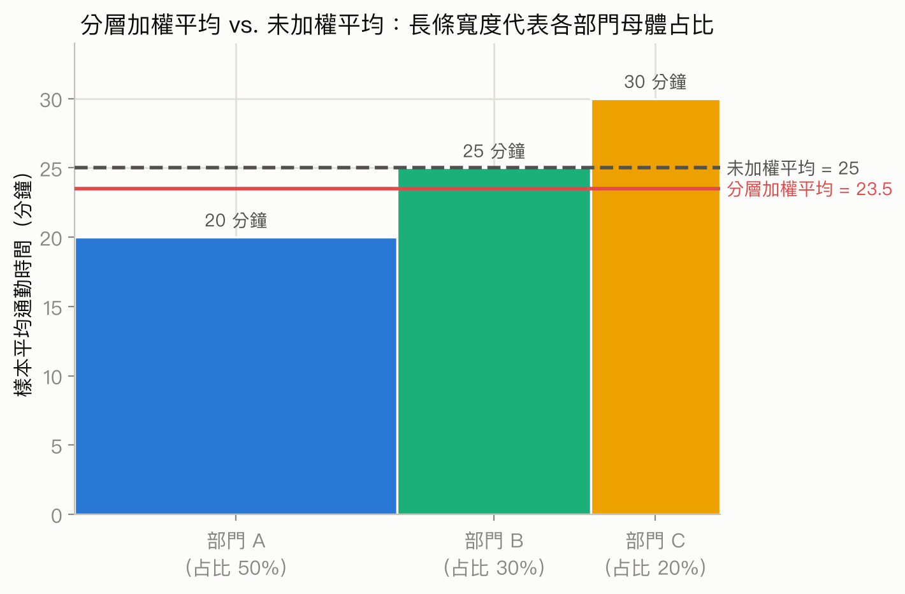

# 第 2 章：抽樣與實驗設計

## 為什麼要學這一章

假設你想知道「全校學生每週運動幾小時」。問完健身房門口的 100 人，平均是 6 小時。算術也許完全正確，結論卻很可能錯：被問到的人並不能代表全校。

統計結論不只取決於怎麼算，也取決於**資料怎麼來** 。本章處理兩種不同任務：

- **抽樣(sampling)** ：從一個母體選出部分個體，目的是描述或估計母體。
- **實驗(experiment)** ：主動施加處置並比較結果，目的是研究因果效果。

好的抽樣讓「樣本能否代表母體」較有依據；好的隨機實驗讓「結果差異是否由處置造成」較有依據。兩種隨機化解決的是不同問題，不能互相替代。

## 先備檢查

開始前，你應能分辨：

- **個體(individual)** ：資料描述的人或物。
- **變數(variable)** ：在個體上記錄的特徵。
- **母體(population)** ：研究問題所關心的全部個體。
- **樣本(sample)** ：實際被觀察的一部分個體。
- **母數(parameter)** ：描述母體的固定但通常未知數值。
- **統計量(statistic)** ：由樣本計算出的數值。

若母體是「本學期全校 12,000 名學生」，從中調查 400 人，則 12,000 人是母體、400 人是樣本；全校平均運動時數是母數，400 人的平均運動時數是統計量。

## 學習目標

完成本章後，你將能：

1. 由研究問題界定目標母體、抽樣框與樣本。
2. 說明簡單隨機抽樣與分層隨機抽樣如何執行、何時適用。
3. 區分抽樣偏誤與機會誤差，並判斷增加樣本數能改善哪一種問題。
4. 區分觀察研究與實驗，找出潛在混淆變數。
5. 解釋對照、隨機分派、重複與盲法在實驗中的作用。
6. 判斷一項研究可以推廣到誰，以及能否支持因果結論。

## 1. 從研究問題到可抽取的名單

### 1.1 三個範圍不要混在一起

一份抽樣研究至少包含三個範圍：

| 範圍 | 定義 | 校園運動時數例子 |
|---|---|---|
| 目標母體(target population) | 想把結論推廣到的全部個體 | 本學期全校在學生 |
| 抽樣框(sampling frame) | 實際用來抽人的名單或機制 | 教務處在學名冊 |
| 樣本(sample) | 最後取得資料的個體 | 被抽中且完成問卷的學生 |

理想上，抽樣框應完整涵蓋目標母體，且不包含母體外的人。但現實中可能漏掉剛入學、休學狀態更新較慢或沒有網路帳號的人，這叫**涵蓋不足(undercoverage)** 。

**非例子：** 把「社群網站上看到問卷並自願作答的人」稱為全校學生的隨機樣本。每位學生被納入的機會未知，而且願意回答的人可能本來就對運動更有興趣。

### 自我檢查 1

研究者想了解某城市所有成年居民的通勤時間，卻只從汽車牌照登記名單抽人。哪一群人可能未被抽樣框涵蓋？

查看答案

沒有登記汽車的成年人，例如只搭大眾運輸、騎車或步行者。若他們的通勤時間系統性不同，就可能產生涵蓋不足偏誤。

## 2. 機率抽樣：讓抽取規則可知

### 2.1 簡單隨機抽樣

若母體有 $N$ 個個體，要抽出 $n$ 個，**簡單隨機抽樣(simple random sample, SRS)** 要求每一組大小為 $n$ 的可能樣本都有相同被抽中機會。

實作方式可以是：替抽樣框中的每人編號，用電腦產生不重複的隨機號碼，再聯絡對應個體。關鍵是由隨機機制決定，而不是由研究者挑「看起來典型」的人。

在不放回的 SRS 中，每一個個體被納入樣本的機率為

$$
P(\text{個體被納入})=\frac{n}{N}.
$$

| 符號 | 意義 | 單位與限制 |
|---|---|---|
| $N$ | 抽樣框中的個體總數 | 個體數，正整數 |
| $n$ | 抽出的不同個體數 | 個體數，且 $1\le n\le N$ |

這個式子描述的是**單一個體的納入機率** ，不是「某一組樣本」的機率，也不保證抽出的樣本在每個特徵上都恰好與母體相同。隨機抽樣仍會有機會造成的差異。

**何時用：** 有品質良好的完整名單，而且不需要保證小型子群都有足夠樣本時。

**何時不用：** 若重要但人數少的子群可能抽不到，考慮下一節的分層抽樣。若只是每隔固定人數抽一人，則是系統抽樣，不是本章定義的 SRS。

### 2.2 分層隨機抽樣

若已知某些子群彼此不同，而且每個子群都必須被代表，可以先依重要特徵把母體分成互不重疊的**層(strata)** ，再於每一層內各自隨機抽樣。這叫**分層隨機抽樣(stratified random sampling)** 。

例如，學校可能先按大學部與研究所分層，再分別抽樣。若各層內的人較相似、層與層之間差異明顯，分層也可能提高估計精確度。

若第 $h$ 層占母體比例 $W_h=N_h/N$，該層樣本平均為 $\bar{x}_h$，則母體平均的分層估計為

$$
\bar{x}_{\mathrm{str}}=\sum_{h=1}^{H}W_h\bar{x}_h,
\qquad W_h=\frac{N_h}{N},
\qquad \sum_{h=1}^{H}W_h=1.
$$

| 符號 | 意義 | 單位與限制 |
|---|---|---|
| $H$ | 層的數目 | 無單位的正整數 |
| $N_h$ | 第 $h$ 層母體人數 | 個體數，各層不能重疊 |
| $W_h$ | 第 $h$ 層的母體權重 | 無單位，介於 0 與 1 |
| $\bar{x}_h$ | 第 $h$ 層樣本平均 | 與測量變數相同單位 |
| $\bar{x}_{\mathrm{str}}$ | 加權後的整體平均估計 | 與測量變數相同單位 |

假設全校 75% 是大學部、25% 是研究生；兩層樣本平均運動時數分別為 4 與 6 小時／週。即使研究者在兩層各抽 100 人，整體估計也應按母體占比計算：

$$
0.75(4)+0.25(6)=4.5\text{ 小時／週}。
$$

直接平均兩層的樣本平均會得到 5 小時／週，等於錯把兩層當成各占母體一半。加權結果必須落在各層平均的最小值與最大值之間；這裡 4.5 確實介於 4 與 6。

**何時用：** 各個重要層的母體大小已知，且希望每層有足夠代表。

**何時不用：** 事後看到結果才任意分組，或各層會重疊。若抽的是整群單位(例如隨機抽 5 個班後調查班上所有人)，那是叢集抽樣，不是分層抽樣。

### 自我檢查 2

一家公司從每個部門各隨機抽 20 人，目標是估計全公司的平均通勤時間。大部門有 800 人，小部門只有 40 人。可否直接平均各部門的樣本平均？

查看答案

通常不可以。各部門在母體中的占比不同，應以部門人數占全公司人數的比例加權；否則小部門會被過度代表。

## 3. 偏誤與機會誤差是兩件事

重複用同一抽樣方法抽樣，統計量不會每次都相同。評估誤差時要分清：

- **抽樣變異／機會誤差(sampling variability / chance error)** ：隨機抽樣恰巧抽到不同個體造成的波動。長期而言可能高估，也可能低估。
- **偏誤(bias)** ：抽樣或測量程序使結果傾向某一方向，長期重複仍系統性偏離真值。

增加隨機樣本數通常能降低機會誤差，卻不會自動修正偏誤。用網路自願問卷收集 10 萬份回答，仍可能是「非常精確地估錯」。

### 3.1 常見偏誤來源

| 來源 | 發生方式 | 例子 | 可行改善 |
|---|---|---|---|
| 涵蓋不足 | 抽樣框漏掉部分母體 | 只用市話名冊調查所有成人 | 改善或合併抽樣框 |
| 自願回應偏誤(voluntary response bias) | 是否參與由個人自行決定 | 新聞網站即時投票 | 從明確抽樣框隨機邀請 |
| 無回應偏誤(nonresponse bias) | 被抽中者未回應，且與回應者系統性不同 | 夜班工作者較難接電話 | 多時段追訪並分析回應差異 |
| 回應／測量偏誤(response/measurement bias) | 問法、訪員或儀器影響答案 | 「你是否也支持這項合理政策？」 | 中性措辭、校準工具、保護匿名性 |

偏誤談的是程序的長期傾向，不是單次結果「剛好不準」。一個妥善執行的 SRS 也可能碰巧抽到平均年齡較高的樣本，這首先是機會誤差，不足以證明抽樣方法有偏誤。

### 自我檢查 3

一項有誘導措辭的線上自願問卷把回應數從 500 增加到 50,000。最大的改變是什麼？

查看答案

隨機波動可能變小，但自願回應與誘導措辭造成的偏誤仍存在。大量樣本不等於代表性樣本。

## 4. 觀察研究與實驗回答不同強度的問題

### 4.1 觀察研究

在**觀察研究(observational study)** 中，研究者觀察個體原本的暴露或行為，不主動分派處置。例如比較自行選擇喝咖啡與不喝咖啡者的睡眠時間。

觀察研究可以發現**關聯(association)** ，但單靠關聯通常不能確認因果。兩群人除了咖啡習慣，還可能在工時、壓力、年齡等方面不同。

同時與解釋變數及結果變數有關，使兩者效果糾纏不清的第三個變數，稱為**混淆變數(confounding variable)** 。例如高工時可能增加咖啡攝取，也減少睡眠；若未妥善處理，就難以把睡眠差異歸因於咖啡。

**非例子：** 「觀察研究一定沒有價值。」當實驗不道德或不可行時，觀察研究可能是唯一合理設計，也能提供重要預測與關聯證據；限制在於因果解釋需要更多假設與佐證。

### 4.2 實驗與處置

在**實驗(experiment)** 中，研究者主動把某種條件分派給研究單位。被施加的條件稱為**處置(treatment)** ，接受處置的人或物稱為**實驗單位(experimental unit)** ；若是人，也常稱參與者(participant)或受試者(subject)。

若研究者讓參與者自行選擇要不要接受處置，即使提供了處置，也沒有完成隨機分派，自我選擇仍可能造成混淆。

## 5. 隨機對照實驗的核心邏輯

一個設計良好的**隨機對照實驗(randomized controlled experiment)** 通常包含：

1. **比較／對照(comparison/control)** ：至少有兩個條件，例如新療法與現行療法或安慰劑。
2. **隨機分派(random assignment)** ：用機會機制決定各實驗單位接受哪個處置。
3. **重複(replication)** ：每個處置施加於足夠多個彼此獨立的實驗單位，以看出處置差異是否超過個體波動。
4. **盡量固定其他條件** ：除處置外，各組接受相同追蹤與測量程序。

隨機分派不是保證兩組在每個特徵上完全相同。它的價值是讓已知與未知的潛在混淆因素在長期重複實驗中沒有系統性偏向某組，並提供量化「純機會造成組間差異」的基礎。

因此，若實驗執行良好、流失與違規沒有破壞比較，而且觀察到的組間差異大到難以用隨機分派解釋，就較有理由把差異歸因於處置。第 8 章會正式學習如何用顯著性檢定量化這個判斷。

### 5.1 安慰劑效應與盲法

**安慰劑(placebo)** 是外觀與處置相似、但不含研究中活性成分的對照條件。參與者因為相信自己接受治療而產生的反應稱為**安慰劑效應(placebo effect)** 。

**盲法(blinding)** 用來降低期待影響：

- 單盲通常表示參與者不知道自己在哪一組，但不同領域的用詞可能不同，研究報告應直接說明誰不知道。
- 雙盲通常表示參與者與直接接觸、評估結果的研究人員都不知道分組。

盲法與隨機分派作用不同：隨機分派主要處理組間混淆；盲法主要降低期待、照護方式或結果判讀造成的偏誤。外科手術、教育方案等研究不一定能對執行者或參與者設盲，此時可讓結果評估者不知道分組，並使用客觀量測。

### 5.2 隨機抽樣不等於隨機分派

| 隨機化 | 隨機抽樣(random sampling) | 隨機分派(random assignment) |
|---|---|---|
| 發生時點 | 從母體選人進研究 | 研究樣本進入後分到各處置 |
| 主要目的 | 降低選樣偏誤、支持母體推廣 | 平衡混淆、支持因果比較 |
| 解答問題 | 結果可推廣到誰？ | 處置是否造成結果差異？ |

由此可得到四種常見情況：

| 設計 | 對目標母體推廣 | 因果推論 |
|---|---|---|
| 隨機抽樣 + 隨機分派 | 較有依據 | 較有依據 |
| 隨機抽樣 + 無隨機分派 | 較有依據 | 通常不足 |
| 非隨機樣本 + 隨機分派 | 對相似於參與者者需審慎 | 對研究參與者的處置比較較有依據 |
| 非隨機樣本 + 無隨機分派 | 通常不足 | 通常不足 |

「較有依據」仍不是無條件保證。無回應、失訪、處置不遵從、測量偏誤，以及研究情境與真實世界不同，都會限制結論。

### 自我檢查 4

研究者在自願報名的 200 名成年人中，隨機分派一半使用新健身程式、一半使用舊程式。這項研究最強的結論是什麼？

查看答案

若其他設計與執行良好，兩組結果差異可支持程式對這些參與者的因果效果；但因參與者不是從所有成年人中隨機抽樣，不能不加限制地推廣到所有成年人。

## 6. 區組設計：先比相似者，再隨機分派

有時實驗單位在某個已知特徵上差異很大。可先依該特徵分成相似的**區組(blocks)** ，再在每個區組內隨機分派處置，稱為**隨機區組設計(randomized block design)** 。例如先依疾病嚴重度分層，再在每一嚴重度內隨機分派兩種療法。

區組與分層外形相似，但目的不同：分層抽樣是在母體中選樣本，以改善代表性或估計精確度；區組設計是在實驗樣本中分派處置，以降低與處置比較無關的個體差異。

若同一人依序接受兩種處置，或依關鍵特徵配成非常相似的一對後分派不同處置，則是**配對設計(matched-pairs design)** ，可視為每個區組只有一對實驗單位的特殊區組設計。使用順序式處置時還需警惕殘留效果與順序效果。

## 7. 一張圖讀懂研究設計

看到研究敘述時，依序問：

1. **目標是描述母體，還是比較處置的因果效果？**
2. **目標母體、抽樣框與實際樣本各是誰？**
3. **誰決定接受什麼條件？** 自然發生或自行選擇是觀察研究；研究者主動分派才是實驗。
4. **有沒有隨機抽樣？** 這主要關乎推廣範圍。
5. **有沒有隨機分派？** 這主要關乎因果推論。
6. **有沒有對照、重複、盲法，以及一致的測量方式？**
7. **無回應、失訪、不遵從或混淆可能把結果推向哪裡？**

## 章末整合

本章的主線可濃縮成兩句話：

- **要描述母體，先問樣本怎麼選。** 機率抽樣讓納入規則清楚；大樣本主要減少機會誤差，不能消除壞程序造成的偏誤。
- **要談因果，先問處置怎麼分。** 觀察研究能顯示關聯；隨機對照實驗藉由比較與隨機分派，使因果解釋更可信。

抽樣與分派都可能使用亂數，但前者連接「母體到樣本」，後者連接「樣本到處置組」。記住這兩條箭頭，就不容易把代表性與因果性混為一談。

## 公式與術語速查

| 項目 | 核心意思 |
|---|---|
| SRS 個體納入機率 | $n/N$；每個個體機會相同只是 SRS 的必要結果，完整定義要求每組大小為 $n$ 的樣本等可能 |
| 分層加權平均 | $\bar{x}_{\mathrm{str}}=\sum W_h\bar{x}_h$，權重應反映各層母體占比 |
| 偏誤 | 程序造成長期系統性偏離；增加樣本數不保證消除 |
| 機會誤差 | 隨機抽到不同個體造成的樣本間波動；通常隨樣本數增加而減少 |
| 觀察研究 | 不由研究者分派暴露或處置，主要支持關聯描述 |
| 混淆 | 第三變數使解釋變數與結果的效果糾纏 |
| 隨機抽樣 | 從母體選樣本，主要支持推廣 |
| 隨機分派 | 把實驗單位分到處置，主要支持因果比較 |
| 安慰劑與盲法 | 控制期待與判讀造成的影響，不能替代隨機分派 |
| 區組 | 先把相似實驗單位放一起，再於區組內隨機分派 |

## 累積檢查

某大學想比較兩種讀書提醒 App。研究者在圖書館招募 120 名自願者，先按年級分組，再於每個年級內隨機分派 App A 或 App B。四週後，用系統紀錄的讀書分鐘數比較兩組。

請先自行回答：

1. 這是觀察研究還是實驗？
2. 年級在設計中扮演什麼角色？
3. 哪個設計元素最支持因果推論？
4. 結果能否直接推廣到全校所有學生？
5. 系統紀錄相較於請學生回想時數，主要減少哪類問題？

查看答案

1. 是實驗，因為研究者分派 App。
2. 年級是區組變數；研究者在每個年級內隨機分派。
3. 隨機分派，加上對照比較與一致測量，最支持處置的因果比較。
4. 不能直接推廣。樣本是圖書館自願者，不是全校學生的隨機樣本，可能較常讀書或較願意使用 App。
5. 主要減少回憶錯誤與社會期許造成的測量／回應偏誤，但系統本身仍需正確記錄。

## 前後章連結

- 前置：[第 1 章：描述統計與資料探索](01-descriptive-statistics.md)提供描述樣本的圖表與統計量；本章進一步判斷這些資料能代表誰。
- 下一章：[第 3 章：機率](03-probability.md)會建立隨機抽樣、隨機分派與機會誤差背後的機率語言。
- 後續：[第 5 章：抽樣分配與中央極限定理](05-sampling-distributions-clt.md)會量化統計量在重複抽樣下的波動；[第 8 章：顯著性檢定](08-significance-tests.md)會量化實驗組間差異是否可能只由機會造成。

## 練習與逐步詳解

以下題目不是把上面例子的數字換掉後照抄公式；每題先判斷「問題屬於哪個環節」(抽樣框、抽樣方法、偏誤與機會誤差、觀察研究與實驗、隨機分派或區組)，再進行選擇或計算。建議先自行作答，再展開詳解。

### 題 2-1：抽樣框涵蓋不足，還是自願回應？

**題目 ID：** `m02-frame-vs-voluntary-01`
**類型：** 概念選擇題
**難度：** 基礎

市政府想了解全市成年居民對新公車路線的看法，於是把問卷連結公布在市府官網首頁，任何瀏覽者都能自由填寫並轉發給親友。這個做法最主要的問題是？

A. 自願回應偏誤：是否填答由瀏覽者自行決定，較關心公車議題的人更可能填答
B. 無回應偏誤：被抽中的居民有一部分沒有回覆問卷
C. 涵蓋不足：抽樣框沒有包含所有居民
D. 回應／測量偏誤：問卷題目的措辭引導受訪者

答案與診斷回饋

**答案：A。** 沒有任何名單先界定誰是「被抽中的人」，是否填答完全由瀏覽者自行決定，且問卷可再被轉發，這正是自願回應偏誤的典型樣態。

- **B 的迷思：把自願參與誤當成既定樣本的無回應。** 無回應偏誤的前提是先有一份明確被抽中的名單，其中部分人沒有回覆；本題從未指定任何被抽中對象，任何人都能自行選擇是否填答。
- **C 的迷思：只關注抽樣框是否涵蓋所有居民，忽略了「誰選擇填答」才是本題核心。** 即使涵蓋良好，是否作答仍取決於個人意願與轉發擴散，這是自願回應的問題，不是抽樣框漏掉誰。
- **D 的迷思：把問題歸咎於題目措辭，但題目沒有提供任何具體字句可判斷用語是否中立。** 忽略了徵集方式本身(開放連結、自由轉發)才是題目描述的重點。

這一題對應第 3.1 節「常見偏誤來源」表格中的自願回應偏誤與無回應偏誤兩列，重點在分辨兩者發生的前提是否存在既定名單。

### 題 2-2：五個學院人數差異極大，該怎麼抽？

**題目 ID：** `m02-srs-vs-stratified-01`
**類型：** 方法選擇題
**難度：** 基礎

某大學有五個學院，人數差異極大，從 200 人到 8,000 人不等。研究者想確保每個學院都有足夠樣本可分別比較滿意度，同時仍要估計全校平均滿意度。最適合的抽樣方法是？

A. 簡單隨機抽樣：直接對全校學生名單做一次 SRS
B. 分層隨機抽樣：先依學院分層，再於各層內個別做隨機抽樣
C. 系統抽樣：把全校名單依固定間隔(例如每 20 人)抽 1 人
D. 集群抽樣：隨機抽出 2 個學院，調查這兩個學院的所有學生

答案與診斷回饋

**答案：B。** 分層可確保人數最少的學院也單獨獲得樣本，同時各層仍用隨機機制抽樣，兼顧代表性與可比較性。

- **A 的迷思：把「全校樣本數夠大」等同於「每個子群樣本數都夠」。** SRS 不保證只有 200 人的學院能被抽到足夠人數，甚至可能一人都沒抽到，無法分別比較。
- **C 的迷思：把「固定間隔挑選」誤認為與隨機抽樣等價。** 系統抽樣的納入機制不是每個大小為 $n$ 的樣本都等機率，且本題要求「每個學院都能分別比較」，系統抽樣不會特別確保這件事。
- **D 的迷思：把「先隨機抽出幾個群體、再普查群內所有人」誤認為「先分層、再各層內抽樣」。** 集群抽樣只調查中選的 2 個學院，其餘 3 個學院完全沒有機會被納入，與「每個學院都要能分別比較」的要求矛盾。

對照第 2.1、2.2 節：本題的重點特徵——子群大小差異大、且都需要被代表——正是分層抽樣「何時用」的典型情境。

### 題 2-3：把樣本數放大十倍，改善了什麼？

**題目 ID：** `m02-bias-vs-chance-error-01`
**類型：** 概念選擇題
**難度：** 基礎

一項產品滿意度調查一開始用自願網路問卷回收 800 份；研究者不改變招募方式，只是延長問卷開放時間，最後回收到 8,000 份。哪一項最準確描述這個改變的效果？

A. 機會誤差與偏誤都會消失，因為樣本變大了
B. 偏誤會消失，但機會誤差不變
C. 機會誤差可能變小，但自願回應造成的偏誤不會因樣本變大而消除
D. 機會誤差與偏誤都會變大，因為更多不同的人參與

答案與診斷回饋

**答案：C。** 樣本數變大通常讓隨機波動變小，但招募方式(自願回應)沒有改變，偏誤仍然存在。

- **A 的迷思：把「樣本數變大」等同於「自動修正抽樣程序的系統性問題」。** 招募方式沒有改變，願意主動填答者的特徵傾向仍然一樣。
- **B 的迷思：把機會誤差與偏誤的性質對調。** 機會誤差才是通常隨樣本數增加而縮小的部分；偏誤是程序造成的長期系統性偏離，不會因為樣本數變大而自動消失。
- **D 的迷思：假設「人數變多就代表誤差全面惡化」。** 事實上隨機波動通常隨樣本數增加而縮小；樣本數變大主要留下的疑慮是代表性(偏誤)，不是兩種誤差同時變大。

呼應第 3 節：「增加隨機樣本數通常能降低機會誤差，卻不會自動修正偏誤。」

### 題 2-4：計算 SRS 納入機率與社團的期望抽中人數

**題目 ID：** `m02-srs-inclusion-probability-01`
**類型：** 計算題
**難度：** 中等

某年級共有 $N=360$ 名學生，教務處採不放回簡單隨機抽樣，抽出 $n=45$ 人填寫問卷。

(a) 求每位學生被抽中的機率。
(b) 已知這 360 人中有一個 30 人的社團，抽樣機制預期會抽中這個社團多少人？

逐步詳解

1. **辨認已知量。** 母體 $N=360$ 人，樣本 $n=45$ 人；社團人數 30 人，是母體的一個子集合，無測量單位(皆為人數)。
2. **選擇方法。** (a) 使用[SRS 個體納入機率公式](#formula-ch02-srs-sample-inclusion-probability)；(b) 因為 SRS 下每個人被納入的機率相同，子群的期望抽中人數等於「子群人數 $\times$ 個體納入機率」(期望值具可加性，不需要子群成員彼此獨立這個額外假設)。
3. **檢查條件。** 抽樣為不放回 SRS，且抽樣機制沒有針對這個社團另外調整權重，可視社團的 30 人與其餘 330 人適用相同的納入機率。
4. **代入計算。**

   $$
   P(\text{個體被納入})=\frac{n}{N}=\frac{45}{360}=0.125.
   $$

   社團期望抽中人數 $=30\times0.125=3.75$ 人。
5. **情境解讀。** 每位學生被抽中的機率是 12.5%；平均而言，這個 30 人社團預期約有 3.75 人會被抽到問卷。
6. **合理性檢查。** $0.125$ 落在 0 與 1 之間；$3.75$ 介於 0 與 30 之間，且等於社團人數乘以全校抽樣比例，量級合理。但這只是期望值，並不保證——實際某一次抽樣可能抽到 0 人到 30 人中的任何結果，這也呼應第 2.1 節「SRS 不保證每個子群都恰好按比例被抽到」的提醒。

**答案：** 每位學生被抽中的機率為 12.5%；該 30 人社團期望抽中約 3.75 人(實際次數可能是 0 到 30 之間的任何整數)。

### 題 2-5：計算三個部門的分層加權平均

**題目 ID：** `m02-stratified-weighted-mean-01`
**類型：** 計算題
**難度：** 中等

某公司有三個部門，占全公司人數比例分別為 50%、30%、20%。研究者在各部門內各自抽樣後，得到平均通勤時間分別為 20 分鐘、25 分鐘、30 分鐘。求全公司平均通勤時間的分層估計，並與直接平均三個部門樣本平均的結果比較。

逐步詳解

1. **辨認已知量。** 三層權重 $W_1=0.50$、$W_2=0.30$、$W_3=0.20$(依部門人數占全公司比例，三者加總為 1)；各層樣本平均 $\bar{x}_1=20$、$\bar{x}_2=25$、$\bar{x}_3=30$ 分鐘。
2. **選擇方法。** 使用[分層加權平均公式](#formula-ch02-stratified-weighted-mean)，以母體占比加權，而不是直接對三個部門的樣本平均取算術平均。
3. **檢查條件。** 三個部門互不重疊、沒有遺漏；權重反映的是母體(部門)人數占比，不是各部門抽出的樣本人數占比。
4. **代入計算。**

   $$
   \bar{x}_{\mathrm{str}}=0.50(20)+0.30(25)+0.20(30)=10+7.5+6=23.5\text{ 分鐘}.
   $$

   直接平均三個部門的樣本平均：$(20+25+30)/3=25$ 分鐘。
5. **情境解讀。** 全公司平均通勤時間的分層估計為 23.5 分鐘。直接平均得到的 25 分鐘，等於把三個部門都當成各占三分之一，忽略了占比最高(50%)的部門通勤時間其實最短，因而高估了全公司平均。
6. **合理性檢查。** 23.5 介於各層平均的最小值 20 與最大值 30 之間，符合加權平均應落在此範圍內的原則；且 23.5 比未加權的 25 更靠近權重最大(50%)那一層的平均(20 分鐘)，方向正確。

**答案：** 分層估計為 23.5 分鐘；直接平均(不加權)會得到 25 分鐘，因未反映部門人數占比而高估全公司平均通勤時間。

*圖：三個部門依母體占比加權後，分層加權平均(23.5 分鐘)低於未加權平均(25 分鐘)，因為占比最大(50%)的部門通勤時間最短，未加權平均等於錯把它當成只占三分之一。資料來源：模擬(沿用題 2-5 之數據)。重新產生：`uv run course/figures/scripts/02-stratified-weighted-mean.py`*

### 題 2-6：重訓與骨密度的關聯能直接當成因果嗎？

**題目 ID：** `m02-confounding-01`
**類型：** 解讀題
**難度：** 中等

觀察資料顯示，每週固定重量訓練的成年人骨密度明顯高於不訓練者。研究者據此建議所有中年人應立即開始重訓以提升骨密度。這個建議最主要的問題是？

A. 樣本數不足，應該擴大調查人數
B. 應該先做統計顯著性檢定，只要 p 值夠小就能確立這個建議
C. 應該畫散佈圖確認骨密度與訓練時間是否為線性關係
D. 可能存在混淆變數(如年齡、荷爾蒙狀況、原本骨骼健康)，同時影響是否規律訓練與骨密度，使觀察到的關聯不足以確立因果方向

答案與診斷回饋

**答案：D。** 這是觀察研究：是否重訓由參與者自己選擇，其他與訓練意願、骨骼健康都有關的因素可能同時影響兩個變數，使關聯無法直接解釋成因果。

- **A 的迷思：把問題歸咎於估計的精確度。** 即使樣本再大、關聯估計再穩定，觀察研究本身仍可能有混淆，無法單靠增加人數排除因果方向錯誤或第三變數解釋。
- **B 的迷思：把統計顯著性等同於因果確立。** 即使關聯的 p 值很小，也只顯示這個關聯不太可能單純是機會造成，並不能排除混淆變數；第 8 章會進一步討論顯著性檢定能回答什麼、不能回答什麼。
- **C 的迷思：把「確認關聯的函數形式(是否線性)」誤當成「確認關聯是否為因果」。** 不論關聯的圖形是線性或非線性，觀察研究都無法只靠關聯本身排除第三變數。

對應第 4.1 節：「觀察研究可以發現關聯，但單靠關聯通常不能確認因果」，以及混淆變數的定義。

### 題 2-7：隨機抽樣與隨機分派，各支持什麼結論？

**題目 ID：** `m02-sampling-vs-assignment-01`
**類型：** 解讀題
**難度：** 中等

研究者從某醫院所有「自願參加研究」的糖尿病患者中，隨機分派一半使用新藥、一半使用安慰劑，並追蹤血糖變化。哪一項陳述最準確？

A. 因為有隨機分派，這個研究的結果可以直接推廣到所有糖尿病患者
B. 因為參與者不是隨機抽樣得來，這個研究完全沒有參考價值
C. 隨機分派讓組間比較較能支持對這些參與者的因果效果，但推廣到所有糖尿病患者需要謹慎
D. 這屬於觀察研究，因此只能看出用藥與血糖的關聯，不能談因果

答案與診斷回饋

**答案：C。** 這符合第 5.2 節「非隨機樣本 + 隨機分派」的情況：對參與者本身的因果比較較有依據，但推廣到所有糖尿病患者需要審慎。

- **A 的迷思：把隨機分派(解決組間混淆、支持因果推論)誤當成隨機抽樣(解決推廣範圍)。** 兩種隨機化解決不同問題，不能互相替代；本題參與者是自願參加，不是從所有糖尿病患者中隨機抽樣。
- **B 的迷思：把「推廣需要謹慎」誇大成「研究完全沒有參考價值」。** 即使樣本非隨機抽樣得來，隨機分派仍能為這些參與者本身提供較可信的因果比較。
- **D 的迷思：把「參與者自願參加研究」誤認為「研究者沒有主動分派處置」。** 本題研究者主動把新藥或安慰劑分派給病人，這是實驗，不是觀察研究；自願參加指的是加入研究的意願，不是誰決定用藥。

### 題 2-8：教學法實驗中，性別扮演什麼角色？

**題目 ID：** `m02-block-vs-stratum-01`
**類型：** 概念選擇題
**難度：** 基礎

研究者把 40 名參與者依性別分成兩組，再各自於組內隨機分派新舊兩種教學法，比較學習成效。性別在此設計中稱為什麼？

A. 分層變數：如同分層抽樣中的層
B. 區組變數：先讓相似的實驗單位放在一起，再於組內隨機分派處置
C. 混淆變數：性別已經和教學法糾纏在一起，難以分開效果
D. 處置變數：性別是這個實驗真正要比較的對象

答案與診斷回饋

**答案：B。** 這是隨機區組設計：先依性別分組讓組內個體更相似，再於組內隨機分派教學法。

- **A 的迷思：把區組設計誤認為分層抽樣。** 分層抽樣發生在抽樣階段，目的是從母體選出具代表性的樣本；本題是在已招募的實驗樣本中先分組、再分派處置，屬於區組設計，兩者發生的階段與目的不同(第 6 節有說明)。
- **C 的迷思：把「用來分組再隨機分派處置的特徵」誤認為混淆變數。** 正因為性別在組內被固定、且教學法在組內是隨機分派的，性別造成的差異才不會與教學法效果糾纏在一起，這正是區組設計用來避免混淆的做法。
- **D 的迷思：把分組用的特徵誤當成研究者真正想比較的處置。** 本題要比較的處置是新舊兩種教學法；性別只是用來讓組內個體更相似的區組變數，不是實驗要評估的處置本身。

## 跨章比較與選法

本章決定資料是怎麼來的（抽樣設計、實驗設計），這是後面所有推論方法能不能使用、以及可以推論到什麼範圍的前提，因此本節不新增比較表，而是指出本章的設計選擇會在哪裡被重新用到：

- 「隨機抽樣」支持把樣本結果推廣到母體，這個推廣的不確定性由第 5 章的標準誤與第 7 章的信賴區間量化；「隨機分派」支持因果解釋，這個區別會在第 8 章比較兩獨立樣本與成對樣本、以及第 10 章判讀關聯是否等於因果時反覆用到。
- 本章的分層抽樣與集群抽樣提醒了「觀察值是否獨立」的問題；第 9 章介紹重抽樣方法時，會回頭說明重抽樣單位為何要對齊原始抽樣設計。

完整的跨章公式與方法對照，請見 [`concept-map.md`](../concept-map.md) 與 [`method-selector.md`](../method-selector.md)。

## 圖表補充

本章新增 1 張圖，插入於題 2-5「計算三個部門的分層加權平均」的詳解末尾：`course/figures/generated/02-stratified-weighted-mean.png`（腳本：`course/figures/scripts/02-stratified-weighted-mean.py`）。該圖以長條寬度呈現三個部門的母體占比(50%、30%、20%)、長條高度呈現各部門樣本平均通勤時間，並疊加分層加權平均(23.5 分鐘)與未加權平均(25 分鐘)兩條參考線，直接沿用題 2-5 的數據，具體呈現「未加權平均忽略母體占比而高估」這個本章反覆強調的重點。其餘章節內容(抽樣框、機率抽樣規則、偏誤來源、觀察研究與實驗、隨機分派、區組設計)以流程、定義與判準為主，沒有可對應繪製的數值分布或比較，因此未強加圖表，以文字與表格呈現已足夠清楚。
