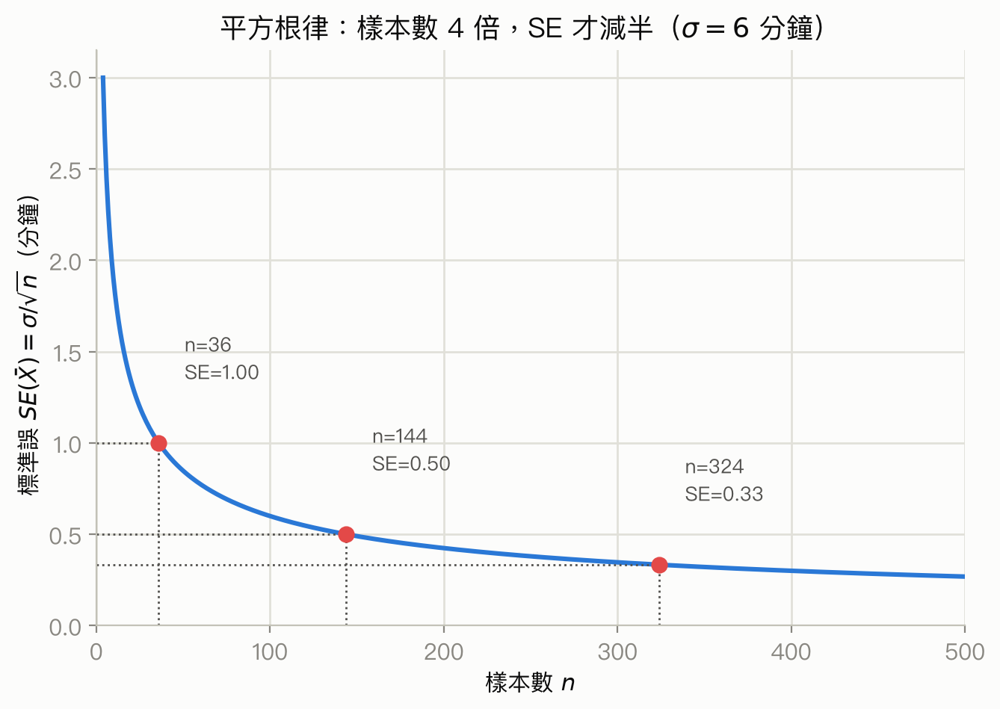
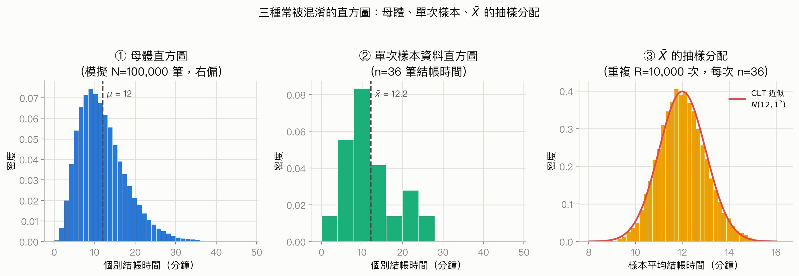

# 第 5 章：抽樣分配與中央極限定理

## 為什麼要學這一章

同一所大學若隨機抽 100 位學生詢問每週運動時間，第一次可能得到平均 3.1 小時，第二次可能是 3.4 小時。哪一個才對？其實兩者都可能是正確的樣本結果。抽樣帶有隨機性，所以統計量會隨樣本改變。

本章關心的不是「某一次抽到什麼」，而是：**如果用同一方法反覆抽樣，統計量會如何變動？** 掌握這個分配，才能衡量抽樣誤差，也才能理解後續的信賴區間與顯著性檢定。

## 先備觀念檢查

開始前，請確認你能：

- 分辨母體與樣本，並說明隨機抽樣為何重要。
- 計算平均數、比例與標準差。
- 認出常態分配，並將數值標準化為 z 分數。
- 理解機率分配描述隨機變數所有可能值及其機率。

若「樣本如何產生」仍不清楚，先回看[第 2 章：抽樣與實驗設計](02-sampling-and-experiments.md)；若需要複習常態曲線與 z 分數，回看[第 4 章：常態近似與二項分配](04-normal-and-binomial.md)。

## 學習目標

完成本章後，你將能：

1. 分辨參數、統計量與估計量，並使用正確符號。
2. 說明統計量的抽樣分配，以及它的中心、散布與形狀。
3. 計算樣本平均數、樣本總和與樣本比例的期望值及標準誤。
4. 用平方根律解釋樣本數如何影響隨機誤差。
5. 分辨母體分配、單次樣本的資料分配與抽樣分配。
6. 分別陳述大數法則與中央極限定理，判斷它們何時可用。
7. 辨認獨立性、隨機抽樣與有限母體修正等適用條件。

## 5.1 參數、統計量與抽樣變動

### 從一次民調開始

假設全校有 10,000 位學生，其中真正支持延長圖書館開放時間的比例是 62%。這個 62% 是固定的，但通常未知。若每次隨機訪問 100 人，樣本支持率可能是 58%、64% 或 61%。會變的是樣本結果，不是同一時刻的母體真值。

### 定義與符號

- **參數(parameter)** ：描述整個母體的固定數值，通常未知。例如母體平均數 $\mu$、母體標準差 $\sigma$、母體比例 $p$。
- **統計量(statistic)** ：只由樣本資料算出的數值，是隨機變數。例如樣本平均數 $\bar X$、樣本標準差 $S$、樣本比例 $\hat p$。
- **估計量(estimator)** ：用來估計參數的規則；例如「取樣本平均」這個規則 $\bar X$ 用來估計 $\mu$。
- **估計值(estimate)** ：規則套到某一次樣本後得到的數值；例如這次算出 $\bar x=3.1$ 小時。

大寫 $\bar X$ 強調「抽樣前會變動的統計量」；小寫 $\bar x$ 表示「已觀察到的特定數值」。本章討論抽樣分配時，主要使用大寫。

### 抽樣變動不等於偏誤

**抽樣變動(sampling variability)** 是統計量在不同隨機樣本間自然波動；即使抽樣設計完全正確也會出現。** 偏誤(bias)** 則是抽樣或測量方法讓結果長期系統性偏高或偏低。

非例：只在健身房門口調查運動時間，樣本再大也可能高估全校平均。中央極限定理能描述隨機波動，卻不能修復便利抽樣造成的偏誤。

**快速自我檢查**

某次抽樣得到平均睡眠 6.8 小時。這裡的 6.8 是參數、估計量還是估計值？若重新抽樣，它通常會完全相同嗎？

答案

6.8 小時是估計值；估計量是樣本平均數這個規則。重新抽樣後通常會不同。

## 5.2 抽樣分配：想像重複抽樣

### 一個思想實驗

固定以下程序：從同一母體隨機抽取 $n=100$ 人、計算 $\bar X$、放回並重複很多次。把每次得到的 $\bar X$ 畫成直方圖，長期形成的機率分配就是 $\bar X$ 的**抽樣分配(sampling distribution)** 。

抽樣分配描述的是「統計量的可能值」，不是單一樣本中每位受訪者的數值。分析一個抽樣分配時，要問三件事：

1. **中心** ：統計量平均落在哪裡？
2. **散布** ：不同樣本的結果通常相差多少？
3. **形狀** ：分配是否對稱、偏斜，或近似常態？

### 期望值與不偏性

**期望值(expected value)** 是隨機變數在相同機制下長期重複的加權平均。若估計量的期望值等於目標參數，就稱為** 不偏估計量(unbiased estimator)**。

#### 樣本平均數的期望值

若 $X_1,\ldots,X_n$ 來自相同母體，且每個觀測的母體平均數都是 $\mu$，則

$$
E(\bar X)=E\!\left(\frac{X_1+\cdots+X_n}{n}\right)=\mu.
$$

| 符號 | 意義 | 單位 |
|---|---|---|
| $X_i$ | 第 $i$ 個觀測值 | 與原資料相同 |
| $n$ | 樣本數 | 個數，無量綱 |
| $\bar X$ | 樣本平均數 | 與原資料相同 |
| $\mu$ | 母體平均數 | 與原資料相同 |
| $E(\bar X)$ | 所有可能樣本平均數的期望值 | 與原資料相同 |

這表示 $\bar X$ 長期而言對準 $\mu$，不是說每次都剛好等於 $\mu$。此結論需要每個觀測的平均數皆為 $\mu$；若抽樣機制系統性漏掉某類個體，這個條件可能不成立。

非例：不偏不代表誤差小。一個結果有時高很多、有時低很多，長期仍可能正好對準參數。

### 標準誤：統計量本身的標準差

**標準誤(standard error, SE)** 是某統計量抽樣分配的標準差。它回答：「若重複抽樣，這個統計量通常會變動多少？」

標準差(SD)描述個體資料的散布；標準誤(SE)描述統計量在樣本之間的散布。兩者可能單位相同，但對象不同。

**快速自我檢查**

「某班身高的 SD 是 8 公分」與「平均身高的 SE 是 1 公分」各描述什麼？

答案

8 公分描述學生個別身高相對平均的散布；1 公分描述用同樣樣本數反覆抽樣時，樣本平均身高的典型變動。

## 5.3 樣本平均數與總和的標準誤

### 為什麼平均後會比較穩定？

個別觀測的高低波動常會互相抵銷。只要觀測彼此獨立，將 $n$ 個變異數相加會得到 $n\sigma^2$，再除以平均數分母的平方 $n^2$，便得到 $\sigma^2/n$。因此平均數的標準差是 $\sigma/\sqrt n$，而不是 $\sigma/n$。

#### 樣本平均數的標準誤

若 $X_1,\ldots,X_n$ 相互獨立、來自相同分配，且母體標準差為有限的 $\sigma$，則

$$
SE(\bar X)=\sqrt{\operatorname{Var}(\bar X)}
=\sqrt{\frac{\sigma^2}{n}}
=\frac{\sigma}{\sqrt n}.
$$

| 符號 | 意義 | 單位 |
|---|---|---|
| $SE(\bar X)$ | 樣本平均數抽樣分配的標準差 | 與原資料相同 |
| $\sigma$ | 個體值的母體標準差 | 與原資料相同 |
| $\sigma^2$ | 個體值的母體變異數 | 原單位的平方 |
| $n$ | 相互獨立的觀測數 | 無量綱 |

**何時使用** ：目標是樣本平均數的抽樣波動，且可合理視為獨立同分配抽樣。若 $\sigma$ 未知，實務上常用樣本標準差 $s$ 得到**估計標準誤** $s/\sqrt n$；這是估計，不是已知的精確 SE。

**何時不要用** ：目標若是總和，應用下一個公式；若資料高度相依(例如同一人每日報酬或群聚抽樣)，直接套 $\sigma/\sqrt n$ 可能低估不確定性。

**量綱檢查** ：$\sqrt n$ 沒有單位，所以 SE 與平均數同單位。若算出平方小時，就表示把變異數與標準誤混淆了。

#### 例：平均結帳時間

某種交易的結帳時間母體平均為 12 分鐘，母體 SD 為 6 分鐘。若獨立抽取 36 筆交易：

$$
E(\bar X)=12\text{ 分鐘},\qquad
SE(\bar X)=\frac{6}{\sqrt{36}}=1\text{ 分鐘}.
$$

解讀：反覆抽取 36 筆交易時，各次平均結帳時間以 12 分鐘為中心，典型的樣本間波動約 1 分鐘。這不表示 36 筆中每筆只相差 1 分鐘；個別交易的 SD 仍是 6 分鐘。

#### 樣本平均數的標準化

若已知或可近似 $\bar X$ 的抽樣分配為常態，則

$$
Z=\frac{\bar X-\mu}{\sigma/\sqrt n}.
$$

這個 z 分數表示樣本平均數離母體平均數有幾個標準誤。分子與分母單位相同，因此 $Z$ 無單位。若母體標準差未知且以 $s$ 代替，後續小樣本推論通常要使用 t 分配，而不是假裝 $\sigma$ 已知；第 7、8 章會處理此差異。

#### 樣本總和的期望值與標準誤

令 $T=X_1+\cdots+X_n$。在相互獨立、同平均 $\mu$、同標準差 $\sigma$ 的條件下：

$$
E(T)=n\mu,\qquad SE(T)=\sigma\sqrt n.
$$

| 符號 | 意義 | 單位 |
|---|---|---|
| $T$ | $n$ 個觀測的總和 | 與原資料相同 |
| $E(T)$ | 總和的期望值 | 與原資料相同 |
| $SE(T)$ | 總和在重複抽樣間的標準差 | 與原資料相同 |

總和的**絕對** 波動隨 $\sqrt n$ 增加，但相對於期望總和 $n\mu$ 的波動通常縮小。不要把總和的 $\sigma\sqrt n$ 與平均數的 $\sigma/\sqrt n$ 混用。

### 平方根律與樣本數

由 $SE(\bar X)=\sigma/\sqrt n$ 可知：

- 樣本數乘以 4，SE 才會減半。
- 樣本數乘以 9，SE 變為原來的三分之一。
- 若想把 SE 乘上 $r$($0<r<1$)，樣本數要乘以 $1/r^2$。

這就是**平方根律(square-root law)** 。增加樣本有遞減效益，而且只能減少隨機誤差，不能消除選樣偏誤、測量錯誤或混雜。

*圖：以結帳時間例子的 $\sigma=6$ 分鐘為例，畫出 $SE(\bar X)=\sigma/\sqrt n$ 隨樣本數 $n$ 變化的曲線；標出 $n=36,144,324$ 對應 $SE=1,0.5,1/3$，呈現「樣本數要乘 4 倍，SE 才減半」的遞減效益。資料來源：示意圖（依平方根律公式計算，非觀測資料）。重新產生：`uv run course/figures/scripts/05-square-root-law.py`*

**快速自我檢查**

樣本數從 100 增加到 400，平均數的 SE 如何改變？若要讓 SE 降到原來的四分之一，樣本數應乘以多少？

答案

從 100 增至 400 時 SE 減半。要降到四分之一，樣本數須乘以 $4^2=16$。

## 5.4 樣本比例與百分比

### 0–1 指標把比例問題變成平均問題

對第 $i$ 人定義指標變數 $I_i$：具有某特徵時為 1，否則為 0。若母體中具有該特徵的比例是 $p$，則

$$
\hat p=\frac{I_1+\cdots+I_n}{n}.
$$

因此樣本比例其實是 0–1 資料的樣本平均數。單一指標的期望值為 $p$，變異數為 $p(1-p)$。

#### 樣本比例的期望值與標準誤

在 $n$ 次獨立、成功機率固定為 $p$ 的伯努利觀測下：

$$
E(\hat p)=p,\qquad
SE(\hat p)=\sqrt{\frac{p(1-p)}{n}}.
$$

| 符號 | 意義 | 單位 |
|---|---|---|
| $p$ | 母體比例或單次成功機率 | 比例，無量綱 |
| $\hat p$ | 樣本成功數除以 $n$ | 比例，無量綱 |
| $n$ | 獨立試驗或抽樣個數 | 無量綱 |
| $SE(\hat p)$ | 樣本比例的標準誤 | 比例，無量綱 |

**何時使用** ：二元結果、每次成功機率相同、觀測獨立。從有限母體不放回抽樣時，若抽樣比例很小，可近似使用；抽樣比例大時應考慮有限母體修正。

**何時不要用** ：若目標是成功「個數」而非比例，使用二項計數的 SD $\sqrt{np(1-p)}$；若各人的成功機率不同或資料成群相關，此簡式不再精確。

若以百分比點表示結果，將比例及其 SE 都乘以 100。例如 $SE(\hat p)=0.02$ 等於 2 個百分點，不是「2% 的相對誤差」。

#### 例：樣本支持率

若真實支持率 $p=0.60$，隨機抽取 $n=400$ 人：

$$
SE(\hat p)=\sqrt{\frac{0.60(0.40)}{400}}
=\sqrt{0.0006}\approx0.0245.
$$

也就是約 2.45 個百分點。若在 CLT 條件下觀察到 $\hat p=0.65$，它比真實比例高

$$
\frac{0.65-0.60}{0.0245}\approx2.04
$$

個標準誤。

**量級檢查** ：比例 SE 不可能是負數；當 $n$ 增加時應縮小。固定 $n$ 時，$p=0.5$ 產生最大的 SE，因此不知道 $p$ 時常用 0.5 做保守規劃。

### 有限母體修正

前述公式把觀測視為獨立。從大小為 $N$ 的有限母體做不放回簡單隨機抽樣時，抽到一人會稍微改變下一人被抽到的組成，因此需乘上**有限母體修正(finite population correction, FPC)** ：

$$
FPC=\sqrt{\frac{N-n}{N-1}},\qquad
SE_{\text{without replacement}}=SE_{\text{independent}}\times FPC.
$$

| 符號 | 意義 | 單位 |
|---|---|---|
| $N$ | 有限母體大小 | 個數 |
| $n$ | 不放回樣本數，$1\le n\le N$ | 個數 |
| $FPC$ | 有限母體修正因子 | 無量綱 |

當 $n/N\le 0.10$ 時，FPC 接近 1，常可忽略，這稱為 **10% 條件** 。若抽樣占母體很大比例，忽略 FPC 會高估 SE；若是放回抽樣或母體可視為無限，則不用 FPC。

**快速自我檢查**

樣本比例是 0.52、SE 是 0.03。用百分比報告時，應寫成 3% 還是 3 個百分點？若從 500 人中不放回抽 400 人，能忽略 FPC 嗎？

答案

應寫 3 個百分點。抽樣比例為 80%，不能忽略 FPC。

## 5.5 模擬與三種直方圖

電腦模擬可近似抽樣分配：先指定一個母體，反覆抽取相同大小的隨機樣本，每次保存統計量，最後觀察這些統計量的分布。模擬次數增加時，模擬直方圖會更穩定；但模擬近似的是「所設定模型下」的抽樣分配，不會自動讓錯誤模型變正確。

### 三種常被混淆的直方圖

| 圖形 | 每根資料柱的來源 | 橫軸 | 樣本數增加時的主要效果 |
|---|---|---|---|
| 母體直方圖／機率直方圖 | 母體個體或理論機率 | 個體值 $X$ | 母體本身不因抽樣而改變 |
| 單次樣本資料直方圖 | 一次樣本中的 $n$ 個個體 | 觀察值 $x_i$ | 更清楚呈現母體形狀；散布通常仍接近 $\sigma$ |
| 統計量的抽樣分配直方圖 | 很多次樣本各產生一個統計量 | 例如 $\bar x$ 或 $\hat p$ | 對固定 $n$，重複次數只讓圖更平滑；增大每次樣本的 $n$ 才會縮小 SE |

例如母體收入可高度右偏；一次大樣本的個人收入直方圖仍可能右偏；但許多次大樣本所得的「平均收入」直方圖，在條件適當時可以近似常態。CLT 改變的是樣本平均數的抽樣分配近似，不是把原始資料變成常態。

*圖：延續 5.3 節的結帳時間例子（母體平均 12 分鐘、SD 6 分鐘、右偏），模擬母體（N=100,000 筆）、單次樣本（n=36 筆）與 $\bar X$ 的抽樣分配（重複 R=10,000 次、每次 n=36）三種直方圖；第③張圖疊上 CLT 理論曲線 $N(12,1^2)$，顯示母體與單次樣本都仍右偏，只有 $\bar X$ 的抽樣分配近似常態。資料來源：模擬資料，非實際觀測。重新產生：`uv run course/figures/scripts/05-three-histograms.py`*

### 模擬中的兩個不同樣本數

請分清：

- 每次抽樣的大小 $n$：決定統計量的 SE，也影響 CLT 近似品質。
- 模擬重複次數 $R$：決定模擬直方圖與機率估計的蒙地卡羅穩定度。

把 $R$ 從 1,000 提高到 100,000，不會改變真實的 $SE(\bar X)$；它只讓我們看得更準。

**快速自我檢查**

一張圖的每個值都是「抽 50 人後算出的平均」，共重複 10,000 次。橫軸上的值屬於個體資料還是統計量？哪個數字控制平均數的 SE？

答案

橫軸是統計量；每次樣本大小 50 控制 SE，10,000 只控制模擬近似的平滑程度。

## 5.6 大數法則：平均數會穩定

**大數法則(Law of Large Numbers, LLN)** 說明：在適當條件下，當樣本數 $n$ 趨近無限，樣本平均數 $\bar X$ 會收斂到母體平均數 $\mu$。對伯努利資料而言，樣本比例 $\hat p$ 會收斂到 $p$。

直覺上，$SE(\bar X)=\sigma/\sqrt n$ 隨 $n$ 增大而趨近 0，所以平均數愈來愈集中在 $\mu$ 附近。LLN 談的是**中心的穩定性／收斂** ，沒有宣稱抽樣分配必為常態。

### LLN 不保證什麼

- 不保證短期結果會交替補償。連續出現 5 次正面後，公平硬幣下一次仍是 1/2；這不是「該出反面了」。
- 不保證總誤差 $T-n\mu$ 變小；總和的 SD 是 $\sigma\sqrt n$，可能變大。縮小的是平均誤差與相對誤差。
- 不修復偏誤或相依性。大量重複同一個有偏測量，只會更精確地靠近錯誤中心。
- 不表示任何固定的有限 $n$ 都已經「夠大」。收斂速度受母體尾部與相依結構影響。

#### 財務情境的界線

以歷史平均報酬估計期望報酬時，LLN 需要資料生成機制足夠穩定且相依性受到控制。市場報酬可能有時變波動、結構轉折與序列相依，不能只因觀測期長就自動視為獨立同分配。本例只用來辨認統計假設，不構成投資建議。

**快速自我檢查**

LLN 是否表示，只要樣本夠大，原始資料的直方圖就會變成常態？

答案

不是。LLN 說樣本平均數會靠近母體平均數；它不改變原始資料的分配形狀。

## 5.7 中央極限定理：平均數的形狀會近似常態

### 定理的核心

**中央極限定理(Central Limit Theorem, CLT)** 說明：若 $X_1,\ldots,X_n$ 獨立同分配，具有有限平均數 $\mu$ 與有限且非零的變異數 $\sigma^2$，當 $n$ 增大時，標準化平均數的分配趨近標準常態：

$$
\frac{\bar X-\mu}{\sigma/\sqrt n}
\xrightarrow{d}N(0,1).
$$

等價地，對夠大的 $n$，可近似寫成

$$
\bar X\ \dot\sim\ N\!\left(\mu,\frac{\sigma^2}{n}\right).
$$

這裡 $\dot\sim$ 表示「近似服從」，不是有限樣本下必然完全相等。

| 符號 | 意義 | 單位 |
|---|---|---|
| $\xrightarrow{d}$ | 分配收斂 | 無單位 |
| $N(0,1)$ | 平均 0、變異數 1 的標準常態分配 | 無單位 |
| $N(\mu,\sigma^2/n)$ | 平均為 $\mu$、變異數為 $\sigma^2/n$ 的常態分配 | 與 $\bar X$ 相同的尺度 |

**決策提示** ：想用常態曲線計算樣本平均或總和的近似機率時，先查獨立性、母體變異數是否有限，以及樣本數相對母體偏斜與尾部是否足夠大。

**對比提示** ：若母體本來就是常態，獨立樣本的 $\bar X$ 對任何 $n$ 都精確為常態，不必靠漸近 CLT。若關心單一個體值，CLT 不提供常態近似。

### 「樣本數至少 30」不是定理

沒有一個對所有母體都適用的神奇門檻：

- 母體近似對稱、尾部不重時，較小 $n$ 可能已足夠。
- 母體明顯偏斜、有罕見極端值或重尾時，可能需要遠大於 30。
- 若變異數不存在(某些極重尾分配)，上述經典 CLT 版本不能使用。
- 資料相依時需其他版本的 CLT 與對應的標準誤，不能直接套獨立公式。

實務上應結合抽樣設計、母體知識、圖形、模擬與問題對尾端機率的敏感度來判斷。越在意極端尾端，常態近似通常越需要謹慎。

### 樣本比例的常態近似

樣本比例是 0–1 平均數，因此 CLT 也適用。常用檢查是期望成功與失敗數都不太小，例如

$$
np\ge 10,\qquad n(1-p)\ge 10.
$$

這是實用經驗法則，不是 CLT 的精確必要條件。條件合適時：

$$
\hat p\ \dot\sim\ N\!\left(p,\frac{p(1-p)}{n}\right),
\qquad
Z=\frac{\hat p-p}{\sqrt{p(1-p)/n}}.
$$

若 $p$ 非常接近 0 或 1，抽樣分配會偏斜且離散，必須增加 $n$ 才容易近似常態。對精確二項機率，也可直接使用第 4 章的二項公式而非近似。

### CLT 與 LLN 的差別

| 問題 | 大數法則(LLN) | 中央極限定理(CLT) |
|---|---|---|
| 核心問題 | 平均數會靠近哪裡？ | 標準化後的抽樣分配是什麼形狀？ |
| 結論 | $\bar X$ 收斂到 $\mu$ | $(\bar X-\mu)/(\sigma/\sqrt n)$ 趨近常態 |
| 主要用途 | 說明長期平均的穩定 | 近似機率、建立推論方法 |
| 不代表 | 原始資料變常態 | 每個有限樣本都精確常態 |

#### 例：右偏等待時間

設個別等待時間高度右偏，母體平均 10 分鐘、SD 8 分鐘。抽取 100 個可視為獨立的等待時間：

$$
E(\bar X)=10,\qquad SE(\bar X)=\frac{8}{\sqrt{100}}=0.8\text{ 分鐘}.
$$

若 $n=100$ 對此母體已足以讓 CLT 近似良好，則

$$
P(\bar X>11.6)
\approx P\!\left(Z>\frac{11.6-10}{0.8}\right)
=P(Z>2)\approx0.0228.
$$

解讀：在模型與假設成立時，反覆抽取 100 筆後平均等待超過 11.6 分鐘的機率約 2.3%。常態的是平均數的近似抽樣分配；個別等待時間仍然右偏。

**快速自我檢查**

某右偏母體的樣本平均在大樣本下近似常態。這是否證明母體也近似常態？若母體本來常態，$n=5$ 的平均數是否常態？

答案

不能反推母體常態。若五個觀測獨立且母體精確常態，樣本平均數也精確常態。

## 5.8 使用抽樣分配前的條件清單

套公式或常態近似前，依序檢查：

1. **目標量** ：是個體值、總和、平均數、計數，還是比例？
2. **資料生成方式** ：是否為隨機抽樣或合理的隨機模型？有偏樣本不能靠 CLT 補救。
3. **獨立性** ：觀測是否相互獨立？若不放回抽樣，是否符合 10% 條件，或是否已使用 FPC？
4. **相同分配／穩定性** ：各觀測是否有相同或足夠穩定的中心與散布？
5. **有限變異數** ：經典 CLT 需要有限 $\sigma^2$。
6. **近似形狀** ：母體有多偏、多重尾？$n$ 是否足以讓所需的中心或尾端機率近似可靠？
7. **參數是否已知** ：公式中的 $\sigma$ 或 $p$ 若未知，應清楚標示正在估計；不要悄悄把估計值當真值。

### 常見誤解

- **「樣本大就沒有偏誤」** ：錯。大樣本降低 SE，不消除系統性偏誤。
- **「SE 是樣本內個體的散布」** ：錯。那是 SD；SE 是統計量跨樣本的散布。
- **「CLT 說資料會常態」** ：錯。它描述標準化和或平均數的抽樣分配。
- **「四倍樣本讓誤差變四分之一」** ：錯。依平方根律，SE 只變二分之一。
- **「期望值是下一次最可能的值」** ：錯。期望值是長期加權平均，甚至可能不是隨機變數可取的值。
- **「近似常態就表示假設已驗證」** ：錯。常態外觀不能證明隨機抽樣、獨立性或無偏。

## 本章整合

抽樣分配把「抽樣會變」轉成可計算的不確定性。參數是固定但未知的母體特徵，統計量則隨樣本而變。樣本平均數以 $\mu$ 為中心，獨立抽樣時 SE 為 $\sigma/\sqrt n$；樣本比例以 $p$ 為中心，SE 為 $\sqrt{p(1-p)/n}$。平方根律說明提高精確度需要快速增加樣本數。

LLN 告訴我們平均數隨樣本增大而穩定在母體平均附近；CLT 進一步描述標準化平均數的抽樣分配趨近常態。兩者都建立在資料生成條件上，不能修復偏誤、相依性或錯誤模型。

## 公式與術語速查

| 名稱 | 核心內容 | 使用提醒 |
|---|---|---|
| 參數 | 母體的固定數值：$\mu,\sigma,p$ | 通常未知 |
| 統計量 | 樣本的隨機函數：$\bar X,S,\hat p$ | 不同樣本會改變 |
| 不偏性 | $E(\widehat\theta)=\theta$ | 不等於每次準確或變異小 |
| 標準誤 | 統計量抽樣分配的 SD | 不要與個體資料 SD 混淆 |
| 平均數期望值 | $E(\bar X)=\mu$ | 抽樣機制須對準母體 |
| 平均數 SE | $\sigma/\sqrt n$ | 獨立同分配；$\sigma$ 未知時需估計 |
| 總和 | $E(T)=n\mu,\ SE(T)=\sigma\sqrt n$ | 不要套成平均數公式 |
| 比例 SE | $\sqrt{p(1-p)/n}$ | 二元、固定 $p$、獨立 |
| 有限母體修正 | $\sqrt{(N-n)/(N-1)}$ | 不放回且抽樣比例大時使用 |
| 大數法則 | $\bar X$ 收斂到 $\mu$ | 談穩定，不保證常態形狀 |
| 中央極限定理 | 標準化平均數趨近 $N(0,1)$ | 近似品質取決於分配與 $n$ |

## 累積自我檢核

1. 母體平均 $\mu=50$、SD $\sigma=12$。獨立抽取 64 個觀測，$E(\bar X)$ 與 $SE(\bar X)$ 各是多少？
2. 把樣本數從 200 增加到 800，SE 會乘以多少？這能否消除無回覆偏誤？
3. 在 $p=0.20$、$n=100$ 下，$SE(\hat p)$ 是多少？期望成功與失敗數是否通過常用的常態近似檢查？
4. 「100 萬人的收入直方圖近似母體收入分配」與「每次抽 100 人所得平均收入的直方圖」分別是哪一種分配？CLT 主要描述哪一個？
5. 一組時間序列資料有強烈正相關。為什麼直接使用 $\sigma/\sqrt n$ 可能有問題？

參考答案

1. $E(\bar X)=50$，$SE(\bar X)=12/\sqrt{64}=1.5$，單位與原資料相同。
2. 樣本數乘 4，所以 SE 乘 $1/\sqrt4=1/2$。不能消除無回覆偏誤。
3. $SE=\sqrt{0.2(0.8)/100}=0.04$，即 4 個百分點。$np=20$、$n(1-p)=80$，通過兩者至少 10 的常用檢查。
4. 前者是個體值的母體／資料分配，後者是樣本平均數的抽樣分配；CLT 主要描述後者標準化後的形狀。
5. 正相關使觀測提供的獨立資訊少於 $n$ 個；獨立公式忽略共變異，通常會低估 SE，需要能處理相依性的模型與標準誤。

## 前後章連結

- 前置：[第 2 章：抽樣與實驗設計](02-sampling-and-experiments.md)、[第 4 章：常態近似與二項分配](04-normal-and-binomial.md)
- 下一步：[第 6 章：迴歸](06-regression.md)
- 推論應用：[第 7 章：信賴區間](07-confidence-intervals.md)、[第 8 章：顯著性檢定](08-significance-tests.md)

## 練習與逐步詳解

以下題目不只檢查答案，也檢查你選擇方法的理由。先作答，再展開各題回饋。

### Q01｜參數、統計量、估計量與估計值

某社群有 8,000 名會員，其真實(但通常未知)的平均每週運動時數是 3.4 小時。研究者獨立隨機抽出 120 位會員，算得樣本平均數為 3.1 小時。下列哪個描述正確？

A. 3.1 小時是母體參數

B. 3.1 小時是估計值，「取樣本平均」這個做法是估計量

C. 3.1 小時是估計量，「取樣本平均」是估計值

D. 3.1 小時與 3.4 小時都是統計量

答案與選項回饋

**答案：B。** 「取樣本平均」是可重複套用的規則(估計量)；把這個規則套到這次的 120 人樣本，得到的具體數字 3.1 小時是估計值。

- 選 A：你把由樣本算出的數值誤當成母體的固定特徵。即使資料來自真實調查，3.1 小時仍會隨下次抽樣而改變，不具備參數的固定性質。
- 選 C：你把「規則」與「規則套用後的結果」顛倒了。估計量是一般化的做法(取樣本平均)，估計值才是這次樣本產生的具體數字。
- 選 D：你沒有分辨會隨抽樣變動的量與母體固定但未知的量。3.4 小時是母體平均數，屬於參數，不會因抽樣而改變；3.1 小時才是統計量算出的估計值。

### Q02｜標準差與標準誤的對象不同

某公司有 500 名員工，年資的母體標準差是 6.0 年。人資部門獨立隨機抽取 $n=100$ 人反覆計算樣本平均年資，得到的標準誤是 0.6 年。下列何者正確描述這兩個數字？

A. 6.0 年描述員工個別年資相對平均數的散布，0.6 年描述反覆抽樣下樣本平均年資的典型變動

B. 兩者都描述員工個別年資的離散程度，只是單位換算不同

C. 0.6 年是員工年資的標準差，6.0 年是平均數的標準誤

D. 0.6 年會隨模擬重複次數增加而縮小，和樣本數大小無關

答案與選項回饋

**答案：A。** 用[樣本平均數的標準誤](#formula-m05-se-sample-mean)驗證：$SE(\bar X)=6.0/\sqrt{100}=0.6$ 年，這是統計量在重複抽樣間的散布，不是個體年資的散布。

- 選 B：你把 SD 與 SE 當成同一個對象。SD 描述個體資料相對平均數的散布；SE 描述統計量本身在不同樣本間的散布，兩者針對的層次不同。
- 選 C：你把兩個標籤對調了。6.0 年是母體(個體資料)的標準差，0.6 年才是樣本平均數這個統計量的標準誤。
- 選 D：你把模擬重複次數 $R$ 和樣本大小 $n$ 混為一談。真正決定 $SE(\bar X)$ 的是每次抽樣的人數 $n$；提高模擬重複次數只讓模擬直方圖更平滑，不會改變 $\sigma/\sqrt n$ 本身。

### Q03｜人數的標準誤該用哪個公式？

某民調機構想知道：若對 300 位獨立隨機抽出的居民進行調查，「表態支持某議案的人數」(不是比例)會如何隨機波動。已知母體支持比例 $p=0.55$。應該用哪一種方法求這個「人數」的標準誤？

A. 直接用 $SE(\hat p)=\sqrt{p(1-p)/n}$，算出的就是人數的標準誤

B. 把每人是否支持視為 0–1 指標變數，人數是這些指標的總和，因此用樣本總和的期望值與標準誤公式，取個體標準差 $\sigma=\sqrt{p(1-p)}$ 求 $SE(T)=\sigma\sqrt n$

C. 用樣本平均數的標準誤公式 $\sigma/\sqrt n$，因為人數也是一種「平均」

D. 因為居民總數遠大於樣本數，必須先套用有限母體修正，才能求人數的標準誤

答案與選項回饋

**答案：B。** 把支持與否編碼成指標變數後，人數 $T=I_1+\cdots+I_n$ 就是這些 0–1 變數的總和，套用[樣本總和的期望值與標準誤](#formula-m05-sum-mean-se)，其中個體標準差為 $\sigma=\sqrt{p(1-p)}=\sqrt{0.55\times0.45}\approx0.4975$。代入得 $E(T)=300(0.55)=165$ 人，$SE(T)=0.4975\sqrt{300}\approx8.62$ 人。

- 選 A：$SE(\hat p)$ 是「比例」這個統計量的標準誤，單位是無量綱的比例；直接拿來當「人數」的標準誤，混淆了比例與計數兩種不同單位的量。
- 選 C：$\sigma/\sqrt n$ 是平均數的標準誤，會隨 $n$ 增大而縮小；但人數的隨機波動應隨 $n$ 增大而放大(乘以 $\sqrt n$)，方向恰好相反，把「總和」誤當「平均」處理。
- 選 D：有限母體修正只在**不放回** 抽樣、且抽樣比例超過 10% 條件時才需要考慮；本題未說明是不放回抽樣，也未檢查 10% 條件，不能只因母體遠大於樣本就自動套用 FPC。

### Q04｜電池壽命的樣本平均數機率

某型電池的母體平均壽命 $\mu=500$ 小時，母體標準差 $\sigma=40$ 小時。品管人員獨立隨機抽取 $n=64$ 顆電池測試，想知道這組電池平均壽命低於 490 小時的機率。

逐步詳解

1. **辨識已知量：** $\mu=500$、$\sigma=40$、$n=64$，目標是 $P(\bar X<490)$。
2. **選擇方法：** 先用[樣本平均數的標準誤](#formula-m05-se-sample-mean)求 $SE(\bar X)$，再用[中央極限定理](#formula-m05-central-limit-theorem)搭配[樣本平均數的標準化](#formula-m05-mean-standardization)做常態近似。
3. **檢查條件：** 假設 64 顆電池為獨立隨機抽樣；$n=64$ 不算小，若母體壽命分配不過度偏斜，CLT 近似合理；題目未描述母體形狀，因此近似結果需保留這個前提。
4. **代入計算：**

   $$
   SE(\bar X)=\frac{40}{\sqrt{64}}=5\text{ 小時},\qquad
   Z=\frac{490-500}{5}=-2.
   $$

5. **查表：** $P(Z<-2)\approx0.0228$。
6. **解讀：** 在上述假設下，反覆抽取 64 顆電池，樣本平均壽命低於 490 小時的機率約 2.28%。
7. **合理性檢查：** 490 小時比母體平均少 10 小時，等於 2 個標準誤，落在常態分配的尾端，機率小但非零，方向合理。

### Q05｜不良率的常態近似

某產線的母體不良率 $p=0.10$。品管人員獨立隨機抽取 $n=400$ 件產品檢驗。求樣本不良比例 $\hat p$ 的標準誤，並計算樣本不良比例超過 0.13 的機率。

逐步詳解

1. **辨識已知量：** $p=0.10$、$n=400$，目標是 $SE(\hat p)$ 與 $P(\hat p>0.13)$。
2. **選擇方法：** 用[樣本比例的期望值與標準誤](#formula-m05-sample-proportion-se)求 $SE(\hat p)$；用常見的 $np\ge10$、$n(1-p)\ge10$ 檢查後，套用[樣本比例的常態近似](#formula-m05-proportion-normal-approximation)。
3. **檢查條件：** $np=400(0.10)=40\ge10$，$n(1-p)=400(0.90)=360\ge10$，兩者皆通過；假設 400 件檢驗彼此獨立、母體不良率固定。
4. **代入計算：**

   $$
   SE(\hat p)=\sqrt{\frac{0.10(0.90)}{400}}=\sqrt{0.000225}=0.015,\qquad
   Z=\frac{0.13-0.10}{0.015}=2.
   $$

5. **查表：** $P(Z>2)\approx0.0228$。
6. **解讀：** 樣本不良比例的標準誤約 1.5 個百分點；在上述條件下，反覆抽驗 400 件時，樣本不良比例高於母體 3 個百分點(即超過 0.13)的機率約 2.28%。
7. **合理性檢查：** $SE(\hat p)$ 為正且隨 $n$ 增大會縮小；0.13 在 0 到 1 之間屬合理範圍，機率小但非零，方向合理。

### Q06｜訂單總金額的機率

某網路商店每筆訂單金額的母體平均 $\mu=50$ 美元、母體標準差 $\sigma=20$ 美元。經理獨立隨機抽取 $n=100$ 筆訂單，想知道這 100 筆訂單「總金額」低於 4,700 美元的機率。

逐步詳解

1. **辨識已知量：** $\mu=50$、$\sigma=20$、$n=100$，目標是總和 $T$ 的 $P(T<4700)$。
2. **選擇方法：** 用[樣本總和的期望值與標準誤](#formula-m05-sum-mean-se)求 $E(T)$、$SE(T)$；把[中央極限定理](#formula-m05-central-limit-theorem)的標準化概念類推到總和，計算 $Z=(T-E(T))/SE(T)$ 的近似機率。
3. **檢查條件：** 需要 100 筆訂單金額相互獨立、來自同一分配且變異數有限；若訂單間有關聯(例如同一顧客重複下單)，$\sigma\sqrt n$ 可能低估實際的不確定性。
4. **代入計算：**

   $$
   E(T)=100(50)=5000\text{ 美元},\qquad
   SE(T)=20\sqrt{100}=200\text{ 美元},
   $$

   $$
   Z=\frac{4700-5000}{200}=-1.5.
   $$

5. **查表：** $P(Z<-1.5)\approx0.0668$。
6. **解讀：** 在獨立同分配的假設下，反覆抽取 100 筆訂單，總金額低於 4,700 美元的機率約 6.68%。
7. **合理性檢查：** 4,700 美元比期望總額少 300 美元，等於 1.5 個標準誤，屬於常態分配中不算太極端的尾端，機率不算太小，方向合理。

### Q07｜大數法則不保證什麼

一位分析師連續觀察某公正骰子出現「6」的比例，前 10 次的比例是 0.5。他說：「根據大數法則，接下來幾次一定會出現比較少的 6，把比例拉回 1/6。」這個說法錯誤，最準確的原因是？

A. 錯的原因是：只要之後把抽樣次數提高到超過某個門檻，大數法則就會保證接下來出現比較少的 6 來補償

B. 大數法則只保證當抽樣次數持續增加時，累積比例會趨近 1/6，不保證接下來幾次會發生什麼補償性的結果

C. 大數法則保證出現 6 的次數與理論次數(次數 $\times1/6$)之間的差距，會隨抽樣次數增加而縮小

D. 只要長期觀察次數夠多，大數法則就能讓我們排除骰子本身不公正的可能

答案與選項回饋

**答案：B。** 大數法則談的是**長期比例的收斂** ，不是「短期一定會出現補償」；連續 5 次正面後，下一次是正面或反面的機率仍然不變。

- 選 A：你仍然相信「一定會出現補償」這個想法本身，只是誤以為存在某個樣本數門檻能讓補償變成保證。大數法則從未保證接下來幾次的結果，不論抽樣次數多寡。
- 選 C：你把「相對誤差縮小」誤記成「絕對誤差縮小」。實際上總和的標準誤是 $\sigma\sqrt n$，出現 6 的次數與理論次數的**絕對** 差距通常隨 $n$ 增大而變大；縮小的是相對於總次數的比例誤差。
- 選 D：你以為大數法則能診斷或修正偏誤。大數法則假設骰子本身的機制(是否公正)已經固定；如果骰子真的有偏，大量重複只會更精確地逼近那個有偏的機率，不會自動偵測或修復它。

### Q08｜不放回抽樣的標準誤修正

某公司共有 $N=250$ 位員工，母體加班時數的標準差 $\sigma=9$ 小時。人資部門以不放回方式，隨機抽取 $n=50$ 位員工調查加班時數。求樣本平均加班時數的標準誤。

逐步詳解

1. **辨識已知量：** $N=250$、$n=50$、$\sigma=9$ 小時，抽樣方式為不放回。
2. **選擇方法：** 先算視為獨立時的 $\sigma/\sqrt n$；再檢查 10% 條件決定是否需要[有限母體修正](#formula-m05-finite-population-correction)。
3. **檢查條件：** 抽樣比例 $n/N=50/250=0.20$，超過 10% 條件，因此不能忽略 FPC，需要修正。
4. **代入計算：**

   $$
   \frac{\sigma}{\sqrt n}=\frac{9}{\sqrt{50}}\approx1.2728,\qquad
   FPC=\sqrt{\frac{250-50}{250-1}}=\sqrt{\frac{200}{249}}\approx0.8962,
   $$

   $$
   SE_{\text{without replacement}}\approx1.2728\times0.8962\approx1.14\text{ 小時}.
   $$

5. **解讀：** 若忽略 FPC，會把標準誤高估為約 1.27 小時；考慮不放回抽樣的修正後，樣本平均加班時數的標準誤約為 1.14 小時。
6. **合理性檢查：** $FPC\approx0.896$ 介於 0 與 1 之間，使修正後的 SE 比獨立假設下小，方向正確；且 $1\le n\le N$ 成立，公式可用。

題目結構化版本存於 `course/questions/05-sampling-distributions-clt.yaml`，供後續互動網站沿用；Markdown 版不需 JavaScript 也能完整閱讀。

## 跨章比較與選法

### 母數 vs. 統計量：同一個平均數，兩種身分

[第 1 章](01-descriptive-statistics.md)算出的[樣本平均數](01-descriptive-statistics.md#formula-ch01-sample-mean)與[樣本標準差](01-descriptive-statistics.md#formula-ch01-sample-standard-deviation)，在那裡是「描述手上這批資料」的摘要數字。從本章開始，同樣的公式要換一個角度看：

| | 母數(parameter) | 統計量(statistic) |
|---|---|---|
| 是什麼 | 描述整個母體的固定數值 | 由一組樣本資料算出的數值 |
| 本課記號 | $\mu$、$\sigma$ | $\bar x$、$s$（第 1 章定義） |
| 算自 | 母體全部個體（通常未知，需推論） | 抽到的樣本 |
| 換一組樣本會變嗎 | 不會，母體不變則母數不變 | 會，換一組樣本通常算出不同數值 |
| 例子 | 全體員工的真實平均年資 $\mu$ | 抽 100 人算出的 $\bar x=8.2$ 年 |

第 1 章把 $\bar x,s$ 當成「這批資料的摘要」；從本章起，$\bar x,s$ 要被重新理解成「估計式(estimator)」——如果換一組樣本重抽一次，會得到不同的估計值(estimate)，而這個「換樣本就會變」的波動，正是本章要處理的抽樣分配。

### SD vs. SE：分散的是個體，還是統計量本身？

| | 標準差(SD) | 標準誤(SE) |
|---|---|---|
| 回答什麼問題 | 個別觀測值離平均數多分散 | 統計量（如樣本平均數）換一組樣本後會多分散 |
| 本課公式 | [樣本標準差](01-descriptive-statistics.md#formula-ch01-sample-standard-deviation)：$s=\sqrt{\frac{1}{n-1}\sum(x_i-\bar x)^2}$ | [樣本平均數的標準誤](#formula-m05-se-sample-mean)：$SE(\bar X)=\sigma/\sqrt n$ |
| 描述對象 | 資料本身（單一觀測值的散布） | 統計量的抽樣分配（重複抽樣才看得到的散布） |
| 樣本數 $n$ 變大時 | 不會系統性縮小，仍描述同一母體的個體差異 | 依平方根律縮小（$n$ 變 4 倍，$SE$ 減半） |

**為什麼不能直接套用鄰近公式：** 若有人想描述「這 100 個樣本平均數，重複抽 100 次會有多分散」，卻直接引用第 1 章單一樣本的 $s$（例如 $s=14.43$ 分鐘），會嚴重高估波動——$s$ 描述的是個別通勤時間彼此之間的差異，不是「平均數這個統計量」在重複抽樣間的差異；正確做法是用 $SE(\bar X)=s/\sqrt n$（以 $s$ 估計 $\sigma$），如本章第 570 行例題實際示範的 $SE(\bar X)=6.0/\sqrt{100}=0.6$。

完整的跨章公式與方法對照，請見 [`concept-map.md`](../concept-map.md) 與 [`method-selector.md`](../method-selector.md)。

## 圖表補充

本章新增 2 張模擬圖，皆已插入對應段落旁（未集中另列圖庫）：

- **5.3 節「平方根律與樣本數」** ：`05-square-root-law.png` — 以結帳時間例子的 $\sigma=6$ 分鐘畫出 $SE(\bar X)=\sigma/\sqrt n$ 曲線，標出 $n=36,144,324$ 對應 $SE=1,0.5,1/3$，呈現樣本數要乘 4 倍才能讓 SE 減半的遞減效益。
- **5.5 節「三種常被混淆的直方圖」** ：`05-three-histograms.png` — 延續 5.3 節的結帳時間例子（母體平均 12 分鐘、SD 6 分鐘、右偏），模擬母體（N=100,000）、單次樣本（n=36）與 $\bar X$ 的抽樣分配（R=10,000 次重複、每次 n=36）三張直方圖並排比較，第三張疊上 CLT 理論常態曲線 $N(12,1^2)$。

兩張圖皆為模擬／示意圖，來源腳本位於 `course/figures/scripts/05-square-root-law.py` 與 `course/figures/scripts/05-three-histograms.py`。
