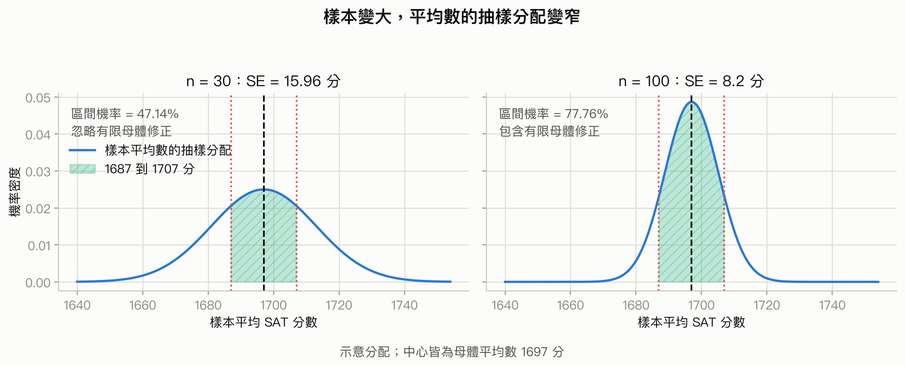
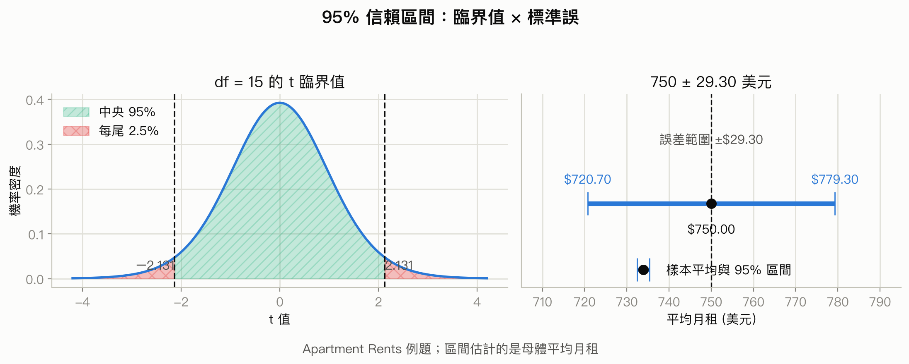
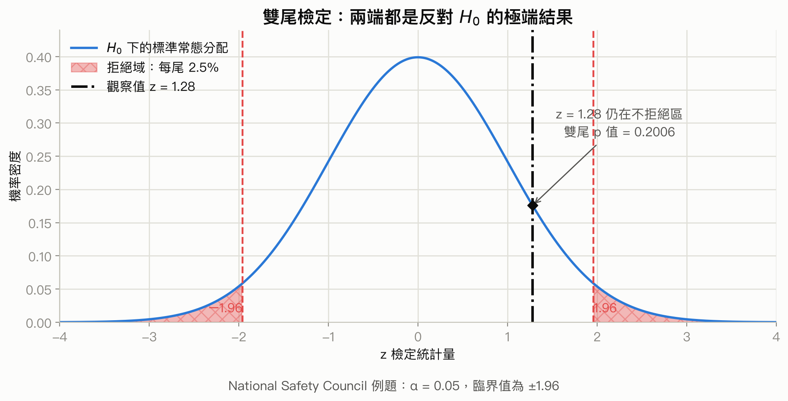
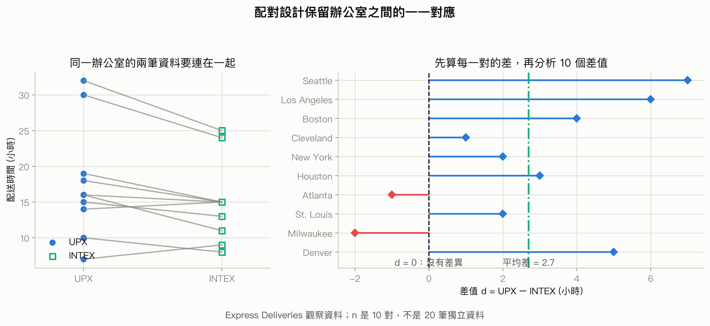

# 第 7-10 章複習：估計與檢定

## 先備知識

這份複習會從「一份樣本」一路走到「用樣本推論母體」。開始前不用把所有舊公式背熟，但要先認得三種角色：原始資料是每一位顧客或每一件產品的觀測值；統計量是用樣本算出的摘要；母體參數則是我們真正想知道、卻通常看不到的數字。後面的標準誤、信賴區間與檢定，都是在處理統計量和母體參數之間的不確定性。

先用下面的清單找自己的斷點。若某一列讀起來很陌生，先回 course1 對應頁面複習，不必硬撐著往下代公式。

| 要先會什麼 | 為什麼本章會用到 | 不熟時去哪裡補 |
| --- | --- | --- |
| 分辨類別與數值資料、名目／順序／區間／比率尺度；會讀平均數、變異數與標準差 | 平均數推論只適合有合理數值距離的資料；若把類別代碼拿去平均，後面的精密計算也沒有意義 | [course1 第 1 章：描述統計與資料探索](../../course_1/chapters/01-descriptive-statistics.md)，列印版 [p.3–22](../../output/pdf/statistics-handout-expanded.pdf#page=3) |
| 分清目標母體、抽樣框、樣本與抽樣偏誤；認得機率抽樣 | 推論公式只能量化隨機抽樣造成的波動，不能把便利樣本的偏誤洗掉 | [course1 第 2 章：抽樣與實驗設計](../../course_1/chapters/02-sampling-and-experiments.md)，列印版 [p.23–39](../../output/pdf/statistics-handout-expanded.pdf#page=23) |
| 看懂事件、條件機率與獨立 | 隨機樣本與兩獨立樣本都需要獨立性；$p$ 值也是「假設 $H_0$ 成立」之下的條件式機率 | [course1 第 3 章：機率](../../course_1/chapters/03-probability.md)，列印版 [p.40–59](../../output/pdf/statistics-handout-expanded.pdf#page=40) |
| 認得隨機變數、期望值、常態分配與 $z$ 標準化 | 抽樣前的 $\bar{X}$ 是會隨樣本改變的隨機變數；標準化後才能用同一張常態表算尾端或區間機率 | [course1 第 4 章：常態近似與二項分配](../../course_1/chapters/04-normal-and-binomial.md)，列印版 [p.60–80](../../output/pdf/statistics-handout-expanded.pdf#page=60) |
| 分清原始資料分配、抽樣分配、標準差與標準誤；理解中央極限定理 | 這是區間估計與檢定共同的地基，也能避免把「個體很分散」誤說成「平均數估得很不準」 | [course1 第 5 章：抽樣分配與中央極限定理](../../course_1/chapters/05-sampling-distributions-clt.md)，列印版 [p.81–102](../../output/pdf/statistics-handout-expanded.pdf#page=81) |
| 正確解讀信賴水準與誤差範圍 | 本章會建立平均數與比例的區間；信賴水準描述長期涵蓋率，不是這一次參數落在區間內的機率 | [course1 第 7 章：信賴區間](../../course_1/chapters/07-confidence-intervals.md)，列印版 [p.122–138](../../output/pdf/statistics-handout-expanded.pdf#page=122) |
| 會寫 $H_0$、$H_a$，分辨單尾／雙尾、$p$ 值與型一／型二錯誤；看得出獨立與配對資料 | 本章後半會做單一母體與兩母體檢定；資料如何產生會決定標準誤和自由度 | [course1 第 8 章：顯著性檢定](../../course_1/chapters/08-significance-tests.md)，列印版 [p.139–160](../../output/pdf/statistics-handout-expanded.pdf#page=139) |

如果只想先補最短路徑，依序讀 [course1 第 1 章：描述統計與資料探索](../../course_1/chapters/01-descriptive-statistics.md)，搭配列印版 [p.3–22](../../output/pdf/statistics-handout-expanded.pdf#page=3) 的資料型態與標準差；[course1 第 3 章：機率](../../course_1/chapters/03-probability.md)，搭配列印版 [p.40–59](../../output/pdf/statistics-handout-expanded.pdf#page=40) 的條件機率與獨立；[course1 第 4 章：常態近似與二項分配](../../course_1/chapters/04-normal-and-binomial.md)，搭配列印版 [p.60–80](../../output/pdf/statistics-handout-expanded.pdf#page=60) 的常態與 $z$ 分數；再讀 [course1 第 5 章：抽樣分配與中央極限定理](../../course_1/chapters/05-sampling-distributions-clt.md)，搭配列印版 [p.81–102](../../output/pdf/statistics-handout-expanded.pdf#page=81)。到了本章區間估計或檢定處卡住，再分別回 [course1 第 7 章：信賴區間](../../course_1/chapters/07-confidence-intervals.md)，搭配列印版 [p.122–138](../../output/pdf/statistics-handout-expanded.pdf#page=122)，以及 [course1 第 8 章：顯著性檢定](../../course_1/chapters/08-significance-tests.md)，搭配列印版 [p.139–160](../../output/pdf/statistics-handout-expanded.pdf#page=139)。這樣會比一開始死背整張公式表有效。

## 學習目標

讀完本章，你應該能夠：

- 判斷一個樣本是否有機會代表目標母體，並選擇合適的抽樣方法。
- 說明樣本平均數和樣本比例的抽樣分配，計算標準誤與有限母體修正。
- 用中央極限定理和標準常態分配，計算樣本平均數落在某個範圍的機率。
- 建立母體平均數或母體比例的點估計與信賴區間，並用正確的 $z$ 或 $t$ 臨界值。
- 在研究問題中正確寫出虛無假設 $H_0$ 與對立假設 $H_a$，分辨單尾與雙尾檢定。
- 依照 $p$ 值法或臨界值法完成假設檢定，正確解讀「拒絕」與「不拒絕」的結論。
- 比較兩母體平均數與配對資料的平均差，選對估計或檢定公式。
- 說明型一錯誤、型二錯誤、顯著水準與 $p$ 值的意義，不把統計證據誤說成確定真相。

## 本章重點一覽

本章的主線只有一句話：我們拿到的是樣本，但真正想知道的是母體。抽樣方法決定資料是否可信；抽樣分配告訴我們樣本統計量會怎麼波動；區間估計把「一個猜測」變成「一段有精度的範圍」；假設檢定則把商業或科學問題寫成可檢驗的兩個主張。

第 7 章先處理「樣本怎麼來」以及樣本統計量的波動。第 8 章處理「母體參數大概在哪裡」。第 9 章處理「資料是否足以反駁一個主張」。第 10 章把同一套思路延伸到兩個母體之間的差異。

## 內容講解

### 〇、開始推論前的五塊地基

教科書第 1–6 章是在建立統計的基本語言。第 7 章之後不是突然換了一套數學，而是把這些語言組合起來：先確認資料能算什麼摘要，再用機率描述摘要的隨機波動，最後用常態或 $t$ 分配做估計與檢定。以下五小節先把會反覆出現的接點補齊。

#### 1. 先看資料型態與尺度，再決定能不能算平均數

一份資料表的每一列通常是一個觀察單位，例如一位顧客；每一欄是一個變數，例如付款方式、滿意度或消費金額。變數先分為**類別資料(categorical data)** 和**數值資料(quantitative data)** 。類別資料的數字有時只是代碼，例如付款方式的 `1` 代表現金、`2` 代表信用卡；這時算平均數沒有實際意義。

四種常見測量尺度可以這樣判斷：

| 尺度 | 數值告訴我們什麼 | 商業例子 | 可以合理做的比較 |
| --- | --- | --- | --- |
| 名目尺度(nominal scale) | 只分種類，沒有大小順序 | 付款方式、分店代碼 | 是否同一類、各類比例 |
| 順序尺度(ordinal scale) | 有順序，但相鄰級距未必相等 | 滿意／普通／不滿意、星等 | 高低順序、中位數、各類比例 |
| 區間尺度(interval scale) | 差多少有意義，但零點不代表「完全沒有」 | 攝氏溫度、某些標準化分數 | 加減、平均數、標準差 |
| 比率尺度(ratio scale) | 差多少與幾倍都可解讀，具有真正零點 | 營收、等待時間、重量 | 加減、倍數、平均數、標準差 |

本章多數平均數公式針對區間或比率尺度的數值資料。比例公式則把某一類定義成「成功」，用成功次數除以樣本數。若這裡還會混淆，可回 [course1 第 1 章](../../course_1/chapters/01-descriptive-statistics.md)，並搭配列印版 [p.3–22](../../output/pdf/statistics-handout-expanded.pdf#page=3) 看完整例子。

#### 2. 平均數、變異數與標準差各在回答什麼

假設樣本有 $n$ 個數值，寫成 $x_1,x_2,\ldots,x_n$。平均數描述中心；變異數先算每個值離平均數的平方距離，再取平均；標準差則把平方單位轉回原單位。

**樣本平均數、樣本變異數與樣本標準差**

$$
\bar{x}=\frac{1}{n}\sum_{i=1}^{n}x_i,
\qquad
s^2=\frac{\sum_{i=1}^{n}(x_i-\bar{x})^2}{n-1},
\qquad
s=\sqrt{s^2}
$$

| 符號 | 意義與單位 |
| --- | --- |
| $x_i$ | 第 $i$ 個觀測值，單位由情境決定 |
| $i$ | 觀測值的編號，從 $1$ 到 $n$，無單位 |
| $n$ | 樣本中的觀測值個數，無單位 |
| $\bar{x}$ | 樣本平均數，和原始資料同單位 |
| $s^2$ | 樣本變異數，單位是原始單位的平方 |
| $s$ | 樣本標準差，和原始資料同單位 |

母體對應記號是平均數 $\mu$、變異數 $\sigma^2$、標準差 $\sigma$。例如顧客等待時間的 $s=4$ 分鐘，表示樣本內個別等待時間通常離樣本平均數有約數分鐘的距離。這還不是平均數估計有多準；後面會用**標準誤(standard error, SE)** 描述「換一批樣本時，$\bar{x}$ 會變多少」。最常見的混淆就是把個體的標準差和統計量的標準誤當成同一個數。

#### 3. 機率、條件機率與獨立是推論公式的運作條件

把一個可能發生的結果集合記為事件 $A$，其機率是 $P(A)$。若已知另一事件 $B$ 已發生，條件機率 $P(A\mid B)$ 代表把視野縮到 $B$ 的情況後，$A$ 所占的比例。

**條件機率與獨立事件**

$$
P(A\mid B)=\frac{P(A\cap B)}{P(B)},\qquad P(B)>0
$$

若 $A$ 與 $B$ 獨立，則

$$
P(A\mid B)=P(A),
\qquad
P(A\cap B)=P(A)P(B)
$$

| 符號 | 意義 |
| --- | --- |
| $A,B$ | 兩個事件 |
| $A\cap B$ | $A$ 與 $B$ 同時發生 |
| $P(A\mid B)$ | 已知 $B$ 發生後，$A$ 的條件機率 |
| $P(B)>0$ | 條件事件必須有正機率，分母才有意義 |

在抽樣中，「觀測值獨立」表示知道某一個人被抽到或觀察到什麼，不會改變另一個觀測值的機率模型。若同一位顧客前後各量一次，兩筆數值通常相關，不能硬當成兩個獨立樣本；應保留成一對。

另一個常見混淆是把條件方向倒過來。$p$ 值是 $P(\text{目前這麼極端或更極端的資料}\mid H_0)$ 類型的機率，不是 $P(H_0\mid\text{目前資料})$。需要重看事件與條件方向時，可回 [course1 第 3 章](../../course_1/chapters/03-probability.md)，並搭配列印版 [p.40–59](../../output/pdf/statistics-handout-expanded.pdf#page=40)。

#### 4. 隨機變數與期望值：同一個符號有抽樣前、抽樣後兩種身分

**隨機變數(random variable)** 是把隨機結果轉成數值的規則。例如隨機抽一位顧客，令 $X$ 表示其消費金額；抽樣前不知道 $X$ 會是多少，所以用大寫 $X$。觀察後得到的某個金額是實現值，可用小寫 $x$ 表示。

離散隨機變數的期望值是各可能數值依其機率加權的長期中心：

**離散隨機變數的期望值**

$$
E(X)=\sum_x xP(X=x)
$$

| 符號 | 意義與單位 |
| --- | --- |
| $X$ | 隨機變數 |
| $x$ | $X$ 的一個可能值，和原始量測同單位 |
| $P(X=x)$ | $X$ 取值為 $x$ 的機率，無單位 |
| $E(X)$ | 重複同一隨機過程時的長期平均，和 $X$ 同單位 |

期望值不保證下一次就會出現。例如公平骰子的期望值是 $3.5$，單次不可能擲出 $3.5$。同理，抽樣前的樣本平均數 $\bar{X}$ 是隨機變數；抽完後算出的 $\bar{x}$ 才是這一次的數值。後面寫 $E(\bar{X})=\mu$，是在說重複抽樣下的長期中心，不是在說每一次樣本平均都等於母體平均。

#### 5. 常態分配與 $z$ 標準化：把距離改寫成「幾個標準差」

**常態分配(normal distribution)** 是對稱的鐘形分配，由平均數 $\mu$ 決定中心、標準差 $\sigma$ 決定寬窄，可寫成 $X\sim N(\mu,\sigma^2)$。若資料明顯多峰、極端偏斜或有強烈離群值，就不能只因為公式方便而假設它常態。

不同情境的單位不一樣。$z$ 標準化把「離中心多遠」除以相應的標準差，轉成無單位的位置：

**單一觀測值的 $z$ 標準化**

$$
z=\frac{x-\mu}{\sigma}
$$

| 符號 | 意義與單位 |
| --- | --- |
| $x$ | 一個觀測值，和原始資料同單位 |
| $\mu$ | 分配平均數，和原始資料同單位 |
| $\sigma$ | 分配標準差，和原始資料同單位 |
| $z$ | 該觀測值離平均數幾個標準差，無單位 |

$z=1.5$ 表示觀測值在平均數上方 $1.5$ 個標準差；$z=-2$ 表示在下方 $2$ 個標準差。查常態表得到的是曲線下面積，也就是區間或尾端機率。完整的常態面積與反查方法可回 [course1 第 4 章](../../course_1/chapters/04-normal-and-binomial.md)，並搭配列印版 [p.60–80](../../output/pdf/statistics-handout-expanded.pdf#page=60)。

本章後面標準化樣本平均數時，分母不是個體標準差 $\sigma$，而是樣本平均數的標準誤 $\sigma/\sqrt{n}$。這正是從「單一個體的分配」跨到「統計量的抽樣分配」的關鍵；[course1 第 5 章](../../course_1/chapters/05-sampling-distributions-clt.md) 與列印版 [p.81–102](../../output/pdf/statistics-handout-expanded.pdf#page=81) 專門拆解這個差別。

到這裡可以先用一句話串起全章：資料尺度決定能算什麼統計量；機率與獨立性描述重複抽樣；期望值與標準誤描述統計量的中心和波動；常態或 $t$ 分配把這些波動轉成區間與尾端機率。抽樣分配先提供「統計量通常落在哪裡、波動多大」；信賴區間再用「點估計 $\pm$ 臨界值 $\times$ 標準誤」估計參數；假設檢定則看觀察結果離 $H_0$ 的基準有幾個標準誤，並把更極端的尾端面積讀成 $p$ 值。

最後先看資料結構，再決定要推論哪一個參數：

| 問題中的資料 | 真正要估計或檢定的參數 | 本章後面怎麼處理 |
| --- | --- | --- |
| 一組數值資料 | 母體平均數 $\mu$ | 一個平均數的區間或檢定 |
| 一組成功／失敗資料 | 母體比例 $p$ | 一個比例的區間或檢定 |
| 兩群不同個體，各自提供一個數值 | 兩母體平均差 $\mu_1-\mu_2$ | 兩獨立樣本方法；兩群之間不能互相配對 |
| 同一單位前後測，或兩個數值一一成對 | 母體平均差 $\mu_d$ | 先算每一對的差 $d_i$，再做一個平均數方法 |

獨立或配對不是看兩欄資料長得像不像，而是看資料怎麼產生。這一關若判錯，標準誤與自由度就會跟著錯；可先回 [course1 第 8 章](../../course_1/chapters/08-significance-tests.md) 的資料結構比較，搭配列印版 [p.139–160](../../output/pdf/statistics-handout-expanded.pdf#page=139)。現在再進入抽樣，後面的公式就不會像突然出現。

### 一、抽樣之前先問：這個樣本代表誰？ (投影片第 1-8 頁)

#### 1. 樣本代表性是推論的起點

**母體(population)** 是我們想了解的全部對象，例如所有臺北市常住居民、所有某型號產品，或某段期間內所有進店顧客。**樣本(sample)** 是實際被觀察的一小部分。後面所有估計與檢定，都是從樣本回頭推論母體。

因此樣本不能只是「方便拿到的幾個人」，而要盡量反映母體的特性。若樣本只來自某個角落，推論就可能像「瞎子摸象」：每個人都摸到真的一部分，合起來卻不是大象的全貌。

投影片先提醒大數據時代仍有資料品質問題。企業即使收集了大量問卷，仍可能遇到：

- 傳統問卷造成不回覆、流失或回答扭曲。
- 冷備份與熱備份的選擇涉及成本與可用性；資料存得多不等於資料適合分析。
- 次級資料(secondary data) 是別人為其他目的收集的資料，原始資料(primary data) 則是研究者為目前問題直接收集的資料；兩者都要檢查定義、時間與測量方式。
- 把樣本當成母體，或使用有系統偏差的樣本，會造成抽樣偏差(sampling bias)。
- 誘導性文字，例如題目附帶「額外資訊」，可能推動受訪者選某個答案；收入等敏感議題也容易讓人拒答或不誠實回答。

第 6-8 頁的問卷與儀器圖片想表達兩件事：由受訪者填答可能衍生額外問題；儀器量測通常更精確，但資料蒐集較困難。圖本身不是方法，重點是先釐清測量誤差、回答偏差與成本的取捨。

#### 2. 目標母體和實際母體要對得上

**目標母體(target population)** 是研究者想下結論的對象；**實際母體(available population)** 是研究設計真正有機會抽到的對象。兩者若不一致，即使抽樣程序很漂亮，結論也只能推回實際母體。

例如要調查臺北市長的施政滿意度，題目應先確認受訪者是「居住在臺北市」的市民。戶籍人口和常住人口不同；若抽到的是戶籍在臺北、但長期住在外地的人，研究對象就可能和題目想要的常住居民不一致。

### 二、怎麼抽出樣本 (投影片第 9-13 頁)

本節後半涵蓋投影片第 35-44 頁的其他抽樣方法。

#### 1. 有限母體與簡單隨機抽樣

**有限母體(finite population)** 可以列出所有元素，例如組織會員名冊、信用卡帳號清單、庫存品號。大小記為 $N$。從中抽取大小為 $n$ 的**簡單隨機樣本(simple random sample, SRS)** 要求每一個可能的大小為 $n$ 的樣本，都有相同的被選機率。

抽樣後把元素放回去再抽，叫**放回抽樣(sampling with replacement)** ，同一元素可能重複出現。實務上更常見的是**不放回抽樣(sampling without replacement)** 。大型調查通常用電腦產生隨機數，避免人工挑選。

投影片的 St. Andrew's College 例題：有 $900$ 份申請，編號 $1$ 到 $900$，要抽 $30$ 人。可以這樣做：

1. 為每位申請者產生一個從 $0$ (含) 到 $1$ (不含) 的亂數，例如 Excel 的 `RAND`。
2. 找出亂數最小的 $30$ 位申請者，對應的申請者就是樣本。

這種做法的直覺是先把每個人放進同一個隨機競賽，再取最前面的 $30$ 人；不是依申請到達順序或姓名挑人。

#### 2. 無限母體

有些母體不是「目前有一張完整名單」，而是由持續發生的過程產生，因此無法建立抽樣框架(sampling frame)。例子包括生產線持續製造的零件、銀行持續發生的交易、客服中心持續接到的電話，以及持續進店的顧客。

對無限母體，隨機樣本至少要滿足兩項條件：每個被選元素都來自研究關心的母體；各次選取彼此獨立(independent)。沒有隨機性，就不能用標準的機率模型量化抽樣誤差。

#### 3. 其他抽樣方法

投影片列出五種方法。判斷它們的關鍵不是名稱，而是「先分組的方式」與「最後怎麼選」。

| 方法 | 做法與理想情況 | 優點 | 風險或限制 |
| --- | --- | --- | --- |
| 分層隨機抽樣(stratified random sampling) | 先把母體分成互不重疊的層(strata)，每層內盡量同質，再從每層做簡單隨機抽樣 | 若每層內很相似，可用較少總樣本得到接近簡單隨機抽樣的精度；可確保各重要群組都有代表 | 層的定義與名單必須正確；若層內不相似，優勢會下降 |
| 群集抽樣(cluster sampling) | 把母體分成群集，每個群集理想上都是母體的小縮影，隨機抽群集後納入被選群集的所有元素 | 元素集中在地理區域時，收集成本低、速度快 | 同一群集內常相似，資訊重複，通常需要比簡單或分層抽樣更大的總樣本 |
| 系統抽樣(systematic sampling) | 母體有 $N$ 個元素、要抽 $n$ 個時，每隔約 $N/n$ 個取一個；先從前一段隨機選起點 | 名單排序若近似隨機，容易執行且結果接近簡單隨機抽樣 | 若名單有週期性，固定間隔可能反覆抽到同一類元素 |
| 便利抽樣(convenience sampling) | 以容易接觸為主要理由入樣，例如請學生志願參加 | 快、便宜 | 每個人被選機率未知，無法判斷樣本是否代表母體 |
| 立意抽樣(judgment sampling) | 由最熟悉主題的人挑選他認為最具代表性的元素 | 執行簡單 | 品質依賴挑選者的判斷，容易把個人偏見當成代表性 |

系統抽樣的間隔可寫成 $k=N/n$；實際操作先從 $1$ 到 $k$ 隨機選一個起點，再選起點、起點加 $k$、起點加 $2k$ 等位置。投影片的例子是電話簿先隨機選第一筆，之後每 $100$ 筆選一筆。

做母體推論時，優先考慮簡單隨機、分層、群集或系統等**機率抽樣(probability sampling)** 。這些方法至少能利用抽樣機率評估結果的好壞；便利抽樣與立意抽樣屬非機率抽樣(nonprobability sampling)，通常無法量化「離真正母體參數有多近」。

### 三、樣本平均數的抽樣分配 (投影片第 14-34 頁)

#### 1. 從母體到抽樣分配

統計推論的流程是：先從母體抽一個樣本，再計算樣本統計量，例如樣本平均數 $\bar{x}$；如果把「所有可能的樣本」都想像成抽出來並各自算一次 $\bar{x}$，這些 $\bar{x}$ 的機率分布就是**抽樣分配(sampling distribution)** 。

它不是原始個體資料的分配，也不是某一次樣本的直方圖，而是「統計量在重複抽樣下會怎麼變」。這個觀念讓我們能計算一次抽樣誤差的機率。

**母體平均數(population mean)** 記為 $\mu$，樣本平均數為 $\bar{x}$。樣本平均數的期望值為：

**樣本平均數的期望值與不偏性**

$$E(\bar{x})=\mu$$

這個公式的用途是判斷 $\bar{x}$ 長期平均是否對準母體平均數。若一個點估計量的期望值等於它要估計的母體參數，就稱它是**不偏估計量(unbiased estimator)** 。

| 符號 | 意義與單位 |
| --- | --- |
| $E(\bar{x})$ | 重複抽樣後樣本平均數的長期平均，單位和原始測量相同 |
| $\bar{x}$ | 一次樣本的平均數，單位和原始測量相同 |
| $\mu$ | 母體平均數，通常未知，單位和原始測量相同 |

假設是隨機抽樣，且每個觀測值的平均意義確實對應同一母體。這個公式用來說明估計量沒有系統性偏高或偏低，不是說每一次算出的 $\bar{x}$ 都等於 $\mu$。若樣本有選擇偏差，$\bar{x}$ 可能不再是母體平均數的不偏估計。

#### 2. 標準誤與有限母體修正

不同樣本會得到不同的 $\bar{x}$。抽樣分配的標準差衡量這種波動，稱為**樣本平均數的標準誤(standard error of the mean)** 。母體標準差記為 $\sigma$，樣本大小為 $n$，母體大小為 $N$。

**樣本平均數的標準誤**

$$
\sigma_{\bar{x}}=\sqrt{\frac{N-n}{N-1}}\left(\frac{\sigma}{\sqrt{n}}\right)
$$

若抽樣比例不大，通常可把母體視為近似無限母體，省略有限母體修正：

$$
\sigma_{\bar{x}}=\frac{\sigma}{\sqrt{n}}
$$

| 符號 | 意義與單位 |
| --- | --- |
| $\sigma_{\bar{x}}$ | 樣本平均數的標準誤，和原始測量同單位 |
| $N$ | 母體大小，無單位 |
| $n$ | 樣本大小，無單位 |
| $\sigma$ | 母體標準差，和原始測量同單位 |
| $\sqrt{(N-n)/(N-1)}$ | 有限母體修正因子，無單位；不放回抽樣且抽樣比例大時不可忽略 |

投影片以 $n/N\le 0.05$ 作為「有限母體可視為無限母體」的判斷線索。這個公式適用於隨機抽樣與合理的獨立性條件；不適合拿來修正便利抽樣造成的偏差。樣本數增加時，標準誤按 $1/\sqrt{n}$ 下降，不是按 $1/n$ 下降，所以要把誤差縮小一半，樣本數大約要增加到四倍。

#### 3. 常態形狀與中央極限定理

若母體本身是**常態分配(normal distribution)** ，不論樣本大小為何，$\bar{x}$ 的抽樣分配都是常態。若母體不是常態，**中央極限定理(central limit theorem, CLT)** 告訴我們：隨機抽取的樣本大小夠大時，$\bar{x}$ 的抽樣分配可以用常態分配近似。

投影片的三個母體圖示顯示：即使原始母體是均勻、V 形或右偏，當樣本大小從 $2$ 增加到 $5$ 再到 $30$，樣本平均數的分配都變得更接近鐘形。另一張圖則比較 $n=1,5,10,20$：樣本越大，平均數的分配越集中。

實務經驗是 $n\ge 30$ 通常可以使用常態近似；若母體非常偏斜或有離群值，可能需要 $n\ge 50$。這不是不變的自然常數，仍要看母體形狀與資料品質。常態近似的目的，是讓我們能對「樣本平均數離母體平均數多近」給出機率。

投影片也用經驗法則說明常態分配的範圍：在平均數 $\mu$ 左右 $1$ 個標準差內約有 $68.26\%$，左右 $2$ 個標準差內約有 $95.44\%$，左右 $3$ 個標準差內約有 $99.72\%$。母體或抽樣分配明顯不規則時，不要硬套這個規則。

第 24 頁的漫畫用生活情境提醒：人常在資訊不完整時做選擇，統計的工作就是把不完整資訊整理成可量化的不確定性，而不是假裝自己知道全部答案。

#### 4. St. Andrew's College 例題：估計落在正負 10 分內的機率

投影片給定申請者 SAT 分數的母體平均數 $\mu=1697$、母體標準差 $\sigma=87.4$，抽取 $n=30$ 人。因為 $30/900\le 0.05$，使用無限母體近似：

$$\sigma_{\bar{x}}=\frac{87.4}{\sqrt{30}}=15.96$$

問題是求 $\bar{x}$ 落在 $1687$ 到 $1707$ 之間的機率，也就是離 $1697$ 不超過 $10$ 分。把兩端轉成標準常態 $z$ 值：

$$z_{上} = \frac{1707-1697}{15.96}=0.63$$

$$z_{下} = \frac{1687-1697}{15.96}=-0.63$$

查標準常態累積表：$P(Z\le 0.63)=0.7357$，$P(Z\le -0.63)=0.2643$。因此：

**樣本平均數落在區間的機率**

$$P(1687\le\bar{x}\le1707)=0.7357-0.2643=0.4714$$

| 符號 | 意義與單位 |
| --- | --- |
| $Z$ | 標準常態變數，無單位 |
| $z_{上},z_{下}$ | 將原始端點換算後的標準化位置，無單位 |
| $\mu$ | 抽樣分配中心，這裡是 $1697$ 分 |
| $\sigma_{\bar{x}}$ | 抽樣分配標準差，這裡是 $15.96$ 分 |

這種公式在題目問「樣本平均數落在某範圍」時使用；若題目問單一個體分數，分母不是 $\sigma/\sqrt{n}$。第 30 頁投影片的圖上將標準化端點印得像 $0.68$，但前兩步實際算出的應是約 $\pm0.63$，且 $0.7357-0.2643=0.4714$ 正是 $\pm0.63$ 的結果。

#### 5. 樣本變大會發生什麼事

同一個 SAT 例子改成 $n=100$ 時，期望值仍是 $E(\bar{x})=1697$，因為樣本數不改變抽樣分配的中心；但標準誤變小：

$$
\sigma_{\bar{x}}=\sqrt{\frac{900-100}{900-1}}\left(\frac{87.4}{\sqrt{100}}\right)=8.2
$$

抽樣分配因此變窄。用同樣的 $1687$ 到 $1707$ 範圍，投影片計得機率為 $0.7776$，比 $n=30$ 的 $0.4714$ 大。這表示大樣本的平均數比較不容易離母體平均數太遠；它不表示母體本身的個體差異變小。

你該注意什麼：兩條抽樣分配都以 $1697$ 分為中心，樣本變大改變的是平均數的波動與區間機率，不是母體個體的分散程度。

進入區間估計前，先把前面的機率題「倒過來想」。前面是假設 $\mu$ 已知，問隨機的 $\bar{X}$ 會落在哪裡；實際抽樣時恰好相反，我們只看得到這次的 $\bar{x}$，真正未知的是 $\mu$。中央極限定理告訴我們，重複抽樣時 $\bar{X}$ 通常不會離 $\mu$ 超過「臨界值 $\times$ 標準誤」；把同一個距離關係改寫成以 $\bar{x}$ 為中心，就得到下一節的信賴區間。它不是突然冒出的新公式，而是把抽樣分配提供的合理距離反過來框住未知參數。

如果「從 $\bar{X}$ 的機率範圍反推 $\mu$ 的可能範圍」仍卡住，先回 [course1 第 5 章：抽樣分配與中央極限定理](../../course_1/chapters/05-sampling-distributions-clt.md)，搭配列印版 [p.81–102](../../output/pdf/statistics-handout-expanded.pdf#page=81)；再看 [course1 第 7 章：信賴區間](../../course_1/chapters/07-confidence-intervals.md)，搭配列印版 [p.122–138](../../output/pdf/statistics-handout-expanded.pdf#page=122)。先看「平均數的標準誤」，再看「點估計 $\pm$ 誤差範圍」。

### 四、區間估計：不要只報一個猜測 (投影片第 45-74 頁)

#### 1. 點估計、誤差範圍與信賴水準

**點估計(point estimate)** 用一個數字猜母體參數，例如用 $\bar{x}$ 猜 $\mu$，用樣本比例 $\bar{p}$ 猜母體比例 $p$。因為不同樣本會有不同答案，點估計不應被當成母體參數的精確值。

**區間估計(interval estimate)** 以點估計為中心，加上和減去**誤差範圍(margin of error)** $E$：

**一般區間估計形式**

$$\text{點估計}\ \pm\ \text{誤差範圍}$$

誤差範圍越大，區間越寬，通常表示我們要求更高的信賴水準或樣本資訊較少；誤差範圍越小，區間越窄，但通常需要較大的樣本。

**$C\%$ 信賴水準(confidence level)** 的正確解讀是：如果用同樣的方法反覆抽樣並建立區間，長期而言約有 $C\%$ 的區間會包含固定的母體參數。投影片以 $90\%$ 為例，$\bar{x}\pm1.645\sigma_{\bar{x}}$ 所建立的許多區間中，約 $90\%$ 會包含 $\mu$；$0.90$ 稱為信賴係數(confidence coefficient)。不能說「這一個已算出的區間有 $90\%$ 機率包含已經固定的 $\mu$」。

#### 2. 母體標準差已知時的平均數區間

若母體標準差 $\sigma$ 已知，使用標準常態臨界值 $z_{\alpha/2}$：

**母體平均數的 $z$ 信賴區間**

$$\bar{x}\pm z_{\alpha/2}\frac{\sigma}{\sqrt{n}}$$

| 符號 | 意義與單位 |
| --- | --- |
| $\bar{x}$ | 樣本平均數，和資料同單位 |
| $z_{\alpha/2}$ | 標準常態右尾面積為 $\alpha/2$ 的臨界值，無單位 |
| $\sigma$ | 已知的母體標準差，和資料同單位 |
| $n$ | 樣本大小，無單位 |
| $1-\alpha$ | 信賴係數，例如 $95\%$ 時 $\alpha=0.05$ |

適用條件是隨機樣本、母體標準差可合理視為已知，且母體常態或樣本夠大。若 $\sigma$ 其實未知，不要把樣本標準差 $s$ 偷換進這個 $z$ 公式；應改用下一節的 $t$ 區間。

#### 3. 母體標準差未知時的 $t$ 區間

真實研究通常不知道 $\sigma$，只能用樣本標準差 $s$ 估計它。此時用**$t$ 分配(Student's $t$ distribution)** ，而不是直接用 $z$ 分配：

原因不是「樣本小就習慣查另一張表」，而是把未知的 $\sigma$ 換成會隨樣本改變的 $s$，又多了一層估計誤差。$t$ 分配用比標準常態更厚的尾端補償這份不確定性，所以同一信賴水準下，小樣本的 $t$ 臨界值通常比 $z$ 臨界值大、區間也較寬。自由度為 $n-1$，是因為算出 $\bar{x}$ 後，$n$ 個離均差 $(x_i-\bar{x})$ 的總和必須是 $0$；例如有 $4$ 個離均差時，知道前 $3$ 個，最後 $1$ 個就被決定，只剩 $3$ 個可自由變動。

**母體平均數的 $t$ 信賴區間**

$$\bar{x}\pm t_{\alpha/2,\ n-1}\frac{s}{\sqrt{n}}$$

| 符號 | 意義與單位 |
| --- | --- |
| $s$ | 樣本標準差，用來估計 $\sigma$，和資料同單位 |
| $t_{\alpha/2,n-1}$ | $t$ 分配上尾面積為 $\alpha/2$、自由度為 $n-1$ 的臨界值，無單位 |
| $n-1$ | 自由度(degrees of freedom)，本例因估計一個平均數而為 $n-1$ |

$t$ 分配是一族對稱的鐘形分配。自由度越少，尾巴越厚、分散越大；自由度越多，越接近標準常態。投影片提到自由度超過 $100$ 時，$z$ 值通常已是很好的近似，$t$ 表的無限自由度列就是標準常態的臨界值。這個區間通常假設母體常態；若母體高度偏斜或有離群值，$n\ge50$ 比較安心，約對稱時 $n\ge15$ 可能足夠，近似常態時少於 $15$ 也可能使用，但小樣本不能忽略資料形狀。

投影片的 Apartment Rents 例題：$n=16$ 間房，$\bar{x}=750$ 美元，$s=55$ 美元，假設母體常態，求 $95\%$ 區間。自由度為 $15$，$t_{0.025,15}=2.131$：

$$750\pm2.131\frac{55}{\sqrt{16}}=750\pm29.30$$

所以區間為 $720.70$ 到 $779.30$ 美元。白話解讀是：用此抽樣方法反覆建立區間，長期約 $95\%$ 會涵蓋校園一公里內一房公寓的真正平均月租；不是說單一房租一定在此區間。

你該注意什麼：左圖的中央 $95\%$ 決定臨界值，右圖才把它乘上標準誤並換回美元；區間估計的是母體平均月租，不是個別公寓的租金範圍。

選公式的快速決策是：$\sigma$ 已知用 $z$；$\sigma$ 未知、改用 $s$ 用 $t$；兩者都不能取決於「哪個臨界值比較方便」。

#### 4. 為平均數區間事先決定樣本數

若在抽樣前已指定想要的誤差範圍 $E$，母體標準差 $\sigma$ 已知時：

**平均數區間所需樣本數**

$$E=z_{\alpha/2}\frac{\sigma}{\sqrt{n}}$$

$$n=\frac{(z_{\alpha/2})^2\sigma^2}{E^2}$$

| 符號 | 意義與單位 |
| --- | --- |
| $E$ | 允許的最大誤差，和資料同單位 |
| $z_{\alpha/2}$ | 由信賴水準決定的臨界值，無單位 |
| $\sigma$ | 母體標準差或規劃用的標準差，和資料同單位 |
| $n$ | 所需樣本數，無單位；最後一定向上取整 |

若 $\sigma$ 未知，可用過去研究的標準差、先做小型 pilot study 得到的 $s$，或合理的最佳猜測。投影片的 Discount Sounds 例題希望以 $95\%$ 信賴度把平均年收入的誤差控制在 $500$ 美元內，規劃 $\sigma=4500$、$z_{0.025}=1.96$：

$$n=\frac{(1.96)^2(4500)^2}{500^2}=311.17$$

所以至少抽 $312$ 人。這個公式適用於平均數的 $z$ 型規劃；若誤差要求變成原來一半，$n$ 會變成原來約四倍。

#### 5. 母體比例的信賴區間

**母體比例(population proportion)** $p$ 用樣本比例 $\bar{p}=x/n$ 估計，其中 $x$ 是符合條件的成功次數。當 $np\ge5$ 且 $n(1-p)\ge5$ 時，樣本比例的抽樣分配可用常態近似：

**樣本比例的標準誤**

$$\sigma_{\bar{p}}=\sqrt{\frac{p(1-p)}{n}}$$

建立區間時 $p$ 未知，因此用樣本比例代替：

**母體比例的信賴區間**

$$\bar{p}\pm z_{\alpha/2}\sqrt{\frac{\bar{p}(1-\bar{p})}{n}}$$

| 符號 | 意義與單位 |
| --- | --- |
| $\bar{p}$ | 樣本中成功的比例，無單位，介於 $0$ 與 $1$ |
| $p$ | 母體真實比例，無單位，通常未知 |
| $x$ | 成功次數，無單位 |
| $n$ | 樣本大小，無單位 |
| $z_{\alpha/2}$ | 標準常態臨界值，無單位 |

若成功與失敗次數太少，常態近似會失準；不要只看總樣本數大就忽略這個條件。真正的比例一定在 $0$ 到 $1$ 之間；若這個公式算出越界端點，代表常態近似不可靠，不應只是把端點截成 $0$ 或 $1$。解讀時也要回到原始比例，而不是把它當成百分點差。

PSI 民調例題：$500$ 位登記選民中有 $220$ 人支持候選人，所以 $\bar{p}=220/500=0.44$。$95\%$ 信賴水準使用 $z_{0.025}=1.96$：

$$0.44\pm1.96\sqrt{\frac{0.44(1-0.44)}{500}}=0.44\pm0.0435$$

區間為 $0.3965$ 到 $0.4835$，也就是約 $39.65\%$ 到 $48.35\%$。

#### 6. 為比例區間事先決定樣本數

若想把比例估計的誤差控制在 $E$ 以內：

**比例區間所需樣本數**

$$E=z_{\alpha/2}\sqrt{\frac{p^*(1-p^*)}{n}}$$

$$n=\frac{(z_{\alpha/2})^2p^*(1-p^*)}{E^2}$$

| 符號 | 意義與單位 |
| --- | --- |
| $E$ | 允許的比例誤差，例如 $0.03$ 代表 $3$ 個百分點 |
| $p^*$ | 抽樣前對母體比例的規劃值，無單位 |
| $z_{\alpha/2}$ | 由信賴水準決定的臨界值，無單位 |
| $n$ | 所需樣本數，無單位；最後向上取整 |

$p^*$ 可以來自類似研究、先導樣本或專家判斷；完全沒有資訊時使用 $p^*=0.5$。因為 $p^*(1-p^*)$ 在 $0.5$ 時最大，所以 $0.5$ 會給出最保守、通常最大的樣本數。

PSI 的規劃例題要求 $99\%$ 信賴度、$E=0.03$，過去類似樣本給 $p^*=0.44$，且 $z_{0.005}=2.576$：

$$n=\frac{(2.576)^2(0.44)(0.56)}{(0.03)^2}=1816.73$$

向上取整後，至少要抽 $1817$ 人。

若完全沒有先驗比例而用 $p^*=0.5$，投影片列出的建議樣本數是 $1843$。不過，若依投影片同頁的 $z_{0.005}=2.576$ 代入，會得到 $1843.27$；依樣本數一律向上取整的原則應取 $1844$。這是投影片數值與取整規則相差 $1$ 人之處。

投影片另一張中文投影片解釋「為什麼民調常抽約 $1,000$ 份」：在 $95\%$ 信賴水準且誤差不超過 $3\%$，最保守地取 $p=0.5$，有

$$1.96\sqrt{\frac{p(1-p)}{n}}\le0.03$$

精確解得 $n\ge1067.11$，所以整數樣本數至少要取 $1068$；投影片列成 $n\ge1067$，同樣少算了向上取整的 $1$ 人。這不影響「民調約抽 $1,000$ 份」的量級結論。因此樣本數不必是母體的一定比例。抽血只需要少量但要有代表性的血液；臺灣和美國人口相差很多，民調卻都可能抽約 $1,000$ 人，因為精度主要由允許誤差、信賴水準與母體變異決定，而不是母體比例本身。前提仍是樣本設計良好；偏差不會因為把樣本加到 $1,000$ 就自動消失。

### 五、假設檢定：資料是否足以反駁主張 (投影片第 75-100 頁)

區間估計和假設檢定不是兩套互不相干的方法。區間問「哪些參數值和資料相容」；檢定則先指定一個基準值，再問「這個值是否已經不相容到需要拒絕」。在相同假設與標準誤下，雙尾顯著水準 $\alpha$ 的檢定若發現基準值落在 $(1-\alpha)$ 信賴區間外，就會拒絕 $H_0$；若基準值仍在區間內，就不拒絕。單尾檢定要改看對應的單側界限，不能直接套雙尾區間。先分清研究問題的方向，再進入下面的 $H_0$ 與 $H_a$。

#### 1. $H_0$ 與 $H_a$ 的角色

**假設檢定(hypothesis testing)** 是利用樣本資料，判斷對母體參數的某個陳述是否應被拒絕。**虛無假設(null hypothesis)** 記為 $H_0$，是暫時採用的基準主張；**對立假設(alternative hypothesis)** 記為 $H_a$，是研究者想找證據支持、且與 $H_0$ 相反的主張。

假設不是在猜樣本，而是在寫母體參數。等號一定放在 $H_0$，因此「等於」、「至少」、「至多」的邊界會放在 $H_0$。先看研究問題的方向：

| 問題方向 | $H_0$ | $H_a$ | 檢定尾端 |
| --- | --- | --- | --- |
| 想證明平均數較小 | $\mu\ge\mu_0$ | $\mu<\mu_0$ | 左尾 |
| 想證明平均數較大 | $\mu\le\mu_0$ | $\mu>\mu_0$ | 右尾 |
| 想知道是否不同 | $\mu=\mu_0$ | $\mu\ne\mu_0$ | 雙尾 |

若新教學方法被認為較好，研究假設可寫成「新方法較好」的 $H_a$，$H_0$ 則是「沒有比較好」。新獎金制度要增加銷售、新藥要比舊藥更能降低血壓，也都是右尾或相對方向的例子。若瓶身標示含量 $67.6$ fluid ounces，研究者是要挑戰標示是否正確，投影片示範 $H_0:\mu\ge67.6$、$H_a:\mu<67.6$ 的左尾寫法。

Metro EMS 例題：急救服務目標是平均反應時間 $12$ 分鐘或更少。令 $\mu$ 為所有醫療緊急請求的平均反應時間，則

$$H_0:\mu\le12$$

$$H_a:\mu>12$$

若拒絕 $H_0$，才有證據說服務未達標，需要後續處理；若不拒絕 $H_0$，只能說資料不足以顯示超過 $12$ 分鐘，不能說已證明服務一定達標。

#### 2. 型一錯誤與型二錯誤

因為決策依賴樣本，可能做錯判斷。**型一錯誤(Type I error)** 是 $H_0$ 為真卻拒絕它；其機率在 $H_0$ 以等號成立時稱為**顯著水準(level of significance)** $\alpha$。只控制型一錯誤的應用常稱為顯著性檢定(significance test)。

**型二錯誤(Type II error)** 是 $H_0$ 為假卻沒有拒絕它。它的機率通常較難直接控制，會受到真實參數離假設值多遠、樣本大小、資料變異與 $\alpha$ 影響。正確用語是「不拒絕 $H_0$」，而不是「接受 $H_0$」，因為沒有拒絕不等於已證明 $H_0$ 為真。

醫療檢驗圖用「$H_0$ 為沒有病」說明：偽陽性是無病卻驗成陽性，對應型一錯誤；偽陰性是有病卻驗成陰性，對應型二錯誤。圖中的敏感度(sensitivity)與特異度(specificity)也要分清：若 $a$ 是有病且陽性、$b$ 是有病且陰性、$c$ 是無病且陽性、$d$ 是無病且陰性，則

$$\text{敏感度}=\frac{a}{a+b}$$

$$\text{特異度}=\frac{d}{c+d}$$

刑事司法的類比是「無罪推定」：先把 $H_0$ 當作基準，只有證據足夠強才拒絕它。這個類比用來理解決策方向，不代表統計檢定能直接判定真實狀況。

第 88 頁的 Collins 案例則提醒，不能只把幾個特徵的機率相乘，就宣稱被告「只有幾百萬分之一的機率無辜」。要相乘必須有合理的獨立性與抽樣模型；而且「隨機挑到具有這些特徵的人很少」不等於「已知這個人有這些特徵後，他是無辜的機率很低」。這正是條件機率、母體定義與研究設計不可省略的原因。

#### 3. $p$ 值與臨界值

**$p$ 值($p$-value)** 是在 $H_0$ 所描述的基準分配下，得到目前這麼極端或更極端檢定統計量的機率。它衡量資料和 $H_0$ 的不相容程度，不是 $H_0$ 為真的機率，也不是 $H_a$ 為真的機率。

**$p$ 值決策規則**

$$\text{若 }p\text{-value}\le\alpha\text{，拒絕 }H_0；否則不拒絕 }H_0$$

| 符號 | 意義與單位 |
| --- | --- |
| $p$-value | 在 $H_0$ 下看到同樣或更極端資料的機率，無單位 |
| $\alpha$ | 事前指定的型一錯誤上限，無單位 |
| $H_0$ | 供計算參考分配與檢定的基準主張 |

投影片提供的非正式解讀標尺是：$p<0.01$ 可稱對 $H_a$ 有壓倒性證據；$0.01$ 到 $0.05$ 是強證據；$0.05$ 到 $0.10$ 是弱證據；大於 $0.10$ 通常證據不足。這些詞是溝通輔助，正式決策仍要和事先指定的 $\alpha$ 比較。

投影片以疫苗副作用圖提醒「常見」、「不常見」與「極端」的差別，也用常態曲線說明 $95\%$ 雙尾區間的兩端各是 $0.025$。看到兩端各分一半就是雙尾問題；看到所有 $\alpha$ 放在同一側就是單尾問題。

另一種做法是**臨界值法(critical value approach)** ：先用 $\alpha$ 找出拒絕域，再看檢定統計量是否落入拒絕域。兩種方法只要使用同一個尾端方向與同一個 $\alpha$，結論應一致。

#### 4. 五步驟檢定流程

1. 寫出 $H_0$ 與 $H_a$，確定是左尾、右尾還是雙尾。
2. 事先指定顯著水準 $\alpha$。
3. 收集樣本並計算檢定統計量。
4. 若用 $p$ 值法，從檢定統計量算 $p$ 值；若用臨界值法，從 $\alpha$ 與自由度找臨界值及拒絕規則。
5. 比較並作出「拒絕 $H_0$」或「不拒絕 $H_0$」的決策，再用原情境說明意義。

不要在看到樣本平均數比假設值大之後才決定做右尾檢定；尾端方向必須在看結果前由研究問題決定。

#### 5. 母體平均數的檢定

母體標準差 $\sigma$ 已知時，平均數的檢定統計量為：

**已知 $\sigma$ 的母體平均數 $z$ 檢定統計量**

$$z=\frac{\bar{x}-\mu_0}{\sigma/\sqrt{n}}$$

若 $\sigma$ 未知，以 $s$ 代替並使用 $t$ 分配：

**未知 $\sigma$ 的母體平均數 $t$ 檢定統計量**

$$t=\frac{\bar{x}-\mu_0}{s/\sqrt{n}},\qquad df=n-1$$

| 符號 | 意義與單位 |
| --- | --- |
| $\bar{x}$ | 樣本平均數，和資料同單位 |
| $\mu_0$ | $H_0$ 中的假設母體平均數，和資料同單位 |
| $\sigma$ 或 $s$ | 已知母體標準差或樣本標準差，和資料同單位 |
| $n$ | 樣本大小，無單位 |
| $z$ 或 $t$ | 標準化後的檢定統計量，無單位 |
| $df$ | $t$ 分配自由度，無單位 |

分子是「樣本平均數離假設值多遠」，分母是「平均數通常會有多大的抽樣波動」，所以統計量是在問：這個差距相當於幾個標準誤。若樣本資料不是隨機、平均數抽樣分配嚴重偏斜，公式的參考分配就可能不可靠。

投影片的左尾已知 $\sigma$ 圖例用 $\alpha=0.10$，檢定統計量 $z=-1.46$，左尾 $p$ 值為 $0.0721$，因為 $0.0721\le0.10$ 而拒絕 $H_0$；臨界值法的臨界點是 $-1.28$，而 $-1.46\le-1.28$，得到相同結論。這個圖的重點是左尾的極端區在左邊，不是固定都看右邊。

Location F 車速例題：$n=64$、$\bar{x}=66.2$ km/h、$s=4.2$ km/h，要檢驗平均車速是否高於 $65$ km/h。寫成

$$H_0:\mu\le65,\qquad H_a:\mu>65,\qquad\alpha=0.05$$

因為 $\sigma$ 未知，使用 $t$：

$$t=\frac{66.2-65}{4.2/\sqrt{64}}=2.286,\qquad df=63$$

查表得 $0.01<p\text{-value}<0.025$，小於 $0.05$，拒絕 $H_0$。臨界值法中 $t_{0.05,63}=1.669$，而 $2.286\ge1.669$，也拒絕 $H_0$。情境解讀是：在 $5\%$ 顯著水準下，有足夠樣本證據支持 Location F 的平均車速高於 $65$ km/h，因此它是設置測速照相的候選地點；不是說每一輛車都超過 $65$。

第 100 頁的圖把同一個右尾檢定畫成兩條線：臨界值 $t=1.669$ 右側是預先指定的拒絕域，觀察到的 $t=2.286$ 更往右，因此它的右尾面積，也就是 $p$ 值，小於顯著水準。這張圖是在視覺上連起「臨界值法」與「$p$ 值法」。

### 六、母體比例的檢定 (投影片第 101-107 頁)

比例檢定的假設形式與平均數相同，只是把 $\mu$ 換成 $p$、把假設值換成 $p_0$：

| 問題方向 | $H_0$ | $H_a$ |
| --- | --- | --- |
| 左尾 | $p\ge p_0$ | $p<p_0$ |
| 右尾 | $p\le p_0$ | $p>p_0$ |
| 雙尾 | $p=p_0$ | $p\ne p_0$ |

在 $H_0$ 下，比例的標準誤要用 $p_0$，不是用樣本比例：

**母體比例 $z$ 檢定統計量**

$$z=\frac{\bar{p}-p_0}{\sqrt{p_0(1-p_0)/n}}$$

| 符號 | 意義與單位 |
| --- | --- |
| $\bar{p}=x/n$ | 樣本比例，無單位 |
| $p_0$ | $H_0$ 假設的母體比例，無單位 |
| $x$ | 樣本中的成功次數，無單位 |
| $n$ | 樣本大小，無單位 |
| $z$ | 標準化檢定統計量，無單位 |

使用條件包括隨機樣本，以及在 $H_0$ 下 $np_0\ge5$、$n(1-p_0)\ge5$，讓二項分配的比例抽樣分配可用常態近似。$p$ 值法一樣是 $p\text{-value}\le\alpha$ 就拒絕；臨界值法則依尾端使用 $z\le-z_\alpha$、$z\ge z_\alpha$，或雙尾的兩側拒絕域。

National Safety Council 例題：宣稱酒駕造成的事故比例是 $50\%$。抽取 $120$ 件事故，其中 $67$ 件是酒駕造成，$\alpha=0.05$。設定

$$H_0:p=0.5,\qquad H_a:p\ne0.5$$

樣本比例為 $\bar{p}=67/120=0.5583$，在 $H_0$ 下的標準誤為

$$\sqrt{\frac{0.5(1-0.5)}{120}}=0.045644$$

所以

$$z=\frac{0.5583-0.5}{0.045644}=1.28$$

雙尾 $p$ 值為 $2(1-0.8997)=0.2006$，大於 $0.05$，不拒絕 $H_0$。臨界值法使用 $\pm1.96$，$1.28$ 沒有落入兩側拒絕域，結論一致：沒有足夠證據說真正的酒駕事故比例不同於 $50\%$。這不是證明比例剛好等於 $50\%$，只是目前資料不夠反駁這個主張。

你該注意什麼：雙尾問題要同時看左右兩個極端方向；$z=1.28$ 雖然在右側，仍未越過 $1.96$，所以不能因為樣本比例高於 $0.5$ 就直接宣稱母體比例不同。

### 七、兩個母體平均數的推論 (投影片第 108-132 頁)

#### 1. 兩個獨立樣本與差的抽樣分配

現在比較兩群不同來源的個體。母體 $1$ 和母體 $2$ 的平均數分別為 $\mu_1$、$\mu_2$；我們關心的差異定義為 $\mu_1-\mu_2$。分別從兩個母體抽出獨立樣本，樣本平均數為 $\bar{x}_1$、$\bar{x}_2$，所以點估計量是 $\bar{x}_1-\bar{x}_2$。

若兩母體標準差 $\sigma_1$、$\sigma_2$ 已知，差的抽樣分配有：

**兩獨立樣本平均差的中心與標準誤**

$$E(\bar{x}_1-\bar{x}_2)=\mu_1-\mu_2$$

$$\sigma_{\bar{x}_1-\bar{x}_2}=\sqrt{\frac{\sigma_1^2}{n_1}+\frac{\sigma_2^2}{n_2}}$$

| 符號 | 意義與單位 |
| --- | --- |
| $\mu_1,\mu_2$ | 兩母體平均數，和資料同單位 |
| $\bar{x}_1,\bar{x}_2$ | 兩樣本平均數，和資料同單位 |
| $\sigma_1,\sigma_2$ | 兩母體標準差，和資料同單位 |
| $n_1,n_2$ | 兩樣本大小，無單位 |
| $\sigma_{\bar{x}_1-\bar{x}_2}$ | 平均差的標準誤，和資料同單位 |

這裡的「獨立」表示第一個母體抽到哪些觀測值，不會改變第二個母體樣本的選取與數值。若同一個人、同一間店或同一個辦公室提供兩個數值，通常不是獨立樣本，應看配對樣本。

第 114 頁的流程圖把這件事畫成兩條平行路徑：母體 1 的 $\mu_1$ 由 $\bar{x}_1$ 估計、母體 2 的 $\mu_2$ 由 $\bar{x}_2$ 估計，最後比較 $\bar{x}_1-\bar{x}_2$。圖上的順序也固定了差值方向；如果交換母體 1 和母體 2，整個差值與結論方向都會反號。

#### 2. $\sigma_1$、$\sigma_2$ 已知的差異信賴區間

**兩母體平均差的 $z$ 信賴區間**

$$
(\bar{x}_1-\bar{x}_2)\pm z_{\alpha/2}\sqrt{\frac{\sigma_1^2}{n_1}+\frac{\sigma_2^2}{n_2}}
$$

使用條件是兩個隨機且獨立樣本、母體標準差已知，並且差的抽樣分配可以用常態近似。若區間完全在 $0$ 以上，表示母體 1 平均數比母體 2 大的方向有資料支持；若包含 $0$，不能僅靠這個區間宣稱兩平均數有差。

Par, Inc. 高爾夫球例題：Par 樣本 $n_1=120$、$\bar{x}_1=295$ 碼；Rap 樣本 $n_2=80$、$\bar{x}_2=278$ 碼；已知 $\sigma_1=15$ 碼、$\sigma_2=20$ 碼。$95\%$ 區間為

$$
(295-278)\pm1.96\sqrt{\frac{15^2}{120}+\frac{20^2}{80}}=17\pm5.14
$$

得到 $11.86$ 到 $22.14$ 碼。解讀為：以此方法建立的 $95\%$ 信賴區間，估計 Par 球平均開球距離比 Rap 球多 $11.86$ 到 $22.14$ 碼；差值方向是「Par 減 Rap」，不能反過來讀。

#### 3. $\sigma_1$、$\sigma_2$ 已知的差異檢定

令 $D_0$ 為 $H_0$ 假設的兩母體平均差，三種假設形式是：

$$H_0:\mu_1-\mu_2\ge D_0,\quad H_a:\mu_1-\mu_2<D_0$$

$$H_0:\mu_1-\mu_2\le D_0,\quad H_a:\mu_1-\mu_2>D_0$$

$$H_0:\mu_1-\mu_2=D_0,\quad H_a:\mu_1-\mu_2\ne D_0$$

**已知兩母體標準差的平均差 $z$ 檢定**

$$z=\frac{(\bar{x}_1-\bar{x}_2)-D_0}{\sqrt{\sigma_1^2/n_1+\sigma_2^2/n_2}}$$

| 符號 | 意義與單位 |
| --- | --- |
| $D_0$ | $H_0$ 假設的平均差，和資料同單位 |
| $\bar{x}_1-\bar{x}_2$ | 觀察到的樣本平均差，和資料同單位 |
| $\sigma_1^2/n_1+\sigma_2^2/n_2$ | 平均差抽樣變異的估計，單位是原單位的平方 |
| $z$ | 標準化檢定統計量，無單位 |

Par/Rap 例題問 $\alpha=0.01$ 時 Par 平均距離是否較大。取 $D_0=0$，寫成 $H_0:\mu_1-\mu_2\le0$、$H_a:\mu_1-\mu_2>0$。代入得到

$$z=\frac{(295-278)-0}{\sqrt{15^2/120+20^2/80}}=\frac{17}{2.62}=6.49$$

右尾 $p$ 值小於 $0.0001$，小於 $0.01$，拒絕 $H_0$。臨界值法的 $z_{0.01}=2.33$，$6.49\ge2.33$，結論相同：樣本證據顯示 Par 球的平均距離較大。

#### 4. 兩個母體標準差未知：Welch $t$ 方法

當 $\sigma_1$、$\sigma_2$ 都未知，用樣本標準差 $s_1$、$s_2$ 代替，並將 $z_{\alpha/2}$ 換成 $t_{\alpha/2,df}$：

**兩母體平均差的 $t$ 信賴區間**

$$
(\bar{x}_1-\bar{x}_2)\pm t_{\alpha/2,df}\sqrt{\frac{s_1^2}{n_1}+\frac{s_2^2}{n_2}}
$$

投影片採用不假設兩母體變異數相等的 Welch 自由度近似：

**Welch 自由度近似**

$$
df=\frac{\left(s_1^2/n_1+s_2^2/n_2\right)^2}{\dfrac{(s_1^2/n_1)^2}{n_1-1}+\dfrac{(s_2^2/n_2)^2}{n_2-1}}
$$

| 符號 | 意義與單位 |
| --- | --- |
| $s_1,s_2$ | 兩樣本標準差，和資料同單位 |
| $n_1,n_2$ | 兩樣本大小，無單位 |
| $df$ | Welch $t$ 分配自由度，無單位；表格查值時通常向下或依規則取整 |
| $t_{\alpha/2,df}$ | 依信賴水準與自由度決定的臨界值，無單位 |

除了兩個樣本要隨機且彼此獨立，小樣本時兩個母體還應近似常態；若分配高度偏斜或有離群值，就需要較大的樣本。11e 課本在手工查表時把非整數自由度向下取整；14e 投影片則把本例的 $40.59$ 取為 $41$。考試依投影片用 $df=41$，兩種取法在本例的結論相同。

Specific Motors 例題比較 M 車和 J 車的每加侖英里數(miles per gallon, mpg)。M 車 $n_1=24$、$\bar{x}_1=29.8$、$s_1=2.56$；J 車 $n_2=28$、$\bar{x}_2=27.3$、$s_2=1.81$。要求 $90\%$ 區間，令 $\mu_1$ 為 M 車母體平均 mpg、$\mu_2$ 為 J 車母體平均 mpg。

Welch 自由度計算為 $40.59$，投影片取 $df=41$；$\alpha/2=0.05$，所以 $t_{0.05,41}=1.683$。代入：

$$
(29.8-27.3)\pm1.683\sqrt{\frac{2.56^2}{24}+\frac{1.81^2}{28}}=2.5\pm1.051
$$

得到 $1.449$ 到 $3.551$ mpg。這個區間沒有包含 $0$，而且全為正，表示 M 車平均 mpg 高於 J 車的方向有明確估計結果。

#### 5. 兩個母體標準差未知的差異檢定

假設形式與已知 $\sigma$ 時相同，檢定統計量改為：

**未知兩母體標準差的平均差 $t$ 檢定**

$$t=\frac{(\bar{x}_1-\bar{x}_2)-D_0}{\sqrt{s_1^2/n_1+s_2^2/n_2}}$$

自由度使用前面的 Welch 公式。Specific Motors 題目問 M 車平均 mpg 是否大於 J 車，$\alpha=0.05$：

$$H_0:\mu_1-\mu_2\le0,\qquad H_a:\mu_1-\mu_2>0$$

$$t=\frac{(29.8-27.3)-0}{\sqrt{2.56^2/24+1.81^2/28}}=4.003$$

自由度約 $41$，右尾 $p$ 值小於 $0.005$，所以拒絕 $H_0$。臨界值法中 $t_{0.05,41}=1.683$，而 $4.003\ge1.683$，結論一致：在 $5\%$ 顯著水準下，有證據支持 M 車的平均 mpg 較高。

不要在兩組本來是配對資料時套用這個獨立樣本公式；也不要在母體標準差未知時仍使用已知 $\sigma$ 的 $z$ 分母。

### 八、配對樣本：把兩個數值先變成一個差 (投影片第 133-140 頁)

#### 1. 什麼時候是配對設計

**配對樣本(matched samples)** 中，每一個抽樣單位提供一對資料，例如同一間分公司同時測兩種配送服務、同一個人使用新舊方法前後各測一次，或把相似的兩個單位配成一組。相較於兩個獨立樣本，配對設計可消除「不同抽樣單位本身的差異」，因此常能減少抽樣誤差。

最簡單的做法是定義每對的差：$d_i=$ 第一個條件的數值減去第二個條件的數值，再對 $d_i$ 做一個母體平均數的 $t$ 推論。令 $\mu_d$ 為母體平均差，問題就轉成一個平均數問題。

#### 2. Express Deliveries 例題

芝加哥公司把兩份報告寄給相同的 $10$ 個地區辦公室，一份由 UPX(United Parcel Express) 運送，另一份由 INTEX(International Express) 運送。資料與差值 $d_i=\text{UPX}-\text{INTEX}$ 如下：

| 辦公室 | UPX 小時 | INTEX 小時 | $d_i$ |
| --- | ---: | ---: | ---: |
| Seattle | 32 | 25 | 7 |
| Los Angeles | 30 | 24 | 6 |
| Boston | 19 | 15 | 4 |
| Cleveland | 16 | 15 | 1 |
| New York | 15 | 13 | 2 |
| Houston | 18 | 15 | 3 |
| Atlanta | 14 | 15 | -1 |
| St. Louis | 10 | 8 | 2 |
| Milwaukee | 7 | 9 | -2 |
| Denver | 16 | 11 | 5 |

要檢定兩服務平均配送時間是否不同，使用雙尾：

$$H_0:\mu_d=0,\qquad H_a:\mu_d\ne0$$

計算差值的樣本平均和樣本標準差：

$$\bar{d}=\frac{\sum d_i}{n}=\frac{27}{10}=2.7\text{ 小時}$$

$$s_d=\sqrt{\frac{\sum(d_i-\bar{d})^2}{n-1}}=\sqrt{\frac{76.1}{9}}\approx2.9\text{ 小時}$$

**配對樣本平均差的 $t$ 檢定**

$$t=\frac{\bar{d}-\mu_{d,0}}{s_d/\sqrt{n}},\qquad df=n-1$$

| 符號 | 意義與單位 |
| --- | --- |
| $d_i$ | 第 $i$ 對的差值，和資料同單位；差值方向要事先固定 |
| $\bar{d}$ | 差值的樣本平均，和資料同單位 |
| $\mu_{d,0}$ | $H_0$ 假設的母體平均差，通常是 $0$ |
| $s_d$ | 差值的樣本標準差，和資料同單位 |
| $n$ | 配對數，不是兩欄資料筆數相加 |
| $df$ | $n-1$，無單位 |

這個方法把每一對先化成一個差值，所以小樣本的常態假設是針對「差值母體」，不是要求原本兩欄各自都常態。本例只有 $10$ 對，使用 $t$ 檢定時需假設差值母體近似常態。

代入 $\alpha=0.05$：

$$t=\frac{2.7-0}{2.9/\sqrt{10}}=2.94,\qquad df=9$$

雙尾查表顯示 $p$ 值介於 $0.01$ 與 $0.02$ 之間，小於 $0.05$，拒絕 $H_0$。臨界值法使用 $t_{0.025,9}=2.262$，拒絕規則是 $t\le-2.262$ 或 $t\ge2.262$；因為 $2.94>2.262$，同樣拒絕 $H_0$。

情境解讀是：在 $5\%$ 顯著水準下，有足夠統計證據支持兩服務的母體平均配送時間不同；本樣本的平均差 $\bar{d}=2.7$ 為正，估計 UPX 平均比 INTEX 慢約 $2.7$ 小時。不要只因差值平均為正就說差異顯著，顯著性仍要看標準誤、自由度與檢定結果。

你該注意什麼：分析單位是 $10$ 個辦公室的一一配對差，不是把兩欄拆成 $20$ 筆獨立資料；保留連線才能利用同一辦公室帶來的共同條件。

## 公式與方法快速索引

| 問題 | 使用的公式錨點 | 一句話判斷 |
| --- | --- | --- |
| 樣本平均數是否長期對準母體平均數 | [不偏性](#formula-mean-unbiased) | 看 $E(\bar{x})$ 是否等於 $\mu$ |
| 樣本平均數的波動多大 | [平均數標準誤](#formula-se-mean) | 先看 $\sigma$ 是否已知，再看 $n/N$ 是否不小 |
| 平均數已知 $\sigma$ 的區間 | [$z$ 平均數區間](#formula-ci-mean-z) | 分母用已知 $\sigma/\sqrt{n}$ |
| 平均數未知 $\sigma$ 的區間 | [$t$ 平均數區間](#formula-ci-mean-t) | 用 $s$，自由度為 $n-1$ |
| 比例的區間 | [比例區間](#formula-ci-proportion) | 區間標準誤用 $\bar{p}$ |
| 平均數假設檢定 | [$z$ 或 $t$ 平均數檢定](#formula-test-mean-t) | $\sigma$ 未知就用 $t$ |
| 比例假設檢定 | [比例 $z$ 檢定](#formula-test-proportion-z) | 在 $H_0$ 下標準誤用 $p_0$ |
| 兩獨立母體平均差 | [差的抽樣分配](#formula-difference-sampling-distribution) | 兩組不同個體才用獨立樣本公式 |
| 兩組資料一一對應 | [配對 $t$ 檢定](#formula-paired-t) | 先算每一對的差，再做一個平均數檢定 |

判讀時的共同原則是：先問研究對象和抽樣設計，再問參數是平均數、比例或差；接著確認標準差已知與否、樣本是否足夠、尾端方向為何；最後才代公式。
