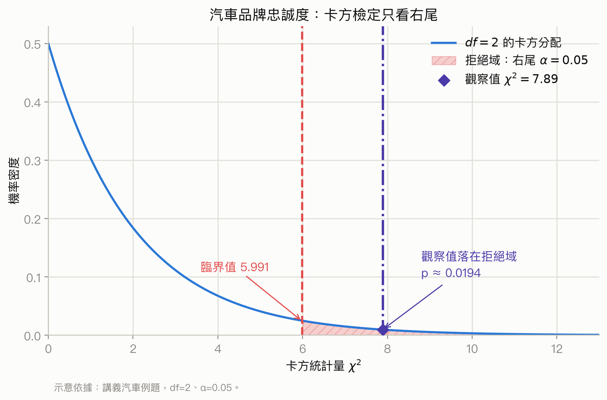
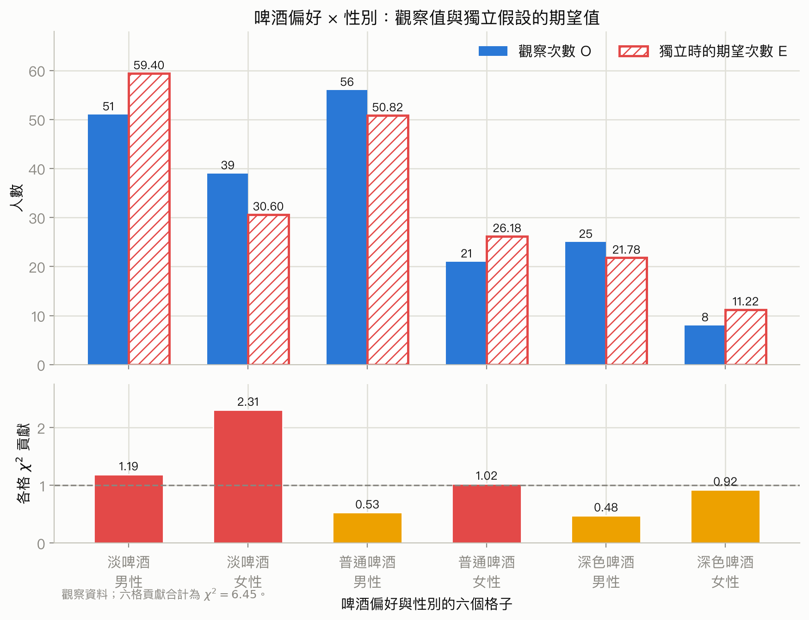
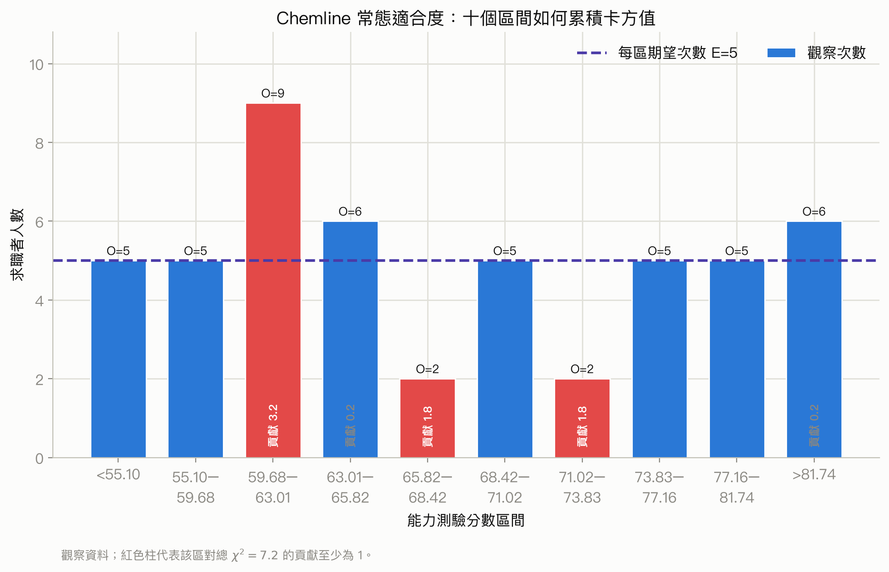

# 第 12 章：卡方檢定

## 先備知識

這一章不要求你先背卡方公式，但要先能把資料看成「各類有幾筆」，並知道顯著性檢定是在問：如果虛無假設成立，眼前這麼大的落差是否罕見。若下面任何一項不熟，先依連結複習，再回來讀本章會順很多。

- **次數、比例與條件分布：** 要能分辨「全體中某類的比例」與「固定某一群後，該群內的比例」。本章的列聯表、邊際總數和期望次數都建立在這個分母觀念上。請複習 [course1 第 10 章：類別資料分析](../../course_1/chapters/10-categorical-data.md)，穩定列印版 [p.183–203](../../output/pdf/statistics-handout-expanded.pdf#page=183)。
- **列聯表與兩種變數的關聯：** 要能讀懂每一格的聯合次數、表格邊緣的列／欄總數，並用條件比例比較群組。本章會把「沒有關聯」轉成一張期望次數表。請複習 [course1 第 10 章](../../course_1/chapters/10-categorical-data.md)，穩定列印版 [p.183–203](../../output/pdf/statistics-handout-expanded.pdf#page=183)。
- **虛無假設、p 值與顯著水準：** 要知道 p 值是在假定 $H_0$ 成立時，觀察到至少同樣不相容之資料的機率；它不是「$H_0$ 為真的機率」。本章會用 p 值判斷觀察次數與期望次數的落差。請複習 [course1 第 8 章：顯著性檢定](../../course_1/chapters/08-significance-tests.md)，穩定列印版 [p.139–160](../../output/pdf/statistics-handout-expanded.pdf#page=139)。
- **獨立性的基本語意：** 若兩個類別變數獨立，知道其中一個變數的類別，不會改變另一個變數的條件分布。不過這與「每位受訪者的觀察結果是否彼此獨立」是兩個不同條件；本章第 3 節會再拆開說明。請先看 [course1 第 10 章](../../course_1/chapters/10-categorical-data.md)，穩定列印版 [p.183–203](../../output/pdf/statistics-handout-expanded.pdf#page=183)。
- **常態分配、$z$ 值與百分位數：** 常態適合度檢定會把連續資料切成等機率區間，因此要能由累積比例找標準常態的 $z$ 百分位，再轉回原本單位。若這一步不熟，先複習 [course1 第 4 章：常態與二項分配](../../course_1/chapters/04-normal-and-binomial.md)，穩定列印版 [p.60–80](../../output/pdf/statistics-handout-expanded.pdf#page=60)。

如果你已能回答「比較不同方案內的取消率時，分母為何是各方案人數？」以及「$p=0.03$ 為何不能解讀成 $H_0$ 有 3% 機率為真？」，就具備開始本章的基礎。

## 學習目標

讀完本章，你應該能夠：

- 看出題目是在比較三個以上母體比例、檢查兩個類別變數是否獨立，還是在檢查資料是否符合指定的機率分配。
- 把資料整理成列聯表(contingency table)，計算每格的觀察次數與期望次數。
- 使用卡方統計量(chi-square statistic)、自由度(degrees of freedom)與 p 值或臨界值完成檢定。
- 用商業情境的語言解釋「拒絕」或「不能拒絕」虛無假設，而不把統計顯著誤說成因果關係。
- 當三個以上母體比例的整體檢定顯著時，用 Marascuilo 成對比較程序找出哪些比例可能不同。
- 把連續資料切成區間，再用卡方適合度檢定(chi-square goodness-of-fit test)檢查常態分配是否合理。

## 本章重點一覽

卡方檢定的共同想法很簡單：先假設虛無假設成立，算出「如果這個假設真的成立，理應看到多少筆」的期望次數(expected frequency)，再把實際觀察次數與期望次數的差距加總。差距越大，卡方統計量越大，資料就越不像虛無假設所描述的樣子。

本章依序處理三種問題：

1. 三個以上母體的某類比例是否相等。
2. 同一批受訪者的兩個類別變數是否獨立，例如啤酒偏好與性別。
3. 一個母體的類別比例是否符合指定分配，例如歷史市場占有率；也可以把連續資料切成區間，檢查是否可視為常態分配。

三種方法都使用右尾的卡方分配。卡方統計量只會是非負數；觀察次數與期望次數差得越遠，統計量就越大。

投影片的章節目錄也列出 Karl Pearson，他是卡方方法發展史上的重要人物；這裡只把它作為方法背景，不影響後面的計算。

## 內容講解

### 1. 卡方檢定在處理什麼問題

#### 1.1 從「三人成虎」想到統計檢定

投影片用「三人成虎」的故事開場：同一個說法被多人重複傳遞，不代表城裡真的出現老虎。統計上的對應是：樣本裡反覆出現的比例或模式，究竟只是抽樣波動，還是真的和我們假設的母體分配不同？

因此，看到樣本資料時不能只看「哪一類比較多」，還要問：在虛無假設成立時，這樣的差距是否大到不容易由抽樣誤差造成？卡方檢定就是把這個問題量化。

#### 1.2 三種主要用途

卡方檢定(chi-square test)主要處理類別資料(categorical data)。常見用途有三個：

1. 適合度檢定(goodness-of-fit test)：檢查樣本是否服從某個指定的機率分配，或檢查樣本是否像某個已知母體。
2. 獨立性檢定(test of independence)：檢查同一個樣本中的兩個類別變數是否有關聯，例如問卷中的兩個問題是否相關。
3. 齊一性檢定(test of homogeneity)：檢查幾個母體是否具有相同的比例分配。三個以上母體比例相等的檢定，就屬於這個想法。

投影片的用途示意圖與列聯表頁面要傳達的重點是：行(row)與列(column)可以各有兩種、三種或更多類別；獨立性檢定不限制行列只能是二分法。

#### 1.3 本章的共同機制

卡方分配(chi-square distribution)是所有程序的參考分配。共同步驟如下：

1. 寫出虛無假設與對立假設。
2. 取得隨機樣本，記錄每個類別或每個列聯表格子的觀察次數(observed frequency)。
3. 假設虛無假設成立，計算期望次數。
4. 比較觀察次數和期望次數，算出卡方統計量。
5. 依自由度找 p 值或臨界值，做出結論。

先把本章反覆出現的三種數字分開。**比例** 描述 $H_0$ 認為各類應占多少；**期望次數** 是把該比例換算成這次樣本理應有幾筆；**觀察次數** 才是樣本實際數到的筆數。

| 數字 | 從哪裡來 | 最小例子 |
|---|---|---|
| 指定或估計比例 $p_i$ | $H_0$、歷史資料，或列聯表邊際比例 | A 類應占 $30\%$ |
| 期望次數 $E_i$ | 在 $H_0$ 下把比例乘回樣本數 | $n=200$ 時，$E_A=200(0.30)=60$ 筆 |
| 觀察次數 $O_i$ | 樣本實際計數 | 實際看到 $O_A=48$ 筆 |

所以卡方公式比較的是同單位的 $O_i=48$ 筆與 $E_i=60$ 筆，不是直接拿 48 筆去減 30%。題目若只給比例，必須先乘上相應分母換成期望次數。

先理解為什麼卡方檢定只看右尾。每一格的差距會寫成 $(O-E)^2/E$：平方後不論觀察次數高於或低於期望次數，都會成為非負的「不相符貢獻」，所以總和 $\chi^2$ 不可能小於 0。$\chi^2$ 接近 0 表示觀察表和 $H_0$ 預測很接近；越大才表示越不相容，因此 p 值是 $P(\chi^2\ge\chi^2_{\text{obs}})$ 的右尾面積，不是因為研究問題事先選了「增加」方向。若對 p 值的尾端概念不熟，回看 [course1 第 8 章](../../course_1/chapters/08-significance-tests.md)，穩定列印版 [p.139–160](../../output/pdf/statistics-handout-expanded.pdf#page=139)。

卡方檢定常把原本的數值資料先分成類別，再比較各類別的人數。這個轉換會丟掉部分精細數值資訊，所以區間怎麼切、每格是否有足夠期望次數，都會影響檢定品質。

### 2. 三個以上母體比例相等的檢定

#### 2.1 何時使用

假設有 $k$ 個母體，每個母體的人都可以被分成「有某特徵」與「沒有某特徵」兩類。例如，分別抽取三種汽車車主，詢問他們是否願意再次購買同一車款。此時問題是：三個母體的「願意回購」比例是否相同？

這不是只比較兩個比例，而是一次比較三個以上母體的比例。若只有兩個母體，可使用兩母體比例的推論方法；本節的自由度與整體檢定設定是給 $k \ge 3$ 個母體。

#### 2.2 假設與五步驟

令 $p_j$ 表示第 $j$ 個母體中具有目標特徵的比例，$j=1,2,\ldots,k$。假設為：

$$
H_0: p_1=p_2=\cdots=p_k, \qquad k\ge 3
$$

$$
H_a: \text{並非所有母體比例都相等}
$$

注意，$H_a$ 不是「每一對比例都不同」，而是只要至少有一個比例和其他比例不一樣，就足以拒絕 $H_0$。

完整流程如下：

1. 從每個母體各抽一個隨機樣本，對每個人記錄結果。
2. 將結果放進有 2 列、$k$ 欄的表格。令 $f_{ij}$ 為第 $i$ 列、第 $j$ 欄的觀察次數，其中 $i=1,2$，$j=1,\ldots,k$。
3. 假設 $H_0$ 成立，計算各格期望次數 $e_{ij}$。
4. 確認每格 $e_{ij}\ge 5$，再計算卡方統計量。
5. 使用自由度 $df=k-1$ 的卡方分配求 p 值或臨界值。

#### 2.3 汽車品牌忠誠度例題：先寫問題

研究比較 Chevrolet Impala、Ford Fusion 與 Honda Accord 三種車款的顧客忠誠度。三個母體分別是三種車款的現有車主，定義：

- $p_1$：Impala 車主中願意再次購買 Impala 的母體比例。
- $p_2$：Fusion 車主中願意再次購買 Fusion 的母體比例。
- $p_3$：Accord 車主中願意再次購買 Accord 的母體比例。

檢定假設為：

$$
H_0:p_1=p_2=p_3
$$

$$
H_a:\text{三個母體比例並非全部相等}
$$

顯著水準設定為 $\alpha=0.05$。這裡的研究問題是整體差異，不是先挑某兩個品牌來比較。

#### 2.4 卡方統計量與期望次數

先理解直覺：若 $H_0$ 成立，三個品牌的「是/否」分配應該遵循同一套比例。某一格的期望次數，就是把該列總人數與該欄總人數的資訊結合起來，估計在共同比例下該格應有多少人。

這裡的資料結構是 $2\times k$ 列聯表：$f_{ij}$ 是第 $i$ 列、第 $j$ 欄實際看到的次數；$e_{ij}$ 則是保留原本列總數與欄總數、再假設「各品牌使用同一回購比例」後，該格理應分到的次數。之所以需要 $e_{ij}$，是因為各品牌樣本數可能不同，不能直接拿格子人數互比。最常見的混淆是把期望次數當成研究者希望看到的人數；其實它只由 $H_0$ 與表格的邊際總數決定。列聯表、邊際分布與條件分布可回看 [course1 第 10 章](../../course_1/chapters/10-categorical-data.md)，穩定列印版 [p.183–203](../../output/pdf/statistics-handout-expanded.pdf#page=183)。

<a id="formula-ch12-chi-square-cell"></a>

公式一：卡方統計量，用途是把所有格子的相對差距合併成一個檢定數字。

$$
\chi^2=\sum_i\sum_j\frac{(f_{ij}-e_{ij})^2}{e_{ij}}
$$

符號表：

| 符號 | 意義 | 單位 |
|---|---|---|
| $\chi^2$ | 卡方檢定統計量 | 無單位 |
| $f_{ij}$ | 第 $i$ 列、第 $j$ 欄的觀察次數 | 人數或筆數 |
| $e_{ij}$ | 同一格在 $H_0$ 成立下的期望次數 | 人數或筆數 |
| $i,j$ | 列與欄的索引 | 無單位 |

公式中的平方讓正差與負差都變成對統計量的貢獻；除以 $e_{ij}$ 則讓差距按該格原本的大小標準化。期望次數小的格子，若相差同樣的人數，通常會產生較大的貢獻。

適用條件與判斷線索：

- 這裡用於類別次數資料，且各格的期望次數至少為 5。
- 每個觀察值應只落在一個格子；樣本應依題目設計從母體隨機抽取。
- 使用前先判斷問題是否是在比較比例或列聯表；若是平均數或連續數值本身，不直接套這個公式。
- 卡方統計量是「偏離假設的程度」，不是效果大小，也不直接告訴你哪一組造成差異。

<a id="formula-ch12-expected-cell"></a>

公式二：列聯表格子的期望次數，用途是在虛無假設成立下計算該格的基準次數。

$$
e_{ij}=\frac{\text{第 }i\text{ 列總數}\times\text{第 }j\text{ 欄總數}}{\text{總樣本數}}
$$

符號表：

| 符號或文字 | 意義 | 單位 |
|---|---|---|
| $e_{ij}$ | 第 $i,j$ 格的期望次數 | 人數或筆數 |
| 第 $i$ 列總數 | 該列所有欄的觀察次數加總 | 人數或筆數 |
| 第 $j$ 欄總數 | 該欄所有列的觀察次數加總 | 人數或筆數 |
| 總樣本數 | 全表所有格子的觀察次數加總 | 人數或筆數 |

這個公式的適用前提是 $H_0$ 所描述的共同比例或獨立性成立。若題目給的是已知理論比例而不是列聯表的邊際總數，適合度檢定會改用 $e_i=np_i$；不要把兩種期望次數公式混在一起。

#### 2.5 汽車例題：算期望次數

研究抽到 125 位 Impala 車主、200 位 Fusion 車主、175 位 Accord 車主，資料如下。總樣本數是 500。

| 是否願意回購 | Impala | Fusion | Accord | 列總數 |
|---|---:|---:|---:|---:|
| 是 | 69 | 120 | 123 | 312 |
| 否 | 56 | 80 | 52 | 188 |
| 欄總數 | 125 | 200 | 175 | 500 |

以「Impala 且願意回購」為例：

$$
e_{11}=\frac{312\times125}{500}=0.624\times125=78
$$

同樣方式可得完整期望表：

| 是否願意回購 | Impala | Fusion | Accord | 列總數 |
|---|---:|---:|---:|---:|
| 是 | 78.0 | 124.8 | 109.2 | 312 |
| 否 | 47.0 | 75.2 | 65.8 | 188 |
| 欄總數 | 125 | 200 | 175 | 500 |

每個期望次數都至少是 5，所以可以使用卡方近似。注意期望次數可以是小數，因為它是長期平均意義下的預期人數，不是實際某一個人的人數。

#### 2.6 汽車例題：算卡方統計量

以第一格為例：

$$
\chi^2_{11}=\frac{(69-78)^2}{78}=\frac{81}{78}=1.04
$$

六格的貢獻如下：

| 回購 | 車款 | $f_{ij}$ | $e_{ij}$ | $f_{ij}-e_{ij}$ | $(f_{ij}-e_{ij})^2/e_{ij}$ |
|---|---|---:|---:|---:|---:|
| 是 | Impala | 69 | 78.0 | -9.0 | 1.04 |
| 是 | Fusion | 120 | 124.8 | -4.8 | 0.18 |
| 是 | Accord | 123 | 109.2 | 13.8 | 1.74 |
| 否 | Impala | 56 | 47.0 | 9.0 | 1.72 |
| 否 | Fusion | 80 | 75.2 | 4.8 | 0.31 |
| 否 | Accord | 52 | 65.8 | -13.8 | 2.89 |
|  | 合計 | 500 | 500.0 |  | $\chi^2=7.89$ |

六個貢獻加總為 $\chi^2=7.89$。Accord 的「是」與「否」兩格貢獻較大，表示 Accord 樣本的回購比例和共同比例的差異較值得注意；但是否達到整體顯著，仍要配合自由度與 $\alpha$ 判斷。

#### 2.7 p 值法與臨界值法

<a id="formula-ch12-df-multiple-proportions"></a>

三個以上母體比例相等檢定的自由度公式為：

$$
df=k-1
$$

$k$ 是母體的個數，$df$ 沒有單位。這個自由度適用於本節的 2 列、$k$ 欄比例表；不要拿獨立性檢定的 $(r-1)(c-1)$ 來代替。

汽車例題中 $k=3$，所以 $df=3-1=2$。p 值是自由度為 2 的卡方分配右尾面積：

<a id="formula-ch12-p-value-right-tail"></a>

$$
p\text{-value}=P(\chi^2\ge7.89)
$$

這個 p 值公式的符號中，$P$ 表示在虛無假設成立時的機率，$\chi^2$ 是算出的檢定統計量，右尾條件 $\chi^2\ge7.89$ 表示「至少一樣極端」的結果。它適用於本章右尾卡方檢定；不要把卡方表的上尾面積誤讀成左尾面積。

查卡方表時，自由度 2 的上尾臨界值為：

| 上尾面積 | 0.10 | 0.05 | 0.025 | 0.01 | 0.005 |
|---:|---:|---:|---:|---:|---:|
| $\chi^2$ 臨界值, $df=2$ | 4.605 | 5.991 | 7.378 | 9.210 | 10.597 |

因為 $7.89$ 介於 $7.378$ 與 $9.210$ 之間，所以 $0.01\le p\text{-value}\le0.025$。由於這個範圍小於 $\alpha=0.05$，拒絕 $H_0$。結論是：三個母體的回購比例並非全部相等，品牌忠誠度存在差異。

臨界值法使用上尾臨界值 $\chi^2_{0.05}=5.991$：

<a id="formula-ch12-rejection-right-tail"></a>

$$
\text{若 }\chi^2\ge\chi^2_\alpha,\text{ 就拒絕 }H_0
$$

這裡 $7.89\ge5.991$，得到相同結論。卡方檢定永遠看右尾，因為「偏離期望越多」只會讓 $\chi^2$ 變大。



你該注意什麼：卡方值越大才越不符合 $H_0$；本題的 $7.89$ 超過 $5.991$，所以觀察值與 p 值所在位置都指向拒絕 $H_0$。

#### 2.8 Marascuilo 成對比較

整體檢定顯著，只能說「至少有一個比例不同」，不能直接說三個比例每一對都不同。若要找出差異在哪些母體之間，投影片介紹 Marascuilo 成對比較程序。

先計算每一對樣本比例的絕對差，再與該對的臨界值比較。令 $\bar p_i$ 是第 $i$ 個母體的樣本比例，$n_i$ 是該樣本數。

<a id="formula-ch12-marascuilo-cv"></a>

Marascuilo 成對比較的臨界值公式為：

$$
CV_{ij}=\sqrt{\chi^2_\alpha\left(\frac{\bar p_i(1-\bar p_i)}{n_i}+\frac{\bar p_j(1-\bar p_j)}{n_j}\right)}
$$

符號表：

| 符號 | 意義 | 單位 |
|---|---|---|
| $CV_{ij}$ | 第 $i,j$ 對比例差的臨界值 | 比例點 |
| $\chi^2_\alpha$ | 上尾面積為 $\alpha$、自由度通常為 $k-1$ 的卡方臨界值 | 無單位 |
| $\bar p_i,\bar p_j$ | 第 $i,j$ 個樣本比例 | 比例點 |
| $n_i,n_j$ | 第 $i,j$ 個樣本數 | 人數或筆數 |
| $\alpha$ | 顯著水準 | 無單位 |

判斷規則是：

$$
|\bar p_i-\bar p_j|\ge CV_{ij}\quad\Longrightarrow\quad\text{第 }i,j\text{ 個母體比例顯著不同}
$$

使用時機是「先有顯著的整體比例檢定，再追查是哪幾對不同」。不要在整體檢定不顯著時任意挑很多對做比較；多次比較會增加誤判的風險，Marascuilo 的臨界值正是為了配合整體程序而設計。

汽車例題的樣本比例為：

$$
\bar p_1=\frac{69}{125}=0.5520,\qquad \bar p_2=\frac{120}{200}=0.6000,\qquad \bar p_3=\frac{123}{175}=0.7029
$$

因此各對的絕對差為：

- Impala 對 Fusion：$|0.5520-0.6000|=0.0480$。
- Impala 對 Accord：$|0.5520-0.7029|=0.1509$。
- Fusion 對 Accord：$|0.6000-0.7029|=0.1029$。

以 Impala 對 Fusion 為例，使用 $\chi^2_{0.05}=5.991$：

$$
CV_{12}=\sqrt{5.991\left(\frac{0.552(1-0.552)}{125}+\frac{0.600(1-0.600)}{200}\right)}=0.1380
$$

因為 $0.0480<0.1380$，兩者不顯著不同。三組結果如下：

| 成對比較 | $|\bar p_i-\bar p_j|$ | $CV_{ij}$ | 結論 |
|---|---:|---:|---|
| Impala vs. Fusion | 0.0480 | 0.1380 | 不顯著 |
| Impala vs. Accord | 0.1509 | 0.1379 | 顯著 |
| Fusion vs. Accord | 0.1029 | 0.1198 | 不顯著 |

所以整體差異主要由 Impala 與 Accord 的回購比例差異反映出來。這是「顯著差異」的統計結論，不等於車款本身造成回購意願差異；研究設計與其他顧客特徵仍要另外考慮。

### 3. 兩個類別變數的獨立性檢定

#### 3.1 何時使用與假設

現在不是從不同母體各抽一份樣本，而是從一個母體抽一份樣本，對每一個人同時記錄兩個類別變數。例如，同一位飲酒者的性別與啤酒偏好。問題是：這兩個變數是否獨立(independent)？

先分清楚兩種名稱相同、檢查層次卻不同的「獨立」。**變數獨立** 是本節要檢定的 $H_0$：例如知道某人的性別後，啤酒偏好的條件分布不改變。**觀察值彼此獨立** 則是使用檢定前的資料條件：一位受訪者的回答不應決定另一位受訪者的回答，而且同一人不能被當成多位獨立樣本。前者是未知、要由資料檢驗的命題；後者必須靠抽樣與研究設計判斷，不能用這次卡方 p 值替它檢定。若資料來自同住家戶、重複追蹤同一人或群聚門市，觀察值可能相關，即使表格仍能排出來，也不能直接套普通卡方近似。類別變數的條件分布與獨立性可回看 [course1 第 10 章](../../course_1/chapters/10-categorical-data.md)，穩定列印版 [p.183–203](../../output/pdf/statistics-handout-expanded.pdf#page=183)。

假設為：

$$
H_0:\text{兩個類別變數獨立}
$$

$$
H_a:\text{兩個類別變數不獨立}
$$

「不獨立」在應用語言裡通常說成「有關聯」，但不表示其中一個變數造成另一個變數。

#### 3.2 獨立性檢定的流程

1. 從母體抽一個隨機樣本，對每個人記錄兩個變數。
2. 將第一個變數的 $r$ 種類別放在列，第二個變數的 $c$ 種類別放在欄，記錄每格觀察次數 $f_{ij}$。
3. 假設兩變數獨立，使用列總數、欄總數和總樣本數計算 $e_{ij}$。
4. 確認每格期望次數至少為 5，計算同一個卡方統計量。
5. 使用下列自由度的卡方分配。

<a id="formula-ch12-df-independence"></a>

獨立性檢定的自由度為：

$$
df=(r-1)(c-1)
$$

符號表：$r$ 是列的類別數，$c$ 是欄的類別數，$df$ 無單位。這個公式適用於列聯表的獨立性檢定；若是三個以上母體比例相等，則使用 $k-1$。

#### 3.3 啤酒偏好與飲酒者性別例題

啤酒產業協會抽取 200 位飲酒者，記錄性別與三種啤酒偏好：淡啤酒(light)、普通啤酒(regular)、深色啤酒(dark)。顯著水準為 $\alpha=0.05$。

假設為：

$$
H_0:\text{啤酒偏好與飲酒者性別獨立}
$$

$$
H_a:\text{啤酒偏好與飲酒者性別不獨立}
$$

觀察列聯表如下：

| 啤酒偏好 | 男性 | 女性 | 列總數 |
|---|---:|---:|---:|
| 淡啤酒 | 51 | 39 | 90 |
| 普通啤酒 | 56 | 21 | 77 |
| 深色啤酒 | 25 | 8 | 33 |
| 欄總數 | 132 | 68 | 200 |

這個表格的 $r=3$、$c=2$，所以 $df=(3-1)(2-1)=2$。

#### 3.4 算獨立性假設下的期望次數

樣本中男性比例為 $132/200=66\%$，女性比例為 $68/200=34\%$；淡、普通、深色啤酒的邊際比例分別為 $45\%$、$38.5\%$、$16.5\%$。

以「淡啤酒且男性」為例：

$$
e_{11}=\frac{90\times132}{200}=0.45\times132=59.40
$$

完整期望表為：

| 啤酒偏好 | 男性 | 女性 | 列總數 |
|---|---:|---:|---:|
| 淡啤酒 | 59.40 | 30.60 | 90 |
| 普通啤酒 | 50.82 | 26.18 | 77 |
| 深色啤酒 | 21.78 | 11.22 | 33 |
| 欄總數 | 132 | 68 | 200 |

每一格期望次數都至少是 5，因此可使用卡方近似。

#### 3.5 算卡方統計量與結論

第一格的貢獻為：

$$
\chi^2_{11}=\frac{(51-59.40)^2}{59.40}=\frac{70.56}{59.40}=1.19
$$

六格計算如下：

| 啤酒偏好 | 性別 | $f_{ij}$ | $e_{ij}$ | 差值 | 卡方貢獻 |
|---|---|---:|---:|---:|---:|
| 淡啤酒 | 男性 | 51 | 59.40 | -8.40 | 1.19 |
| 淡啤酒 | 女性 | 39 | 30.60 | 8.40 | 2.31 |
| 普通啤酒 | 男性 | 56 | 50.82 | 5.18 | 0.53 |
| 普通啤酒 | 女性 | 21 | 26.18 | -5.18 | 1.02 |
| 深色啤酒 | 男性 | 25 | 21.78 | 3.22 | 0.48 |
| 深色啤酒 | 女性 | 8 | 11.22 | -3.22 | 0.92 |
|  | 合計 | 200 | 200.00 |  | $\chi^2=6.45$ |



你該注意什麼：卡方值不是由單一方向的差造成，而是六格偏離一起累積；其中「淡啤酒、女性」的觀察值 39 明顯高於期望值 30.60，貢獻最大。

因為 $df=2$，p 值是：

$$
p\text{-value}=P(\chi^2\ge6.45)
$$

查表時，$6.45$ 介於 $df=2$ 的臨界值 $5.991$ 與 $7.378$ 之間，所以 $0.025\le p\text{-value}\le0.05$。依投影片的顯著水準判斷，拒絕 $H_0$，結論是啤酒偏好與飲酒者性別不獨立，兩者有統計上的關聯。

臨界值法同樣使用 $\chi^2_{0.05}=5.991$：

$$
\text{若 }\chi^2\ge5.991,\text{ 就拒絕 }H_0
$$

因為 $6.45\ge5.991$，得到同樣結論。Excel 可用 `=CHISQ.INV.RT(0.05,2)` 算出 5.991。這個函數的 `RT` 表示 right tail，也就是右尾。

#### 3.6 用條件比例描述關聯方向

卡方檢定告訴我們有關聯，但不會自動告訴我們關聯的樣子。可以在每個性別內計算啤酒偏好的條件比例：

| 啤酒偏好 | 男性 | 女性 |
|---|---:|---:|
| 淡啤酒 | $51/132=38.64\%$ | $39/68=57.35\%$ |
| 普通啤酒 | $56/132=42.42\%$ | $21/68=30.88\%$ |
| 深色啤酒 | $25/132=18.94\%$ | $8/68=11.76\%$ |

投影片的長條圖用兩組性別並排比較三種啤酒比例。文字解讀是：女性飲酒者較偏好淡啤酒；男性飲酒者對普通啤酒與深色啤酒的比例較高。這種圖表或條件比例是補充解讀，不是用來取代卡方檢定的正式判斷。

#### 3.7 類別不只兩種的房屋例題

投影片再用房屋價格與房屋樣式示範較大的列聯表。假設：

$$
H_0:\text{房價與購買的房屋樣式獨立}
$$

$$
H_a:\text{房價與購買的房屋樣式不獨立}
$$

資料如下，房屋樣式有 Colonial、Log、Split-Level、A-frame 四類，房價分成低於 200 千美元與至少 200 千美元：

| 房價 | Colonial | Log | Split-Level | A-frame | 總數 |
|---|---:|---:|---:|---:|---:|
| 小於 \$200K | 18 | 6 | 19 | 12 | 55 |
| \$200K 以上 | 12 | 14 | 16 | 3 | 45 |
| 總數 | 30 | 20 | 35 | 15 | 100 |

這是 $r=2,c=4$ 的列聯表，仍然使用 $df=(r-1)(c-1)$。重點不是行列只能有兩種，而是每一筆資料同時有兩個類別標籤。

### 4. 多項分配的適合度檢定

#### 4.1 何時使用

適合度檢定回答的是：「樣本的類別比例，是否符合一組事先指定的比例？」指定比例可以來自歷史資料、理論模型或管理者的基準。每個觀察值只能歸入一個類別，而且通常有三個以上類別。

「多項」可以先看成二項資料的多類別版本。二項資料每次只有成功／失敗；多項(multinomial)資料則讓每個獨立觀察值落入 $k$ 個互斥且完整的類別之一，記錄成次數向量 $(f_1,f_2,\ldots,f_k)$，總和為 $n$。$H_0$ 事先指定機率向量 $(p_1,p_2,\ldots,p_k)$，其中每個 $p_i\ge0$ 且 $\sum_i p_i=1$，所以第 $i$ 類的期望次數是 $e_i=np_i$。需要適合度檢定，是因為肉眼看見某類「多幾筆」還不足以判斷整組落差是否超過抽樣波動。不要把它和列聯表混在一起：這裡只有一個類別變數與一組指定比例，沒有第二個變數，也不用列總數乘欄總數。類別次數與適合度的先備可回看 [course1 第 10 章](../../course_1/chapters/10-categorical-data.md)，穩定列印版 [p.183–203](../../output/pdf/statistics-handout-expanded.pdf#page=183)。

例如，歷史上某產品由 A、B、C 三家公司分得 30%、50%、20% 市占率。新產品推出後抽樣觀察到的市場占有率，是否仍符合這組歷史比例？

#### 4.2 多項適合度檢定流程

令母體有 $k$ 個類別，指定第 $i$ 類的機率為 $p_i$，觀察次數為 $f_i$。

$$
H_0:\text{母體服從各類別機率為 }p_1,\ldots,p_k\text{ 的多項分配}
$$

$$
H_a:\text{母體不服從這組指定的多項分配}
$$

流程是：

1. 從母體抽一個隨機樣本，記錄每類的觀察次數 $f_i$。
2. 假設 $H_0$ 成立，計算每類期望次數。
3. 確認每個期望次數至少為 5。
4. 計算卡方統計量。
5. 使用自由度 $df=k-1$ 的卡方分配求 p 值或臨界值。

<a id="formula-ch12-expected-multinomial"></a>

多項適合度檢定的期望次數為：

$$
e_i=np_i
$$

符號表：$e_i$ 是第 $i$ 類期望次數，$n$ 是總樣本數，$p_i$ 是 $H_0$ 指定的第 $i$ 類機率。$e_i$ 的單位是人數或筆數，$n$ 是人數或筆數，$p_i$ 無單位。

<a id="formula-ch12-chi-square-gof"></a>

多項適合度檢定的卡方統計量為：

$$
\chi^2=\sum_{i=1}^{k}\frac{(f_i-e_i)^2}{e_i}
$$

這是前面格子公式在一維類別表的版本。它只適用於次數資料與事先指定的類別機率；若要檢查兩個變數是否獨立，應回到列聯表的獨立性檢定。

#### 4.3 產品市場占有率例題

歷史市場占有率為 A 公司 30%、B 公司 50%、C 公司 20%。研究公司抽查 200 位現有顧客，得到 A 有 48 人、B 有 98 人、C 有 54 人。顯著水準為 $\alpha=0.05$。

假設為：

$$
H_0:p_A=0.30,\quad p_B=0.50,\quad p_C=0.20
$$

$$
H_a:\text{母體比例不是 }(0.30,0.50,0.20)
$$

期望次數使用 $e_i=np_i$：

| 公司 | 指定比例 | 觀察次數 $f_i$ | 期望次數 $e_i$ |
|---|---:|---:|---:|
| A | 0.30 | 48 | $200(0.30)=60$ |
| B | 0.50 | 98 | $200(0.50)=100$ |
| C | 0.20 | 54 | $200(0.20)=40$ |
| 合計 | 1.00 | 200 | 200 |

所有期望次數至少 5，因此可以計算：

| 公司 | $f_i$ | $e_i$ | $f_i-e_i$ | $(f_i-e_i)^2/e_i$ |
|---|---:|---:|---:|---:|
| A | 48 | 60 | -12 | 2.40 |
| B | 98 | 100 | -2 | 0.04 |
| C | 54 | 40 | 14 | 4.90 |
| 合計 | 200 | 200 |  | $\chi^2=7.34$ |

三個類別的自由度為 $df=k-1=3-1=2$。p 值是：

$$
p\text{-value}=P(\chi^2\ge7.34)
$$

因為 $7.34$ 介於 5.991 和 7.378 之間，所以 $0.025\le p\text{-value}\le0.05$。依 $\alpha=0.05$，拒絕 $H_0$；資料顯示新產品推出後的母體市場占有率不符合歷史上的 30%、50%、20% 分配。

臨界值法使用：

$$
\chi^2_{0.05}=5.991,\qquad 7.34\ge5.991
$$

也可以用 Excel `=CHISQ.INV.RT(0.05,2)` 計算這個臨界值。

因此也拒絕 $H_0$。投影片的市場占有率比較顯示：A 的樣本占有率為 $48/200=24\%$，B 為 $98/200=49\%$，C 為 $54/200=27\%$。商業上的描述是 C 可能增加市占率，主要相對於 A；B 大致維持穩定。這是樣本所支持的市場變化描述，不是單靠檢定就能證明的因果結論。

#### 4.4 Poisson 分配的適合度檢定

考古題也會把適合度檢定用在「固定時間內發生幾次」的資料，例如每 10 分鐘有幾通電話。若事件在固定區間內以穩定平均速率發生，且不同事件可合理視為彼此獨立，常用 **Poisson 分配(Poisson distribution)** 當作虛無假設下的基準。

<a id="formula-ch12-poisson-probability"></a>

若 $X$ 是一個區間內的事件次數，Poisson 機率為：

$$
P(X=x)=\frac{e^{-\lambda}\lambda^x}{x!},\qquad x=0,1,2,\ldots
$$

其中 $\lambda$ 是每個區間的平均事件數，$x$ 是指定的事件次數，$e$ 是自然常數。若題目沒有另外給 $\lambda$，就用次數資料的加權平均估計：

$$
\hat\lambda=\frac{\sum_x xf_x}{n}
$$

$f_x$ 是觀察到 $x$ 次事件的區間數，$n=\sum_x f_x$ 是總區間數。得到每類機率後，仍使用[適合度期望次數](#formula-ch12-expected-multinomial) $E_x=nP(X=x)$ 與[多項卡方統計量](#formula-ch12-chi-square-gof)。

這裡最容易把兩種「次數」混在一起。$x$ 是**一個區間內發生幾次事件** ；$f_x$ 是**樣本中有幾個區間出現這個結果** 。例如觀察 150 個十分鐘區間時，$x=3$ 表示「某十分鐘內有 3 輛車」，而 $f_3=23$ 表示「150 個區間中，有 23 個區間剛好出現 3 輛車」。Poisson 公式先算理論比例 $P(X=3)$，再乘 $150$ 才得到可和 $f_3$ 比較的期望區間數。公式中的 $x!=x(x-1)\cdots1$，例如 $3!=6$，並約定 $0!=1$；$\lambda$ 的單位必須跟觀察區間一致，例如「每 10 分鐘平均 4.4 輛」，不能直接和每小時資料混用。

Poisson 有無限多個可能值，所以最後一類必須包含未列出的右尾，例如「7 次以上」，不能把 8、9、10 次的理論機率丟掉。若首尾類別的期望次數小於 5，就合併相鄰類別，直到每個合併後的期望次數至少為 5。

<a id="formula-ch12-df-estimated-gof"></a>

當適合度檢定從同一份樣本估計了 $m$ 個參數，自由度為：

$$
df=k-1-m
$$

$k$ 是合併後實際拿來計算的類別數。Poisson 通常估計一個 $\lambda$，所以 $m=1$、$df=k-2$。這裡不要直接套多項適合度的 $k-1$，因為估計 $\lambda$ 已多消耗一個自由度。

可以把自由度想成「還能自由變動的類別資訊」。$k$ 個類別的次數總和固定為 $n$，先少 1 個自由度；若又用同一份資料調好 $m$ 個模型參數，模型已多貼近資料 $m$ 次，因此再減 $m$。例如合併後有 9 類，且用樣本估計一個 $\lambda$，就是 $9-1-1=7$。類別合併後要用新的類別數重算，不能沿用合併前的 $k$。

判斷線索是「次數資料 + 題目指定 Poisson」；若題目給的是固定品牌比例，就用一般多項適合度；若資料是連續分數並檢查常態，則使用下一節的方法。

### 5. 常態分配的適合度檢定

#### 5.1 為什麼要先切區間

常態分配(normal probability distribution)是連續分配，單一精確數值的機率幾乎為零，不能直接像三家公司那樣逐個數值計數。因此要先把數值軸切成 $k$ 個區間，再計算每個區間的觀察次數與常態模型預期次數。

這一步不是在把原始分數硬改成類別後就忘掉常態模型，而是先讓常態模型替每個區間指定機率，再檢查實際落入各區的人數是否吻合。若後面的 $z$ 百分位與 $x=\bar x+zs$ 看起來突然，請先回到[先備知識中的 course1 第 4 章](../../course_1/chapters/04-normal-and-binomial.md)，穩定列印版 [p.60–80](../../output/pdf/statistics-handout-expanded.pdf#page=60)；本節只把那個「由比例反找切點」的動作用來建立卡方類別。

投影片用孟德爾與卡方檢定的圖片作為歷史引導：卡方方法也常用來檢查觀察到的類別次數是否符合理論預期。圖片本身不提供新的計算步驟；本節的重點是把連續資料轉成區間計數。

假設為：

$$
H_0:\text{母體具有常態分配}
$$

$$
H_a:\text{母體不具有常態分配}
$$

常態適合度檢定的準備步驟：

1. 抽取隨機樣本，計算樣本平均數 $\bar x$ 與樣本標準差 $s$。
2. 定義 $k$ 個數值區間，使每區的期望次數至少為 5。切成等機率區間通常很方便。
3. 計算每區的觀察次數 $f_i$。
4. 用常態分配計算每區的機率，再乘上樣本數，得到 $e_i$。
5. 用卡方統計量比較觀察與期望。

<a id="formula-ch12-normal-expected"></a>

常態區間的期望次數為：

$$
e_i=n\times P(\text{常態隨機變數落在第 }i\text{ 區間})
$$

$n$ 是樣本數，區間機率無單位，$e_i$ 是人數或筆數。若使用等機率切法，每一區的期望次數相同，例如 $n=50$ 切成 10 區時，每區期望次數為 5。

#### 5.2 常態檢定的自由度與判斷

將資料切成 $k$ 個區間後，卡方統計量仍為：

$$
\chi^2=\sum_{i=1}^{k}\frac{(f_i-e_i)^2}{e_i}
$$

投影片指定常態適合度檢定使用：

<a id="formula-ch12-df-normal"></a>

$$
df=k-3
$$

扣掉 3 的原因是常態模型的平均數與標準差由樣本估計，且總次數約束也會消耗一個自由度。實際解題請依老師投影片或題目指定的自由度；若平均數、標準差是外部已知而非由同一份樣本估計，不能不加辨識地套用 $k-3$。

適合度檢定的 p 值法與臨界值法分別是：

$$
\text{若 }p\text{-value}\le\alpha,\text{ 就拒絕 }H_0
$$

$$
\text{若 }\chi^2\ge\chi^2_\alpha,\text{ 就拒絕 }H_0
$$

這些是右尾規則。若期望次數太小，卡方近似可能不可靠；應合併相鄰區間或改用適當方法，而不是直接照算。

#### 5.3 Chemline 求職者能力測驗例題

Chemline 人事主管想知道新進求職者的能力測驗分數是否可視為常態分配。隨機抽取 50 位求職者，資料摘要為：

<a id="formula-ch12-sample-mean"></a>

$$
\bar x=\frac{\sum x_i}{n}=\frac{3421}{50}=68.42
$$

<a id="formula-ch12-sample-standard-deviation"></a>

$$
s=\sqrt{\frac{\sum(x_i-\bar x)^2}{n-1}}=\sqrt{\frac{5310.0369}{49}}=10.41
$$

其中 $x_i$ 是第 $i$ 位求職者的測驗分數，$n=50$ 是樣本數，$\bar x$ 是樣本平均數，$s$ 是樣本標準差。平均數的單位是分數，標準差也使用分數單位；樣本標準差使用 $n-1$ 是因為平均數由同一份樣本估計。這兩個摘要公式只適用於先把原始分數整理成樣本平均數與樣本標準差的情況。

在 $\alpha=0.10$ 下，假設為：

$$
H_0:\text{能力測驗分數服從平均數 }68.42\text{、標準差 }10.41\text{ 的常態分配}
$$

$$
H_a:\text{能力測驗分數不服從上述常態分配}
$$

這裡的 $\bar x$ 是樣本平均數，$s$ 是樣本標準差；它們先用來建立要檢查的常態模型。

#### 5.4 用等機率區間建立切點

將常態分配切成 10 個各占 10% 機率的區間。標準常態分配中，10%、20%、30% 等百分位的 $z$ 值依序為：

| 累積百分比 | $z$ | 分數切點 $x=\bar x+zs$ |
|---:|---:|---:|
| 10% | -1.28 | $68.42-1.28(10.41)=55.10$ |
| 20% | -0.84 | $68.42-0.84(10.41)=59.68$ |
| 30% | -0.52 | $68.42-0.52(10.41)=63.01$ |
| 40% | -0.25 | $68.42-0.25(10.41)=65.82$ |
| 50% | 0.00 | $68.42+0(10.41)=68.42$ |
| 60% | 0.25 | $68.42+0.25(10.41)=71.02$ |
| 70% | 0.52 | $68.42+0.52(10.41)=73.83$ |
| 80% | 0.84 | $68.42+0.84(10.41)=77.16$ |
| 90% | 1.28 | $68.42+1.28(10.41)=81.74$ |

<a id="formula-ch12-normal-cutoff"></a>

分數切點公式為：

$$
x=\bar x+zs
$$

符號表：$x$ 是某百分位的原始分數切點，$\bar x$ 是樣本平均數，$z$ 是標準常態的對應百分位，$s$ 是樣本標準差。$x$ 與 $\bar x$、$s$ 使用相同的分數單位；$z$ 無單位。

使用這個公式的條件是用樣本估計常態分配的中心與尺度，並且已從標準常態表找到相應百分位的 $z$。不要把 $z$ 值當成原始測驗分數，也不要忘記乘上 $s$。

因此 10 個區間為：小於 55.10、55.10 到 59.68、59.68 到 63.01、63.01 到 65.82、65.82 到 68.42、68.42 到 71.02、71.02 到 73.83、73.83 到 77.16、77.16 到 81.74、以及 81.74 以上。端點歸在哪一側只要全程一致即可。

#### 5.5 Chemline 例題的觀察次數與卡方統計量

因為 $n=50$、共有 10 個等機率區間，每區期望次數為：

$$
e_i=\frac{50}{10}=5
$$

將 50 筆原始分數放入區間後，觀察次數如下：

| 分數區間 | $f_i$ | $e_i$ | $f_i-e_i$ | $(f_i-e_i)^2/e_i$ |
|---|---:|---:|---:|---:|
| 小於 55.10 | 5 | 5 | 0 | 0.0 |
| 55.10 到 59.68 | 5 | 5 | 0 | 0.0 |
| 59.68 到 63.01 | 9 | 5 | 4 | 3.2 |
| 63.01 到 65.82 | 6 | 5 | 1 | 0.2 |
| 65.82 到 68.42 | 2 | 5 | -3 | 1.8 |
| 68.42 到 71.02 | 5 | 5 | 0 | 0.0 |
| 71.02 到 73.83 | 2 | 5 | -3 | 1.8 |
| 73.83 到 77.16 | 5 | 5 | 0 | 0.0 |
| 77.16 到 81.74 | 5 | 5 | 0 | 0.0 |
| 81.74 以上 | 6 | 5 | 1 | 0.2 |
| 合計 | 50 | 50 |  | $\chi^2=7.2$ |

例如，低於 55.10 的觀察次數是 5，所以 $f_1=5$；59.68 到 63.01 的觀察次數是 9，該區對卡方統計量的貢獻為 $(9-5)^2/5=3.2$。十個貢獻加總得到 $\chi^2=7.2$。



你該注意什麼：十區的期望次數都相同，但不是每區同等重要；觀察到 9 人與 2 人的三個區間，合計貢獻了 $6.8$，幾乎構成總卡方值 $7.2$ 的全部。

#### 5.6 Chemline 例題的 p 值法

本題有 $k=10$ 個區間，所以依投影片的設定 $df=k-3=7$。p 值為：

$$
p\text{-value}=P(\chi^2\ge7.2),\qquad df=7
$$

$df=7$ 的卡方表如下：

| 上尾面積 | 0.10 | 0.05 | 0.025 | 0.01 | 0.005 |
|---:|---:|---:|---:|---:|---:|
| $\chi^2$ 臨界值, $df=7$ | 12.017 | 14.067 | 16.013 | 18.475 | 20.278 |

$7.2$ 小於最左邊的 12.017，因此 $p\text{-value}>0.10$。因為 p 值大於 $\alpha=0.10$，不能拒絕 $H_0$。較精確的說法是：沒有足夠證據認定求職者能力測驗分數不是常態；不能說檢定證明它一定是常態。

#### 5.7 Chemline 例題的臨界值法

在 $df=7$、$\alpha=0.10$ 下，右尾臨界值為：

$$
\chi^2_{0.10}=12.017
$$

Excel 可用 `=CHISQ.INV.RT(0.10,7)` 得到 12.017。拒絕規則是：

$$
\text{若 }\chi^2\ge12.017,\text{ 就拒絕 }H_0
$$

本題 $7.2<12.017$，所以不能拒絕 $H_0$，與 p 值法一致。

### 6. 解題時的總整理

#### 6.1 先辨認題型

| 題目問法 | 資料結構 | 虛無假設 | 自由度 |
|---|---|---|---:|
| 三個以上母體的比例是否相等 | 每個母體一個樣本，通常是 2 列、$k$ 欄 | $p_1=\cdots=p_k$ | $k-1$ |
| 兩個類別變數是否獨立 | 一個樣本、每人記錄兩變數，$r\times c$ 列聯表 | 兩變數獨立 | $(r-1)(c-1)$ |
| 是否符合指定類別比例 | 一個樣本分到 $k$ 類 | $p_i$ 等於指定值 | $k-1$ |
| 是否符合常態分配 | 連續資料先切成 $k$ 區間 | 母體為常態 | 投影片設定為 $k-3$ |

#### 6.2 共同檢查清單

1. 觀察次數的總和與總樣本數是否一致。
2. 期望次數是否使用正確的公式：列聯表用列總數乘欄總數再除總數；指定比例用 $np_i$。
3. 每格或每區的期望次數是否至少為 5。
4. 自由度是否配合題型，而不是看到卡方就一律寫同一個數字。
5. p 值與臨界值是不是都使用右尾。
6. 結論是否回到題目的母體語言，且只說「有證據」或「沒有足夠證據」，不把不能拒絕寫成證明 $H_0$ 正確。
7. 若整體比例檢定顯著，還要用成對程序追查差異，不直接從整體結果猜測是哪兩組不同。

#### 6.3 本章方法的共同限制

卡方檢定依賴隨機抽樣、觀察值可合理視為獨立，以及期望次數足夠大等條件。檢定顯著表示觀察到的次數分布與 $H_0$ 預期有統計上的差距；它不自動說明差距的實務重要性，也不自動證明變數間有因果關係。報告結果時，應同時提供樣本比例、各格貢獻或條件比例，讓讀者知道差距的方向與大小。

## 跟前面像的東西怎麼分

<a id="compare-ch12-method-selection"></a>

遇到沒有標明章節的題目，不要先看它給了哪一張統計表。先依序問四件事：應變數是類別還是數值、資料來自一個還是多個樣本、同一觀察單位記了幾個變數、研究目標是和外部基準比還是比較群組。下面五組是最容易誤選的方法。

### 比較 1：多母體比例相等 vs. 兩個類別變數獨立

這兩種方法都可能排成 $2\times k$ 列聯表，甚至使用同一個 [列聯表期望次數公式](#formula-ch12-expected-cell)。真正的差別在資料怎麼抽、問題怎麼問。

| 判斷面向 | 多母體比例相等 | 兩個類別變數獨立 |
|---|---|---|
| 資料／問題長相 | 從 $k$ 個母體各抽一個樣本，每人記錄同一個二元結果；問各母體比例是否相同 | 從一個母體抽一個樣本，每人同時記錄兩個類別變數；問兩變數是否有關聯 |
| 何時用本章方法 | 比較三個以上分店的退貨率、三個品牌的回購率；用[多母體比例自由度](#formula-ch12-df-multiple-proportions) | 比較同一批顧客的付款方式與會員等級是否有關；用[獨立性自由度](#formula-ch12-df-independence) |
| 何時用另一方法 | 若每個欄位代表事先分開抽樣的母體，應寫「母體比例是否相等」，不是把母體標籤假裝成同一母體內的隨機變數 | 若每人是在同一份樣本內同時提供兩個類別標籤，應寫「兩變數是否獨立」，不是說研究者另抽了多個母體 |
| 關鍵輸出或假設 | $H_0:p_1=\cdots=p_k$；結論談各母體比例是否一致 | $H_0:$ 兩類別變數獨立；結論談變數是否有關聯，不談因果 |

**一句話判斷準則：** 題目若先分別抽不同群體，再量同一個二元結果，就選多母體比例；若先抽一批人，再對每人記兩個類別變數，就選獨立性。

**容易誤選情境：** 表格的欄是三個分店，列是「續約／不續約」，很像「分店與續約是否獨立」。若三家分店是分別抽樣的三個目標母體，研究問題其實是三個續約比例是否相等；獨立性的「同一母體抽一份樣本、每人量兩變數」敘述不符合抽樣設計。

### 比較 2：獨立性檢定 vs. 多項適合度檢定

兩者都使用卡方統計量，但期望次數的來源完全不同：獨立性檢定從表格邊際總數推導；適合度檢定從題目事先指定的機率推導。

| 判斷面向 | 獨立性檢定 | 多項適合度檢定 |
|---|---|---|
| 資料／問題長相 | 一份樣本，每人有兩個類別標籤，形成 $r\times c$ 表 | 一份樣本，每人只歸入一個類別；另有一組外部指定比例 $(p_1,\ldots,p_k)$ |
| 何時用本章方法 | 問「性別與啤酒偏好有沒有關聯」；用[列聯表期望次數](#formula-ch12-expected-cell) | 問「品牌市占是否仍符合歷史上的 30%、50%、20%」；用[多項期望次數](#formula-ch12-expected-multinomial) |
| 何時用另一方法 | 若沒有第二個類別變數，只是把觀察次數和指定比例比較，就不能用列、欄邊際總數建立獨立模型 | 若沒有外部指定比例，而是想知道兩個變數是否相關，就不能自行把樣本邊際比例當成「事先指定」的基準 |
| 關鍵輸出或假設 | $H_0:$ 兩變數獨立；$e_{ij}=(\text{列總數}\times\text{欄總數})/n$ | $H_0:$ 類別機率等於指定向量；$e_i=np_i$ |

**一句話判斷準則：** 有兩個類別變數就先想獨立性；只有一個類別變數加一組外部基準比例，就想適合度。

**容易誤選情境：** 題目給 A、B、C 三品牌本月顧客人數，並附去年市占率。三個品牌看起來像列聯表的三欄，但資料中沒有第二個類別變數；要檢查的是本月分布是否符合去年的指定比例，因此獨立性檢定沒有可供檢驗的第二個變數。

### 比較 3：多母體比例相等 vs. 多項適合度檢定

兩者都可能出現「三個類別的比例」，要看三欄究竟是三個被比較的母體，還是一個樣本內互斥的三種結果。

| 判斷面向 | 多母體比例相等 | 多項適合度檢定 |
|---|---|---|
| 資料／問題長相 | 有多個樣本；每個樣本內都能計算同一事件的成功比例 | 只有一個樣本；每筆觀察落入 $k$ 個互斥且完整的類別之一 |
| 何時用本章方法 | 問三種促銷方案各自的購買率是否相同；比較的是 $p_1,p_2,p_3$ | 問單一市場中紅、藍、綠包裝的銷量是否符合 20%、50%、30%；比較的是一個機率向量與指定向量 |
| 何時用另一方法 | 若各類別合計只構成一份樣本，沒有每群自己的成功／失敗分母，就沒有多個母體比例可比 | 若每個方案各抽一批人並各自觀察購買／未購買，基準比例要由共同購買率估計，不能套事先指定的 $e_i=np_i$ |
| 關鍵輸出或假設 | $H_0:p_1=p_2=\cdots=p_k$；期望值保留各樣本大小 | $H_0:(p_1,\ldots,p_k)$ 等於題目指定向量；各類別機率總和為 1 |

**一句話判斷準則：** 每一群都有自己的「成功數／該群人數」就比較多母體比例；全部人只共同分到一組互斥類別，就做適合度。

**容易誤選情境：** 200 位顧客在 A、B、C 三品牌中只能選一個，題目問是否符合 30%、50%、20%。不能把三品牌當成三個母體的成功比例，因為每位顧客只屬於同一份樣本的一個類別，三品牌也沒有各自獨立的樣本分母；應使用[多項卡方統計量](#formula-ch12-chi-square-gof)。

### 比較 4：卡方次數檢定 vs. 單一母體比例 $z$ 檢定

卡方與比例 $z$ 都能處理成功／失敗次數，但單一比例 $z$ 保留差異方向；卡方把差距平方後只看不相符程度。

| 判斷面向 | 本章卡方次數檢定 | 前面的單一比例 $z$ 檢定 |
|---|---|---|
| 資料／問題長相 | 三個以上母體比例、兩個類別變數，或一個變數的多類別分布 | 一份二元結果樣本，只問一個母體比例 $p$ 是否等於、高於或低於 $p_0$ |
| 何時用本章方法 | 要把多格偏離合併成整體檢定，使用[卡方格子統計量](#formula-ch12-chi-square-cell) | 不適用於只有一個二元母體比例、而且題目明確問方向的情況 |
| 何時用前面方法 | 不適合用單一 $z$ 同時回答多個比例是否全相等，或兩個變數是否獨立 | 只有「120 件事故中 67 件為酒駕」並檢驗 $p=0.5$ 時，用[第 7–10 章的比例 $z$ 檢定](07-10-review-estimation-and-testing.md#formula-test-proportion-z) |
| 關鍵輸出或假設 | $\chi^2\ge0$，通常是右尾整體檢定；顯著後仍要看格子貢獻或後續比較 | $z$ 有正負號，可依 $H_a$ 做左尾、右尾或雙尾；在 $H_0$ 下檢查 $np_0$ 與 $n(1-p_0)$ |

**一句話判斷準則：** 一個二元比例對一個基準值用比例 $z$；一次要統整多格、多群或兩個類別變數的偏離才用卡方。

**容易誤選情境：** 題目只問某分店退貨率是否高於 5%，卻因資料是「退貨／未退貨」次數而選卡方。兩類的雙尾卡方結果雖可和比例 $z$ 的平方對應，卻會丟掉「高於」的方向；本題應用右尾比例 $z$，而不是本章的右尾卡方整體檢定。

### 比較 5：卡方類別次數檢定 vs. 平均數 $t$ 檢定

最先看應變數的型態。類別代碼即使寫成 1、2、3，仍不是可以直接取平均的數值；反過來，真正的金額或時間若先切成類別，也會損失原有資訊。

| 判斷面向 | 本章卡方次數檢定 | 前面的平均數 $t$ 檢定 |
|---|---|---|
| 資料／問題長相 | 應變數是互斥類別，資料摘要是各格人數或比例 | 應變數是有實際距離與單位的數值，資料摘要是平均數、標準差與樣本數 |
| 何時用本章方法 | 問三分店的「準時／遲到」比例是否相等，或付款方式與會員等級是否相關 | 不用類別編碼 1、2、3 的平均數比較付款方式，因為代碼間距沒有意義 |
| 何時用前面方法 | 若保留了每筆等待分鐘數並關心平均等待時間，就不應先粗略切成快／慢再做卡方 | 一個平均數對基準值用[單一平均數 $t$ 檢定](07-10-review-estimation-and-testing.md#formula-test-mean-t)；兩個獨立群組的平均數用[Welch $t$ 檢定](07-10-review-estimation-and-testing.md#formula-test-difference-t) |
| 關鍵輸出或假設 | 輸出是 $\chi^2$、自由度與右尾 p 值；每格期望次數需足夠 | 輸出是帶正負方向的 $t$、自由度與 p 值；小樣本時需留意母體形狀與離群值 |

**一句話判斷準則：** 問「各類有幾人、比例是否不同」用卡方；問「數值平均差多少」用 $t$。

**容易誤選情境：** 三家客服中心各有每位顧客的等待分鐘數，題目問平均等待時間是否相同。不能只因為有三家中心就把資料改成次數表做卡方；等待時間是數值應變數，卡方只能回答切組後的比例問題，無法直接回答平均數是否不同。若只有兩家可用前面的兩樣本 $t$；三家平均數的整體比較則要進入後面的 ANOVA。

## 考古題與詳解

這份題庫共有 47 題選擇題與 35 題 Problem。以下保留英文題目，並把每題都走過同一套流程。方法選擇先回看[本章方法判斷準則](#compare-ch12-method-selection)；所有卡方計算都以未四捨五入的數值完成，最後才呈現小數。

### 選擇題｜第 1–47 題

#### 選擇題 1

##### 題目

> A population where each element of the population is assigned to one and only one of several classes or categories is a
>
> a. multinomial population<br>
> b. Poisson population<br>
> c. normal population<br>
> d. None of these alternatives is correct.

##### 詳解

- **辨認題型：** 這是類別資料的定義題。
- **選方法：** 依[方法判斷準則](#compare-ch12-method-selection)，每個元素只落入一個互斥類別，就是多項母體。
- **檢查假設：** 類別需互斥且完整；題幹已明示。
- **計算／推理：** 不需數值計算；對照[多項期望次數](#formula-ch12-expected-multinomial)的資料結構即可。
- **解讀結論：** 答案是 **a**。
- **選項檢討：** a 正確；b 會讓人因「事件次數」想到 Poisson，但題幹只談分類；c 會讓人因常見分配而誤選，但常態是連續數值模型；d 錯，因 a 已精確描述。

#### 選擇題 2

##### 題目

> The sampling distribution for a goodness of fit test is the
>
> a. Poisson distribution<br>
> b. t distribution<br>
> c. normal distribution<br>
> d. chi-square distribution

##### 詳解

- **辨認題型：** 適合度檢定的參考分配。
- **選方法：** 依[方法判斷準則](#compare-ch12-method-selection)，觀察與期望次數的整體落差使用卡方分配。
- **檢查假設：** 期望次數需足夠大。
- **計算／推理：** [卡方統計量](#formula-ch12-chi-square-gof)在 $H_0$ 下以卡方分配近似。
- **解讀結論：** 答案是 **d**。
- **選項檢討：** a 可能是被檢查的理論模型，不是檢定統計量的參考分配；b 用於平均數推論；c 常用於 $z$ 推論；d 正確。

#### 選擇題 3

##### 題目

> A goodness of fit test is always conducted as a
>
> a. lower-tail test<br>
> b. upper-tail test<br>
> c. middle test<br>
> d. None of these alternatives is correct.

##### 詳解

- **辨認題型：** 拒絕域方向題。
- **選方法：** 適合度檢定使用右尾規則。
- **檢查假設：** 卡方統計量為非負，越大越不符合 $H_0$。
- **計算／推理：** 由[右尾 p 值](#formula-ch12-p-value-right-tail)，極端方向是 $P(\chi^2\ge\chi^2_{obs})$。
- **解讀結論：** 答案是 **b**。
- **選項檢討：** a 把小統計量誤當不相符；b 正確；c 不是標準檢定名稱；d 錯，因 b 明確正確。

#### 選擇題 4

##### 題目

> An important application of the chi-square distribution is
>
> a. making inferences about a single population variance<br>
> b. testing for goodness of fit<br>
> c. testing for the independence of two variables<br>
> d. All of these alternatives are correct.

##### 詳解

- **辨認題型：** 卡方分配用途題。
- **選方法：** 分別辨識變異數推論、適合度與獨立性。
- **檢查假設：** 三者各有自己的資料與抽樣條件。
- **計算／推理：** 本章的[卡方格子統計量](#formula-ch12-chi-square-cell)涵蓋 b、c；單一常態母體變異數推論也使用卡方分配。
- **解讀結論：** 答案是 **d**。
- **選項檢討：** a、b、c 各自都是真用途，單選任一會漏掉其他正確敘述；d 才完整。

#### 選擇題 5

##### 題目

> The number of degrees of freedom for the appropriate chi-square distribution in a test of independence is
>
> a. $n-1$<br>
> b. $K-1$<br>
> c. number of rows minus 1 times number of columns minus 1<br>
> d. a chi-square distribution is not used

##### 詳解

- **辨認題型：** 列聯表獨立性自由度。
- **選方法：** 使用獨立性檢定，不是單一類別適合度。
- **檢查假設：** 表格有 $r$ 列、$c$ 欄。
- **計算／推理：** [獨立性自由度](#formula-ch12-df-independence)是 $(r-1)(c-1)$。
- **解讀結論：** 答案是 **c**。
- **選項檢討：** a 把樣本變異數自由度搬來；b 只適用一般 $k$ 類適合度；c 正確；d 錯，獨立性正是卡方用途。

#### 選擇題 6

##### 題目

> In order not to violate the requirements necessary to use the chi-square distribution, each expected frequency in a goodness of fit test must be
>
> a. at least 5<br>
> b. at least 10<br>
> c. no more than 5<br>
> d. less than 2

##### 詳解

- **辨認題型：** 卡方近似條件。
- **選方法：** 檢查每類期望次數。
- **檢查假設：** 本課採每個期望次數至少 5 的規則。
- **計算／推理：** 期望次數由[適合度期望公式](#formula-ch12-expected-multinomial)計算，再逐格檢查。
- **解讀結論：** 答案是 **a**。
- **選項檢討：** a 正確；b 比課程規則更嚴但不是題目指定門檻；c、d 都把方向顛倒，期望次數太小才是問題。

#### 選擇題 7

##### 題目

> A statistical test conducted to determine whether to reject or not reject a hypothesized probability distribution for a population is known as a
>
> a. contingency test<br>
> b. probability test<br>
> c. goodness of fit test<br>
> d. None of these alternatives is correct.

##### 詳解

- **辨認題型：** 方法名稱定義題。
- **選方法：** 一個樣本分布和指定機率分布比較，就是適合度檢定。
- **檢查假設：** 類別互斥完整，期望次數足夠。
- **計算／推理：** 對應[多項卡方統計量](#formula-ch12-chi-square-gof)。
- **解讀結論：** 答案是 **c**。
- **選項檢討：** a 容易和 contingency table 混淆，但題目沒有兩個變數；b 不是標準方法名；c 正確；d 錯。

#### 選擇題 8

##### 題目

> The degrees of freedom for a contingency table with 12 rows and 12 columns is
>
> a. 144<br>
> b. 121<br>
> c. 12<br>
> d. 120

##### 詳解

- **辨認題型：** $12\times12$ 列聯表自由度。
- **選方法：** 使用[獨立性自由度](#formula-ch12-df-independence)。
- **檢查假設：** 題目給的是列與欄類別數，不是樣本數。
- **計算／推理：** $df=(12-1)(12-1)=121$。
- **解讀結論：** 答案是 **b**。
- **選項檢討：** a 是直接乘 $12\times12$；b 正確；c 只保留一個維度；d 類似 $n-1$ 的誤套。

#### 選擇題 9

##### 題目

> The degrees of freedom for a contingency table with 6 rows and 3 columns is
>
> a. 18<br>
> b. 15<br>
> c. 6<br>
> d. 10

##### 詳解

- **辨認題型：** $6\times3$ 列聯表自由度。
- **選方法：** 使用[獨立性自由度](#formula-ch12-df-independence)。
- **檢查假設：** $r=6,c=3$。
- **計算／推理：** $df=(6-1)(3-1)=10$。
- **解讀結論：** 答案是 **d**。
- **選項檢討：** a 是未減 1 就相乘；b 只將列減 1；c 誤把列數當自由度；d 正確。

#### 選擇題 10

##### 題目

> The degrees of freedom for a contingency table with 10 rows and 11 columns is
>
> a. 100<br>
> b. 110<br>
> c. 21<br>
> d. 90

##### 詳解

- **辨認題型：** $10\times11$ 列聯表自由度。
- **選方法：** 使用[獨立性自由度](#formula-ch12-df-independence)。
- **檢查假設：** $r=10,c=11$。
- **計算／推理：** $df=(10-1)(11-1)=90$。
- **解讀結論：** 答案是 **d**。
- **選項檢討：** a 只減了其中一邊後誤乘；b 是格子總數；c 是列欄相加；d 正確。

#### 題組 12-1：選擇題 11–15 共用資料

> When individuals in a sample of 150 were asked whether or not they supported capital punishment, the following information was obtained. We are interested in determining whether the opinions are uniformly distributed.

| Do you support capital punishment? | Number of individuals |
|---|---:|
| Yes | 40 |
| No | 60 |
| No Opinion | 50 |

在均勻分布下，每類機率是 $1/3$，所以期望次數都是 $150/3=50$。

#### 選擇題 11

##### 題目

> Refer to Exhibit 12-1. The expected frequency for each group is
>
> a. 0.333<br>
> b. 0.50<br>
> c. 1/3<br>
> d. 50

##### 詳解

- **辨認題型：** 均勻多項適合度的期望次數。
- **選方法：** 一個類別變數對指定均勻比例，選適合度檢定。
- **檢查假設：** 三類互斥完整，$n=150$。
- **計算／推理：** 依[多項期望次數](#formula-ch12-expected-multinomial)，$E=150(1/3)=50$。
- **解讀結論：** 答案是 **d**。
- **選項檢討：** a、c 是機率而非次數；b 既不是每類機率也不是期望次數；d 正確。

#### 選擇題 12

##### 題目

> Refer to Exhibit 12-1. The calculated value for the test statistic equals
>
> a. 2<br>
> b. -2<br>
> c. 20<br>
> d. 4

##### 詳解

- **辨認題型：** 均勻適合度卡方值。
- **選方法：** 使用[多項卡方統計量](#formula-ch12-chi-square-gof)。
- **檢查假設：** 三個期望次數皆為 50，均至少 5。
- **計算／推理：** $\chi^2=(40-50)^2/50+(60-50)^2/50+(50-50)^2/50=4$。
- **解讀結論：** 答案是 **d**。
- **選項檢討：** a 只算了一個偏離 10 的格子；b 忘了平方後不會為負；c 把差距直接加總；d 正確。

#### 選擇題 13

##### 題目

> Refer to Exhibit 12-1. The number of degrees of freedom associated with this problem is
>
> a. 150<br>
> b. 149<br>
> c. 2<br>
> d. 3

##### 詳解

- **辨認題型：** 三類適合度自由度。
- **選方法：** 使用一般多項適合度的 $k-1$。
- **檢查假設：** 沒有從資料估計額外分配參數。
- **計算／推理：** $df=3-1=2$，可對照[估計參數時的通式](#formula-ch12-df-estimated-gof)，此處 $m=0$。
- **解讀結論：** 答案是 **c**。
- **選項檢討：** a 是樣本數；b 是 $n-1$；c 正確；d 忘了總數約束要減 1。

#### 選擇題 14

##### 題目

> Refer to Exhibit 12-1. The p-value is
>
> a. larger than 0.1<br>
> b. less than 0.1<br>
> c. less than 0.05<br>
> d. larger than 0.9

##### 詳解

- **辨認題型：** $\chi^2=4,df=2$ 的右尾 p 值。
- **選方法：** 使用[右尾 p 值](#formula-ch12-p-value-right-tail)。
- **檢查假設：** 期望次數條件通過。
- **計算／推理：** $p=P(\chi^2_2\ge4)=0.1353>0.1$。
- **解讀結論：** 答案是 **a**。
- **選項檢討：** a 正確；b、c 把 p 值估得太小；d 又過大，$0.1353$ 並非超過 $0.9$。

#### 選擇題 15

##### 題目

> Refer to Exhibit 12-1. The conclusion of the test at 95% confidence is that the
>
> a. distribution is uniform<br>
> b. distribution is not uniform<br>
> c. test is inconclusive<br>
> d. None of these alternatives is correct.

##### 詳解

- **辨認題型：** 在 $\alpha=0.05$ 下解讀適合度檢定。
- **選方法：** 比較 p 值與 $\alpha$。
- **檢查假設：** 隨機性需由抽樣設計支持；期望次數已通過。
- **計算／推理：** $p=0.1353>0.05$，依[右尾拒絕規則](#formula-ch12-rejection-right-tail)不能拒絕均勻分布。
- **解讀結論：** 題庫措辭下答案是 **a**；嚴格說法是「沒有足夠證據認定分布不均勻」，不是證明均勻。
- **選項檢討：** a 是題庫預期答案但語氣過強；b 與檢定結果相反；c 容易因「不能證明」而想選，但標準選項把不能拒絕寫成 a；d 不符題庫意圖。

#### 題組 12-2：選擇題 16–20 共用資料

> Last school year, the student body consisted of 30% freshmen, 24% sophomores, 26% juniors, and 20% seniors. A sample of 300 students from this year contained 83 freshmen, 68 sophomores, 85 juniors, and 64 seniors. Determine whether the classifications changed.

| Classification | Observed | Historical proportion | Expected |
|---|---:|---:|---:|
| Freshmen | 83 | 0.30 | 90 |
| Sophomores | 68 | 0.24 | 72 |
| Juniors | 85 | 0.26 | 78 |
| Seniors | 64 | 0.20 | 60 |

#### 選擇題 16

##### 題目

> Refer to Exhibit 12-2. The expected number of freshmen is
>
> a. 83<br>
> b. 90<br>
> c. 30<br>
> d. 10

##### 詳解

- **辨認題型：** 指定歷史比例的適合度。
- **選方法：** 依[方法判斷準則](#compare-ch12-method-selection)，使用 $E=np$。
- **檢查假設：** $n=300,p=0.30$。
- **計算／推理：** 依[多項期望次數](#formula-ch12-expected-multinomial)，$E=300(0.30)=90$。
- **解讀結論：** 答案是 **b**。
- **選項檢討：** a 是觀察值；b 正確；c 是百分比數字誤當人數；d 是無關的除法結果。

#### 選擇題 17

##### 題目

> Refer to Exhibit 12-2. The expected frequency of seniors is
>
> a. 60<br>
> b. 20%<br>
> c. 68<br>
> d. 64

##### 詳解

- **辨認題型：** senior 類別的期望次數。
- **選方法：** 適合度 $E=np$。
- **檢查假設：** $n=300,p=0.20$。
- **計算／推理：** $E=300(0.20)=60$，引用[期望次數公式](#formula-ch12-expected-multinomial)。
- **解讀結論：** 答案是 **a**。
- **選項檢討：** a 正確；b 是機率不是次數；c 是 sophomores 的觀察值；d 是 seniors 的觀察值。

#### 選擇題 18

##### 題目

> Refer to Exhibit 12-2. The calculated value for the test statistic equals
>
> a. 0.5444<br>
> b. 300<br>
> c. 1.6615<br>
> d. 6.6615

##### 詳解

- **辨認題型：** 四類適合度統計量。
- **選方法：** 使用[多項卡方統計量](#formula-ch12-chi-square-gof)。
- **檢查假設：** 期望值 90、72、78、60 均至少 5。
- **計算／推理：** 四格貢獻加總為 $\chi^2=1.661538\approx1.6615$。
- **解讀結論：** 答案是 **c**。
- **選項檢討：** a 只反映部分貢獻；b 是樣本數；c 正確；d 多加了 5。

#### 選擇題 19

##### 題目

> Refer to Exhibit 12-2. The p-value is
>
> a. less than .005<br>
> b. between .025 and 0.05<br>
> c. between .05 and 0.1<br>
> d. greater than 0.1

##### 詳解

- **辨認題型：** $\chi^2=1.6615,df=3$ 的右尾 p 值。
- **選方法：** 使用[右尾 p 值](#formula-ch12-p-value-right-tail)。
- **檢查假設：** 四類、無估計參數，所以 $df=4-1=3$。
- **計算／推理：** $p=0.6455>0.1$。
- **解讀結論：** 答案是 **d**。
- **選項檢討：** a、b、c 都把小統計量誤判成小 p 值；d 正確。

#### 選擇題 20

##### 題目

> Refer to Exhibit 12-2. At 95% confidence, the null hypothesis
>
> a. should not be rejected<br>
> b. should be rejected<br>
> c. was designed wrong<br>
> d. None of these alternatives is correct.

##### 詳解

- **辨認題型：** $\alpha=0.05$ 的決策題。
- **選方法：** 比較 $p=0.6455$ 與 $0.05$。
- **檢查假設：** 適合度條件通過。
- **計算／推理：** 依[右尾拒絕規則](#formula-ch12-rejection-right-tail)，$p>\alpha$，不能拒絕 $H_0$。
- **解讀結論：** 答案是 **a**；沒有足夠證據認定今年比例改變。
- **選項檢討：** a 正確；b 顛倒決策；c 無統計依據；d 錯，因 a 可明確作答。

#### 題組 12-3：選擇題 21–25 共用資料

> One group received medication and another received sugar pills. Determine whether the medication was effective in curing the common cold.

| Treatment | Patients Cured | Patients Not Cured | Total |
|---|---:|---:|---:|
| Received medication | 70 | 10 | 80 |
| Received sugar pills | 20 | 50 | 70 |
| Total | 90 | 60 | 150 |

#### 選擇題 21

##### 題目

> Refer to Exhibit 12-3. The expected frequency of those who received medication and were cured is
>
> a. 70<br>
> b. 150<br>
> c. 28<br>
> d. 48

##### 詳解

- **辨認題型：** $2\times2$ 獨立性檢定的期望格數。
- **選方法：** 兩個類別變數，依[方法判斷準則](#compare-ch12-method-selection)選獨立性。
- **檢查假設：** 觀察單位應獨立；所有期望次數將至少為 5。
- **計算／推理：** 依[列聯表期望公式](#formula-ch12-expected-cell)，$E=80(90)/150=48$。
- **解讀結論：** 答案是 **d**。
- **選項檢討：** a 是觀察值；b 是總樣本；c 是 sugar-pill/not-cured 的期望值；d 正確。

#### 選擇題 22

##### 題目

> Refer to Exhibit 12-3. The test statistic is
>
> a. 10.08<br>
> b. 54.02<br>
> c. 1.96<br>
> d. 1.645

##### 詳解

- **辨認題型：** $2\times2$ 獨立性卡方值。
- **選方法：** 使用[卡方格子統計量](#formula-ch12-chi-square-cell)。
- **檢查假設：** 期望表為 $[[48,32],[42,28]]$，皆至少 5。
- **計算／推理：** 四格貢獻加總 $\chi^2=54.0179\approx54.02$。
- **解讀結論：** 答案是 **b**。
- **選項檢討：** a 是漏算格子的結果；b 正確；c、d 是常見 $z$ 臨界值，不是卡方統計量。

#### 選擇題 23

##### 題目

> Refer to Exhibit 12-3. The number of degrees of freedom associated with this problem is
>
> a. 4<br>
> b. 149<br>
> c. 1<br>
> d. 3

##### 詳解

- **辨認題型：** $2\times2$ 列聯表自由度。
- **選方法：** 使用[獨立性自由度](#formula-ch12-df-independence)。
- **檢查假設：** $r=c=2$。
- **計算／推理：** $df=(2-1)(2-1)=1$。
- **解讀結論：** 答案是 **c**。
- **選項檢討：** a 是格子數；b 是 $n-1$；c 正確；d 是格子數減 1 的誤套。

#### 選擇題 24

##### 題目

> Refer to Exhibit 12-3. The hypothesis is to be tested at the 5% level of significance. The critical value from the table equals
>
> a. 3.84<br>
> b. 7.81<br>
> c. 5.99<br>
> d. 9.34

##### 詳解

- **辨認題型：** $df=1,\alpha=0.05$ 的卡方臨界值。
- **選方法：** 使用右尾臨界值。
- **檢查假設：** 自由度已由列聯表算得 1。
- **計算／推理：** $\chi^2_{0.05,1}=3.841\approx3.84$，依[右尾拒絕規則](#formula-ch12-rejection-right-tail)。
- **解讀結論：** 答案是 **a**。
- **選項檢討：** a 正確；b 是 $df=3$；c 是 $df=2$；d 不對應本題自由度。

#### 選擇題 25

##### 題目

> Refer to Exhibit 12-3. The p-value is
>
> a. less than .005<br>
> b. between .005 and .01<br>
> c. between .01 and .025<br>
> d. between .025 and .05

##### 詳解

- **辨認題型：** $\chi^2=54.02,df=1$ 的右尾 p 值。
- **選方法：** 使用[右尾 p 值](#formula-ch12-p-value-right-tail)。
- **檢查假設：** 卡方近似條件通過。
- **計算／推理：** 精確 p 值約 $1.99\times10^{-13}<0.005$。
- **解讀結論：** 答案是 **a**；治療與痊癒結果有關聯，但因果解讀仍取決於是否隨機分派。
- **選項檢討：** a 正確；b、c、d 都遠高估 p 值。

#### 題組 12-4：選擇題 26–31 共用資料

> In the past, 35% of students were in Business, 35% in Liberal Arts, and 30% in Education. In a sample of 300, the observed counts were 90, 120, and 90. Determine whether the proportions changed.

#### 選擇題 26

##### 題目

> Refer to Exhibit 12-4. This problem is an example of a
>
> a. normally distributed variable<br>
> b. test for independence<br>
> c. Poisson distributed variable<br>
> d. multinomial population

##### 詳解

- **辨認題型：** 一個樣本的三類結果對歷史比例。
- **選方法：** 依[方法判斷準則](#compare-ch12-method-selection)，是多項適合度。
- **檢查假設：** 每人只屬一個 college，類別互斥完整。
- **計算／推理：** 資料符合[多項期望次數](#formula-ch12-expected-multinomial)的結構。
- **解讀結論：** 答案是 **d**。
- **選項檢討：** a 需要連續數值；b 需要兩個類別變數；c 需要事件次數模型；d 正確。

#### 選擇題 27

##### 題目

> Refer to Exhibit 12-4. The expected frequency for the Business College is
>
> a. 0.3<br>
> b. 0.35<br>
> c. 90<br>
> d. 105

##### 詳解

- **辨認題型：** 指定比例下的期望次數。
- **選方法：** 使用 $E=np$。
- **檢查假設：** Business 的歷史比例是 0.35，不是觀察比例 0.30。
- **計算／推理：** $E=300(0.35)=105$，引用[期望次數公式](#formula-ch12-expected-multinomial)。
- **解讀結論：** 答案是 **d**。
- **選項檢討：** a 是樣本比例；b 是歷史機率；c 是觀察次數；d 正確。

#### 選擇題 28

##### 題目

> Refer to Exhibit 12-4. The calculated value for the test statistic equals
>
> a. 0.01<br>
> b. 0.75<br>
> c. 4.29<br>
> d. 4.38

##### 詳解

- **辨認題型：** 三類適合度卡方值。
- **選方法：** 使用[多項卡方統計量](#formula-ch12-chi-square-gof)。
- **檢查假設：** 期望次數為 105、105、90，皆至少 5。
- **計算／推理：** $\chi^2=225/105+225/105+0/90=4.2857\approx4.29$。
- **解讀結論：** 答案是 **c**。
- **選項檢討：** a、b 漏算主要貢獻；c 正確；d 是錯誤四捨五入或算術。

#### 選擇題 29

##### 題目

> Refer to Exhibit 12-4. The hypothesis is to be tested at the 5% level of significance. The critical value from the table equals
>
> a. 1.645<br>
> b. 1.96<br>
> c. 5.991<br>
> d. 7.815

##### 詳解

- **辨認題型：** 三類適合度的臨界值。
- **選方法：** $df=3-1=2$，查右尾卡方。
- **檢查假設：** 沒有估計額外分配參數。
- **計算／推理：** $\chi^2_{0.05,2}=5.991$，引用[右尾拒絕規則](#formula-ch12-rejection-right-tail)。
- **解讀結論：** 答案是 **c**。
- **選項檢討：** a、b 是 $z$ 臨界值；c 正確；d 是 $df=3$ 的卡方臨界值。

#### 選擇題 30

##### 題目

> Refer to Exhibit 12-4. The p-value is
>
> a. greater than 0.1<br>
> b. between 0.05 and 0.1<br>
> c. between 0.025 and 0.05<br>
> d. between 0.01 and .025

##### 詳解

- **辨認題型：** $\chi^2=4.2857,df=2$ 的 p 值。
- **選方法：** 使用[右尾 p 值](#formula-ch12-p-value-right-tail)。
- **檢查假設：** 期望次數條件通過。
- **計算／推理：** $p=0.1173>0.1$。
- **解讀結論：** 答案是 **a**。
- **選項檢討：** a 正確；b、c、d 都把 p 值估得太小。

#### 選擇題 31

##### 題目

> Refer to Exhibit 12-4. The conclusion of the test is that the
>
> a. proportions have changed significantly<br>
> b. proportions have not changed significantly<br>
> c. test is inconclusive<br>
> d. None of these alternatives is correct.

##### 詳解

- **辨認題型：** $\alpha=0.05$ 的適合度結論。
- **選方法：** 比較 $p=0.1173$ 與 $0.05$。
- **檢查假設：** 適合度條件通過。
- **計算／推理：** $p>\alpha$，不能拒絕歷史比例，依[右尾拒絕規則](#formula-ch12-rejection-right-tail)。
- **解讀結論：** 答案是 **b**；更精確地說，沒有足夠證據認定比例改變。
- **選項檢討：** a 顛倒決策；b 是題庫預期且可改寫成較嚴謹語句；c 不是標準結論；d 錯。

#### 題組 12-5：選擇題 32–35 共用資料

> The table gives beverage preferences for random samples of teens and adults. Test for independence between age and drink preference.

| Beverage | Teens | Adults | Total |
|---|---:|---:|---:|
| Coffee | 50 | 200 | 250 |
| Tea | 100 | 150 | 250 |
| Soft Drink | 200 | 200 | 400 |
| Other | 50 | 50 | 100 |
| Total | 400 | 600 | 1,000 |

#### 選擇題 32

##### 題目

> Refer to Exhibit 12-5. With a .05 level of significance, the critical value for the test is
>
> a. 1.645<br>
> b. 7.815<br>
> c. 14.067<br>
> d. 15.507

##### 詳解

- **辨認題型：** $4\times2$ 獨立性檢定臨界值。
- **選方法：** 依[方法判斷準則](#compare-ch12-method-selection)，兩類別變數選獨立性。
- **檢查假設：** $df=(4-1)(2-1)=3$。
- **計算／推理：** $\chi^2_{0.05,3}=7.815$，引用[獨立性自由度](#formula-ch12-df-independence)。
- **解讀結論：** 答案是 **b**。
- **選項檢討：** a 是 $z$ 臨界值；b 正確；c 是 $df=7$；d 不對應本題設定。

#### 選擇題 33

##### 題目

> Refer to Exhibit 12-5. The expected number of adults who prefer coffee is
>
> a. 0.25<br>
> b. 0.33<br>
> c. 150<br>
> d. 200

##### 詳解

- **辨認題型：** 列聯表單格期望次數。
- **選方法：** 使用列總數乘欄總數除以總數。
- **檢查假設：** coffee 列總數 250，adults 欄總數 600，總數 1,000。
- **計算／推理：** 依[列聯表期望公式](#formula-ch12-expected-cell)，$E=250(600)/1000=150$。
- **解讀結論：** 答案是 **c**。
- **選項檢討：** a 是 coffee 邊際比例；b 不是正確比例；c 正確；d 是觀察次數。

#### 選擇題 34

##### 題目

> Refer to Exhibit 12-5. The test statistic for this test of independence is
>
> a. 0<br>
> b. 8.4<br>
> c. 62.5<br>
> d. 82.5

##### 詳解

- **辨認題型：** $4\times2$ 獨立性卡方值。
- **選方法：** 使用[卡方格子統計量](#formula-ch12-chi-square-cell)。
- **檢查假設：** 期望表為 $[[100,150],[100,150],[160,240],[40,60]]$，均至少 5。
- **計算／推理：** 八格貢獻加總 $\chi^2=62.5$。
- **解讀結論：** 答案是 **c**。
- **選項檢討：** a 假設觀察等於期望；b 是其他題常見值；c 正確；d 多加 20。

#### 選擇題 35

##### 題目

> Refer to Exhibit 12-5. The p-value is
>
> a. between .1 and .05<br>
> b. between .05 and .025<br>
> c. between .025 and .01<br>
> d. less than 0.005

##### 詳解

- **辨認題型：** $\chi^2=62.5,df=3$ 的 p 值。
- **選方法：** 使用[右尾 p 值](#formula-ch12-p-value-right-tail)。
- **檢查假設：** 期望次數通過。
- **計算／推理：** $p\approx1.72\times10^{-13}<0.005$。
- **解讀結論：** 答案是 **d**；年齡群與飲料偏好有關聯。
- **選項檢討：** a、b、c 都遠高估 p 值；d 正確。

#### 題組 12-6：選擇題 36–39 共用資料

> A car-wash owner tests whether arrivals follow a Poisson distribution. In 150 ten-minute intervals the observed frequencies for 0 through 9 cars are 3, 10, 15, 23, 30, 24, 20, 13, 8, and 4.

加權平均為 $\hat\lambda=\sum xf_x/150=4.4$。依題庫的分組方式，將 0–1 合併，並將 9 與未列出的 10 以上右尾合併成 9+，得到 $\chi^2\approx2.89$。

#### 選擇題 36

##### 題目

> Refer to Exhibit 12-6. The expected frequency of exactly 3 cars arriving in a 10-minute interval is
>
> a. 0.1533<br>
> b. 0.1743<br>
> c. 23<br>
> d. 26.145

##### 詳解

- **辨認題型：** Poisson 單一類別的期望次數。
- **選方法：** 題目指定事件次數模型，使用 Poisson 適合度。
- **檢查假設：** 以樣本估計 $\lambda=4.4$；固定區間與獨立事件需由情境支持。
- **計算／推理：** 依[Poisson 機率](#formula-ch12-poisson-probability)，$P(X=3)=0.174305$，故 $E=150(0.174305)=26.1458$。
- **解讀結論：** 答案是 **d**。
- **選項檢討：** a 是錯誤機率；b 是正確機率但題目問 frequency；c 是觀察次數；d 正確。

#### 選擇題 37

##### 題目

> Refer to Exhibit 12-6. The calculated value for the test statistic equals
>
> a. -0.18<br>
> b. 0.18<br>
> c. 1.72<br>
> d. 2.89

##### 詳解

- **辨認題型：** Poisson 適合度卡方值。
- **選方法：** 先算 Poisson 期望值，再用卡方統計量。
- **檢查假設：** 為滿足期望次數至少 5，合併 0–1 與 9+；右尾不能丟掉。
- **計算／推理：** 依[多項卡方統計量](#formula-ch12-chi-square-gof)，合併後加總為 $\chi^2=2.8913$。
- **解讀結論：** 答案是 **d**。
- **選項檢討：** a 不可能，卡方不為負；b、c 是漏格或錯誤合併；d 正確。

#### 選擇題 38

##### 題目

> Refer to Exhibit 12-6. The p-value is
>
> a. greater than 0.1<br>
> b. between 0.05 and 0.1<br>
> c. between .025 and .05<br>
> d. between .01 and .025

##### 詳解

- **辨認題型：** Poisson 適合度 p 值區間。
- **選方法：** 使用右尾卡方；估計一個 $\lambda$ 要扣自由度。
- **檢查假設：** 合併後 9 類，$df=9-1-1=7$。
- **計算／推理：** 依[估計參數自由度](#formula-ch12-df-estimated-gof)，$P(\chi^2_7\ge2.8913)>0.1$。
- **解讀結論：** 答案是 **a**。
- **選項檢討：** a 正確；b、c、d 都把很小的卡方值解成過小 p 值。

#### 選擇題 39

##### 題目

> Refer to Exhibit 12-6. At 95% confidence, the conclusion of the test is that the
>
> a. arrival of cars follows a Poisson distribution<br>
> b. arrival of cars does not follow a Poisson distribution<br>
> c. test is inconclusive<br>
> d. None of these alternatives is correct.

##### 詳解

- **辨認題型：** Poisson 適合度結論。
- **選方法：** 比較 p 值與 $0.05$。
- **檢查假設：** 分組後期望次數足夠。
- **計算／推理：** p 值大於 0.1，所以不能拒絕 Poisson 模型，依[右尾拒絕規則](#formula-ch12-rejection-right-tail)。
- **解讀結論：** 題庫預期答案是 **a**；嚴格說法是資料沒有提供反對 Poisson 模型的充分證據。
- **選項檢討：** a 符合題庫意圖但不能解成證明；b 與結果相反；c 不是標準決策用語；d 不符題意。

#### 題組 12-7：選擇題 40–44 共用資料

> Test whether the following 30 observations follow a normal distribution. The sample mean is 11.83 and the sample standard deviation is 4.53.
>
> 2, 3, 5, 5, 7, 8, 8, 9, 9, 10, 11, 11, 12, 12, 12, 12, 13, 13, 13, 14, 15, 15, 15, 16, 16, 17, 17, 18, 18, 19.

本題用 6 個等機率區間，每區期望次數 $30/6=5$。以 $\bar x=11.83,s=4.53$ 算出的五個切點約為 7.448、9.879、11.830、13.781、16.212；觀察次數為 5、4、3、7、6、5。

#### 選擇題 40

##### 題目

> Refer to Exhibit 12-7. The number of intervals or categories used to test the hypothesis is
>
> a. 4<br>
> b. 5<br>
> c. 6<br>
> d. 10

##### 詳解

- **辨認題型：** 常態適合度的分組數。
- **選方法：** 用等機率區間並維持每區期望至少 5。
- **檢查假設：** $n=30$，所以最多可用 $30/5=6$ 個等機率區間。
- **計算／推理：** 依[常態區間期望次數](#formula-ch12-normal-expected)，選 $k=6$。
- **解讀結論：** 答案是 **c**。
- **選項檢討：** a、b 可行但不是題庫採用分組；c 正確；d 會讓每區期望只有 3，違反門檻。

#### 選擇題 41

##### 題目

> Refer to Exhibit 12-7. The expected frequency in the 3rd interval is
>
> a. 3<br>
> b. 4<br>
> c. 5<br>
> d. 10

##### 詳解

- **辨認題型：** 等機率區間的期望次數。
- **選方法：** 六區各占 $1/6$。
- **檢查假設：** $n=30,k=6$。
- **計算／推理：** $E=30(1/6)=5$，引用[常態期望次數](#formula-ch12-normal-expected)。
- **解讀結論：** 答案是 **c**。
- **選項檢討：** a 是第三區觀察次數；b 是第二區觀察次數；c 正確；d 是錯誤分組。

#### 選擇題 42

##### 題目

> Refer to Exhibit 12-7. The calculated value for the test statistic equals
>
> a. 0<br>
> b. 1.67<br>
> c. 2<br>
> d. 6

##### 詳解

- **辨認題型：** 常態適合度卡方值。
- **選方法：** 以六區觀察次數和共同期望值 5 計算。
- **檢查假設：** 各區期望正好為 5。
- **計算／推理：** $\chi^2=\sum(O-5)^2/5=2.0$，引用[多項卡方統計量](#formula-ch12-chi-square-gof)。
- **解讀結論：** 答案是 **c**。
- **選項檢討：** a 假設完全吻合；b 是錯誤加總；c 正確；d 把區間數當統計量。

#### 選擇題 43

##### 題目

> Refer to Exhibit 12-7. The p-value is
>
> a. greater than 0.1<br>
> b. between .05 and 0.1<br>
> c. between .025 and .05<br>
> d. between .01 and .025

##### 詳解

- **辨認題型：** 常態適合度右尾 p 值。
- **選方法：** 平均數與標準差由樣本估計，使用 $df=k-3$。
- **檢查假設：** $df=6-3=3$。
- **計算／推理：** 依[常態適合度自由度](#formula-ch12-df-normal)，$p=P(\chi^2_3\ge2)=0.5724>0.1$。
- **解讀結論：** 答案是 **a**。
- **選項檢討：** a 正確；b、c、d 都將小統計量誤解成小 p 值。

#### 選擇題 44

##### 題目

> Refer to Exhibit 12-7. At 95% confidence, the conclusion of the test is that the
>
> a. data follows a normal distribution<br>
> b. data does not follow a normal distribution<br>
> c. test is inconclusive<br>
> d. None of these alternatives is correct.

##### 詳解

- **辨認題型：** 常態適合度結論。
- **選方法：** 依[右尾拒絕規則](#formula-ch12-rejection-right-tail)，比較 $p=0.5724$ 與 $0.05$。
- **檢查假設：** 六區期望皆為 5。
- **計算／推理：** $p>\alpha$，不能拒絕常態模型。
- **解讀結論：** 題庫預期答案是 **a**；嚴格說法是沒有足夠證據認定資料不服從常態。
- **選項檢討：** a 符合題庫意圖但語氣過強；b 顛倒決策；c 不是標準結論；d 不符題意。

#### 題組 12-8：選擇題 45–47 共用資料

> In a sample of 300, support for a new tax proposal was recorded as Democrats 100, Republicans 120, and Independents 80. Determine whether opinions are uniformly distributed across the three groups.

#### 選擇題 45

##### 題目

> Refer to Exhibit 12-8. The expected frequency for each group is
>
> a. 0.333<br>
> b. 0.50<br>
> c. 50<br>
> d. None of these alternatives is correct.

##### 詳解

- **辨認題型：** 三類均勻適合度的期望次數。
- **選方法：** 一個類別變數對均勻基準。
- **檢查假設：** $n=300,k=3$。
- **計算／推理：** 依[多項期望次數](#formula-ch12-expected-multinomial)，$E=300/3=100$。
- **解讀結論：** 選項沒有 100，所以答案是 **d**。
- **選項檢討：** a 是機率不是次數；b 不是三類均勻機率；c 少了一半；d 正確。

#### 選擇題 46

##### 題目

> Refer to Exhibit 12-8. The calculated value for the test statistic equals
>
> a. 300<br>
> b. 4<br>
> c. 0<br>
> d. 8

##### 詳解

- **辨認題型：** 三類均勻適合度統計量。
- **選方法：** 使用[多項卡方統計量](#formula-ch12-chi-square-gof)。
- **檢查假設：** 三個期望次數均為 100。
- **計算／推理：** $\chi^2=0^2/100+20^2/100+(-20)^2/100=8$。
- **解讀結論：** 答案是 **d**。
- **選項檢討：** a 是樣本數；b 只算一個偏離格；c 假設完全一致；d 正確。

#### 選擇題 47

##### 題目

> Refer to Exhibit 12-8. The number of degrees of freedom associated with this problem is
>
> a. 2<br>
> b. 3<br>
> c. 300<br>
> d. 299

##### 詳解

- **辨認題型：** 三類適合度自由度。
- **選方法：** 沒有估計額外參數，使用 $k-1$。
- **檢查假設：** $k=3$。
- **計算／推理：** $df=3-1=2$，可由[估計參數自由度通式](#formula-ch12-df-estimated-gof)令 $m=0$ 得到。
- **解讀結論：** 答案是 **a**。
- **選項檢討：** a 正確；b 忘了減 1；c 是樣本數；d 是 $n-1$ 的誤套。

### 計算題｜第 1–35 題

#### 計算題 1

##### 題目

> ```text
> In the last presidential election, before the candidates started their major campaigns, the percentages of
>     registered voters who favored the various candidates were as follows.
>
>                                                                                    Percentages
>                                         Republicans                                   34%
>                                         Democrats                                     43%
>                                         Independents                                  23%
>      After the major campaigns began, a random sample of 400 voters showed that 172 favored the
>      Republican candidate; 164 were in favor of the Democratic candidate; and 64 favored the Independent
>      candidate. We are interested in determining whether the proportion of voters who favored the
>      various candidates had changed.
>      a.   Compute the test statistic.
>      b.   Using the p-value approach, test to see if the proportions have changed.
>      c.   Using the critical value approach, test the hypotheses.
> ```

##### 詳解

- **辨認題型：** 一個樣本的三類偏好和既有比例比較，是多項適合度。
- **選方法：** 依[方法判斷準則](#compare-ch12-method-selection)，用[多項期望次數](#formula-ch12-expected-multinomial)與[卡方統計量](#formula-ch12-chi-square-gof)。
- **檢查假設：** 題目說是 random sample；三類互斥完整；期望次數 136、172、92 均至少 5。
- **代入計算：** $H_0:(p_R,p_D,p_I)=(0.34,0.43,0.23)$。$\chi^2=18.4232$，$df=2$，$p=0.0000999$；在 $\alpha=0.05$ 下臨界值為 5.991。
- **解讀結論：** $p<0.05$ 且 $18.4232>5.991$，拒絕 $H_0$；競選後的偏好比例已有顯著改變。

#### 計算題 2

##### 題目

> ```text
> During the first few weeks of the new television season, the evening news audience proportions were
>     recorded as ABC- 31%, CBS- 34%, and NBC- 35%. A sample of 600 homes yielded the following
>     viewing audience data.
>                                     Number of
>                                      Homes
>                                          150
>            ABC
>
>            CBS                           200
>
>            NBC                           250
>
>      We want to determine whether or not there has been a significant change in the number of viewing
>      audience of the three networks.
>
>      a.   State the null and alternative hypotheses to be tested.
>      b.   Compute the expected frequencies.
>      c.   Compute the test statistic.
>      d.   The null hypothesis is to be tested at 95% confidence. Determine the critical value for this
>           test. What do you conclude?
>      e.   Determine the p-value and perform the test.
> ```

##### 詳解

- **辨認題型：** 三類收視分布對既有比例的適合度。
- **選方法：** 一個類別變數加外部基準，選[多項適合度](#formula-ch12-chi-square-gof)。
- **檢查假設：** 住戶應隨機且彼此獨立；期望次數 186、204、210 均至少 5。
- **代入計算：** $H_0:(p_A,p_C,p_N)=(0.31,0.34,0.35)$；$H_a$ 為至少一個比例不同。$\chi^2=14.6652$，$df=2$，$p=0.0006539$；$\chi^2_{0.05,2}=5.991$。
- **解讀結論：** 兩種判斷都拒絕 $H_0$；三家晚間新聞的收視比例已有顯著變化。

#### 計算題 3

##### 題目

> ```text
> The results of a recent study regarding smoking and three types of illness are shown in the following
>     table.
>
>                             Illness                          Non-Smokers               Smokers              Totals
>                             Emphysema                            20                      60                   80
>                             Heart problem                        70                      80                  150
>                             Cancer                                   30                   40                  70
>                             Totals                                  120                   180                300
>
>
>    We are interested in determining whether or not illness is independent of smoking.
>
>    a.    State the null and alternative hypotheses to be tested.
>    b.    Show the contingency table of the expected frequencies.
>    c.    Compute the test statistic.
>    d.    The null hypothesis is to be tested at 95% confidence. Determine the critical value for this
>          test. What do you conclude?
>    e.    Determine the p-value and perform the test.
> ```

##### 詳解

- **辨認題型：** 同一批人的 illness 與 smoking 是兩個類別變數。
- **選方法：** 依[方法判斷準則](#compare-ch12-method-selection)選獨立性檢定。
- **檢查假設：** 觀察值應獨立；期望表 $[[32,48],[60,90],[28,42]]$ 全部至少 5。
- **代入計算：** $H_0:$ illness 與 smoking 獨立。由[列聯表公式](#formula-ch12-expected-cell)及[卡方統計量](#formula-ch12-chi-square-cell)，$\chi^2=10.5159$，$df=2$，$p=0.005206$，臨界值 5.991。
- **解讀結論：** 拒絕 $H_0$；疾病類型與吸菸狀態有關聯，但觀察資料本身不證明吸菸造成特定疾病。

#### 計算題 4

##### 題目

> ```text
> Among 1,000 managers with degrees in business administration, the following data have been
>    accumulated as to their fields of concentration.
>
>                             Major                  Top Management                   Middle Management                  TOTAL
>
>                      Management                             280                                220                       500
>                      Marketing                              120                                80                        200
>                      Accounting                             150                                150                       300
>                      TOTAL                                  550                                450                       1000
>
>    We want to determine if the position in management is independent of field (major) of concentration.
>
>    a.    Compute the test statistic.
>    b.    Using the p-value approach at 90% confidence, test to determine if management position is
>          independent of major.
>    c.    Using the critical value approach, test the hypotheses. Let α = 0.10.
> ```

##### 詳解

- **辨認題型：** 職位與主修的 $3\times2$ 獨立性檢定。
- **選方法：** 使用[獨立性檢定](#formula-ch12-df-independence)。
- **檢查假設：** 期望表為 $[[275,225],[110,90],[165,135]]$，均至少 5；個人應彼此獨立。
- **代入計算：** $\chi^2=5.2525$，$df=2$，$p=0.07235$；$\alpha=0.10$ 臨界值 $\chi^2_{0.10,2}=4.605$。
- **解讀結論：** $p<0.10$ 且統計量超過臨界值，拒絕獨立性；管理職位與主修有關聯。

#### 計算題 5

##### 題目

> ```text
> From a poll of 800 television viewers, the following data have been accumulated as to their levels of
>    education and their preference of television stations. We are interested in determining if the selection
>    of a TV station is independent of the level of education.
>
>                                                           Educational Level
>                                        High School             Bachelor                    Graduate                     TOTAL
>
>    Public Broadcasting                        50                     150                        80                         280
>    Commercial Stations                       150                     250                       120                         520
>
>    TOTAL                           200              400            200                  800
>    a. State the null and the alternative hypotheses.
>    b. Show the contingency table of the expected frequencies.
>    c. Compute the test statistic.
>    d. The null hypothesis is to be tested at 95% confidence. Determine the critical value for this
>       test.
>    e. Determine the p-value and perform the test.
> ```

##### 詳解

- **辨認題型：** 教育程度與電視台偏好的獨立性。
- **選方法：** 兩個類別變數，使用[列聯表期望公式](#formula-ch12-expected-cell)。
- **檢查假設：** 期望表 $[[70,140,70],[130,260,130]]$ 均至少 5；抽樣單位應獨立。
- **代入計算：** $H_0:$ 兩變數獨立。$\chi^2=12.0879$，$df=2$，$p=0.002372$；臨界值 5.991。
- **解讀結論：** 拒絕 $H_0$；電視台選擇與教育程度有關聯。

#### 計算題 6

##### 題目

> ```text
> Before the start of the Winter Olympics, it was expected that the percentages of medals awarded to the
>    top contenders to be as follows.
>
>
>
>
>                                              Percentages
>    United States                                25%
>    Germany                                      22%
>    Norway                                       18%
>    Austria                                      14%
>    Russia                                       11%
>    France                                       10%
>
>    Midway through the Olympics, of the 120 medals awarded, the following distribution was observed.
>
>                                         Number of Medals
>    United States                              33
>    Germany                                    36
>    Norway                                     18
>    Austria                                    15
>    Russia                                     12
>    France                                      6
>
>    We want to test to see if there is a significant difference between the expected and actual awards given.
>    a. Compute the test statistic.
>    b. Using the p-value approach, test to see if there is a significant difference between the expected
>       and the actual values. Let α = .05.
>    c. At 95% confidence, test for a significant difference using the critical value approach.
> ```

##### 詳解

- **辨認題型：** 六類獎牌次數對指定比例的適合度。
- **選方法：** 使用[多項適合度](#formula-ch12-chi-square-gof)。
- **檢查假設：** 期望次數為 30、26.4、21.6、16.8、13.2、12，均至少 5。
- **代入計算：** $\chi^2=7.6929$，$df=5$，$p=0.1740$；$\chi^2_{0.05,5}=11.070$。
- **解讀結論：** 不能拒絕 $H_0$；目前資料不足以認定實際獎牌分配偏離原先比例。

#### 計算題 7

##### 題目

> ```text
> A medical journal reported the following frequencies of deaths due to cardiac arrest for each day of the
>    week:
>
>           Cardiac Death by Day of the Week
>    Day                                  f
>    Monday                              40
>    Tuesday                             17
>    Wednesday                           16
>    Thursday                            29
>    Friday                              15
>    Saturday                            20
>    Sunday                              17
>
>    We want to determine whether the number of deaths is uniform over the week.
>    a. Compute the test statistic.
>    b. Using the p-value approach at 95% confidence, test for the uniformity of death over the week.
>    c. Using the critical value approach, perform the test for uniformity.
> ```

##### 詳解

- **辨認題型：** 七類均勻適合度。
- **選方法：** 一個 weekday 類別對均勻比例，使用[多項期望次數](#formula-ch12-expected-multinomial)。
- **檢查假設：** 總數 154，所以每日期望 22；均至少 5。每天事件是否可視為獨立仍需研究設計支持。
- **代入計算：** $\chi^2=23.2727$，$df=6$，$p=0.0007101$；臨界值 $\chi^2_{0.05,6}=12.592$。
- **解讀結論：** 拒絕均勻分布；心臟驟停死亡次數在星期各日並不均勻。

#### 計算題 8

##### 題目

> ```text
> Before the presidential debates, it was expected that the percentages of registered voters in favor of
>    various candidates would be as follows.
>
>                                                              Percentages
>    Democrats                                                    48%
>    Republicans                                                  38%
>    Independent                                                   4%
>    Undecided                                                    10%
>
>
>
>
>
>      After the presidential debates, a random sample of 1200 voters showed that 540 favored the
>      Democratic candidate; 480 were in favor of the Republican candidate; 40 were in favor of the
>      Independent candidate, and 140 were undecided. We want to see if the proportion of voters has
>      changed.
>      a. Compute the test statistic.
>      b. Use the p-value approach to test the hypotheses. Let α = .05.
>      c. Using the critical value approach, test the hypotheses. Let α = .05.
> ```

##### 詳解

- **辨認題型：** 四類政治偏好對辯論前比例的適合度。
- **選方法：** 依[方法判斷準則](#compare-ch12-method-selection)選多項適合度。
- **檢查假設：** 期望次數 576、456、48、120 均至少 5；題目指出 random sample。
- **代入計算：** $\chi^2=8.1798$，$df=3$，$p=0.04244$；臨界值 7.815。
- **解讀結論：** $p<0.05$ 且統計量超過臨界值，拒絕 $H_0$；辯論後偏好比例有顯著改變。

#### 計算題 9

##### 題目

> ```text
> Last school year, in the school of Business Administration, 30% were Accounting majors, 24%
>     Management majors, 26% Marketing majors, and 20% Economics majors. A sample of 300 students
>     taken from this year's students of the school showed the following number of students in each major:
>
>      Accounting                                    83
>      Management                                    68
>      Marketing                                     85
>      Economics                                     64
>      Total                                         300
>
>      We want to see if there has been a significant change in the number of students in each major.
>      a. Compute the test statistic.
>      b. Has there been any significant change in the number of students in each major between the last
>         school year and this school year. Use the p-value approach and let α = .05.
> ```

##### 詳解

- **辨認題型：** 四類主修分布對歷史比例的適合度。
- **選方法：** 使用[多項適合度](#formula-ch12-chi-square-gof)。
- **檢查假設：** 期望值 90、72、78、60 均至少 5。
- **代入計算：** $\chi^2=1.6615$，$df=3$，$p=0.6455$。
- **解讀結論：** 不能拒絕 $H_0$；沒有足夠證據認定今年主修比例與去年不同。

#### 計算題 10

##### 題目

> ```text
> The personnel department of a large corporation reported sixty resignations during the last year. The
>     following table groups these resignations according to the season in which they occurred:
>
>                                                          Number of
>      Season                                             Resignations
>      Winter                                                  10
>      Spring                                                  22
>      Summer                                                  19
>      Fall                                                    9
>
>      Test to see if the number of resignations is uniform over the four seasons.
>      Let α = 0.05.
> ```

##### 詳解

- **辨認題型：** 四季均勻適合度。
- **選方法：** 使用[多項期望次數](#formula-ch12-expected-multinomial)。
- **檢查假設：** 每季期望 $60/4=15$，均至少 5。
- **代入計算：** $\chi^2=8.4$，$df=3$，$p=0.03843$；臨界值 7.815。
- **解讀結論：** 拒絕均勻分布；離職次數隨季節有顯著差異，但不代表季節本身造成離職。

#### 計算題 11

##### 題目

> ```text
> In 2002, forty percent of the students at a major university were Business majors, 35% were
>     Engineering majors and the rest of the students were majoring in other fields. In a sample of 600
>     students from the same university taken in 2003, two hundred were Business majors, 220 were
>     Engineering majors and the remaining students in the sample were majoring in other fields. At 95%
>     confidence, test to see if there has been a significant change in the proportions between 2002 and 2003.
> ```

##### 詳解

- **辨認題型：** 三類主修對歷史比例的適合度。
- **選方法：** 使用[多項適合度](#formula-ch12-chi-square-gof)。
- **檢查假設：** 期望次數 240、210、150 均至少 5。
- **代入計算：** $\chi^2=13.1429$，$df=2$，$p=0.001400$；臨界值 5.991。
- **解讀結論：** 拒絕 $H_0$；2002 與 2003 的主修比例有顯著改變。

#### 計算題 12

##### 題目

> ```text
> Before the rush began for Christmas shopping, a department store had noted that the percentage of its
>     customers who use the store's credit card, the percentage of those who use a major credit card, and the
>     percentage of those who pay cash are the same. During the Christmas rush in a sample of 150 shoppers,
>     46 used the store's credit card; 43 used a major credit card; and 61 paid cash. With α = 0.05, test to see
>     if the methods of payment have changed during the Christmas rush.
> ```

##### 詳解

- **辨認題型：** 三類均勻適合度。
- **選方法：** 使用[多項期望次數](#formula-ch12-expected-multinomial)。
- **檢查假設：** 每類期望 50，均至少 5；每位顧客只計一次。
- **代入計算：** $\chi^2=3.72$，$df=2$，$p=0.1557$；臨界值 5.991。
- **解讀結論：** 不能拒絕 $H_0$；資料不足以認定聖誕購物潮改變付款方式比例。

#### 計算題 13

##### 題目

> ```text
> A major automobile manufacturer claimed that the frequencies of repairs on all five models of its cars
>     are the same. A sample of 200 repair services showed the following frequencies on the various makes
>     of cars.
>
>            Model of Car                        Frequency
>                A                                   32
>                B                                   45
>                C                                   43
>                D                                   34
>                E                                   46
>
>      At α = 0.05, test the manufacturer's claim.
> ```

##### 詳解

- **辨認題型：** 五類均勻適合度。
- **選方法：** 使用[多項卡方統計量](#formula-ch12-chi-square-gof)。
- **檢查假設：** 每款期望 $200/5=40$，均至少 5。
- **代入計算：** $\chi^2=4.25$，$df=4$，$p=0.3732$；臨界值 9.488。
- **解讀結論：** 不能拒絕等頻率主張；這不等於證明五款維修率完全相同。

#### 計算題 14

##### 題目

> ```text
> A lottery is conducted that involves the random selection of numbers from 0 to 4. To make sure that
>     the lottery is fair, a sample of 250 was taken. The following results were obtained:
>
>                 Value                          Frequency
>                   0                                40
>                   1                                45
>                   2                                55
>                   3                                60
>                   4                                50
>
>      a.   State the null and alternative hypotheses to be tested.
>      b.   Compute the test statistic.
>      c.   The null hypothesis is to be tested at the 5% level of significance. Determine the critical value
>           from the table.
>      d.   What do you conclude about the fairness of this lottery?
> ```

##### 詳解

- **辨認題型：** 五個號碼應均勻出現的適合度。
- **選方法：** $H_0:p_0=\cdots=p_4=0.20$，使用[多項適合度](#formula-ch12-chi-square-gof)。
- **檢查假設：** 每次抽號應獨立；每類期望 50。
- **代入計算：** $\chi^2=5.0$，$df=4$，$p=0.2873$；臨界值 9.488。
- **解讀結論：** 不能拒絕公平均勻模型；樣本沒有顯示彩票不公平，但也不能證明機制一定公平。

#### 計算題 15

##### 題目

> ```text
> The makers of Compute-All know that in the past, 40% of their sales were from people under 30 years
>     old, 45% of their sales were from people who are between 30 and 50 years old, and 15% of their sales
>     were from people who are over 50 years old. A sample of 300 customers was taken to see if the market
>     shares had changed. In the sample, 100 of the people were under 30 years old, 150 people were
>     between 30 and 50 years old, and 50 people were over 50 years old.
>     a. State the null and alternative hypotheses to be tested.
>     b. Compute the test statistic.
>     c. The null hypothesis is to be tested at the 1% level of significance. Determine the critical value
>          from the table.
>     d. What do you conclude?
> ```

##### 詳解

- **辨認題型：** 三類年齡分布對歷史比例的適合度。
- **選方法：** 使用[多項適合度](#formula-ch12-chi-square-gof)。
- **檢查假設：** 期望次數 120、135、45 均至少 5。
- **代入計算：** $\chi^2=5.5556$，$df=2$，$p=0.06218$；在 $\alpha=0.01$ 下臨界值 9.210。
- **解讀結論：** 不能拒絕 $H_0$；在嚴格的 1% 顯著水準下，沒有足夠證據認定市場年齡結構改變。

#### 計算題 16

##### 題目

> ```text
> The following table shows the results of recent study regarding gender of individuals and their selected
>     field of study.
>
>      Field of study              Male           Female           TOTAL
>      Medicine                     80              40              120
>      Business                     60              20               80
>      Engineering                 160              40              200
>      TOTAL                       300             100              400
>
>
>
>
>      We want to determine if the selected field of study is independent of gender.
>      a. Compute the test statistic.
>      b. Using the p-value approach at 90% confidence, test to see if the field of study is independent of
>         gender.
>      c. Using the critical method approach at 90% confidence, test for the independence of major and
>         gender.
> ```

##### 詳解

- **辨認題型：** field 與 gender 的 $3\times2$ 獨立性。
- **選方法：** 依[方法判斷準則](#compare-ch12-method-selection)使用獨立性檢定。
- **檢查假設：** 期望表 $[[90,30],[60,20],[150,50]]$ 均至少 5；個人應彼此獨立。
- **代入計算：** 依[卡方格子統計量](#formula-ch12-chi-square-cell)，$\chi^2=7.1111$，$df=2$，$p=0.02857$；$\alpha=0.10$ 臨界值 4.605。
- **解讀結論：** 拒絕獨立性；在 10% 顯著水準下，性別與選擇的領域有關聯。

#### 計算題 17

##### 題目

> ```text
> Shown below is 3 x 2 contingency table with observed values from a sample of 1,500. At 95%
>     confidence, test for independence of the row and column factors.
>
>                                                             Column Factor
>      Row Factor                                     X                                 Y                              Total
>      A                                             450                               300                              750
>      B                                             300                               300                              600
>      C                                             100                                50                              150
>      Total                                         850                               650                             1,500
> ```

##### 詳解

- **辨認題型：** $3\times2$ 列聯表獨立性。
- **選方法：** 使用[列聯表期望公式](#formula-ch12-expected-cell)。
- **檢查假設：** 期望表 $[[425,325],[340,260],[85,65]]$ 均至少 5。
- **代入計算：** $\chi^2=20.3620$，$df=2$，$p=0.0000379$；臨界值 5.991。
- **解讀結論：** 拒絕 $H_0$；row factor 與 column factor 不獨立。

#### 計算題 18

##### 題目

> ```text
> Shown below is 2 x 3 contingency table with observed values from a sample of 500. At 95%
>     confidence using the critical value approach, test for independence of the row and column factors.
>
>                                                  Column Factor
>      Row Factor                             X                           Y                           Z
>      A                                      40                          50                         110
>      B                                      60                         100                         140
> ```

##### 詳解

- **辨認題型：** $2\times3$ 獨立性檢定。
- **選方法：** 使用[獨立性自由度](#formula-ch12-df-independence)與卡方臨界值法。
- **檢查假設：** 期望表 $[[40,60,100],[60,90,150]]$ 均至少 5。
- **代入計算：** $\chi^2=4.4444$，$df=2$；$\chi^2_{0.05,2}=5.991$。獨立驗算的 p 值為 0.1084。
- **解讀結論：** $4.4444<5.991$，不能拒絕獨立性；資料不足以認定 row 與 column factors 有關聯。

#### 計算題 19

##### 題目

> ```text
> A sample of 150 individuals (males and females) was surveyed, and the individuals were asked to
>     indicate their yearly incomes. Their incomes were categorized as follows.
>
>      Category 1                                  $20,000         up to        $40,000
>      Category 2                                  $40,000         up to        $60,000
>      Category 3                                  $60,000         up to        $80,000
>
>      The results of the survey are shown below.
>
>               Income Category                                Male                            Female
>                  Category 1                                   10                               30
>                  Category 2                                   35                               15
>                  Category 3                                   15                               45
>
>      We want to determine if yearly income is independent of gender.
>      a. Compute the test statistic.
>      b. Using the p-value approach, test to determine if yearly income is independent of gender.
> ```

##### 詳解

- **辨認題型：** 收入類別與性別的 $3\times2$ 獨立性。
- **選方法：** 依[方法判斷準則](#compare-ch12-method-selection)使用獨立性檢定。
- **檢查假設：** 期望表 $[[16,24],[20,30],[24,36]]$ 均至少 5。
- **代入計算：** $\chi^2=28.125$，$df=2$，$p=7.81\times10^{-7}$，引用[卡方格子統計量](#formula-ch12-chi-square-cell)。
- **解讀結論：** 拒絕獨立性；收入類別與性別有顯著關聯。

#### 計算題 20

##### 題目

> ```text
> A group of 2000 individuals from 3 different cities were asked whether they owned a foreign or a
>     domestic car. The following contingency table shows the results of the survey.
>
>                                                                    CITY
>      Type of Car                                       Detroit               Atlanta               Denver                  Total
>      Domestic                                           80                    200                    520                    800
>      Foreign                                            120                   600                    480                   1200
>      Total                                              200                   800                   1000                   2000
>
>
>
>      At α = 0.05 using the p-value approach, test to determine if the type of car purchased is independent of
>      the city in which the purchasers live.
> ```

##### 詳解

- **辨認題型：** 車種與城市的 $2\times3$ 獨立性。
- **選方法：** 使用[列聯表期望公式](#formula-ch12-expected-cell)。
- **檢查假設：** 期望表 $[[80,320,400],[120,480,600]]$ 均至少 5。
- **代入計算：** $\chi^2=135.0$，$df=2$，$p=4.84\times10^{-30}$。
- **解讀結論：** 拒絕獨立性；購買車種與城市有極強的統計關聯，但不能由此單獨推論城市造成購車選擇。

#### 計算題 21

##### 題目

> ```text
> Dr. Sherri Brock's diet pills are supposed to cause significant weight loss. The following table shows
>     the results of a recent study where some individuals took the diet pills and some did not.
>
>                                                          Diet Pills                 No Diet Pills                      Total
>      No Weight Loss                                         80                           20                            100
>      Weight Loss                                           100                          100                            200
>      Total                                                 180                          120                            300
>
>      We want to see if losing weight is independent of taking the diet pills.
>      a. Compute the test statistic.
>      b. Using the p-value approach at 95% confidence, test to determine if weight loss is independent
>         on taking the pill.
>      c. Use the critical method approach and test for independence.
> ```

##### 詳解

- **辨認題型：** 是否服藥與是否減重的 $2\times2$ 獨立性。
- **選方法：** 使用[獨立性檢定](#formula-ch12-df-independence)。
- **檢查假設：** 期望表 $[[60,40],[120,80]]$ 均至少 5；是否能說因果取決於有無隨機分派與盲法。
- **代入計算：** $\chi^2=25.0$，$df=1$，$p=5.73\times10^{-7}$；臨界值 3.841。
- **解讀結論：** 拒絕獨立性；服藥狀態與減重結果有關聯。觀察比例顯示服藥組減重率較低，與題幹宣稱方向相反。

#### 計算題 22

##### 題目

> ```text
> Five hundred randomly selected automobile owners were questioned on the main reason they had
>     purchased their current automobile. The results are given below.
>
>                                    Styling                 Engineering                Fuel Economy                      Total
>      Male                            70                       130                          150                           350
>      Female                          30                        20                          100                           150
>      Total                           100                      150                          250                           500
>
>      a.   State the null and alternative hypotheses for a contingency table test.
>      b.   State the decision rule for the critical value approach. Let α = .01.
>      c.   Calculate the χ² test statistic.
>      d.   Give your conclusion for this test.
> ```

##### 詳解

- **辨認題型：** 性別與購車主因的 $2\times3$ 獨立性。
- **選方法：** $H_0:$ sex 與 reason 獨立；使用[卡方格子統計量](#formula-ch12-chi-square-cell)。
- **檢查假設：** 期望表 $[[70,105,175],[30,45,75]]$ 均至少 5；題目說 random sample。
- **代入計算：** $\chi^2=31.7460$，$df=2$，$p=1.28\times10^{-7}$；$\alpha=0.01$ 的臨界值 9.210，規則為 $\chi^2\ge9.210$ 時拒絕。
- **解讀結論：** 拒絕獨立性；性別與主要購車理由有關聯。

#### 計算題 23

##### 題目

> ```text
> A group of 500 individuals were asked to cast their votes regarding a particular issue of the Equal
>     Rights Amendment. The following contingency table shows the results of the votes:
>
>             Sex                  Favor                 Undecided                     Oppose                     TOTAL
>
>           Female                  180                        80                         40                         300
>            Male                   150                        20                         30                         200
>           TOTAL                   330                       100                         70                         500
>
>      At α = .05 using the p-value approach, test to determine if the votes cast were independent of the sex
>      of the individuals.
> ```

##### 詳解

- **辨認題型：** 投票態度與性別的獨立性。
- **選方法：** 使用[列聯表期望公式](#formula-ch12-expected-cell)。
- **檢查假設：** 期望表 $[[198,60,42],[132,40,28]]$ 均至少 5。
- **代入計算：** $\chi^2=20.9957$，$df=2$，$p=0.0000276$。
- **解讀結論：** 拒絕獨立性；投票態度與性別有顯著關聯。

#### 計算題 24

##### 題目

> ```text
> Two hundred fifty managers with degrees in business administration indicated their fields of
>     concentration as shown below.
>
>            Major                     Top Management                     Middle Management                     TOTAL
>      Management                            65                                   60                             125
>      Marketing                             30                                   20                              50
>      Accounting                            25                                   50                              75
>      TOTAL                                120                                  130                             250
>
>
>      At α = .01 using the p-value approach, test to determine if the position in management is independent
>      of the major of concentration.
> ```

##### 詳解

- **辨認題型：** position 與 major 的 $3\times2$ 獨立性。
- **選方法：** 使用[獨立性檢定](#formula-ch12-df-independence)。
- **檢查假設：** 期望表 $[[60,65],[24,26],[36,39]]$ 均至少 5。
- **代入計算：** $\chi^2=10.1496$，$df=2$，$p=0.006252$；1% 臨界值 9.210。
- **解讀結論：** $p<0.01$，拒絕獨立性；職位與主修有顯著關聯。

#### 計算題 25

##### 題目

> ```text
> From a poll of 800 television viewers, the following data have been accumulated as to their levels of
>     education and their preference of television stations.
>
>                                                      Level of Education
>
>                                                High School               Bachelor              Graduate               TOTAL
>      Public Broadcasting                           110                     190                   100                   400
>      Commercial Stations                            80                     220                   100                   400
>      TOTAL                                         190                     410                   200                   800
>
>      Test at α = .05 to determine if the selection of a TV station is dependent upon the level of education.
>      Use the p-value approach.
> ```

##### 詳解

- **辨認題型：** station 與 education 的獨立性。
- **選方法：** 使用[卡方格子統計量](#formula-ch12-chi-square-cell)。
- **檢查假設：** 期望表 $[[95,205,100],[95,205,100]]$ 均至少 5。
- **代入計算：** $\chi^2=6.9320$，$df=2$，$p=0.03124$。
- **解讀結論：** $p<0.05$，拒絕獨立性；電視台選擇依教育程度而有差異。

#### 計算題 26

##### 題目

> ```text
> The data below represents the fields of specialization for a randomly selected sample of undergraduate
>     students. We want to determine whether there is a significant difference in the fields of specialization
>     between regions of the country.
>
>                                    Northeast             Midwest                South                 West                 Total
>      Business                         54                   65                    28                    93                  240
>      Engineering                      15                   24                     8                    33                   80
>      Liberal Arts                     65                   84                    33                    98                  280
>      Fine Arts                        13                   15                     7                    25                   60
>      Health Sciences                   3                   12                     4                    21                   40
>                                      150                  200                    80                   270                  700
>
>      a.   Determine the critical value of the chi-square χ² for this test of independence.
>      b.   Calculate the value of the test statistic.
>      c.   What is the conclusion for this test? Let α = .05.
> ```

##### 詳解

- **辨認題型：** field 與 region 的 $5\times4$ 獨立性。
- **選方法：** 使用[獨立性自由度](#formula-ch12-df-independence)。
- **檢查假設：** $df=(5-1)(4-1)=12$；最小期望次數為 $40(80)/700=4.571<5$，所以本課的逐格門檻未完全通過，卡方近似需保留警語或合併合理類別。
- **代入計算：** 若照原題未合併計算，$\chi^2=8.6738$，$p=0.7305$；臨界值 $\chi^2_{0.05,12}=21.026$。
- **解讀結論：** 數值上不能拒絕獨立性，但因一格期望值低於 5，這個近似結論需審慎。原題未提醒此條件，是題庫的一項方法限制。

#### 計算題 27

##### 題目

> ```text
> A department store believes that telephone calls come into the switchboard at 10-minute intervals,
>     according to a Poisson distribution. Before ordering new equipment, the store wishes to determine
>     whether the Poisson model is a valid assumption. Records on the number of calls received were kept
>     for a random selection of 150 ten-minute intervals. The results are shown below.
>
>           Number of Calls                      Frequency
>                0                                    5
>                1                                   18
>                2                                   24
>                3                                   30
>                4                                   32
>                5                                   13
>                6                                   20
>                7                                    8
>                                                   150
>
>
>
>
>      a.    What is the average number of calls during these ten-minute intervals?
>      b.    Generate the expected number of calls using a Poisson probability table.
>      c.    Give the null and alternative hypotheses for the appropriate test.
>      d.    Determine the number of degrees of freedom for this test.
>      e.    Calculate the value of the test statistic.
>      f.    Determine the p-value and state whether or not the Poisson model is a valid model for the
>            phone calls?
> ```

##### 詳解

- **辨認題型：** 固定十分鐘內的電話次數，題目指定 Poisson 適合度。
- **選方法：** 使用[Poisson 機率](#formula-ch12-poisson-probability)，再用卡方適合度。
- **檢查假設：** 區間應可比較、事件率大致穩定、事件近似獨立。為使 $E\ge5$，合併 0–1，並把 7 與所有未列出的 8+ 合成 7+。
- **代入計算：** $\hat\lambda=525/150=3.5$。合併後 $(O,E)$ 為 0–1 $(23,20.383)$、2 $(24,27.744)$、3 $(30,32.368)$、4 $(32,28.322)$、5 $(13,19.825)$、6 $(20,11.565)$、7+ $(8,9.793)$。$\chi^2=10.3228$，$k=7$，依[估計參數自由度](#formula-ch12-df-estimated-gof)得 $df=7-2=5$，$p=0.06659$。
- **解讀結論：** 在 $\alpha=0.05$ 下不能拒絕 Poisson 模型；資料沒有顯示它不適用，但不能說已證明模型正確。

#### 計算題 28

##### 題目

> ```text
> It is believed that sales of books at a local bookstore follow a Poisson distribution. Below you are
>     given information on the number of books sold during a sample of 15-minute intervals.
>
>           Number of Books                       Frequency
>                 0                                    2
>                 1                                    3
>                 2                                   12
>                 3                                   16
>                 4                                   19
>                 5                                   20
>                 6                                   18
>                 7                                   16
>                 8                                    9
>                 9                                    5
>                                                    120
>
>      a.    What is the average number of books sold during a 15-minute period?
>      b.    Using the Poisson distribution, find the probability associated with the number of books sold.
>      c.    Generate the expected number of books sold using a Poisson probability table.
>      d.    State the null and alternative hypotheses.
>      e.    Calculate the test statistic.
>      f.    Use the p-value approach to test the hypotheses. What is your conclusion? Let α = .05.
> ```

##### 詳解

- **辨認題型：** 固定 15 分鐘內的銷售本數，Poisson 適合度。
- **選方法：** 用[Poisson 機率](#formula-ch12-poisson-probability)建立每類期望值。
- **檢查假設：** 合併 0–1，並把 9 與未列出的 10+ 合成 9+；所有合併後期望值至少 5。
- **代入計算：** $\hat\lambda=588/120=4.9$。0–1、2、3、4、5、6、7、8、9+ 的期望值依序為 5.272、10.728、17.522、21.464、21.035、17.178、12.025、7.365、7.411。$\chi^2=3.1317$，$k=9$，$df=7$，$p=0.8726$。
- **解讀結論：** 不能拒絕 Poisson 模型；觀察分布與 $\lambda=4.9$ 的 Poisson 分布相容。

#### 計算題 29

##### 題目

> ```text
> The number of emergency calls per day at a hospital over a period of 120 days is shown below.
>
>                      Number of                                                   Observed
>                   Emergency Calls (x)                                          Frequency (f)
>                           0                                                         9
>                           1                                                         12
>                           2                                                         30
>                           3                                                         27
>                           4                                                         22
>                           5                                                         13
>                           6                                                         7
>                         Total                                                      120
>
>      Use α = 0.05 and the p-value approach to see if the above data have a Poisson distribution.
> ```

##### 詳解

- **辨認題型：** 每日緊急電話次數的 Poisson 適合度。
- **選方法：** 使用[Poisson 機率](#formula-ch12-poisson-probability)。
- **檢查假設：** 把 6 與未列出的 7+ 合成 6+，其餘期望值均至少 5。
- **代入計算：** $\hat\lambda=348/120=2.9$。0、1、2、3、4、5、6+ 的期望值為 6.603、19.148、27.765、26.839、19.458、11.286、8.901。$\chi^2=4.7179$，$df=7-2=5$，$p=0.4513$。
- **解讀結論：** $p>0.05$，不能拒絕 Poisson 模型。

#### 計算題 30

##### 題目

> ```text
> An insurance company has gathered the following information regarding the number of accidents
>     reported per day over a period of 100 days.
>
>
>
>
>                Accidents Per Day                          Number of Days (f )
>                        0                                          5
>                        1                                         18
>                        2                                         25
>                        3                                         24
>                        4                                         20
>                        5                                          8
>
>      Using the critical value approach test to see if the above data have a Poisson distribution. Let α = 0.05.
> ```

##### 詳解

- **辨認題型：** 每日事故件數的 Poisson 適合度。
- **選方法：** 使用[Poisson 機率](#formula-ch12-poisson-probability)與臨界值法。
- **檢查假設：** 把 5 與未列出的 6+ 合成 5+；合併後每類期望至少 5。
- **代入計算：** $\hat\lambda=260/100=2.6$。0、1、2、3、4、5+ 的期望值為 7.427、19.311、25.104、21.757、14.142、12.258。$\chi^2=5.0192$，$k=6$，$df=4$；臨界值 $\chi^2_{0.05,4}=9.488$。獨立驗算 p 值為 0.2853。
- **解讀結論：** $5.0192<9.488$，不能拒絕 Poisson 模型。

#### 計算題 31

##### 題目

> ```text
> A professor believes that the final examination scores in statistics are normally distributed. A sample
>     of 40 final scores has been taken. You are given the sample below. The mean of the scores is 83.1, and
>     the standard deviation is 10.43.
>
>           56     63        65         68        72         72        73        75        77         78
>           78     79        80         80        80         80        80        80        81         81
>           82     84        84         86        86         87        88        90        90         92
>           92     93        93         94        95         96        97        98       100        100
>
>      a.    State the null and alternative hypotheses.
>      b.    Compute the test statistic for the goodness of fit test.
>      c.    At 99% confidence using the p-value approach, test the hypotheses. What do you conclude
>            about the distribution of final examination scores?
> ```

##### 詳解

- **辨認題型：** 連續分數是否符合常態的適合度。
- **選方法：** 用 8 個等機率區間，使每區期望值為 $40/8=5$；引用[常態切點](#formula-ch12-normal-cutoff)。
- **檢查假設：** 題目提供樣本，仍需假設觀察值獨立；每區期望正好為 5。原始資料重算為 $\bar x=83.125,s=10.380$，和題目給的 83.1、10.43 略有四捨五入差異，以下依題目指定值作答。
- **代入計算：** 七個切點約為 71.102、76.065、79.777、83.100、86.423、90.135、95.098；觀察次數為 4、4、4、9、4、4、6、5。$\chi^2=4.4$，依[常態自由度](#formula-ch12-df-normal)得 $df=8-3=5$，$p=0.4934$。
- **解讀結論：** 在 $\alpha=0.01$ 下不能拒絕常態模型；資料沒有顯示期末考分數不服從常態。

#### 計算題 32

##### 題目

> ```text
> A manager believes that the shelf life of apple juice is normally distributed. A sample of 30 containers
>     of juice was taken and the shelf life was recorded. You are given the results below. The average shelf
>     life in the sample was 23.07 days with a standard deviation of 4.29 days.
>
>           15         17        19         20         20         20        21          21         21        21
>           21         21        21         22         22         22        22          22         22        22
>           24         24        25         25         27         29        30          31         32        33
>
>      a.    State the null and alternative hypotheses.
>      b.    Compute the test statistic for the goodness of fit test.
>      c.    At 95% confidence using the p-value approach, test the hypotheses. What do you conclude
>            about the distribution?
> ```

##### 詳解

- **辨認題型：** 保存天數的常態適合度。
- **選方法：** 用 6 個等機率區間，每區期望 5，引用[常態期望次數](#formula-ch12-normal-expected)。
- **檢查假設：** 樣本應獨立；題目給的 23.07、4.29 與原始資料重算的 23.0667、4.2906 一致至題目精度。
- **代入計算：** 切點約為 18.920、21.222、23.070、24.918、27.220；觀察次數為 2、11、7、2、3、5。$\chi^2=12.4$，$df=6-3=3$，$p=0.006131$。
- **解讀結論：** $p<0.05$，拒絕常態模型；保存期限資料顯示明顯偏離常態。

#### 計算題 33

##### 題目

> ```text
> The following data show the grades of a sample of 40 students who have taken statistics.
>
>      98         64        96         69
>      45         94        58         59
>      63         49        88         83
>      85         87        68         77
>      56         63        86         89
>      84         73        52         63
>      64         80        69         68
>      79         73        78         79
>      72         82        78         88
>      83         76        66         76
>
>
>
>      Use α = 0.1 and conduct a goodness of fit test to determine if the sample comes from a population that
>      has a normal distribution. Use the critical value approach.
> ```

##### 詳解

- **辨認題型：** 40 筆成績的常態適合度。
- **選方法：** 先由資料估計 $\bar x,s$，再切成 8 個等機率區間。
- **檢查假設：** 觀察值應獨立；每區期望 5。
- **代入計算：** [樣本平均數](#formula-ch12-sample-mean)與[樣本標準差](#formula-ch12-sample-standard-deviation)為 $\bar x=74.0,s=12.8921$。切點約 59.170、65.304、69.892、74.000、78.108、82.696、88.830；觀察次數 6、5、5、3、5、4、8、4。$\chi^2=3.2$，$df=5$，10% 臨界值 9.236。
- **解讀結論：** $3.2<9.236$，不能拒絕常態模型；獨立驗算 p 值為 0.6692。

#### 計算題 34

##### 題目

> ```text
> Use α = 0.05 to determine if the following sample comes from a normal distribution. Use the critical
>     value approach.
>
>      105         260          314          400         520
>      300         306          115          200         208
>      418         110          410          312         360
>      310         314          418          316         412
>      516         480          490          504         518
>      280         270          516          419         520
>      420         438          511          708         300
>      420         519          702          690         518
>      510         700          650          670         612
>      460         600          680          692         600
> ```

##### 詳解

- **辨認題型：** 50 筆連續資料的常態適合度。
- **選方法：** 題目未寫分組法；依同一題庫下一題的明示，採 10 個等機率區間，每區期望 5，並用[常態切點公式](#formula-ch12-normal-cutoff)建立區間。
- **檢查假設：** 觀察值應獨立；每區期望正好 5。
- **代入計算：** $\bar x=440.42,s=163.2129$。九個切點約為 231.254、303.057、354.831、399.070、440.420、481.770、526.009、577.783、649.586；觀察次數為 5、5、6、1、9、2、11、0、3、8。$\chi^2=23.2$，$df=10-3=7$；5% 臨界值 14.067。
- **解讀結論：** $23.2>14.067$，拒絕常態模型；獨立驗算 p 值為 0.001573。

#### 計算題 35

##### 題目

> ```text
> We want to determine if the following sample comes from a normal distribution.
>
>                           105                260                 314                400                       520
>                           300                306                 115                200                       208
>                           418                110                 410                312                       360
>                           310                314                 418                316                       412
>                           516                480                 490                504                       518
>                           280                270                 516                419                       520
>                           420                438                 511                708                       300
>                           420                519                 702                690                       518
>                           510                700                 650                670                       612
>                           460                600                 680                692                       600
>
>      a.    Compute the mean and the standard deviation.
>      b.    Compute the test statistic. Hint: divide the distribution into 10 equal intervals.
>      c.    At 95% confidence using the critical value approach, test to determine if the sample comes
>            from a normal population.
>      d.    Compute the p-value.
> ```

##### 詳解

- **辨認題型：** 與 Problem 34 相同資料的常態適合度，這題明示 10 個等機率區間。
- **選方法：** 使用[常態切點公式](#formula-ch12-normal-cutoff)與[常態自由度](#formula-ch12-df-normal)。
- **檢查假設：** 觀察值應獨立；每區期望 $50/10=5$。
- **代入計算：** $\bar x=440.42,s=163.2129$；切點與觀察次數同 Problem 34。$\chi^2=23.2$，$df=7$，臨界值 14.067，$p=0.001573$。
- **解讀結論：** 拒絕 $H_0$；此樣本提供充分證據認定母體分布不是常態。
