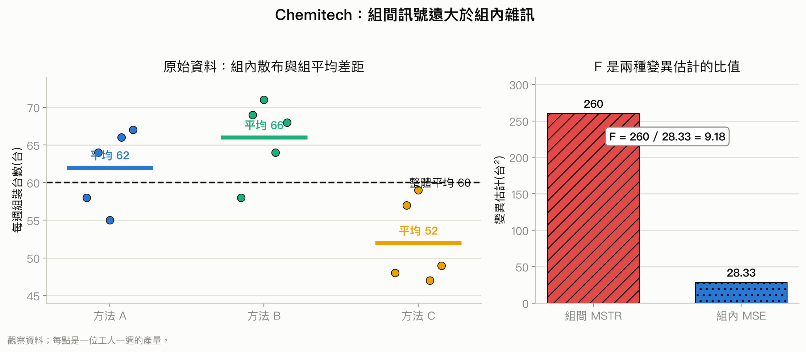
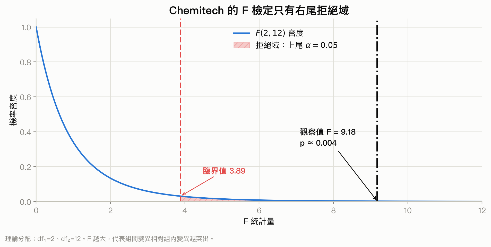
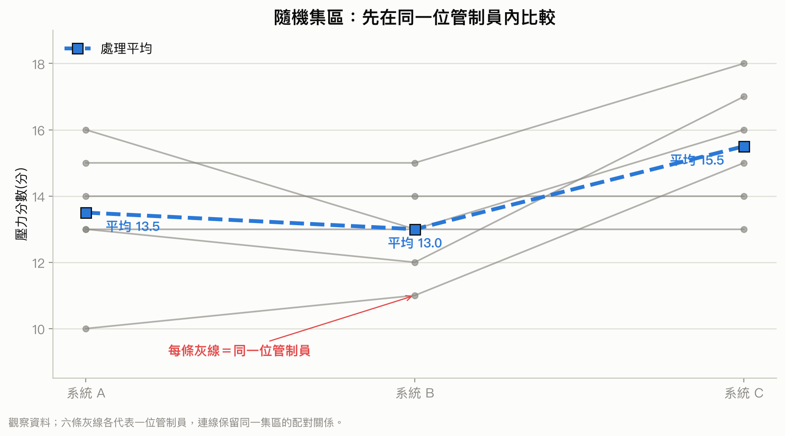
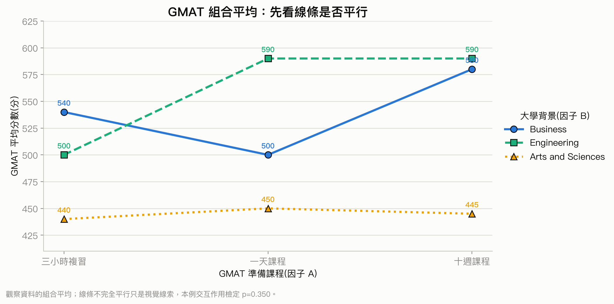

# 第 13 章：變異數分析

## 先備知識

這一章不是從零發明一套新的檢定。前半段沿用 course1 的單因子 ANOVA，後半段才把「實驗怎麼安排」擴充成完全隨機設計、隨機集區設計與二因子實驗。開始前，先確認下面三塊地基：

- **單因子 ANOVA 的整體 F 檢定：** 要能看懂一個類別因子搭配一個數值反應、組間變異和組內變異、$F=MSTR/MSE$，以及「拒絕 $H_0$ 只代表至少一組平均數不同」。若這些名詞陌生，先讀 [course1 第 11 章：單因子變異數分析](../../course_1/chapters/11-one-way-anova.md)，列印版 [p.204–222](../../output/pdf/statistics-handout-expanded.pdf#page=204)。本章的完全隨機設計會直接使用這套計算。
- **多重比較與整體型一錯誤：** 整體 ANOVA 顯著後，若想知道哪幾組不同，就會同時做多個成對比較；比較越多，至少誤判一次的風險越高。若不熟 FWER、Bonferroni 或「先做整體檢定，再定位差異」的理由，先讀 [course1 第 12 章：多重比較](../../course_1/chapters/12-multiple-comparisons.md)，列印版 [p.223–237](../../output/pdf/statistics-handout-expanded.pdf#page=223)。本章的 Fisher LSD 與 Bonferroni 會用到這個觀念。
- **實驗、隨機分派、集區與因果：** 要分得清楚觀察研究和實驗，也要知道隨機抽樣是「從母體抽誰」，隨機分派是「讓已進入研究的人接受哪個處理」。若不熟處理、實驗單位、混淆與集區，先讀 [course1 第 2 章：抽樣與實驗設計](../../course_1/chapters/02-sampling-and-experiments.md)，列印版 [p.23–39](../../output/pdf/statistics-handout-expanded.pdf#page=23)。本章能不能談因果，以及為什麼要分集區，都由研究設計決定，不是由 p 值決定。

### 先把三種資料結構分開

course1 的單因子 ANOVA 主要處理「多組獨立樣本」。course2 會再加入集區與第二個因子。先看每一筆資料是怎麼產生的，會比背設計名稱容易：

| 問題結構 | 一個實驗單位接受什麼 | 資料怎麼排 | 為什麼只用原本的 one-way ANOVA 不夠 |
| --- | --- | --- | --- |
| 完全隨機設計(completely randomized design) | 只接受一種處理 | 每一組是一批不同、彼此獨立的實驗單位 | 這正是單因子 ANOVA 的基本情形；重點是處理要隨機分派，不要把工人本來的差異誤當處理效果 |
| 隨機集區設計(randomized block design) | 同一個集區內安排所有處理；配對時，一個人也可視為一個集區 | 列是集區，欄是處理；同一列的觀測共享相似背景 | 同一集區內的觀測不是獨立樣本。若忽略列的配對關係，個人或集區差異會混進 MSE，可能蓋住處理效果 |
| 因子實驗(factorial experiment) | 接受因子 A 與因子 B 的某一個水準組合 | 每一格是一個 $A\times B$ 組合，格內要有重複觀測 | 把所有組合硬當成一個因子，只能說某些組合不同，卻無法分開 A、B 與交互作用各自貢獻多少 |

這裡有四個容易跳太快的觀念，先用白話接起來：

1. **完全隨機不等於隨機抽樣。** 完全隨機設計說的是「把處理隨機分給實驗單位」；它提高組間可比性。樣本是否能代表更大的母體，仍取決於抽樣方式。
2. **區集是控制背景差異，不是新增一個主要處理。** 例如同一位管制員依序測三種工作站時，管制員是集區、工作站才是處理。兩種處理且每人都接受兩種處理時，就是熟悉的配對結構；處理增加到三種以上後，隨機集區 ANOVA 是相同想法的延伸。
3. **因子數和水準數不同。** 「三種教學法」仍是一個因子、三個水準；「三種教學法 × 兩種年級」才是兩個因子，共有 $3\times2=6$ 個處理組合。
4. **交互作用(interaction)不是『兩個主效果都顯著』。** 它問的是「因子 A 的效果會不會隨因子 B 的水準改變」。例如折扣對新客有效、對舊客無效，甚至方向相反，就是交互作用。這種效果無法由單因子 ANOVA 或兩個主效果相加完整表達，所以二因子實驗必須另外檢定它。

若你只能先補一份，先看 course1 第 11 章；若在「獨立樣本、配對／區集、兩個因子」之間分不清楚，再回到 course1 第 2 章。多重比較則可等讀到 Fisher LSD 前再補。

## 學習目標

讀完本章後，你應該能夠：

- 分辨實驗研究和觀察研究，說明實驗單位、因子、處理與反應變數各自代表什麼。
- 根據研究設計選擇完全隨機設計、隨機集區設計或因子實驗。
- 說明單因子 ANOVA 要檢查的假設，並用 ANOVA 表完成平均數相等的 F 檢定。
- 把總變異拆成處理造成的變異和誤差造成的變異，計算 SSTR、SSE、MSTR、MSE 與 F 值。
- 正確解讀整體 F 檢定：它只能告訴你「至少有一組平均數不同」，不能直接指出是哪兩組不同。
- 在整體檢定後用 Fisher 的 LSD 與 Bonferroni 調整做成對比較，並控制多重比較造成的型一錯誤。
- 用隨機集區設計扣除已知的干擾來源，並建立相應的 ANOVA 表。
- 在二因子實驗中分辨因子 A 的主效果、因子 B 的主效果與交互作用。
- 用 p 值或臨界值寫出統計結論，並把結論翻成原始商業情境的語句。

## 本章重點一覽

變異數(variance)分析(analysis of variance, ANOVA)表面上是在分析「變異數」，實際上最常回答的是：「三組以上的母體平均數是否可以視為相同？」

核心想法是把資料的總變異拆成兩部分：

1. 組與組的平均數相差多少，稱為處理間變異。
2. 同一組裡個別觀測值散開多少，稱為組內或誤差變異。

如果處理間變異遠大於組內變異，F 值就會大，表示觀察到的組間差異不太像只是抽樣波動。完全隨機設計只研究一個因子；隨機集區設計再扣掉一個已知的干擾來源；因子實驗則同時研究兩個以上因子，還能研究「一個因子的效果是否取決於另一個因子」的交互作用。

## 內容講解

### 投影片第 1–2 頁：本章範圍

本章的主題是變異數分析，涵蓋五個部分：實驗設計與 ANOVA 導論、完全隨機設計、多重比較、隨機集區設計，以及因子實驗。最後會把三種設計的共同分析邏輯整理起來。

### 投影片第 3 頁：先看一張分組箱型圖(boxplot)

投影片用 R 的 `chickwts` 資料畫出不同飼料類型下的雞隻重量箱型圖。橫軸是飼料類型，縱軸是重量(g)。每個箱子代表一組資料的中間 50% 範圍，箱內粗線是中位數(median)，鬚表示較外圍的觀測值，圓點可能是離群值(outlier)。

從圖上可以直覺看出，不同飼料組的中心位置與散布程度可能不同。例如 horsebean 組的重量整體偏低，casein 與 sunflower 組偏高；sunflower 組還有幾個遠離箱子的觀測值。這類圖可以先幫助我們發現「組間可能有差異」，但不能單靠眼睛正式下結論，仍要使用 ANOVA。

### 投影片第 4 頁：實驗研究與觀察研究

**實驗研究(experimental study)** 會先找出感興趣的變數，再控制或指定一個以上的其他變數，最後觀察這些安排如何影響感興趣的結果。因為研究者主動安排處理，若設計與執行良好，比較有機會討論因果關係。

**觀察研究(observational study)** 通常透過樣本調查取得資料，研究者不主動把處理分配給受試者。即使抽樣設計良好，仍可能有未控制的混淆因素，因此通常不能只靠觀察資料建立因果關係。

本章介紹三種實驗設計：

- **完全隨機設計(completely randomized design)** ：把處理完全隨機分配給實驗單位。
- **隨機集區設計(randomized block design)** ：先按一個已知的重要差異分成同質集區，再在每個集區內隨機安排處理。
- **因子實驗(factorial experiment)** ：同時安排兩個或更多因子的所有組合。

三種設計都可用 ANOVA 分析。ANOVA 也可以分析觀察研究資料，但此時統計上的平均數差異不會自動變成因果關係。

### 投影片第 5–6 頁：Chemitech 問題與 ANOVA 的直覺

Chemitech 公司想知道三種組裝過濾系統的方法 A、B、C，哪一種平均每週能組裝最多台。這是一個**單因子實驗(single-factor experiment)** ：

- 因子(factor)：組裝方法，屬於類別變數。
- 處理(treatment)：因子的具體水準，也就是方法 A、B、C。
- 反應變數(response variable)，也稱依變數(dependent variable)：每週組裝台數。
- 三個處理分別對應三個想比較的母體。

主要問題不是只看三個樣本平均數誰最大，而是判斷這些平均數差異是否大到足以推論三個母體平均數不同。投影片第 6 頁的圖用汽車零件與多組貢獻資料作視覺化例子：把可比較的群組標成不同類別，提醒我們 ANOVA 的重點是「將結果依類別分組後比較平均表現」。圖中沒有提供本章計算所需的數值，因此不能從圖本身計算 F 值。

### 投影片第 7 頁：完全隨機設計與重複

研究者從工廠所有組裝工人中隨機抽出 15 人，再把三種組裝方法隨機分配給每種方法各 5 人。這就是完全隨機設計。

- 這 15 位工人是**實驗單位(experimental units)** ，也就是接受處理並產生觀測值的對象。
- 每位工人只接受一種組裝方法。
- 每種方法有 5 位工人，因此每個處理有 5 次**重複(replicates)** 。

重複很重要：若每種方法只有一位工人，我們無法分辨差異是方法造成的，還是剛好那位工人的個人能力造成的。

### 投影片第 8 頁：資料與假設

每位工人先接受訓練，再使用被分配的方法工作一週，記錄每週完成台數。資料如下。表中的樣本平均數(sample mean)、樣本變異數(sample variance)與樣本標準差(sample standard deviation)分別描述各組的中心與散布：

| 組裝方法 | 觀測值 | 樣本平均數 $\bar{x}_j$ | 樣本變異數 $s_j^2$ | 樣本標準差 $s_j$ |
| --- | --- | ---: | ---: | ---: |
| A | 58, 64, 55, 66, 67 | 62 | 27.5 | 5.244 |
| B | 58, 69, 71, 64, 68 | 66 | 26.5 | 5.148 |
| C | 48, 57, 59, 47, 49 | 52 | 31.0 | 5.568 |

我們要檢定的是：

$$
H_0: \mu_1=\mu_2=\mu_3
$$

$$
H_a: \text{並非所有母體平均數都相等}
$$

$\mu_1,\mu_2,\mu_3$ 分別是方法 A、B、C 的母體平均每週產量。對立假設不是說三組全部不同，而是只要至少有一組平均數和其他組不同，就算支持 $H_a$。

為什麼不一開始就把 A–B、A–C、B–C 各做一次兩樣本 t 檢定？因為 $k$ 組會產生 $k(k-1)/2$ 個配對；每個檢定都容許一次型一錯誤後，「至少誤判一對」的整體風險會隨比較次數增加。ANOVA 先用一個整體 F 檢定回答「是否有任何平均數差異」；只有整體結果支持差異後，才用本章後面的多重比較定位哪一對不同。若這個整體錯誤率的概念不熟，回看[先備知識中的 course1 第 12 章](../../course_1/chapters/12-multiple-comparisons.md)，列印版 [p.223–237](../../output/pdf/statistics-handout-expanded.pdf#page=223)。

### 投影片第 9 頁：ANOVA 的三個假設

使用 ANOVA 前要確認三項條件：

1. 每個母體中的反應變數近似常態分配(normal distribution)。此例表示在每一種組裝方法下，工人每週產量的分布應近似常態。
2. 各母體的反應變數變異數相同，即等變異數假設(homogeneity of variance)。此例表示三種方法下的產量散布程度應大致相近。
3. 觀測值彼此獨立(independence)。此例表示某位工人的產量不應由另一位工人的產量決定。若同一位工人被重複觀察，還要特別處理其相關性，不能假裝是獨立資料。

若常態性或等變異數只有輕微偏離，且各組樣本數相近，ANOVA 通常仍有一定的穩健性；但嚴重離群、極不等變異或明顯相關的資料會使 p 值不可靠。ANOVA 也不能修復不良的隨機分派或混淆因素。

### 投影片第 10–11 頁：為什麼要比較兩種變異估計

先想像 $H_0$ 為真，也就是三種方法其實具有相同的母體平均數。此時三個樣本平均數 $62,66,52$ 可以看成從同一個樣本平均數分配抽出的三個值。

整體平均數為：

$$
\bar{\bar{x}}=\frac{62+66+52}{3}=60
$$

三個樣本平均數的變異數為：

$$
s_{\bar{x}}^2=\frac{(62-60)^2+(66-60)^2+(52-60)^2}{3-1}=52
$$

每組樣本數為 $n=5$，而樣本平均數的變異數滿足 $\sigma_{\bar{x}}^2=\sigma^2/n$，所以可反推母體變異數：

$$
n s_{\bar{x}}^2=5(52)=260
$$

這種從組與組的平均數差距反推的估計，稱為**處理間變異估計(between-treatments estimate)** 。

反過來，若 $H_0$ 不成立，三個平均數來自不同的母體分配。這時可以把各組自己的樣本變異數合併，得到組內變異估計：

$$
\frac{27.5+26.5+31.0}{3}=28.33
$$

這叫做**處理內變異估計(within-treatments estimate)** 或 pooled estimate。組內差異主要反映個體與隨機誤差，無論母體平均數是否相同，都能提供共同變異數的無偏估計。相反地，當母體平均數真的不同時，處理間變異會把「平均數彼此不同」也算進去，因此往往高估真正的母體變異數。



你該注意什麼：左圖的點是組內雜訊、粗短線之間的距離是組間訊號；右圖把兩者變成同單位的變異估計後，才可用 $F=260/28.33=9.18$ 比較。

### 投影片第 12 頁：處理間平方和與平均平方

處理間變異的正式名稱是**處理平方和(sum of squares due to treatments, SSTR)** ，再除以自由度後稱為**處理平均平方(mean square due to treatments, MSTR)** 。

<a id="formula-anova-between"></a>

**處理平均平方 MSTR：** 它衡量各處理平均數相對於整體平均數的加權散布，作為處理間變異估計。

$$
MSTR=\frac{SSTR}{k-1}
$$

$$
SSTR=\sum_{j=1}^{k}n_j(\bar{x}_j-\bar{\bar{x}})^2
$$

符號說明：$k$ 是處理數；$n_j$ 是第 $j$ 個處理的樣本數；$\bar{x}_j$ 是第 $j$ 個處理的樣本平均數；$\bar{\bar{x}}$ 是所有觀測值的整體平均數；$SSTR$ 的單位是反應變數單位的平方，$MSTR$ 也是同樣的平方單位；$k-1$ 是分子自由度。

適用條件是資料已依一個類別因子分組，且每組都有平均數。當你想衡量「組平均數離總平均數多遠」時使用它；它不是單一兩組差異的公式，也不能單獨告訴你是哪一對平均數不同。樣本數不相同時一定要保留權重 $n_j$，不能只把各組平均數直接平均。

### 投影片第 13 頁：組內平方和與誤差平均平方

組內每個觀測值偏離自己組平均數的程度，形成**誤差平方和(sum of squares due to error, SSE)** 。除以組內自由度後得到**誤差平均平方(mean square error, MSE)** 。

<a id="formula-anova-within"></a>

**誤差平均平方 MSE：** 它估計同一處理內個體差異與隨機誤差的共同變異數。

$$
MSE=\frac{SSE}{n_T-k}
$$

$$
SSE=\sum_{j=1}^{k}(n_j-1)s_j^2
$$

符號說明：$n_T=\sum_j n_j$ 是總觀測數；$s_j^2$ 是第 $j$ 組的樣本變異數；$n_T-k$ 是分母自由度；$SSE$ 與 $MSE$ 的單位都是反應變數單位的平方。

適用條件是每組內有可計算的樣本變異數。它是 F 檢定的分母，代表「沒有被處理平均數解釋的典型變異」。不要用各組樣本變異數的簡單平均取代它，除非各組樣本數都相同；一般情形要用 $(n_j-1)$ 加權。

### 投影片第 14–17 頁：完全隨機設計的 F 檢定(F test)

先寫假設：

$$
H_0:\mu_1=\mu_2=\cdots=\mu_k
$$

$$
H_a:\text{並非所有母體平均數都相等}
$$

若 $H_0$ 為真，MSTR 與 MSE 都是在估計同一個 $\sigma^2$，而且兩者可視為獨立。因此用兩個估計的比值來衡量組間差異是否過大。

<a id="formula-anova-f"></a>

**完全隨機設計的 F 統計量：**

$$
F=\frac{MSTR}{MSE}
$$

符號說明：分子 MSTR 是處理間變異估計，分母 MSE 是組內誤差變異估計；在 $H_0$ 成立且 ANOVA 假設成立時，$F$ 服從分子自由度 $df_1=k-1$、分母自由度 $df_2=n_T-k$ 的 F 分配。

判斷線索：F 值接近 1，表示兩種變異估計相近，組平均數差異可能只是抽樣波動；F 值很大，表示組間差異相對組內雜訊很大。這是右尾檢定，因為只有「組間變異特別大」才支持平均數不全相等。p 值法在 $p\text{-value}\leq\alpha$ 時拒絕 $H_0$；臨界值法在 $F\geq F_\alpha$ 時拒絕 $H_0$。不能用雙尾 t 檢定的拒絕規則直接套在整體 F 檢定上。

### 投影片第 15 頁：Chemitech 的計算

此例 $k=3$、$n_1=n_2=n_3=5$、$n_T=15$、整體平均數 $\bar{\bar{x}}=60$。

先算處理平方和：

$$
SSTR=5(62-60)^2+5(66-60)^2+5(52-60)^2=520
$$

再算處理平均平方：

$$
MSTR=\frac{520}{3-1}=260
$$

組內平方和為：

$$
SSE=(5-1)(27.5)+(5-1)(26.5)+(5-1)(31.0)=340
$$

誤差平均平方為：

$$
MSE=\frac{340}{15-3}=28.33
$$

所以：

$$
F=\frac{260}{28.33}=9.18
$$

這個 F 值的意思是：組平均數造成的變異估計約為組內誤差變異估計的 9.18 倍。

### 投影片第 16 頁：p 值(p-value)法

此例的自由度為 $df_1=3-1=2$、$df_2=15-3=12$。F 分配是右尾分配，投影片列出的上尾臨界值為：

| 上尾面積 | 0.10 | 0.05 | 0.025 | 0.01 |
| --- | ---: | ---: | ---: | ---: |
| $F(2,12)$ 臨界值 | 2.81 | 3.89 | 5.10 | 6.93 |

因為 $F=9.18>6.93$，所以 p 值小於或等於 $0.01$。若顯著水準 $\alpha=0.05$，有 $p\text{-value}\leq 0.01<0.05$，拒絕 $H_0$。結論是三種組裝方法的母體平均每週產量並不全相等。這不等於已經證明三種方法兩兩都不同。

### 投影片第 17 頁：臨界值法

若 $\alpha=0.05$，分子自由度 2、分母自由度 12 的右尾臨界值是 $F_{0.05}=3.89$。Excel 可用 `F.INV.RT(0.05,2,12)` 計算，得到 3.89。

拒絕規則為：

$$
\text{若 }F\geq 3.89\text{，拒絕 }H_0
$$

因為觀察到 $F=9.18\geq 3.89$，所以得到和 p 值法相同的結論。考試時兩種方法擇一即可，但都要先確認自由度順序是分子在前、分母在後。



你該注意什麼：F 檢定只看右尾；本例的 $9.18$ 不只超過 $\alpha=0.05$ 的臨界值 $3.89$，其右尾面積也只有約 $0.004$。

### 投影片第 18–19 頁：ANOVA 表

完全隨機設計的 ANOVA 表把總變異拆開：

| 變異來源 | 平方和 | 自由度 | 平均平方 | F | p 值 |
| --- | ---: | ---: | ---: | ---: | ---: |
| 處理 | SSTR | $k-1$ | $MSTR=SSTR/(k-1)$ | $MSTR/MSE$ | $P(F\geq MSTR/MSE)$ |
| 誤差 | SSE | $n_T-k$ | $MSE=SSE/(n_T-k)$ |  |  |
| 總和 | SST | $n_T-1$ |  |  |  |

<a id="formula-anova-ss-decomposition"></a>

**平方和與自由度分解：**

$$
SST=SSTR+SSE
$$

$$
n_T-1=(k-1)+(n_T-k)
$$

$SST$ 是把全部觀測值當成一組時的總平方和，除以 $n_T-1$ 就是整體樣本變異數。這兩條分解式是 ANOVA 表的檢查工具：表內平方和應加總，表內自由度也應加總；若加不回去，通常是計算或抄表錯誤。

Chemitech 的表為：

| 變異來源 | 平方和 | 自由度 | 平均平方 | F | p 值 |
| --- | ---: | ---: | ---: | ---: | ---: |
| 處理 | 520 | 2 | 260 | 9.18 | 0.004 |
| 誤差 | 340 | 12 | 28.33 |  |  |
| 總和 | 860 | 14 |  |  |  |

檢查：$SST=520+340=860$，$14=2+12$，且 $260/28.33=9.18$。投影片以軟體列出的精確 p 值約為 0.004，和查表得到的 $p\text{-value}\leq 0.01$ 相容。

### 投影片第 20 頁：各母體平均數的區間估計(confidence interval)

ANOVA 的 MSE 可用來建立各處理平均數的共同 pooled 標準差估計：

<a id="formula-anova-pooled-sd"></a>

$$
s=\sqrt{MSE}=\sqrt{28.33}=5.323
$$

對第 $i$ 個處理的母體平均數，使用 t 分配建立區間：

<a id="formula-anova-ci-mean"></a>

$$
\bar{x}_i\pm t_{\alpha/2,\,n_T-k}\frac{s}{\sqrt{n_i}}
$$

符號說明：$\bar{x}_i$ 是第 $i$ 組樣本平均數；$s=\sqrt{MSE}$ 是 pooled 標準差估計；$n_i$ 是該組樣本數；$t_{\alpha/2,\,n_T-k}$ 是分母自由度為 $n_T-k$ 的 t 臨界值；區間的單位和反應變數相同。

此公式適合在 ANOVA 設計與共同變異數假設合理時估計某一組母體平均數。不要把同一個樣本平均數的區間解讀成「母體平均數落在此固定區間的機率」；95% 信賴區間是長期重複抽樣程序的涵蓋率敘述。

Chemitech 中 $1-\alpha=0.95$、自由度 $15-3=12$、$t_{0.025,12}=2.179$。方法 A：

$$
62\pm 2.179\frac{5.323}{\sqrt{5}}=62\pm 5.19=(56.81,67.19)
$$

方法 B 與 C 的 95% 信賴區間分別是 $(60.81,71.19)$ 與 $(46.81,57.19)$。這些區間有助於描述各方法平均產量的不確定性，但「區間重疊與否」不是正式的整體或成對檢定規則。

### 投影片第 21–23 頁：用圖形先觀察組間差異

投影片再次用六種飼料的雞隻重量箱型圖示範探索性分析。箱型圖顯示各組的中心、散布、偏態與可能離群值；casein、sunflower 的中心較高，horsebean 較低，而 sunflower 有幾個高低離群點。

下一頁列出飼料兩兩比較的 t 檢定 p 值。表中的下三角資料為：

| 比較 | p 值 |
| --- | ---: |
| casein vs horsebean | $<0.001$ |
| casein vs linseed | $<0.001$ |
| horsebean vs linseed | 0.094 |
| casein vs meatmeal | 0.182 |
| horsebean vs meatmeal | $<0.001$ |
| linseed vs meatmeal | 0.094 |
| casein vs soybean | 0.005 |
| horsebean vs soybean | 0.003 |
| linseed vs soybean | 0.518 |
| meatmeal vs soybean | 0.518 |
| casein vs sunflower | 0.012 |
| horsebean vs sunflower | $<0.001$ |
| linseed vs sunflower | $<0.001$ |
| meatmeal vs sunflower | 0.132 |
| soybean vs sunflower | 0.003 |

這張表的用途是讓你看見「兩兩各做一次 t 檢定」的做法，但也埋下多重比較問題：檢定次數一多，至少誤判一次的機率會上升，所以不能只逐格看 0.05 而不調整。

第三張圖比較兩種箱型圖情況。左圖四組的中心差距相對大，較可能存在真實處理差異；右圖各組中心與散布較接近，較不容易看出真實差異。這只是資料探索與設計檢查，不是正式證明；正式判斷仍須依 ANOVA 及多重比較程序。

### 投影片第 24–28 頁：Fisher 的 LSD 多重比較(multiple comparisons)

整體 ANOVA 若拒絕 $H_0$，我們知道至少有一組平均數不同，接著才問「哪一對不同？」Fisher 的最小顯著差異法(Fisher's Least Significant Difference, LSD) 可以比較第 $i$ 組和第 $j$ 組。

成對假設為：

$$
H_0:\mu_i=\mu_j,\qquad H_a:\mu_i\ne\mu_j
$$

<a id="formula-anova-lsd-t"></a>

**Fisher LSD 的 t 統計量：**

$$
t=\frac{\bar{x}_i-\bar{x}_j}{\sqrt{MSE\left(\frac{1}{n_i}+\frac{1}{n_j}\right)}}
$$

符號說明：$\bar{x}_i-\bar{x}_j$ 是兩組樣本平均數差；$MSE$ 是前面整體 ANOVA 的誤差平均平方；$n_i,n_j$ 是兩組樣本數；t 分配自由度為 $n_T-k$。假設與 ANOVA 相同，並且成對比較使用同一個合理的 MSE。

雙尾 p 值法是 $p\text{-value}\leq\alpha$ 時拒絕；臨界值法是 $t\leq-t_{\alpha/2}$ 或 $t\geq t_{\alpha/2}$ 時拒絕。這個 t 檢定適合在整體 ANOVA 已指出有差異後定位差異，不應在尚未做整體檢定時無限制地反覆試很多配對。

實務上較容易直接比較「平均數差的絕對值」與 LSD：

<a id="formula-anova-lsd-threshold"></a>

**LSD 門檻：**

$$
LSD=t_{\alpha/2,\,n_T-k}\sqrt{MSE\left(\frac{1}{n_i}+\frac{1}{n_j}\right)}
$$

$$
\text{若 }|\bar{x}_i-\bar{x}_j|\geq LSD\text{，拒絕 }H_0
$$

LSD 的單位和原始反應變數相同。樣本數越大，門檻通常越小；MSE 越大，門檻越大。不能把 LSD 當成新的樣本平均數，也不能忘記使用 ANOVA 的誤差自由度。

Chemitech 比較方法 A 與 C：平均數差為 $62-52=10$。$df=12$ 時，雙尾 $t_{0.025}=2.179$，因此

$$
LSD=2.179\sqrt{28.33\left(\frac{1}{5}+\frac{1}{5}\right)}=7.34
$$

因為 $|10|=10\geq7.34$，拒絕 $H_0$，判斷 A 與 C 的母體平均產量不同。

三組樣本數相同，因此三個配對共用同一個 $LSD=7.34$：

- A vs B：$|62-66|=4<7.34$，不拒絕 $H_0$。
- A vs C：$|62-52|=10\geq7.34$，拒絕 $H_0$。
- B vs C：$|66-52|=14\geq7.34$，拒絕 $H_0$。

因此可說 C 的母體平均產量和 A、B 都有差異；A 與 B 的差異則沒有足夠證據。

LSD 也可直接形成兩個母體平均數差的信賴區間：

<a id="formula-anova-lsd-ci"></a>

$$
(\mu_i-\mu_j)\text{ 的區間估計}=(\bar{x}_i-\bar{x}_j)\pm LSD
$$

符號和 LSD 門檻相同，區間使用 $n_T-k$ 個自由度。若區間包含 0，就不能拒絕「兩母體平均數相等」；若不包含 0，就支持兩者有差異。Chemitech 的 95% 區間為：

| 比較 | 計算 | 95% 區間 |
| --- | --- | --- |
| A - B | $-4\pm7.34$ | $(-11.34,3.34)$ |
| A - C | $10\pm7.34$ | $(2.66,17.34)$ |
| B - C | $14\pm7.34$ | $(6.66,21.34)$ |

A - B 的區間包含 0，與不拒絕相符；另外兩個區間不包含 0，與拒絕相符。

投影片第 29 頁的 Chemitech 箱型圖顯示 A、B 的中心位置接近且箱體有重疊，C 的中心明顯較低；圖形和 LSD 的數值結論方向一致。圖形只能作為檢查與直覺輔助，正式結論仍以檢定與區間為準。

### 投影片第 30–32 頁：多重比較與型一錯誤

每次在真的 $H_0$ 下拒絕它，都是**型一錯誤(Type I error)** 。單一成對比較的顯著水準 $\alpha$ 稱為 comparisonwise Type I error rate。

若有 $k$ 個處理，兩兩比較的數目是：

<a id="formula-anova-pair-count"></a>

$$
C=\binom{k}{2}=\frac{k!}{2!(k-2)!}
$$

若把每一個比較都用同一個 $\alpha$，並以比較彼此獨立作為直覺近似，整個實驗至少出現一次型一錯誤的機率為：

<a id="formula-anova-experimentwise-error"></a>

$$
\alpha_{ew}=1-(1-\alpha)^C
$$

符號說明：$C$ 是比較次數；$\alpha$ 是單次比較的錯誤率；$\alpha_{ew}$ 是 experimentwise Type I error rate。這個公式用來提醒錯誤率會隨比較次數增加；實際比較之間可能相關，因此把它視為說明問題的近似，而不是所有程序的精確通式。

Chemitech 有 $k=3$，所以 $C=3$。若每次 $\alpha=0.05$：

$$
\alpha_{ew}=1-(1-0.05)^3=0.143
$$

換成 4 組時 $C=6$，$\alpha_{ew}=0.265$；換成 5 組時 $C=10$，$\alpha_{ew}=0.401$。因此組數越多，逐一做未調整檢定越容易至少誤判一次。

**Bonferroni 調整(Bonferroni adjustment)** 的做法是把每一個比較的顯著水準降為 $\alpha/C$ ：

<a id="formula-anova-bonferroni"></a>

$$
\alpha_{\text{each}}=\frac{\alpha}{C}
$$

使用修正後的單次水準時，Chemitech 的 $\alpha_{\text{each}}=0.05/3=0.0167$，對應的實驗整體錯誤率約為：

$$
1-(1-0.05/3)^3\approx0.049
$$

4 組時 $\alpha/C=0.05/6=0.0083$，5 組時 $\alpha/C=0.05/10=0.005$；兩者的近似整體錯誤率也約為 0.049。Bonferroni 的代價是固定樣本數下，降低型一錯誤通常會提高型二錯誤，讓真正差異比較不容易被發現。投影片也提到 Tukey 的 HSD 與 Duncan 的多重全距檢定是其他多重比較選項。

### 投影片第 33–38 頁：隨機集區設計

完全隨機設計假設實驗單位在處理之外相當同質。若工人、病人、班級或其他實驗單位本身差異很大，這些差異會被塞進 MSE，使分母變大、F 值變小，可能把真實的處理差異掩蓋掉。

先把資料想成一張「同類放同列」的表：每一列是一個集區，每一欄是一種處理。比較處理時，重點不是拿完全不相關的人硬比，而是在相似背景內比較各處理，再把所有集區的證據合起來。若每個集區只有兩個處理，這個結構很像配對資料；當處理有三個以上時，配對 t 檢定已不能一次處理全部平均數，這正是隨機集區 ANOVA 要接手的地方。

**隨機集區設計(randomized block design)** 的做法是先把具有相似背景的實驗單位分成同質集區(blocks)，再在每個集區中隨機安排各種處理。集區吸收了已知的額外變異，剩下的 MSE 通常更小，因此檢定處理差異的能力更強。集區本身不是主要研究問題，而是用來控制干擾的設計因素。

令 $k$ 為處理數、$b$ 為集區數，且每個集區都接受每一個處理，所以總觀測數 $n_T=kb$。

<a id="formula-anova-block-decomp"></a>

**隨機集區設計的平方和分解：**

$$
SST=SSTR+SSBL+SSE
$$

其中 SSTR 是處理平方和，SSBL 是集區平方和，SSE 是誤差平方和。自由度分解為：

<a id="formula-anova-block-df"></a>

$$
n_T-1=(k-1)+(b-1)+(k-1)(b-1)
$$

ANOVA 表為：

| 變異來源 | 平方和 | 自由度 | 平均平方 | F | p 值 |
| --- | ---: | ---: | ---: | ---: | ---: |
| 處理 | SSTR | $k-1$ | $MSTR=SSTR/(k-1)$ | $MSTR/MSE$ | $P(F\geq MSTR/MSE)$ |
| 集區 | SSBL | $b-1$ | $MSBL=SSBL/(b-1)$ |  |  |
| 誤差 | SSE | $(k-1)(b-1)$ | $MSE=SSE/[(k-1)(b-1)]$ |  |  |
| 總和 | SST | $n_T-1$ |  |  |  |

處理的 F 檢定仍然是 MSTR 除以 MSE；集區的平方和只是先把已知的集區差異拿出來，並不表示我們一定要把集區效果當成主要結論。

隨機集區設計不能把「獨立」理解成同一集區內的原始觀測彼此毫無關係；它們正是因為共享相同背景才被放在同一集區。標準模型假設扣除處理效果與集區效果後，剩餘誤差彼此獨立、近似常態且具有共同變異數。每個「處理 × 集區」組合只有一筆觀測，因此處理與集區的交互作用無法和誤差分開估計；這張 ANOVA 表也隱含兩種效果可相加、沒有交互作用的假設。

#### Air Traffic Controller 壓力測試

研究者比較三種工作站 A、B、C 是否能降低空中交通管制員的疲勞與壓力。因為每位管制員的個人差異可能很大，所以採隨機集區設計：

- 因子是工作站。
- 三種工作站是三個處理。
- 六位管制員是六個集區。
- 每位管制員都使用三種工作站，但使用順序隨機。
- 反應變數是後續訪談與醫療檢查測得的壓力分數。

資料表如下，欄是處理，列是集區：

| 管制員集區 | 系統 A | 系統 B | 系統 C | 列總和 | 列平均 |
| --- | ---: | ---: | ---: | ---: | ---: |
| 1 | 15 | 15 | 18 | 48 | 16.0 |
| 2 | 14 | 14 | 14 | 42 | 14.0 |
| 3 | 10 | 11 | 15 | 36 | 12.0 |
| 4 | 13 | 12 | 17 | 42 | 14.0 |
| 5 | 16 | 13 | 16 | 45 | 15.0 |
| 6 | 13 | 13 | 13 | 39 | 13.0 |
| 欄總和 | 81 | 78 | 93 | 252 |  |
| 處理平均 | 13.5 | 13.0 | 15.5 |  | 整體平均 $\bar{\bar{x}}=14.0$ |



你該注意什麼：每條灰線都保留同一位管制員的配對關係；集區 ANOVA 先扣除「有些人本來就較緊張」的差異，再比較三個系統的平均壓力。

計算依序如下：

1. 總平方和：

   $$
   SST=\sum_{i=1}^{b}\sum_{j=1}^{k}(x_{ij}-\bar{\bar{x}})^2=70
   $$

2. 處理平方和：

   $$
   SSTR=b\sum_{j=1}^{k}(\bar{x}_j-\bar{\bar{x}})^2=6[(13.5-14)^2+(13.0-14)^2+(15.5-14)^2]=21
   $$

3. 集區平方和：

   $$
   SSBL=k\sum_{i=1}^{b}(\bar{x}_i-\bar{\bar{x}})^2=3[(16-14)^2+(14-14)^2+(12-14)^2+\cdots+(13-14)^2]=30
   $$

4. 誤差平方和：

   $$
   SSE=SST-SSTR-SSBL=70-21-30=19
   $$

自由度是處理 2、集區 5、誤差 $(3-1)(6-1)=10$、總和 17。平均平方為 $MSTR=21/2=10.5$、$MSBL=30/5=6.0$、$MSE=19/10=1.9$。因此：

$$
F=\frac{MSTR}{MSE}=\frac{10.5}{1.9}=5.53
$$

表中為：

| 變異來源 | 平方和 | 自由度 | 平均平方 | F | p 值 |
| --- | ---: | ---: | ---: | ---: | ---: |
| 處理 | 21 | 2 | 10.5 | 5.53 | 0.024 |
| 集區 | 30 | 5 | 6.0 |  |  |
| 誤差 | 19 | 10 | 1.9 |  |  |
| 總和 | 70 | 17 |  |  |  |

查 F 分配表時，$df_1=2$、$df_2=10$，$F=5.53$ 位於 $F_{0.025}=5.46$ 與 $F_{0.01}=7.56$ 之間，所以 $0.01\leq p\text{-value}\leq0.025$；軟體給的 p 值約為 0.024。以 $\alpha=0.05$ 判斷，拒絕處理平均數相等的假設，結論是至少有一種工作站的平均壓力分數不同。

### 投影片第 39–40 頁：二因子實驗

完全隨機設計與隨機集區設計主要回答一個因子的差異。**因子實驗(factorial experiment)** 同時研究兩個或更多因子，而且包含所有可能的因子水準組合。

為什麼 one-way ANOVA 不夠？假設商店同時測試「折扣方案」與「會員身分」。若只比較所有折扣組的平均營收，會員身分的差異會被混在裡面；若只比較會員與非會員，又會把折扣效果平均掉。因子實驗保留每一個「折扣 $\times$ 會員身分」組合，因此可以把問題拆成三個：折扣平均而言有沒有效、會員身分平均而言有沒有差，以及折扣效果是否因會員身分而改變。

最後一個問題就是交互作用。沒有交互作用時，不同會員身分下的折扣效果方向與幅度大致一致；有交互作用時，不能只看折扣或會員身分的整體平均，因為平均後可能把真正的條件差異藏起來。符號上，因子 A 有 $a$ 個水準、因子 B 有 $b$ 個水準，每個 $A\times B$ 組合有 $r$ 筆重複觀測；一筆資料可記為 $x_{ijl}$，其中 $i$ 指 A 水準、$j$ 指 B 水準、$l$ 指該組合中的第幾次重複。

若因子 A 有 $a$ 個水準、因子 B 有 $b$ 個水準，每一個組合都收集 $r$ 次重複觀測，則：

- 處理組合數為 $ab$。
- 總觀測數為 $n_T=abr$。
- 例如 $a=3,b=3$ 時有 9 個處理組合。

二因子 ANOVA 把總變異拆成四部分：因子 A、因子 B、A 與 B 的交互作用，以及誤差。

<a id="formula-anova-factorial-decomp"></a>

$$
SST=SSA+SSB+SSAB+SSE
$$

<a id="formula-anova-factorial-df"></a>

$$
n_T-1=(a-1)+(b-1)+(a-1)(b-1)+ab(r-1)
$$

ANOVA 表為：

| 變異來源 | 平方和 | 自由度 | 平均平方 | F | p 值 |
| --- | ---: | ---: | ---: | ---: | ---: |
| 因子 A | SSA | $a-1$ | $MSA=SSA/(a-1)$ | $MSA/MSE$ | $P(F\geq MSA/MSE)$ |
| 因子 B | SSB | $b-1$ | $MSB=SSB/(b-1)$ | $MSB/MSE$ | $P(F\geq MSB/MSE)$ |
| 交互作用 | SSAB | $(a-1)(b-1)$ | $MSAB=SSAB/[(a-1)(b-1)]$ | $MSAB/MSE$ | $P(F\geq MSAB/MSE)$ |
| 誤差 | SSE | $ab(r-1)$ | $MSE=SSE/[ab(r-1)]$ |  |  |
| 總和 | SST | $n_T-1$ |  |  |  |

每一列的 F 都是「該來源的平均平方除以 MSE」，但每一列檢定的問題不同。這個二因子 ANOVA 也假設各處理組合內的誤差彼此獨立、近似常態且具有共同變異數。每個處理組合需要有重複觀測，才能把純誤差和交互作用分開；若每格只有一筆觀測，就不能用這張表單獨檢定交互作用。

### 投影片第 41–43 頁：GMAT 二因子實驗

一所德州大學想比較三種 GMAT 準備課程：三小時複習、一天課程、十週密集課程。第二個因子是學生的大學背景：商學院、工程學院、文理學院。每個學院與課程組合抽兩位學生，總共有 $3\times3=9$ 個組合、18 個觀測值。

GMAT 分數資料如下：

| 準備課程 \ 大學背景 | Business | Engineering | Arts and Sciences |
| --- | ---: | ---: | ---: |
| 三小時複習 | 500, 580 | 540, 460 | 480, 400 |
| 一天課程 | 460, 540 | 560, 620 | 420, 480 |
| 十週課程 | 560, 600 | 600, 580 | 480, 410 |

因子 A 是準備課程，因子 B 是大學背景，反應變數是 GMAT 分數。二因子分析同時回答：

- **A 的主效果(main effect)** ：三種準備課程的平均 GMAT 分數是否不同？
- **B 的主效果** ：三種大學背景的平均 GMAT 分數是否不同？
- **交互作用(interaction effect)** ：準備課程的效果是否會依大學背景而改變？

整理平均數：

| 準備課程 | Business 平均 | Engineering 平均 | Arts and Sciences 平均 | 列總和 | 因子 A 平均 |
| --- | ---: | ---: | ---: | ---: | ---: |
| 三小時複習 | 540 | 500 | 440 | 2960 | 493.33 |
| 一天課程 | 500 | 590 | 450 | 3080 | 513.33 |
| 十週課程 | 580 | 590 | 445 | 3230 | 538.33 |
| 欄總和 | 3240 | 3360 | 2670 | 9270 | 整體平均 515 |
| 因子 B 平均 | 540 | 560 | 445 |  |  |

投影片第 43 頁有一處把十週課程的因子 A 平均印成 528.33；但列總和為 3230，且 $3230/6=538.33$，因此後續計算使用數學一致的 538.33。這是投影片表格中的排版誤植，不是新的統計方法。



你該注意什麼：線條不平行只是交互作用的視覺線索，不能代替 F 檢定；本例交互作用的 $p=0.350$，所以沒有足夠證據認為課程效果會隨大學背景改變。

### 投影片第 42–46 頁：二因子平方和與結論

先計算總平方和：

<a id="formula-anova-sst-factorial"></a>

$$
SST=\sum_{i=1}^{a}\sum_{j=1}^{b}\sum_{l=1}^{r}(x_{ijl}-\bar{\bar{x}})^2=82{,}450
$$

因子 A 的平方和使用每個 A 水準的平均數。每個 A 平均數由 $br=3\times2=6$ 筆觀測支撐：

<a id="formula-anova-ssa"></a>

$$
SSA=br\sum_{i=1}^{a}(\bar{x}_{i\cdot\cdot}-\bar{\bar{x}})^2=6[(493.33-515)^2+(513.33-515)^2+(538.33-515)^2]=6{,}100
$$

因子 B 的平方和使用每個 B 水準的平均數，每個 B 平均數由 $ar=3\times2=6$ 筆觀測支撐：

<a id="formula-anova-ssb"></a>

$$
SSB=ar\sum_{j=1}^{b}(\bar{x}_{\cdot j\cdot}-\bar{\bar{x}})^2=6[(540-515)^2+(560-515)^2+(445-515)^2]=45{,}300
$$

交互作用平方和衡量「某個組合的平均數」偏離「由兩個主效果相加所預期的平均數」多少：

<a id="formula-anova-ssab"></a>

$$
SSAB=r\sum_{i=1}^{a}\sum_{j=1}^{b}(\bar{x}_{ij\cdot}-\bar{x}_{i\cdot\cdot}-\bar{x}_{\cdot j\cdot}+\bar{\bar{x}})^2=11{,}200
$$

符號說明：$\bar{x}_{ij\cdot}$ 是 A 的第 $i$ 水準與 B 的第 $j$ 水準組合平均；$\bar{x}_{i\cdot\cdot}$ 是 A 水準平均；$\bar{x}_{\cdot j\cdot}$ 是 B 水準平均；$\bar{\bar{x}}$ 是總平均；$r$ 是每個組合的重複數。這個公式適用於每個組合有相同的 $r$ 次重複，且用來找「組合效果是否超過兩個主效果單獨相加的預期」。

最後用總和扣掉前三種可解釋來源：

<a id="formula-anova-sse-factorial"></a>

$$
SSE=SST-SSA-SSB-SSAB=82{,}450-6{,}100-45{,}300-11{,}200=19{,}850
$$

在本例中 $a=b=3,r=2,n_T=18$。二因子 ANOVA 表為：

| 變異來源 | 平方和 | 自由度 | 平均平方 | F | p 值 |
| --- | ---: | ---: | ---: | ---: | ---: |
| 因子 A | 6,100 | 2 | 3,050 | 1.38 | 0.299 |
| 因子 B | 45,300 | 2 | 22,650 | 10.27 | 0.005 |
| 交互作用 | 11,200 | 4 | 2,800 | 1.27 | 0.350 |
| 誤差 | 19,850 | 9 | 2,206 |  |  |
| 總和 | 82,450 | 17 |  |  |  |

例如因子 B 的 F 值是 $22{,}650/2{,}206=10.27$；各列都以相同的 $MSE=2{,}206$ 作分母。

以 $\alpha=0.05$ 解讀：

- 因子 A：$p=0.299>0.05$，沒有足夠證據認為三種準備課程的平均 GMAT 分數不同。
- 因子 B：$p=0.005\leq0.05$，有證據顯示三種大學背景的平均 GMAT 分數至少有一組不同。
- 交互作用：$p=0.350>0.05$，沒有足夠證據認為準備課程效果會依大學背景而改變。

沒有顯著交互作用時，可以較直接地解讀主效果：本研究沒有證據顯示三種課程對不同學院有不同效果。唯一顯著的是大學背景；各組平均數顯示 Arts and Sciences 的平均分數較低，但「哪兩個學院的平均數不同」仍需要適當的事後成對比較，不能只因 B 的整體 F 檢定顯著就宣稱所有兩兩差異都顯著。

### 投影片第 47 頁：全章整理

- ANOVA 用來檢定多個母體或處理的平均數是否有差異。
- 完全隨機設計與隨機集區設計都可研究單一因子的平均數差異。
- 隨機集區設計把已知的額外變異移出誤差項，通常能得到更好的誤差估計與更有力的處理檢定。
- 因子實驗同時分析兩個以上因子，並可檢定交互作用。
- 所有設計的共同步驟是先把平方和與自由度分配給不同變異來源，再用平均平方的比值形成 F 統計量。
- 整體 ANOVA 只能先回答「是否至少有一組不同」；若要找出具體哪幾組不同，要使用 Fisher 的 LSD、Bonferroni 或其他合適的多重比較程序。

### 全章解題流程

遇到 ANOVA 題目，可以依序做以下檢查：

1. 先辨認研究設計：只有一個因子且完全隨機分組，使用完全隨機設計；有一個已知干擾來源且每個集區接受全部處理，使用隨機集區設計；同時有兩個因子，使用二因子 ANOVA。
2. 寫出 $H_0$ 與 $H_a$，注意 $H_a$ 是「並非全部相等」，不是「每一組都不同」。
3. 確認模型誤差的常態性、等變異與獨立性；隨機集區還要確認集區確實控制重要的背景差異，且加成模型合理。
4. 算平方和、自由度、平均平方，先用平方和與自由度加總檢查表格。
5. 算 F 值，確認分母是 MSE，並使用正確的分子與分母自由度。
6. 用 p 值或臨界值和 $\alpha$ 比較，寫出統計結論，再翻譯成原始問題的語句。
7. 只有在需要定位差異時才做成對比較，並注意多重比較造成的型一錯誤膨脹。

## 跟前面像的東西怎麼分

先不要看題目是否出現 `ANOVA`、`t`、`F` 或 `chi-square` 這些名字。遇到沒有標章節的題目，依序問四件事：應變數是數值還是類別、要比平均數還是比比例或關聯、觀測值是獨立還是配對、題目有一個還是兩個因子。

### 比較 1：單因子 ANOVA vs 兩獨立樣本 t 檢定

| 方法 | 資料／問題長相 | 何時用本章方法 | 何時用前面方法 | 關鍵輸出或假設 |
| --- | --- | --- | --- | --- |
| 單因子 ANOVA | 一個類別因子、一個數值應變數，通常要同時比較三組以上的母體平均數 | 想先做一個整體問題：「所有組平均數是否全部相等？」用本章的 [整體 F 檢定](#formula-anova-f) | 若只有兩批不同受試者，而且問題是兩母體平均差，用前面的 [兩獨立樣本 Welch t 檢定](07-10-review-estimation-and-testing.md#formula-test-difference-t) | ANOVA 要檢查獨立、組內近似常態與等變異；整體 F 顯著只表示至少一組不同。Welch t 可直接輸出兩組平均差的方向、檢定與區間，且不強迫兩組等變異 |

**一句話判斷準則：** 應變數是數值且要一次比三組以上平均數，選 ANOVA；只有兩個獨立群體時，選兩獨立樣本 t 方法更直接。

**容易誤選情境：** 某公司只比較 A、B 兩家獨立門市的平均等待時間，因為看到「比平均數」就套三組 ANOVA 流程。這時 Welch t 檢定就能直接回答 A 減 B 的方向與大小；ANOVA 的整體結論只會說兩個平均數是否相等，沒有增加新資訊。

### 比較 2：完全隨機設計 vs 隨機集區設計 vs 配對 t

| 方法 | 資料／問題長相 | 何時用本章方法 | 何時用前面方法 | 關鍵輸出或假設 |
| --- | --- | --- | --- | --- |
| 完全隨機 ANOVA | 每個實驗單位只接受一種處理，各處理組由不同單位組成 | 處理有三種以上，且組間觀測可視為獨立時，用 [完全隨機設計的 F 檢定](#formula-anova-f) | 不適用於同一人重複受測或已配對的資料；那些觀測不是獨立組 | 誤忽略配對會把人或門市原有差異塞進 MSE，也會用錯獨立假設 |
| 隨機集區 ANOVA | 每個集區內都有全部處理；同列觀測共享同一人、門市、日期或其他背景 | 處理通常有三種以上，要先用 [集區平方和分解](#formula-anova-block-decomp) 扣除一個已知背景差異，再比較處理平均數 | 若每個配對單位只提供兩個條件值，可先取差，用前面的 [配對樣本 t 檢定](07-10-review-estimation-and-testing.md#formula-paired-t) | 集區是控制變異、處理才是主要問題；每個處理 × 集區只有一筆時，還隱含「處理與集區沒有可估交互作用」的加成假設 |
| 配對 t | 同一人前後各測一次，或每對相似單位各接受一個條件，一對只有兩個數值 | 當處理增加到三種以上且每個集區都有所有處理時，改用本章的隨機集區 ANOVA | 只有兩個條件時，將每對先變成一個差值，再對差值平均數做 t 檢定 | 常態假設針對「差值」；樣本數是配對數，不是兩欄筆數相加 |

**一句話判斷準則：** 不同單位各接受一種處理，選完全隨機 ANOVA；同一集區接受全部處理時，兩種處理用配對 t，三種以上用隨機集區 ANOVA。

**容易誤選情境：** 同六位管制員都試用 A、B、C 三種工作站，卻把 18 個分數當成三批獨立人做完全隨機 ANOVA。這會打斷同一人的對應關係；配對 t 又只能一次比兩個條件，所以正確方法是以「管制員」為集區的隨機集區 ANOVA。

### 比較 3：二因子的主效果 vs 交互作用

| 方法 | 資料／問題長相 | 何時用本章方法 | 何時用前面方法 | 關鍵輸出或假設 |
| --- | --- | --- | --- | --- |
| 主效果 | 一個數值應變數、兩個類別因子；問「平均而言，A 或 B 的各水準是否不同？」 | 要用 [二因子平方和分解](#formula-anova-factorial-decomp) 分別檢定 A 與 B，同時保留另一因子的資訊 | 若題目實際上只有一個因子，才回到單因子 [整體 F 檢定](#formula-anova-f)；不要把兩個因子各自拆成兩次 one-way ANOVA | 主效果用邊際平均數；若交互作用很強，平均後的主效果可能掩蓋條件性差異 |
| 交互作用 | 相同的二因子資料，但問「A 的效果是否會隨 B 的水準改變？」 | 用 [交互作用平方和](#formula-anova-ssab) 與 $F=MSAB/MSE$ 單獨檢定；線條不平行只是視覺線索 | 單因子 ANOVA 或只看主效果都無法回答「效果是否取決於另一因子」 | 每個 $A\times B$ 組合要有重複觀測，才能把交互作用和純誤差分開估計 |

**一句話判斷準則：** 問「A 平均而言有沒有差」是主效果；問「A 的差會不會因 B 而改變」是交互作用。

**容易誤選情境：** 折扣對新客使營收增加 100 元，對舊客卻使營收減少 100 元；平均後折扣主效果為 0，就誤以為折扣沒用。主效果把相反方向抵銷了；此題真正的結構是「折扣效果取決於客群」的交互作用。

### 比較 4：ANOVA vs 卡方獨立性檢定

| 方法 | 資料／問題長相 | 何時用本章方法 | 何時用前面方法 | 關鍵輸出或假設 |
| --- | --- | --- | --- | --- |
| ANOVA | 類別解釋變數搭配數值應變數，例如三種廣告方案的平均營收 | 想比較各組的母體平均數時，用 [ANOVA 的 F 檢定](#formula-anova-f) | 若應變數也是類別，資料是各類別組合的人數或次數，改用前面的 [卡方獨立性檢定](12-chi-square-tests.md#formula-ch12-df-independence) | 輸出 F 與平均數差異；假設關注組內數值誤差的獨立、近似常態與等變異 |
| 卡方獨立性檢定 | 同一個觀測單位同時有兩個類別變數，資料排成列聯表 | 不用平均數回答，因為類別沒有有意義的數值平均 | 問「兩個類別變數是否獨立」或「條件比例是否改變」時使用 | 輸出 $\chi^2$ 與關聯證據；觀測值要獨立，而且各格期望次數通常至少為 5 |

**一句話判斷準則：** 應變數是可計算平均數的數值就想 ANOVA；應變數是類別、表格裡是次數就想卡方獨立性檢定。

**容易誤選情境：** 三個部門的員工只回答「滿意／不滿意」，卻把滿意編成 1、不滿意編成 0 後直接做 ANOVA。這題原始問題是部門與滿意類別是否有關聯，應保留次數表作卡方檢定；ANOVA 的常態誤差與平均數模型不符合這個二元類別應變數。

<a id="compare-ch13-method-selection"></a>

## 考古題與詳解

這份題庫共有 24 頁。逐頁核對後，題目清冊是 68 題選擇題、47 題 Problem，共 115 個主題號；選擇題另共用 7 個 Exhibit。以下保留英文原題與全部選項。每題都依「辨認題型 → 選方法 → 檢查假設 → 代入計算或推理 → 解讀結論」作答。

### 題庫原文清冊｜選擇題

以下依 PDF 第 1–10 頁保留 MC 1–68、全部 a/b/c/d 選項及 Exhibit 原文；希臘字母與上下標也另以逐頁渲染圖核對，詳解中使用標準數學寫法。

```text
  1. In the analysis of variance procedure (ANOVA), "factor" refers to
     a. the dependent variable
     b. the independent variable
     c. different levels of a treatment
     d. the critical value of F
  2. The ANOVA procedure is a statistical approach for determining whether or not
     a. the means of two samples are equal
     b. the means of two or more samples are equal
     c. the means of more than two samples are equal
     d. the means of two or more populations are equal
  3. The variable of interest in an ANOVA procedure is called
     a. a partition
     b. a treatment
     c. either a partition or a treatment
     d. a factor
  4. In the ANOVA, treatment refers to
     a. experimental units
     b. different levels of a factor
     c. the dependent variable
     d. applying antibiotic to a wound
  5. In factorial designs, the response produced when the treatments of one factor interact with the
     treatments of another in influencing the response variable is known as
     a. main effect
     b. replication
     c. interaction
     d. None of these alternatives is correct.
  6. An experimental design where the experimental units are randomly assigned to the treatments is
     known as
     a. factor block design
     b. random factor design
     c. completely randomized design
     d. None of these alternatives is correct.
  7. The number of times each experimental condition is observed in a factorial design is known as
     a. partition
     b. replication
     c. experimental condition
     d. factor
  8. In an analysis of variance problem involving 3 treatments and 10 observations per treatment, SSE =
     399.6. The MSE for this situation is
     a. 133.2
     b. 13.32
     c. 14.8
     d. 30.0


 9. When an analysis of variance is performed on samples drawn from K populations, the mean square
    between treatments (MSTR) is
    a. SSTR/nT
    b. SSTR/(nT - 1)
    c. SSTR/K
    d. SSTR/(K - 1)
10. In an analysis of variance where the total sample size for the experiment is nT and the number of
    populations is K, the mean square within treatments is
    a. SSE/(nT - K)
    b. SSTR/(nT - K)
    c. SSE/(K - 1)
    d. SSE/K
11. The F ratio in a completely randomized ANOVA is the ratio of
    a. MSTR/MSE
    b. MST/MSE
    c. MSE/MSTR
    d. MSE/MST
12. The critical F value with 6 numerator and 60 denominator degrees of freedom at  = .05 is
    a. 3.74
    b. 2.25
    c. 2.37
    d. 1.96
13. An ANOVA procedure is applied to data obtained from 6 samples where each sample contains 20
    observations. The degrees of freedom for the critical value of F are
    a. 6 numerator and 20 denominator degrees of freedom
    b. 5 numerator and 20 denominator degrees of freedom
    c. 5 numerator and 114 denominator degrees of freedom
    d. 6 numerator and 20 denominator degrees of freedom
14. The mean square is the sum of squares divided by
    a. the total number of observations
    b. its corresponding degrees of freedom
    c. its corresponding degrees of freedom minus one
    d. None of these alternatives is correct.
15. In an analysis of variance problem if SST = 120 and SSTR = 80, then SSE is
    a. 200
    b. 40
    c. 80
    d. 120
16. The required condition for using an ANOVA procedure on data from several populations is that the
    a. the selected samples are dependent on each other
    b. sampled populations are all uniform
    c. sampled populations have equal variances
    d. sampled populations have equal means
17. An ANOVA procedure is used for data that was obtained from four sample groups each comprised of
    five observations. The degrees of freedom for the critical value of F are
    a. 3 and 20
    b. 3 and 16


     c. 4 and 17
     d. 3 and 19
18. In ANOVA, which of the following is not affected by whether or not the population means are equal?
    a.
    b. between-samples estimate of 
    c. within-samples estimate of 
    d. None of these alternatives is correct.
19. A term that means the same as the term "variable" in an ANOVA procedure is
    a. factor
    b. treatment
    c. replication
    d. variance within
20. In order to determine whether or not the means of two populations are equal,
    a. a t test must be performed
    b. an analysis of variance must be performed
    c. either a t test or an analysis of variance can be performed
    d. a chi-square test must be performed
21. The process of allocating the total sum of squares and degrees of freedom is called
    a. factoring
    b. blocking
    c. replicating
    d. partitioning
22. An experimental design that permits statistical conclusions about two or more factors is a
    a. randomized block design
    b. factorial design
    c. completely randomized design
    d. randomized design
23. In a completely randomized design involving three treatments, the following information is provided:

                                             Treatment 1                      Treatment 2                       Treatment 3
     Sample Size                                  5                               10                                 5
     Sample Mean                                  4                                8                                 9

     The overall mean for all the treatments is
     a. 7.00
     b. 6.67
     c. 7.25
     d. 4.89
24. In a completely randomized design involving four treatments, the following information is provided.

                              Treatment 1             Treatment 2            Treatment 3             Treatment 4
     Sample Size                  50                      18                     15                      17
     Sample Mean                  32                      38                     42                      48

     The overall mean (the grand mean) for all treatments is
     a. 40.0
     b. 37.3
     c. 48.0


     d. 37.0
25. An ANOVA procedure is used for data obtained from five populations. five samples, each comprised
    of 20 observations, were taken from the five populations. The numerator and denominator
    (respectively) degrees of freedom for the critical value of F are
    a. 5 and 20
    b. 4 and 20
    c. 4 and 99
    d. 4 and 95
26. The critical F value with 8 numerator and 29 denominator degrees of freedom at  = 0.01 is
    a. 2.28
    b. 3.20
    c. 3.33
    d. 3.64
27. An ANOVA procedure is used for data obtained from four populations. Four samples, each comprised
    of 30 observations, were taken from the four populations. The numerator and denominator
    (respectively) degrees of freedom for the critical value of F are
    a. 3 and 30
    b. 4 and 30
    c. 3 and 119
    d. 3 and 116
28. Which of the following is not a required assumption for the analysis of variance?
    a. The random variable of interest for each population has a normal probability distribution.
    b. The variance associated with the random variable must be the same for each population.
    c. At least 2 populations are under consideration.
    d. Populations have equal means.
29. In an analysis of variance, one estimate of  is based upon the differences between the treatment
    means and the
    a. means of each sample
    b. overall sample mean
    c. sum of observations
    d. populations have equal means


     Exhibit 13-1

     SSTR = 6,750                    H0: 1=2=3=4
     SSE = 8,000                     Ha: at least one mean is different
     nT = 20


30. Refer to Exhibit 13-1. The mean square between treatments (MSTR) equals
    a. 400
    b. 500
    c. 1,687.5
    d. 2,250
31. Refer to Exhibit 13-1. The mean square within treatments (MSE) equals
    a. 400


     b. 500
     c. 1,687.5
     d. 2,250
32. Refer to Exhibit 13-1. The test statistic to test the null hypothesis equals
    a. 0.22
    b. 0.84
    c. 4.22
    d. 4.5
33. Refer to Exhibit 13-1. The null hypothesis is to be tested at the 5% level of significance. The p-value is
    a. less than .01
    b. between .01 and .025
    c. between .025 and .05
    d. between .05 and .10
34. Refer to Exhibit 13-1. The null hypothesis
    a. should be rejected
    b. should not be rejected
    c. was designed incorrectly
    d. None of these alternatives is correct.


     Exhibit 13-2

     Source                           Sum                 Degrees                Mean
     of Variation                  of Squares           of Freedom              Square                    F
     Between                         2,073.6                 4
     Treatments
     Between Blocks                    6,000                   5                  1,200
     Error                                                     20                  288
     Total                                                     29


35. Refer to Exhibit 13-2. The null hypothesis for this ANOVA problem is
    a. 1=2=3=4
    b. 1=2=3=4=5
    c. 1=2=3=4=5=6
    d. 1=2= ... =20
36. Refer to Exhibit 13-2. The mean square between treatments equals
    a. 288
    b. 518.4
    c. 1,200
    d. 8,294.4
37. Refer to Exhibit 13-2. The sum of squares due to error equals
    a. 14.4
    b. 2,073.6
    c. 5,760
    d. 6,000


38. Refer to Exhibit 13-2. The test statistic to test the null hypothesis equals
    a. 0.432
    b. 1.8
    c. 4.17
    d. 28.8
39. Refer to Exhibit 13-2. The null hypothesis is to be tested at the 5% level of significance. The p-value is
    a. greater than 0.10
    b. between 0.10 to 0.05
    c. between 0.05 to 0.025
    d. between 0.025 to 0.01
40. Refer to Exhibit 13-2. The null hypothesis
    a. should be rejected
    b. should not be rejected
    c. should be revised
    d. None of these alternatives is correct.


     Exhibit 13-3
     To test whether or not there is a difference between treatments A, B, and C, a sample of 12
     observations has been randomly assigned to the 3 treatments. You are given the results below.


             Treatment                                        Observation
                 A                           20              30         25                     33
                 B                           22              26         20                     28
                 C                           40              30         28                     22


41. Refer to Exhibit 13-3. The null hypothesis for this ANOVA problem is
    a. 1=2
    b. 1=2=3
    c. 1=2=3=4
    d. 1=2= ... =12
42. Refer to Exhibit 13-3. The mean square between treatments (MSTR) equals
    a. 1.872
    b. 5.86
    c. 34
    d. 36

43. Refer to Exhibit 13-3. The mean square within treatments (MSE) equals
    a. 1.872
    b. 5.86
    c. 34
    d. 36
44. Refer to Exhibit 13-3. The test statistic to test the null hypothesis equals
    a. 0.944
    b. 1.059
    c. 3.13


     d. 19.231
45. Refer to Exhibit 13-3. The null hypothesis is to be tested at the 1% level of significance. The p-value is
    a. greater than 0.1
    b. between 0.1 to 0.05
    c. between 0.05 to 0.025
    d. between 0.025 to 0.01
46. Refer to Exhibit 13-3. The null hypothesis
    a. should be rejected
    b. should not be rejected
    c. should be revised
    d. None of these alternatives is correct.


     Exhibit 13-4
     In a completely randomized experimental design involving five treatments, 13 observations were
     recorded for each of the five treatments (a total of 65 observations). The following information is
     provided.

     SSTR = 200 (Sum Square Between Treatments)
     SST = 800 (Total Sum Square)


47. Refer to Exhibit 13-4. The sum of squares within treatments (SSE) is
    a. 1,000
    b. 600
    c. 200
    d. 1,600

48. Refer to Exhibit 13-4. The number of degrees of freedom corresponding to between treatments is
    a. 60
    b. 59
    c. 5
    d. 4

49. Refer to Exhibit 13-4. The number of degrees of freedom corresponding to within treatments is
    a. 60
    b. 59
    c. 5
    d. 4

50. Refer to Exhibit 13-4. The mean square between treatments (MSTR) is
    a. 3.34
    b. 10.00
    c. 50.00
    d. 12.00

51. Refer to Exhibit 13-4. The mean square within treatments (MSE) is
    a. 50
    b. 10


     c. 200
     d. 600

52. Refer to Exhibit 13-4. The test statistic is
    a. 0.2
    b. 5.0
    c. 3.75
    d. 15

53. Refer to Exhibit 13-4. If at 95% confidence we want to determine whether or not the means of the five
    populations are equal, the p-value is
    a. between 0.05 to 0.10
    b. between 0.025 to 0.05
    c. between 0.01 to 0.025
    d. less than 0.01

     Exhibit 13-5
     Part of an ANOVA table is shown below.

     Source of                                  Sum of              Degrees of              Mean
     Variation                                  Squares             Freedom                Square                    F
     Between
     Treatments                                     180                    3
     Within
     Treatments
     (Error)
     TOTAL                                          480                   18


54. Refer to Exhibit 13-5. The mean square between treatments (MSTR) is
    a. 20
    b. 60
    c. 300
    d. 15

55. Refer to Exhibit 13-5. The mean square within treatments (MSE) is
    a. 60
    b. 15
    c. 300
    d. 20

56. Refer to Exhibit 13-5. The test statistic is
    a. 2.25
    b. 6
    c. 2.67
    d. 3

57. Refer to Exhibit 13-5. If at 95% confidence, we want to determine whether or not the means of the
    populations are equal, the p-value is
    a. between 0.01 to 0.025


     b. between 0.025 to 0.05
     c. between 0.05 to 0.1
     d. greater than 0.1

     Exhibit 13-6
     Part of an ANOVA table is shown below.

     Source of                                 Sum of               Degrees                Mean
     Variation                                 Squares            of Freedom              Square                    F
     Between Treatments                          64                                                                 8
     Within Treatments                                                                         2
     Error
     Total                                         100


58. Refer to Exhibit 13-6. The number of degrees of freedom corresponding to between treatments is
    a. 18
    b. 2
    c. 4
    d. 3

59. Refer to Exhibit 13-6. The number of degrees of freedom corresponding to within treatments is
    a. 22
    b. 4
    c. 5
    d. 18

60. Refer to Exhibit 13-6. The mean square between treatments (MSTR) is
    a. 36
    b. 16
    c. 64
    d. 15

61. Refer to Exhibit 13-6. If at 95% confidence we want to determine whether or not the means of the
    populations are equal, the p-value is
    a. greater than 0.1
    b. between 0.05 to 0.1
    c. between 0.025 to 0.05
    d. less than 0.01

62. Refer to Exhibit 13-6. The conclusion of the test is that the means
    a. are equal
    b. may be equal
    c. are not equal
    d. None of these alternatives is correct.

     Exhibit 13-7
     The following is part of an ANOVA table that was obtained from data regarding three treatments and a
     total of 15 observations.


                 Source of                      Sum of              Degrees of
                 Variation                      Squares             Freedom
      Between
      Treatments                                    64
      Error (Within
      Treatments)                                   96


 63. Refer to Exhibit 13-7. The number of degrees of freedom corresponding to between treatments is
     a. 12
     b. 2
     c. 3
     d. 4

 64. Refer to Exhibit 13-7. The number of degrees of freedom corresponding to within treatments is
     a. 12
     b. 2
     c. 3
     d. 15

 65. Refer to Exhibit 13-7. The mean square between treatments (MSTR) is
     a. 36
     b. 16
     c. 8
     d. 32

 66. Refer to Exhibit 13-7. The computed test statistics is
     a. 32
     b. 8
     c. 0.667
     d. 4
 67. Refer to Exhibit 13-7. If at 95% confidence, we want to determine whether or not the means of the
     populations are equal, the p-value is
     a. between 0.01 to 0.025
     b. between 0.025 to 0.05
     c. between 0.05 to 0.1
     d. greater than 0.1

 68. Refer to Exhibit 13-7. The conclusion of the test is that the means
     a. are equal
     b. may be equal
     c. are not equal
     d. None of these alternatives is correct.
```

### 選擇題｜第 1–29 題：基本觀念與公式

#### 選擇題 1

##### 題目

> In the analysis of variance procedure (ANOVA), "factor" refers to
> a. the dependent variable
> b. the independent variable
> c. different levels of a treatment
> d. the critical value of F

##### 詳解

- **辨認題型：** 名詞辨認。**選方法：** 依[方法選擇準則](#compare-ch13-method-selection)先分清解釋變數與數值反應，再回看[完全隨機設計](#formula-anova-f)。**檢查假設：** 概念題不需計算分配假設。**代入推理：** factor 是用來分組或安排處理的解釋變數。**解讀結論：** 答案是 **b** 。
- **逐項判讀：** a 是 response/dependent variable，容易因「研究關心它」而誤選；b 正確；c 把方向顛倒，treatments 才是 factor 的 levels；d 是檢定門檻，不是變數。

#### 選擇題 2

##### 題目

> The ANOVA procedure is a statistical approach for determining whether or not
> a. the means of two samples are equal
> b. the means of two or more samples are equal
> c. the means of more than two samples are equal
> d. the means of two or more populations are equal

##### 詳解

- **辨認題型：** 推論目標。**選方法：** 用[整體 F 檢定](#formula-anova-f)。**檢查假設：** ANOVA 推論母體，不只描述已知樣本。**代入推理：** $H_0$ 寫的是母體平均數相等。**解讀結論：** 答案是 **d** 。
- **逐項判讀：** a、b、c 都把母體問題誤寫成樣本平均數；d 正確，而且兩組時 ANOVA 也可做，只是 t 檢定更直接。

#### 選擇題 3

##### 題目

> The variable of interest in an ANOVA procedure is called
> a. a partition
> b. a treatment
> c. either a partition or a treatment
> d. a factor

##### 詳解

- **辨認題型：** ANOVA 用語。**選方法：** 回到[整體 F 檢定](#formula-anova-f)中的分組變數。**檢查假設：** 無計算假設。**代入推理：** 本題教材把欲研究其不同水準效果的 variable 稱 factor。**解讀結論：** 答案是 **d** 。
- **逐項判讀：** a 是變異分解動作；b 是 factor 的一個水準；c 因兩詞都不等同 variable 而錯；d 正確。

#### 選擇題 4

##### 題目

> In the ANOVA, treatment refers to
> a. experimental units
> b. different levels of a factor
> c. the dependent variable
> d. applying antibiotic to a wound

##### 詳解

- **辨認題型：** treatment 定義。**選方法：** 依[方法選擇準則](#compare-ch13-method-selection)辨認 factor 與 levels。**檢查假設：** 無。**代入推理：** 每個 factor level 就是一個 treatment。**解讀結論：** 答案是 **b** 。
- **逐項判讀：** a 是接受處理的對象；b 正確；c 是 response；d 是日常語意，不是統計定義。

#### 選擇題 5

##### 題目

> In factorial designs, the response produced when the treatments of one factor interact with the treatments of another in influencing the response variable is known as
> a. main effect
> b. replication
> c. interaction
> d. None of these alternatives is correct.

##### 詳解

- **辨認題型：** 二因子名詞。**選方法：** 用[主效果 vs 交互作用](#compare-ch13-method-selection)及[交互作用平方和](#formula-anova-ssab)。**檢查假設：** 題意已有兩因子。**代入推理：** 一因子的效果隨另一因子改變就是 interaction。**解讀結論：** 答案是 **c** 。
- **逐項判讀：** a 是平均掉另一因子的邊際效果；b 是每格觀察次數；c 正確；d 因 c 已正確而錯。

#### 選擇題 6

##### 題目

> An experimental design where the experimental units are randomly assigned to the treatments is known as
> a. factor block design
> b. random factor design
> c. completely randomized design
> d. None of these alternatives is correct.

##### 詳解

- **辨認題型：** 設計辨認。**選方法：** 用[完全隨機 vs 集區](#compare-ch13-method-selection)。**檢查假設：** 每個單位隨機分到一種處理。**代入推理：** 這正是 completely randomized design。**解讀結論：** 答案是 **c** 。
- **逐項判讀：** a、b 不是本章標準設計名稱；c 正確；d 因 c 已正確而錯。

#### 選擇題 7

##### 題目

> The number of times each experimental condition is observed in a factorial design is known as
> a. partition
> b. replication
> c. experimental condition
> d. factor

##### 詳解

- **辨認題型：** 名詞辨認。**選方法：** 連到[二因子自由度](#formula-anova-factorial-df)，其中 $r$ 是每格重複數。**檢查假設：** 每個條件可重複觀察。**代入推理：** 次數稱 replication。**解讀結論：** 答案是 **b** 。
- **逐項判讀：** a 是分解；b 正確；c 是條件本身；d 是變數，不是次數。

#### 選擇題 8

##### 題目

> In an analysis of variance problem involving 3 treatments and 10 observations per treatment, SSE = 399.6. The MSE for this situation is
> a. 133.2
> b. 13.32
> c. 14.8
> d. 30.0

##### 詳解

- **辨認題型：** MSE。**選方法：** 用[組內平均平方](#formula-anova-within)。**檢查假設：** $N=30,k=3$，誤差自由度 $27$。**代入計算：** $MSE=399.6/27=14.8$。**解讀結論：** 答案是 **c** ，代表組內變異估計。
- **逐項判讀：** a 誤除以 3；b 誤除以 30；c 正確；d 把總樣本數當答案。

#### 選擇題 9

##### 題目

> When an analysis of variance is performed on samples drawn from K populations, the mean square between treatments (MSTR) is
> a. $SSTR/n_T$
> b. $SSTR/(n_T-1)$
> c. $SSTR/K$
> d. $SSTR/(K-1)$

##### 詳解

- **辨認題型：** MSTR 公式。**選方法：** 用[處理平均平方](#formula-anova-between)。**檢查假設：** 處理自由度為 $K-1$。**代入推理：** $MSTR=SSTR/(K-1)$。**解讀結論：** 答案是 **d** 。
- **逐項判讀：** a、b 用總樣本自由度；c 少減 1；d 正確。

#### 選擇題 10

##### 題目

> In an analysis of variance where the total sample size for the experiment is $n_T$ and the number of populations is K, the mean square within treatments is
> a. $SSE/(n_T-K)$
> b. $SSTR/(n_T-K)$
> c. $SSE/(K-1)$
> d. $SSE/K$

##### 詳解

- **辨認題型：** MSE 公式。**選方法：** 用[組內平均平方](#formula-anova-within)。**檢查假設：** 誤差自由度是 $n_T-K$。**代入推理：** $MSE=SSE/(n_T-K)$。**解讀結論：** 答案是 **a** 。
- **逐項判讀：** a 正確；b 把 SSTR 放錯；c、d 用了處理數而非組內自由度。

#### 選擇題 11

##### 題目

> The F ratio in a completely randomized ANOVA is the ratio of
> a. MSTR/MSE
> b. MST/MSE
> c. MSE/MSTR
> d. MSE/MST

##### 詳解

- **辨認題型：** F 統計量。**選方法：** 用[ANOVA F 公式](#formula-anova-f)。**檢查假設：** 分子是處理、分母是誤差。**代入推理：** $F=MSTR/MSE$。**解讀結論：** 答案是 **a** 。
- **逐項判讀：** a 正確；b、d 的 MST 不是此表標準列；c 把比值顛倒。

#### 選擇題 12

##### 題目

> The critical F value with 6 numerator and 60 denominator degrees of freedom at $\alpha=.05$ is
> a. 3.74
> b. 2.25
> c. 2.37
> d. 1.96

##### 詳解

- **辨認題型：** F 臨界值。**選方法：** 依[右尾 F 檢定](#formula-anova-f)。**檢查假設：** 自由度順序是 $(6,60)$、右尾 $0.05$。**代入計算：** $F_{0.05;6,60}\approx2.25$。**解讀結論：** 答案是 **b** 。
- **逐項判讀：** a、c 是別組自由度或尾面積的表值；b 正確；d 是常見常態臨界值，會因看到 95% 而誤選。

#### 選擇題 13

##### 題目

> An ANOVA procedure is applied to data obtained from 6 samples where each sample contains 20 observations. The degrees of freedom for the critical value of F are
> a. 6 numerator and 20 denominator
> b. 5 numerator and 20 denominator
> c. 5 numerator and 114 denominator
> d. 6 numerator and 20 denominator

##### 詳解

- **辨認題型：** 自由度。**選方法：** 用[平方和與自由度分解](#formula-anova-ss-decomposition)。**檢查假設：** $K=6,N=120$。**代入計算：** $df_1=5,df_2=120-6=114$。**解讀結論：** 答案是 **c** 。
- **逐項判讀：** a、d 未各減掉相應限制；b 分母錯用單組樣本數；c 正確。

#### 選擇題 14

##### 題目

> The mean square is the sum of squares divided by
> a. the total number of observations
> b. its corresponding degrees of freedom
> c. its corresponding degrees of freedom minus one
> d. None of these alternatives is correct.

##### 詳解

- **辨認題型：** mean square 定義。**選方法：** 比照[MSTR](#formula-anova-between)與[MSE](#formula-anova-within)。**檢查假設：** 每個來源有自己的 df。**代入推理：** $MS=SS/df$。**解讀結論：** 答案是 **b** 。
- **逐項判讀：** a 忽略來源；b 正確；c 又多減一次；d 因 b 正確而錯。

#### 選擇題 15

##### 題目

> In an analysis of variance problem if SST = 120 and SSTR = 80, then SSE is
> a. 200
> b. 40
> c. 80
> d. 120

##### 詳解

- **辨認題型：** 平方和分解。**選方法：** 用[$SST=SSTR+SSE$](#formula-anova-ss-decomposition)。**檢查假設：** 完全隨機單因子設計。**代入計算：** $SSE=120-80=40$。**解讀結論：** 答案是 **b** 。
- **逐項判讀：** a 誤相加；b 正確；c 重抄 SSTR；d 重抄 SST。

#### 選擇題 16

##### 題目

> The required condition for using an ANOVA procedure on data from several populations is that the
> a. selected samples are dependent on each other
> b. sampled populations are all uniform
> c. sampled populations have equal variances
> d. sampled populations have equal means

##### 詳解

- **辨認題型：** ANOVA 假設。**選方法：** 回看[ANOVA F](#formula-anova-f)。**檢查假設：** 獨立、組內近似常態、共同變異數。**代入推理：** 選項中只有 equal variances 是所需條件。**解讀結論：** 答案是 **c** 。
- **逐項判讀：** a 應是獨立而非相依；b 不是標準假設；c 正確；d 是要檢定的虛無假設，不是使用前必須為真。

#### 選擇題 17

##### 題目

> An ANOVA procedure is used for data obtained from four sample groups each comprised of five observations. The degrees of freedom for the critical value of F are
> a. 3 and 20
> b. 3 and 16
> c. 4 and 17
> d. 3 and 19

##### 詳解

- **辨認題型：** F 自由度。**選方法：** 用[自由度分解](#formula-anova-ss-decomposition)。**檢查假設：** $K=4,N=20$。**代入計算：** $(df_1,df_2)=(3,16)$。**解讀結論：** 答案是 **b** 。
- **逐項判讀：** a 分母沒扣 K；b 正確；c 分子未減 1；d 把總 df 當分母。

#### 選擇題 18

##### 題目

> In ANOVA, which of the following is not affected by whether or not the population means are equal?
> a. $\bar{\bar{x}}$
> b. between-samples estimate of $\sigma^2$
> c. within-samples estimate of $\sigma^2$
> d. None of these alternatives is correct.

##### 詳解

- **辨認題型：** 組間與組內變異。**選方法：** 比較[MSTR](#formula-anova-between)與[MSE](#formula-anova-within)。**檢查假設：** 共同變異數模型。**代入推理：** 母體平均不同會拉大組間估計，組內 MSE 仍估計共同 $\sigma^2$。**解讀結論：** 答案是 **c** 。
- **逐項判讀：** a 的位置會隨各組平均改變；b 正是會被平均差拉大的估計；c 正確；d 因 c 正確而錯。

#### 選擇題 19

##### 題目

> A term that means the same as the term "variable" in an ANOVA procedure is
> a. factor
> b. treatment
> c. replication
> d. variance within

##### 詳解

- **辨認題型：** 名詞。**選方法：** 用[方法選擇準則](#compare-ch13-method-selection)。**檢查假設：** 無。**代入推理：** 教材將分組 variable 稱 factor。**解讀結論：** 答案是 **a** 。
- **逐項判讀：** a 正確；b 是 factor level；c 是重複次數；d 是誤差變異。

#### 選擇題 20

##### 題目

> In order to determine whether or not the means of two populations are equal,
> a. a t test must be performed
> b. an analysis of variance must be performed
> c. either a t test or an analysis of variance can be performed
> d. a chi-square test must be performed

##### 詳解

- **辨認題型：** 兩組平均數方法。**選方法：** 用[ANOVA vs 兩獨立樣本 t](#compare-ch13-method-selection)。**檢查假設：** 同一套等變異單因子模型下，兩組 ANOVA 的 $F=t^2$。**代入推理：** 兩法皆可。**解讀結論：** 答案是 **c** 。
- **逐項判讀：** a、b 的「must」太強；c 正確；d 用於類別次數，不是數值平均數。

#### 選擇題 21

##### 題目

> The process of allocating the total sum of squares and degrees of freedom is called
> a. factoring
> b. blocking
> c. replicating
> d. partitioning

##### 詳解

- **辨認題型：** ANOVA 名詞。**選方法：** 看[平方和分解](#formula-anova-ss-decomposition)。**檢查假設：** 無。**代入推理：** 把總和分配到來源叫 partitioning。**解讀結論：** 答案是 **d** 。
- **逐項判讀：** a 是因子化的一般詞；b 是設計；c 是重複；d 正確。

#### 選擇題 22

##### 題目

> An experimental design that permits statistical conclusions about two or more factors is a
> a. randomized block design
> b. factorial design
> c. completely randomized design
> d. randomized design

##### 詳解

- **辨認題型：** 設計選擇。**選方法：** 用[主效果 vs 交互作用](#compare-ch13-method-selection)。**檢查假設：** 題目有兩個以上因子。**代入推理：** factorial design 同時安排因子組合。**解讀結論：** 答案是 **b** 。
- **逐項判讀：** a 通常是一處理因子加控制用 block；b 正確；c 通常指單因子基本設計；d 太籠統。

#### 選擇題 23

##### 題目

> In a completely randomized design involving three treatments: sample sizes are 5, 10, 5 and sample means are 4, 8, 9. The overall mean is
> a. 7.00
> b. 6.67
> c. 7.25
> d. 4.89

##### 詳解

- **辨認題型：** 不等樣本數總平均。**選方法：** 依[MSTR](#formula-anova-between)所需的加權 grand mean。**檢查假設：** 權重是各組 $n_j$。**代入計算：** $\bar{\bar{x}}=(5\times4+10\times8+5\times9)/20=7.25$。**解讀結論：** 答案是 **c** 。
- **逐項判讀：** a、b 是未正確依樣本數加權的直覺值；c 正確；d 無對應計算。

#### 選擇題 24

##### 題目

> In a completely randomized design involving four treatments: sample sizes are 50, 18, 15, 17 and sample means are 32, 38, 42, 48. The grand mean is
> a. 40.0
> b. 37.3
> c. 48.0
> d. 37.0

##### 詳解

- **辨認題型：** 加權總平均。**選方法：** 用[處理平方和](#formula-anova-between)前的 grand mean。**檢查假設：** $N=100$。**代入計算：** $(50\times32+18\times38+15\times42+17\times48)/100=37.3$。**解讀結論：** 答案是 **b** 。
- **逐項判讀：** a 是未加權平均；b 正確；c 是最大組平均；d 是過早取整。

#### 選擇題 25

##### 題目

> Five samples, each comprised of 20 observations, were taken from five populations. The numerator and denominator degrees of freedom for F are
> a. 5 and 20
> b. 4 and 20
> c. 4 and 99
> d. 4 and 95

##### 詳解

- **辨認題型：** 自由度。**選方法：** 用[自由度分解](#formula-anova-ss-decomposition)。**檢查假設：** $K=5,N=100$。**代入計算：** $(4,100-5)=(4,95)$。**解讀結論：** 答案是 **d** 。
- **逐項判讀：** a、b 把單組 n 當分母；c 把總 df 當誤差 df；d 正確。

#### 選擇題 26

##### 題目

> The critical F value with 8 numerator and 29 denominator degrees of freedom at $\alpha=0.01$ is
> a. 2.28
> b. 3.20
> c. 3.33
> d. 3.64

##### 詳解

- **辨認題型：** F 表。**選方法：** 用[右尾 F](#formula-anova-f)。**檢查假設：** $(df_1,df_2)=(8,29)$、右尾 0.01。**代入計算：** 表值約 $3.20$。**解讀結論：** 答案是 **b** 。
- **逐項判讀：** a 較像 0.05 的表值；b 正確；c、d 是其他自由度組合。

#### 選擇題 27

##### 題目

> Four samples, each comprised of 30 observations, were taken from four populations. The numerator and denominator degrees of freedom for F are
> a. 3 and 30
> b. 4 and 30
> c. 3 and 119
> d. 3 and 116

##### 詳解

- **辨認題型：** 自由度。**選方法：** 用[自由度分解](#formula-anova-ss-decomposition)。**檢查假設：** $K=4,N=120$。**代入計算：** $(3,116)$。**解讀結論：** 答案是 **d** 。
- **逐項判讀：** a、b 誤用單組 n；c 是 total df；d 正確。

#### 選擇題 28

##### 題目

> Which of the following is not a required assumption for the analysis of variance?
> a. Each population has a normal probability distribution.
> b. The variance is the same for each population.
> c. At least 2 populations are under consideration.
> d. Populations have equal means.

##### 詳解

- **辨認題型：** 假設辨認。**選方法：** 連到[ANOVA F](#formula-anova-f)。**檢查假設：** 常態、等變異、獨立是模型條件。**代入推理：** 平均數相等是 $H_0$，不是資料使用 ANOVA 前必須成立。**解讀結論：** 答案是 **d** 。
- **逐項判讀：** a、b 是標準條件；c 是方法要有的比較結構；d 正確，否則檢定永遠無從發現差異。

#### 選擇題 29

##### 題目

> In an analysis of variance, one estimate of $\sigma^2$ is based upon the differences between the treatment means and the
> a. means of each sample
> b. overall sample mean
> c. sum of observations
> d. populations have equal means

##### 詳解

- **辨認題型：** 組間變異。**選方法：** 用[SSTR](#formula-anova-between)。**檢查假設：** 每組平均與 grand mean 比。**代入推理：** $SSTR=\sum n_j(\bar{x}_j-\bar{\bar{x}})^2$。**解讀結論：** 答案是 **b** 。
- **逐項判讀：** a 會變成平均數彼此互比；b 正確；c 尺度不對；d 不是可代入的量。

### 選擇題｜第 30–34 題：題組 13-1

#### 題組 13-1：選擇題 30–34 共用資料

> $SSTR=6,750$, $SSE=8,000$, $n_T=20$
> $H_0:\mu_1=\mu_2=\mu_3=\mu_4$
> $H_a$: at least one mean is different.

#### 選擇題 30

##### 題目

> The mean square between treatments (MSTR) equals: a. 400; b. 500; c. 1,687.5; d. 2,250.

##### 詳解

- **辨認題型：** MSTR。**選方法：** [MSTR 公式](#formula-anova-between)。**檢查假設：** $K=4,df_1=3$。**代入計算：** $6750/3=2250$。**解讀結論：** **d** 。
- **逐項判讀：** a 是錯誤平均；b 是本題 MSE；c 誤除以 4；d 正確。

#### 選擇題 31

##### 題目

> The mean square within treatments (MSE) equals: a. 400; b. 500; c. 1,687.5; d. 2,250.

##### 詳解

- **辨認題型：** MSE。**選方法：** [MSE 公式](#formula-anova-within)。**檢查假設：** $df_2=20-4=16$。**代入計算：** $8000/16=500$。**解讀結論：** **b** 。
- **逐項判讀：** a 誤除以 20；b 正確；c、d 是 SSTR 的錯誤或正確平均平方。

#### 選擇題 32

##### 題目

> The test statistic equals: a. 0.22; b. 0.84; c. 4.22; d. 4.5.

##### 詳解

- **辨認題型：** F。**選方法：** [F 公式](#formula-anova-f)。**檢查假設：** 分子 MSTR、分母 MSE。**代入計算：** $F=2250/500=4.5$。**解讀結論：** **d** 。
- **逐項判讀：** a 是倒數近似；b、c 為錯誤配除；d 正確。

#### 選擇題 33

##### 題目

> At the 5% level, the p-value is: a. less than .01; b. between .01 and .025; c. between .025 and .05; d. between .05 and .10.

##### 詳解

- **辨認題型：** p 值區間。**選方法：** 右尾 $F(3,16)$。**檢查假設：** 自由度沿用 Exhibit。**代入計算：** $P(F_{3,16}\ge4.5)\approx0.018$。**解讀結論：** **b** 。
- **逐項判讀：** a 太小；b 正確；c、d 都比獨立重算值大。

#### 選擇題 34

##### 題目

> The null hypothesis: a. should be rejected; b. should not be rejected; c. was designed incorrectly; d. None is correct.

##### 詳解

- **辨認題型：** 檢定決策。**選方法：** [F 檢定](#formula-anova-f)。**檢查假設：** $\alpha=.05$。**代入推理：** $p\approx.018<.05$。**解讀結論：** **a** ，至少一個母體平均數不同。
- **逐項判讀：** a 正確；b 忽略小 p 值；c 的假設寫法正確；d 因 a 正確而錯。

### 選擇題｜第 35–40 題：題組 13-2

#### 題組 13-2：選擇題 35–40 共用資料

> Part of a randomized-block ANOVA table:

| Source | Sum of Squares | df | Mean Square |
| --- | ---: | ---: | ---: |
| Between Treatments | 2,073.6 | 4 |  |
| Between Blocks | 6,000 | 5 | 1,200 |
| Error |  | 20 | 288 |
| Total |  | 29 |  |

#### 選擇題 35

##### 題目

> The null hypothesis is: a. $\mu_1=\cdots=\mu_4$; b. $\mu_1=\cdots=\mu_5$; c. $\mu_1=\cdots=\mu_6$; d. $\mu_1=\cdots=\mu_{20}$.

##### 詳解

- **辨認題型：** 由 df 找處理數。**選方法：** 用[集區自由度](#formula-anova-block-df)。**檢查假設：** treatment df $=k-1=4$。**代入計算：** $k=5$。**解讀結論：** **b** 。
- **逐項判讀：** a 少一處理；b 正確；c 把 block 數當處理數；d 把 error df 當處理數。

#### 選擇題 36

##### 題目

> The mean square between treatments equals: a. 288; b. 518.4; c. 1,200; d. 8,294.4.

##### 詳解

- **辨認題型：** MSTR。**選方法：** [MSTR](#formula-anova-between)。**檢查假設：** treatment df $=4$。**代入計算：** $2073.6/4=518.4$。**解讀結論：** **b** 。
- **逐項判讀：** a 是 MSE；b 正確；c 是 block MS；d 誤乘 df。

#### 選擇題 37

##### 題目

> The sum of squares due to error equals: a. 14.4; b. 2,073.6; c. 5,760; d. 6,000.

##### 詳解

- **辨認題型：** SSE。**選方法：** [MSE 定義](#formula-anova-within)。**檢查假設：** error df $=20$。**代入計算：** $SSE=288\times20=5760$。**解讀結論：** **c** 。
- **逐項判讀：** a 誤除；b 是 treatment SS；c 正確；d 是 block SS。

#### 選擇題 38

##### 題目

> The test statistic equals: a. 0.432; b. 1.8; c. 4.17; d. 28.8.

##### 詳解

- **辨認題型：** 集區設計的處理 F。**選方法：** 用[集區分解](#formula-anova-block-decomp)後算 $MSTR/MSE$。**檢查假設：** block 只是控制來源。**代入計算：** $518.4/288=1.8$。**解讀結論：** **b** 。
- **逐項判讀：** a 是錯誤比值；b 正確；c、d 使用 block MS 或錯置小數。

#### 選擇題 39

##### 題目

> At the 5% level, the p-value is: a. greater than .10; b. between .10 and .05; c. between .05 and .025; d. between .025 and .01.

##### 詳解

- **辨認題型：** p 值區間。**選方法：** 右尾 $F(4,20)$。**檢查假設：** 自由度來自 treatment 與 error。**代入計算：** $P(F\ge1.8)\approx0.168$。**解讀結論：** **a** 。
- **逐項判讀：** a 正確；b、c、d 都把證據判得過強。

#### 選擇題 40

##### 題目

> The null hypothesis: a. should be rejected; b. should not be rejected; c. should be revised; d. None is correct.

##### 詳解

- **辨認題型：** 決策。**選方法：** [F 檢定](#formula-anova-f)。**檢查假設：** $\alpha=.05$。**代入推理：** $p\approx.168>.05$。**解讀結論：** **b** ，資料不足以判定五個處理平均數不同。
- **逐項判讀：** a 與 p 值矛盾；b 正確；c 不因未拒絕就改假設；d 因 b 正確而錯。

### 選擇題｜第 41–46 題：題組 13-3

#### 題組 13-3：選擇題 41–46 共用資料

> To test whether there is a difference between treatments A, B, and C, 12 observations were randomly assigned:

| Treatment | Observations |
| --- | --- |
| A | 20, 30, 25, 33 |
| B | 22, 26, 20, 28 |
| C | 40, 30, 28, 22 |

#### 選擇題 41

##### 題目

> The null hypothesis is: a. $\mu_1=\mu_2$; b. $\mu_1=\mu_2=\mu_3$; c. through $\mu_4$; d. through $\mu_{12}$.

##### 詳解

- **辨認題型：** ANOVA 假設。**選方法：** [整體 F](#formula-anova-f)。**檢查假設：** 三個 treatments。**代入推理：** $H_0$ 比三個母體平均數。**解讀結論：** **b** 。
- **逐項判讀：** a 漏 C；b 正確；c 把每組觀察數誤當組數；d 把每筆資料當母體。

#### 選擇題 42

##### 題目

> MSTR equals: a. 1.872; b. 5.86; c. 34; d. 36.

##### 詳解

- **辨認題型：** 組間變異。**選方法：** [MSTR](#formula-anova-between)。**檢查假設：** 各組 $n=4$，平均數為 27、24、30，grand mean 27。**代入計算：** $SSTR=72, MSTR=72/2=36$。**解讀結論：** **d** 。
- **逐項判讀：** a、b 無對應；c 是 MSE；d 正確。

#### 選擇題 43

##### 題目

> MSE equals: a. 1.872; b. 5.86; c. 34; d. 36.

##### 詳解

- **辨認題型：** 組內變異。**選方法：** [MSE](#formula-anova-within)。**檢查假設：** error df $=12-3=9$。**代入計算：** $SSE=306,MSE=306/9=34$。**解讀結論：** **c** 。
- **逐項判讀：** a、b 為錯誤平均；c 正確；d 是 MSTR。

#### 選擇題 44

##### 題目

> The test statistic equals: a. 0.944; b. 1.059; c. 3.13; d. 19.231.

##### 詳解

- **辨認題型：** F。**選方法：** [F 公式](#formula-anova-f)。**檢查假設：** 分子 36、分母 34。**代入計算：** $F=36/34=1.059$。**解讀結論：** **b** 。
- **逐項判讀：** a 是倒數；b 正確；c、d 為錯誤配除。

#### 選擇題 45

##### 題目

> At the 1% level, the p-value is: a. greater than .1; b. between .1 and .05; c. between .05 and .025; d. between .025 and .01.

##### 詳解

- **辨認題型：** p 值。**選方法：** $F(2,9)$ 右尾。**檢查假設：** 自由度正確。**代入計算：** $p\approx0.386>.1$。**解讀結論：** **a** 。
- **逐項判讀：** a 正確；其餘都誇大平均差證據。

#### 選擇題 46

##### 題目

> The null hypothesis: a. should be rejected; b. should not be rejected; c. should be revised; d. None is correct.

##### 詳解

- **辨認題型：** 決策。**選方法：** [F 檢定](#formula-anova-f)。**檢查假設：** $\alpha=.01$。**代入推理：** $p\approx.386>.01$。**解讀結論：** **b** 。
- **逐項判讀：** a 錯；b 正確；c 不是統計決策；d 因 b 正確而錯。

### 選擇題｜第 47–53 題：題組 13-4

#### 題組 13-4：選擇題 47–53 共用資料

> Five treatments, 13 observations each, so $n_T=65$. $SSTR=200$ and $SST=800$.

#### 選擇題 47

##### 題目

> SSE is: a. 1,000; b. 600; c. 200; d. 1,600.

##### 詳解

- **辨認題型：** SS 分解。**選方法：** [$SST=SSTR+SSE$](#formula-anova-ss-decomposition)。**檢查假設：** 單因子完全隨機。**代入計算：** $800-200=600$。**解讀結論：** **b** 。
- **逐項判讀：** a 誤加；b 正確；c 重抄 SSTR；d 無對應。

#### 選擇題 48

##### 題目

> Between-treatments df is: a. 60; b. 59; c. 5; d. 4.

##### 詳解

- **辨認題型：** df。**選方法：** [自由度分解](#formula-anova-ss-decomposition)。**檢查假設：** $k=5$。**代入計算：** $5-1=4$。**解讀結論：** **d** 。
- **逐項判讀：** a 是 error df；b 無對應；c 未減 1；d 正確。

#### 選擇題 49

##### 題目

> Within-treatments df is: a. 60; b. 59; c. 5; d. 4.

##### 詳解

- **辨認題型：** error df。**選方法：** [自由度分解](#formula-anova-ss-decomposition)。**檢查假設：** $N=65,k=5$。**代入計算：** $65-5=60$。**解讀結論：** **a** 。
- **逐項判讀：** a 正確；b 是錯誤 total df；c、d 是處理數與處理 df。

#### 選擇題 50

##### 題目

> MSTR is: a. 3.34; b. 10.00; c. 50.00; d. 12.00.

##### 詳解

- **辨認題型：** MSTR。**選方法：** [MSTR](#formula-anova-between)。**檢查假設：** treatment df 4。**代入計算：** $200/4=50$。**解讀結論：** **c** 。
- **逐項判讀：** a 誤除 60；b 是 MSE；c 正確；d 無對應。

#### 選擇題 51

##### 題目

> MSE is: a. 50; b. 10; c. 200; d. 600.

##### 詳解

- **辨認題型：** MSE。**選方法：** [MSE](#formula-anova-within)。**檢查假設：** error df 60。**代入計算：** $600/60=10$。**解讀結論：** **b** 。
- **逐項判讀：** a 是 MSTR；b 正確；c、d 是平方和。

#### 選擇題 52

##### 題目

> The test statistic is: a. 0.2; b. 5.0; c. 3.75; d. 15.

##### 詳解

- **辨認題型：** F。**選方法：** [F 公式](#formula-anova-f)。**檢查假設：** $50/10$。**代入計算：** $F=5$。**解讀結論：** **b** 。
- **逐項判讀：** a 是倒數；b 正確；c、d 為錯誤比值。

#### 選擇題 53

##### 題目

> At 95% confidence, the p-value is: a. .05 to .10; b. .025 to .05; c. .01 to .025; d. less than .01.

##### 詳解

- **辨認題型：** p 值區間。**選方法：** $F(4,60)$ 右尾。**檢查假設：** 自由度正確。**代入計算：** $p\approx0.0015<.01$。**解讀結論：** **d** 。
- **逐項判讀：** a、b、c 都太大；d 正確。

### 選擇題｜第 54–57 題：題組 13-5

#### 題組 13-5：選擇題 54–57 共用資料

> Part of an ANOVA table is shown below.

| Source of Variation | Sum of Squares | Degrees of Freedom | Mean Square | F |
| --- | ---: | ---: | ---: | ---: |
| Between Treatments | 180 | 3 |  |  |
| Within Treatments (Error) |  |  |  |  |
| Total | 480 | 18 |  |  |

#### 選擇題 54

##### 題目

> MSTR is: a. 20; b. 60; c. 300; d. 15.

##### 詳解

- **辨認題型：** MSTR。**選方法：** [MSTR](#formula-anova-between)。**檢查假設：** df 3。**代入計算：** $180/3=60$。**解讀結論：** **b** 。
- **逐項判讀：** a 是 MSE；b 正確；c 是 SSE；d 為錯誤平均。

#### 選擇題 55

##### 題目

> MSE is: a. 60; b. 15; c. 300; d. 20.

##### 詳解

- **辨認題型：** MSE。**選方法：** [SS 與 df 分解](#formula-anova-ss-decomposition)。**檢查假設：** $SSE=480-180=300$，error df $=18-3=15$。**代入計算：** $MSE=300/15=20$。**解讀結論：** **d** 。
- **逐項判讀：** a 是 MSTR；b 是 df；c 是 SSE；d 正確。

#### 選擇題 56

##### 題目

> The test statistic is: a. 2.25; b. 6; c. 2.67; d. 3.

##### 詳解

- **辨認題型：** F。**選方法：** [F 公式](#formula-anova-f)。**檢查假設：** $60/20$。**代入計算：** $F=3$。**解讀結論：** **d** 。
- **逐項判讀：** a、b、c 為錯誤配除；d 正確。

#### 選擇題 57

##### 題目

> At 95% confidence, the p-value is: a. .01 to .025; b. .025 to .05; c. .05 to .1; d. greater than .1.

##### 詳解

- **辨認題型：** p 值區間。**選方法：** $F(3,15)$。**檢查假設：** 右尾。**代入計算：** $p\approx0.0638$。**解讀結論：** **c** 。
- **逐項判讀：** a、b 太小；c 正確；d 太大。

### 選擇題｜第 58–62 題：題組 13-6

#### 題組 13-6：選擇題 58–62 共用資料

> Part of an ANOVA table is shown below.

| Source of Variation | Sum of Squares | Degrees of Freedom | Mean Square | F |
| --- | ---: | ---: | ---: | ---: |
| Between Treatments | 64 |  |  | 8 |
| Within Treatments (Error) |  |  | 2 |  |
| Total | 100 |  |  |  |

#### 選擇題 58

##### 題目

> Between-treatments df is: a. 18; b. 2; c. 4; d. 3.

##### 詳解

- **辨認題型：** 反推 df。**選方法：** [F](#formula-anova-f)與[MSTR](#formula-anova-between)。**檢查假設：** $MSTR=F\times MSE=16$。**代入計算：** $df_1=SSTR/MSTR=64/16=4$。**解讀結論：** **c** 。
- **逐項判讀：** a 是 error df；b 是 MSE；c 正確；d 少 1。

#### 選擇題 59

##### 題目

> Within-treatments df is: a. 22; b. 4; c. 5; d. 18.

##### 詳解

- **辨認題型：** error df。**選方法：** [SS 分解](#formula-anova-ss-decomposition)。**檢查假設：** $SSE=100-64=36$。**代入計算：** $df_2=SSE/MSE=36/2=18$。**解讀結論：** **d** 。
- **逐項判讀：** a 是 total df；b 是 treatment df；c 是 treatment 數；d 正確。

#### 選擇題 60

##### 題目

> MSTR is: a. 36; b. 16; c. 64; d. 15.

##### 詳解

- **辨認題型：** MSTR。**選方法：** [F 公式](#formula-anova-f)。**檢查假設：** $MSE=2,F=8$。**代入計算：** $MSTR=16$。**解讀結論：** **b** 。
- **逐項判讀：** a 是 SSE；b 正確；c 是 SSTR；d 無對應。

#### 選擇題 61

##### 題目

> At 95% confidence, the p-value is: a. greater than .1; b. .05 to .1; c. .025 to .05; d. less than .01.

##### 詳解

- **辨認題型：** p 值。**選方法：** $F(4,18)$。**檢查假設：** 右尾。**代入計算：** $p\approx0.0007<.01$。**解讀結論：** **d** 。
- **逐項判讀：** a、b、c 都太大；d 正確。

#### 選擇題 62

##### 題目

> The conclusion is that the means: a. are equal; b. may be equal; c. are not equal; d. None is correct.

##### 詳解

- **辨認題型：** 結論。**選方法：** [F 檢定](#formula-anova-f)。**檢查假設：** $p<.01<.05$。**代入推理：** 拒絕全部平均相等。**解讀結論：** 題庫措辭下選 **c** ；嚴謹說法是「至少一個母體平均數不同」。
- **逐項判讀：** a 把未檢定成立當成結論；b 不符小 p 值；c 最接近且正確；d 因 c 可選而錯。

### 選擇題｜第 63–68 題：題組 13-7

#### 題組 13-7：選擇題 63–68 共用資料

> The following is part of an ANOVA table obtained from three treatments and 15 observations.

| Source of Variation | Sum of Squares | Degrees of Freedom |
| --- | ---: | ---: |
| Between Treatments | 64 |  |
| Error (Within Treatments) | 96 |  |

#### 選擇題 63

##### 題目

> Between-treatments df is: a. 12; b. 2; c. 3; d. 4.

##### 詳解

- **辨認題型：** df。**選方法：** [自由度分解](#formula-anova-ss-decomposition)。**檢查假設：** $k=3$。**代入計算：** $df_1=2$。**解讀結論：** **b** 。
- **逐項判讀：** a 是 error df；b 正確；c 未減 1；d 無對應。

#### 選擇題 64

##### 題目

> Within-treatments df is: a. 12; b. 2; c. 3; d. 15.

##### 詳解

- **辨認題型：** error df。**選方法：** [自由度分解](#formula-anova-ss-decomposition)。**檢查假設：** $N=15,k=3$。**代入計算：** $15-3=12$。**解讀結論：** **a** 。
- **逐項判讀：** a 正確；b 是 treatment df；c 是 k；d 是 N。

#### 選擇題 65

##### 題目

> MSTR is: a. 36; b. 16; c. 8; d. 32.

##### 詳解

- **辨認題型：** MSTR。**選方法：** [MSTR](#formula-anova-between)。**檢查假設：** df 2。**代入計算：** $64/2=32$。**解讀結論：** **d** 。
- **逐項判讀：** a 無對應；b 是錯除；c 是 MSE；d 正確。

#### 選擇題 66

##### 題目

> The computed test statistic is: a. 32; b. 8; c. 0.667; d. 4.

##### 詳解

- **辨認題型：** F。**選方法：** [F](#formula-anova-f)。**檢查假設：** $MSE=96/12=8$。**代入計算：** $F=32/8=4$。**解讀結論：** **d** 。
- **逐項判讀：** a、b 是兩個 mean squares；c 是平方和比值；d 正確。

#### 選擇題 67

##### 題目

> At 95% confidence, the p-value is: a. .01 to .025; b. .025 to .05; c. .05 to .1; d. greater than .1.

##### 詳解

- **辨認題型：** p 值。**選方法：** $F(2,12)$。**檢查假設：** 右尾。**代入計算：** $p\approx0.0467$。**解讀結論：** **b** 。
- **逐項判讀：** a 太小；b 正確；c、d 太大。

#### 選擇題 68

##### 題目

> The conclusion is that the means: a. are equal; b. may be equal; c. are not equal; d. None is correct.

##### 詳解

- **辨認題型：** 決策。**選方法：** [F 檢定](#formula-anova-f)。**檢查假設：** $p\approx.0467<.05$。**代入推理：** 拒絕全部相等。**解讀結論：** 題庫語句下選 **c** ；精確說法是至少一個平均數不同。
- **逐項判讀：** a、b 不符檢定；c 正確；d 因 c 正確而錯。

### 題庫原文清冊｜計算題

以下依 PDF 第 10–24 頁的版面順序保留 Problem 1–47 英文原文。數學符號、表格位置與上下標另以逐頁渲染圖核對；每題下方的詳解把文字層可能遺失的 $\alpha$ 與 $\bar{\bar{x}}$ 補回標準數學寫法。

```text
  1. Information regarding the ACT scores of samples of students in three different majors is given below.


                                                 Major
                                      Management Finance                 Accounting

              Sample size                    12                9                12
              Average                        24               25                26
              Sample variance                18                7                10

    a.
         Compute the overall sample mean         .
    b.   Set up the ANOVA table for this problem including the test statistic.
    c.   At 95% confidence, determine the critical value of F.
    d.   Using the critical value approach, test to determine whether there is a significant difference
         in the means of the three populations.
    e.   Determine the p-value and use it for the test.

2. Information regarding the starting salaries (in $1,000) of samples of students in four different majors is
   given below.

                                                                          Majors
                                         Management               Marketing      Finance                    Accounting
              Sample size                    12                      10             9                          14
              Average                        26                      31            22                          25
              Sample variance                10                      7             15                           9

    a.
         Compute the overall sample mean         .
    b.   Set up the ANOVA table for this problem including the test statistic.
    c.   At 95% confidence, determine the critical value of F.
    d.   Using the critical value approach, test to determine whether there is a significant difference in
         the means of the three populations.
    e.   Determine the p-value and use it for the test.

3. Guitars R. US has three stores located in three different areas. Random samples of the sales of the
   three stores (in $1000) are shown below.

         Store 1               Store 2               Store 3
           80                    85                    79
           75                    86                    85
           76                    81                    88
           89                    80
           80

    a.
         Compute the overall mean .
    b.   State the null and alternative hypotheses to be tested.
    c.   Show the complete ANOVA table for this test including the test statistic.
    d.   The null hypothesis is to be tested at 95% confidence. Determine the critical value for this
         test. What do you conclude?
    e.   Determine the p-value and use it for the test.


4. The heating bills for a selected sample of houses using various forms of heating are given below.
   (Values are in dollars.)

                                   Natural Gas                Central Electric                 Heat Pump
                                       84                           95                             85
                                       64                           60                             93
                                       93                           89                             90
                                       88                           96                             92
                                       71                           90                             80

   a.    At  = 0.05, test to see if there is a significant difference among the average heating bills of the
         homes. Use the p-value approach.
   b.    Test the above hypotheses using the critical value approach. Let  = .05.

5. In a completely randomized experimental design, 18 experimental units were used for the first
   treatment, 10 experimental units for the second treatment, and 15 experimental units for the third
   treatment. Part of the ANOVA table for this experiment is shown below.

   Source of                         Sum of                   Degrees of                    Mean
   Variation                         Squares                  Freedom                      Square                         F
   Between
   Treatments                         _____?                    _____?                     _____?
                                                                                                                         3.0
   Error (Within
   Treatments)                        _____?                    _____?                         6

   Total                              _____?                    _____?

   a.    Fill in all the blanks in the above ANOVA table.
   b.    At 95% confidence, test to see if there is a significant difference among the means.


6. Random samples were selected from three populations. The data obtained are shown below.                                          Please
   note that the sample sizes are not equal.

           Treatment 1                      Treatment 2                      Treatment 3
               37                               43                               28
               33                               39                               32
               36                               35                               33
               38                               38
                                                40

   a.
         Compute the overall mean .
   b.    At 95% confidence using the critical value and p-value approach, test to see if there is a
         significant difference among the means.


7. In a completely randomized experimental design, 7 experimental units were used for the first treatment,
    9 experimental units for the second treatment, and 14 experimental units for the third treatment. Part of
    the ANOVA table for this experiment is shown below.


     Source of                        Sum of                   Degrees of                    Mean
     Variation                        Squares                  Freedom                      Square                         F
     Between
     Treatments                        _____?                    _____?                     _____?
                                                                                                                          4.5
     Error (Within
     Treatments)                       _____?                    _____?                         4

     Total                             _____?                    _____?

     a.   Fill in all the blanks in the above ANOVA table.
     b.   At 95% confidence using both the critical value and p-value approaches, test to see if there is a
          significant difference among the means.


 8. Random samples were selected from three populations. The data obtained are shown below.                                          Please
    note that the sample sizes are not equal.
             Treatment 1                     Treatment 2                      Treatment 3
                 45                              31                               39
                 41                              34                               35
                 37                              35                               40
                 40                              40
                 42
     a.
          Compute the overall mean .
     b.   At 95% confidence, test to see if there is a significant difference among the means.

 9. In order to compare the life expectancies of three different brands of printers, eight printers of each
    brand were randomly selected. Information regarding the three brands is shown below.

                                                                Brand A                  Brand B                   Brand C
          Average life (in months)                                62                       52                        60
          Sample variance                                         36                       25                        49

     a.
          Compute the overall mean .
     b.   State the null and alternative hypotheses to be tested.
     c.   Show the complete ANOVA table for this test including the test statistic.
     d.   The null hypothesis is to be tested at 95% confidence. Determine the critical value for this
          test. What do you conclude?
     e.   Determine the p-value and use it for the test.

10. Six observations were selected from each of three populations. The data obtained is shown below.

              Sample 1                         Sample 2                          Sample 3
                31                               37                                37
                28                               32                                31
                34                               34                                32
                32                               24                                39
                26                               32                                30
                29                               33                                35


     Test at the  = 0.05 level to determine if there is a significant difference in the means of the three
     populations. Use both the critical value and the p-value approaches.


11. The test scores for selected samples of sociology students who took the course from three different
    instructors are shown below.

                 Instructor A                                Instructor B                                 Instructor C
                      83                                          90                                           85
                      60                                          55                                           90
                      80                                          84                                           90
                      85                                          91                                           95
                      71                                          85                                           80

     At  = 0.05, test to see if there is a significant difference among the averages of the three groups.
     Use both the critical value and p-value approaches.


12. Three universities administer the same comprehensive examination to the recipients of MS degrees in
    psychology. From each institution, a random sample of MS recipients was selected, and these
    recipients were then given the exam. The following table shows the scores of the students from each
    university. Note that the sample sizes are not equal.

                 University A                                University B                                 University C
                     89                                          60                                           82
                     95                                          95                                           70
                     75                                          89                                           90
                     92                                          80                                           79
                     99                                          66
                     90

     a.
          Compute the overall mean .
     b.   At  = 0.01, test to see if there is any significant difference in the average scores of the
          students from the three universities. Use both the critical value and p-value approaches.

13. In a completely randomized experimental design, 11 experimental units were used for each of the 3
    treatments. Part of the ANOVA table is shown below.

          Source of                    Sum                      Degrees                     Mean
         Variation                  of Squares                of Freedom                   Squares                         F
     Between
     Treatments                         1,500                    _____?                     _____?                     _____?
     Within                            _____?                    _____?                     _____?
     Treatments
     (Error)
     Total                              6,000

     a.   Fill in the blanks in the above ANOVA table.
     b.   At 95% confidence, test to determine whether or not the means of the 3 populations are equal.


14. Carolina, Inc. has three stores located in three different areas. Random samples of the sales of the three
    stores (in $1,000) are shown below. Please note that the sample sizes are not equal.

                Store 1                           Store 2                          Store 3
                  88                                76                               85
                  84                                78                               67
                  88                                60                               58
                  82                                62
                  93

     a.
           Compute the overall mean .
     b.    At 95% confidence, test to see if there is a significant difference in the average sales of the
           three stores. Use both the critical value and p-value approaches. Show your complete work
           and the ANOVA table.

15. In order to compare the life expectancies of three different brands of tires, ten tires of each brand were
    randomly selected and were subjected to standard wear testing procedures. Information regarding the
    three brands is shown below.

                                                             Brand A                     Brand B                     Brand C
     Average mileage (in 1000 miles)                           37                          38                          33
     Sample variance                                            3                           4                           2

     Use the above data and test to see if the mean mileage for all three brands of tires is the same. Let  =
     0.05. Use both the critical value and p-value approaches.

16. Three different models of automobiles (A, B, and C) were compared for gasoline consumption. For
    each model of car, fifteen cars were randomly selected and subjected to standard driving procedures.
    The average miles/gallon obtained for each model of car and sample standard deviations are shown
    below.

                                                                     Car A                        Car B                        Car C
     Average Mile/Gallon                                              42                           49                           44
     Sample Standard Deviation                                         4                            5                            3

     Use the above data and test to see if the mean gasoline consumption for all three models of cars is the
     same. Let  = 0.05, and use both the critical and p-value approaches.

17. At  = 0.05, test to determine if the means of the three populations (from which the following samples
    are selected) are equal. Use both the critical and p-value approaches.

               Sample 1                         Sample 2                          Sample 3
                 60                               84                                60
                 78                               78                                57
                 72                               93                                69
                 66                               81                                66


18. In order to test to see if there is any significant difference in the mean number of units produced per
    week by each of three production methods, the following data were collected. (Please note that the
    sample sizes are not equal.)


             Method I                         Method II                        Method III
               182                              170                               162
               170                              192                               166
               179                              190

     a.
          Compute       .
     b.   At the  = 0.05 level of significance, is there any difference in the mean number of units
          produced per week by each method? Show the complete ANOVA table. Use both the critical
          and p-value approaches.

19. A dietician wants to see if there is any difference in the effectiveness of three diets. Eighteen people
    were randomly chosen for the test. Then each individual was randomly assigned to one of the three
    diets. Below you are given the total amount of weight lost in six months by each person.

                Diet A                           Diet B                            Diet C
                  14                              12                                 25
                  18                              10                                 32
                  20                              22                                 18
                  12                              12                                 14
                  20                              16                                 17
                  18                              12                                 14

     a.   State the null and alternative hypotheses.
     b.   Calculate the test statistic.
     c.   What would you advise the dietician about the effectiveness of the three diets? Use a .05 level
          of significance.

20. The Ahmadi Corporation wants to increase the productivity of its line workers. Four different
    programs have been suggested to help increase productivity. Twenty employees, making up a sample,
    have been randomly assigned to one of the four programs and their output for a day's work has been
    recorded. You are given the results below.

            Program A                         Program B                        Program C                         Program D
               150                               150                              185                               175
               130                               120                              220                               150
               120                               135                              190                               120
               180                               160                              180                               130
               145                               110                              175                               175

     a.   State the null and alternative hypotheses.
     b.   Construct an ANOVA table.
     c.   As the statistical consultant to Ahmadi, what would you advise them? Use a .05 level of
          significance. Use both the critical and p-value approaches.
     d.   Use Fisher's LSD procedure and determine which population mean (if any) is different from
          the others. Let  = .05.


21. The marketing department of a company has designed three different boxes for its product. It wants to
    determine which box will produce the largest amount of sales. Each box will be test marketed in five
    different stores for a period of a month. Below you are given the information on sales.


                                Store 1               Store 2               Store 3                Store 4               Store 5
     Box 1                        210                   230                   190                    180                   190
     Box 2                        195                   170                   200                    190                   193
     Box 3                        295                   275                   290                    275                   265
     a.   State the null and alternative hypotheses.
     b.   Construct an ANOVA table.
     c.   What conclusion do you draw?
     d.   Use Fisher's LSD procedure and determine which mean (if any) is different from the others.
          Let  = 0.01.

22. You are given an ANOVA table below with some missing entries.
     Source                                            Sum                 Degrees                  Mean
     Variation                                      of Squares           of Freedom                Square                    F
     Between Treatments                                                       3                    1,198.8
     Between Blocks                                     5,040                    6                   840
     Error                                 5,994              18
     Total                                                    27
     a. State the null and alternative hypotheses.
     b. Compute the sum of squares between treatments.
     c. Compute the mean square due to error.
     d. Compute the total sum of squares.
     e. Compute the test statistic F.
     f. Test the null hypothesis stated in Part a at the 1% level of significance. Be sure to state your
         conclusion.


23. For four populations, the population variances are assumed to be equal. Random samples from each
    population provide the following data.

             Population                      Sample Size                     Sample Mean                    Sample Variance
                 1                              11                               40                              23.4
                 2                              11                               35                              21.6
                 3                              11                               39                              25.2
                 4                              11                               37                              24.6

     Using a .05 level of significance, test to see if the means for all four populations are the same.

24. A research organization wishes to determine whether four brands of batteries for transistor radios
    perform equally well. Three batteries of each type were randomly selected and installed in the three
    test radios. The number of hours of use for each battery is given below.

                                                                  Brand
             Radio                         1                        2                            3                         4
              A                           25                       27                           20                        28
              B                           29                       38                           24                        37
              C                           21                       28                           16                        19

     a.   Use the analysis of variance procedure for completely randomized designs to determine
          whether there is a significant difference in the mean useful life of the four types of batteries.


          (Ignore the fact that there are different test radios.) Use the .05 level of significance and be sure
          to construct the ANOVA table.

     b.   Now consider the three different test radios and carry out the analysis of variance procedure for
          a randomized block design. Include the ANOVA table.
     c.   Compare the results in Parts a and b.


25. Employees of MNM Corporation are about to undergo a retraining program. Management is trying to
    determine which of three programs is the best. They believe that the effectiveness of the programs may
    be influenced by sex. A factorial experiment was designed. You are given the following information.

                                                                                   Factor B: Sex
          Factor A: Program                                        Male                                       Female
               Program A                                           320                                         380
                                                                   240                                         300
                  Program B                                        160                                         240
                                                                   180                                         210
                  Program C                                        240                                         360
                                                                   290                                         380
     a.   Set up the ANOVA table.
     b.   What advice would you give MNM? Use a .05 level of significance.


26. The final examination grades of random samples of students from three different classes are shown
    below.

               Class A                          Class B                           Class C
                 92                               91                                85
                 85                               85                                93
                 96                               90                                82
                 95                               86                                84

     At the  = .05 level of significance, is there any difference in the mean grades of the three classes?


27. Individuals were randomly assigned to three different production processes. The hourly units of
    production for the three processes are shown below.

                                        Production Process
             Process 1                      Process 2                           Process 3
                33                              33                                 28
                30                              35                                 36
                28                              30                                 30
                29                              38                                 34

     Use the analysis of variance procedure with  = 0.05 to determine if there is a significant difference in
     the mean hourly units of production for the three types of production processes. Use both the critical
     and p-value approaches.


28. Random samples of employees from three different departments of MNM Corporation showed the
    following yearly incomes (in $1,000).

               Department A                                 Department B                                 Department C
                    40                                           46                                           46
                    37                                           41                                           40
                    43                                           43                                           41
                    41                                           33                                           48
                    35                                           41                                           39
                    38                                           42                                           44

     At  = .05, test to determine if there is a significant difference among the average incomes of the
     employees from the three departments. Use both the critical and p-value approaches.

29. The heating bills for a selected sample of houses using various forms of heating are given below
    (values are in dollars).

            Gas Heated Homes                               Central Electric                                Heat Pump
                   83                                            90                                            81
                   80                                            88                                            83
                   82                                            87                                            80
                   83                                            82                                            82
                   82                                            83                                            79

     At  = 0.05, test to see if there is a significant difference among the average bills of the homes. Use
     both the critical and p-value approaches.

30. Three universities in your state decided to administer the same comprehensive examination to the
    recipients of MBA degrees from the three institutions. From each institution, MBA recipients were
    randomly selected and were given the test. The following table shows the scores of the students from
    each university.

                  Northern                                      Central                                     Southern
                  University                                   University                                   University
                     75                                           85                                           80
                     80                                           89                                           81
                     84                                           86                                           84
                     85                                           88                                           79
                     81                                                                                        83
                                                                                                               85

     At  = 0.01, test to see if there is any significant difference in the average scores of the students from
     the three universities. (Note that the sample sizes are not equal.) Use both the critical and p-value
     approaches.

31. The three major automobile manufacturers have entered their cars in the Indianapolis 500 race. The
    speeds of the tested cars are given below.

              Manufacturer A                               Manufacturer B                              Manufacturer C
                   180                                          177                                         175
                   175                                          180                                         176
                   179                                          167                                         177


                       176                                          172
                       190

     At  = .05, test to see if there is a significant difference in the average speeds of the cars of the auto
     manufacturers. Use both the critical and p-value approaches.

32. Part of an ANOVA table is shown below.

     Source of                        Sum of                   Degrees of                    Mean
     Variation                        Squares                  Freedom                      Square                         F
     Between
     Treatments                          90                          3                      _____?                     _____?
     Within                              120                         20                     _____?
     Treatments
     (Error)

     a.   Compute the missing values and fill in the blanks in the above table. Use  = .01 to determine
          if there is any significant difference among the means.
     b.   How many groups have there been in this problem?
     c.   What has been the total number of observations?

33. Part of an ANOVA table involving 8 groups for a study is shown below.

     Source of                        Sum of                   Degrees of                    Mean
     Variation                        Squares                  Freedom                      Square                         F
     Between
     Treatments                          126                     _____?                     _____?                     _____?
     Within
     Treatments                          240                     _____?                     _____?
     (Error)
     Total                             _____?                        67

     a.   Complete all the missing values in the above table and fill in the blanks.
     b.   Use  = 0.05 to determine if there is any significant difference among the means of the eight
          groups.

34. MNM, Inc. has three stores located in three different areas. Random samples of the daily sales of the
    three stores (in $1,000) are shown below.

               Store 1                           Store 2                          Store 3
                  9                                10                                6
                  8                                11                                7
                  7                                10                                8
                  8                                13                               11

     At 95% confidence, test to see if there is a significant difference in the average sales of the three stores.
     Use both the critical and p-value approaches.


35. Five drivers were selected to test drive 2 makes of automobiles. The following table shows the number
    of miles per gallon for each driver driving each car.


                                                    Drivers
          Automobile               1                2               3                4               5
              A                   30               31               30               27              32
              B                   36               35               28               31              30

     Consider the makes of automobiles as treatments and the drivers as blocks, test to see if there is any
     difference in the miles/gallon of the two makes of automobiles. Let  = .05.
36. A factorial experiment involving 2 levels of factor A and 2 levels of factor B resulted in the following.
                                                                                            Factor B
                                                                         Level 1                          Level 2
                                       Level 1                           14                               18
                                                                         16                               12
     Factor A
                                       Level 2      18                       16
                                                    20                       14
     Set up an ANOVA table and test for any significant main effect and any interaction effect. Use 
     = .05.

37. Ten observations were selected from each of 3 populations, and an analysis of variance was performed
    on the data. The following are the results:

     Source of                         Sum of                   Degrees of                    Mean
     Variation                         Squares                  Freedom                      Square                         F
     Between
     Treatments                           82.4
     Within
     Treatments                          158.4
     (Error)

     a.    Using  = .05, test to see if there is a significant difference among the means of the three
           populations.
     b.    If in Part a you concluded that at least one mean is different from the others, determine which
           mean is different. The three sample means are

38. The following are the results from a completely randomized design consisting of 3 treatments.

     Source of                 Sum of              Degrees of             Mean                F
     Variation                Squares               Freedom              Square
     Between
     Treatments                390.58
     Within
     Treatments                 158.4
     (Error)
     Total                     548.98                  23
     a. Using  = .05, test to see if there is a significant difference among the means of the three
         populations. The sample sizes for the three treatments are equal.
     b. If in Part a you concluded that at least one mean is different from the others, determine which
         mean(s) is(are) different. The three sample means are
           Use Fisher's LSD procedure and let  = .05.


39. Eight observations were selected from each of 3 populations (total of 24 observations), and an analysis
    of variance was performed on the data. The following are part of the results.

     Source of                        Sum of                   Degrees of                    Mean
     Variation                        Squares                  Freedom                      Square                         F
     Between
     Treatments                          216
     Within
     Treatments                          252
     (Error)

     Using  = .05, test to see if there is a significant difference among the means of the three populations.

40. Random samples of individuals from three different cities were asked how much time they spend per
    day watching television. The results (in minutes) for the three groups are shown below.

                City I                           City II                          City III
                 260                              178                               211
                 280                              190                               190
                 240                              220                               250
                 260                              240
                 300

     At  = 0.05, test to see if there is a significant difference in the averages of the three groups.

41. Three different brands of tires were compared for wear characteristics. From each brand of tire, ten
    tires were randomly selected and subjected to standard wear-testing procedures. The average mileage
    obtained for each brand of tire and sample variances (both in 1,000 miles) are shown below.

                                                        Brand A                       Brand B                     Brand C
     Average Mileage                                      37                            38                          33
     Sample Variance                                       3                             4                           2

     At 95% confidence, test to see if there is a significant difference in the average mileage of the three
     brands.

42. Nancy, Inc. has three stores located in three different areas. Random samples of the sales of the three
    stores (In $1,000) are shown below.

               Store 1                           Store 2                          Store 3
                 46                                34                               33
                 47                                36                               31
                 45                                35                               35
                 42                                39
                 45

     a.
          Compute the overall mean       .
     b.   At 95% confidence, test to see if there is a significant difference in the average sales of the
          three stores.

43. In a completely randomized experimental design, 11 experimental units were used for each of the 4
    treatments. Part of the ANOVA table is shown below.


     Source of                         Sum of                   Degrees of                    Mean
     Variation                         Squares                  Freedom                      Square                         F
     Between
     Treatments                          1500                     _____?                     _____?                     _____?
     Within
     Treatments                         _____?                    _____?                     _____?
     Total                               5500

     Fill in the blanks in the above ANOVA table.

44. Samples were selected from three populations. The data obtained are shown below.

                                           Sample 1          Sample 2           Sample 3
                                             10                16                 15
                                             13                14                 18
                                             12                15
                                             13


     Sample Mean                                12                15                16.5

     Sample Variance                           2.0                1.0                4.5

     a.
           Compute the overall mean       .
     b.    Set up an ANOVA table for this problem.
     c.    At 95% confidence, test to determine whether there is a significant difference in the means of
           the three populations. Use both the critical and p-value approaches.
45. In a completely randomized experimental design, 14 experimental units were used for each of the 5
    levels of the factor (i.e., 5 treatments). Fill in the blanks in the following ANOVA table.

     Source of                         Sum of                   Degrees of                    Mean
     Variation                         Squares                  Freedom                      Square                         F
     Between
     Treatments                         _____?                    _____?                       800?
                                                                                                                         _____
     Error (Within
     Treatments)                        _____?                    _____?                      _____

     Total                              10600?                    _____?

46. Random samples of several days’ sales of handguns per day in three different states are shown below.
    We are interested in determining whether or not there is a significant difference in the average sales of
    guns in the three states

                                             Tennessee              Kentucky                 Texas
                                                12                     15                     16
                                                   13                    19                     18


                                                  17                    20
                                                  10
                                                  18

     a.
          Compute the overall mean .
     b.   State the null and alternative hypotheses to be tested.
     c.   Show the complete ANOVA table for this test including the test statistic.
     d.   The null hypothesis is to be tested at 95% confidence. Determine the critical value for this
          test. What do you conclude?
     e.   Determine the p-value and use it for the test.

47. Information regarding random samples of annual salaries (in thousands of dollars) of doctors in three
    different specialties is shown below.

                                      Pediatrics             Radiology          Pathology
          Sample size                   12                     10                 11
          Average salary              120                    186                240
          Sample variance               16                     18                 20

     a.
          Compute the overall mean .
     b.   State the null and alternative hypotheses to be tested.
     c.   Show the complete ANOVA table for this test including the test statistic.
     d.   The null hypothesis is to be tested at 95% confidence. Determine the critical value for this
          test. What do you conclude?
     e.   Determine the p-value and use it for the test.
```

### 計算題｜第 1–16 題：完全隨機單因子 ANOVA

#### 計算題 1：ACT scores by major

##### 題目

> Information regarding the ACT scores of samples of students in three different majors is given below.

| Major | Management | Finance | Accounting |
| --- | ---: | ---: | ---: |
| Sample size | 12 | 9 | 12 |
| Average | 24 | 25 | 26 |
| Sample variance | 18 | 7 | 10 |

> a. Compute the overall sample mean.
> b. Set up the ANOVA table including the test statistic.
> c. At 95% confidence, determine the critical value of F.
> d. Use the critical-value approach.
> e. Determine the p-value and use it for the test.

##### 詳解

- **辨認題型：** 三個獨立科系的數值平均數。**選方法：** 依[方法選擇準則](#compare-ch13-method-selection)使用完全隨機單因子 ANOVA 與[整體 F](#formula-anova-f)。**檢查假設：** 各學生獨立、各科系分數近似常態、母體變異數相同；題目只給摘要，無法由此檢查離群與形狀。
- **代入計算：** $N=33$，加權總平均 $=(12\times24+9\times25+12\times26)/33=25$。由[組間](#formula-anova-between)與[組內](#formula-anova-within)公式得 $SSTR=24,SSE=364,SST=388$。

  | Source | SS | df | MS | F |
  | --- | ---: | ---: | ---: | ---: |
  | Treatments | 24 | 2 | 12 | 0.989 |
  | Error | 364 | 30 | 12.133 |  |
  | Total | 388 | 32 |  |  |

  $F_{.05;2,30}=3.316$，且 $p=0.3837$。
- **解讀結論：** $0.989<3.316$ 且 $p>.05$，不拒絕 $H_0$；沒有足夠證據認為三科系母體平均 ACT 分數不同。

#### 計算題 2：starting salaries by major

##### 題目

> Starting salaries (in \$1,000) for four majors:

| Major | Management | Marketing | Finance | Accounting |
| --- | ---: | ---: | ---: | ---: |
| Sample size | 12 | 10 | 9 | 14 |
| Average | 26 | 31 | 22 | 25 |
| Sample variance | 10 | 7 | 15 | 9 |

> a. Compute the overall sample mean. b. Set up the ANOVA table. c. Find the 95% F critical value. d. Test by the critical-value approach. e. Determine the p-value.

##### 詳解

- **辨認題型：** 四個獨立科系平均起薪。**選方法：** [完全隨機 ANOVA](#formula-anova-f)。**檢查假設：** 個人獨立、各組起薪近似常態、等變異；只有摘要資料，診斷受限。
- **代入計算：** $N=45$，$\bar{\bar{x}}=26$；$SSTR=408,SSE=410,SST=818$。

  | Source | SS | df | MS | F |
  | --- | ---: | ---: | ---: | ---: |
  | Treatments | 408 | 3 | 136 | 13.600 |
  | Error | 410 | 41 | 10 |  |
  | Total | 818 | 44 |  |  |

  $F_{.05;3,41}=2.833$，$p=2.66\times10^{-6}$。
- **解讀結論：** 拒絕 $H_0$，至少一個科系的平均起薪不同。原題 d 寫「three populations」但表格明明有四組；這是原題文字疑義，計算依四組進行。

#### 計算題 3：Guitars R. US stores

##### 題目

> Sales (in \$1,000): Store 1 = 80, 75, 76, 89, 80; Store 2 = 85, 86, 81, 80; Store 3 = 79, 85, 88. Compute the overall mean, state hypotheses, complete the ANOVA table, and test at 95% confidence using critical value and p-value.

##### 詳解

- **辨認題型：** 三家獨立門市、不等樣本數。**選方法：** [完全隨機 ANOVA](#formula-anova-f)。**檢查假設：** 每筆銷售獨立、各店近似常態且等變異；若是同一天配對門市則不應視為獨立，但題目未提供配對。
- **代入計算：** 組平均為 80、83、84，$\bar{\bar{x}}=82$；$SSTR=36,SSE=190,SST=226$。df 為 2、9、11；$MSTR=18,MSE=21.111,F=0.853$；$F_{.05;2,9}=4.256$，$p=0.4580$。
- **解讀結論：** 不拒絕 $H_0:\mu_1=\mu_2=\mu_3$；沒有足夠證據顯示三店平均銷售不同。

#### 計算題 4：heating bills

##### 題目

> Heating bills (dollars): Natural Gas = 84, 64, 93, 88, 71; Central Electric = 95, 60, 89, 96, 90; Heat Pump = 85, 93, 90, 92, 80. Test at $\alpha=.05$ by both p-value and critical-value approaches.

##### 詳解

- **辨認題型：** 三種供暖類型的平均帳單。**選方法：** [單因子 ANOVA](#formula-anova-f)。**檢查假設：** 房屋彼此獨立；各類帳單近似常態且等變異；沒有同戶跨類型重測。
- **代入計算：** 組平均 80、86、88，grand mean $84.667$；$SSTR=173.333,SSE=1586,SST=1759.333$；df $=(2,12,14)$；$MSTR=86.667,MSE=132.167,F=0.656$。$F_{.05;2,12}=3.885$，$p=0.5367$。
- **解讀結論：** 不拒絕 $H_0$；樣本沒有顯示三種供暖房屋的平均帳單不同。

#### 計算題 5：complete a partial ANOVA table

##### 題目

> A completely randomized design used 18, 10, and 15 units for three treatments. The table gives $MSE=6$ and $F=3.0$.
> a. Fill in all blanks. b. Test at 95% confidence.

##### 詳解

- **辨認題型：** 由 $n_j,MSE,F$ 反推 ANOVA 表。**選方法：** [MSE](#formula-anova-within)、[F](#formula-anova-f)與[分解](#formula-anova-ss-decomposition)。**檢查假設：** 完全隨機、獨立、常態、等變異。
- **代入計算：** $N=43,k=3$，df 為 treatment 2、error 40、total 42。$MSTR=3\times6=18$，故 $SSTR=36$；$SSE=6\times40=240$；$SST=276$。$F_{.05;2,40}=3.232$，$p=0.0611$。
- **解讀結論：** $F=3.0<3.232$ 且 $p>.05$，不拒絕三個母體平均數相等。

#### 計算題 6：unequal sample sizes

##### 題目

> Treatment 1 = 37, 33, 36, 38; Treatment 2 = 43, 39, 35, 38, 40; Treatment 3 = 28, 32, 33. Compute the overall mean and test at 95% confidence by critical value and p-value.

##### 詳解

- **辨認題型：** 三組獨立樣本且 $n$ 不等。**選方法：** [完全隨機 ANOVA](#formula-anova-f)，grand mean 必須加權。**檢查假設：** 觀測獨立、組內近似常態、等變異。
- **代入計算：** 組平均 36、39、31，grand mean 36；$SSTR=120,SSE=62,SST=182$；df $=(2,9,11)$；$MSTR=60,MSE=6.889,F=8.710$。$F_{.05;2,9}=4.256$，$p=0.00786$。
- **解讀結論：** 拒絕 $H_0$；至少一組平均數不同。

#### 計算題 7：another partial ANOVA table

##### 題目

> A completely randomized design used 7, 9, and 14 units. The table gives $MSE=4$ and $F=4.5$. Fill in all blanks and test at 95% confidence using both approaches.

##### 詳解

- **辨認題型：** 反推 ANOVA 表。**選方法：** [MSE、MSTR 與 F](#formula-anova-f)。**檢查假設：** 完全隨機、獨立、常態、等變異。
- **代入計算：** $N=30,k=3$；df 為 2、27、29。$MSTR=4.5\times4=18$；$SSTR=36$；$SSE=108$；$SST=144$。$F_{.05;2,27}=3.354$，$p=0.0206$。
- **解讀結論：** $4.5>3.354$ 且 $p<.05$，拒絕 $H_0$。

#### 計算題 8：unequal sample sizes

##### 題目

> Treatment 1 = 45, 41, 37, 40, 42; Treatment 2 = 31, 34, 35, 40; Treatment 3 = 39, 35, 40. Compute the overall mean and test at 95% confidence.

##### 詳解

- **辨認題型：** 三組不等 $n$。**選方法：** [單因子 ANOVA](#formula-anova-f)。**檢查假設：** 獨立、近似常態、等變異。
- **代入計算：** 組平均 41、35、38；加權 grand mean $38.25$。$SSTR=80.25,SSE=90,SST=170.25$；df $=(2,9,11)$；$MSTR=40.125,MSE=10,F=4.0125$；$F_{.05;2,9}=4.256$，$p=0.0568$。
- **解讀結論：** 在 .05 水準不拒絕 $H_0$；雖接近門檻，仍不能寫成「有顯著差異」。

#### 計算題 9：printer life summaries

##### 題目

> Eight printers per brand. Average life (months): A 62, B 52, C 60. Sample variances: 36, 25, 49. Compute grand mean, state hypotheses, complete ANOVA, and test at 95% confidence using both approaches.

##### 詳解

- **辨認題型：** 三組等樣本摘要。**選方法：** [單因子 ANOVA](#formula-anova-f)。**檢查假設：** 印表機獨立、品牌內壽命近似常態、共同變異數；只有摘要無法檢查離群。
- **代入計算：** grand mean 58；$SSTR=448,SSE=770,SST=1218$；df $=(2,21,23)$；$MSTR=224,MSE=36.667,F=6.109$。$F_{.05;2,21}=3.467$，$p=0.00811$。
- **解讀結論：** 拒絕 $H_0:\mu_A=\mu_B=\mu_C$；至少一品牌平均壽命不同。

#### 計算題 10：three samples

##### 題目

> Sample 1 = 31, 28, 34, 32, 26, 29; Sample 2 = 37, 32, 34, 24, 32, 33; Sample 3 = 37, 31, 32, 39, 30, 35. Test at $\alpha=.05$ using critical value and p-value.

##### 詳解

- **辨認題型：** 三組獨立平均數。**選方法：** [單因子 ANOVA](#formula-anova-f)。**檢查假設：** 獨立、近似常態、等變異。
- **代入計算：** 組平均 30、32、34，grand mean 32；$SSTR=48,SSE=200,SST=248$；df $=(2,15,17)$；$MSTR=24,MSE=13.333,F=1.8$。$F_{.05;2,15}=3.682$，$p=0.1992$。
- **解讀結論：** 不拒絕 $H_0$；沒有足夠證據顯示三平均數不同。

#### 計算題 11：sociology instructors

##### 題目

> Instructor A = 83, 60, 80, 85, 71; B = 90, 55, 84, 91, 85; C = 85, 90, 90, 95, 80. Test at $\alpha=.05$ using both approaches.

##### 詳解

- **辨認題型：** 三位教師的獨立學生平均成績。**選方法：** [單因子 ANOVA](#formula-anova-f)。**檢查假設：** 學生獨立、各組近似常態且等變異；若學生不是隨機分配，差異也不能直接解讀為教師因果效果。
- **代入計算：** 組平均 75.8、81、88，grand mean 81.6；$SSTR=374.8,SSE=1438.8,SST=1813.6$；df $=(2,12,14)$；$MSTR=187.4,MSE=119.9,F=1.563$。臨界值 3.885，$p=0.2493$。
- **解讀結論：** 不拒絕 $H_0$；資料不足以認為三位教師母體平均成績不同。

#### 計算題 12：psychology universities

##### 題目

> University A = 89, 95, 75, 92, 99, 90; B = 60, 95, 89, 80, 66; C = 82, 70, 90, 79. Compute grand mean and test at $\alpha=.01$ using both approaches.

##### 詳解

- **辨認題型：** 三校不等樣本數。**選方法：** [單因子 ANOVA](#formula-anova-f)。**檢查假設：** 個體獨立、校內近似常態、等變異；觀察比較不自動支持學校造成差異。
- **代入計算：** 組平均 90、78、80.25；grand mean 83.4。$SSTR=446.85,SSE=1422.75,SST=1869.6$；df $=(2,12,14)$；$MSTR=223.425,MSE=118.5625,F=1.884$。$F_{.01;2,12}=6.927$，$p=0.1942$。
- **解讀結論：** 不拒絕 $H_0$；在 1% 水準沒有足夠證據顯示三校平均分數不同。

#### 計算題 13：partial table with 11 units per treatment

##### 題目

> Three treatments, 11 units each. $SSTR=1,500$ and $SST=6,000$. Fill in the ANOVA table and test at 95% confidence.

##### 詳解

- **辨認題型：** 由平方和與樣本數完成表。**選方法：** [SS/df 分解](#formula-anova-ss-decomposition)與[F](#formula-anova-f)。**檢查假設：** 完全隨機、獨立、常態、等變異。
- **代入計算：** $N=33,k=3$；$SSE=4500$。df $=(2,30,32)$；$MSTR=750,MSE=150,F=5$。$F_{.05;2,30}=3.316$，$p=0.01336$。
- **解讀結論：** 拒絕 $H_0$；至少一個母體平均數不同。

#### 計算題 14：Carolina stores

##### 題目

> Store 1 = 88, 84, 88, 82, 93; Store 2 = 76, 78, 60, 62; Store 3 = 85, 67, 58. Compute grand mean and show complete ANOVA work; test at 95% confidence using both approaches.

##### 詳解

- **辨認題型：** 三店不等 $n$。**選方法：** [單因子 ANOVA](#formula-anova-f)。**檢查假設：** 銷售觀測獨立、各店近似常態且等變異；若按同日配對則應改成集區設計。
- **代入計算：** 組平均 87、69、70，grand mean 76.75；$SSTR=902.25,SSE=710,SST=1612.25$；df $=(2,9,11)$；$MSTR=451.125,MSE=78.889,F=5.718$。$F_{.05;2,9}=4.256$，$p=0.02496$。
- **解讀結論：** 拒絕 $H_0$；至少一店平均銷售不同。

#### 計算題 15：tire mileage summaries

##### 題目

> Ten tires per brand. Average mileage (1,000 miles): A 37, B 38, C 33. Sample variances: 3, 4, 2. Test equal means at $\alpha=.05$ using both approaches.

##### 詳解

- **辨認題型：** 三品牌平均里程。**選方法：** [單因子 ANOVA](#formula-anova-f)。**檢查假設：** 輪胎獨立、品牌內近似常態、等變異；三個樣本變異數在同量級。
- **代入計算：** grand mean 36；$SSTR=140,SSE=81,SST=221$；df $=(2,27,29)$；$MSTR=70,MSE=3,F=23.333$。$F_{.05;2,27}=3.354$，$p=1.30\times10^{-6}$。
- **解讀結論：** 拒絕 $H_0$；至少一品牌平均里程不同。

#### 計算題 16：automobile MPG summaries

##### 題目

> Fifteen cars per model. Average MPG: A 42, B 49, C 44. Sample standard deviations: 4, 5, 3. Test equal means at $\alpha=.05$ using both approaches.

##### 詳解

- **辨認題型：** 三車款平均 MPG。**選方法：** [單因子 ANOVA](#formula-anova-f)。**檢查假設：** 車輛獨立、各車款 MPG 近似常態、等變異；注意題給的是標準差，需先平方。
- **代入計算：** 變異數為 16、25、9；grand mean 45。$SSTR=390,SSE=700,SST=1090$；df $=(2,42,44)$；$MSTR=195,MSE=16.667,F=11.7$。$F_{.05;2,42}=3.220$，$p=9.14\times10^{-5}$。
- **解讀結論：** 拒絕 $H_0$；至少一車款平均 MPG 不同。原題用 gasoline consumption 描述 MPG，解讀時以實際量測單位 miles/gallon 為準。

### 計算題｜第 17–32 題：完整表、LSD、集區與二因子

#### 計算題 17：three samples

##### 題目

> At $\alpha=.05$, test whether the means are equal using both approaches.
> Sample 1 = 60, 78, 72, 66; Sample 2 = 84, 78, 93, 81; Sample 3 = 60, 57, 69, 66.

##### 詳解

- **辨認題型：** 三組獨立平均數。**選方法：** [完全隨機 ANOVA](#formula-anova-f)。**檢查假設：** 獨立、近似常態、等變異。
- **代入計算：** 組平均 69、84、63，grand mean 72；$SSTR=936,SSE=396,SST=1332$；df $=(2,9,11)$；$MSTR=468,MSE=44,F=10.636$。$F_{.05;2,9}=4.256$，$p=0.00426$。
- **解讀結論：** 拒絕 $H_0$；至少一組母體平均數不同。

#### 計算題 18：production methods, unequal sizes

##### 題目

> Method I = 182, 170, 179; Method II = 170, 192, 190; Method III = 162, 166.
> a. Compute the overall mean. b. At $\alpha=.05$, show the complete ANOVA table and use both approaches.

##### 詳解

- **辨認題型：** 三種方法、不等 $n$。**選方法：** [完全隨機 ANOVA](#formula-anova-f)。**檢查假設：** 每個生產單位獨立、各方法近似常態、等變異。
- **代入計算：** 組平均 177、184、164；grand mean $176.375$。$SSTR=481.875,SSE=382,SST=863.875$；df $=(2,5,7)$；$MSTR=240.9375,MSE=76.4,F=3.154$。$F_{.05;2,5}=5.786$，$p=0.1300$。
- **解讀結論：** 不拒絕 $H_0$；小樣本下沒有足夠證據認為三方法平均產量不同。

#### 計算題 19：three diets

##### 題目

> Diet A = 14, 18, 20, 12, 20, 18; Diet B = 12, 10, 22, 12, 16, 12; Diet C = 25, 32, 18, 14, 17, 14.
> a. State hypotheses. b. Calculate the test statistic. c. Advise the dietician at .05.

##### 詳解

- **辨認題型：** 18 人隨機分派到三飲食法。**選方法：** [完全隨機 ANOVA](#formula-anova-f)。**檢查假設：** 人與人獨立、各飲食組減重近似常態、等變異；隨機分派支持處理比較。
- **代入計算：** $H_0:\mu_A=\mu_B=\mu_C$；組平均 17、14、20。$SSTR=108,SSE=404$；df $=(2,15)$；$MSTR=54,MSE=26.933,F=2.005$；$p=0.1692$，臨界值 3.682。
- **解讀結論：** 不拒絕 $H_0$；目前資料不足以認為三種飲食法平均減重不同，不能據此推薦某一法為最佳。

#### 計算題 20：Ahmadi programs and Fisher LSD

##### 題目

> Program A = 150, 130, 120, 180, 145; B = 150, 120, 135, 160, 110; C = 185, 220, 190, 180, 175; D = 175, 150, 120, 130, 175.
> a. State hypotheses. b. Construct ANOVA. c. Advise at .05 using both approaches. d. Use Fisher's LSD at .05.

##### 詳解

- **辨認題型：** 四方案整體平均數，顯著後定位差異。**選方法：** 先用[整體 F](#formula-anova-f)，再用[Fisher LSD](#formula-anova-lsd-threshold)。**檢查假設：** 員工獨立且隨機分派、各組近似常態、等變異。
- **代入計算：** 組平均 A 145、B 135、C 190、D 150；grand mean 155。$SSTR=8750,SSE=7600,SST=16350$；df $=(3,16,19)$；$MSTR=2916.667,MSE=475,F=6.140$。$F_{.05;3,16}=3.239$，$p=0.00557$，故整體顯著。$LSD=t_{.025,16}\sqrt{475(1/5+1/5)}=29.221$。
- **解讀結論：** C-A 差 45、C-B 差 55、C-D 差 40，均超過 LSD；A-B 10、A-D 5、B-D 15 均未超過。方案 C 的平均產量顯著高於另外三方案；A、B、D 間沒有足夠差異證據。

#### 計算題 21：boxes tested in stores

##### 題目

> Sales table:

| Box | Store 1 | Store 2 | Store 3 | Store 4 | Store 5 |
| --- | ---: | ---: | ---: | ---: | ---: |
| Box 1 | 210 | 230 | 190 | 180 | 190 |
| Box 2 | 195 | 170 | 200 | 190 | 193 |
| Box 3 | 295 | 275 | 290 | 275 | 265 |

> a. State hypotheses. b. Construct ANOVA. c. Conclude. d. Use Fisher's LSD at $\alpha=.01$.

##### 詳解

- **辨認題型：** 每家 store 同時測三盒型，store 是集區。**選方法：** 依[完全隨機 vs 集區](#compare-ch13-method-selection)採[隨機集區分解](#formula-anova-block-decomp)，不是把 15 筆當獨立。**檢查假設：** 各店獨立；扣除盒型與店別後誤差近似常態、等變異且加成；每格一筆，無法另估交互作用。
- **代入計算：** 盒型平均 200、189.6、280；grand mean 223.2。$SSTR=24467.2,SSBL=711.067,SSE=2022.133,SST=27200.4$；df $=(2,4,8,14)$；$MSTR=12233.6,MSE=252.767,F=48.399$。在 .01，臨界值 8.649，$p=3.40\times10^{-5}$。$LSD=t_{.005,8}\sqrt{252.767(2/5)}=33.739$。
- **解讀結論：** 整體拒絕 $H_0$。Box 3 與 Box 1 差 80、與 Box 2 差 90.4，皆顯著；Box 1 與 2 差 10.4，不顯著。Box 3 平均銷售最高。

#### 計算題 22：randomized-block partial table

##### 題目

> ANOVA table entries: treatment df $=3$, treatment MS $=1,198.8$; block SS $=5,040$, block df $=6$, block MS $=840$; error SS $=5,994$, error df $=18$; total df $=27$.
> a. State hypotheses. b. Compute treatment SS. c. Compute MSE. d. Compute total SS. e. Compute F. f. Test at 1%.

##### 詳解

- **辨認題型：** 隨機集區 ANOVA 缺格。**選方法：** [集區平方和與 df](#formula-anova-block-decomp)。**檢查假設：** 四處理、七集區；集區獨立、加成誤差近似常態且等變異。
- **代入計算：** $H_0:\mu_1=\mu_2=\mu_3=\mu_4$。$SSTR=1198.8\times3=3596.4$；$MSE=5994/18=333$；$SST=3596.4+5040+5994=14630.4$；$F=1198.8/333=3.6$。$F_{.01;3,18}=5.092$，$p=0.03385$。
- **解讀結論：** 在 1% 水準不拒絕 $H_0$；雖然 $p<.05$，題目指定的是更嚴格的 .01。

#### 計算題 23：four population summaries

##### 題目

> Four populations, each $n=11$. Sample means = 40, 35, 39, 37; sample variances = 23.4, 21.6, 25.2, 24.6. Test at .05.

##### 詳解

- **辨認題型：** 四組等樣本摘要。**選方法：** [完全隨機 ANOVA](#formula-anova-f)。**檢查假設：** 題目已假設等變異；仍需獨立與近似常態。
- **代入計算：** grand mean 37.75；$SSTR=162.25,SSE=948,SST=1110.25$；df $=(3,40,43)$；$MSTR=54.083,MSE=23.7,F=2.282$。$F_{.05;3,40}=2.839$，$p=0.09383$。
- **解讀結論：** 不拒絕 $H_0$；沒有足夠證據認為四母體平均數不同。

#### 計算題 24：battery brands, ignore vs use radio blocks

##### 題目

> Hours of use:

| Radio | Brand 1 | Brand 2 | Brand 3 | Brand 4 |
| --- | ---: | ---: | ---: | ---: |
| A | 25 | 27 | 20 | 28 |
| B | 29 | 38 | 24 | 37 |
| C | 21 | 28 | 16 | 19 |

> a. Ignore radios and analyze as completely randomized at .05. b. Analyze radios as blocks. c. Compare.

##### 詳解

- **辨認題型：** 同一資料比較完全隨機與集區。**選方法：** 依[設計比較準則](#compare-ch13-method-selection)，a 用[整體 F](#formula-anova-f)，b 用[集區分解](#formula-anova-block-decomp)。**檢查假設：** 電池觀測獨立於其他電池；集區版本另假設 radio 效果可加、無可估交互作用。
- **代入計算：** 品牌平均 25、31、20、28，grand mean 26。忽略 radio：$SSTR=198,SSE=300$，df $=(3,8)$，$MSTR=66,MSE=37.5,F=1.76,p=0.2323$，不拒絕。以 radio 集區：$SSBL=248$，$SSE=52$，df $=(3,2,6)$，$MSE=8.667,F=7.615,p=0.01808$，臨界值 $4.757$。
- **解讀結論：** 集區後拒絕四品牌平均壽命相等；忽略 radio 則不拒絕。radio 差異從 error 中移出，使 MSE 從 37.5 降至 8.667，顯示正確設計能提高檢定力。

#### 計算題 25：MNM factorial experiment

##### 題目

> Factor A is program; Factor B is sex. Observations:

| Program | Male | Female |
| --- | --- | --- |
| A | 320, 240 | 380, 300 |
| B | 160, 180 | 240, 210 |
| C | 240, 290 | 360, 380 |

> a. Set up the ANOVA table. b. Advise MNM at .05.

##### 詳解

- **辨認題型：** $3\times2$ 因子實驗，每格重複 2 次。**選方法：** 用[二因子分解](#formula-anova-factorial-decomp)，分別檢定 program、sex、interaction。**檢查假設：** 12 位員工獨立；每格誤差近似常態、共同變異數；每格重複讓交互作用可估。
- **代入計算：** grand mean 275。$SSA=36150,SSB=16133.333,SSAB=1516.667,SSE=8500,SST=62300$。df 為 2、1、2、6、11；$MSA=18075,MSB=16133.333,MSAB=758.333,MSE=1416.667$。$F_A=12.759,p=.00690$；$F_B=11.388,p=.01496$；$F_{AB}=0.535,p=.6111$。
- **解讀結論：** 在 .05，program 與 sex 主效果顯著，交互作用不顯著。Program B 平均 197.5，低於 A 310 與 C 317.5；female 平均 311.667，高於 male 238.333。整體 F 不直接指出 A 與 C 是否不同，若要定位需另做適當多重比較。

#### 計算題 26：final examination grades

##### 題目

> Class A = 92, 85, 96, 95; B = 91, 85, 90, 86; C = 85, 93, 82, 84. Test at $\alpha=.05$.

##### 詳解

- **辨認題型：** 三班平均成績。**選方法：** [單因子 ANOVA](#formula-anova-f)。**檢查假設：** 學生獨立、班內近似常態、等變異；觀察比較不等於授課因果。
- **代入計算：** 平均 92、88、86；grand mean 88.667。$SSTR=74.667,SSE=170$；df $=(2,9)$；$MSTR=37.333,MSE=18.889,F=1.976$；$p=0.1943$，臨界值 4.256。
- **解讀結論：** 不拒絕 $H_0$。

#### 計算題 27：production processes

##### 題目

> Process 1 = 33, 30, 28, 29; Process 2 = 33, 35, 30, 38; Process 3 = 28, 36, 30, 34. Test at .05 using both approaches.

##### 詳解

- **辨認題型：** 隨機分派到三製程。**選方法：** [完全隨機 ANOVA](#formula-anova-f)。**檢查假設：** 個體獨立、各製程近似常態、等變異。
- **代入計算：** 平均 30、34、32；$SSTR=32,SSE=88,SST=120$；df $=(2,9,11)$；$MSTR=16,MSE=9.778,F=1.636$；$p=0.2477$，臨界值 4.256。
- **解讀結論：** 不拒絕 $H_0$；沒有顯著平均產量差異。

#### 計算題 28：department incomes

##### 題目

> Department A = 40, 37, 43, 41, 35, 38; B = 46, 41, 43, 33, 41, 42; C = 46, 40, 41, 48, 39, 44. Test at .05 using both approaches.

##### 詳解

- **辨認題型：** 三部門平均年所得。**選方法：** [單因子 ANOVA](#formula-anova-f)。**檢查假設：** 員工獨立、各部門所得近似常態、等變異；非隨機分派，不作部門因果解讀。
- **代入計算：** 平均 39、41、43；$SSTR=48,SSE=200$；df $=(2,15)$；$F=24/13.333=1.8$；$p=0.1992$，臨界值 3.682。
- **解讀結論：** 不拒絕 $H_0$。

#### 計算題 29：heating bills, second data set

##### 題目

> Gas = 83, 80, 82, 83, 82; Central Electric = 90, 88, 87, 82, 83; Heat Pump = 81, 83, 80, 82, 79. Test at .05 using both approaches.

##### 詳解

- **辨認題型：** 三種供暖平均帳單。**選方法：** [單因子 ANOVA](#formula-anova-f)。**檢查假設：** 房屋獨立、組內近似常態、等變異。
- **代入計算：** 平均 82、86、81；grand mean 83。$SSTR=70,SSE=62,SST=132$；df $=(2,12,14)$；$MSTR=35,MSE=5.167,F=6.774$；$F_{.05;2,12}=3.885$，$p=0.01074$。
- **解讀結論：** 拒絕 $H_0$；至少一供暖類型平均帳單不同。

#### 計算題 30：MBA universities

##### 題目

> Northern = 75, 80, 84, 85, 81; Central = 85, 89, 86, 88; Southern = 80, 81, 84, 79, 83, 85. Test at $\alpha=.01$ using both approaches.

##### 詳解

- **辨認題型：** 三校不等樣本數。**選方法：** [單因子 ANOVA](#formula-anova-f)。**檢查假設：** 個體獨立、校內近似常態、等變異；不可由觀察資料直接談學校因果。
- **代入計算：** 平均 81、87、82；grand mean 83。$SSTR=90,SSE=100$；df $=(2,12)$；$MSTR=45,MSE=8.333,F=5.4$；$F_{.01;2,12}=6.927$，$p=0.02126$。
- **解讀結論：** 在 .01 不拒絕 $H_0$。注意 $p<.05$ 但仍大於題目指定的 .01。

#### 計算題 31：Indianapolis speeds

##### 題目

> Manufacturer A = 180, 175, 179, 176, 190; B = 177, 180, 167, 172; C = 175, 176, 177. Test at .05 using both approaches.

##### 詳解

- **辨認題型：** 三廠牌平均速度、不等 $n$。**選方法：** [單因子 ANOVA](#formula-anova-f)。**檢查假設：** 測試車獨立、各廠牌近似常態、等變異。
- **代入計算：** 平均 180、174、176；grand mean 177。$SSTR=84,SSE=242$；df $=(2,9)$；$MSTR=42,MSE=26.889,F=1.562$；$p=0.2616$，臨界值 4.256。
- **解讀結論：** 不拒絕 $H_0$。

#### 計算題 32：partial table, four groups

##### 題目

> Part of an ANOVA table: $SSTR=90$, treatment df $=3$; $SSE=120$, error df $=20$.
> a. Fill in MS and F, and test at $\alpha=.01$. b. How many groups? c. What total number of observations?

##### 詳解

- **辨認題型：** 由 df 與 SS 完成表。**選方法：** [SS/df 與 F](#formula-anova-f)。**檢查假設：** 完全隨機、獨立、常態、等變異。
- **代入計算：** $MSTR=90/3=30$；$MSE=120/20=6$；$F=5$。$k=3+1=4$；$N=df_E+k=24$，total df 23，$SST=210$。$F_{.01;3,20}=4.938$，$p=0.00951$。
- **解讀結論：** 因 $p<.01$，拒絕四個母體平均數全部相等。

### 計算題｜第 33–47 題：混合題型與最後總複習

#### 計算題 33：partial table, eight groups

##### 題目

> Eight groups. $SSTR=126$, $SSE=240$, and total df $=67$.
> a. Complete all missing values. b. Test at $\alpha=.05$.

##### 詳解

- **辨認題型：** 由組數與 total df 完成表。**選方法：** [自由度與 SS 分解](#formula-anova-ss-decomposition)。**檢查假設：** 完全隨機、獨立、常態、等變異。
- **代入計算：** $k=8,N=68$；df treatment $=7$、error $=60$。$SST=366$；$MSTR=126/7=18$；$MSE=240/60=4$；$F=4.5$。$F_{.05;7,60}=2.167$，$p=0.000441$。
- **解讀結論：** 拒絕八個母體平均數全部相等。

#### 計算題 34：MNM store sales

##### 題目

> Store 1 = 9, 8, 7, 8; Store 2 = 10, 11, 10, 13; Store 3 = 6, 7, 8, 11. Test at 95% confidence using both approaches.

##### 詳解

- **辨認題型：** 三店平均每日銷售。**選方法：** [單因子 ANOVA](#formula-anova-f)。**檢查假設：** 每筆銷售獨立、店內近似常態、等變異；若三店是同日成組觀察，應考慮日期集區，但原題未給日期結構。
- **代入計算：** 組平均 8、11、8；grand mean 9。$SSTR=24,SSE=22,SST=46$；df $=(2,9,11)$；$MSTR=12,MSE=2.444,F=4.909$；$F_{.05;2,9}=4.256$，$p=0.03618$。
- **解讀結論：** 拒絕 $H_0$；至少一店平均銷售不同。

#### 計算題 35：automobiles blocked by drivers

##### 題目

> Five drivers test both automobiles:

| Automobile | Driver 1 | 2 | 3 | 4 | 5 |
| --- | ---: | ---: | ---: | ---: | ---: |
| A | 30 | 31 | 30 | 27 | 32 |
| B | 36 | 35 | 28 | 31 | 30 |

> Treat automobiles as treatments and drivers as blocks; test MPG difference at $\alpha=.05$.

##### 詳解

- **辨認題型：** 同一駕駛測兩車款，兩處理、五集區。**選方法：** 依[完全隨機 vs 集區 vs 配對](#compare-ch13-method-selection)用[隨機集區 ANOVA](#formula-anova-block-decomp)；兩處理時也等價於配對 t 的平方。**檢查假設：** 駕駛彼此獨立，車款效果與駕駛效果可加，差值近似常態。
- **代入計算：** 車款平均 A 30、B 32；grand mean 31。$SSTR=10,SSBL=32,SSE=28,SST=70$；df $=(1,4,4,9)$；$MSTR=10,MSE=7,F=1.429$；$F_{.05;1,4}=7.709$，$p=0.2980$。
- **解讀結論：** 不拒絕兩車款平均 MPG 相等；樣本不足以支持車款差異。

#### 計算題 36：$2\times2$ factorial experiment

##### 題目

> Factor A level 1: under B1 = 14, 16; under B2 = 18, 12.
> Factor A level 2: under B1 = 18, 20; under B2 = 16, 14.
> Set up ANOVA and test all main and interaction effects at $\alpha=.05$.

##### 詳解

- **辨認題型：** $2\times2$ 因子實驗，每格兩次重複。**選方法：** [二因子分解](#formula-anova-factorial-decomp)。**檢查假設：** 八筆觀測獨立、各格誤差近似常態與共同變異數、每格有重複。
- **代入計算：** grand mean 16；A 邊際平均 15、17；B 邊際平均 17、15。$SSA=8,SSB=8,SSAB=8,SSE=24,SST=48$；df 為 1、1、1、4、7；三個效果的 MS 都是 8，$MSE=6$，所以三個 $F=1.333$、三個 $p=0.3125$，臨界值皆 7.709。
- **解讀結論：** A 主效果、B 主效果與交互作用均不顯著。

#### 計算題 37：ANOVA plus Fisher LSD

##### 題目

> Ten observations from each of 3 populations. $SSTR=82.4$, $SSE=158.4$.
> a. Test at .05. b. If significant, determine which mean differs; $\bar{x}_1=24.8,\bar{x}_2=23.4,\bar{x}_3=27.4$.

##### 詳解

- **辨認題型：** 整體 F 後做 Fisher LSD。**選方法：** [F](#formula-anova-f)後接[LSD 門檻](#formula-anova-lsd-threshold)。**檢查假設：** 三組獨立、近似常態、等變異；每組 $n=10$。
- **代入計算：** df $=(2,27)$；$MSTR=41.2,MSE=158.4/27=5.867,F=7.023$；$p=0.00350$，臨界值 3.354，整體顯著。$LSD=t_{.025,27}\sqrt{5.867(2/10)}=2.223$。差值 $|24.8-23.4|=1.4$ 不顯著；$|24.8-27.4|=2.6$、$|23.4-27.4|=4.0$ 顯著。
- **解讀結論：** 第 3 組平均數高於第 1、2 組；第 1、2 組間沒有足夠差異證據。

#### 計算題 38：another Fisher LSD problem

##### 題目

> Three equal-size treatments. $SSTR=390.58$, $SSE=158.4$, $SST=548.98$, total df $=23$. Means are 17.000, 21.625, 26.875. Test at .05 and use Fisher LSD.

##### 詳解

- **辨認題型：** ANOVA + LSD。**選方法：** [整體 F](#formula-anova-f)後接[LSD](#formula-anova-lsd-threshold)。**檢查假設：** total $N=24$，故每組 $n=8$；獨立、常態、等變異。
- **代入計算：** df $=(2,21)$；$MSTR=195.29,MSE=7.543,F=25.891$；$p=2.15\times10^{-6}$，臨界值 3.467。$LSD=t_{.025,21}\sqrt{7.543(2/8)}=2.856$。三組差分為 4.625、5.25、9.875，全部大於 LSD。
- **解讀結論：** 三個母體平均數兩兩皆有顯著差異，順序為第 3 組 > 第 2 組 > 第 1 組。

#### 計算題 39：ANOVA from two sums of squares

##### 題目

> Eight observations from each of 3 populations, $SSTR=216$, $SSE=252$. Test at .05.

##### 詳解

- **辨認題型：** 由 SS 完成 F。**選方法：** [F 公式](#formula-anova-f)。**檢查假設：** 三組獨立、近似常態、等變異。
- **代入計算：** $N=24$；df $=(2,21)$；$MSTR=108,MSE=12,F=9$。$F_{.05;2,21}=3.467$，$p=0.00150$。
- **解讀結論：** 拒絕 $H_0$；至少一母體平均數不同。

#### 計算題 40：television time by city

##### 題目

> City I = 260, 280, 240, 260, 300; City II = 178, 190, 220, 240; City III = 211, 190, 250. Test at $\alpha=.05$.

##### 詳解

- **辨認題型：** 三城市不等樣本數平均時間。**選方法：** [單因子 ANOVA](#formula-anova-f)。**檢查假設：** 個人獨立、各城近似常態、等變異；觀察比較不能證明城市造成觀看時間差。
- **代入計算：** 組平均 268、207、217；grand mean 234.917。$SSTR=9552.917,SSE=6322,SST=15874.917$；df $=(2,9,11)$；$MSTR=4776.458,MSE=702.444,F=6.800$；$p=0.01587$，臨界值 4.256。
- **解讀結論：** 拒絕 $H_0$；至少一城市平均觀看時間不同。

#### 計算題 41：tire brands, repeated summary problem

##### 題目

> Ten tires per brand. Mean mileage = 37, 38, 33; sample variances = 3, 4, 2. Test at 95% confidence.

##### 詳解

- **辨認題型：** 三品牌摘要 ANOVA。**選方法：** [單因子 ANOVA](#formula-anova-f)。**檢查假設：** 輪胎獨立、品牌內近似常態、等變異。
- **代入計算：** 與 Problem 15 同一組數據，獨立重算仍得 $SSTR=140,SSE=81$；df $=(2,27)$；$MSTR=70,MSE=3,F=23.333$；$p=1.30\times10^{-6}$。
- **解讀結論：** 拒絕三品牌平均里程相等。題庫確實重複這組資料，仍依清冊收錄，沒有把它當排版殘留刪除。

#### 計算題 42：Nancy stores

##### 題目

> Store 1 = 46, 47, 45, 42, 45; Store 2 = 34, 36, 35, 39; Store 3 = 33, 31, 35.
> a. Compute overall mean. b. Test at 95% confidence.

##### 詳解

- **辨認題型：** 三店不等樣本數。**選方法：** [單因子 ANOVA](#formula-anova-f)。**檢查假設：** 銷售觀測獨立、各店近似常態、等變異。
- **代入計算：** 組平均 45、36、33；grand mean 39。$SSTR=324,SSE=36,SST=360$；df $=(2,9,11)$；$MSTR=162,MSE=4,F=40.5$；$p=3.16\times10^{-5}$，臨界值 4.256。
- **解讀結論：** 拒絕 $H_0$；至少一店平均銷售不同。

#### 計算題 43：partial table, four treatments

##### 題目

> Four treatments, 11 units each. $SSTR=1,500$ and $SST=5,500$. Fill in the ANOVA table.

##### 詳解

- **辨認題型：** 完成平方和與 df。**選方法：** [SS 分解](#formula-anova-ss-decomposition)及[MS/F](#formula-anova-f)。**檢查假設：** 完全隨機、獨立、常態、等變異。
- **代入計算：** $N=44,k=4$；$SSE=4000$。df 為 treatment 3、error 40、total 43；$MSTR=500,MSE=100,F=5$。
- **解讀結論：** 題目只要求填表；若另以 .05 檢定，$p=0.00488$，會拒絕平均數全部相等。

#### 計算題 44：small unequal samples

##### 題目

> Sample 1 = 10, 13, 12, 13 (mean 12, variance 2.0); Sample 2 = 16, 14, 15 (mean 15, variance 1.0); Sample 3 = 15, 18 (mean 16.5, variance 4.5).
> a. Compute grand mean. b. Set up ANOVA. c. Test at 95% confidence using both approaches.

##### 詳解

- **辨認題型：** 三組不等且很小的樣本。**選方法：** [單因子 ANOVA](#formula-anova-f)。**檢查假設：** 獨立、組內近似常態、等變異；因 $n$ 很小，常態與離群假設尤其重要，僅靠表格無法驗證。
- **代入計算：** 加權 grand mean $14$；$SSTR=31.5,SSE=12.5,SST=44$；df $=(2,6,8)$；$MSTR=15.75,MSE=2.083,F=7.56$。$F_{.05;2,6}=5.143$，$p=0.02293$。
- **解讀結論：** 拒絕 $H_0$；至少一母體平均數不同，但小樣本使模型診斷很重要。

#### 計算題 45：five-treatment partial table

##### 題目

> Fourteen units for each of five treatments. The table gives $MSTR=800$ and $SST=10,600$; fill in all blanks.

##### 詳解

- **辨認題型：** 由 $k,n,MSTR,SST$ 反推表格。**選方法：** [MS 與 SS/df 分解](#formula-anova-ss-decomposition)。**檢查假設：** 完全隨機、獨立、常態、等變異。原版數字後的問號是「待填空」排版記號，不是數值不確定。
- **代入計算：** $N=70$；df treatment $=4$、error $=65$、total $=69$。$SSTR=800\times4=3200$；$SSE=10600-3200=7400$；$MSE=7400/65=113.846$；$F=800/113.846=7.027$。
- **解讀結論：** 題目只要求填表；若以 .05 檢定，$p=9.15\times10^{-5}$，會拒絕全部平均數相等。

#### 計算題 46：handgun sales by state

##### 題目

> Tennessee = 12, 13, 17, 10, 18; Kentucky = 15, 19, 20; Texas = 16, 18.
> a. Compute grand mean. b. State hypotheses. c. Complete ANOVA. d. Find the 95% critical value and conclude. e. Determine p-value.

##### 詳解

- **辨認題型：** 三州不等樣本數平均每日銷售。**選方法：** [單因子 ANOVA](#formula-anova-f)。**檢查假設：** 各日觀測獨立、各州近似常態、等變異；時間上若連續日期有相關，獨立假設可能不成立，原題未提供日期順序。
- **代入計算：** 組平均 14、18、17；grand mean 15.8。$SSTR=33.6,SSE=62,SST=95.6$；df $=(2,7,9)$；$MSTR=16.8,MSE=8.857,F=1.897$。$F_{.05;2,7}=4.737$，$p=0.2197$。
- **解讀結論：** 不拒絕 $H_0:\mu_{TN}=\mu_{KY}=\mu_{TX}$；沒有足夠證據顯示三州平均每日銷售不同。

#### 計算題 47：doctor salaries by specialty

##### 題目

> Annual salaries (thousands of dollars):

| Specialty | Pediatrics | Radiology | Pathology |
| --- | ---: | ---: | ---: |
| Sample size | 12 | 10 | 11 |
| Average salary | 120 | 186 | 240 |
| Sample variance | 16 | 18 | 20 |

> a. Compute grand mean. b. State hypotheses. c. Complete ANOVA. d. Find the 95% critical value and conclude. e. Determine p-value.

##### 詳解

- **辨認題型：** 三專科不等樣本數平均薪資。**選方法：** [單因子 ANOVA](#formula-anova-f)。**檢查假設：** 醫師獨立、各專科薪資近似常態、等變異；摘要變異數相近，但原始分布仍無法由摘要檢查。
- **代入計算：** 加權 grand mean $180$。$SSTR=83160,SSE=538,SST=83698$；df $=(2,30,32)$；$MSTR=41580,MSE=17.933,F=2318.587$。$F_{.05;2,30}=3.316$，$p=1.32\times10^{-33}$。
- **解讀結論：** 拒絕 $H_0$；至少一專科平均薪資不同。F 極大來自組間平均差遠大於題給的組內變異，但仍不能只靠這題主張專科選擇造成薪資差。
