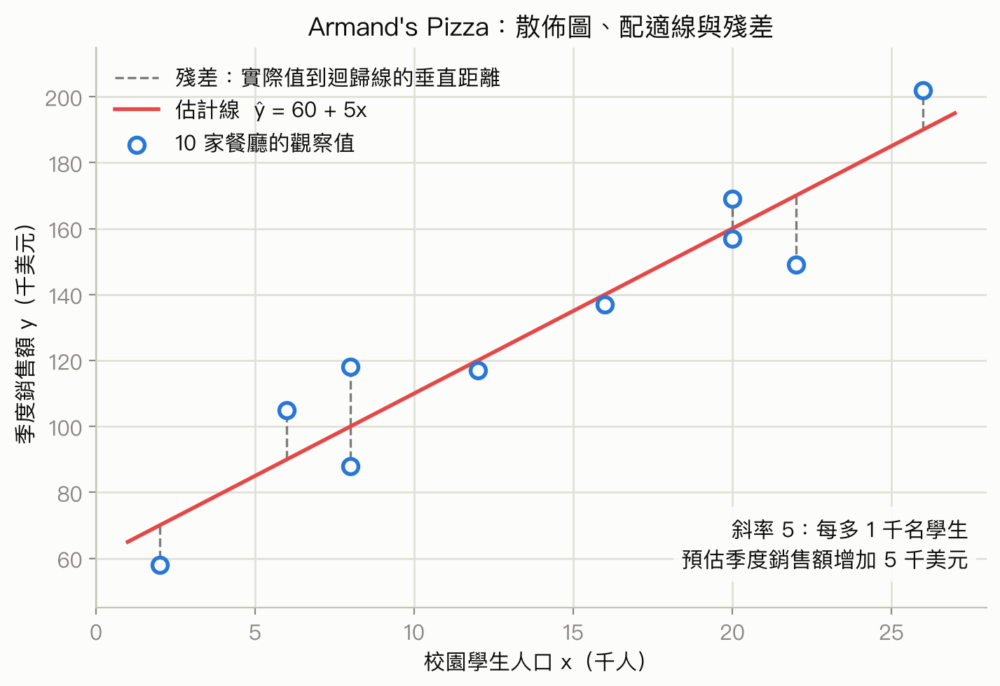
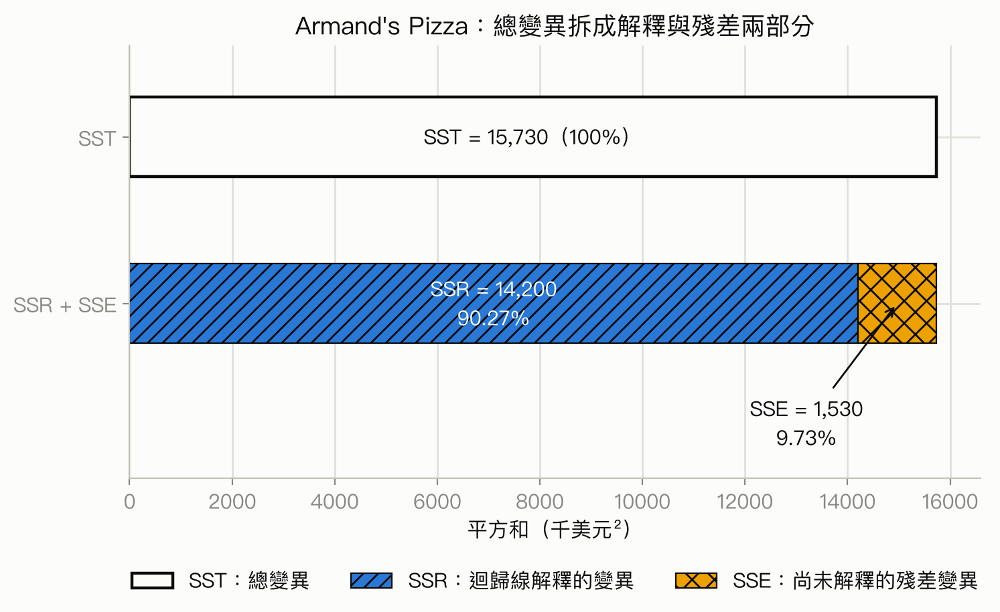
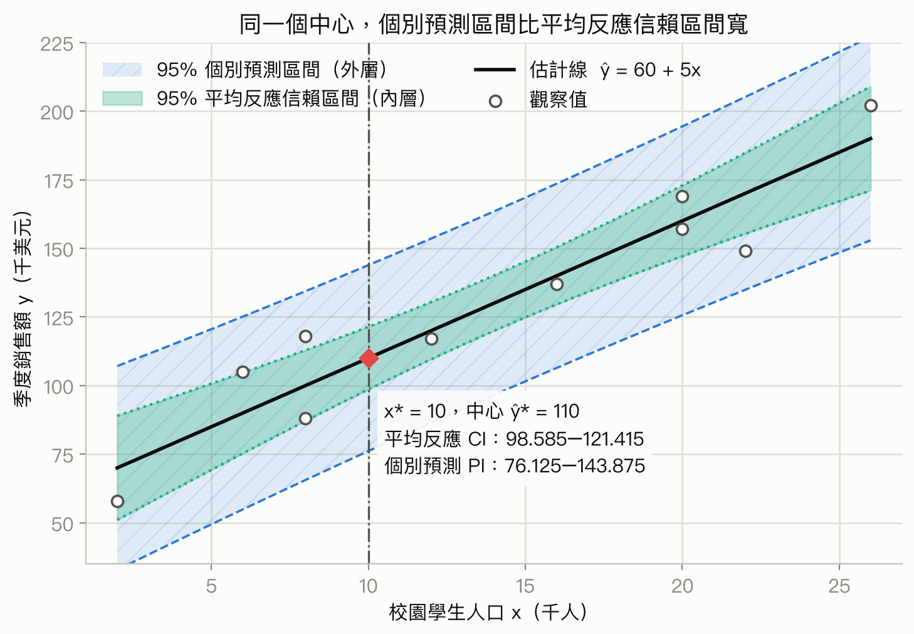
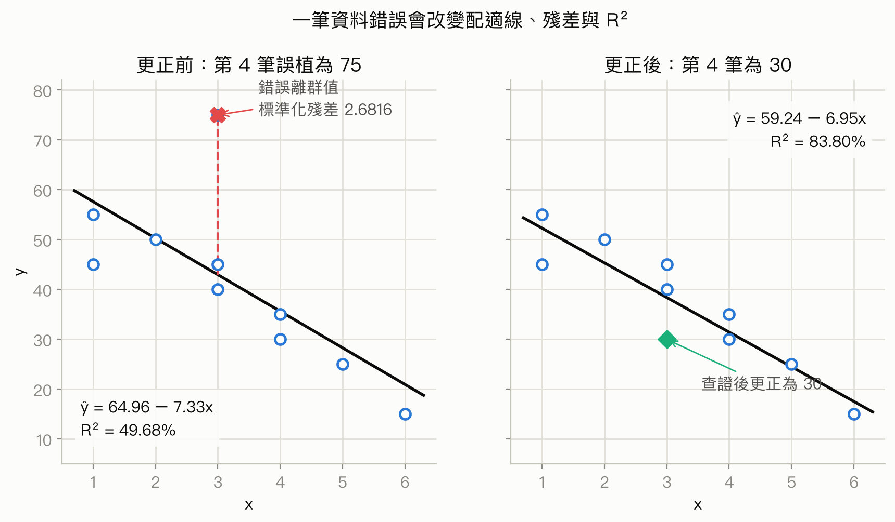

# 第 14 章：簡單線性迴歸

## 先備知識

本章不是從零開始畫一條迴歸線，而是把先前的「用樣本直線描述資料」推進到「對母體關係做推論」。開始前，最好先熟悉下面三組觀念；不需要先背完所有公式，但要能說出每個符號在問樣本、母體平均，還是單一個體。

| 要先會什麼 | 本章為什麼會用到 | 不熟時去哪裡補 |
|---|---|---|
| 散佈圖、相關係數、最小平方法、斜率與截距、殘差、$R^2$、內插與外插 | 這些是本章估計直線、解讀係數、分解變異與檢查殘差的描述性基礎。本章會在同一條樣本直線上再加入標準誤、檢定與區間。 | [course1 第 6 章：迴歸](../../course_1/chapters/06-regression.md)；列印版 [p.103–108](../../output/pdf/statistics-handout-expanded.pdf#page=103) 複習散佈圖與最小平方法，[p.112–120](../../output/pdf/statistics-handout-expanded.pdf#page=112) 複習內外插、條件平均、殘差、預測不確定性與 $R^2$。完整章節為 p.103–121。 |
| 點估計、標準誤、臨界值、信心水準，以及「信賴區間描述參數估計的不確定性」 | 斜率信賴區間與平均反應信賴區間都沿用「估計值 $\pm$ 臨界值 $\times$ 標準誤」的骨架。若把信賴區間誤當成個別資料的範圍，後面很容易把 CI 和 prediction interval 混在一起。 | [course1 第 7 章：信賴區間](../../course_1/chapters/07-confidence-intervals.md)；列印版 [p.122–126](../../output/pdf/statistics-handout-expanded.pdf#page=122) 複習點估計、長期涵蓋率與共同公式，[p.133](../../output/pdf/statistics-handout-expanded.pdf#page=133) 複習「母體平均區間不等於個別觀測值範圍」。完整章節為 p.122–138。 |
| $H_0$、$H_a$、檢定統計量、$p$ 值、顯著水準，以及母體標準差未知時為何使用 $t$ 分布 | 本章會把「母體平均是否等於某值」的檢定邏輯改寫成「母體斜率是否等於 0」。$p$ 值仍是在 $H_0$ 與模型假設成立下計算的尾端機率，不是 $H_0$ 為真的機率。 | [course1 第 8 章：顯著性檢定](../../course_1/chapters/08-significance-tests.md)；列印版 [p.139–143](../../output/pdf/statistics-handout-expanded.pdf#page=139) 複習假設、統計量與 $p$ 值，[p.146–148](../../output/pdf/statistics-handout-expanded.pdf#page=146) 複習 $t$ 分布與檢定解讀。完整章節為 p.139–160。 |

### 從描述性迴歸走到斜率推論

course1 的迴歸線 $\hat y=b_0+b_1x$ 回答的是：「這一批樣本中，哪一條直線最能描述 $x$ 與 $y$ 的線性趨勢？」本章多問一步：「如果重新抽樣，斜率 $b_1$ 會不會改變？這些會變動的樣本斜率，對固定但未知的母體斜率 $\beta_1$ 能提供多少證據？」因此，$b_1$ 是從目前樣本算出的估計值，$\beta_1$ 才是想推論的母體參數；斜率標準誤衡量的是換一批樣本時 $b_1$ 的典型變動量。

這條推論主線會出現三種不同問題：

1. **斜率推論** ：檢定或估計母體平均線的斜率 $\beta_1$，回答 $x$ 是否和平均 $Y$ 有線性關係，以及關係可能有多大。
2. **平均反應信賴區間** ：固定 $x=x^*$，估計所有同類個體的母體平均 $E(Y\mid X=x^*)$。平均許多個體會互相抵銷部分個別波動，所以區間較窄。
3. **個別值預測區間** ：固定同一個 $x=x^*$，預測下一個單一個體的 $Y^*$。除了平均線估得不準，這個新個體本身還可能高於或低於平均線，因此 prediction interval 會比同信心水準的 mean-response CI 寬。

### 母體誤差與樣本殘差不是同一個量

先把資料的兩個層次分開，後面的假設、檢定與區間才不會混淆：

| 層次 | 表示式 | 偏離量 | 能否直接觀察 |
|---|---|---|---|
| 母體模型 | $Y_i=\beta_0+\beta_1x_i+\epsilon_i$ | **誤差項** $\epsilon_i=Y_i-E(Y_i\mid X=x_i)$，是個體相對於未知母體平均線的隨機偏離 | 不能，因為 $\beta_0,\beta_1$ 與真正的母體平均線未知 |
| 樣本配適 | $\hat y_i=b_0+b_1x_i$ | **殘差** $e_i=y_i-\hat y_i$，是已觀察資料相對於估計線的偏離 | 能，由目前樣本計算 |

殘差是用來了解誤差項的樣本線索，卻不等於真正的誤差項。模型假設談的是看不見的 $\epsilon_i$；殘差圖則用看得見的 $e_i$ 檢查這些假設是否合理。也不要把「誤差」理解成資料輸入錯誤：在迴歸模型裡，即使資料完全正確，個體仍可能因未納入因素與自然波動而偏離平均線。

## 學習目標

讀完本章後，你應該能夠：

- 說明依變數 $y$、自變數 $x$、母體迴歸線與誤差項各自代表什麼。
- 用最小平方法從一組 $(x_i,y_i)$ 資料算出截距 $b_0$、斜率 $b_1$，並寫出估計迴歸式。
- 解讀斜率的方向、大小與單位，並在資料範圍內使用迴歸式做點預測。
- 分辨 SSE、SST、SSR 與判定係數 $r^2$，說明迴歸線解釋了 $y$ 變異的多少比例。
- 檢查線性迴歸的誤差項假設，並用殘差圖、標準化殘差與常態機率圖找出問題。
- 用斜率的 $t$ 檢定或整體的 $F$ 檢定判斷線性關係是否具有統計顯著性。
- 分辨平均反應的信賴區間與單一新個體的預測區間，並正確解讀兩者的差異。
- 從 Excel 的迴歸輸出讀出 $R^2$、標準誤、ANOVA 表、斜率估計值與 $p$ 值。
- 辨認離群值、高槓桿點與有影響力的觀察值，知道發現它們後應先查證資料，而不是直接刪除。

## 本章重點一覽

這章要處理的商業問題是：當兩個數值變數看起來有關係時，能不能用一條直線描述這個關係，並拿來估計或預測？例如，學生人口較多的校園附近，披薩店每季銷售額是否通常較高？

整章的主線如下：先用模型 $y=\beta_0+\beta_1x+\epsilon$ 描述「直線關係加上未解釋的波動」，再用樣本資料找出最適合的估計直線 $\hat{y}=b_0+b_1x$。接著把 $y$ 的總變異拆成迴歸線解釋的部分與殘差部分，利用 $r^2$ 衡量配適程度。最後檢查模型假設、檢定斜率是否為零、建立平均值與個體值的區間，並診斷離群值與影響點。

## 內容講解

### 14.0 為什麼需要迴歸分析

#### 從兩個變數的關係開始 (投影片第 1–5 頁)

投影片第 1 頁是本章標題，第 2 頁列出本章的十個主題：簡單線性迴歸模型、最小平方法、判定係數、模型假設、顯著性檢定、估計與預測、電腦解法、殘差分析，以及離群值、影響點和大資料下的實務提醒。

第 3 頁以 Francis Galton 作為迴歸分析的歷史引子。這頁沒有新的計算，重點是提醒我們：迴歸分析源自研究兩個數值變數如何一起變動。

在推薦系統的例子中，系統可能把使用者的個人特質當作**解釋變數(explanatory variable)** $x$，把想預測的推薦結果或目標指標當作**目標變數(target variable)** $y$。這種「從已知資訊預測另一個數值」的工作，就是迴歸分析常見的用途。

一般管理決策會同時受到兩個以上變數影響。迴歸分析的目標是建立一個方程式，描述這些變數之間的關係，讓我們能估計平均結果或預測新個案。

- 被預測的變數稱為**依變數(dependent variable)** ，記為 $y$。
- 用來預測 $y$ 的變數稱為**自變數(independent variable)** ，記為 $x$。
- 本章的**簡單線性迴歸(simple linear regression)** 只有一個自變數與一個依變數，而且用直線近似兩者關係。
- 若同時使用兩個以上自變數，就是**複迴歸(multiple regression)** ，留到後續章節處理。

這裡的「預測」不等於證明因果。即使 $x$ 與 $y$ 的線性關係很強，也可能是第三個因素同時影響兩者；是否有因果關係需要理論、研究設計或其他證據。

### 14.1 簡單線性迴歸模型與估計直線

#### 母體模型 (投影片第 6 頁)

直覺上，每個相同 $x$ 的個案，其 $y$ 不一定完全相同。模型用一條平均趨勢直線描述主要方向，再用誤差項容納個別差異。

這裡要從描述性的樣本直線切換到資料生成觀點：先假想母體中存在一條固定但未知的平均線，再把每個個體相對於這條線的偏離寫成隨機誤差。抽到資料後，我們才用 $b_0,b_1$ 估計未知的 $\beta_0,\beta_1$，並用殘差近似觀察那些看不見的誤差。

**簡單線性迴歸模型(simple linear regression model)** 的公式是：

$$
y = \beta_0 + \beta_1 x + \epsilon
$$

這個公式的用途是描述母體中，$x$ 與 $y$ 的關係以及每個觀察值偏離平均直線的原因。

| 符號 | 意義與單位 |
|---|---|
| $y$ | 依變數的實際觀察值，單位與研究問題中的結果相同，例如千美元。 |
| $x$ | 自變數的觀察值，單位由研究問題決定，例如千名學生。 |
| $\beta_0$ | 母體迴歸線的截距；當 $x=0$ 時的平均 $y$，單位與 $y$ 相同。 |
| $\beta_1$ | 母體迴歸線的斜率；$x$ 增加一個 $x$ 單位時，平均 $y$ 改變的 $y$ 單位數。 |
| $\epsilon$ | 誤差項，代表直線無法解釋的個別波動，單位與 $y$ 相同。 |

這個模型的適用前提是：一條直線足以作為平均關係的合理近似，且誤差項的條件平均為零。後面會完整列出常態性、等變異與獨立性的假設。

#### 母體平均迴歸線 (投影片第 7 頁)

若固定一個 $x$ 值，想問許多個相同 $x$ 的個案，其 $y$ 平均是多少，就把誤差項的平均波動消掉：

**簡單線性迴歸方程式(regression equation)** 是：

$$
E(Y\mid X=x)=\beta_0+\beta_1x
$$

公式的用途是描述「給定 $x$ 時，$y$ 的期望值」而不是某一個個體的必然結果。

| 符號 | 意義與單位 |
|---|---|
| $E(Y\mid X=x)$ | 在 $X=x$ 的所有可能個案中，$Y$ 的平均值，單位與 $y$ 相同。 |
| $\beta_0$ | $y$ 軸截距。 |
| $\beta_1$ | 斜率；正負號表示平均關係向上或向下。 |
| $x$ | 指定的自變數值。 |

若 $\beta_1>0$，$x$ 增加時平均 $y$ 增加；若 $\beta_1<0$，平均 $y$ 減少；若 $\beta_1=0$，平均 $y$ 不隨 $x$ 改變。只有在 $x=0$ 有實際意義且在觀察範圍附近時，截距才適合做實務解讀；不能機械地把超出資料範圍的截距當成真實情境。

#### 用樣本估計直線 (投影片第 8 頁)

母體的 $\beta_0$ 與 $\beta_1$ 通常未知，所以從樣本算出 $b_0$ 與 $b_1$：

**估計迴歸方程式(estimated regression equation)** 是：

$$
\hat{y}=b_0+b_1x
$$

| 符號 | 意義與單位 |
|---|---|
| $\hat{y}$ | 給定 $x$ 時，$E(Y\mid X=x)$ 的點估計，單位與 $y$ 相同。 |
| $b_0$ | 從樣本估出的截距，單位與 $y$ 相同。 |
| $b_1$ | 從樣本估出的斜率，單位為 $y$ 單位除以 $x$ 單位。 |
| $x$ | 要代入估計或預測的自變數值。 |

這條線叫**估計迴歸線(estimated regression line)** 。流程是：蒐集 $(x_i,y_i)$ 樣本資料，畫散佈圖確認直線近似合理，再用最小平方法求 $b_0,b_1$，最後用線做估計與預測。

### 14.2 最小平方法與 Armand's Pizza 例題

#### 最小平方法 (投影片第 9 頁)

對同一個 $x_i$，實際值 $y_i$ 通常不會剛好落在估計線上。垂直差距 $y_i-\hat{y}_i$ 就是殘差。最小平方法選擇一條線，讓所有殘差平方的總和最小。

**最小平方準則(least squares criterion)** 是：

$$
\min_{b_0,b_1}\; SSE=\sum_{i=1}^{n}(y_i-\hat{y}_i)^2
$$

| 符號 | 意義與單位 |
|---|---|
| $\min_{b_0,b_1}$ | 在所有可能的截距與斜率中，尋找使總和最小的那一組。 |
| $y_i$ | 第 $i$ 個觀察值的實際 $y$，單位為 $y$ 單位。 |
| $\hat{y}_i=b_0+b_1x_i$ | 由估計線得到的第 $i$ 個預測值，單位為 $y$ 單位。 |
| $y_i-\hat{y}_i$ | 第 $i$ 個殘差，單位為 $y$ 單位。 |
| $n$ | 觀察值個數，無單位。 |

平方有兩個作用：正負殘差不會互相抵消，而且較大的錯誤會受到較大懲罰。這個方法適合以直線作為平均關係的模型；若散佈圖明顯彎曲，不能只因最小平方能算出一條線就宣稱線性模型適合。

斜率與截距的計算式為：

$$
b_1=\frac{\sum_{i=1}^{n}(x_i-\bar{x})(y_i-\bar{y})}{\sum_{i=1}^{n}(x_i-\bar{x})^2},
\qquad
b_0=\bar{y}-b_1\bar{x}
$$

| 符號 | 意義與單位 |
|---|---|
| $b_1$ | 最小平估計斜率，$y$ 單位 / $x$ 單位。 |
| $b_0$ | 最小平估計截距，$y$ 單位。 |
| $x_i,y_i$ | 第 $i$ 個觀察值。 |
| $\bar{x},\bar{y}$ | 樣本 $x$ 與 $y$ 的平均數，單位分別為 $x$ 與 $y$。 |
| $\sum$ | 對全部 $n$ 個觀察值加總。 |

分母 $\sum(x_i-\bar{x})^2$ 必須大於零，也就是樣本中的 $x$ 不能全部相同。分子看的是 $x$ 與 $y$ 是否同向偏離各自平均數；因此斜率的正負反映線性方向。這些公式是在樣本資料上求估計值，不是直接得到未知的母體參數 $\beta_0,\beta_1$。

#### Armand's Pizza 的問題設定 (投影片第 10 頁)

Armand's Pizza Parlors 是靠近大學校園的義式餐廳連鎖店。管理者猜想：校園學生人口 $x$ 越多，餐廳每季銷售額 $y$ 越高。

研究對象母體是這個連鎖店的所有餐廳，從中隨機抽出 10 家餐廳。投影片先用散佈圖觀察學生人口與季度銷售額的關係；圖形呈現正向、近似直線的趨勢，所以選擇簡單線性迴歸模型。這個步驟很重要：先看資料形狀，再決定直線是否合理，不能只看最後的計算結果。

#### 算出 Armand's Pizza 的估計式 (投影片第 11 頁)

資料中的 $x$ 是學生人口的千人數，$y$ 是季度銷售額的千美元數。10 家餐廳的摘要計算如下：

| 餐廳 $i$ | $x_i$ | $y_i$ | $x_i-\bar{x}$ | $y_i-\bar{y}$ | $(x_i-\bar{x})(y_i-\bar{y})$ | $(x_i-\bar{x})^2$ |
|---:|---:|---:|---:|---:|---:|---:|
| 1 | 2 | 58 | -12 | -72 | 864 | 144 |
| 2 | 6 | 105 | -8 | -25 | 200 | 64 |
| 3 | 8 | 88 | -6 | -42 | 252 | 36 |
| 4 | 8 | 118 | -6 | -12 | 72 | 36 |
| 5 | 12 | 117 | -2 | -13 | 26 | 4 |
| 6 | 16 | 137 | 2 | 7 | 14 | 4 |
| 7 | 20 | 157 | 6 | 27 | 162 | 36 |
| 8 | 20 | 169 | 6 | 39 | 234 | 36 |
| 9 | 22 | 149 | 8 | 19 | 152 | 64 |
| 10 | 26 | 202 | 12 | 72 | 864 | 144 |
| 合計 | 140 | 1,300 |  |  | 2,840 | 568 |

因此，$n=10$、$\bar{x}=140/10=14$、$\bar{y}=1300/10=130$。代入斜率公式：

$$
b_1=\frac{2,840}{568}=5
$$

再算截距：

$$
b_0=\bar{y}-b_1\bar{x}=130-5(14)=60
$$

所以估計迴歸方程式是：

$$
\hat{y}=60+5x
$$

你該注意什麼：最小平方法縮小的是每個點到直線的「垂直殘差平方總和」，而這批資料的估計線確實是 $\hat y=60+5x$。

| 符號 | 意義與單位 |
|---|---|
| $x$ | 學生人口，以千人計。 |
| $\hat{y}$ | 預測季度銷售額，以千美元計。 |
| 60 | 截距，千美元。 |
| 5 | 每增加 1 千名學生，平均季度銷售額改變 5 千美元。 |

#### 解讀斜率與做點預測 (投影片第 12 頁)

因為 $b_1=5$ 是正數，樣本支持「學生人口越多，預估季度銷售額越高」的正向線性趨勢。斜率的單位換算是：

$$
5\;\frac{\text{千美元}}{\text{千名學生}}
=\frac{\$5,000}{1,000\text{ 名學生}}
=\$5\text{/名學生}
$$

這是平均關係的解讀，不是說每多一名學生必然讓銷售額增加 5 美元，也不是因果結論。

若一間新餐廳位在有 16,000 名學生的校園附近，因為 $x=16$，點預測為：

$$
\hat{y}=60+5(16)=140\quad\text{千美元}
$$

因此預測季度銷售額為 $140,000$ 美元。這種點預測只給一個中心值，尚未表達不確定性；後面會用信賴區間或預測區間補上誤差範圍。也要留意 $16$ 在樣本的 $x$ 範圍 $2$ 到 $26$ 內，屬於資料範圍內的插值。

### 14.3 變異分解、配適程度與相關係數

#### 殘差與誤差平方和 SSE (投影片第 13 頁)

對第 $i$ 家餐廳，實際銷售額與估計線預測值的差距是殘差：

**誤差平方和(sum of squares due to error, SSE)** 的公式是：

$$
SSE=\sum_{i=1}^{n}(y_i-\hat{y}_i)^2
$$

| 符號 | 意義與單位 |
|---|---|
| $SSE$ | 所有殘差平方的總和，單位是 $y$ 單位的平方。 |
| $y_i$ | 第 $i$ 個實際季度銷售額。 |
| $\hat{y}_i=60+5x_i$ | 第 $i$ 家餐廳的估計銷售額。 |
| $y_i-\hat{y}_i$ | 第 $i$ 個殘差，單位是千美元。 |

Armand's Pizza 的計算如下：

| $i$ | $x_i$ | 實際 $y_i$ | 預測 $\hat{y}_i=60+5x_i$ | 殘差 $y_i-\hat{y}_i$ | 殘差平方 |
|---:|---:|---:|---:|---:|---:|
| 1 | 2 | 58 | 70 | -12 | 144 |
| 2 | 6 | 105 | 90 | 15 | 225 |
| 3 | 8 | 88 | 100 | -12 | 144 |
| 4 | 8 | 118 | 100 | 18 | 324 |
| 5 | 12 | 117 | 120 | -3 | 9 |
| 6 | 16 | 137 | 140 | -3 | 9 |
| 7 | 20 | 157 | 160 | -3 | 9 |
| 8 | 20 | 169 | 160 | 9 | 81 |
| 9 | 22 | 149 | 170 | -21 | 441 |
| 10 | 26 | 202 | 190 | 12 | 144 |
| 合計 |  |  |  |  | $SSE=1,530$ |

$SSE=1,530$ 表示用估計直線預測這 10 家餐廳時，殘差平方總量為 1,530。最小平方法正是選擇讓這個量最小的直線。SSE 越小通常代表樣本內誤差越小，但單獨看 SSE 會受到 $y$ 的量尺與樣本數影響，不能跨不同量尺直接比較。

#### 用平均數預測的總平方和 SST (投影片第 14 頁)

如果完全不用 $x$，只用所有餐廳的平均銷售額 $\bar{y}=130$ 來預測每家餐廳，觀察值和平均數的差距就是基準誤差。

**總平方和(total sum of squares, SST)** 的公式是：

$$
SST=\sum_{i=1}^{n}(y_i-\bar{y})^2
$$

| 符號 | 意義與單位 |
|---|---|
| $SST$ | 所有 $y$ 觀察值相對於樣本平均數的平方差總和，單位是 $y$ 單位的平方。 |
| $y_i$ | 第 $i$ 個實際 $y$ 值。 |
| $\bar{y}$ | 全部樣本 $y$ 的平均數。 |
| $n$ | 樣本數。 |

Armand's Pizza 的逐筆計算如下：

| $i$ | $x_i$ | $y_i$ | $y_i-\bar{y}$ | $(y_i-\bar{y})^2$ |
|---:|---:|---:|---:|---:|
| 1 | 2 | 58 | -72 | 5,184 |
| 2 | 6 | 105 | -25 | 625 |
| 3 | 8 | 88 | -42 | 1,764 |
| 4 | 8 | 118 | -12 | 144 |
| 5 | 12 | 117 | -13 | 169 |
| 6 | 16 | 137 | 7 | 49 |
| 7 | 20 | 157 | 27 | 729 |
| 8 | 20 | 169 | 39 | 1,521 |
| 9 | 22 | 149 | 19 | 361 |
| 10 | 26 | 202 | 72 | 5,184 |

平方差加總得到：

$$
SST=15,730
$$

因此 $SST$ 衡量的是「只用平均數預測銷售額」的總變異。它是比較迴歸線是否比平均數基準更有用的基準量。

#### 迴歸平方和 SSR 與變異分解 (投影片第 15 頁)

估計線上的預測值 $\hat{y}_i$ 與平均數 $\bar{y}$ 的差距，表示迴歸線相對於「只用平均數」多解釋了多少。

**迴歸平方和(sum of squares due to regression, SSR)** 的公式是：

$$
SSR=\sum_{i=1}^{n}(\hat{y}_i-\bar{y})^2
$$

| 符號 | 意義與單位 |
|---|---|
| $SSR$ | 迴歸線預測值相對於 $\bar{y}$ 的平方差總和，單位是 $y$ 單位的平方。 |
| $\hat{y}_i$ | 第 $i$ 個由迴歸線得到的預測值。 |
| $\bar{y}$ | 樣本 $y$ 平均數。 |

最小平迴歸有一個很重要的分解：

**總變異分解(total variation decomposition)** 是：

$$
SST=SSR+SSE
$$

| 符號 | 解讀 |
|---|---|
| $SST$ | $y$ 的全部樣本變異。 |
| $SSR$ | 由 $x$ 的線性關係所解釋的變異。 |
| $SSE$ | 迴歸線尚未解釋的殘差變異。 |

在本例中：

$$
SSR=SST-SSE=15,730-1,530=14,200
$$

你該注意什麼：$r^2=90.27\%$ 是藍色斜線區的 $SSR/SST$，剩下的 $9.73\%$ 是模型尚未解釋的 $SSE/SST$，兩部分合起來才是全部總變異。

用途是把「模型有多會解釋」和「還剩多少誤差」拆開看。這個分解只適用於含截距的最小平迴歸；若改用沒有截距的特殊模型，不能不加檢查地套用同一個解讀。

#### 判定係數 $r^2$ (投影片第 16 頁)

若所有觀察值都剛好在估計線上，則每個殘差為零、$SSE=0$，所以 $SSR=SST$。因此可以用 SSR 佔 SST 的比例衡量配適程度。

**判定係數(coefficient of determination)** 是：

$$
r^2=\frac{SSR}{SST}=1-\frac{SSE}{SST}
$$

| 符號 | 意義與單位 |
|---|---|
| $r^2$ | 樣本中 $y$ 變異可由估計迴歸線解釋的比例，無單位，介於 0 與 1。 |
| $SSR$ | 迴歸線解釋的平方和。 |
| $SST$ | $y$ 的總平方和。 |
| $SSE$ | 殘差平方和。 |

本例：

$$
r^2=\frac{14,200}{15,730}=0.9027
$$

所以約 $90.27\%$ 的季度銷售額樣本變異，能由「學生人口與銷售額的線性關係」解釋；約 $9.73\%$ 留在殘差中。這不是說 90.27% 的銷售額被學生人口造成，也不是說模型對每一家餐廳都有 90.27% 的正確率。$r^2$ 適合比較相同 $y$ 量尺、相近研究情境下的線性配適；高 $r^2$ 也不能取代殘差診斷。

#### 相關係數 $r_{xy}$ (投影片第 17 頁)

**相關係數(correlation coefficient)** 描述 $x$ 與 $y$ 線性關聯的方向與強度，範圍永遠在 $-1$ 到 $+1$：

- $+1$ 表示所有點落在正斜率直線上。
- $-1$ 表示所有點落在負斜率直線上。
- 接近 0 表示沒有明顯的線性關係，但不代表沒有彎曲關係。

在含截距的簡單線性迴歸中，相關係數與 $r^2$ 的關係是：

$$
r_{xy}=\operatorname{sign}(b_1)\sqrt{r^2}
$$

| 符號 | 意義與單位 |
|---|---|
| $r_{xy}$ | $x$ 與 $y$ 的樣本相關係數，無單位，範圍 $[-1,1]$。 |
| $\operatorname{sign}(b_1)$ | 若 $b_1>0$ 為 $+1$，若 $b_1<0$ 為 $-1$。 |
| $r^2$ | 判定係數。 |

本例 $b_1=5>0$、$r^2=0.9027$，所以：

$$
r_{xy}=+\sqrt{0.9027}=+0.9501
$$

$+0.9501$ 表示很強的正向線性關聯。$r$ 的正負給方向，$r^2$ 則給解釋比例；兩者都不能單獨證明因果。

### 14.4 誤差項的模型假設

#### 四個假設 (投影片第 18 頁)

顯著性檢定與區間估計不是只靠一條線就能成立，它們依賴誤差項 $\epsilon$ 的假設。模型為 $Y=\beta_0+\beta_1X+\epsilon$ 時，常用的四個假設如下。

1. **平均為零** ：$E(\epsilon)=0$。因此給定 $x$ 時，$E(Y\mid X=x)=\beta_0+\beta_1x$。
2. **等變異(homoscedasticity)** ：$\operatorname{Var}(\epsilon)=\sigma^2$ 對所有 $x$ 都相同。因此 $Y$ 繞著迴歸線的散布寬度大致固定。
3. **獨立性(independence)** ：不同觀察值的誤差彼此獨立。某一個 $x$ 的 $y$ 偏高，不應讓另一個觀察值的誤差也系統性偏高或偏低。
4. **常態性(normality)** ：對每個 $x$，$\epsilon$ 服從常態分配。因此給定 $x$ 的 $Y$ 也呈常態分布，且各 $x$ 的變異同為 $\sigma^2$。

第一項建立平均直線的意義；第二項關係到標準誤是否適用；第三項常與時間順序、群聚或抽樣設計有關；第四項讓小樣本的 $t$ 與 $F$ 推論有可靠的分布基礎。實際分析應用殘差圖檢查，而不是把假設當成自動成立。

#### 用圖理解假設 (投影片第 19 頁)

圖形的重點是：隨著 $x$ 改變，$E(Y\mid X=x)$ 沿著直線移動，但每個 $x$ 周圍的 $Y$ 分布應有相近的寬度，且誤差的中心在零附近。某一個觀察值的誤差取決於實際 $y$ 在平均直線上方還是下方。

選擇直線模型本身是一個假設，不是數學定理。若散佈圖或殘差圖顯示明顯彎曲、漏斗形或群聚，其他非線性模型可能更適合。若假設不合理，斜率的顯著性檢定、信賴區間與預測區間都可能失去原本的可信度。

### 14.5 線性關係的顯著性檢定

前面的 $b_1=5$ 只描述目前 10 家餐廳。若換抽另外 10 家，估計斜率通常不會仍恰好等於 5；因此不能只看 $b_1$ 是否非零，就斷言母體一定有線性關係。接下來的推論把「估計值離虛無值 0 多遠」除以「估計值因抽樣而變動的典型大小」，也就是用斜率標準誤把距離標準化。這正是 course1 顯著性檢定的共同邏輯，只是目標參數從母體平均數換成母體斜率 $\beta_1$。

#### 為什麼檢定 $\beta_1=0$ (投影片第 20 頁)

母體平均線是 $E(Y\mid X=x)=\beta_0+\beta_1x$。若 $\beta_1=0$，就變成 $E(Y\mid X=x)=\beta_0$，平均 $y$ 不依賴 $x$；若 $\beta_1\ne0$，平均 $y$ 會隨 $x$ 改變。

因此，檢定簡單線性迴歸是否有顯著線性關係，就是檢定：

$$
H_0:\beta_1=0
\qquad\text{對上}\qquad
H_a:\beta_1\ne0
$$

| 符號 | 意義與單位 |
|---|---|
| $H_0$ | 虛無假設，母體斜率為零，無單位。 |
| $H_a$ | 對立假設，母體斜率不為零，無單位。 |
| $\beta_1$ | 母體平均迴歸線的斜率，$y$ 單位 / $x$ 單位。 |

這是雙尾檢定，適用於題目問「是否有線性關係」而沒有預先指定方向的情況。若研究問題在資料收集前已有明確方向，才可能設定單尾對立假設；不能看到樣本結果後才改選尾端。

本章介紹兩種方法：斜率的 $t$ 檢定與整體迴歸的 $F$ 檢定。兩者都需要估計誤差變異 $\sigma^2$。若拒絕 $H_0$，只能說有統計證據支持非零的線性關係，不代表因果，也不保證線性模型在所有 $x$ 上都適合。

#### 估計誤差變異：MSE 與標準估計誤差 (投影片第 21 頁)

誤差項的變異 $\sigma^2$ 未知。樣本中殘差平方和 SSE 衡量 $y$ 繞估計線的波動；因為估計了截距與斜率，要用 $n-2$ 個自由度分攤它。

**均方誤差(mean square error, MSE)** 與誤差變異估計值是：

$$
s^2=MSE=\frac{SSE}{n-2}
$$

| 符號 | 意義與單位 |
|---|---|
| $s^2$ | $\sigma^2$ 的估計值，單位是 $y$ 單位的平方。 |
| $MSE$ | 殘差平方和除以誤差自由度。 |
| $SSE$ | 殘差平方和。 |
| $n-2$ | 簡單線性迴歸的誤差自由度。 |

再開根號得到**標準估計誤差(standard error of the estimate)** ：

$$
s=\sqrt{MSE}=\sqrt{\frac{SSE}{n-2}}
$$

$s$ 的單位與 $y$ 相同，可粗略理解為觀察值通常離估計線多遠。它適合用來衡量同一 $y$ 量尺下的典型殘差大小；不能把 $s$ 當成每個預測的保證誤差，也不能忽略 $x$ 範圍與模型假設。

Armand's Pizza 中 $SSE=1,530$、$n=10$：

$$
MSE=\frac{1,530}{10-2}=191.25,
\qquad
s=\sqrt{191.25}=13.829
$$

因為 $y$ 以千美元計，$s=13.829$ 代表典型的垂直誤差量級約為 $13.829$ 千美元。

#### 斜率的 $t$ 檢定 (投影片第 22 頁)

最小平斜率估計量 $b_1$ 的抽樣分布具有以下性質：$E(b_1)=\beta_1$，標準差為 $\sigma/\sqrt{\sum(x_i-\bar{x})^2}$，在誤差常態假設下為常態分布。因為 $\sigma$ 未知，用 $s$ 估計後形成 $t$ 統計量。

**斜率 $t$ 檢定(t test for slope)** 的統計量是：

$$
t=\frac{b_1}{s_{b_1}},
\qquad
s_{b_1}=\frac{s}{\sqrt{\sum_{i=1}^{n}(x_i-\bar{x})^2}}
$$

| 符號 | 意義與單位 |
|---|---|
| $t$ | 檢定統計量，無單位，服從自由度 $n-2$ 的 $t$ 分布。 |
| $b_1$ | 樣本斜率，$y$ 單位 / $x$ 單位。 |
| $s_{b_1}$ | $b_1$ 的估計標準差，與 $b_1$ 同單位。 |
| $s$ | 標準估計誤差，與 $y$ 同單位。 |
| $x_i,\bar{x}$ | 第 $i$ 個 $x$ 與 $x$ 平均數。 |
| $n-2$ | $t$ 分布的自由度。 |

使用條件是誤差獨立、等變異、常態性及線性關係合理。當題目問「斜率是否為零」或「$x$ 與 $y$ 是否有顯著線性關係」時使用；若要一次檢定多個自變數的整體關係，應考慮複迴歸的整體 $F$ 檢定。

#### Armand's Pizza 的 $t$ 檢定計算 (投影片第 23 頁)

要在 $\alpha=0.01$ 下檢定學生人口與季度銷售額是否有顯著關係。已知 $b_1=5$、$s=13.829$、$\sum(x_i-\bar{x})^2=568$。

先算斜率標準誤：

$$
s_{b_1}=\frac{13.829}{\sqrt{568}}=0.5803
$$

再算統計量：

$$
t=\frac{5}{0.5803}=8.62,
\qquad df=n-2=8
$$

#### $t$ 檢定的拒絕規則 (投影片第 24 頁)

這是雙尾檢定，因為對立假設是 $\beta_1\ne0$。$t$ 分布對稱，所以 $t=8.62$ 的雙尾 $p$ 值是上下兩尾面積相加。

投影片給出的 $df=8$ 的上尾表如下：

| 上尾面積 | 0.20 | 0.10 | 0.05 | 0.025 | 0.01 | 0.005 |
|---:|---:|---:|---:|---:|---:|---:|
| $t$ 值 | 0.889 | 1.397 | 1.860 | 2.306 | 2.896 | 3.355 |

因為 $8.62>3.355$，單尾面積小於 $0.005$，雙尾 $p$ 值小於 $0.010$。所以 $p\text{-value}\le0.01=\alpha$，拒絕 $H_0$，結論為 $\beta_1\ne0$，樣本提供顯著線性關係的證據。

用臨界值法也一樣：雙尾臨界值是 $-3.355$ 與 $+3.355$，而 $8.62\ge3.355$，落在拒絕域。

注意：$p$ 值小不代表 $H_a$ 被「證明」為真，也不代表關係很大或具有因果性；它表示在 $H_0$ 為真時，觀察到這麼極端統計量的資料不常見。

#### $\beta_1$ 的信賴區間 (投影片第 25 頁)

斜率的信賴區間回答：「母體平均關係的斜率可能落在哪個範圍？」

**斜率信賴區間(confidence interval for slope)** 是：

$$
b_1\pm t_{\alpha/2,\,n-2}s_{b_1}
$$

| 符號 | 意義與單位 |
|---|---|
| $b_1$ | 斜率點估計值。 |
| $t_{\alpha/2,\,n-2}$ | 自由度 $n-2$、右尾面積 $\alpha/2$ 的 $t$ 臨界值。 |
| $s_{b_1}$ | 斜率估計標準誤。 |
| $1-\alpha$ | 信賴係數，例如 99%。 |

適用於誤差項假設合理的母體斜率推論。若區間包含 0，和雙尾檢定通常不拒絕 $\beta_1=0$；若整個區間都在 0 上方或下方，表示方向較明確。這是對未知母體斜率的區間估計，不是說這個固定參數有某個機率落在已算出的區間內。

本例要算 99% 區間，$b_1=5$、$s_{b_1}=0.5803$、$t_{0.005,8}=3.355$：

$$
5\pm3.355(0.5803)=5\pm1.95=(3.05,6.95)
$$

解讀為：用這個方法建立的 99% 信賴區間是 $(3.05,6.95)$ 千美元 / 千名學生；在重複抽樣的長期表現中，約 99% 的這類區間會涵蓋真實 $\beta_1$。在本例的資料與模型下，斜率的合理範圍全為正。

#### 迴歸的 $F$ 檢定 (投影片第 26 頁)

簡單線性迴歸只有一個自變數，因此整體 $F$ 檢定與斜率 $t$ 檢定會得到相同結論。假設仍是 $H_0:\beta_1=0$ 對 $H_a:\beta_1\ne0$。在複迴歸中，$F$ 檢定可檢查所有自變數的整體關係，而單一斜率的 $t$ 檢定則逐一檢查個別變數。

這個「相同結論」不是巧合。簡單迴歸只有一個待檢定斜率時，整體模型相對於只有截距的模型只多一個自由度，代數上會得到 $F=t^2$。平方會消掉 t 值的正負，所以 t 檢定仍能告訴你斜率方向，F 檢定只保留「離 0 有多遠」；兩者的 p 值則相同。到了複迴歸，整體 F 同時檢定多個斜率，便不再等於任何一個個別 t 的平方。

**迴歸 $F$ 檢定(regression F test)** 的統計量是：

$$
F=\frac{MSR}{MSE},
\qquad
MSR=\frac{SSR}{\text{自變數個數}}
$$

| 符號 | 意義與單位 |
|---|---|
| $F$ | 檢定統計量，無單位；簡單迴歸下服從 $F(1,n-2)$。 |
| $MSR$ | 每個迴歸自由度的平均解釋平方和；簡單迴歸中 $MSR=SSR$。 |
| $MSE$ | 每個誤差自由度的平均殘差平方和。 |
| $SSR,SSE$ | 迴歸平方和與誤差平方和。 |

使用條件與 $t$ 檢定相同。$F$ 統計量是非負的，$F$ 檢定只看右尾；不要拿雙尾 $t$ 的臨界值直接代替 $F$ 臨界值。

#### Armand's Pizza 的 $F$ 檢定 (投影片第 27 頁)

已知 $SSR=14,200$、$MSE=191.25$，且只有一個自變數，所以 $MSR=SSR=14,200$：

$$
F=\frac{14,200}{191.25}=74.25
$$

其分布為分子自由度 $df_1=1$、分母自由度 $df_2=n-2=8$ 的 $F$ 分布。投影片的右尾表如下：

| 右尾面積 | 0.10 | 0.05 | 0.025 | 0.01 |
|---:|---:|---:|---:|---:|
| $F(1,8)$ 臨界值 | 3.46 | 5.32 | 7.57 | 11.26 |

因為 $74.25>11.26$，所以 $p\text{-value}\le0.01$，拒絕 $H_0$，結論為 $\beta_1\ne0$。用臨界值法也是 $74.25\ge11.26$，得到相同結論。

#### 簡單迴歸的 ANOVA 表 (投影片第 28 頁)

**變異數分析表(ANOVA table)** 把 $SST$ 拆成迴歸與誤差兩列，同時顯示自由度、均方、$F$ 值和 $p$ 值。

| 變異來源 | 平方和 | 自由度 | 均方 | $F$ | $p$ 值 |
|---|---:|---:|---:|---:|---:|
| Regression | $SSR$ | $1$ | $MSR=SSR/1$ | $MSR/MSE$ | $P(F\ge MSR/MSE)$ |
| Error | $SSE$ | $n-2$ | $MSE=SSE/(n-2)$ |  |  |
| Total | $SST$ | $n-1$ |  |  |  |

Armand's Pizza 的表格為：

| 變異來源 | 平方和 | 自由度 | 均方 | $F$ | $p$ 值 |
|---|---:|---:|---:|---:|---:|
| Regression | 14,200 | 1 | 14,200 | 74.25 | 0.0000 |
| Error | 1,530 | 8 | 191.25 |  |  |
| Total | 15,730 | 9 |  |  |  |

讀表時要驗算：自由度 $1+8=9$，平方和 $14,200+1,530=15,730$，且 $14,200/191.25=74.25$。投影片本頁下方的 Total 印成 17,530，但與本章前面明確列出的 $SST=15,730$、$SSR+SSE=15,730$ 及後面的 Excel 輸出不一致；依算術一致性應讀為 15,730，這是投影片數字的排版或印刷錯誤。

#### 解讀顯著性時的兩個警告 (投影片第 29 頁)

1. 拒絕 $H_0:\beta_1=0$、判定關係具統計顯著性，不能單獨推出 $x$ 導致 $y$。以 Armand's Pizza 為例，不能只靠學生人口與銷售額的迴歸結果，就說學生人口的改變造成銷售額改變；可能還有地點、消費力、競爭者等因素。
2. 統計顯著也不代表直線對所有 $x$ 都可靠。只有在樣本觀察到的 $x$ 範圍內，估計式才有較有根據的插值用途。本例的樣本範圍是 $2$ 到 $26$ 千名學生，應避免把它拿去預測遠超過 26 或低於 2 的校園。超出範圍是外插，直線趨勢可能在那裡失效。

### 14.6 用估計式做估計與預測

#### 平均值與個體值是兩個不同問題 (投影片第 30 頁)

代入 $\hat{y}=b_0+b_1x$ 得到的是一個中心點，但使用者通常還想知道不確定性。給定新的自變數值 $x^*$ 時，要先分清楚問題是：

- **平均反應(mean response)** ：所有 $x=x^*$ 的餐廳，其平均季度銷售額是多少？要用平均值的信賴區間。
- **個體反應(individual response)** ：某一家新餐廳的季度銷售額是多少？要用個體值的預測區間。

個體值除了估計平均線的不確定性，還有該新個體自己的誤差，因此預測區間一定比同信賴水準的平均值信賴區間寬。

可以把兩者想成「瞄準靶心」與「預測下一支箭」：平均反應 CI 只要描述靶心位置估得多準；個別值 PI 不只要承擔靶心位置的不確定性，還要承擔下一支箭本身會散落在靶心周圍。兩者中心都是同一個 $\hat y^*$，但 PI 的標準誤公式會多出新個體誤差的 $1$，所以不是因為名稱不同才較寬，而是因為要涵蓋的不確定性真的多一層。

本節記號如下：

| 符號 | 意義 |
|---|---|
| $x^*$ | 指定的新 $x$ 值。 |
| $Y^*$ | 當 $X=x^*$ 時，新個體可能出現的隨機 $Y$。 |
| $\hat{y}^*$ | 代入估計線得到的點估計；它是 $E(Y^*\mid X=x^*)$ 的估計，也是個體 $Y^*$ 的預測值。 |

兩種區間都應在模型合理且 $x^*$ 位於觀察資料範圍內時使用。不要把平均值區間誤當成單一新個體的範圍。

#### 平均 $y$ 的信賴區間 (投影片第 31 頁)

給定 $x^*$，平均反應的區間以 $\hat{y}^*$ 為中心：

**平均反應信賴區間(confidence interval for mean response)** 是：

$$
\hat{y}^*\pm t_{\alpha/2,\,n-2}s_{\hat{y}^*}
$$

其中平均預測值的標準誤為：

$$
s_{\hat{y}^*}=s\sqrt{\frac{1}{n}+\frac{(x^*-\bar{x})^2}{\sum_{i=1}^{n}(x_i-\bar{x})^2}}
$$

| 符號 | 意義與單位 |
|---|---|
| $\hat{y}^*$ | $x=x^*$ 時平均 $y$ 的點估計，$y$ 單位。 |
| $t_{\alpha/2,n-2}$ | 自由度 $n-2$ 的 $t$ 臨界值。 |
| $s_{\hat{y}^*}$ | 平均反應估計值的標準誤，$y$ 單位。 |
| $s$ | 標準估計誤差，$y$ 單位。 |
| $n$ | 樣本數。 |
| $x^*,\bar{x},x_i$ | 指定的新 $x$、樣本平均 $x$、第 $i$ 個樣本 $x$。 |

當 $x^*=\bar{x}$ 時，第二項為零，$s_{\hat{y}^*}=s\sqrt{1/n}$，所以平均值估計最精確；$x^*$ 越遠離 $\bar{x}$，區間越寬。這個公式用於「母體平均 $y$」，不用於「某一個新個體的 $y$」，後者要多加一個個體誤差項。

#### Armand's Pizza 的平均銷售額區間 (投影片第 32–33 頁)

問題：所有位在 10,000 名學生校園附近的 Armand's 餐廳，其**平均** 季度銷售額是多少？因為 $x^*=10$、$n=10$、$\bar{x}=14$、$s=13.829$、$\sum(x_i-\bar{x})^2=568$：

$$
s_{\hat{y}^*}=13.829\sqrt{\frac{1}{10}+\frac{(10-14)^2}{568}}
=13.829\sqrt{0.1282}=4.95
$$

點估計為：

$$
\hat{y}^*=60+5(10)=110
$$

95% 信賴區間使用 $t_{0.025,8}=2.306$，誤差幅度為 $2.306(4.95)=11.415$：

$$
110\pm11.415=(98.585,121.415)\quad\text{千美元}
$$

解讀為：對所有符合 $x=10$ 的 Armand's 餐廳，平均季度銷售額的 95% 信賴區間約為 $98.585$ 到 $121.415$ 千美元。把不同 $x$ 的平均值信賴帶畫在估計線周圍時，會在 $\bar{x}$ 附近較窄，離中心越遠較寬。

#### 個體 $y$ 的預測區間 (投影片第 34 頁)

若問題改成「一間即將開幕的新餐廳」的季度銷售額，這是單一個體的預測，除了估計平均線的不確定性，還要加上新餐廳自己的隨機誤差。

**個體預測區間(prediction interval)** 是：

$$
\hat{y}^*\pm t_{\alpha/2,\,n-2}s_{pred}
$$

其中：

$$
s_{pred}=s\sqrt{1+\frac{1}{n}+\frac{(x^*-\bar{x})^2}{\sum_{i=1}^{n}(x_i-\bar{x})^2}}
$$

| 符號 | 意義與單位 |
|---|---|
| $s_{pred}$ | 個體預測誤差的標準差，$y$ 單位。 |
| $1$ | 新個體自身誤差的變異貢獻，正是它比平均值區間寬的來源。 |
| 其餘符號 | 與平均反應信賴區間公式相同。 |

當 $x^*=\bar{x}$ 時，$s_{pred}=s\sqrt{1+1/n}$，也是在中心附近最窄；但無論在哪裡，$s_{pred}>s_{\hat{y}^*}$。這個公式用於一個新個體，不用於估計所有個體的平均值。

#### Armand's Pizza 的單一新餐廳預測 (投影片第 35–36 頁)

問題：Armand's 要在 10,000 名學生的校園附近開一間新店，預測這一間店的季度銷售額。仍有 $x^*=10$、$\hat{y}^*=110$、$s=13.829$、$n=10$、$\bar{x}=14$、分母平方和為 568：

$$
s_{pred}=13.829\sqrt{1+\frac{1}{10}+\frac{(10-14)^2}{568}}
=13.829\sqrt{1.1282}=14.69
$$

95% 預測區間的誤差幅度為 $2.306(14.69)=33.875$：

$$
110\pm33.875=(76.125,143.875)\quad\text{千美元}
$$

因此，新店季度銷售額的 95% 預測區間約為 $76.125$ 到 $143.875$ 千美元。它比平均值區間 $(98.585,121.415)$ 寬，因為單店還有個別誤差。投影片第 36 頁用同一張圖同時顯示平均值信賴帶與個體預測帶；讀圖時要記得外層較寬的帶是個體預測，不是平均值的區間。

你該注意什麼：在同一個 $x^*=10$，兩種區間都以 $110$ 為中心，但個別 PI 還要包住新餐廳自身的波動，所以一定比平均反應 CI 寬。

### 14.7 用電腦讀取迴歸結果

#### Armand's Pizza 的 Excel 輸出 (投影片第 37 頁)

手算所有平方和、標準誤與檢定可能很花時間，Excel、Minitab、JMP 等軟體可以一次輸出迴歸分析結果。Excel 中若自變數命名為 Population、依變數命名為 Sales，輸出中的方程式是：

$$
Sales=60+5( Population )
$$

投影片的輸出可整理成以下讀法：

| 區塊 | 輸出 | 如何解讀 |
|---|---:|---|
| Multiple R | 95.01% | 簡單迴歸中是相關係數絕對值 $|r|$。斜率為正，所以 $r=+0.9501$。 |
| R Square | 90.27% | $r^2$，樣本 $y$ 變異中約 90.27% 由線性模型解釋。 |
| Adjusted R Square | 89.06% | Excel 同時提供的調整後判定係數；本章簡單迴歸重點仍是 $R^2$。 |
| Standard Error | 13.829 | $s=\sqrt{MSE}$，單位為千美元。 |
| Observations | 10 | 樣本數。 |

ANOVA 區塊為：

| 來源 | df | SS | MS | $F$ | P-value |
|---|---:|---:|---:|---:|---:|
| Regression | 1 | 14,200 | 14,200 | 74.248 | 0.000 |
| Residual | 8 | 1,530 | 191.25 |  |  |
| Total | 9 | 15,730 |  |  |  |

係數區塊為：

| 係數 | Coefficient | Std. Error | $t$ Stat | P-value | Lower 95% | Upper 95% |
|---|---:|---:|---:|---:|---:|---:|
| Intercept | 60 | 9.226 | 6.503 | 0.000 | 38.725 | 81.275 |
| Population | 5 | 0.580 | 8.617 | 0.000 | 3.662 | 6.338 |

讀係數列時，Population 的 Coefficient 5 就是 $b_1$，Std. Error 0.580 就是 $s_{b_1}$，$t$ Stat 約為 $5/0.580=8.62$，95% 斜率區間為 $(3.662,6.338)$。輸出的 0.000 應理解為四捨五入後顯示小於顯示精度，不是數學上 $p$ 值恰好等於零。

### 14.8 殘差分析：檢查模型假設

#### 殘差分析的目的與四種圖 (投影片第 38 頁)

如果誤差項假設不合理，斜率顯著性檢定與區間估計可能不有效。第 $i$ 個殘差定義為：

$$
e_i=y_i-\hat{y}_i
$$

| 符號 | 意義與單位 |
|---|---|
| $e_i$ | 第 $i$ 個殘差，實際 $y$ 減估計 $y$，單位與 $y$ 相同。 |
| $y_i$ | 第 $i$ 個實際依變數值。 |
| $\hat{y}_i$ | 第 $i$ 個估計值。 |

殘差是觀察誤差項 $\epsilon$ 的最佳可得資訊，很多診斷工作都靠圖形。常看的四種圖是：

1. 殘差對 $x$ 圖。
2. 殘差對預測值 $\hat{y}$ 圖。
3. 標準化殘差圖。
4. 常態機率圖。

#### 殘差對 $x$ 的圖 (投影片第 39 頁)

橫軸放自變數 $x$，縱軸放殘差。若模型假設合理，點應像以零為中心的水平帶：上下沒有系統性偏離，且不同 $x$ 位置的垂直散布寬度大致相同。

- 投影片 Panel A 的水平帶是理想型態。
- Panel B 的散布寬度隨 $x$ 改變，像漏斗，暗示誤差變異不一致，違反等變異。
- Panel C 顯示彎曲或其他系統性形狀，暗示直線模型形式不足。

所以遇到殘差圖，不是看點是否「看起來漂亮」，而是問：是否有漏斗、曲線、群聚或連續同號的結構。

#### Armand's Pizza 的殘差圖 (投影片第 40–41 頁)

Armand's Pizza 的殘差對 $x$ 圖大致呈水平型態，沒有明顯漏斗或彎曲，因此沒有證據挑戰本例的等變異與線性假設。投影片也把殘差對預測值 $\hat{y}$ 的圖放在本例：它與殘差對 $x$ 的形狀相同，因此沒有產生新的模型疑慮。

在只有一個自變數時，殘差對 $x$ 是自然的診斷圖；在複迴歸有多個自變數時，常用殘差對 $\hat{y}$ 的圖觀察整體配適。水平帶是支持模型的證據，不是對假設的絕對證明。

#### 標準化殘差 (投影片第 42 頁)

不同觀察值的殘差標準差可能不同，因為它們的 $x$ 位置不同。軟體因此常把殘差除以自己的估計標準差，讓大小比較更公平。

**標準化殘差(standardized residual)** 是：

$$
r_i^*=\frac{e_i}{s_{e_i}},
\qquad
s_{e_i}=s\sqrt{1-h_i}
$$

其中單一自變數下的槓桿值為：

$$
h_i=\frac{1}{n}+\frac{(x_i-\bar{x})^2}{\sum_{j=1}^{n}(x_j-\bar{x})^2}
$$

| 符號 | 意義與單位 |
|---|---|
| $r_i^*$ | 第 $i$ 個標準化殘差，無單位。 |
| $e_i$ | 第 $i$ 個原始殘差。 |
| $s_{e_i}$ | 第 $i$ 個殘差的估計標準差，與 $y$ 同單位。 |
| $s$ | 標準估計誤差。 |
| $h_i$ | 第 $i$ 個觀察值的槓桿值(leverage)，無單位。 |
| $x_i,\bar{x}$ | 觀察值與樣本平均。 |
| $n$ | 樣本數。 |

用途是比較各點相對於自身典型誤差的偏離程度；不用把它當成重新計算模型的殘差。$h_i$ 只看 $x$ 是否遠離 $\bar{x}$，不是看該點的 $y$ 是否離線很遠。

#### Armand's Pizza 的標準化殘差計算 (投影片第 43 頁)

本例 $s=13.829$、$\sum(x_i-\bar{x})^2=568$。投影片表格的主要欄位如下；例如第 1 家的 $x_1=2$，所以 $x_1-\bar{x}=-12$、$(x_1-\bar{x})^2=144$、$h_1=1/10+144/568=0.3535$，$s_{e_1}=13.829\sqrt{1-0.3535}=11.1193$，最後 $r_1^*=-12/11.1193=-1.0792$。

| 餐廳 | $x_i$ | $x_i-\bar{x}$ | $(x_i-\bar{x})^2$ | $h_i$ | $s_{e_i}$ | $e_i$ | 標準化殘差 $r_i^*$ |
|---:|---:|---:|---:|---:|---:|---:|---:|
| 1 | 2 | -12 | 144 | 0.3535 | 11.1193 | -12 | -1.0792 |
| 2 | 6 | -8 | 64 | 0.2127 | 12.2709 | 15 | 1.2224 |
| 3 | 8 | -6 | 36 | 0.1634 | 12.6492 | -12 | -0.9487 |
| 4 | 8 | -6 | 36 | 0.1634 | 12.6492 | 18 | 1.4230 |
| 5 | 12 | -2 | 4 | 0.1070 | 13.0682 | -3 | -0.2296 |
| 6 | 16 | 2 | 4 | 0.1070 | 13.0682 | -3 | -0.2296 |
| 7 | 20 | 6 | 36 | 0.1634 | 12.6492 | -3 | -0.2372 |
| 8 | 20 | 6 | 36 | 0.1634 | 12.6492 | 9 | 0.7115 |
| 9 | 22 | 8 | 64 | 0.2127 | 12.2709 | -21 | -1.7114 |
| 10 | 26 | 12 | 144 | 0.3535 | 11.1193 | 12 | 1.0792 |

第 9 家的原始殘差是 $-21$，但標準化後為 $-1.7114$，仍未達到非常極端的程度。因為計算涉及每個觀察值的槓桿，實務上通常直接使用軟體輸出。

#### 標準化殘差圖與常態機率圖 (投影片第 44–45 頁)

若誤差項近似常態，標準化殘差應大致像標準常態分布。投影片的標準化殘差圖顯示，約 95% 的點應落在 $-2$ 到 $+2$ 之間；本例的點大致符合這個範圍，沒有明顯極端值。

**常態機率圖(normal probability plot)** 把排序後的標準化殘差對上理論常態分數。若點大致沿著 45 度直線，常態假設較合理；明顯彎曲、S 形或尾端大幅偏離，表示要進一步調查。

投影片列出本例的配對資料：

| 順序統計量 | 常態分數 | 排序後標準化殘差 |
|---:|---:|---:|
| 1 | -1.55 | -1.7114 |
| 2 | -1.00 | -1.0792 |
| 3 | -0.65 | -0.9487 |
| 4 | -0.37 | -0.2372 |
| 5 | -0.12 | -0.2296 |
| 6 | 0.12 | -0.2296 |
| 7 | 0.37 | 0.7115 |
| 8 | 0.65 | 1.0792 |
| 9 | 1.00 | 1.2224 |
| 10 | 1.55 | 1.4230 |

第 5 家與第 6 家餐廳的原始殘差都是 $-3$，槓桿值也相同，因此兩筆標準化殘差都應為 $-0.2296$。投影片第 45 頁把排序後第 6 筆印成正號，但課本表 14.10 與前一頁的逐筆計算都顯示應為負號。

這張圖只檢查常態形狀，不取代殘差對 $x$ 圖對線性與等變異的檢查；每種圖回答的假設不同。

### 14.9 離群值與有影響力的觀察值

#### 什麼是離群值 (投影片第 46 頁)

**離群值(outlier)** 是不符合其餘資料趨勢的觀察值。它可能有三種來源：

- 資料輸入錯誤：應查證並更正。
- 模型假設違反的訊號：例如其實存在另一群體或非線性關係，此時應考慮其他模型。
- 真實但偶然的特殊值：資料有效時應保留，並在解讀時說明。

標準化殘差的絕對值很大時，表示該點相對於自己的典型殘差偏離很遠，是找離群值的線索。線索不等於刪除命令；處置前一定要回到原始資料和研究情境查證。

#### 含離群值的資料 (投影片第 47 頁)

投影片的散佈圖有 10 個觀察值，其中第 4 點 $(x_4=3,y_4=75)$ 明顯偏離其餘點呈現的負向線性趨勢。只在一個自變數的情況下，直接看散佈圖常常就能發現這類點；標準化殘差也會把它標記出來。

#### 離群值對迴歸輸出的影響 (投影片第 48–49 頁)

包含第 4 點時，投影片的迴歸輸出為：

$$
\hat{y}=64.96-7.33x
$$

| 指標 | 含錯誤離群值 |
|---|---:|
| $R^2$ | 49.68% |
| 調整後 $R^2$ | 43.39% |
| 標準估計誤差 $s$ | 12.670 |
| Regression $F$ | 7.90，$p=0.023$ |
| 斜率 | $-7.33$，$t=-2.81$，$p=0.023$ |
| 第 4 點標準化殘差 | 2.6816 |

該頁的觀察值明細也列出每一點的預測值、殘差與標準化殘差：

| 觀察值 | 預測 $\hat{y}$ | 殘差 | 標準化殘差 |
|---:|---:|---:|---:|
| 1 | 57.6271 | -12.6271 | -1.0570 |
| 2 | 57.6271 | -2.6271 | -0.2199 |
| 3 | 50.2966 | -0.2966 | -0.0248 |
| 4 | 42.9661 | 32.0339 | 2.6816 |
| 5 | 42.9661 | -2.9661 | -0.2483 |
| 6 | 42.9661 | 2.0339 | 0.1703 |
| 7 | 35.6356 | -5.6356 | -0.4718 |
| 8 | 35.6356 | -0.6356 | -0.0532 |
| 9 | 28.3051 | -3.3051 | -0.2767 |
| 10 | 20.9746 | -5.9746 | -0.5001 |

第 7 筆的 $x_7=4$；用輸出的未四捨五入係數計算，預測值是 $35.6356$，用顯示到小數點後兩位的 $\hat{y}=64.96-7.33x$ 計算則約為 $35.64$。實際值 30 減去預測值後，才會得到表中的殘差 $-5.6356$。投影片第 48 頁把這一格印成 42.9661，但該數字與迴歸式及殘差都不相容。

第 4 點的預測值為 42.9661、殘差為 32.0339，標準化殘差為 2.6816，確實是明顯離群值。

調查後假設發現第 4 筆是資料錯誤，正確值應為 $(x_4=3,y_4=30)$。更正後的輸出為：

$$
\hat{y}=59.24-6.95x
$$

| 指標 | 更正後 |
|---|---:|
| $R^2$ | 83.80% |
| 調整後 $R^2$ | 81.77% |
| 標準估計誤差 $s$ | 5.2481 |
| Regression $F$ | 41.38，$p=0.000$ |
| 截距 $b_0$ | 59.24 |
| 斜率 $b_1$ | $-6.95$，$t=-6.43$，$p=0.000$ |

更正後完整的 ANOVA 與係數重點是：

| 變異來源 | $df$ | $SS$ | $MS$ | $F$ | $p$ 值 |
|---|---:|---:|---:|---:|---:|
| Regression | 1 | 1,139.66 | 1,139.66 | 41.38 | 0.000 |
| Residual | 8 | 220.34 | 27.54 |  |  |
| Total | 9 | 1,360.00 |  |  |  |

| 係數 | Coefficient | Std. Error | $t$ Stat | $p$ 值 |
|---|---:|---:|---:|---:|
| Intercept | 59.24 | 3.83 | 15.45 | 0.000 |
| $x$ | -6.95 | 1.08 | -6.43 | 0.000 |

修正後 $R^2$ 從 49.68% 上升到 83.80%，$s$ 從 12.6704 降到 5.2481，截距從 64.96 改為 59.24，斜率從 $-7.33$ 改為 $-6.95$。這個例子顯示一筆錯誤資料可以大幅影響配適、誤差與結論；但正確做法是查證後更正，不是為了得到好看的 $R^2$ 而刪除不喜歡的點。

你該注意什麼：離群值圖的用途是提醒你先查證資料；本例只有在確認第 4 筆是輸入錯誤後才更正，不能因為更正後 $R^2$ 較高就反過來合理化刪值。

#### 什麼是有影響力的觀察值 (投影片第 50 頁)

**有影響力的觀察值(influential observation)** 是刪除它後，估計迴歸線的斜率、截距或其他結果會大幅改變的觀察值。投影片用一張圖說明：含該點時斜率是負的，去掉它後斜率可能變成正的，而且截距也變小。

有影響力的點可能是：

- $y$ 值偏離趨勢的離群值。
- **高槓桿點(high leverage point)** ：$x_i$ 遠離 $\bar{x}$ 的觀察值。
- 同時有偏離趨勢的 $y$ 與極端的 $x$。

離群值主要看垂直方向的偏離；槓桿主要看水平方向的極端位置；一個點是否真正影響迴歸結果，要看它對整條線的實際作用。

#### 高槓桿點與槓桿值 (投影片第 51–52 頁)

單一自變數時，觀察值 $i$ 的槓桿值為：

$$
h_i=\frac{1}{n}+\frac{(x_i-\bar{x})^2}{\sum_{j=1}^{n}(x_j-\bar{x})^2}
$$

這個公式與前面的符號相同。第一項是所有點共有的基準，第二項會隨 $x_i$ 離平均數越遠而變大，因此 $x_i$ 越極端，槓桿越高。槓桿只由 $x$ 決定，不使用 $y$；所以高槓桿點不一定是離群值。

投影片的高槓桿資料中，觀察值 7 位於 $(x_7=70,y_7=100)$，樣本數 $n=7$、$\bar{x}=24.286$、$\sum(x_i-\bar{x})^2=2,621.43$：

$$
h_7=\frac{1}{7}+\frac{(70-24.286)^2}{2,621.43}=0.94
$$

簡單線性迴歸的投影片判準是：若

$$
h_i>\min\left(\frac{6}{n},0.99\right)
$$

就把它視為高槓桿候選點。這裡的 $h_i$ 是第 $i$ 點的槓桿值，$n$ 是樣本數；此判準是診斷線索，不是自動刪除資料的規則。本例 $6/n=6/7=0.86$，而 $h_7=0.94>0.86$，所以第 7 點被標為高槓桿且可能有影響力。高槓桿和大殘差一起出現時尤其難以只靠單一圖形判斷；更完整的影響診斷可用 Cook's $D$，投影片指出這會在下一章討論。

### 14.10 大資料下的實務提醒與總結

#### 大樣本與假設檢定 (投影片第 53 頁)

在簡單線性迴歸中，樣本數增加通常會帶來：

- 斜率 $t$ 檢定的 $p$ 值下降，更容易拒絕 $H_0$。
- 斜率參數的信賴區間變窄。
- 給定 $x$ 的平均 $y$ 信賴區間變窄。
- 單一新個體 $y$ 的預測區間變窄。

這代表估計精度提高、統計顯著更容易出現，但不保證結果更可靠。樣本再大，也可能有**非抽樣誤差(nonsampling error)** ，例如量測錯誤、非回應、資料輸入錯誤或系統性偏差；仍要確認樣本是否真的是研究母體的隨機代表。

大樣本不能修補錯的模型形式、錯的資料或不具代表性的抽樣。實務上應同時看 $p$ 值、效果量與區間寬度，並檢查殘差和資料來源。

#### 本章總結 (投影片第 54 頁)

- 迴歸分析用來描述依變數 $y$ 與自變數 $x$ 的關係。
- 簡單線性迴歸用 $E(Y\mid X=x)=\beta_0+\beta_1x$ 描述給定 $x$ 時 $y$ 的期望值。
- 最小平方法從樣本估出 $b_0,b_1$，形成 $\hat{y}=b_0+b_1x$。
- $r^2$ 是樣本 $y$ 變異中由估計迴歸線解釋的比例。
- 在誤差項平均為零、等變異、獨立與常態等假設下，可以用 $t$ 或 $F$ 檢定線性關係是否顯著。
- 平均反應用信賴區間，單一新個體用較寬的預測區間。
- 電腦輸出能快速呈現迴歸統計、ANOVA 與係數檢定，但仍需自行核對單位、自由度與 $p$ 值。
- 殘差圖用來驗證模型假設；標準化殘差可找離群值；槓桿值可找 $x$ 極端的觀察值。
- 發現離群或有影響力的點後，先查證資料與情境，再決定保留、更正或改用其他模型；統計顯著不等於因果關係。

## 跟前面像的東西怎麼分

遇到沒有標章節的題目，先不要因為看到 $r$、$F$ 或「95% 區間」就立刻套公式。先看四件事：應變數是數值還是類別、解釋變數是數值還是分組類別、題目要描述方向或解釋比例、以及目標是母體平均還是下一個個體。下面四組最容易混淆。

### 比較 1：相關係數 $r$ vs 判定係數 $R^2$

| 判斷面向 | 相關係數 $r$ | 判定係數 $R^2$ |
|---|---|---|
| 資料／問題長相 | 同一批對象各有一組數值 $(x,y)$；題目問線性關聯是正或負、強或弱 | 已用含截距的迴歸線預測數值型 $y$；題目問模型解釋了多少 $y$ 的樣本變異 |
| 何時用本章方法 | 要報方向與線性強度時，用本章的[相關係數關係式](#formula-slr-correlation) | 要報解釋比例時，用本章的[判定係數](#formula-slr-r-squared) |
| 何時回到前面方法 | 要從成對標準分數直接計算 $r$，或先判斷散佈圖是否適合摘要為線性關聯時，回看 [course1 的相關係數](../../course_1/chapters/06-regression.md#formula-ch06-correlation) | 要複習「解釋比例不是因果比例」及 $R^2=1-SSE/SST$ 的基本界線時，回看 [course1 的 $R^2$](../../course_1/chapters/06-regression.md#formula-ch06-r-squared) |
| 關鍵輸出或假設 | $-1\le r\le1$，正負號保留方向；兩個變數都要是成對數值資料，且要先看線性形狀與離群值 | $0\le R^2\le1$，沒有方向；在含截距簡單迴歸中才有 $R^2=r^2$，高 $R^2$ 仍不保證模型形式正確 |

**一句話判斷準則：** 題目問「往哪裡、關聯多強」看 $r$；問「直線解釋了多少 $y$ 變異」看 $R^2$。

**容易誤選情境：** 題目給 $r=-0.80$，問解釋比例。不能答 $-80\%$ 或 $80\%$；解釋比例沒有方向，應算 $R^2=(-0.80)^2=0.64$，而 $r$ 不適合直接當成比例。

### 比較 2：斜率 $t$ vs 迴歸 $F$ vs 組別 ANOVA $F$

| 判斷面向 | 斜率 $t$ 檢定 | 迴歸 $F$ 檢定 | 第 13 章組別 ANOVA $F$ |
|---|---|---|---|
| 資料／問題長相 | 數值型 $y$ 對一個數值型 $x$；問特定斜率是否為 0，或要保留斜率正負方向 | 數值型 $y$ 對迴歸模型；問整個模型是否比只用 $\bar y$ 更有解釋力 | 數值型反應依一個類別因子的 $k$ 組分開；問各組母體平均數是否全相等 |
| 何時用本章方法 | 簡單迴歸中直接檢定 $H_0:\beta_1=0$，用[斜率 $t$ 統計量](#formula-slr-t-test) | 從迴歸平方和與殘差平方和比較整體訊號和雜訊，用[迴歸 $F$ 統計量](#formula-slr-f-test) |
| 何時用前面方法 | 若解釋變數其實是 A、B、C 等組別，不存在「增加 1 單位」的數值斜率，改用第 13 章 ANOVA | 若目標是比較多組平均數，不是檢查一條數值趨勢，改用[第 13 章完全隨機設計的 $F$](13-anova.md#formula-anova-f) | 分組類別是主要結構時使用；其分子是組間 MSTR，不是迴歸線的 MSR |
| 關鍵輸出或假設 | 輸出有正負的 $t$、斜率估計與斜率標準誤；簡單迴歸自由度為 $n-2$ | 輸出非負的右尾 $F=MSR/MSE$；簡單迴歸只有一個斜率時 $F=t^2$，兩者同結論 | 輸出非負的右尾 $F=MSTR/MSE$；假設各組獨立、近似常態且等變異，拒絕後只知道至少一組平均數不同 |

**一句話判斷準則：** 先看解釋變數：數值型趨勢用迴歸，類別型分組用 ANOVA；在簡單迴歸內，問斜率本身用 $t$，問整體模型可用 $F$。

**容易誤選情境：** 題目問三種組裝方法的平均產量是否相同，軟體輸出也出現 $F$。不能因為看到 $F$ 就套迴歸 $MSR/MSE$；方法 A、B、C 是無自然距離的類別，不是可解讀「增加 1 單位」的數值 $x$，應用第 13 章的組間／組內 ANOVA。反過來，人口與銷售額都是數值時，硬切成低、中、高三組會丟失順序與距離資訊，不應取代迴歸。

### 比較 3：平均反應 CI vs 個別預測 PI

| 判斷面向 | 平均反應信賴區間(CI) | 個別預測區間(PI) |
|---|---|---|
| 資料／問題長相 | 固定 $x=x^*$，問所有同類個體的母體平均 $E(Y\mid X=x^*)$ 在哪裡 | 固定同一個 $x=x^*$，問下一個單一個體 $Y^*$ 可能在哪裡 |
| 何時用本章方法 | 用[平均反應 CI](#formula-slr-mean-ci)；只承擔平均線估計的不確定性 | 用[個別 PI](#formula-slr-prediction-interval)；還要承擔新個體偏離平均線的誤差 |
| 何時回到前面方法 | 若題目只估一個不含解釋變數的母體平均數，回到第 7–10 章的[一般區間骨架](07-10-review-estimation-and-testing.md#formula-interval-general)與母體平均區間 | 前面的一般母體平均區間不是單一觀測值範圍；不能拿它預測下一家店、下一位顧客或下一期結果 |
| 關鍵輸出或假設 | 中心是 $\hat y^*$；標準誤不含新個體誤差項，因此同信心水準下較窄 | 中心也是 $\hat y^*$；標準誤根號內多一個 $1$，所以一定比對應 CI 寬；兩者都依賴線性、獨立、等變異與常態假設 |

**一句話判斷準則：** 題目主詞是「所有同條件個體的平均」用 CI；主詞是「下一個、某一個新個體」用 PI。

**容易誤選情境：** 「預估一間位於 10,000 名學生校園旁的新餐廳銷售額」雖然也代入同一個 $x^*$，仍不能用較窄的平均反應 CI；那個區間只涵蓋同條件餐廳的平均線位置，沒有納入這一家店自己的隨機波動，應用 PI。

### 比較 4：數值趨勢迴歸 vs 類別分組 ANOVA

| 判斷面向 | 本章簡單線性迴歸 | 第 13 章單因子 ANOVA |
|---|---|---|
| 資料／問題長相 | 應變數 $y$ 是數值；解釋變數 $x$ 也是數值，且「增加 1 單位」與數值間距有意義 | 應變數是數值；解釋變數是無自然間距的類別組別，例如品牌、方案或處理方法 |
| 何時用本章方法 | 要估計一條趨勢線、解讀每增加一單位 $x$ 的平均改變，或對新 $x$ 做估計與預測時，用[簡單線性迴歸模型](#formula-slr-model) | 若把組別硬編成 1、2、3 後，數字差距本身沒有意義，就不該用本章的一條數值斜率 |
| 何時用前面方法 | 若問題是「三個方案的平均結果是否相同」，而不是「$x$ 每增加一單位，平均 $y$ 改變多少」，用[第 13 章 ANOVA $F$](13-anova.md#formula-anova-f) | 用 ANOVA 保留各類別為獨立水準；其整體檢定不假設 A 到 B 與 B 到 C 是相同大小的變化 |
| 關鍵輸出或假設 | 輸出斜率 $b_1$、迴歸線、$R^2$、斜率 $t$ 或迴歸 $F$；要求線性關係合理 | 輸出各組平均數、MSTR、MSE 與組別 $F$；要求組內近似常態、等變異及觀測獨立 |

**一句話判斷準則：** 能合理說「$x$ 增加 1 單位」並解讀同一個平均改變量時用迴歸；只能說「屬於哪一組」時用 ANOVA。

**容易誤選情境：** 把紅、藍、綠三種包裝編成 1、2、3，再用斜率預測銷售額。這會虛構等距順序，甚至把編碼方式誤當成實際效果，因此簡單迴歸的一條斜率不適用；應把包裝保留為類別並用 ANOVA 比較組平均數。若解釋變數本來就是廣告費金額，則 ANOVA 式分組反而會丟失連續金額資訊，應用迴歸。

## 考古題與詳解

這份題庫共有 28 頁。逐頁核對後，題號是選擇題 1–113、Problem 1–33，共 146 個主題號；另有 Exhibit 14-1 至 14-10 共 10 組共用資料。以下保留英文題目與選項，再用固定五步解題。概念題的「計算」會改成定義或邏輯判斷。

### 選擇題｜第 1–15 題：模型、名稱、區間與假設

#### 選擇題 1

##### 題目

> In a regression analysis, the error term $\epsilon$ is a random variable with a mean or expected value of
>
> a. zero 
> b. one 
> c. any positive value 
> d. any value

##### 詳解

**五步詳解：** ① **辨認題型：** 模型假設。② **選方法：** 依[方法選擇](#compare-ch14-method-selection)，回到[母體模型](#formula-slr-model)的誤差中心。③ **檢查假設：** 題目問的是 $E(\epsilon)$，不是變異數。④ **代入計算／推理：** 平均線要滿足 $E(Y\mid X=x)=\beta_0+\beta_1x$，所以必須有 $E(\epsilon)=0$。⑤ **解讀結論：** 答案是 **a** 。

**選項逐一：** a 正確，誤差以 0 為中心；b 會把平均線整體抬高 1；c 沒有固定為正；d 會破壞平均線的定義。

#### 選擇題 2

##### 題目

> The coefficient of determination
>
> a. cannot be negative 
> b. is the square root of the coefficient of correlation 
> c. is the same as the coefficient of correlation 
> d. can be negative or positive

##### 詳解

**五步詳解：** ① **辨認題型：** $R^2$ 範圍。② **選方法：** 用[方法選擇](#compare-ch14-method-selection)與[$R^2$ 公式](#formula-slr-r-squared)。③ **檢查假設：** 本章是含截距最小平迴歸。④ **代入計算／推理：** $R^2=SSR/SST=1-SSE/SST$，範圍是 $0$ 到 $1$。⑤ **解讀結論：** 答案是 **a** 。

**選項逐一：** a 正確；b 把平方與開根號方向顛倒；c 混淆有方向的 $r$ 與無方向的 $R^2$；d 錯在 $R^2$ 不會為負。

#### 選擇題 3

##### 題目

> If the coefficient of determination is a positive value, then the coefficient of correlation
>
> a. must also be positive 
> b. must be zero 
> c. can be either negative or positive 
> d. must be larger than 1

##### 詳解

**五步詳解：** ① **辨認題型：** $r$ 與 $R^2$。② **選方法：** 用[方法選擇](#compare-ch14-method-selection)與[相關係數關係式](#formula-slr-correlation)。③ **檢查假設：** 簡單迴歸含截距。④ **代入計算／推理：** $r=\operatorname{sign}(b_1)\sqrt{R^2}$，同一個正 $R^2$ 可配正斜率或負斜率。⑤ **解讀結論：** 答案是 **c** 。

**選項逐一：** a 忘了負斜率；b 只有 $R^2=0$ 才成立；c 正確；d 違反 $-1\le r\le1$。

#### 選擇題 4

##### 題目

> In regression analysis, the model in the form $y=\beta_0+\beta_1x+\epsilon$ is called
>
> a. regression equation 
> b. correlation equation 
> c. estimated regression equation 
> d. regression model

##### 詳解

**五步詳解：** ① **辨認題型：** 名稱辨識。② **選方法：** 依[方法選擇](#compare-ch14-method-selection)辨認含 $\epsilon$ 的[母體模型](#formula-slr-model)。③ **檢查假設：** $\beta_0,\beta_1$ 是母體參數。④ **代入計算／推理：** 含隨機誤差的是 regression model。⑤ **解讀結論：** 答案是 **d** 。

**選項逐一：** a 通常指平均方程式；b 不是本章術語；c 應使用 $b_0,b_1$ 與 $\hat y$；d 正確。

#### 選擇題 5

##### 題目

> The mathematical equation relating the independent variable to the expected value of the dependent variable; that is, $E(y)=\beta_0+\beta_1x$, is known as
>
> a. regression equation 
> b. correlation equation 
> c. estimated regression equation 
> d. regression model

##### 詳解

**五步詳解：** ① **辨認題型：** 母體平均線名稱。② **選方法：** 用[方法選擇](#compare-ch14-method-selection)與[母體平均迴歸線](#formula-slr-mean-line)。③ **檢查假設：** 式中沒有個體誤差 $\epsilon$。④ **代入計算／推理：** 它描述 $E(Y\mid X=x)$，名稱是 regression equation。⑤ **解讀結論：** 答案是 **a** 。

**選項逐一：** a 正確；b 相關沒有這種方程式；c 樣本式應為 $\hat y=b_0+b_1x$；d 完整模型還要有 $\epsilon$。

#### 選擇題 6

##### 題目

> The model developed from sample data that has the form of $\hat y=b_0+b_1x$ is known as
>
> a. regression equation 
> b. correlation equation 
> c. estimated regression equation 
> d. regression model

##### 詳解

**五步詳解：** ① **辨認題型：** 樣本估計式名稱。② **選方法：** 用[方法選擇](#compare-ch14-method-selection)與[估計迴歸方程式](#formula-slr-estimated-line)。③ **檢查假設：** 題式用 $b_0,b_1$，不是未知的 $\beta_0,\beta_1$。④ **代入計算／推理：** 它由樣本建立，故是 estimated regression equation。⑤ **解讀結論：** 答案是 **c** 。

**選項逐一：** a 是母體平均式的名稱；b 非本章術語；c 正確；d 應含 $\epsilon$。

#### 選擇題 7

##### 題目

> In the following estimated regression equation $\hat y=b_0+b_1x$
>
> a. $b_1$ is the slope 
> b. $b_1$ is the intercept 
> c. $b_0$ is the slope 
> d. None of these alternatives is correct.

##### 詳解

**五步詳解：** ① **辨認題型：** 係數角色。② **選方法：** 看[方法選擇](#compare-ch14-method-selection)與[斜率截距公式](#formula-slr-slope-intercept)。③ **檢查假設：** $x$ 前的係數控制每增加 1 單位的改變。④ **代入計算／推理：** $b_1$ 乘在 $x$ 前，所以是斜率。⑤ **解讀結論：** 答案是 **a** 。

**選項逐一：** a 正確；b、c 把 $b_0,b_1$ 對調；d 因 a 正確而錯。

#### 選擇題 8

##### 題目

> In regression analysis, the unbiased estimate of the variance is
>
> a. coefficient of correlation 
> b. coefficient of determination 
> c. mean square error 
> d. slope of the regression equation

##### 詳解

**五步詳解：** ① **辨認題型：** 誤差變異估計。② **選方法：** 用[方法選擇](#compare-ch14-method-selection)與[$MSE$](#formula-slr-mse)。③ **檢查假設：** 簡單迴歸估了兩個係數，誤差自由度是 $n-2$。④ **代入計算／推理：** $MSE=SSE/(n-2)$ 是 $\sigma^2$ 的不偏估計。⑤ **解讀結論：** 答案是 **c** 。

**選項逐一：** a、b 都無單位且描述關係；c 正確；d 是平均改變量，不是變異。

#### 選擇題 9

##### 題目

> The interval estimate of the mean value of $y$ for a given value of $x$ is
>
> a. prediction interval estimate 
> b. confidence interval estimate 
> c. average regression 
> d. x versus y correlation interval

##### 詳解

**五步詳解：** ① **辨認題型：** 平均反應或個體預測。② **選方法：** 依[方法選擇](#compare-ch14-method-selection)與[平均反應 CI](#formula-slr-mean-ci)。③ **檢查假設：** 主詞是 mean value。④ **代入計算／推理：** 母體平均位置用 confidence interval。⑤ **解讀結論：** 答案是 **b** 。

**選項逐一：** a 用於單一新個體；b 正確；c、d 不是標準區間名稱。

#### 選擇題 10

##### 題目

> The interval estimate of an individual value of $y$ for a given value of $x$ is
>
> a. prediction interval estimate 
> b. confidence interval estimate 
> c. average regression 
> d. x versus y correlation interval

##### 詳解

**五步詳解：** ① **辨認題型：** 單一個體區間。② **選方法：** 依[方法選擇](#compare-ch14-method-selection)與[個別預測 PI](#formula-slr-prediction-interval)。③ **檢查假設：** 主詞是 an individual value。④ **代入計算／推理：** 要納入新個體自身波動，故用 prediction interval。⑤ **解讀結論：** 答案是 **a** 。

**選項逐一：** a 正確；b 只估平均線；c、d 不是本章方法。

#### 選擇題 11

##### 題目

> The standard error is the
>
> a. $t$-statistic squared 
> b. square root of SSE 
> c. square root of SST 
> d. square root of MSE

##### 詳解

**五步詳解：** ① **辨認題型：** 標準估計誤差。② **選方法：** 用[方法選擇](#compare-ch14-method-selection)與[標準估計誤差](#formula-slr-standard-error)。③ **檢查假設：** 要把變異單位平方開根號回到 $y$ 單位。④ **代入計算／推理：** $s=\sqrt{MSE}$。⑤ **解讀結論：** 答案是 **d** 。

**選項逐一：** a 無此關係；b 漏除自由度；c 是總變異；d 正確。

#### 選擇題 12

##### 題目

> If only MSE is known, you can compute the
>
> a. r square 
> b. coefficient of determination 
> c. standard error 
> d. all of these alternatives are correct

##### 詳解

**五步詳解：** ① **辨認題型：** 已知量可推出什麼。② **選方法：** 用[方法選擇](#compare-ch14-method-selection)與[$s=\sqrt{MSE}$](#formula-slr-standard-error)。③ **檢查假設：** 沒有 $SST$ 或 $SSR$。④ **代入計算／推理：** 只能直接算 $s$；$R^2$ 還需平方和。⑤ **解讀結論：** 答案是 **c** 。

**選項逐一：** a、b 都缺 $SST$；c 正確；d 因 a、b 不成立而錯。

#### 選擇題 13

##### 題目

> The value of the coefficient of correlation $(R)$
>
> a. can be equal to the value of the coefficient of determination $(R^2)$ 
> b. can never be equal to the value of the coefficient of determination $(R^2)$ 
> c. is always smaller than the value of the coefficient of determination 
> d. is always larger than the value of the coefficient of determination

##### 詳解

**五步詳解：** ① **辨認題型：** $r$ 與 $r^2$ 的特殊值。② **選方法：** 用[方法選擇](#compare-ch14-method-selection)與[相關係數關係式](#formula-slr-correlation)。③ **檢查假設：** 比較數值，不是在說兩個指標意義相同。④ **代入計算／推理：** 當 $r=0$ 或 $r=1$ 時，$r=r^2$。⑤ **解讀結論：** 答案是 **a** 。

**選項逐一：** a 正確，確實「可能」相等；b 忽略 0 與 1；c、d 都不是對所有 $r\in[-1,1]$ 成立。

#### 選擇題 14

##### 題目

> In a regression analysis the standard error is determined to be 4. In this situation the MSE
>
> a. is 2 
> b. is 16 
> c. depends on the sample size 
> d. depends on the degrees of freedom

##### 詳解

**五步詳解：** ① **辨認題型：** $s$ 與 $MSE$ 互換。② **選方法：** 用[方法選擇](#compare-ch14-method-selection)與[標準估計誤差](#formula-slr-standard-error)。③ **檢查假設：** 已給 $s=4$。④ **代入計算／推理：** $MSE=s^2=4^2=16$。⑤ **解讀結論：** 答案是 **b** 。

**選項逐一：** a 誤把平方變成除 2；b 正確；c、d 在已知 $s$ 後不再需要。

#### 選擇題 15

##### 題目

> In regression analysis, which of the following is not a required assumption about the error term $\epsilon$?
>
> a. The expected value of the error term is one. 
> b. The variance of the error term is the same for all values of $X$. 
> c. The values of the error term are independent. 
> d. The error term is normally distributed.

##### 詳解

**五步詳解：** ① **辨認題型：** 找不屬於模型假設者。② **選方法：** 用[方法選擇](#compare-ch14-method-selection)與[母體模型](#formula-slr-model)旁的四項假設。③ **檢查假設：** 正確中心是 0。④ **代入計算／推理：** b、c、d 都是本章推論假設，a 把 0 寫成 1。⑤ **解讀結論：** 答案是 **a** 。

**選項逐一：** a 正是錯誤敘述；b 是等變異；c 是獨立性；d 是小樣本 $t/F$ 推論的常態性。

### 選擇題｜第 16–42 題：斜率、$r$、$R^2$ 與平方和

#### 選擇題 16

##### 題目

> A regression analysis between sales ($Y$ in $\$1000$) and advertising ($X$ in dollars) resulted in $\hat Y=30{,}000+4X$. The above equation implies that an
>
> a. increase of $\$4$ in advertising is associated with an increase of $\$4{,}000$ in sales 
> b. increase of $\$1$ in advertising is associated with an increase of $\$4$ in sales 
> c. increase of $\$1$ in advertising is associated with an increase of $\$34{,}000$ in sales 
> d. increase of $\$1$ in advertising is associated with an increase of $\$4{,}000$ in sales

##### 詳解

**五步詳解：** ① **辨認題型：** 斜率與單位。② **選方法：** 依[方法選擇](#compare-ch14-method-selection)讀[估計迴歸式](#formula-slr-estimated-line)。③ **檢查假設：** $Y$ 的 1 單位是 $\$1{,}000$，$X$ 的 1 單位是 $\$1$。④ **代入計算／推理：** $X$ 增 1，$\hat Y$ 增 4 個千美元，即 $\$4{,}000$。⑤ **解讀結論：** 答案是 **d** 。

**選項逐一：** a 把 $X$ 的增加量誤成 4；b 忘了 $Y$ 以千美元計；c 把截距也當成增量；d 正確。

#### 選擇題 17

##### 題目

> Regression analysis is a statistical procedure for developing a mathematical equation that describes how
>
> a. one independent and one or more dependent variables are related 
> b. several independent and several dependent variables are related 
> c. one dependent and one or more independent variables are related 
> d. None of these alternatives is correct.

##### 詳解

**五步詳解：** ① **辨認題型：** 迴歸的角色。② **選方法：** 用[方法選擇](#compare-ch14-method-selection)與[母體模型](#formula-slr-model)。③ **檢查假設：** 一個模型有一個依變數，可有一或多個自變數。④ **代入計算／推理：** c 符合簡單與複迴歸。⑤ **解讀結論：** 答案是 **c** 。

**選項逐一：** a、b 都把多個依變數混入本章架構；c 正確；d 因 c 正確而錯。

#### 選擇題 18

##### 題目

> In a simple regression analysis (where $Y$ is dependent and $X$ independent), if the $Y$ intercept is positive, then
>
> a. there is a positive correlation between $X$ and $Y$ 
> b. if $X$ is increased, $Y$ must also increase 
> c. if $Y$ is increased, $X$ must also increase 
> d. None of these alternatives is correct.

##### 詳解

**五步詳解：** ① **辨認題型：** 截距不代表方向。② **選方法：** 用[方法選擇](#compare-ch14-method-selection)與[斜率截距](#formula-slr-slope-intercept)。③ **檢查假設：** 正截距只說 $x=0$ 時的估計值。④ **代入計算／推理：** 關係方向由 $b_1$ 決定，題目沒給。⑤ **解讀結論：** 答案是 **d** 。

**選項逐一：** a、b 都把截距誤當斜率；c 還把預測方向倒轉；d 正確。

#### 選擇題 19

##### 題目

> In regression analysis, the variable that is being predicted is the
>
> a. dependent variable 
> b. independent variable 
> c. intervening variable 
> d. is usually $x$

##### 詳解

**五步詳解：** ① **辨認題型：** 變數角色。② **選方法：** 用[方法選擇](#compare-ch14-method-selection)與[迴歸模型](#formula-slr-model)。③ **檢查假設：** 本章以 $x$ 解釋或預測 $y$。④ **代入計算／推理：** 被預測的是 dependent variable $Y$。⑤ **解讀結論：** 答案是 **a** 。

**選項逐一：** a 正確；b 是預測者；c 非本章角色；d $x$ 通常是自變數。

#### 選擇題 20

##### 題目

> The equation that describes how the dependent variable $(y)$ is related to the independent variable $(x)$ is called
>
> a. the correlation model 
> b. the regression model 
> c. correlation analysis 
> d. None of these alternatives is correct.

##### 詳解

**五步詳解：** ① **辨認題型：** 模型名稱。② **選方法：** 依[方法選擇](#compare-ch14-method-selection)看[迴歸模型](#formula-slr-model)。③ **檢查假設：** 題目問 equation/model，不是強度指標。④ **代入計算／推理：** 描述 $Y$ 如何隨 $X$ 改變的是 regression model。⑤ **解讀結論：** 答案是 **b** 。

**選項逐一：** a、c 是相關術語且不產生預測式；b 正確；d 因 b 正確而錯。

#### 選擇題 21

##### 題目

> In regression analysis, the independent variable is
>
> a. used to predict other independent variables 
> b. used to predict the dependent variable 
> c. called the intervening variable 
> d. the variable that is being predicted

##### 詳解

**五步詳解：** ① **辨認題型：** 自變數角色。② **選方法：** 用[方法選擇](#compare-ch14-method-selection)與[估計迴歸式](#formula-slr-estimated-line)。③ **檢查假設：** 式中把 $x$ 代入以取得 $\hat y$。④ **代入計算／推理：** independent variable 用來預測 dependent variable。⑤ **解讀結論：** 答案是 **b** 。

**選項逐一：** a、c 非定義；b 正確；d 描述的是 $Y$。

#### 選擇題 22

##### 題目

> Larger values of $r^2$ imply that the observations are more closely grouped about the
>
> a. average value of the independent variables 
> b. average value of the dependent variable 
> c. least squares line 
> d. origin

##### 詳解

**五步詳解：** ① **辨認題型：** 配適程度。② **選方法：** 用[方法選擇](#compare-ch14-method-selection)與[$R^2$](#formula-slr-r-squared)。③ **檢查假設：** 同一資料的 $SST$ 固定。④ **代入計算／推理：** $R^2$ 越大代表 $SSE/SST$ 越小，點越貼近最小平線。⑤ **解讀結論：** 答案是 **c** 。

**選項逐一：** a、b 是平均值而非整條線；c 正確；d 原點沒有必然角色。

#### 選擇題 23

##### 題目

> In a regression analysis, the coefficient of determination is $0.4225$. The coefficient of correlation in this situation is
>
> a. $0.65$ 
> b. $0.1785$ 
> c. any positive value 
> d. any value

##### 詳解

**五步詳解：** ① **辨認題型：** 由 $R^2$ 求 $r$。② **選方法：** 用[方法選擇](#compare-ch14-method-selection)與[相關係數關係式](#formula-slr-correlation)。③ **檢查假設：** 題目未提供斜率方向。④ **代入計算／推理：** $|r|=\sqrt{0.4225}=0.65$，所以 $r=+0.65$ 或 $-0.65$。⑤ **解讀結論：** **原題沒有完整正確選項** ；若另知斜率為正才可選 a。

**選項逐一：** a 只涵蓋正斜率；b 是把 $0.4225$ 再平方；c 不可任取正值；d「任何值」太廣，真正只有 $\pm0.65$。

#### 選擇題 24

##### 題目

> In a regression analysis, the coefficient of correlation is $0.16$. The coefficient of determination is
>
> a. $0.4000$ 
> b. $0.0256$ 
> c. $4$ 
> d. $2.56$

##### 詳解

**五步詳解：** ① **辨認題型：** $r$ 轉 $R^2$。② **選方法：** 用[方法選擇](#compare-ch14-method-selection)與[相關係數關係式](#formula-slr-correlation)。③ **檢查假設：** 簡單迴歸含截距。④ **代入計算／推理：** $R^2=r^2=0.16^2=0.0256$。⑤ **解讀結論：** 答案是 **b** 。

**選項逐一：** a 是錯誤開根號；b 正確；c、d 超過 1 或小數點錯位。

#### 選擇題 25

##### 題目

> In simple linear regression analysis, which of the following is not true?
>
> a. The $F$ test and the $t$ test yield the same conclusion. 
> b. The $F$ test and the $t$ test may or may not yield the same conclusion. 
> c. The relationship between $X$ and $Y$ is represented by means of a straight line. 
> d. The value of $F=t^2$.

##### 詳解

**五步詳解：** ① **辨認題型：** 簡單迴歸 $t/F$ 等價。② **選方法：** 用[方法選擇](#compare-ch14-method-selection)、[斜率 $t$](#formula-slr-t-test)與[迴歸 $F$](#formula-slr-f-test)。③ **檢查假設：** 只有一個斜率且檢定同一個 $H_0$。④ **代入計算／推理：** 此時 $F=t^2$，所以結論相同。⑤ **解讀結論：** 不正確的是 **b** 。

**選項逐一：** a、d 是等價性的結果；b 錯；c 是簡單「線性」迴歸的模型形式。

#### 選擇題 26

##### 題目

> Correlation analysis is used to determine
>
> a. the equation of the regression line 
> b. the strength of the relationship between the dependent and the independent variables 
> c. a specific value of the dependent variable for a given value of the independent variable 
> d. None of these alternatives is correct.

##### 詳解

**五步詳解：** ① **辨認題型：** 相關與迴歸用途。② **選方法：** 用[方法選擇](#compare-ch14-method-selection)與[相關係數](#formula-slr-correlation)。③ **檢查假設：** 問的是 correlation analysis。④ **代入計算／推理：** $r$ 摘要線性方向與強度。⑤ **解讀結論：** 答案是 **b** 。

**選項逐一：** a、c 是迴歸估計用途；b 正確；d 因 b 正確而錯。

#### 選擇題 27

##### 題目

> In a regression and correlation analysis if $r^2=1$, then
>
> a. SSE must also be equal to one 
> b. SSE must be equal to zero 
> c. SSE can be any positive value 
> d. SSE must be negative

##### 詳解

**五步詳解：** ① **辨認題型：** 完全配適。② **選方法：** 用[方法選擇](#compare-ch14-method-selection)與[$R^2=1-SSE/SST$](#formula-slr-r-squared)。③ **檢查假設：** $SST>0$。④ **代入計算／推理：** $1=1-SSE/SST$，故 $SSE=0$。⑤ **解讀結論：** 答案是 **b** 。

**選項逐一：** a、c 不符合完全配適；b 正確；d 平方和不會負。

#### 選擇題 28

##### 題目

> In a regression and correlation analysis if $r^2=1$, then
>
> a. $SSE=SST$ 
> b. $SSE=1$ 
> c. $SSR=SSE$ 
> d. $SSR=SST$

##### 詳解

**五步詳解：** ① **辨認題型：** 平方和分解。② **選方法：** 用[方法選擇](#compare-ch14-method-selection)與[$SST=SSR+SSE$](#formula-slr-variance-decomposition)。③ **檢查假設：** $r^2=1$ 使 $SSE=0$。④ **代入計算／推理：** 因此全部總變異都由迴歸解釋，$SSR=SST$。⑤ **解讀結論：** 答案是 **d** 。

**選項逐一：** a 反而對應 $R^2=0$；b 無根據；c 只有兩者都 0 的退化情況；d 正確。

#### 選擇題 29

##### 題目

> The regression equation is $y=12-6x$. If $SSE=510$ and $SST=1000$, then the coefficient of correlation is
>
> a. $-0.7$ 
> b. $+0.7$ 
> c. $0.49$ 
> d. $-0.49$

##### 詳解

**五步詳解：** ① **辨認題型：** 平方和與斜率決定 $r$。② **選方法：** 用[方法選擇](#compare-ch14-method-selection)、[$R^2$](#formula-slr-r-squared)及[$r$](#formula-slr-correlation)。③ **檢查假設：** 斜率 $-6$ 提供負號。④ **代入計算／推理：** $R^2=1-510/1000=0.49$，故 $r=-\sqrt{0.49}=-0.7$。⑤ **解讀結論：** 答案是 **a** 。

**選項逐一：** a 正確；b 忘了負斜率；c、d 是 $R^2$ 而非 $r$。

#### 選擇題 30

##### 題目

> If $SSE=200$ and $SSR=300$, then the coefficient of determination is
>
> a. $0.6667$ 
> b. $0.6000$ 
> c. $0.4000$ 
> d. $1.5000$

##### 詳解

**五步詳解：** ① **辨認題型：** 由兩平方和求 $R^2$。② **選方法：** 用[方法選擇](#compare-ch14-method-selection)與[變異分解](#formula-slr-variance-decomposition)。③ **檢查假設：** $SST=SSR+SSE$。④ **代入計算／推理：** $R^2=300/(300+200)=0.6000$。⑤ **解讀結論：** 答案是 **b** 。

**選項逐一：** a 用錯分母；b 正確；c 是未解釋比例；d 以 $SSR/SSE$ 錯算且超過 1。

#### 選擇題 31

##### 題目

> If the coefficient of determination is equal to 1, then the coefficient of correlation
>
> a. must also be equal to 1 
> b. can be either $-1$ or $+1$ 
> c. can be any value between $-1$ to $+1$ 
> d. must be $-1$

##### 詳解

**五步詳解：** ① **辨認題型：** $R^2=1$ 的符號。② **選方法：** 用[方法選擇](#compare-ch14-method-selection)與[相關係數](#formula-slr-correlation)。③ **檢查假設：** 未知斜率方向。④ **代入計算／推理：** $|r|=1$，正負由斜率決定。⑤ **解讀結論：** 答案是 **b** 。

**選項逐一：** a、d 各只涵蓋一個方向；b 正確；c 不是任意值。

#### 選擇題 32

##### 題目

> In a regression analysis, the variable that is being predicted
>
> a. must have the same units as the variable doing the predicting 
> b. is the independent variable 
> c. is the dependent variable 
> d. usually is denoted by $x$

##### 詳解

**五步詳解：** ① **辨認題型：** 變數角色與單位。② **選方法：** 用[方法選擇](#compare-ch14-method-selection)與[模型](#formula-slr-model)。③ **檢查假設：** $X,Y$ 可有不同單位。④ **代入計算／推理：** 被預測的是 $Y$，即依變數。⑤ **解讀結論：** 答案是 **c** 。

**選項逐一：** a 沒有同單位要求；b、d 描述 $X$；c 正確。

#### 選擇題 33

##### 題目

> Demand $(Y)$ and price $(X)$ have estimated equation $\hat Y=120-10X$. If price is increased by 2 units, demand is expected to
>
> a. increase by 120 units 
> b. increase by 100 units 
> c. increase by 20 units 
> d. decease by 20 units

##### 詳解

**五步詳解：** ① **辨認題型：** 斜率乘改變量。② **選方法：** 用[方法選擇](#compare-ch14-method-selection)與[估計式](#formula-slr-estimated-line)。③ **檢查假設：** 改變量是 $\Delta X=2$，截距不參與差值。④ **代入計算／推理：** $\Delta\hat Y=-10(2)=-20$。⑤ **解讀結論：** 答案是 **d** ；原文 `decease` 應理解為 `decrease`。

**選項逐一：** a 把截距當改變量；b 混合截距與斜率；c 符號錯；d 數值與方向正確。

#### 選擇題 34

##### 題目

> The coefficient of correlation
>
> a. is the square of the coefficient of determination 
> b. is the square root of the coefficient of determination 
> c. is the same as r-square 
> d. can never be negative

##### 詳解

**五步詳解：** ① **辨認題型：** $r$ 與 $R^2$。② **選方法：** 用[方法選擇](#compare-ch14-method-selection)與[$r=\operatorname{sign}(b_1)\sqrt{R^2}$](#formula-slr-correlation)。③ **檢查假設：** 必須保留斜率符號。④ **代入計算／推理：** 最接近的是 b，但嚴格說應是「帶斜率符號的平方根」。⑤ **解讀結論：** 依選項取 **b** ，並補上符號限制。

**選項逐一：** a 次方方向錯；b 是最接近正解但漏寫 $\pm$；c 混淆兩指標；d 負相關時 $r<0$。

#### 選擇題 35

##### 題目

> If the coefficient of correlation is a positive value, then the regression equation
>
> a. must have a positive slope 
> b. must have a negative slope 
> c. could have either a positive or a negative slope 
> d. must have a positive $y$ intercept

##### 詳解

**五步詳解：** ① **辨認題型：** $r$ 與斜率同號。② **選方法：** 用[方法選擇](#compare-ch14-method-selection)與[相關係數](#formula-slr-correlation)。③ **檢查假設：** 簡單迴歸含截距。④ **代入計算／推理：** $r>0$ 代表 $b_1>0$。⑤ **解讀結論：** 答案是 **a** 。

**選項逐一：** a 正確；b、c 違反同號關係；d 截距與相關方向無關。

#### 選擇題 36

##### 題目

> If the coefficient of correlation is $0.8$, the percentage of variation in the dependent variable explained by the independent variable is
>
> a. $0.80\%$ 
> b. $80\%$ 
> c. $0.64\%$ 
> d. $64\%$

##### 詳解

**五步詳解：** ① **辨認題型：** $r$ 轉解釋百分比。② **選方法：** 用[方法選擇](#compare-ch14-method-selection)與[$R^2$](#formula-slr-r-squared)。③ **檢查假設：** 百分比要把比例乘 100%。④ **代入計算／推理：** $R^2=0.8^2=0.64=64\%$。⑤ **解讀結論：** 答案是 **d** 。

**選項逐一：** a、c 小數與百分比錯位；b 忘了平方；d 正確。

#### 選擇題 37

##### 題目

> If SSE and SST are known, then with this information the
>
> a. coefficient of determination can be computed 
> b. slope of the line can be computed 
> c. Y intercept can be computed 
> d. x intercept can be computed

##### 詳解

**五步詳解：** ① **辨認題型：** 平方和可推出的量。② **選方法：** 用[方法選擇](#compare-ch14-method-selection)與[$R^2=1-SSE/SST$](#formula-slr-r-squared)。③ **檢查假設：** 沒有 $x,y$ 平均或交叉乘積。④ **代入計算／推理：** 可直接算 $R^2$，不能算線的位置。⑤ **解讀結論：** 答案是 **a** 。

**選項逐一：** a 正確；b、c、d 都需要更多資料。

#### 選擇題 38

##### 題目

> If the independent variable is measured in pounds, the dependent variable
>
> a. must also be in pounds 
> b. must be in some unit of weight 
> c. cannot be in pounds 
> d. can be any units

##### 詳解

**五步詳解：** ① **辨認題型：** 變數單位。② **選方法：** 用[方法選擇](#compare-ch14-method-selection)與[模型符號表](#formula-slr-model)。③ **檢查假設：** 迴歸只要求兩者是可解讀的數值變數。④ **代入計算／推理：** $Y$ 可是成本、時間或其他單位；斜率會帶 $Y/X$ 單位。⑤ **解讀結論：** 答案是 **d** 。

**選項逐一：** a、b 加入不存在的限制；c 也不對；d 正確。

#### 選擇題 39

##### 題目

> If there is a very weak correlation between two variables, then the coefficient of determination must be
>
> a. much larger than 1, if the correlation is positive 
> b. much smaller than $-1$, if the correlation is negative 
> c. much larger than one 
> d. None of these alternatives is correct.

##### 詳解

**五步詳解：** ① **辨認題型：** 弱相關的 $R^2$。② **選方法：** 用[方法選擇](#compare-ch14-method-selection)與[相關係數](#formula-slr-correlation)。③ **檢查假設：** $0\le R^2\le1$。④ **代入計算／推理：** 弱相關使 $|r|$ 小、$R^2$ 接近 0，不會超過 1 或為負。⑤ **解讀結論：** 答案是 **d** 。

**選項逐一：** a、b、c 都違反 $R^2$ 範圍；d 正確。

#### 選擇題 40

##### 題目

> SSE can never be
>
> a. larger than SST 
> b. smaller than SST 
> c. equal to 1 
> d. equal to zero

##### 詳解

**五步詳解：** ① **辨認題型：** 平方和範圍。② **選方法：** 用[方法選擇](#compare-ch14-method-selection)與[變異分解](#formula-slr-variance-decomposition)。③ **檢查假設：** 本章含截距最小平迴歸。④ **代入計算／推理：** $SST=SSR+SSE$ 且 $SSR\ge0$，所以 $SSE\le SST$。⑤ **解讀結論：** 答案是 **a** 。

**選項逐一：** a 正確；b 常可發生；c 取決於量尺；d 完全配適時可發生。

#### 選擇題 41

##### 題目

> If the coefficient of correlation is $-0.4$, then the slope of the regression line
>
> a. must also be $-0.4$ 
> b. can be either negative or positive 
> c. must be negative 
> d. must be $0.16$

##### 詳解

**五步詳解：** ① **辨認題型：** 相關與斜率符號。② **選方法：** 用[方法選擇](#compare-ch14-method-selection)與[相關係數](#formula-slr-correlation)。③ **檢查假設：** 同號不代表同數值。④ **代入計算／推理：** $r<0$ 必有 $b_1<0$，但斜率大小受單位影響。⑤ **解讀結論：** 答案是 **c** 。

**選項逐一：** a 把無單位 $r$ 當斜率；b 符號不是任意；c 正確；d 是 $r^2$。

#### 選擇題 42

##### 題目

> If the coefficient of correlation is a negative value, then the coefficient of determination
>
> a. must also be negative 
> b. must be zero 
> c. can be either negative or positive 
> d. must be positive

##### 詳解

**五步詳解：** ① **辨認題型：** 負相關平方。② **選方法：** 用[方法選擇](#compare-ch14-method-selection)與[$R^2=r^2$](#formula-slr-correlation)。③ **檢查假設：** 題目說 negative value，故 $r\ne0$。④ **代入計算／推理：** 負數平方為正，因此 $R^2>0$。⑤ **解讀結論：** 答案是 **d** 。

**選項逐一：** a、c 忘了平方不負；b 只在 $r=0$；d 正確。

### 選擇題｜第 43–63 題：解讀、單位與點預測

#### 選擇題 43

##### 題目

> It is possible for the coefficient of determination to be
>
> a. larger than 1 
> b. less than one 
> c. less than $-1$ 
> d. None of these alternatives is correct.

##### 詳解

**五步詳解：** ① **辨認題型：** $R^2$ 範圍。② **選方法：** 用[方法選擇](#compare-ch14-method-selection)與[$R^2$](#formula-slr-r-squared)。③ **檢查假設：** 本章含截距。④ **代入計算／推理：** $0\le R^2\le1$，所以可能小於 1。⑤ **解讀結論：** 答案是 **b** 。

**選項逐一：** a、c 超出範圍；b 正確；d 因 b 正確而錯。

#### 選擇題 44

##### 題目

> If two variables, $x$ and $y$, have a strong linear relationship, then
>
> a. there may or may not be any causal relationship between $x$ and $y$ 
> b. $x$ causes $y$ to happen 
> c. $y$ causes $x$ to happen 
> d. None of these alternatives is correct.

##### 詳解

**五步詳解：** ① **辨認題型：** 關聯與因果。② **選方法：** 依[方法選擇](#compare-ch14-method-selection)回到[模型](#formula-slr-model)的解讀限制。③ **檢查假設：** 只知道觀察到強線性關係，沒有隨機實驗或因果設計。④ **代入計算／推理：** 強相關可能有因果，也可能由混淆因素造成。⑤ **解讀結論：** 答案是 **a** 。

**選項逐一：** a 正確；b、c 都把方向性關聯誤當因果；d 因 a 正確而錯。

#### 選擇題 45

##### 題目

> If the coefficient of determination is $0.81$, the coefficient of correlation
>
> a. is $0.6561$ 
> b. could be either $+0.9$ or $-0.9$ 
> c. must be positive 
> d. must be negative

##### 詳解

**五步詳解：** ① **辨認題型：** 由 $R^2$ 求 $r$。② **選方法：** 用[方法選擇](#compare-ch14-method-selection)與[相關係數](#formula-slr-correlation)。③ **檢查假設：** 未給斜率方向。④ **代入計算／推理：** $|r|=\sqrt{0.81}=0.9$。⑤ **解讀結論：** 答案是 **b** 。

**選項逐一：** a 把 0.81 再平方；b 正確；c、d 都只給一種方向。

#### 選擇題 46

##### 題目

> A least squares regression line
>
> a. may be used to predict a value of $y$ if the corresponding $x$ value is given 
> b. implies a cause-effect relationship between $x$ and $y$ 
> c. can only be determined if a good linear relationship exists between $x$ and $y$ 
> d. None of these alternatives is correct.

##### 詳解

**五步詳解：** ① **辨認題型：** 最小平線用途。② **選方法：** 用[方法選擇](#compare-ch14-method-selection)與[估計式](#formula-slr-estimated-line)。③ **檢查假設：** 預測仍應檢查線性與資料範圍。④ **代入計算／推理：** 給 $x$ 可代入求 $\hat y$；計算一條線本身不證明因果，也不要求關係先「很好」。⑤ **解讀結論：** 答案是 **a** 。

**選項逐一：** a 正確；b 把關聯當因果；c 即使配適差仍能算線，只是不宜使用；d 因 a 正確而錯。

#### 選擇題 47

##### 題目

> If all the points of a scatter diagram lie on the least squares regression line, then the coefficient of determination is
>
> a. $0$ 
> b. $1$ 
> c. either $1$ or $-1$, depending upon whether the relationship is positive or negative 
> d. could be any value between $-1$ and $1$

##### 詳解

**五步詳解：** ① **辨認題型：** 完全配適。② **選方法：** 用[方法選擇](#compare-ch14-method-selection)與[$R^2$](#formula-slr-r-squared)。③ **檢查假設：** 所有殘差為 0。④ **代入計算／推理：** $SSE=0$，所以 $R^2=1$；$R^2$ 沒有負號。⑤ **解讀結論：** 答案是 **b** 。

**選項逐一：** a 是無解釋力；b 正確；c 把 $r$ 的符號套到 $R^2$；d 不是任意值。

#### 選擇題 48

##### 題目

> If a data set has $SSR=400$ and $SSE=100$, then the coefficient of determination is
>
> a. $0.10$ 
> b. $0.25$ 
> c. $0.40$ 
> d. $0.80$

##### 詳解

**五步詳解：** ① **辨認題型：** 平方和求 $R^2$。② **選方法：** 用[方法選擇](#compare-ch14-method-selection)與[變異分解](#formula-slr-variance-decomposition)。③ **檢查假設：** $SST=400+100=500$。④ **代入計算／推理：** $R^2=400/500=0.80$。⑤ **解讀結論：** 答案是 **d** 。

**選項逐一：** a、b、c 是錯誤分母或比例；d 正確。

#### 選擇題 49

##### 題目

> Compared to the confidence interval estimate for a particular value of $y$, the interval estimate for an average value of $y$ will be
>
> a. narrower 
> b. wider 
> c. the same 
> d. None of these alternatives is correct.

##### 詳解

**五步詳解：** ① **辨認題型：** 平均 CI 與個別 PI。② **選方法：** 用[方法選擇](#compare-ch14-method-selection)、[平均 CI](#formula-slr-mean-ci)與[個別 PI](#formula-slr-prediction-interval)。③ **檢查假設：** 相同 $x^*$ 與信心水準。④ **代入計算／推理：** 個別 PI 根號內多一個 $1$，所以平均 CI 較窄。⑤ **解讀結論：** 答案是 **a** 。

**選項逐一：** a 正確；b 方向相反；c 忽略個體誤差；d 因 a 正確而錯。

#### 選擇題 50

##### 題目

> Sales are measured in $\$1000$ and price in dollars. The equation is $\hat Y=60-8X$. It implies that an
>
> a. increase of $\$1$ in price is associated with a decrease of $\$8$ in sales 
> b. increase of $\$8$ in price is associated with a decrease of $\$52{,}000$ in sales 
> c. increase of $\$1$ in price is associated with a decrease of $\$52$ in sales 
> d. increase of $\$1$ in price is associated with a decrease of $\$8000$ in sales

##### 詳解

**五步詳解：** ① **辨認題型：** 斜率單位。② **選方法：** 用[方法選擇](#compare-ch14-method-selection)與[估計式](#formula-slr-estimated-line)。③ **檢查假設：** $Y$ 一單位是 $\$1{,}000$。④ **代入計算／推理：** $X$ 增 $\$1$，$\hat Y$ 減 8 千美元。⑤ **解讀結論：** 答案是 **d** 。

**選項逐一：** a 忘了千美元；b、c 錯把截距混入；d 正確。

#### 選擇題 51

##### 題目

> If $SST=500$ and $SSE=300$, then the coefficient of determination is
>
> a. $0.20$ 
> b. $1.67$ 
> c. $0.60$ 
> d. $0.40$

##### 詳解

**五步詳解：** ① **辨認題型：** $SST,SSE$ 求 $R^2$。② **選方法：** 用[方法選擇](#compare-ch14-method-selection)與[$R^2$](#formula-slr-r-squared)。③ **檢查假設：** $SSE\le SST$。④ **代入計算／推理：** $R^2=1-300/500=0.40$。⑤ **解讀結論：** 答案是 **d** 。

**選項逐一：** a 算錯差額；b 超過範圍；c 是未解釋比例；d 正確。

#### 選擇題 52

##### 題目

> Sales are in $\$1000$, advertising is in $\$100$, and $\hat Y=500+4X$. If advertising is $\$10{,}000$, the point estimate for sales in dollars is
>
> a. $\$900$ 
> b. $\$900{,}000$ 
> c. $\$40{,}500$ 
> d. $\$505{,}000$

##### 詳解

**五步詳解：** ① **辨認題型：** 尺度換算後點預測。② **選方法：** 用[方法選擇](#compare-ch14-method-selection)與[估計式](#formula-slr-estimated-line)。③ **檢查假設：** $X=10{,}000/100=100$。④ **代入計算／推理：** $\hat Y=500+4(100)=900$ 千美元，即 $\$900{,}000$。⑤ **解讀結論：** 答案是 **b** 。

**選項逐一：** a 忘了 $Y$ 的千倍；b 正確；c、d 代入或單位錯。

#### 選擇題 53

##### 題目

> The coefficient of correlation
>
> a. is the square of the coefficient of determination 
> b. is the square root of the coefficient of determination 
> c. is the same as r-square 
> d. can never be negative

##### 詳解

**五步詳解：** ① **辨認題型：** 與第 34 題同型。② **選方法：** 用[方法選擇](#compare-ch14-method-selection)與[相關係數](#formula-slr-correlation)。③ **檢查假設：** 要保留斜率正負。④ **代入計算／推理：** $r=\operatorname{sign}(b_1)\sqrt{R^2}$。⑤ **解讀結論：** 依選項取 **b** ，但原句漏了符號。

**選項逐一：** a 次方方向錯；b 最接近；c 混淆 $r$ 與 $R^2$；d 負相關可為負。

#### 選擇題 54

##### 題目

> If the coefficient of correlation is $0.4$, the percentage of variation explained is
>
> a. $40\%$ 
> b. $16\%$ 
> c. $4\%$ 
> d. can be any positive value

##### 詳解

**五步詳解：** ① **辨認題型：** $r$ 轉百分比。② **選方法：** 用[方法選擇](#compare-ch14-method-selection)與[$R^2$](#formula-slr-r-squared)。③ **檢查假設：** 解釋比例為 $r^2$。④ **代入計算／推理：** $0.4^2=0.16=16\%$。⑤ **解讀結論：** 答案是 **b** 。

**選項逐一：** a 忘了平方；b 正確；c 小數點錯；d 不是任意值。

#### 選擇題 55

##### 題目

> If the dependent variable is measured in dollars, the independent variable
>
> a. must also be in dollars 
> b. must be in some units of currency 
> c. can be any units 
> d. cannot be in dollars

##### 詳解

**五步詳解：** ① **辨認題型：** 單位限制。② **選方法：** 用[方法選擇](#compare-ch14-method-selection)與[模型](#formula-slr-model)。③ **檢查假設：** 只要變數與斜率有合理情境解讀。④ **代入計算／推理：** $X$ 可以是人口、時間或金額。⑤ **解讀結論：** 答案是 **c** 。

**選項逐一：** a、b 限制過度；c 正確；d 也可能同為美元。

#### 選擇題 56

##### 題目

> If there is a very strong correlation between two variables then the coefficient of determination must be
>
> a. much larger than 1, if the correlation is positive 
> b. much smaller than $-1$, if the correlation is negative 
> c. any value larger than 1 
> d. None of these alternatives is correct.

##### 詳解

**五步詳解：** ① **辨認題型：** 強相關下 $R^2$。② **選方法：** 用[方法選擇](#compare-ch14-method-selection)與[相關係數](#formula-slr-correlation)。③ **檢查假設：** $R^2$ 範圍仍是 $[0,1]$。④ **代入計算／推理：** 強相關使 $R^2$ 接近 1，而不是超過 1 或為負。⑤ **解讀結論：** 答案是 **d** 。

**選項逐一：** a、b、c 都違反範圍；d 正確。

#### 選擇題 57

##### 題目

> If the coefficient of correlation is $0.90$, then the coefficient of determination
>
> a. is also $0.9$ 
> b. is either $0.81$ or $-0.81$ 
> c. can be either negative or positive 
> d. must be $0.81$

##### 詳解

**五步詳解：** ① **辨認題型：** 平方關係。② **選方法：** 用[方法選擇](#compare-ch14-method-selection)與[$R^2$](#formula-slr-r-squared)。③ **檢查假設：** $R^2$ 不帶方向。④ **代入計算／推理：** $0.90^2=0.81$。⑤ **解讀結論：** 答案是 **d** 。

**選項逐一：** a 忘了平方；b、c 讓 $R^2$ 為負；d 正確。

#### 選擇題 58

##### 題目

> Demand is in 1000 units, price is in dollars, and $\hat Y=9-3X$. If price increases by $\$1$, demand is expected to
>
> a. increase by 6 units 
> b. decrease by 3 units 
> c. decrease by 6,000 units 
> d. decrease by 3,000 units

##### 詳解

**五步詳解：** ① **辨認題型：** 斜率單位。② **選方法：** 用[方法選擇](#compare-ch14-method-selection)與[估計式](#formula-slr-estimated-line)。③ **檢查假設：** $Y$ 一單位是 1,000 units。④ **代入計算／推理：** $\Delta\hat Y=-3$ 千單位，即減少 3,000。⑤ **解讀結論：** 答案是 **d** 。

**選項逐一：** a 符號與截距皆誤用；b 忘了千倍；c 大小錯；d 正確。

#### 選擇題 59

##### 題目

> If $SST=4500$ and $SSE=1575$, then the coefficient of determination is
>
> a. $0.35$ 
> b. $0.65$ 
> c. $2.85$ 
> d. $0.45$

##### 詳解

**五步詳解：** ① **辨認題型：** $R^2$。② **選方法：** 用[方法選擇](#compare-ch14-method-selection)與[$R^2$](#formula-slr-r-squared)。③ **檢查假設：** $SSE/SST=1575/4500=0.35$。④ **代入計算／推理：** $R^2=1-0.35=0.65$。⑤ **解讀結論：** 答案是 **b** 。

**選項逐一：** a 是未解釋比例；b 正確；c 超過 1；d 算術錯。

#### 選擇題 60

##### 題目

> Sales are in $\$10{,}000$, advertising is in $\$100$, and $\hat Y=50+8X$. If advertising is $\$1{,}000$, the point estimate for sales in dollars is
>
> a. $\$8{,}050$ 
> b. $\$130$ 
> c. $\$130{,}000$ 
> d. $\$1{,}300{,}000$

##### 詳解

**五步詳解：** ① **辨認題型：** 雙重尺度換算。② **選方法：** 用[方法選擇](#compare-ch14-method-selection)與[估計式](#formula-slr-estimated-line)。③ **檢查假設：** $X=1000/100=10$。④ **代入計算／推理：** $\hat Y=50+8(10)=130$ 個 $\$10{,}000$，即 $\$1{,}300{,}000$。⑤ **解讀結論：** 答案是 **d** 。

**選項逐一：** a 直接混用美元；b 忘記換回美元；c 少一個 10 倍；d 正確。

#### 選擇題 61

##### 題目

> If the coefficient of correlation is a positive value, then
>
> a. the intercept must also be positive 
> b. the coefficient of determination can be either negative or positive, depending on the value of the slope 
> c. the regression equation could have either a positive or a negative slope 
> d. the slope of the line must be positive

##### 詳解

**五步詳解：** ① **辨認題型：** $r$ 與斜率同號。② **選方法：** 用[方法選擇](#compare-ch14-method-selection)與[相關係數](#formula-slr-correlation)。③ **檢查假設：** PDF 的題幹符號在文字層遺失；逐頁畫面顯示空格後接 `is a positive value`，依選項脈絡應為 correlation coefficient。④ **代入計算／推理：** $r>0$ 必有 $b_1>0$。⑤ **解讀結論：** 答案是 **d** 。

**選項逐一：** a 截距無關；b $R^2$ 不負；c 違反同號；d 正確。

#### 選擇題 62

##### 題目

> If the coefficient of determination is $0.9$, the percentage of variation in the dependent variable explained by the independent variable
>
> a. is $0.90\%$ 
> b. is $90\%$ 
> c. is $81\%$ 
> d. $0.81\%$

##### 詳解

**五步詳解：** ① **辨認題型：** 比例轉百分比。② **選方法：** 用[方法選擇](#compare-ch14-method-selection)與[$R^2$ 解讀](#formula-slr-r-squared)。③ **檢查假設：** 已給的是 $R^2$，不用再平方。④ **代入計算／推理：** $0.9\times100\%=90\%$。⑤ **解讀結論：** 答案是 **b** 。

**選項逐一：** a、d 小數百分比錯；b 正確；c 不應再平方。

#### 選擇題 63

##### 題目

> Sales are in $\$1{,}000$, advertising is in $\$100$, and $\hat Y=80+6.2X$. If advertising is $\$10{,}000$, the point estimate for sales in dollars is
>
> a. $\$62{,}080$ 
> b. $\$142{,}000$ 
> c. $\$700$ 
> d. $\$700{,}000$

##### 詳解

**五步詳解：** ① **辨認題型：** 點預測與單位。② **選方法：** 用[方法選擇](#compare-ch14-method-selection)與[估計式](#formula-slr-estimated-line)。③ **檢查假設：** $X=10{,}000/100=100$。④ **代入計算／推理：** $\hat Y=80+6.2(100)=700$ 千美元，即 $\$700{,}000$。⑤ **解讀結論：** 答案是 **d** 。

**選項逐一：** a、b 代入錯；c 忘了 $Y$ 的千倍；d 正確。

### 選擇題｜第 64–82 題：題組 14-1 至 14-4

#### 題組 14-1：選擇題 64–68 共用資料

> The following information regarding a dependent variable $(Y)$ and an independent variable $(X)$ is provided.

| $Y$ | $X$ |
|---:|---:|
| 4 | 2 |
| 3 | 1 |
| 4 | 4 |
| 6 | 3 |
| 8 | 5 |

> $SSE=6$, $SST=16$.

獨立驗算得到 $\bar x=3$、$\bar y=5$、$S_{xx}=10$、$S_{xy}=10$，所以 $b_1=1$、$b_0=2$、$R^2=1-6/16=0.625$、$r=+0.7906$、$MSE=6/(5-2)=2$。

#### 選擇題 64

##### 題目

> Refer to Exhibit 14-1. The least squares estimate of the $Y$ intercept is 
> a. 1　b. 2　c. 3　d. 4

##### 詳解

**五步詳解：** ① **辨認題型：** 截距。② **選方法：** 依[方法選擇](#compare-ch14-method-selection)用[斜率截距](#formula-slr-slope-intercept)。③ **檢查假設：** $x$ 有變異。④ **代入計算／推理：** $b_0=\bar y-b_1\bar x=5-1(3)=2$。⑤ **解讀結論：** **b** 。

**選項逐一：** a、c、d 都不滿足樣本平均點 $(3,5)$；b 正確。

#### 選擇題 65

##### 題目

> Refer to Exhibit 14-1. The least squares estimate of the slope is 
> a. 1　b. 2　c. 3　d. 4

##### 詳解

**五步詳解：** ① **辨認題型：** 斜率。② **選方法：** 用[方法選擇](#compare-ch14-method-selection)與[斜率公式](#formula-slr-slope-intercept)。③ **檢查假設：** $S_{xx}=10>0$。④ **代入計算／推理：** $b_1=S_{xy}/S_{xx}=10/10=1$。⑤ **解讀結論：** **a** 。

**選項逐一：** a 正確；b、c、d 都不是交叉乘積除以 $S_{xx}$。

#### 選擇題 66

##### 題目

> Refer to Exhibit 14-1. The coefficient of determination is 
> a. 0.7096　b. -0.7906　c. 0.625　d. 0.375

##### 詳解

**五步詳解：** ① **辨認題型：** $R^2$。② **選方法：** 用[方法選擇](#compare-ch14-method-selection)與[$R^2$](#formula-slr-r-squared)。③ **檢查假設：** 已知 $SSE,SST$。④ **代入計算／推理：** $R^2=1-6/16=0.625$。⑤ **解讀結論：** **c** 。

**選項逐一：** a 數值無來源；b $R^2$ 不負且該數是 $r$ 的量級；c 正確；d 是未解釋比例。

#### 選擇題 67

##### 題目

> Refer to Exhibit 14-1. The coefficient of correlation is 
> a. 0.7906　b. -0.7906　c. 0.625　d. 0.375

##### 詳解

**五步詳解：** ① **辨認題型：** $r$。② **選方法：** 用[方法選擇](#compare-ch14-method-selection)與[相關係數](#formula-slr-correlation)。③ **檢查假設：** 斜率為正。④ **代入計算／推理：** $r=+\sqrt{0.625}=0.7906$。⑤ **解讀結論：** **a** 。

**選項逐一：** a 正確；b 符號錯；c 是 $R^2$；d 是未解釋比例。

#### 選擇題 68

##### 題目

> Refer to Exhibit 14-1. The MSE is 
> a. 1　b. 2　c. 3　d. 4

##### 詳解

**五步詳解：** ① **辨認題型：** $MSE$。② **選方法：** 用[方法選擇](#compare-ch14-method-selection)與[$MSE$](#formula-slr-mse)。③ **檢查假設：** $n=5$，自由度 $3$。④ **代入計算／推理：** $MSE=6/3=2$。⑤ **解讀結論：** **b** 。

**選項逐一：** a、c、d 分母不對；b 正確。

#### 題組 14-2：選擇題 69–73 共用資料

> You are given the following information about $y$ and $x$.

| $y$ (dependent) | $x$ (independent) |
|---:|---:|
| 5 | 1 |
| 4 | 2 |
| 3 | 3 |
| 2 | 4 |
| 1 | 5 |

五點完全落在 $\hat y=6-x$ 上，所以 $b_1=-1$、$b_0=6$、$r=-1$、$R^2=1$。

#### 選擇題 69

##### 題目

> Refer to Exhibit 14-2. The least squares estimate of $b_1$ (slope) equals 
> a. 1　b. -1　c. 6　d. 5

##### 詳解

**五步詳解：** ① **辨認題型：** 斜率。② **選方法：** [方法選擇](#compare-ch14-method-selection)與[斜率](#formula-slr-slope-intercept)。③ **檢查假設：** 每當 $x$ 增 1，$y$ 減 1。④ **代入計算／推理：** $b_1=-1$。⑤ **解讀結論：** **b** 。

**選項逐一：** a 符號錯；b 正確；c 是截距；d 是資料值。

#### 選擇題 70

##### 題目

> Refer to Exhibit 14-2. The least squares estimate of $b_0$ (intercept) equals 
> a. 1　b. -1　c. 6　d. 5

##### 詳解

**五步詳解：** ① **辨認題型：** 截距。② **選方法：** [方法選擇](#compare-ch14-method-selection)與[截距](#formula-slr-slope-intercept)。③ **檢查假設：** $\bar x=\bar y=3$。④ **代入計算／推理：** $b_0=3-(-1)(3)=6$。⑤ **解讀結論：** **c** 。

**選項逐一：** a、b 是斜率候選；c 正確；d 只是最大 $y$。

#### 選擇題 71

##### 題目

> Refer to Exhibit 14-2. The point estimate of $y$ when $x=10$ is 
> a. -10　b. 10　c. -4　d. 4

##### 詳解

**五步詳解：** ① **辨認題型：** 點預測。② **選方法：** [方法選擇](#compare-ch14-method-selection)與[估計式](#formula-slr-estimated-line)。③ **檢查假設：** $x=10$ 遠超出觀察範圍 1–5，是危險外插。④ **代入計算／推理：** $\hat y=6-10=-4$。⑤ **解讀結論：** 算術答案 **c** ，實務上不可把外插當可靠預測。

**選項逐一：** a 忘了截距；b、d 符號或代入錯；c 正確算值。

#### 選擇題 72

##### 題目

> Refer to Exhibit 14-2. The sample correlation coefficient equals 
> a. 0　b. +1　c. -1　d. -0.5

##### 詳解

**五步詳解：** ① **辨認題型：** 完全負線性。② **選方法：** [方法選擇](#compare-ch14-method-selection)與[相關係數](#formula-slr-correlation)。③ **檢查假設：** 所有點在負斜率直線。④ **代入計算／推理：** $r=-1$。⑤ **解讀結論：** **c** 。

**選項逐一：** a 無線性；b 方向錯；c 正確；d 強度不足。

#### 選擇題 73

##### 題目

> Refer to Exhibit 14-2. The coefficient of determination equals 
> a. 0　b. -1　c. +1　d. -0.5

##### 詳解

**五步詳解：** ① **辨認題型：** $R^2$。② **選方法：** [方法選擇](#compare-ch14-method-selection)與[$R^2$](#formula-slr-r-squared)。③ **檢查假設：** $SSE=0$。④ **代入計算／推理：** $R^2=(-1)^2=1$。⑤ **解讀結論：** **c** 。

**選項逐一：** a 非完全配適；b、d 不可能為負；c 正確。

#### 題組 14-3：選擇題 74–77 共用資料

| $y$ (dependent) | $x$ (independent) |
|---:|---:|
| 12 | 4 |
| 3 | 6 |
| 7 | 2 |
| 6 | 4 |

獨立驗算：$\bar x=4$、$\bar y=7$、$S_{xx}=8$、$S_{xy}=-8$、$S_{yy}=42$，故 $b_1=-1$、$b_0=11$、$r=-0.4364$、$R^2=0.1905$。

#### 選擇題 74

##### 題目

> Refer to Exhibit 14-3. The least squares estimate of $b_1$ equals 
> a. 1　b. -1　c. -11　d. 11

##### 詳解

**五步詳解：** ① **辨認題型：** 斜率。② **選方法：** [方法選擇](#compare-ch14-method-selection)與[斜率](#formula-slr-slope-intercept)。③ **檢查假設：** $S_{xx}=8$。④ **代入計算／推理：** $b_1=-8/8=-1$。⑤ **解讀結論：** **b** 。

**選項逐一：** a 符號錯；b 正確；c、d 把截距大小混入。

#### 選擇題 75

##### 題目

> Refer to Exhibit 14-3. The least squares estimate of $b_0$ equals 
> a. 1　b. -1　c. -11　d. 11

##### 詳解

**五步詳解：** ① **辨認題型：** 截距。② **選方法：** [方法選擇](#compare-ch14-method-selection)與[截距](#formula-slr-slope-intercept)。③ **檢查假設：** $\bar x=4,\bar y=7$。④ **代入計算／推理：** $b_0=7-(-1)(4)=11$。⑤ **解讀結論：** **d** 。

**選項逐一：** a、b 是斜率候選；c 符號錯；d 正確。

#### 選擇題 76

##### 題目

> Refer to Exhibit 14-3. The sample correlation coefficient equals 
> a. -0.4364　b. 0.4364　c. -0.1905　d. 0.1905

##### 詳解

**五步詳解：** ① **辨認題型：** $r$。② **選方法：** [方法選擇](#compare-ch14-method-selection)與[相關係數](#formula-slr-correlation)。③ **檢查假設：** 斜率為負。④ **代入計算／推理：** $r=-8/\sqrt{8(42)}=-0.4364$。⑤ **解讀結論：** **a** 。

**選項逐一：** a 正確；b 符號錯；c、d 是 $R^2$ 的量級。

#### 選擇題 77

##### 題目

> Refer to Exhibit 14-3. The coefficient of determination equals 
> a. -0.4364　b. 0.4364　c. -0.1905　d. 0.1905

##### 詳解

**五步詳解：** ① **辨認題型：** $R^2$。② **選方法：** [方法選擇](#compare-ch14-method-selection)與[$R^2$](#formula-slr-r-squared)。③ **檢查假設：** $R^2$ 非負。④ **代入計算／推理：** $(-0.4364)^2\approx0.1905$。⑤ **解讀結論：** **d** 。

**選項逐一：** a 是 $r$；b 少平方；c 不可負；d 正確。

#### 題組 14-4：選擇題 78–82 共用資料

> Regression analysis was applied between sales data ($Y$ in $\$1{,}000$s) and advertising data ($x$ in $\$100$s):
>
> $\hat Y=12+1.8x$, $n=17$, $SSR=225$, $SSE=75$, $s_{b_1}=0.2683$.

由 $df_E=15$ 得 $MSE=75/15=5$、$F=225/5=45$、$t=1.8/0.2683=6.708$。

#### 選擇題 78

##### 題目

> If advertising is $\$3{,}000$, the point estimate for sales in dollars is 
> a. $\$66{,}000$　b. $\$5{,}412$　c. $\$66$　d. $\$17{,}400$

##### 詳解

**五步詳解：** ① **辨認題型：** 單位點預測。② **選方法：** [方法選擇](#compare-ch14-method-selection)與[估計式](#formula-slr-estimated-line)。③ **檢查假設：** $x=3000/100=30$。④ **代入計算／推理：** $\hat Y=12+1.8(30)=66$ 千美元。⑤ **解讀結論：** **a** 。

**選項逐一：** a 正確；b 直接乘錯；c 忘千倍；d 混入樣本數。

#### 選擇題 79

##### 題目

> The $F$ statistic is 
> a. 3　b. 45　c. 48　d. 50

##### 詳解

**五步詳解：** ① **辨認題型：** 迴歸 $F$。② **選方法：** [方法選擇](#compare-ch14-method-selection)與[$F$](#formula-slr-f-test)。③ **檢查假設：** $df_R=1,df_E=15$。④ **代入計算／推理：** $F=(225/1)/(75/15)=45$。⑤ **解讀結論：** **b** 。

**選項逐一：** a 是 $SSR/SSE$；b 正確；c、d 分母錯。

#### 選擇題 80

##### 題目

> To perform an $F$ test, the p-value is 
> a. less than .01　b. between .01 and .025　c. between .025 and .05　d. between .05 and .1

##### 詳解

**五步詳解：** ① **辨認題型：** $F$ 右尾範圍。② **選方法：** [方法選擇](#compare-ch14-method-selection)與[$F$ 檢定](#formula-slr-f-test)。③ **檢查假設：** $F(1,15)=45$。④ **代入計算／推理：** 獨立計算 $p\approx7.01\times10^{-6}<.01$。⑤ **解讀結論：** **a** 。

**選項逐一：** a 正確；b、c、d 都把極大的 $F$ 對應到過大的尾機率。

#### 選擇題 81

##### 題目

> The $t$ statistic for testing the significance of the slope is 
> a. 1.80　b. 1.96　c. 6.708　d. 0.555

##### 詳解

**五步詳解：** ① **辨認題型：** 斜率 $t$。② **選方法：** [方法選擇](#compare-ch14-method-selection)與[$t$](#formula-slr-t-test)。③ **檢查假設：** $s_{b_1}=0.2683$。④ **代入計算／推理：** $t=1.8/0.2683=6.708$。⑤ **解讀結論：** **c** 。

**選項逐一：** a 只取係數；b 是常態臨界值；c 正確；d 顛倒相除。

#### 選擇題 82

##### 題目

> The critical $t$ value for testing the significance of the slope at 95% confidence is 
> a. 1.753　b. 2.131　c. 1.746　d. 2.120

##### 詳解

**五步詳解：** ① **辨認題型：** 雙尾臨界值。② **選方法：** [方法選擇](#compare-ch14-method-selection)與[斜率 $t$](#formula-slr-t-test)。③ **檢查假設：** $df=n-2=15$、$\alpha/2=.025$。④ **代入計算／推理：** $t_{.025,15}=2.131$。⑤ **解讀結論：** **b** 。

**選項逐一：** a、c 是單尾或其他自由度值；b 正確；d 是 $df=16$ 的近似值。

### 選擇題｜第 83–113 題：題組 14-5 至 14-10

#### 題組 14-5：選擇題 83–87 共用資料

| $Y$ | $X$ |
|---:|---:|
| 1 | 1 |
| 2 | 2 |
| 3 | 3 |
| 4 | 4 |
| 5 | 5 |

五點完全落在 $\hat y=x$：$b_0=0$、$b_1=1$、$r=1$、$R^2=1$、$MSE=0$。

#### 選擇題 83

##### 題目

> The least squares estimate of the $Y$ intercept is 
> a. 1　b. 0　c. -1　d. 3

##### 詳解

**五步詳解：** ① **辨認題型：** 截距。② **選方法：** [方法選擇](#compare-ch14-method-selection)與[截距](#formula-slr-slope-intercept)。③ **檢查假設：** $y=x$。④ **代入計算／推理：** $b_0=0$。⑤ **解讀結論：** **b** 。

**選項逐一：** a 是斜率；b 正確；c、d 不通過資料點。

#### 選擇題 84

##### 題目

> The least squares estimate of the slope is 
> a. 1　b. -1　c. 0　d. 3

##### 詳解

**五步詳解：** ① **辨認題型：** 斜率。② **選方法：** [方法選擇](#compare-ch14-method-selection)與[斜率](#formula-slr-slope-intercept)。③ **檢查假設：** $x$ 每增 1，$y$ 增 1。④ **代入計算／推理：** $b_1=1$。⑤ **解讀結論：** **a** 。

**選項逐一：** a 正確；b 方向錯；c 非水平線；d 增量過大。

#### 選擇題 85

##### 題目

> The coefficient of correlation is 
> a. 0　b. -1　c. 0.5　d. 1

##### 詳解

**五步詳解：** ① **辨認題型：** 完全正相關。② **選方法：** [方法選擇](#compare-ch14-method-selection)與[$r$](#formula-slr-correlation)。③ **檢查假設：** 所有點在正斜率線。④ **代入計算／推理：** $r=1$。⑤ **解讀結論：** **d** 。

**選項逐一：** a 無關聯；b 方向錯；c 非完全；d 正確。

#### 選擇題 86

##### 題目

> The coefficient of determination is 
> a. 0　b. -1　c. 0.5　d. 1

##### 詳解

**五步詳解：** ① **辨認題型：** 完全配適。② **選方法：** [方法選擇](#compare-ch14-method-selection)與[$R^2$](#formula-slr-r-squared)。③ **檢查假設：** $SSE=0$。④ **代入計算／推理：** $R^2=1$。⑤ **解讀結論：** **d** 。

**選項逐一：** a、c 不是完全配適；b 不可負；d 正確。

#### 選擇題 87

##### 題目

> The MSE is 
> a. 0　b. -1　c. 1　d. 0.5

##### 詳解

**五步詳解：** ① **辨認題型：** 殘差變異。② **選方法：** [方法選擇](#compare-ch14-method-selection)與[$MSE$](#formula-slr-mse)。③ **檢查假設：** 每筆殘差為 0。④ **代入計算／推理：** $MSE=SSE/(n-2)=0$。⑤ **解讀結論：** **a** 。

**選項逐一：** a 正確；b 平方量不負；c、d 都假設存在殘差。

#### 題組 14-6：選擇題 88–91 共用資料

> For the following data the value of $SSE=0.4130$.

| $y$ | $x$ |
|---:|---:|
| 15 | 4 |
| 17 | 6 |
| 23 | 2 |
| 17 | 4 |

逐筆資料獨立驗算得到 $\bar x=4$、$\bar y=18$、$b_1=-1.5$、$b_0=24$、$SST=36$、$SSE=18$、$R^2=0.5$。因此題幹的 `SSE=0.4130` 與表內資料矛盾；第 91 題的選項也只與表內資料算出的 $R^2=0.5$ 相容。

#### 選擇題 88

##### 題目

> The slope of the regression equation is 
> a. 18　b. 24　c. 0.707　d. -1.5

##### 詳解

**五步詳解：** ① **辨認題型：** 斜率。② **選方法：** [方法選擇](#compare-ch14-method-selection)與[斜率](#formula-slr-slope-intercept)。③ **檢查假設：** 直接使用四筆原始資料，不使用矛盾的 SSE。④ **代入計算／推理：** $S_{xy}=-12,S_{xx}=8$，故 $b_1=-1.5$。⑤ **解讀結論：** **d** 。

**選項逐一：** a 是平均數量級；b 是截距；c 像相關量；d 正確。

#### 選擇題 89

##### 題目

> The $y$ intercept is 
> a. -1.5　b. 24　c. 0.50　d. -0.707

##### 詳解

**五步詳解：** ① **辨認題型：** 截距。② **選方法：** [方法選擇](#compare-ch14-method-selection)與[截距](#formula-slr-slope-intercept)。③ **檢查假設：** $\bar x=4,\bar y=18$。④ **代入計算／推理：** $b_0=18-(-1.5)(4)=24$。⑤ **解讀結論：** **b** 。

**選項逐一：** a 是斜率；b 正確；c、d 是無單位量。

#### 選擇題 90

##### 題目

> The total sum of squares $(SST)$ equals 
> a. 36　b. 18　c. 9　d. 1296

##### 詳解

**五步詳解：** ① **辨認題型：** $SST$。② **選方法：** [方法選擇](#compare-ch14-method-selection)與[$SST$](#formula-slr-sst)。③ **檢查假設：** $\bar y=18$。④ **代入計算／推理：** $(-3)^2+(-1)^2+5^2+(-1)^2=36$。⑤ **解讀結論：** **a** 。

**選項逐一：** a 正確；b 是資料算出的 SSE；c 漏項；d 是把總偏差錯誤平方。

#### 選擇題 91

##### 題目

> The coefficient of determination $(r^2)$ equals 
> a. 0.7071　b. -0.7071　c. 0.5　d. -0.5

##### 詳解

**五步詳解：** ① **辨認題型：** 有矛盾資料的 $R^2$。② **選方法：** [方法選擇](#compare-ch14-method-selection)與[$R^2$](#formula-slr-r-squared)。③ **檢查假設：** 以原始四筆資料為權威可重算基礎。④ **代入計算／推理：** $R^2=1-18/36=0.5$。⑤ **解讀結論：** **c** ；若硬用題幹 `SSE=0.4130` 會得 0.9885，並不在選項中。

**選項逐一：** a 是 $|r|$ 的近似；b、d 不可為負；c 與資料一致。

#### 題組 14-7：選擇題 92–95 共用資料

| $y$ | $x$ |
|---:|---:|
| 5 | 4 |
| 7 | 6 |
| 9 | 2 |
| 11 | 4 |

驗算得 $\bar x=4$、$\bar y=8$、$S_{xx}=8$、$S_{xy}=-4$，所以 $b_1=-0.5$、$b_0=10$、$r=-0.3162$、$R^2=0.10$。

#### 選擇題 92

##### 題目

> The least squares estimate of $b_1$ equals 
> a. -10　b. 10　c. 0.5　d. -0.5

##### 詳解

**五步詳解：** ① **辨認題型：** 斜率。② **選方法：** [方法選擇](#compare-ch14-method-selection)與[斜率](#formula-slr-slope-intercept)。③ **檢查假設：** $S_{xx}=8$。④ **代入計算／推理：** $b_1=-4/8=-0.5$。⑤ **解讀結論：** **d** 。

**選項逐一：** a、b 是截距量級；c 符號錯；d 正確。

#### 選擇題 93

##### 題目

> The least squares estimate of $b_0$ equals 
> a. -10　b. 10　c. 0.5　d. -0.5

##### 詳解

**五步詳解：** ① **辨認題型：** 截距。② **選方法：** [方法選擇](#compare-ch14-method-selection)與[截距](#formula-slr-slope-intercept)。③ **檢查假設：** $\bar x=4,\bar y=8$。④ **代入計算／推理：** $b_0=8-(-0.5)(4)=10$。⑤ **解讀結論：** **b** 。

**選項逐一：** a 符號錯；b 正確；c、d 是斜率候選。

#### 選擇題 94

##### 題目

> The sample correlation coefficient equals 
> a. 0.3162　b. -0.3162　c. 0.10　d. -0.10

##### 詳解

**五步詳解：** ① **辨認題型：** $r$。② **選方法：** [方法選擇](#compare-ch14-method-selection)與[$r$](#formula-slr-correlation)。③ **檢查假設：** 斜率負。④ **代入計算／推理：** $r=-\sqrt{0.10}=-0.3162$。⑤ **解讀結論：** **b** 。

**選項逐一：** a 符號錯；b 正確；c、d 是 $R^2$ 量級。

#### 選擇題 95

##### 題目

> The coefficient of determination equals 
> a. 0.3162　b. -0.3162　c. 0.10　d. -0.10

##### 詳解

**五步詳解：** ① **辨認題型：** $R^2$。② **選方法：** [方法選擇](#compare-ch14-method-selection)與[$R^2$](#formula-slr-r-squared)。③ **檢查假設：** 不帶方向。④ **代入計算／推理：** $R^2=(-0.3162)^2\approx0.10$。⑤ **解讀結論：** **c** 。

**選項逐一：** a 是 $|r|$；b、d 不可負；c 正確。

#### 題組 14-8：選擇題 96–101 共用資料

> $\sum X=90$, $\sum Y=340$, $n=4$, $SSR=104$, 
> $\sum(Y-\bar Y)(X-\bar X)=-156$, $\sum(X-\bar X)^2=234$, $\sum(Y-\bar Y)^2=1974$.

因此 $\bar x=22.5$、$\bar y=85$、$SST=1974$、$SSE=1974-104=1870$、$MSE=1870/2=935$、$b_1=-156/234=-0.667$、$b_0=100$、$r=-0.2295$。

#### 選擇題 96

##### 題目

> The total sum of squares $(SST)$ is 
> a. -156　b. 234　c. 1870　d. 1974

##### 詳解

**五步詳解：** ① **辨認題型：** 辨認摘要符號。② **選方法：** [方法選擇](#compare-ch14-method-selection)與[$SST$](#formula-slr-sst)。③ **檢查假設：** $SST=\sum(Y-\bar Y)^2$。④ **代入計算／推理：** 直接讀得 1974。⑤ **解讀結論：** **d** 。

**選項逐一：** a 是交叉乘積；b 是 $S_{xx}$；c 是 SSE；d 正確。

#### 選擇題 97

##### 題目

> The sum of squares due to error $(SSE)$ is 
> a. -156　b. 234　c. 1870　d. 1974

##### 詳解

**五步詳解：** ① **辨認題型：** 變異分解。② **選方法：** [方法選擇](#compare-ch14-method-selection)與[$SST=SSR+SSE$](#formula-slr-variance-decomposition)。③ **檢查假設：** $SSR=104$。④ **代入計算／推理：** $SSE=1974-104=1870$。⑤ **解讀結論：** **c** 。

**選項逐一：** a、b 是其他摘要；c 正確；d 是 SST。

#### 選擇題 98

##### 題目

> The mean square error $(MSE)$ is 
> a. 1870　b. 13　c. 1974　d. 935

##### 詳解

**五步詳解：** ① **辨認題型：** $MSE$。② **選方法：** [方法選擇](#compare-ch14-method-selection)與[$MSE$](#formula-slr-mse)。③ **檢查假設：** $df_E=n-2=2$。④ **代入計算／推理：** $1870/2=935$。⑤ **解讀結論：** **d** 。

**選項逐一：** a 是 SSE；b 把自由度算錯；c 是 SST；d 正確。

#### 選擇題 99

##### 題目

> The slope of the regression equation is 
> a. -0.667　b. 0.667　c. 100　d. -100

##### 詳解

**五步詳解：** ① **辨認題型：** 斜率。② **選方法：** [方法選擇](#compare-ch14-method-selection)與[斜率](#formula-slr-slope-intercept)。③ **檢查假設：** 分母 234 為正。④ **代入計算／推理：** $b_1=-156/234=-0.667$。⑤ **解讀結論：** **a** 。

**選項逐一：** a 正確；b 符號錯；c、d 是截距量級。

#### 選擇題 100

##### 題目

> The $Y$ intercept is 
> a. -0.667　b. 0.667　c. 100　d. -100

##### 詳解

**五步詳解：** ① **辨認題型：** 截距。② **選方法：** [方法選擇](#compare-ch14-method-selection)與[截距](#formula-slr-slope-intercept)。③ **檢查假設：** $\bar x=22.5,\bar y=85$。④ **代入計算／推理：** $b_0=85-(-0.667)(22.5)=100$。⑤ **解讀結論：** **c** 。

**選項逐一：** a、b 是斜率；c 正確；d 符號錯。

#### 選擇題 101

##### 題目

> The coefficient of correlation is 
> a. -0.2295　b. 0.2295　c. 0.0527　d. -0.0572

##### 詳解

**五步詳解：** ① **辨認題型：** $r$。② **選方法：** [方法選擇](#compare-ch14-method-selection)與[$r$](#formula-slr-correlation)。③ **檢查假設：** 斜率負。④ **代入計算／推理：** $r=-156/\sqrt{234(1974)}=-0.2295$。⑤ **解讀結論：** **a** 。

**選項逐一：** a 正確；b 符號錯；c 是 $R^2$ 近似；d 數值錯。

#### 題組 14-9：選擇題 102–106 共用資料

> $\sum X=90$, $\sum Y=170$, $n=10$, $SSE=505.98$, 
> $\sum(Y-\bar Y)(X-\bar X)=466$, $\sum(X-\bar X)^2=234$, $\sum(Y-\bar Y)^2=1434$.

驗算得 $\bar x=9$、$\bar y=17$、$b_1=1.991$、$b_0=-0.923$、$SSR=1434-505.98=928.02$、$r=0.8045$、$R^2=0.6472$。

#### 選擇題 102

##### 題目

> The least squares estimate of $b_1$ equals 
> a. 0.923　b. 1.991　c. -1.991　d. -0.923

##### 詳解

**五步詳解：** ① **辨認題型：** 斜率。② **選方法：** [方法選擇](#compare-ch14-method-selection)與[斜率](#formula-slr-slope-intercept)。③ **檢查假設：** $S_{xx}=234$。④ **代入計算／推理：** $466/234=1.991$。⑤ **解讀結論：** **b** 。

**選項逐一：** a、d 是截距量級；b 正確；c 符號錯。

#### 選擇題 103

##### 題目

> The least squares estimate of $b_0$ equals 
> a. 0.923　b. 1.991　c. -1.991　d. -0.923

##### 詳解

**五步詳解：** ① **辨認題型：** 截距。② **選方法：** [方法選擇](#compare-ch14-method-selection)與[截距](#formula-slr-slope-intercept)。③ **檢查假設：** $\bar x=9,\bar y=17$。④ **代入計算／推理：** $17-1.991(9)\approx-0.923$。⑤ **解讀結論：** **d** 。

**選項逐一：** a 符號錯；b、c 是斜率量級；d 正確。

#### 選擇題 104

##### 題目

> The sum of squares due to regression $(SSR)$ is 
> a. 1434　b. 505.98　c. 50.598　d. 928.02

##### 詳解

**五步詳解：** ① **辨認題型：** 平方和分解。② **選方法：** [方法選擇](#compare-ch14-method-selection)與[變異分解](#formula-slr-variance-decomposition)。③ **檢查假設：** $SST=1434$。④ **代入計算／推理：** $SSR=1434-505.98=928.02$。⑤ **解讀結論：** **d** 。

**選項逐一：** a 是 SST；b 是 SSE；c 把 SSE 除 10；d 正確。

#### 選擇題 105

##### 題目

> The sample correlation coefficient equals 
> a. 0.8045　b. -0.8045　c. 0　d. 1

##### 詳解

**五步詳解：** ① **辨認題型：** $r$。② **選方法：** [方法選擇](#compare-ch14-method-selection)與[相關係數](#formula-slr-correlation)。③ **檢查假設：** $S_{xy}>0$。④ **代入計算／推理：** $466/\sqrt{234(1434)}=0.8045$。⑤ **解讀結論：** **a** 。

**選項逐一：** a 正確；b 符號錯；c 忽略正交叉乘積；d 非完全配適。

#### 選擇題 106

##### 題目

> The coefficient of determination equals 
> a. 0.6472　b. -0.6472　c. 0　d. 1

##### 詳解

**五步詳解：** ① **辨認題型：** $R^2$。② **選方法：** [方法選擇](#compare-ch14-method-selection)與[$R^2$](#formula-slr-r-squared)。③ **檢查假設：** 不帶負號。④ **代入計算／推理：** $928.02/1434=0.6472$。⑤ **解讀結論：** **a** 。

**選項逐一：** a 正確；b 不可負；c、d 都不符有殘差的資料。

#### 題組 14-10：選擇題 107–113 共用資料

> $\sum X=16$, $\sum Y=28$, $n=4$, $SSE=34$, 
> $\sum(X-\bar X)(Y-\bar Y)=-8$, $\sum(X-\bar X)^2=8$, $SST=42$.

驗算得 $\bar x=4$、$\bar y=7$、$b_1=-1$、$b_0=11$、$R^2=1-34/42=0.1905$、$r=-0.4364$、$MSE=34/2=17$。

#### 選擇題 107

##### 題目

> The slope of the regression function is 
> a. -1　b. 1.0　c. 11　d. 0.0

##### 詳解

**五步詳解：** ① **辨認題型：** 斜率。② **選方法：** [方法選擇](#compare-ch14-method-selection)與[斜率](#formula-slr-slope-intercept)。③ **檢查假設：** $S_{xx}=8$。④ **代入計算／推理：** $b_1=-8/8=-1$。⑤ **解讀結論：** **a** 。

**選項逐一：** a 正確；b 符號錯；c 是截距；d 忽略交叉乘積。

#### 選擇題 108

##### 題目

> The $Y$ intercept is 
> a. -1　b. 1.0　c. 11　d. 0.0

##### 詳解

**五步詳解：** ① **辨認題型：** 截距。② **選方法：** [方法選擇](#compare-ch14-method-selection)與[截距](#formula-slr-slope-intercept)。③ **檢查假設：** $\bar x=4,\bar y=7$。④ **代入計算／推理：** $b_0=7-(-1)(4)=11$。⑤ **解讀結論：** **c** 。

**選項逐一：** a、b 是斜率；c 正確；d 不通過平均點。

#### 選擇題 109

##### 題目

> The coefficient of determination is 
> a. 0.1905　b. -0.1905　c. 0.4364　d. -0.4364

##### 詳解

**五步詳解：** ① **辨認題型：** $R^2$。② **選方法：** [方法選擇](#compare-ch14-method-selection)與[$R^2$](#formula-slr-r-squared)。③ **檢查假設：** $R^2$ 不負。④ **代入計算／推理：** $1-34/42=0.1905$。⑤ **解讀結論：** **a** 。

**選項逐一：** a 正確；b、d 不可負；c 是 $|r|$。

#### 選擇題 110

##### 題目

> The coefficient of correlation is 
> a. 0.1905　b. -0.1905　c. 0.4364　d. -0.4364

##### 詳解

**五步詳解：** ① **辨認題型：** $r$。② **選方法：** [方法選擇](#compare-ch14-method-selection)與[$r$](#formula-slr-correlation)。③ **檢查假設：** 斜率負。④ **代入計算／推理：** $r=-\sqrt{0.1905}=-0.4364$。⑤ **解讀結論：** **d** 。

**選項逐一：** a、b 是 $R^2$ 量級；c 符號錯；d 正確。

#### 選擇題 111

##### 題目

> The MSE is 
> a. 17　b. 8　c. 34　d. 42

##### 詳解

**五步詳解：** ① **辨認題型：** $MSE$。② **選方法：** [方法選擇](#compare-ch14-method-selection)與[$MSE$](#formula-slr-mse)。③ **檢查假設：** $df_E=4-2=2$。④ **代入計算／推理：** $MSE=34/2=17$。⑤ **解讀結論：** **a** 。

**選項逐一：** a 正確；b 是 $S_{xx}$；c 是 SSE；d 是 SST。

#### 選擇題 112

##### 題目

> The point estimate of $Y$ when $X=3$ is 
> a. 11　b. 14　c. 8　d. 0

##### 詳解

**五步詳解：** ① **辨認題型：** 點預測。② **選方法：** [方法選擇](#compare-ch14-method-selection)與[估計式](#formula-slr-estimated-line)。③ **檢查假設：** $\hat y=11-x$。④ **代入計算／推理：** $11-3=8$。⑤ **解讀結論：** **c** 。

**選項逐一：** a 只取截距；b 符號錯；c 正確；d 無此結果。

#### 選擇題 113

##### 題目

> The point estimate of $Y$ when $X=-3$ is 
> a. 11　b. 14　c. 8　d. 0

##### 詳解

**五步詳解：** ① **辨認題型：** 點預測與外插。② **選方法：** [方法選擇](#compare-ch14-method-selection)與[估計式](#formula-slr-estimated-line)。③ **檢查假設：** $x=-3$ 是否合理須看原始資料範圍；此處只做代數。④ **代入計算／推理：** $\hat y=11-(-3)=14$。⑤ **解讀結論：** 算術答案 **b** ，但負 $x$ 若不具情境意義便不可作實務預測。

**選項逐一：** a 忘記代入項；b 正確；c 把 $-3$ 當 $+3$；d 無此結果。

### 計算題｜第 1–11 題：完整資料、輸出判讀與區間

#### 計算題 1

##### 題目

> Assume you have noted the following prices for books and the number of pages that each book contains.

| Book | Pages $(x)$ | Price $(y)$ |
|---|---:|---:|
| A | 500 | $\$7.00$ |
| B | 700 | $7.50$ |
| C | 750 | $9.00$ |
| D | 590 | $6.50$ |
| E | 540 | $7.50$ |
| F | 650 | $7.00$ |
| G | 480 | $4.50$ |

> a. Develop a least-squares estimated regression line. 
> b. Compute the coefficient of determination and explain its meaning. 
> c. Compute the correlation coefficient between the price and the number of pages. Test to see if $x$ and $y$ are related. Use $\alpha=0.10$.

##### 詳解

1. **辨認題型：** 兩個數值變數的簡單迴歸、配適與斜率檢定。
2. **選方法：** 依[方法選擇](#compare-ch14-method-selection)，用[斜率截距](#formula-slr-slope-intercept)、[$R^2$](#formula-slr-r-squared)、[$r$](#formula-slr-correlation)與[斜率 $t$](#formula-slr-t-test)。
3. **檢查假設：** 書本是不同觀察值；應先看散佈圖是否近似線性、無極端離群、誤差獨立且散布大致等寬。$n=7$ 很小，常態性尤其重要。
4. **代入計算／推理：** $\bar x=601.4286$、$\bar y=7$、$S_{xx}=63085.7143$，得 $b_1=0.009907$、$b_0=1.04155$，所以 $\hat y=1.04155+0.009907x$。$SST=11$、$SSE=4.80803$，故 $R^2=0.56291$、$r=+0.75027$。$MSE=0.96161$、$s_{b_1}=0.003904$，$t=2.5376$、$df=5$、雙尾 $p=0.05205$。
5. **解讀結論：** 約 $56.29\%$ 的書價樣本變異由頁數的線性關係解釋；在 $\alpha=.10$ 下拒絕 $H_0:\beta_1=0$，有正線性關係證據，但不表示頁數必然造成價格。

#### 計算題 2

##### 題目

> Use the same seven-book data from Problem 1. 
> a. Perform an $F$ test at $\alpha=0.01$. 
> b. Perform a $t$ test at $\alpha=0.01$. 
> c. Develop a 90% confidence interval for the average price of books that contain 800 pages. 
> d. Develop a 90% confidence interval for the price of a specific book that has 800 pages.

##### 詳解

1. **辨認題型：** 整體 $F$、斜率 $t$、平均反應 CI 與個別 PI。
2. **選方法：** 依[方法選擇](#compare-ch14-method-selection)，用[$F$](#formula-slr-f-test)、[$t$](#formula-slr-t-test)、[平均 CI](#formula-slr-mean-ci)與[個別 PI](#formula-slr-prediction-interval)。
3. **檢查假設：** 沿用 Problem 1 的線性、獨立、等變異、常態假設。$x^*=800$ 超過樣本最大 750，是輕度外插，區間公式算得出但可信度較弱。
4. **代入計算／推理：** $F=6.4392$、$F(1,5)$ 的 $p=0.05205$；$t=2.5376$、$p=0.05205$。兩者在 $\alpha=.01$ 都不拒絕。$\hat y^*=8.9673$，90% 的 $t_{.05,5}=2.0150$；平均 CI 為 $(7.2357,10.6988)$ 美元，個別 PI 為 $(6.3400,11.5946)$ 美元。
5. **解讀結論：** 在 1% 顯著水準下證據不足；同為 800 頁時，單一本書的 PI 較寬，因為還含個體價格波動。

#### 計算題 3

##### 題目

> The following data represent the number of flash drives sold per day at a local computer shop and their prices.

| Price $(x)$ | Units Sold $(y)$ |
|---:|---:|
| \$34 | 3 |
| 36 | 4 |
| 32 | 6 |
| 35 | 5 |
| 30 | 9 |
| 38 | 2 |
| 40 | 1 |

> a. Develop a least-squares regression line and explain the slope. 
> b. Compute and interpret the coefficient of determination. 
> c. Compute the sample correlation coefficient and test the relationship at $\alpha=0.01$.

##### 詳解

1. **辨認題型：** 價格預測銷量的負向簡單迴歸。
2. **選方法：** 依[方法選擇](#compare-ch14-method-selection)，用[最小平線](#formula-slr-slope-intercept)、[$R^2$](#formula-slr-r-squared)與[斜率 $t$](#formula-slr-t-test)。
3. **檢查假設：** 七天資料應近似獨立；若有星期循環，獨立性可能失效。也要檢查線性、等變異與常態殘差。
4. **代入計算／推理：** $\hat y=29.7857-0.72857x$。$R^2=0.85559$，$r=-0.92498$。$t=-5.4428$、$df=5$、$p=0.002842$。
5. **解讀結論：** 價格每增 $\$1$，預估日銷量平均減少約 0.729 支；模型解釋約 $85.56\%$ 的樣本銷量變異。在 1% 水準拒絕 $H_0$，有負線性關係證據。

#### 計算題 4

##### 題目

> Use the same flash-drive data from Problem 3. 
> a. Perform an $F$ test at $\alpha=0.01$. 
> b. Perform a $t$ test at $\alpha=0.01$.

##### 詳解

1. **辨認題型：** 同一斜率虛無假設的 $F$ 與 $t$ 檢定。
2. **選方法：** 依[方法選擇](#compare-ch14-method-selection)，比較[$F$](#formula-slr-f-test)與[$t$](#formula-slr-t-test)。
3. **檢查假設：** 沿用 Problem 3；簡單迴歸只有一個斜率，因此應有 $F=t^2$。
4. **代入計算／推理：** $F=29.6241$、$df=(1,5)$、$p=0.002842$；$t=-5.4428$、$df=5$、同一雙尾 $p=0.002842$，且 $t^2=29.6241$。
5. **解讀結論：** 兩種方法都在 1% 水準拒絕 $H_0:\beta_1=0$，結論一致。

#### 計算題 5

##### 題目

> A portion of Excel output relating $Y$ and $X$ is:

| Source | $df$ | $SS$ |
|---|---:|---:|
| Regression | 1 | 110 |
| Residual | 8 | 74 |
| Total | 9 | 184 |

| Term | Coefficient | Standard Error |
|---|---:|---:|
| Intercept | 39.222 | 5.943 |
| $x$ | -0.5556 | 0.1611 |

> a. Find the sample size. 
> b. Perform a $t$ test at $\alpha=0.05$. 
> c. Perform an $F$ test at $\alpha=0.05$. 
> d. Compute $R^2$. 
> e. Interpret $R^2$ specifically.

##### 詳解

1. **辨認題型：** 讀電腦輸出。
2. **選方法：** 依[方法選擇](#compare-ch14-method-selection)，用[ANOVA 表](#formula-slr-f-test)、[斜率 $t$](#formula-slr-t-test)與[$R^2$](#formula-slr-r-squared)。
3. **檢查假設：** 推論仍需線性、獨立、等變異與常態殘差；輸出本身不會自動證明。
4. **代入計算／推理：** $n=df_T+1=10$。$t=-0.5556/0.1611=-3.4488$、$df=8$、$p\approx0.00871$。$MSE=74/8=9.25$，$F=110/9.25=11.8919$、$p\approx0.00871$。$R^2=110/184=0.59783$。
5. **解讀結論：** 在 5% 水準，$X$ 與平均 $Y$ 有顯著負線性關係；模型解釋約 $59.78\%$ 的這批 $Y$ 樣本變異，不能解讀成因果比例。

#### 計算題 6

##### 題目

> A computer output gives $SSR=24.011$, $df_R=1$, $SSE=67.989$, $df_E=8$, intercept $11.065$ (SE $2.043$), and slope $-0.511$ (SE $0.304$). 
> a. Find $n$. b. Perform a $t$ test at .05. c. Perform an $F$ test at .05. d. Compute $R^2$. e. Interpret it.

##### 詳解

1. **辨認題型：** 部分迴歸輸出。
2. **選方法：** 依[方法選擇](#compare-ch14-method-selection)，用[$t$](#formula-slr-t-test)、[$F$](#formula-slr-f-test)與[$R^2$](#formula-slr-r-squared)。
3. **檢查假設：** 同 Problem 5；$n=8+2=10$。
4. **代入計算／推理：** $t=-0.511/0.304=-1.6809$、$p\approx0.1313$；$MSE=67.989/8=8.4986$、$F=24.011/8.4986=2.8253$、$p\approx0.1313$；$R^2=24.011/(24.011+67.989)=0.26099$。
5. **解讀結論：** 在 5% 水準不拒絕 $H_0$；約 $26.10\%$ 的樣本 $Y$ 變異由線性模型解釋，尚不足以宣稱母體斜率非零。

#### 計算題 7

##### 題目

> Fill every `?` in this Excel output.

| Regression Statistics | Value |
|---|---:|
| Multiple R | 0.1347 |
| R Square | ? |
| Adjusted R Square | ? |
| Standard Error | 3.3838 |
| Observations | ? |

| Source | $df$ | $SS$ | $MS$ | $F$ | Significance F |
|---|---:|---:|---:|---:|---:|
| Regression | ? | 2.7500 | ? | ? | 0.632 |
| Residual | ? | ? | 11.45 |  |  |
| Total | 14 | ? |  |  |  |

| Term | Coefficient | SE | $t$ | $p$ |
|---|---:|---:|---:|---:|
| Intercept | 8.6 | 2.2197 | ? | 0.0019 |
| $x$ | 0.25 | 0.5101 | ? | 0.632 |

##### 詳解

1. **辨認題型：** Excel 空格反推。
2. **選方法：** 依[方法選擇](#compare-ch14-method-selection)，串起[$R^2$](#formula-slr-r-squared)、[變異分解](#formula-slr-variance-decomposition)與[$F$](#formula-slr-f-test)。
3. **檢查假設：** 簡單迴歸 $df_R=1$；$df_T=n-1=14$，故 $n=15$、$df_E=13$。
4. **代入計算／推理：** $R^2=0.1347^2=0.01814$；adjusted $R^2=1-(1-R^2)(14/13)\approx-0.05738$。$SSE=11.45(13)=148.85$，$SST=151.60$。$MSR=2.75$，$F=2.75/11.45=0.2402$。截距 $t=8.6/2.2197=3.8744$；斜率 $t=0.25/0.5101=0.4901$。
5. **解讀結論：** 應填：$R^2=0.0181$、adjusted $R^2=-0.0574$、$n=15$；ANOVA 的 $df=(1,13,14)$、$SS=(2.75,148.85,151.60)$、$MSR=2.75$、$F=0.2402$；兩個 $t$ 分別 3.8744 與 0.4901。負 adjusted $R^2$ 表示這條線甚至不比單用平均數有實質優勢。

#### 計算題 8

##### 題目

> A computer output gives $SSR=115.064$, $df_R=1$, $SSE=82.936$, $df_E=13$, intercept $15.532$ (SE $1.457$), and slope $-1.106$ (SE $0.261$). 
> a. Perform a $t$ test using p-value at .05. b. Perform an $F$ test using p-value. c. Compute and interpret $R^2$.

##### 詳解

1. **辨認題型：** $t/F$ 等價與配適。
2. **選方法：** 依[方法選擇](#compare-ch14-method-selection)，用[$t$](#formula-slr-t-test)、[$F$](#formula-slr-f-test)及[$R^2$](#formula-slr-r-squared)。
3. **檢查假設：** $n=15$；須檢查殘差條件。
4. **代入計算／推理：** $t=-1.106/0.261=-4.2375$、$p\approx0.000969$。$MSE=82.936/13=6.3797$，$F=115.064/6.3797=18.036$、$p\approx0.000953$；小差異來自輸出係數四捨五入。$R^2=115.064/198=0.58113$。
5. **解讀結論：** 在 5% 水準拒絕 $H_0$；有顯著負線性關係，模型解釋約 $58.11\%$ 的樣本 $Y$ 變異。

#### 計算題 9

##### 題目

> Fill every `?` in this Excel output: $R^2=0.5149$, Standard Error $=7.3413$, Observations $=11$, total $SS=1000$, Significance F $=0.0129$; intercept SE $=29.4818$, $t=3.7946$, $p=.0043$; slope SE $=.7000$, $t=-3.0911$, $p=.0129$.

##### 詳解

1. **辨認題型：** 由摘要反推完整輸出。
2. **選方法：** 依[方法選擇](#compare-ch14-method-selection)，用[變異分解](#formula-slr-variance-decomposition)、[$MSE$](#formula-slr-mse)與[$F$](#formula-slr-f-test)。
3. **檢查假設：** $n=11$，故 $df=(1,9,10)$。
4. **代入計算／推理：** Multiple R $=\sqrt{.5149}=0.7176$；adjusted $R^2=1-(1-.5149)(10/9)=0.4610$。$SSR=514.9$、$SSE=485.1$；$MSR=514.9$、$MSE\approx7.3413^2=53.8947$，$F\approx9.553$。截距係數 $=29.4818(3.7946)\approx111.89$；斜率係數 $=.7000(-3.0911)\approx-2.1638$。
5. **解讀結論：** Excel 的 Multiple R 顯示絕對值；因斜率為負，實際樣本相關為約 $-0.7176$。平方和由四捨五入後的標準誤反推會有約 0.05 的尾差，應以題目給的 $SST=1000$ 與 $R^2=.5149$ 為主。

#### 計算題 10

##### 題目

> Demand $(Y)$ and unit price $(X)$ output: $SSR=5048.818$, $df_R=1$, $SSE=3132.661$, $df_E=46$, $SST=8181.479$; intercept $80.390$ (SE $3.102$), slope $-2.137$ (SE $0.248$). 
> a. $t$ test at .05. b. $F$ test at .05. c. Compute and interpret $R^2$. d. Compute and explain $r$.

##### 詳解

1. **辨認題型：** 價格與需求的輸出判讀。
2. **選方法：** 依[方法選擇](#compare-ch14-method-selection)，用[$t$](#formula-slr-t-test)、[$F$](#formula-slr-f-test)、[$R^2$](#formula-slr-r-squared)與[$r$](#formula-slr-correlation)。
3. **檢查假設：** $n=48$；仍需殘差診斷，且價格與需求的關聯不單獨證明價格造成需求變化。
4. **代入計算／推理：** $t=-2.137/.248=-8.6169$、$p<10^{-10}$。$MSE=3132.661/46=68.1013$，$F=74.1369$、$p<10^{-10}$。$R^2=5048.818/8181.479=0.61710$；$r=-\sqrt{R^2}=-0.78556$。
5. **解讀結論：** 在 5% 水準有顯著負線性關係；單價的線性關係解釋約 $61.71\%$ 的需求樣本變異，關聯強度約為 $r=-0.786$。

#### 計算題 11

##### 題目

> Supply $(Y$ in thousands of units) and unit price $(X$ in thousands of dollars) output: $SSR=354.689$, $df_R=1$, $SSE=7035.262$, $df_E=39$; intercept $54.076$ (SE $2.358$), slope $0.029$ (SE $0.021$). 
> a. Find $n$. b. $t$ test at .05. c. $F$ test at .05. d. Compute and interpret $R^2$. e. Compute and explain $r$. f. Predict supply in units when price is $\$50{,}000$.

##### 詳解

1. **辨認題型：** 輸出推論、配適與單位預測。
2. **選方法：** 依[方法選擇](#compare-ch14-method-selection)，用[$t$](#formula-slr-t-test)、[$F$](#formula-slr-f-test)、[$R^2$](#formula-slr-r-squared)和[估計式](#formula-slr-estimated-line)。
3. **檢查假設：** $n=39+2=41$。輸出係數只有三位小數，因此 $t^2$ 與 ANOVA $F$ 會有可見四捨五入差。
4. **代入計算／推理：** 係數列給 $t=.029/.021=1.381$、$p\approx.1752$；平方和給 $F=354.689/(7035.262/39)=1.9662$、$p\approx.1688$。$R^2=354.689/7389.951=0.04800$，$r=+0.2191$。價格 $\$50{,}000$ 對應 $x=50$，$\hat y=54.076+.029(50)=55.526$ 千單位，即約 55,526 單位。
5. **解讀結論：** 不論採四捨五入係數或 ANOVA 平方和，5% 水準都不拒絕 $H_0$；線性模型只解釋約 $4.80\%$ 的供給樣本變異。預測值僅在 $x=50$ 位於合理資料範圍時才可信。

### 計算題｜第 12–23 題：原始資料與部分輸出

#### 計算題 12

##### 題目

> Four observations are $(x,y)=(2,4),(6,7),(9,8),(9,9)$. 
> a. Develop the least squares equation. b. At 95% confidence, test whether the slope differs from zero. c. Perform an $F$ test at .05. d. Compute $R^2$.

##### 詳解

1. **辨認題型：** 小樣本簡單迴歸全套。
2. **選方法：** 依[方法選擇](#compare-ch14-method-selection)，用[最小平線](#formula-slr-slope-intercept)、[$t$](#formula-slr-t-test)、[$F$](#formula-slr-f-test)與[$R^2$](#formula-slr-r-squared)。
3. **檢查假設：** $n=4$、$df=2$，常態與離群值非常敏感；四點應先畫散佈圖。
4. **代入計算／推理：** $\hat y=2.86364+0.63636x$；$SSE=.63636$、$MSE=.31818$、$s_{b_1}=.09819$。$t=6.4807$、$p=.02299$；$F=42$、同一 $p$；$R^2=.95455$。
5. **解讀結論：** 在 5% 水準拒絕 $H_0$，模型顯著，解釋約 $95.45\%$ 的樣本 $Y$ 變異；但樣本極小，結論高度依賴假設。

#### 計算題 13

##### 題目

> Five observations are $(2,4),(3,4),(4,3),(5,2),(6,1)$. 
> a. Develop the equation. b. Test the slope at 95% confidence. c. Perform an $F$ test at .05. d. Compute $R^2$. e. Compute $r$.

##### 詳解

1. **辨認題型：** 負向小樣本迴歸。
2. **選方法：** 依[方法選擇](#compare-ch14-method-selection)，用[斜率截距](#formula-slr-slope-intercept)、[$t/F$](#formula-slr-f-test)與[$r$](#formula-slr-correlation)。
3. **檢查假設：** 五點需檢查直線形狀、等變異與常態殘差。
4. **代入計算／推理：** $\hat y=6-0.8x$；$SSE=.4$、$MSE=.13333$、$t=-6.9282$、$df=3$、$p=.006165$；$F=48$；$R^2=.94118$；$r=-.97014$。
5. **解讀結論：** 在 5% 水準有顯著負線性關係，約 $94.12\%$ 的樣本變異被解釋。

#### 計算題 14

##### 題目

> A sample of 8 gives intercept $13.251$ (SE $10.77$), slope $0.803$ (SE $0.385$), residual $SS=41.674$, total $SS=71.875$. 
> a. Develop the line. b. Test the slope at .05. c. Perform an $F$ test at .05. d. Determine $R^2$.

##### 詳解

1. **辨認題型：** 部分輸出補算。
2. **選方法：** 依[方法選擇](#compare-ch14-method-selection)，用[估計式](#formula-slr-estimated-line)、[$t$](#formula-slr-t-test)、[$F$](#formula-slr-f-test)與[$R^2$](#formula-slr-r-squared)。
3. **檢查假設：** $df_E=6$；輸出係數已四捨五入。
4. **代入計算／推理：** $\hat y=13.251+0.803x$。$t=.803/.385=2.0857$、$p=.0821$。$SSR=71.875-41.674=30.201$，$F=30.201/(41.674/6)=4.3482$、$p=.0821$。$R^2=30.201/71.875=.42019$。
5. **解讀結論：** 在 5% 水準不拒絕 $H_0$；雖樣本內解釋約 $42.02\%$ 變異，證據仍不足以確認母體斜率非零。

#### 計算題 15

##### 題目

> A sample of 8 gives intercept $-9.462$ (SE $7.032$), slope $0.769$ (SE $0.184$), regression $SS=400$, residual $SS=138$. 
> a. Develop the line. b. Test the slope at .05. c. Perform an $F$ test at .05. d. Determine $R^2$.

##### 詳解

1. **辨認題型：** 部分輸出判讀。
2. **選方法：** 依[方法選擇](#compare-ch14-method-selection)，用[$t$](#formula-slr-t-test)、[$F$](#formula-slr-f-test)與[$R^2$](#formula-slr-r-squared)。
3. **檢查假設：** $df_E=6$；係數與平方和的四捨五入可能使 $t^2$ 與 $F$ 略不同。
4. **代入計算／推理：** $\hat y=-9.462+.769x$。$t=.769/.184=4.1793$、$p=.00582$。$F=400/(138/6)=17.3913$、$p=.00588$。$R^2=400/538=.74349$。
5. **解讀結論：** 在 5% 水準拒絕 $H_0$；有顯著正線性關係，模型解釋約 $74.35\%$ 的樣本變異。

#### 計算題 16

##### 題目

> A company's yearly sales and advertising over 8 years are:

| Sales $Y$ (millions of dollars) | Advertising $X$ (in $\$10{,}000$) |
|---:|---:|
| 15 | 32 |
| 16 | 33 |
| 18 | 35 |
| 17 | 34 |
| 16 | 36 |
| 19 | 37 |
| 19 | 39 |
| 24 | 42 |

> a. Develop and explain a scatter diagram. b. Compute the estimated line. c. Predict sales at $\$400{,}000$ advertising. d. Interpret the slope. e. Compute and interpret $R^2$. f. Use an $F$ test at .05. g. Use a $t$ test at .05. h. Develop a 95% CI for average sales when advertising is $\$400{,}000$. i. Compute $r$.

##### 詳解

1. **辨認題型：** 原始資料的完整迴歸分析與平均反應 CI。
2. **選方法：** 依[方法選擇](#compare-ch14-method-selection)，串起[最小平線](#formula-slr-slope-intercept)、[$R^2$](#formula-slr-r-squared)、[$t/F$](#formula-slr-t-test)與[平均 CI](#formula-slr-mean-ci)。
3. **檢查假設：** 依年份排列，誤差可能有時間自相關；散佈圖呈明顯正趨勢，但仍需看殘差。$x^*=40$ 位於 32–42 範圍內。
4. **代入計算／推理：** 散佈圖為近似正線性。$\hat y=-10.4211+.78947x$。當廣告 $\$400{,}000$ 時 $x=40$，$\hat y=21.1579$ 百萬美元，即約 $\$21{,}157{,}895$。斜率表示廣告每增加 $\$10{,}000$，平均年銷售估增約 $0.7895$ 百萬美元。$R^2=.84586$、$r=.91971$。$F=32.9268$、$t=5.7382$、$p=.001217$。95% 平均 CI 為 $(19.4579,22.8579)$ 百萬美元。
5. **解讀結論：** 在 5% 水準模型與斜率皆顯著，約 $84.59\%$ 的樣本銷售變異被解釋；但年度資料的獨立性要另外確認。

#### 計算題 17

##### 題目

> Five observations are $(10,7),(20,5),(30,4),(40,2),(50,1)$. 
> a. Develop the equation. b. Test the slope at 95% confidence. c. Perform an $F$ test at .05. d. Compute $R^2$. e. Compute $r$.

##### 詳解

1. **辨認題型：** 強負線性迴歸。
2. **選方法：** 依[方法選擇](#compare-ch14-method-selection)，用[斜率截距](#formula-slr-slope-intercept)、[$t/F$](#formula-slr-f-test)與[$r$](#formula-slr-correlation)。
3. **檢查假設：** $n=5$ 很小；需確認無離群與常態殘差。
4. **代入計算／推理：** $\hat y=8.3-.15x$；$t=-15$、$df=3$、$p=.000643$；$F=225$；$R^2=.98684$；$r=-.99340$。
5. **解讀結論：** 在 5% 水準有極強的顯著負線性關係，模型解釋約 $98.68\%$ 的樣本變異。

#### 計算題 18

##### 題目

> A sample of 14 gives constant $6.428$ (SE $1.202$), slope $0.470$ (SE $0.035$), regression $SS=958.584$, total $SS=1021.429$. 
> a. Develop the line. b. Test slope at .05. c. Perform an $F$ test at .05. d. Determine $R^2$. e. Determine $r$.

##### 詳解

1. **辨認題型：** 部分輸出與缺少 SSE。
2. **選方法：** 依[方法選擇](#compare-ch14-method-selection)，用[變異分解](#formula-slr-variance-decomposition)、[$t$](#formula-slr-t-test)與[$r$](#formula-slr-correlation)。
3. **檢查假設：** $df_E=12$。
4. **代入計算／推理：** $\hat y=6.428+.470x$；$SSE=62.845$。$t=13.4286$、$p<10^{-7}$；$F=958.584/(62.845/12)=183.038$；$R^2=.93847$；$r=+.96875$。
5. **解讀結論：** 在 5% 水準有顯著正線性關係，模型解釋約 $93.85\%$ 的樣本變異。

#### 計算題 19

##### 題目

> A sample of 21 gives constant $30.139$ (SE $1.181$), slope $-0.252$ (SE $0.022$), regression $SS=1759.481$, error $SS=259.186$. 
> a. Develop the line. b. Test slope at .05. c. Perform an $F$ test at .05. d. Determine $R^2$. e. Determine $r$.

##### 詳解

1. **辨認題型：** 負斜率的部分輸出。
2. **選方法：** 依[方法選擇](#compare-ch14-method-selection)，用[$t$](#formula-slr-t-test)、[$F$](#formula-slr-f-test)與[$r$](#formula-slr-correlation)。
3. **檢查假設：** $df_E=19$；須確認殘差條件。
4. **代入計算／推理：** $\hat y=30.139-.252x$。$t=-11.4545$、$p<10^{-9}$；$F=1759.481/(259.186/19)=128.981$；$R^2=.87161$；$r=-.93360$。
5. **解讀結論：** 在 5% 水準有顯著且很強的負線性關係，約 $87.16\%$ 的樣本變異被解釋。

#### 計算題 20

##### 題目

> An automobile dealer observes four months:

| Monthly Sales $Y$ | Interest Rate $X$ (%) |
|---:|---:|
| 22 | 9.2 |
| 20 | 7.6 |
| 10 | 10.4 |
| 45 | 5.3 |

> The estimated equation is $\hat Y=75.061-6.254X$. 
> a. Obtain a fit measure. b. State hypotheses for a 1% test. c. Test at 99% confidence. d. Construct a 99% CI for average monthly sales at 10%. e. Construct a 99% PI for one month at 10%.

##### 詳解

1. **辨認題型：** 極小樣本的配適、檢定與兩種區間。
2. **選方法：** 依[方法選擇](#compare-ch14-method-selection)，用[$R^2$](#formula-slr-r-squared)、[$t$](#formula-slr-t-test)、[平均 CI](#formula-slr-mean-ci)與[個別 PI](#formula-slr-prediction-interval)。
3. **檢查假設：** $n=4$、$df=2$，任何離群點都會主導結果；月份可能有時間依賴。$x^*=10$ 在 5.3–10.4 範圍內。
4. **代入計算／推理：** $R^2=.86865$。$H_0:\beta_1=0$ 對 $H_a:\beta_1\ne0$。$t=-3.6369$、$p=.06798>.01$，不拒絕。當 $x^*=10$，$\hat y=12.5244$；$t_{.005,2}=9.9248$，99% 平均 CI 為 $(-33.1485,58.1974)$，個別 PI 為 $(-67.0652,92.1140)$。
5. **解讀結論：** 樣本內 $R^2$ 很高，但 1% 水準仍不顯著；區間極寬且下界為負，顯示資料太少，實務上銷量的非負限制也提醒線性常態模型在尾端不理想。

#### 計算題 21

##### 題目

> Six days of coffee sales and temperature are:

| Cups Sold $Y$ | Temperature $X$ |
|---:|---:|
| 350 | 50 |
| 200 | 60 |
| 210 | 70 |
| 100 | 80 |
| 60 | 90 |
| 40 | 100 |

> a. Identify the dependent variable. b. Compute the line. c. Compute $r$. d. Test at .05 with hypotheses. e. Predict sales at 90 degrees.

##### 詳解

1. **辨認題型：** 溫度預測咖啡銷量。
2. **選方法：** 依[方法選擇](#compare-ch14-method-selection)，用[最小平線](#formula-slr-slope-intercept)、[$r$](#formula-slr-correlation)與[$t$](#formula-slr-t-test)。
3. **檢查假設：** $Y$ 是 cups sold，$X$ 是 temperature；不同天可能有星期或趨勢依賴，需檢查。
4. **代入計算／推理：** $\hat y=605.7143-5.94286x$；$r=-.95197$。$H_0:\beta_1=0$ 對 $H_a:\beta_1\ne0$；$t=-6.2180$、$df=4$、$p=.003405$。在 90 度，$\hat y=70.8571$ 杯。
5. **解讀結論：** 在 5% 水準有顯著負線性關係；90 度日預估約售 71 杯。

#### 計算題 22

##### 題目

> Hours of television watched and age are:

| Hours of Television $Y$ | Age $X$ |
|---:|---:|
| 1 | 45 |
| 3 | 30 |
| 4 | 22 |
| 3 | 25 |
| 6 | 5 |

> a. Identify the dependent variable. b. Compute the line. c. Test at .05 with hypotheses. d. Compute and interpret $R^2$.

##### 詳解

1. **辨認題型：** 年齡預測看電視時數。
2. **選方法：** 依[方法選擇](#compare-ch14-method-selection)，用[最小平線](#formula-slr-slope-intercept)、[$t$](#formula-slr-t-test)與[$R^2$](#formula-slr-r-squared)。
3. **檢查假設：** 依題目排列，hours 是 $Y$、age 是 $X$；$n=5$，需特別檢查線性與離群。
4. **代入計算／推理：** $\hat y=6.56433-.12458x$。$H_0:\beta_1=0$；$t=-12.0179$、$df=3$、$p=.001240$。$R^2=.97965$。
5. **解讀結論：** 在 5% 水準有顯著負線性關係；年齡的線性關係解釋約 $97.97\%$ 的這五人看電視時數變異，但樣本極小，不能外推整體人口。

#### 計算題 23

##### 題目

> Seven observations are $(2,12),(3,9),(6,8),(7,7),(8,6),(7,5),(9,2)$. 
> a. Develop the equation. b. Test the slope at 95% confidence. c. Perform an $F$ test at .05. d. Compute $R^2$.

##### 詳解

1. **辨認題型：** 負向原始資料迴歸。
2. **選方法：** 依[方法選擇](#compare-ch14-method-selection)，用[最小平線](#formula-slr-slope-intercept)、[$t/F$](#formula-slr-f-test)與[$R^2$](#formula-slr-r-squared)。
3. **檢查假設：** 七點應檢查散佈與殘差；重複 $x=7$ 可幫助看同一 $x$ 的個體波動。
4. **代入計算／推理：** $\hat y=13.75-1.125x$；$t=-5.1962$、$df=5$、$p=.003478$；$F=27$、同一 $p$；$R^2=.84375$。
5. **解讀結論：** 在 5% 水準有顯著負線性關係，模型解釋約 $84.38\%$ 的樣本變異。

### 計算題｜第 24–33 題：商業情境、預測與完整推論

#### 計算題 24

##### 題目

> A retail store has weekly data:

| Week | Advertising Cost $X$ ($) | Profit $Y$ ($) |
|---:|---:|---:|
| 1 | 0 | 200 |
| 2 | 50 | 270 |
| 3 | 250 | 420 |
| 4 | 150 | 300 |
| 5 | 125 | 325 |

> a. Write the appropriate linear relationship and identify variables. b. Calculate the line. c. Predict profit at $\$200$ advertising. d. Test significance at 95% confidence. e. Compute $R^2$.

##### 詳解

1. **辨認題型：** 廣告成本 $X$ 預測利潤 $Y$。
2. **選方法：** 依[方法選擇](#compare-ch14-method-selection)，用[最小平線](#formula-slr-slope-intercept)、[$t$](#formula-slr-t-test)與[$R^2$](#formula-slr-r-squared)。
3. **檢查假設：** 週資料可能有時間依賴；$n=5$ 很小。$x=200$ 在觀察範圍內。
4. **代入計算／推理：** 模型 $Y=\beta_0+\beta_1X+\epsilon$；$\hat y=210.0676+.808108x$。$x=200$ 時 $\hat y=371.6892$ 美元。$t=6.4964$、$df=3$、$p=.007406$；$R^2=.93363$。
5. **解讀結論：** 在 5% 水準有顯著正線性關係，約 $93.36\%$ 的樣本利潤變異由廣告成本的線性關係解釋；預測利潤約 $\$371.69$。

#### 計算題 25

##### 題目

> A bakery records customer expenditure $Y$ and income $X$ (in thousands):

| Expenditure $Y$ | Income $X$ |
|---:|---:|
| 0.45 | 20 |
| 10.75 | 19 |
| 5.40 | 22 |
| 7.80 | 25 |
| 5.60 | 14 |

> The least squares line is $\hat Y=4.348+0.0826X$. 
> a. Obtain a fit measure. b. Test the relationship at 5% and state hypotheses. c. Construct a 95% CI for average expenditure at income $\$20{,}000$. d. Construct a 95% PI for one customer at income $\$20{,}000$.

##### 詳解

1. **辨認題型：** 配適、斜率檢定、平均 CI 與個別 PI。
2. **選方法：** 依[方法選擇](#compare-ch14-method-selection)，用[$R^2$](#formula-slr-r-squared)、[$t$](#formula-slr-t-test)、[平均 CI](#formula-slr-mean-ci)與[個別 PI](#formula-slr-prediction-interval)。
3. **檢查假設：** PDF 第一筆是 **0.45** ，不是 45；逐頁畫面與文字層已交叉確認。$x^*=20$ 恰為 $\bar x$。樣本只有 5 人，常態與離群值很敏感。
4. **代入計算／推理：** 用未四捨五入係數得 $\hat y=4.34848+.082576x$。$R^2=.007878$。$H_0:\beta_1=0$ 對 $H_a:\beta_1\ne0$；$t=.15434$、$df=3$、$p=.88714$。在 $x=20$，$\hat y=6.00$；95% 平均 CI 為 $(-0.1860,12.1860)$，個別 PI 為 $(-9.1526,21.1526)$。
5. **解讀結論：** 在 5% 水準沒有線性關係證據，模型只解釋約 $0.79\%$ 變異。負下界也顯示小樣本常態線性區間對非負支出的實務限制；PI 比 CI 寬。

#### 計算題 26

##### 題目

> Annual income $Y$ (thousands) and years of college $X$ are $(28,0),(40,3),(36,2),(28,1),(48,4)$. 
> a. Develop the equation. b. Estimate income at 6 years. c. Compute $R^2$. d. Test slope at .05. e. Perform an $F$ test at .05.

##### 詳解

1. **辨認題型：** 教育年數預測收入。
2. **選方法：** 依[方法選擇](#compare-ch14-method-selection)，用[最小平線](#formula-slr-slope-intercept)、[$R^2$](#formula-slr-r-squared)及[$t/F$](#formula-slr-f-test)。
3. **檢查假設：** $x=6$ 超過樣本 0–4，是外插；樣本只有 5。
4. **代入計算／推理：** $\hat y=25.6+5.2x$；$x=6$ 時 $\hat y=56.8$ 千美元。$R^2=.93889$；$t=6.7890$、$df=3$、$p=.006533$；$F=46.0909$、同一 $p$。
5. **解讀結論：** 在 5% 水準有顯著正線性關係，約 $93.89\%$ 樣本變異被解釋；$\$56{,}800$ 是外插預測，可信度比樣本範圍內低。

#### 計算題 27

##### 題目

> A woman's age $X$ and annual book expenditure $Y$ are $(18,210),(22,180),(21,220),(28,280)$. 
> a. Develop the equation. b. Compute $R^2$. c. Test slope at .05. d. Perform an $F$ test at .05.

##### 詳解

1. **辨認題型：** 極小樣本正斜率迴歸。
2. **選方法：** 依[方法選擇](#compare-ch14-method-selection)，用[最小平線](#formula-slr-slope-intercept)、[$t/F$](#formula-slr-t-test)和[$R^2$](#formula-slr-r-squared)。
3. **檢查假設：** $n=4$、$df=2$；結果會被單點強烈影響。
4. **代入計算／推理：** $\hat y=54.8341+7.53555x$；$R^2=.56784$；$t=1.6211$、$p=.24645$；$F=2.62796$、同一 $p$。
5. **解讀結論：** 在 5% 水準不拒絕 $H_0$；樣本內雖解釋約 $56.78\%$，仍不足以確認母體線性關係。

#### 計算題 28

##### 題目

> Heavy-equipment salespeople data:

| Years of College $X$ | Annual Income $Y$ (thousands) |
|---:|---:|
| 2 | 20 |
| 2 | 23 |
| 3 | 25 |
| 4 | 26 |
| 3 | 28 |
| 1 | 29 |
| 4 | 27 |
| 3 | 30 |
| 4 | 33 |
| 4 | 35 |

> a. Identify variables. b. Determine the line. c. Predict income at one year of college. d. Test at .05. e. Compute $R^2$. f. Compute and interpret $r$.

##### 詳解

1. **辨認題型：** 教育年數 $X$ 預測年收入 $Y$。
2. **選方法：** 依[方法選擇](#compare-ch14-method-selection)，用[斜率截距](#formula-slr-slope-intercept)、[$t$](#formula-slr-t-test)、[$R^2$](#formula-slr-r-squared)與[$r$](#formula-slr-correlation)。
3. **檢查假設：** 同一年數有不同收入，符合個體誤差概念；仍需檢查線性、等變異、獨立與離群。
4. **代入計算／推理：** $\hat y=21.6+2x$。$x=1$ 時預測 $23.6$ 千美元。$t=1.5097$、$df=8$、$p=.16956$；$R^2=.22173$；$r=.47088$。
5. **解讀結論：** 在 5% 水準沒有顯著線性證據；約 $22.17\%$ 的樣本收入變異被解釋，相關為中度正向但不顯著。

#### 計算題 29

##### 題目

> Yearly income $Y$ (thousands) and age $X$ for seven individuals are $(20,18),(24,20),(24,23),(25,34),(26,24),(27,27),(34,27)$, where each pair is $(Y,X)$. 
> a. Develop the equation. b. Estimate income at age 30. c. Compute $R^2$. d. Test slope at .05. e. Perform an $F$ test at .05.

##### 詳解

1. **辨認題型：** 年齡預測收入。
2. **選方法：** 依[方法選擇](#compare-ch14-method-selection)，用[最小平線](#formula-slr-slope-intercept)、[$t/F$](#formula-slr-f-test)與[$R^2$](#formula-slr-r-squared)。
3. **檢查假設：** $n=7$；需留意同為 27 歲卻收入差 7 千美元，並檢查離群與等變異。
4. **代入計算／推理：** $\hat y=16.2039+.384812x$。30 歲預測 $27.7483$ 千美元。$R^2=.22657$；$t=1.2102$、$df=5$、$p=.28027$；$F=1.46468$。
5. **解讀結論：** 在 5% 水準不顯著；模型只解釋約 $22.66\%$ 的樣本收入變異，30 歲點預測約 $\$27{,}748$。

#### 計算題 30

##### 題目

> Aptitude test score $Y$ and GPA $X$ for 10 students are $(26,1.8),(31,2.3),(28,2.6),(30,2.4),(34,2.8),(38,3.0),(41,3.4),(44,3.2),(40,3.6),(43,3.8)$, written as $(Y,X)$. 
> a. Develop the line. b. Compute $R^2$ and comment on strength. c. Test slope at .05. d. Perform an $F$ test at .05.

##### 詳解

1. **辨認題型：** GPA 預測測驗分數。
2. **選方法：** 依[方法選擇](#compare-ch14-method-selection)，用[最小平線](#formula-slr-slope-intercept)、[$R^2$](#formula-slr-r-squared)與[$t/F$](#formula-slr-t-test)。
3. **檢查假設：** 學生觀察值應獨立；散佈圖需近似直線且無極端點。
4. **代入計算／推理：** $\hat y=8.17092+9.45643x$。$R^2=.83005$；$t=6.2508$、$df=8$、$p=.000245$；$F=39.0729$。
5. **解讀結論：** 在 5% 水準有顯著且強的正線性關係，GPA 的線性關係解釋約 $83.01\%$ 的樣本測驗分數變異。

#### 計算題 31

##### 題目

> Sales $Y$ are in millions of dollars and advertising $X$ in thousands of dollars. Output: constant $4.00$ (SE $.800$), slope $.12$ (SE $.045$), regression $df=1$, $SS=1400$, error $df=18$, $SS=3600$. 
> a. Find $n$. b. Test relationship at .05. c. Compute $R^2$. d. Interpret it. e. Predict sales for $\$4{,}000$ advertising in dollars.

##### 詳解

1. **辨認題型：** 輸出判讀與尺度換算。
2. **選方法：** 依[方法選擇](#compare-ch14-method-selection)，用[$t$](#formula-slr-t-test)、[$R^2$](#formula-slr-r-squared)和[估計式](#formula-slr-estimated-line)。
3. **檢查假設：** $n=18+2=20$；$X$ 單位為千美元、$Y$ 為百萬美元。
4. **代入計算／推理：** $t=.12/.045=2.6667$、$df=18$、$p\approx.0157$。$R^2=1400/(1400+3600)=.28$。$\$4{,}000$ 對應 $x=4$，$\hat y=4+.12(4)=4.48$ 百萬美元。
5. **解讀結論：** 在 5% 水準有顯著正線性關係；廣告的線性關係解釋約 $28\%$ 的樣本銷售變異，預測銷售為 $\$4{,}480{,}000$。

#### 計算題 32

##### 題目

> Daily demand $Y$ is in thousands of units and unit price $X$ in hundreds of dollars. $n=15$, $\sum X=75$, $\sum Y=135$, $S_{xy}=-59$, $S_{xx}=94$, $SST=100$, $SSE=62.9681$. 
> a. Develop the line. b. Compute $R^2$. c. Perform an $F$ test at .05. d. Would demand reach zero, and at what price?

##### 詳解

1. **辨認題型：** 摘要統計建立負斜率模型、推論與零點外插。
2. **選方法：** 依[方法選擇](#compare-ch14-method-selection)，用[斜率截距](#formula-slr-slope-intercept)、[$R^2$](#formula-slr-r-squared)與[$F$](#formula-slr-f-test)。
3. **檢查假設：** $\bar x=5$、$\bar y=9$；線性模型的零點若遠離資料範圍只能視為數學外插。
4. **代入計算／推理：** $b_1=-59/94=-.627660$，$b_0=9-(-.627660)(5)=12.1383$，故 $\hat y=12.1383-.627660x$。$R^2=1-62.9681/100=.370319$。$SSR=37.0319$、$MSE=62.9681/13=4.8437$、$F=7.6454$、$p=.01607$。令 $\hat y=0$ 得 $x=19.34$ 個百美元，約 $\$1{,}934$。
5. **解讀結論：** 在 5% 水準有顯著負線性關係，約 $37.03\%$ 樣本需求變異被解釋。模型數學上在約 $\$1{,}934$ 預測零需求，但若該價格超出觀察範圍，不應宣稱真實需求必然在此歸零。

#### 計算題 33

##### 題目

> A regression analysis gives $\sum X=42$, $\sum Y=63$, $n=7$, $S_{xy}=37$, $S_{xx}=84$, $SST=28$, and $SSE=11.7024$. 
> a. Develop the equation. b. Test slope at 95% confidence. c. Perform an $F$ test at .05. d. Compute $R^2$.

##### 詳解

1. **辨認題型：** 摘要統計的完整迴歸推論。
2. **選方法：** 依[方法選擇](#compare-ch14-method-selection)，用[斜率截距](#formula-slr-slope-intercept)、[$t$](#formula-slr-t-test)、[$F$](#formula-slr-f-test)與[$R^2$](#formula-slr-r-squared)。
3. **檢查假設：** $\bar x=6$、$\bar y=9$、$df_E=5$；推論仍依賴殘差假設。
4. **代入計算／推理：** $b_1=37/84=.440476$，$b_0=9-.440476(6)=6.35714$，故 $\hat y=6.35714+.440476x$。$SSR=28-11.7024=16.2976$，$MSE=11.7024/5=2.34048$，$F=6.96336$、$p=.04604$；簡單迴歸 $t=\sqrt F=2.6388$，正斜率故取正值；$R^2=16.2976/28=.582057$。
5. **解讀結論：** 在 5% 水準剛好拒絕 $H_0:\beta_1=0$，有正線性關係證據；模型解釋約 $58.21\%$ 的樣本 $Y$ 變異。由於 $p$ 接近 .05，四捨五入與假設診斷都很重要。
