# 第 7-10 章複習：估計與檢定

## 先備知識

這份複習會從「一份樣本」一路走到「用樣本推論母體」。開始前不用把所有舊公式背熟，但要先認得三種角色：原始資料是每一位顧客或每一件產品的觀測值；統計量是用樣本算出的摘要；母體參數則是我們真正想知道、卻通常看不到的數字。後面的標準誤、信賴區間與檢定，都是在處理統計量和母體參數之間的不確定性。

先用下面的清單找自己的斷點。若某一列讀起來很陌生，先回 course1 對應頁面複習，不必硬撐著往下代公式。

| 要先會什麼 | 為什麼本章會用到 | 不熟時去哪裡補 |
| --- | --- | --- |
| 分辨類別與數值資料、名目／順序／區間／比率尺度；會讀平均數、變異數與標準差 | 平均數推論只適合有合理數值距離的資料；若把類別代碼拿去平均，後面的精密計算也沒有意義 | [course1 第 1 章：描述統計與資料探索](../course_1/chapters/01-descriptive-statistics.md)，列印版 [p.3–22](../output/pdf/statistics-handout-expanded.pdf#page=3) |
| 分清目標母體、抽樣框、樣本與抽樣偏誤；認得機率抽樣 | 推論公式只能量化隨機抽樣造成的波動，不能把便利樣本的偏誤洗掉 | [course1 第 2 章：抽樣與實驗設計](../course_1/chapters/02-sampling-and-experiments.md)，列印版 [p.23–39](../output/pdf/statistics-handout-expanded.pdf#page=23) |
| 看懂事件、條件機率與獨立 | 隨機樣本與兩獨立樣本都需要獨立性；$p$ 值也是「假設 $H_0$ 成立」之下的條件式機率 | [course1 第 3 章：機率](../course_1/chapters/03-probability.md)，列印版 [p.40–59](../output/pdf/statistics-handout-expanded.pdf#page=40) |
| 認得隨機變數、期望值、常態分配與 $z$ 標準化 | 抽樣前的 $\bar{X}$ 是會隨樣本改變的隨機變數；標準化後才能用同一張常態表算尾端或區間機率 | [course1 第 4 章：常態近似與二項分配](../course_1/chapters/04-normal-and-binomial.md)，列印版 [p.60–80](../output/pdf/statistics-handout-expanded.pdf#page=60) |
| 分清原始資料分配、抽樣分配、標準差與標準誤；理解中央極限定理 | 這是區間估計與檢定共同的地基，也能避免把「個體很分散」誤說成「平均數估得很不準」 | [course1 第 5 章：抽樣分配與中央極限定理](../course_1/chapters/05-sampling-distributions-clt.md)，列印版 [p.81–102](../output/pdf/statistics-handout-expanded.pdf#page=81) |
| 正確解讀信賴水準與誤差範圍 | 本章會建立平均數與比例的區間；信賴水準描述長期涵蓋率，不是這一次參數落在區間內的機率 | [course1 第 7 章：信賴區間](../course_1/chapters/07-confidence-intervals.md)，列印版 [p.122–138](../output/pdf/statistics-handout-expanded.pdf#page=122) |
| 會寫 $H_0$、$H_a$，分辨單尾／雙尾、$p$ 值與型一／型二錯誤；看得出獨立與配對資料 | 本章後半會做單一母體與兩母體檢定；資料如何產生會決定標準誤和自由度 | [course1 第 8 章：顯著性檢定](../course_1/chapters/08-significance-tests.md)，列印版 [p.139–160](../output/pdf/statistics-handout-expanded.pdf#page=139) |

如果只想先補最短路徑，依序讀 [course1 第 1 章：描述統計與資料探索](../course_1/chapters/01-descriptive-statistics.md)，搭配列印版 [p.3–22](../output/pdf/statistics-handout-expanded.pdf#page=3) 的資料型態與標準差；[course1 第 3 章：機率](../course_1/chapters/03-probability.md)，搭配列印版 [p.40–59](../output/pdf/statistics-handout-expanded.pdf#page=40) 的條件機率與獨立；[course1 第 4 章：常態近似與二項分配](../course_1/chapters/04-normal-and-binomial.md)，搭配列印版 [p.60–80](../output/pdf/statistics-handout-expanded.pdf#page=60) 的常態與 $z$ 分數；再讀 [course1 第 5 章：抽樣分配與中央極限定理](../course_1/chapters/05-sampling-distributions-clt.md)，搭配列印版 [p.81–102](../output/pdf/statistics-handout-expanded.pdf#page=81)。到了本章區間估計或檢定處卡住，再分別回 [course1 第 7 章：信賴區間](../course_1/chapters/07-confidence-intervals.md)，搭配列印版 [p.122–138](../output/pdf/statistics-handout-expanded.pdf#page=122)，以及 [course1 第 8 章：顯著性檢定](../course_1/chapters/08-significance-tests.md)，搭配列印版 [p.139–160](../output/pdf/statistics-handout-expanded.pdf#page=139)。這樣會比一開始死背整張公式表有效。

## 學習目標

讀完本章，你應該能夠：

- 判斷一個樣本是否有機會代表目標母體，並選擇合適的抽樣方法。
- 說明樣本平均數和樣本比例的抽樣分配，計算標準誤與有限母體修正。
- 用中央極限定理和標準常態分配，計算樣本平均數落在某個範圍的機率。
- 建立母體平均數或母體比例的點估計與信賴區間，並用正確的 $z$ 或 $t$ 臨界值。
- 在研究問題中正確寫出虛無假設 $H_0$ 與對立假設 $H_a$，分辨單尾與雙尾檢定。
- 依照 $p$ 值法或臨界值法完成假設檢定，正確解讀「拒絕」與「不拒絕」的結論。
- 比較兩母體平均數與配對資料的平均差，選對估計或檢定公式。
- 說明型一錯誤、型二錯誤、顯著水準與 $p$ 值的意義，不把統計證據誤說成確定真相。

## 本章重點一覽

本章的主線只有一句話：我們拿到的是樣本，但真正想知道的是母體。抽樣方法決定資料是否可信；抽樣分配告訴我們樣本統計量會怎麼波動；區間估計把「一個猜測」變成「一段有精度的範圍」；假設檢定則把商業或科學問題寫成可檢驗的兩個主張。

第 7 章先處理「樣本怎麼來」以及樣本統計量的波動。第 8 章處理「母體參數大概在哪裡」。第 9 章處理「資料是否足以反駁一個主張」。第 10 章把同一套思路延伸到兩個母體之間的差異。

## 內容講解

### 〇、開始推論前的五塊地基

教科書第 1–6 章是在建立統計的基本語言。第 7 章之後不是突然換了一套數學，而是把這些語言組合起來：先確認資料能算什麼摘要，再用機率描述摘要的隨機波動，最後用常態或 $t$ 分配做估計與檢定。以下五小節先把會反覆出現的接點補齊。

#### 1. 先看資料型態與尺度，再決定能不能算平均數

一份資料表的每一列通常是一個觀察單位，例如一位顧客；每一欄是一個變數，例如付款方式、滿意度或消費金額。變數先分為**類別資料(categorical data)** 和**數值資料(quantitative data)** 。類別資料的數字有時只是代碼，例如付款方式的 `1` 代表現金、`2` 代表信用卡；這時算平均數沒有實際意義。

四種常見測量尺度可以這樣判斷：

| 尺度 | 數值告訴我們什麼 | 商業例子 | 可以合理做的比較 |
| --- | --- | --- | --- |
| 名目尺度(nominal scale) | 只分種類，沒有大小順序 | 付款方式、分店代碼 | 是否同一類、各類比例 |
| 順序尺度(ordinal scale) | 有順序，但相鄰級距未必相等 | 滿意／普通／不滿意、星等 | 高低順序、中位數、各類比例 |
| 區間尺度(interval scale) | 差多少有意義，但零點不代表「完全沒有」 | 攝氏溫度、某些標準化分數 | 加減、平均數、標準差 |
| 比率尺度(ratio scale) | 差多少與幾倍都可解讀，具有真正零點 | 營收、等待時間、重量 | 加減、倍數、平均數、標準差 |

本章多數平均數公式針對區間或比率尺度的數值資料。比例公式則把某一類定義成「成功」，用成功次數除以樣本數。若這裡還會混淆，可回 [course1 第 1 章](../course_1/chapters/01-descriptive-statistics.md)，並搭配列印版 [p.3–22](../output/pdf/statistics-handout-expanded.pdf#page=3) 看完整例子。

#### 2. 平均數、變異數與標準差各在回答什麼

假設樣本有 $n$ 個數值，寫成 $x_1,x_2,\ldots,x_n$。平均數描述中心；變異數先算每個值離平均數的平方距離，再取平均；標準差則把平方單位轉回原單位。

<a id="formula-review-sample-summary"></a>

**樣本平均數、樣本變異數與樣本標準差**

$$
\bar{x}=\frac{1}{n}\sum_{i=1}^{n}x_i,
\qquad
s^2=\frac{\sum_{i=1}^{n}(x_i-\bar{x})^2}{n-1},
\qquad
s=\sqrt{s^2}
$$

| 符號 | 意義與單位 |
| --- | --- |
| $x_i$ | 第 $i$ 個觀測值，單位由情境決定 |
| $i$ | 觀測值的編號，從 $1$ 到 $n$，無單位 |
| $n$ | 樣本中的觀測值個數，無單位 |
| $\bar{x}$ | 樣本平均數，和原始資料同單位 |
| $s^2$ | 樣本變異數，單位是原始單位的平方 |
| $s$ | 樣本標準差，和原始資料同單位 |

母體對應記號是平均數 $\mu$、變異數 $\sigma^2$、標準差 $\sigma$。例如顧客等待時間的 $s=4$ 分鐘，表示樣本內個別等待時間通常離樣本平均數有約數分鐘的距離。這還不是平均數估計有多準；後面會用**標準誤(standard error, SE)** 描述「換一批樣本時，$\bar{x}$ 會變多少」。最常見的混淆就是把個體的標準差和統計量的標準誤當成同一個數。

#### 3. 機率、條件機率與獨立是推論公式的運作條件

把一個可能發生的結果集合記為事件 $A$，其機率是 $P(A)$。若已知另一事件 $B$ 已發生，條件機率 $P(A\mid B)$ 代表把視野縮到 $B$ 的情況後，$A$ 所占的比例。

<a id="formula-review-conditional-independence"></a>

**條件機率與獨立事件**

$$
P(A\mid B)=\frac{P(A\cap B)}{P(B)},\qquad P(B)>0
$$

若 $A$ 與 $B$ 獨立，則

$$
P(A\mid B)=P(A),
\qquad
P(A\cap B)=P(A)P(B)
$$

| 符號 | 意義 |
| --- | --- |
| $A,B$ | 兩個事件 |
| $A\cap B$ | $A$ 與 $B$ 同時發生 |
| $P(A\mid B)$ | 已知 $B$ 發生後，$A$ 的條件機率 |
| $P(B)>0$ | 條件事件必須有正機率，分母才有意義 |

在抽樣中，「觀測值獨立」表示知道某一個人被抽到或觀察到什麼，不會改變另一個觀測值的機率模型。若同一位顧客前後各量一次，兩筆數值通常相關，不能硬當成兩個獨立樣本；應保留成一對。

另一個常見混淆是把條件方向倒過來。$p$ 值是 $P(\text{目前這麼極端或更極端的資料}\mid H_0)$ 類型的機率，不是 $P(H_0\mid\text{目前資料})$。需要重看事件與條件方向時，可回 [course1 第 3 章](../course_1/chapters/03-probability.md)，並搭配列印版 [p.40–59](../output/pdf/statistics-handout-expanded.pdf#page=40)。

#### 4. 隨機變數與期望值：同一個符號有抽樣前、抽樣後兩種身分

**隨機變數(random variable)** 是把隨機結果轉成數值的規則。例如隨機抽一位顧客，令 $X$ 表示其消費金額；抽樣前不知道 $X$ 會是多少，所以用大寫 $X$。觀察後得到的某個金額是實現值，可用小寫 $x$ 表示。

離散隨機變數的期望值是各可能數值依其機率加權的長期中心：

<a id="formula-review-expected-value"></a>

**離散隨機變數的期望值**

$$
E(X)=\sum_x xP(X=x)
$$

| 符號 | 意義與單位 |
| --- | --- |
| $X$ | 隨機變數 |
| $x$ | $X$ 的一個可能值，和原始量測同單位 |
| $P(X=x)$ | $X$ 取值為 $x$ 的機率，無單位 |
| $E(X)$ | 重複同一隨機過程時的長期平均，和 $X$ 同單位 |

期望值不保證下一次就會出現。例如公平骰子的期望值是 $3.5$，單次不可能擲出 $3.5$。同理，抽樣前的樣本平均數 $\bar{X}$ 是隨機變數；抽完後算出的 $\bar{x}$ 才是這一次的數值。後面寫 $E(\bar{X})=\mu$，是在說重複抽樣下的長期中心，不是在說每一次樣本平均都等於母體平均。

#### 5. 常態分配與 $z$ 標準化：把距離改寫成「幾個標準差」

**常態分配(normal distribution)** 是對稱的鐘形分配，由平均數 $\mu$ 決定中心、標準差 $\sigma$ 決定寬窄，可寫成 $X\sim N(\mu,\sigma^2)$。若資料明顯多峰、極端偏斜或有強烈離群值，就不能只因為公式方便而假設它常態。

不同情境的單位不一樣。$z$ 標準化把「離中心多遠」除以相應的標準差，轉成無單位的位置：

<a id="formula-review-z-standardization"></a>

**單一觀測值的 $z$ 標準化**

$$
z=\frac{x-\mu}{\sigma}
$$

| 符號 | 意義與單位 |
| --- | --- |
| $x$ | 一個觀測值，和原始資料同單位 |
| $\mu$ | 分配平均數，和原始資料同單位 |
| $\sigma$ | 分配標準差，和原始資料同單位 |
| $z$ | 該觀測值離平均數幾個標準差，無單位 |

$z=1.5$ 表示觀測值在平均數上方 $1.5$ 個標準差；$z=-2$ 表示在下方 $2$ 個標準差。查常態表得到的是曲線下面積，也就是區間或尾端機率。完整的常態面積與反查方法可回 [course1 第 4 章](../course_1/chapters/04-normal-and-binomial.md)，並搭配列印版 [p.60–80](../output/pdf/statistics-handout-expanded.pdf#page=60)。

本章後面標準化樣本平均數時，分母不是個體標準差 $\sigma$，而是樣本平均數的標準誤 $\sigma/\sqrt{n}$。這正是從「單一個體的分配」跨到「統計量的抽樣分配」的關鍵；[course1 第 5 章](../course_1/chapters/05-sampling-distributions-clt.md) 與列印版 [p.81–102](../output/pdf/statistics-handout-expanded.pdf#page=81) 專門拆解這個差別。

到這裡可以先用一句話串起全章：資料尺度決定能算什麼統計量；機率與獨立性描述重複抽樣；期望值與標準誤描述統計量的中心和波動；常態或 $t$ 分配把這些波動轉成區間與尾端機率。抽樣分配先提供「統計量通常落在哪裡、波動多大」；信賴區間再用「點估計 $\pm$ 臨界值 $\times$ 標準誤」估計參數；假設檢定則看觀察結果離 $H_0$ 的基準有幾個標準誤，並把更極端的尾端面積讀成 $p$ 值。

最後先看資料結構，再決定要推論哪一個參數：

| 問題中的資料 | 真正要估計或檢定的參數 | 本章後面怎麼處理 |
| --- | --- | --- |
| 一組數值資料 | 母體平均數 $\mu$ | 一個平均數的區間或檢定 |
| 一組成功／失敗資料 | 母體比例 $p$ | 一個比例的區間或檢定 |
| 兩群不同個體，各自提供一個數值 | 兩母體平均差 $\mu_1-\mu_2$ | 兩獨立樣本方法；兩群之間不能互相配對 |
| 同一單位前後測，或兩個數值一一成對 | 母體平均差 $\mu_d$ | 先算每一對的差 $d_i$，再做一個平均數方法 |

獨立或配對不是看兩欄資料長得像不像，而是看資料怎麼產生。這一關若判錯，標準誤與自由度就會跟著錯；可先回 [course1 第 8 章](../course_1/chapters/08-significance-tests.md) 的資料結構比較，搭配列印版 [p.139–160](../output/pdf/statistics-handout-expanded.pdf#page=139)。現在再進入抽樣，後面的公式就不會像突然出現。

### 一、抽樣之前先問：這個樣本代表誰？ (投影片第 1-8 頁)

#### 1. 樣本代表性是推論的起點

**母體(population)** 是我們想了解的全部對象，例如所有臺北市常住居民、所有某型號產品，或某段期間內所有進店顧客。**樣本(sample)** 是實際被觀察的一小部分。後面所有估計與檢定，都是從樣本回頭推論母體。

因此樣本不能只是「方便拿到的幾個人」，而要盡量反映母體的特性。若樣本只來自某個角落，推論就可能像「瞎子摸象」：每個人都摸到真的一部分，合起來卻不是大象的全貌。

投影片先提醒大數據時代仍有資料品質問題。企業即使收集了大量問卷，仍可能遇到：

- 傳統問卷造成不回覆、流失或回答扭曲。
- 冷備份與熱備份的選擇涉及成本與可用性；資料存得多不等於資料適合分析。
- 次級資料(secondary data) 是別人為其他目的收集的資料，原始資料(primary data) 則是研究者為目前問題直接收集的資料；兩者都要檢查定義、時間與測量方式。
- 把樣本當成母體，或使用有系統偏差的樣本，會造成抽樣偏差(sampling bias)。
- 誘導性文字，例如題目附帶「額外資訊」，可能推動受訪者選某個答案；收入等敏感議題也容易讓人拒答或不誠實回答。

第 6-8 頁的問卷與儀器圖片想表達兩件事：由受訪者填答可能衍生額外問題；儀器量測通常更精確，但資料蒐集較困難。圖本身不是方法，重點是先釐清測量誤差、回答偏差與成本的取捨。

#### 2. 目標母體和實際母體要對得上

**目標母體(target population)** 是研究者想下結論的對象；**實際母體(available population)** 是研究設計真正有機會抽到的對象。兩者若不一致，即使抽樣程序很漂亮，結論也只能推回實際母體。

例如要調查臺北市長的施政滿意度，題目應先確認受訪者是「居住在臺北市」的市民。戶籍人口和常住人口不同；若抽到的是戶籍在臺北、但長期住在外地的人，研究對象就可能和題目想要的常住居民不一致。

### 二、怎麼抽出樣本 (投影片第 9-13 頁)

本節後半涵蓋投影片第 35-44 頁的其他抽樣方法。

#### 1. 有限母體與簡單隨機抽樣

**有限母體(finite population)** 可以列出所有元素，例如組織會員名冊、信用卡帳號清單、庫存品號。大小記為 $N$。從中抽取大小為 $n$ 的**簡單隨機樣本(simple random sample, SRS)** 要求每一個可能的大小為 $n$ 的樣本，都有相同的被選機率。

抽樣後把元素放回去再抽，叫**放回抽樣(sampling with replacement)** ，同一元素可能重複出現。實務上更常見的是**不放回抽樣(sampling without replacement)** 。大型調查通常用電腦產生隨機數，避免人工挑選。

投影片的 St. Andrew's College 例題：有 $900$ 份申請，編號 $1$ 到 $900$，要抽 $30$ 人。可以這樣做：

1. 為每位申請者產生一個從 $0$ (含) 到 $1$ (不含) 的亂數，例如 Excel 的 `RAND`。
2. 找出亂數最小的 $30$ 位申請者，對應的申請者就是樣本。

這種做法的直覺是先把每個人放進同一個隨機競賽，再取最前面的 $30$ 人；不是依申請到達順序或姓名挑人。

#### 2. 無限母體

有些母體不是「目前有一張完整名單」，而是由持續發生的過程產生，因此無法建立抽樣框架(sampling frame)。例子包括生產線持續製造的零件、銀行持續發生的交易、客服中心持續接到的電話，以及持續進店的顧客。

對無限母體，隨機樣本至少要滿足兩項條件：每個被選元素都來自研究關心的母體；各次選取彼此獨立(independent)。沒有隨機性，就不能用標準的機率模型量化抽樣誤差。

#### 3. 其他抽樣方法

投影片列出五種方法。判斷它們的關鍵不是名稱，而是「先分組的方式」與「最後怎麼選」。

| 方法 | 做法與理想情況 | 優點 | 風險或限制 |
| --- | --- | --- | --- |
| 分層隨機抽樣(stratified random sampling) | 先把母體分成互不重疊的層(strata)，每層內盡量同質，再從每層做簡單隨機抽樣 | 若每層內很相似，可用較少總樣本得到接近簡單隨機抽樣的精度；可確保各重要群組都有代表 | 層的定義與名單必須正確；若層內不相似，優勢會下降 |
| 群集抽樣(cluster sampling) | 把母體分成群集，每個群集理想上都是母體的小縮影，隨機抽群集後納入被選群集的所有元素 | 元素集中在地理區域時，收集成本低、速度快 | 同一群集內常相似，資訊重複，通常需要比簡單或分層抽樣更大的總樣本 |
| 系統抽樣(systematic sampling) | 母體有 $N$ 個元素、要抽 $n$ 個時，每隔約 $N/n$ 個取一個；先從前一段隨機選起點 | 名單排序若近似隨機，容易執行且結果接近簡單隨機抽樣 | 若名單有週期性，固定間隔可能反覆抽到同一類元素 |
| 便利抽樣(convenience sampling) | 以容易接觸為主要理由入樣，例如請學生志願參加 | 快、便宜 | 每個人被選機率未知，無法判斷樣本是否代表母體 |
| 立意抽樣(judgment sampling) | 由最熟悉主題的人挑選他認為最具代表性的元素 | 執行簡單 | 品質依賴挑選者的判斷，容易把個人偏見當成代表性 |

系統抽樣的間隔可寫成 $k=N/n$；實際操作先從 $1$ 到 $k$ 隨機選一個起點，再選起點、起點加 $k$、起點加 $2k$ 等位置。投影片的例子是電話簿先隨機選第一筆，之後每 $100$ 筆選一筆。

做母體推論時，優先考慮簡單隨機、分層、群集或系統等**機率抽樣(probability sampling)** 。這些方法至少能利用抽樣機率評估結果的好壞；便利抽樣與立意抽樣屬非機率抽樣(nonprobability sampling)，通常無法量化「離真正母體參數有多近」。

### 三、樣本平均數的抽樣分配 (投影片第 14-34 頁)

#### 1. 從母體到抽樣分配

統計推論的流程是：先從母體抽一個樣本，再計算樣本統計量，例如樣本平均數 $\bar{x}$；如果把「所有可能的樣本」都想像成抽出來並各自算一次 $\bar{x}$，這些 $\bar{x}$ 的機率分布就是**抽樣分配(sampling distribution)** 。

它不是原始個體資料的分配，也不是某一次樣本的直方圖，而是「統計量在重複抽樣下會怎麼變」。這個觀念讓我們能計算一次抽樣誤差的機率。

**母體平均數(population mean)** 記為 $\mu$，樣本平均數為 $\bar{x}$。樣本平均數的期望值為：

<a id="formula-mean-unbiased"></a>

**樣本平均數的期望值與不偏性**

$$E(\bar{x})=\mu$$

這個公式的用途是判斷 $\bar{x}$ 長期平均是否對準母體平均數。若一個點估計量的期望值等於它要估計的母體參數，就稱它是**不偏估計量(unbiased estimator)** 。

| 符號 | 意義與單位 |
| --- | --- |
| $E(\bar{x})$ | 重複抽樣後樣本平均數的長期平均，單位和原始測量相同 |
| $\bar{x}$ | 一次樣本的平均數，單位和原始測量相同 |
| $\mu$ | 母體平均數，通常未知，單位和原始測量相同 |

假設是隨機抽樣，且每個觀測值的平均意義確實對應同一母體。這個公式用來說明估計量沒有系統性偏高或偏低，不是說每一次算出的 $\bar{x}$ 都等於 $\mu$。若樣本有選擇偏差，$\bar{x}$ 可能不再是母體平均數的不偏估計。

#### 2. 標準誤與有限母體修正

不同樣本會得到不同的 $\bar{x}$。抽樣分配的標準差衡量這種波動，稱為**樣本平均數的標準誤(standard error of the mean)** 。母體標準差記為 $\sigma$，樣本大小為 $n$，母體大小為 $N$。

<a id="formula-se-mean"></a>

**樣本平均數的標準誤**

$$
\sigma_{\bar{x}}=\sqrt{\frac{N-n}{N-1}}\left(\frac{\sigma}{\sqrt{n}}\right)
$$

若抽樣比例不大，通常可把母體視為近似無限母體，省略有限母體修正：

$$
\sigma_{\bar{x}}=\frac{\sigma}{\sqrt{n}}
$$

| 符號 | 意義與單位 |
| --- | --- |
| $\sigma_{\bar{x}}$ | 樣本平均數的標準誤，和原始測量同單位 |
| $N$ | 母體大小，無單位 |
| $n$ | 樣本大小，無單位 |
| $\sigma$ | 母體標準差，和原始測量同單位 |
| $\sqrt{(N-n)/(N-1)}$ | 有限母體修正因子，無單位；不放回抽樣且抽樣比例大時不可忽略 |

投影片以 $n/N\le 0.05$ 作為「有限母體可視為無限母體」的判斷線索。這個公式適用於隨機抽樣與合理的獨立性條件；不適合拿來修正便利抽樣造成的偏差。樣本數增加時，標準誤按 $1/\sqrt{n}$ 下降，不是按 $1/n$ 下降，所以要把誤差縮小一半，樣本數大約要增加到四倍。

**定性意義：** $\sigma$ 大，表示同一母體裡的個體本來就比較分散；$\sigma_{\bar{x}}$ 大，則表示若重抽很多批樣本，各批平均數會散得比較開，母體平均數估得較不穩。增加 $n$ 會讓這些「可能的樣本平均數」更密集地聚在 $\mu$ 附近，卻不會讓母體中的個體突然更相似。標準誤小也只表示隨機抽樣誤差小；若抽樣方式有系統性偏差，大樣本仍可能很精密地估錯方向。

#### 3. 常態形狀與中央極限定理

若母體本身是**常態分配(normal distribution)** ，不論樣本大小為何，$\bar{x}$ 的抽樣分配都是常態。若母體不是常態，**中央極限定理(central limit theorem, CLT)** 告訴我們：隨機抽取的樣本大小夠大時，$\bar{x}$ 的抽樣分配可以用常態分配近似。

投影片的三個母體圖示顯示：即使原始母體是均勻、V 形或右偏，當樣本大小從 $2$ 增加到 $5$ 再到 $30$，樣本平均數的分配都變得更接近鐘形。另一張圖則比較 $n=1,5,10,20$：樣本越大，平均數的分配越集中。

實務經驗是 $n\ge 30$ 通常可以使用常態近似；若母體非常偏斜或有離群值，可能需要 $n\ge 50$。這不是不變的自然常數，仍要看母體形狀與資料品質。常態近似的目的，是讓我們能對「樣本平均數離母體平均數多近」給出機率。

投影片也用經驗法則說明常態分配的範圍：在平均數 $\mu$ 左右 $1$ 個標準差內約有 $68.26\%$，左右 $2$ 個標準差內約有 $95.44\%$，左右 $3$ 個標準差內約有 $99.72\%$。母體或抽樣分配明顯不規則時，不要硬套這個規則。

第 24 頁的漫畫用生活情境提醒：人常在資訊不完整時做選擇，統計的工作就是把不完整資訊整理成可量化的不確定性，而不是假裝自己知道全部答案。

#### 4. St. Andrew's College 例題：估計落在正負 10 分內的機率

投影片給定申請者 SAT 分數的母體平均數 $\mu=1697$、母體標準差 $\sigma=87.4$，抽取 $n=30$ 人。因為 $30/900\le 0.05$，使用無限母體近似：

$$\sigma_{\bar{x}}=\frac{87.4}{\sqrt{30}}=15.96$$

問題是求 $\bar{x}$ 落在 $1687$ 到 $1707$ 之間的機率，也就是離 $1697$ 不超過 $10$ 分。把兩端轉成標準常態 $z$ 值：

$$z_{上} = \frac{1707-1697}{15.96}=0.63$$

$$z_{下} = \frac{1687-1697}{15.96}=-0.63$$

查標準常態累積表：$P(Z\le 0.63)=0.7357$，$P(Z\le -0.63)=0.2643$。因此：

<a id="formula-probability-xbar-range"></a>

**樣本平均數落在區間的機率**

$$P(1687\le\bar{x}\le1707)=0.7357-0.2643=0.4714$$

| 符號 | 意義與單位 |
| --- | --- |
| $Z$ | 標準常態變數，無單位 |
| $z_{上},z_{下}$ | 將原始端點換算後的標準化位置，無單位 |
| $\mu$ | 抽樣分配中心，這裡是 $1697$ 分 |
| $\sigma_{\bar{x}}$ | 抽樣分配標準差，這裡是 $15.96$ 分 |

這種公式在題目問「樣本平均數落在某範圍」時使用；若題目問單一個體分數，分母不是 $\sigma/\sqrt{n}$。第 30 頁投影片的圖上將標準化端點印得像 $0.68$，但前兩步實際算出的應是約 $\pm0.63$，且 $0.7357-0.2643=0.4714$ 正是 $\pm0.63$ 的結果。

#### 5. 樣本變大會發生什麼事

同一個 SAT 例子改成 $n=100$ 時，期望值仍是 $E(\bar{x})=1697$，因為樣本數不改變抽樣分配的中心；但標準誤變小：

$$
\sigma_{\bar{x}}=\sqrt{\frac{900-100}{900-1}}\left(\frac{87.4}{\sqrt{100}}\right)=8.2
$$

抽樣分配因此變窄。用同樣的 $1687$ 到 $1707$ 範圍，投影片計得機率為 $0.7776$，比 $n=30$ 的 $0.4714$ 大。這表示大樣本的平均數比較不容易離母體平均數太遠；它不表示母體本身的個體差異變小。


你該注意什麼：兩條抽樣分配都以 $1697$ 分為中心，樣本變大改變的是平均數的波動與區間機率，不是母體個體的分散程度。

進入區間估計前，先把前面的機率題「倒過來想」。前面是假設 $\mu$ 已知，問隨機的 $\bar{X}$ 會落在哪裡；實際抽樣時恰好相反，我們只看得到這次的 $\bar{x}$，真正未知的是 $\mu$。中央極限定理告訴我們，重複抽樣時 $\bar{X}$ 通常不會離 $\mu$ 超過「臨界值 $\times$ 標準誤」；把同一個距離關係改寫成以 $\bar{x}$ 為中心，就得到下一節的信賴區間。它不是突然冒出的新公式，而是把抽樣分配提供的合理距離反過來框住未知參數。

如果「從 $\bar{X}$ 的機率範圍反推 $\mu$ 的可能範圍」仍卡住，先回 [course1 第 5 章：抽樣分配與中央極限定理](../course_1/chapters/05-sampling-distributions-clt.md)，搭配列印版 [p.81–102](../output/pdf/statistics-handout-expanded.pdf#page=81)；再看 [course1 第 7 章：信賴區間](../course_1/chapters/07-confidence-intervals.md)，搭配列印版 [p.122–138](../output/pdf/statistics-handout-expanded.pdf#page=122)。先看「平均數的標準誤」，再看「點估計 $\pm$ 誤差範圍」。

### 四、區間估計：不要只報一個猜測 (投影片第 45-74 頁)

#### 1. 點估計、誤差範圍與信賴水準

**點估計(point estimate)** 用一個數字猜母體參數，例如用 $\bar{x}$ 猜 $\mu$，用樣本比例 $\bar{p}$ 猜母體比例 $p$。因為不同樣本會有不同答案，點估計不應被當成母體參數的精確值。

**區間估計(interval estimate)** 以點估計為中心，加上和減去**誤差範圍(margin of error)** $E$：

<a id="formula-interval-general"></a>

**一般區間估計形式**

$$\text{點估計}\ \pm\ \text{誤差範圍}$$

誤差範圍越大，區間越寬，通常表示我們要求更高的信賴水準或樣本資訊較少；誤差範圍越小，區間越窄，但通常需要較大的樣本。

**定性意義：** 可以把信賴區間看成一條「目前資料仍容許的母體參數值帶」。區間越窄，這些合理候選值被壓縮得越集中，代表估計較精確；區間越寬，代表資料仍無法分清許多彼此差異不小的母體值。這不表示窄區間一定包含真值，也不表示個體資料都落在區間內；區間描述的是母體參數的不確定性，不是個體分布的範圍。

**$C\%$ 信賴水準(confidence level)** 的正確解讀是：如果用同樣的方法反覆抽樣並建立區間，長期而言約有 $C\%$ 的區間會包含固定的母體參數。投影片以 $90\%$ 為例，$\bar{x}\pm1.645\sigma_{\bar{x}}$ 所建立的許多區間中，約 $90\%$ 會包含 $\mu$；$0.90$ 稱為信賴係數(confidence coefficient)。不能說「這一個已算出的區間有 $90\%$ 機率包含已經固定的 $\mu$」。

#### 2. 母體標準差已知時的平均數區間

若母體標準差 $\sigma$ 已知，使用標準常態臨界值 $z_{\alpha/2}$：

<a id="formula-ci-mean-z"></a>

**母體平均數的 $z$ 信賴區間**

$$\bar{x}\pm z_{\alpha/2}\frac{\sigma}{\sqrt{n}}$$

| 符號 | 意義與單位 |
| --- | --- |
| $\bar{x}$ | 樣本平均數，和資料同單位 |
| $z_{\alpha/2}$ | 標準常態右尾面積為 $\alpha/2$ 的臨界值，無單位 |
| $\sigma$ | 已知的母體標準差，和資料同單位 |
| $n$ | 樣本大小，無單位 |
| $1-\alpha$ | 信賴係數，例如 $95\%$ 時 $\alpha=0.05$ |

適用條件是隨機樣本、母體標準差可合理視為已知，且母體常態或樣本夠大。若 $\sigma$ 其實未知，不要把樣本標準差 $s$ 偷換進這個 $z$ 公式；應改用下一節的 $t$ 區間。

#### 3. 母體標準差未知時的 $t$ 區間

真實研究通常不知道 $\sigma$，只能用樣本標準差 $s$ 估計它。此時用**$t$ 分配(Student's $t$ distribution)** ，而不是直接用 $z$ 分配：

原因不是「樣本小就習慣查另一張表」，而是把未知的 $\sigma$ 換成會隨樣本改變的 $s$，又多了一層估計誤差。$t$ 分配用比標準常態更厚的尾端補償這份不確定性，所以同一信賴水準下，小樣本的 $t$ 臨界值通常比 $z$ 臨界值大、區間也較寬。自由度為 $n-1$，是因為算出 $\bar{x}$ 後，$n$ 個離均差 $(x_i-\bar{x})$ 的總和必須是 $0$；例如有 $4$ 個離均差時，知道前 $3$ 個，最後 $1$ 個就被決定，只剩 $3$ 個可自由變動。

<a id="formula-ci-mean-t"></a>

**母體平均數的 $t$ 信賴區間**

$$\bar{x}\pm t_{\alpha/2,\ n-1}\frac{s}{\sqrt{n}}$$

| 符號 | 意義與單位 |
| --- | --- |
| $s$ | 樣本標準差，用來估計 $\sigma$，和資料同單位 |
| $t_{\alpha/2,n-1}$ | $t$ 分配上尾面積為 $\alpha/2$、自由度為 $n-1$ 的臨界值，無單位 |
| $n-1$ | 自由度(degrees of freedom)，本例因估計一個平均數而為 $n-1$ |

$t$ 分配是一族對稱的鐘形分配。自由度越少，尾巴越厚、分散越大；自由度越多，越接近標準常態。投影片提到自由度超過 $100$ 時，$z$ 值通常已是很好的近似，$t$ 表的無限自由度列就是標準常態的臨界值。這個區間通常假設母體常態；若母體高度偏斜或有離群值，$n\ge50$ 比較安心，約對稱時 $n\ge15$ 可能足夠，近似常態時少於 $15$ 也可能使用，但小樣本不能忽略資料形狀。

投影片的 Apartment Rents 例題：$n=16$ 間房，$\bar{x}=750$ 美元，$s=55$ 美元，假設母體常態，求 $95\%$ 區間。自由度為 $15$，$t_{0.025,15}=2.131$：

$$750\pm2.131\frac{55}{\sqrt{16}}=750\pm29.30$$

所以區間為 $720.70$ 到 $779.30$ 美元。白話解讀是：用此抽樣方法反覆建立區間，長期約 $95\%$ 會涵蓋校園一公里內一房公寓的真正平均月租；不是說單一房租一定在此區間。


你該注意什麼：左圖的中央 $95\%$ 決定臨界值，右圖才把它乘上標準誤並換回美元；區間估計的是母體平均月租，不是個別公寓的租金範圍。

選公式的快速決策是：$\sigma$ 已知用 $z$；$\sigma$ 未知、改用 $s$ 用 $t$；兩者都不能取決於「哪個臨界值比較方便」。

#### 4. 為平均數區間事先決定樣本數

若在抽樣前已指定想要的誤差範圍 $E$，母體標準差 $\sigma$ 已知時：

<a id="formula-sample-size-mean"></a>

**平均數區間所需樣本數**

$$E=z_{\alpha/2}\frac{\sigma}{\sqrt{n}}$$

$$n=\frac{(z_{\alpha/2})^2\sigma^2}{E^2}$$

| 符號 | 意義與單位 |
| --- | --- |
| $E$ | 允許的最大誤差，和資料同單位 |
| $z_{\alpha/2}$ | 由信賴水準決定的臨界值，無單位 |
| $\sigma$ | 母體標準差或規劃用的標準差，和資料同單位 |
| $n$ | 所需樣本數，無單位；最後一定向上取整 |

若 $\sigma$ 未知，可用過去研究的標準差、先做小型 pilot study 得到的 $s$，或合理的最佳猜測。投影片的 Discount Sounds 例題希望以 $95\%$ 信賴度把平均年收入的誤差控制在 $500$ 美元內，規劃 $\sigma=4500$、$z_{0.025}=1.96$：

$$n=\frac{(1.96)^2(4500)^2}{500^2}=311.17$$

所以至少抽 $312$ 人。這個公式適用於平均數的 $z$ 型規劃；若誤差要求變成原來一半，$n$ 會變成原來約四倍。

#### 5. 母體比例的信賴區間

**母體比例(population proportion)** $p$ 用樣本比例 $\bar{p}=x/n$ 估計，其中 $x$ 是符合條件的成功次數。當 $np\ge5$ 且 $n(1-p)\ge5$ 時，樣本比例的抽樣分配可用常態近似：

<a id="formula-se-proportion"></a>

**樣本比例的標準誤**

$$\sigma_{\bar{p}}=\sqrt{\frac{p(1-p)}{n}}$$

建立區間時 $p$ 未知，因此用樣本比例代替：

<a id="formula-ci-proportion"></a>

**母體比例的信賴區間**

$$\bar{p}\pm z_{\alpha/2}\sqrt{\frac{\bar{p}(1-\bar{p})}{n}}$$

| 符號 | 意義與單位 |
| --- | --- |
| $\bar{p}$ | 樣本中成功的比例，無單位，介於 $0$ 與 $1$ |
| $p$ | 母體真實比例，無單位，通常未知 |
| $x$ | 成功次數，無單位 |
| $n$ | 樣本大小，無單位 |
| $z_{\alpha/2}$ | 標準常態臨界值，無單位 |

若成功與失敗次數太少，常態近似會失準；不要只看總樣本數大就忽略這個條件。真正的比例一定在 $0$ 到 $1$ 之間；若這個公式算出越界端點，代表常態近似不可靠，不應只是把端點截成 $0$ 或 $1$。解讀時也要回到原始比例，而不是把它當成百分點差。

PSI 民調例題：$500$ 位登記選民中有 $220$ 人支持候選人，所以 $\bar{p}=220/500=0.44$。$95\%$ 信賴水準使用 $z_{0.025}=1.96$：

$$0.44\pm1.96\sqrt{\frac{0.44(1-0.44)}{500}}=0.44\pm0.0435$$

區間為 $0.3965$ 到 $0.4835$，也就是約 $39.65\%$ 到 $48.35\%$。

#### 6. 為比例區間事先決定樣本數

若想把比例估計的誤差控制在 $E$ 以內：

<a id="formula-sample-size-proportion"></a>

**比例區間所需樣本數**

$$E=z_{\alpha/2}\sqrt{\frac{p^*(1-p^*)}{n}}$$

$$n=\frac{(z_{\alpha/2})^2p^*(1-p^*)}{E^2}$$

| 符號 | 意義與單位 |
| --- | --- |
| $E$ | 允許的比例誤差，例如 $0.03$ 代表 $3$ 個百分點 |
| $p^*$ | 抽樣前對母體比例的規劃值，無單位 |
| $z_{\alpha/2}$ | 由信賴水準決定的臨界值，無單位 |
| $n$ | 所需樣本數，無單位；最後向上取整 |

$p^*$ 可以來自類似研究、先導樣本或專家判斷；完全沒有資訊時使用 $p^*=0.5$。因為 $p^*(1-p^*)$ 在 $0.5$ 時最大，所以 $0.5$ 會給出最保守、通常最大的樣本數。

PSI 的規劃例題要求 $99\%$ 信賴度、$E=0.03$，過去類似樣本給 $p^*=0.44$，且 $z_{0.005}=2.576$：

$$n=\frac{(2.576)^2(0.44)(0.56)}{(0.03)^2}=1816.73$$

向上取整後，至少要抽 $1817$ 人。

若完全沒有先驗比例而用 $p^*=0.5$，投影片列出的建議樣本數是 $1843$。不過，若依投影片同頁的 $z_{0.005}=2.576$ 代入，會得到 $1843.27$；依樣本數一律向上取整的原則應取 $1844$。這是投影片數值與取整規則相差 $1$ 人之處。

投影片另一張中文投影片解釋「為什麼民調常抽約 $1,000$ 份」：在 $95\%$ 信賴水準且誤差不超過 $3\%$，最保守地取 $p=0.5$，有

$$1.96\sqrt{\frac{p(1-p)}{n}}\le0.03$$

精確解得 $n\ge1067.11$，所以整數樣本數至少要取 $1068$；投影片列成 $n\ge1067$，同樣少算了向上取整的 $1$ 人。這不影響「民調約抽 $1,000$ 份」的量級結論。因此樣本數不必是母體的一定比例。抽血只需要少量但要有代表性的血液；臺灣和美國人口相差很多，民調卻都可能抽約 $1,000$ 人，因為精度主要由允許誤差、信賴水準與母體變異決定，而不是母體比例本身。前提仍是樣本設計良好；偏差不會因為把樣本加到 $1,000$ 就自動消失。

### 五、假設檢定：資料是否足以反駁主張 (投影片第 75-100 頁)

區間估計和假設檢定不是兩套互不相干的方法。區間問「哪些參數值和資料相容」；檢定則先指定一個基準值，再問「這個值是否已經不相容到需要拒絕」。在相同假設與標準誤下，雙尾顯著水準 $\alpha$ 的檢定若發現基準值落在 $(1-\alpha)$ 信賴區間外，就會拒絕 $H_0$；若基準值仍在區間內，就不拒絕。單尾檢定要改看對應的單側界限，不能直接套雙尾區間。先分清研究問題的方向，再進入下面的 $H_0$ 與 $H_a$。

#### 1. $H_0$ 與 $H_a$ 的角色

**假設檢定(hypothesis testing)** 是利用樣本資料，判斷對母體參數的某個陳述是否應被拒絕。**虛無假設(null hypothesis)** 記為 $H_0$，是暫時採用的基準主張；**對立假設(alternative hypothesis)** 記為 $H_a$，是研究者想找證據支持、且與 $H_0$ 相反的主張。

假設不是在猜樣本，而是在寫母體參數。等號一定放在 $H_0$，因此「等於」、「至少」、「至多」的邊界會放在 $H_0$。先看研究問題的方向：

| 問題方向 | $H_0$ | $H_a$ | 檢定尾端 |
| --- | --- | --- | --- |
| 想證明平均數較小 | $\mu\ge\mu_0$ | $\mu<\mu_0$ | 左尾 |
| 想證明平均數較大 | $\mu\le\mu_0$ | $\mu>\mu_0$ | 右尾 |
| 想知道是否不同 | $\mu=\mu_0$ | $\mu\ne\mu_0$ | 雙尾 |

若新教學方法被認為較好，研究假設可寫成「新方法較好」的 $H_a$，$H_0$ 則是「沒有比較好」。新獎金制度要增加銷售、新藥要比舊藥更能降低血壓，也都是右尾或相對方向的例子。若瓶身標示含量 $67.6$ fluid ounces，研究者是要挑戰標示是否正確，投影片示範 $H_0:\mu\ge67.6$、$H_a:\mu<67.6$ 的左尾寫法。

Metro EMS 例題：急救服務目標是平均反應時間 $12$ 分鐘或更少。令 $\mu$ 為所有醫療緊急請求的平均反應時間，則

$$H_0:\mu\le12$$

$$H_a:\mu>12$$

若拒絕 $H_0$，才有證據說服務未達標，需要後續處理；若不拒絕 $H_0$，只能說資料不足以顯示超過 $12$ 分鐘，不能說已證明服務一定達標。

#### 2. 型一錯誤與型二錯誤

因為決策依賴樣本，可能做錯判斷。**型一錯誤(Type I error)** 是 $H_0$ 為真卻拒絕它；其機率在 $H_0$ 以等號成立時稱為**顯著水準(level of significance)** $\alpha$。只控制型一錯誤的應用常稱為顯著性檢定(significance test)。

**型二錯誤(Type II error)** 是 $H_0$ 為假卻沒有拒絕它。它的機率通常較難直接控制，會受到真實參數離假設值多遠、樣本大小、資料變異與 $\alpha$ 影響。正確用語是「不拒絕 $H_0$」，而不是「接受 $H_0$」，因為沒有拒絕不等於已證明 $H_0$ 為真。

醫療檢驗圖用「$H_0$ 為沒有病」說明：偽陽性是無病卻驗成陽性，對應型一錯誤；偽陰性是有病卻驗成陰性，對應型二錯誤。圖中的敏感度(sensitivity)與特異度(specificity)也要分清：若 $a$ 是有病且陽性、$b$ 是有病且陰性、$c$ 是無病且陽性、$d$ 是無病且陰性，則

$$\text{敏感度}=\frac{a}{a+b}$$

$$\text{特異度}=\frac{d}{c+d}$$

刑事司法的類比是「無罪推定」：先把 $H_0$ 當作基準，只有證據足夠強才拒絕它。這個類比用來理解決策方向，不代表統計檢定能直接判定真實狀況。

第 88 頁的 Collins 案例則提醒，不能只把幾個特徵的機率相乘，就宣稱被告「只有幾百萬分之一的機率無辜」。要相乘必須有合理的獨立性與抽樣模型；而且「隨機挑到具有這些特徵的人很少」不等於「已知這個人有這些特徵後，他是無辜的機率很低」。這正是條件機率、母體定義與研究設計不可省略的原因。

#### 3. $p$ 值與臨界值

**$p$ 值($p$-value)** 是在 $H_0$ 所描述的基準分配下，得到目前這麼極端或更極端檢定統計量的機率。它衡量資料和 $H_0$ 的不相容程度，不是 $H_0$ 為真的機率，也不是 $H_a$ 為真的機率。

<a id="formula-pvalue-rule"></a>

**$p$ 值決策規則**

$$\text{若 }p\text{-value}\le\alpha\text{，拒絕 }H_0\text{；否則不拒絕 }H_0$$

| 符號 | 意義與單位 |
| --- | --- |
| $p$-value | 在 $H_0$ 下看到同樣或更極端資料的機率，無單位 |
| $\alpha$ | 事前指定的型一錯誤上限，無單位 |
| $H_0$ | 供計算參考分配與檢定的基準主張 |

投影片提供的非正式解讀標尺是：$p<0.01$ 可稱對 $H_a$ 有壓倒性證據；$0.01$ 到 $0.05$ 是強證據；$0.05$ 到 $0.10$ 是弱證據；大於 $0.10$ 通常證據不足。這些詞是溝通輔助，正式決策仍要和事先指定的 $\alpha$ 比較。

**定性意義：** $p$ 值變小，代表觀察結果落在 $H_0$ 參考分布中更偏尾端的位置，也就是資料形狀與「只有抽樣波動、沒有研究效果」這個基準較不相容。它沒有告訴我們差異有多大、是否值得採取行動，也不能把兩群的相似程度直接換算成「$H_0$ 為真的機率」。樣本很大時，極小但無實務意義的差異也可能得到很小的 $p$ 值。

投影片以疫苗副作用圖提醒「常見」、「不常見」與「極端」的差別，也用常態曲線說明 $95\%$ 雙尾區間的兩端各是 $0.025$。看到兩端各分一半就是雙尾問題；看到所有 $\alpha$ 放在同一側就是單尾問題。

另一種做法是**臨界值法(critical value approach)** ：先用 $\alpha$ 找出拒絕域，再看檢定統計量是否落入拒絕域。兩種方法只要使用同一個尾端方向與同一個 $\alpha$，結論應一致。

#### 4. 五步驟檢定流程

1. 寫出 $H_0$ 與 $H_a$，確定是左尾、右尾還是雙尾。
2. 事先指定顯著水準 $\alpha$。
3. 收集樣本並計算檢定統計量。
4. 若用 $p$ 值法，從檢定統計量算 $p$ 值；若用臨界值法，從 $\alpha$ 與自由度找臨界值及拒絕規則。
5. 比較並作出「拒絕 $H_0$」或「不拒絕 $H_0$」的決策，再用原情境說明意義。

不要在看到樣本平均數比假設值大之後才決定做右尾檢定；尾端方向必須在看結果前由研究問題決定。

#### 5. 母體平均數的檢定

母體標準差 $\sigma$ 已知時，平均數的檢定統計量為：

<a id="formula-test-mean-z"></a>

**已知 $\sigma$ 的母體平均數 $z$ 檢定統計量**

$$z=\frac{\bar{x}-\mu_0}{\sigma/\sqrt{n}}$$

若 $\sigma$ 未知，以 $s$ 代替並使用 $t$ 分配：

<a id="formula-test-mean-t"></a>

**未知 $\sigma$ 的母體平均數 $t$ 檢定統計量**

$$t=\frac{\bar{x}-\mu_0}{s/\sqrt{n}},\qquad df=n-1$$

| 符號 | 意義與單位 |
| --- | --- |
| $\bar{x}$ | 樣本平均數，和資料同單位 |
| $\mu_0$ | $H_0$ 中的假設母體平均數，和資料同單位 |
| $\sigma$ 或 $s$ | 已知母體標準差或樣本標準差，和資料同單位 |
| $n$ | 樣本大小，無單位 |
| $z$ 或 $t$ | 標準化後的檢定統計量，無單位 |
| $df$ | $t$ 分配自由度，無單位 |

分子是「樣本平均數離假設值多遠」，分母是「平均數通常會有多大的抽樣波動」，所以統計量是在問：這個差距相當於幾個標準誤。若樣本資料不是隨機、平均數抽樣分配嚴重偏斜，公式的參考分配就可能不可靠。

**定性意義：** $|z|$ 或 $|t|$ 是一種訊號相對於雜訊的距離。同樣是相差 $2$ 個單位，若標準誤很小，這個差距在重複抽樣下不容易只靠隨機波動產生，統計量就大；若群內差異大或樣本少，使標準誤很大，同一差距就可能只是常見波動。統計量大表示相對證據強，不等於原始差距大，也不等於效果重要。

投影片的左尾已知 $\sigma$ 圖例用 $\alpha=0.10$，檢定統計量 $z=-1.46$，左尾 $p$ 值為 $0.0721$，因為 $0.0721\le0.10$ 而拒絕 $H_0$；臨界值法的臨界點是 $-1.28$，而 $-1.46\le-1.28$，得到相同結論。這個圖的重點是左尾的極端區在左邊，不是固定都看右邊。

Location F 車速例題：$n=64$、$\bar{x}=66.2$ km/h、$s=4.2$ km/h，要檢驗平均車速是否高於 $65$ km/h。寫成

$$H_0:\mu\le65,\qquad H_a:\mu>65,\qquad\alpha=0.05$$

因為 $\sigma$ 未知，使用 $t$：

$$t=\frac{66.2-65}{4.2/\sqrt{64}}=2.286,\qquad df=63$$

查表得 $0.01<p\text{-value}<0.025$，小於 $0.05$，拒絕 $H_0$。臨界值法中 $t_{0.05,63}=1.669$，而 $2.286\ge1.669$，也拒絕 $H_0$。情境解讀是：在 $5\%$ 顯著水準下，有足夠樣本證據支持 Location F 的平均車速高於 $65$ km/h，因此它是設置測速照相的候選地點；不是說每一輛車都超過 $65$。

第 100 頁的圖把同一個右尾檢定畫成兩條線：臨界值 $t=1.669$ 右側是預先指定的拒絕域，觀察到的 $t=2.286$ 更往右，因此它的右尾面積，也就是 $p$ 值，小於顯著水準。這張圖是在視覺上連起「臨界值法」與「$p$ 值法」。

### 六、母體比例的檢定 (投影片第 101-107 頁)

比例檢定的假設形式與平均數相同，只是把 $\mu$ 換成 $p$、把假設值換成 $p_0$：

| 問題方向 | $H_0$ | $H_a$ |
| --- | --- | --- |
| 左尾 | $p\ge p_0$ | $p<p_0$ |
| 右尾 | $p\le p_0$ | $p>p_0$ |
| 雙尾 | $p=p_0$ | $p\ne p_0$ |

在 $H_0$ 下，比例的標準誤要用 $p_0$，不是用樣本比例：

<a id="formula-test-proportion-z"></a>

**母體比例 $z$ 檢定統計量**

$$z=\frac{\bar{p}-p_0}{\sqrt{p_0(1-p_0)/n}}$$

| 符號 | 意義與單位 |
| --- | --- |
| $\bar{p}=x/n$ | 樣本比例，無單位 |
| $p_0$ | $H_0$ 假設的母體比例，無單位 |
| $x$ | 樣本中的成功次數，無單位 |
| $n$ | 樣本大小，無單位 |
| $z$ | 標準化檢定統計量，無單位 |

使用條件包括隨機樣本，以及在 $H_0$ 下 $np_0\ge5$、$n(1-p_0)\ge5$，讓二項分配的比例抽樣分配可用常態近似。$p$ 值法一樣是 $p\text{-value}\le\alpha$ 就拒絕；臨界值法則依尾端使用 $z\le-z_\alpha$、$z\ge z_\alpha$，或雙尾的兩側拒絕域。

National Safety Council 例題：宣稱酒駕造成的事故比例是 $50\%$。抽取 $120$ 件事故，其中 $67$ 件是酒駕造成，$\alpha=0.05$。設定

$$H_0:p=0.5,\qquad H_a:p\ne0.5$$

樣本比例為 $\bar{p}=67/120=0.5583$，在 $H_0$ 下的標準誤為

$$\sqrt{\frac{0.5(1-0.5)}{120}}=0.045644$$

所以

$$z=\frac{0.5583-0.5}{0.045644}=1.28$$

雙尾 $p$ 值為 $2(1-0.8997)=0.2006$，大於 $0.05$，不拒絕 $H_0$。臨界值法使用 $\pm1.96$，$1.28$ 沒有落入兩側拒絕域，結論一致：沒有足夠證據說真正的酒駕事故比例不同於 $50\%$。這不是證明比例剛好等於 $50\%$，只是目前資料不夠反駁這個主張。


你該注意什麼：雙尾問題要同時看左右兩個極端方向；$z=1.28$ 雖然在右側，仍未越過 $1.96$，所以不能因為樣本比例高於 $0.5$ 就直接宣稱母體比例不同。

### 七、兩個母體平均數的推論 (投影片第 108-132 頁)

#### 1. 兩個獨立樣本與差的抽樣分配

現在比較兩群不同來源的個體。母體 $1$ 和母體 $2$ 的平均數分別為 $\mu_1$、$\mu_2$；我們關心的差異定義為 $\mu_1-\mu_2$。分別從兩個母體抽出獨立樣本，樣本平均數為 $\bar{x}_1$、$\bar{x}_2$，所以點估計量是 $\bar{x}_1-\bar{x}_2$。

若兩母體標準差 $\sigma_1$、$\sigma_2$ 已知，差的抽樣分配有：

<a id="formula-difference-sampling-distribution"></a>

**兩獨立樣本平均差的中心與標準誤**

$$E(\bar{x}_1-\bar{x}_2)=\mu_1-\mu_2$$

$$\sigma_{\bar{x}_1-\bar{x}_2}=\sqrt{\frac{\sigma_1^2}{n_1}+\frac{\sigma_2^2}{n_2}}$$

| 符號 | 意義與單位 |
| --- | --- |
| $\mu_1,\mu_2$ | 兩母體平均數，和資料同單位 |
| $\bar{x}_1,\bar{x}_2$ | 兩樣本平均數，和資料同單位 |
| $\sigma_1,\sigma_2$ | 兩母體標準差，和資料同單位 |
| $n_1,n_2$ | 兩樣本大小，無單位 |
| $\sigma_{\bar{x}_1-\bar{x}_2}$ | 平均差的標準誤，和資料同單位 |

這裡的「獨立」表示第一個母體抽到哪些觀測值，不會改變第二個母體樣本的選取與數值。若同一個人、同一間店或同一個辦公室提供兩個數值，通常不是獨立樣本，應看配對樣本。

**定性意義：** 平均差的標準誤描述「若兩群母體平均差固定，重做研究時估得的兩群平均差會晃動多少」。兩群內部越分散、樣本越少，兩個可能的樣本平均數都更會晃，差值也較不穩。這個數字不是兩群原始分布重疊比例；要判斷個體層次的群體重疊，還要同時看兩群中心差距與群內標準差。

第 114 頁的流程圖把這件事畫成兩條平行路徑：母體 1 的 $\mu_1$ 由 $\bar{x}_1$ 估計、母體 2 的 $\mu_2$ 由 $\bar{x}_2$ 估計，最後比較 $\bar{x}_1-\bar{x}_2$。圖上的順序也固定了差值方向；如果交換母體 1 和母體 2，整個差值與結論方向都會反號。

#### 2. $\sigma_1$、$\sigma_2$ 已知的差異信賴區間

<a id="formula-ci-difference-z"></a>

**兩母體平均差的 $z$ 信賴區間**

$$
(\bar{x}_1-\bar{x}_2)\pm z_{\alpha/2}\sqrt{\frac{\sigma_1^2}{n_1}+\frac{\sigma_2^2}{n_2}}
$$

使用條件是兩個隨機且獨立樣本、母體標準差已知，並且差的抽樣分配可以用常態近似。若區間完全在 $0$ 以上，表示母體 1 平均數比母體 2 大的方向有資料支持；若包含 $0$，不能僅靠這個區間宣稱兩平均數有差。

Par, Inc. 高爾夫球例題：Par 樣本 $n_1=120$、$\bar{x}_1=295$ 碼；Rap 樣本 $n_2=80$、$\bar{x}_2=278$ 碼；已知 $\sigma_1=15$ 碼、$\sigma_2=20$ 碼。$95\%$ 區間為

$$
(295-278)\pm1.96\sqrt{\frac{15^2}{120}+\frac{20^2}{80}}=17\pm5.14
$$

得到 $11.86$ 到 $22.14$ 碼。解讀為：以此方法建立的 $95\%$ 信賴區間，估計 Par 球平均開球距離比 Rap 球多 $11.86$ 到 $22.14$ 碼；差值方向是「Par 減 Rap」，不能反過來讀。

#### 3. $\sigma_1$、$\sigma_2$ 已知的差異檢定

令 $D_0$ 為 $H_0$ 假設的兩母體平均差，三種假設形式是：

$$H_0:\mu_1-\mu_2\ge D_0,\quad H_a:\mu_1-\mu_2<D_0$$

$$H_0:\mu_1-\mu_2\le D_0,\quad H_a:\mu_1-\mu_2>D_0$$

$$H_0:\mu_1-\mu_2=D_0,\quad H_a:\mu_1-\mu_2\ne D_0$$

<a id="formula-test-difference-z"></a>

**已知兩母體標準差的平均差 $z$ 檢定**

$$z=\frac{(\bar{x}_1-\bar{x}_2)-D_0}{\sqrt{\sigma_1^2/n_1+\sigma_2^2/n_2}}$$

| 符號 | 意義與單位 |
| --- | --- |
| $D_0$ | $H_0$ 假設的平均差，和資料同單位 |
| $\bar{x}_1-\bar{x}_2$ | 觀察到的樣本平均差，和資料同單位 |
| $\sigma_1^2/n_1+\sigma_2^2/n_2$ | 平均差抽樣變異的估計，單位是原單位的平方 |
| $z$ | 標準化檢定統計量，無單位 |

Par/Rap 例題問 $\alpha=0.01$ 時 Par 平均距離是否較大。取 $D_0=0$，寫成 $H_0:\mu_1-\mu_2\le0$、$H_a:\mu_1-\mu_2>0$。代入得到

$$z=\frac{(295-278)-0}{\sqrt{15^2/120+20^2/80}}=\frac{17}{2.62}=6.49$$

右尾 $p$ 值小於 $0.0001$，小於 $0.01$，拒絕 $H_0$。臨界值法的 $z_{0.01}=2.33$，$6.49\ge2.33$，結論相同：樣本證據顯示 Par 球的平均距離較大。

#### 4. 兩個母體標準差未知：Welch $t$ 方法

當 $\sigma_1$、$\sigma_2$ 都未知，用樣本標準差 $s_1$、$s_2$ 代替，並將 $z_{\alpha/2}$ 換成 $t_{\alpha/2,df}$：

<a id="formula-ci-difference-t"></a>

**兩母體平均差的 $t$ 信賴區間**

$$
(\bar{x}_1-\bar{x}_2)\pm t_{\alpha/2,df}\sqrt{\frac{s_1^2}{n_1}+\frac{s_2^2}{n_2}}
$$

投影片採用不假設兩母體變異數相等的 Welch 自由度近似：

<a id="formula-welch-df"></a>

**Welch 自由度近似**

$$
df=\frac{\left(s_1^2/n_1+s_2^2/n_2\right)^2}{\dfrac{(s_1^2/n_1)^2}{n_1-1}+\dfrac{(s_2^2/n_2)^2}{n_2-1}}
$$

| 符號 | 意義與單位 |
| --- | --- |
| $s_1,s_2$ | 兩樣本標準差，和資料同單位 |
| $n_1,n_2$ | 兩樣本大小，無單位 |
| $df$ | Welch $t$ 分配自由度，無單位；表格查值時通常向下或依規則取整 |
| $t_{\alpha/2,df}$ | 依信賴水準與自由度決定的臨界值，無單位 |

除了兩個樣本要隨機且彼此獨立，小樣本時兩個母體還應近似常態；若分配高度偏斜或有離群值，就需要較大的樣本。11e 課本在手工查表時把非整數自由度向下取整；14e 投影片則把本例的 $40.59$ 取為 $41$。考試依投影片用 $df=41$，兩種取法在本例的結論相同。

Specific Motors 例題比較 M 車和 J 車的每加侖英里數(miles per gallon, mpg)。M 車 $n_1=24$、$\bar{x}_1=29.8$、$s_1=2.56$；J 車 $n_2=28$、$\bar{x}_2=27.3$、$s_2=1.81$。要求 $90\%$ 區間，令 $\mu_1$ 為 M 車母體平均 mpg、$\mu_2$ 為 J 車母體平均 mpg。

Welch 自由度計算為 $40.59$，投影片取 $df=41$；$\alpha/2=0.05$，所以 $t_{0.05,41}=1.683$。代入：

$$
(29.8-27.3)\pm1.683\sqrt{\frac{2.56^2}{24}+\frac{1.81^2}{28}}=2.5\pm1.051
$$

得到 $1.449$ 到 $3.551$ mpg。這個區間沒有包含 $0$，而且全為正，表示 M 車平均 mpg 高於 J 車的方向有明確估計結果。

#### 5. 兩個母體標準差未知的差異檢定

假設形式與已知 $\sigma$ 時相同，檢定統計量改為：

<a id="formula-test-difference-t"></a>

**未知兩母體標準差的平均差 $t$ 檢定**

$$t=\frac{(\bar{x}_1-\bar{x}_2)-D_0}{\sqrt{s_1^2/n_1+s_2^2/n_2}}$$

自由度使用前面的 Welch 公式。Specific Motors 題目問 M 車平均 mpg 是否大於 J 車，$\alpha=0.05$：

$$H_0:\mu_1-\mu_2\le0,\qquad H_a:\mu_1-\mu_2>0$$

$$t=\frac{(29.8-27.3)-0}{\sqrt{2.56^2/24+1.81^2/28}}=4.003$$

自由度約 $41$，右尾 $p$ 值小於 $0.005$，所以拒絕 $H_0$。臨界值法中 $t_{0.05,41}=1.683$，而 $4.003\ge1.683$，結論一致：在 $5\%$ 顯著水準下，有證據支持 M 車的平均 mpg 較高。

不要在兩組本來是配對資料時套用這個獨立樣本公式；也不要在母體標準差未知時仍使用已知 $\sigma$ 的 $z$ 分母。

### 八、配對樣本：把兩個數值先變成一個差 (投影片第 133-140 頁)

#### 1. 什麼時候是配對設計

**配對樣本(matched samples)** 中，每一個抽樣單位提供一對資料，例如同一間分公司同時測兩種配送服務、同一個人使用新舊方法前後各測一次，或把相似的兩個單位配成一組。相較於兩個獨立樣本，配對設計可消除「不同抽樣單位本身的差異」，因此常能減少抽樣誤差。

最簡單的做法是定義每對的差：$d_i=$ 第一個條件的數值減去第二個條件的數值，再對 $d_i$ 做一個母體平均數的 $t$ 推論。令 $\mu_d$ 為母體平均差，問題就轉成一個平均數問題。

#### 2. Express Deliveries 例題

芝加哥公司把兩份報告寄給相同的 $10$ 個地區辦公室，一份由 UPX(United Parcel Express) 運送，另一份由 INTEX(International Express) 運送。資料與差值 $d_i=\text{UPX}-\text{INTEX}$ 如下：

| 辦公室 | UPX 小時 | INTEX 小時 | $d_i$ |
| --- | ---: | ---: | ---: |
| Seattle | 32 | 25 | 7 |
| Los Angeles | 30 | 24 | 6 |
| Boston | 19 | 15 | 4 |
| Cleveland | 16 | 15 | 1 |
| New York | 15 | 13 | 2 |
| Houston | 18 | 15 | 3 |
| Atlanta | 14 | 15 | -1 |
| St. Louis | 10 | 8 | 2 |
| Milwaukee | 7 | 9 | -2 |
| Denver | 16 | 11 | 5 |

要檢定兩服務平均配送時間是否不同，使用雙尾：

$$H_0:\mu_d=0,\qquad H_a:\mu_d\ne0$$

計算差值的樣本平均和樣本標準差：

$$\bar{d}=\frac{\sum d_i}{n}=\frac{27}{10}=2.7\text{ 小時}$$

$$s_d=\sqrt{\frac{\sum(d_i-\bar{d})^2}{n-1}}=\sqrt{\frac{76.1}{9}}\approx2.9\text{ 小時}$$

<a id="formula-paired-t"></a>

**配對樣本平均差的 $t$ 檢定**

$$t=\frac{\bar{d}-\mu_{d,0}}{s_d/\sqrt{n}},\qquad df=n-1$$

| 符號 | 意義與單位 |
| --- | --- |
| $d_i$ | 第 $i$ 對的差值，和資料同單位；差值方向要事先固定 |
| $\bar{d}$ | 差值的樣本平均，和資料同單位 |
| $\mu_{d,0}$ | $H_0$ 假設的母體平均差，通常是 $0$ |
| $s_d$ | 差值的樣本標準差，和資料同單位 |
| $n$ | 配對數，不是兩欄資料筆數相加 |
| $df$ | $n-1$，無單位 |

這個方法把每一對先化成一個差值，所以小樣本的常態假設是針對「差值母體」，不是要求原本兩欄各自都常態。本例只有 $10$ 對，使用 $t$ 檢定時需假設差值母體近似常態。

**定性意義：** 配對有效的關鍵不是兩欄平均數看起來接近，而是同一對中的兩個值共享許多背景條件。若各辦公室本來有快有慢，但兩家服務在同一辦公室的差距很一致，$s_d$ 會小，表示扣除辦公室基準差異後，服務效果較穩定；此時配對能把背景異質性從雜訊中拿掉。反之，若每一對的差值忽正忽負且幅度很大，即使兩欄高度相關，平均效果仍可能不穩。

代入 $\alpha=0.05$：

$$t=\frac{2.7-0}{2.9/\sqrt{10}}=2.94,\qquad df=9$$

雙尾查表顯示 $p$ 值介於 $0.01$ 與 $0.02$ 之間，小於 $0.05$，拒絕 $H_0$。臨界值法使用 $t_{0.025,9}=2.262$，拒絕規則是 $t\le-2.262$ 或 $t\ge2.262$；因為 $2.94>2.262$，同樣拒絕 $H_0$。

情境解讀是：在 $5\%$ 顯著水準下，有足夠統計證據支持兩服務的母體平均配送時間不同；本樣本的平均差 $\bar{d}=2.7$ 為正，估計 UPX 平均比 INTEX 慢約 $2.7$ 小時。不要只因差值平均為正就說差異顯著，顯著性仍要看標準誤、自由度與檢定結果。


你該注意什麼：分析單位是 $10$ 個辦公室的一一配對差，不是把兩欄拆成 $20$ 筆獨立資料；保留連線才能利用同一辦公室帶來的共同條件。

### 把數字翻成真實意義

| 數字或關係 | 數理上變大／變小 | 資料世界中的定性意義 | 不能直接推論 |
| --- | --- | --- | --- |
| 個體標準差 $s$ 或 $\sigma$ | 越大代表離平均數的典型距離越大 | 同一群內的個體較不相似、分布較寬 | 平均數一定估不準；還要看 $n$ |
| 標準誤 | 越小代表統計量的抽樣分布越窄 | 重做研究時估計值較集中、估計較穩 | 抽樣沒有偏差，或個體差異變小 |
| 信賴區間寬度 | 越窄代表相容的參數值範圍較小 | 對母體平均或比例的定位更精確 | 模型一定正確，或個體都在區間內 |
| $|z|$、$|t|$ | 越大代表離 $H_0$ 越多個標準誤 | 觀察訊號相對抽樣雜訊更強 | 原始效果一定大或有商業價值 |
| $p$ 值 | 越小代表在 $H_0$ 下越偏尾端 | 資料與 $H_0$ 所描述的基準較不相容 | $H_0$ 為假的機率，或效果大小 |
| 兩平均差的標準誤 | 越小代表估計差值較不晃動 | 兩群平均差在重複研究中較穩定 | 兩群個體分布幾乎不重疊 |
| 差值標準差 $s_d$ | 越小代表每一對的差較一致 | 控制共同背景後，條件效果較穩定 | 每一對都同方向，或平均差一定顯著 |

## 公式與方法快速索引

| 問題 | 使用的公式錨點 | 一句話判斷 |
| --- | --- | --- |
| 樣本平均數是否長期對準母體平均數 | [不偏性](#formula-mean-unbiased) | 看 $E(\bar{x})$ 是否等於 $\mu$ |
| 樣本平均數的波動多大 | [平均數標準誤](#formula-se-mean) | 先看 $\sigma$ 是否已知，再看 $n/N$ 是否不小 |
| 平均數已知 $\sigma$ 的區間 | [$z$ 平均數區間](#formula-ci-mean-z) | 分母用已知 $\sigma/\sqrt{n}$ |
| 平均數未知 $\sigma$ 的區間 | [$t$ 平均數區間](#formula-ci-mean-t) | 用 $s$，自由度為 $n-1$ |
| 比例的區間 | [比例區間](#formula-ci-proportion) | 區間標準誤用 $\bar{p}$ |
| 平均數假設檢定 | [$z$ 或 $t$ 平均數檢定](#formula-test-mean-t) | $\sigma$ 未知就用 $t$ |
| 比例假設檢定 | [比例 $z$ 檢定](#formula-test-proportion-z) | 在 $H_0$ 下標準誤用 $p_0$ |
| 兩獨立母體平均差 | [差的抽樣分配](#formula-difference-sampling-distribution) | 兩組不同個體才用獨立樣本公式 |
| 兩組資料一一對應 | [配對 $t$ 檢定](#formula-paired-t) | 先算每一對的差，再做一個平均數檢定 |

判讀時的共同原則是：先問研究對象和抽樣設計，再問參數是平均數、比例或差；接著確認標準差已知與否、樣本是否足夠、尾端方向為何；最後才代公式。

<div class="page-break" style="page-break-after: always;"></div>

# 第 12 章：卡方檢定

## 先備知識

這一章不要求你先背卡方公式，但要先能把資料看成「各類有幾筆」，並知道顯著性檢定是在問：如果虛無假設成立，眼前這麼大的落差是否罕見。若下面任何一項不熟，先依連結複習，再回來讀本章會順很多。

- **次數、比例與條件分布：** 要能分辨「全體中某類的比例」與「固定某一群後，該群內的比例」。本章的列聯表、邊際總數和期望次數都建立在這個分母觀念上。請複習 [course1 第 10 章：類別資料分析](../course_1/chapters/10-categorical-data.md)，穩定列印版 [p.183–203](../output/pdf/statistics-handout-expanded.pdf#page=183)。
- **列聯表與兩種變數的關聯：** 要能讀懂每一格的聯合次數、表格邊緣的列／欄總數，並用條件比例比較群組。本章會把「沒有關聯」轉成一張期望次數表。請複習 [course1 第 10 章](../course_1/chapters/10-categorical-data.md)，穩定列印版 [p.183–203](../output/pdf/statistics-handout-expanded.pdf#page=183)。
- **虛無假設、p 值與顯著水準：** 要知道 p 值是在假定 $H_0$ 成立時，觀察到至少同樣不相容之資料的機率；它不是「$H_0$ 為真的機率」。本章會用 p 值判斷觀察次數與期望次數的落差。請複習 [course1 第 8 章：顯著性檢定](../course_1/chapters/08-significance-tests.md)，穩定列印版 [p.139–160](../output/pdf/statistics-handout-expanded.pdf#page=139)。
- **獨立性的基本語意：** 若兩個類別變數獨立，知道其中一個變數的類別，不會改變另一個變數的條件分布。不過這與「每位受訪者的觀察結果是否彼此獨立」是兩個不同條件；本章第 3 節會再拆開說明。請先看 [course1 第 10 章](../course_1/chapters/10-categorical-data.md)，穩定列印版 [p.183–203](../output/pdf/statistics-handout-expanded.pdf#page=183)。
- **常態分配、$z$ 值與百分位數：** 常態適合度檢定會把連續資料切成等機率區間，因此要能由累積比例找標準常態的 $z$ 百分位，再轉回原本單位。若這一步不熟，先複習 [course1 第 4 章：常態與二項分配](../course_1/chapters/04-normal-and-binomial.md)，穩定列印版 [p.60–80](../output/pdf/statistics-handout-expanded.pdf#page=60)。

如果你已能回答「比較不同方案內的取消率時，分母為何是各方案人數？」以及「$p=0.03$ 為何不能解讀成 $H_0$ 有 3% 機率為真？」，就具備開始本章的基礎。

## 學習目標

讀完本章，你應該能夠：

- 看出題目是在比較三個以上母體比例、檢查兩個類別變數是否獨立，還是在檢查資料是否符合指定的機率分配。
- 把資料整理成列聯表(contingency table)，計算每格的觀察次數與期望次數。
- 使用卡方統計量(chi-square statistic)、自由度(degrees of freedom)與 p 值或臨界值完成檢定。
- 用商業情境的語言解釋「拒絕」或「不能拒絕」虛無假設，而不把統計顯著誤說成因果關係。
- 當三個以上母體比例的整體檢定顯著時，用 Marascuilo 成對比較程序找出哪些比例可能不同。
- 把連續資料切成區間，再用卡方適合度檢定(chi-square goodness-of-fit test)檢查常態分配是否合理。

## 本章重點一覽

卡方檢定的共同想法很簡單：先假設虛無假設成立，算出「如果這個假設真的成立，理應看到多少筆」的期望次數(expected frequency)，再把實際觀察次數與期望次數的差距加總。差距越大，卡方統計量越大，資料就越不像虛無假設所描述的樣子。

本章依序處理三種問題：

1. 三個以上母體的某類比例是否相等。
2. 同一批受訪者的兩個類別變數是否獨立，例如啤酒偏好與性別。
3. 一個母體的類別比例是否符合指定分配，例如歷史市場占有率；也可以把連續資料切成區間，檢查是否可視為常態分配。

三種方法都使用右尾的卡方分配。卡方統計量只會是非負數；觀察次數與期望次數差得越遠，統計量就越大。

投影片的章節目錄也列出 Karl Pearson，他是卡方方法發展史上的重要人物；這裡只把它作為方法背景，不影響後面的計算。

## 內容講解

### 1. 卡方檢定在處理什麼問題

#### 1.1 從「三人成虎」想到統計檢定

投影片用「三人成虎」的故事開場：同一個說法被多人重複傳遞，不代表城裡真的出現老虎。統計上的對應是：樣本裡反覆出現的比例或模式，究竟只是抽樣波動，還是真的和我們假設的母體分配不同？

因此，看到樣本資料時不能只看「哪一類比較多」，還要問：在虛無假設成立時，這樣的差距是否大到不容易由抽樣誤差造成？卡方檢定就是把這個問題量化。

#### 1.2 三種主要用途

卡方檢定(chi-square test)主要處理類別資料(categorical data)。常見用途有三個：

1. 適合度檢定(goodness-of-fit test)：檢查樣本是否服從某個指定的機率分配，或檢查樣本是否像某個已知母體。
2. 獨立性檢定(test of independence)：檢查同一個樣本中的兩個類別變數是否有關聯，例如問卷中的兩個問題是否相關。
3. 齊一性檢定(test of homogeneity)：檢查幾個母體是否具有相同的比例分配。三個以上母體比例相等的檢定，就屬於這個想法。

投影片的用途示意圖與列聯表頁面要傳達的重點是：行(row)與列(column)可以各有兩種、三種或更多類別；獨立性檢定不限制行列只能是二分法。

#### 1.3 本章的共同機制

卡方分配(chi-square distribution)是所有程序的參考分配。共同步驟如下：

1. 寫出虛無假設與對立假設。
2. 取得隨機樣本，記錄每個類別或每個列聯表格子的觀察次數(observed frequency)。
3. 假設虛無假設成立，計算期望次數。
4. 比較觀察次數和期望次數，算出卡方統計量。
5. 依自由度找 p 值或臨界值，做出結論。

先把本章反覆出現的三種數字分開。**比例** 描述 $H_0$ 認為各類應占多少；**期望次數** 是把該比例換算成這次樣本理應有幾筆；**觀察次數** 才是樣本實際數到的筆數。

| 數字 | 從哪裡來 | 最小例子 |
|---|---|---|
| 指定或估計比例 $p_i$ | $H_0$、歷史資料，或列聯表邊際比例 | A 類應占 $30\%$ |
| 期望次數 $E_i$ | 在 $H_0$ 下把比例乘回樣本數 | $n=200$ 時，$E_A=200(0.30)=60$ 筆 |
| 觀察次數 $O_i$ | 樣本實際計數 | 實際看到 $O_A=48$ 筆 |

所以卡方公式比較的是同單位的 $O_i=48$ 筆與 $E_i=60$ 筆，不是直接拿 48 筆去減 30%。題目若只給比例，必須先乘上相應分母換成期望次數。

先理解為什麼卡方檢定只看右尾。每一格的差距會寫成 $(O-E)^2/E$：平方後不論觀察次數高於或低於期望次數，都會成為非負的「不相符貢獻」，所以總和 $\chi^2$ 不可能小於 0。$\chi^2$ 接近 0 表示觀察表和 $H_0$ 預測很接近；越大才表示越不相容，因此 p 值是 $P(\chi^2\ge\chi^2_{\text{obs}})$ 的右尾面積，不是因為研究問題事先選了「增加」方向。若對 p 值的尾端概念不熟，回看 [course1 第 8 章](../course_1/chapters/08-significance-tests.md)，穩定列印版 [p.139–160](../output/pdf/statistics-handout-expanded.pdf#page=139)。

卡方檢定常把原本的數值資料先分成類別，再比較各類別的人數。這個轉換會丟掉部分精細數值資訊，所以區間怎麼切、每格是否有足夠期望次數，都會影響檢定品質。

### 2. 三個以上母體比例相等的檢定

#### 2.1 何時使用

假設有 $k$ 個母體，每個母體的人都可以被分成「有某特徵」與「沒有某特徵」兩類。例如，分別抽取三種汽車車主，詢問他們是否願意再次購買同一車款。此時問題是：三個母體的「願意回購」比例是否相同？

這不是只比較兩個比例，而是一次比較三個以上母體的比例。若只有兩個母體，可使用兩母體比例的推論方法；本節的自由度與整體檢定設定是給 $k \ge 3$ 個母體。

#### 2.2 假設與五步驟

令 $p_j$ 表示第 $j$ 個母體中具有目標特徵的比例，$j=1,2,\ldots,k$。假設為：

$$
H_0: p_1=p_2=\cdots=p_k, \qquad k\ge 3
$$

$$
H_a: \text{並非所有母體比例都相等}
$$

注意，$H_a$ 不是「每一對比例都不同」，而是只要至少有一個比例和其他比例不一樣，就足以拒絕 $H_0$。

完整流程如下：

1. 從每個母體各抽一個隨機樣本，對每個人記錄結果。
2. 將結果放進有 2 列、$k$ 欄的表格。令 $f_{ij}$ 為第 $i$ 列、第 $j$ 欄的觀察次數，其中 $i=1,2$，$j=1,\ldots,k$。
3. 假設 $H_0$ 成立，計算各格期望次數 $e_{ij}$。
4. 確認每格 $e_{ij}\ge 5$，再計算卡方統計量。
5. 使用自由度 $df=k-1$ 的卡方分配求 p 值或臨界值。

#### 2.3 汽車品牌忠誠度例題：先寫問題

研究比較 Chevrolet Impala、Ford Fusion 與 Honda Accord 三種車款的顧客忠誠度。三個母體分別是三種車款的現有車主，定義：

- $p_1$：Impala 車主中願意再次購買 Impala 的母體比例。
- $p_2$：Fusion 車主中願意再次購買 Fusion 的母體比例。
- $p_3$：Accord 車主中願意再次購買 Accord 的母體比例。

檢定假設為：

$$
H_0:p_1=p_2=p_3
$$

$$
H_a:\text{三個母體比例並非全部相等}
$$

顯著水準設定為 $\alpha=0.05$。這裡的研究問題是整體差異，不是先挑某兩個品牌來比較。

#### 2.4 卡方統計量與期望次數

<!-- exam-question-links:start -->
> **對應考古題：** Ch12 選擇題 [4](#exam-ch12-mc-4)、[21](#exam-ch12-mc-21)、[22](#exam-ch12-mc-22)、[33](#exam-ch12-mc-33)、[34](#exam-ch12-mc-34)；Ch12 計算題 [3](#exam-ch12-problem-3)、[5](#exam-ch12-problem-5)、[16](#exam-ch12-problem-16)、[17](#exam-ch12-problem-17)、[19](#exam-ch12-problem-19)、[20](#exam-ch12-problem-20)、[22](#exam-ch12-problem-22)、[23](#exam-ch12-problem-23)、[25](#exam-ch12-problem-25)
<!-- exam-question-links:end -->

先理解直覺：若 $H_0$ 成立，三個品牌的「是/否」分配應該遵循同一套比例。某一格的期望次數，就是把該列總人數與該欄總人數的資訊結合起來，估計在共同比例下該格應有多少人。

這裡的資料結構是 $2\times k$ 列聯表：$f_{ij}$ 是第 $i$ 列、第 $j$ 欄實際看到的次數；$e_{ij}$ 則是保留原本列總數與欄總數、再假設「各品牌使用同一回購比例」後，該格理應分到的次數。之所以需要 $e_{ij}$，是因為各品牌樣本數可能不同，不能直接拿格子人數互比。最常見的混淆是把期望次數當成研究者希望看到的人數；其實它只由 $H_0$ 與表格的邊際總數決定。列聯表、邊際分布與條件分布可回看 [course1 第 10 章](../course_1/chapters/10-categorical-data.md)，穩定列印版 [p.183–203](../output/pdf/statistics-handout-expanded.pdf#page=183)。

<a id="formula-ch12-chi-square-cell"></a>

公式一：卡方統計量，用途是把所有格子的相對差距合併成一個檢定數字。

$$
\chi^2=\sum_i\sum_j\frac{(f_{ij}-e_{ij})^2}{e_{ij}}
$$

符號表：

| 符號 | 意義 | 單位 |
|---|---|---|
| $\chi^2$ | 卡方檢定統計量 | 無單位 |
| $f_{ij}$ | 第 $i$ 列、第 $j$ 欄的觀察次數 | 人數或筆數 |
| $e_{ij}$ | 同一格在 $H_0$ 成立下的期望次數 | 人數或筆數 |
| $i,j$ | 列與欄的索引 | 無單位 |

公式中的平方讓正差與負差都變成對統計量的貢獻；除以 $e_{ij}$ 則讓差距按該格原本的大小標準化。期望次數小的格子，若相差同樣的人數，通常會產生較大的貢獻。

**定性意義：** 可以把期望表想成 $H_0$ 畫出的「次數輪廓」，卡方值則是觀察輪廓與這個基準輪廓之間的加權距離。$\chi^2$ 越小，兩個類別分布的形狀越相似；越大，代表某些類別出現得比基準明顯更多或更少，整體形狀較不像 $H_0$。因為差值被平方，總卡方只告訴我們「不像的程度」，不保留偏高或偏低的方向；方向必須回看 $f_{ij}-e_{ij}$、比例或標準化殘差。

適用條件與判斷線索：

- 這裡用於類別次數資料，且各格的期望次數至少為 5。
- 每個觀察值應只落在一個格子；樣本應依題目設計從母體隨機抽取。
- 使用前先判斷問題是否是在比較比例或列聯表；若是平均數或連續數值本身，不直接套這個公式。
- 卡方統計量是「偏離假設的程度」，不是效果大小，也不直接告訴你哪一組造成差異。

<a id="formula-ch12-expected-cell"></a>

公式二：列聯表格子的期望次數，用途是在虛無假設成立下計算該格的基準次數。

$$
e_{ij}=\frac{\text{第 }i\text{ 列總數}\times\text{第 }j\text{ 欄總數}}{\text{總樣本數}}
$$

符號表：

| 符號或文字 | 意義 | 單位 |
|---|---|---|
| $e_{ij}$ | 第 $i,j$ 格的期望次數 | 人數或筆數 |
| 第 $i$ 列總數 | 該列所有欄的觀察次數加總 | 人數或筆數 |
| 第 $j$ 欄總數 | 該欄所有列的觀察次數加總 | 人數或筆數 |
| 總樣本數 | 全表所有格子的觀察次數加總 | 人數或筆數 |

這個公式的適用前提是 $H_0$ 所描述的共同比例或獨立性成立。若題目給的是已知理論比例而不是列聯表的邊際總數，適合度檢定會改用 $e_i=np_i$；不要把兩種期望次數公式混在一起。

#### 2.5 汽車例題：算期望次數

研究抽到 125 位 Impala 車主、200 位 Fusion 車主、175 位 Accord 車主，資料如下。總樣本數是 500。

| 是否願意回購 | Impala | Fusion | Accord | 列總數 |
|---|---:|---:|---:|---:|
| 是 | 69 | 120 | 123 | 312 |
| 否 | 56 | 80 | 52 | 188 |
| 欄總數 | 125 | 200 | 175 | 500 |

以「Impala 且願意回購」為例：

$$
e_{11}=\frac{312\times125}{500}=0.624\times125=78
$$

同樣方式可得完整期望表：

| 是否願意回購 | Impala | Fusion | Accord | 列總數 |
|---|---:|---:|---:|---:|
| 是 | 78.0 | 124.8 | 109.2 | 312 |
| 否 | 47.0 | 75.2 | 65.8 | 188 |
| 欄總數 | 125 | 200 | 175 | 500 |

每個期望次數都至少是 5，所以可以使用卡方近似。注意期望次數可以是小數，因為它是長期平均意義下的預期人數，不是實際某一個人的人數。

#### 2.6 汽車例題：算卡方統計量

以第一格為例：

$$
\chi^2_{11}=\frac{(69-78)^2}{78}=\frac{81}{78}=1.04
$$

六格的貢獻如下：

| 回購 | 車款 | $f_{ij}$ | $e_{ij}$ | $f_{ij}-e_{ij}$ | $(f_{ij}-e_{ij})^2/e_{ij}$ |
|---|---|---:|---:|---:|---:|
| 是 | Impala | 69 | 78.0 | -9.0 | 1.04 |
| 是 | Fusion | 120 | 124.8 | -4.8 | 0.18 |
| 是 | Accord | 123 | 109.2 | 13.8 | 1.74 |
| 否 | Impala | 56 | 47.0 | 9.0 | 1.72 |
| 否 | Fusion | 80 | 75.2 | 4.8 | 0.31 |
| 否 | Accord | 52 | 65.8 | -13.8 | 2.89 |
|  | 合計 | 500 | 500.0 |  | $\chi^2=7.89$ |

六個貢獻加總為 $\chi^2=7.89$。Accord 的「是」與「否」兩格貢獻較大，表示 Accord 樣本的回購比例和共同比例的差異較值得注意；但是否達到整體顯著，仍要配合自由度與 $\alpha$ 判斷。

**定性意義：** 單格貢獻是一張「不相似從哪裡來」的熱度圖。貢獻大的格子，表示該群在這個結果上的人數比共同比例模型更難解釋；但同一列與同一欄受總數約束，常會成對出現高低落差。它可以定位差異來源，卻不能單靠一格就宣稱因果或判定哪個品牌整體最好。

#### 2.7 p 值法與臨界值法

<!-- exam-question-links:start -->
> **對應考古題：** Ch12 選擇題 [3](#exam-ch12-mc-3)、[14](#exam-ch12-mc-14)、[15](#exam-ch12-mc-15)、[19](#exam-ch12-mc-19)、[20](#exam-ch12-mc-20)、[24](#exam-ch12-mc-24)、[25](#exam-ch12-mc-25)、[29](#exam-ch12-mc-29)、[30](#exam-ch12-mc-30)、[31](#exam-ch12-mc-31)、[35](#exam-ch12-mc-35)、[39](#exam-ch12-mc-39)、[44](#exam-ch12-mc-44)
<!-- exam-question-links:end -->

<a id="formula-ch12-df-multiple-proportions"></a>

三個以上母體比例相等檢定的自由度公式為：

$$
df=k-1
$$

$k$ 是母體的個數，$df$ 沒有單位。這個自由度適用於本節的 2 列、$k$ 欄比例表；不要拿獨立性檢定的 $(r-1)(c-1)$ 來代替。

汽車例題中 $k=3$，所以 $df=3-1=2$。p 值是自由度為 2 的卡方分配右尾面積：

<a id="formula-ch12-p-value-right-tail"></a>

$$
p\text{-value}=P(\chi^2\ge7.89)
$$

這個 p 值公式的符號中，$P$ 表示在虛無假設成立時的機率，$\chi^2$ 是算出的檢定統計量，右尾條件 $\chi^2\ge7.89$ 表示「至少一樣極端」的結果。它適用於本章右尾卡方檢定；不要把卡方表的上尾面積誤讀成左尾面積。

查卡方表時，自由度 2 的上尾臨界值為：

| 上尾面積 | 0.10 | 0.05 | 0.025 | 0.01 | 0.005 |
|---:|---:|---:|---:|---:|---:|
| $\chi^2$ 臨界值, $df=2$ | 4.605 | 5.991 | 7.378 | 9.210 | 10.597 |

因為 $7.89$ 介於 $7.378$ 與 $9.210$ 之間，所以 $0.01\le p\text{-value}\le0.025$。由於這個範圍小於 $\alpha=0.05$，拒絕 $H_0$。結論是：三個母體的回購比例並非全部相等，品牌忠誠度存在差異。

臨界值法使用上尾臨界值 $\chi^2_{0.05}=5.991$：

<a id="formula-ch12-rejection-right-tail"></a>

$$
\text{若 }\chi^2\ge\chi^2_\alpha,\text{ 就拒絕 }H_0
$$

這裡 $7.89\ge5.991$，得到相同結論。卡方檢定永遠看右尾，因為「偏離期望越多」只會讓 $\chi^2$ 變大。


你該注意什麼：卡方值越大才越不符合 $H_0$；本題的 $7.89$ 超過 $5.991$，所以觀察值與 p 值所在位置都指向拒絕 $H_0$。

#### 2.8 Marascuilo 成對比較

整體檢定顯著，只能說「至少有一個比例不同」，不能直接說三個比例每一對都不同。若要找出差異在哪些母體之間，投影片介紹 Marascuilo 成對比較程序。

先計算每一對樣本比例的絕對差，再與該對的臨界值比較。令 $\bar p_i$ 是第 $i$ 個母體的樣本比例，$n_i$ 是該樣本數。

<a id="formula-ch12-marascuilo-cv"></a>

Marascuilo 成對比較的臨界值公式為：

$$
CV_{ij}=\sqrt{\chi^2_\alpha\left(\frac{\bar p_i(1-\bar p_i)}{n_i}+\frac{\bar p_j(1-\bar p_j)}{n_j}\right)}
$$

符號表：

| 符號 | 意義 | 單位 |
|---|---|---|
| $CV_{ij}$ | 第 $i,j$ 對比例差的臨界值 | 比例點 |
| $\chi^2_\alpha$ | 上尾面積為 $\alpha$、自由度通常為 $k-1$ 的卡方臨界值 | 無單位 |
| $\bar p_i,\bar p_j$ | 第 $i,j$ 個樣本比例 | 比例點 |
| $n_i,n_j$ | 第 $i,j$ 個樣本數 | 人數或筆數 |
| $\alpha$ | 顯著水準 | 無單位 |

判斷規則是：

$$
|\bar p_i-\bar p_j|\ge CV_{ij}\quad\Longrightarrow\quad\text{第 }i,j\text{ 個母體比例顯著不同}
$$

使用時機是「先有顯著的整體比例檢定，再追查是哪幾對不同」。不要在整體檢定不顯著時任意挑很多對做比較；多次比較會增加誤判的風險，Marascuilo 的臨界值正是為了配合整體程序而設計。

**定性意義：** $|\bar p_i-\bar p_j|$ 是兩群樣本比例的實際分離程度，$CV_{ij}$ 則是考慮兩群樣本量、比例波動與多重比較後，這個分離至少要多大才不容易被當成抽樣雜訊。前者超過後者，代表兩群比例的差距已大到可在整體錯誤控制下分辨；仍不表示兩群個體完全不同，也不表示差距具有商業重要性。

汽車例題的樣本比例為：

$$
\bar p_1=\frac{69}{125}=0.5520,\qquad \bar p_2=\frac{120}{200}=0.6000,\qquad \bar p_3=\frac{123}{175}=0.7029
$$

因此各對的絕對差為：

- Impala 對 Fusion：$|0.5520-0.6000|=0.0480$。
- Impala 對 Accord：$|0.5520-0.7029|=0.1509$。
- Fusion 對 Accord：$|0.6000-0.7029|=0.1029$。

以 Impala 對 Fusion 為例，使用 $\chi^2_{0.05}=5.991$：

$$
CV_{12}=\sqrt{5.991\left(\frac{0.552(1-0.552)}{125}+\frac{0.600(1-0.600)}{200}\right)}=0.1380
$$

因為 $0.0480<0.1380$，兩者不顯著不同。三組結果如下：

| 成對比較 | $|\bar p_i-\bar p_j|$ | $CV_{ij}$ | 結論 |
|---|---:|---:|---|
| Impala vs. Fusion | 0.0480 | 0.1380 | 不顯著 |
| Impala vs. Accord | 0.1509 | 0.1379 | 顯著 |
| Fusion vs. Accord | 0.1029 | 0.1198 | 不顯著 |

所以整體差異主要由 Impala 與 Accord 的回購比例差異反映出來。這是「顯著差異」的統計結論，不等於車款本身造成回購意願差異；研究設計與其他顧客特徵仍要另外考慮。

### 3. 兩個類別變數的獨立性檢定

#### 3.1 何時使用與假設

現在不是從不同母體各抽一份樣本，而是從一個母體抽一份樣本，對每一個人同時記錄兩個類別變數。例如，同一位飲酒者的性別與啤酒偏好。問題是：這兩個變數是否獨立(independent)？

先分清楚兩種名稱相同、檢查層次卻不同的「獨立」。**變數獨立** 是本節要檢定的 $H_0$：例如知道某人的性別後，啤酒偏好的條件分布不改變。**觀察值彼此獨立** 則是使用檢定前的資料條件：一位受訪者的回答不應決定另一位受訪者的回答，而且同一人不能被當成多位獨立樣本。前者是未知、要由資料檢驗的命題；後者必須靠抽樣與研究設計判斷，不能用這次卡方 p 值替它檢定。若資料來自同住家戶、重複追蹤同一人或群聚門市，觀察值可能相關，即使表格仍能排出來，也不能直接套普通卡方近似。類別變數的條件分布與獨立性可回看 [course1 第 10 章](../course_1/chapters/10-categorical-data.md)，穩定列印版 [p.183–203](../output/pdf/statistics-handout-expanded.pdf#page=183)。

假設為：

$$
H_0:\text{兩個類別變數獨立}
$$

$$
H_a:\text{兩個類別變數不獨立}
$$

「不獨立」在應用語言裡通常說成「有關聯」，但不表示其中一個變數造成另一個變數。

#### 3.2 獨立性檢定的流程

<!-- exam-question-links:start -->
> **對應考古題：** Ch12 選擇題 [5](#exam-ch12-mc-5)、[8](#exam-ch12-mc-8)、[9](#exam-ch12-mc-9)、[10](#exam-ch12-mc-10)、[23](#exam-ch12-mc-23)、[32](#exam-ch12-mc-32)；Ch12 計算題 [4](#exam-ch12-problem-4)、[18](#exam-ch12-problem-18)、[21](#exam-ch12-problem-21)、[24](#exam-ch12-problem-24)、[26](#exam-ch12-problem-26)
<!-- exam-question-links:end -->

1. 從母體抽一個隨機樣本，對每個人記錄兩個變數。
2. 將第一個變數的 $r$ 種類別放在列，第二個變數的 $c$ 種類別放在欄，記錄每格觀察次數 $f_{ij}$。
3. 假設兩變數獨立，使用列總數、欄總數和總樣本數計算 $e_{ij}$。
4. 確認每格期望次數至少為 5，計算同一個卡方統計量。
5. 使用下列自由度的卡方分配。

<a id="formula-ch12-df-independence"></a>

獨立性檢定的自由度為：

$$
df=(r-1)(c-1)
$$

符號表：$r$ 是列的類別數，$c$ 是欄的類別數，$df$ 無單位。這個公式適用於列聯表的獨立性檢定；若是三個以上母體比例相等，則使用 $k-1$。

#### 3.3 啤酒偏好與飲酒者性別例題

啤酒產業協會抽取 200 位飲酒者，記錄性別與三種啤酒偏好：淡啤酒(light)、普通啤酒(regular)、深色啤酒(dark)。顯著水準為 $\alpha=0.05$。

假設為：

$$
H_0:\text{啤酒偏好與飲酒者性別獨立}
$$

$$
H_a:\text{啤酒偏好與飲酒者性別不獨立}
$$

觀察列聯表如下：

| 啤酒偏好 | 男性 | 女性 | 列總數 |
|---|---:|---:|---:|
| 淡啤酒 | 51 | 39 | 90 |
| 普通啤酒 | 56 | 21 | 77 |
| 深色啤酒 | 25 | 8 | 33 |
| 欄總數 | 132 | 68 | 200 |

這個表格的 $r=3$、$c=2$，所以 $df=(3-1)(2-1)=2$。

#### 3.4 算獨立性假設下的期望次數

樣本中男性比例為 $132/200=66\%$，女性比例為 $68/200=34\%$；淡、普通、深色啤酒的邊際比例分別為 $45\%$、$38.5\%$、$16.5\%$。

以「淡啤酒且男性」為例：

$$
e_{11}=\frac{90\times132}{200}=0.45\times132=59.40
$$

完整期望表為：

| 啤酒偏好 | 男性 | 女性 | 列總數 |
|---|---:|---:|---:|
| 淡啤酒 | 59.40 | 30.60 | 90 |
| 普通啤酒 | 50.82 | 26.18 | 77 |
| 深色啤酒 | 21.78 | 11.22 | 33 |
| 欄總數 | 132 | 68 | 200 |

每一格期望次數都至少是 5，因此可使用卡方近似。

#### 3.5 算卡方統計量與結論

第一格的貢獻為：

$$
\chi^2_{11}=\frac{(51-59.40)^2}{59.40}=\frac{70.56}{59.40}=1.19
$$

六格計算如下：

| 啤酒偏好 | 性別 | $f_{ij}$ | $e_{ij}$ | 差值 | 卡方貢獻 |
|---|---|---:|---:|---:|---:|
| 淡啤酒 | 男性 | 51 | 59.40 | -8.40 | 1.19 |
| 淡啤酒 | 女性 | 39 | 30.60 | 8.40 | 2.31 |
| 普通啤酒 | 男性 | 56 | 50.82 | 5.18 | 0.53 |
| 普通啤酒 | 女性 | 21 | 26.18 | -5.18 | 1.02 |
| 深色啤酒 | 男性 | 25 | 21.78 | 3.22 | 0.48 |
| 深色啤酒 | 女性 | 8 | 11.22 | -3.22 | 0.92 |
|  | 合計 | 200 | 200.00 |  | $\chi^2=6.45$ |


你該注意什麼：卡方值不是由單一方向的差造成，而是六格偏離一起累積；其中「淡啤酒、女性」的觀察值 39 明顯高於期望值 30.60，貢獻最大。

因為 $df=2$，p 值是：

$$
p\text{-value}=P(\chi^2\ge6.45)
$$

查表時，$6.45$ 介於 $df=2$ 的臨界值 $5.991$ 與 $7.378$ 之間，所以 $0.025\le p\text{-value}\le0.05$。依投影片的顯著水準判斷，拒絕 $H_0$，結論是啤酒偏好與飲酒者性別不獨立，兩者有統計上的關聯。

臨界值法同樣使用 $\chi^2_{0.05}=5.991$：

$$
\text{若 }\chi^2\ge5.991,\text{ 就拒絕 }H_0
$$

因為 $6.45\ge5.991$，得到同樣結論。Excel 可用 `=CHISQ.INV.RT(0.05,2)` 算出 5.991。這個函數的 `RT` 表示 right tail，也就是右尾。

#### 3.6 用條件比例描述關聯方向

卡方檢定告訴我們有關聯，但不會自動告訴我們關聯的樣子。可以在每個性別內計算啤酒偏好的條件比例：

| 啤酒偏好 | 男性 | 女性 |
|---|---:|---:|
| 淡啤酒 | $51/132=38.64\%$ | $39/68=57.35\%$ |
| 普通啤酒 | $56/132=42.42\%$ | $21/68=30.88\%$ |
| 深色啤酒 | $25/132=18.94\%$ | $8/68=11.76\%$ |

投影片的長條圖用兩組性別並排比較三種啤酒比例。文字解讀是：女性飲酒者較偏好淡啤酒；男性飲酒者對普通啤酒與深色啤酒的比例較高。這種圖表或條件比例是補充解讀，不是用來取代卡方檢定的正式判斷。

#### 3.7 類別不只兩種的房屋例題

投影片再用房屋價格與房屋樣式示範較大的列聯表。假設：

$$
H_0:\text{房價與購買的房屋樣式獨立}
$$

$$
H_a:\text{房價與購買的房屋樣式不獨立}
$$

資料如下，房屋樣式有 Colonial、Log、Split-Level、A-frame 四類，房價分成低於 200 千美元與至少 200 千美元：

| 房價 | Colonial | Log | Split-Level | A-frame | 總數 |
|---|---:|---:|---:|---:|---:|
| 小於 \$200K | 18 | 6 | 19 | 12 | 55 |
| \$200K 以上 | 12 | 14 | 16 | 3 | 45 |
| 總數 | 30 | 20 | 35 | 15 | 100 |

這是 $r=2,c=4$ 的列聯表，仍然使用 $df=(r-1)(c-1)$。重點不是行列只能有兩種，而是每一筆資料同時有兩個類別標籤。

### 4. 多項分配的適合度檢定

#### 4.1 何時使用

適合度檢定回答的是：「樣本的類別比例，是否符合一組事先指定的比例？」指定比例可以來自歷史資料、理論模型或管理者的基準。每個觀察值只能歸入一個類別，而且通常有三個以上類別。

「多項」可以先看成二項資料的多類別版本。二項資料每次只有成功／失敗；多項(multinomial)資料則讓每個獨立觀察值落入 $k$ 個互斥且完整的類別之一，記錄成次數向量 $(f_1,f_2,\ldots,f_k)$，總和為 $n$。$H_0$ 事先指定機率向量 $(p_1,p_2,\ldots,p_k)$，其中每個 $p_i\ge0$ 且 $\sum_i p_i=1$，所以第 $i$ 類的期望次數是 $e_i=np_i$。需要適合度檢定，是因為肉眼看見某類「多幾筆」還不足以判斷整組落差是否超過抽樣波動。不要把它和列聯表混在一起：這裡只有一個類別變數與一組指定比例，沒有第二個變數，也不用列總數乘欄總數。類別次數與適合度的先備可回看 [course1 第 10 章](../course_1/chapters/10-categorical-data.md)，穩定列印版 [p.183–203](../output/pdf/statistics-handout-expanded.pdf#page=183)。

例如，歷史上某產品由 A、B、C 三家公司分得 30%、50%、20% 市占率。新產品推出後抽樣觀察到的市場占有率，是否仍符合這組歷史比例？

#### 4.2 多項適合度檢定流程

<!-- exam-question-links:start -->
> **對應考古題：** Ch12 選擇題 [1](#exam-ch12-mc-1)、[2](#exam-ch12-mc-2)、[6](#exam-ch12-mc-6)、[7](#exam-ch12-mc-7)、[11](#exam-ch12-mc-11)、[12](#exam-ch12-mc-12)、[16](#exam-ch12-mc-16)、[17](#exam-ch12-mc-17)、[18](#exam-ch12-mc-18)、[26](#exam-ch12-mc-26)、[27](#exam-ch12-mc-27)、[28](#exam-ch12-mc-28)、[37](#exam-ch12-mc-37)、[42](#exam-ch12-mc-42)、[45](#exam-ch12-mc-45)、[46](#exam-ch12-mc-46)；Ch12 計算題 [1](#exam-ch12-problem-1)、[2](#exam-ch12-problem-2)、[6](#exam-ch12-problem-6)、[7](#exam-ch12-problem-7)、[9](#exam-ch12-problem-9)、[10](#exam-ch12-problem-10)、[11](#exam-ch12-problem-11)、[12](#exam-ch12-problem-12)、[13](#exam-ch12-problem-13)、[14](#exam-ch12-problem-14)、[15](#exam-ch12-problem-15)
<!-- exam-question-links:end -->

令母體有 $k$ 個類別，指定第 $i$ 類的機率為 $p_i$，觀察次數為 $f_i$。

$$
H_0:\text{母體服從各類別機率為 }p_1,\ldots,p_k\text{ 的多項分配}
$$

$$
H_a:\text{母體不服從這組指定的多項分配}
$$

流程是：

1. 從母體抽一個隨機樣本，記錄每類的觀察次數 $f_i$。
2. 假設 $H_0$ 成立，計算每類期望次數。
3. 確認每個期望次數至少為 5。
4. 計算卡方統計量。
5. 使用自由度 $df=k-1$ 的卡方分配求 p 值或臨界值。

<a id="formula-ch12-expected-multinomial"></a>

多項適合度檢定的期望次數為：

$$
e_i=np_i
$$

符號表：$e_i$ 是第 $i$ 類期望次數，$n$ 是總樣本數，$p_i$ 是 $H_0$ 指定的第 $i$ 類機率。$e_i$ 的單位是人數或筆數，$n$ 是人數或筆數，$p_i$ 無單位。

<a id="formula-ch12-chi-square-gof"></a>

多項適合度檢定的卡方統計量為：

$$
\chi^2=\sum_{i=1}^{k}\frac{(f_i-e_i)^2}{e_i}
$$

這是前面格子公式在一維類別表的版本。它只適用於次數資料與事先指定的類別機率；若要檢查兩個變數是否獨立，應回到列聯表的獨立性檢定。

#### 4.3 產品市場占有率例題

歷史市場占有率為 A 公司 30%、B 公司 50%、C 公司 20%。研究公司抽查 200 位現有顧客，得到 A 有 48 人、B 有 98 人、C 有 54 人。顯著水準為 $\alpha=0.05$。

假設為：

$$
H_0:p_A=0.30,\quad p_B=0.50,\quad p_C=0.20
$$

$$
H_a:\text{母體比例不是 }(0.30,0.50,0.20)
$$

期望次數使用 $e_i=np_i$：

| 公司 | 指定比例 | 觀察次數 $f_i$ | 期望次數 $e_i$ |
|---|---:|---:|---:|
| A | 0.30 | 48 | $200(0.30)=60$ |
| B | 0.50 | 98 | $200(0.50)=100$ |
| C | 0.20 | 54 | $200(0.20)=40$ |
| 合計 | 1.00 | 200 | 200 |

所有期望次數至少 5，因此可以計算：

| 公司 | $f_i$ | $e_i$ | $f_i-e_i$ | $(f_i-e_i)^2/e_i$ |
|---|---:|---:|---:|---:|
| A | 48 | 60 | -12 | 2.40 |
| B | 98 | 100 | -2 | 0.04 |
| C | 54 | 40 | 14 | 4.90 |
| 合計 | 200 | 200 |  | $\chi^2=7.34$ |

三個類別的自由度為 $df=k-1=3-1=2$。p 值是：

$$
p\text{-value}=P(\chi^2\ge7.34)
$$

因為 $7.34$ 介於 5.991 和 7.378 之間，所以 $0.025\le p\text{-value}\le0.05$。依 $\alpha=0.05$，拒絕 $H_0$；資料顯示新產品推出後的母體市場占有率不符合歷史上的 30%、50%、20% 分配。

臨界值法使用：

$$
\chi^2_{0.05}=5.991,\qquad 7.34\ge5.991
$$

也可以用 Excel `=CHISQ.INV.RT(0.05,2)` 計算這個臨界值。

因此也拒絕 $H_0$。投影片的市場占有率比較顯示：A 的樣本占有率為 $48/200=24\%$，B 為 $98/200=49\%$，C 為 $54/200=27\%$。商業上的描述是 C 可能增加市占率，主要相對於 A；B 大致維持穩定。這是樣本所支持的市場變化描述，不是單靠檢定就能證明的因果結論。

#### 4.4 Poisson 分配的適合度檢定

<!-- exam-question-links:start -->
> **對應考古題：** Ch12 選擇題 [13](#exam-ch12-mc-13)、[36](#exam-ch12-mc-36)、[38](#exam-ch12-mc-38)、[47](#exam-ch12-mc-47)；Ch12 計算題 [27](#exam-ch12-problem-27)、[28](#exam-ch12-problem-28)、[29](#exam-ch12-problem-29)、[30](#exam-ch12-problem-30)
<!-- exam-question-links:end -->

考古題也會把適合度檢定用在「固定時間內發生幾次」的資料，例如每 10 分鐘有幾通電話。若事件在固定區間內以穩定平均速率發生，且不同事件可合理視為彼此獨立，常用 **Poisson 分配(Poisson distribution)** 當作虛無假設下的基準。

<a id="formula-ch12-poisson-probability"></a>

若 $X$ 是一個區間內的事件次數，Poisson 機率為：

$$
P(X=x)=\frac{e^{-\lambda}\lambda^x}{x!},\qquad x=0,1,2,\ldots
$$

其中 $\lambda$ 是每個區間的平均事件數，$x$ 是指定的事件次數，$e$ 是自然常數。若題目沒有另外給 $\lambda$，就用次數資料的加權平均估計：

$$
\hat\lambda=\frac{\sum_x xf_x}{n}
$$

$f_x$ 是觀察到 $x$ 次事件的區間數，$n=\sum_x f_x$ 是總區間數。得到每類機率後，仍使用[適合度期望次數](#formula-ch12-expected-multinomial) $E_x=nP(X=x)$ 與[多項卡方統計量](#formula-ch12-chi-square-gof)。

這裡最容易把兩種「次數」混在一起。$x$ 是**一個區間內發生幾次事件** ；$f_x$ 是**樣本中有幾個區間出現這個結果** 。例如觀察 150 個十分鐘區間時，$x=3$ 表示「某十分鐘內有 3 輛車」，而 $f_3=23$ 表示「150 個區間中，有 23 個區間剛好出現 3 輛車」。Poisson 公式先算理論比例 $P(X=3)$，再乘 $150$ 才得到可和 $f_3$ 比較的期望區間數。公式中的 $x!=x(x-1)\cdots1$，例如 $3!=6$，並約定 $0!=1$；$\lambda$ 的單位必須跟觀察區間一致，例如「每 10 分鐘平均 4.4 輛」，不能直接和每小時資料混用。

Poisson 有無限多個可能值，所以最後一類必須包含未列出的右尾，例如「7 次以上」，不能把 8、9、10 次的理論機率丟掉。若首尾類別的期望次數小於 5，就合併相鄰類別，直到每個合併後的期望次數至少為 5。

**定性意義：** Poisson 模型不只指定平均發生率，也隱含事件以大致穩定速率、彼此近似獨立地到來，因此其變異程度會跟平均數連動。若觀察資料比模型更常出現「很安靜」與「突然很多件」的區間，可能表示速率隨時段改變、事件成群發生，或不同區間混合了不同母體；若分布過度集中，也可能有排程或容量限制。卡方適合度是在問整張事件次數分布是否像這套生成機制，不只是平均次數是否相同。

<a id="formula-ch12-df-estimated-gof"></a>

當適合度檢定從同一份樣本估計了 $m$ 個參數，自由度為：

$$
df=k-1-m
$$

$k$ 是合併後實際拿來計算的類別數。Poisson 通常估計一個 $\lambda$，所以 $m=1$、$df=k-2$。這裡不要直接套多項適合度的 $k-1$，因為估計 $\lambda$ 已多消耗一個自由度。

可以把自由度想成「還能自由變動的類別資訊」。$k$ 個類別的次數總和固定為 $n$，先少 1 個自由度；若又用同一份資料調好 $m$ 個模型參數，模型已多貼近資料 $m$ 次，因此再減 $m$。例如合併後有 9 類，且用樣本估計一個 $\lambda$，就是 $9-1-1=7$。類別合併後要用新的類別數重算，不能沿用合併前的 $k$。

自由度較大表示在總數與已估參數固定後，分布仍有較多彼此獨立的「形狀方向」可以偏離；它不是資料品質、效果大小或模型相似度的分數。合併類別會減少這些方向，是用較低的分辨率換取較可靠的卡方近似。

判斷線索是「次數資料 + 題目指定 Poisson」；若題目給的是固定品牌比例，就用一般多項適合度；若資料是連續分數並檢查常態，則使用下一節的方法。

### 5. 常態分配的適合度檢定

#### 5.1 為什麼要先切區間

<!-- exam-question-links:start -->
> **對應考古題：** Ch12 選擇題 [40](#exam-ch12-mc-40)、[41](#exam-ch12-mc-41)；Ch12 計算題 [32](#exam-ch12-problem-32)
<!-- exam-question-links:end -->

常態分配(normal probability distribution)是連續分配，單一精確數值的機率幾乎為零，不能直接像三家公司那樣逐個數值計數。因此要先把數值軸切成 $k$ 個區間，再計算每個區間的觀察次數與常態模型預期次數。

這一步不是在把原始分數硬改成類別後就忘掉常態模型，而是先讓常態模型替每個區間指定機率，再檢查實際落入各區的人數是否吻合。若後面的 $z$ 百分位與 $x=\bar x+zs$ 看起來突然，請先回到[先備知識中的 course1 第 4 章](../course_1/chapters/04-normal-and-binomial.md)，穩定列印版 [p.60–80](../output/pdf/statistics-handout-expanded.pdf#page=60)；本節只把那個「由比例反找切點」的動作用來建立卡方類別。

**定性意義：** 這裡比較的是經驗分布的「形狀」與一個已配好中心、寬度的鐘形輪廓有多相似。卡方值大，可能來自偏斜、厚尾、薄尾、多峰或局部堆積；它只表示分箱後的輪廓不像常態，不能單靠總值辨認是哪一種形狀問題。切區間也會隱藏區間內的位置，因此切得太粗可能看不見細節，切得太細又會讓期望次數太小。

投影片用孟德爾與卡方檢定的圖片作為歷史引導：卡方方法也常用來檢查觀察到的類別次數是否符合理論預期。圖片本身不提供新的計算步驟；本節的重點是把連續資料轉成區間計數。

假設為：

$$
H_0:\text{母體具有常態分配}
$$

$$
H_a:\text{母體不具有常態分配}
$$

常態適合度檢定的準備步驟：

1. 抽取隨機樣本，計算樣本平均數 $\bar x$ 與樣本標準差 $s$。
2. 定義 $k$ 個數值區間，使每區的期望次數至少為 5。切成等機率區間通常很方便。
3. 計算每區的觀察次數 $f_i$。
4. 用常態分配計算每區的機率，再乘上樣本數，得到 $e_i$。
5. 用卡方統計量比較觀察與期望。

<a id="formula-ch12-normal-expected"></a>

常態區間的期望次數為：

$$
e_i=n\times P(\text{常態隨機變數落在第 }i\text{ 區間})
$$

$n$ 是樣本數，區間機率無單位，$e_i$ 是人數或筆數。若使用等機率切法，每一區的期望次數相同，例如 $n=50$ 切成 10 區時，每區期望次數為 5。

#### 5.2 常態檢定的自由度與判斷

<!-- exam-question-links:start -->
> **對應考古題：** Ch12 選擇題 [43](#exam-ch12-mc-43)；Ch12 計算題 [31](#exam-ch12-problem-31)、[35](#exam-ch12-problem-35)
<!-- exam-question-links:end -->

將資料切成 $k$ 個區間後，卡方統計量仍為：

$$
\chi^2=\sum_{i=1}^{k}\frac{(f_i-e_i)^2}{e_i}
$$

投影片指定常態適合度檢定使用：

<a id="formula-ch12-df-normal"></a>

$$
df=k-3
$$

扣掉 3 的原因是常態模型的平均數與標準差由樣本估計，且總次數約束也會消耗一個自由度。實際解題請依老師投影片或題目指定的自由度；若平均數、標準差是外部已知而非由同一份樣本估計，不能不加辨識地套用 $k-3$。

適合度檢定的 p 值法與臨界值法分別是：

$$
\text{若 }p\text{-value}\le\alpha,\text{ 就拒絕 }H_0
$$

$$
\text{若 }\chi^2\ge\chi^2_\alpha,\text{ 就拒絕 }H_0
$$

這些是右尾規則。若期望次數太小，卡方近似可能不可靠；應合併相鄰區間或改用適當方法，而不是直接照算。

合併相鄰區間是一個「解析度換穩定度」的取捨：合併後每格有足夠資料，理論近似較可信，但我們只能知道較寬範圍的人數，可能看不到局部峰值或尾端異常。不能拒絕常態，只能說目前這種切法與樣本量尚未看出足夠大的形狀差異，不等於證明原始連續分布完全常態。

#### 5.3 Chemline 求職者能力測驗例題

<!-- exam-question-links:start -->
> **對應考古題：** Ch12 計算題 [33](#exam-ch12-problem-33)
<!-- exam-question-links:end -->

Chemline 人事主管想知道新進求職者的能力測驗分數是否可視為常態分配。隨機抽取 50 位求職者，資料摘要為：

<a id="formula-ch12-sample-mean"></a>

$$
\bar x=\frac{\sum x_i}{n}=\frac{3421}{50}=68.42
$$

<a id="formula-ch12-sample-standard-deviation"></a>

$$
s=\sqrt{\frac{\sum(x_i-\bar x)^2}{n-1}}=\sqrt{\frac{5310.0369}{49}}=10.41
$$

其中 $x_i$ 是第 $i$ 位求職者的測驗分數，$n=50$ 是樣本數，$\bar x$ 是樣本平均數，$s$ 是樣本標準差。平均數的單位是分數，標準差也使用分數單位；樣本標準差使用 $n-1$ 是因為平均數由同一份樣本估計。這兩個摘要公式只適用於先把原始分數整理成樣本平均數與樣本標準差的情況。

在 $\alpha=0.10$ 下，假設為：

$$
H_0:\text{能力測驗分數服從平均數 }68.42\text{、標準差 }10.41\text{ 的常態分配}
$$

$$
H_a:\text{能力測驗分數不服從上述常態分配}
$$

這裡的 $\bar x$ 是樣本平均數，$s$ 是樣本標準差；它們先用來建立要檢查的常態模型。

#### 5.4 用等機率區間建立切點

<!-- exam-question-links:start -->
> **對應考古題：** Ch12 計算題 [31](#exam-ch12-problem-31)、[34](#exam-ch12-problem-34)、[35](#exam-ch12-problem-35)
<!-- exam-question-links:end -->

將常態分配切成 10 個各占 10% 機率的區間。標準常態分配中，10%、20%、30% 等百分位的 $z$ 值依序為：

| 累積百分比 | $z$ | 分數切點 $x=\bar x+zs$ |
|---:|---:|---:|
| 10% | -1.28 | $68.42-1.28(10.41)=55.10$ |
| 20% | -0.84 | $68.42-0.84(10.41)=59.68$ |
| 30% | -0.52 | $68.42-0.52(10.41)=63.01$ |
| 40% | -0.25 | $68.42-0.25(10.41)=65.82$ |
| 50% | 0.00 | $68.42+0(10.41)=68.42$ |
| 60% | 0.25 | $68.42+0.25(10.41)=71.02$ |
| 70% | 0.52 | $68.42+0.52(10.41)=73.83$ |
| 80% | 0.84 | $68.42+0.84(10.41)=77.16$ |
| 90% | 1.28 | $68.42+1.28(10.41)=81.74$ |

<a id="formula-ch12-normal-cutoff"></a>

分數切點公式為：

$$
x=\bar x+zs
$$

符號表：$x$ 是某百分位的原始分數切點，$\bar x$ 是樣本平均數，$z$ 是標準常態的對應百分位，$s$ 是樣本標準差。$x$ 與 $\bar x$、$s$ 使用相同的分數單位；$z$ 無單位。

使用這個公式的條件是用樣本估計常態分配的中心與尺度，並且已從標準常態表找到相應百分位的 $z$。不要把 $z$ 值當成原始測驗分數，也不要忘記乘上 $s$。

因此 10 個區間為：小於 55.10、55.10 到 59.68、59.68 到 63.01、63.01 到 65.82、65.82 到 68.42、68.42 到 71.02、71.02 到 73.83、73.83 到 77.16、77.16 到 81.74、以及 81.74 以上。端點歸在哪一側只要全程一致即可。

#### 5.5 Chemline 例題的觀察次數與卡方統計量

因為 $n=50$、共有 10 個等機率區間，每區期望次數為：

$$
e_i=\frac{50}{10}=5
$$

將 50 筆原始分數放入區間後，觀察次數如下：

| 分數區間 | $f_i$ | $e_i$ | $f_i-e_i$ | $(f_i-e_i)^2/e_i$ |
|---|---:|---:|---:|---:|
| 小於 55.10 | 5 | 5 | 0 | 0.0 |
| 55.10 到 59.68 | 5 | 5 | 0 | 0.0 |
| 59.68 到 63.01 | 9 | 5 | 4 | 3.2 |
| 63.01 到 65.82 | 6 | 5 | 1 | 0.2 |
| 65.82 到 68.42 | 2 | 5 | -3 | 1.8 |
| 68.42 到 71.02 | 5 | 5 | 0 | 0.0 |
| 71.02 到 73.83 | 2 | 5 | -3 | 1.8 |
| 73.83 到 77.16 | 5 | 5 | 0 | 0.0 |
| 77.16 到 81.74 | 5 | 5 | 0 | 0.0 |
| 81.74 以上 | 6 | 5 | 1 | 0.2 |
| 合計 | 50 | 50 |  | $\chi^2=7.2$ |

例如，低於 55.10 的觀察次數是 5，所以 $f_1=5$；59.68 到 63.01 的觀察次數是 9，該區對卡方統計量的貢獻為 $(9-5)^2/5=3.2$。十個貢獻加總得到 $\chi^2=7.2$。


你該注意什麼：十區的期望次數都相同，但不是每區同等重要；觀察到 9 人與 2 人的三個區間，合計貢獻了 $6.8$，幾乎構成總卡方值 $7.2$ 的全部。

#### 5.6 Chemline 例題的 p 值法

本題有 $k=10$ 個區間，所以依投影片的設定 $df=k-3=7$。p 值為：

$$
p\text{-value}=P(\chi^2\ge7.2),\qquad df=7
$$

$df=7$ 的卡方表如下：

| 上尾面積 | 0.10 | 0.05 | 0.025 | 0.01 | 0.005 |
|---:|---:|---:|---:|---:|---:|
| $\chi^2$ 臨界值, $df=7$ | 12.017 | 14.067 | 16.013 | 18.475 | 20.278 |

$7.2$ 小於最左邊的 12.017，因此 $p\text{-value}>0.10$。因為 p 值大於 $\alpha=0.10$，不能拒絕 $H_0$。較精確的說法是：沒有足夠證據認定求職者能力測驗分數不是常態；不能說檢定證明它一定是常態。

#### 5.7 Chemline 例題的臨界值法

在 $df=7$、$\alpha=0.10$ 下，右尾臨界值為：

$$
\chi^2_{0.10}=12.017
$$

Excel 可用 `=CHISQ.INV.RT(0.10,7)` 得到 12.017。拒絕規則是：

$$
\text{若 }\chi^2\ge12.017,\text{ 就拒絕 }H_0
$$

本題 $7.2<12.017$，所以不能拒絕 $H_0$，與 p 值法一致。

### 6. 解題時的總整理

#### 6.1 先辨認題型

| 題目問法 | 資料結構 | 虛無假設 | 自由度 |
|---|---|---|---:|
| 三個以上母體的比例是否相等 | 每個母體一個樣本，通常是 2 列、$k$ 欄 | $p_1=\cdots=p_k$ | $k-1$ |
| 兩個類別變數是否獨立 | 一個樣本、每人記錄兩變數，$r\times c$ 列聯表 | 兩變數獨立 | $(r-1)(c-1)$ |
| 是否符合指定類別比例 | 一個樣本分到 $k$ 類 | $p_i$ 等於指定值 | $k-1$ |
| 是否符合常態分配 | 連續資料先切成 $k$ 區間 | 母體為常態 | 投影片設定為 $k-3$ |

#### 6.2 共同檢查清單

1. 觀察次數的總和與總樣本數是否一致。
2. 期望次數是否使用正確的公式：列聯表用列總數乘欄總數再除總數；指定比例用 $np_i$。
3. 每格或每區的期望次數是否至少為 5。
4. 自由度是否配合題型，而不是看到卡方就一律寫同一個數字。
5. p 值與臨界值是不是都使用右尾。
6. 結論是否回到題目的母體語言，且只說「有證據」或「沒有足夠證據」，不把不能拒絕寫成證明 $H_0$ 正確。
7. 若整體比例檢定顯著，還要用成對程序追查差異，不直接從整體結果猜測是哪兩組不同。

#### 6.3 本章方法的共同限制

卡方檢定依賴隨機抽樣、觀察值可合理視為獨立，以及期望次數足夠大等條件。檢定顯著表示觀察到的次數分布與 $H_0$ 預期有統計上的差距；它不自動說明差距的實務重要性，也不自動證明變數間有因果關係。報告結果時，應同時提供樣本比例、各格貢獻或條件比例，讓讀者知道差距的方向與大小。

### 6.4 把數字翻成真實意義

| 數字或關係 | 數理上變大／變小 | 資料世界中的定性意義 | 不能直接推論 |
|---|---|---|---|
| $f-e$ | 正值是多於期望，負值是少於期望 | 指出哪一群、哪一類偏高或偏低 | 單格差異一定顯著或具有因果 |
| 單格卡方貢獻 | 越大代表相對期望的標準化落差越大 | 這一格是整體分布不相似的重要來源 | 偏離方向；平方後必須回看 $f-e$ |
| 總 $\chi^2$ | 越大代表所有格的加權落差總和越大 | 觀察分布與 $H_0$ 基準輪廓的相似度較低 | 效果大小、因果或哪一格的方向 |
| 自由度 | 越大代表可獨立變動的形狀方向較多 | 固定總數與模型參數後，分布仍有多少結構可偏離 | 資料品質或模型擬合好壞 |
| Marascuilo 比例差與臨界值 | 比例差超過臨界值才可分辨 | 兩群比例的分離已超過抽樣與多重比較雜訊 | 兩群個體完全不同或差距重要 |
| Poisson 適合度 | 卡方越小代表事件次數輪廓越像 Poisson | 資料較相容於穩定率、近似獨立的事件生成機制 | 已證明事件獨立或速率永遠固定 |
| 常態適合度 | 卡方越小代表分箱輪廓越像配適常態 | 樣本的中心、寬度與粗略形狀可由鐘形模型描述 | 原始分布完美常態或沒有局部異常 |
| 合併類別 | 類別變少、每格期望次數變大 | 犧牲局部形狀解析度，換取較穩定的近似 | 合併後模型就一定正確 |

## 跟前面像的東西怎麼分

<!-- exam-question-links:start -->
> **對應考古題：** Ch12 計算題 [8](#exam-ch12-problem-8)
<!-- exam-question-links:end -->

<a id="compare-ch12-method-selection"></a>

遇到沒有標明章節的題目，不要先看它給了哪一張統計表。先依序問四件事：應變數是類別還是數值、資料來自一個還是多個樣本、同一觀察單位記了幾個變數、研究目標是和外部基準比還是比較群組。下面五組是最容易誤選的方法。

### 比較 1：多母體比例相等 vs. 兩個類別變數獨立

這兩種方法都可能排成 $2\times k$ 列聯表，甚至使用同一個 [列聯表期望次數公式](#formula-ch12-expected-cell)。真正的差別在資料怎麼抽、問題怎麼問。

| 判斷面向 | 多母體比例相等 | 兩個類別變數獨立 |
|---|---|---|
| 資料／問題長相 | 從 $k$ 個母體各抽一個樣本，每人記錄同一個二元結果；問各母體比例是否相同 | 從一個母體抽一個樣本，每人同時記錄兩個類別變數；問兩變數是否有關聯 |
| 何時用本章方法 | 比較三個以上分店的退貨率、三個品牌的回購率；用[多母體比例自由度](#formula-ch12-df-multiple-proportions) | 比較同一批顧客的付款方式與會員等級是否有關；用[獨立性自由度](#formula-ch12-df-independence) |
| 何時用另一方法 | 若每個欄位代表事先分開抽樣的母體，應寫「母體比例是否相等」，不是把母體標籤假裝成同一母體內的隨機變數 | 若每人是在同一份樣本內同時提供兩個類別標籤，應寫「兩變數是否獨立」，不是說研究者另抽了多個母體 |
| 關鍵輸出或假設 | $H_0:p_1=\cdots=p_k$；結論談各母體比例是否一致 | $H_0:$ 兩類別變數獨立；結論談變數是否有關聯，不談因果 |

**一句話判斷準則：** 題目若先分別抽不同群體，再量同一個二元結果，就選多母體比例；若先抽一批人，再對每人記兩個類別變數，就選獨立性。

**容易誤選情境：** 表格的欄是三個分店，列是「續約／不續約」，很像「分店與續約是否獨立」。若三家分店是分別抽樣的三個目標母體，研究問題其實是三個續約比例是否相等；獨立性的「同一母體抽一份樣本、每人量兩變數」敘述不符合抽樣設計。

### 比較 2：獨立性檢定 vs. 多項適合度檢定

兩者都使用卡方統計量，但期望次數的來源完全不同：獨立性檢定從表格邊際總數推導；適合度檢定從題目事先指定的機率推導。

| 判斷面向 | 獨立性檢定 | 多項適合度檢定 |
|---|---|---|
| 資料／問題長相 | 一份樣本，每人有兩個類別標籤，形成 $r\times c$ 表 | 一份樣本，每人只歸入一個類別；另有一組外部指定比例 $(p_1,\ldots,p_k)$ |
| 何時用本章方法 | 問「性別與啤酒偏好有沒有關聯」；用[列聯表期望次數](#formula-ch12-expected-cell) | 問「品牌市占是否仍符合歷史上的 30%、50%、20%」；用[多項期望次數](#formula-ch12-expected-multinomial) |
| 何時用另一方法 | 若沒有第二個類別變數，只是把觀察次數和指定比例比較，就不能用列、欄邊際總數建立獨立模型 | 若沒有外部指定比例，而是想知道兩個變數是否相關，就不能自行把樣本邊際比例當成「事先指定」的基準 |
| 關鍵輸出或假設 | $H_0:$ 兩變數獨立；$e_{ij}=(\text{列總數}\times\text{欄總數})/n$ | $H_0:$ 類別機率等於指定向量；$e_i=np_i$ |

**一句話判斷準則：** 有兩個類別變數就先想獨立性；只有一個類別變數加一組外部基準比例，就想適合度。

**容易誤選情境：** 題目給 A、B、C 三品牌本月顧客人數，並附去年市占率。三個品牌看起來像列聯表的三欄，但資料中沒有第二個類別變數；要檢查的是本月分布是否符合去年的指定比例，因此獨立性檢定沒有可供檢驗的第二個變數。

### 比較 3：多母體比例相等 vs. 多項適合度檢定

兩者都可能出現「三個類別的比例」，要看三欄究竟是三個被比較的母體，還是一個樣本內互斥的三種結果。

| 判斷面向 | 多母體比例相等 | 多項適合度檢定 |
|---|---|---|
| 資料／問題長相 | 有多個樣本；每個樣本內都能計算同一事件的成功比例 | 只有一個樣本；每筆觀察落入 $k$ 個互斥且完整的類別之一 |
| 何時用本章方法 | 問三種促銷方案各自的購買率是否相同；比較的是 $p_1,p_2,p_3$ | 問單一市場中紅、藍、綠包裝的銷量是否符合 20%、50%、30%；比較的是一個機率向量與指定向量 |
| 何時用另一方法 | 若各類別合計只構成一份樣本，沒有每群自己的成功／失敗分母，就沒有多個母體比例可比 | 若每個方案各抽一批人並各自觀察購買／未購買，基準比例要由共同購買率估計，不能套事先指定的 $e_i=np_i$ |
| 關鍵輸出或假設 | $H_0:p_1=p_2=\cdots=p_k$；期望值保留各樣本大小 | $H_0:(p_1,\ldots,p_k)$ 等於題目指定向量；各類別機率總和為 1 |

**一句話判斷準則：** 每一群都有自己的「成功數／該群人數」就比較多母體比例；全部人只共同分到一組互斥類別，就做適合度。

**容易誤選情境：** 200 位顧客在 A、B、C 三品牌中只能選一個，題目問是否符合 30%、50%、20%。不能把三品牌當成三個母體的成功比例，因為每位顧客只屬於同一份樣本的一個類別，三品牌也沒有各自獨立的樣本分母；應使用[多項卡方統計量](#formula-ch12-chi-square-gof)。

### 比較 4：卡方次數檢定 vs. 單一母體比例 $z$ 檢定

卡方與比例 $z$ 都能處理成功／失敗次數，但單一比例 $z$ 保留差異方向；卡方把差距平方後只看不相符程度。

| 判斷面向 | 本章卡方次數檢定 | 前面的單一比例 $z$ 檢定 |
|---|---|---|
| 資料／問題長相 | 三個以上母體比例、兩個類別變數，或一個變數的多類別分布 | 一份二元結果樣本，只問一個母體比例 $p$ 是否等於、高於或低於 $p_0$ |
| 何時用本章方法 | 要把多格偏離合併成整體檢定，使用[卡方格子統計量](#formula-ch12-chi-square-cell) | 不適用於只有一個二元母體比例、而且題目明確問方向的情況 |
| 何時用前面方法 | 不適合用單一 $z$ 同時回答多個比例是否全相等，或兩個變數是否獨立 | 只有「120 件事故中 67 件為酒駕」並檢驗 $p=0.5$ 時，用[第 7–10 章的比例 $z$ 檢定](#formula-test-proportion-z) |
| 關鍵輸出或假設 | $\chi^2\ge0$，通常是右尾整體檢定；顯著後仍要看格子貢獻或後續比較 | $z$ 有正負號，可依 $H_a$ 做左尾、右尾或雙尾；在 $H_0$ 下檢查 $np_0$ 與 $n(1-p_0)$ |

**一句話判斷準則：** 一個二元比例對一個基準值用比例 $z$；一次要統整多格、多群或兩個類別變數的偏離才用卡方。

**容易誤選情境：** 題目只問某分店退貨率是否高於 5%，卻因資料是「退貨／未退貨」次數而選卡方。兩類的雙尾卡方結果雖可和比例 $z$ 的平方對應，卻會丟掉「高於」的方向；本題應用右尾比例 $z$，而不是本章的右尾卡方整體檢定。

### 比較 5：卡方類別次數檢定 vs. 平均數 $t$ 檢定

最先看應變數的型態。類別代碼即使寫成 1、2、3，仍不是可以直接取平均的數值；反過來，真正的金額或時間若先切成類別，也會損失原有資訊。

| 判斷面向 | 本章卡方次數檢定 | 前面的平均數 $t$ 檢定 |
|---|---|---|
| 資料／問題長相 | 應變數是互斥類別，資料摘要是各格人數或比例 | 應變數是有實際距離與單位的數值，資料摘要是平均數、標準差與樣本數 |
| 何時用本章方法 | 問三分店的「準時／遲到」比例是否相等，或付款方式與會員等級是否相關 | 不用類別編碼 1、2、3 的平均數比較付款方式，因為代碼間距沒有意義 |
| 何時用前面方法 | 若保留了每筆等待分鐘數並關心平均等待時間，就不應先粗略切成快／慢再做卡方 | 一個平均數對基準值用[單一平均數 $t$ 檢定](#formula-test-mean-t)；兩個獨立群組的平均數用[Welch $t$ 檢定](#formula-test-difference-t) |
| 關鍵輸出或假設 | 輸出是 $\chi^2$、自由度與右尾 p 值；每格期望次數需足夠 | 輸出是帶正負方向的 $t$、自由度與 p 值；小樣本時需留意母體形狀與離群值 |

**一句話判斷準則：** 問「各類有幾人、比例是否不同」用卡方；問「數值平均差多少」用 $t$。

**容易誤選情境：** 三家客服中心各有每位顧客的等待分鐘數，題目問平均等待時間是否相同。不能只因為有三家中心就把資料改成次數表做卡方；等待時間是數值應變數，卡方只能回答切組後的比例問題，無法直接回答平均數是否不同。若只有兩家可用前面的兩樣本 $t$；三家平均數的整體比較則要進入後面的 ANOVA。

## 考古題與詳解

這份題庫共有 47 題選擇題與 35 題 Problem。以下保留英文題目，並把每題都走過同一套流程。方法選擇先回看[本章方法判斷準則](#compare-ch12-method-selection)；所有卡方計算都以未四捨五入的數值完成，最後才呈現小數。

### 選擇題｜第 1–47 題

#### 選擇題 1 <a id="exam-ch12-mc-1"></a>

##### 題目

> A population where each element of the population is assigned to one and only one of several classes or categories is a
>
> a. multinomial population<br>
> b. Poisson population<br>
> c. normal population<br>
> d. None of these alternatives is correct.

##### 詳解

<!-- exam-theory-links:start -->
> **回看講義：** [4.2 多項適合度檢定流程](#formula-ch12-expected-multinomial)
<!-- exam-theory-links:end -->

- **辨認題型：** 這是類別資料的定義題。
- **選方法：** 依[方法判斷準則](#compare-ch12-method-selection)，每個元素只落入一個互斥類別，就是多項母體。
- **檢查假設：** 類別需互斥且完整；題幹已明示。
- **計算／推理：** 不需數值計算；對照[多項期望次數](#formula-ch12-expected-multinomial)的資料結構即可。
- **解讀結論：** 答案是 **a**。
- **選項檢討：** a 正確；b 會讓人因「事件次數」想到 Poisson，但題幹只談分類；c 會讓人因常見分配而誤選，但常態是連續數值模型；d 錯，因 a 已精確描述。

#### 選擇題 2 <a id="exam-ch12-mc-2"></a>

##### 題目

> The sampling distribution for a goodness of fit test is the
>
> a. Poisson distribution<br>
> b. t distribution<br>
> c. normal distribution<br>
> d. chi-square distribution

##### 詳解

<!-- exam-theory-links:start -->
> **回看講義：** [4.2 多項適合度檢定流程](#formula-ch12-chi-square-gof)
<!-- exam-theory-links:end -->

- **辨認題型：** 適合度檢定的參考分配。
- **選方法：** 依[方法判斷準則](#compare-ch12-method-selection)，觀察與期望次數的整體落差使用卡方分配。
- **檢查假設：** 期望次數需足夠大。
- **計算／推理：** [卡方統計量](#formula-ch12-chi-square-gof)在 $H_0$ 下以卡方分配近似。
- **解讀結論：** 答案是 **d**。
- **選項檢討：** a 可能是被檢查的理論模型，不是檢定統計量的參考分配；b 用於平均數推論；c 常用於 $z$ 推論；d 正確。

#### 選擇題 3 <a id="exam-ch12-mc-3"></a>

##### 題目

> A goodness of fit test is always conducted as a
>
> a. lower-tail test<br>
> b. upper-tail test<br>
> c. middle test<br>
> d. None of these alternatives is correct.

##### 詳解

<!-- exam-theory-links:start -->
> **回看講義：** [2.7 p 值法與臨界值法](#formula-ch12-p-value-right-tail)
<!-- exam-theory-links:end -->

- **辨認題型：** 拒絕域方向題。
- **選方法：** 適合度檢定使用右尾規則。
- **檢查假設：** 卡方統計量為非負，越大越不符合 $H_0$。
- **計算／推理：** 由[右尾 p 值](#formula-ch12-p-value-right-tail)，極端方向是 $P(\chi^2\ge\chi^2_{obs})$。
- **解讀結論：** 答案是 **b**。
- **選項檢討：** a 把小統計量誤當不相符；b 正確；c 不是標準檢定名稱；d 錯，因 b 明確正確。

#### 選擇題 4 <a id="exam-ch12-mc-4"></a>

##### 題目

> An important application of the chi-square distribution is
>
> a. making inferences about a single population variance<br>
> b. testing for goodness of fit<br>
> c. testing for the independence of two variables<br>
> d. All of these alternatives are correct.

##### 詳解

<!-- exam-theory-links:start -->
> **回看講義：** [2.4 卡方統計量與期望次數](#formula-ch12-chi-square-cell)
<!-- exam-theory-links:end -->

- **辨認題型：** 卡方分配用途題。
- **選方法：** 分別辨識變異數推論、適合度與獨立性。
- **檢查假設：** 三者各有自己的資料與抽樣條件。
- **計算／推理：** 本章的[卡方格子統計量](#formula-ch12-chi-square-cell)涵蓋 b、c；單一常態母體變異數推論也使用卡方分配。
- **解讀結論：** 答案是 **d**。
- **選項檢討：** a、b、c 各自都是真用途，單選任一會漏掉其他正確敘述；d 才完整。

#### 選擇題 5 <a id="exam-ch12-mc-5"></a>

##### 題目

> The number of degrees of freedom for the appropriate chi-square distribution in a test of independence is
>
> a. $n-1$<br>
> b. $K-1$<br>
> c. number of rows minus 1 times number of columns minus 1<br>
> d. a chi-square distribution is not used

##### 詳解

<!-- exam-theory-links:start -->
> **回看講義：** [3.2 獨立性檢定的流程](#formula-ch12-df-independence)
<!-- exam-theory-links:end -->

- **辨認題型：** 列聯表獨立性自由度。
- **選方法：** 使用獨立性檢定，不是單一類別適合度。
- **檢查假設：** 表格有 $r$ 列、$c$ 欄。
- **計算／推理：** [獨立性自由度](#formula-ch12-df-independence)是 $(r-1)(c-1)$。
- **解讀結論：** 答案是 **c**。
- **選項檢討：** a 把樣本變異數自由度搬來；b 只適用一般 $k$ 類適合度；c 正確；d 錯，獨立性正是卡方用途。

#### 選擇題 6 <a id="exam-ch12-mc-6"></a>

##### 題目

> In order not to violate the requirements necessary to use the chi-square distribution, each expected frequency in a goodness of fit test must be
>
> a. at least 5<br>
> b. at least 10<br>
> c. no more than 5<br>
> d. less than 2

##### 詳解

<!-- exam-theory-links:start -->
> **回看講義：** [4.2 多項適合度檢定流程](#formula-ch12-expected-multinomial)
<!-- exam-theory-links:end -->

- **辨認題型：** 卡方近似條件。
- **選方法：** 檢查每類期望次數。
- **檢查假設：** 本課採每個期望次數至少 5 的規則。
- **計算／推理：** 期望次數由[適合度期望公式](#formula-ch12-expected-multinomial)計算，再逐格檢查。
- **解讀結論：** 答案是 **a**。
- **選項檢討：** a 正確；b 比課程規則更嚴但不是題目指定門檻；c、d 都把方向顛倒，期望次數太小才是問題。

#### 選擇題 7 <a id="exam-ch12-mc-7"></a>

##### 題目

> A statistical test conducted to determine whether to reject or not reject a hypothesized probability distribution for a population is known as a
>
> a. contingency test<br>
> b. probability test<br>
> c. goodness of fit test<br>
> d. None of these alternatives is correct.

##### 詳解

<!-- exam-theory-links:start -->
> **回看講義：** [4.2 多項適合度檢定流程](#formula-ch12-chi-square-gof)
<!-- exam-theory-links:end -->

- **辨認題型：** 方法名稱定義題。
- **選方法：** 一個樣本分布和指定機率分布比較，就是適合度檢定。
- **檢查假設：** 類別互斥完整，期望次數足夠。
- **計算／推理：** 對應[多項卡方統計量](#formula-ch12-chi-square-gof)。
- **解讀結論：** 答案是 **c**。
- **選項檢討：** a 容易和 contingency table 混淆，但題目沒有兩個變數；b 不是標準方法名；c 正確；d 錯。

#### 選擇題 8 <a id="exam-ch12-mc-8"></a>

##### 題目

> The degrees of freedom for a contingency table with 12 rows and 12 columns is
>
> a. 144<br>
> b. 121<br>
> c. 12<br>
> d. 120

##### 詳解

<!-- exam-theory-links:start -->
> **回看講義：** [3.2 獨立性檢定的流程](#formula-ch12-df-independence)
<!-- exam-theory-links:end -->

- **辨認題型：** $12\times12$ 列聯表自由度。
- **選方法：** 使用[獨立性自由度](#formula-ch12-df-independence)。
- **檢查假設：** 題目給的是列與欄類別數，不是樣本數。
- **計算／推理：** $df=(12-1)(12-1)=121$。
- **解讀結論：** 答案是 **b**。
- **選項檢討：** a 是直接乘 $12\times12$；b 正確；c 只保留一個維度；d 類似 $n-1$ 的誤套。

#### 選擇題 9 <a id="exam-ch12-mc-9"></a>

##### 題目

> The degrees of freedom for a contingency table with 6 rows and 3 columns is
>
> a. 18<br>
> b. 15<br>
> c. 6<br>
> d. 10

##### 詳解

<!-- exam-theory-links:start -->
> **回看講義：** [3.2 獨立性檢定的流程](#formula-ch12-df-independence)
<!-- exam-theory-links:end -->

- **辨認題型：** $6\times3$ 列聯表自由度。
- **選方法：** 使用[獨立性自由度](#formula-ch12-df-independence)。
- **檢查假設：** $r=6,c=3$。
- **計算／推理：** $df=(6-1)(3-1)=10$。
- **解讀結論：** 答案是 **d**。
- **選項檢討：** a 是未減 1 就相乘；b 只將列減 1；c 誤把列數當自由度；d 正確。

#### 選擇題 10 <a id="exam-ch12-mc-10"></a>

##### 題目

> The degrees of freedom for a contingency table with 10 rows and 11 columns is
>
> a. 100<br>
> b. 110<br>
> c. 21<br>
> d. 90

##### 詳解

<!-- exam-theory-links:start -->
> **回看講義：** [3.2 獨立性檢定的流程](#formula-ch12-df-independence)
<!-- exam-theory-links:end -->

- **辨認題型：** $10\times11$ 列聯表自由度。
- **選方法：** 使用[獨立性自由度](#formula-ch12-df-independence)。
- **檢查假設：** $r=10,c=11$。
- **計算／推理：** $df=(10-1)(11-1)=90$。
- **解讀結論：** 答案是 **d**。
- **選項檢討：** a 只減了其中一邊後誤乘；b 是格子總數；c 是列欄相加；d 正確。

#### 題組 12-1：選擇題 11–15 共用資料

> When individuals in a sample of 150 were asked whether or not they supported capital punishment, the following information was obtained. We are interested in determining whether the opinions are uniformly distributed.

| Do you support capital punishment? | Number of individuals |
|---|---:|
| Yes | 40 |
| No | 60 |
| No Opinion | 50 |

在均勻分布下，每類機率是 $1/3$，所以期望次數都是 $150/3=50$。

#### 選擇題 11 <a id="exam-ch12-mc-11"></a>

##### 題目

> Refer to Exhibit 12-1. The expected frequency for each group is
>
> a. 0.333<br>
> b. 0.50<br>
> c. 1/3<br>
> d. 50

##### 詳解

<!-- exam-theory-links:start -->
> **回看講義：** [4.2 多項適合度檢定流程](#formula-ch12-expected-multinomial)
<!-- exam-theory-links:end -->

- **辨認題型：** 均勻多項適合度的期望次數。
- **選方法：** 一個類別變數對指定均勻比例，選適合度檢定。
- **檢查假設：** 三類互斥完整，$n=150$。
- **計算／推理：** 依[多項期望次數](#formula-ch12-expected-multinomial)，$E=150(1/3)=50$。
- **解讀結論：** 答案是 **d**。
- **選項檢討：** a、c 是機率而非次數；b 既不是每類機率也不是期望次數；d 正確。

#### 選擇題 12 <a id="exam-ch12-mc-12"></a>

##### 題目

> Refer to Exhibit 12-1. The calculated value for the test statistic equals
>
> a. 2<br>
> b. -2<br>
> c. 20<br>
> d. 4

##### 詳解

<!-- exam-theory-links:start -->
> **回看講義：** [4.2 多項適合度檢定流程](#formula-ch12-chi-square-gof)
<!-- exam-theory-links:end -->

- **辨認題型：** 均勻適合度卡方值。
- **選方法：** 使用[多項卡方統計量](#formula-ch12-chi-square-gof)。
- **檢查假設：** 三個期望次數皆為 50，均至少 5。
- **計算／推理：** $\chi^2=(40-50)^2/50+(60-50)^2/50+(50-50)^2/50=4$。
- **解讀結論：** 答案是 **d**。
- **選項檢討：** a 只算了一個偏離 10 的格子；b 忘了平方後不會為負；c 把差距直接加總；d 正確。

#### 選擇題 13 <a id="exam-ch12-mc-13"></a>

##### 題目

> Refer to Exhibit 12-1. The number of degrees of freedom associated with this problem is
>
> a. 150<br>
> b. 149<br>
> c. 2<br>
> d. 3

##### 詳解

<!-- exam-theory-links:start -->
> **回看講義：** [4.4 Poisson 分配的適合度檢定](#formula-ch12-df-estimated-gof)
<!-- exam-theory-links:end -->

- **辨認題型：** 三類適合度自由度。
- **選方法：** 使用一般多項適合度的 $k-1$。
- **檢查假設：** 沒有從資料估計額外分配參數。
- **計算／推理：** $df=3-1=2$，可對照[估計參數時的通式](#formula-ch12-df-estimated-gof)，此處 $m=0$。
- **解讀結論：** 答案是 **c**。
- **選項檢討：** a 是樣本數；b 是 $n-1$；c 正確；d 忘了總數約束要減 1。

#### 選擇題 14 <a id="exam-ch12-mc-14"></a>

##### 題目

> Refer to Exhibit 12-1. The p-value is
>
> a. larger than 0.1<br>
> b. less than 0.1<br>
> c. less than 0.05<br>
> d. larger than 0.9

##### 詳解

<!-- exam-theory-links:start -->
> **回看講義：** [2.7 p 值法與臨界值法](#formula-ch12-p-value-right-tail)
<!-- exam-theory-links:end -->

- **辨認題型：** $\chi^2=4,df=2$ 的右尾 p 值。
- **選方法：** 使用[右尾 p 值](#formula-ch12-p-value-right-tail)。
- **檢查假設：** 期望次數條件通過。
- **計算／推理：** $p=P(\chi^2_2\ge4)=0.1353>0.1$。
- **解讀結論：** 答案是 **a**。
- **選項檢討：** a 正確；b、c 把 p 值估得太小；d 又過大，$0.1353$ 並非超過 $0.9$。

#### 選擇題 15 <a id="exam-ch12-mc-15"></a>

##### 題目

> Refer to Exhibit 12-1. The conclusion of the test at 95% confidence is that the
>
> a. distribution is uniform<br>
> b. distribution is not uniform<br>
> c. test is inconclusive<br>
> d. None of these alternatives is correct.

##### 詳解

<!-- exam-theory-links:start -->
> **回看講義：** [2.7 p 值法與臨界值法](#formula-ch12-rejection-right-tail)
<!-- exam-theory-links:end -->

- **辨認題型：** 在 $\alpha=0.05$ 下解讀適合度檢定。
- **選方法：** 比較 p 值與 $\alpha$。
- **檢查假設：** 隨機性需由抽樣設計支持；期望次數已通過。
- **計算／推理：** $p=0.1353>0.05$，依[右尾拒絕規則](#formula-ch12-rejection-right-tail)不能拒絕均勻分布。
- **解讀結論：** 題庫措辭下答案是 **a**；嚴格說法是「沒有足夠證據認定分布不均勻」，不是證明均勻。
- **選項檢討：** a 是題庫預期答案但語氣過強；b 與檢定結果相反；c 容易因「不能證明」而想選，但標準選項把不能拒絕寫成 a；d 不符題庫意圖。

#### 題組 12-2：選擇題 16–20 共用資料

> Last school year, the student body consisted of 30% freshmen, 24% sophomores, 26% juniors, and 20% seniors. A sample of 300 students from this year contained 83 freshmen, 68 sophomores, 85 juniors, and 64 seniors. Determine whether the classifications changed.

| Classification | Observed | Historical proportion | Expected |
|---|---:|---:|---:|
| Freshmen | 83 | 0.30 | 90 |
| Sophomores | 68 | 0.24 | 72 |
| Juniors | 85 | 0.26 | 78 |
| Seniors | 64 | 0.20 | 60 |

#### 選擇題 16 <a id="exam-ch12-mc-16"></a>

##### 題目

> Refer to Exhibit 12-2. The expected number of freshmen is
>
> a. 83<br>
> b. 90<br>
> c. 30<br>
> d. 10

##### 詳解

<!-- exam-theory-links:start -->
> **回看講義：** [4.2 多項適合度檢定流程](#formula-ch12-expected-multinomial)
<!-- exam-theory-links:end -->

- **辨認題型：** 指定歷史比例的適合度。
- **選方法：** 依[方法判斷準則](#compare-ch12-method-selection)，使用 $E=np$。
- **檢查假設：** $n=300,p=0.30$。
- **計算／推理：** 依[多項期望次數](#formula-ch12-expected-multinomial)，$E=300(0.30)=90$。
- **解讀結論：** 答案是 **b**。
- **選項檢討：** a 是觀察值；b 正確；c 是百分比數字誤當人數；d 是無關的除法結果。

#### 選擇題 17 <a id="exam-ch12-mc-17"></a>

##### 題目

> Refer to Exhibit 12-2. The expected frequency of seniors is
>
> a. 60<br>
> b. 20%<br>
> c. 68<br>
> d. 64

##### 詳解

<!-- exam-theory-links:start -->
> **回看講義：** [4.2 多項適合度檢定流程](#formula-ch12-expected-multinomial)
<!-- exam-theory-links:end -->

- **辨認題型：** senior 類別的期望次數。
- **選方法：** 適合度 $E=np$。
- **檢查假設：** $n=300,p=0.20$。
- **計算／推理：** $E=300(0.20)=60$，引用[期望次數公式](#formula-ch12-expected-multinomial)。
- **解讀結論：** 答案是 **a**。
- **選項檢討：** a 正確；b 是機率不是次數；c 是 sophomores 的觀察值；d 是 seniors 的觀察值。

#### 選擇題 18 <a id="exam-ch12-mc-18"></a>

##### 題目

> Refer to Exhibit 12-2. The calculated value for the test statistic equals
>
> a. 0.5444<br>
> b. 300<br>
> c. 1.6615<br>
> d. 6.6615

##### 詳解

<!-- exam-theory-links:start -->
> **回看講義：** [4.2 多項適合度檢定流程](#formula-ch12-chi-square-gof)
<!-- exam-theory-links:end -->

- **辨認題型：** 四類適合度統計量。
- **選方法：** 使用[多項卡方統計量](#formula-ch12-chi-square-gof)。
- **檢查假設：** 期望值 90、72、78、60 均至少 5。
- **計算／推理：** 四格貢獻加總為 $\chi^2=1.661538\approx1.6615$。
- **解讀結論：** 答案是 **c**。
- **選項檢討：** a 只反映部分貢獻；b 是樣本數；c 正確；d 多加了 5。

#### 選擇題 19 <a id="exam-ch12-mc-19"></a>

##### 題目

> Refer to Exhibit 12-2. The p-value is
>
> a. less than .005<br>
> b. between .025 and 0.05<br>
> c. between .05 and 0.1<br>
> d. greater than 0.1

##### 詳解

<!-- exam-theory-links:start -->
> **回看講義：** [2.7 p 值法與臨界值法](#formula-ch12-p-value-right-tail)
<!-- exam-theory-links:end -->

- **辨認題型：** $\chi^2=1.6615,df=3$ 的右尾 p 值。
- **選方法：** 使用[右尾 p 值](#formula-ch12-p-value-right-tail)。
- **檢查假設：** 四類、無估計參數，所以 $df=4-1=3$。
- **計算／推理：** $p=0.6455>0.1$。
- **解讀結論：** 答案是 **d**。
- **選項檢討：** a、b、c 都把小統計量誤判成小 p 值；d 正確。

#### 選擇題 20 <a id="exam-ch12-mc-20"></a>

##### 題目

> Refer to Exhibit 12-2. At 95% confidence, the null hypothesis
>
> a. should not be rejected<br>
> b. should be rejected<br>
> c. was designed wrong<br>
> d. None of these alternatives is correct.

##### 詳解

<!-- exam-theory-links:start -->
> **回看講義：** [2.7 p 值法與臨界值法](#formula-ch12-rejection-right-tail)
<!-- exam-theory-links:end -->

- **辨認題型：** $\alpha=0.05$ 的決策題。
- **選方法：** 比較 $p=0.6455$ 與 $0.05$。
- **檢查假設：** 適合度條件通過。
- **計算／推理：** 依[右尾拒絕規則](#formula-ch12-rejection-right-tail)，$p>\alpha$，不能拒絕 $H_0$。
- **解讀結論：** 答案是 **a**；沒有足夠證據認定今年比例改變。
- **選項檢討：** a 正確；b 顛倒決策；c 無統計依據；d 錯，因 a 可明確作答。

#### 題組 12-3：選擇題 21–25 共用資料

> One group received medication and another received sugar pills. Determine whether the medication was effective in curing the common cold.

| Treatment | Patients Cured | Patients Not Cured | Total |
|---|---:|---:|---:|
| Received medication | 70 | 10 | 80 |
| Received sugar pills | 20 | 50 | 70 |
| Total | 90 | 60 | 150 |

#### 選擇題 21 <a id="exam-ch12-mc-21"></a>

##### 題目

> Refer to Exhibit 12-3. The expected frequency of those who received medication and were cured is
>
> a. 70<br>
> b. 150<br>
> c. 28<br>
> d. 48

##### 詳解

<!-- exam-theory-links:start -->
> **回看講義：** [2.4 卡方統計量與期望次數](#formula-ch12-expected-cell)
<!-- exam-theory-links:end -->

- **辨認題型：** $2\times2$ 獨立性檢定的期望格數。
- **選方法：** 兩個類別變數，依[方法判斷準則](#compare-ch12-method-selection)選獨立性。
- **檢查假設：** 觀察單位應獨立；所有期望次數將至少為 5。
- **計算／推理：** 依[列聯表期望公式](#formula-ch12-expected-cell)，$E=80(90)/150=48$。
- **解讀結論：** 答案是 **d**。
- **選項檢討：** a 是觀察值；b 是總樣本；c 是 sugar-pill/not-cured 的期望值；d 正確。

#### 選擇題 22 <a id="exam-ch12-mc-22"></a>

##### 題目

> Refer to Exhibit 12-3. The test statistic is
>
> a. 10.08<br>
> b. 54.02<br>
> c. 1.96<br>
> d. 1.645

##### 詳解

<!-- exam-theory-links:start -->
> **回看講義：** [2.4 卡方統計量與期望次數](#formula-ch12-chi-square-cell)
<!-- exam-theory-links:end -->

- **辨認題型：** $2\times2$ 獨立性卡方值。
- **選方法：** 使用[卡方格子統計量](#formula-ch12-chi-square-cell)。
- **檢查假設：** 期望表為 $[[48,32],[42,28]]$，皆至少 5。
- **計算／推理：** 四格貢獻加總 $\chi^2=54.0179\approx54.02$。
- **解讀結論：** 答案是 **b**。
- **選項檢討：** a 是漏算格子的結果；b 正確；c、d 是常見 $z$ 臨界值，不是卡方統計量。

#### 選擇題 23 <a id="exam-ch12-mc-23"></a>

##### 題目

> Refer to Exhibit 12-3. The number of degrees of freedom associated with this problem is
>
> a. 4<br>
> b. 149<br>
> c. 1<br>
> d. 3

##### 詳解

<!-- exam-theory-links:start -->
> **回看講義：** [3.2 獨立性檢定的流程](#formula-ch12-df-independence)
<!-- exam-theory-links:end -->

- **辨認題型：** $2\times2$ 列聯表自由度。
- **選方法：** 使用[獨立性自由度](#formula-ch12-df-independence)。
- **檢查假設：** $r=c=2$。
- **計算／推理：** $df=(2-1)(2-1)=1$。
- **解讀結論：** 答案是 **c**。
- **選項檢討：** a 是格子數；b 是 $n-1$；c 正確；d 是格子數減 1 的誤套。

#### 選擇題 24 <a id="exam-ch12-mc-24"></a>

##### 題目

> Refer to Exhibit 12-3. The hypothesis is to be tested at the 5% level of significance. The critical value from the table equals
>
> a. 3.84<br>
> b. 7.81<br>
> c. 5.99<br>
> d. 9.34

##### 詳解

<!-- exam-theory-links:start -->
> **回看講義：** [2.7 p 值法與臨界值法](#formula-ch12-rejection-right-tail)
<!-- exam-theory-links:end -->

- **辨認題型：** $df=1,\alpha=0.05$ 的卡方臨界值。
- **選方法：** 使用右尾臨界值。
- **檢查假設：** 自由度已由列聯表算得 1。
- **計算／推理：** $\chi^2_{0.05,1}=3.841\approx3.84$，依[右尾拒絕規則](#formula-ch12-rejection-right-tail)。
- **解讀結論：** 答案是 **a**。
- **選項檢討：** a 正確；b 是 $df=3$；c 是 $df=2$；d 不對應本題自由度。

#### 選擇題 25 <a id="exam-ch12-mc-25"></a>

##### 題目

> Refer to Exhibit 12-3. The p-value is
>
> a. less than .005<br>
> b. between .005 and .01<br>
> c. between .01 and .025<br>
> d. between .025 and .05

##### 詳解

<!-- exam-theory-links:start -->
> **回看講義：** [2.7 p 值法與臨界值法](#formula-ch12-p-value-right-tail)
<!-- exam-theory-links:end -->

- **辨認題型：** $\chi^2=54.02,df=1$ 的右尾 p 值。
- **選方法：** 使用[右尾 p 值](#formula-ch12-p-value-right-tail)。
- **檢查假設：** 卡方近似條件通過。
- **計算／推理：** 精確 p 值約 $1.99\times10^{-13}<0.005$。
- **解讀結論：** 答案是 **a**；治療與痊癒結果有關聯，但因果解讀仍取決於是否隨機分派。
- **選項檢討：** a 正確；b、c、d 都遠高估 p 值。

#### 題組 12-4：選擇題 26–31 共用資料

> In the past, 35% of students were in Business, 35% in Liberal Arts, and 30% in Education. In a sample of 300, the observed counts were 90, 120, and 90. Determine whether the proportions changed.

#### 選擇題 26 <a id="exam-ch12-mc-26"></a>

##### 題目

> Refer to Exhibit 12-4. This problem is an example of a
>
> a. normally distributed variable<br>
> b. test for independence<br>
> c. Poisson distributed variable<br>
> d. multinomial population

##### 詳解

<!-- exam-theory-links:start -->
> **回看講義：** [4.2 多項適合度檢定流程](#formula-ch12-expected-multinomial)
<!-- exam-theory-links:end -->

- **辨認題型：** 一個樣本的三類結果對歷史比例。
- **選方法：** 依[方法判斷準則](#compare-ch12-method-selection)，是多項適合度。
- **檢查假設：** 每人只屬一個 college，類別互斥完整。
- **計算／推理：** 資料符合[多項期望次數](#formula-ch12-expected-multinomial)的結構。
- **解讀結論：** 答案是 **d**。
- **選項檢討：** a 需要連續數值；b 需要兩個類別變數；c 需要事件次數模型；d 正確。

#### 選擇題 27 <a id="exam-ch12-mc-27"></a>

##### 題目

> Refer to Exhibit 12-4. The expected frequency for the Business College is
>
> a. 0.3<br>
> b. 0.35<br>
> c. 90<br>
> d. 105

##### 詳解

<!-- exam-theory-links:start -->
> **回看講義：** [4.2 多項適合度檢定流程](#formula-ch12-expected-multinomial)
<!-- exam-theory-links:end -->

- **辨認題型：** 指定比例下的期望次數。
- **選方法：** 使用 $E=np$。
- **檢查假設：** Business 的歷史比例是 0.35，不是觀察比例 0.30。
- **計算／推理：** $E=300(0.35)=105$，引用[期望次數公式](#formula-ch12-expected-multinomial)。
- **解讀結論：** 答案是 **d**。
- **選項檢討：** a 是樣本比例；b 是歷史機率；c 是觀察次數；d 正確。

#### 選擇題 28 <a id="exam-ch12-mc-28"></a>

##### 題目

> Refer to Exhibit 12-4. The calculated value for the test statistic equals
>
> a. 0.01<br>
> b. 0.75<br>
> c. 4.29<br>
> d. 4.38

##### 詳解

<!-- exam-theory-links:start -->
> **回看講義：** [4.2 多項適合度檢定流程](#formula-ch12-chi-square-gof)
<!-- exam-theory-links:end -->

- **辨認題型：** 三類適合度卡方值。
- **選方法：** 使用[多項卡方統計量](#formula-ch12-chi-square-gof)。
- **檢查假設：** 期望次數為 105、105、90，皆至少 5。
- **計算／推理：** $\chi^2=225/105+225/105+0/90=4.2857\approx4.29$。
- **解讀結論：** 答案是 **c**。
- **選項檢討：** a、b 漏算主要貢獻；c 正確；d 是錯誤四捨五入或算術。

#### 選擇題 29 <a id="exam-ch12-mc-29"></a>

##### 題目

> Refer to Exhibit 12-4. The hypothesis is to be tested at the 5% level of significance. The critical value from the table equals
>
> a. 1.645<br>
> b. 1.96<br>
> c. 5.991<br>
> d. 7.815

##### 詳解

<!-- exam-theory-links:start -->
> **回看講義：** [2.7 p 值法與臨界值法](#formula-ch12-rejection-right-tail)
<!-- exam-theory-links:end -->

- **辨認題型：** 三類適合度的臨界值。
- **選方法：** $df=3-1=2$，查右尾卡方。
- **檢查假設：** 沒有估計額外分配參數。
- **計算／推理：** $\chi^2_{0.05,2}=5.991$，引用[右尾拒絕規則](#formula-ch12-rejection-right-tail)。
- **解讀結論：** 答案是 **c**。
- **選項檢討：** a、b 是 $z$ 臨界值；c 正確；d 是 $df=3$ 的卡方臨界值。

#### 選擇題 30 <a id="exam-ch12-mc-30"></a>

##### 題目

> Refer to Exhibit 12-4. The p-value is
>
> a. greater than 0.1<br>
> b. between 0.05 and 0.1<br>
> c. between 0.025 and 0.05<br>
> d. between 0.01 and .025

##### 詳解

<!-- exam-theory-links:start -->
> **回看講義：** [2.7 p 值法與臨界值法](#formula-ch12-p-value-right-tail)
<!-- exam-theory-links:end -->

- **辨認題型：** $\chi^2=4.2857,df=2$ 的 p 值。
- **選方法：** 使用[右尾 p 值](#formula-ch12-p-value-right-tail)。
- **檢查假設：** 期望次數條件通過。
- **計算／推理：** $p=0.1173>0.1$。
- **解讀結論：** 答案是 **a**。
- **選項檢討：** a 正確；b、c、d 都把 p 值估得太小。

#### 選擇題 31 <a id="exam-ch12-mc-31"></a>

##### 題目

> Refer to Exhibit 12-4. The conclusion of the test is that the
>
> a. proportions have changed significantly<br>
> b. proportions have not changed significantly<br>
> c. test is inconclusive<br>
> d. None of these alternatives is correct.

##### 詳解

<!-- exam-theory-links:start -->
> **回看講義：** [2.7 p 值法與臨界值法](#formula-ch12-rejection-right-tail)
<!-- exam-theory-links:end -->

- **辨認題型：** $\alpha=0.05$ 的適合度結論。
- **選方法：** 比較 $p=0.1173$ 與 $0.05$。
- **檢查假設：** 適合度條件通過。
- **計算／推理：** $p>\alpha$，不能拒絕歷史比例，依[右尾拒絕規則](#formula-ch12-rejection-right-tail)。
- **解讀結論：** 答案是 **b**；更精確地說，沒有足夠證據認定比例改變。
- **選項檢討：** a 顛倒決策；b 是題庫預期且可改寫成較嚴謹語句；c 不是標準結論；d 錯。

#### 題組 12-5：選擇題 32–35 共用資料

> The table gives beverage preferences for random samples of teens and adults. Test for independence between age and drink preference.

| Beverage | Teens | Adults | Total |
|---|---:|---:|---:|
| Coffee | 50 | 200 | 250 |
| Tea | 100 | 150 | 250 |
| Soft Drink | 200 | 200 | 400 |
| Other | 50 | 50 | 100 |
| Total | 400 | 600 | 1,000 |

#### 選擇題 32 <a id="exam-ch12-mc-32"></a>

##### 題目

> Refer to Exhibit 12-5. With a .05 level of significance, the critical value for the test is
>
> a. 1.645<br>
> b. 7.815<br>
> c. 14.067<br>
> d. 15.507

##### 詳解

<!-- exam-theory-links:start -->
> **回看講義：** [3.2 獨立性檢定的流程](#formula-ch12-df-independence)
<!-- exam-theory-links:end -->

- **辨認題型：** $4\times2$ 獨立性檢定臨界值。
- **選方法：** 依[方法判斷準則](#compare-ch12-method-selection)，兩類別變數選獨立性。
- **檢查假設：** $df=(4-1)(2-1)=3$。
- **計算／推理：** $\chi^2_{0.05,3}=7.815$，引用[獨立性自由度](#formula-ch12-df-independence)。
- **解讀結論：** 答案是 **b**。
- **選項檢討：** a 是 $z$ 臨界值；b 正確；c 是 $df=7$；d 不對應本題設定。

#### 選擇題 33 <a id="exam-ch12-mc-33"></a>

##### 題目

> Refer to Exhibit 12-5. The expected number of adults who prefer coffee is
>
> a. 0.25<br>
> b. 0.33<br>
> c. 150<br>
> d. 200

##### 詳解

<!-- exam-theory-links:start -->
> **回看講義：** [2.4 卡方統計量與期望次數](#formula-ch12-expected-cell)
<!-- exam-theory-links:end -->

- **辨認題型：** 列聯表單格期望次數。
- **選方法：** 使用列總數乘欄總數除以總數。
- **檢查假設：** coffee 列總數 250，adults 欄總數 600，總數 1,000。
- **計算／推理：** 依[列聯表期望公式](#formula-ch12-expected-cell)，$E=250(600)/1000=150$。
- **解讀結論：** 答案是 **c**。
- **選項檢討：** a 是 coffee 邊際比例；b 不是正確比例；c 正確；d 是觀察次數。

#### 選擇題 34 <a id="exam-ch12-mc-34"></a>

##### 題目

> Refer to Exhibit 12-5. The test statistic for this test of independence is
>
> a. 0<br>
> b. 8.4<br>
> c. 62.5<br>
> d. 82.5

##### 詳解

<!-- exam-theory-links:start -->
> **回看講義：** [2.4 卡方統計量與期望次數](#formula-ch12-chi-square-cell)
<!-- exam-theory-links:end -->

- **辨認題型：** $4\times2$ 獨立性卡方值。
- **選方法：** 使用[卡方格子統計量](#formula-ch12-chi-square-cell)。
- **檢查假設：** 期望表為 $[[100,150],[100,150],[160,240],[40,60]]$，均至少 5。
- **計算／推理：** 八格貢獻加總 $\chi^2=62.5$。
- **解讀結論：** 答案是 **c**。
- **選項檢討：** a 假設觀察等於期望；b 是其他題常見值；c 正確；d 多加 20。

#### 選擇題 35 <a id="exam-ch12-mc-35"></a>

##### 題目

> Refer to Exhibit 12-5. The p-value is
>
> a. between .1 and .05<br>
> b. between .05 and .025<br>
> c. between .025 and .01<br>
> d. less than 0.005

##### 詳解

<!-- exam-theory-links:start -->
> **回看講義：** [2.7 p 值法與臨界值法](#formula-ch12-p-value-right-tail)
<!-- exam-theory-links:end -->

- **辨認題型：** $\chi^2=62.5,df=3$ 的 p 值。
- **選方法：** 使用[右尾 p 值](#formula-ch12-p-value-right-tail)。
- **檢查假設：** 期望次數通過。
- **計算／推理：** $p\approx1.72\times10^{-13}<0.005$。
- **解讀結論：** 答案是 **d**；年齡群與飲料偏好有關聯。
- **選項檢討：** a、b、c 都遠高估 p 值；d 正確。

#### 題組 12-6：選擇題 36–39 共用資料

> A car-wash owner tests whether arrivals follow a Poisson distribution. In 150 ten-minute intervals the observed frequencies for 0 through 9 cars are 3, 10, 15, 23, 30, 24, 20, 13, 8, and 4.

加權平均為 $\hat\lambda=\sum xf_x/150=4.4$。依題庫的分組方式，將 0–1 合併，並將 9 與未列出的 10 以上右尾合併成 9+，得到 $\chi^2\approx2.89$。

#### 選擇題 36 <a id="exam-ch12-mc-36"></a>

##### 題目

> Refer to Exhibit 12-6. The expected frequency of exactly 3 cars arriving in a 10-minute interval is
>
> a. 0.1533<br>
> b. 0.1743<br>
> c. 23<br>
> d. 26.145

##### 詳解

<!-- exam-theory-links:start -->
> **回看講義：** [4.4 Poisson 分配的適合度檢定](#formula-ch12-poisson-probability)
<!-- exam-theory-links:end -->

- **辨認題型：** Poisson 單一類別的期望次數。
- **選方法：** 題目指定事件次數模型，使用 Poisson 適合度。
- **檢查假設：** 以樣本估計 $\lambda=4.4$；固定區間與獨立事件需由情境支持。
- **計算／推理：** 依[Poisson 機率](#formula-ch12-poisson-probability)，$P(X=3)=0.174305$，故 $E=150(0.174305)=26.1458$。
- **解讀結論：** 答案是 **d**。
- **選項檢討：** a 是錯誤機率；b 是正確機率但題目問 frequency；c 是觀察次數；d 正確。

#### 選擇題 37 <a id="exam-ch12-mc-37"></a>

##### 題目

> Refer to Exhibit 12-6. The calculated value for the test statistic equals
>
> a. -0.18<br>
> b. 0.18<br>
> c. 1.72<br>
> d. 2.89

##### 詳解

<!-- exam-theory-links:start -->
> **回看講義：** [4.2 多項適合度檢定流程](#formula-ch12-chi-square-gof)
<!-- exam-theory-links:end -->

- **辨認題型：** Poisson 適合度卡方值。
- **選方法：** 先算 Poisson 期望值，再用卡方統計量。
- **檢查假設：** 為滿足期望次數至少 5，合併 0–1 與 9+；右尾不能丟掉。
- **計算／推理：** 依[多項卡方統計量](#formula-ch12-chi-square-gof)，合併後加總為 $\chi^2=2.8913$。
- **解讀結論：** 答案是 **d**。
- **選項檢討：** a 不可能，卡方不為負；b、c 是漏格或錯誤合併；d 正確。

#### 選擇題 38 <a id="exam-ch12-mc-38"></a>

##### 題目

> Refer to Exhibit 12-6. The p-value is
>
> a. greater than 0.1<br>
> b. between 0.05 and 0.1<br>
> c. between .025 and .05<br>
> d. between .01 and .025

##### 詳解

<!-- exam-theory-links:start -->
> **回看講義：** [4.4 Poisson 分配的適合度檢定](#formula-ch12-df-estimated-gof)
<!-- exam-theory-links:end -->

- **辨認題型：** Poisson 適合度 p 值區間。
- **選方法：** 使用右尾卡方；估計一個 $\lambda$ 要扣自由度。
- **檢查假設：** 合併後 9 類，$df=9-1-1=7$。
- **計算／推理：** 依[估計參數自由度](#formula-ch12-df-estimated-gof)，$P(\chi^2_7\ge2.8913)>0.1$。
- **解讀結論：** 答案是 **a**。
- **選項檢討：** a 正確；b、c、d 都把很小的卡方值解成過小 p 值。

#### 選擇題 39 <a id="exam-ch12-mc-39"></a>

##### 題目

> Refer to Exhibit 12-6. At 95% confidence, the conclusion of the test is that the
>
> a. arrival of cars follows a Poisson distribution<br>
> b. arrival of cars does not follow a Poisson distribution<br>
> c. test is inconclusive<br>
> d. None of these alternatives is correct.

##### 詳解

<!-- exam-theory-links:start -->
> **回看講義：** [2.7 p 值法與臨界值法](#formula-ch12-rejection-right-tail)
<!-- exam-theory-links:end -->

- **辨認題型：** Poisson 適合度結論。
- **選方法：** 比較 p 值與 $0.05$。
- **檢查假設：** 分組後期望次數足夠。
- **計算／推理：** p 值大於 0.1，所以不能拒絕 Poisson 模型，依[右尾拒絕規則](#formula-ch12-rejection-right-tail)。
- **解讀結論：** 題庫預期答案是 **a**；嚴格說法是資料沒有提供反對 Poisson 模型的充分證據。
- **選項檢討：** a 符合題庫意圖但不能解成證明；b 與結果相反；c 不是標準決策用語；d 不符題意。

#### 題組 12-7：選擇題 40–44 共用資料

> Test whether the following 30 observations follow a normal distribution. The sample mean is 11.83 and the sample standard deviation is 4.53.
>
> 2, 3, 5, 5, 7, 8, 8, 9, 9, 10, 11, 11, 12, 12, 12, 12, 13, 13, 13, 14, 15, 15, 15, 16, 16, 17, 17, 18, 18, 19.

本題用 6 個等機率區間，每區期望次數 $30/6=5$。以 $\bar x=11.83,s=4.53$ 算出的五個切點約為 7.448、9.879、11.830、13.781、16.212；觀察次數為 5、4、3、7、6、5。

#### 選擇題 40 <a id="exam-ch12-mc-40"></a>

##### 題目

> Refer to Exhibit 12-7. The number of intervals or categories used to test the hypothesis is
>
> a. 4<br>
> b. 5<br>
> c. 6<br>
> d. 10

##### 詳解

<!-- exam-theory-links:start -->
> **回看講義：** [5.1 為什麼要先切區間](#formula-ch12-normal-expected)
<!-- exam-theory-links:end -->

- **辨認題型：** 常態適合度的分組數。
- **選方法：** 用等機率區間並維持每區期望至少 5。
- **檢查假設：** $n=30$，所以最多可用 $30/5=6$ 個等機率區間。
- **計算／推理：** 依[常態區間期望次數](#formula-ch12-normal-expected)，選 $k=6$。
- **解讀結論：** 答案是 **c**。
- **選項檢討：** a、b 可行但不是題庫採用分組；c 正確；d 會讓每區期望只有 3，違反門檻。

#### 選擇題 41 <a id="exam-ch12-mc-41"></a>

##### 題目

> Refer to Exhibit 12-7. The expected frequency in the 3rd interval is
>
> a. 3<br>
> b. 4<br>
> c. 5<br>
> d. 10

##### 詳解

<!-- exam-theory-links:start -->
> **回看講義：** [5.1 為什麼要先切區間](#formula-ch12-normal-expected)
<!-- exam-theory-links:end -->

- **辨認題型：** 等機率區間的期望次數。
- **選方法：** 六區各占 $1/6$。
- **檢查假設：** $n=30,k=6$。
- **計算／推理：** $E=30(1/6)=5$，引用[常態期望次數](#formula-ch12-normal-expected)。
- **解讀結論：** 答案是 **c**。
- **選項檢討：** a 是第三區觀察次數；b 是第二區觀察次數；c 正確；d 是錯誤分組。

#### 選擇題 42 <a id="exam-ch12-mc-42"></a>

##### 題目

> Refer to Exhibit 12-7. The calculated value for the test statistic equals
>
> a. 0<br>
> b. 1.67<br>
> c. 2<br>
> d. 6

##### 詳解

<!-- exam-theory-links:start -->
> **回看講義：** [4.2 多項適合度檢定流程](#formula-ch12-chi-square-gof)
<!-- exam-theory-links:end -->

- **辨認題型：** 常態適合度卡方值。
- **選方法：** 以六區觀察次數和共同期望值 5 計算。
- **檢查假設：** 各區期望正好為 5。
- **計算／推理：** $\chi^2=\sum(O-5)^2/5=2.0$，引用[多項卡方統計量](#formula-ch12-chi-square-gof)。
- **解讀結論：** 答案是 **c**。
- **選項檢討：** a 假設完全吻合；b 是錯誤加總；c 正確；d 把區間數當統計量。

#### 選擇題 43 <a id="exam-ch12-mc-43"></a>

##### 題目

> Refer to Exhibit 12-7. The p-value is
>
> a. greater than 0.1<br>
> b. between .05 and 0.1<br>
> c. between .025 and .05<br>
> d. between .01 and .025

##### 詳解

<!-- exam-theory-links:start -->
> **回看講義：** [5.2 常態檢定的自由度與判斷](#formula-ch12-df-normal)
<!-- exam-theory-links:end -->

- **辨認題型：** 常態適合度右尾 p 值。
- **選方法：** 平均數與標準差由樣本估計，使用 $df=k-3$。
- **檢查假設：** $df=6-3=3$。
- **計算／推理：** 依[常態適合度自由度](#formula-ch12-df-normal)，$p=P(\chi^2_3\ge2)=0.5724>0.1$。
- **解讀結論：** 答案是 **a**。
- **選項檢討：** a 正確；b、c、d 都將小統計量誤解成小 p 值。

#### 選擇題 44 <a id="exam-ch12-mc-44"></a>

##### 題目

> Refer to Exhibit 12-7. At 95% confidence, the conclusion of the test is that the
>
> a. data follows a normal distribution<br>
> b. data does not follow a normal distribution<br>
> c. test is inconclusive<br>
> d. None of these alternatives is correct.

##### 詳解

<!-- exam-theory-links:start -->
> **回看講義：** [2.7 p 值法與臨界值法](#formula-ch12-rejection-right-tail)
<!-- exam-theory-links:end -->

- **辨認題型：** 常態適合度結論。
- **選方法：** 依[右尾拒絕規則](#formula-ch12-rejection-right-tail)，比較 $p=0.5724$ 與 $0.05$。
- **檢查假設：** 六區期望皆為 5。
- **計算／推理：** $p>\alpha$，不能拒絕常態模型。
- **解讀結論：** 題庫預期答案是 **a**；嚴格說法是沒有足夠證據認定資料不服從常態。
- **選項檢討：** a 符合題庫意圖但語氣過強；b 顛倒決策；c 不是標準結論；d 不符題意。

#### 題組 12-8：選擇題 45–47 共用資料

> In a sample of 300, support for a new tax proposal was recorded as Democrats 100, Republicans 120, and Independents 80. Determine whether opinions are uniformly distributed across the three groups.

#### 選擇題 45 <a id="exam-ch12-mc-45"></a>

##### 題目

> Refer to Exhibit 12-8. The expected frequency for each group is
>
> a. 0.333<br>
> b. 0.50<br>
> c. 50<br>
> d. None of these alternatives is correct.

##### 詳解

<!-- exam-theory-links:start -->
> **回看講義：** [4.2 多項適合度檢定流程](#formula-ch12-expected-multinomial)
<!-- exam-theory-links:end -->

- **辨認題型：** 三類均勻適合度的期望次數。
- **選方法：** 一個類別變數對均勻基準。
- **檢查假設：** $n=300,k=3$。
- **計算／推理：** 依[多項期望次數](#formula-ch12-expected-multinomial)，$E=300/3=100$。
- **解讀結論：** 選項沒有 100，所以答案是 **d**。
- **選項檢討：** a 是機率不是次數；b 不是三類均勻機率；c 少了一半；d 正確。

#### 選擇題 46 <a id="exam-ch12-mc-46"></a>

##### 題目

> Refer to Exhibit 12-8. The calculated value for the test statistic equals
>
> a. 300<br>
> b. 4<br>
> c. 0<br>
> d. 8

##### 詳解

<!-- exam-theory-links:start -->
> **回看講義：** [4.2 多項適合度檢定流程](#formula-ch12-chi-square-gof)
<!-- exam-theory-links:end -->

- **辨認題型：** 三類均勻適合度統計量。
- **選方法：** 使用[多項卡方統計量](#formula-ch12-chi-square-gof)。
- **檢查假設：** 三個期望次數均為 100。
- **計算／推理：** $\chi^2=0^2/100+20^2/100+(-20)^2/100=8$。
- **解讀結論：** 答案是 **d**。
- **選項檢討：** a 是樣本數；b 只算一個偏離格；c 假設完全一致；d 正確。

#### 選擇題 47 <a id="exam-ch12-mc-47"></a>

##### 題目

> Refer to Exhibit 12-8. The number of degrees of freedom associated with this problem is
>
> a. 2<br>
> b. 3<br>
> c. 300<br>
> d. 299

##### 詳解

<!-- exam-theory-links:start -->
> **回看講義：** [4.4 Poisson 分配的適合度檢定](#formula-ch12-df-estimated-gof)
<!-- exam-theory-links:end -->

- **辨認題型：** 三類適合度自由度。
- **選方法：** 沒有估計額外參數，使用 $k-1$。
- **檢查假設：** $k=3$。
- **計算／推理：** $df=3-1=2$，可由[估計參數自由度通式](#formula-ch12-df-estimated-gof)令 $m=0$ 得到。
- **解讀結論：** 答案是 **a**。
- **選項檢討：** a 正確；b 忘了減 1；c 是樣本數；d 是 $n-1$ 的誤套。

### 計算題｜第 1–35 題

#### 計算題 1 <a id="exam-ch12-problem-1"></a>

##### 題目

> ```text
> In the last presidential election, before the candidates started their major campaigns, the percentages of
>     registered voters who favored the various candidates were as follows.
>
>                                                                                    Percentages
>                                         Republicans                                   34%
>                                         Democrats                                     43%
>                                         Independents                                  23%
>      After the major campaigns began, a random sample of 400 voters showed that 172 favored the
>      Republican candidate; 164 were in favor of the Democratic candidate; and 64 favored the Independent
>      candidate. We are interested in determining whether the proportion of voters who favored the
>      various candidates had changed.
>      a.   Compute the test statistic.
>      b.   Using the p-value approach, test to see if the proportions have changed.
>      c.   Using the critical value approach, test the hypotheses.
> ```

##### 詳解

<!-- exam-theory-links:start -->
> **回看講義：** [4.2 多項適合度檢定流程](#formula-ch12-expected-multinomial)
<!-- exam-theory-links:end -->

- **辨認題型：** 一個樣本的三類偏好和既有比例比較，是多項適合度。
- **選方法：** 依[方法判斷準則](#compare-ch12-method-selection)，用[多項期望次數](#formula-ch12-expected-multinomial)與[卡方統計量](#formula-ch12-chi-square-gof)。
- **檢查假設：** 題目說是 random sample；三類互斥完整；期望次數 136、172、92 均至少 5。
- **代入計算：** $H_0:(p_R,p_D,p_I)=(0.34,0.43,0.23)$。$\chi^2=18.4232$，$df=2$，$p=0.0000999$；在 $\alpha=0.05$ 下臨界值為 5.991。
- **解讀結論：** $p<0.05$ 且 $18.4232>5.991$，拒絕 $H_0$；競選後的偏好比例已有顯著改變。

#### 計算題 2 <a id="exam-ch12-problem-2"></a>

##### 題目

> ```text
> During the first few weeks of the new television season, the evening news audience proportions were
>     recorded as ABC- 31%, CBS- 34%, and NBC- 35%. A sample of 600 homes yielded the following
>     viewing audience data.
>                                     Number of
>                                      Homes
>                                          150
>            ABC
>
>            CBS                           200
>
>            NBC                           250
>
>      We want to determine whether or not there has been a significant change in the number of viewing
>      audience of the three networks.
>
>      a.   State the null and alternative hypotheses to be tested.
>      b.   Compute the expected frequencies.
>      c.   Compute the test statistic.
>      d.   The null hypothesis is to be tested at 95% confidence. Determine the critical value for this
>           test. What do you conclude?
>      e.   Determine the p-value and perform the test.
> ```

##### 詳解

<!-- exam-theory-links:start -->
> **回看講義：** [4.2 多項適合度檢定流程](#formula-ch12-chi-square-gof)
<!-- exam-theory-links:end -->

- **辨認題型：** 三類收視分布對既有比例的適合度。
- **選方法：** 一個類別變數加外部基準，選[多項適合度](#formula-ch12-chi-square-gof)。
- **檢查假設：** 住戶應隨機且彼此獨立；期望次數 186、204、210 均至少 5。
- **代入計算：** $H_0:(p_A,p_C,p_N)=(0.31,0.34,0.35)$；$H_a$ 為至少一個比例不同。$\chi^2=14.6652$，$df=2$，$p=0.0006539$；$\chi^2_{0.05,2}=5.991$。
- **解讀結論：** 兩種判斷都拒絕 $H_0$；三家晚間新聞的收視比例已有顯著變化。

#### 計算題 3 <a id="exam-ch12-problem-3"></a>

##### 題目

> ```text
> The results of a recent study regarding smoking and three types of illness are shown in the following
>     table.
>
>                             Illness                          Non-Smokers               Smokers              Totals
>                             Emphysema                            20                      60                   80
>                             Heart problem                        70                      80                  150
>                             Cancer                                   30                   40                  70
>                             Totals                                  120                   180                300
>
>
>    We are interested in determining whether or not illness is independent of smoking.
>
>    a.    State the null and alternative hypotheses to be tested.
>    b.    Show the contingency table of the expected frequencies.
>    c.    Compute the test statistic.
>    d.    The null hypothesis is to be tested at 95% confidence. Determine the critical value for this
>          test. What do you conclude?
>    e.    Determine the p-value and perform the test.
> ```

##### 詳解

<!-- exam-theory-links:start -->
> **回看講義：** [2.4 卡方統計量與期望次數](#formula-ch12-expected-cell)
<!-- exam-theory-links:end -->

- **辨認題型：** 同一批人的 illness 與 smoking 是兩個類別變數。
- **選方法：** 依[方法判斷準則](#compare-ch12-method-selection)選獨立性檢定。
- **檢查假設：** 觀察值應獨立；期望表 $[[32,48],[60,90],[28,42]]$ 全部至少 5。
- **代入計算：** $H_0:$ illness 與 smoking 獨立。由[列聯表公式](#formula-ch12-expected-cell)及[卡方統計量](#formula-ch12-chi-square-cell)，$\chi^2=10.5159$，$df=2$，$p=0.005206$，臨界值 5.991。
- **解讀結論：** 拒絕 $H_0$；疾病類型與吸菸狀態有關聯，但觀察資料本身不證明吸菸造成特定疾病。

#### 計算題 4 <a id="exam-ch12-problem-4"></a>

##### 題目

> ```text
> Among 1,000 managers with degrees in business administration, the following data have been
>    accumulated as to their fields of concentration.
>
>                             Major                  Top Management                   Middle Management                  TOTAL
>
>                      Management                             280                                220                       500
>                      Marketing                              120                                80                        200
>                      Accounting                             150                                150                       300
>                      TOTAL                                  550                                450                       1000
>
>    We want to determine if the position in management is independent of field (major) of concentration.
>
>    a.    Compute the test statistic.
>    b.    Using the p-value approach at 90% confidence, test to determine if management position is
>          independent of major.
>    c.    Using the critical value approach, test the hypotheses. Let α = 0.10.
> ```

##### 詳解

<!-- exam-theory-links:start -->
> **回看講義：** [3.2 獨立性檢定的流程](#formula-ch12-df-independence)
<!-- exam-theory-links:end -->

- **辨認題型：** 職位與主修的 $3\times2$ 獨立性檢定。
- **選方法：** 使用[獨立性檢定](#formula-ch12-df-independence)。
- **檢查假設：** 期望表為 $[[275,225],[110,90],[165,135]]$，均至少 5；個人應彼此獨立。
- **代入計算：** $\chi^2=5.2525$，$df=2$，$p=0.07235$；$\alpha=0.10$ 臨界值 $\chi^2_{0.10,2}=4.605$。
- **解讀結論：** $p<0.10$ 且統計量超過臨界值，拒絕獨立性；管理職位與主修有關聯。

#### 計算題 5 <a id="exam-ch12-problem-5"></a>

##### 題目

> ```text
> From a poll of 800 television viewers, the following data have been accumulated as to their levels of
>    education and their preference of television stations. We are interested in determining if the selection
>    of a TV station is independent of the level of education.
>
>                                                           Educational Level
>                                        High School             Bachelor                    Graduate                     TOTAL
>
>    Public Broadcasting                        50                     150                        80                         280
>    Commercial Stations                       150                     250                       120                         520
>
>    TOTAL                           200              400            200                  800
>    a. State the null and the alternative hypotheses.
>    b. Show the contingency table of the expected frequencies.
>    c. Compute the test statistic.
>    d. The null hypothesis is to be tested at 95% confidence. Determine the critical value for this
>       test.
>    e. Determine the p-value and perform the test.
> ```

##### 詳解

<!-- exam-theory-links:start -->
> **回看講義：** [2.4 卡方統計量與期望次數](#formula-ch12-expected-cell)
<!-- exam-theory-links:end -->

- **辨認題型：** 教育程度與電視台偏好的獨立性。
- **選方法：** 兩個類別變數，使用[列聯表期望公式](#formula-ch12-expected-cell)。
- **檢查假設：** 期望表 $[[70,140,70],[130,260,130]]$ 均至少 5；抽樣單位應獨立。
- **代入計算：** $H_0:$ 兩變數獨立。$\chi^2=12.0879$，$df=2$，$p=0.002372$；臨界值 5.991。
- **解讀結論：** 拒絕 $H_0$；電視台選擇與教育程度有關聯。

#### 計算題 6 <a id="exam-ch12-problem-6"></a>

##### 題目

> ```text
> Before the start of the Winter Olympics, it was expected that the percentages of medals awarded to the
>    top contenders to be as follows.
>
>
>
>
>                                              Percentages
>    United States                                25%
>    Germany                                      22%
>    Norway                                       18%
>    Austria                                      14%
>    Russia                                       11%
>    France                                       10%
>
>    Midway through the Olympics, of the 120 medals awarded, the following distribution was observed.
>
>                                         Number of Medals
>    United States                              33
>    Germany                                    36
>    Norway                                     18
>    Austria                                    15
>    Russia                                     12
>    France                                      6
>
>    We want to test to see if there is a significant difference between the expected and actual awards given.
>    a. Compute the test statistic.
>    b. Using the p-value approach, test to see if there is a significant difference between the expected
>       and the actual values. Let α = .05.
>    c. At 95% confidence, test for a significant difference using the critical value approach.
> ```

##### 詳解

<!-- exam-theory-links:start -->
> **回看講義：** [4.2 多項適合度檢定流程](#formula-ch12-chi-square-gof)
<!-- exam-theory-links:end -->

- **辨認題型：** 六類獎牌次數對指定比例的適合度。
- **選方法：** 使用[多項適合度](#formula-ch12-chi-square-gof)。
- **檢查假設：** 期望次數為 30、26.4、21.6、16.8、13.2、12，均至少 5。
- **代入計算：** $\chi^2=7.6929$，$df=5$，$p=0.1740$；$\chi^2_{0.05,5}=11.070$。
- **解讀結論：** 不能拒絕 $H_0$；目前資料不足以認定實際獎牌分配偏離原先比例。

#### 計算題 7 <a id="exam-ch12-problem-7"></a>

##### 題目

> ```text
> A medical journal reported the following frequencies of deaths due to cardiac arrest for each day of the
>    week:
>
>           Cardiac Death by Day of the Week
>    Day                                  f
>    Monday                              40
>    Tuesday                             17
>    Wednesday                           16
>    Thursday                            29
>    Friday                              15
>    Saturday                            20
>    Sunday                              17
>
>    We want to determine whether the number of deaths is uniform over the week.
>    a. Compute the test statistic.
>    b. Using the p-value approach at 95% confidence, test for the uniformity of death over the week.
>    c. Using the critical value approach, perform the test for uniformity.
> ```

##### 詳解

<!-- exam-theory-links:start -->
> **回看講義：** [4.2 多項適合度檢定流程](#formula-ch12-expected-multinomial)
<!-- exam-theory-links:end -->

- **辨認題型：** 七類均勻適合度。
- **選方法：** 一個 weekday 類別對均勻比例，使用[多項期望次數](#formula-ch12-expected-multinomial)。
- **檢查假設：** 總數 154，所以每日期望 22；均至少 5。每天事件是否可視為獨立仍需研究設計支持。
- **代入計算：** $\chi^2=23.2727$，$df=6$，$p=0.0007101$；臨界值 $\chi^2_{0.05,6}=12.592$。
- **解讀結論：** 拒絕均勻分布；心臟驟停死亡次數在星期各日並不均勻。

#### 計算題 8 <a id="exam-ch12-problem-8"></a>

##### 題目

> ```text
> Before the presidential debates, it was expected that the percentages of registered voters in favor of
>    various candidates would be as follows.
>
>                                                              Percentages
>    Democrats                                                    48%
>    Republicans                                                  38%
>    Independent                                                   4%
>    Undecided                                                    10%
>
>
>
>
>
>      After the presidential debates, a random sample of 1200 voters showed that 540 favored the
>      Democratic candidate; 480 were in favor of the Republican candidate; 40 were in favor of the
>      Independent candidate, and 140 were undecided. We want to see if the proportion of voters has
>      changed.
>      a. Compute the test statistic.
>      b. Use the p-value approach to test the hypotheses. Let α = .05.
>      c. Using the critical value approach, test the hypotheses. Let α = .05.
> ```

##### 詳解

<!-- exam-theory-links:start -->
> **回看講義：** [跟前面像的東西怎麼分](#compare-ch12-method-selection)
<!-- exam-theory-links:end -->

- **辨認題型：** 四類政治偏好對辯論前比例的適合度。
- **選方法：** 依[方法判斷準則](#compare-ch12-method-selection)選多項適合度。
- **檢查假設：** 期望次數 576、456、48、120 均至少 5；題目指出 random sample。
- **代入計算：** $\chi^2=8.1798$，$df=3$，$p=0.04244$；臨界值 7.815。
- **解讀結論：** $p<0.05$ 且統計量超過臨界值，拒絕 $H_0$；辯論後偏好比例有顯著改變。

#### 計算題 9 <a id="exam-ch12-problem-9"></a>

##### 題目

> ```text
> Last school year, in the school of Business Administration, 30% were Accounting majors, 24%
>     Management majors, 26% Marketing majors, and 20% Economics majors. A sample of 300 students
>     taken from this year's students of the school showed the following number of students in each major:
>
>      Accounting                                    83
>      Management                                    68
>      Marketing                                     85
>      Economics                                     64
>      Total                                         300
>
>      We want to see if there has been a significant change in the number of students in each major.
>      a. Compute the test statistic.
>      b. Has there been any significant change in the number of students in each major between the last
>         school year and this school year. Use the p-value approach and let α = .05.
> ```

##### 詳解

<!-- exam-theory-links:start -->
> **回看講義：** [4.2 多項適合度檢定流程](#formula-ch12-chi-square-gof)
<!-- exam-theory-links:end -->

- **辨認題型：** 四類主修分布對歷史比例的適合度。
- **選方法：** 使用[多項適合度](#formula-ch12-chi-square-gof)。
- **檢查假設：** 期望值 90、72、78、60 均至少 5。
- **代入計算：** $\chi^2=1.6615$，$df=3$，$p=0.6455$。
- **解讀結論：** 不能拒絕 $H_0$；沒有足夠證據認定今年主修比例與去年不同。

#### 計算題 10 <a id="exam-ch12-problem-10"></a>

##### 題目

> ```text
> The personnel department of a large corporation reported sixty resignations during the last year. The
>     following table groups these resignations according to the season in which they occurred:
>
>                                                          Number of
>      Season                                             Resignations
>      Winter                                                  10
>      Spring                                                  22
>      Summer                                                  19
>      Fall                                                    9
>
>      Test to see if the number of resignations is uniform over the four seasons.
>      Let α = 0.05.
> ```

##### 詳解

<!-- exam-theory-links:start -->
> **回看講義：** [4.2 多項適合度檢定流程](#formula-ch12-expected-multinomial)
<!-- exam-theory-links:end -->

- **辨認題型：** 四季均勻適合度。
- **選方法：** 使用[多項期望次數](#formula-ch12-expected-multinomial)。
- **檢查假設：** 每季期望 $60/4=15$，均至少 5。
- **代入計算：** $\chi^2=8.4$，$df=3$，$p=0.03843$；臨界值 7.815。
- **解讀結論：** 拒絕均勻分布；離職次數隨季節有顯著差異，但不代表季節本身造成離職。

#### 計算題 11 <a id="exam-ch12-problem-11"></a>

##### 題目

> ```text
> In 2002, forty percent of the students at a major university were Business majors, 35% were
>     Engineering majors and the rest of the students were majoring in other fields. In a sample of 600
>     students from the same university taken in 2003, two hundred were Business majors, 220 were
>     Engineering majors and the remaining students in the sample were majoring in other fields. At 95%
>     confidence, test to see if there has been a significant change in the proportions between 2002 and 2003.
> ```

##### 詳解

<!-- exam-theory-links:start -->
> **回看講義：** [4.2 多項適合度檢定流程](#formula-ch12-chi-square-gof)
<!-- exam-theory-links:end -->

- **辨認題型：** 三類主修對歷史比例的適合度。
- **選方法：** 使用[多項適合度](#formula-ch12-chi-square-gof)。
- **檢查假設：** 期望次數 240、210、150 均至少 5。
- **代入計算：** $\chi^2=13.1429$，$df=2$，$p=0.001400$；臨界值 5.991。
- **解讀結論：** 拒絕 $H_0$；2002 與 2003 的主修比例有顯著改變。

#### 計算題 12 <a id="exam-ch12-problem-12"></a>

##### 題目

> ```text
> Before the rush began for Christmas shopping, a department store had noted that the percentage of its
>     customers who use the store's credit card, the percentage of those who use a major credit card, and the
>     percentage of those who pay cash are the same. During the Christmas rush in a sample of 150 shoppers,
>     46 used the store's credit card; 43 used a major credit card; and 61 paid cash. With α = 0.05, test to see
>     if the methods of payment have changed during the Christmas rush.
> ```

##### 詳解

<!-- exam-theory-links:start -->
> **回看講義：** [4.2 多項適合度檢定流程](#formula-ch12-expected-multinomial)
<!-- exam-theory-links:end -->

- **辨認題型：** 三類均勻適合度。
- **選方法：** 使用[多項期望次數](#formula-ch12-expected-multinomial)。
- **檢查假設：** 每類期望 50，均至少 5；每位顧客只計一次。
- **代入計算：** $\chi^2=3.72$，$df=2$，$p=0.1557$；臨界值 5.991。
- **解讀結論：** 不能拒絕 $H_0$；資料不足以認定聖誕購物潮改變付款方式比例。

#### 計算題 13 <a id="exam-ch12-problem-13"></a>

##### 題目

> ```text
> A major automobile manufacturer claimed that the frequencies of repairs on all five models of its cars
>     are the same. A sample of 200 repair services showed the following frequencies on the various makes
>     of cars.
>
>            Model of Car                        Frequency
>                A                                   32
>                B                                   45
>                C                                   43
>                D                                   34
>                E                                   46
>
>      At α = 0.05, test the manufacturer's claim.
> ```

##### 詳解

<!-- exam-theory-links:start -->
> **回看講義：** [4.2 多項適合度檢定流程](#formula-ch12-chi-square-gof)
<!-- exam-theory-links:end -->

- **辨認題型：** 五類均勻適合度。
- **選方法：** 使用[多項卡方統計量](#formula-ch12-chi-square-gof)。
- **檢查假設：** 每款期望 $200/5=40$，均至少 5。
- **代入計算：** $\chi^2=4.25$，$df=4$，$p=0.3732$；臨界值 9.488。
- **解讀結論：** 不能拒絕等頻率主張；這不等於證明五款維修率完全相同。

#### 計算題 14 <a id="exam-ch12-problem-14"></a>

##### 題目

> ```text
> A lottery is conducted that involves the random selection of numbers from 0 to 4. To make sure that
>     the lottery is fair, a sample of 250 was taken. The following results were obtained:
>
>                 Value                          Frequency
>                   0                                40
>                   1                                45
>                   2                                55
>                   3                                60
>                   4                                50
>
>      a.   State the null and alternative hypotheses to be tested.
>      b.   Compute the test statistic.
>      c.   The null hypothesis is to be tested at the 5% level of significance. Determine the critical value
>           from the table.
>      d.   What do you conclude about the fairness of this lottery?
> ```

##### 詳解

<!-- exam-theory-links:start -->
> **回看講義：** [4.2 多項適合度檢定流程](#formula-ch12-chi-square-gof)
<!-- exam-theory-links:end -->

- **辨認題型：** 五個號碼應均勻出現的適合度。
- **選方法：** $H_0:p_0=\cdots=p_4=0.20$，使用[多項適合度](#formula-ch12-chi-square-gof)。
- **檢查假設：** 每次抽號應獨立；每類期望 50。
- **代入計算：** $\chi^2=5.0$，$df=4$，$p=0.2873$；臨界值 9.488。
- **解讀結論：** 不能拒絕公平均勻模型；樣本沒有顯示彩票不公平，但也不能證明機制一定公平。

#### 計算題 15 <a id="exam-ch12-problem-15"></a>

##### 題目

> ```text
> The makers of Compute-All know that in the past, 40% of their sales were from people under 30 years
>     old, 45% of their sales were from people who are between 30 and 50 years old, and 15% of their sales
>     were from people who are over 50 years old. A sample of 300 customers was taken to see if the market
>     shares had changed. In the sample, 100 of the people were under 30 years old, 150 people were
>     between 30 and 50 years old, and 50 people were over 50 years old.
>     a. State the null and alternative hypotheses to be tested.
>     b. Compute the test statistic.
>     c. The null hypothesis is to be tested at the 1% level of significance. Determine the critical value
>          from the table.
>     d. What do you conclude?
> ```

##### 詳解

<!-- exam-theory-links:start -->
> **回看講義：** [4.2 多項適合度檢定流程](#formula-ch12-chi-square-gof)
<!-- exam-theory-links:end -->

- **辨認題型：** 三類年齡分布對歷史比例的適合度。
- **選方法：** 使用[多項適合度](#formula-ch12-chi-square-gof)。
- **檢查假設：** 期望次數 120、135、45 均至少 5。
- **代入計算：** $\chi^2=5.5556$，$df=2$，$p=0.06218$；在 $\alpha=0.01$ 下臨界值 9.210。
- **解讀結論：** 不能拒絕 $H_0$；在嚴格的 1% 顯著水準下，沒有足夠證據認定市場年齡結構改變。

#### 計算題 16 <a id="exam-ch12-problem-16"></a>

##### 題目

> ```text
> The following table shows the results of recent study regarding gender of individuals and their selected
>     field of study.
>
>      Field of study              Male           Female           TOTAL
>      Medicine                     80              40              120
>      Business                     60              20               80
>      Engineering                 160              40              200
>      TOTAL                       300             100              400
>
>
>
>
>      We want to determine if the selected field of study is independent of gender.
>      a. Compute the test statistic.
>      b. Using the p-value approach at 90% confidence, test to see if the field of study is independent of
>         gender.
>      c. Using the critical method approach at 90% confidence, test for the independence of major and
>         gender.
> ```

##### 詳解

<!-- exam-theory-links:start -->
> **回看講義：** [2.4 卡方統計量與期望次數](#formula-ch12-chi-square-cell)
<!-- exam-theory-links:end -->

- **辨認題型：** field 與 gender 的 $3\times2$ 獨立性。
- **選方法：** 依[方法判斷準則](#compare-ch12-method-selection)使用獨立性檢定。
- **檢查假設：** 期望表 $[[90,30],[60,20],[150,50]]$ 均至少 5；個人應彼此獨立。
- **代入計算：** 依[卡方格子統計量](#formula-ch12-chi-square-cell)，$\chi^2=7.1111$，$df=2$，$p=0.02857$；$\alpha=0.10$ 臨界值 4.605。
- **解讀結論：** 拒絕獨立性；在 10% 顯著水準下，性別與選擇的領域有關聯。

#### 計算題 17 <a id="exam-ch12-problem-17"></a>

##### 題目

> ```text
> Shown below is 3 x 2 contingency table with observed values from a sample of 1,500. At 95%
>     confidence, test for independence of the row and column factors.
>
>                                                             Column Factor
>      Row Factor                                     X                                 Y                              Total
>      A                                             450                               300                              750
>      B                                             300                               300                              600
>      C                                             100                                50                              150
>      Total                                         850                               650                             1,500
> ```

##### 詳解

<!-- exam-theory-links:start -->
> **回看講義：** [2.4 卡方統計量與期望次數](#formula-ch12-expected-cell)
<!-- exam-theory-links:end -->

- **辨認題型：** $3\times2$ 列聯表獨立性。
- **選方法：** 使用[列聯表期望公式](#formula-ch12-expected-cell)。
- **檢查假設：** 期望表 $[[425,325],[340,260],[85,65]]$ 均至少 5。
- **代入計算：** $\chi^2=20.3620$，$df=2$，$p=0.0000379$；臨界值 5.991。
- **解讀結論：** 拒絕 $H_0$；row factor 與 column factor 不獨立。

#### 計算題 18 <a id="exam-ch12-problem-18"></a>

##### 題目

> ```text
> Shown below is 2 x 3 contingency table with observed values from a sample of 500. At 95%
>     confidence using the critical value approach, test for independence of the row and column factors.
>
>                                                  Column Factor
>      Row Factor                             X                           Y                           Z
>      A                                      40                          50                         110
>      B                                      60                         100                         140
> ```

##### 詳解

<!-- exam-theory-links:start -->
> **回看講義：** [3.2 獨立性檢定的流程](#formula-ch12-df-independence)
<!-- exam-theory-links:end -->

- **辨認題型：** $2\times3$ 獨立性檢定。
- **選方法：** 使用[獨立性自由度](#formula-ch12-df-independence)與卡方臨界值法。
- **檢查假設：** 期望表 $[[40,60,100],[60,90,150]]$ 均至少 5。
- **代入計算：** $\chi^2=4.4444$，$df=2$；$\chi^2_{0.05,2}=5.991$。獨立驗算的 p 值為 0.1084。
- **解讀結論：** $4.4444<5.991$，不能拒絕獨立性；資料不足以認定 row 與 column factors 有關聯。

#### 計算題 19 <a id="exam-ch12-problem-19"></a>

##### 題目

> ```text
> A sample of 150 individuals (males and females) was surveyed, and the individuals were asked to
>     indicate their yearly incomes. Their incomes were categorized as follows.
>
>      Category 1                                  $20,000         up to        $40,000
>      Category 2                                  $40,000         up to        $60,000
>      Category 3                                  $60,000         up to        $80,000
>
>      The results of the survey are shown below.
>
>               Income Category                                Male                            Female
>                  Category 1                                   10                               30
>                  Category 2                                   35                               15
>                  Category 3                                   15                               45
>
>      We want to determine if yearly income is independent of gender.
>      a. Compute the test statistic.
>      b. Using the p-value approach, test to determine if yearly income is independent of gender.
> ```

##### 詳解

<!-- exam-theory-links:start -->
> **回看講義：** [2.4 卡方統計量與期望次數](#formula-ch12-chi-square-cell)
<!-- exam-theory-links:end -->

- **辨認題型：** 收入類別與性別的 $3\times2$ 獨立性。
- **選方法：** 依[方法判斷準則](#compare-ch12-method-selection)使用獨立性檢定。
- **檢查假設：** 期望表 $[[16,24],[20,30],[24,36]]$ 均至少 5。
- **代入計算：** $\chi^2=28.125$，$df=2$，$p=7.81\times10^{-7}$，引用[卡方格子統計量](#formula-ch12-chi-square-cell)。
- **解讀結論：** 拒絕獨立性；收入類別與性別有顯著關聯。

#### 計算題 20 <a id="exam-ch12-problem-20"></a>

##### 題目

> ```text
> A group of 2000 individuals from 3 different cities were asked whether they owned a foreign or a
>     domestic car. The following contingency table shows the results of the survey.
>
>                                                                    CITY
>      Type of Car                                       Detroit               Atlanta               Denver                  Total
>      Domestic                                           80                    200                    520                    800
>      Foreign                                            120                   600                    480                   1200
>      Total                                              200                   800                   1000                   2000
>
>
>
>      At α = 0.05 using the p-value approach, test to determine if the type of car purchased is independent of
>      the city in which the purchasers live.
> ```

##### 詳解

<!-- exam-theory-links:start -->
> **回看講義：** [2.4 卡方統計量與期望次數](#formula-ch12-expected-cell)
<!-- exam-theory-links:end -->

- **辨認題型：** 車種與城市的 $2\times3$ 獨立性。
- **選方法：** 使用[列聯表期望公式](#formula-ch12-expected-cell)。
- **檢查假設：** 期望表 $[[80,320,400],[120,480,600]]$ 均至少 5。
- **代入計算：** $\chi^2=135.0$，$df=2$，$p=4.84\times10^{-30}$。
- **解讀結論：** 拒絕獨立性；購買車種與城市有極強的統計關聯，但不能由此單獨推論城市造成購車選擇。

#### 計算題 21 <a id="exam-ch12-problem-21"></a>

##### 題目

> ```text
> Dr. Sherri Brock's diet pills are supposed to cause significant weight loss. The following table shows
>     the results of a recent study where some individuals took the diet pills and some did not.
>
>                                                          Diet Pills                 No Diet Pills                      Total
>      No Weight Loss                                         80                           20                            100
>      Weight Loss                                           100                          100                            200
>      Total                                                 180                          120                            300
>
>      We want to see if losing weight is independent of taking the diet pills.
>      a. Compute the test statistic.
>      b. Using the p-value approach at 95% confidence, test to determine if weight loss is independent
>         on taking the pill.
>      c. Use the critical method approach and test for independence.
> ```

##### 詳解

<!-- exam-theory-links:start -->
> **回看講義：** [3.2 獨立性檢定的流程](#formula-ch12-df-independence)
<!-- exam-theory-links:end -->

- **辨認題型：** 是否服藥與是否減重的 $2\times2$ 獨立性。
- **選方法：** 使用[獨立性檢定](#formula-ch12-df-independence)。
- **檢查假設：** 期望表 $[[60,40],[120,80]]$ 均至少 5；是否能說因果取決於有無隨機分派與盲法。
- **代入計算：** $\chi^2=25.0$，$df=1$，$p=5.73\times10^{-7}$；臨界值 3.841。
- **解讀結論：** 拒絕獨立性；服藥狀態與減重結果有關聯。觀察比例顯示服藥組減重率較低，與題幹宣稱方向相反。

#### 計算題 22 <a id="exam-ch12-problem-22"></a>

##### 題目

> ```text
> Five hundred randomly selected automobile owners were questioned on the main reason they had
>     purchased their current automobile. The results are given below.
>
>                                    Styling                 Engineering                Fuel Economy                      Total
>      Male                            70                       130                          150                           350
>      Female                          30                        20                          100                           150
>      Total                           100                      150                          250                           500
>
>      a.   State the null and alternative hypotheses for a contingency table test.
>      b.   State the decision rule for the critical value approach. Let α = .01.
>      c.   Calculate the χ² test statistic.
>      d.   Give your conclusion for this test.
> ```

##### 詳解

<!-- exam-theory-links:start -->
> **回看講義：** [2.4 卡方統計量與期望次數](#formula-ch12-chi-square-cell)
<!-- exam-theory-links:end -->

- **辨認題型：** 性別與購車主因的 $2\times3$ 獨立性。
- **選方法：** $H_0:$ sex 與 reason 獨立；使用[卡方格子統計量](#formula-ch12-chi-square-cell)。
- **檢查假設：** 期望表 $[[70,105,175],[30,45,75]]$ 均至少 5；題目說 random sample。
- **代入計算：** $\chi^2=31.7460$，$df=2$，$p=1.28\times10^{-7}$；$\alpha=0.01$ 的臨界值 9.210，規則為 $\chi^2\ge9.210$ 時拒絕。
- **解讀結論：** 拒絕獨立性；性別與主要購車理由有關聯。

#### 計算題 23 <a id="exam-ch12-problem-23"></a>

##### 題目

> ```text
> A group of 500 individuals were asked to cast their votes regarding a particular issue of the Equal
>     Rights Amendment. The following contingency table shows the results of the votes:
>
>             Sex                  Favor                 Undecided                     Oppose                     TOTAL
>
>           Female                  180                        80                         40                         300
>            Male                   150                        20                         30                         200
>           TOTAL                   330                       100                         70                         500
>
>      At α = .05 using the p-value approach, test to determine if the votes cast were independent of the sex
>      of the individuals.
> ```

##### 詳解

<!-- exam-theory-links:start -->
> **回看講義：** [2.4 卡方統計量與期望次數](#formula-ch12-expected-cell)
<!-- exam-theory-links:end -->

- **辨認題型：** 投票態度與性別的獨立性。
- **選方法：** 使用[列聯表期望公式](#formula-ch12-expected-cell)。
- **檢查假設：** 期望表 $[[198,60,42],[132,40,28]]$ 均至少 5。
- **代入計算：** $\chi^2=20.9957$，$df=2$，$p=0.0000276$。
- **解讀結論：** 拒絕獨立性；投票態度與性別有顯著關聯。

#### 計算題 24 <a id="exam-ch12-problem-24"></a>

##### 題目

> ```text
> Two hundred fifty managers with degrees in business administration indicated their fields of
>     concentration as shown below.
>
>            Major                     Top Management                     Middle Management                     TOTAL
>      Management                            65                                   60                             125
>      Marketing                             30                                   20                              50
>      Accounting                            25                                   50                              75
>      TOTAL                                120                                  130                             250
>
>
>      At α = .01 using the p-value approach, test to determine if the position in management is independent
>      of the major of concentration.
> ```

##### 詳解

<!-- exam-theory-links:start -->
> **回看講義：** [3.2 獨立性檢定的流程](#formula-ch12-df-independence)
<!-- exam-theory-links:end -->

- **辨認題型：** position 與 major 的 $3\times2$ 獨立性。
- **選方法：** 使用[獨立性檢定](#formula-ch12-df-independence)。
- **檢查假設：** 期望表 $[[60,65],[24,26],[36,39]]$ 均至少 5。
- **代入計算：** $\chi^2=10.1496$，$df=2$，$p=0.006252$；1% 臨界值 9.210。
- **解讀結論：** $p<0.01$，拒絕獨立性；職位與主修有顯著關聯。

#### 計算題 25 <a id="exam-ch12-problem-25"></a>

##### 題目

> ```text
> From a poll of 800 television viewers, the following data have been accumulated as to their levels of
>     education and their preference of television stations.
>
>                                                      Level of Education
>
>                                                High School               Bachelor              Graduate               TOTAL
>      Public Broadcasting                           110                     190                   100                   400
>      Commercial Stations                            80                     220                   100                   400
>      TOTAL                                         190                     410                   200                   800
>
>      Test at α = .05 to determine if the selection of a TV station is dependent upon the level of education.
>      Use the p-value approach.
> ```

##### 詳解

<!-- exam-theory-links:start -->
> **回看講義：** [2.4 卡方統計量與期望次數](#formula-ch12-chi-square-cell)
<!-- exam-theory-links:end -->

- **辨認題型：** station 與 education 的獨立性。
- **選方法：** 使用[卡方格子統計量](#formula-ch12-chi-square-cell)。
- **檢查假設：** 期望表 $[[95,205,100],[95,205,100]]$ 均至少 5。
- **代入計算：** $\chi^2=6.9320$，$df=2$，$p=0.03124$。
- **解讀結論：** $p<0.05$，拒絕獨立性；電視台選擇依教育程度而有差異。

#### 計算題 26 <a id="exam-ch12-problem-26"></a>

##### 題目

> ```text
> The data below represents the fields of specialization for a randomly selected sample of undergraduate
>     students. We want to determine whether there is a significant difference in the fields of specialization
>     between regions of the country.
>
>                                    Northeast             Midwest                South                 West                 Total
>      Business                         54                   65                    28                    93                  240
>      Engineering                      15                   24                     8                    33                   80
>      Liberal Arts                     65                   84                    33                    98                  280
>      Fine Arts                        13                   15                     7                    25                   60
>      Health Sciences                   3                   12                     4                    21                   40
>                                      150                  200                    80                   270                  700
>
>      a.   Determine the critical value of the chi-square χ² for this test of independence.
>      b.   Calculate the value of the test statistic.
>      c.   What is the conclusion for this test? Let α = .05.
> ```

##### 詳解

<!-- exam-theory-links:start -->
> **回看講義：** [3.2 獨立性檢定的流程](#formula-ch12-df-independence)
<!-- exam-theory-links:end -->

- **辨認題型：** field 與 region 的 $5\times4$ 獨立性。
- **選方法：** 使用[獨立性自由度](#formula-ch12-df-independence)。
- **檢查假設：** $df=(5-1)(4-1)=12$；最小期望次數為 $40(80)/700=4.571<5$，所以本課的逐格門檻未完全通過，卡方近似需保留警語或合併合理類別。
- **代入計算：** 若照原題未合併計算，$\chi^2=8.6738$，$p=0.7305$；臨界值 $\chi^2_{0.05,12}=21.026$。
- **解讀結論：** 數值上不能拒絕獨立性，但因一格期望值低於 5，這個近似結論需審慎。原題未提醒此條件，是題庫的一項方法限制。

#### 計算題 27 <a id="exam-ch12-problem-27"></a>

##### 題目

> ```text
> A department store believes that telephone calls come into the switchboard at 10-minute intervals,
>     according to a Poisson distribution. Before ordering new equipment, the store wishes to determine
>     whether the Poisson model is a valid assumption. Records on the number of calls received were kept
>     for a random selection of 150 ten-minute intervals. The results are shown below.
>
>           Number of Calls                      Frequency
>                0                                    5
>                1                                   18
>                2                                   24
>                3                                   30
>                4                                   32
>                5                                   13
>                6                                   20
>                7                                    8
>                                                   150
>
>
>
>
>      a.    What is the average number of calls during these ten-minute intervals?
>      b.    Generate the expected number of calls using a Poisson probability table.
>      c.    Give the null and alternative hypotheses for the appropriate test.
>      d.    Determine the number of degrees of freedom for this test.
>      e.    Calculate the value of the test statistic.
>      f.    Determine the p-value and state whether or not the Poisson model is a valid model for the
>            phone calls?
> ```

##### 詳解

<!-- exam-theory-links:start -->
> **回看講義：** [4.4 Poisson 分配的適合度檢定](#formula-ch12-poisson-probability)
<!-- exam-theory-links:end -->

- **辨認題型：** 固定十分鐘內的電話次數，題目指定 Poisson 適合度。
- **選方法：** 使用[Poisson 機率](#formula-ch12-poisson-probability)，再用卡方適合度。
- **檢查假設：** 區間應可比較、事件率大致穩定、事件近似獨立。為使 $E\ge5$，合併 0–1，並把 7 與所有未列出的 8+ 合成 7+。
- **代入計算：** $\hat\lambda=525/150=3.5$。合併後 $(O,E)$ 為 0–1 $(23,20.383)$、2 $(24,27.744)$、3 $(30,32.368)$、4 $(32,28.322)$、5 $(13,19.825)$、6 $(20,11.565)$、7+ $(8,9.793)$。$\chi^2=10.3228$，$k=7$，依[估計參數自由度](#formula-ch12-df-estimated-gof)得 $df=7-2=5$，$p=0.06659$。
- **解讀結論：** 在 $\alpha=0.05$ 下不能拒絕 Poisson 模型；資料沒有顯示它不適用，但不能說已證明模型正確。

#### 計算題 28 <a id="exam-ch12-problem-28"></a>

##### 題目

> ```text
> It is believed that sales of books at a local bookstore follow a Poisson distribution. Below you are
>     given information on the number of books sold during a sample of 15-minute intervals.
>
>           Number of Books                       Frequency
>                 0                                    2
>                 1                                    3
>                 2                                   12
>                 3                                   16
>                 4                                   19
>                 5                                   20
>                 6                                   18
>                 7                                   16
>                 8                                    9
>                 9                                    5
>                                                    120
>
>      a.    What is the average number of books sold during a 15-minute period?
>      b.    Using the Poisson distribution, find the probability associated with the number of books sold.
>      c.    Generate the expected number of books sold using a Poisson probability table.
>      d.    State the null and alternative hypotheses.
>      e.    Calculate the test statistic.
>      f.    Use the p-value approach to test the hypotheses. What is your conclusion? Let α = .05.
> ```

##### 詳解

<!-- exam-theory-links:start -->
> **回看講義：** [4.4 Poisson 分配的適合度檢定](#formula-ch12-poisson-probability)
<!-- exam-theory-links:end -->

- **辨認題型：** 固定 15 分鐘內的銷售本數，Poisson 適合度。
- **選方法：** 用[Poisson 機率](#formula-ch12-poisson-probability)建立每類期望值。
- **檢查假設：** 合併 0–1，並把 9 與未列出的 10+ 合成 9+；所有合併後期望值至少 5。
- **代入計算：** $\hat\lambda=588/120=4.9$。0–1、2、3、4、5、6、7、8、9+ 的期望值依序為 5.272、10.728、17.522、21.464、21.035、17.178、12.025、7.365、7.411。$\chi^2=3.1317$，$k=9$，$df=7$，$p=0.8726$。
- **解讀結論：** 不能拒絕 Poisson 模型；觀察分布與 $\lambda=4.9$ 的 Poisson 分布相容。

#### 計算題 29 <a id="exam-ch12-problem-29"></a>

##### 題目

> ```text
> The number of emergency calls per day at a hospital over a period of 120 days is shown below.
>
>                      Number of                                                   Observed
>                   Emergency Calls (x)                                          Frequency (f)
>                           0                                                         9
>                           1                                                         12
>                           2                                                         30
>                           3                                                         27
>                           4                                                         22
>                           5                                                         13
>                           6                                                         7
>                         Total                                                      120
>
>      Use α = 0.05 and the p-value approach to see if the above data have a Poisson distribution.
> ```

##### 詳解

<!-- exam-theory-links:start -->
> **回看講義：** [4.4 Poisson 分配的適合度檢定](#formula-ch12-poisson-probability)
<!-- exam-theory-links:end -->

- **辨認題型：** 每日緊急電話次數的 Poisson 適合度。
- **選方法：** 使用[Poisson 機率](#formula-ch12-poisson-probability)。
- **檢查假設：** 把 6 與未列出的 7+ 合成 6+，其餘期望值均至少 5。
- **代入計算：** $\hat\lambda=348/120=2.9$。0、1、2、3、4、5、6+ 的期望值為 6.603、19.148、27.765、26.839、19.458、11.286、8.901。$\chi^2=4.7179$，$df=7-2=5$，$p=0.4513$。
- **解讀結論：** $p>0.05$，不能拒絕 Poisson 模型。

#### 計算題 30 <a id="exam-ch12-problem-30"></a>

##### 題目

> ```text
> An insurance company has gathered the following information regarding the number of accidents
>     reported per day over a period of 100 days.
>
>
>
>
>                Accidents Per Day                          Number of Days (f )
>                        0                                          5
>                        1                                         18
>                        2                                         25
>                        3                                         24
>                        4                                         20
>                        5                                          8
>
>      Using the critical value approach test to see if the above data have a Poisson distribution. Let α = 0.05.
> ```

##### 詳解

<!-- exam-theory-links:start -->
> **回看講義：** [4.4 Poisson 分配的適合度檢定](#formula-ch12-poisson-probability)
<!-- exam-theory-links:end -->

- **辨認題型：** 每日事故件數的 Poisson 適合度。
- **選方法：** 使用[Poisson 機率](#formula-ch12-poisson-probability)與臨界值法。
- **檢查假設：** 把 5 與未列出的 6+ 合成 5+；合併後每類期望至少 5。
- **代入計算：** $\hat\lambda=260/100=2.6$。0、1、2、3、4、5+ 的期望值為 7.427、19.311、25.104、21.757、14.142、12.258。$\chi^2=5.0192$，$k=6$，$df=4$；臨界值 $\chi^2_{0.05,4}=9.488$。獨立驗算 p 值為 0.2853。
- **解讀結論：** $5.0192<9.488$，不能拒絕 Poisson 模型。

#### 計算題 31 <a id="exam-ch12-problem-31"></a>

##### 題目

> ```text
> A professor believes that the final examination scores in statistics are normally distributed. A sample
>     of 40 final scores has been taken. You are given the sample below. The mean of the scores is 83.1, and
>     the standard deviation is 10.43.
>
>           56     63        65         68        72         72        73        75        77         78
>           78     79        80         80        80         80        80        80        81         81
>           82     84        84         86        86         87        88        90        90         92
>           92     93        93         94        95         96        97        98       100        100
>
>      a.    State the null and alternative hypotheses.
>      b.    Compute the test statistic for the goodness of fit test.
>      c.    At 99% confidence using the p-value approach, test the hypotheses. What do you conclude
>            about the distribution of final examination scores?
> ```

##### 詳解

<!-- exam-theory-links:start -->
> **回看講義：** [5.4 用等機率區間建立切點](#formula-ch12-normal-cutoff)、[5.2 常態檢定的自由度與判斷](#formula-ch12-df-normal)
<!-- exam-theory-links:end -->

- **辨認題型：** 連續分數是否符合常態的適合度。
- **選方法：** 用 8 個等機率區間，使每區期望值為 $40/8=5$；引用[常態切點](#formula-ch12-normal-cutoff)。
- **檢查假設：** 題目提供樣本，仍需假設觀察值獨立；每區期望正好為 5。原始資料重算為 $\bar x=83.125,s=10.380$，和題目給的 83.1、10.43 略有四捨五入差異，以下依題目指定值作答。
- **代入計算：** 七個切點約為 71.102、76.065、79.777、83.100、86.423、90.135、95.098；觀察次數為 4、4、4、9、4、4、6、5。$\chi^2=4.4$，依[常態自由度](#formula-ch12-df-normal)得 $df=8-3=5$，$p=0.4934$。
- **解讀結論：** 在 $\alpha=0.01$ 下不能拒絕常態模型；資料沒有顯示期末考分數不服從常態。

#### 計算題 32 <a id="exam-ch12-problem-32"></a>

##### 題目

> ```text
> A manager believes that the shelf life of apple juice is normally distributed. A sample of 30 containers
>     of juice was taken and the shelf life was recorded. You are given the results below. The average shelf
>     life in the sample was 23.07 days with a standard deviation of 4.29 days.
>
>           15         17        19         20         20         20        21          21         21        21
>           21         21        21         22         22         22        22          22         22        22
>           24         24        25         25         27         29        30          31         32        33
>
>      a.    State the null and alternative hypotheses.
>      b.    Compute the test statistic for the goodness of fit test.
>      c.    At 95% confidence using the p-value approach, test the hypotheses. What do you conclude
>            about the distribution?
> ```

##### 詳解

<!-- exam-theory-links:start -->
> **回看講義：** [5.1 為什麼要先切區間](#formula-ch12-normal-expected)
<!-- exam-theory-links:end -->

- **辨認題型：** 保存天數的常態適合度。
- **選方法：** 用 6 個等機率區間，每區期望 5，引用[常態期望次數](#formula-ch12-normal-expected)。
- **檢查假設：** 樣本應獨立；題目給的 23.07、4.29 與原始資料重算的 23.0667、4.2906 一致至題目精度。
- **代入計算：** 切點約為 18.920、21.222、23.070、24.918、27.220；觀察次數為 2、11、7、2、3、5。$\chi^2=12.4$，$df=6-3=3$，$p=0.006131$。
- **解讀結論：** $p<0.05$，拒絕常態模型；保存期限資料顯示明顯偏離常態。

#### 計算題 33 <a id="exam-ch12-problem-33"></a>

##### 題目

> ```text
> The following data show the grades of a sample of 40 students who have taken statistics.
>
>      98         64        96         69
>      45         94        58         59
>      63         49        88         83
>      85         87        68         77
>      56         63        86         89
>      84         73        52         63
>      64         80        69         68
>      79         73        78         79
>      72         82        78         88
>      83         76        66         76
>
>
>
>      Use α = 0.1 and conduct a goodness of fit test to determine if the sample comes from a population that
>      has a normal distribution. Use the critical value approach.
> ```

##### 詳解

<!-- exam-theory-links:start -->
> **回看講義：** [5.3 Chemline 求職者能力測驗例題](#formula-ch12-sample-mean)
<!-- exam-theory-links:end -->

- **辨認題型：** 40 筆成績的常態適合度。
- **選方法：** 先由資料估計 $\bar x,s$，再切成 8 個等機率區間。
- **檢查假設：** 觀察值應獨立；每區期望 5。
- **代入計算：** [樣本平均數](#formula-ch12-sample-mean)與[樣本標準差](#formula-ch12-sample-standard-deviation)為 $\bar x=74.0,s=12.8921$。切點約 59.170、65.304、69.892、74.000、78.108、82.696、88.830；觀察次數 6、5、5、3、5、4、8、4。$\chi^2=3.2$，$df=5$，10% 臨界值 9.236。
- **解讀結論：** $3.2<9.236$，不能拒絕常態模型；獨立驗算 p 值為 0.6692。

#### 計算題 34 <a id="exam-ch12-problem-34"></a>

##### 題目

> ```text
> Use α = 0.05 to determine if the following sample comes from a normal distribution. Use the critical
>     value approach.
>
>      105         260          314          400         520
>      300         306          115          200         208
>      418         110          410          312         360
>      310         314          418          316         412
>      516         480          490          504         518
>      280         270          516          419         520
>      420         438          511          708         300
>      420         519          702          690         518
>      510         700          650          670         612
>      460         600          680          692         600
> ```

##### 詳解

<!-- exam-theory-links:start -->
> **回看講義：** [5.4 用等機率區間建立切點](#formula-ch12-normal-cutoff)
<!-- exam-theory-links:end -->

- **辨認題型：** 50 筆連續資料的常態適合度。
- **選方法：** 題目未寫分組法；依同一題庫下一題的明示，採 10 個等機率區間，每區期望 5，並用[常態切點公式](#formula-ch12-normal-cutoff)建立區間。
- **檢查假設：** 觀察值應獨立；每區期望正好 5。
- **代入計算：** $\bar x=440.42,s=163.2129$。九個切點約為 231.254、303.057、354.831、399.070、440.420、481.770、526.009、577.783、649.586；觀察次數為 5、5、6、1、9、2、11、0、3、8。$\chi^2=23.2$，$df=10-3=7$；5% 臨界值 14.067。
- **解讀結論：** $23.2>14.067$，拒絕常態模型；獨立驗算 p 值為 0.001573。

#### 計算題 35 <a id="exam-ch12-problem-35"></a>

##### 題目

> ```text
> We want to determine if the following sample comes from a normal distribution.
>
>                           105                260                 314                400                       520
>                           300                306                 115                200                       208
>                           418                110                 410                312                       360
>                           310                314                 418                316                       412
>                           516                480                 490                504                       518
>                           280                270                 516                419                       520
>                           420                438                 511                708                       300
>                           420                519                 702                690                       518
>                           510                700                 650                670                       612
>                           460                600                 680                692                       600
>
>      a.    Compute the mean and the standard deviation.
>      b.    Compute the test statistic. Hint: divide the distribution into 10 equal intervals.
>      c.    At 95% confidence using the critical value approach, test to determine if the sample comes
>            from a normal population.
>      d.    Compute the p-value.
> ```

##### 詳解

<!-- exam-theory-links:start -->
> **回看講義：** [5.4 用等機率區間建立切點](#formula-ch12-normal-cutoff)、[5.2 常態檢定的自由度與判斷](#formula-ch12-df-normal)
<!-- exam-theory-links:end -->

- **辨認題型：** 與 Problem 34 相同資料的常態適合度，這題明示 10 個等機率區間。
- **選方法：** 使用[常態切點公式](#formula-ch12-normal-cutoff)與[常態自由度](#formula-ch12-df-normal)。
- **檢查假設：** 觀察值應獨立；每區期望 $50/10=5$。
- **代入計算：** $\bar x=440.42,s=163.2129$；切點與觀察次數同 Problem 34。$\chi^2=23.2$，$df=7$，臨界值 14.067，$p=0.001573$。
- **解讀結論：** 拒絕 $H_0$；此樣本提供充分證據認定母體分布不是常態。

<div class="page-break" style="page-break-after: always;"></div>

# 第 13 章：變異數分析

## 先備知識

這一章不是從零發明一套新的檢定。前半段沿用 course1 的單因子 ANOVA，後半段才把「實驗怎麼安排」擴充成完全隨機設計、隨機集區設計與二因子實驗。開始前，先確認下面三塊地基：

- **單因子 ANOVA 的整體 F 檢定：** 要能看懂一個類別因子搭配一個數值反應、組間變異和組內變異、$F=MSTR/MSE$，以及「拒絕 $H_0$ 只代表至少一組平均數不同」。若這些名詞陌生，先讀 [course1 第 11 章：單因子變異數分析](../course_1/chapters/11-one-way-anova.md)，列印版 [p.204–222](../output/pdf/statistics-handout-expanded.pdf#page=204)。本章的完全隨機設計會直接使用這套計算。
- **多重比較與整體型一錯誤：** 整體 ANOVA 顯著後，若想知道哪幾組不同，就會同時做多個成對比較；比較越多，至少誤判一次的風險越高。若不熟 FWER、Bonferroni 或「先做整體檢定，再定位差異」的理由，先讀 [course1 第 12 章：多重比較](../course_1/chapters/12-multiple-comparisons.md)，列印版 [p.223–237](../output/pdf/statistics-handout-expanded.pdf#page=223)。本章的 Fisher LSD 與 Bonferroni 會用到這個觀念。
- **實驗、隨機分派、集區與因果：** 要分得清楚觀察研究和實驗，也要知道隨機抽樣是「從母體抽誰」，隨機分派是「讓已進入研究的人接受哪個處理」。若不熟處理、實驗單位、混淆與集區，先讀 [course1 第 2 章：抽樣與實驗設計](../course_1/chapters/02-sampling-and-experiments.md)，列印版 [p.23–39](../output/pdf/statistics-handout-expanded.pdf#page=23)。本章能不能談因果，以及為什麼要分集區，都由研究設計決定，不是由 p 值決定。

### 先把三種資料結構分開

course1 的單因子 ANOVA 主要處理「多組獨立樣本」。course2 會再加入集區與第二個因子。先看每一筆資料是怎麼產生的，會比背設計名稱容易：

| 問題結構 | 一個實驗單位接受什麼 | 資料怎麼排 | 為什麼只用原本的 one-way ANOVA 不夠 |
| --- | --- | --- | --- |
| 完全隨機設計(completely randomized design) | 只接受一種處理 | 每一組是一批不同、彼此獨立的實驗單位 | 這正是單因子 ANOVA 的基本情形；重點是處理要隨機分派，不要把工人本來的差異誤當處理效果 |
| 隨機集區設計(randomized block design) | 同一個集區內安排所有處理；配對時，一個人也可視為一個集區 | 列是集區，欄是處理；同一列的觀測共享相似背景 | 同一集區內的觀測不是獨立樣本。若忽略列的配對關係，個人或集區差異會混進 MSE，可能蓋住處理效果 |
| 因子實驗(factorial experiment) | 接受因子 A 與因子 B 的某一個水準組合 | 每一格是一個 $A\times B$ 組合，格內要有重複觀測 | 把所有組合硬當成一個因子，只能說某些組合不同，卻無法分開 A、B 與交互作用各自貢獻多少 |

這裡有四個容易跳太快的觀念，先用白話接起來：

1. **完全隨機不等於隨機抽樣。** 完全隨機設計說的是「把處理隨機分給實驗單位」；它提高組間可比性。樣本是否能代表更大的母體，仍取決於抽樣方式。
2. **區集是控制背景差異，不是新增一個主要處理。** 例如同一位管制員依序測三種工作站時，管制員是集區、工作站才是處理。兩種處理且每人都接受兩種處理時，就是熟悉的配對結構；處理增加到三種以上後，隨機集區 ANOVA 是相同想法的延伸。
3. **因子數和水準數不同。** 「三種教學法」仍是一個因子、三個水準；「三種教學法 × 兩種年級」才是兩個因子，共有 $3\times2=6$ 個處理組合。
4. **交互作用(interaction)不是『兩個主效果都顯著』。** 它問的是「因子 A 的效果會不會隨因子 B 的水準改變」。例如折扣對新客有效、對舊客無效，甚至方向相反，就是交互作用。這種效果無法由單因子 ANOVA 或兩個主效果相加完整表達，所以二因子實驗必須另外檢定它。

若你只能先補一份，先看 course1 第 11 章；若在「獨立樣本、配對／區集、兩個因子」之間分不清楚，再回到 course1 第 2 章。多重比較則可等讀到 Fisher LSD 前再補。

## 學習目標

讀完本章後，你應該能夠：

- 分辨實驗研究和觀察研究，說明實驗單位、因子、處理與反應變數各自代表什麼。
- 根據研究設計選擇完全隨機設計、隨機集區設計或因子實驗。
- 說明單因子 ANOVA 要檢查的假設，並用 ANOVA 表完成平均數相等的 F 檢定。
- 把總變異拆成處理造成的變異和誤差造成的變異，計算 SSTR、SSE、MSTR、MSE 與 F 值。
- 正確解讀整體 F 檢定：它只能告訴你「至少有一組平均數不同」，不能直接指出是哪兩組不同。
- 在整體檢定後用 Fisher 的 LSD 與 Bonferroni 調整做成對比較，並控制多重比較造成的型一錯誤。
- 用隨機集區設計扣除已知的干擾來源，並建立相應的 ANOVA 表。
- 在二因子實驗中分辨因子 A 的主效果、因子 B 的主效果與交互作用。
- 用 p 值或臨界值寫出統計結論，並把結論翻成原始商業情境的語句。

## 本章重點一覽

變異數(variance)分析(analysis of variance, ANOVA)表面上是在分析「變異數」，實際上最常回答的是：「三組以上的母體平均數是否可以視為相同？」

核心想法是把資料的總變異拆成兩部分：

1. 組與組的平均數相差多少，稱為處理間變異。
2. 同一組裡個別觀測值散開多少，稱為組內或誤差變異。

如果處理間變異遠大於組內變異，F 值就會大，表示觀察到的組間差異不太像只是抽樣波動。完全隨機設計只研究一個因子；隨機集區設計再扣掉一個已知的干擾來源；因子實驗則同時研究兩個以上因子，還能研究「一個因子的效果是否取決於另一個因子」的交互作用。

## 內容講解

### 投影片第 1–2 頁：本章範圍

本章的主題是變異數分析，涵蓋五個部分：實驗設計與 ANOVA 導論、完全隨機設計、多重比較、隨機集區設計，以及因子實驗。最後會把三種設計的共同分析邏輯整理起來。

### 投影片第 3 頁：先看一張分組箱型圖(boxplot)

投影片用 R 的 `chickwts` 資料畫出不同飼料類型下的雞隻重量箱型圖。橫軸是飼料類型，縱軸是重量(g)。每個箱子代表一組資料的中間 50% 範圍，箱內粗線是中位數(median)，鬚表示較外圍的觀測值，圓點可能是離群值(outlier)。

從圖上可以直覺看出，不同飼料組的中心位置與散布程度可能不同。例如 horsebean 組的重量整體偏低，casein 與 sunflower 組偏高；sunflower 組還有幾個遠離箱子的觀測值。這類圖可以先幫助我們發現「組間可能有差異」，但不能單靠眼睛正式下結論，仍要使用 ANOVA。

### 投影片第 4 頁：實驗研究與觀察研究

**實驗研究(experimental study)** 會先找出感興趣的變數，再控制或指定一個以上的其他變數，最後觀察這些安排如何影響感興趣的結果。因為研究者主動安排處理，若設計與執行良好，比較有機會討論因果關係。

**觀察研究(observational study)** 通常透過樣本調查取得資料，研究者不主動把處理分配給受試者。即使抽樣設計良好，仍可能有未控制的混淆因素，因此通常不能只靠觀察資料建立因果關係。

本章介紹三種實驗設計：

- **完全隨機設計(completely randomized design)** ：把處理完全隨機分配給實驗單位。
- **隨機集區設計(randomized block design)** ：先按一個已知的重要差異分成同質集區，再在每個集區內隨機安排處理。
- **因子實驗(factorial experiment)** ：同時安排兩個或更多因子的所有組合。

三種設計都可用 ANOVA 分析。ANOVA 也可以分析觀察研究資料，但此時統計上的平均數差異不會自動變成因果關係。

### 投影片第 5–6 頁：Chemitech 問題與 ANOVA 的直覺

Chemitech 公司想知道三種組裝過濾系統的方法 A、B、C，哪一種平均每週能組裝最多台。這是一個**單因子實驗(single-factor experiment)** ：

- 因子(factor)：組裝方法，屬於類別變數。
- 處理(treatment)：因子的具體水準，也就是方法 A、B、C。
- 反應變數(response variable)，也稱依變數(dependent variable)：每週組裝台數。
- 三個處理分別對應三個想比較的母體。

主要問題不是只看三個樣本平均數誰最大，而是判斷這些平均數差異是否大到足以推論三個母體平均數不同。投影片第 6 頁的圖用汽車零件與多組貢獻資料作視覺化例子：把可比較的群組標成不同類別，提醒我們 ANOVA 的重點是「將結果依類別分組後比較平均表現」。圖中沒有提供本章計算所需的數值，因此不能從圖本身計算 F 值。

### 投影片第 7 頁：完全隨機設計與重複

研究者從工廠所有組裝工人中隨機抽出 15 人，再把三種組裝方法隨機分配給每種方法各 5 人。這就是完全隨機設計。

- 這 15 位工人是**實驗單位(experimental units)** ，也就是接受處理並產生觀測值的對象。
- 每位工人只接受一種組裝方法。
- 每種方法有 5 位工人，因此每個處理有 5 次**重複(replicates)** 。

重複很重要：若每種方法只有一位工人，我們無法分辨差異是方法造成的，還是剛好那位工人的個人能力造成的。

### 投影片第 8 頁：資料與假設

每位工人先接受訓練，再使用被分配的方法工作一週，記錄每週完成台數。資料如下。表中的樣本平均數(sample mean)、樣本變異數(sample variance)與樣本標準差(sample standard deviation)分別描述各組的中心與散布：

| 組裝方法 | 觀測值 | 樣本平均數 $\bar{x}_j$ | 樣本變異數 $s_j^2$ | 樣本標準差 $s_j$ |
| --- | --- | ---: | ---: | ---: |
| A | 58, 64, 55, 66, 67 | 62 | 27.5 | 5.244 |
| B | 58, 69, 71, 64, 68 | 66 | 26.5 | 5.148 |
| C | 48, 57, 59, 47, 49 | 52 | 31.0 | 5.568 |

我們要檢定的是：

$$
H_0: \mu_1=\mu_2=\mu_3
$$

$$
H_a: \text{並非所有母體平均數都相等}
$$

$\mu_1,\mu_2,\mu_3$ 分別是方法 A、B、C 的母體平均每週產量。對立假設不是說三組全部不同，而是只要至少有一組平均數和其他組不同，就算支持 $H_a$。

為什麼不一開始就把 A–B、A–C、B–C 各做一次兩樣本 t 檢定？因為 $k$ 組會產生 $k(k-1)/2$ 個配對；每個檢定都容許一次型一錯誤後，「至少誤判一對」的整體風險會隨比較次數增加。ANOVA 先用一個整體 F 檢定回答「是否有任何平均數差異」；只有整體結果支持差異後，才用本章後面的多重比較定位哪一對不同。若這個整體錯誤率的概念不熟，回看[先備知識中的 course1 第 12 章](../course_1/chapters/12-multiple-comparisons.md)，列印版 [p.223–237](../output/pdf/statistics-handout-expanded.pdf#page=223)。

### 投影片第 9 頁：ANOVA 的三個假設

使用 ANOVA 前要確認三項條件：

1. 每個母體中的反應變數近似常態分配(normal distribution)。此例表示在每一種組裝方法下，工人每週產量的分布應近似常態。
2. 各母體的反應變數變異數相同，即等變異數假設(homogeneity of variance)。此例表示三種方法下的產量散布程度應大致相近。
3. 觀測值彼此獨立(independence)。此例表示某位工人的產量不應由另一位工人的產量決定。若同一位工人被重複觀察，還要特別處理其相關性，不能假裝是獨立資料。

若常態性或等變異數只有輕微偏離，且各組樣本數相近，ANOVA 通常仍有一定的穩健性；但嚴重離群、極不等變異或明顯相關的資料會使 p 值不可靠。ANOVA 也不能修復不良的隨機分派或混淆因素。

### 投影片第 10–11 頁：為什麼要比較兩種變異估計

先想像 $H_0$ 為真，也就是三種方法其實具有相同的母體平均數。此時三個樣本平均數 $62,66,52$ 可以看成從同一個樣本平均數分配抽出的三個值。

整體平均數為：

$$
\bar{\bar{x}}=\frac{62+66+52}{3}=60
$$

三個樣本平均數的變異數為：

$$
s_{\bar{x}}^2=\frac{(62-60)^2+(66-60)^2+(52-60)^2}{3-1}=52
$$

每組樣本數為 $n=5$，而樣本平均數的變異數滿足 $\sigma_{\bar{x}}^2=\sigma^2/n$，所以可反推母體變異數：

$$
n s_{\bar{x}}^2=5(52)=260
$$

這種從組與組的平均數差距反推的估計，稱為**處理間變異估計(between-treatments estimate)** 。

反過來，若 $H_0$ 不成立，三個平均數來自不同的母體分配。這時可以把各組自己的樣本變異數合併，得到組內變異估計：

$$
\frac{27.5+26.5+31.0}{3}=28.33
$$

這叫做**處理內變異估計(within-treatments estimate)** 或 pooled estimate。組內差異主要反映個體與隨機誤差，無論母體平均數是否相同，都能提供共同變異數的無偏估計。相反地，當母體平均數真的不同時，處理間變異會把「平均數彼此不同」也算進去，因此往往高估真正的母體變異數。


你該注意什麼：左圖的點是組內雜訊、粗短線之間的距離是組間訊號；右圖把兩者變成同單位的變異估計後，才可用 $F=260/28.33=9.18$ 比較。

### 投影片第 12 頁：處理間平方和與平均平方

<!-- exam-question-links:start -->
> **對應考古題：** Ch13 選擇題 [9](#exam-ch13-mc-9)、[14](#exam-ch13-mc-14)、[18](#exam-ch13-mc-18)、[23](#exam-ch13-mc-23)、[24](#exam-ch13-mc-24)、[29](#exam-ch13-mc-29)、[30](#exam-ch13-mc-30)、[36](#exam-ch13-mc-36)、[42](#exam-ch13-mc-42)、[50](#exam-ch13-mc-50)、[54](#exam-ch13-mc-54)、[58](#exam-ch13-mc-58)、[65](#exam-ch13-mc-65)
<!-- exam-question-links:end -->

處理間變異的正式名稱是**處理平方和(sum of squares due to treatments, SSTR)** ，再除以自由度後稱為**處理平均平方(mean square due to treatments, MSTR)** 。

<a id="formula-anova-between"></a>

**處理平均平方 MSTR：** 它衡量各處理平均數相對於整體平均數的加權散布，作為處理間變異估計。

$$
MSTR=\frac{SSTR}{k-1}
$$

$$
SSTR=\sum_{j=1}^{k}n_j(\bar{x}_j-\bar{\bar{x}})^2
$$

符號說明：$k$ 是處理數；$n_j$ 是第 $j$ 個處理的樣本數；$\bar{x}_j$ 是第 $j$ 個處理的樣本平均數；$\bar{\bar{x}}$ 是所有觀測值的整體平均數；$SSTR$ 的單位是反應變數單位的平方，$MSTR$ 也是同樣的平方單位；$k-1$ 是分子自由度。

適用條件是資料已依一個類別因子分組，且每組都有平均數。當你想衡量「組平均數離總平均數多遠」時使用它；它不是單一兩組差異的公式，也不能單獨告訴你是哪一對平均數不同。樣本數不相同時一定要保留權重 $n_j$，不能只把各組平均數直接平均。

**定性意義：** SSTR／MSTR 大，表示各組中心彼此分離，光看「屬於哪一種處理」就能把反應值的平均位置分成不同層次。若組平均很接近，群體中心幾乎重疊，MSTR 就小。它描述中心的分離，不描述每一群內部有多寬；即使中心相隔很遠，若各群也非常分散，個體層次仍可能大量重疊。

### 投影片第 13 頁：組內平方和與誤差平均平方

<!-- exam-question-links:start -->
> **對應考古題：** Ch13 選擇題 [8](#exam-ch13-mc-8)、[10](#exam-ch13-mc-10)、[14](#exam-ch13-mc-14)、[18](#exam-ch13-mc-18)、[31](#exam-ch13-mc-31)、[37](#exam-ch13-mc-37)、[43](#exam-ch13-mc-43)、[51](#exam-ch13-mc-51)；Ch13 計算題 [5](#exam-ch13-problem-5)
<!-- exam-question-links:end -->

組內每個觀測值偏離自己組平均數的程度，形成**誤差平方和(sum of squares due to error, SSE)** 。除以組內自由度後得到**誤差平均平方(mean square error, MSE)** 。

<a id="formula-anova-within"></a>

**誤差平均平方 MSE：** 它估計同一處理內個體差異與隨機誤差的共同變異數。

$$
MSE=\frac{SSE}{n_T-k}
$$

$$
SSE=\sum_{j=1}^{k}(n_j-1)s_j^2
$$

符號說明：$n_T=\sum_j n_j$ 是總觀測數；$s_j^2$ 是第 $j$ 組的樣本變異數；$n_T-k$ 是分母自由度；$SSE$ 與 $MSE$ 的單位都是反應變數單位的平方。

適用條件是每組內有可計算的樣本變異數。它是 F 檢定的分母，代表「沒有被處理平均數解釋的典型變異」。不要用各組樣本變異數的簡單平均取代它，除非各組樣本數都相同；一般情形要用 $(n_j-1)$ 加權。

**定性意義：** SSE／MSE 大，表示即使知道一個人接受哪個處理，同一處理內的結果仍相差很多，群內個體較不相似，處理標籤對個別結果的辨識力有限。MSE 小則表示各組資料點較緊密地圍繞自己的組平均，處理中心的差距較不容易被個體差異淹沒。MSE 仍可能包含未測量背景、量測誤差與真正個體差異，不能把它全稱為「純隨機」。

### 投影片第 14–17 頁：完全隨機設計的 F 檢定(F test)

<!-- exam-question-links:start -->
> **對應考古題：** Ch13 選擇題 [1](#exam-ch13-mc-1)、[2](#exam-ch13-mc-2)、[3](#exam-ch13-mc-3)、[11](#exam-ch13-mc-11)、[12](#exam-ch13-mc-12)、[16](#exam-ch13-mc-16)、[26](#exam-ch13-mc-26)、[28](#exam-ch13-mc-28)、[32](#exam-ch13-mc-32)、[34](#exam-ch13-mc-34)、[40](#exam-ch13-mc-40)、[41](#exam-ch13-mc-41)、[44](#exam-ch13-mc-44)、[46](#exam-ch13-mc-46)、[52](#exam-ch13-mc-52)、[56](#exam-ch13-mc-56)、[58](#exam-ch13-mc-58)、[60](#exam-ch13-mc-60)、[62](#exam-ch13-mc-62)、[66](#exam-ch13-mc-66)、[68](#exam-ch13-mc-68)；Ch13 計算題 [1](#exam-ch13-problem-1)、[2](#exam-ch13-problem-2)、[3](#exam-ch13-problem-3)、[4](#exam-ch13-problem-4)、[5](#exam-ch13-problem-5)、[6](#exam-ch13-problem-6)、[7](#exam-ch13-problem-7)、[8](#exam-ch13-problem-8)、[9](#exam-ch13-problem-9)、[10](#exam-ch13-problem-10)、[11](#exam-ch13-problem-11)、[12](#exam-ch13-problem-12)、[13](#exam-ch13-problem-13)、[14](#exam-ch13-problem-14)、[15](#exam-ch13-problem-15)、[16](#exam-ch13-problem-16)、[17](#exam-ch13-problem-17)、[18](#exam-ch13-problem-18)、[19](#exam-ch13-problem-19)、[20](#exam-ch13-problem-20)、[23](#exam-ch13-problem-23)、[24](#exam-ch13-problem-24)、[26](#exam-ch13-problem-26)、[27](#exam-ch13-problem-27)、[28](#exam-ch13-problem-28)、[29](#exam-ch13-problem-29)、[30](#exam-ch13-problem-30)、[31](#exam-ch13-problem-31)、[32](#exam-ch13-problem-32)、[34](#exam-ch13-problem-34)、[37](#exam-ch13-problem-37)、[38](#exam-ch13-problem-38)、[39](#exam-ch13-problem-39)、[40](#exam-ch13-problem-40)、[41](#exam-ch13-problem-41)、[42](#exam-ch13-problem-42)、[43](#exam-ch13-problem-43)、[44](#exam-ch13-problem-44)、[46](#exam-ch13-problem-46)、[47](#exam-ch13-problem-47)
<!-- exam-question-links:end -->

先寫假設：

$$
H_0:\mu_1=\mu_2=\cdots=\mu_k
$$

$$
H_a:\text{並非所有母體平均數都相等}
$$

若 $H_0$ 為真，MSTR 與 MSE 都是在估計同一個 $\sigma^2$，而且兩者可視為獨立。因此用兩個估計的比值來衡量組間差異是否過大。

<a id="formula-anova-f"></a>

**完全隨機設計的 F 統計量：**

$$
F=\frac{MSTR}{MSE}
$$

符號說明：分子 MSTR 是處理間變異估計，分母 MSE 是組內誤差變異估計；在 $H_0$ 成立且 ANOVA 假設成立時，$F$ 服從分子自由度 $df_1=k-1$、分母自由度 $df_2=n_T-k$ 的 F 分配。

判斷線索：F 值接近 1，表示兩種變異估計相近，組平均數差異可能只是抽樣波動；F 值很大，表示組間差異相對組內雜訊很大。這是右尾檢定，因為只有「組間變異特別大」才支持平均數不全相等。p 值法在 $p\text{-value}\leq\alpha$ 時拒絕 $H_0$；臨界值法在 $F\geq F_\alpha$ 時拒絕 $H_0$。不能用雙尾 t 檢定的拒絕規則直接套在整體 F 檢定上。

**定性意義：** $F$ 是「群體中心的分離訊號」相對於「群內寬度雜訊」的比值。$F\approx1$ 時，組平均之間的距離與同組資料自然散動的尺度差不多，從資料上不容易把群體分開；$F$ 大時，至少有一些組中心相對於群內散布明顯分離。它不表示所有群兩兩分開，也不是群體重疊百分比；要知道哪幾組及差多少，仍要看平均數、區間與事後比較。

### 投影片第 15 頁：Chemitech 的計算

此例 $k=3$、$n_1=n_2=n_3=5$、$n_T=15$、整體平均數 $\bar{\bar{x}}=60$。

先算處理平方和：

$$
SSTR=5(62-60)^2+5(66-60)^2+5(52-60)^2=520
$$

再算處理平均平方：

$$
MSTR=\frac{520}{3-1}=260
$$

組內平方和為：

$$
SSE=(5-1)(27.5)+(5-1)(26.5)+(5-1)(31.0)=340
$$

誤差平均平方為：

$$
MSE=\frac{340}{15-3}=28.33
$$

所以：

$$
F=\frac{260}{28.33}=9.18
$$

這個 F 值的意思是：組平均數造成的變異估計約為組內誤差變異估計的 9.18 倍。

### 投影片第 16 頁：p 值(p-value)法

此例的自由度為 $df_1=3-1=2$、$df_2=15-3=12$。F 分配是右尾分配，投影片列出的上尾臨界值為：

| 上尾面積 | 0.10 | 0.05 | 0.025 | 0.01 |
| --- | ---: | ---: | ---: | ---: |
| $F(2,12)$ 臨界值 | 2.81 | 3.89 | 5.10 | 6.93 |

因為 $F=9.18>6.93$，所以 p 值小於或等於 $0.01$。若顯著水準 $\alpha=0.05$，有 $p\text{-value}\leq 0.01<0.05$，拒絕 $H_0$。結論是三種組裝方法的母體平均每週產量並不全相等。這不等於已經證明三種方法兩兩都不同。

### 投影片第 17 頁：臨界值法

若 $\alpha=0.05$，分子自由度 2、分母自由度 12 的右尾臨界值是 $F_{0.05}=3.89$。Excel 可用 `F.INV.RT(0.05,2,12)` 計算，得到 3.89。

拒絕規則為：

$$
\text{若 }F\geq 3.89\text{，拒絕 }H_0
$$

因為觀察到 $F=9.18\geq 3.89$，所以得到和 p 值法相同的結論。考試時兩種方法擇一即可，但都要先確認自由度順序是分子在前、分母在後。


你該注意什麼：F 檢定只看右尾；本例的 $9.18$ 不只超過 $\alpha=0.05$ 的臨界值 $3.89$，其右尾面積也只有約 $0.004$。

### 投影片第 18–19 頁：ANOVA 表

<!-- exam-question-links:start -->
> **對應考古題：** Ch13 選擇題 [13](#exam-ch13-mc-13)、[15](#exam-ch13-mc-15)、[17](#exam-ch13-mc-17)、[21](#exam-ch13-mc-21)、[25](#exam-ch13-mc-25)、[27](#exam-ch13-mc-27)、[47](#exam-ch13-mc-47)、[48](#exam-ch13-mc-48)、[49](#exam-ch13-mc-49)、[55](#exam-ch13-mc-55)、[59](#exam-ch13-mc-59)、[63](#exam-ch13-mc-63)、[64](#exam-ch13-mc-64)；Ch13 計算題 [5](#exam-ch13-problem-5)、[13](#exam-ch13-problem-13)、[33](#exam-ch13-problem-33)、[43](#exam-ch13-problem-43)、[45](#exam-ch13-problem-45)
<!-- exam-question-links:end -->

完全隨機設計的 ANOVA 表把總變異拆開：

| 變異來源 | 平方和 | 自由度 | 平均平方 | F | p 值 |
| --- | ---: | ---: | ---: | ---: | ---: |
| 處理 | SSTR | $k-1$ | $MSTR=SSTR/(k-1)$ | $MSTR/MSE$ | $P(F\geq MSTR/MSE)$ |
| 誤差 | SSE | $n_T-k$ | $MSE=SSE/(n_T-k)$ |  |  |
| 總和 | SST | $n_T-1$ |  |  |  |

<a id="formula-anova-ss-decomposition"></a>

**平方和與自由度分解：**

$$
SST=SSTR+SSE
$$

$$
n_T-1=(k-1)+(n_T-k)
$$

$SST$ 是把全部觀測值當成一組時的總平方和，除以 $n_T-1$ 就是整體樣本變異數。這兩條分解式是 ANOVA 表的檢查工具：表內平方和應加總，表內自由度也應加總；若加不回去，通常是計算或抄表錯誤。

Chemitech 的表為：

| 變異來源 | 平方和 | 自由度 | 平均平方 | F | p 值 |
| --- | ---: | ---: | ---: | ---: | ---: |
| 處理 | 520 | 2 | 260 | 9.18 | 0.004 |
| 誤差 | 340 | 12 | 28.33 |  |  |
| 總和 | 860 | 14 |  |  |  |

檢查：$SST=520+340=860$，$14=2+12$，且 $260/28.33=9.18$。投影片以軟體列出的精確 p 值約為 0.004，和查表得到的 $p\text{-value}\leq 0.01$ 相容。

### 投影片第 20 頁：各母體平均數的區間估計(confidence interval)

ANOVA 的 MSE 可用來建立各處理平均數的共同 pooled 標準差估計：

<a id="formula-anova-pooled-sd"></a>

$$
s=\sqrt{MSE}=\sqrt{28.33}=5.323
$$

對第 $i$ 個處理的母體平均數，使用 t 分配建立區間：

<a id="formula-anova-ci-mean"></a>

$$
\bar{x}_i\pm t_{\alpha/2,\,n_T-k}\frac{s}{\sqrt{n_i}}
$$

符號說明：$\bar{x}_i$ 是第 $i$ 組樣本平均數；$s=\sqrt{MSE}$ 是 pooled 標準差估計；$n_i$ 是該組樣本數；$t_{\alpha/2,\,n_T-k}$ 是分母自由度為 $n_T-k$ 的 t 臨界值；區間的單位和反應變數相同。

此公式適合在 ANOVA 設計與共同變異數假設合理時估計某一組母體平均數。不要把同一個樣本平均數的區間解讀成「母體平均數落在此固定區間的機率」；95% 信賴區間是長期重複抽樣程序的涵蓋率敘述。

Chemitech 中 $1-\alpha=0.95$、自由度 $15-3=12$、$t_{0.025,12}=2.179$。方法 A：

$$
62\pm 2.179\frac{5.323}{\sqrt{5}}=62\pm 5.19=(56.81,67.19)
$$

方法 B 與 C 的 95% 信賴區間分別是 $(60.81,71.19)$ 與 $(46.81,57.19)$。這些區間有助於描述各方法平均產量的不確定性，但「區間重疊與否」不是正式的整體或成對檢定規則。

### 投影片第 21–23 頁：用圖形先觀察組間差異

投影片再次用六種飼料的雞隻重量箱型圖示範探索性分析。箱型圖顯示各組的中心、散布、偏態與可能離群值；casein、sunflower 的中心較高，horsebean 較低，而 sunflower 有幾個高低離群點。

下一頁列出飼料兩兩比較的 t 檢定 p 值。表中的下三角資料為：

| 比較 | p 值 |
| --- | ---: |
| casein vs horsebean | $<0.001$ |
| casein vs linseed | $<0.001$ |
| horsebean vs linseed | 0.094 |
| casein vs meatmeal | 0.182 |
| horsebean vs meatmeal | $<0.001$ |
| linseed vs meatmeal | 0.094 |
| casein vs soybean | 0.005 |
| horsebean vs soybean | 0.003 |
| linseed vs soybean | 0.518 |
| meatmeal vs soybean | 0.518 |
| casein vs sunflower | 0.012 |
| horsebean vs sunflower | $<0.001$ |
| linseed vs sunflower | $<0.001$ |
| meatmeal vs sunflower | 0.132 |
| soybean vs sunflower | 0.003 |

這張表的用途是讓你看見「兩兩各做一次 t 檢定」的做法，但也埋下多重比較問題：檢定次數一多，至少誤判一次的機率會上升，所以不能只逐格看 0.05 而不調整。

第三張圖比較兩種箱型圖情況。左圖四組的中心差距相對大，較可能存在真實處理差異；右圖各組中心與散布較接近，較不容易看出真實差異。這只是資料探索與設計檢查，不是正式證明；正式判斷仍須依 ANOVA 及多重比較程序。

### 投影片第 24–28 頁：Fisher 的 LSD 多重比較(multiple comparisons)

<!-- exam-question-links:start -->
> **對應考古題：** Ch13 計算題 [20](#exam-ch13-problem-20)、[37](#exam-ch13-problem-37)、[38](#exam-ch13-problem-38)
<!-- exam-question-links:end -->

整體 ANOVA 若拒絕 $H_0$，我們知道至少有一組平均數不同，接著才問「哪一對不同？」Fisher 的最小顯著差異法(Fisher's Least Significant Difference, LSD) 可以比較第 $i$ 組和第 $j$ 組。

成對假設為：

$$
H_0:\mu_i=\mu_j,\qquad H_a:\mu_i\ne\mu_j
$$

<a id="formula-anova-lsd-t"></a>

**Fisher LSD 的 t 統計量：**

$$
t=\frac{\bar{x}_i-\bar{x}_j}{\sqrt{MSE\left(\frac{1}{n_i}+\frac{1}{n_j}\right)}}
$$

符號說明：$\bar{x}_i-\bar{x}_j$ 是兩組樣本平均數差；$MSE$ 是前面整體 ANOVA 的誤差平均平方；$n_i,n_j$ 是兩組樣本數；t 分配自由度為 $n_T-k$。假設與 ANOVA 相同，並且成對比較使用同一個合理的 MSE。

雙尾 p 值法是 $p\text{-value}\leq\alpha$ 時拒絕；臨界值法是 $t\leq-t_{\alpha/2}$ 或 $t\geq t_{\alpha/2}$ 時拒絕。這個 t 檢定適合在整體 ANOVA 已指出有差異後定位差異，不應在尚未做整體檢定時無限制地反覆試很多配對。

實務上較容易直接比較「平均數差的絕對值」與 LSD：

<a id="formula-anova-lsd-threshold"></a>

**LSD 門檻：**

$$
LSD=t_{\alpha/2,\,n_T-k}\sqrt{MSE\left(\frac{1}{n_i}+\frac{1}{n_j}\right)}
$$

$$
\text{若 }|\bar{x}_i-\bar{x}_j|\geq LSD\text{，拒絕 }H_0
$$

LSD 的單位和原始反應變數相同。樣本數越大，門檻通常越小；MSE 越大，門檻越大。不能把 LSD 當成新的樣本平均數，也不能忘記使用 ANOVA 的誤差自由度。

**定性意義：** LSD 是在目前群內散布與樣本量下，兩個組平均至少要分開多少，才足以和抽樣雜訊區分。MSE 大時，各群像較寬的雲團，中心必須拉得更開才看得出不同；樣本大時，中心位置估得更穩，即使較小的平均差也可能被分辨。通過門檻代表統計上可分辨，不代表兩群個體很少重疊，也不代表差距達到實務上的最低重要程度。

Chemitech 比較方法 A 與 C：平均數差為 $62-52=10$。$df=12$ 時，雙尾 $t_{0.025}=2.179$，因此

$$
LSD=2.179\sqrt{28.33\left(\frac{1}{5}+\frac{1}{5}\right)}=7.34
$$

因為 $|10|=10\geq7.34$，拒絕 $H_0$，判斷 A 與 C 的母體平均產量不同。

三組樣本數相同，因此三個配對共用同一個 $LSD=7.34$：

- A vs B：$|62-66|=4<7.34$，不拒絕 $H_0$。
- A vs C：$|62-52|=10\geq7.34$，拒絕 $H_0$。
- B vs C：$|66-52|=14\geq7.34$，拒絕 $H_0$。

因此可說 C 的母體平均產量和 A、B 都有差異；A 與 B 的差異則沒有足夠證據。

LSD 也可直接形成兩個母體平均數差的信賴區間：

<a id="formula-anova-lsd-ci"></a>

$$
(\mu_i-\mu_j)\text{ 的區間估計}=(\bar{x}_i-\bar{x}_j)\pm LSD
$$

符號和 LSD 門檻相同，區間使用 $n_T-k$ 個自由度。若區間包含 0，就不能拒絕「兩母體平均數相等」；若不包含 0，就支持兩者有差異。Chemitech 的 95% 區間為：

| 比較 | 計算 | 95% 區間 |
| --- | --- | --- |
| A - B | $-4\pm7.34$ | $(-11.34,3.34)$ |
| A - C | $10\pm7.34$ | $(2.66,17.34)$ |
| B - C | $14\pm7.34$ | $(6.66,21.34)$ |

A - B 的區間包含 0，與不拒絕相符；另外兩個區間不包含 0，與拒絕相符。

投影片第 29 頁的 Chemitech 箱型圖顯示 A、B 的中心位置接近且箱體有重疊，C 的中心明顯較低；圖形和 LSD 的數值結論方向一致。圖形只能作為檢查與直覺輔助，正式結論仍以檢定與區間為準。

### 投影片第 30–32 頁：多重比較與型一錯誤

每次在真的 $H_0$ 下拒絕它，都是**型一錯誤(Type I error)** 。單一成對比較的顯著水準 $\alpha$ 稱為 comparisonwise Type I error rate。

若有 $k$ 個處理，兩兩比較的數目是：

<a id="formula-anova-pair-count"></a>

$$
C=\binom{k}{2}=\frac{k!}{2!(k-2)!}
$$

若把每一個比較都用同一個 $\alpha$，並以比較彼此獨立作為直覺近似，整個實驗至少出現一次型一錯誤的機率為：

<a id="formula-anova-experimentwise-error"></a>

$$
\alpha_{ew}=1-(1-\alpha)^C
$$

符號說明：$C$ 是比較次數；$\alpha$ 是單次比較的錯誤率；$\alpha_{ew}$ 是 experimentwise Type I error rate。這個公式用來提醒錯誤率會隨比較次數增加；實際比較之間可能相關，因此把它視為說明問題的近似，而不是所有程序的精確通式。

Chemitech 有 $k=3$，所以 $C=3$。若每次 $\alpha=0.05$：

$$
\alpha_{ew}=1-(1-0.05)^3=0.143
$$

換成 4 組時 $C=6$，$\alpha_{ew}=0.265$；換成 5 組時 $C=10$，$\alpha_{ew}=0.401$。因此組數越多，逐一做未調整檢定越容易至少誤判一次。

**Bonferroni 調整(Bonferroni adjustment)** 的做法是把每一個比較的顯著水準降為 $\alpha/C$ ：

<a id="formula-anova-bonferroni"></a>

$$
\alpha_{\text{each}}=\frac{\alpha}{C}
$$

使用修正後的單次水準時，Chemitech 的 $\alpha_{\text{each}}=0.05/3=0.0167$，對應的實驗整體錯誤率約為：

$$
1-(1-0.05/3)^3\approx0.049
$$

4 組時 $\alpha/C=0.05/6=0.0083$，5 組時 $\alpha/C=0.05/10=0.005$；兩者的近似整體錯誤率也約為 0.049。Bonferroni 的代價是固定樣本數下，降低型一錯誤通常會提高型二錯誤，讓真正差異比較不容易被發現。投影片也提到 Tukey 的 HSD 與 Duncan 的多重全距檢定是其他多重比較選項。

### 投影片第 33–38 頁：隨機集區設計

<!-- exam-question-links:start -->
> **對應考古題：** Ch13 選擇題 [35](#exam-ch13-mc-35)、[38](#exam-ch13-mc-38)；Ch13 計算題 [21](#exam-ch13-problem-21)、[22](#exam-ch13-problem-22)、[24](#exam-ch13-problem-24)、[35](#exam-ch13-problem-35)
<!-- exam-question-links:end -->

完全隨機設計假設實驗單位在處理之外相當同質。若工人、病人、班級或其他實驗單位本身差異很大，這些差異會被塞進 MSE，使分母變大、F 值變小，可能把真實的處理差異掩蓋掉。

先把資料想成一張「同類放同列」的表：每一列是一個集區，每一欄是一種處理。比較處理時，重點不是拿完全不相關的人硬比，而是在相似背景內比較各處理，再把所有集區的證據合起來。若每個集區只有兩個處理，這個結構很像配對資料；當處理有三個以上時，配對 t 檢定已不能一次處理全部平均數，這正是隨機集區 ANOVA 要接手的地方。

**隨機集區設計(randomized block design)** 的做法是先把具有相似背景的實驗單位分成同質集區(blocks)，再在每個集區中隨機安排各種處理。集區吸收了已知的額外變異，剩下的 MSE 通常更小，因此檢定處理差異的能力更強。集區本身不是主要研究問題，而是用來控制干擾的設計因素。

**定性意義：** 集區平方和大，表示不同人、門市或批次的基準水準確實差很多；把它單獨抽出後 MSE 變小，表示原先看似「無法解釋的雜訊」其實有一部分是可辨認的背景異質性。此時同一集區內的比較更像把相似對象放在一起比，處理效果會更清楚。MSE 下降不表示處理效果本身變大，而是背景雜訊被控制後，訊號比較不容易被遮住。

令 $k$ 為處理數、$b$ 為集區數，且每個集區都接受每一個處理，所以總觀測數 $n_T=kb$。

<a id="formula-anova-block-decomp"></a>

**隨機集區設計的平方和分解：**

$$
SST=SSTR+SSBL+SSE
$$

其中 SSTR 是處理平方和，SSBL 是集區平方和，SSE 是誤差平方和。自由度分解為：

<a id="formula-anova-block-df"></a>

$$
n_T-1=(k-1)+(b-1)+(k-1)(b-1)
$$

ANOVA 表為：

| 變異來源 | 平方和 | 自由度 | 平均平方 | F | p 值 |
| --- | ---: | ---: | ---: | ---: | ---: |
| 處理 | SSTR | $k-1$ | $MSTR=SSTR/(k-1)$ | $MSTR/MSE$ | $P(F\geq MSTR/MSE)$ |
| 集區 | SSBL | $b-1$ | $MSBL=SSBL/(b-1)$ |  |  |
| 誤差 | SSE | $(k-1)(b-1)$ | $MSE=SSE/[(k-1)(b-1)]$ |  |  |
| 總和 | SST | $n_T-1$ |  |  |  |

處理的 F 檢定仍然是 MSTR 除以 MSE；集區的平方和只是先把已知的集區差異拿出來，並不表示我們一定要把集區效果當成主要結論。

隨機集區設計不能把「獨立」理解成同一集區內的原始觀測彼此毫無關係；它們正是因為共享相同背景才被放在同一集區。標準模型假設扣除處理效果與集區效果後，剩餘誤差彼此獨立、近似常態且具有共同變異數。每個「處理 × 集區」組合只有一筆觀測，因此處理與集區的交互作用無法和誤差分開估計；這張 ANOVA 表也隱含兩種效果可相加、沒有交互作用的假設。

#### Air Traffic Controller 壓力測試

研究者比較三種工作站 A、B、C 是否能降低空中交通管制員的疲勞與壓力。因為每位管制員的個人差異可能很大，所以採隨機集區設計：

- 因子是工作站。
- 三種工作站是三個處理。
- 六位管制員是六個集區。
- 每位管制員都使用三種工作站，但使用順序隨機。
- 反應變數是後續訪談與醫療檢查測得的壓力分數。

資料表如下，欄是處理，列是集區：

| 管制員集區 | 系統 A | 系統 B | 系統 C | 列總和 | 列平均 |
| --- | ---: | ---: | ---: | ---: | ---: |
| 1 | 15 | 15 | 18 | 48 | 16.0 |
| 2 | 14 | 14 | 14 | 42 | 14.0 |
| 3 | 10 | 11 | 15 | 36 | 12.0 |
| 4 | 13 | 12 | 17 | 42 | 14.0 |
| 5 | 16 | 13 | 16 | 45 | 15.0 |
| 6 | 13 | 13 | 13 | 39 | 13.0 |
| 欄總和 | 81 | 78 | 93 | 252 |  |
| 處理平均 | 13.5 | 13.0 | 15.5 |  | 整體平均 $\bar{\bar{x}}=14.0$ |


你該注意什麼：每條灰線都保留同一位管制員的配對關係；集區 ANOVA 先扣除「有些人本來就較緊張」的差異，再比較三個系統的平均壓力。

計算依序如下：

1. 總平方和：

   $$
   SST=\sum_{i=1}^{b}\sum_{j=1}^{k}(x_{ij}-\bar{\bar{x}})^2=70
   $$

2. 處理平方和：

   $$
   SSTR=b\sum_{j=1}^{k}(\bar{x}_j-\bar{\bar{x}})^2=6[(13.5-14)^2+(13.0-14)^2+(15.5-14)^2]=21
   $$

3. 集區平方和：

   $$
   SSBL=k\sum_{i=1}^{b}(\bar{x}_i-\bar{\bar{x}})^2=3[(16-14)^2+(14-14)^2+(12-14)^2+\cdots+(13-14)^2]=30
   $$

4. 誤差平方和：

   $$
   SSE=SST-SSTR-SSBL=70-21-30=19
   $$

自由度是處理 2、集區 5、誤差 $(3-1)(6-1)=10$、總和 17。平均平方為 $MSTR=21/2=10.5$、$MSBL=30/5=6.0$、$MSE=19/10=1.9$。因此：

$$
F=\frac{MSTR}{MSE}=\frac{10.5}{1.9}=5.53
$$

表中為：

| 變異來源 | 平方和 | 自由度 | 平均平方 | F | p 值 |
| --- | ---: | ---: | ---: | ---: | ---: |
| 處理 | 21 | 2 | 10.5 | 5.53 | 0.024 |
| 集區 | 30 | 5 | 6.0 |  |  |
| 誤差 | 19 | 10 | 1.9 |  |  |
| 總和 | 70 | 17 |  |  |  |

查 F 分配表時，$df_1=2$、$df_2=10$，$F=5.53$ 位於 $F_{0.025}=5.46$ 與 $F_{0.01}=7.56$ 之間，所以 $0.01\leq p\text{-value}\leq0.025$；軟體給的 p 值約為 0.024。以 $\alpha=0.05$ 判斷，拒絕處理平均數相等的假設，結論是至少有一種工作站的平均壓力分數不同。

### 投影片第 39–40 頁：二因子實驗

<!-- exam-question-links:start -->
> **對應考古題：** Ch13 選擇題 [7](#exam-ch13-mc-7)；Ch13 計算題 [25](#exam-ch13-problem-25)、[36](#exam-ch13-problem-36)
<!-- exam-question-links:end -->

完全隨機設計與隨機集區設計主要回答一個因子的差異。**因子實驗(factorial experiment)** 同時研究兩個或更多因子，而且包含所有可能的因子水準組合。

為什麼 one-way ANOVA 不夠？假設商店同時測試「折扣方案」與「會員身分」。若只比較所有折扣組的平均營收，會員身分的差異會被混在裡面；若只比較會員與非會員，又會把折扣效果平均掉。因子實驗保留每一個「折扣 $\times$ 會員身分」組合，因此可以把問題拆成三個：折扣平均而言有沒有效、會員身分平均而言有沒有差，以及折扣效果是否因會員身分而改變。

最後一個問題就是交互作用。沒有交互作用時，不同會員身分下的折扣效果方向與幅度大致一致；有交互作用時，不能只看折扣或會員身分的整體平均，因為平均後可能把真正的條件差異藏起來。符號上，因子 A 有 $a$ 個水準、因子 B 有 $b$ 個水準，每個 $A\times B$ 組合有 $r$ 筆重複觀測；一筆資料可記為 $x_{ijl}$，其中 $i$ 指 A 水準、$j$ 指 B 水準、$l$ 指該組合中的第幾次重複。

**定性意義：** 交互作用是在問效果能不能跨情境搬用。若線條近似平行，A 的差異在各個 B 水準下大致維持同樣方向與幅度，平均主效果有較穩定的概括意義；若線條明顯不平行甚至交叉，A 的效果會隨 B 改變，平均後可能把正負效果抵銷。交互作用大不一定代表任一主效果大，主效果小也可能只是不同條件下的效果互相抵銷。

若因子 A 有 $a$ 個水準、因子 B 有 $b$ 個水準，每一個組合都收集 $r$ 次重複觀測，則：

- 處理組合數為 $ab$。
- 總觀測數為 $n_T=abr$。
- 例如 $a=3,b=3$ 時有 9 個處理組合。

二因子 ANOVA 把總變異拆成四部分：因子 A、因子 B、A 與 B 的交互作用，以及誤差。

<a id="formula-anova-factorial-decomp"></a>

$$
SST=SSA+SSB+SSAB+SSE
$$

<a id="formula-anova-factorial-df"></a>

$$
n_T-1=(a-1)+(b-1)+(a-1)(b-1)+ab(r-1)
$$

ANOVA 表為：

| 變異來源 | 平方和 | 自由度 | 平均平方 | F | p 值 |
| --- | ---: | ---: | ---: | ---: | ---: |
| 因子 A | SSA | $a-1$ | $MSA=SSA/(a-1)$ | $MSA/MSE$ | $P(F\geq MSA/MSE)$ |
| 因子 B | SSB | $b-1$ | $MSB=SSB/(b-1)$ | $MSB/MSE$ | $P(F\geq MSB/MSE)$ |
| 交互作用 | SSAB | $(a-1)(b-1)$ | $MSAB=SSAB/[(a-1)(b-1)]$ | $MSAB/MSE$ | $P(F\geq MSAB/MSE)$ |
| 誤差 | SSE | $ab(r-1)$ | $MSE=SSE/[ab(r-1)]$ |  |  |
| 總和 | SST | $n_T-1$ |  |  |  |

每一列的 F 都是「該來源的平均平方除以 MSE」，但每一列檢定的問題不同。這個二因子 ANOVA 也假設各處理組合內的誤差彼此獨立、近似常態且具有共同變異數。每個處理組合需要有重複觀測，才能把純誤差和交互作用分開；若每格只有一筆觀測，就不能用這張表單獨檢定交互作用。

### 投影片第 41–43 頁：GMAT 二因子實驗

一所德州大學想比較三種 GMAT 準備課程：三小時複習、一天課程、十週密集課程。第二個因子是學生的大學背景：商學院、工程學院、文理學院。每個學院與課程組合抽兩位學生，總共有 $3\times3=9$ 個組合、18 個觀測值。

GMAT 分數資料如下：

| 準備課程 \ 大學背景 | Business | Engineering | Arts and Sciences |
| --- | ---: | ---: | ---: |
| 三小時複習 | 500, 580 | 540, 460 | 480, 400 |
| 一天課程 | 460, 540 | 560, 620 | 420, 480 |
| 十週課程 | 560, 600 | 600, 580 | 480, 410 |

因子 A 是準備課程，因子 B 是大學背景，反應變數是 GMAT 分數。二因子分析同時回答：

- **A 的主效果(main effect)** ：三種準備課程的平均 GMAT 分數是否不同？
- **B 的主效果** ：三種大學背景的平均 GMAT 分數是否不同？
- **交互作用(interaction effect)** ：準備課程的效果是否會依大學背景而改變？

整理平均數：

| 準備課程 | Business 平均 | Engineering 平均 | Arts and Sciences 平均 | 列總和 | 因子 A 平均 |
| --- | ---: | ---: | ---: | ---: | ---: |
| 三小時複習 | 540 | 500 | 440 | 2960 | 493.33 |
| 一天課程 | 500 | 590 | 450 | 3080 | 513.33 |
| 十週課程 | 580 | 590 | 445 | 3230 | 538.33 |
| 欄總和 | 3240 | 3360 | 2670 | 9270 | 整體平均 515 |
| 因子 B 平均 | 540 | 560 | 445 |  |  |

投影片第 43 頁有一處把十週課程的因子 A 平均印成 528.33；但列總和為 3230，且 $3230/6=538.33$，因此後續計算使用數學一致的 538.33。這是投影片表格中的排版誤植，不是新的統計方法。


你該注意什麼：線條不平行只是交互作用的視覺線索，不能代替 F 檢定；本例交互作用的 $p=0.350$，所以沒有足夠證據認為課程效果會隨大學背景改變。

### 投影片第 42–46 頁：二因子平方和與結論

<!-- exam-question-links:start -->
> **對應考古題：** Ch13 選擇題 [5](#exam-ch13-mc-5)
<!-- exam-question-links:end -->

先計算總平方和：

<a id="formula-anova-sst-factorial"></a>

$$
SST=\sum_{i=1}^{a}\sum_{j=1}^{b}\sum_{l=1}^{r}(x_{ijl}-\bar{\bar{x}})^2=82{,}450
$$

因子 A 的平方和使用每個 A 水準的平均數。每個 A 平均數由 $br=3\times2=6$ 筆觀測支撐：

<a id="formula-anova-ssa"></a>

$$
SSA=br\sum_{i=1}^{a}(\bar{x}_{i\cdot\cdot}-\bar{\bar{x}})^2=6[(493.33-515)^2+(513.33-515)^2+(538.33-515)^2]=6{,}100
$$

因子 B 的平方和使用每個 B 水準的平均數，每個 B 平均數由 $ar=3\times2=6$ 筆觀測支撐：

<a id="formula-anova-ssb"></a>

$$
SSB=ar\sum_{j=1}^{b}(\bar{x}_{\cdot j\cdot}-\bar{\bar{x}})^2=6[(540-515)^2+(560-515)^2+(445-515)^2]=45{,}300
$$

交互作用平方和衡量「某個組合的平均數」偏離「由兩個主效果相加所預期的平均數」多少：

<a id="formula-anova-ssab"></a>

$$
SSAB=r\sum_{i=1}^{a}\sum_{j=1}^{b}(\bar{x}_{ij\cdot}-\bar{x}_{i\cdot\cdot}-\bar{x}_{\cdot j\cdot}+\bar{\bar{x}})^2=11{,}200
$$

符號說明：$\bar{x}_{ij\cdot}$ 是 A 的第 $i$ 水準與 B 的第 $j$ 水準組合平均；$\bar{x}_{i\cdot\cdot}$ 是 A 水準平均；$\bar{x}_{\cdot j\cdot}$ 是 B 水準平均；$\bar{\bar{x}}$ 是總平均；$r$ 是每個組合的重複數。這個公式適用於每個組合有相同的 $r$ 次重複，且用來找「組合效果是否超過兩個主效果單獨相加的預期」。

最後用總和扣掉前三種可解釋來源：

<a id="formula-anova-sse-factorial"></a>

$$
SSE=SST-SSA-SSB-SSAB=82{,}450-6{,}100-45{,}300-11{,}200=19{,}850
$$

在本例中 $a=b=3,r=2,n_T=18$。二因子 ANOVA 表為：

| 變異來源 | 平方和 | 自由度 | 平均平方 | F | p 值 |
| --- | ---: | ---: | ---: | ---: | ---: |
| 因子 A | 6,100 | 2 | 3,050 | 1.38 | 0.299 |
| 因子 B | 45,300 | 2 | 22,650 | 10.27 | 0.005 |
| 交互作用 | 11,200 | 4 | 2,800 | 1.27 | 0.350 |
| 誤差 | 19,850 | 9 | 2,206 |  |  |
| 總和 | 82,450 | 17 |  |  |  |

例如因子 B 的 F 值是 $22{,}650/2{,}206=10.27$；各列都以相同的 $MSE=2{,}206$ 作分母。

以 $\alpha=0.05$ 解讀：

- 因子 A：$p=0.299>0.05$，沒有足夠證據認為三種準備課程的平均 GMAT 分數不同。
- 因子 B：$p=0.005\leq0.05$，有證據顯示三種大學背景的平均 GMAT 分數至少有一組不同。
- 交互作用：$p=0.350>0.05$，沒有足夠證據認為準備課程效果會依大學背景而改變。

沒有顯著交互作用時，可以較直接地解讀主效果：本研究沒有證據顯示三種課程對不同學院有不同效果。唯一顯著的是大學背景；各組平均數顯示 Arts and Sciences 的平均分數較低，但「哪兩個學院的平均數不同」仍需要適當的事後成對比較，不能只因 B 的整體 F 檢定顯著就宣稱所有兩兩差異都顯著。

### 投影片第 47 頁：全章整理

- ANOVA 用來檢定多個母體或處理的平均數是否有差異。
- 完全隨機設計與隨機集區設計都可研究單一因子的平均數差異。
- 隨機集區設計把已知的額外變異移出誤差項，通常能得到更好的誤差估計與更有力的處理檢定。
- 因子實驗同時分析兩個以上因子，並可檢定交互作用。
- 所有設計的共同步驟是先把平方和與自由度分配給不同變異來源，再用平均平方的比值形成 F 統計量。
- 整體 ANOVA 只能先回答「是否至少有一組不同」；若要找出具體哪幾組不同，要使用 Fisher 的 LSD、Bonferroni 或其他合適的多重比較程序。

### 全章解題流程

遇到 ANOVA 題目，可以依序做以下檢查：

1. 先辨認研究設計：只有一個因子且完全隨機分組，使用完全隨機設計；有一個已知干擾來源且每個集區接受全部處理，使用隨機集區設計；同時有兩個因子，使用二因子 ANOVA。
2. 寫出 $H_0$ 與 $H_a$，注意 $H_a$ 是「並非全部相等」，不是「每一組都不同」。
3. 確認模型誤差的常態性、等變異與獨立性；隨機集區還要確認集區確實控制重要的背景差異，且加成模型合理。
4. 算平方和、自由度、平均平方，先用平方和與自由度加總檢查表格。
5. 算 F 值，確認分母是 MSE，並使用正確的分子與分母自由度。
6. 用 p 值或臨界值和 $\alpha$ 比較，寫出統計結論，再翻譯成原始問題的語句。
7. 只有在需要定位差異時才做成對比較，並注意多重比較造成的型一錯誤膨脹。

### 把數字翻成真實意義

| 數字或關係 | 數理上變大／變小 | 資料世界中的定性意義 | 不能直接推論 |
| --- | --- | --- | --- |
| SSTR／MSTR | 越大代表組平均離總平均越遠 | 群體中心較分離，處理標籤能區分平均位置 | 群內個體少重疊或每組都不同 |
| SSE／MSE | 越大代表組內離組平均的散布越大 | 同一處理內個體較不相似、背景雜訊較強 | 所有誤差都是隨機或量測錯誤 |
| $F=MSTR/MSE$ | 越大代表組間分離相對組內散布越強 | 群體中心訊號較不容易被群內雜訊解釋 | 效果大小、因果或哪幾組不同 |
| LSD 門檻 | MSE 大時變大，樣本大時變小 | 目前資料能分辨的最小組平均距離 | 實務上可接受的最小重要差距 |
| 集區後的 MSE | 若下降，表示背景差異被抽離 | 在相似背景內比較後，處理訊號更清楚 | 處理效果本身因集區而變大 |
| 交互作用 | 越大代表組合平均偏離主效果相加越多 | 一個因子的效果更依賴另一因子的條件 | 兩個主效果一定都顯著 |

## 跟前面像的東西怎麼分

先不要看題目是否出現 `ANOVA`、`t`、`F` 或 `chi-square` 這些名字。遇到沒有標章節的題目，依序問四件事：應變數是數值還是類別、要比平均數還是比比例或關聯、觀測值是獨立還是配對、題目有一個還是兩個因子。

### 比較 1：單因子 ANOVA vs 兩獨立樣本 t 檢定

| 方法 | 資料／問題長相 | 何時用本章方法 | 何時用前面方法 | 關鍵輸出或假設 |
| --- | --- | --- | --- | --- |
| 單因子 ANOVA | 一個類別因子、一個數值應變數，通常要同時比較三組以上的母體平均數 | 想先做一個整體問題：「所有組平均數是否全部相等？」用本章的 [整體 F 檢定](#formula-anova-f) | 若只有兩批不同受試者，而且問題是兩母體平均差，用前面的 [兩獨立樣本 Welch t 檢定](#formula-test-difference-t) | ANOVA 要檢查獨立、組內近似常態與等變異；整體 F 顯著只表示至少一組不同。Welch t 可直接輸出兩組平均差的方向、檢定與區間，且不強迫兩組等變異 |

**一句話判斷準則：** 應變數是數值且要一次比三組以上平均數，選 ANOVA；只有兩個獨立群體時，選兩獨立樣本 t 方法更直接。

**容易誤選情境：** 某公司只比較 A、B 兩家獨立門市的平均等待時間，因為看到「比平均數」就套三組 ANOVA 流程。這時 Welch t 檢定就能直接回答 A 減 B 的方向與大小；ANOVA 的整體結論只會說兩個平均數是否相等，沒有增加新資訊。

### 比較 2：完全隨機設計 vs 隨機集區設計 vs 配對 t

| 方法 | 資料／問題長相 | 何時用本章方法 | 何時用前面方法 | 關鍵輸出或假設 |
| --- | --- | --- | --- | --- |
| 完全隨機 ANOVA | 每個實驗單位只接受一種處理，各處理組由不同單位組成 | 處理有三種以上，且組間觀測可視為獨立時，用 [完全隨機設計的 F 檢定](#formula-anova-f) | 不適用於同一人重複受測或已配對的資料；那些觀測不是獨立組 | 誤忽略配對會把人或門市原有差異塞進 MSE，也會用錯獨立假設 |
| 隨機集區 ANOVA | 每個集區內都有全部處理；同列觀測共享同一人、門市、日期或其他背景 | 處理通常有三種以上，要先用 [集區平方和分解](#formula-anova-block-decomp) 扣除一個已知背景差異，再比較處理平均數 | 若每個配對單位只提供兩個條件值，可先取差，用前面的 [配對樣本 t 檢定](#formula-paired-t) | 集區是控制變異、處理才是主要問題；每個處理 × 集區只有一筆時，還隱含「處理與集區沒有可估交互作用」的加成假設 |
| 配對 t | 同一人前後各測一次，或每對相似單位各接受一個條件，一對只有兩個數值 | 當處理增加到三種以上且每個集區都有所有處理時，改用本章的隨機集區 ANOVA | 只有兩個條件時，將每對先變成一個差值，再對差值平均數做 t 檢定 | 常態假設針對「差值」；樣本數是配對數，不是兩欄筆數相加 |

**一句話判斷準則：** 不同單位各接受一種處理，選完全隨機 ANOVA；同一集區接受全部處理時，兩種處理用配對 t，三種以上用隨機集區 ANOVA。

**容易誤選情境：** 同六位管制員都試用 A、B、C 三種工作站，卻把 18 個分數當成三批獨立人做完全隨機 ANOVA。這會打斷同一人的對應關係；配對 t 又只能一次比兩個條件，所以正確方法是以「管制員」為集區的隨機集區 ANOVA。

### 比較 3：二因子的主效果 vs 交互作用

| 方法 | 資料／問題長相 | 何時用本章方法 | 何時用前面方法 | 關鍵輸出或假設 |
| --- | --- | --- | --- | --- |
| 主效果 | 一個數值應變數、兩個類別因子；問「平均而言，A 或 B 的各水準是否不同？」 | 要用 [二因子平方和分解](#formula-anova-factorial-decomp) 分別檢定 A 與 B，同時保留另一因子的資訊 | 若題目實際上只有一個因子，才回到單因子 [整體 F 檢定](#formula-anova-f)；不要把兩個因子各自拆成兩次 one-way ANOVA | 主效果用邊際平均數；若交互作用很強，平均後的主效果可能掩蓋條件性差異 |
| 交互作用 | 相同的二因子資料，但問「A 的效果是否會隨 B 的水準改變？」 | 用 [交互作用平方和](#formula-anova-ssab) 與 $F=MSAB/MSE$ 單獨檢定；線條不平行只是視覺線索 | 單因子 ANOVA 或只看主效果都無法回答「效果是否取決於另一因子」 | 每個 $A\times B$ 組合要有重複觀測，才能把交互作用和純誤差分開估計 |

**一句話判斷準則：** 問「A 平均而言有沒有差」是主效果；問「A 的差會不會因 B 而改變」是交互作用。

**容易誤選情境：** 折扣對新客使營收增加 100 元，對舊客卻使營收減少 100 元；平均後折扣主效果為 0，就誤以為折扣沒用。主效果把相反方向抵銷了；此題真正的結構是「折扣效果取決於客群」的交互作用。

### 比較 4：ANOVA vs 卡方獨立性檢定

| 方法 | 資料／問題長相 | 何時用本章方法 | 何時用前面方法 | 關鍵輸出或假設 |
| --- | --- | --- | --- | --- |
| ANOVA | 類別解釋變數搭配數值應變數，例如三種廣告方案的平均營收 | 想比較各組的母體平均數時，用 [ANOVA 的 F 檢定](#formula-anova-f) | 若應變數也是類別，資料是各類別組合的人數或次數，改用前面的 [卡方獨立性檢定](#formula-ch12-df-independence) | 輸出 F 與平均數差異；假設關注組內數值誤差的獨立、近似常態與等變異 |
| 卡方獨立性檢定 | 同一個觀測單位同時有兩個類別變數，資料排成列聯表 | 不用平均數回答，因為類別沒有有意義的數值平均 | 問「兩個類別變數是否獨立」或「條件比例是否改變」時使用 | 輸出 $\chi^2$ 與關聯證據；觀測值要獨立，而且各格期望次數通常至少為 5 |

**一句話判斷準則：** 應變數是可計算平均數的數值就想 ANOVA；應變數是類別、表格裡是次數就想卡方獨立性檢定。

**容易誤選情境：** 三個部門的員工只回答「滿意／不滿意」，卻把滿意編成 1、不滿意編成 0 後直接做 ANOVA。這題原始問題是部門與滿意類別是否有關聯，應保留次數表作卡方檢定；ANOVA 的常態誤差與平均數模型不符合這個二元類別應變數。

<a id="compare-ch13-method-selection"></a>

## 考古題與詳解

<!-- exam-question-links:start -->
> **對應考古題：** Ch13 選擇題 [4](#exam-ch13-mc-4)、[6](#exam-ch13-mc-6)、[19](#exam-ch13-mc-19)、[20](#exam-ch13-mc-20)、[22](#exam-ch13-mc-22)、[33](#exam-ch13-mc-33)、[39](#exam-ch13-mc-39)、[45](#exam-ch13-mc-45)、[53](#exam-ch13-mc-53)、[57](#exam-ch13-mc-57)、[61](#exam-ch13-mc-61)、[67](#exam-ch13-mc-67)
<!-- exam-question-links:end -->

這份題庫共有 24 頁。逐頁核對後，題目清冊是 68 題選擇題、47 題 Problem，共 115 個主題號；選擇題另共用 7 個 Exhibit。以下保留英文原題與全部選項。每題都依「辨認題型 → 選方法 → 檢查假設 → 代入計算或推理 → 解讀結論」作答。

### 題庫原文清冊｜選擇題

以下依 PDF 第 1–10 頁保留 MC 1–68、全部 a/b/c/d 選項及 Exhibit 原文；希臘字母與上下標也另以逐頁渲染圖核對，詳解中使用標準數學寫法。

```text
  1. In the analysis of variance procedure (ANOVA), "factor" refers to
     a. the dependent variable
     b. the independent variable
     c. different levels of a treatment
     d. the critical value of F
  2. The ANOVA procedure is a statistical approach for determining whether or not
     a. the means of two samples are equal
     b. the means of two or more samples are equal
     c. the means of more than two samples are equal
     d. the means of two or more populations are equal
  3. The variable of interest in an ANOVA procedure is called
     a. a partition
     b. a treatment
     c. either a partition or a treatment
     d. a factor
  4. In the ANOVA, treatment refers to
     a. experimental units
     b. different levels of a factor
     c. the dependent variable
     d. applying antibiotic to a wound
  5. In factorial designs, the response produced when the treatments of one factor interact with the
     treatments of another in influencing the response variable is known as
     a. main effect
     b. replication
     c. interaction
     d. None of these alternatives is correct.
  6. An experimental design where the experimental units are randomly assigned to the treatments is
     known as
     a. factor block design
     b. random factor design
     c. completely randomized design
     d. None of these alternatives is correct.
  7. The number of times each experimental condition is observed in a factorial design is known as
     a. partition
     b. replication
     c. experimental condition
     d. factor
  8. In an analysis of variance problem involving 3 treatments and 10 observations per treatment, SSE =
     399.6. The MSE for this situation is
     a. 133.2
     b. 13.32
     c. 14.8
     d. 30.0


 9. When an analysis of variance is performed on samples drawn from K populations, the mean square
    between treatments (MSTR) is
    a. SSTR/nT
    b. SSTR/(nT - 1)
    c. SSTR/K
    d. SSTR/(K - 1)
10. In an analysis of variance where the total sample size for the experiment is nT and the number of
    populations is K, the mean square within treatments is
    a. SSE/(nT - K)
    b. SSTR/(nT - K)
    c. SSE/(K - 1)
    d. SSE/K
11. The F ratio in a completely randomized ANOVA is the ratio of
    a. MSTR/MSE
    b. MST/MSE
    c. MSE/MSTR
    d. MSE/MST
12. The critical F value with 6 numerator and 60 denominator degrees of freedom at  = .05 is
    a. 3.74
    b. 2.25
    c. 2.37
    d. 1.96
13. An ANOVA procedure is applied to data obtained from 6 samples where each sample contains 20
    observations. The degrees of freedom for the critical value of F are
    a. 6 numerator and 20 denominator degrees of freedom
    b. 5 numerator and 20 denominator degrees of freedom
    c. 5 numerator and 114 denominator degrees of freedom
    d. 6 numerator and 20 denominator degrees of freedom
14. The mean square is the sum of squares divided by
    a. the total number of observations
    b. its corresponding degrees of freedom
    c. its corresponding degrees of freedom minus one
    d. None of these alternatives is correct.
15. In an analysis of variance problem if SST = 120 and SSTR = 80, then SSE is
    a. 200
    b. 40
    c. 80
    d. 120
16. The required condition for using an ANOVA procedure on data from several populations is that the
    a. the selected samples are dependent on each other
    b. sampled populations are all uniform
    c. sampled populations have equal variances
    d. sampled populations have equal means
17. An ANOVA procedure is used for data that was obtained from four sample groups each comprised of
    five observations. The degrees of freedom for the critical value of F are
    a. 3 and 20
    b. 3 and 16


     c. 4 and 17
     d. 3 and 19
18. In ANOVA, which of the following is not affected by whether or not the population means are equal?
    a.
    b. between-samples estimate of 
    c. within-samples estimate of 
    d. None of these alternatives is correct.
19. A term that means the same as the term "variable" in an ANOVA procedure is
    a. factor
    b. treatment
    c. replication
    d. variance within
20. In order to determine whether or not the means of two populations are equal,
    a. a t test must be performed
    b. an analysis of variance must be performed
    c. either a t test or an analysis of variance can be performed
    d. a chi-square test must be performed
21. The process of allocating the total sum of squares and degrees of freedom is called
    a. factoring
    b. blocking
    c. replicating
    d. partitioning
22. An experimental design that permits statistical conclusions about two or more factors is a
    a. randomized block design
    b. factorial design
    c. completely randomized design
    d. randomized design
23. In a completely randomized design involving three treatments, the following information is provided:

                                             Treatment 1                      Treatment 2                       Treatment 3
     Sample Size                                  5                               10                                 5
     Sample Mean                                  4                                8                                 9

     The overall mean for all the treatments is
     a. 7.00
     b. 6.67
     c. 7.25
     d. 4.89
24. In a completely randomized design involving four treatments, the following information is provided.

                              Treatment 1             Treatment 2            Treatment 3             Treatment 4
     Sample Size                  50                      18                     15                      17
     Sample Mean                  32                      38                     42                      48

     The overall mean (the grand mean) for all treatments is
     a. 40.0
     b. 37.3
     c. 48.0


     d. 37.0
25. An ANOVA procedure is used for data obtained from five populations. five samples, each comprised
    of 20 observations, were taken from the five populations. The numerator and denominator
    (respectively) degrees of freedom for the critical value of F are
    a. 5 and 20
    b. 4 and 20
    c. 4 and 99
    d. 4 and 95
26. The critical F value with 8 numerator and 29 denominator degrees of freedom at  = 0.01 is
    a. 2.28
    b. 3.20
    c. 3.33
    d. 3.64
27. An ANOVA procedure is used for data obtained from four populations. Four samples, each comprised
    of 30 observations, were taken from the four populations. The numerator and denominator
    (respectively) degrees of freedom for the critical value of F are
    a. 3 and 30
    b. 4 and 30
    c. 3 and 119
    d. 3 and 116
28. Which of the following is not a required assumption for the analysis of variance?
    a. The random variable of interest for each population has a normal probability distribution.
    b. The variance associated with the random variable must be the same for each population.
    c. At least 2 populations are under consideration.
    d. Populations have equal means.
29. In an analysis of variance, one estimate of  is based upon the differences between the treatment
    means and the
    a. means of each sample
    b. overall sample mean
    c. sum of observations
    d. populations have equal means


     Exhibit 13-1

     SSTR = 6,750                    H0: 1=2=3=4
     SSE = 8,000                     Ha: at least one mean is different
     nT = 20


30. Refer to Exhibit 13-1. The mean square between treatments (MSTR) equals
    a. 400
    b. 500
    c. 1,687.5
    d. 2,250
31. Refer to Exhibit 13-1. The mean square within treatments (MSE) equals
    a. 400


     b. 500
     c. 1,687.5
     d. 2,250
32. Refer to Exhibit 13-1. The test statistic to test the null hypothesis equals
    a. 0.22
    b. 0.84
    c. 4.22
    d. 4.5
33. Refer to Exhibit 13-1. The null hypothesis is to be tested at the 5% level of significance. The p-value is
    a. less than .01
    b. between .01 and .025
    c. between .025 and .05
    d. between .05 and .10
34. Refer to Exhibit 13-1. The null hypothesis
    a. should be rejected
    b. should not be rejected
    c. was designed incorrectly
    d. None of these alternatives is correct.


     Exhibit 13-2

     Source                           Sum                 Degrees                Mean
     of Variation                  of Squares           of Freedom              Square                    F
     Between                         2,073.6                 4
     Treatments
     Between Blocks                    6,000                   5                  1,200
     Error                                                     20                  288
     Total                                                     29


35. Refer to Exhibit 13-2. The null hypothesis for this ANOVA problem is
    a. 1=2=3=4
    b. 1=2=3=4=5
    c. 1=2=3=4=5=6
    d. 1=2= ... =20
36. Refer to Exhibit 13-2. The mean square between treatments equals
    a. 288
    b. 518.4
    c. 1,200
    d. 8,294.4
37. Refer to Exhibit 13-2. The sum of squares due to error equals
    a. 14.4
    b. 2,073.6
    c. 5,760
    d. 6,000


38. Refer to Exhibit 13-2. The test statistic to test the null hypothesis equals
    a. 0.432
    b. 1.8
    c. 4.17
    d. 28.8
39. Refer to Exhibit 13-2. The null hypothesis is to be tested at the 5% level of significance. The p-value is
    a. greater than 0.10
    b. between 0.10 to 0.05
    c. between 0.05 to 0.025
    d. between 0.025 to 0.01
40. Refer to Exhibit 13-2. The null hypothesis
    a. should be rejected
    b. should not be rejected
    c. should be revised
    d. None of these alternatives is correct.


     Exhibit 13-3
     To test whether or not there is a difference between treatments A, B, and C, a sample of 12
     observations has been randomly assigned to the 3 treatments. You are given the results below.


             Treatment                                        Observation
                 A                           20              30         25                     33
                 B                           22              26         20                     28
                 C                           40              30         28                     22


41. Refer to Exhibit 13-3. The null hypothesis for this ANOVA problem is
    a. 1=2
    b. 1=2=3
    c. 1=2=3=4
    d. 1=2= ... =12
42. Refer to Exhibit 13-3. The mean square between treatments (MSTR) equals
    a. 1.872
    b. 5.86
    c. 34
    d. 36

43. Refer to Exhibit 13-3. The mean square within treatments (MSE) equals
    a. 1.872
    b. 5.86
    c. 34
    d. 36
44. Refer to Exhibit 13-3. The test statistic to test the null hypothesis equals
    a. 0.944
    b. 1.059
    c. 3.13


     d. 19.231
45. Refer to Exhibit 13-3. The null hypothesis is to be tested at the 1% level of significance. The p-value is
    a. greater than 0.1
    b. between 0.1 to 0.05
    c. between 0.05 to 0.025
    d. between 0.025 to 0.01
46. Refer to Exhibit 13-3. The null hypothesis
    a. should be rejected
    b. should not be rejected
    c. should be revised
    d. None of these alternatives is correct.


     Exhibit 13-4
     In a completely randomized experimental design involving five treatments, 13 observations were
     recorded for each of the five treatments (a total of 65 observations). The following information is
     provided.

     SSTR = 200 (Sum Square Between Treatments)
     SST = 800 (Total Sum Square)


47. Refer to Exhibit 13-4. The sum of squares within treatments (SSE) is
    a. 1,000
    b. 600
    c. 200
    d. 1,600

48. Refer to Exhibit 13-4. The number of degrees of freedom corresponding to between treatments is
    a. 60
    b. 59
    c. 5
    d. 4

49. Refer to Exhibit 13-4. The number of degrees of freedom corresponding to within treatments is
    a. 60
    b. 59
    c. 5
    d. 4

50. Refer to Exhibit 13-4. The mean square between treatments (MSTR) is
    a. 3.34
    b. 10.00
    c. 50.00
    d. 12.00

51. Refer to Exhibit 13-4. The mean square within treatments (MSE) is
    a. 50
    b. 10


     c. 200
     d. 600

52. Refer to Exhibit 13-4. The test statistic is
    a. 0.2
    b. 5.0
    c. 3.75
    d. 15

53. Refer to Exhibit 13-4. If at 95% confidence we want to determine whether or not the means of the five
    populations are equal, the p-value is
    a. between 0.05 to 0.10
    b. between 0.025 to 0.05
    c. between 0.01 to 0.025
    d. less than 0.01

     Exhibit 13-5
     Part of an ANOVA table is shown below.

     Source of                                  Sum of              Degrees of              Mean
     Variation                                  Squares             Freedom                Square                    F
     Between
     Treatments                                     180                    3
     Within
     Treatments
     (Error)
     TOTAL                                          480                   18


54. Refer to Exhibit 13-5. The mean square between treatments (MSTR) is
    a. 20
    b. 60
    c. 300
    d. 15

55. Refer to Exhibit 13-5. The mean square within treatments (MSE) is
    a. 60
    b. 15
    c. 300
    d. 20

56. Refer to Exhibit 13-5. The test statistic is
    a. 2.25
    b. 6
    c. 2.67
    d. 3

57. Refer to Exhibit 13-5. If at 95% confidence, we want to determine whether or not the means of the
    populations are equal, the p-value is
    a. between 0.01 to 0.025


     b. between 0.025 to 0.05
     c. between 0.05 to 0.1
     d. greater than 0.1

     Exhibit 13-6
     Part of an ANOVA table is shown below.

     Source of                                 Sum of               Degrees                Mean
     Variation                                 Squares            of Freedom              Square                    F
     Between Treatments                          64                                                                 8
     Within Treatments                                                                         2
     Error
     Total                                         100


58. Refer to Exhibit 13-6. The number of degrees of freedom corresponding to between treatments is
    a. 18
    b. 2
    c. 4
    d. 3

59. Refer to Exhibit 13-6. The number of degrees of freedom corresponding to within treatments is
    a. 22
    b. 4
    c. 5
    d. 18

60. Refer to Exhibit 13-6. The mean square between treatments (MSTR) is
    a. 36
    b. 16
    c. 64
    d. 15

61. Refer to Exhibit 13-6. If at 95% confidence we want to determine whether or not the means of the
    populations are equal, the p-value is
    a. greater than 0.1
    b. between 0.05 to 0.1
    c. between 0.025 to 0.05
    d. less than 0.01

62. Refer to Exhibit 13-6. The conclusion of the test is that the means
    a. are equal
    b. may be equal
    c. are not equal
    d. None of these alternatives is correct.

     Exhibit 13-7
     The following is part of an ANOVA table that was obtained from data regarding three treatments and a
     total of 15 observations.


                 Source of                      Sum of              Degrees of
                 Variation                      Squares             Freedom
      Between
      Treatments                                    64
      Error (Within
      Treatments)                                   96


 63. Refer to Exhibit 13-7. The number of degrees of freedom corresponding to between treatments is
     a. 12
     b. 2
     c. 3
     d. 4

 64. Refer to Exhibit 13-7. The number of degrees of freedom corresponding to within treatments is
     a. 12
     b. 2
     c. 3
     d. 15

 65. Refer to Exhibit 13-7. The mean square between treatments (MSTR) is
     a. 36
     b. 16
     c. 8
     d. 32

 66. Refer to Exhibit 13-7. The computed test statistics is
     a. 32
     b. 8
     c. 0.667
     d. 4
 67. Refer to Exhibit 13-7. If at 95% confidence, we want to determine whether or not the means of the
     populations are equal, the p-value is
     a. between 0.01 to 0.025
     b. between 0.025 to 0.05
     c. between 0.05 to 0.1
     d. greater than 0.1

 68. Refer to Exhibit 13-7. The conclusion of the test is that the means
     a. are equal
     b. may be equal
     c. are not equal
     d. None of these alternatives is correct.
```

### 選擇題｜第 1–29 題：基本觀念與公式

#### 選擇題 1 <a id="exam-ch13-mc-1"></a>

##### 題目

> In the analysis of variance procedure (ANOVA), "factor" refers to
> a. the dependent variable
> b. the independent variable
> c. different levels of a treatment
> d. the critical value of F

##### 詳解

<!-- exam-theory-links:start -->
> **回看講義：** [投影片第 14–17 頁：完全隨機設計的 F 檢定(F test)](#formula-anova-f)
<!-- exam-theory-links:end -->

- **辨認題型：** 名詞辨認。**選方法：** 依[方法選擇準則](#compare-ch13-method-selection)先分清解釋變數與數值反應，再回看[完全隨機設計](#formula-anova-f)。**檢查假設：** 概念題不需計算分配假設。**代入推理：** factor 是用來分組或安排處理的解釋變數。**解讀結論：** 答案是 **b** 。
- **逐項判讀：** a 是 response/dependent variable，容易因「研究關心它」而誤選；b 正確；c 把方向顛倒，treatments 才是 factor 的 levels；d 是檢定門檻，不是變數。

#### 選擇題 2 <a id="exam-ch13-mc-2"></a>

##### 題目

> The ANOVA procedure is a statistical approach for determining whether or not
> a. the means of two samples are equal
> b. the means of two or more samples are equal
> c. the means of more than two samples are equal
> d. the means of two or more populations are equal

##### 詳解

<!-- exam-theory-links:start -->
> **回看講義：** [投影片第 14–17 頁：完全隨機設計的 F 檢定(F test)](#formula-anova-f)
<!-- exam-theory-links:end -->

- **辨認題型：** 推論目標。**選方法：** 用[整體 F 檢定](#formula-anova-f)。**檢查假設：** ANOVA 推論母體，不只描述已知樣本。**代入推理：** $H_0$ 寫的是母體平均數相等。**解讀結論：** 答案是 **d** 。
- **逐項判讀：** a、b、c 都把母體問題誤寫成樣本平均數；d 正確，而且兩組時 ANOVA 也可做，只是 t 檢定更直接。

#### 選擇題 3 <a id="exam-ch13-mc-3"></a>

##### 題目

> The variable of interest in an ANOVA procedure is called
> a. a partition
> b. a treatment
> c. either a partition or a treatment
> d. a factor

##### 詳解

<!-- exam-theory-links:start -->
> **回看講義：** [投影片第 14–17 頁：完全隨機設計的 F 檢定(F test)](#formula-anova-f)
<!-- exam-theory-links:end -->

- **辨認題型：** ANOVA 用語。**選方法：** 回到[整體 F 檢定](#formula-anova-f)中的分組變數。**檢查假設：** 無計算假設。**代入推理：** 本題教材把欲研究其不同水準效果的 variable 稱 factor。**解讀結論：** 答案是 **d** 。
- **逐項判讀：** a 是變異分解動作；b 是 factor 的一個水準；c 因兩詞都不等同 variable 而錯；d 正確。

#### 選擇題 4 <a id="exam-ch13-mc-4"></a>

##### 題目

> In the ANOVA, treatment refers to
> a. experimental units
> b. different levels of a factor
> c. the dependent variable
> d. applying antibiotic to a wound

##### 詳解

<!-- exam-theory-links:start -->
> **回看講義：** [考古題與詳解](#compare-ch13-method-selection)
<!-- exam-theory-links:end -->

- **辨認題型：** treatment 定義。**選方法：** 依[方法選擇準則](#compare-ch13-method-selection)辨認 factor 與 levels。**檢查假設：** 無。**代入推理：** 每個 factor level 就是一個 treatment。**解讀結論：** 答案是 **b** 。
- **逐項判讀：** a 是接受處理的對象；b 正確；c 是 response；d 是日常語意，不是統計定義。

#### 選擇題 5 <a id="exam-ch13-mc-5"></a>

##### 題目

> In factorial designs, the response produced when the treatments of one factor interact with the treatments of another in influencing the response variable is known as
> a. main effect
> b. replication
> c. interaction
> d. None of these alternatives is correct.

##### 詳解

<!-- exam-theory-links:start -->
> **回看講義：** [投影片第 42–46 頁：二因子平方和與結論](#formula-anova-ssab)
<!-- exam-theory-links:end -->

- **辨認題型：** 二因子名詞。**選方法：** 用[主效果 vs 交互作用](#compare-ch13-method-selection)及[交互作用平方和](#formula-anova-ssab)。**檢查假設：** 題意已有兩因子。**代入推理：** 一因子的效果隨另一因子改變就是 interaction。**解讀結論：** 答案是 **c** 。
- **逐項判讀：** a 是平均掉另一因子的邊際效果；b 是每格觀察次數；c 正確；d 因 c 已正確而錯。

#### 選擇題 6 <a id="exam-ch13-mc-6"></a>

##### 題目

> An experimental design where the experimental units are randomly assigned to the treatments is known as
> a. factor block design
> b. random factor design
> c. completely randomized design
> d. None of these alternatives is correct.

##### 詳解

<!-- exam-theory-links:start -->
> **回看講義：** [考古題與詳解](#compare-ch13-method-selection)
<!-- exam-theory-links:end -->

- **辨認題型：** 設計辨認。**選方法：** 用[完全隨機 vs 集區](#compare-ch13-method-selection)。**檢查假設：** 每個單位隨機分到一種處理。**代入推理：** 這正是 completely randomized design。**解讀結論：** 答案是 **c** 。
- **逐項判讀：** a、b 不是本章標準設計名稱；c 正確；d 因 c 已正確而錯。

#### 選擇題 7 <a id="exam-ch13-mc-7"></a>

##### 題目

> The number of times each experimental condition is observed in a factorial design is known as
> a. partition
> b. replication
> c. experimental condition
> d. factor

##### 詳解

<!-- exam-theory-links:start -->
> **回看講義：** [投影片第 39–40 頁：二因子實驗](#formula-anova-factorial-df)
<!-- exam-theory-links:end -->

- **辨認題型：** 名詞辨認。**選方法：** 連到[二因子自由度](#formula-anova-factorial-df)，其中 $r$ 是每格重複數。**檢查假設：** 每個條件可重複觀察。**代入推理：** 次數稱 replication。**解讀結論：** 答案是 **b** 。
- **逐項判讀：** a 是分解；b 正確；c 是條件本身；d 是變數，不是次數。

#### 選擇題 8 <a id="exam-ch13-mc-8"></a>

##### 題目

> In an analysis of variance problem involving 3 treatments and 10 observations per treatment, SSE = 399.6. The MSE for this situation is
> a. 133.2
> b. 13.32
> c. 14.8
> d. 30.0

##### 詳解

<!-- exam-theory-links:start -->
> **回看講義：** [投影片第 13 頁：組內平方和與誤差平均平方](#formula-anova-within)
<!-- exam-theory-links:end -->

- **辨認題型：** MSE。**選方法：** 用[組內平均平方](#formula-anova-within)。**檢查假設：** $N=30,k=3$，誤差自由度 $27$。**代入計算：** $MSE=399.6/27=14.8$。**解讀結論：** 答案是 **c** ，代表組內變異估計。
- **逐項判讀：** a 誤除以 3；b 誤除以 30；c 正確；d 把總樣本數當答案。

#### 選擇題 9 <a id="exam-ch13-mc-9"></a>

##### 題目

> When an analysis of variance is performed on samples drawn from K populations, the mean square between treatments (MSTR) is
> a. $SSTR/n_T$
> b. $SSTR/(n_T-1)$
> c. $SSTR/K$
> d. $SSTR/(K-1)$

##### 詳解

<!-- exam-theory-links:start -->
> **回看講義：** [投影片第 12 頁：處理間平方和與平均平方](#formula-anova-between)
<!-- exam-theory-links:end -->

- **辨認題型：** MSTR 公式。**選方法：** 用[處理平均平方](#formula-anova-between)。**檢查假設：** 處理自由度為 $K-1$。**代入推理：** $MSTR=SSTR/(K-1)$。**解讀結論：** 答案是 **d** 。
- **逐項判讀：** a、b 用總樣本自由度；c 少減 1；d 正確。

#### 選擇題 10 <a id="exam-ch13-mc-10"></a>

##### 題目

> In an analysis of variance where the total sample size for the experiment is $n_T$ and the number of populations is K, the mean square within treatments is
> a. $SSE/(n_T-K)$
> b. $SSTR/(n_T-K)$
> c. $SSE/(K-1)$
> d. $SSE/K$

##### 詳解

<!-- exam-theory-links:start -->
> **回看講義：** [投影片第 13 頁：組內平方和與誤差平均平方](#formula-anova-within)
<!-- exam-theory-links:end -->

- **辨認題型：** MSE 公式。**選方法：** 用[組內平均平方](#formula-anova-within)。**檢查假設：** 誤差自由度是 $n_T-K$。**代入推理：** $MSE=SSE/(n_T-K)$。**解讀結論：** 答案是 **a** 。
- **逐項判讀：** a 正確；b 把 SSTR 放錯；c、d 用了處理數而非組內自由度。

#### 選擇題 11 <a id="exam-ch13-mc-11"></a>

##### 題目

> The F ratio in a completely randomized ANOVA is the ratio of
> a. MSTR/MSE
> b. MST/MSE
> c. MSE/MSTR
> d. MSE/MST

##### 詳解

<!-- exam-theory-links:start -->
> **回看講義：** [投影片第 14–17 頁：完全隨機設計的 F 檢定(F test)](#formula-anova-f)
<!-- exam-theory-links:end -->

- **辨認題型：** F 統計量。**選方法：** 用[ANOVA F 公式](#formula-anova-f)。**檢查假設：** 分子是處理、分母是誤差。**代入推理：** $F=MSTR/MSE$。**解讀結論：** 答案是 **a** 。
- **逐項判讀：** a 正確；b、d 的 MST 不是此表標準列；c 把比值顛倒。

#### 選擇題 12 <a id="exam-ch13-mc-12"></a>

##### 題目

> The critical F value with 6 numerator and 60 denominator degrees of freedom at $\alpha=.05$ is
> a. 3.74
> b. 2.25
> c. 2.37
> d. 1.96

##### 詳解

<!-- exam-theory-links:start -->
> **回看講義：** [投影片第 14–17 頁：完全隨機設計的 F 檢定(F test)](#formula-anova-f)
<!-- exam-theory-links:end -->

- **辨認題型：** F 臨界值。**選方法：** 依[右尾 F 檢定](#formula-anova-f)。**檢查假設：** 自由度順序是 $(6,60)$、右尾 $0.05$。**代入計算：** $F_{0.05;6,60}\approx2.25$。**解讀結論：** 答案是 **b** 。
- **逐項判讀：** a、c 是別組自由度或尾面積的表值；b 正確；d 是常見常態臨界值，會因看到 95% 而誤選。

#### 選擇題 13 <a id="exam-ch13-mc-13"></a>

##### 題目

> An ANOVA procedure is applied to data obtained from 6 samples where each sample contains 20 observations. The degrees of freedom for the critical value of F are
> a. 6 numerator and 20 denominator
> b. 5 numerator and 20 denominator
> c. 5 numerator and 114 denominator
> d. 6 numerator and 20 denominator

##### 詳解

<!-- exam-theory-links:start -->
> **回看講義：** [投影片第 18–19 頁：ANOVA 表](#formula-anova-ss-decomposition)
<!-- exam-theory-links:end -->

- **辨認題型：** 自由度。**選方法：** 用[平方和與自由度分解](#formula-anova-ss-decomposition)。**檢查假設：** $K=6,N=120$。**代入計算：** $df_1=5,df_2=120-6=114$。**解讀結論：** 答案是 **c** 。
- **逐項判讀：** a、d 未各減掉相應限制；b 分母錯用單組樣本數；c 正確。

#### 選擇題 14 <a id="exam-ch13-mc-14"></a>

##### 題目

> The mean square is the sum of squares divided by
> a. the total number of observations
> b. its corresponding degrees of freedom
> c. its corresponding degrees of freedom minus one
> d. None of these alternatives is correct.

##### 詳解

<!-- exam-theory-links:start -->
> **回看講義：** [投影片第 12 頁：處理間平方和與平均平方](#formula-anova-between)、[投影片第 13 頁：組內平方和與誤差平均平方](#formula-anova-within)
<!-- exam-theory-links:end -->

- **辨認題型：** mean square 定義。**選方法：** 比照[MSTR](#formula-anova-between)與[MSE](#formula-anova-within)。**檢查假設：** 每個來源有自己的 df。**代入推理：** $MS=SS/df$。**解讀結論：** 答案是 **b** 。
- **逐項判讀：** a 忽略來源；b 正確；c 又多減一次；d 因 b 正確而錯。

#### 選擇題 15 <a id="exam-ch13-mc-15"></a>

##### 題目

> In an analysis of variance problem if SST = 120 and SSTR = 80, then SSE is
> a. 200
> b. 40
> c. 80
> d. 120

##### 詳解

<!-- exam-theory-links:start -->
> **回看講義：** [投影片第 18–19 頁：ANOVA 表](#formula-anova-ss-decomposition)
<!-- exam-theory-links:end -->

- **辨認題型：** 平方和分解。**選方法：** 用[$SST=SSTR+SSE$](#formula-anova-ss-decomposition)。**檢查假設：** 完全隨機單因子設計。**代入計算：** $SSE=120-80=40$。**解讀結論：** 答案是 **b** 。
- **逐項判讀：** a 誤相加；b 正確；c 重抄 SSTR；d 重抄 SST。

#### 選擇題 16 <a id="exam-ch13-mc-16"></a>

##### 題目

> The required condition for using an ANOVA procedure on data from several populations is that the
> a. selected samples are dependent on each other
> b. sampled populations are all uniform
> c. sampled populations have equal variances
> d. sampled populations have equal means

##### 詳解

<!-- exam-theory-links:start -->
> **回看講義：** [投影片第 14–17 頁：完全隨機設計的 F 檢定(F test)](#formula-anova-f)
<!-- exam-theory-links:end -->

- **辨認題型：** ANOVA 假設。**選方法：** 回看[ANOVA F](#formula-anova-f)。**檢查假設：** 獨立、組內近似常態、共同變異數。**代入推理：** 選項中只有 equal variances 是所需條件。**解讀結論：** 答案是 **c** 。
- **逐項判讀：** a 應是獨立而非相依；b 不是標準假設；c 正確；d 是要檢定的虛無假設，不是使用前必須為真。

#### 選擇題 17 <a id="exam-ch13-mc-17"></a>

##### 題目

> An ANOVA procedure is used for data obtained from four sample groups each comprised of five observations. The degrees of freedom for the critical value of F are
> a. 3 and 20
> b. 3 and 16
> c. 4 and 17
> d. 3 and 19

##### 詳解

<!-- exam-theory-links:start -->
> **回看講義：** [投影片第 18–19 頁：ANOVA 表](#formula-anova-ss-decomposition)
<!-- exam-theory-links:end -->

- **辨認題型：** F 自由度。**選方法：** 用[自由度分解](#formula-anova-ss-decomposition)。**檢查假設：** $K=4,N=20$。**代入計算：** $(df_1,df_2)=(3,16)$。**解讀結論：** 答案是 **b** 。
- **逐項判讀：** a 分母沒扣 K；b 正確；c 分子未減 1；d 把總 df 當分母。

#### 選擇題 18 <a id="exam-ch13-mc-18"></a>

##### 題目

> In ANOVA, which of the following is not affected by whether or not the population means are equal?
> a. $\bar{\bar{x}}$
> b. between-samples estimate of $\sigma^2$
> c. within-samples estimate of $\sigma^2$
> d. None of these alternatives is correct.

##### 詳解

<!-- exam-theory-links:start -->
> **回看講義：** [投影片第 12 頁：處理間平方和與平均平方](#formula-anova-between)、[投影片第 13 頁：組內平方和與誤差平均平方](#formula-anova-within)
<!-- exam-theory-links:end -->

- **辨認題型：** 組間與組內變異。**選方法：** 比較[MSTR](#formula-anova-between)與[MSE](#formula-anova-within)。**檢查假設：** 共同變異數模型。**代入推理：** 母體平均不同會拉大組間估計，組內 MSE 仍估計共同 $\sigma^2$。**解讀結論：** 答案是 **c** 。
- **逐項判讀：** a 的位置會隨各組平均改變；b 正是會被平均差拉大的估計；c 正確；d 因 c 正確而錯。

#### 選擇題 19 <a id="exam-ch13-mc-19"></a>

##### 題目

> A term that means the same as the term "variable" in an ANOVA procedure is
> a. factor
> b. treatment
> c. replication
> d. variance within

##### 詳解

<!-- exam-theory-links:start -->
> **回看講義：** [考古題與詳解](#compare-ch13-method-selection)
<!-- exam-theory-links:end -->

- **辨認題型：** 名詞。**選方法：** 用[方法選擇準則](#compare-ch13-method-selection)。**檢查假設：** 無。**代入推理：** 教材將分組 variable 稱 factor。**解讀結論：** 答案是 **a** 。
- **逐項判讀：** a 正確；b 是 factor level；c 是重複次數；d 是誤差變異。

#### 選擇題 20 <a id="exam-ch13-mc-20"></a>

##### 題目

> In order to determine whether or not the means of two populations are equal,
> a. a t test must be performed
> b. an analysis of variance must be performed
> c. either a t test or an analysis of variance can be performed
> d. a chi-square test must be performed

##### 詳解

<!-- exam-theory-links:start -->
> **回看講義：** [考古題與詳解](#compare-ch13-method-selection)
<!-- exam-theory-links:end -->

- **辨認題型：** 兩組平均數方法。**選方法：** 用[ANOVA vs 兩獨立樣本 t](#compare-ch13-method-selection)。**檢查假設：** 同一套等變異單因子模型下，兩組 ANOVA 的 $F=t^2$。**代入推理：** 兩法皆可。**解讀結論：** 答案是 **c** 。
- **逐項判讀：** a、b 的「must」太強；c 正確；d 用於類別次數，不是數值平均數。

#### 選擇題 21 <a id="exam-ch13-mc-21"></a>

##### 題目

> The process of allocating the total sum of squares and degrees of freedom is called
> a. factoring
> b. blocking
> c. replicating
> d. partitioning

##### 詳解

<!-- exam-theory-links:start -->
> **回看講義：** [投影片第 18–19 頁：ANOVA 表](#formula-anova-ss-decomposition)
<!-- exam-theory-links:end -->

- **辨認題型：** ANOVA 名詞。**選方法：** 看[平方和分解](#formula-anova-ss-decomposition)。**檢查假設：** 無。**代入推理：** 把總和分配到來源叫 partitioning。**解讀結論：** 答案是 **d** 。
- **逐項判讀：** a 是因子化的一般詞；b 是設計；c 是重複；d 正確。

#### 選擇題 22 <a id="exam-ch13-mc-22"></a>

##### 題目

> An experimental design that permits statistical conclusions about two or more factors is a
> a. randomized block design
> b. factorial design
> c. completely randomized design
> d. randomized design

##### 詳解

<!-- exam-theory-links:start -->
> **回看講義：** [考古題與詳解](#compare-ch13-method-selection)
<!-- exam-theory-links:end -->

- **辨認題型：** 設計選擇。**選方法：** 用[主效果 vs 交互作用](#compare-ch13-method-selection)。**檢查假設：** 題目有兩個以上因子。**代入推理：** factorial design 同時安排因子組合。**解讀結論：** 答案是 **b** 。
- **逐項判讀：** a 通常是一處理因子加控制用 block；b 正確；c 通常指單因子基本設計；d 太籠統。

#### 選擇題 23 <a id="exam-ch13-mc-23"></a>

##### 題目

> In a completely randomized design involving three treatments: sample sizes are 5, 10, 5 and sample means are 4, 8, 9. The overall mean is
> a. 7.00
> b. 6.67
> c. 7.25
> d. 4.89

##### 詳解

<!-- exam-theory-links:start -->
> **回看講義：** [投影片第 12 頁：處理間平方和與平均平方](#formula-anova-between)
<!-- exam-theory-links:end -->

- **辨認題型：** 不等樣本數總平均。**選方法：** 依[MSTR](#formula-anova-between)所需的加權 grand mean。**檢查假設：** 權重是各組 $n_j$。**代入計算：** $\bar{\bar{x}}=(5\times4+10\times8+5\times9)/20=7.25$。**解讀結論：** 答案是 **c** 。
- **逐項判讀：** a、b 是未正確依樣本數加權的直覺值；c 正確；d 無對應計算。

#### 選擇題 24 <a id="exam-ch13-mc-24"></a>

##### 題目

> In a completely randomized design involving four treatments: sample sizes are 50, 18, 15, 17 and sample means are 32, 38, 42, 48. The grand mean is
> a. 40.0
> b. 37.3
> c. 48.0
> d. 37.0

##### 詳解

<!-- exam-theory-links:start -->
> **回看講義：** [投影片第 12 頁：處理間平方和與平均平方](#formula-anova-between)
<!-- exam-theory-links:end -->

- **辨認題型：** 加權總平均。**選方法：** 用[處理平方和](#formula-anova-between)前的 grand mean。**檢查假設：** $N=100$。**代入計算：** $(50\times32+18\times38+15\times42+17\times48)/100=37.3$。**解讀結論：** 答案是 **b** 。
- **逐項判讀：** a 是未加權平均；b 正確；c 是最大組平均；d 是過早取整。

#### 選擇題 25 <a id="exam-ch13-mc-25"></a>

##### 題目

> Five samples, each comprised of 20 observations, were taken from five populations. The numerator and denominator degrees of freedom for F are
> a. 5 and 20
> b. 4 and 20
> c. 4 and 99
> d. 4 and 95

##### 詳解

<!-- exam-theory-links:start -->
> **回看講義：** [投影片第 18–19 頁：ANOVA 表](#formula-anova-ss-decomposition)
<!-- exam-theory-links:end -->

- **辨認題型：** 自由度。**選方法：** 用[自由度分解](#formula-anova-ss-decomposition)。**檢查假設：** $K=5,N=100$。**代入計算：** $(4,100-5)=(4,95)$。**解讀結論：** 答案是 **d** 。
- **逐項判讀：** a、b 把單組 n 當分母；c 把總 df 當誤差 df；d 正確。

#### 選擇題 26 <a id="exam-ch13-mc-26"></a>

##### 題目

> The critical F value with 8 numerator and 29 denominator degrees of freedom at $\alpha=0.01$ is
> a. 2.28
> b. 3.20
> c. 3.33
> d. 3.64

##### 詳解

<!-- exam-theory-links:start -->
> **回看講義：** [投影片第 14–17 頁：完全隨機設計的 F 檢定(F test)](#formula-anova-f)
<!-- exam-theory-links:end -->

- **辨認題型：** F 表。**選方法：** 用[右尾 F](#formula-anova-f)。**檢查假設：** $(df_1,df_2)=(8,29)$、右尾 0.01。**代入計算：** 表值約 $3.20$。**解讀結論：** 答案是 **b** 。
- **逐項判讀：** a 較像 0.05 的表值；b 正確；c、d 是其他自由度組合。

#### 選擇題 27 <a id="exam-ch13-mc-27"></a>

##### 題目

> Four samples, each comprised of 30 observations, were taken from four populations. The numerator and denominator degrees of freedom for F are
> a. 3 and 30
> b. 4 and 30
> c. 3 and 119
> d. 3 and 116

##### 詳解

<!-- exam-theory-links:start -->
> **回看講義：** [投影片第 18–19 頁：ANOVA 表](#formula-anova-ss-decomposition)
<!-- exam-theory-links:end -->

- **辨認題型：** 自由度。**選方法：** 用[自由度分解](#formula-anova-ss-decomposition)。**檢查假設：** $K=4,N=120$。**代入計算：** $(3,116)$。**解讀結論：** 答案是 **d** 。
- **逐項判讀：** a、b 誤用單組 n；c 是 total df；d 正確。

#### 選擇題 28 <a id="exam-ch13-mc-28"></a>

##### 題目

> Which of the following is not a required assumption for the analysis of variance?
> a. Each population has a normal probability distribution.
> b. The variance is the same for each population.
> c. At least 2 populations are under consideration.
> d. Populations have equal means.

##### 詳解

<!-- exam-theory-links:start -->
> **回看講義：** [投影片第 14–17 頁：完全隨機設計的 F 檢定(F test)](#formula-anova-f)
<!-- exam-theory-links:end -->

- **辨認題型：** 假設辨認。**選方法：** 連到[ANOVA F](#formula-anova-f)。**檢查假設：** 常態、等變異、獨立是模型條件。**代入推理：** 平均數相等是 $H_0$，不是資料使用 ANOVA 前必須成立。**解讀結論：** 答案是 **d** 。
- **逐項判讀：** a、b 是標準條件；c 是方法要有的比較結構；d 正確，否則檢定永遠無從發現差異。

#### 選擇題 29 <a id="exam-ch13-mc-29"></a>

##### 題目

> In an analysis of variance, one estimate of $\sigma^2$ is based upon the differences between the treatment means and the
> a. means of each sample
> b. overall sample mean
> c. sum of observations
> d. populations have equal means

##### 詳解

<!-- exam-theory-links:start -->
> **回看講義：** [投影片第 12 頁：處理間平方和與平均平方](#formula-anova-between)
<!-- exam-theory-links:end -->

- **辨認題型：** 組間變異。**選方法：** 用[SSTR](#formula-anova-between)。**檢查假設：** 每組平均與 grand mean 比。**代入推理：** $SSTR=\sum n_j(\bar{x}_j-\bar{\bar{x}})^2$。**解讀結論：** 答案是 **b** 。
- **逐項判讀：** a 會變成平均數彼此互比；b 正確；c 尺度不對；d 不是可代入的量。

### 選擇題｜第 30–34 題：題組 13-1

#### 題組 13-1：選擇題 30–34 共用資料

> $SSTR=6,750$, $SSE=8,000$, $n_T=20$
> $H_0:\mu_1=\mu_2=\mu_3=\mu_4$
> $H_a$: at least one mean is different.

#### 選擇題 30 <a id="exam-ch13-mc-30"></a>

##### 題目

> The mean square between treatments (MSTR) equals: a. 400; b. 500; c. 1,687.5; d. 2,250.

##### 詳解

<!-- exam-theory-links:start -->
> **回看講義：** [投影片第 12 頁：處理間平方和與平均平方](#formula-anova-between)
<!-- exam-theory-links:end -->

- **辨認題型：** MSTR。**選方法：** [MSTR 公式](#formula-anova-between)。**檢查假設：** $K=4,df_1=3$。**代入計算：** $6750/3=2250$。**解讀結論：** **d** 。
- **逐項判讀：** a 是錯誤平均；b 是本題 MSE；c 誤除以 4；d 正確。

#### 選擇題 31 <a id="exam-ch13-mc-31"></a>

##### 題目

> The mean square within treatments (MSE) equals: a. 400; b. 500; c. 1,687.5; d. 2,250.

##### 詳解

<!-- exam-theory-links:start -->
> **回看講義：** [投影片第 13 頁：組內平方和與誤差平均平方](#formula-anova-within)
<!-- exam-theory-links:end -->

- **辨認題型：** MSE。**選方法：** [MSE 公式](#formula-anova-within)。**檢查假設：** $df_2=20-4=16$。**代入計算：** $8000/16=500$。**解讀結論：** **b** 。
- **逐項判讀：** a 誤除以 20；b 正確；c、d 是 SSTR 的錯誤或正確平均平方。

#### 選擇題 32 <a id="exam-ch13-mc-32"></a>

##### 題目

> The test statistic equals: a. 0.22; b. 0.84; c. 4.22; d. 4.5.

##### 詳解

<!-- exam-theory-links:start -->
> **回看講義：** [投影片第 14–17 頁：完全隨機設計的 F 檢定(F test)](#formula-anova-f)
<!-- exam-theory-links:end -->

- **辨認題型：** F。**選方法：** [F 公式](#formula-anova-f)。**檢查假設：** 分子 MSTR、分母 MSE。**代入計算：** $F=2250/500=4.5$。**解讀結論：** **d** 。
- **逐項判讀：** a 是倒數近似；b、c 為錯誤配除；d 正確。

#### 選擇題 33 <a id="exam-ch13-mc-33"></a>

##### 題目

> At the 5% level, the p-value is: a. less than .01; b. between .01 and .025; c. between .025 and .05; d. between .05 and .10.

##### 詳解

<!-- exam-theory-links:start -->
> **回看講義：** [考古題與詳解](#compare-ch13-method-selection)
<!-- exam-theory-links:end -->

- **辨認題型：** p 值區間。**選方法：** 右尾 $F(3,16)$。**檢查假設：** 自由度沿用 Exhibit。**代入計算：** $P(F_{3,16}\ge4.5)\approx0.018$。**解讀結論：** **b** 。
- **逐項判讀：** a 太小；b 正確；c、d 都比獨立重算值大。

#### 選擇題 34 <a id="exam-ch13-mc-34"></a>

##### 題目

> The null hypothesis: a. should be rejected; b. should not be rejected; c. was designed incorrectly; d. None is correct.

##### 詳解

<!-- exam-theory-links:start -->
> **回看講義：** [投影片第 14–17 頁：完全隨機設計的 F 檢定(F test)](#formula-anova-f)
<!-- exam-theory-links:end -->

- **辨認題型：** 檢定決策。**選方法：** [F 檢定](#formula-anova-f)。**檢查假設：** $\alpha=.05$。**代入推理：** $p\approx.018<.05$。**解讀結論：** **a** ，至少一個母體平均數不同。
- **逐項判讀：** a 正確；b 忽略小 p 值；c 的假設寫法正確；d 因 a 正確而錯。

### 選擇題｜第 35–40 題：題組 13-2

#### 題組 13-2：選擇題 35–40 共用資料

> Part of a randomized-block ANOVA table:

| Source | Sum of Squares | df | Mean Square |
| --- | ---: | ---: | ---: |
| Between Treatments | 2,073.6 | 4 |  |
| Between Blocks | 6,000 | 5 | 1,200 |
| Error |  | 20 | 288 |
| Total |  | 29 |  |

#### 選擇題 35 <a id="exam-ch13-mc-35"></a>

##### 題目

> The null hypothesis is: a. $\mu_1=\cdots=\mu_4$; b. $\mu_1=\cdots=\mu_5$; c. $\mu_1=\cdots=\mu_6$; d. $\mu_1=\cdots=\mu_{20}$.

##### 詳解

<!-- exam-theory-links:start -->
> **回看講義：** [投影片第 33–38 頁：隨機集區設計](#formula-anova-block-df)
<!-- exam-theory-links:end -->

- **辨認題型：** 由 df 找處理數。**選方法：** 用[集區自由度](#formula-anova-block-df)。**檢查假設：** treatment df $=k-1=4$。**代入計算：** $k=5$。**解讀結論：** **b** 。
- **逐項判讀：** a 少一處理；b 正確；c 把 block 數當處理數；d 把 error df 當處理數。

#### 選擇題 36 <a id="exam-ch13-mc-36"></a>

##### 題目

> The mean square between treatments equals: a. 288; b. 518.4; c. 1,200; d. 8,294.4.

##### 詳解

<!-- exam-theory-links:start -->
> **回看講義：** [投影片第 12 頁：處理間平方和與平均平方](#formula-anova-between)
<!-- exam-theory-links:end -->

- **辨認題型：** MSTR。**選方法：** [MSTR](#formula-anova-between)。**檢查假設：** treatment df $=4$。**代入計算：** $2073.6/4=518.4$。**解讀結論：** **b** 。
- **逐項判讀：** a 是 MSE；b 正確；c 是 block MS；d 誤乘 df。

#### 選擇題 37 <a id="exam-ch13-mc-37"></a>

##### 題目

> The sum of squares due to error equals: a. 14.4; b. 2,073.6; c. 5,760; d. 6,000.

##### 詳解

<!-- exam-theory-links:start -->
> **回看講義：** [投影片第 13 頁：組內平方和與誤差平均平方](#formula-anova-within)
<!-- exam-theory-links:end -->

- **辨認題型：** SSE。**選方法：** [MSE 定義](#formula-anova-within)。**檢查假設：** error df $=20$。**代入計算：** $SSE=288\times20=5760$。**解讀結論：** **c** 。
- **逐項判讀：** a 誤除；b 是 treatment SS；c 正確；d 是 block SS。

#### 選擇題 38 <a id="exam-ch13-mc-38"></a>

##### 題目

> The test statistic equals: a. 0.432; b. 1.8; c. 4.17; d. 28.8.

##### 詳解

<!-- exam-theory-links:start -->
> **回看講義：** [投影片第 33–38 頁：隨機集區設計](#formula-anova-block-decomp)
<!-- exam-theory-links:end -->

- **辨認題型：** 集區設計的處理 F。**選方法：** 用[集區分解](#formula-anova-block-decomp)後算 $MSTR/MSE$。**檢查假設：** block 只是控制來源。**代入計算：** $518.4/288=1.8$。**解讀結論：** **b** 。
- **逐項判讀：** a 是錯誤比值；b 正確；c、d 使用 block MS 或錯置小數。

#### 選擇題 39 <a id="exam-ch13-mc-39"></a>

##### 題目

> At the 5% level, the p-value is: a. greater than .10; b. between .10 and .05; c. between .05 and .025; d. between .025 and .01.

##### 詳解

<!-- exam-theory-links:start -->
> **回看講義：** [考古題與詳解](#compare-ch13-method-selection)
<!-- exam-theory-links:end -->

- **辨認題型：** p 值區間。**選方法：** 右尾 $F(4,20)$。**檢查假設：** 自由度來自 treatment 與 error。**代入計算：** $P(F\ge1.8)\approx0.168$。**解讀結論：** **a** 。
- **逐項判讀：** a 正確；b、c、d 都把證據判得過強。

#### 選擇題 40 <a id="exam-ch13-mc-40"></a>

##### 題目

> The null hypothesis: a. should be rejected; b. should not be rejected; c. should be revised; d. None is correct.

##### 詳解

<!-- exam-theory-links:start -->
> **回看講義：** [投影片第 14–17 頁：完全隨機設計的 F 檢定(F test)](#formula-anova-f)
<!-- exam-theory-links:end -->

- **辨認題型：** 決策。**選方法：** [F 檢定](#formula-anova-f)。**檢查假設：** $\alpha=.05$。**代入推理：** $p\approx.168>.05$。**解讀結論：** **b** ，資料不足以判定五個處理平均數不同。
- **逐項判讀：** a 與 p 值矛盾；b 正確；c 不因未拒絕就改假設；d 因 b 正確而錯。

### 選擇題｜第 41–46 題：題組 13-3

#### 題組 13-3：選擇題 41–46 共用資料

> To test whether there is a difference between treatments A, B, and C, 12 observations were randomly assigned:

| Treatment | Observations |
| --- | --- |
| A | 20, 30, 25, 33 |
| B | 22, 26, 20, 28 |
| C | 40, 30, 28, 22 |

#### 選擇題 41 <a id="exam-ch13-mc-41"></a>

##### 題目

> The null hypothesis is: a. $\mu_1=\mu_2$; b. $\mu_1=\mu_2=\mu_3$; c. through $\mu_4$; d. through $\mu_{12}$.

##### 詳解

<!-- exam-theory-links:start -->
> **回看講義：** [投影片第 14–17 頁：完全隨機設計的 F 檢定(F test)](#formula-anova-f)
<!-- exam-theory-links:end -->

- **辨認題型：** ANOVA 假設。**選方法：** [整體 F](#formula-anova-f)。**檢查假設：** 三個 treatments。**代入推理：** $H_0$ 比三個母體平均數。**解讀結論：** **b** 。
- **逐項判讀：** a 漏 C；b 正確；c 把每組觀察數誤當組數；d 把每筆資料當母體。

#### 選擇題 42 <a id="exam-ch13-mc-42"></a>

##### 題目

> MSTR equals: a. 1.872; b. 5.86; c. 34; d. 36.

##### 詳解

<!-- exam-theory-links:start -->
> **回看講義：** [投影片第 12 頁：處理間平方和與平均平方](#formula-anova-between)
<!-- exam-theory-links:end -->

- **辨認題型：** 組間變異。**選方法：** [MSTR](#formula-anova-between)。**檢查假設：** 各組 $n=4$，平均數為 27、24、30，grand mean 27。**代入計算：** $SSTR=72, MSTR=72/2=36$。**解讀結論：** **d** 。
- **逐項判讀：** a、b 無對應；c 是 MSE；d 正確。

#### 選擇題 43 <a id="exam-ch13-mc-43"></a>

##### 題目

> MSE equals: a. 1.872; b. 5.86; c. 34; d. 36.

##### 詳解

<!-- exam-theory-links:start -->
> **回看講義：** [投影片第 13 頁：組內平方和與誤差平均平方](#formula-anova-within)
<!-- exam-theory-links:end -->

- **辨認題型：** 組內變異。**選方法：** [MSE](#formula-anova-within)。**檢查假設：** error df $=12-3=9$。**代入計算：** $SSE=306,MSE=306/9=34$。**解讀結論：** **c** 。
- **逐項判讀：** a、b 為錯誤平均；c 正確；d 是 MSTR。

#### 選擇題 44 <a id="exam-ch13-mc-44"></a>

##### 題目

> The test statistic equals: a. 0.944; b. 1.059; c. 3.13; d. 19.231.

##### 詳解

<!-- exam-theory-links:start -->
> **回看講義：** [投影片第 14–17 頁：完全隨機設計的 F 檢定(F test)](#formula-anova-f)
<!-- exam-theory-links:end -->

- **辨認題型：** F。**選方法：** [F 公式](#formula-anova-f)。**檢查假設：** 分子 36、分母 34。**代入計算：** $F=36/34=1.059$。**解讀結論：** **b** 。
- **逐項判讀：** a 是倒數；b 正確；c、d 為錯誤配除。

#### 選擇題 45 <a id="exam-ch13-mc-45"></a>

##### 題目

> At the 1% level, the p-value is: a. greater than .1; b. between .1 and .05; c. between .05 and .025; d. between .025 and .01.

##### 詳解

<!-- exam-theory-links:start -->
> **回看講義：** [考古題與詳解](#compare-ch13-method-selection)
<!-- exam-theory-links:end -->

- **辨認題型：** p 值。**選方法：** $F(2,9)$ 右尾。**檢查假設：** 自由度正確。**代入計算：** $p\approx0.386>.1$。**解讀結論：** **a** 。
- **逐項判讀：** a 正確；其餘都誇大平均差證據。

#### 選擇題 46 <a id="exam-ch13-mc-46"></a>

##### 題目

> The null hypothesis: a. should be rejected; b. should not be rejected; c. should be revised; d. None is correct.

##### 詳解

<!-- exam-theory-links:start -->
> **回看講義：** [投影片第 14–17 頁：完全隨機設計的 F 檢定(F test)](#formula-anova-f)
<!-- exam-theory-links:end -->

- **辨認題型：** 決策。**選方法：** [F 檢定](#formula-anova-f)。**檢查假設：** $\alpha=.01$。**代入推理：** $p\approx.386>.01$。**解讀結論：** **b** 。
- **逐項判讀：** a 錯；b 正確；c 不是統計決策；d 因 b 正確而錯。

### 選擇題｜第 47–53 題：題組 13-4

#### 題組 13-4：選擇題 47–53 共用資料

> Five treatments, 13 observations each, so $n_T=65$. $SSTR=200$ and $SST=800$.

#### 選擇題 47 <a id="exam-ch13-mc-47"></a>

##### 題目

> SSE is: a. 1,000; b. 600; c. 200; d. 1,600.

##### 詳解

<!-- exam-theory-links:start -->
> **回看講義：** [投影片第 18–19 頁：ANOVA 表](#formula-anova-ss-decomposition)
<!-- exam-theory-links:end -->

- **辨認題型：** SS 分解。**選方法：** [$SST=SSTR+SSE$](#formula-anova-ss-decomposition)。**檢查假設：** 單因子完全隨機。**代入計算：** $800-200=600$。**解讀結論：** **b** 。
- **逐項判讀：** a 誤加；b 正確；c 重抄 SSTR；d 無對應。

#### 選擇題 48 <a id="exam-ch13-mc-48"></a>

##### 題目

> Between-treatments df is: a. 60; b. 59; c. 5; d. 4.

##### 詳解

<!-- exam-theory-links:start -->
> **回看講義：** [投影片第 18–19 頁：ANOVA 表](#formula-anova-ss-decomposition)
<!-- exam-theory-links:end -->

- **辨認題型：** df。**選方法：** [自由度分解](#formula-anova-ss-decomposition)。**檢查假設：** $k=5$。**代入計算：** $5-1=4$。**解讀結論：** **d** 。
- **逐項判讀：** a 是 error df；b 無對應；c 未減 1；d 正確。

#### 選擇題 49 <a id="exam-ch13-mc-49"></a>

##### 題目

> Within-treatments df is: a. 60; b. 59; c. 5; d. 4.

##### 詳解

<!-- exam-theory-links:start -->
> **回看講義：** [投影片第 18–19 頁：ANOVA 表](#formula-anova-ss-decomposition)
<!-- exam-theory-links:end -->

- **辨認題型：** error df。**選方法：** [自由度分解](#formula-anova-ss-decomposition)。**檢查假設：** $N=65,k=5$。**代入計算：** $65-5=60$。**解讀結論：** **a** 。
- **逐項判讀：** a 正確；b 是錯誤 total df；c、d 是處理數與處理 df。

#### 選擇題 50 <a id="exam-ch13-mc-50"></a>

##### 題目

> MSTR is: a. 3.34; b. 10.00; c. 50.00; d. 12.00.

##### 詳解

<!-- exam-theory-links:start -->
> **回看講義：** [投影片第 12 頁：處理間平方和與平均平方](#formula-anova-between)
<!-- exam-theory-links:end -->

- **辨認題型：** MSTR。**選方法：** [MSTR](#formula-anova-between)。**檢查假設：** treatment df 4。**代入計算：** $200/4=50$。**解讀結論：** **c** 。
- **逐項判讀：** a 誤除 60；b 是 MSE；c 正確；d 無對應。

#### 選擇題 51 <a id="exam-ch13-mc-51"></a>

##### 題目

> MSE is: a. 50; b. 10; c. 200; d. 600.

##### 詳解

<!-- exam-theory-links:start -->
> **回看講義：** [投影片第 13 頁：組內平方和與誤差平均平方](#formula-anova-within)
<!-- exam-theory-links:end -->

- **辨認題型：** MSE。**選方法：** [MSE](#formula-anova-within)。**檢查假設：** error df 60。**代入計算：** $600/60=10$。**解讀結論：** **b** 。
- **逐項判讀：** a 是 MSTR；b 正確；c、d 是平方和。

#### 選擇題 52 <a id="exam-ch13-mc-52"></a>

##### 題目

> The test statistic is: a. 0.2; b. 5.0; c. 3.75; d. 15.

##### 詳解

<!-- exam-theory-links:start -->
> **回看講義：** [投影片第 14–17 頁：完全隨機設計的 F 檢定(F test)](#formula-anova-f)
<!-- exam-theory-links:end -->

- **辨認題型：** F。**選方法：** [F 公式](#formula-anova-f)。**檢查假設：** $50/10$。**代入計算：** $F=5$。**解讀結論：** **b** 。
- **逐項判讀：** a 是倒數；b 正確；c、d 為錯誤比值。

#### 選擇題 53 <a id="exam-ch13-mc-53"></a>

##### 題目

> At 95% confidence, the p-value is: a. .05 to .10; b. .025 to .05; c. .01 to .025; d. less than .01.

##### 詳解

<!-- exam-theory-links:start -->
> **回看講義：** [考古題與詳解](#compare-ch13-method-selection)
<!-- exam-theory-links:end -->

- **辨認題型：** p 值區間。**選方法：** $F(4,60)$ 右尾。**檢查假設：** 自由度正確。**代入計算：** $p\approx0.0015<.01$。**解讀結論：** **d** 。
- **逐項判讀：** a、b、c 都太大；d 正確。

### 選擇題｜第 54–57 題：題組 13-5

#### 題組 13-5：選擇題 54–57 共用資料

> Part of an ANOVA table is shown below.

| Source of Variation | Sum of Squares | Degrees of Freedom | Mean Square | F |
| --- | ---: | ---: | ---: | ---: |
| Between Treatments | 180 | 3 |  |  |
| Within Treatments (Error) |  |  |  |  |
| Total | 480 | 18 |  |  |

#### 選擇題 54 <a id="exam-ch13-mc-54"></a>

##### 題目

> MSTR is: a. 20; b. 60; c. 300; d. 15.

##### 詳解

<!-- exam-theory-links:start -->
> **回看講義：** [投影片第 12 頁：處理間平方和與平均平方](#formula-anova-between)
<!-- exam-theory-links:end -->

- **辨認題型：** MSTR。**選方法：** [MSTR](#formula-anova-between)。**檢查假設：** df 3。**代入計算：** $180/3=60$。**解讀結論：** **b** 。
- **逐項判讀：** a 是 MSE；b 正確；c 是 SSE；d 為錯誤平均。

#### 選擇題 55 <a id="exam-ch13-mc-55"></a>

##### 題目

> MSE is: a. 60; b. 15; c. 300; d. 20.

##### 詳解

<!-- exam-theory-links:start -->
> **回看講義：** [投影片第 18–19 頁：ANOVA 表](#formula-anova-ss-decomposition)
<!-- exam-theory-links:end -->

- **辨認題型：** MSE。**選方法：** [SS 與 df 分解](#formula-anova-ss-decomposition)。**檢查假設：** $SSE=480-180=300$，error df $=18-3=15$。**代入計算：** $MSE=300/15=20$。**解讀結論：** **d** 。
- **逐項判讀：** a 是 MSTR；b 是 df；c 是 SSE；d 正確。

#### 選擇題 56 <a id="exam-ch13-mc-56"></a>

##### 題目

> The test statistic is: a. 2.25; b. 6; c. 2.67; d. 3.

##### 詳解

<!-- exam-theory-links:start -->
> **回看講義：** [投影片第 14–17 頁：完全隨機設計的 F 檢定(F test)](#formula-anova-f)
<!-- exam-theory-links:end -->

- **辨認題型：** F。**選方法：** [F 公式](#formula-anova-f)。**檢查假設：** $60/20$。**代入計算：** $F=3$。**解讀結論：** **d** 。
- **逐項判讀：** a、b、c 為錯誤配除；d 正確。

#### 選擇題 57 <a id="exam-ch13-mc-57"></a>

##### 題目

> At 95% confidence, the p-value is: a. .01 to .025; b. .025 to .05; c. .05 to .1; d. greater than .1.

##### 詳解

<!-- exam-theory-links:start -->
> **回看講義：** [考古題與詳解](#compare-ch13-method-selection)
<!-- exam-theory-links:end -->

- **辨認題型：** p 值區間。**選方法：** $F(3,15)$。**檢查假設：** 右尾。**代入計算：** $p\approx0.0638$。**解讀結論：** **c** 。
- **逐項判讀：** a、b 太小；c 正確；d 太大。

### 選擇題｜第 58–62 題：題組 13-6

#### 題組 13-6：選擇題 58–62 共用資料

> Part of an ANOVA table is shown below.

| Source of Variation | Sum of Squares | Degrees of Freedom | Mean Square | F |
| --- | ---: | ---: | ---: | ---: |
| Between Treatments | 64 |  |  | 8 |
| Within Treatments (Error) |  |  | 2 |  |
| Total | 100 |  |  |  |

#### 選擇題 58 <a id="exam-ch13-mc-58"></a>

##### 題目

> Between-treatments df is: a. 18; b. 2; c. 4; d. 3.

##### 詳解

<!-- exam-theory-links:start -->
> **回看講義：** [投影片第 14–17 頁：完全隨機設計的 F 檢定(F test)](#formula-anova-f)、[投影片第 12 頁：處理間平方和與平均平方](#formula-anova-between)
<!-- exam-theory-links:end -->

- **辨認題型：** 反推 df。**選方法：** [F](#formula-anova-f)與[MSTR](#formula-anova-between)。**檢查假設：** $MSTR=F\times MSE=16$。**代入計算：** $df_1=SSTR/MSTR=64/16=4$。**解讀結論：** **c** 。
- **逐項判讀：** a 是 error df；b 是 MSE；c 正確；d 少 1。

#### 選擇題 59 <a id="exam-ch13-mc-59"></a>

##### 題目

> Within-treatments df is: a. 22; b. 4; c. 5; d. 18.

##### 詳解

<!-- exam-theory-links:start -->
> **回看講義：** [投影片第 18–19 頁：ANOVA 表](#formula-anova-ss-decomposition)
<!-- exam-theory-links:end -->

- **辨認題型：** error df。**選方法：** [SS 分解](#formula-anova-ss-decomposition)。**檢查假設：** $SSE=100-64=36$。**代入計算：** $df_2=SSE/MSE=36/2=18$。**解讀結論：** **d** 。
- **逐項判讀：** a 是 total df；b 是 treatment df；c 是 treatment 數；d 正確。

#### 選擇題 60 <a id="exam-ch13-mc-60"></a>

##### 題目

> MSTR is: a. 36; b. 16; c. 64; d. 15.

##### 詳解

<!-- exam-theory-links:start -->
> **回看講義：** [投影片第 14–17 頁：完全隨機設計的 F 檢定(F test)](#formula-anova-f)
<!-- exam-theory-links:end -->

- **辨認題型：** MSTR。**選方法：** [F 公式](#formula-anova-f)。**檢查假設：** $MSE=2,F=8$。**代入計算：** $MSTR=16$。**解讀結論：** **b** 。
- **逐項判讀：** a 是 SSE；b 正確；c 是 SSTR；d 無對應。

#### 選擇題 61 <a id="exam-ch13-mc-61"></a>

##### 題目

> At 95% confidence, the p-value is: a. greater than .1; b. .05 to .1; c. .025 to .05; d. less than .01.

##### 詳解

<!-- exam-theory-links:start -->
> **回看講義：** [考古題與詳解](#compare-ch13-method-selection)
<!-- exam-theory-links:end -->

- **辨認題型：** p 值。**選方法：** $F(4,18)$。**檢查假設：** 右尾。**代入計算：** $p\approx0.0007<.01$。**解讀結論：** **d** 。
- **逐項判讀：** a、b、c 都太大；d 正確。

#### 選擇題 62 <a id="exam-ch13-mc-62"></a>

##### 題目

> The conclusion is that the means: a. are equal; b. may be equal; c. are not equal; d. None is correct.

##### 詳解

<!-- exam-theory-links:start -->
> **回看講義：** [投影片第 14–17 頁：完全隨機設計的 F 檢定(F test)](#formula-anova-f)
<!-- exam-theory-links:end -->

- **辨認題型：** 結論。**選方法：** [F 檢定](#formula-anova-f)。**檢查假設：** $p<.01<.05$。**代入推理：** 拒絕全部平均相等。**解讀結論：** 題庫措辭下選 **c** ；嚴謹說法是「至少一個母體平均數不同」。
- **逐項判讀：** a 把未檢定成立當成結論；b 不符小 p 值；c 最接近且正確；d 因 c 可選而錯。

### 選擇題｜第 63–68 題：題組 13-7

#### 題組 13-7：選擇題 63–68 共用資料

> The following is part of an ANOVA table obtained from three treatments and 15 observations.

| Source of Variation | Sum of Squares | Degrees of Freedom |
| --- | ---: | ---: |
| Between Treatments | 64 |  |
| Error (Within Treatments) | 96 |  |

#### 選擇題 63 <a id="exam-ch13-mc-63"></a>

##### 題目

> Between-treatments df is: a. 12; b. 2; c. 3; d. 4.

##### 詳解

<!-- exam-theory-links:start -->
> **回看講義：** [投影片第 18–19 頁：ANOVA 表](#formula-anova-ss-decomposition)
<!-- exam-theory-links:end -->

- **辨認題型：** df。**選方法：** [自由度分解](#formula-anova-ss-decomposition)。**檢查假設：** $k=3$。**代入計算：** $df_1=2$。**解讀結論：** **b** 。
- **逐項判讀：** a 是 error df；b 正確；c 未減 1；d 無對應。

#### 選擇題 64 <a id="exam-ch13-mc-64"></a>

##### 題目

> Within-treatments df is: a. 12; b. 2; c. 3; d. 15.

##### 詳解

<!-- exam-theory-links:start -->
> **回看講義：** [投影片第 18–19 頁：ANOVA 表](#formula-anova-ss-decomposition)
<!-- exam-theory-links:end -->

- **辨認題型：** error df。**選方法：** [自由度分解](#formula-anova-ss-decomposition)。**檢查假設：** $N=15,k=3$。**代入計算：** $15-3=12$。**解讀結論：** **a** 。
- **逐項判讀：** a 正確；b 是 treatment df；c 是 k；d 是 N。

#### 選擇題 65 <a id="exam-ch13-mc-65"></a>

##### 題目

> MSTR is: a. 36; b. 16; c. 8; d. 32.

##### 詳解

<!-- exam-theory-links:start -->
> **回看講義：** [投影片第 12 頁：處理間平方和與平均平方](#formula-anova-between)
<!-- exam-theory-links:end -->

- **辨認題型：** MSTR。**選方法：** [MSTR](#formula-anova-between)。**檢查假設：** df 2。**代入計算：** $64/2=32$。**解讀結論：** **d** 。
- **逐項判讀：** a 無對應；b 是錯除；c 是 MSE；d 正確。

#### 選擇題 66 <a id="exam-ch13-mc-66"></a>

##### 題目

> The computed test statistic is: a. 32; b. 8; c. 0.667; d. 4.

##### 詳解

<!-- exam-theory-links:start -->
> **回看講義：** [投影片第 14–17 頁：完全隨機設計的 F 檢定(F test)](#formula-anova-f)
<!-- exam-theory-links:end -->

- **辨認題型：** F。**選方法：** [F](#formula-anova-f)。**檢查假設：** $MSE=96/12=8$。**代入計算：** $F=32/8=4$。**解讀結論：** **d** 。
- **逐項判讀：** a、b 是兩個 mean squares；c 是平方和比值；d 正確。

#### 選擇題 67 <a id="exam-ch13-mc-67"></a>

##### 題目

> At 95% confidence, the p-value is: a. .01 to .025; b. .025 to .05; c. .05 to .1; d. greater than .1.

##### 詳解

<!-- exam-theory-links:start -->
> **回看講義：** [考古題與詳解](#compare-ch13-method-selection)
<!-- exam-theory-links:end -->

- **辨認題型：** p 值。**選方法：** $F(2,12)$。**檢查假設：** 右尾。**代入計算：** $p\approx0.0467$。**解讀結論：** **b** 。
- **逐項判讀：** a 太小；b 正確；c、d 太大。

#### 選擇題 68 <a id="exam-ch13-mc-68"></a>

##### 題目

> The conclusion is that the means: a. are equal; b. may be equal; c. are not equal; d. None is correct.

##### 詳解

<!-- exam-theory-links:start -->
> **回看講義：** [投影片第 14–17 頁：完全隨機設計的 F 檢定(F test)](#formula-anova-f)
<!-- exam-theory-links:end -->

- **辨認題型：** 決策。**選方法：** [F 檢定](#formula-anova-f)。**檢查假設：** $p\approx.0467<.05$。**代入推理：** 拒絕全部相等。**解讀結論：** 題庫語句下選 **c** ；精確說法是至少一個平均數不同。
- **逐項判讀：** a、b 不符檢定；c 正確；d 因 c 正確而錯。

### 題庫原文清冊｜計算題

以下依 PDF 第 10–24 頁的版面順序保留 Problem 1–47 英文原文。數學符號、表格位置與上下標另以逐頁渲染圖核對；每題下方的詳解把文字層可能遺失的 $\alpha$ 與 $\bar{\bar{x}}$ 補回標準數學寫法。

```text
  1. Information regarding the ACT scores of samples of students in three different majors is given below.


                                                 Major
                                      Management Finance                 Accounting

              Sample size                    12                9                12
              Average                        24               25                26
              Sample variance                18                7                10

    a.
         Compute the overall sample mean         .
    b.   Set up the ANOVA table for this problem including the test statistic.
    c.   At 95% confidence, determine the critical value of F.
    d.   Using the critical value approach, test to determine whether there is a significant difference
         in the means of the three populations.
    e.   Determine the p-value and use it for the test.

2. Information regarding the starting salaries (in $1,000) of samples of students in four different majors is
   given below.

                                                                          Majors
                                         Management               Marketing      Finance                    Accounting
              Sample size                    12                      10             9                          14
              Average                        26                      31            22                          25
              Sample variance                10                      7             15                           9

    a.
         Compute the overall sample mean         .
    b.   Set up the ANOVA table for this problem including the test statistic.
    c.   At 95% confidence, determine the critical value of F.
    d.   Using the critical value approach, test to determine whether there is a significant difference in
         the means of the three populations.
    e.   Determine the p-value and use it for the test.

3. Guitars R. US has three stores located in three different areas. Random samples of the sales of the
   three stores (in $1000) are shown below.

         Store 1               Store 2               Store 3
           80                    85                    79
           75                    86                    85
           76                    81                    88
           89                    80
           80

    a.
         Compute the overall mean .
    b.   State the null and alternative hypotheses to be tested.
    c.   Show the complete ANOVA table for this test including the test statistic.
    d.   The null hypothesis is to be tested at 95% confidence. Determine the critical value for this
         test. What do you conclude?
    e.   Determine the p-value and use it for the test.


4. The heating bills for a selected sample of houses using various forms of heating are given below.
   (Values are in dollars.)

                                   Natural Gas                Central Electric                 Heat Pump
                                       84                           95                             85
                                       64                           60                             93
                                       93                           89                             90
                                       88                           96                             92
                                       71                           90                             80

   a.    At  = 0.05, test to see if there is a significant difference among the average heating bills of the
         homes. Use the p-value approach.
   b.    Test the above hypotheses using the critical value approach. Let  = .05.

5. In a completely randomized experimental design, 18 experimental units were used for the first
   treatment, 10 experimental units for the second treatment, and 15 experimental units for the third
   treatment. Part of the ANOVA table for this experiment is shown below.

   Source of                         Sum of                   Degrees of                    Mean
   Variation                         Squares                  Freedom                      Square                         F
   Between
   Treatments                         _____?                    _____?                     _____?
                                                                                                                         3.0
   Error (Within
   Treatments)                        _____?                    _____?                         6

   Total                              _____?                    _____?

   a.    Fill in all the blanks in the above ANOVA table.
   b.    At 95% confidence, test to see if there is a significant difference among the means.


6. Random samples were selected from three populations. The data obtained are shown below.                                          Please
   note that the sample sizes are not equal.

           Treatment 1                      Treatment 2                      Treatment 3
               37                               43                               28
               33                               39                               32
               36                               35                               33
               38                               38
                                                40

   a.
         Compute the overall mean .
   b.    At 95% confidence using the critical value and p-value approach, test to see if there is a
         significant difference among the means.


7. In a completely randomized experimental design, 7 experimental units were used for the first treatment,
    9 experimental units for the second treatment, and 14 experimental units for the third treatment. Part of
    the ANOVA table for this experiment is shown below.


     Source of                        Sum of                   Degrees of                    Mean
     Variation                        Squares                  Freedom                      Square                         F
     Between
     Treatments                        _____?                    _____?                     _____?
                                                                                                                          4.5
     Error (Within
     Treatments)                       _____?                    _____?                         4

     Total                             _____?                    _____?

     a.   Fill in all the blanks in the above ANOVA table.
     b.   At 95% confidence using both the critical value and p-value approaches, test to see if there is a
          significant difference among the means.


 8. Random samples were selected from three populations. The data obtained are shown below.                                          Please
    note that the sample sizes are not equal.
             Treatment 1                     Treatment 2                      Treatment 3
                 45                              31                               39
                 41                              34                               35
                 37                              35                               40
                 40                              40
                 42
     a.
          Compute the overall mean .
     b.   At 95% confidence, test to see if there is a significant difference among the means.

 9. In order to compare the life expectancies of three different brands of printers, eight printers of each
    brand were randomly selected. Information regarding the three brands is shown below.

                                                                Brand A                  Brand B                   Brand C
          Average life (in months)                                62                       52                        60
          Sample variance                                         36                       25                        49

     a.
          Compute the overall mean .
     b.   State the null and alternative hypotheses to be tested.
     c.   Show the complete ANOVA table for this test including the test statistic.
     d.   The null hypothesis is to be tested at 95% confidence. Determine the critical value for this
          test. What do you conclude?
     e.   Determine the p-value and use it for the test.

10. Six observations were selected from each of three populations. The data obtained is shown below.

              Sample 1                         Sample 2                          Sample 3
                31                               37                                37
                28                               32                                31
                34                               34                                32
                32                               24                                39
                26                               32                                30
                29                               33                                35


     Test at the  = 0.05 level to determine if there is a significant difference in the means of the three
     populations. Use both the critical value and the p-value approaches.


11. The test scores for selected samples of sociology students who took the course from three different
    instructors are shown below.

                 Instructor A                                Instructor B                                 Instructor C
                      83                                          90                                           85
                      60                                          55                                           90
                      80                                          84                                           90
                      85                                          91                                           95
                      71                                          85                                           80

     At  = 0.05, test to see if there is a significant difference among the averages of the three groups.
     Use both the critical value and p-value approaches.


12. Three universities administer the same comprehensive examination to the recipients of MS degrees in
    psychology. From each institution, a random sample of MS recipients was selected, and these
    recipients were then given the exam. The following table shows the scores of the students from each
    university. Note that the sample sizes are not equal.

                 University A                                University B                                 University C
                     89                                          60                                           82
                     95                                          95                                           70
                     75                                          89                                           90
                     92                                          80                                           79
                     99                                          66
                     90

     a.
          Compute the overall mean .
     b.   At  = 0.01, test to see if there is any significant difference in the average scores of the
          students from the three universities. Use both the critical value and p-value approaches.

13. In a completely randomized experimental design, 11 experimental units were used for each of the 3
    treatments. Part of the ANOVA table is shown below.

          Source of                    Sum                      Degrees                     Mean
         Variation                  of Squares                of Freedom                   Squares                         F
     Between
     Treatments                         1,500                    _____?                     _____?                     _____?
     Within                            _____?                    _____?                     _____?
     Treatments
     (Error)
     Total                              6,000

     a.   Fill in the blanks in the above ANOVA table.
     b.   At 95% confidence, test to determine whether or not the means of the 3 populations are equal.


14. Carolina, Inc. has three stores located in three different areas. Random samples of the sales of the three
    stores (in $1,000) are shown below. Please note that the sample sizes are not equal.

                Store 1                           Store 2                          Store 3
                  88                                76                               85
                  84                                78                               67
                  88                                60                               58
                  82                                62
                  93

     a.
           Compute the overall mean .
     b.    At 95% confidence, test to see if there is a significant difference in the average sales of the
           three stores. Use both the critical value and p-value approaches. Show your complete work
           and the ANOVA table.

15. In order to compare the life expectancies of three different brands of tires, ten tires of each brand were
    randomly selected and were subjected to standard wear testing procedures. Information regarding the
    three brands is shown below.

                                                             Brand A                     Brand B                     Brand C
     Average mileage (in 1000 miles)                           37                          38                          33
     Sample variance                                            3                           4                           2

     Use the above data and test to see if the mean mileage for all three brands of tires is the same. Let  =
     0.05. Use both the critical value and p-value approaches.

16. Three different models of automobiles (A, B, and C) were compared for gasoline consumption. For
    each model of car, fifteen cars were randomly selected and subjected to standard driving procedures.
    The average miles/gallon obtained for each model of car and sample standard deviations are shown
    below.

                                                                     Car A                        Car B                        Car C
     Average Mile/Gallon                                              42                           49                           44
     Sample Standard Deviation                                         4                            5                            3

     Use the above data and test to see if the mean gasoline consumption for all three models of cars is the
     same. Let  = 0.05, and use both the critical and p-value approaches.

17. At  = 0.05, test to determine if the means of the three populations (from which the following samples
    are selected) are equal. Use both the critical and p-value approaches.

               Sample 1                         Sample 2                          Sample 3
                 60                               84                                60
                 78                               78                                57
                 72                               93                                69
                 66                               81                                66


18. In order to test to see if there is any significant difference in the mean number of units produced per
    week by each of three production methods, the following data were collected. (Please note that the
    sample sizes are not equal.)


             Method I                         Method II                        Method III
               182                              170                               162
               170                              192                               166
               179                              190

     a.
          Compute       .
     b.   At the  = 0.05 level of significance, is there any difference in the mean number of units
          produced per week by each method? Show the complete ANOVA table. Use both the critical
          and p-value approaches.

19. A dietician wants to see if there is any difference in the effectiveness of three diets. Eighteen people
    were randomly chosen for the test. Then each individual was randomly assigned to one of the three
    diets. Below you are given the total amount of weight lost in six months by each person.

                Diet A                           Diet B                            Diet C
                  14                              12                                 25
                  18                              10                                 32
                  20                              22                                 18
                  12                              12                                 14
                  20                              16                                 17
                  18                              12                                 14

     a.   State the null and alternative hypotheses.
     b.   Calculate the test statistic.
     c.   What would you advise the dietician about the effectiveness of the three diets? Use a .05 level
          of significance.

20. The Ahmadi Corporation wants to increase the productivity of its line workers. Four different
    programs have been suggested to help increase productivity. Twenty employees, making up a sample,
    have been randomly assigned to one of the four programs and their output for a day's work has been
    recorded. You are given the results below.

            Program A                         Program B                        Program C                         Program D
               150                               150                              185                               175
               130                               120                              220                               150
               120                               135                              190                               120
               180                               160                              180                               130
               145                               110                              175                               175

     a.   State the null and alternative hypotheses.
     b.   Construct an ANOVA table.
     c.   As the statistical consultant to Ahmadi, what would you advise them? Use a .05 level of
          significance. Use both the critical and p-value approaches.
     d.   Use Fisher's LSD procedure and determine which population mean (if any) is different from
          the others. Let  = .05.


21. The marketing department of a company has designed three different boxes for its product. It wants to
    determine which box will produce the largest amount of sales. Each box will be test marketed in five
    different stores for a period of a month. Below you are given the information on sales.


                                Store 1               Store 2               Store 3                Store 4               Store 5
     Box 1                        210                   230                   190                    180                   190
     Box 2                        195                   170                   200                    190                   193
     Box 3                        295                   275                   290                    275                   265
     a.   State the null and alternative hypotheses.
     b.   Construct an ANOVA table.
     c.   What conclusion do you draw?
     d.   Use Fisher's LSD procedure and determine which mean (if any) is different from the others.
          Let  = 0.01.

22. You are given an ANOVA table below with some missing entries.
     Source                                            Sum                 Degrees                  Mean
     Variation                                      of Squares           of Freedom                Square                    F
     Between Treatments                                                       3                    1,198.8
     Between Blocks                                     5,040                    6                   840
     Error                                 5,994              18
     Total                                                    27
     a. State the null and alternative hypotheses.
     b. Compute the sum of squares between treatments.
     c. Compute the mean square due to error.
     d. Compute the total sum of squares.
     e. Compute the test statistic F.
     f. Test the null hypothesis stated in Part a at the 1% level of significance. Be sure to state your
         conclusion.


23. For four populations, the population variances are assumed to be equal. Random samples from each
    population provide the following data.

             Population                      Sample Size                     Sample Mean                    Sample Variance
                 1                              11                               40                              23.4
                 2                              11                               35                              21.6
                 3                              11                               39                              25.2
                 4                              11                               37                              24.6

     Using a .05 level of significance, test to see if the means for all four populations are the same.

24. A research organization wishes to determine whether four brands of batteries for transistor radios
    perform equally well. Three batteries of each type were randomly selected and installed in the three
    test radios. The number of hours of use for each battery is given below.

                                                                  Brand
             Radio                         1                        2                            3                         4
              A                           25                       27                           20                        28
              B                           29                       38                           24                        37
              C                           21                       28                           16                        19

     a.   Use the analysis of variance procedure for completely randomized designs to determine
          whether there is a significant difference in the mean useful life of the four types of batteries.


          (Ignore the fact that there are different test radios.) Use the .05 level of significance and be sure
          to construct the ANOVA table.

     b.   Now consider the three different test radios and carry out the analysis of variance procedure for
          a randomized block design. Include the ANOVA table.
     c.   Compare the results in Parts a and b.


25. Employees of MNM Corporation are about to undergo a retraining program. Management is trying to
    determine which of three programs is the best. They believe that the effectiveness of the programs may
    be influenced by sex. A factorial experiment was designed. You are given the following information.

                                                                                   Factor B: Sex
          Factor A: Program                                        Male                                       Female
               Program A                                           320                                         380
                                                                   240                                         300
                  Program B                                        160                                         240
                                                                   180                                         210
                  Program C                                        240                                         360
                                                                   290                                         380
     a.   Set up the ANOVA table.
     b.   What advice would you give MNM? Use a .05 level of significance.


26. The final examination grades of random samples of students from three different classes are shown
    below.

               Class A                          Class B                           Class C
                 92                               91                                85
                 85                               85                                93
                 96                               90                                82
                 95                               86                                84

     At the  = .05 level of significance, is there any difference in the mean grades of the three classes?


27. Individuals were randomly assigned to three different production processes. The hourly units of
    production for the three processes are shown below.

                                        Production Process
             Process 1                      Process 2                           Process 3
                33                              33                                 28
                30                              35                                 36
                28                              30                                 30
                29                              38                                 34

     Use the analysis of variance procedure with  = 0.05 to determine if there is a significant difference in
     the mean hourly units of production for the three types of production processes. Use both the critical
     and p-value approaches.


28. Random samples of employees from three different departments of MNM Corporation showed the
    following yearly incomes (in $1,000).

               Department A                                 Department B                                 Department C
                    40                                           46                                           46
                    37                                           41                                           40
                    43                                           43                                           41
                    41                                           33                                           48
                    35                                           41                                           39
                    38                                           42                                           44

     At  = .05, test to determine if there is a significant difference among the average incomes of the
     employees from the three departments. Use both the critical and p-value approaches.

29. The heating bills for a selected sample of houses using various forms of heating are given below
    (values are in dollars).

            Gas Heated Homes                               Central Electric                                Heat Pump
                   83                                            90                                            81
                   80                                            88                                            83
                   82                                            87                                            80
                   83                                            82                                            82
                   82                                            83                                            79

     At  = 0.05, test to see if there is a significant difference among the average bills of the homes. Use
     both the critical and p-value approaches.

30. Three universities in your state decided to administer the same comprehensive examination to the
    recipients of MBA degrees from the three institutions. From each institution, MBA recipients were
    randomly selected and were given the test. The following table shows the scores of the students from
    each university.

                  Northern                                      Central                                     Southern
                  University                                   University                                   University
                     75                                           85                                           80
                     80                                           89                                           81
                     84                                           86                                           84
                     85                                           88                                           79
                     81                                                                                        83
                                                                                                               85

     At  = 0.01, test to see if there is any significant difference in the average scores of the students from
     the three universities. (Note that the sample sizes are not equal.) Use both the critical and p-value
     approaches.

31. The three major automobile manufacturers have entered their cars in the Indianapolis 500 race. The
    speeds of the tested cars are given below.

              Manufacturer A                               Manufacturer B                              Manufacturer C
                   180                                          177                                         175
                   175                                          180                                         176
                   179                                          167                                         177


                       176                                          172
                       190

     At  = .05, test to see if there is a significant difference in the average speeds of the cars of the auto
     manufacturers. Use both the critical and p-value approaches.

32. Part of an ANOVA table is shown below.

     Source of                        Sum of                   Degrees of                    Mean
     Variation                        Squares                  Freedom                      Square                         F
     Between
     Treatments                          90                          3                      _____?                     _____?
     Within                              120                         20                     _____?
     Treatments
     (Error)

     a.   Compute the missing values and fill in the blanks in the above table. Use  = .01 to determine
          if there is any significant difference among the means.
     b.   How many groups have there been in this problem?
     c.   What has been the total number of observations?

33. Part of an ANOVA table involving 8 groups for a study is shown below.

     Source of                        Sum of                   Degrees of                    Mean
     Variation                        Squares                  Freedom                      Square                         F
     Between
     Treatments                          126                     _____?                     _____?                     _____?
     Within
     Treatments                          240                     _____?                     _____?
     (Error)
     Total                             _____?                        67

     a.   Complete all the missing values in the above table and fill in the blanks.
     b.   Use  = 0.05 to determine if there is any significant difference among the means of the eight
          groups.

34. MNM, Inc. has three stores located in three different areas. Random samples of the daily sales of the
    three stores (in $1,000) are shown below.

               Store 1                           Store 2                          Store 3
                  9                                10                                6
                  8                                11                                7
                  7                                10                                8
                  8                                13                               11

     At 95% confidence, test to see if there is a significant difference in the average sales of the three stores.
     Use both the critical and p-value approaches.


35. Five drivers were selected to test drive 2 makes of automobiles. The following table shows the number
    of miles per gallon for each driver driving each car.


                                                    Drivers
          Automobile               1                2               3                4               5
              A                   30               31               30               27              32
              B                   36               35               28               31              30

     Consider the makes of automobiles as treatments and the drivers as blocks, test to see if there is any
     difference in the miles/gallon of the two makes of automobiles. Let  = .05.
36. A factorial experiment involving 2 levels of factor A and 2 levels of factor B resulted in the following.
                                                                                            Factor B
                                                                         Level 1                          Level 2
                                       Level 1                           14                               18
                                                                         16                               12
     Factor A
                                       Level 2      18                       16
                                                    20                       14
     Set up an ANOVA table and test for any significant main effect and any interaction effect. Use 
     = .05.

37. Ten observations were selected from each of 3 populations, and an analysis of variance was performed
    on the data. The following are the results:

     Source of                         Sum of                   Degrees of                    Mean
     Variation                         Squares                  Freedom                      Square                         F
     Between
     Treatments                           82.4
     Within
     Treatments                          158.4
     (Error)

     a.    Using  = .05, test to see if there is a significant difference among the means of the three
           populations.
     b.    If in Part a you concluded that at least one mean is different from the others, determine which
           mean is different. The three sample means are

38. The following are the results from a completely randomized design consisting of 3 treatments.

     Source of                 Sum of              Degrees of             Mean                F
     Variation                Squares               Freedom              Square
     Between
     Treatments                390.58
     Within
     Treatments                 158.4
     (Error)
     Total                     548.98                  23
     a. Using  = .05, test to see if there is a significant difference among the means of the three
         populations. The sample sizes for the three treatments are equal.
     b. If in Part a you concluded that at least one mean is different from the others, determine which
         mean(s) is(are) different. The three sample means are
           Use Fisher's LSD procedure and let  = .05.


39. Eight observations were selected from each of 3 populations (total of 24 observations), and an analysis
    of variance was performed on the data. The following are part of the results.

     Source of                        Sum of                   Degrees of                    Mean
     Variation                        Squares                  Freedom                      Square                         F
     Between
     Treatments                          216
     Within
     Treatments                          252
     (Error)

     Using  = .05, test to see if there is a significant difference among the means of the three populations.

40. Random samples of individuals from three different cities were asked how much time they spend per
    day watching television. The results (in minutes) for the three groups are shown below.

                City I                           City II                          City III
                 260                              178                               211
                 280                              190                               190
                 240                              220                               250
                 260                              240
                 300

     At  = 0.05, test to see if there is a significant difference in the averages of the three groups.

41. Three different brands of tires were compared for wear characteristics. From each brand of tire, ten
    tires were randomly selected and subjected to standard wear-testing procedures. The average mileage
    obtained for each brand of tire and sample variances (both in 1,000 miles) are shown below.

                                                        Brand A                       Brand B                     Brand C
     Average Mileage                                      37                            38                          33
     Sample Variance                                       3                             4                           2

     At 95% confidence, test to see if there is a significant difference in the average mileage of the three
     brands.

42. Nancy, Inc. has three stores located in three different areas. Random samples of the sales of the three
    stores (In $1,000) are shown below.

               Store 1                           Store 2                          Store 3
                 46                                34                               33
                 47                                36                               31
                 45                                35                               35
                 42                                39
                 45

     a.
          Compute the overall mean       .
     b.   At 95% confidence, test to see if there is a significant difference in the average sales of the
          three stores.

43. In a completely randomized experimental design, 11 experimental units were used for each of the 4
    treatments. Part of the ANOVA table is shown below.


     Source of                         Sum of                   Degrees of                    Mean
     Variation                         Squares                  Freedom                      Square                         F
     Between
     Treatments                          1500                     _____?                     _____?                     _____?
     Within
     Treatments                         _____?                    _____?                     _____?
     Total                               5500

     Fill in the blanks in the above ANOVA table.

44. Samples were selected from three populations. The data obtained are shown below.

                                           Sample 1          Sample 2           Sample 3
                                             10                16                 15
                                             13                14                 18
                                             12                15
                                             13


     Sample Mean                                12                15                16.5

     Sample Variance                           2.0                1.0                4.5

     a.
           Compute the overall mean       .
     b.    Set up an ANOVA table for this problem.
     c.    At 95% confidence, test to determine whether there is a significant difference in the means of
           the three populations. Use both the critical and p-value approaches.
45. In a completely randomized experimental design, 14 experimental units were used for each of the 5
    levels of the factor (i.e., 5 treatments). Fill in the blanks in the following ANOVA table.

     Source of                         Sum of                   Degrees of                    Mean
     Variation                         Squares                  Freedom                      Square                         F
     Between
     Treatments                         _____?                    _____?                       800?
                                                                                                                         _____
     Error (Within
     Treatments)                        _____?                    _____?                      _____

     Total                              10600?                    _____?

46. Random samples of several days’ sales of handguns per day in three different states are shown below.
    We are interested in determining whether or not there is a significant difference in the average sales of
    guns in the three states

                                             Tennessee              Kentucky                 Texas
                                                12                     15                     16
                                                   13                    19                     18


                                                  17                    20
                                                  10
                                                  18

     a.
          Compute the overall mean .
     b.   State the null and alternative hypotheses to be tested.
     c.   Show the complete ANOVA table for this test including the test statistic.
     d.   The null hypothesis is to be tested at 95% confidence. Determine the critical value for this
          test. What do you conclude?
     e.   Determine the p-value and use it for the test.

47. Information regarding random samples of annual salaries (in thousands of dollars) of doctors in three
    different specialties is shown below.

                                      Pediatrics             Radiology          Pathology
          Sample size                   12                     10                 11
          Average salary              120                    186                240
          Sample variance               16                     18                 20

     a.
          Compute the overall mean .
     b.   State the null and alternative hypotheses to be tested.
     c.   Show the complete ANOVA table for this test including the test statistic.
     d.   The null hypothesis is to be tested at 95% confidence. Determine the critical value for this
          test. What do you conclude?
     e.   Determine the p-value and use it for the test.
```

### 計算題｜第 1–16 題：完全隨機單因子 ANOVA

#### 計算題 1：ACT scores by major <a id="exam-ch13-problem-1"></a>

##### 題目

> Information regarding the ACT scores of samples of students in three different majors is given below.

| Major | Management | Finance | Accounting |
| --- | ---: | ---: | ---: |
| Sample size | 12 | 9 | 12 |
| Average | 24 | 25 | 26 |
| Sample variance | 18 | 7 | 10 |

> a. Compute the overall sample mean.
> b. Set up the ANOVA table including the test statistic.
> c. At 95% confidence, determine the critical value of F.
> d. Use the critical-value approach.
> e. Determine the p-value and use it for the test.

##### 詳解

<!-- exam-theory-links:start -->
> **回看講義：** [投影片第 14–17 頁：完全隨機設計的 F 檢定(F test)](#formula-anova-f)
<!-- exam-theory-links:end -->

- **辨認題型：** 三個獨立科系的數值平均數。**選方法：** 依[方法選擇準則](#compare-ch13-method-selection)使用完全隨機單因子 ANOVA 與[整體 F](#formula-anova-f)。**檢查假設：** 各學生獨立、各科系分數近似常態、母體變異數相同；題目只給摘要，無法由此檢查離群與形狀。
- **代入計算：** $N=33$，加權總平均 $=(12\times24+9\times25+12\times26)/33=25$。由[組間](#formula-anova-between)與[組內](#formula-anova-within)公式得 $SSTR=24,SSE=364,SST=388$。

  | Source | SS | df | MS | F |
  | --- | ---: | ---: | ---: | ---: |
  | Treatments | 24 | 2 | 12 | 0.989 |
  | Error | 364 | 30 | 12.133 |  |
  | Total | 388 | 32 |  |  |

  $F_{.05;2,30}=3.316$，且 $p=0.3837$。
- **解讀結論：** $0.989<3.316$ 且 $p>.05$，不拒絕 $H_0$；沒有足夠證據認為三科系母體平均 ACT 分數不同。

#### 計算題 2：starting salaries by major <a id="exam-ch13-problem-2"></a>

##### 題目

> Starting salaries (in \$1,000) for four majors:

| Major | Management | Marketing | Finance | Accounting |
| --- | ---: | ---: | ---: | ---: |
| Sample size | 12 | 10 | 9 | 14 |
| Average | 26 | 31 | 22 | 25 |
| Sample variance | 10 | 7 | 15 | 9 |

> a. Compute the overall sample mean. b. Set up the ANOVA table. c. Find the 95% F critical value. d. Test by the critical-value approach. e. Determine the p-value.

##### 詳解

<!-- exam-theory-links:start -->
> **回看講義：** [投影片第 14–17 頁：完全隨機設計的 F 檢定(F test)](#formula-anova-f)
<!-- exam-theory-links:end -->

- **辨認題型：** 四個獨立科系平均起薪。**選方法：** [完全隨機 ANOVA](#formula-anova-f)。**檢查假設：** 個人獨立、各組起薪近似常態、等變異；只有摘要資料，診斷受限。
- **代入計算：** $N=45$，$\bar{\bar{x}}=26$；$SSTR=408,SSE=410,SST=818$。

  | Source | SS | df | MS | F |
  | --- | ---: | ---: | ---: | ---: |
  | Treatments | 408 | 3 | 136 | 13.600 |
  | Error | 410 | 41 | 10 |  |
  | Total | 818 | 44 |  |  |

  $F_{.05;3,41}=2.833$，$p=2.66\times10^{-6}$。
- **解讀結論：** 拒絕 $H_0$，至少一個科系的平均起薪不同。原題 d 寫「three populations」但表格明明有四組；這是原題文字疑義，計算依四組進行。

#### 計算題 3：Guitars R. US stores <a id="exam-ch13-problem-3"></a>

##### 題目

> Sales (in \$1,000): Store 1 = 80, 75, 76, 89, 80; Store 2 = 85, 86, 81, 80; Store 3 = 79, 85, 88. Compute the overall mean, state hypotheses, complete the ANOVA table, and test at 95% confidence using critical value and p-value.

##### 詳解

<!-- exam-theory-links:start -->
> **回看講義：** [投影片第 14–17 頁：完全隨機設計的 F 檢定(F test)](#formula-anova-f)
<!-- exam-theory-links:end -->

- **辨認題型：** 三家獨立門市、不等樣本數。**選方法：** [完全隨機 ANOVA](#formula-anova-f)。**檢查假設：** 每筆銷售獨立、各店近似常態且等變異；若是同一天配對門市則不應視為獨立，但題目未提供配對。
- **代入計算：** 組平均為 80、83、84，$\bar{\bar{x}}=82$；$SSTR=36,SSE=190,SST=226$。df 為 2、9、11；$MSTR=18,MSE=21.111,F=0.853$；$F_{.05;2,9}=4.256$，$p=0.4580$。
- **解讀結論：** 不拒絕 $H_0:\mu_1=\mu_2=\mu_3$；沒有足夠證據顯示三店平均銷售不同。

#### 計算題 4：heating bills <a id="exam-ch13-problem-4"></a>

##### 題目

> Heating bills (dollars): Natural Gas = 84, 64, 93, 88, 71; Central Electric = 95, 60, 89, 96, 90; Heat Pump = 85, 93, 90, 92, 80. Test at $\alpha=.05$ by both p-value and critical-value approaches.

##### 詳解

<!-- exam-theory-links:start -->
> **回看講義：** [投影片第 14–17 頁：完全隨機設計的 F 檢定(F test)](#formula-anova-f)
<!-- exam-theory-links:end -->

- **辨認題型：** 三種供暖類型的平均帳單。**選方法：** [單因子 ANOVA](#formula-anova-f)。**檢查假設：** 房屋彼此獨立；各類帳單近似常態且等變異；沒有同戶跨類型重測。
- **代入計算：** 組平均 80、86、88，grand mean $84.667$；$SSTR=173.333,SSE=1586,SST=1759.333$；df $=(2,12,14)$；$MSTR=86.667,MSE=132.167,F=0.656$。$F_{.05;2,12}=3.885$，$p=0.5367$。
- **解讀結論：** 不拒絕 $H_0$；樣本沒有顯示三種供暖房屋的平均帳單不同。

#### 計算題 5：complete a partial ANOVA table <a id="exam-ch13-problem-5"></a>

##### 題目

> A completely randomized design used 18, 10, and 15 units for three treatments. The table gives $MSE=6$ and $F=3.0$.
> a. Fill in all blanks. b. Test at 95% confidence.

##### 詳解

<!-- exam-theory-links:start -->
> **回看講義：** [投影片第 13 頁：組內平方和與誤差平均平方](#formula-anova-within)、[投影片第 14–17 頁：完全隨機設計的 F 檢定(F test)](#formula-anova-f)、[投影片第 18–19 頁：ANOVA 表](#formula-anova-ss-decomposition)
<!-- exam-theory-links:end -->

- **辨認題型：** 由 $n_j,MSE,F$ 反推 ANOVA 表。**選方法：** [MSE](#formula-anova-within)、[F](#formula-anova-f)與[分解](#formula-anova-ss-decomposition)。**檢查假設：** 完全隨機、獨立、常態、等變異。
- **代入計算：** $N=43,k=3$，df 為 treatment 2、error 40、total 42。$MSTR=3\times6=18$，故 $SSTR=36$；$SSE=6\times40=240$；$SST=276$。$F_{.05;2,40}=3.232$，$p=0.0611$。
- **解讀結論：** $F=3.0<3.232$ 且 $p>.05$，不拒絕三個母體平均數相等。

#### 計算題 6：unequal sample sizes <a id="exam-ch13-problem-6"></a>

##### 題目

> Treatment 1 = 37, 33, 36, 38; Treatment 2 = 43, 39, 35, 38, 40; Treatment 3 = 28, 32, 33. Compute the overall mean and test at 95% confidence by critical value and p-value.

##### 詳解

<!-- exam-theory-links:start -->
> **回看講義：** [投影片第 14–17 頁：完全隨機設計的 F 檢定(F test)](#formula-anova-f)
<!-- exam-theory-links:end -->

- **辨認題型：** 三組獨立樣本且 $n$ 不等。**選方法：** [完全隨機 ANOVA](#formula-anova-f)，grand mean 必須加權。**檢查假設：** 觀測獨立、組內近似常態、等變異。
- **代入計算：** 組平均 36、39、31，grand mean 36；$SSTR=120,SSE=62,SST=182$；df $=(2,9,11)$；$MSTR=60,MSE=6.889,F=8.710$。$F_{.05;2,9}=4.256$，$p=0.00786$。
- **解讀結論：** 拒絕 $H_0$；至少一組平均數不同。

#### 計算題 7：another partial ANOVA table <a id="exam-ch13-problem-7"></a>

##### 題目

> A completely randomized design used 7, 9, and 14 units. The table gives $MSE=4$ and $F=4.5$. Fill in all blanks and test at 95% confidence using both approaches.

##### 詳解

<!-- exam-theory-links:start -->
> **回看講義：** [投影片第 14–17 頁：完全隨機設計的 F 檢定(F test)](#formula-anova-f)
<!-- exam-theory-links:end -->

- **辨認題型：** 反推 ANOVA 表。**選方法：** [MSE、MSTR 與 F](#formula-anova-f)。**檢查假設：** 完全隨機、獨立、常態、等變異。
- **代入計算：** $N=30,k=3$；df 為 2、27、29。$MSTR=4.5\times4=18$；$SSTR=36$；$SSE=108$；$SST=144$。$F_{.05;2,27}=3.354$，$p=0.0206$。
- **解讀結論：** $4.5>3.354$ 且 $p<.05$，拒絕 $H_0$。

#### 計算題 8：unequal sample sizes <a id="exam-ch13-problem-8"></a>

##### 題目

> Treatment 1 = 45, 41, 37, 40, 42; Treatment 2 = 31, 34, 35, 40; Treatment 3 = 39, 35, 40. Compute the overall mean and test at 95% confidence.

##### 詳解

<!-- exam-theory-links:start -->
> **回看講義：** [投影片第 14–17 頁：完全隨機設計的 F 檢定(F test)](#formula-anova-f)
<!-- exam-theory-links:end -->

- **辨認題型：** 三組不等 $n$。**選方法：** [單因子 ANOVA](#formula-anova-f)。**檢查假設：** 獨立、近似常態、等變異。
- **代入計算：** 組平均 41、35、38；加權 grand mean $38.25$。$SSTR=80.25,SSE=90,SST=170.25$；df $=(2,9,11)$；$MSTR=40.125,MSE=10,F=4.0125$；$F_{.05;2,9}=4.256$，$p=0.0568$。
- **解讀結論：** 在 .05 水準不拒絕 $H_0$；雖接近門檻，仍不能寫成「有顯著差異」。

#### 計算題 9：printer life summaries <a id="exam-ch13-problem-9"></a>

##### 題目

> Eight printers per brand. Average life (months): A 62, B 52, C 60. Sample variances: 36, 25, 49. Compute grand mean, state hypotheses, complete ANOVA, and test at 95% confidence using both approaches.

##### 詳解

<!-- exam-theory-links:start -->
> **回看講義：** [投影片第 14–17 頁：完全隨機設計的 F 檢定(F test)](#formula-anova-f)
<!-- exam-theory-links:end -->

- **辨認題型：** 三組等樣本摘要。**選方法：** [單因子 ANOVA](#formula-anova-f)。**檢查假設：** 印表機獨立、品牌內壽命近似常態、共同變異數；只有摘要無法檢查離群。
- **代入計算：** grand mean 58；$SSTR=448,SSE=770,SST=1218$；df $=(2,21,23)$；$MSTR=224,MSE=36.667,F=6.109$。$F_{.05;2,21}=3.467$，$p=0.00811$。
- **解讀結論：** 拒絕 $H_0:\mu_A=\mu_B=\mu_C$；至少一品牌平均壽命不同。

#### 計算題 10：three samples <a id="exam-ch13-problem-10"></a>

##### 題目

> Sample 1 = 31, 28, 34, 32, 26, 29; Sample 2 = 37, 32, 34, 24, 32, 33; Sample 3 = 37, 31, 32, 39, 30, 35. Test at $\alpha=.05$ using critical value and p-value.

##### 詳解

<!-- exam-theory-links:start -->
> **回看講義：** [投影片第 14–17 頁：完全隨機設計的 F 檢定(F test)](#formula-anova-f)
<!-- exam-theory-links:end -->

- **辨認題型：** 三組獨立平均數。**選方法：** [單因子 ANOVA](#formula-anova-f)。**檢查假設：** 獨立、近似常態、等變異。
- **代入計算：** 組平均 30、32、34，grand mean 32；$SSTR=48,SSE=200,SST=248$；df $=(2,15,17)$；$MSTR=24,MSE=13.333,F=1.8$。$F_{.05;2,15}=3.682$，$p=0.1992$。
- **解讀結論：** 不拒絕 $H_0$；沒有足夠證據顯示三平均數不同。

#### 計算題 11：sociology instructors <a id="exam-ch13-problem-11"></a>

##### 題目

> Instructor A = 83, 60, 80, 85, 71; B = 90, 55, 84, 91, 85; C = 85, 90, 90, 95, 80. Test at $\alpha=.05$ using both approaches.

##### 詳解

<!-- exam-theory-links:start -->
> **回看講義：** [投影片第 14–17 頁：完全隨機設計的 F 檢定(F test)](#formula-anova-f)
<!-- exam-theory-links:end -->

- **辨認題型：** 三位教師的獨立學生平均成績。**選方法：** [單因子 ANOVA](#formula-anova-f)。**檢查假設：** 學生獨立、各組近似常態且等變異；若學生不是隨機分配，差異也不能直接解讀為教師因果效果。
- **代入計算：** 組平均 75.8、81、88，grand mean 81.6；$SSTR=374.8,SSE=1438.8,SST=1813.6$；df $=(2,12,14)$；$MSTR=187.4,MSE=119.9,F=1.563$。臨界值 3.885，$p=0.2493$。
- **解讀結論：** 不拒絕 $H_0$；資料不足以認為三位教師母體平均成績不同。

#### 計算題 12：psychology universities <a id="exam-ch13-problem-12"></a>

##### 題目

> University A = 89, 95, 75, 92, 99, 90; B = 60, 95, 89, 80, 66; C = 82, 70, 90, 79. Compute grand mean and test at $\alpha=.01$ using both approaches.

##### 詳解

<!-- exam-theory-links:start -->
> **回看講義：** [投影片第 14–17 頁：完全隨機設計的 F 檢定(F test)](#formula-anova-f)
<!-- exam-theory-links:end -->

- **辨認題型：** 三校不等樣本數。**選方法：** [單因子 ANOVA](#formula-anova-f)。**檢查假設：** 個體獨立、校內近似常態、等變異；觀察比較不自動支持學校造成差異。
- **代入計算：** 組平均 90、78、80.25；grand mean 83.4。$SSTR=446.85,SSE=1422.75,SST=1869.6$；df $=(2,12,14)$；$MSTR=223.425,MSE=118.5625,F=1.884$。$F_{.01;2,12}=6.927$，$p=0.1942$。
- **解讀結論：** 不拒絕 $H_0$；在 1% 水準沒有足夠證據顯示三校平均分數不同。

#### 計算題 13：partial table with 11 units per treatment <a id="exam-ch13-problem-13"></a>

##### 題目

> Three treatments, 11 units each. $SSTR=1,500$ and $SST=6,000$. Fill in the ANOVA table and test at 95% confidence.

##### 詳解

<!-- exam-theory-links:start -->
> **回看講義：** [投影片第 18–19 頁：ANOVA 表](#formula-anova-ss-decomposition)、[投影片第 14–17 頁：完全隨機設計的 F 檢定(F test)](#formula-anova-f)
<!-- exam-theory-links:end -->

- **辨認題型：** 由平方和與樣本數完成表。**選方法：** [SS/df 分解](#formula-anova-ss-decomposition)與[F](#formula-anova-f)。**檢查假設：** 完全隨機、獨立、常態、等變異。
- **代入計算：** $N=33,k=3$；$SSE=4500$。df $=(2,30,32)$；$MSTR=750,MSE=150,F=5$。$F_{.05;2,30}=3.316$，$p=0.01336$。
- **解讀結論：** 拒絕 $H_0$；至少一個母體平均數不同。

#### 計算題 14：Carolina stores <a id="exam-ch13-problem-14"></a>

##### 題目

> Store 1 = 88, 84, 88, 82, 93; Store 2 = 76, 78, 60, 62; Store 3 = 85, 67, 58. Compute grand mean and show complete ANOVA work; test at 95% confidence using both approaches.

##### 詳解

<!-- exam-theory-links:start -->
> **回看講義：** [投影片第 14–17 頁：完全隨機設計的 F 檢定(F test)](#formula-anova-f)
<!-- exam-theory-links:end -->

- **辨認題型：** 三店不等 $n$。**選方法：** [單因子 ANOVA](#formula-anova-f)。**檢查假設：** 銷售觀測獨立、各店近似常態且等變異；若按同日配對則應改成集區設計。
- **代入計算：** 組平均 87、69、70，grand mean 76.75；$SSTR=902.25,SSE=710,SST=1612.25$；df $=(2,9,11)$；$MSTR=451.125,MSE=78.889,F=5.718$。$F_{.05;2,9}=4.256$，$p=0.02496$。
- **解讀結論：** 拒絕 $H_0$；至少一店平均銷售不同。

#### 計算題 15：tire mileage summaries <a id="exam-ch13-problem-15"></a>

##### 題目

> Ten tires per brand. Average mileage (1,000 miles): A 37, B 38, C 33. Sample variances: 3, 4, 2. Test equal means at $\alpha=.05$ using both approaches.

##### 詳解

<!-- exam-theory-links:start -->
> **回看講義：** [投影片第 14–17 頁：完全隨機設計的 F 檢定(F test)](#formula-anova-f)
<!-- exam-theory-links:end -->

- **辨認題型：** 三品牌平均里程。**選方法：** [單因子 ANOVA](#formula-anova-f)。**檢查假設：** 輪胎獨立、品牌內近似常態、等變異；三個樣本變異數在同量級。
- **代入計算：** grand mean 36；$SSTR=140,SSE=81,SST=221$；df $=(2,27,29)$；$MSTR=70,MSE=3,F=23.333$。$F_{.05;2,27}=3.354$，$p=1.30\times10^{-6}$。
- **解讀結論：** 拒絕 $H_0$；至少一品牌平均里程不同。

#### 計算題 16：automobile MPG summaries <a id="exam-ch13-problem-16"></a>

##### 題目

> Fifteen cars per model. Average MPG: A 42, B 49, C 44. Sample standard deviations: 4, 5, 3. Test equal means at $\alpha=.05$ using both approaches.

##### 詳解

<!-- exam-theory-links:start -->
> **回看講義：** [投影片第 14–17 頁：完全隨機設計的 F 檢定(F test)](#formula-anova-f)
<!-- exam-theory-links:end -->

- **辨認題型：** 三車款平均 MPG。**選方法：** [單因子 ANOVA](#formula-anova-f)。**檢查假設：** 車輛獨立、各車款 MPG 近似常態、等變異；注意題給的是標準差，需先平方。
- **代入計算：** 變異數為 16、25、9；grand mean 45。$SSTR=390,SSE=700,SST=1090$；df $=(2,42,44)$；$MSTR=195,MSE=16.667,F=11.7$。$F_{.05;2,42}=3.220$，$p=9.14\times10^{-5}$。
- **解讀結論：** 拒絕 $H_0$；至少一車款平均 MPG 不同。原題用 gasoline consumption 描述 MPG，解讀時以實際量測單位 miles/gallon 為準。

### 計算題｜第 17–32 題：完整表、LSD、集區與二因子

#### 計算題 17：three samples <a id="exam-ch13-problem-17"></a>

##### 題目

> At $\alpha=.05$, test whether the means are equal using both approaches.
> Sample 1 = 60, 78, 72, 66; Sample 2 = 84, 78, 93, 81; Sample 3 = 60, 57, 69, 66.

##### 詳解

<!-- exam-theory-links:start -->
> **回看講義：** [投影片第 14–17 頁：完全隨機設計的 F 檢定(F test)](#formula-anova-f)
<!-- exam-theory-links:end -->

- **辨認題型：** 三組獨立平均數。**選方法：** [完全隨機 ANOVA](#formula-anova-f)。**檢查假設：** 獨立、近似常態、等變異。
- **代入計算：** 組平均 69、84、63，grand mean 72；$SSTR=936,SSE=396,SST=1332$；df $=(2,9,11)$；$MSTR=468,MSE=44,F=10.636$。$F_{.05;2,9}=4.256$，$p=0.00426$。
- **解讀結論：** 拒絕 $H_0$；至少一組母體平均數不同。

#### 計算題 18：production methods, unequal sizes <a id="exam-ch13-problem-18"></a>

##### 題目

> Method I = 182, 170, 179; Method II = 170, 192, 190; Method III = 162, 166.
> a. Compute the overall mean. b. At $\alpha=.05$, show the complete ANOVA table and use both approaches.

##### 詳解

<!-- exam-theory-links:start -->
> **回看講義：** [投影片第 14–17 頁：完全隨機設計的 F 檢定(F test)](#formula-anova-f)
<!-- exam-theory-links:end -->

- **辨認題型：** 三種方法、不等 $n$。**選方法：** [完全隨機 ANOVA](#formula-anova-f)。**檢查假設：** 每個生產單位獨立、各方法近似常態、等變異。
- **代入計算：** 組平均 177、184、164；grand mean $176.375$。$SSTR=481.875,SSE=382,SST=863.875$；df $=(2,5,7)$；$MSTR=240.9375,MSE=76.4,F=3.154$。$F_{.05;2,5}=5.786$，$p=0.1300$。
- **解讀結論：** 不拒絕 $H_0$；小樣本下沒有足夠證據認為三方法平均產量不同。

#### 計算題 19：three diets <a id="exam-ch13-problem-19"></a>

##### 題目

> Diet A = 14, 18, 20, 12, 20, 18; Diet B = 12, 10, 22, 12, 16, 12; Diet C = 25, 32, 18, 14, 17, 14.
> a. State hypotheses. b. Calculate the test statistic. c. Advise the dietician at .05.

##### 詳解

<!-- exam-theory-links:start -->
> **回看講義：** [投影片第 14–17 頁：完全隨機設計的 F 檢定(F test)](#formula-anova-f)
<!-- exam-theory-links:end -->

- **辨認題型：** 18 人隨機分派到三飲食法。**選方法：** [完全隨機 ANOVA](#formula-anova-f)。**檢查假設：** 人與人獨立、各飲食組減重近似常態、等變異；隨機分派支持處理比較。
- **代入計算：** $H_0:\mu_A=\mu_B=\mu_C$；組平均 17、14、20。$SSTR=108,SSE=404$；df $=(2,15)$；$MSTR=54,MSE=26.933,F=2.005$；$p=0.1692$，臨界值 3.682。
- **解讀結論：** 不拒絕 $H_0$；目前資料不足以認為三種飲食法平均減重不同，不能據此推薦某一法為最佳。

#### 計算題 20：Ahmadi programs and Fisher LSD <a id="exam-ch13-problem-20"></a>

##### 題目

> Program A = 150, 130, 120, 180, 145; B = 150, 120, 135, 160, 110; C = 185, 220, 190, 180, 175; D = 175, 150, 120, 130, 175.
> a. State hypotheses. b. Construct ANOVA. c. Advise at .05 using both approaches. d. Use Fisher's LSD at .05.

##### 詳解

<!-- exam-theory-links:start -->
> **回看講義：** [投影片第 14–17 頁：完全隨機設計的 F 檢定(F test)](#formula-anova-f)、[投影片第 24–28 頁：Fisher 的 LSD 多重比較(multiple comparisons)](#formula-anova-lsd-threshold)
<!-- exam-theory-links:end -->

- **辨認題型：** 四方案整體平均數，顯著後定位差異。**選方法：** 先用[整體 F](#formula-anova-f)，再用[Fisher LSD](#formula-anova-lsd-threshold)。**檢查假設：** 員工獨立且隨機分派、各組近似常態、等變異。
- **代入計算：** 組平均 A 145、B 135、C 190、D 150；grand mean 155。$SSTR=8750,SSE=7600,SST=16350$；df $=(3,16,19)$；$MSTR=2916.667,MSE=475,F=6.140$。$F_{.05;3,16}=3.239$，$p=0.00557$，故整體顯著。$LSD=t_{.025,16}\sqrt{475(1/5+1/5)}=29.221$。
- **解讀結論：** C-A 差 45、C-B 差 55、C-D 差 40，均超過 LSD；A-B 10、A-D 5、B-D 15 均未超過。方案 C 的平均產量顯著高於另外三方案；A、B、D 間沒有足夠差異證據。

#### 計算題 21：boxes tested in stores <a id="exam-ch13-problem-21"></a>

##### 題目

> Sales table:

| Box | Store 1 | Store 2 | Store 3 | Store 4 | Store 5 |
| --- | ---: | ---: | ---: | ---: | ---: |
| Box 1 | 210 | 230 | 190 | 180 | 190 |
| Box 2 | 195 | 170 | 200 | 190 | 193 |
| Box 3 | 295 | 275 | 290 | 275 | 265 |

> a. State hypotheses. b. Construct ANOVA. c. Conclude. d. Use Fisher's LSD at $\alpha=.01$.

##### 詳解

<!-- exam-theory-links:start -->
> **回看講義：** [投影片第 33–38 頁：隨機集區設計](#formula-anova-block-decomp)
<!-- exam-theory-links:end -->

- **辨認題型：** 每家 store 同時測三盒型，store 是集區。**選方法：** 依[完全隨機 vs 集區](#compare-ch13-method-selection)採[隨機集區分解](#formula-anova-block-decomp)，不是把 15 筆當獨立。**檢查假設：** 各店獨立；扣除盒型與店別後誤差近似常態、等變異且加成；每格一筆，無法另估交互作用。
- **代入計算：** 盒型平均 200、189.6、280；grand mean 223.2。$SSTR=24467.2,SSBL=711.067,SSE=2022.133,SST=27200.4$；df $=(2,4,8,14)$；$MSTR=12233.6,MSE=252.767,F=48.399$。在 .01，臨界值 8.649，$p=3.40\times10^{-5}$。$LSD=t_{.005,8}\sqrt{252.767(2/5)}=33.739$。
- **解讀結論：** 整體拒絕 $H_0$。Box 3 與 Box 1 差 80、與 Box 2 差 90.4，皆顯著；Box 1 與 2 差 10.4，不顯著。Box 3 平均銷售最高。

#### 計算題 22：randomized-block partial table <a id="exam-ch13-problem-22"></a>

##### 題目

> ANOVA table entries: treatment df $=3$, treatment MS $=1,198.8$; block SS $=5,040$, block df $=6$, block MS $=840$; error SS $=5,994$, error df $=18$; total df $=27$.
> a. State hypotheses. b. Compute treatment SS. c. Compute MSE. d. Compute total SS. e. Compute F. f. Test at 1%.

##### 詳解

<!-- exam-theory-links:start -->
> **回看講義：** [投影片第 33–38 頁：隨機集區設計](#formula-anova-block-decomp)
<!-- exam-theory-links:end -->

- **辨認題型：** 隨機集區 ANOVA 缺格。**選方法：** [集區平方和與 df](#formula-anova-block-decomp)。**檢查假設：** 四處理、七集區；集區獨立、加成誤差近似常態且等變異。
- **代入計算：** $H_0:\mu_1=\mu_2=\mu_3=\mu_4$。$SSTR=1198.8\times3=3596.4$；$MSE=5994/18=333$；$SST=3596.4+5040+5994=14630.4$；$F=1198.8/333=3.6$。$F_{.01;3,18}=5.092$，$p=0.03385$。
- **解讀結論：** 在 1% 水準不拒絕 $H_0$；雖然 $p<.05$，題目指定的是更嚴格的 .01。

#### 計算題 23：four population summaries <a id="exam-ch13-problem-23"></a>

##### 題目

> Four populations, each $n=11$. Sample means = 40, 35, 39, 37; sample variances = 23.4, 21.6, 25.2, 24.6. Test at .05.

##### 詳解

<!-- exam-theory-links:start -->
> **回看講義：** [投影片第 14–17 頁：完全隨機設計的 F 檢定(F test)](#formula-anova-f)
<!-- exam-theory-links:end -->

- **辨認題型：** 四組等樣本摘要。**選方法：** [完全隨機 ANOVA](#formula-anova-f)。**檢查假設：** 題目已假設等變異；仍需獨立與近似常態。
- **代入計算：** grand mean 37.75；$SSTR=162.25,SSE=948,SST=1110.25$；df $=(3,40,43)$；$MSTR=54.083,MSE=23.7,F=2.282$。$F_{.05;3,40}=2.839$，$p=0.09383$。
- **解讀結論：** 不拒絕 $H_0$；沒有足夠證據認為四母體平均數不同。

#### 計算題 24：battery brands, ignore vs use radio blocks <a id="exam-ch13-problem-24"></a>

##### 題目

> Hours of use:

| Radio | Brand 1 | Brand 2 | Brand 3 | Brand 4 |
| --- | ---: | ---: | ---: | ---: |
| A | 25 | 27 | 20 | 28 |
| B | 29 | 38 | 24 | 37 |
| C | 21 | 28 | 16 | 19 |

> a. Ignore radios and analyze as completely randomized at .05. b. Analyze radios as blocks. c. Compare.

##### 詳解

<!-- exam-theory-links:start -->
> **回看講義：** [投影片第 14–17 頁：完全隨機設計的 F 檢定(F test)](#formula-anova-f)、[投影片第 33–38 頁：隨機集區設計](#formula-anova-block-decomp)
<!-- exam-theory-links:end -->

- **辨認題型：** 同一資料比較完全隨機與集區。**選方法：** 依[設計比較準則](#compare-ch13-method-selection)，a 用[整體 F](#formula-anova-f)，b 用[集區分解](#formula-anova-block-decomp)。**檢查假設：** 電池觀測獨立於其他電池；集區版本另假設 radio 效果可加、無可估交互作用。
- **代入計算：** 品牌平均 25、31、20、28，grand mean 26。忽略 radio：$SSTR=198,SSE=300$，df $=(3,8)$，$MSTR=66,MSE=37.5,F=1.76,p=0.2323$，不拒絕。以 radio 集區：$SSBL=248$，$SSE=52$，df $=(3,2,6)$，$MSE=8.667,F=7.615,p=0.01808$，臨界值 $4.757$。
- **解讀結論：** 集區後拒絕四品牌平均壽命相等；忽略 radio 則不拒絕。radio 差異從 error 中移出，使 MSE 從 37.5 降至 8.667，顯示正確設計能提高檢定力。

#### 計算題 25：MNM factorial experiment <a id="exam-ch13-problem-25"></a>

##### 題目

> Factor A is program; Factor B is sex. Observations:

| Program | Male | Female |
| --- | --- | --- |
| A | 320, 240 | 380, 300 |
| B | 160, 180 | 240, 210 |
| C | 240, 290 | 360, 380 |

> a. Set up the ANOVA table. b. Advise MNM at .05.

##### 詳解

<!-- exam-theory-links:start -->
> **回看講義：** [投影片第 39–40 頁：二因子實驗](#formula-anova-factorial-decomp)
<!-- exam-theory-links:end -->

- **辨認題型：** $3\times2$ 因子實驗，每格重複 2 次。**選方法：** 用[二因子分解](#formula-anova-factorial-decomp)，分別檢定 program、sex、interaction。**檢查假設：** 12 位員工獨立；每格誤差近似常態、共同變異數；每格重複讓交互作用可估。
- **代入計算：** grand mean 275。$SSA=36150,SSB=16133.333,SSAB=1516.667,SSE=8500,SST=62300$。df 為 2、1、2、6、11；$MSA=18075,MSB=16133.333,MSAB=758.333,MSE=1416.667$。$F_A=12.759,p=.00690$；$F_B=11.388,p=.01496$；$F_{AB}=0.535,p=.6111$。
- **解讀結論：** 在 .05，program 與 sex 主效果顯著，交互作用不顯著。Program B 平均 197.5，低於 A 310 與 C 317.5；female 平均 311.667，高於 male 238.333。整體 F 不直接指出 A 與 C 是否不同，若要定位需另做適當多重比較。

#### 計算題 26：final examination grades <a id="exam-ch13-problem-26"></a>

##### 題目

> Class A = 92, 85, 96, 95; B = 91, 85, 90, 86; C = 85, 93, 82, 84. Test at $\alpha=.05$.

##### 詳解

<!-- exam-theory-links:start -->
> **回看講義：** [投影片第 14–17 頁：完全隨機設計的 F 檢定(F test)](#formula-anova-f)
<!-- exam-theory-links:end -->

- **辨認題型：** 三班平均成績。**選方法：** [單因子 ANOVA](#formula-anova-f)。**檢查假設：** 學生獨立、班內近似常態、等變異；觀察比較不等於授課因果。
- **代入計算：** 平均 92、88、86；grand mean 88.667。$SSTR=74.667,SSE=170$；df $=(2,9)$；$MSTR=37.333,MSE=18.889,F=1.976$；$p=0.1943$，臨界值 4.256。
- **解讀結論：** 不拒絕 $H_0$。

#### 計算題 27：production processes <a id="exam-ch13-problem-27"></a>

##### 題目

> Process 1 = 33, 30, 28, 29; Process 2 = 33, 35, 30, 38; Process 3 = 28, 36, 30, 34. Test at .05 using both approaches.

##### 詳解

<!-- exam-theory-links:start -->
> **回看講義：** [投影片第 14–17 頁：完全隨機設計的 F 檢定(F test)](#formula-anova-f)
<!-- exam-theory-links:end -->

- **辨認題型：** 隨機分派到三製程。**選方法：** [完全隨機 ANOVA](#formula-anova-f)。**檢查假設：** 個體獨立、各製程近似常態、等變異。
- **代入計算：** 平均 30、34、32；$SSTR=32,SSE=88,SST=120$；df $=(2,9,11)$；$MSTR=16,MSE=9.778,F=1.636$；$p=0.2477$，臨界值 4.256。
- **解讀結論：** 不拒絕 $H_0$；沒有顯著平均產量差異。

#### 計算題 28：department incomes <a id="exam-ch13-problem-28"></a>

##### 題目

> Department A = 40, 37, 43, 41, 35, 38; B = 46, 41, 43, 33, 41, 42; C = 46, 40, 41, 48, 39, 44. Test at .05 using both approaches.

##### 詳解

<!-- exam-theory-links:start -->
> **回看講義：** [投影片第 14–17 頁：完全隨機設計的 F 檢定(F test)](#formula-anova-f)
<!-- exam-theory-links:end -->

- **辨認題型：** 三部門平均年所得。**選方法：** [單因子 ANOVA](#formula-anova-f)。**檢查假設：** 員工獨立、各部門所得近似常態、等變異；非隨機分派，不作部門因果解讀。
- **代入計算：** 平均 39、41、43；$SSTR=48,SSE=200$；df $=(2,15)$；$F=24/13.333=1.8$；$p=0.1992$，臨界值 3.682。
- **解讀結論：** 不拒絕 $H_0$。

#### 計算題 29：heating bills, second data set <a id="exam-ch13-problem-29"></a>

##### 題目

> Gas = 83, 80, 82, 83, 82; Central Electric = 90, 88, 87, 82, 83; Heat Pump = 81, 83, 80, 82, 79. Test at .05 using both approaches.

##### 詳解

<!-- exam-theory-links:start -->
> **回看講義：** [投影片第 14–17 頁：完全隨機設計的 F 檢定(F test)](#formula-anova-f)
<!-- exam-theory-links:end -->

- **辨認題型：** 三種供暖平均帳單。**選方法：** [單因子 ANOVA](#formula-anova-f)。**檢查假設：** 房屋獨立、組內近似常態、等變異。
- **代入計算：** 平均 82、86、81；grand mean 83。$SSTR=70,SSE=62,SST=132$；df $=(2,12,14)$；$MSTR=35,MSE=5.167,F=6.774$；$F_{.05;2,12}=3.885$，$p=0.01074$。
- **解讀結論：** 拒絕 $H_0$；至少一供暖類型平均帳單不同。

#### 計算題 30：MBA universities <a id="exam-ch13-problem-30"></a>

##### 題目

> Northern = 75, 80, 84, 85, 81; Central = 85, 89, 86, 88; Southern = 80, 81, 84, 79, 83, 85. Test at $\alpha=.01$ using both approaches.

##### 詳解

<!-- exam-theory-links:start -->
> **回看講義：** [投影片第 14–17 頁：完全隨機設計的 F 檢定(F test)](#formula-anova-f)
<!-- exam-theory-links:end -->

- **辨認題型：** 三校不等樣本數。**選方法：** [單因子 ANOVA](#formula-anova-f)。**檢查假設：** 個體獨立、校內近似常態、等變異；不可由觀察資料直接談學校因果。
- **代入計算：** 平均 81、87、82；grand mean 83。$SSTR=90,SSE=100$；df $=(2,12)$；$MSTR=45,MSE=8.333,F=5.4$；$F_{.01;2,12}=6.927$，$p=0.02126$。
- **解讀結論：** 在 .01 不拒絕 $H_0$。注意 $p<.05$ 但仍大於題目指定的 .01。

#### 計算題 31：Indianapolis speeds <a id="exam-ch13-problem-31"></a>

##### 題目

> Manufacturer A = 180, 175, 179, 176, 190; B = 177, 180, 167, 172; C = 175, 176, 177. Test at .05 using both approaches.

##### 詳解

<!-- exam-theory-links:start -->
> **回看講義：** [投影片第 14–17 頁：完全隨機設計的 F 檢定(F test)](#formula-anova-f)
<!-- exam-theory-links:end -->

- **辨認題型：** 三廠牌平均速度、不等 $n$。**選方法：** [單因子 ANOVA](#formula-anova-f)。**檢查假設：** 測試車獨立、各廠牌近似常態、等變異。
- **代入計算：** 平均 180、174、176；grand mean 177。$SSTR=84,SSE=242$；df $=(2,9)$；$MSTR=42,MSE=26.889,F=1.562$；$p=0.2616$，臨界值 4.256。
- **解讀結論：** 不拒絕 $H_0$。

#### 計算題 32：partial table, four groups <a id="exam-ch13-problem-32"></a>

##### 題目

> Part of an ANOVA table: $SSTR=90$, treatment df $=3$; $SSE=120$, error df $=20$.
> a. Fill in MS and F, and test at $\alpha=.01$. b. How many groups? c. What total number of observations?

##### 詳解

<!-- exam-theory-links:start -->
> **回看講義：** [投影片第 14–17 頁：完全隨機設計的 F 檢定(F test)](#formula-anova-f)
<!-- exam-theory-links:end -->

- **辨認題型：** 由 df 與 SS 完成表。**選方法：** [SS/df 與 F](#formula-anova-f)。**檢查假設：** 完全隨機、獨立、常態、等變異。
- **代入計算：** $MSTR=90/3=30$；$MSE=120/20=6$；$F=5$。$k=3+1=4$；$N=df_E+k=24$，total df 23，$SST=210$。$F_{.01;3,20}=4.938$，$p=0.00951$。
- **解讀結論：** 因 $p<.01$，拒絕四個母體平均數全部相等。

### 計算題｜第 33–47 題：混合題型與最後總複習

#### 計算題 33：partial table, eight groups <a id="exam-ch13-problem-33"></a>

##### 題目

> Eight groups. $SSTR=126$, $SSE=240$, and total df $=67$.
> a. Complete all missing values. b. Test at $\alpha=.05$.

##### 詳解

<!-- exam-theory-links:start -->
> **回看講義：** [投影片第 18–19 頁：ANOVA 表](#formula-anova-ss-decomposition)
<!-- exam-theory-links:end -->

- **辨認題型：** 由組數與 total df 完成表。**選方法：** [自由度與 SS 分解](#formula-anova-ss-decomposition)。**檢查假設：** 完全隨機、獨立、常態、等變異。
- **代入計算：** $k=8,N=68$；df treatment $=7$、error $=60$。$SST=366$；$MSTR=126/7=18$；$MSE=240/60=4$；$F=4.5$。$F_{.05;7,60}=2.167$，$p=0.000441$。
- **解讀結論：** 拒絕八個母體平均數全部相等。

#### 計算題 34：MNM store sales <a id="exam-ch13-problem-34"></a>

##### 題目

> Store 1 = 9, 8, 7, 8; Store 2 = 10, 11, 10, 13; Store 3 = 6, 7, 8, 11. Test at 95% confidence using both approaches.

##### 詳解

<!-- exam-theory-links:start -->
> **回看講義：** [投影片第 14–17 頁：完全隨機設計的 F 檢定(F test)](#formula-anova-f)
<!-- exam-theory-links:end -->

- **辨認題型：** 三店平均每日銷售。**選方法：** [單因子 ANOVA](#formula-anova-f)。**檢查假設：** 每筆銷售獨立、店內近似常態、等變異；若三店是同日成組觀察，應考慮日期集區，但原題未給日期結構。
- **代入計算：** 組平均 8、11、8；grand mean 9。$SSTR=24,SSE=22,SST=46$；df $=(2,9,11)$；$MSTR=12,MSE=2.444,F=4.909$；$F_{.05;2,9}=4.256$，$p=0.03618$。
- **解讀結論：** 拒絕 $H_0$；至少一店平均銷售不同。

#### 計算題 35：automobiles blocked by drivers <a id="exam-ch13-problem-35"></a>

##### 題目

> Five drivers test both automobiles:

| Automobile | Driver 1 | 2 | 3 | 4 | 5 |
| --- | ---: | ---: | ---: | ---: | ---: |
| A | 30 | 31 | 30 | 27 | 32 |
| B | 36 | 35 | 28 | 31 | 30 |

> Treat automobiles as treatments and drivers as blocks; test MPG difference at $\alpha=.05$.

##### 詳解

<!-- exam-theory-links:start -->
> **回看講義：** [投影片第 33–38 頁：隨機集區設計](#formula-anova-block-decomp)
<!-- exam-theory-links:end -->

- **辨認題型：** 同一駕駛測兩車款，兩處理、五集區。**選方法：** 依[完全隨機 vs 集區 vs 配對](#compare-ch13-method-selection)用[隨機集區 ANOVA](#formula-anova-block-decomp)；兩處理時也等價於配對 t 的平方。**檢查假設：** 駕駛彼此獨立，車款效果與駕駛效果可加，差值近似常態。
- **代入計算：** 車款平均 A 30、B 32；grand mean 31。$SSTR=10,SSBL=32,SSE=28,SST=70$；df $=(1,4,4,9)$；$MSTR=10,MSE=7,F=1.429$；$F_{.05;1,4}=7.709$，$p=0.2980$。
- **解讀結論：** 不拒絕兩車款平均 MPG 相等；樣本不足以支持車款差異。

#### 計算題 36：$2\times2$ factorial experiment <a id="exam-ch13-problem-36"></a>

##### 題目

> Factor A level 1: under B1 = 14, 16; under B2 = 18, 12.
> Factor A level 2: under B1 = 18, 20; under B2 = 16, 14.
> Set up ANOVA and test all main and interaction effects at $\alpha=.05$.

##### 詳解

<!-- exam-theory-links:start -->
> **回看講義：** [投影片第 39–40 頁：二因子實驗](#formula-anova-factorial-decomp)
<!-- exam-theory-links:end -->

- **辨認題型：** $2\times2$ 因子實驗，每格兩次重複。**選方法：** [二因子分解](#formula-anova-factorial-decomp)。**檢查假設：** 八筆觀測獨立、各格誤差近似常態與共同變異數、每格有重複。
- **代入計算：** grand mean 16；A 邊際平均 15、17；B 邊際平均 17、15。$SSA=8,SSB=8,SSAB=8,SSE=24,SST=48$；df 為 1、1、1、4、7；三個效果的 MS 都是 8，$MSE=6$，所以三個 $F=1.333$、三個 $p=0.3125$，臨界值皆 7.709。
- **解讀結論：** A 主效果、B 主效果與交互作用均不顯著。

#### 計算題 37：ANOVA plus Fisher LSD <a id="exam-ch13-problem-37"></a>

##### 題目

> Ten observations from each of 3 populations. $SSTR=82.4$, $SSE=158.4$.
> a. Test at .05. b. If significant, determine which mean differs; $\bar{x}_1=24.8,\bar{x}_2=23.4,\bar{x}_3=27.4$.

##### 詳解

<!-- exam-theory-links:start -->
> **回看講義：** [投影片第 14–17 頁：完全隨機設計的 F 檢定(F test)](#formula-anova-f)、[投影片第 24–28 頁：Fisher 的 LSD 多重比較(multiple comparisons)](#formula-anova-lsd-threshold)
<!-- exam-theory-links:end -->

- **辨認題型：** 整體 F 後做 Fisher LSD。**選方法：** [F](#formula-anova-f)後接[LSD 門檻](#formula-anova-lsd-threshold)。**檢查假設：** 三組獨立、近似常態、等變異；每組 $n=10$。
- **代入計算：** df $=(2,27)$；$MSTR=41.2,MSE=158.4/27=5.867,F=7.023$；$p=0.00350$，臨界值 3.354，整體顯著。$LSD=t_{.025,27}\sqrt{5.867(2/10)}=2.223$。差值 $|24.8-23.4|=1.4$ 不顯著；$|24.8-27.4|=2.6$、$|23.4-27.4|=4.0$ 顯著。
- **解讀結論：** 第 3 組平均數高於第 1、2 組；第 1、2 組間沒有足夠差異證據。

#### 計算題 38：another Fisher LSD problem <a id="exam-ch13-problem-38"></a>

##### 題目

> Three equal-size treatments. $SSTR=390.58$, $SSE=158.4$, $SST=548.98$, total df $=23$. Means are 17.000, 21.625, 26.875. Test at .05 and use Fisher LSD.

##### 詳解

<!-- exam-theory-links:start -->
> **回看講義：** [投影片第 14–17 頁：完全隨機設計的 F 檢定(F test)](#formula-anova-f)、[投影片第 24–28 頁：Fisher 的 LSD 多重比較(multiple comparisons)](#formula-anova-lsd-threshold)
<!-- exam-theory-links:end -->

- **辨認題型：** ANOVA + LSD。**選方法：** [整體 F](#formula-anova-f)後接[LSD](#formula-anova-lsd-threshold)。**檢查假設：** total $N=24$，故每組 $n=8$；獨立、常態、等變異。
- **代入計算：** df $=(2,21)$；$MSTR=195.29,MSE=7.543,F=25.891$；$p=2.15\times10^{-6}$，臨界值 3.467。$LSD=t_{.025,21}\sqrt{7.543(2/8)}=2.856$。三組差分為 4.625、5.25、9.875，全部大於 LSD。
- **解讀結論：** 三個母體平均數兩兩皆有顯著差異，順序為第 3 組 > 第 2 組 > 第 1 組。

#### 計算題 39：ANOVA from two sums of squares <a id="exam-ch13-problem-39"></a>

##### 題目

> Eight observations from each of 3 populations, $SSTR=216$, $SSE=252$. Test at .05.

##### 詳解

<!-- exam-theory-links:start -->
> **回看講義：** [投影片第 14–17 頁：完全隨機設計的 F 檢定(F test)](#formula-anova-f)
<!-- exam-theory-links:end -->

- **辨認題型：** 由 SS 完成 F。**選方法：** [F 公式](#formula-anova-f)。**檢查假設：** 三組獨立、近似常態、等變異。
- **代入計算：** $N=24$；df $=(2,21)$；$MSTR=108,MSE=12,F=9$。$F_{.05;2,21}=3.467$，$p=0.00150$。
- **解讀結論：** 拒絕 $H_0$；至少一母體平均數不同。

#### 計算題 40：television time by city <a id="exam-ch13-problem-40"></a>

##### 題目

> City I = 260, 280, 240, 260, 300; City II = 178, 190, 220, 240; City III = 211, 190, 250. Test at $\alpha=.05$.

##### 詳解

<!-- exam-theory-links:start -->
> **回看講義：** [投影片第 14–17 頁：完全隨機設計的 F 檢定(F test)](#formula-anova-f)
<!-- exam-theory-links:end -->

- **辨認題型：** 三城市不等樣本數平均時間。**選方法：** [單因子 ANOVA](#formula-anova-f)。**檢查假設：** 個人獨立、各城近似常態、等變異；觀察比較不能證明城市造成觀看時間差。
- **代入計算：** 組平均 268、207、217；grand mean 234.917。$SSTR=9552.917,SSE=6322,SST=15874.917$；df $=(2,9,11)$；$MSTR=4776.458,MSE=702.444,F=6.800$；$p=0.01587$，臨界值 4.256。
- **解讀結論：** 拒絕 $H_0$；至少一城市平均觀看時間不同。

#### 計算題 41：tire brands, repeated summary problem <a id="exam-ch13-problem-41"></a>

##### 題目

> Ten tires per brand. Mean mileage = 37, 38, 33; sample variances = 3, 4, 2. Test at 95% confidence.

##### 詳解

<!-- exam-theory-links:start -->
> **回看講義：** [投影片第 14–17 頁：完全隨機設計的 F 檢定(F test)](#formula-anova-f)
<!-- exam-theory-links:end -->

- **辨認題型：** 三品牌摘要 ANOVA。**選方法：** [單因子 ANOVA](#formula-anova-f)。**檢查假設：** 輪胎獨立、品牌內近似常態、等變異。
- **代入計算：** 與 Problem 15 同一組數據，獨立重算仍得 $SSTR=140,SSE=81$；df $=(2,27)$；$MSTR=70,MSE=3,F=23.333$；$p=1.30\times10^{-6}$。
- **解讀結論：** 拒絕三品牌平均里程相等。題庫確實重複這組資料，仍依清冊收錄，沒有把它當排版殘留刪除。

#### 計算題 42：Nancy stores <a id="exam-ch13-problem-42"></a>

##### 題目

> Store 1 = 46, 47, 45, 42, 45; Store 2 = 34, 36, 35, 39; Store 3 = 33, 31, 35.
> a. Compute overall mean. b. Test at 95% confidence.

##### 詳解

<!-- exam-theory-links:start -->
> **回看講義：** [投影片第 14–17 頁：完全隨機設計的 F 檢定(F test)](#formula-anova-f)
<!-- exam-theory-links:end -->

- **辨認題型：** 三店不等樣本數。**選方法：** [單因子 ANOVA](#formula-anova-f)。**檢查假設：** 銷售觀測獨立、各店近似常態、等變異。
- **代入計算：** 組平均 45、36、33；grand mean 39。$SSTR=324,SSE=36,SST=360$；df $=(2,9,11)$；$MSTR=162,MSE=4,F=40.5$；$p=3.16\times10^{-5}$，臨界值 4.256。
- **解讀結論：** 拒絕 $H_0$；至少一店平均銷售不同。

#### 計算題 43：partial table, four treatments <a id="exam-ch13-problem-43"></a>

##### 題目

> Four treatments, 11 units each. $SSTR=1,500$ and $SST=5,500$. Fill in the ANOVA table.

##### 詳解

<!-- exam-theory-links:start -->
> **回看講義：** [投影片第 18–19 頁：ANOVA 表](#formula-anova-ss-decomposition)、[投影片第 14–17 頁：完全隨機設計的 F 檢定(F test)](#formula-anova-f)
<!-- exam-theory-links:end -->

- **辨認題型：** 完成平方和與 df。**選方法：** [SS 分解](#formula-anova-ss-decomposition)及[MS/F](#formula-anova-f)。**檢查假設：** 完全隨機、獨立、常態、等變異。
- **代入計算：** $N=44,k=4$；$SSE=4000$。df 為 treatment 3、error 40、total 43；$MSTR=500,MSE=100,F=5$。
- **解讀結論：** 題目只要求填表；若另以 .05 檢定，$p=0.00488$，會拒絕平均數全部相等。

#### 計算題 44：small unequal samples <a id="exam-ch13-problem-44"></a>

##### 題目

> Sample 1 = 10, 13, 12, 13 (mean 12, variance 2.0); Sample 2 = 16, 14, 15 (mean 15, variance 1.0); Sample 3 = 15, 18 (mean 16.5, variance 4.5).
> a. Compute grand mean. b. Set up ANOVA. c. Test at 95% confidence using both approaches.

##### 詳解

<!-- exam-theory-links:start -->
> **回看講義：** [投影片第 14–17 頁：完全隨機設計的 F 檢定(F test)](#formula-anova-f)
<!-- exam-theory-links:end -->

- **辨認題型：** 三組不等且很小的樣本。**選方法：** [單因子 ANOVA](#formula-anova-f)。**檢查假設：** 獨立、組內近似常態、等變異；因 $n$ 很小，常態與離群假設尤其重要，僅靠表格無法驗證。
- **代入計算：** 加權 grand mean $14$；$SSTR=31.5,SSE=12.5,SST=44$；df $=(2,6,8)$；$MSTR=15.75,MSE=2.083,F=7.56$。$F_{.05;2,6}=5.143$，$p=0.02293$。
- **解讀結論：** 拒絕 $H_0$；至少一母體平均數不同，但小樣本使模型診斷很重要。

#### 計算題 45：five-treatment partial table <a id="exam-ch13-problem-45"></a>

##### 題目

> Fourteen units for each of five treatments. The table gives $MSTR=800$ and $SST=10,600$; fill in all blanks.

##### 詳解

<!-- exam-theory-links:start -->
> **回看講義：** [投影片第 18–19 頁：ANOVA 表](#formula-anova-ss-decomposition)
<!-- exam-theory-links:end -->

- **辨認題型：** 由 $k,n,MSTR,SST$ 反推表格。**選方法：** [MS 與 SS/df 分解](#formula-anova-ss-decomposition)。**檢查假設：** 完全隨機、獨立、常態、等變異。原版數字後的問號是「待填空」排版記號，不是數值不確定。
- **代入計算：** $N=70$；df treatment $=4$、error $=65$、total $=69$。$SSTR=800\times4=3200$；$SSE=10600-3200=7400$；$MSE=7400/65=113.846$；$F=800/113.846=7.027$。
- **解讀結論：** 題目只要求填表；若以 .05 檢定，$p=9.15\times10^{-5}$，會拒絕全部平均數相等。

#### 計算題 46：handgun sales by state <a id="exam-ch13-problem-46"></a>

##### 題目

> Tennessee = 12, 13, 17, 10, 18; Kentucky = 15, 19, 20; Texas = 16, 18.
> a. Compute grand mean. b. State hypotheses. c. Complete ANOVA. d. Find the 95% critical value and conclude. e. Determine p-value.

##### 詳解

<!-- exam-theory-links:start -->
> **回看講義：** [投影片第 14–17 頁：完全隨機設計的 F 檢定(F test)](#formula-anova-f)
<!-- exam-theory-links:end -->

- **辨認題型：** 三州不等樣本數平均每日銷售。**選方法：** [單因子 ANOVA](#formula-anova-f)。**檢查假設：** 各日觀測獨立、各州近似常態、等變異；時間上若連續日期有相關，獨立假設可能不成立，原題未提供日期順序。
- **代入計算：** 組平均 14、18、17；grand mean 15.8。$SSTR=33.6,SSE=62,SST=95.6$；df $=(2,7,9)$；$MSTR=16.8,MSE=8.857,F=1.897$。$F_{.05;2,7}=4.737$，$p=0.2197$。
- **解讀結論：** 不拒絕 $H_0:\mu_{TN}=\mu_{KY}=\mu_{TX}$；沒有足夠證據顯示三州平均每日銷售不同。

#### 計算題 47：doctor salaries by specialty <a id="exam-ch13-problem-47"></a>

##### 題目

> Annual salaries (thousands of dollars):

| Specialty | Pediatrics | Radiology | Pathology |
| --- | ---: | ---: | ---: |
| Sample size | 12 | 10 | 11 |
| Average salary | 120 | 186 | 240 |
| Sample variance | 16 | 18 | 20 |

> a. Compute grand mean. b. State hypotheses. c. Complete ANOVA. d. Find the 95% critical value and conclude. e. Determine p-value.

##### 詳解

<!-- exam-theory-links:start -->
> **回看講義：** [投影片第 14–17 頁：完全隨機設計的 F 檢定(F test)](#formula-anova-f)
<!-- exam-theory-links:end -->

- **辨認題型：** 三專科不等樣本數平均薪資。**選方法：** [單因子 ANOVA](#formula-anova-f)。**檢查假設：** 醫師獨立、各專科薪資近似常態、等變異；摘要變異數相近，但原始分布仍無法由摘要檢查。
- **代入計算：** 加權 grand mean $180$。$SSTR=83160,SSE=538,SST=83698$；df $=(2,30,32)$；$MSTR=41580,MSE=17.933,F=2318.587$。$F_{.05;2,30}=3.316$，$p=1.32\times10^{-33}$。
- **解讀結論：** 拒絕 $H_0$；至少一專科平均薪資不同。F 極大來自組間平均差遠大於題給的組內變異，但仍不能只靠這題主張專科選擇造成薪資差。

<div class="page-break" style="page-break-after: always;"></div>

# 第 14 章：簡單線性迴歸

## 先備知識

本章不是從零開始畫一條迴歸線，而是把先前的「用樣本直線描述資料」推進到「對母體關係做推論」。開始前，最好先熟悉下面三組觀念；不需要先背完所有公式，但要能說出每個符號在問樣本、母體平均，還是單一個體。

| 要先會什麼 | 本章為什麼會用到 | 不熟時去哪裡補 |
|---|---|---|
| 散佈圖、相關係數、最小平方法、斜率與截距、殘差、$R^2$、內插與外插 | 這些是本章估計直線、解讀係數、分解變異與檢查殘差的描述性基礎。本章會在同一條樣本直線上再加入標準誤、檢定與區間。 | [course1 第 6 章：迴歸](../course_1/chapters/06-regression.md)；列印版 [p.103–108](../output/pdf/statistics-handout-expanded.pdf#page=103) 複習散佈圖與最小平方法，[p.112–120](../output/pdf/statistics-handout-expanded.pdf#page=112) 複習內外插、條件平均、殘差、預測不確定性與 $R^2$。完整章節為 p.103–121。 |
| 點估計、標準誤、臨界值、信心水準，以及「信賴區間描述參數估計的不確定性」 | 斜率信賴區間與平均反應信賴區間都沿用「估計值 $\pm$ 臨界值 $\times$ 標準誤」的骨架。若把信賴區間誤當成個別資料的範圍，後面很容易把 CI 和 prediction interval 混在一起。 | [course1 第 7 章：信賴區間](../course_1/chapters/07-confidence-intervals.md)；列印版 [p.122–126](../output/pdf/statistics-handout-expanded.pdf#page=122) 複習點估計、長期涵蓋率與共同公式，[p.133](../output/pdf/statistics-handout-expanded.pdf#page=133) 複習「母體平均區間不等於個別觀測值範圍」。完整章節為 p.122–138。 |
| $H_0$、$H_a$、檢定統計量、$p$ 值、顯著水準，以及母體標準差未知時為何使用 $t$ 分布 | 本章會把「母體平均是否等於某值」的檢定邏輯改寫成「母體斜率是否等於 0」。$p$ 值仍是在 $H_0$ 與模型假設成立下計算的尾端機率，不是 $H_0$ 為真的機率。 | [course1 第 8 章：顯著性檢定](../course_1/chapters/08-significance-tests.md)；列印版 [p.139–143](../output/pdf/statistics-handout-expanded.pdf#page=139) 複習假設、統計量與 $p$ 值，[p.146–148](../output/pdf/statistics-handout-expanded.pdf#page=146) 複習 $t$ 分布與檢定解讀。完整章節為 p.139–160。 |

### 從描述性迴歸走到斜率推論

course1 的迴歸線 $\hat y=b_0+b_1x$ 回答的是：「這一批樣本中，哪一條直線最能描述 $x$ 與 $y$ 的線性趨勢？」本章多問一步：「如果重新抽樣，斜率 $b_1$ 會不會改變？這些會變動的樣本斜率，對固定但未知的母體斜率 $\beta_1$ 能提供多少證據？」因此，$b_1$ 是從目前樣本算出的估計值，$\beta_1$ 才是想推論的母體參數；斜率標準誤衡量的是換一批樣本時 $b_1$ 的典型變動量。

這條推論主線會出現三種不同問題：

1. **斜率推論** ：檢定或估計母體平均線的斜率 $\beta_1$，回答 $x$ 是否和平均 $Y$ 有線性關係，以及關係可能有多大。
2. **平均反應信賴區間** ：固定 $x=x^*$，估計所有同類個體的母體平均 $E(Y\mid X=x^*)$。平均許多個體會互相抵銷部分個別波動，所以區間較窄。
3. **個別值預測區間** ：固定同一個 $x=x^*$，預測下一個單一個體的 $Y^*$。除了平均線估得不準，這個新個體本身還可能高於或低於平均線，因此 prediction interval 會比同信心水準的 mean-response CI 寬。

### 母體誤差與樣本殘差不是同一個量

先把資料的兩個層次分開，後面的假設、檢定與區間才不會混淆：

| 層次 | 表示式 | 偏離量 | 能否直接觀察 |
|---|---|---|---|
| 母體模型 | $Y_i=\beta_0+\beta_1x_i+\epsilon_i$ | **誤差項** $\epsilon_i=Y_i-E(Y_i\mid X=x_i)$，是個體相對於未知母體平均線的隨機偏離 | 不能，因為 $\beta_0,\beta_1$ 與真正的母體平均線未知 |
| 樣本配適 | $\hat y_i=b_0+b_1x_i$ | **殘差** $e_i=y_i-\hat y_i$，是已觀察資料相對於估計線的偏離 | 能，由目前樣本計算 |

殘差是用來了解誤差項的樣本線索，卻不等於真正的誤差項。模型假設談的是看不見的 $\epsilon_i$；殘差圖則用看得見的 $e_i$ 檢查這些假設是否合理。也不要把「誤差」理解成資料輸入錯誤：在迴歸模型裡，即使資料完全正確，個體仍可能因未納入因素與自然波動而偏離平均線。

## 學習目標

讀完本章後，你應該能夠：

- 說明依變數 $y$、自變數 $x$、母體迴歸線與誤差項各自代表什麼。
- 用最小平方法從一組 $(x_i,y_i)$ 資料算出截距 $b_0$、斜率 $b_1$，並寫出估計迴歸式。
- 解讀斜率的方向、大小與單位，並在資料範圍內使用迴歸式做點預測。
- 分辨 SSE、SST、SSR 與判定係數 $r^2$，說明迴歸線解釋了 $y$ 變異的多少比例。
- 檢查線性迴歸的誤差項假設，並用殘差圖、標準化殘差與常態機率圖找出問題。
- 用斜率的 $t$ 檢定或整體的 $F$ 檢定判斷線性關係是否具有統計顯著性。
- 分辨平均反應的信賴區間與單一新個體的預測區間，並正確解讀兩者的差異。
- 從 Excel 的迴歸輸出讀出 $R^2$、標準誤、ANOVA 表、斜率估計值與 $p$ 值。
- 辨認離群值、高槓桿點與有影響力的觀察值，知道發現它們後應先查證資料，而不是直接刪除。

## 本章重點一覽

這章要處理的商業問題是：當兩個數值變數看起來有關係時，能不能用一條直線描述這個關係，並拿來估計或預測？例如，學生人口較多的校園附近，披薩店每季銷售額是否通常較高？

整章的主線如下：先用模型 $y=\beta_0+\beta_1x+\epsilon$ 描述「直線關係加上未解釋的波動」，再用樣本資料找出最適合的估計直線 $\hat{y}=b_0+b_1x$。接著把 $y$ 的總變異拆成迴歸線解釋的部分與殘差部分，利用 $r^2$ 衡量配適程度。最後檢查模型假設、檢定斜率是否為零、建立平均值與個體值的區間，並診斷離群值與影響點。

## 內容講解

### 14.0 為什麼需要迴歸分析

#### 從兩個變數的關係開始 (投影片第 1–5 頁)

投影片第 1 頁是本章標題，第 2 頁列出本章的十個主題：簡單線性迴歸模型、最小平方法、判定係數、模型假設、顯著性檢定、估計與預測、電腦解法、殘差分析，以及離群值、影響點和大資料下的實務提醒。

第 3 頁以 Francis Galton 作為迴歸分析的歷史引子。這頁沒有新的計算，重點是提醒我們：迴歸分析源自研究兩個數值變數如何一起變動。

在推薦系統的例子中，系統可能把使用者的個人特質當作**解釋變數(explanatory variable)** $x$，把想預測的推薦結果或目標指標當作**目標變數(target variable)** $y$。這種「從已知資訊預測另一個數值」的工作，就是迴歸分析常見的用途。

一般管理決策會同時受到兩個以上變數影響。迴歸分析的目標是建立一個方程式，描述這些變數之間的關係，讓我們能估計平均結果或預測新個案。

- 被預測的變數稱為**依變數(dependent variable)** ，記為 $y$。
- 用來預測 $y$ 的變數稱為**自變數(independent variable)** ，記為 $x$。
- 本章的**簡單線性迴歸(simple linear regression)** 只有一個自變數與一個依變數，而且用直線近似兩者關係。
- 若同時使用兩個以上自變數，就是**複迴歸(multiple regression)** ，留到後續章節處理。

這裡的「預測」不等於證明因果。即使 $x$ 與 $y$ 的線性關係很強，也可能是第三個因素同時影響兩者；是否有因果關係需要理論、研究設計或其他證據。

### 14.1 簡單線性迴歸模型與估計直線

#### 母體模型 (投影片第 6 頁)

<!-- exam-question-links:start -->
> **對應考古題：** Ch14 選擇題 [1](#exam-ch14-mc-1)、[4](#exam-ch14-mc-4)、[15](#exam-ch14-mc-15)、[17](#exam-ch14-mc-17)、[19](#exam-ch14-mc-19)、[20](#exam-ch14-mc-20)、[32](#exam-ch14-mc-32)、[38](#exam-ch14-mc-38)、[44](#exam-ch14-mc-44)、[55](#exam-ch14-mc-55)
<!-- exam-question-links:end -->

直覺上，每個相同 $x$ 的個案，其 $y$ 不一定完全相同。模型用一條平均趨勢直線描述主要方向，再用誤差項容納個別差異。

這裡要從描述性的樣本直線切換到資料生成觀點：先假想母體中存在一條固定但未知的平均線，再把每個個體相對於這條線的偏離寫成隨機誤差。抽到資料後，我們才用 $b_0,b_1$ 估計未知的 $\beta_0,\beta_1$，並用殘差近似觀察那些看不見的誤差。

<a id="formula-slr-model"></a>

**簡單線性迴歸模型(simple linear regression model)** 的公式是：

$$
y = \beta_0 + \beta_1 x + \epsilon
$$

這個公式的用途是描述母體中，$x$ 與 $y$ 的關係以及每個觀察值偏離平均直線的原因。

| 符號 | 意義與單位 |
|---|---|
| $y$ | 依變數的實際觀察值，單位與研究問題中的結果相同，例如千美元。 |
| $x$ | 自變數的觀察值，單位由研究問題決定，例如千名學生。 |
| $\beta_0$ | 母體迴歸線的截距；當 $x=0$ 時的平均 $y$，單位與 $y$ 相同。 |
| $\beta_1$ | 母體迴歸線的斜率；$x$ 增加一個 $x$ 單位時，平均 $y$ 改變的 $y$ 單位數。 |
| $\epsilon$ | 誤差項，代表直線無法解釋的個別波動，單位與 $y$ 相同。 |

這個模型的適用前提是：一條直線足以作為平均關係的合理近似，且誤差項的條件平均為零。後面會完整列出常態性、等變異與獨立性的假設。

#### 母體平均迴歸線 (投影片第 7 頁)

<!-- exam-question-links:start -->
> **對應考古題：** Ch14 選擇題 [5](#exam-ch14-mc-5)
<!-- exam-question-links:end -->

若固定一個 $x$ 值，想問許多個相同 $x$ 的個案，其 $y$ 平均是多少，就把誤差項的平均波動消掉：

<a id="formula-slr-mean-line"></a>

**簡單線性迴歸方程式(regression equation)** 是：

$$
E(Y\mid X=x)=\beta_0+\beta_1x
$$

公式的用途是描述「給定 $x$ 時，$y$ 的期望值」而不是某一個個體的必然結果。

| 符號 | 意義與單位 |
|---|---|
| $E(Y\mid X=x)$ | 在 $X=x$ 的所有可能個案中，$Y$ 的平均值，單位與 $y$ 相同。 |
| $\beta_0$ | $y$ 軸截距。 |
| $\beta_1$ | 斜率；正負號表示平均關係向上或向下。 |
| $x$ | 指定的自變數值。 |

若 $\beta_1>0$，$x$ 增加時平均 $y$ 增加；若 $\beta_1<0$，平均 $y$ 減少；若 $\beta_1=0$，平均 $y$ 不隨 $x$ 改變。只有在 $x=0$ 有實際意義且在觀察範圍附近時，截距才適合做實務解讀；不能機械地把超出資料範圍的截距當成真實情境。

#### 用樣本估計直線 (投影片第 8 頁)

<!-- exam-question-links:start -->
> **對應考古題：** Ch14 選擇題 [6](#exam-ch14-mc-6)、[16](#exam-ch14-mc-16)、[21](#exam-ch14-mc-21)、[33](#exam-ch14-mc-33)、[46](#exam-ch14-mc-46)、[50](#exam-ch14-mc-50)、[52](#exam-ch14-mc-52)、[58](#exam-ch14-mc-58)、[60](#exam-ch14-mc-60)、[63](#exam-ch14-mc-63)、[71](#exam-ch14-mc-71)、[78](#exam-ch14-mc-78)、[112](#exam-ch14-mc-112)、[113](#exam-ch14-mc-113)；Ch14 計算題 [11](#exam-ch14-problem-11)、[14](#exam-ch14-problem-14)、[31](#exam-ch14-problem-31)
<!-- exam-question-links:end -->

母體的 $\beta_0$ 與 $\beta_1$ 通常未知，所以從樣本算出 $b_0$ 與 $b_1$：

<a id="formula-slr-estimated-line"></a>

**估計迴歸方程式(estimated regression equation)** 是：

$$
\hat{y}=b_0+b_1x
$$

| 符號 | 意義與單位 |
|---|---|
| $\hat{y}$ | 給定 $x$ 時，$E(Y\mid X=x)$ 的點估計，單位與 $y$ 相同。 |
| $b_0$ | 從樣本估出的截距，單位與 $y$ 相同。 |
| $b_1$ | 從樣本估出的斜率，單位為 $y$ 單位除以 $x$ 單位。 |
| $x$ | 要代入估計或預測的自變數值。 |

這條線叫**估計迴歸線(estimated regression line)** 。流程是：蒐集 $(x_i,y_i)$ 樣本資料，畫散佈圖確認直線近似合理，再用最小平方法求 $b_0,b_1$，最後用線做估計與預測。

### 14.2 最小平方法與 Armand's Pizza 例題

#### 最小平方法 (投影片第 9 頁)

<!-- exam-question-links:start -->
> **對應考古題：** Ch14 選擇題 [7](#exam-ch14-mc-7)、[18](#exam-ch14-mc-18)、[64](#exam-ch14-mc-64)、[65](#exam-ch14-mc-65)、[69](#exam-ch14-mc-69)、[70](#exam-ch14-mc-70)、[74](#exam-ch14-mc-74)、[75](#exam-ch14-mc-75)、[83](#exam-ch14-mc-83)、[84](#exam-ch14-mc-84)、[88](#exam-ch14-mc-88)、[89](#exam-ch14-mc-89)、[92](#exam-ch14-mc-92)、[93](#exam-ch14-mc-93)、[99](#exam-ch14-mc-99)、[100](#exam-ch14-mc-100)、[102](#exam-ch14-mc-102)、[103](#exam-ch14-mc-103)、[107](#exam-ch14-mc-107)、[108](#exam-ch14-mc-108)；Ch14 計算題 [1](#exam-ch14-problem-1)、[3](#exam-ch14-problem-3)、[12](#exam-ch14-problem-12)、[13](#exam-ch14-problem-13)、[16](#exam-ch14-problem-16)、[17](#exam-ch14-problem-17)、[21](#exam-ch14-problem-21)、[22](#exam-ch14-problem-22)、[23](#exam-ch14-problem-23)、[24](#exam-ch14-problem-24)、[26](#exam-ch14-problem-26)、[27](#exam-ch14-problem-27)、[28](#exam-ch14-problem-28)、[29](#exam-ch14-problem-29)、[30](#exam-ch14-problem-30)、[32](#exam-ch14-problem-32)、[33](#exam-ch14-problem-33)
<!-- exam-question-links:end -->

對同一個 $x_i$，實際值 $y_i$ 通常不會剛好落在估計線上。垂直差距 $y_i-\hat{y}_i$ 就是殘差。最小平方法選擇一條線，讓所有殘差平方的總和最小。

<a id="formula-slr-least-squares"></a>

**最小平方準則(least squares criterion)** 是：

$$
\min_{b_0,b_1}\; SSE=\sum_{i=1}^{n}(y_i-\hat{y}_i)^2
$$

| 符號 | 意義與單位 |
|---|---|
| $\min_{b_0,b_1}$ | 在所有可能的截距與斜率中，尋找使總和最小的那一組。 |
| $y_i$ | 第 $i$ 個觀察值的實際 $y$，單位為 $y$ 單位。 |
| $\hat{y}_i=b_0+b_1x_i$ | 由估計線得到的第 $i$ 個預測值，單位為 $y$ 單位。 |
| $y_i-\hat{y}_i$ | 第 $i$ 個殘差，單位為 $y$ 單位。 |
| $n$ | 觀察值個數，無單位。 |

平方有兩個作用：正負殘差不會互相抵消，而且較大的錯誤會受到較大懲罰。這個方法適合以直線作為平均關係的模型；若散佈圖明顯彎曲，不能只因最小平方能算出一條線就宣稱線性模型適合。

斜率與截距的計算式為：

<a id="formula-slr-slope-intercept"></a>

$$
b_1=\frac{\sum_{i=1}^{n}(x_i-\bar{x})(y_i-\bar{y})}{\sum_{i=1}^{n}(x_i-\bar{x})^2},
\qquad
b_0=\bar{y}-b_1\bar{x}
$$

| 符號 | 意義與單位 |
|---|---|
| $b_1$ | 最小平估計斜率，$y$ 單位 / $x$ 單位。 |
| $b_0$ | 最小平估計截距，$y$ 單位。 |
| $x_i,y_i$ | 第 $i$ 個觀察值。 |
| $\bar{x},\bar{y}$ | 樣本 $x$ 與 $y$ 的平均數，單位分別為 $x$ 與 $y$。 |
| $\sum$ | 對全部 $n$ 個觀察值加總。 |

分母 $\sum(x_i-\bar{x})^2$ 必須大於零，也就是樣本中的 $x$ 不能全部相同。分子看的是 $x$ 與 $y$ 是否同向偏離各自平均數；因此斜率的正負反映線性方向。這些公式是在樣本資料上求估計值，不是直接得到未知的母體參數 $\beta_0,\beta_1$。

#### Armand's Pizza 的問題設定 (投影片第 10 頁)

Armand's Pizza Parlors 是靠近大學校園的義式餐廳連鎖店。管理者猜想：校園學生人口 $x$ 越多，餐廳每季銷售額 $y$ 越高。

研究對象母體是這個連鎖店的所有餐廳，從中隨機抽出 10 家餐廳。投影片先用散佈圖觀察學生人口與季度銷售額的關係；圖形呈現正向、近似直線的趨勢，所以選擇簡單線性迴歸模型。這個步驟很重要：先看資料形狀，再決定直線是否合理，不能只看最後的計算結果。

#### 算出 Armand's Pizza 的估計式 (投影片第 11 頁)

資料中的 $x$ 是學生人口的千人數，$y$ 是季度銷售額的千美元數。10 家餐廳的摘要計算如下：

| 餐廳 $i$ | $x_i$ | $y_i$ | $x_i-\bar{x}$ | $y_i-\bar{y}$ | $(x_i-\bar{x})(y_i-\bar{y})$ | $(x_i-\bar{x})^2$ |
|---:|---:|---:|---:|---:|---:|---:|
| 1 | 2 | 58 | -12 | -72 | 864 | 144 |
| 2 | 6 | 105 | -8 | -25 | 200 | 64 |
| 3 | 8 | 88 | -6 | -42 | 252 | 36 |
| 4 | 8 | 118 | -6 | -12 | 72 | 36 |
| 5 | 12 | 117 | -2 | -13 | 26 | 4 |
| 6 | 16 | 137 | 2 | 7 | 14 | 4 |
| 7 | 20 | 157 | 6 | 27 | 162 | 36 |
| 8 | 20 | 169 | 6 | 39 | 234 | 36 |
| 9 | 22 | 149 | 8 | 19 | 152 | 64 |
| 10 | 26 | 202 | 12 | 72 | 864 | 144 |
| 合計 | 140 | 1,300 |  |  | 2,840 | 568 |

因此，$n=10$、$\bar{x}=140/10=14$、$\bar{y}=1300/10=130$。代入斜率公式：

$$
b_1=\frac{2,840}{568}=5
$$

再算截距：

$$
b_0=\bar{y}-b_1\bar{x}=130-5(14)=60
$$

所以估計迴歸方程式是：

$$
\hat{y}=60+5x
$$


你該注意什麼：最小平方法縮小的是每個點到直線的「垂直殘差平方總和」，而這批資料的估計線確實是 $\hat y=60+5x$。

| 符號 | 意義與單位 |
|---|---|
| $x$ | 學生人口，以千人計。 |
| $\hat{y}$ | 預測季度銷售額，以千美元計。 |
| 60 | 截距，千美元。 |
| 5 | 每增加 1 千名學生，平均季度銷售額改變 5 千美元。 |

#### 解讀斜率與做點預測 (投影片第 12 頁)

因為 $b_1=5$ 是正數，樣本支持「學生人口越多，預估季度銷售額越高」的正向線性趨勢。斜率的單位換算是：

$$
5\;\frac{\text{千美元}}{\text{千名學生}}
=\frac{\$5,000}{1,000\text{ 名學生}}
=\$5\text{/名學生}
$$

這是平均關係的解讀，不是說每多一名學生必然讓銷售額增加 5 美元，也不是因果結論。

若一間新餐廳位在有 16,000 名學生的校園附近，因為 $x=16$，點預測為：

$$
\hat{y}=60+5(16)=140\quad\text{千美元}
$$

因此預測季度銷售額為 $140,000$ 美元。這種點預測只給一個中心值，尚未表達不確定性；後面會用信賴區間或預測區間補上誤差範圍。也要留意 $16$ 在樣本的 $x$ 範圍 $2$ 到 $26$ 內，屬於資料範圍內的插值。

### 14.3 變異分解、配適程度與相關係數

#### 殘差與誤差平方和 SSE (投影片第 13 頁)

對第 $i$ 家餐廳，實際銷售額與估計線預測值的差距是殘差：

<a id="formula-slr-sse"></a>

**誤差平方和(sum of squares due to error, SSE)** 的公式是：

$$
SSE=\sum_{i=1}^{n}(y_i-\hat{y}_i)^2
$$

| 符號 | 意義與單位 |
|---|---|
| $SSE$ | 所有殘差平方的總和，單位是 $y$ 單位的平方。 |
| $y_i$ | 第 $i$ 個實際季度銷售額。 |
| $\hat{y}_i=60+5x_i$ | 第 $i$ 家餐廳的估計銷售額。 |
| $y_i-\hat{y}_i$ | 第 $i$ 個殘差，單位是千美元。 |

Armand's Pizza 的計算如下：

| $i$ | $x_i$ | 實際 $y_i$ | 預測 $\hat{y}_i=60+5x_i$ | 殘差 $y_i-\hat{y}_i$ | 殘差平方 |
|---:|---:|---:|---:|---:|---:|
| 1 | 2 | 58 | 70 | -12 | 144 |
| 2 | 6 | 105 | 90 | 15 | 225 |
| 3 | 8 | 88 | 100 | -12 | 144 |
| 4 | 8 | 118 | 100 | 18 | 324 |
| 5 | 12 | 117 | 120 | -3 | 9 |
| 6 | 16 | 137 | 140 | -3 | 9 |
| 7 | 20 | 157 | 160 | -3 | 9 |
| 8 | 20 | 169 | 160 | 9 | 81 |
| 9 | 22 | 149 | 170 | -21 | 441 |
| 10 | 26 | 202 | 190 | 12 | 144 |
| 合計 |  |  |  |  | $SSE=1,530$ |

$SSE=1,530$ 表示用估計直線預測這 10 家餐廳時，殘差平方總量為 1,530。最小平方法正是選擇讓這個量最小的直線。SSE 越小通常代表樣本內誤差越小，但單獨看 SSE 會受到 $y$ 的量尺與樣本數影響，不能跨不同量尺直接比較。

**定性意義：** 殘差是模型在每一筆資料上的垂直失準：$e_i>0$ 表示實際值在線上方，模型低估了這筆；$e_i<0$ 表示實際值在線下方，模型高估了這筆。SSE 小表示資料點整體更貼近估計線，也就是知道 $x$ 後，$y$ 剩下的未解釋離散較少；但平方會消掉方向，所以 SSE 無法看出模型是否在某一區持續高估或低估，仍要看殘差圖。

#### 用平均數預測的總平方和 SST (投影片第 14 頁)

<!-- exam-question-links:start -->
> **對應考古題：** Ch14 選擇題 [90](#exam-ch14-mc-90)、[96](#exam-ch14-mc-96)
<!-- exam-question-links:end -->

如果完全不用 $x$，只用所有餐廳的平均銷售額 $\bar{y}=130$ 來預測每家餐廳，觀察值和平均數的差距就是基準誤差。

<a id="formula-slr-sst"></a>

**總平方和(total sum of squares, SST)** 的公式是：

$$
SST=\sum_{i=1}^{n}(y_i-\bar{y})^2
$$

| 符號 | 意義與單位 |
|---|---|
| $SST$ | 所有 $y$ 觀察值相對於樣本平均數的平方差總和，單位是 $y$ 單位的平方。 |
| $y_i$ | 第 $i$ 個實際 $y$ 值。 |
| $\bar{y}$ | 全部樣本 $y$ 的平均數。 |
| $n$ | 樣本數。 |

Armand's Pizza 的逐筆計算如下：

| $i$ | $x_i$ | $y_i$ | $y_i-\bar{y}$ | $(y_i-\bar{y})^2$ |
|---:|---:|---:|---:|---:|
| 1 | 2 | 58 | -72 | 5,184 |
| 2 | 6 | 105 | -25 | 625 |
| 3 | 8 | 88 | -42 | 1,764 |
| 4 | 8 | 118 | -12 | 144 |
| 5 | 12 | 117 | -13 | 169 |
| 6 | 16 | 137 | 7 | 49 |
| 7 | 20 | 157 | 27 | 729 |
| 8 | 20 | 169 | 39 | 1,521 |
| 9 | 22 | 149 | 19 | 361 |
| 10 | 26 | 202 | 72 | 5,184 |

平方差加總得到：

$$
SST=15,730
$$

因此 $SST$ 衡量的是「只用平均數預測銷售額」的總變異。它是比較迴歸線是否比平均數基準更有用的基準量。

#### 迴歸平方和 SSR 與變異分解 (投影片第 15 頁)

<!-- exam-question-links:start -->
> **對應考古題：** Ch14 選擇題 [28](#exam-ch14-mc-28)、[30](#exam-ch14-mc-30)、[40](#exam-ch14-mc-40)、[48](#exam-ch14-mc-48)、[97](#exam-ch14-mc-97)、[104](#exam-ch14-mc-104)；Ch14 計算題 [7](#exam-ch14-problem-7)、[9](#exam-ch14-problem-9)、[18](#exam-ch14-problem-18)
<!-- exam-question-links:end -->

估計線上的預測值 $\hat{y}_i$ 與平均數 $\bar{y}$ 的差距，表示迴歸線相對於「只用平均數」多解釋了多少。

<a id="formula-slr-ssr"></a>

**迴歸平方和(sum of squares due to regression, SSR)** 的公式是：

$$
SSR=\sum_{i=1}^{n}(\hat{y}_i-\bar{y})^2
$$

| 符號 | 意義與單位 |
|---|---|
| $SSR$ | 迴歸線預測值相對於 $\bar{y}$ 的平方差總和，單位是 $y$ 單位的平方。 |
| $\hat{y}_i$ | 第 $i$ 個由迴歸線得到的預測值。 |
| $\bar{y}$ | 樣本 $y$ 平均數。 |

最小平迴歸有一個很重要的分解：

<a id="formula-slr-variance-decomposition"></a>

**總變異分解(total variation decomposition)** 是：

$$
SST=SSR+SSE
$$

| 符號 | 解讀 |
|---|---|
| $SST$ | $y$ 的全部樣本變異。 |
| $SSR$ | 由 $x$ 的線性關係所解釋的變異。 |
| $SSE$ | 迴歸線尚未解釋的殘差變異。 |

在本例中：

$$
SSR=SST-SSE=15,730-1,530=14,200
$$


你該注意什麼：$r^2=90.27\%$ 是藍色斜線區的 $SSR/SST$，剩下的 $9.73\%$ 是模型尚未解釋的 $SSE/SST$，兩部分合起來才是全部總變異。

用途是把「模型有多會解釋」和「還剩多少誤差」拆開看。這個分解只適用於含截距的最小平迴歸；若改用沒有截距的特殊模型，不能不加檢查地套用同一個解讀。

#### 判定係數 $r^2$ (投影片第 16 頁)

<!-- exam-question-links:start -->
> **對應考古題：** Ch14 選擇題 [2](#exam-ch14-mc-2)、[22](#exam-ch14-mc-22)、[27](#exam-ch14-mc-27)、[29](#exam-ch14-mc-29)、[36](#exam-ch14-mc-36)、[37](#exam-ch14-mc-37)、[43](#exam-ch14-mc-43)、[47](#exam-ch14-mc-47)、[51](#exam-ch14-mc-51)、[54](#exam-ch14-mc-54)、[57](#exam-ch14-mc-57)、[59](#exam-ch14-mc-59)、[62](#exam-ch14-mc-62)、[66](#exam-ch14-mc-66)、[73](#exam-ch14-mc-73)、[77](#exam-ch14-mc-77)、[86](#exam-ch14-mc-86)、[91](#exam-ch14-mc-91)、[95](#exam-ch14-mc-95)、[106](#exam-ch14-mc-106)、[109](#exam-ch14-mc-109)；Ch14 計算題 [1](#exam-ch14-problem-1)、[3](#exam-ch14-problem-3)、[5](#exam-ch14-problem-5)、[6](#exam-ch14-problem-6)、[7](#exam-ch14-problem-7)、[8](#exam-ch14-problem-8)、[10](#exam-ch14-problem-10)、[11](#exam-ch14-problem-11)、[12](#exam-ch14-problem-12)、[14](#exam-ch14-problem-14)、[15](#exam-ch14-problem-15)、[16](#exam-ch14-problem-16)、[20](#exam-ch14-problem-20)、[22](#exam-ch14-problem-22)、[23](#exam-ch14-problem-23)、[24](#exam-ch14-problem-24)、[25](#exam-ch14-problem-25)、[26](#exam-ch14-problem-26)、[27](#exam-ch14-problem-27)、[28](#exam-ch14-problem-28)、[29](#exam-ch14-problem-29)、[30](#exam-ch14-problem-30)、[31](#exam-ch14-problem-31)、[32](#exam-ch14-problem-32)、[33](#exam-ch14-problem-33)
<!-- exam-question-links:end -->

若所有觀察值都剛好在估計線上，則每個殘差為零、$SSE=0$，所以 $SSR=SST$。因此可以用 SSR 佔 SST 的比例衡量配適程度。

<a id="formula-slr-r-squared"></a>

**判定係數(coefficient of determination)** 是：

$$
r^2=\frac{SSR}{SST}=1-\frac{SSE}{SST}
$$

| 符號 | 意義與單位 |
|---|---|
| $r^2$ | 樣本中 $y$ 變異可由估計迴歸線解釋的比例，無單位，介於 0 與 1。 |
| $SSR$ | 迴歸線解釋的平方和。 |
| $SST$ | $y$ 的總平方和。 |
| $SSE$ | 殘差平方和。 |

本例：

$$
r^2=\frac{14,200}{15,730}=0.9027
$$

所以約 $90.27\%$ 的季度銷售額樣本變異，能由「學生人口與銷售額的線性關係」解釋；約 $9.73\%$ 留在殘差中。這不是說 90.27% 的銷售額被學生人口造成，也不是說模型對每一家餐廳都有 90.27% 的正確率。$r^2$ 適合比較相同 $y$ 量尺、相近研究情境下的線性配適；高 $r^2$ 也不能取代殘差診斷。

**定性意義：** $R^2$ 也可讀成「相對只報平均數這個基準，直線消除了多少樣本內平方預測誤差」。$R^2$ 高，表示不同 $x$ 位置的條件平均差異能整理掉較多原本的 $y$ 離散，資料點相對更集中在迴歸線周圍；$R^2$ 低，表示同一條直線留下的大部分個體差異仍未被 $x$ 區分。它衡量樣本內的相對配適，不保證模型形式正確、未來預測同樣好，也不表示 $x$ 造成了這些差異。

#### 相關係數 $r_{xy}$ (投影片第 17 頁)

<!-- exam-question-links:start -->
> **對應考古題：** Ch14 選擇題 [3](#exam-ch14-mc-3)、[13](#exam-ch14-mc-13)、[23](#exam-ch14-mc-23)、[24](#exam-ch14-mc-24)、[26](#exam-ch14-mc-26)、[29](#exam-ch14-mc-29)、[31](#exam-ch14-mc-31)、[34](#exam-ch14-mc-34)、[35](#exam-ch14-mc-35)、[39](#exam-ch14-mc-39)、[41](#exam-ch14-mc-41)、[42](#exam-ch14-mc-42)、[45](#exam-ch14-mc-45)、[53](#exam-ch14-mc-53)、[56](#exam-ch14-mc-56)、[61](#exam-ch14-mc-61)、[67](#exam-ch14-mc-67)、[72](#exam-ch14-mc-72)、[76](#exam-ch14-mc-76)、[85](#exam-ch14-mc-85)、[94](#exam-ch14-mc-94)、[101](#exam-ch14-mc-101)、[105](#exam-ch14-mc-105)、[110](#exam-ch14-mc-110)；Ch14 計算題 [1](#exam-ch14-problem-1)、[10](#exam-ch14-problem-10)、[13](#exam-ch14-problem-13)、[17](#exam-ch14-problem-17)、[18](#exam-ch14-problem-18)、[19](#exam-ch14-problem-19)、[21](#exam-ch14-problem-21)、[28](#exam-ch14-problem-28)
<!-- exam-question-links:end -->

**相關係數(correlation coefficient)** 描述 $x$ 與 $y$ 線性關聯的方向與強度，範圍永遠在 $-1$ 到 $+1$：

- $+1$ 表示所有點落在正斜率直線上。
- $-1$ 表示所有點落在負斜率直線上。
- 接近 0 表示沒有明顯的線性關係，但不代表沒有彎曲關係。

在含截距的簡單線性迴歸中，相關係數與 $r^2$ 的關係是：

<a id="formula-slr-correlation"></a>

$$
r_{xy}=\operatorname{sign}(b_1)\sqrt{r^2}
$$

| 符號 | 意義與單位 |
|---|---|
| $r_{xy}$ | $x$ 與 $y$ 的樣本相關係數，無單位，範圍 $[-1,1]$。 |
| $\operatorname{sign}(b_1)$ | 若 $b_1>0$ 為 $+1$，若 $b_1<0$ 為 $-1$。 |
| $r^2$ | 判定係數。 |

本例 $b_1=5>0$、$r^2=0.9027$，所以：

$$
r_{xy}=+\sqrt{0.9027}=+0.9501
$$

$+0.9501$ 表示很強的正向線性關聯。$r$ 的正負給方向，$r^2$ 則給解釋比例；兩者都不能單獨證明因果。

### 14.4 誤差項的模型假設

#### 四個假設 (投影片第 18 頁)

顯著性檢定與區間估計不是只靠一條線就能成立，它們依賴誤差項 $\epsilon$ 的假設。模型為 $Y=\beta_0+\beta_1X+\epsilon$ 時，常用的四個假設如下。

1. **平均為零** ：$E(\epsilon)=0$。因此給定 $x$ 時，$E(Y\mid X=x)=\beta_0+\beta_1x$。
2. **等變異(homoscedasticity)** ：$\operatorname{Var}(\epsilon)=\sigma^2$ 對所有 $x$ 都相同。因此 $Y$ 繞著迴歸線的散布寬度大致固定。
3. **獨立性(independence)** ：不同觀察值的誤差彼此獨立。某一個 $x$ 的 $y$ 偏高，不應讓另一個觀察值的誤差也系統性偏高或偏低。
4. **常態性(normality)** ：對每個 $x$，$\epsilon$ 服從常態分配。因此給定 $x$ 的 $Y$ 也呈常態分布，且各 $x$ 的變異同為 $\sigma^2$。

第一項建立平均直線的意義；第二項關係到標準誤是否適用；第三項常與時間順序、群聚或抽樣設計有關；第四項讓小樣本的 $t$ 與 $F$ 推論有可靠的分布基礎。實際分析應用殘差圖檢查，而不是把假設當成自動成立。

#### 用圖理解假設 (投影片第 19 頁)

圖形的重點是：隨著 $x$ 改變，$E(Y\mid X=x)$ 沿著直線移動，但每個 $x$ 周圍的 $Y$ 分布應有相近的寬度，且誤差的中心在零附近。某一個觀察值的誤差取決於實際 $y$ 在平均直線上方還是下方。

選擇直線模型本身是一個假設，不是數學定理。若散佈圖或殘差圖顯示明顯彎曲、漏斗形或群聚，其他非線性模型可能更適合。若假設不合理，斜率的顯著性檢定、信賴區間與預測區間都可能失去原本的可信度。

### 14.5 線性關係的顯著性檢定

前面的 $b_1=5$ 只描述目前 10 家餐廳。若換抽另外 10 家，估計斜率通常不會仍恰好等於 5；因此不能只看 $b_1$ 是否非零，就斷言母體一定有線性關係。接下來的推論把「估計值離虛無值 0 多遠」除以「估計值因抽樣而變動的典型大小」，也就是用斜率標準誤把距離標準化。這正是 course1 顯著性檢定的共同邏輯，只是目標參數從母體平均數換成母體斜率 $\beta_1$。

#### 為什麼檢定 $\beta_1=0$ (投影片第 20 頁)

母體平均線是 $E(Y\mid X=x)=\beta_0+\beta_1x$。若 $\beta_1=0$，就變成 $E(Y\mid X=x)=\beta_0$，平均 $y$ 不依賴 $x$；若 $\beta_1\ne0$，平均 $y$ 會隨 $x$ 改變。

因此，檢定簡單線性迴歸是否有顯著線性關係，就是檢定：

<a id="formula-slr-slope-hypothesis"></a>

$$
H_0:\beta_1=0
\qquad\text{對上}\qquad
H_a:\beta_1\ne0
$$

| 符號 | 意義與單位 |
|---|---|
| $H_0$ | 虛無假設，母體斜率為零，無單位。 |
| $H_a$ | 對立假設，母體斜率不為零，無單位。 |
| $\beta_1$ | 母體平均迴歸線的斜率，$y$ 單位 / $x$ 單位。 |

這是雙尾檢定，適用於題目問「是否有線性關係」而沒有預先指定方向的情況。若研究問題在資料收集前已有明確方向，才可能設定單尾對立假設；不能看到樣本結果後才改選尾端。

本章介紹兩種方法：斜率的 $t$ 檢定與整體迴歸的 $F$ 檢定。兩者都需要估計誤差變異 $\sigma^2$。若拒絕 $H_0$，只能說有統計證據支持非零的線性關係，不代表因果，也不保證線性模型在所有 $x$ 上都適合。

#### 估計誤差變異：MSE 與標準估計誤差 (投影片第 21 頁)

<!-- exam-question-links:start -->
> **對應考古題：** Ch14 選擇題 [8](#exam-ch14-mc-8)、[11](#exam-ch14-mc-11)、[12](#exam-ch14-mc-12)、[14](#exam-ch14-mc-14)、[68](#exam-ch14-mc-68)、[87](#exam-ch14-mc-87)、[98](#exam-ch14-mc-98)、[111](#exam-ch14-mc-111)；Ch14 計算題 [9](#exam-ch14-problem-9)
<!-- exam-question-links:end -->

誤差項的變異 $\sigma^2$ 未知。樣本中殘差平方和 SSE 衡量 $y$ 繞估計線的波動；因為估計了截距與斜率，要用 $n-2$ 個自由度分攤它。

<a id="formula-slr-mse"></a>

**均方誤差(mean square error, MSE)** 與誤差變異估計值是：

$$
s^2=MSE=\frac{SSE}{n-2}
$$

| 符號 | 意義與單位 |
|---|---|
| $s^2$ | $\sigma^2$ 的估計值，單位是 $y$ 單位的平方。 |
| $MSE$ | 殘差平方和除以誤差自由度。 |
| $SSE$ | 殘差平方和。 |
| $n-2$ | 簡單線性迴歸的誤差自由度。 |

再開根號得到**標準估計誤差(standard error of the estimate)** ：

<a id="formula-slr-standard-error"></a>

$$
s=\sqrt{MSE}=\sqrt{\frac{SSE}{n-2}}
$$

$s$ 的單位與 $y$ 相同，可粗略理解為觀察值通常離估計線多遠。它適合用來衡量同一 $y$ 量尺下的典型殘差大小；不能把 $s$ 當成每個預測的保證誤差，也不能忽略 $x$ 範圍與模型假設。

**定性意義：** $s$ 大，代表即使知道 $x$，條件相近的個體在 $y$ 上仍有較大的異質性，直線只提供一個較模糊的中心；$s$ 小，代表資料在垂直方向形成較窄的帶，個體結果更靠近條件平均線。這是「尚未由模型解釋的典型散布」，可能來自遺漏變數、真實個體差異、量測誤差或模型形式不足，不能全部歸咎於隨機運氣。

Armand's Pizza 中 $SSE=1,530$、$n=10$：

$$
MSE=\frac{1,530}{10-2}=191.25,
\qquad
s=\sqrt{191.25}=13.829
$$

因為 $y$ 以千美元計，$s=13.829$ 代表典型的垂直誤差量級約為 $13.829$ 千美元。

#### 斜率的 $t$ 檢定 (投影片第 22 頁)

<!-- exam-question-links:start -->
> **對應考古題：** Ch14 選擇題 [25](#exam-ch14-mc-25)、[81](#exam-ch14-mc-81)、[82](#exam-ch14-mc-82)；Ch14 計算題 [1](#exam-ch14-problem-1)、[2](#exam-ch14-problem-2)、[3](#exam-ch14-problem-3)、[4](#exam-ch14-problem-4)、[5](#exam-ch14-problem-5)、[6](#exam-ch14-problem-6)、[8](#exam-ch14-problem-8)、[10](#exam-ch14-problem-10)、[11](#exam-ch14-problem-11)、[12](#exam-ch14-problem-12)、[14](#exam-ch14-problem-14)、[15](#exam-ch14-problem-15)、[16](#exam-ch14-problem-16)、[18](#exam-ch14-problem-18)、[19](#exam-ch14-problem-19)、[20](#exam-ch14-problem-20)、[21](#exam-ch14-problem-21)、[22](#exam-ch14-problem-22)、[24](#exam-ch14-problem-24)、[25](#exam-ch14-problem-25)、[27](#exam-ch14-problem-27)、[28](#exam-ch14-problem-28)、[30](#exam-ch14-problem-30)、[31](#exam-ch14-problem-31)、[33](#exam-ch14-problem-33)
<!-- exam-question-links:end -->

最小平斜率估計量 $b_1$ 的抽樣分布具有以下性質：$E(b_1)=\beta_1$，標準差為 $\sigma/\sqrt{\sum(x_i-\bar{x})^2}$，在誤差常態假設下為常態分布。因為 $\sigma$ 未知，用 $s$ 估計後形成 $t$ 統計量。

<a id="formula-slr-t-test"></a>

**斜率 $t$ 檢定(t test for slope)** 的統計量是：

$$
t=\frac{b_1}{s_{b_1}},
\qquad
s_{b_1}=\frac{s}{\sqrt{\sum_{i=1}^{n}(x_i-\bar{x})^2}}
$$

| 符號 | 意義與單位 |
|---|---|
| $t$ | 檢定統計量，無單位，服從自由度 $n-2$ 的 $t$ 分布。 |
| $b_1$ | 樣本斜率，$y$ 單位 / $x$ 單位。 |
| $s_{b_1}$ | $b_1$ 的估計標準差，與 $b_1$ 同單位。 |
| $s$ | 標準估計誤差，與 $y$ 同單位。 |
| $x_i,\bar{x}$ | 第 $i$ 個 $x$ 與 $x$ 平均數。 |
| $n-2$ | $t$ 分布的自由度。 |

使用條件是誤差獨立、等變異、常態性及線性關係合理。當題目問「斜率是否為零」或「$x$ 與 $y$ 是否有顯著線性關係」時使用；若要一次檢定多個自變數的整體關係，應考慮複迴歸的整體 $F$ 檢定。

**定性意義：** $s_{b_1}$ 描述重抽樣本時估計斜率會晃動多少。殘差帶越窄、$x$ 的觀察範圍越有延伸、樣本越多，斜率通常越穩；若 $x$ 都擠在很窄的範圍，即使點離線不遠，也很難判定線究竟多陡。$|t|=|b_1|/s_{b_1}$ 大表示斜率訊號相對抽樣不穩定性較強，不表示每增加一單位 $x$ 的實際改變一定很大。

#### Armand's Pizza 的 $t$ 檢定計算 (投影片第 23 頁)

要在 $\alpha=0.01$ 下檢定學生人口與季度銷售額是否有顯著關係。已知 $b_1=5$、$s=13.829$、$\sum(x_i-\bar{x})^2=568$。

先算斜率標準誤：

$$
s_{b_1}=\frac{13.829}{\sqrt{568}}=0.5803
$$

再算統計量：

$$
t=\frac{5}{0.5803}=8.62,
\qquad df=n-2=8
$$

#### $t$ 檢定的拒絕規則 (投影片第 24 頁)

這是雙尾檢定，因為對立假設是 $\beta_1\ne0$。$t$ 分布對稱，所以 $t=8.62$ 的雙尾 $p$ 值是上下兩尾面積相加。

投影片給出的 $df=8$ 的上尾表如下：

| 上尾面積 | 0.20 | 0.10 | 0.05 | 0.025 | 0.01 | 0.005 |
|---:|---:|---:|---:|---:|---:|---:|
| $t$ 值 | 0.889 | 1.397 | 1.860 | 2.306 | 2.896 | 3.355 |

因為 $8.62>3.355$，單尾面積小於 $0.005$，雙尾 $p$ 值小於 $0.010$。所以 $p\text{-value}\le0.01=\alpha$，拒絕 $H_0$，結論為 $\beta_1\ne0$，樣本提供顯著線性關係的證據。

用臨界值法也一樣：雙尾臨界值是 $-3.355$ 與 $+3.355$，而 $8.62\ge3.355$，落在拒絕域。

注意：$p$ 值小不代表 $H_a$ 被「證明」為真，也不代表關係很大或具有因果性；它表示在 $H_0$ 為真時，觀察到這麼極端統計量的資料不常見。

#### $\beta_1$ 的信賴區間 (投影片第 25 頁)

斜率的信賴區間回答：「母體平均關係的斜率可能落在哪個範圍？」

<a id="formula-slr-slope-ci"></a>

**斜率信賴區間(confidence interval for slope)** 是：

$$
b_1\pm t_{\alpha/2,\,n-2}s_{b_1}
$$

| 符號 | 意義與單位 |
|---|---|
| $b_1$ | 斜率點估計值。 |
| $t_{\alpha/2,\,n-2}$ | 自由度 $n-2$、右尾面積 $\alpha/2$ 的 $t$ 臨界值。 |
| $s_{b_1}$ | 斜率估計標準誤。 |
| $1-\alpha$ | 信賴係數，例如 99%。 |

適用於誤差項假設合理的母體斜率推論。若區間包含 0，和雙尾檢定通常不拒絕 $\beta_1=0$；若整個區間都在 0 上方或下方，表示方向較明確。這是對未知母體斜率的區間估計，不是說這個固定參數有某個機率落在已算出的區間內。

本例要算 99% 區間，$b_1=5$、$s_{b_1}=0.5803$、$t_{0.005,8}=3.355$：

$$
5\pm3.355(0.5803)=5\pm1.95=(3.05,6.95)
$$

解讀為：用這個方法建立的 99% 信賴區間是 $(3.05,6.95)$ 千美元 / 千名學生；在重複抽樣的長期表現中，約 99% 的這類區間會涵蓋真實 $\beta_1$。在本例的資料與模型下，斜率的合理範圍全為正。

#### 迴歸的 $F$ 檢定 (投影片第 26 頁)

<!-- exam-question-links:start -->
> **對應考古題：** Ch14 選擇題 [25](#exam-ch14-mc-25)、[79](#exam-ch14-mc-79)、[80](#exam-ch14-mc-80)；Ch14 計算題 [2](#exam-ch14-problem-2)、[4](#exam-ch14-problem-4)、[5](#exam-ch14-problem-5)、[6](#exam-ch14-problem-6)、[7](#exam-ch14-problem-7)、[8](#exam-ch14-problem-8)、[9](#exam-ch14-problem-9)、[10](#exam-ch14-problem-10)、[11](#exam-ch14-problem-11)、[12](#exam-ch14-problem-12)、[13](#exam-ch14-problem-13)、[14](#exam-ch14-problem-14)、[15](#exam-ch14-problem-15)、[17](#exam-ch14-problem-17)、[19](#exam-ch14-problem-19)、[23](#exam-ch14-problem-23)、[26](#exam-ch14-problem-26)、[29](#exam-ch14-problem-29)、[32](#exam-ch14-problem-32)、[33](#exam-ch14-problem-33)
<!-- exam-question-links:end -->

簡單線性迴歸只有一個自變數，因此整體 $F$ 檢定與斜率 $t$ 檢定會得到相同結論。假設仍是 $H_0:\beta_1=0$ 對 $H_a:\beta_1\ne0$。在複迴歸中，$F$ 檢定可檢查所有自變數的整體關係，而單一斜率的 $t$ 檢定則逐一檢查個別變數。

這個「相同結論」不是巧合。簡單迴歸只有一個待檢定斜率時，整體模型相對於只有截距的模型只多一個自由度，代數上會得到 $F=t^2$。平方會消掉 t 值的正負，所以 t 檢定仍能告訴你斜率方向，F 檢定只保留「離 0 有多遠」；兩者的 p 值則相同。到了複迴歸，整體 F 同時檢定多個斜率，便不再等於任何一個個別 t 的平方。

<a id="formula-slr-f-test"></a>

**迴歸 $F$ 檢定(regression F test)** 的統計量是：

$$
F=\frac{MSR}{MSE},
\qquad
MSR=\frac{SSR}{\text{自變數個數}}
$$

| 符號 | 意義與單位 |
|---|---|
| $F$ | 檢定統計量，無單位；簡單迴歸下服從 $F(1,n-2)$。 |
| $MSR$ | 每個迴歸自由度的平均解釋平方和；簡單迴歸中 $MSR=SSR$。 |
| $MSE$ | 每個誤差自由度的平均殘差平方和。 |
| $SSR,SSE$ | 迴歸平方和與誤差平方和。 |

使用條件與 $t$ 檢定相同。$F$ 統計量是非負的，$F$ 檢定只看右尾；不要拿雙尾 $t$ 的臨界值直接代替 $F$ 臨界值。

#### Armand's Pizza 的 $F$ 檢定 (投影片第 27 頁)

已知 $SSR=14,200$、$MSE=191.25$，且只有一個自變數，所以 $MSR=SSR=14,200$：

$$
F=\frac{14,200}{191.25}=74.25
$$

其分布為分子自由度 $df_1=1$、分母自由度 $df_2=n-2=8$ 的 $F$ 分布。投影片的右尾表如下：

| 右尾面積 | 0.10 | 0.05 | 0.025 | 0.01 |
|---:|---:|---:|---:|---:|
| $F(1,8)$ 臨界值 | 3.46 | 5.32 | 7.57 | 11.26 |

因為 $74.25>11.26$，所以 $p\text{-value}\le0.01$，拒絕 $H_0$，結論為 $\beta_1\ne0$。用臨界值法也是 $74.25\ge11.26$，得到相同結論。

#### 簡單迴歸的 ANOVA 表 (投影片第 28 頁)

**變異數分析表(ANOVA table)** 把 $SST$ 拆成迴歸與誤差兩列，同時顯示自由度、均方、$F$ 值和 $p$ 值。

| 變異來源 | 平方和 | 自由度 | 均方 | $F$ | $p$ 值 |
|---|---:|---:|---:|---:|---:|
| Regression | $SSR$ | $1$ | $MSR=SSR/1$ | $MSR/MSE$ | $P(F\ge MSR/MSE)$ |
| Error | $SSE$ | $n-2$ | $MSE=SSE/(n-2)$ |  |  |
| Total | $SST$ | $n-1$ |  |  |  |

Armand's Pizza 的表格為：

| 變異來源 | 平方和 | 自由度 | 均方 | $F$ | $p$ 值 |
|---|---:|---:|---:|---:|---:|
| Regression | 14,200 | 1 | 14,200 | 74.25 | 0.0000 |
| Error | 1,530 | 8 | 191.25 |  |  |
| Total | 15,730 | 9 |  |  |  |

讀表時要驗算：自由度 $1+8=9$，平方和 $14,200+1,530=15,730$，且 $14,200/191.25=74.25$。投影片本頁下方的 Total 印成 17,530，但與本章前面明確列出的 $SST=15,730$、$SSR+SSE=15,730$ 及後面的 Excel 輸出不一致；依算術一致性應讀為 15,730，這是投影片數字的排版或印刷錯誤。

#### 解讀顯著性時的兩個警告 (投影片第 29 頁)

1. 拒絕 $H_0:\beta_1=0$、判定關係具統計顯著性，不能單獨推出 $x$ 導致 $y$。以 Armand's Pizza 為例，不能只靠學生人口與銷售額的迴歸結果，就說學生人口的改變造成銷售額改變；可能還有地點、消費力、競爭者等因素。
2. 統計顯著也不代表直線對所有 $x$ 都可靠。只有在樣本觀察到的 $x$ 範圍內，估計式才有較有根據的插值用途。本例的樣本範圍是 $2$ 到 $26$ 千名學生，應避免把它拿去預測遠超過 26 或低於 2 的校園。超出範圍是外插，直線趨勢可能在那裡失效。

### 14.6 用估計式做估計與預測

#### 平均值與個體值是兩個不同問題 (投影片第 30 頁)

代入 $\hat{y}=b_0+b_1x$ 得到的是一個中心點，但使用者通常還想知道不確定性。給定新的自變數值 $x^*$ 時，要先分清楚問題是：

- **平均反應(mean response)** ：所有 $x=x^*$ 的餐廳，其平均季度銷售額是多少？要用平均值的信賴區間。
- **個體反應(individual response)** ：某一家新餐廳的季度銷售額是多少？要用個體值的預測區間。

個體值除了估計平均線的不確定性，還有該新個體自己的誤差，因此預測區間一定比同信賴水準的平均值信賴區間寬。

可以把兩者想成「瞄準靶心」與「預測下一支箭」：平均反應 CI 只要描述靶心位置估得多準；個別值 PI 不只要承擔靶心位置的不確定性，還要承擔下一支箭本身會散落在靶心周圍。兩者中心都是同一個 $\hat y^*$，但 PI 的標準誤公式會多出新個體誤差的 $1$，所以不是因為名稱不同才較寬，而是因為要涵蓋的不確定性真的多一層。

本節記號如下：

| 符號 | 意義 |
|---|---|
| $x^*$ | 指定的新 $x$ 值。 |
| $Y^*$ | 當 $X=x^*$ 時，新個體可能出現的隨機 $Y$。 |
| $\hat{y}^*$ | 代入估計線得到的點估計；它是 $E(Y^*\mid X=x^*)$ 的估計，也是個體 $Y^*$ 的預測值。 |

兩種區間都應在模型合理且 $x^*$ 位於觀察資料範圍內時使用。不要把平均值區間誤當成單一新個體的範圍。

#### 平均 $y$ 的信賴區間 (投影片第 31 頁)

<!-- exam-question-links:start -->
> **對應考古題：** Ch14 選擇題 [9](#exam-ch14-mc-9)、[49](#exam-ch14-mc-49)；Ch14 計算題 [2](#exam-ch14-problem-2)、[16](#exam-ch14-problem-16)、[20](#exam-ch14-problem-20)、[25](#exam-ch14-problem-25)
<!-- exam-question-links:end -->

給定 $x^*$，平均反應的區間以 $\hat{y}^*$ 為中心：

<a id="formula-slr-mean-ci"></a>

**平均反應信賴區間(confidence interval for mean response)** 是：

$$
\hat{y}^*\pm t_{\alpha/2,\,n-2}s_{\hat{y}^*}
$$

其中平均預測值的標準誤為：

<a id="formula-slr-mean-se"></a>

$$
s_{\hat{y}^*}=s\sqrt{\frac{1}{n}+\frac{(x^*-\bar{x})^2}{\sum_{i=1}^{n}(x_i-\bar{x})^2}}
$$

| 符號 | 意義與單位 |
|---|---|
| $\hat{y}^*$ | $x=x^*$ 時平均 $y$ 的點估計，$y$ 單位。 |
| $t_{\alpha/2,n-2}$ | 自由度 $n-2$ 的 $t$ 臨界值。 |
| $s_{\hat{y}^*}$ | 平均反應估計值的標準誤，$y$ 單位。 |
| $s$ | 標準估計誤差，$y$ 單位。 |
| $n$ | 樣本數。 |
| $x^*,\bar{x},x_i$ | 指定的新 $x$、樣本平均 $x$、第 $i$ 個樣本 $x$。 |

當 $x^*=\bar{x}$ 時，第二項為零，$s_{\hat{y}^*}=s\sqrt{1/n}$，所以平均值估計最精確；$x^*$ 越遠離 $\bar{x}$，區間越寬。這個公式用於「母體平均 $y$」，不用於「某一個新個體的 $y$」，後者要多加一個個體誤差項。

**定性意義：** 在 $\bar{x}$ 附近，資料從左右兩側共同固定住直線的位置，平均反應的中心較穩；越靠近資料邊緣，只剩較單側的資訊支撐，線的位置更容易隨樣本改變。平均 CI 的寬度反映「同條件群體的平均位置」有多確定，不反映該群內個體彼此有多分散；個別 PI 額外把群內離散加回來，才回答下一個個體可能落在哪裡。

#### Armand's Pizza 的平均銷售額區間 (投影片第 32–33 頁)

問題：所有位在 10,000 名學生校園附近的 Armand's 餐廳，其**平均** 季度銷售額是多少？因為 $x^*=10$、$n=10$、$\bar{x}=14$、$s=13.829$、$\sum(x_i-\bar{x})^2=568$：

$$
s_{\hat{y}^*}=13.829\sqrt{\frac{1}{10}+\frac{(10-14)^2}{568}}
=13.829\sqrt{0.1282}=4.95
$$

點估計為：

$$
\hat{y}^*=60+5(10)=110
$$

95% 信賴區間使用 $t_{0.025,8}=2.306$，誤差幅度為 $2.306(4.95)=11.415$：

$$
110\pm11.415=(98.585,121.415)\quad\text{千美元}
$$

解讀為：對所有符合 $x=10$ 的 Armand's 餐廳，平均季度銷售額的 95% 信賴區間約為 $98.585$ 到 $121.415$ 千美元。把不同 $x$ 的平均值信賴帶畫在估計線周圍時，會在 $\bar{x}$ 附近較窄，離中心越遠較寬。

#### 個體 $y$ 的預測區間 (投影片第 34 頁)

<!-- exam-question-links:start -->
> **對應考古題：** Ch14 選擇題 [10](#exam-ch14-mc-10)、[49](#exam-ch14-mc-49)；Ch14 計算題 [2](#exam-ch14-problem-2)、[20](#exam-ch14-problem-20)、[25](#exam-ch14-problem-25)
<!-- exam-question-links:end -->

若問題改成「一間即將開幕的新餐廳」的季度銷售額，這是單一個體的預測，除了估計平均線的不確定性，還要加上新餐廳自己的隨機誤差。

<a id="formula-slr-prediction-interval"></a>

**個體預測區間(prediction interval)** 是：

$$
\hat{y}^*\pm t_{\alpha/2,\,n-2}s_{pred}
$$

其中：

<a id="formula-slr-prediction-se"></a>

$$
s_{pred}=s\sqrt{1+\frac{1}{n}+\frac{(x^*-\bar{x})^2}{\sum_{i=1}^{n}(x_i-\bar{x})^2}}
$$

| 符號 | 意義與單位 |
|---|---|
| $s_{pred}$ | 個體預測誤差的標準差，$y$ 單位。 |
| $1$ | 新個體自身誤差的變異貢獻，正是它比平均值區間寬的來源。 |
| 其餘符號 | 與平均反應信賴區間公式相同。 |

當 $x^*=\bar{x}$ 時，$s_{pred}=s\sqrt{1+1/n}$，也是在中心附近最窄；但無論在哪裡，$s_{pred}>s_{\hat{y}^*}$。這個公式用於一個新個體，不用於估計所有個體的平均值。

#### Armand's Pizza 的單一新餐廳預測 (投影片第 35–36 頁)

問題：Armand's 要在 10,000 名學生的校園附近開一間新店，預測這一間店的季度銷售額。仍有 $x^*=10$、$\hat{y}^*=110$、$s=13.829$、$n=10$、$\bar{x}=14$、分母平方和為 568：

$$
s_{pred}=13.829\sqrt{1+\frac{1}{10}+\frac{(10-14)^2}{568}}
=13.829\sqrt{1.1282}=14.69
$$

95% 預測區間的誤差幅度為 $2.306(14.69)=33.875$：

$$
110\pm33.875=(76.125,143.875)\quad\text{千美元}
$$

因此，新店季度銷售額的 95% 預測區間約為 $76.125$ 到 $143.875$ 千美元。它比平均值區間 $(98.585,121.415)$ 寬，因為單店還有個別誤差。投影片第 36 頁用同一張圖同時顯示平均值信賴帶與個體預測帶；讀圖時要記得外層較寬的帶是個體預測，不是平均值的區間。


你該注意什麼：在同一個 $x^*=10$，兩種區間都以 $110$ 為中心，但個別 PI 還要包住新餐廳自身的波動，所以一定比平均反應 CI 寬。

### 14.7 用電腦讀取迴歸結果

#### Armand's Pizza 的 Excel 輸出 (投影片第 37 頁)

手算所有平方和、標準誤與檢定可能很花時間，Excel、Minitab、JMP 等軟體可以一次輸出迴歸分析結果。Excel 中若自變數命名為 Population、依變數命名為 Sales，輸出中的方程式是：

$$
Sales=60+5( Population )
$$

投影片的輸出可整理成以下讀法：

| 區塊 | 輸出 | 如何解讀 |
|---|---:|---|
| Multiple R | 95.01% | 簡單迴歸中是相關係數絕對值 $|r|$。斜率為正，所以 $r=+0.9501$。 |
| R Square | 90.27% | $r^2$，樣本 $y$ 變異中約 90.27% 由線性模型解釋。 |
| Adjusted R Square | 89.06% | Excel 同時提供的調整後判定係數；本章簡單迴歸重點仍是 $R^2$。 |
| Standard Error | 13.829 | $s=\sqrt{MSE}$，單位為千美元。 |
| Observations | 10 | 樣本數。 |

ANOVA 區塊為：

| 來源 | df | SS | MS | $F$ | P-value |
|---|---:|---:|---:|---:|---:|
| Regression | 1 | 14,200 | 14,200 | 74.248 | 0.000 |
| Residual | 8 | 1,530 | 191.25 |  |  |
| Total | 9 | 15,730 |  |  |  |

係數區塊為：

| 係數 | Coefficient | Std. Error | $t$ Stat | P-value | Lower 95% | Upper 95% |
|---|---:|---:|---:|---:|---:|---:|
| Intercept | 60 | 9.226 | 6.503 | 0.000 | 38.725 | 81.275 |
| Population | 5 | 0.580 | 8.617 | 0.000 | 3.662 | 6.338 |

讀係數列時，Population 的 Coefficient 5 就是 $b_1$，Std. Error 0.580 就是 $s_{b_1}$，$t$ Stat 約為 $5/0.580=8.62$，95% 斜率區間為 $(3.662,6.338)$。輸出的 0.000 應理解為四捨五入後顯示小於顯示精度，不是數學上 $p$ 值恰好等於零。

### 14.8 殘差分析：檢查模型假設

#### 殘差分析的目的與四種圖 (投影片第 38 頁)

如果誤差項假設不合理，斜率顯著性檢定與區間估計可能不有效。第 $i$ 個殘差定義為：

<a id="formula-slr-residual"></a>

$$
e_i=y_i-\hat{y}_i
$$

| 符號 | 意義與單位 |
|---|---|
| $e_i$ | 第 $i$ 個殘差，實際 $y$ 減估計 $y$，單位與 $y$ 相同。 |
| $y_i$ | 第 $i$ 個實際依變數值。 |
| $\hat{y}_i$ | 第 $i$ 個估計值。 |

殘差是觀察誤差項 $\epsilon$ 的最佳可得資訊，很多診斷工作都靠圖形。常看的四種圖是：

**定性意義：** 正負殘差若在零線兩側無規則交錯，表示高估與低估沒有隨 $x$ 留下系統方向；若某段大多為正、另一段大多為負，代表直線把真實結構壓平了。殘差帶越寬，表示同一預測水準下個體差異越大；帶寬隨 $x$ 改變，則表示不同條件下的預測穩定度並不相同。

1. 殘差對 $x$ 圖。
2. 殘差對預測值 $\hat{y}$ 圖。
3. 標準化殘差圖。
4. 常態機率圖。

#### 殘差對 $x$ 的圖 (投影片第 39 頁)

橫軸放自變數 $x$，縱軸放殘差。若模型假設合理，點應像以零為中心的水平帶：上下沒有系統性偏離，且不同 $x$ 位置的垂直散布寬度大致相同。

- 投影片 Panel A 的水平帶是理想型態。
- Panel B 的散布寬度隨 $x$ 改變，像漏斗，暗示誤差變異不一致，違反等變異。
- Panel C 顯示彎曲或其他系統性形狀，暗示直線模型形式不足。

所以遇到殘差圖，不是看點是否「看起來漂亮」，而是問：是否有漏斗、曲線、群聚或連續同號的結構。

#### Armand's Pizza 的殘差圖 (投影片第 40–41 頁)

Armand's Pizza 的殘差對 $x$ 圖大致呈水平型態，沒有明顯漏斗或彎曲，因此沒有證據挑戰本例的等變異與線性假設。投影片也把殘差對預測值 $\hat{y}$ 的圖放在本例：它與殘差對 $x$ 的形狀相同，因此沒有產生新的模型疑慮。

在只有一個自變數時，殘差對 $x$ 是自然的診斷圖；在複迴歸有多個自變數時，常用殘差對 $\hat{y}$ 的圖觀察整體配適。水平帶是支持模型的證據，不是對假設的絕對證明。

#### 標準化殘差 (投影片第 42 頁)

不同觀察值的殘差標準差可能不同，因為它們的 $x$ 位置不同。軟體因此常把殘差除以自己的估計標準差，讓大小比較更公平。

<a id="formula-slr-standardized-residual"></a>

**標準化殘差(standardized residual)** 是：

$$
r_i^*=\frac{e_i}{s_{e_i}},
\qquad
s_{e_i}=s\sqrt{1-h_i}
$$

其中單一自變數下的槓桿值為：

<a id="formula-slr-leverage"></a>

$$
h_i=\frac{1}{n}+\frac{(x_i-\bar{x})^2}{\sum_{j=1}^{n}(x_j-\bar{x})^2}
$$

| 符號 | 意義與單位 |
|---|---|
| $r_i^*$ | 第 $i$ 個標準化殘差，無單位。 |
| $e_i$ | 第 $i$ 個原始殘差。 |
| $s_{e_i}$ | 第 $i$ 個殘差的估計標準差，與 $y$ 同單位。 |
| $s$ | 標準估計誤差。 |
| $h_i$ | 第 $i$ 個觀察值的槓桿值(leverage)，無單位。 |
| $x_i,\bar{x}$ | 觀察值與樣本平均。 |
| $n$ | 樣本數。 |

用途是比較各點相對於自身典型誤差的偏離程度；不用把它當成重新計算模型的殘差。$h_i$ 只看 $x$ 是否遠離 $\bar{x}$，不是看該點的 $y$ 是否離線很遠。

#### Armand's Pizza 的標準化殘差計算 (投影片第 43 頁)

本例 $s=13.829$、$\sum(x_i-\bar{x})^2=568$。投影片表格的主要欄位如下；例如第 1 家的 $x_1=2$，所以 $x_1-\bar{x}=-12$、$(x_1-\bar{x})^2=144$、$h_1=1/10+144/568=0.3535$，$s_{e_1}=13.829\sqrt{1-0.3535}=11.1193$，最後 $r_1^*=-12/11.1193=-1.0792$。

| 餐廳 | $x_i$ | $x_i-\bar{x}$ | $(x_i-\bar{x})^2$ | $h_i$ | $s_{e_i}$ | $e_i$ | 標準化殘差 $r_i^*$ |
|---:|---:|---:|---:|---:|---:|---:|---:|
| 1 | 2 | -12 | 144 | 0.3535 | 11.1193 | -12 | -1.0792 |
| 2 | 6 | -8 | 64 | 0.2127 | 12.2709 | 15 | 1.2224 |
| 3 | 8 | -6 | 36 | 0.1634 | 12.6492 | -12 | -0.9487 |
| 4 | 8 | -6 | 36 | 0.1634 | 12.6492 | 18 | 1.4230 |
| 5 | 12 | -2 | 4 | 0.1070 | 13.0682 | -3 | -0.2296 |
| 6 | 16 | 2 | 4 | 0.1070 | 13.0682 | -3 | -0.2296 |
| 7 | 20 | 6 | 36 | 0.1634 | 12.6492 | -3 | -0.2372 |
| 8 | 20 | 6 | 36 | 0.1634 | 12.6492 | 9 | 0.7115 |
| 9 | 22 | 8 | 64 | 0.2127 | 12.2709 | -21 | -1.7114 |
| 10 | 26 | 12 | 144 | 0.3535 | 11.1193 | 12 | 1.0792 |

第 9 家的原始殘差是 $-21$，但標準化後為 $-1.7114$，仍未達到非常極端的程度。因為計算涉及每個觀察值的槓桿，實務上通常直接使用軟體輸出。

#### 標準化殘差圖與常態機率圖 (投影片第 44–45 頁)

若誤差項近似常態，標準化殘差應大致像標準常態分布。投影片的標準化殘差圖顯示，約 95% 的點應落在 $-2$ 到 $+2$ 之間；本例的點大致符合這個範圍，沒有明顯極端值。

**常態機率圖(normal probability plot)** 把排序後的標準化殘差對上理論常態分數。若點大致沿著 45 度直線，常態假設較合理；明顯彎曲、S 形或尾端大幅偏離，表示要進一步調查。

投影片列出本例的配對資料：

| 順序統計量 | 常態分數 | 排序後標準化殘差 |
|---:|---:|---:|
| 1 | -1.55 | -1.7114 |
| 2 | -1.00 | -1.0792 |
| 3 | -0.65 | -0.9487 |
| 4 | -0.37 | -0.2372 |
| 5 | -0.12 | -0.2296 |
| 6 | 0.12 | -0.2296 |
| 7 | 0.37 | 0.7115 |
| 8 | 0.65 | 1.0792 |
| 9 | 1.00 | 1.2224 |
| 10 | 1.55 | 1.4230 |

第 5 家與第 6 家餐廳的原始殘差都是 $-3$，槓桿值也相同，因此兩筆標準化殘差都應為 $-0.2296$。投影片第 45 頁把排序後第 6 筆印成正號，但課本表 14.10 與前一頁的逐筆計算都顯示應為負號。

這張圖只檢查常態形狀，不取代殘差對 $x$ 圖對線性與等變異的檢查；每種圖回答的假設不同。

### 14.9 離群值與有影響力的觀察值

#### 什麼是離群值 (投影片第 46 頁)

**離群值(outlier)** 是不符合其餘資料趨勢的觀察值。它可能有三種來源：

- 資料輸入錯誤：應查證並更正。
- 模型假設違反的訊號：例如其實存在另一群體或非線性關係，此時應考慮其他模型。
- 真實但偶然的特殊值：資料有效時應保留，並在解讀時說明。

標準化殘差的絕對值很大時，表示該點相對於自己的典型殘差偏離很遠，是找離群值的線索。線索不等於刪除命令；處置前一定要回到原始資料和研究情境查證。

#### 含離群值的資料 (投影片第 47 頁)

投影片的散佈圖有 10 個觀察值，其中第 4 點 $(x_4=3,y_4=75)$ 明顯偏離其餘點呈現的負向線性趨勢。只在一個自變數的情況下，直接看散佈圖常常就能發現這類點；標準化殘差也會把它標記出來。

#### 離群值對迴歸輸出的影響 (投影片第 48–49 頁)

包含第 4 點時，投影片的迴歸輸出為：

$$
\hat{y}=64.96-7.33x
$$

| 指標 | 含錯誤離群值 |
|---|---:|
| $R^2$ | 49.68% |
| 調整後 $R^2$ | 43.39% |
| 標準估計誤差 $s$ | 12.670 |
| Regression $F$ | 7.90，$p=0.023$ |
| 斜率 | $-7.33$，$t=-2.81$，$p=0.023$ |
| 第 4 點標準化殘差 | 2.6816 |

該頁的觀察值明細也列出每一點的預測值、殘差與標準化殘差：

| 觀察值 | 預測 $\hat{y}$ | 殘差 | 標準化殘差 |
|---:|---:|---:|---:|
| 1 | 57.6271 | -12.6271 | -1.0570 |
| 2 | 57.6271 | -2.6271 | -0.2199 |
| 3 | 50.2966 | -0.2966 | -0.0248 |
| 4 | 42.9661 | 32.0339 | 2.6816 |
| 5 | 42.9661 | -2.9661 | -0.2483 |
| 6 | 42.9661 | 2.0339 | 0.1703 |
| 7 | 35.6356 | -5.6356 | -0.4718 |
| 8 | 35.6356 | -0.6356 | -0.0532 |
| 9 | 28.3051 | -3.3051 | -0.2767 |
| 10 | 20.9746 | -5.9746 | -0.5001 |

第 7 筆的 $x_7=4$；用輸出的未四捨五入係數計算，預測值是 $35.6356$，用顯示到小數點後兩位的 $\hat{y}=64.96-7.33x$ 計算則約為 $35.64$。實際值 30 減去預測值後，才會得到表中的殘差 $-5.6356$。投影片第 48 頁把這一格印成 42.9661，但該數字與迴歸式及殘差都不相容。

第 4 點的預測值為 42.9661、殘差為 32.0339，標準化殘差為 2.6816，確實是明顯離群值。

調查後假設發現第 4 筆是資料錯誤，正確值應為 $(x_4=3,y_4=30)$。更正後的輸出為：

$$
\hat{y}=59.24-6.95x
$$

| 指標 | 更正後 |
|---|---:|
| $R^2$ | 83.80% |
| 調整後 $R^2$ | 81.77% |
| 標準估計誤差 $s$ | 5.2481 |
| Regression $F$ | 41.38，$p=0.000$ |
| 截距 $b_0$ | 59.24 |
| 斜率 $b_1$ | $-6.95$，$t=-6.43$，$p=0.000$ |

更正後完整的 ANOVA 與係數重點是：

| 變異來源 | $df$ | $SS$ | $MS$ | $F$ | $p$ 值 |
|---|---:|---:|---:|---:|---:|
| Regression | 1 | 1,139.66 | 1,139.66 | 41.38 | 0.000 |
| Residual | 8 | 220.34 | 27.54 |  |  |
| Total | 9 | 1,360.00 |  |  |  |

| 係數 | Coefficient | Std. Error | $t$ Stat | $p$ 值 |
|---|---:|---:|---:|---:|
| Intercept | 59.24 | 3.83 | 15.45 | 0.000 |
| $x$ | -6.95 | 1.08 | -6.43 | 0.000 |

修正後 $R^2$ 從 49.68% 上升到 83.80%，$s$ 從 12.6704 降到 5.2481，截距從 64.96 改為 59.24，斜率從 $-7.33$ 改為 $-6.95$。這個例子顯示一筆錯誤資料可以大幅影響配適、誤差與結論；但正確做法是查證後更正，不是為了得到好看的 $R^2$ 而刪除不喜歡的點。


你該注意什麼：離群值圖的用途是提醒你先查證資料；本例只有在確認第 4 筆是輸入錯誤後才更正，不能因為更正後 $R^2$ 較高就反過來合理化刪值。

#### 什麼是有影響力的觀察值 (投影片第 50 頁)

**有影響力的觀察值(influential observation)** 是刪除它後，估計迴歸線的斜率、截距或其他結果會大幅改變的觀察值。投影片用一張圖說明：含該點時斜率是負的，去掉它後斜率可能變成正的，而且截距也變小。

有影響力的點可能是：

- $y$ 值偏離趨勢的離群值。
- **高槓桿點(high leverage point)** ：$x_i$ 遠離 $\bar{x}$ 的觀察值。
- 同時有偏離趨勢的 $y$ 與極端的 $x$。

離群值主要看垂直方向的偏離；槓桿主要看水平方向的極端位置；一個點是否真正影響迴歸結果，要看它對整條線的實際作用。

#### 高槓桿點與槓桿值 (投影片第 51–52 頁)

單一自變數時，觀察值 $i$ 的槓桿值為：

$$
h_i=\frac{1}{n}+\frac{(x_i-\bar{x})^2}{\sum_{j=1}^{n}(x_j-\bar{x})^2}
$$

這個公式與前面的符號相同。第一項是所有點共有的基準，第二項會隨 $x_i$ 離平均數越遠而變大，因此 $x_i$ 越極端，槓桿越高。槓桿只由 $x$ 決定，不使用 $y$；所以高槓桿點不一定是離群值。

**定性意義：** 高槓桿表示這筆資料位在其他觀察很少覆蓋的 $x$ 區域，因此它對直線在水平方向上的「轉軸」有較多話語權。若它的 $y$ 仍延續原趨勢，可能只是幫助確定斜率；若同時有大殘差，就可能把整條線拉向自己，成為有影響力的點。槓桿高不是資料錯誤，也不是刪除理由；它是在提醒結論可能高度依賴一個少見的解釋變數組合。

投影片的高槓桿資料中，觀察值 7 位於 $(x_7=70,y_7=100)$，樣本數 $n=7$、$\bar{x}=24.286$、$\sum(x_i-\bar{x})^2=2,621.43$：

$$
h_7=\frac{1}{7}+\frac{(70-24.286)^2}{2,621.43}=0.94
$$

簡單線性迴歸的投影片判準是：若

<a id="formula-slr-leverage-threshold"></a>

$$
h_i>\min\left(\frac{6}{n},0.99\right)
$$

就把它視為高槓桿候選點。這裡的 $h_i$ 是第 $i$ 點的槓桿值，$n$ 是樣本數；此判準是診斷線索，不是自動刪除資料的規則。本例 $6/n=6/7=0.86$，而 $h_7=0.94>0.86$，所以第 7 點被標為高槓桿且可能有影響力。高槓桿和大殘差一起出現時尤其難以只靠單一圖形判斷；更完整的影響診斷可用 Cook's $D$，投影片指出這會在下一章討論。

### 14.10 大資料下的實務提醒與總結

#### 大樣本與假設檢定 (投影片第 53 頁)

在簡單線性迴歸中，樣本數增加通常會帶來：

- 斜率 $t$ 檢定的 $p$ 值下降，更容易拒絕 $H_0$。
- 斜率參數的信賴區間變窄。
- 給定 $x$ 的平均 $y$ 信賴區間變窄。
- 單一新個體 $y$ 的預測區間變窄。

這代表估計精度提高、統計顯著更容易出現，但不保證結果更可靠。樣本再大，也可能有**非抽樣誤差(nonsampling error)** ，例如量測錯誤、非回應、資料輸入錯誤或系統性偏差；仍要確認樣本是否真的是研究母體的隨機代表。

大樣本不能修補錯的模型形式、錯的資料或不具代表性的抽樣。實務上應同時看 $p$ 值、效果量與區間寬度，並檢查殘差和資料來源。

#### 本章總結 (投影片第 54 頁)

- 迴歸分析用來描述依變數 $y$ 與自變數 $x$ 的關係。
- 簡單線性迴歸用 $E(Y\mid X=x)=\beta_0+\beta_1x$ 描述給定 $x$ 時 $y$ 的期望值。
- 最小平方法從樣本估出 $b_0,b_1$，形成 $\hat{y}=b_0+b_1x$。
- $r^2$ 是樣本 $y$ 變異中由估計迴歸線解釋的比例。
- 在誤差項平均為零、等變異、獨立與常態等假設下，可以用 $t$ 或 $F$ 檢定線性關係是否顯著。
- 平均反應用信賴區間，單一新個體用較寬的預測區間。
- 電腦輸出能快速呈現迴歸統計、ANOVA 與係數檢定，但仍需自行核對單位、自由度與 $p$ 值。
- 殘差圖用來驗證模型假設；標準化殘差可找離群值；槓桿值可找 $x$ 極端的觀察值。
- 發現離群或有影響力的點後，先查證資料與情境，再決定保留、更正或改用其他模型；統計顯著不等於因果關係。

### 把數字翻成真實意義

| 數字或關係 | 數理上變大／變小 | 資料世界中的定性意義 | 不能直接推論 |
| --- | --- | --- | --- |
| 殘差 $e_i$ | 正值是低估，負值是高估；絕對值越大越離線 | 單筆觀察相對條件平均線的偏離方向與幅度 | 單筆大殘差必定是錯誤資料 |
| SSE／$s$ | 越小代表點在垂直方向越貼近線 | 給定 $x$ 後，尚未解釋的個體離散較少 | 模型正確、因果成立或每筆都預測準 |
| $R^2$ | 越大代表相對平均數基準消除更多平方誤差 | $x$ 的線性差異能整理掉較多 $y$ 的樣本離散 | 未來表現、正確率或因果比例 |
| 斜率標準誤 | 越小代表重抽樣本時斜率較穩 | 趨勢方向與陡度較能被目前資料固定 | 斜率效果本身一定大 |
| $|t|$／$F$ | 越大代表線性訊號相對殘差雜訊越強 | 非零趨勢較難只用抽樣波動解釋 | 關係重要、線性處處成立或具有因果 |
| 平均反應 CI | 越窄代表條件平均線位置較確定 | 同一 $x$ 群體的平均結果較能定位 | 單一新個體會落在其中 |
| 個別 PI | 通常比平均 CI 寬 | 除了平均線不確定，還包含個體間異質性 | 每個個體必然落在區間內 |
| 槓桿值 $h_i$ | 越大代表 $x_i$ 越遠離資料中心 | 該點位於少見的解釋變數位置，可能更能轉動迴歸線 | 該點的 $y$ 是離群或資料應刪除 |

<a id="compare-ch14-method-selection"></a>

## 跟前面像的東西怎麼分

遇到沒有標章節的題目，先不要因為看到 $r$、$F$ 或「95% 區間」就立刻套公式。先看四件事：應變數是數值還是類別、解釋變數是數值還是分組類別、題目要描述方向或解釋比例、以及目標是母體平均還是下一個個體。下面四組最容易混淆。

### 比較 1：相關係數 $r$ vs 判定係數 $R^2$

| 判斷面向 | 相關係數 $r$ | 判定係數 $R^2$ |
|---|---|---|
| 資料／問題長相 | 同一批對象各有一組數值 $(x,y)$；題目問線性關聯是正或負、強或弱 | 已用含截距的迴歸線預測數值型 $y$；題目問模型解釋了多少 $y$ 的樣本變異 |
| 何時用本章方法 | 要報方向與線性強度時，用本章的[相關係數關係式](#formula-slr-correlation) | 要報解釋比例時，用本章的[判定係數](#formula-slr-r-squared) |
| 何時回到前面方法 | 要從成對標準分數直接計算 $r$，或先判斷散佈圖是否適合摘要為線性關聯時，回看 [course1 的相關係數](../course_1/chapters/06-regression.md#formula-ch06-correlation) | 要複習「解釋比例不是因果比例」及 $R^2=1-SSE/SST$ 的基本界線時，回看 [course1 的 $R^2$](../course_1/chapters/06-regression.md#formula-ch06-r-squared) |
| 關鍵輸出或假設 | $-1\le r\le1$，正負號保留方向；兩個變數都要是成對數值資料，且要先看線性形狀與離群值 | $0\le R^2\le1$，沒有方向；在含截距簡單迴歸中才有 $R^2=r^2$，高 $R^2$ 仍不保證模型形式正確 |

**一句話判斷準則：** 題目問「往哪裡、關聯多強」看 $r$；問「直線解釋了多少 $y$ 變異」看 $R^2$。

**容易誤選情境：** 題目給 $r=-0.80$，問解釋比例。不能答 $-80\%$ 或 $80\%$；解釋比例沒有方向，應算 $R^2=(-0.80)^2=0.64$，而 $r$ 不適合直接當成比例。

### 比較 2：斜率 $t$ vs 迴歸 $F$ vs 組別 ANOVA $F$

| 判斷面向 | 斜率 $t$ 檢定 | 迴歸 $F$ 檢定 | 第 13 章組別 ANOVA $F$ |
|---|---|---|---|
| 資料／問題長相 | 數值型 $y$ 對一個數值型 $x$；問特定斜率是否為 0，或要保留斜率正負方向 | 數值型 $y$ 對迴歸模型；問整個模型是否比只用 $\bar y$ 更有解釋力 | 數值型反應依一個類別因子的 $k$ 組分開；問各組母體平均數是否全相等 |
| 何時用本章方法 | 簡單迴歸中直接檢定 $H_0:\beta_1=0$，用[斜率 $t$ 統計量](#formula-slr-t-test) | 從迴歸平方和與殘差平方和比較整體訊號和雜訊，用[迴歸 $F$ 統計量](#formula-slr-f-test) |
| 何時用前面方法 | 若解釋變數其實是 A、B、C 等組別，不存在「增加 1 單位」的數值斜率，改用第 13 章 ANOVA | 若目標是比較多組平均數，不是檢查一條數值趨勢，改用[第 13 章完全隨機設計的 $F$](#formula-anova-f) | 分組類別是主要結構時使用；其分子是組間 MSTR，不是迴歸線的 MSR |
| 關鍵輸出或假設 | 輸出有正負的 $t$、斜率估計與斜率標準誤；簡單迴歸自由度為 $n-2$ | 輸出非負的右尾 $F=MSR/MSE$；簡單迴歸只有一個斜率時 $F=t^2$，兩者同結論 | 輸出非負的右尾 $F=MSTR/MSE$；假設各組獨立、近似常態且等變異，拒絕後只知道至少一組平均數不同 |

**一句話判斷準則：** 先看解釋變數：數值型趨勢用迴歸，類別型分組用 ANOVA；在簡單迴歸內，問斜率本身用 $t$，問整體模型可用 $F$。

**容易誤選情境：** 題目問三種組裝方法的平均產量是否相同，軟體輸出也出現 $F$。不能因為看到 $F$ 就套迴歸 $MSR/MSE$；方法 A、B、C 是無自然距離的類別，不是可解讀「增加 1 單位」的數值 $x$，應用第 13 章的組間／組內 ANOVA。反過來，人口與銷售額都是數值時，硬切成低、中、高三組會丟失順序與距離資訊，不應取代迴歸。

### 比較 3：平均反應 CI vs 個別預測 PI

| 判斷面向 | 平均反應信賴區間(CI) | 個別預測區間(PI) |
|---|---|---|
| 資料／問題長相 | 固定 $x=x^*$，問所有同類個體的母體平均 $E(Y\mid X=x^*)$ 在哪裡 | 固定同一個 $x=x^*$，問下一個單一個體 $Y^*$ 可能在哪裡 |
| 何時用本章方法 | 用[平均反應 CI](#formula-slr-mean-ci)；只承擔平均線估計的不確定性 | 用[個別 PI](#formula-slr-prediction-interval)；還要承擔新個體偏離平均線的誤差 |
| 何時回到前面方法 | 若題目只估一個不含解釋變數的母體平均數，回到第 7–10 章的[一般區間骨架](#formula-interval-general)與母體平均區間 | 前面的一般母體平均區間不是單一觀測值範圍；不能拿它預測下一家店、下一位顧客或下一期結果 |
| 關鍵輸出或假設 | 中心是 $\hat y^*$；標準誤不含新個體誤差項，因此同信心水準下較窄 | 中心也是 $\hat y^*$；標準誤根號內多一個 $1$，所以一定比對應 CI 寬；兩者都依賴線性、獨立、等變異與常態假設 |

**一句話判斷準則：** 題目主詞是「所有同條件個體的平均」用 CI；主詞是「下一個、某一個新個體」用 PI。

**容易誤選情境：** 「預估一間位於 10,000 名學生校園旁的新餐廳銷售額」雖然也代入同一個 $x^*$，仍不能用較窄的平均反應 CI；那個區間只涵蓋同條件餐廳的平均線位置，沒有納入這一家店自己的隨機波動，應用 PI。

### 比較 4：數值趨勢迴歸 vs 類別分組 ANOVA

| 判斷面向 | 本章簡單線性迴歸 | 第 13 章單因子 ANOVA |
|---|---|---|
| 資料／問題長相 | 應變數 $y$ 是數值；解釋變數 $x$ 也是數值，且「增加 1 單位」與數值間距有意義 | 應變數是數值；解釋變數是無自然間距的類別組別，例如品牌、方案或處理方法 |
| 何時用本章方法 | 要估計一條趨勢線、解讀每增加一單位 $x$ 的平均改變，或對新 $x$ 做估計與預測時，用[簡單線性迴歸模型](#formula-slr-model) | 若把組別硬編成 1、2、3 後，數字差距本身沒有意義，就不該用本章的一條數值斜率 |
| 何時用前面方法 | 若問題是「三個方案的平均結果是否相同」，而不是「$x$ 每增加一單位，平均 $y$ 改變多少」，用[第 13 章 ANOVA $F$](#formula-anova-f) | 用 ANOVA 保留各類別為獨立水準；其整體檢定不假設 A 到 B 與 B 到 C 是相同大小的變化 |
| 關鍵輸出或假設 | 輸出斜率 $b_1$、迴歸線、$R^2$、斜率 $t$ 或迴歸 $F$；要求線性關係合理 | 輸出各組平均數、MSTR、MSE 與組別 $F$；要求組內近似常態、等變異及觀測獨立 |

**一句話判斷準則：** 能合理說「$x$ 增加 1 單位」並解讀同一個平均改變量時用迴歸；只能說「屬於哪一組」時用 ANOVA。

**容易誤選情境：** 把紅、藍、綠三種包裝編成 1、2、3，再用斜率預測銷售額。這會虛構等距順序，甚至把編碼方式誤當成實際效果，因此簡單迴歸的一條斜率不適用；應把包裝保留為類別並用 ANOVA 比較組平均數。若解釋變數本來就是廣告費金額，則 ANOVA 式分組反而會丟失連續金額資訊，應用迴歸。

## 考古題與詳解

這份題庫共有 28 頁。逐頁核對後，題號是選擇題 1–113、Problem 1–33，共 146 個主題號；另有 Exhibit 14-1 至 14-10 共 10 組共用資料。以下保留英文題目與選項，再用固定五步解題。概念題的「計算」會改成定義或邏輯判斷。

### 選擇題｜第 1–15 題：模型、名稱、區間與假設

#### 選擇題 1 <a id="exam-ch14-mc-1"></a>

##### 題目

> In a regression analysis, the error term $\epsilon$ is a random variable with a mean or expected value of
>
> a. zero<br>
> b. one<br>
> c. any positive value<br>
> d. any value

##### 詳解

<!-- exam-theory-links:start -->
> **回看講義：** [母體模型 (投影片第 6 頁)](#formula-slr-model)
<!-- exam-theory-links:end -->

**五步詳解：** ① **辨認題型：** 模型假設。② **選方法：** 依[方法選擇](#compare-ch14-method-selection)，回到[母體模型](#formula-slr-model)的誤差中心。③ **檢查假設：** 題目問的是 $E(\epsilon)$，不是變異數。④ **代入計算／推理：** 平均線要滿足 $E(Y\mid X=x)=\beta_0+\beta_1x$，所以必須有 $E(\epsilon)=0$。⑤ **解讀結論：** 答案是 **a** 。

**選項逐一：** a 正確，誤差以 0 為中心；b 會把平均線整體抬高 1；c 沒有固定為正；d 會破壞平均線的定義。

#### 選擇題 2 <a id="exam-ch14-mc-2"></a>

##### 題目

> The coefficient of determination
>
> a. cannot be negative<br>
> b. is the square root of the coefficient of correlation<br>
> c. is the same as the coefficient of correlation<br>
> d. can be negative or positive

##### 詳解

<!-- exam-theory-links:start -->
> **回看講義：** [判定係數 $r^2$ (投影片第 16 頁)](#formula-slr-r-squared)
<!-- exam-theory-links:end -->

**五步詳解：** ① **辨認題型：** $R^2$ 範圍。② **選方法：** 用[方法選擇](#compare-ch14-method-selection)與[$R^2$ 公式](#formula-slr-r-squared)。③ **檢查假設：** 本章是含截距最小平迴歸。④ **代入計算／推理：** $R^2=SSR/SST=1-SSE/SST$，範圍是 $0$ 到 $1$。⑤ **解讀結論：** 答案是 **a** 。

**選項逐一：** a 正確；b 把平方與開根號方向顛倒；c 混淆有方向的 $r$ 與無方向的 $R^2$；d 錯在 $R^2$ 不會為負。

#### 選擇題 3 <a id="exam-ch14-mc-3"></a>

##### 題目

> If the coefficient of determination is a positive value, then the coefficient of correlation
>
> a. must also be positive<br>
> b. must be zero<br>
> c. can be either negative or positive<br>
> d. must be larger than 1

##### 詳解

<!-- exam-theory-links:start -->
> **回看講義：** [相關係數 $r_{xy}$ (投影片第 17 頁)](#formula-slr-correlation)
<!-- exam-theory-links:end -->

**五步詳解：** ① **辨認題型：** $r$ 與 $R^2$。② **選方法：** 用[方法選擇](#compare-ch14-method-selection)與[相關係數關係式](#formula-slr-correlation)。③ **檢查假設：** 簡單迴歸含截距。④ **代入計算／推理：** $r=\operatorname{sign}(b_1)\sqrt{R^2}$，同一個正 $R^2$ 可配正斜率或負斜率。⑤ **解讀結論：** 答案是 **c** 。

**選項逐一：** a 忘了負斜率；b 只有 $R^2=0$ 才成立；c 正確；d 違反 $-1\le r\le1$。

#### 選擇題 4 <a id="exam-ch14-mc-4"></a>

##### 題目

> In regression analysis, the model in the form $y=\beta_0+\beta_1x+\epsilon$ is called
>
> a. regression equation<br>
> b. correlation equation<br>
> c. estimated regression equation<br>
> d. regression model

##### 詳解

<!-- exam-theory-links:start -->
> **回看講義：** [母體模型 (投影片第 6 頁)](#formula-slr-model)
<!-- exam-theory-links:end -->

**五步詳解：** ① **辨認題型：** 名稱辨識。② **選方法：** 依[方法選擇](#compare-ch14-method-selection)辨認含 $\epsilon$ 的[母體模型](#formula-slr-model)。③ **檢查假設：** $\beta_0,\beta_1$ 是母體參數。④ **代入計算／推理：** 含隨機誤差的是 regression model。⑤ **解讀結論：** 答案是 **d** 。

**選項逐一：** a 通常指平均方程式；b 不是本章術語；c 應使用 $b_0,b_1$ 與 $\hat y$；d 正確。

#### 選擇題 5 <a id="exam-ch14-mc-5"></a>

##### 題目

> The mathematical equation relating the independent variable to the expected value of the dependent variable; that is, $E(y)=\beta_0+\beta_1x$, is known as
>
> a. regression equation<br>
> b. correlation equation<br>
> c. estimated regression equation<br>
> d. regression model

##### 詳解

<!-- exam-theory-links:start -->
> **回看講義：** [母體平均迴歸線 (投影片第 7 頁)](#formula-slr-mean-line)
<!-- exam-theory-links:end -->

**五步詳解：** ① **辨認題型：** 母體平均線名稱。② **選方法：** 用[方法選擇](#compare-ch14-method-selection)與[母體平均迴歸線](#formula-slr-mean-line)。③ **檢查假設：** 式中沒有個體誤差 $\epsilon$。④ **代入計算／推理：** 它描述 $E(Y\mid X=x)$，名稱是 regression equation。⑤ **解讀結論：** 答案是 **a** 。

**選項逐一：** a 正確；b 相關沒有這種方程式；c 樣本式應為 $\hat y=b_0+b_1x$；d 完整模型還要有 $\epsilon$。

#### 選擇題 6 <a id="exam-ch14-mc-6"></a>

##### 題目

> The model developed from sample data that has the form of $\hat y=b_0+b_1x$ is known as
>
> a. regression equation<br>
> b. correlation equation<br>
> c. estimated regression equation<br>
> d. regression model

##### 詳解

<!-- exam-theory-links:start -->
> **回看講義：** [用樣本估計直線 (投影片第 8 頁)](#formula-slr-estimated-line)
<!-- exam-theory-links:end -->

**五步詳解：** ① **辨認題型：** 樣本估計式名稱。② **選方法：** 用[方法選擇](#compare-ch14-method-selection)與[估計迴歸方程式](#formula-slr-estimated-line)。③ **檢查假設：** 題式用 $b_0,b_1$，不是未知的 $\beta_0,\beta_1$。④ **代入計算／推理：** 它由樣本建立，故是 estimated regression equation。⑤ **解讀結論：** 答案是 **c** 。

**選項逐一：** a 是母體平均式的名稱；b 非本章術語；c 正確；d 應含 $\epsilon$。

#### 選擇題 7 <a id="exam-ch14-mc-7"></a>

##### 題目

> In the following estimated regression equation $\hat y=b_0+b_1x$
>
> a. $b_1$ is the slope<br>
> b. $b_1$ is the intercept<br>
> c. $b_0$ is the slope<br>
> d. None of these alternatives is correct.

##### 詳解

<!-- exam-theory-links:start -->
> **回看講義：** [最小平方法 (投影片第 9 頁)](#formula-slr-slope-intercept)
<!-- exam-theory-links:end -->

**五步詳解：** ① **辨認題型：** 係數角色。② **選方法：** 看[方法選擇](#compare-ch14-method-selection)與[斜率截距公式](#formula-slr-slope-intercept)。③ **檢查假設：** $x$ 前的係數控制每增加 1 單位的改變。④ **代入計算／推理：** $b_1$ 乘在 $x$ 前，所以是斜率。⑤ **解讀結論：** 答案是 **a** 。

**選項逐一：** a 正確；b、c 把 $b_0,b_1$ 對調；d 因 a 正確而錯。

#### 選擇題 8 <a id="exam-ch14-mc-8"></a>

##### 題目

> In regression analysis, the unbiased estimate of the variance is
>
> a. coefficient of correlation<br>
> b. coefficient of determination<br>
> c. mean square error<br>
> d. slope of the regression equation

##### 詳解

<!-- exam-theory-links:start -->
> **回看講義：** [估計誤差變異：MSE 與標準估計誤差 (投影片第 21 頁)](#formula-slr-mse)
<!-- exam-theory-links:end -->

**五步詳解：** ① **辨認題型：** 誤差變異估計。② **選方法：** 用[方法選擇](#compare-ch14-method-selection)與[$MSE$](#formula-slr-mse)。③ **檢查假設：** 簡單迴歸估了兩個係數，誤差自由度是 $n-2$。④ **代入計算／推理：** $MSE=SSE/(n-2)$ 是 $\sigma^2$ 的不偏估計。⑤ **解讀結論：** 答案是 **c** 。

**選項逐一：** a、b 都無單位且描述關係；c 正確；d 是平均改變量，不是變異。

#### 選擇題 9 <a id="exam-ch14-mc-9"></a>

##### 題目

> The interval estimate of the mean value of $y$ for a given value of $x$ is
>
> a. prediction interval estimate<br>
> b. confidence interval estimate<br>
> c. average regression<br>
> d. x versus y correlation interval

##### 詳解

<!-- exam-theory-links:start -->
> **回看講義：** [平均 $y$ 的信賴區間 (投影片第 31 頁)](#formula-slr-mean-ci)
<!-- exam-theory-links:end -->

**五步詳解：** ① **辨認題型：** 平均反應或個體預測。② **選方法：** 依[方法選擇](#compare-ch14-method-selection)與[平均反應 CI](#formula-slr-mean-ci)。③ **檢查假設：** 主詞是 mean value。④ **代入計算／推理：** 母體平均位置用 confidence interval。⑤ **解讀結論：** 答案是 **b** 。

**選項逐一：** a 用於單一新個體；b 正確；c、d 不是標準區間名稱。

#### 選擇題 10 <a id="exam-ch14-mc-10"></a>

##### 題目

> The interval estimate of an individual value of $y$ for a given value of $x$ is
>
> a. prediction interval estimate<br>
> b. confidence interval estimate<br>
> c. average regression<br>
> d. x versus y correlation interval

##### 詳解

<!-- exam-theory-links:start -->
> **回看講義：** [個體 $y$ 的預測區間 (投影片第 34 頁)](#formula-slr-prediction-interval)
<!-- exam-theory-links:end -->

**五步詳解：** ① **辨認題型：** 單一個體區間。② **選方法：** 依[方法選擇](#compare-ch14-method-selection)與[個別預測 PI](#formula-slr-prediction-interval)。③ **檢查假設：** 主詞是 an individual value。④ **代入計算／推理：** 要納入新個體自身波動，故用 prediction interval。⑤ **解讀結論：** 答案是 **a** 。

**選項逐一：** a 正確；b 只估平均線；c、d 不是本章方法。

#### 選擇題 11 <a id="exam-ch14-mc-11"></a>

##### 題目

> The standard error is the
>
> a. $t$-statistic squared<br>
> b. square root of SSE<br>
> c. square root of SST<br>
> d. square root of MSE

##### 詳解

<!-- exam-theory-links:start -->
> **回看講義：** [估計誤差變異：MSE 與標準估計誤差 (投影片第 21 頁)](#formula-slr-standard-error)
<!-- exam-theory-links:end -->

**五步詳解：** ① **辨認題型：** 標準估計誤差。② **選方法：** 用[方法選擇](#compare-ch14-method-selection)與[標準估計誤差](#formula-slr-standard-error)。③ **檢查假設：** 要把變異單位平方開根號回到 $y$ 單位。④ **代入計算／推理：** $s=\sqrt{MSE}$。⑤ **解讀結論：** 答案是 **d** 。

**選項逐一：** a 無此關係；b 漏除自由度；c 是總變異；d 正確。

#### 選擇題 12 <a id="exam-ch14-mc-12"></a>

##### 題目

> If only MSE is known, you can compute the
>
> a. r square<br>
> b. coefficient of determination<br>
> c. standard error<br>
> d. all of these alternatives are correct

##### 詳解

<!-- exam-theory-links:start -->
> **回看講義：** [估計誤差變異：MSE 與標準估計誤差 (投影片第 21 頁)](#formula-slr-standard-error)
<!-- exam-theory-links:end -->

**五步詳解：** ① **辨認題型：** 已知量可推出什麼。② **選方法：** 用[方法選擇](#compare-ch14-method-selection)與[$s=\sqrt{MSE}$](#formula-slr-standard-error)。③ **檢查假設：** 沒有 $SST$ 或 $SSR$。④ **代入計算／推理：** 只能直接算 $s$；$R^2$ 還需平方和。⑤ **解讀結論：** 答案是 **c** 。

**選項逐一：** a、b 都缺 $SST$；c 正確；d 因 a、b 不成立而錯。

#### 選擇題 13 <a id="exam-ch14-mc-13"></a>

##### 題目

> The value of the coefficient of correlation $(R)$
>
> a. can be equal to the value of the coefficient of determination $(R^2)$<br>
> b. can never be equal to the value of the coefficient of determination $(R^2)$<br>
> c. is always smaller than the value of the coefficient of determination<br>
> d. is always larger than the value of the coefficient of determination

##### 詳解

<!-- exam-theory-links:start -->
> **回看講義：** [相關係數 $r_{xy}$ (投影片第 17 頁)](#formula-slr-correlation)
<!-- exam-theory-links:end -->

**五步詳解：** ① **辨認題型：** $r$ 與 $r^2$ 的特殊值。② **選方法：** 用[方法選擇](#compare-ch14-method-selection)與[相關係數關係式](#formula-slr-correlation)。③ **檢查假設：** 比較數值，不是在說兩個指標意義相同。④ **代入計算／推理：** 當 $r=0$ 或 $r=1$ 時，$r=r^2$。⑤ **解讀結論：** 答案是 **a** 。

**選項逐一：** a 正確，確實「可能」相等；b 忽略 0 與 1；c、d 都不是對所有 $r\in[-1,1]$ 成立。

#### 選擇題 14 <a id="exam-ch14-mc-14"></a>

##### 題目

> In a regression analysis the standard error is determined to be 4. In this situation the MSE
>
> a. is 2<br>
> b. is 16<br>
> c. depends on the sample size<br>
> d. depends on the degrees of freedom

##### 詳解

<!-- exam-theory-links:start -->
> **回看講義：** [估計誤差變異：MSE 與標準估計誤差 (投影片第 21 頁)](#formula-slr-standard-error)
<!-- exam-theory-links:end -->

**五步詳解：** ① **辨認題型：** $s$ 與 $MSE$ 互換。② **選方法：** 用[方法選擇](#compare-ch14-method-selection)與[標準估計誤差](#formula-slr-standard-error)。③ **檢查假設：** 已給 $s=4$。④ **代入計算／推理：** $MSE=s^2=4^2=16$。⑤ **解讀結論：** 答案是 **b** 。

**選項逐一：** a 誤把平方變成除 2；b 正確；c、d 在已知 $s$ 後不再需要。

#### 選擇題 15 <a id="exam-ch14-mc-15"></a>

##### 題目

> In regression analysis, which of the following is not a required assumption about the error term $\epsilon$?
>
> a. The expected value of the error term is one.<br>
> b. The variance of the error term is the same for all values of $X$.<br>
> c. The values of the error term are independent.<br>
> d. The error term is normally distributed.

##### 詳解

<!-- exam-theory-links:start -->
> **回看講義：** [母體模型 (投影片第 6 頁)](#formula-slr-model)
<!-- exam-theory-links:end -->

**五步詳解：** ① **辨認題型：** 找不屬於模型假設者。② **選方法：** 用[方法選擇](#compare-ch14-method-selection)與[母體模型](#formula-slr-model)旁的四項假設。③ **檢查假設：** 正確中心是 0。④ **代入計算／推理：** b、c、d 都是本章推論假設，a 把 0 寫成 1。⑤ **解讀結論：** 答案是 **a** 。

**選項逐一：** a 正是錯誤敘述；b 是等變異；c 是獨立性；d 是小樣本 $t/F$ 推論的常態性。

### 選擇題｜第 16–42 題：斜率、$r$、$R^2$ 與平方和

#### 選擇題 16 <a id="exam-ch14-mc-16"></a>

##### 題目

> A regression analysis between sales ($Y$ in $\$1000$) and advertising ($X$ in dollars) resulted in $\hat Y=30{,}000+4X$. The above equation implies that an
>
> a. increase of $\$4$ in advertising is associated with an increase of $\$4{,}000$ in sales<br>
> b. increase of $\$1$ in advertising is associated with an increase of $\$4$ in sales<br>
> c. increase of $\$1$ in advertising is associated with an increase of $\$34{,}000$ in sales<br>
> d. increase of $\$1$ in advertising is associated with an increase of $\$4{,}000$ in sales

##### 詳解

<!-- exam-theory-links:start -->
> **回看講義：** [用樣本估計直線 (投影片第 8 頁)](#formula-slr-estimated-line)
<!-- exam-theory-links:end -->

**五步詳解：** ① **辨認題型：** 斜率與單位。② **選方法：** 依[方法選擇](#compare-ch14-method-selection)讀[估計迴歸式](#formula-slr-estimated-line)。③ **檢查假設：** $Y$ 的 1 單位是 $\$1{,}000$，$X$ 的 1 單位是 $\$1$。④ **代入計算／推理：** $X$ 增 1，$\hat Y$ 增 4 個千美元，即 $\$4{,}000$。⑤ **解讀結論：** 答案是 **d** 。

**選項逐一：** a 把 $X$ 的增加量誤成 4；b 忘了 $Y$ 以千美元計；c 把截距也當成增量；d 正確。

#### 選擇題 17 <a id="exam-ch14-mc-17"></a>

##### 題目

> Regression analysis is a statistical procedure for developing a mathematical equation that describes how
>
> a. one independent and one or more dependent variables are related<br>
> b. several independent and several dependent variables are related<br>
> c. one dependent and one or more independent variables are related<br>
> d. None of these alternatives is correct.

##### 詳解

<!-- exam-theory-links:start -->
> **回看講義：** [母體模型 (投影片第 6 頁)](#formula-slr-model)
<!-- exam-theory-links:end -->

**五步詳解：** ① **辨認題型：** 迴歸的角色。② **選方法：** 用[方法選擇](#compare-ch14-method-selection)與[母體模型](#formula-slr-model)。③ **檢查假設：** 一個模型有一個依變數，可有一或多個自變數。④ **代入計算／推理：** c 符合簡單與複迴歸。⑤ **解讀結論：** 答案是 **c** 。

**選項逐一：** a、b 都把多個依變數混入本章架構；c 正確；d 因 c 正確而錯。

#### 選擇題 18 <a id="exam-ch14-mc-18"></a>

##### 題目

> In a simple regression analysis (where $Y$ is dependent and $X$ independent), if the $Y$ intercept is positive, then
>
> a. there is a positive correlation between $X$ and $Y$<br>
> b. if $X$ is increased, $Y$ must also increase<br>
> c. if $Y$ is increased, $X$ must also increase<br>
> d. None of these alternatives is correct.

##### 詳解

<!-- exam-theory-links:start -->
> **回看講義：** [最小平方法 (投影片第 9 頁)](#formula-slr-slope-intercept)
<!-- exam-theory-links:end -->

**五步詳解：** ① **辨認題型：** 截距不代表方向。② **選方法：** 用[方法選擇](#compare-ch14-method-selection)與[斜率截距](#formula-slr-slope-intercept)。③ **檢查假設：** 正截距只說 $x=0$ 時的估計值。④ **代入計算／推理：** 關係方向由 $b_1$ 決定，題目沒給。⑤ **解讀結論：** 答案是 **d** 。

**選項逐一：** a、b 都把截距誤當斜率；c 還把預測方向倒轉；d 正確。

#### 選擇題 19 <a id="exam-ch14-mc-19"></a>

##### 題目

> In regression analysis, the variable that is being predicted is the
>
> a. dependent variable<br>
> b. independent variable<br>
> c. intervening variable<br>
> d. is usually $x$

##### 詳解

<!-- exam-theory-links:start -->
> **回看講義：** [母體模型 (投影片第 6 頁)](#formula-slr-model)
<!-- exam-theory-links:end -->

**五步詳解：** ① **辨認題型：** 變數角色。② **選方法：** 用[方法選擇](#compare-ch14-method-selection)與[迴歸模型](#formula-slr-model)。③ **檢查假設：** 本章以 $x$ 解釋或預測 $y$。④ **代入計算／推理：** 被預測的是 dependent variable $Y$。⑤ **解讀結論：** 答案是 **a** 。

**選項逐一：** a 正確；b 是預測者；c 非本章角色；d $x$ 通常是自變數。

#### 選擇題 20 <a id="exam-ch14-mc-20"></a>

##### 題目

> The equation that describes how the dependent variable $(y)$ is related to the independent variable $(x)$ is called
>
> a. the correlation model<br>
> b. the regression model<br>
> c. correlation analysis<br>
> d. None of these alternatives is correct.

##### 詳解

<!-- exam-theory-links:start -->
> **回看講義：** [母體模型 (投影片第 6 頁)](#formula-slr-model)
<!-- exam-theory-links:end -->

**五步詳解：** ① **辨認題型：** 模型名稱。② **選方法：** 依[方法選擇](#compare-ch14-method-selection)看[迴歸模型](#formula-slr-model)。③ **檢查假設：** 題目問 equation/model，不是強度指標。④ **代入計算／推理：** 描述 $Y$ 如何隨 $X$ 改變的是 regression model。⑤ **解讀結論：** 答案是 **b** 。

**選項逐一：** a、c 是相關術語且不產生預測式；b 正確；d 因 b 正確而錯。

#### 選擇題 21 <a id="exam-ch14-mc-21"></a>

##### 題目

> In regression analysis, the independent variable is
>
> a. used to predict other independent variables<br>
> b. used to predict the dependent variable<br>
> c. called the intervening variable<br>
> d. the variable that is being predicted

##### 詳解

<!-- exam-theory-links:start -->
> **回看講義：** [用樣本估計直線 (投影片第 8 頁)](#formula-slr-estimated-line)
<!-- exam-theory-links:end -->

**五步詳解：** ① **辨認題型：** 自變數角色。② **選方法：** 用[方法選擇](#compare-ch14-method-selection)與[估計迴歸式](#formula-slr-estimated-line)。③ **檢查假設：** 式中把 $x$ 代入以取得 $\hat y$。④ **代入計算／推理：** independent variable 用來預測 dependent variable。⑤ **解讀結論：** 答案是 **b** 。

**選項逐一：** a、c 非定義；b 正確；d 描述的是 $Y$。

#### 選擇題 22 <a id="exam-ch14-mc-22"></a>

##### 題目

> Larger values of $r^2$ imply that the observations are more closely grouped about the
>
> a. average value of the independent variables<br>
> b. average value of the dependent variable<br>
> c. least squares line<br>
> d. origin

##### 詳解

<!-- exam-theory-links:start -->
> **回看講義：** [判定係數 $r^2$ (投影片第 16 頁)](#formula-slr-r-squared)
<!-- exam-theory-links:end -->

**五步詳解：** ① **辨認題型：** 配適程度。② **選方法：** 用[方法選擇](#compare-ch14-method-selection)與[$R^2$](#formula-slr-r-squared)。③ **檢查假設：** 同一資料的 $SST$ 固定。④ **代入計算／推理：** $R^2$ 越大代表 $SSE/SST$ 越小，點越貼近最小平線。⑤ **解讀結論：** 答案是 **c** 。

**選項逐一：** a、b 是平均值而非整條線；c 正確；d 原點沒有必然角色。

#### 選擇題 23 <a id="exam-ch14-mc-23"></a>

##### 題目

> In a regression analysis, the coefficient of determination is $0.4225$. The coefficient of correlation in this situation is
>
> a. $0.65$<br>
> b. $0.1785$<br>
> c. any positive value<br>
> d. any value

##### 詳解

<!-- exam-theory-links:start -->
> **回看講義：** [相關係數 $r_{xy}$ (投影片第 17 頁)](#formula-slr-correlation)
<!-- exam-theory-links:end -->

**五步詳解：** ① **辨認題型：** 由 $R^2$ 求 $r$。② **選方法：** 用[方法選擇](#compare-ch14-method-selection)與[相關係數關係式](#formula-slr-correlation)。③ **檢查假設：** 題目未提供斜率方向。④ **代入計算／推理：** $|r|=\sqrt{0.4225}=0.65$，所以 $r=+0.65$ 或 $-0.65$。⑤ **解讀結論：** **原題沒有完整正確選項** ；若另知斜率為正才可選 a。

**選項逐一：** a 只涵蓋正斜率；b 是把 $0.4225$ 再平方；c 不可任取正值；d「任何值」太廣，真正只有 $\pm0.65$。

#### 選擇題 24 <a id="exam-ch14-mc-24"></a>

##### 題目

> In a regression analysis, the coefficient of correlation is $0.16$. The coefficient of determination is
>
> a. $0.4000$<br>
> b. $0.0256$<br>
> c. $4$<br>
> d. $2.56$

##### 詳解

<!-- exam-theory-links:start -->
> **回看講義：** [相關係數 $r_{xy}$ (投影片第 17 頁)](#formula-slr-correlation)
<!-- exam-theory-links:end -->

**五步詳解：** ① **辨認題型：** $r$ 轉 $R^2$。② **選方法：** 用[方法選擇](#compare-ch14-method-selection)與[相關係數關係式](#formula-slr-correlation)。③ **檢查假設：** 簡單迴歸含截距。④ **代入計算／推理：** $R^2=r^2=0.16^2=0.0256$。⑤ **解讀結論：** 答案是 **b** 。

**選項逐一：** a 是錯誤開根號；b 正確；c、d 超過 1 或小數點錯位。

#### 選擇題 25 <a id="exam-ch14-mc-25"></a>

##### 題目

> In simple linear regression analysis, which of the following is not true?
>
> a. The $F$ test and the $t$ test yield the same conclusion.<br>
> b. The $F$ test and the $t$ test may or may not yield the same conclusion.<br>
> c. The relationship between $X$ and $Y$ is represented by means of a straight line.<br>
> d. The value of $F=t^2$.

##### 詳解

<!-- exam-theory-links:start -->
> **回看講義：** [斜率的 $t$ 檢定 (投影片第 22 頁)](#formula-slr-t-test)、[迴歸的 $F$ 檢定 (投影片第 26 頁)](#formula-slr-f-test)
<!-- exam-theory-links:end -->

**五步詳解：** ① **辨認題型：** 簡單迴歸 $t/F$ 等價。② **選方法：** 用[方法選擇](#compare-ch14-method-selection)、[斜率 $t$](#formula-slr-t-test)與[迴歸 $F$](#formula-slr-f-test)。③ **檢查假設：** 只有一個斜率且檢定同一個 $H_0$。④ **代入計算／推理：** 此時 $F=t^2$，所以結論相同。⑤ **解讀結論：** 不正確的是 **b** 。

**選項逐一：** a、d 是等價性的結果；b 錯；c 是簡單「線性」迴歸的模型形式。

#### 選擇題 26 <a id="exam-ch14-mc-26"></a>

##### 題目

> Correlation analysis is used to determine
>
> a. the equation of the regression line<br>
> b. the strength of the relationship between the dependent and the independent variables<br>
> c. a specific value of the dependent variable for a given value of the independent variable<br>
> d. None of these alternatives is correct.

##### 詳解

<!-- exam-theory-links:start -->
> **回看講義：** [相關係數 $r_{xy}$ (投影片第 17 頁)](#formula-slr-correlation)
<!-- exam-theory-links:end -->

**五步詳解：** ① **辨認題型：** 相關與迴歸用途。② **選方法：** 用[方法選擇](#compare-ch14-method-selection)與[相關係數](#formula-slr-correlation)。③ **檢查假設：** 問的是 correlation analysis。④ **代入計算／推理：** $r$ 摘要線性方向與強度。⑤ **解讀結論：** 答案是 **b** 。

**選項逐一：** a、c 是迴歸估計用途；b 正確；d 因 b 正確而錯。

#### 選擇題 27 <a id="exam-ch14-mc-27"></a>

##### 題目

> In a regression and correlation analysis if $r^2=1$, then
>
> a. SSE must also be equal to one<br>
> b. SSE must be equal to zero<br>
> c. SSE can be any positive value<br>
> d. SSE must be negative

##### 詳解

<!-- exam-theory-links:start -->
> **回看講義：** [判定係數 $r^2$ (投影片第 16 頁)](#formula-slr-r-squared)
<!-- exam-theory-links:end -->

**五步詳解：** ① **辨認題型：** 完全配適。② **選方法：** 用[方法選擇](#compare-ch14-method-selection)與[$R^2=1-SSE/SST$](#formula-slr-r-squared)。③ **檢查假設：** $SST>0$。④ **代入計算／推理：** $1=1-SSE/SST$，故 $SSE=0$。⑤ **解讀結論：** 答案是 **b** 。

**選項逐一：** a、c 不符合完全配適；b 正確；d 平方和不會負。

#### 選擇題 28 <a id="exam-ch14-mc-28"></a>

##### 題目

> In a regression and correlation analysis if $r^2=1$, then
>
> a. $SSE=SST$<br>
> b. $SSE=1$<br>
> c. $SSR=SSE$<br>
> d. $SSR=SST$

##### 詳解

<!-- exam-theory-links:start -->
> **回看講義：** [迴歸平方和 SSR 與變異分解 (投影片第 15 頁)](#formula-slr-variance-decomposition)
<!-- exam-theory-links:end -->

**五步詳解：** ① **辨認題型：** 平方和分解。② **選方法：** 用[方法選擇](#compare-ch14-method-selection)與[$SST=SSR+SSE$](#formula-slr-variance-decomposition)。③ **檢查假設：** $r^2=1$ 使 $SSE=0$。④ **代入計算／推理：** 因此全部總變異都由迴歸解釋，$SSR=SST$。⑤ **解讀結論：** 答案是 **d** 。

**選項逐一：** a 反而對應 $R^2=0$；b 無根據；c 只有兩者都 0 的退化情況；d 正確。

#### 選擇題 29 <a id="exam-ch14-mc-29"></a>

##### 題目

> The regression equation is $y=12-6x$. If $SSE=510$ and $SST=1000$, then the coefficient of correlation is
>
> a. $-0.7$<br>
> b. $+0.7$<br>
> c. $0.49$<br>
> d. $-0.49$

##### 詳解

<!-- exam-theory-links:start -->
> **回看講義：** [判定係數 $r^2$ (投影片第 16 頁)](#formula-slr-r-squared)、[相關係數 $r_{xy}$ (投影片第 17 頁)](#formula-slr-correlation)
<!-- exam-theory-links:end -->

**五步詳解：** ① **辨認題型：** 平方和與斜率決定 $r$。② **選方法：** 用[方法選擇](#compare-ch14-method-selection)、[$R^2$](#formula-slr-r-squared)及[$r$](#formula-slr-correlation)。③ **檢查假設：** 斜率 $-6$ 提供負號。④ **代入計算／推理：** $R^2=1-510/1000=0.49$，故 $r=-\sqrt{0.49}=-0.7$。⑤ **解讀結論：** 答案是 **a** 。

**選項逐一：** a 正確；b 忘了負斜率；c、d 是 $R^2$ 而非 $r$。

#### 選擇題 30 <a id="exam-ch14-mc-30"></a>

##### 題目

> If $SSE=200$ and $SSR=300$, then the coefficient of determination is
>
> a. $0.6667$<br>
> b. $0.6000$<br>
> c. $0.4000$<br>
> d. $1.5000$

##### 詳解

<!-- exam-theory-links:start -->
> **回看講義：** [迴歸平方和 SSR 與變異分解 (投影片第 15 頁)](#formula-slr-variance-decomposition)
<!-- exam-theory-links:end -->

**五步詳解：** ① **辨認題型：** 由兩平方和求 $R^2$。② **選方法：** 用[方法選擇](#compare-ch14-method-selection)與[變異分解](#formula-slr-variance-decomposition)。③ **檢查假設：** $SST=SSR+SSE$。④ **代入計算／推理：** $R^2=300/(300+200)=0.6000$。⑤ **解讀結論：** 答案是 **b** 。

**選項逐一：** a 用錯分母；b 正確；c 是未解釋比例；d 以 $SSR/SSE$ 錯算且超過 1。

#### 選擇題 31 <a id="exam-ch14-mc-31"></a>

##### 題目

> If the coefficient of determination is equal to 1, then the coefficient of correlation
>
> a. must also be equal to 1<br>
> b. can be either $-1$ or $+1$<br>
> c. can be any value between $-1$ to $+1$<br>
> d. must be $-1$

##### 詳解

<!-- exam-theory-links:start -->
> **回看講義：** [相關係數 $r_{xy}$ (投影片第 17 頁)](#formula-slr-correlation)
<!-- exam-theory-links:end -->

**五步詳解：** ① **辨認題型：** $R^2=1$ 的符號。② **選方法：** 用[方法選擇](#compare-ch14-method-selection)與[相關係數](#formula-slr-correlation)。③ **檢查假設：** 未知斜率方向。④ **代入計算／推理：** $|r|=1$，正負由斜率決定。⑤ **解讀結論：** 答案是 **b** 。

**選項逐一：** a、d 各只涵蓋一個方向；b 正確；c 不是任意值。

#### 選擇題 32 <a id="exam-ch14-mc-32"></a>

##### 題目

> In a regression analysis, the variable that is being predicted
>
> a. must have the same units as the variable doing the predicting<br>
> b. is the independent variable<br>
> c. is the dependent variable<br>
> d. usually is denoted by $x$

##### 詳解

<!-- exam-theory-links:start -->
> **回看講義：** [母體模型 (投影片第 6 頁)](#formula-slr-model)
<!-- exam-theory-links:end -->

**五步詳解：** ① **辨認題型：** 變數角色與單位。② **選方法：** 用[方法選擇](#compare-ch14-method-selection)與[模型](#formula-slr-model)。③ **檢查假設：** $X,Y$ 可有不同單位。④ **代入計算／推理：** 被預測的是 $Y$，即依變數。⑤ **解讀結論：** 答案是 **c** 。

**選項逐一：** a 沒有同單位要求；b、d 描述 $X$；c 正確。

#### 選擇題 33 <a id="exam-ch14-mc-33"></a>

##### 題目

> Demand $(Y)$ and price $(X)$ have estimated equation $\hat Y=120-10X$. If price is increased by 2 units, demand is expected to
>
> a. increase by 120 units<br>
> b. increase by 100 units<br>
> c. increase by 20 units<br>
> d. decease by 20 units

##### 詳解

<!-- exam-theory-links:start -->
> **回看講義：** [用樣本估計直線 (投影片第 8 頁)](#formula-slr-estimated-line)
<!-- exam-theory-links:end -->

**五步詳解：** ① **辨認題型：** 斜率乘改變量。② **選方法：** 用[方法選擇](#compare-ch14-method-selection)與[估計式](#formula-slr-estimated-line)。③ **檢查假設：** 改變量是 $\Delta X=2$，截距不參與差值。④ **代入計算／推理：** $\Delta\hat Y=-10(2)=-20$。⑤ **解讀結論：** 答案是 **d** ；原文 `decease` 應理解為 `decrease`。

**選項逐一：** a 把截距當改變量；b 混合截距與斜率；c 符號錯；d 數值與方向正確。

#### 選擇題 34 <a id="exam-ch14-mc-34"></a>

##### 題目

> The coefficient of correlation
>
> a. is the square of the coefficient of determination<br>
> b. is the square root of the coefficient of determination<br>
> c. is the same as r-square<br>
> d. can never be negative

##### 詳解

<!-- exam-theory-links:start -->
> **回看講義：** [相關係數 $r_{xy}$ (投影片第 17 頁)](#formula-slr-correlation)
<!-- exam-theory-links:end -->

**五步詳解：** ① **辨認題型：** $r$ 與 $R^2$。② **選方法：** 用[方法選擇](#compare-ch14-method-selection)與[$r=\operatorname{sign}(b_1)\sqrt{R^2}$](#formula-slr-correlation)。③ **檢查假設：** 必須保留斜率符號。④ **代入計算／推理：** 最接近的是 b，但嚴格說應是「帶斜率符號的平方根」。⑤ **解讀結論：** 依選項取 **b** ，並補上符號限制。

**選項逐一：** a 次方方向錯；b 是最接近正解但漏寫 $\pm$；c 混淆兩指標；d 負相關時 $r<0$。

#### 選擇題 35 <a id="exam-ch14-mc-35"></a>

##### 題目

> If the coefficient of correlation is a positive value, then the regression equation
>
> a. must have a positive slope<br>
> b. must have a negative slope<br>
> c. could have either a positive or a negative slope<br>
> d. must have a positive $y$ intercept

##### 詳解

<!-- exam-theory-links:start -->
> **回看講義：** [相關係數 $r_{xy}$ (投影片第 17 頁)](#formula-slr-correlation)
<!-- exam-theory-links:end -->

**五步詳解：** ① **辨認題型：** $r$ 與斜率同號。② **選方法：** 用[方法選擇](#compare-ch14-method-selection)與[相關係數](#formula-slr-correlation)。③ **檢查假設：** 簡單迴歸含截距。④ **代入計算／推理：** $r>0$ 代表 $b_1>0$。⑤ **解讀結論：** 答案是 **a** 。

**選項逐一：** a 正確；b、c 違反同號關係；d 截距與相關方向無關。

#### 選擇題 36 <a id="exam-ch14-mc-36"></a>

##### 題目

> If the coefficient of correlation is $0.8$, the percentage of variation in the dependent variable explained by the independent variable is
>
> a. $0.80\%$<br>
> b. $80\%$<br>
> c. $0.64\%$<br>
> d. $64\%$

##### 詳解

<!-- exam-theory-links:start -->
> **回看講義：** [判定係數 $r^2$ (投影片第 16 頁)](#formula-slr-r-squared)
<!-- exam-theory-links:end -->

**五步詳解：** ① **辨認題型：** $r$ 轉解釋百分比。② **選方法：** 用[方法選擇](#compare-ch14-method-selection)與[$R^2$](#formula-slr-r-squared)。③ **檢查假設：** 百分比要把比例乘 100%。④ **代入計算／推理：** $R^2=0.8^2=0.64=64\%$。⑤ **解讀結論：** 答案是 **d** 。

**選項逐一：** a、c 小數與百分比錯位；b 忘了平方；d 正確。

#### 選擇題 37 <a id="exam-ch14-mc-37"></a>

##### 題目

> If SSE and SST are known, then with this information the
>
> a. coefficient of determination can be computed<br>
> b. slope of the line can be computed<br>
> c. Y intercept can be computed<br>
> d. x intercept can be computed

##### 詳解

<!-- exam-theory-links:start -->
> **回看講義：** [判定係數 $r^2$ (投影片第 16 頁)](#formula-slr-r-squared)
<!-- exam-theory-links:end -->

**五步詳解：** ① **辨認題型：** 平方和可推出的量。② **選方法：** 用[方法選擇](#compare-ch14-method-selection)與[$R^2=1-SSE/SST$](#formula-slr-r-squared)。③ **檢查假設：** 沒有 $x,y$ 平均或交叉乘積。④ **代入計算／推理：** 可直接算 $R^2$，不能算線的位置。⑤ **解讀結論：** 答案是 **a** 。

**選項逐一：** a 正確；b、c、d 都需要更多資料。

#### 選擇題 38 <a id="exam-ch14-mc-38"></a>

##### 題目

> If the independent variable is measured in pounds, the dependent variable
>
> a. must also be in pounds<br>
> b. must be in some unit of weight<br>
> c. cannot be in pounds<br>
> d. can be any units

##### 詳解

<!-- exam-theory-links:start -->
> **回看講義：** [母體模型 (投影片第 6 頁)](#formula-slr-model)
<!-- exam-theory-links:end -->

**五步詳解：** ① **辨認題型：** 變數單位。② **選方法：** 用[方法選擇](#compare-ch14-method-selection)與[模型符號表](#formula-slr-model)。③ **檢查假設：** 迴歸只要求兩者是可解讀的數值變數。④ **代入計算／推理：** $Y$ 可是成本、時間或其他單位；斜率會帶 $Y/X$ 單位。⑤ **解讀結論：** 答案是 **d** 。

**選項逐一：** a、b 加入不存在的限制；c 也不對；d 正確。

#### 選擇題 39 <a id="exam-ch14-mc-39"></a>

##### 題目

> If there is a very weak correlation between two variables, then the coefficient of determination must be
>
> a. much larger than 1, if the correlation is positive<br>
> b. much smaller than $-1$, if the correlation is negative<br>
> c. much larger than one<br>
> d. None of these alternatives is correct.

##### 詳解

<!-- exam-theory-links:start -->
> **回看講義：** [相關係數 $r_{xy}$ (投影片第 17 頁)](#formula-slr-correlation)
<!-- exam-theory-links:end -->

**五步詳解：** ① **辨認題型：** 弱相關的 $R^2$。② **選方法：** 用[方法選擇](#compare-ch14-method-selection)與[相關係數](#formula-slr-correlation)。③ **檢查假設：** $0\le R^2\le1$。④ **代入計算／推理：** 弱相關使 $|r|$ 小、$R^2$ 接近 0，不會超過 1 或為負。⑤ **解讀結論：** 答案是 **d** 。

**選項逐一：** a、b、c 都違反 $R^2$ 範圍；d 正確。

#### 選擇題 40 <a id="exam-ch14-mc-40"></a>

##### 題目

> SSE can never be
>
> a. larger than SST<br>
> b. smaller than SST<br>
> c. equal to 1<br>
> d. equal to zero

##### 詳解

<!-- exam-theory-links:start -->
> **回看講義：** [迴歸平方和 SSR 與變異分解 (投影片第 15 頁)](#formula-slr-variance-decomposition)
<!-- exam-theory-links:end -->

**五步詳解：** ① **辨認題型：** 平方和範圍。② **選方法：** 用[方法選擇](#compare-ch14-method-selection)與[變異分解](#formula-slr-variance-decomposition)。③ **檢查假設：** 本章含截距最小平迴歸。④ **代入計算／推理：** $SST=SSR+SSE$ 且 $SSR\ge0$，所以 $SSE\le SST$。⑤ **解讀結論：** 答案是 **a** 。

**選項逐一：** a 正確；b 常可發生；c 取決於量尺；d 完全配適時可發生。

#### 選擇題 41 <a id="exam-ch14-mc-41"></a>

##### 題目

> If the coefficient of correlation is $-0.4$, then the slope of the regression line
>
> a. must also be $-0.4$<br>
> b. can be either negative or positive<br>
> c. must be negative<br>
> d. must be $0.16$

##### 詳解

<!-- exam-theory-links:start -->
> **回看講義：** [相關係數 $r_{xy}$ (投影片第 17 頁)](#formula-slr-correlation)
<!-- exam-theory-links:end -->

**五步詳解：** ① **辨認題型：** 相關與斜率符號。② **選方法：** 用[方法選擇](#compare-ch14-method-selection)與[相關係數](#formula-slr-correlation)。③ **檢查假設：** 同號不代表同數值。④ **代入計算／推理：** $r<0$ 必有 $b_1<0$，但斜率大小受單位影響。⑤ **解讀結論：** 答案是 **c** 。

**選項逐一：** a 把無單位 $r$ 當斜率；b 符號不是任意；c 正確；d 是 $r^2$。

#### 選擇題 42 <a id="exam-ch14-mc-42"></a>

##### 題目

> If the coefficient of correlation is a negative value, then the coefficient of determination
>
> a. must also be negative<br>
> b. must be zero<br>
> c. can be either negative or positive<br>
> d. must be positive

##### 詳解

<!-- exam-theory-links:start -->
> **回看講義：** [相關係數 $r_{xy}$ (投影片第 17 頁)](#formula-slr-correlation)
<!-- exam-theory-links:end -->

**五步詳解：** ① **辨認題型：** 負相關平方。② **選方法：** 用[方法選擇](#compare-ch14-method-selection)與[$R^2=r^2$](#formula-slr-correlation)。③ **檢查假設：** 題目說 negative value，故 $r\ne0$。④ **代入計算／推理：** 負數平方為正，因此 $R^2>0$。⑤ **解讀結論：** 答案是 **d** 。

**選項逐一：** a、c 忘了平方不負；b 只在 $r=0$；d 正確。

### 選擇題｜第 43–63 題：解讀、單位與點預測

#### 選擇題 43 <a id="exam-ch14-mc-43"></a>

##### 題目

> It is possible for the coefficient of determination to be
>
> a. larger than 1<br>
> b. less than one<br>
> c. less than $-1$<br>
> d. None of these alternatives is correct.

##### 詳解

<!-- exam-theory-links:start -->
> **回看講義：** [判定係數 $r^2$ (投影片第 16 頁)](#formula-slr-r-squared)
<!-- exam-theory-links:end -->

**五步詳解：** ① **辨認題型：** $R^2$ 範圍。② **選方法：** 用[方法選擇](#compare-ch14-method-selection)與[$R^2$](#formula-slr-r-squared)。③ **檢查假設：** 本章含截距。④ **代入計算／推理：** $0\le R^2\le1$，所以可能小於 1。⑤ **解讀結論：** 答案是 **b** 。

**選項逐一：** a、c 超出範圍；b 正確；d 因 b 正確而錯。

#### 選擇題 44 <a id="exam-ch14-mc-44"></a>

##### 題目

> If two variables, $x$ and $y$, have a strong linear relationship, then
>
> a. there may or may not be any causal relationship between $x$ and $y$<br>
> b. $x$ causes $y$ to happen<br>
> c. $y$ causes $x$ to happen<br>
> d. None of these alternatives is correct.

##### 詳解

<!-- exam-theory-links:start -->
> **回看講義：** [母體模型 (投影片第 6 頁)](#formula-slr-model)
<!-- exam-theory-links:end -->

**五步詳解：** ① **辨認題型：** 關聯與因果。② **選方法：** 依[方法選擇](#compare-ch14-method-selection)回到[模型](#formula-slr-model)的解讀限制。③ **檢查假設：** 只知道觀察到強線性關係，沒有隨機實驗或因果設計。④ **代入計算／推理：** 強相關可能有因果，也可能由混淆因素造成。⑤ **解讀結論：** 答案是 **a** 。

**選項逐一：** a 正確；b、c 都把方向性關聯誤當因果；d 因 a 正確而錯。

#### 選擇題 45 <a id="exam-ch14-mc-45"></a>

##### 題目

> If the coefficient of determination is $0.81$, the coefficient of correlation
>
> a. is $0.6561$<br>
> b. could be either $+0.9$ or $-0.9$<br>
> c. must be positive<br>
> d. must be negative

##### 詳解

<!-- exam-theory-links:start -->
> **回看講義：** [相關係數 $r_{xy}$ (投影片第 17 頁)](#formula-slr-correlation)
<!-- exam-theory-links:end -->

**五步詳解：** ① **辨認題型：** 由 $R^2$ 求 $r$。② **選方法：** 用[方法選擇](#compare-ch14-method-selection)與[相關係數](#formula-slr-correlation)。③ **檢查假設：** 未給斜率方向。④ **代入計算／推理：** $|r|=\sqrt{0.81}=0.9$。⑤ **解讀結論：** 答案是 **b** 。

**選項逐一：** a 把 0.81 再平方；b 正確；c、d 都只給一種方向。

#### 選擇題 46 <a id="exam-ch14-mc-46"></a>

##### 題目

> A least squares regression line
>
> a. may be used to predict a value of $y$ if the corresponding $x$ value is given<br>
> b. implies a cause-effect relationship between $x$ and $y$<br>
> c. can only be determined if a good linear relationship exists between $x$ and $y$<br>
> d. None of these alternatives is correct.

##### 詳解

<!-- exam-theory-links:start -->
> **回看講義：** [用樣本估計直線 (投影片第 8 頁)](#formula-slr-estimated-line)
<!-- exam-theory-links:end -->

**五步詳解：** ① **辨認題型：** 最小平線用途。② **選方法：** 用[方法選擇](#compare-ch14-method-selection)與[估計式](#formula-slr-estimated-line)。③ **檢查假設：** 預測仍應檢查線性與資料範圍。④ **代入計算／推理：** 給 $x$ 可代入求 $\hat y$；計算一條線本身不證明因果，也不要求關係先「很好」。⑤ **解讀結論：** 答案是 **a** 。

**選項逐一：** a 正確；b 把關聯當因果；c 即使配適差仍能算線，只是不宜使用；d 因 a 正確而錯。

#### 選擇題 47 <a id="exam-ch14-mc-47"></a>

##### 題目

> If all the points of a scatter diagram lie on the least squares regression line, then the coefficient of determination is
>
> a. $0$<br>
> b. $1$<br>
> c. either $1$ or $-1$, depending upon whether the relationship is positive or negative<br>
> d. could be any value between $-1$ and $1$

##### 詳解

<!-- exam-theory-links:start -->
> **回看講義：** [判定係數 $r^2$ (投影片第 16 頁)](#formula-slr-r-squared)
<!-- exam-theory-links:end -->

**五步詳解：** ① **辨認題型：** 完全配適。② **選方法：** 用[方法選擇](#compare-ch14-method-selection)與[$R^2$](#formula-slr-r-squared)。③ **檢查假設：** 所有殘差為 0。④ **代入計算／推理：** $SSE=0$，所以 $R^2=1$；$R^2$ 沒有負號。⑤ **解讀結論：** 答案是 **b** 。

**選項逐一：** a 是無解釋力；b 正確；c 把 $r$ 的符號套到 $R^2$；d 不是任意值。

#### 選擇題 48 <a id="exam-ch14-mc-48"></a>

##### 題目

> If a data set has $SSR=400$ and $SSE=100$, then the coefficient of determination is
>
> a. $0.10$<br>
> b. $0.25$<br>
> c. $0.40$<br>
> d. $0.80$

##### 詳解

<!-- exam-theory-links:start -->
> **回看講義：** [迴歸平方和 SSR 與變異分解 (投影片第 15 頁)](#formula-slr-variance-decomposition)
<!-- exam-theory-links:end -->

**五步詳解：** ① **辨認題型：** 平方和求 $R^2$。② **選方法：** 用[方法選擇](#compare-ch14-method-selection)與[變異分解](#formula-slr-variance-decomposition)。③ **檢查假設：** $SST=400+100=500$。④ **代入計算／推理：** $R^2=400/500=0.80$。⑤ **解讀結論：** 答案是 **d** 。

**選項逐一：** a、b、c 是錯誤分母或比例；d 正確。

#### 選擇題 49 <a id="exam-ch14-mc-49"></a>

##### 題目

> Compared to the confidence interval estimate for a particular value of $y$, the interval estimate for an average value of $y$ will be
>
> a. narrower<br>
> b. wider<br>
> c. the same<br>
> d. None of these alternatives is correct.

##### 詳解

<!-- exam-theory-links:start -->
> **回看講義：** [平均 $y$ 的信賴區間 (投影片第 31 頁)](#formula-slr-mean-ci)、[個體 $y$ 的預測區間 (投影片第 34 頁)](#formula-slr-prediction-interval)
<!-- exam-theory-links:end -->

**五步詳解：** ① **辨認題型：** 平均 CI 與個別 PI。② **選方法：** 用[方法選擇](#compare-ch14-method-selection)、[平均 CI](#formula-slr-mean-ci)與[個別 PI](#formula-slr-prediction-interval)。③ **檢查假設：** 相同 $x^*$ 與信心水準。④ **代入計算／推理：** 個別 PI 根號內多一個 $1$，所以平均 CI 較窄。⑤ **解讀結論：** 答案是 **a** 。

**選項逐一：** a 正確；b 方向相反；c 忽略個體誤差；d 因 a 正確而錯。

#### 選擇題 50 <a id="exam-ch14-mc-50"></a>

##### 題目

> Sales are measured in $\$1000$ and price in dollars. The equation is $\hat Y=60-8X$. It implies that an
>
> a. increase of $\$1$ in price is associated with a decrease of $\$8$ in sales<br>
> b. increase of $\$8$ in price is associated with a decrease of $\$52{,}000$ in sales<br>
> c. increase of $\$1$ in price is associated with a decrease of $\$52$ in sales<br>
> d. increase of $\$1$ in price is associated with a decrease of $\$8000$ in sales

##### 詳解

<!-- exam-theory-links:start -->
> **回看講義：** [用樣本估計直線 (投影片第 8 頁)](#formula-slr-estimated-line)
<!-- exam-theory-links:end -->

**五步詳解：** ① **辨認題型：** 斜率單位。② **選方法：** 用[方法選擇](#compare-ch14-method-selection)與[估計式](#formula-slr-estimated-line)。③ **檢查假設：** $Y$ 一單位是 $\$1{,}000$。④ **代入計算／推理：** $X$ 增 $\$1$，$\hat Y$ 減 8 千美元。⑤ **解讀結論：** 答案是 **d** 。

**選項逐一：** a 忘了千美元；b、c 錯把截距混入；d 正確。

#### 選擇題 51 <a id="exam-ch14-mc-51"></a>

##### 題目

> If $SST=500$ and $SSE=300$, then the coefficient of determination is
>
> a. $0.20$<br>
> b. $1.67$<br>
> c. $0.60$<br>
> d. $0.40$

##### 詳解

<!-- exam-theory-links:start -->
> **回看講義：** [判定係數 $r^2$ (投影片第 16 頁)](#formula-slr-r-squared)
<!-- exam-theory-links:end -->

**五步詳解：** ① **辨認題型：** $SST,SSE$ 求 $R^2$。② **選方法：** 用[方法選擇](#compare-ch14-method-selection)與[$R^2$](#formula-slr-r-squared)。③ **檢查假設：** $SSE\le SST$。④ **代入計算／推理：** $R^2=1-300/500=0.40$。⑤ **解讀結論：** 答案是 **d** 。

**選項逐一：** a 算錯差額；b 超過範圍；c 是未解釋比例；d 正確。

#### 選擇題 52 <a id="exam-ch14-mc-52"></a>

##### 題目

> Sales are in $\$1000$, advertising is in $\$100$, and $\hat Y=500+4X$. If advertising is $\$10{,}000$, the point estimate for sales in dollars is
>
> a. $\$900$<br>
> b. $\$900{,}000$<br>
> c. $\$40{,}500$<br>
> d. $\$505{,}000$

##### 詳解

<!-- exam-theory-links:start -->
> **回看講義：** [用樣本估計直線 (投影片第 8 頁)](#formula-slr-estimated-line)
<!-- exam-theory-links:end -->

**五步詳解：** ① **辨認題型：** 尺度換算後點預測。② **選方法：** 用[方法選擇](#compare-ch14-method-selection)與[估計式](#formula-slr-estimated-line)。③ **檢查假設：** $X=10{,}000/100=100$。④ **代入計算／推理：** $\hat Y=500+4(100)=900$ 千美元，即 $\$900{,}000$。⑤ **解讀結論：** 答案是 **b** 。

**選項逐一：** a 忘了 $Y$ 的千倍；b 正確；c、d 代入或單位錯。

#### 選擇題 53 <a id="exam-ch14-mc-53"></a>

##### 題目

> The coefficient of correlation
>
> a. is the square of the coefficient of determination<br>
> b. is the square root of the coefficient of determination<br>
> c. is the same as r-square<br>
> d. can never be negative

##### 詳解

<!-- exam-theory-links:start -->
> **回看講義：** [相關係數 $r_{xy}$ (投影片第 17 頁)](#formula-slr-correlation)
<!-- exam-theory-links:end -->

**五步詳解：** ① **辨認題型：** 與第 34 題同型。② **選方法：** 用[方法選擇](#compare-ch14-method-selection)與[相關係數](#formula-slr-correlation)。③ **檢查假設：** 要保留斜率正負。④ **代入計算／推理：** $r=\operatorname{sign}(b_1)\sqrt{R^2}$。⑤ **解讀結論：** 依選項取 **b** ，但原句漏了符號。

**選項逐一：** a 次方方向錯；b 最接近；c 混淆 $r$ 與 $R^2$；d 負相關可為負。

#### 選擇題 54 <a id="exam-ch14-mc-54"></a>

##### 題目

> If the coefficient of correlation is $0.4$, the percentage of variation explained is
>
> a. $40\%$<br>
> b. $16\%$<br>
> c. $4\%$<br>
> d. can be any positive value

##### 詳解

<!-- exam-theory-links:start -->
> **回看講義：** [判定係數 $r^2$ (投影片第 16 頁)](#formula-slr-r-squared)
<!-- exam-theory-links:end -->

**五步詳解：** ① **辨認題型：** $r$ 轉百分比。② **選方法：** 用[方法選擇](#compare-ch14-method-selection)與[$R^2$](#formula-slr-r-squared)。③ **檢查假設：** 解釋比例為 $r^2$。④ **代入計算／推理：** $0.4^2=0.16=16\%$。⑤ **解讀結論：** 答案是 **b** 。

**選項逐一：** a 忘了平方；b 正確；c 小數點錯；d 不是任意值。

#### 選擇題 55 <a id="exam-ch14-mc-55"></a>

##### 題目

> If the dependent variable is measured in dollars, the independent variable
>
> a. must also be in dollars<br>
> b. must be in some units of currency<br>
> c. can be any units<br>
> d. cannot be in dollars

##### 詳解

<!-- exam-theory-links:start -->
> **回看講義：** [母體模型 (投影片第 6 頁)](#formula-slr-model)
<!-- exam-theory-links:end -->

**五步詳解：** ① **辨認題型：** 單位限制。② **選方法：** 用[方法選擇](#compare-ch14-method-selection)與[模型](#formula-slr-model)。③ **檢查假設：** 只要變數與斜率有合理情境解讀。④ **代入計算／推理：** $X$ 可以是人口、時間或金額。⑤ **解讀結論：** 答案是 **c** 。

**選項逐一：** a、b 限制過度；c 正確；d 也可能同為美元。

#### 選擇題 56 <a id="exam-ch14-mc-56"></a>

##### 題目

> If there is a very strong correlation between two variables then the coefficient of determination must be
>
> a. much larger than 1, if the correlation is positive<br>
> b. much smaller than $-1$, if the correlation is negative<br>
> c. any value larger than 1<br>
> d. None of these alternatives is correct.

##### 詳解

<!-- exam-theory-links:start -->
> **回看講義：** [相關係數 $r_{xy}$ (投影片第 17 頁)](#formula-slr-correlation)
<!-- exam-theory-links:end -->

**五步詳解：** ① **辨認題型：** 強相關下 $R^2$。② **選方法：** 用[方法選擇](#compare-ch14-method-selection)與[相關係數](#formula-slr-correlation)。③ **檢查假設：** $R^2$ 範圍仍是 $[0,1]$。④ **代入計算／推理：** 強相關使 $R^2$ 接近 1，而不是超過 1 或為負。⑤ **解讀結論：** 答案是 **d** 。

**選項逐一：** a、b、c 都違反範圍；d 正確。

#### 選擇題 57 <a id="exam-ch14-mc-57"></a>

##### 題目

> If the coefficient of correlation is $0.90$, then the coefficient of determination
>
> a. is also $0.9$<br>
> b. is either $0.81$ or $-0.81$<br>
> c. can be either negative or positive<br>
> d. must be $0.81$

##### 詳解

<!-- exam-theory-links:start -->
> **回看講義：** [判定係數 $r^2$ (投影片第 16 頁)](#formula-slr-r-squared)
<!-- exam-theory-links:end -->

**五步詳解：** ① **辨認題型：** 平方關係。② **選方法：** 用[方法選擇](#compare-ch14-method-selection)與[$R^2$](#formula-slr-r-squared)。③ **檢查假設：** $R^2$ 不帶方向。④ **代入計算／推理：** $0.90^2=0.81$。⑤ **解讀結論：** 答案是 **d** 。

**選項逐一：** a 忘了平方；b、c 讓 $R^2$ 為負；d 正確。

#### 選擇題 58 <a id="exam-ch14-mc-58"></a>

##### 題目

> Demand is in 1000 units, price is in dollars, and $\hat Y=9-3X$. If price increases by $\$1$, demand is expected to
>
> a. increase by 6 units<br>
> b. decrease by 3 units<br>
> c. decrease by 6,000 units<br>
> d. decrease by 3,000 units

##### 詳解

<!-- exam-theory-links:start -->
> **回看講義：** [用樣本估計直線 (投影片第 8 頁)](#formula-slr-estimated-line)
<!-- exam-theory-links:end -->

**五步詳解：** ① **辨認題型：** 斜率單位。② **選方法：** 用[方法選擇](#compare-ch14-method-selection)與[估計式](#formula-slr-estimated-line)。③ **檢查假設：** $Y$ 一單位是 1,000 units。④ **代入計算／推理：** $\Delta\hat Y=-3$ 千單位，即減少 3,000。⑤ **解讀結論：** 答案是 **d** 。

**選項逐一：** a 符號與截距皆誤用；b 忘了千倍；c 大小錯；d 正確。

#### 選擇題 59 <a id="exam-ch14-mc-59"></a>

##### 題目

> If $SST=4500$ and $SSE=1575$, then the coefficient of determination is
>
> a. $0.35$<br>
> b. $0.65$<br>
> c. $2.85$<br>
> d. $0.45$

##### 詳解

<!-- exam-theory-links:start -->
> **回看講義：** [判定係數 $r^2$ (投影片第 16 頁)](#formula-slr-r-squared)
<!-- exam-theory-links:end -->

**五步詳解：** ① **辨認題型：** $R^2$。② **選方法：** 用[方法選擇](#compare-ch14-method-selection)與[$R^2$](#formula-slr-r-squared)。③ **檢查假設：** $SSE/SST=1575/4500=0.35$。④ **代入計算／推理：** $R^2=1-0.35=0.65$。⑤ **解讀結論：** 答案是 **b** 。

**選項逐一：** a 是未解釋比例；b 正確；c 超過 1；d 算術錯。

#### 選擇題 60 <a id="exam-ch14-mc-60"></a>

##### 題目

> Sales are in $\$10{,}000$, advertising is in $\$100$, and $\hat Y=50+8X$. If advertising is $\$1{,}000$, the point estimate for sales in dollars is
>
> a. $\$8{,}050$<br>
> b. $\$130$<br>
> c. $\$130{,}000$<br>
> d. $\$1{,}300{,}000$

##### 詳解

<!-- exam-theory-links:start -->
> **回看講義：** [用樣本估計直線 (投影片第 8 頁)](#formula-slr-estimated-line)
<!-- exam-theory-links:end -->

**五步詳解：** ① **辨認題型：** 雙重尺度換算。② **選方法：** 用[方法選擇](#compare-ch14-method-selection)與[估計式](#formula-slr-estimated-line)。③ **檢查假設：** $X=1000/100=10$。④ **代入計算／推理：** $\hat Y=50+8(10)=130$ 個 $\$10{,}000$，即 $\$1{,}300{,}000$。⑤ **解讀結論：** 答案是 **d** 。

**選項逐一：** a 直接混用美元；b 忘記換回美元；c 少一個 10 倍；d 正確。

#### 選擇題 61 <a id="exam-ch14-mc-61"></a>

##### 題目

> If the coefficient of correlation is a positive value, then
>
> a. the intercept must also be positive<br>
> b. the coefficient of determination can be either negative or positive, depending on the value of the slope<br>
> c. the regression equation could have either a positive or a negative slope<br>
> d. the slope of the line must be positive

##### 詳解

<!-- exam-theory-links:start -->
> **回看講義：** [相關係數 $r_{xy}$ (投影片第 17 頁)](#formula-slr-correlation)
<!-- exam-theory-links:end -->

**五步詳解：** ① **辨認題型：** $r$ 與斜率同號。② **選方法：** 用[方法選擇](#compare-ch14-method-selection)與[相關係數](#formula-slr-correlation)。③ **檢查假設：** PDF 的題幹符號在文字層遺失；逐頁畫面顯示空格後接 `is a positive value`，依選項脈絡應為 correlation coefficient。④ **代入計算／推理：** $r>0$ 必有 $b_1>0$。⑤ **解讀結論：** 答案是 **d** 。

**選項逐一：** a 截距無關；b $R^2$ 不負；c 違反同號；d 正確。

#### 選擇題 62 <a id="exam-ch14-mc-62"></a>

##### 題目

> If the coefficient of determination is $0.9$, the percentage of variation in the dependent variable explained by the independent variable
>
> a. is $0.90\%$<br>
> b. is $90\%$<br>
> c. is $81\%$<br>
> d. $0.81\%$

##### 詳解

<!-- exam-theory-links:start -->
> **回看講義：** [判定係數 $r^2$ (投影片第 16 頁)](#formula-slr-r-squared)
<!-- exam-theory-links:end -->

**五步詳解：** ① **辨認題型：** 比例轉百分比。② **選方法：** 用[方法選擇](#compare-ch14-method-selection)與[$R^2$ 解讀](#formula-slr-r-squared)。③ **檢查假設：** 已給的是 $R^2$，不用再平方。④ **代入計算／推理：** $0.9\times100\%=90\%$。⑤ **解讀結論：** 答案是 **b** 。

**選項逐一：** a、d 小數百分比錯；b 正確；c 不應再平方。

#### 選擇題 63 <a id="exam-ch14-mc-63"></a>

##### 題目

> Sales are in $\$1{,}000$, advertising is in $\$100$, and $\hat Y=80+6.2X$. If advertising is $\$10{,}000$, the point estimate for sales in dollars is
>
> a. $\$62{,}080$<br>
> b. $\$142{,}000$<br>
> c. $\$700$<br>
> d. $\$700{,}000$

##### 詳解

<!-- exam-theory-links:start -->
> **回看講義：** [用樣本估計直線 (投影片第 8 頁)](#formula-slr-estimated-line)
<!-- exam-theory-links:end -->

**五步詳解：** ① **辨認題型：** 點預測與單位。② **選方法：** 用[方法選擇](#compare-ch14-method-selection)與[估計式](#formula-slr-estimated-line)。③ **檢查假設：** $X=10{,}000/100=100$。④ **代入計算／推理：** $\hat Y=80+6.2(100)=700$ 千美元，即 $\$700{,}000$。⑤ **解讀結論：** 答案是 **d** 。

**選項逐一：** a、b 代入錯；c 忘了 $Y$ 的千倍；d 正確。

### 選擇題｜第 64–82 題：題組 14-1 至 14-4

#### 題組 14-1：選擇題 64–68 共用資料

> The following information regarding a dependent variable $(Y)$ and an independent variable $(X)$ is provided.

| $Y$ | $X$ |
|---:|---:|
| 4 | 2 |
| 3 | 1 |
| 4 | 4 |
| 6 | 3 |
| 8 | 5 |

> $SSE=6$, $SST=16$.

獨立驗算得到 $\bar x=3$、$\bar y=5$、$S_{xx}=10$、$S_{xy}=10$，所以 $b_1=1$、$b_0=2$、$R^2=1-6/16=0.625$、$r=+0.7906$、$MSE=6/(5-2)=2$。

#### 選擇題 64 <a id="exam-ch14-mc-64"></a>

##### 題目

> Refer to Exhibit 14-1. The least squares estimate of the $Y$ intercept is<br>
> a. 1　b. 2　c. 3　d. 4

##### 詳解

<!-- exam-theory-links:start -->
> **回看講義：** [最小平方法 (投影片第 9 頁)](#formula-slr-slope-intercept)
<!-- exam-theory-links:end -->

**五步詳解：** ① **辨認題型：** 截距。② **選方法：** 依[方法選擇](#compare-ch14-method-selection)用[斜率截距](#formula-slr-slope-intercept)。③ **檢查假設：** $x$ 有變異。④ **代入計算／推理：** $b_0=\bar y-b_1\bar x=5-1(3)=2$。⑤ **解讀結論：** **b** 。

**選項逐一：** a、c、d 都不滿足樣本平均點 $(3,5)$；b 正確。

#### 選擇題 65 <a id="exam-ch14-mc-65"></a>

##### 題目

> Refer to Exhibit 14-1. The least squares estimate of the slope is<br>
> a. 1　b. 2　c. 3　d. 4

##### 詳解

<!-- exam-theory-links:start -->
> **回看講義：** [最小平方法 (投影片第 9 頁)](#formula-slr-slope-intercept)
<!-- exam-theory-links:end -->

**五步詳解：** ① **辨認題型：** 斜率。② **選方法：** 用[方法選擇](#compare-ch14-method-selection)與[斜率公式](#formula-slr-slope-intercept)。③ **檢查假設：** $S_{xx}=10>0$。④ **代入計算／推理：** $b_1=S_{xy}/S_{xx}=10/10=1$。⑤ **解讀結論：** **a** 。

**選項逐一：** a 正確；b、c、d 都不是交叉乘積除以 $S_{xx}$。

#### 選擇題 66 <a id="exam-ch14-mc-66"></a>

##### 題目

> Refer to Exhibit 14-1. The coefficient of determination is<br>
> a. 0.7096　b. -0.7906　c. 0.625　d. 0.375

##### 詳解

<!-- exam-theory-links:start -->
> **回看講義：** [判定係數 $r^2$ (投影片第 16 頁)](#formula-slr-r-squared)
<!-- exam-theory-links:end -->

**五步詳解：** ① **辨認題型：** $R^2$。② **選方法：** 用[方法選擇](#compare-ch14-method-selection)與[$R^2$](#formula-slr-r-squared)。③ **檢查假設：** 已知 $SSE,SST$。④ **代入計算／推理：** $R^2=1-6/16=0.625$。⑤ **解讀結論：** **c** 。

**選項逐一：** a 數值無來源；b $R^2$ 不負且該數是 $r$ 的量級；c 正確；d 是未解釋比例。

#### 選擇題 67 <a id="exam-ch14-mc-67"></a>

##### 題目

> Refer to Exhibit 14-1. The coefficient of correlation is<br>
> a. 0.7906　b. -0.7906　c. 0.625　d. 0.375

##### 詳解

<!-- exam-theory-links:start -->
> **回看講義：** [相關係數 $r_{xy}$ (投影片第 17 頁)](#formula-slr-correlation)
<!-- exam-theory-links:end -->

**五步詳解：** ① **辨認題型：** $r$。② **選方法：** 用[方法選擇](#compare-ch14-method-selection)與[相關係數](#formula-slr-correlation)。③ **檢查假設：** 斜率為正。④ **代入計算／推理：** $r=+\sqrt{0.625}=0.7906$。⑤ **解讀結論：** **a** 。

**選項逐一：** a 正確；b 符號錯；c 是 $R^2$；d 是未解釋比例。

#### 選擇題 68 <a id="exam-ch14-mc-68"></a>

##### 題目

> Refer to Exhibit 14-1. The MSE is<br>
> a. 1　b. 2　c. 3　d. 4

##### 詳解

<!-- exam-theory-links:start -->
> **回看講義：** [估計誤差變異：MSE 與標準估計誤差 (投影片第 21 頁)](#formula-slr-mse)
<!-- exam-theory-links:end -->

**五步詳解：** ① **辨認題型：** $MSE$。② **選方法：** 用[方法選擇](#compare-ch14-method-selection)與[$MSE$](#formula-slr-mse)。③ **檢查假設：** $n=5$，自由度 $3$。④ **代入計算／推理：** $MSE=6/3=2$。⑤ **解讀結論：** **b** 。

**選項逐一：** a、c、d 分母不對；b 正確。

#### 題組 14-2：選擇題 69–73 共用資料

> You are given the following information about $y$ and $x$.

| $y$ (dependent) | $x$ (independent) |
|---:|---:|
| 5 | 1 |
| 4 | 2 |
| 3 | 3 |
| 2 | 4 |
| 1 | 5 |

五點完全落在 $\hat y=6-x$ 上，所以 $b_1=-1$、$b_0=6$、$r=-1$、$R^2=1$。

#### 選擇題 69 <a id="exam-ch14-mc-69"></a>

##### 題目

> Refer to Exhibit 14-2. The least squares estimate of $b_1$ (slope) equals<br>
> a. 1　b. -1　c. 6　d. 5

##### 詳解

<!-- exam-theory-links:start -->
> **回看講義：** [最小平方法 (投影片第 9 頁)](#formula-slr-slope-intercept)
<!-- exam-theory-links:end -->

**五步詳解：** ① **辨認題型：** 斜率。② **選方法：** [方法選擇](#compare-ch14-method-selection)與[斜率](#formula-slr-slope-intercept)。③ **檢查假設：** 每當 $x$ 增 1，$y$ 減 1。④ **代入計算／推理：** $b_1=-1$。⑤ **解讀結論：** **b** 。

**選項逐一：** a 符號錯；b 正確；c 是截距；d 是資料值。

#### 選擇題 70 <a id="exam-ch14-mc-70"></a>

##### 題目

> Refer to Exhibit 14-2. The least squares estimate of $b_0$ (intercept) equals<br>
> a. 1　b. -1　c. 6　d. 5

##### 詳解

<!-- exam-theory-links:start -->
> **回看講義：** [最小平方法 (投影片第 9 頁)](#formula-slr-slope-intercept)
<!-- exam-theory-links:end -->

**五步詳解：** ① **辨認題型：** 截距。② **選方法：** [方法選擇](#compare-ch14-method-selection)與[截距](#formula-slr-slope-intercept)。③ **檢查假設：** $\bar x=\bar y=3$。④ **代入計算／推理：** $b_0=3-(-1)(3)=6$。⑤ **解讀結論：** **c** 。

**選項逐一：** a、b 是斜率候選；c 正確；d 只是最大 $y$。

#### 選擇題 71 <a id="exam-ch14-mc-71"></a>

##### 題目

> Refer to Exhibit 14-2. The point estimate of $y$ when $x=10$ is<br>
> a. -10　b. 10　c. -4　d. 4

##### 詳解

<!-- exam-theory-links:start -->
> **回看講義：** [用樣本估計直線 (投影片第 8 頁)](#formula-slr-estimated-line)
<!-- exam-theory-links:end -->

**五步詳解：** ① **辨認題型：** 點預測。② **選方法：** [方法選擇](#compare-ch14-method-selection)與[估計式](#formula-slr-estimated-line)。③ **檢查假設：** $x=10$ 遠超出觀察範圍 1–5，是危險外插。④ **代入計算／推理：** $\hat y=6-10=-4$。⑤ **解讀結論：** 算術答案 **c** ，實務上不可把外插當可靠預測。

**選項逐一：** a 忘了截距；b、d 符號或代入錯；c 正確算值。

#### 選擇題 72 <a id="exam-ch14-mc-72"></a>

##### 題目

> Refer to Exhibit 14-2. The sample correlation coefficient equals<br>
> a. 0　b. +1　c. -1　d. -0.5

##### 詳解

<!-- exam-theory-links:start -->
> **回看講義：** [相關係數 $r_{xy}$ (投影片第 17 頁)](#formula-slr-correlation)
<!-- exam-theory-links:end -->

**五步詳解：** ① **辨認題型：** 完全負線性。② **選方法：** [方法選擇](#compare-ch14-method-selection)與[相關係數](#formula-slr-correlation)。③ **檢查假設：** 所有點在負斜率直線。④ **代入計算／推理：** $r=-1$。⑤ **解讀結論：** **c** 。

**選項逐一：** a 無線性；b 方向錯；c 正確；d 強度不足。

#### 選擇題 73 <a id="exam-ch14-mc-73"></a>

##### 題目

> Refer to Exhibit 14-2. The coefficient of determination equals<br>
> a. 0　b. -1　c. +1　d. -0.5

##### 詳解

<!-- exam-theory-links:start -->
> **回看講義：** [判定係數 $r^2$ (投影片第 16 頁)](#formula-slr-r-squared)
<!-- exam-theory-links:end -->

**五步詳解：** ① **辨認題型：** $R^2$。② **選方法：** [方法選擇](#compare-ch14-method-selection)與[$R^2$](#formula-slr-r-squared)。③ **檢查假設：** $SSE=0$。④ **代入計算／推理：** $R^2=(-1)^2=1$。⑤ **解讀結論：** **c** 。

**選項逐一：** a 非完全配適；b、d 不可能為負；c 正確。

#### 題組 14-3：選擇題 74–77 共用資料

| $y$ (dependent) | $x$ (independent) |
|---:|---:|
| 12 | 4 |
| 3 | 6 |
| 7 | 2 |
| 6 | 4 |

獨立驗算：$\bar x=4$、$\bar y=7$、$S_{xx}=8$、$S_{xy}=-8$、$S_{yy}=42$，故 $b_1=-1$、$b_0=11$、$r=-0.4364$、$R^2=0.1905$。

#### 選擇題 74 <a id="exam-ch14-mc-74"></a>

##### 題目

> Refer to Exhibit 14-3. The least squares estimate of $b_1$ equals<br>
> a. 1　b. -1　c. -11　d. 11

##### 詳解

<!-- exam-theory-links:start -->
> **回看講義：** [最小平方法 (投影片第 9 頁)](#formula-slr-slope-intercept)
<!-- exam-theory-links:end -->

**五步詳解：** ① **辨認題型：** 斜率。② **選方法：** [方法選擇](#compare-ch14-method-selection)與[斜率](#formula-slr-slope-intercept)。③ **檢查假設：** $S_{xx}=8$。④ **代入計算／推理：** $b_1=-8/8=-1$。⑤ **解讀結論：** **b** 。

**選項逐一：** a 符號錯；b 正確；c、d 把截距大小混入。

#### 選擇題 75 <a id="exam-ch14-mc-75"></a>

##### 題目

> Refer to Exhibit 14-3. The least squares estimate of $b_0$ equals<br>
> a. 1　b. -1　c. -11　d. 11

##### 詳解

<!-- exam-theory-links:start -->
> **回看講義：** [最小平方法 (投影片第 9 頁)](#formula-slr-slope-intercept)
<!-- exam-theory-links:end -->

**五步詳解：** ① **辨認題型：** 截距。② **選方法：** [方法選擇](#compare-ch14-method-selection)與[截距](#formula-slr-slope-intercept)。③ **檢查假設：** $\bar x=4,\bar y=7$。④ **代入計算／推理：** $b_0=7-(-1)(4)=11$。⑤ **解讀結論：** **d** 。

**選項逐一：** a、b 是斜率候選；c 符號錯；d 正確。

#### 選擇題 76 <a id="exam-ch14-mc-76"></a>

##### 題目

> Refer to Exhibit 14-3. The sample correlation coefficient equals<br>
> a. -0.4364　b. 0.4364　c. -0.1905　d. 0.1905

##### 詳解

<!-- exam-theory-links:start -->
> **回看講義：** [相關係數 $r_{xy}$ (投影片第 17 頁)](#formula-slr-correlation)
<!-- exam-theory-links:end -->

**五步詳解：** ① **辨認題型：** $r$。② **選方法：** [方法選擇](#compare-ch14-method-selection)與[相關係數](#formula-slr-correlation)。③ **檢查假設：** 斜率為負。④ **代入計算／推理：** $r=-8/\sqrt{8(42)}=-0.4364$。⑤ **解讀結論：** **a** 。

**選項逐一：** a 正確；b 符號錯；c、d 是 $R^2$ 的量級。

#### 選擇題 77 <a id="exam-ch14-mc-77"></a>

##### 題目

> Refer to Exhibit 14-3. The coefficient of determination equals<br>
> a. -0.4364　b. 0.4364　c. -0.1905　d. 0.1905

##### 詳解

<!-- exam-theory-links:start -->
> **回看講義：** [判定係數 $r^2$ (投影片第 16 頁)](#formula-slr-r-squared)
<!-- exam-theory-links:end -->

**五步詳解：** ① **辨認題型：** $R^2$。② **選方法：** [方法選擇](#compare-ch14-method-selection)與[$R^2$](#formula-slr-r-squared)。③ **檢查假設：** $R^2$ 非負。④ **代入計算／推理：** $(-0.4364)^2\approx0.1905$。⑤ **解讀結論：** **d** 。

**選項逐一：** a 是 $r$；b 少平方；c 不可負；d 正確。

#### 題組 14-4：選擇題 78–82 共用資料

> Regression analysis was applied between sales data ($Y$ in $\$1{,}000$s) and advertising data ($x$ in $\$100$s):
>
> $\hat Y=12+1.8x$, $n=17$, $SSR=225$, $SSE=75$, $s_{b_1}=0.2683$.

由 $df_E=15$ 得 $MSE=75/15=5$、$F=225/5=45$、$t=1.8/0.2683=6.708$。

#### 選擇題 78 <a id="exam-ch14-mc-78"></a>

##### 題目

> If advertising is $\$3{,}000$, the point estimate for sales in dollars is<br>
> a. $\$66{,}000$　b. $\$5{,}412$　c. $\$66$　d. $\$17{,}400$

##### 詳解

<!-- exam-theory-links:start -->
> **回看講義：** [用樣本估計直線 (投影片第 8 頁)](#formula-slr-estimated-line)
<!-- exam-theory-links:end -->

**五步詳解：** ① **辨認題型：** 單位點預測。② **選方法：** [方法選擇](#compare-ch14-method-selection)與[估計式](#formula-slr-estimated-line)。③ **檢查假設：** $x=3000/100=30$。④ **代入計算／推理：** $\hat Y=12+1.8(30)=66$ 千美元。⑤ **解讀結論：** **a** 。

**選項逐一：** a 正確；b 直接乘錯；c 忘千倍；d 混入樣本數。

#### 選擇題 79 <a id="exam-ch14-mc-79"></a>

##### 題目

> The $F$ statistic is<br>
> a. 3　b. 45　c. 48　d. 50

##### 詳解

<!-- exam-theory-links:start -->
> **回看講義：** [迴歸的 $F$ 檢定 (投影片第 26 頁)](#formula-slr-f-test)
<!-- exam-theory-links:end -->

**五步詳解：** ① **辨認題型：** 迴歸 $F$。② **選方法：** [方法選擇](#compare-ch14-method-selection)與[$F$](#formula-slr-f-test)。③ **檢查假設：** $df_R=1,df_E=15$。④ **代入計算／推理：** $F=(225/1)/(75/15)=45$。⑤ **解讀結論：** **b** 。

**選項逐一：** a 是 $SSR/SSE$；b 正確；c、d 分母錯。

#### 選擇題 80 <a id="exam-ch14-mc-80"></a>

##### 題目

> To perform an $F$ test, the p-value is<br>
> a. less than .01　b. between .01 and .025　c. between .025 and .05　d. between .05 and .1

##### 詳解

<!-- exam-theory-links:start -->
> **回看講義：** [迴歸的 $F$ 檢定 (投影片第 26 頁)](#formula-slr-f-test)
<!-- exam-theory-links:end -->

**五步詳解：** ① **辨認題型：** $F$ 右尾範圍。② **選方法：** [方法選擇](#compare-ch14-method-selection)與[$F$ 檢定](#formula-slr-f-test)。③ **檢查假設：** $F(1,15)=45$。④ **代入計算／推理：** 獨立計算 $p\approx7.01\times10^{-6}<.01$。⑤ **解讀結論：** **a** 。

**選項逐一：** a 正確；b、c、d 都把極大的 $F$ 對應到過大的尾機率。

#### 選擇題 81 <a id="exam-ch14-mc-81"></a>

##### 題目

> The $t$ statistic for testing the significance of the slope is<br>
> a. 1.80　b. 1.96　c. 6.708　d. 0.555

##### 詳解

<!-- exam-theory-links:start -->
> **回看講義：** [斜率的 $t$ 檢定 (投影片第 22 頁)](#formula-slr-t-test)
<!-- exam-theory-links:end -->

**五步詳解：** ① **辨認題型：** 斜率 $t$。② **選方法：** [方法選擇](#compare-ch14-method-selection)與[$t$](#formula-slr-t-test)。③ **檢查假設：** $s_{b_1}=0.2683$。④ **代入計算／推理：** $t=1.8/0.2683=6.708$。⑤ **解讀結論：** **c** 。

**選項逐一：** a 只取係數；b 是常態臨界值；c 正確；d 顛倒相除。

#### 選擇題 82 <a id="exam-ch14-mc-82"></a>

##### 題目

> The critical $t$ value for testing the significance of the slope at 95% confidence is<br>
> a. 1.753　b. 2.131　c. 1.746　d. 2.120

##### 詳解

<!-- exam-theory-links:start -->
> **回看講義：** [斜率的 $t$ 檢定 (投影片第 22 頁)](#formula-slr-t-test)
<!-- exam-theory-links:end -->

**五步詳解：** ① **辨認題型：** 雙尾臨界值。② **選方法：** [方法選擇](#compare-ch14-method-selection)與[斜率 $t$](#formula-slr-t-test)。③ **檢查假設：** $df=n-2=15$、$\alpha/2=.025$。④ **代入計算／推理：** $t_{.025,15}=2.131$。⑤ **解讀結論：** **b** 。

**選項逐一：** a、c 是單尾或其他自由度值；b 正確；d 是 $df=16$ 的近似值。

### 選擇題｜第 83–113 題：題組 14-5 至 14-10

#### 題組 14-5：選擇題 83–87 共用資料

| $Y$ | $X$ |
|---:|---:|
| 1 | 1 |
| 2 | 2 |
| 3 | 3 |
| 4 | 4 |
| 5 | 5 |

五點完全落在 $\hat y=x$：$b_0=0$、$b_1=1$、$r=1$、$R^2=1$、$MSE=0$。

#### 選擇題 83 <a id="exam-ch14-mc-83"></a>

##### 題目

> The least squares estimate of the $Y$ intercept is<br>
> a. 1　b. 0　c. -1　d. 3

##### 詳解

<!-- exam-theory-links:start -->
> **回看講義：** [最小平方法 (投影片第 9 頁)](#formula-slr-slope-intercept)
<!-- exam-theory-links:end -->

**五步詳解：** ① **辨認題型：** 截距。② **選方法：** [方法選擇](#compare-ch14-method-selection)與[截距](#formula-slr-slope-intercept)。③ **檢查假設：** $y=x$。④ **代入計算／推理：** $b_0=0$。⑤ **解讀結論：** **b** 。

**選項逐一：** a 是斜率；b 正確；c、d 不通過資料點。

#### 選擇題 84 <a id="exam-ch14-mc-84"></a>

##### 題目

> The least squares estimate of the slope is<br>
> a. 1　b. -1　c. 0　d. 3

##### 詳解

<!-- exam-theory-links:start -->
> **回看講義：** [最小平方法 (投影片第 9 頁)](#formula-slr-slope-intercept)
<!-- exam-theory-links:end -->

**五步詳解：** ① **辨認題型：** 斜率。② **選方法：** [方法選擇](#compare-ch14-method-selection)與[斜率](#formula-slr-slope-intercept)。③ **檢查假設：** $x$ 每增 1，$y$ 增 1。④ **代入計算／推理：** $b_1=1$。⑤ **解讀結論：** **a** 。

**選項逐一：** a 正確；b 方向錯；c 非水平線；d 增量過大。

#### 選擇題 85 <a id="exam-ch14-mc-85"></a>

##### 題目

> The coefficient of correlation is<br>
> a. 0　b. -1　c. 0.5　d. 1

##### 詳解

<!-- exam-theory-links:start -->
> **回看講義：** [相關係數 $r_{xy}$ (投影片第 17 頁)](#formula-slr-correlation)
<!-- exam-theory-links:end -->

**五步詳解：** ① **辨認題型：** 完全正相關。② **選方法：** [方法選擇](#compare-ch14-method-selection)與[$r$](#formula-slr-correlation)。③ **檢查假設：** 所有點在正斜率線。④ **代入計算／推理：** $r=1$。⑤ **解讀結論：** **d** 。

**選項逐一：** a 無關聯；b 方向錯；c 非完全；d 正確。

#### 選擇題 86 <a id="exam-ch14-mc-86"></a>

##### 題目

> The coefficient of determination is<br>
> a. 0　b. -1　c. 0.5　d. 1

##### 詳解

<!-- exam-theory-links:start -->
> **回看講義：** [判定係數 $r^2$ (投影片第 16 頁)](#formula-slr-r-squared)
<!-- exam-theory-links:end -->

**五步詳解：** ① **辨認題型：** 完全配適。② **選方法：** [方法選擇](#compare-ch14-method-selection)與[$R^2$](#formula-slr-r-squared)。③ **檢查假設：** $SSE=0$。④ **代入計算／推理：** $R^2=1$。⑤ **解讀結論：** **d** 。

**選項逐一：** a、c 不是完全配適；b 不可負；d 正確。

#### 選擇題 87 <a id="exam-ch14-mc-87"></a>

##### 題目

> The MSE is<br>
> a. 0　b. -1　c. 1　d. 0.5

##### 詳解

<!-- exam-theory-links:start -->
> **回看講義：** [估計誤差變異：MSE 與標準估計誤差 (投影片第 21 頁)](#formula-slr-mse)
<!-- exam-theory-links:end -->

**五步詳解：** ① **辨認題型：** 殘差變異。② **選方法：** [方法選擇](#compare-ch14-method-selection)與[$MSE$](#formula-slr-mse)。③ **檢查假設：** 每筆殘差為 0。④ **代入計算／推理：** $MSE=SSE/(n-2)=0$。⑤ **解讀結論：** **a** 。

**選項逐一：** a 正確；b 平方量不負；c、d 都假設存在殘差。

#### 題組 14-6：選擇題 88–91 共用資料

> For the following data the value of $SSE=0.4130$.

| $y$ | $x$ |
|---:|---:|
| 15 | 4 |
| 17 | 6 |
| 23 | 2 |
| 17 | 4 |

逐筆資料獨立驗算得到 $\bar x=4$、$\bar y=18$、$b_1=-1.5$、$b_0=24$、$SST=36$、$SSE=18$、$R^2=0.5$。因此題幹的 `SSE=0.4130` 與表內資料矛盾；第 91 題的選項也只與表內資料算出的 $R^2=0.5$ 相容。

#### 選擇題 88 <a id="exam-ch14-mc-88"></a>

##### 題目

> The slope of the regression equation is<br>
> a. 18　b. 24　c. 0.707　d. -1.5

##### 詳解

<!-- exam-theory-links:start -->
> **回看講義：** [最小平方法 (投影片第 9 頁)](#formula-slr-slope-intercept)
<!-- exam-theory-links:end -->

**五步詳解：** ① **辨認題型：** 斜率。② **選方法：** [方法選擇](#compare-ch14-method-selection)與[斜率](#formula-slr-slope-intercept)。③ **檢查假設：** 直接使用四筆原始資料，不使用矛盾的 SSE。④ **代入計算／推理：** $S_{xy}=-12,S_{xx}=8$，故 $b_1=-1.5$。⑤ **解讀結論：** **d** 。

**選項逐一：** a 是平均數量級；b 是截距；c 像相關量；d 正確。

#### 選擇題 89 <a id="exam-ch14-mc-89"></a>

##### 題目

> The $y$ intercept is<br>
> a. -1.5　b. 24　c. 0.50　d. -0.707

##### 詳解

<!-- exam-theory-links:start -->
> **回看講義：** [最小平方法 (投影片第 9 頁)](#formula-slr-slope-intercept)
<!-- exam-theory-links:end -->

**五步詳解：** ① **辨認題型：** 截距。② **選方法：** [方法選擇](#compare-ch14-method-selection)與[截距](#formula-slr-slope-intercept)。③ **檢查假設：** $\bar x=4,\bar y=18$。④ **代入計算／推理：** $b_0=18-(-1.5)(4)=24$。⑤ **解讀結論：** **b** 。

**選項逐一：** a 是斜率；b 正確；c、d 是無單位量。

#### 選擇題 90 <a id="exam-ch14-mc-90"></a>

##### 題目

> The total sum of squares $(SST)$ equals<br>
> a. 36　b. 18　c. 9　d. 1296

##### 詳解

<!-- exam-theory-links:start -->
> **回看講義：** [用平均數預測的總平方和 SST (投影片第 14 頁)](#formula-slr-sst)
<!-- exam-theory-links:end -->

**五步詳解：** ① **辨認題型：** $SST$。② **選方法：** [方法選擇](#compare-ch14-method-selection)與[$SST$](#formula-slr-sst)。③ **檢查假設：** $\bar y=18$。④ **代入計算／推理：** $(-3)^2+(-1)^2+5^2+(-1)^2=36$。⑤ **解讀結論：** **a** 。

**選項逐一：** a 正確；b 是資料算出的 SSE；c 漏項；d 是把總偏差錯誤平方。

#### 選擇題 91 <a id="exam-ch14-mc-91"></a>

##### 題目

> The coefficient of determination $(r^2)$ equals<br>
> a. 0.7071　b. -0.7071　c. 0.5　d. -0.5

##### 詳解

<!-- exam-theory-links:start -->
> **回看講義：** [判定係數 $r^2$ (投影片第 16 頁)](#formula-slr-r-squared)
<!-- exam-theory-links:end -->

**五步詳解：** ① **辨認題型：** 有矛盾資料的 $R^2$。② **選方法：** [方法選擇](#compare-ch14-method-selection)與[$R^2$](#formula-slr-r-squared)。③ **檢查假設：** 以原始四筆資料為權威可重算基礎。④ **代入計算／推理：** $R^2=1-18/36=0.5$。⑤ **解讀結論：** **c** ；若硬用題幹 `SSE=0.4130` 會得 0.9885，並不在選項中。

**選項逐一：** a 是 $|r|$ 的近似；b、d 不可為負；c 與資料一致。

#### 題組 14-7：選擇題 92–95 共用資料

| $y$ | $x$ |
|---:|---:|
| 5 | 4 |
| 7 | 6 |
| 9 | 2 |
| 11 | 4 |

驗算得 $\bar x=4$、$\bar y=8$、$S_{xx}=8$、$S_{xy}=-4$，所以 $b_1=-0.5$、$b_0=10$、$r=-0.3162$、$R^2=0.10$。

#### 選擇題 92 <a id="exam-ch14-mc-92"></a>

##### 題目

> The least squares estimate of $b_1$ equals<br>
> a. -10　b. 10　c. 0.5　d. -0.5

##### 詳解

<!-- exam-theory-links:start -->
> **回看講義：** [最小平方法 (投影片第 9 頁)](#formula-slr-slope-intercept)
<!-- exam-theory-links:end -->

**五步詳解：** ① **辨認題型：** 斜率。② **選方法：** [方法選擇](#compare-ch14-method-selection)與[斜率](#formula-slr-slope-intercept)。③ **檢查假設：** $S_{xx}=8$。④ **代入計算／推理：** $b_1=-4/8=-0.5$。⑤ **解讀結論：** **d** 。

**選項逐一：** a、b 是截距量級；c 符號錯；d 正確。

#### 選擇題 93 <a id="exam-ch14-mc-93"></a>

##### 題目

> The least squares estimate of $b_0$ equals<br>
> a. -10　b. 10　c. 0.5　d. -0.5

##### 詳解

<!-- exam-theory-links:start -->
> **回看講義：** [最小平方法 (投影片第 9 頁)](#formula-slr-slope-intercept)
<!-- exam-theory-links:end -->

**五步詳解：** ① **辨認題型：** 截距。② **選方法：** [方法選擇](#compare-ch14-method-selection)與[截距](#formula-slr-slope-intercept)。③ **檢查假設：** $\bar x=4,\bar y=8$。④ **代入計算／推理：** $b_0=8-(-0.5)(4)=10$。⑤ **解讀結論：** **b** 。

**選項逐一：** a 符號錯；b 正確；c、d 是斜率候選。

#### 選擇題 94 <a id="exam-ch14-mc-94"></a>

##### 題目

> The sample correlation coefficient equals<br>
> a. 0.3162　b. -0.3162　c. 0.10　d. -0.10

##### 詳解

<!-- exam-theory-links:start -->
> **回看講義：** [相關係數 $r_{xy}$ (投影片第 17 頁)](#formula-slr-correlation)
<!-- exam-theory-links:end -->

**五步詳解：** ① **辨認題型：** $r$。② **選方法：** [方法選擇](#compare-ch14-method-selection)與[$r$](#formula-slr-correlation)。③ **檢查假設：** 斜率負。④ **代入計算／推理：** $r=-\sqrt{0.10}=-0.3162$。⑤ **解讀結論：** **b** 。

**選項逐一：** a 符號錯；b 正確；c、d 是 $R^2$ 量級。

#### 選擇題 95 <a id="exam-ch14-mc-95"></a>

##### 題目

> The coefficient of determination equals<br>
> a. 0.3162　b. -0.3162　c. 0.10　d. -0.10

##### 詳解

<!-- exam-theory-links:start -->
> **回看講義：** [判定係數 $r^2$ (投影片第 16 頁)](#formula-slr-r-squared)
<!-- exam-theory-links:end -->

**五步詳解：** ① **辨認題型：** $R^2$。② **選方法：** [方法選擇](#compare-ch14-method-selection)與[$R^2$](#formula-slr-r-squared)。③ **檢查假設：** 不帶方向。④ **代入計算／推理：** $R^2=(-0.3162)^2\approx0.10$。⑤ **解讀結論：** **c** 。

**選項逐一：** a 是 $|r|$；b、d 不可負；c 正確。

#### 題組 14-8：選擇題 96–101 共用資料

> $\sum X=90$, $\sum Y=340$, $n=4$, $SSR=104$,<br>
> $\sum(Y-\bar Y)(X-\bar X)=-156$, $\sum(X-\bar X)^2=234$, $\sum(Y-\bar Y)^2=1974$.

因此 $\bar x=22.5$、$\bar y=85$、$SST=1974$、$SSE=1974-104=1870$、$MSE=1870/2=935$、$b_1=-156/234=-0.667$、$b_0=100$、$r=-0.2295$。

#### 選擇題 96 <a id="exam-ch14-mc-96"></a>

##### 題目

> The total sum of squares $(SST)$ is<br>
> a. -156　b. 234　c. 1870　d. 1974

##### 詳解

<!-- exam-theory-links:start -->
> **回看講義：** [用平均數預測的總平方和 SST (投影片第 14 頁)](#formula-slr-sst)
<!-- exam-theory-links:end -->

**五步詳解：** ① **辨認題型：** 辨認摘要符號。② **選方法：** [方法選擇](#compare-ch14-method-selection)與[$SST$](#formula-slr-sst)。③ **檢查假設：** $SST=\sum(Y-\bar Y)^2$。④ **代入計算／推理：** 直接讀得 1974。⑤ **解讀結論：** **d** 。

**選項逐一：** a 是交叉乘積；b 是 $S_{xx}$；c 是 SSE；d 正確。

#### 選擇題 97 <a id="exam-ch14-mc-97"></a>

##### 題目

> The sum of squares due to error $(SSE)$ is<br>
> a. -156　b. 234　c. 1870　d. 1974

##### 詳解

<!-- exam-theory-links:start -->
> **回看講義：** [迴歸平方和 SSR 與變異分解 (投影片第 15 頁)](#formula-slr-variance-decomposition)
<!-- exam-theory-links:end -->

**五步詳解：** ① **辨認題型：** 變異分解。② **選方法：** [方法選擇](#compare-ch14-method-selection)與[$SST=SSR+SSE$](#formula-slr-variance-decomposition)。③ **檢查假設：** $SSR=104$。④ **代入計算／推理：** $SSE=1974-104=1870$。⑤ **解讀結論：** **c** 。

**選項逐一：** a、b 是其他摘要；c 正確；d 是 SST。

#### 選擇題 98 <a id="exam-ch14-mc-98"></a>

##### 題目

> The mean square error $(MSE)$ is<br>
> a. 1870　b. 13　c. 1974　d. 935

##### 詳解

<!-- exam-theory-links:start -->
> **回看講義：** [估計誤差變異：MSE 與標準估計誤差 (投影片第 21 頁)](#formula-slr-mse)
<!-- exam-theory-links:end -->

**五步詳解：** ① **辨認題型：** $MSE$。② **選方法：** [方法選擇](#compare-ch14-method-selection)與[$MSE$](#formula-slr-mse)。③ **檢查假設：** $df_E=n-2=2$。④ **代入計算／推理：** $1870/2=935$。⑤ **解讀結論：** **d** 。

**選項逐一：** a 是 SSE；b 把自由度算錯；c 是 SST；d 正確。

#### 選擇題 99 <a id="exam-ch14-mc-99"></a>

##### 題目

> The slope of the regression equation is<br>
> a. -0.667　b. 0.667　c. 100　d. -100

##### 詳解

<!-- exam-theory-links:start -->
> **回看講義：** [最小平方法 (投影片第 9 頁)](#formula-slr-slope-intercept)
<!-- exam-theory-links:end -->

**五步詳解：** ① **辨認題型：** 斜率。② **選方法：** [方法選擇](#compare-ch14-method-selection)與[斜率](#formula-slr-slope-intercept)。③ **檢查假設：** 分母 234 為正。④ **代入計算／推理：** $b_1=-156/234=-0.667$。⑤ **解讀結論：** **a** 。

**選項逐一：** a 正確；b 符號錯；c、d 是截距量級。

#### 選擇題 100 <a id="exam-ch14-mc-100"></a>

##### 題目

> The $Y$ intercept is<br>
> a. -0.667　b. 0.667　c. 100　d. -100

##### 詳解

<!-- exam-theory-links:start -->
> **回看講義：** [最小平方法 (投影片第 9 頁)](#formula-slr-slope-intercept)
<!-- exam-theory-links:end -->

**五步詳解：** ① **辨認題型：** 截距。② **選方法：** [方法選擇](#compare-ch14-method-selection)與[截距](#formula-slr-slope-intercept)。③ **檢查假設：** $\bar x=22.5,\bar y=85$。④ **代入計算／推理：** $b_0=85-(-0.667)(22.5)=100$。⑤ **解讀結論：** **c** 。

**選項逐一：** a、b 是斜率；c 正確；d 符號錯。

#### 選擇題 101 <a id="exam-ch14-mc-101"></a>

##### 題目

> The coefficient of correlation is<br>
> a. -0.2295　b. 0.2295　c. 0.0527　d. -0.0572

##### 詳解

<!-- exam-theory-links:start -->
> **回看講義：** [相關係數 $r_{xy}$ (投影片第 17 頁)](#formula-slr-correlation)
<!-- exam-theory-links:end -->

**五步詳解：** ① **辨認題型：** $r$。② **選方法：** [方法選擇](#compare-ch14-method-selection)與[$r$](#formula-slr-correlation)。③ **檢查假設：** 斜率負。④ **代入計算／推理：** $r=-156/\sqrt{234(1974)}=-0.2295$。⑤ **解讀結論：** **a** 。

**選項逐一：** a 正確；b 符號錯；c 是 $R^2$ 近似；d 數值錯。

#### 題組 14-9：選擇題 102–106 共用資料

> $\sum X=90$, $\sum Y=170$, $n=10$, $SSE=505.98$,<br>
> $\sum(Y-\bar Y)(X-\bar X)=466$, $\sum(X-\bar X)^2=234$, $\sum(Y-\bar Y)^2=1434$.

驗算得 $\bar x=9$、$\bar y=17$、$b_1=1.991$、$b_0=-0.923$、$SSR=1434-505.98=928.02$、$r=0.8045$、$R^2=0.6472$。

#### 選擇題 102 <a id="exam-ch14-mc-102"></a>

##### 題目

> The least squares estimate of $b_1$ equals<br>
> a. 0.923　b. 1.991　c. -1.991　d. -0.923

##### 詳解

<!-- exam-theory-links:start -->
> **回看講義：** [最小平方法 (投影片第 9 頁)](#formula-slr-slope-intercept)
<!-- exam-theory-links:end -->

**五步詳解：** ① **辨認題型：** 斜率。② **選方法：** [方法選擇](#compare-ch14-method-selection)與[斜率](#formula-slr-slope-intercept)。③ **檢查假設：** $S_{xx}=234$。④ **代入計算／推理：** $466/234=1.991$。⑤ **解讀結論：** **b** 。

**選項逐一：** a、d 是截距量級；b 正確；c 符號錯。

#### 選擇題 103 <a id="exam-ch14-mc-103"></a>

##### 題目

> The least squares estimate of $b_0$ equals<br>
> a. 0.923　b. 1.991　c. -1.991　d. -0.923

##### 詳解

<!-- exam-theory-links:start -->
> **回看講義：** [最小平方法 (投影片第 9 頁)](#formula-slr-slope-intercept)
<!-- exam-theory-links:end -->

**五步詳解：** ① **辨認題型：** 截距。② **選方法：** [方法選擇](#compare-ch14-method-selection)與[截距](#formula-slr-slope-intercept)。③ **檢查假設：** $\bar x=9,\bar y=17$。④ **代入計算／推理：** $17-1.991(9)\approx-0.923$。⑤ **解讀結論：** **d** 。

**選項逐一：** a 符號錯；b、c 是斜率量級；d 正確。

#### 選擇題 104 <a id="exam-ch14-mc-104"></a>

##### 題目

> The sum of squares due to regression $(SSR)$ is<br>
> a. 1434　b. 505.98　c. 50.598　d. 928.02

##### 詳解

<!-- exam-theory-links:start -->
> **回看講義：** [迴歸平方和 SSR 與變異分解 (投影片第 15 頁)](#formula-slr-variance-decomposition)
<!-- exam-theory-links:end -->

**五步詳解：** ① **辨認題型：** 平方和分解。② **選方法：** [方法選擇](#compare-ch14-method-selection)與[變異分解](#formula-slr-variance-decomposition)。③ **檢查假設：** $SST=1434$。④ **代入計算／推理：** $SSR=1434-505.98=928.02$。⑤ **解讀結論：** **d** 。

**選項逐一：** a 是 SST；b 是 SSE；c 把 SSE 除 10；d 正確。

#### 選擇題 105 <a id="exam-ch14-mc-105"></a>

##### 題目

> The sample correlation coefficient equals<br>
> a. 0.8045　b. -0.8045　c. 0　d. 1

##### 詳解

<!-- exam-theory-links:start -->
> **回看講義：** [相關係數 $r_{xy}$ (投影片第 17 頁)](#formula-slr-correlation)
<!-- exam-theory-links:end -->

**五步詳解：** ① **辨認題型：** $r$。② **選方法：** [方法選擇](#compare-ch14-method-selection)與[相關係數](#formula-slr-correlation)。③ **檢查假設：** $S_{xy}>0$。④ **代入計算／推理：** $466/\sqrt{234(1434)}=0.8045$。⑤ **解讀結論：** **a** 。

**選項逐一：** a 正確；b 符號錯；c 忽略正交叉乘積；d 非完全配適。

#### 選擇題 106 <a id="exam-ch14-mc-106"></a>

##### 題目

> The coefficient of determination equals<br>
> a. 0.6472　b. -0.6472　c. 0　d. 1

##### 詳解

<!-- exam-theory-links:start -->
> **回看講義：** [判定係數 $r^2$ (投影片第 16 頁)](#formula-slr-r-squared)
<!-- exam-theory-links:end -->

**五步詳解：** ① **辨認題型：** $R^2$。② **選方法：** [方法選擇](#compare-ch14-method-selection)與[$R^2$](#formula-slr-r-squared)。③ **檢查假設：** 不帶負號。④ **代入計算／推理：** $928.02/1434=0.6472$。⑤ **解讀結論：** **a** 。

**選項逐一：** a 正確；b 不可負；c、d 都不符有殘差的資料。

#### 題組 14-10：選擇題 107–113 共用資料

> $\sum X=16$, $\sum Y=28$, $n=4$, $SSE=34$,<br>
> $\sum(X-\bar X)(Y-\bar Y)=-8$, $\sum(X-\bar X)^2=8$, $SST=42$.

驗算得 $\bar x=4$、$\bar y=7$、$b_1=-1$、$b_0=11$、$R^2=1-34/42=0.1905$、$r=-0.4364$、$MSE=34/2=17$。

#### 選擇題 107 <a id="exam-ch14-mc-107"></a>

##### 題目

> The slope of the regression function is<br>
> a. -1　b. 1.0　c. 11　d. 0.0

##### 詳解

<!-- exam-theory-links:start -->
> **回看講義：** [最小平方法 (投影片第 9 頁)](#formula-slr-slope-intercept)
<!-- exam-theory-links:end -->

**五步詳解：** ① **辨認題型：** 斜率。② **選方法：** [方法選擇](#compare-ch14-method-selection)與[斜率](#formula-slr-slope-intercept)。③ **檢查假設：** $S_{xx}=8$。④ **代入計算／推理：** $b_1=-8/8=-1$。⑤ **解讀結論：** **a** 。

**選項逐一：** a 正確；b 符號錯；c 是截距；d 忽略交叉乘積。

#### 選擇題 108 <a id="exam-ch14-mc-108"></a>

##### 題目

> The $Y$ intercept is<br>
> a. -1　b. 1.0　c. 11　d. 0.0

##### 詳解

<!-- exam-theory-links:start -->
> **回看講義：** [最小平方法 (投影片第 9 頁)](#formula-slr-slope-intercept)
<!-- exam-theory-links:end -->

**五步詳解：** ① **辨認題型：** 截距。② **選方法：** [方法選擇](#compare-ch14-method-selection)與[截距](#formula-slr-slope-intercept)。③ **檢查假設：** $\bar x=4,\bar y=7$。④ **代入計算／推理：** $b_0=7-(-1)(4)=11$。⑤ **解讀結論：** **c** 。

**選項逐一：** a、b 是斜率；c 正確；d 不通過平均點。

#### 選擇題 109 <a id="exam-ch14-mc-109"></a>

##### 題目

> The coefficient of determination is<br>
> a. 0.1905　b. -0.1905　c. 0.4364　d. -0.4364

##### 詳解

<!-- exam-theory-links:start -->
> **回看講義：** [判定係數 $r^2$ (投影片第 16 頁)](#formula-slr-r-squared)
<!-- exam-theory-links:end -->

**五步詳解：** ① **辨認題型：** $R^2$。② **選方法：** [方法選擇](#compare-ch14-method-selection)與[$R^2$](#formula-slr-r-squared)。③ **檢查假設：** $R^2$ 不負。④ **代入計算／推理：** $1-34/42=0.1905$。⑤ **解讀結論：** **a** 。

**選項逐一：** a 正確；b、d 不可負；c 是 $|r|$。

#### 選擇題 110 <a id="exam-ch14-mc-110"></a>

##### 題目

> The coefficient of correlation is<br>
> a. 0.1905　b. -0.1905　c. 0.4364　d. -0.4364

##### 詳解

<!-- exam-theory-links:start -->
> **回看講義：** [相關係數 $r_{xy}$ (投影片第 17 頁)](#formula-slr-correlation)
<!-- exam-theory-links:end -->

**五步詳解：** ① **辨認題型：** $r$。② **選方法：** [方法選擇](#compare-ch14-method-selection)與[$r$](#formula-slr-correlation)。③ **檢查假設：** 斜率負。④ **代入計算／推理：** $r=-\sqrt{0.1905}=-0.4364$。⑤ **解讀結論：** **d** 。

**選項逐一：** a、b 是 $R^2$ 量級；c 符號錯；d 正確。

#### 選擇題 111 <a id="exam-ch14-mc-111"></a>

##### 題目

> The MSE is<br>
> a. 17　b. 8　c. 34　d. 42

##### 詳解

<!-- exam-theory-links:start -->
> **回看講義：** [估計誤差變異：MSE 與標準估計誤差 (投影片第 21 頁)](#formula-slr-mse)
<!-- exam-theory-links:end -->

**五步詳解：** ① **辨認題型：** $MSE$。② **選方法：** [方法選擇](#compare-ch14-method-selection)與[$MSE$](#formula-slr-mse)。③ **檢查假設：** $df_E=4-2=2$。④ **代入計算／推理：** $MSE=34/2=17$。⑤ **解讀結論：** **a** 。

**選項逐一：** a 正確；b 是 $S_{xx}$；c 是 SSE；d 是 SST。

#### 選擇題 112 <a id="exam-ch14-mc-112"></a>

##### 題目

> The point estimate of $Y$ when $X=3$ is<br>
> a. 11　b. 14　c. 8　d. 0

##### 詳解

<!-- exam-theory-links:start -->
> **回看講義：** [用樣本估計直線 (投影片第 8 頁)](#formula-slr-estimated-line)
<!-- exam-theory-links:end -->

**五步詳解：** ① **辨認題型：** 點預測。② **選方法：** [方法選擇](#compare-ch14-method-selection)與[估計式](#formula-slr-estimated-line)。③ **檢查假設：** $\hat y=11-x$。④ **代入計算／推理：** $11-3=8$。⑤ **解讀結論：** **c** 。

**選項逐一：** a 只取截距；b 符號錯；c 正確；d 無此結果。

#### 選擇題 113 <a id="exam-ch14-mc-113"></a>

##### 題目

> The point estimate of $Y$ when $X=-3$ is<br>
> a. 11　b. 14　c. 8　d. 0

##### 詳解

<!-- exam-theory-links:start -->
> **回看講義：** [用樣本估計直線 (投影片第 8 頁)](#formula-slr-estimated-line)
<!-- exam-theory-links:end -->

**五步詳解：** ① **辨認題型：** 點預測與外插。② **選方法：** [方法選擇](#compare-ch14-method-selection)與[估計式](#formula-slr-estimated-line)。③ **檢查假設：** $x=-3$ 是否合理須看原始資料範圍；此處只做代數。④ **代入計算／推理：** $\hat y=11-(-3)=14$。⑤ **解讀結論：** 算術答案 **b** ，但負 $x$ 若不具情境意義便不可作實務預測。

**選項逐一：** a 忘記代入項；b 正確；c 把 $-3$ 當 $+3$；d 無此結果。

### 計算題｜第 1–11 題：完整資料、輸出判讀與區間

#### 計算題 1 <a id="exam-ch14-problem-1"></a>

##### 題目

> Assume you have noted the following prices for books and the number of pages that each book contains.

| Book | Pages $(x)$ | Price $(y)$ |
|---|---:|---:|
| A | 500 | $\$7.00$ |
| B | 700 | $7.50$ |
| C | 750 | $9.00$ |
| D | 590 | $6.50$ |
| E | 540 | $7.50$ |
| F | 650 | $7.00$ |
| G | 480 | $4.50$ |

> a. Develop a least-squares estimated regression line.<br>
> b. Compute the coefficient of determination and explain its meaning.<br>
> c. Compute the correlation coefficient between the price and the number of pages. Test to see if $x$ and $y$ are related. Use $\alpha=0.10$.

##### 詳解

<!-- exam-theory-links:start -->
> **回看講義：** [最小平方法 (投影片第 9 頁)](#formula-slr-slope-intercept)、[判定係數 $r^2$ (投影片第 16 頁)](#formula-slr-r-squared)、[相關係數 $r_{xy}$ (投影片第 17 頁)](#formula-slr-correlation)、[斜率的 $t$ 檢定 (投影片第 22 頁)](#formula-slr-t-test)
<!-- exam-theory-links:end -->

1. **辨認題型：** 兩個數值變數的簡單迴歸、配適與斜率檢定。
2. **選方法：** 依[方法選擇](#compare-ch14-method-selection)，用[斜率截距](#formula-slr-slope-intercept)、[$R^2$](#formula-slr-r-squared)、[$r$](#formula-slr-correlation)與[斜率 $t$](#formula-slr-t-test)。
3. **檢查假設：** 書本是不同觀察值；應先看散佈圖是否近似線性、無極端離群、誤差獨立且散布大致等寬。$n=7$ 很小，常態性尤其重要。
4. **代入計算／推理：** $\bar x=601.4286$、$\bar y=7$、$S_{xx}=63085.7143$，得 $b_1=0.009907$、$b_0=1.04155$，所以 $\hat y=1.04155+0.009907x$。$SST=11$、$SSE=4.80803$，故 $R^2=0.56291$、$r=+0.75027$。$MSE=0.96161$、$s_{b_1}=0.003904$，$t=2.5376$、$df=5$、雙尾 $p=0.05205$。
5. **解讀結論：** 約 $56.29\%$ 的書價樣本變異由頁數的線性關係解釋；在 $\alpha=.10$ 下拒絕 $H_0:\beta_1=0$，有正線性關係證據，但不表示頁數必然造成價格。

#### 計算題 2 <a id="exam-ch14-problem-2"></a>

##### 題目

> Use the same seven-book data from Problem 1.<br>
> a. Perform an $F$ test at $\alpha=0.01$.<br>
> b. Perform a $t$ test at $\alpha=0.01$.<br>
> c. Develop a 90% confidence interval for the average price of books that contain 800 pages.<br>
> d. Develop a 90% confidence interval for the price of a specific book that has 800 pages.

##### 詳解

<!-- exam-theory-links:start -->
> **回看講義：** [迴歸的 $F$ 檢定 (投影片第 26 頁)](#formula-slr-f-test)、[斜率的 $t$ 檢定 (投影片第 22 頁)](#formula-slr-t-test)、[平均 $y$ 的信賴區間 (投影片第 31 頁)](#formula-slr-mean-ci)、[個體 $y$ 的預測區間 (投影片第 34 頁)](#formula-slr-prediction-interval)
<!-- exam-theory-links:end -->

1. **辨認題型：** 整體 $F$、斜率 $t$、平均反應 CI 與個別 PI。
2. **選方法：** 依[方法選擇](#compare-ch14-method-selection)，用[$F$](#formula-slr-f-test)、[$t$](#formula-slr-t-test)、[平均 CI](#formula-slr-mean-ci)與[個別 PI](#formula-slr-prediction-interval)。
3. **檢查假設：** 沿用 Problem 1 的線性、獨立、等變異、常態假設。$x^*=800$ 超過樣本最大 750，是輕度外插，區間公式算得出但可信度較弱。
4. **代入計算／推理：** $F=6.4392$、$F(1,5)$ 的 $p=0.05205$；$t=2.5376$、$p=0.05205$。兩者在 $\alpha=.01$ 都不拒絕。$\hat y^*=8.9673$，90% 的 $t_{.05,5}=2.0150$；平均 CI 為 $(7.2357,10.6988)$ 美元，個別 PI 為 $(6.3400,11.5946)$ 美元。
5. **解讀結論：** 在 1% 顯著水準下證據不足；同為 800 頁時，單一本書的 PI 較寬，因為還含個體價格波動。

#### 計算題 3 <a id="exam-ch14-problem-3"></a>

##### 題目

> The following data represent the number of flash drives sold per day at a local computer shop and their prices.

| Price $(x)$ | Units Sold $(y)$ |
|---:|---:|
| \$34 | 3 |
| 36 | 4 |
| 32 | 6 |
| 35 | 5 |
| 30 | 9 |
| 38 | 2 |
| 40 | 1 |

> a. Develop a least-squares regression line and explain the slope.<br>
> b. Compute and interpret the coefficient of determination.<br>
> c. Compute the sample correlation coefficient and test the relationship at $\alpha=0.01$.

##### 詳解

<!-- exam-theory-links:start -->
> **回看講義：** [最小平方法 (投影片第 9 頁)](#formula-slr-slope-intercept)、[判定係數 $r^2$ (投影片第 16 頁)](#formula-slr-r-squared)、[斜率的 $t$ 檢定 (投影片第 22 頁)](#formula-slr-t-test)
<!-- exam-theory-links:end -->

1. **辨認題型：** 價格預測銷量的負向簡單迴歸。
2. **選方法：** 依[方法選擇](#compare-ch14-method-selection)，用[最小平線](#formula-slr-slope-intercept)、[$R^2$](#formula-slr-r-squared)與[斜率 $t$](#formula-slr-t-test)。
3. **檢查假設：** 七天資料應近似獨立；若有星期循環，獨立性可能失效。也要檢查線性、等變異與常態殘差。
4. **代入計算／推理：** $\hat y=29.7857-0.72857x$。$R^2=0.85559$，$r=-0.92498$。$t=-5.4428$、$df=5$、$p=0.002842$。
5. **解讀結論：** 價格每增 $\$1$，預估日銷量平均減少約 0.729 支；模型解釋約 $85.56\%$ 的樣本銷量變異。在 1% 水準拒絕 $H_0$，有負線性關係證據。

#### 計算題 4 <a id="exam-ch14-problem-4"></a>

##### 題目

> Use the same flash-drive data from Problem 3.<br>
> a. Perform an $F$ test at $\alpha=0.01$.<br>
> b. Perform a $t$ test at $\alpha=0.01$.

##### 詳解

<!-- exam-theory-links:start -->
> **回看講義：** [迴歸的 $F$ 檢定 (投影片第 26 頁)](#formula-slr-f-test)、[斜率的 $t$ 檢定 (投影片第 22 頁)](#formula-slr-t-test)
<!-- exam-theory-links:end -->

1. **辨認題型：** 同一斜率虛無假設的 $F$ 與 $t$ 檢定。
2. **選方法：** 依[方法選擇](#compare-ch14-method-selection)，比較[$F$](#formula-slr-f-test)與[$t$](#formula-slr-t-test)。
3. **檢查假設：** 沿用 Problem 3；簡單迴歸只有一個斜率，因此應有 $F=t^2$。
4. **代入計算／推理：** $F=29.6241$、$df=(1,5)$、$p=0.002842$；$t=-5.4428$、$df=5$、同一雙尾 $p=0.002842$，且 $t^2=29.6241$。
5. **解讀結論：** 兩種方法都在 1% 水準拒絕 $H_0:\beta_1=0$，結論一致。

#### 計算題 5 <a id="exam-ch14-problem-5"></a>

##### 題目

> A portion of Excel output relating $Y$ and $X$ is:

| Source | $df$ | $SS$ |
|---|---:|---:|
| Regression | 1 | 110 |
| Residual | 8 | 74 |
| Total | 9 | 184 |

| Term | Coefficient | Standard Error |
|---|---:|---:|
| Intercept | 39.222 | 5.943 |
| $x$ | -0.5556 | 0.1611 |

> a. Find the sample size.<br>
> b. Perform a $t$ test at $\alpha=0.05$.<br>
> c. Perform an $F$ test at $\alpha=0.05$.<br>
> d. Compute $R^2$.<br>
> e. Interpret $R^2$ specifically.

##### 詳解

<!-- exam-theory-links:start -->
> **回看講義：** [迴歸的 $F$ 檢定 (投影片第 26 頁)](#formula-slr-f-test)、[斜率的 $t$ 檢定 (投影片第 22 頁)](#formula-slr-t-test)、[判定係數 $r^2$ (投影片第 16 頁)](#formula-slr-r-squared)
<!-- exam-theory-links:end -->

1. **辨認題型：** 讀電腦輸出。
2. **選方法：** 依[方法選擇](#compare-ch14-method-selection)，用[ANOVA 表](#formula-slr-f-test)、[斜率 $t$](#formula-slr-t-test)與[$R^2$](#formula-slr-r-squared)。
3. **檢查假設：** 推論仍需線性、獨立、等變異與常態殘差；輸出本身不會自動證明。
4. **代入計算／推理：** $n=df_T+1=10$。$t=-0.5556/0.1611=-3.4488$、$df=8$、$p\approx0.00871$。$MSE=74/8=9.25$，$F=110/9.25=11.8919$、$p\approx0.00871$。$R^2=110/184=0.59783$。
5. **解讀結論：** 在 5% 水準，$X$ 與平均 $Y$ 有顯著負線性關係；模型解釋約 $59.78\%$ 的這批 $Y$ 樣本變異，不能解讀成因果比例。

#### 計算題 6 <a id="exam-ch14-problem-6"></a>

##### 題目

> A computer output gives $SSR=24.011$, $df_R=1$, $SSE=67.989$, $df_E=8$, intercept $11.065$ (SE $2.043$), and slope $-0.511$ (SE $0.304$).<br>
> a. Find $n$. b. Perform a $t$ test at .05. c. Perform an $F$ test at .05. d. Compute $R^2$. e. Interpret it.

##### 詳解

<!-- exam-theory-links:start -->
> **回看講義：** [斜率的 $t$ 檢定 (投影片第 22 頁)](#formula-slr-t-test)、[迴歸的 $F$ 檢定 (投影片第 26 頁)](#formula-slr-f-test)、[判定係數 $r^2$ (投影片第 16 頁)](#formula-slr-r-squared)
<!-- exam-theory-links:end -->

1. **辨認題型：** 部分迴歸輸出。
2. **選方法：** 依[方法選擇](#compare-ch14-method-selection)，用[$t$](#formula-slr-t-test)、[$F$](#formula-slr-f-test)與[$R^2$](#formula-slr-r-squared)。
3. **檢查假設：** 同 Problem 5；$n=8+2=10$。
4. **代入計算／推理：** $t=-0.511/0.304=-1.6809$、$p\approx0.1313$；$MSE=67.989/8=8.4986$、$F=24.011/8.4986=2.8253$、$p\approx0.1313$；$R^2=24.011/(24.011+67.989)=0.26099$。
5. **解讀結論：** 在 5% 水準不拒絕 $H_0$；約 $26.10\%$ 的樣本 $Y$ 變異由線性模型解釋，尚不足以宣稱母體斜率非零。

#### 計算題 7 <a id="exam-ch14-problem-7"></a>

##### 題目

> Fill every `?` in this Excel output.

| Regression Statistics | Value |
|---|---:|
| Multiple R | 0.1347 |
| R Square | ? |
| Adjusted R Square | ? |
| Standard Error | 3.3838 |
| Observations | ? |

| Source | $df$ | $SS$ | $MS$ | $F$ | Significance F |
|---|---:|---:|---:|---:|---:|
| Regression | ? | 2.7500 | ? | ? | 0.632 |
| Residual | ? | ? | 11.45 |  |  |
| Total | 14 | ? |  |  |  |

| Term | Coefficient | SE | $t$ | $p$ |
|---|---:|---:|---:|---:|
| Intercept | 8.6 | 2.2197 | ? | 0.0019 |
| $x$ | 0.25 | 0.5101 | ? | 0.632 |

##### 詳解

<!-- exam-theory-links:start -->
> **回看講義：** [判定係數 $r^2$ (投影片第 16 頁)](#formula-slr-r-squared)、[迴歸平方和 SSR 與變異分解 (投影片第 15 頁)](#formula-slr-variance-decomposition)、[迴歸的 $F$ 檢定 (投影片第 26 頁)](#formula-slr-f-test)
<!-- exam-theory-links:end -->

1. **辨認題型：** Excel 空格反推。
2. **選方法：** 依[方法選擇](#compare-ch14-method-selection)，串起[$R^2$](#formula-slr-r-squared)、[變異分解](#formula-slr-variance-decomposition)與[$F$](#formula-slr-f-test)。
3. **檢查假設：** 簡單迴歸 $df_R=1$；$df_T=n-1=14$，故 $n=15$、$df_E=13$。
4. **代入計算／推理：** $R^2=0.1347^2=0.01814$；adjusted $R^2=1-(1-R^2)(14/13)\approx-0.05738$。$SSE=11.45(13)=148.85$，$SST=151.60$。$MSR=2.75$，$F=2.75/11.45=0.2402$。截距 $t=8.6/2.2197=3.8744$；斜率 $t=0.25/0.5101=0.4901$。
5. **解讀結論：** 應填：$R^2=0.0181$、adjusted $R^2=-0.0574$、$n=15$；ANOVA 的 $df=(1,13,14)$、$SS=(2.75,148.85,151.60)$、$MSR=2.75$、$F=0.2402$；兩個 $t$ 分別 3.8744 與 0.4901。負 adjusted $R^2$ 表示這條線甚至不比單用平均數有實質優勢。

#### 計算題 8 <a id="exam-ch14-problem-8"></a>

##### 題目

> A computer output gives $SSR=115.064$, $df_R=1$, $SSE=82.936$, $df_E=13$, intercept $15.532$ (SE $1.457$), and slope $-1.106$ (SE $0.261$).<br>
> a. Perform a $t$ test using p-value at .05. b. Perform an $F$ test using p-value. c. Compute and interpret $R^2$.

##### 詳解

<!-- exam-theory-links:start -->
> **回看講義：** [斜率的 $t$ 檢定 (投影片第 22 頁)](#formula-slr-t-test)、[迴歸的 $F$ 檢定 (投影片第 26 頁)](#formula-slr-f-test)、[判定係數 $r^2$ (投影片第 16 頁)](#formula-slr-r-squared)
<!-- exam-theory-links:end -->

1. **辨認題型：** $t/F$ 等價與配適。
2. **選方法：** 依[方法選擇](#compare-ch14-method-selection)，用[$t$](#formula-slr-t-test)、[$F$](#formula-slr-f-test)及[$R^2$](#formula-slr-r-squared)。
3. **檢查假設：** $n=15$；須檢查殘差條件。
4. **代入計算／推理：** $t=-1.106/0.261=-4.2375$、$p\approx0.000969$。$MSE=82.936/13=6.3797$，$F=115.064/6.3797=18.036$、$p\approx0.000953$；小差異來自輸出係數四捨五入。$R^2=115.064/198=0.58113$。
5. **解讀結論：** 在 5% 水準拒絕 $H_0$；有顯著負線性關係，模型解釋約 $58.11\%$ 的樣本 $Y$ 變異。

#### 計算題 9 <a id="exam-ch14-problem-9"></a>

##### 題目

> Fill every `?` in this Excel output: $R^2=0.5149$, Standard Error $=7.3413$, Observations $=11$, total $SS=1000$, Significance F $=0.0129$; intercept SE $=29.4818$, $t=3.7946$, $p=.0043$; slope SE $=.7000$, $t=-3.0911$, $p=.0129$.

##### 詳解

<!-- exam-theory-links:start -->
> **回看講義：** [迴歸平方和 SSR 與變異分解 (投影片第 15 頁)](#formula-slr-variance-decomposition)、[估計誤差變異：MSE 與標準估計誤差 (投影片第 21 頁)](#formula-slr-mse)、[迴歸的 $F$ 檢定 (投影片第 26 頁)](#formula-slr-f-test)
<!-- exam-theory-links:end -->

1. **辨認題型：** 由摘要反推完整輸出。
2. **選方法：** 依[方法選擇](#compare-ch14-method-selection)，用[變異分解](#formula-slr-variance-decomposition)、[$MSE$](#formula-slr-mse)與[$F$](#formula-slr-f-test)。
3. **檢查假設：** $n=11$，故 $df=(1,9,10)$。
4. **代入計算／推理：** Multiple R $=\sqrt{.5149}=0.7176$；adjusted $R^2=1-(1-.5149)(10/9)=0.4610$。$SSR=514.9$、$SSE=485.1$；$MSR=514.9$、$MSE\approx7.3413^2=53.8947$，$F\approx9.553$。截距係數 $=29.4818(3.7946)\approx111.89$；斜率係數 $=.7000(-3.0911)\approx-2.1638$。
5. **解讀結論：** Excel 的 Multiple R 顯示絕對值；因斜率為負，實際樣本相關為約 $-0.7176$。平方和由四捨五入後的標準誤反推會有約 0.05 的尾差，應以題目給的 $SST=1000$ 與 $R^2=.5149$ 為主。

#### 計算題 10 <a id="exam-ch14-problem-10"></a>

##### 題目

> Demand $(Y)$ and unit price $(X)$ output: $SSR=5048.818$, $df_R=1$, $SSE=3132.661$, $df_E=46$, $SST=8181.479$; intercept $80.390$ (SE $3.102$), slope $-2.137$ (SE $0.248$).<br>
> a. $t$ test at .05. b. $F$ test at .05. c. Compute and interpret $R^2$. d. Compute and explain $r$.

##### 詳解

<!-- exam-theory-links:start -->
> **回看講義：** [斜率的 $t$ 檢定 (投影片第 22 頁)](#formula-slr-t-test)、[迴歸的 $F$ 檢定 (投影片第 26 頁)](#formula-slr-f-test)、[判定係數 $r^2$ (投影片第 16 頁)](#formula-slr-r-squared)、[相關係數 $r_{xy}$ (投影片第 17 頁)](#formula-slr-correlation)
<!-- exam-theory-links:end -->

1. **辨認題型：** 價格與需求的輸出判讀。
2. **選方法：** 依[方法選擇](#compare-ch14-method-selection)，用[$t$](#formula-slr-t-test)、[$F$](#formula-slr-f-test)、[$R^2$](#formula-slr-r-squared)與[$r$](#formula-slr-correlation)。
3. **檢查假設：** $n=48$；仍需殘差診斷，且價格與需求的關聯不單獨證明價格造成需求變化。
4. **代入計算／推理：** $t=-2.137/.248=-8.6169$、$p<10^{-10}$。$MSE=3132.661/46=68.1013$，$F=74.1369$、$p<10^{-10}$。$R^2=5048.818/8181.479=0.61710$；$r=-\sqrt{R^2}=-0.78556$。
5. **解讀結論：** 在 5% 水準有顯著負線性關係；單價的線性關係解釋約 $61.71\%$ 的需求樣本變異，關聯強度約為 $r=-0.786$。

#### 計算題 11 <a id="exam-ch14-problem-11"></a>

##### 題目

> Supply $(Y$ in thousands of units) and unit price $(X$ in thousands of dollars) output: $SSR=354.689$, $df_R=1$, $SSE=7035.262$, $df_E=39$; intercept $54.076$ (SE $2.358$), slope $0.029$ (SE $0.021$).<br>
> a. Find $n$. b. $t$ test at .05. c. $F$ test at .05. d. Compute and interpret $R^2$. e. Compute and explain $r$. f. Predict supply in units when price is $\$50{,}000$.

##### 詳解

<!-- exam-theory-links:start -->
> **回看講義：** [斜率的 $t$ 檢定 (投影片第 22 頁)](#formula-slr-t-test)、[迴歸的 $F$ 檢定 (投影片第 26 頁)](#formula-slr-f-test)、[判定係數 $r^2$ (投影片第 16 頁)](#formula-slr-r-squared)、[用樣本估計直線 (投影片第 8 頁)](#formula-slr-estimated-line)
<!-- exam-theory-links:end -->

1. **辨認題型：** 輸出推論、配適與單位預測。
2. **選方法：** 依[方法選擇](#compare-ch14-method-selection)，用[$t$](#formula-slr-t-test)、[$F$](#formula-slr-f-test)、[$R^2$](#formula-slr-r-squared)和[估計式](#formula-slr-estimated-line)。
3. **檢查假設：** $n=39+2=41$。輸出係數只有三位小數，因此 $t^2$ 與 ANOVA $F$ 會有可見四捨五入差。
4. **代入計算／推理：** 係數列給 $t=.029/.021=1.381$、$p\approx.1752$；平方和給 $F=354.689/(7035.262/39)=1.9662$、$p\approx.1688$。$R^2=354.689/7389.951=0.04800$，$r=+0.2191$。價格 $\$50{,}000$ 對應 $x=50$，$\hat y=54.076+.029(50)=55.526$ 千單位，即約 55,526 單位。
5. **解讀結論：** 不論採四捨五入係數或 ANOVA 平方和，5% 水準都不拒絕 $H_0$；線性模型只解釋約 $4.80\%$ 的供給樣本變異。預測值僅在 $x=50$ 位於合理資料範圍時才可信。

### 計算題｜第 12–23 題：原始資料與部分輸出

#### 計算題 12 <a id="exam-ch14-problem-12"></a>

##### 題目

> Four observations are $(x,y)=(2,4),(6,7),(9,8),(9,9)$.<br>
> a. Develop the least squares equation. b. At 95% confidence, test whether the slope differs from zero. c. Perform an $F$ test at .05. d. Compute $R^2$.

##### 詳解

<!-- exam-theory-links:start -->
> **回看講義：** [最小平方法 (投影片第 9 頁)](#formula-slr-slope-intercept)、[斜率的 $t$ 檢定 (投影片第 22 頁)](#formula-slr-t-test)、[迴歸的 $F$ 檢定 (投影片第 26 頁)](#formula-slr-f-test)、[判定係數 $r^2$ (投影片第 16 頁)](#formula-slr-r-squared)
<!-- exam-theory-links:end -->

1. **辨認題型：** 小樣本簡單迴歸全套。
2. **選方法：** 依[方法選擇](#compare-ch14-method-selection)，用[最小平線](#formula-slr-slope-intercept)、[$t$](#formula-slr-t-test)、[$F$](#formula-slr-f-test)與[$R^2$](#formula-slr-r-squared)。
3. **檢查假設：** $n=4$、$df=2$，常態與離群值非常敏感；四點應先畫散佈圖。
4. **代入計算／推理：** $\hat y=2.86364+0.63636x$；$SSE=.63636$、$MSE=.31818$、$s_{b_1}=.09819$。$t=6.4807$、$p=.02299$；$F=42$、同一 $p$；$R^2=.95455$。
5. **解讀結論：** 在 5% 水準拒絕 $H_0$，模型顯著，解釋約 $95.45\%$ 的樣本 $Y$ 變異；但樣本極小，結論高度依賴假設。

#### 計算題 13 <a id="exam-ch14-problem-13"></a>

##### 題目

> Five observations are $(2,4),(3,4),(4,3),(5,2),(6,1)$.<br>
> a. Develop the equation. b. Test the slope at 95% confidence. c. Perform an $F$ test at .05. d. Compute $R^2$. e. Compute $r$.

##### 詳解

<!-- exam-theory-links:start -->
> **回看講義：** [最小平方法 (投影片第 9 頁)](#formula-slr-slope-intercept)、[迴歸的 $F$ 檢定 (投影片第 26 頁)](#formula-slr-f-test)、[相關係數 $r_{xy}$ (投影片第 17 頁)](#formula-slr-correlation)
<!-- exam-theory-links:end -->

1. **辨認題型：** 負向小樣本迴歸。
2. **選方法：** 依[方法選擇](#compare-ch14-method-selection)，用[斜率截距](#formula-slr-slope-intercept)、[$t/F$](#formula-slr-f-test)與[$r$](#formula-slr-correlation)。
3. **檢查假設：** 五點需檢查直線形狀、等變異與常態殘差。
4. **代入計算／推理：** $\hat y=6-0.8x$；$SSE=.4$、$MSE=.13333$、$t=-6.9282$、$df=3$、$p=.006165$；$F=48$；$R^2=.94118$；$r=-.97014$。
5. **解讀結論：** 在 5% 水準有顯著負線性關係，約 $94.12\%$ 的樣本變異被解釋。

#### 計算題 14 <a id="exam-ch14-problem-14"></a>

##### 題目

> A sample of 8 gives intercept $13.251$ (SE $10.77$), slope $0.803$ (SE $0.385$), residual $SS=41.674$, total $SS=71.875$.<br>
> a. Develop the line. b. Test the slope at .05. c. Perform an $F$ test at .05. d. Determine $R^2$.

##### 詳解

<!-- exam-theory-links:start -->
> **回看講義：** [用樣本估計直線 (投影片第 8 頁)](#formula-slr-estimated-line)、[斜率的 $t$ 檢定 (投影片第 22 頁)](#formula-slr-t-test)、[迴歸的 $F$ 檢定 (投影片第 26 頁)](#formula-slr-f-test)、[判定係數 $r^2$ (投影片第 16 頁)](#formula-slr-r-squared)
<!-- exam-theory-links:end -->

1. **辨認題型：** 部分輸出補算。
2. **選方法：** 依[方法選擇](#compare-ch14-method-selection)，用[估計式](#formula-slr-estimated-line)、[$t$](#formula-slr-t-test)、[$F$](#formula-slr-f-test)與[$R^2$](#formula-slr-r-squared)。
3. **檢查假設：** $df_E=6$；輸出係數已四捨五入。
4. **代入計算／推理：** $\hat y=13.251+0.803x$。$t=.803/.385=2.0857$、$p=.0821$。$SSR=71.875-41.674=30.201$，$F=30.201/(41.674/6)=4.3482$、$p=.0821$。$R^2=30.201/71.875=.42019$。
5. **解讀結論：** 在 5% 水準不拒絕 $H_0$；雖樣本內解釋約 $42.02\%$ 變異，證據仍不足以確認母體斜率非零。

#### 計算題 15 <a id="exam-ch14-problem-15"></a>

##### 題目

> A sample of 8 gives intercept $-9.462$ (SE $7.032$), slope $0.769$ (SE $0.184$), regression $SS=400$, residual $SS=138$.<br>
> a. Develop the line. b. Test the slope at .05. c. Perform an $F$ test at .05. d. Determine $R^2$.

##### 詳解

<!-- exam-theory-links:start -->
> **回看講義：** [斜率的 $t$ 檢定 (投影片第 22 頁)](#formula-slr-t-test)、[迴歸的 $F$ 檢定 (投影片第 26 頁)](#formula-slr-f-test)、[判定係數 $r^2$ (投影片第 16 頁)](#formula-slr-r-squared)
<!-- exam-theory-links:end -->

1. **辨認題型：** 部分輸出判讀。
2. **選方法：** 依[方法選擇](#compare-ch14-method-selection)，用[$t$](#formula-slr-t-test)、[$F$](#formula-slr-f-test)與[$R^2$](#formula-slr-r-squared)。
3. **檢查假設：** $df_E=6$；係數與平方和的四捨五入可能使 $t^2$ 與 $F$ 略不同。
4. **代入計算／推理：** $\hat y=-9.462+.769x$。$t=.769/.184=4.1793$、$p=.00582$。$F=400/(138/6)=17.3913$、$p=.00588$。$R^2=400/538=.74349$。
5. **解讀結論：** 在 5% 水準拒絕 $H_0$；有顯著正線性關係，模型解釋約 $74.35\%$ 的樣本變異。

#### 計算題 16 <a id="exam-ch14-problem-16"></a>

##### 題目

> A company's yearly sales and advertising over 8 years are:

| Sales $Y$ (millions of dollars) | Advertising $X$ (in $\$10{,}000$) |
|---:|---:|
| 15 | 32 |
| 16 | 33 |
| 18 | 35 |
| 17 | 34 |
| 16 | 36 |
| 19 | 37 |
| 19 | 39 |
| 24 | 42 |

> a. Develop and explain a scatter diagram. b. Compute the estimated line. c. Predict sales at $\$400{,}000$ advertising. d. Interpret the slope. e. Compute and interpret $R^2$. f. Use an $F$ test at .05. g. Use a $t$ test at .05. h. Develop a 95% CI for average sales when advertising is $\$400{,}000$. i. Compute $r$.

##### 詳解

<!-- exam-theory-links:start -->
> **回看講義：** [最小平方法 (投影片第 9 頁)](#formula-slr-slope-intercept)、[判定係數 $r^2$ (投影片第 16 頁)](#formula-slr-r-squared)、[斜率的 $t$ 檢定 (投影片第 22 頁)](#formula-slr-t-test)、[平均 $y$ 的信賴區間 (投影片第 31 頁)](#formula-slr-mean-ci)
<!-- exam-theory-links:end -->

1. **辨認題型：** 原始資料的完整迴歸分析與平均反應 CI。
2. **選方法：** 依[方法選擇](#compare-ch14-method-selection)，串起[最小平線](#formula-slr-slope-intercept)、[$R^2$](#formula-slr-r-squared)、[$t/F$](#formula-slr-t-test)與[平均 CI](#formula-slr-mean-ci)。
3. **檢查假設：** 依年份排列，誤差可能有時間自相關；散佈圖呈明顯正趨勢，但仍需看殘差。$x^*=40$ 位於 32–42 範圍內。
4. **代入計算／推理：** 散佈圖為近似正線性。$\hat y=-10.4211+.78947x$。當廣告 $\$400{,}000$ 時 $x=40$，$\hat y=21.1579$ 百萬美元，即約 $\$21{,}157{,}895$。斜率表示廣告每增加 $\$10{,}000$，平均年銷售估增約 $0.7895$ 百萬美元。$R^2=.84586$、$r=.91971$。$F=32.9268$、$t=5.7382$、$p=.001217$。95% 平均 CI 為 $(19.4579,22.8579)$ 百萬美元。
5. **解讀結論：** 在 5% 水準模型與斜率皆顯著，約 $84.59\%$ 的樣本銷售變異被解釋；但年度資料的獨立性要另外確認。

#### 計算題 17 <a id="exam-ch14-problem-17"></a>

##### 題目

> Five observations are $(10,7),(20,5),(30,4),(40,2),(50,1)$.<br>
> a. Develop the equation. b. Test the slope at 95% confidence. c. Perform an $F$ test at .05. d. Compute $R^2$. e. Compute $r$.

##### 詳解

<!-- exam-theory-links:start -->
> **回看講義：** [最小平方法 (投影片第 9 頁)](#formula-slr-slope-intercept)、[迴歸的 $F$ 檢定 (投影片第 26 頁)](#formula-slr-f-test)、[相關係數 $r_{xy}$ (投影片第 17 頁)](#formula-slr-correlation)
<!-- exam-theory-links:end -->

1. **辨認題型：** 強負線性迴歸。
2. **選方法：** 依[方法選擇](#compare-ch14-method-selection)，用[斜率截距](#formula-slr-slope-intercept)、[$t/F$](#formula-slr-f-test)與[$r$](#formula-slr-correlation)。
3. **檢查假設：** $n=5$ 很小；需確認無離群與常態殘差。
4. **代入計算／推理：** $\hat y=8.3-.15x$；$t=-15$、$df=3$、$p=.000643$；$F=225$；$R^2=.98684$；$r=-.99340$。
5. **解讀結論：** 在 5% 水準有極強的顯著負線性關係，模型解釋約 $98.68\%$ 的樣本變異。

#### 計算題 18 <a id="exam-ch14-problem-18"></a>

##### 題目

> A sample of 14 gives constant $6.428$ (SE $1.202$), slope $0.470$ (SE $0.035$), regression $SS=958.584$, total $SS=1021.429$.<br>
> a. Develop the line. b. Test slope at .05. c. Perform an $F$ test at .05. d. Determine $R^2$. e. Determine $r$.

##### 詳解

<!-- exam-theory-links:start -->
> **回看講義：** [迴歸平方和 SSR 與變異分解 (投影片第 15 頁)](#formula-slr-variance-decomposition)、[斜率的 $t$ 檢定 (投影片第 22 頁)](#formula-slr-t-test)、[相關係數 $r_{xy}$ (投影片第 17 頁)](#formula-slr-correlation)
<!-- exam-theory-links:end -->

1. **辨認題型：** 部分輸出與缺少 SSE。
2. **選方法：** 依[方法選擇](#compare-ch14-method-selection)，用[變異分解](#formula-slr-variance-decomposition)、[$t$](#formula-slr-t-test)與[$r$](#formula-slr-correlation)。
3. **檢查假設：** $df_E=12$。
4. **代入計算／推理：** $\hat y=6.428+.470x$；$SSE=62.845$。$t=13.4286$、$p<10^{-7}$；$F=958.584/(62.845/12)=183.038$；$R^2=.93847$；$r=+.96875$。
5. **解讀結論：** 在 5% 水準有顯著正線性關係，模型解釋約 $93.85\%$ 的樣本變異。

#### 計算題 19 <a id="exam-ch14-problem-19"></a>

##### 題目

> A sample of 21 gives constant $30.139$ (SE $1.181$), slope $-0.252$ (SE $0.022$), regression $SS=1759.481$, error $SS=259.186$.<br>
> a. Develop the line. b. Test slope at .05. c. Perform an $F$ test at .05. d. Determine $R^2$. e. Determine $r$.

##### 詳解

<!-- exam-theory-links:start -->
> **回看講義：** [斜率的 $t$ 檢定 (投影片第 22 頁)](#formula-slr-t-test)、[迴歸的 $F$ 檢定 (投影片第 26 頁)](#formula-slr-f-test)、[相關係數 $r_{xy}$ (投影片第 17 頁)](#formula-slr-correlation)
<!-- exam-theory-links:end -->

1. **辨認題型：** 負斜率的部分輸出。
2. **選方法：** 依[方法選擇](#compare-ch14-method-selection)，用[$t$](#formula-slr-t-test)、[$F$](#formula-slr-f-test)與[$r$](#formula-slr-correlation)。
3. **檢查假設：** $df_E=19$；須確認殘差條件。
4. **代入計算／推理：** $\hat y=30.139-.252x$。$t=-11.4545$、$p<10^{-9}$；$F=1759.481/(259.186/19)=128.981$；$R^2=.87161$；$r=-.93360$。
5. **解讀結論：** 在 5% 水準有顯著且很強的負線性關係，約 $87.16\%$ 的樣本變異被解釋。

#### 計算題 20 <a id="exam-ch14-problem-20"></a>

##### 題目

> An automobile dealer observes four months:

| Monthly Sales $Y$ | Interest Rate $X$ (%) |
|---:|---:|
| 22 | 9.2 |
| 20 | 7.6 |
| 10 | 10.4 |
| 45 | 5.3 |

> The estimated equation is $\hat Y=75.061-6.254X$.<br>
> a. Obtain a fit measure. b. State hypotheses for a 1% test. c. Test at 99% confidence. d. Construct a 99% CI for average monthly sales at 10%. e. Construct a 99% PI for one month at 10%.

##### 詳解

<!-- exam-theory-links:start -->
> **回看講義：** [判定係數 $r^2$ (投影片第 16 頁)](#formula-slr-r-squared)、[斜率的 $t$ 檢定 (投影片第 22 頁)](#formula-slr-t-test)、[平均 $y$ 的信賴區間 (投影片第 31 頁)](#formula-slr-mean-ci)、[個體 $y$ 的預測區間 (投影片第 34 頁)](#formula-slr-prediction-interval)
<!-- exam-theory-links:end -->

1. **辨認題型：** 極小樣本的配適、檢定與兩種區間。
2. **選方法：** 依[方法選擇](#compare-ch14-method-selection)，用[$R^2$](#formula-slr-r-squared)、[$t$](#formula-slr-t-test)、[平均 CI](#formula-slr-mean-ci)與[個別 PI](#formula-slr-prediction-interval)。
3. **檢查假設：** $n=4$、$df=2$，任何離群點都會主導結果；月份可能有時間依賴。$x^*=10$ 在 5.3–10.4 範圍內。
4. **代入計算／推理：** $R^2=.86865$。$H_0:\beta_1=0$ 對 $H_a:\beta_1\ne0$。$t=-3.6369$、$p=.06798>.01$，不拒絕。當 $x^*=10$，$\hat y=12.5244$；$t_{.005,2}=9.9248$，99% 平均 CI 為 $(-33.1485,58.1974)$，個別 PI 為 $(-67.0652,92.1140)$。
5. **解讀結論：** 樣本內 $R^2$ 很高，但 1% 水準仍不顯著；區間極寬且下界為負，顯示資料太少，實務上銷量的非負限制也提醒線性常態模型在尾端不理想。

#### 計算題 21 <a id="exam-ch14-problem-21"></a>

##### 題目

> Six days of coffee sales and temperature are:

| Cups Sold $Y$ | Temperature $X$ |
|---:|---:|
| 350 | 50 |
| 200 | 60 |
| 210 | 70 |
| 100 | 80 |
| 60 | 90 |
| 40 | 100 |

> a. Identify the dependent variable. b. Compute the line. c. Compute $r$. d. Test at .05 with hypotheses. e. Predict sales at 90 degrees.

##### 詳解

<!-- exam-theory-links:start -->
> **回看講義：** [最小平方法 (投影片第 9 頁)](#formula-slr-slope-intercept)、[相關係數 $r_{xy}$ (投影片第 17 頁)](#formula-slr-correlation)、[斜率的 $t$ 檢定 (投影片第 22 頁)](#formula-slr-t-test)
<!-- exam-theory-links:end -->

1. **辨認題型：** 溫度預測咖啡銷量。
2. **選方法：** 依[方法選擇](#compare-ch14-method-selection)，用[最小平線](#formula-slr-slope-intercept)、[$r$](#formula-slr-correlation)與[$t$](#formula-slr-t-test)。
3. **檢查假設：** $Y$ 是 cups sold，$X$ 是 temperature；不同天可能有星期或趨勢依賴，需檢查。
4. **代入計算／推理：** $\hat y=605.7143-5.94286x$；$r=-.95197$。$H_0:\beta_1=0$ 對 $H_a:\beta_1\ne0$；$t=-6.2180$、$df=4$、$p=.003405$。在 90 度，$\hat y=70.8571$ 杯。
5. **解讀結論：** 在 5% 水準有顯著負線性關係；90 度日預估約售 71 杯。

#### 計算題 22 <a id="exam-ch14-problem-22"></a>

##### 題目

> Hours of television watched and age are:

| Hours of Television $Y$ | Age $X$ |
|---:|---:|
| 1 | 45 |
| 3 | 30 |
| 4 | 22 |
| 3 | 25 |
| 6 | 5 |

> a. Identify the dependent variable. b. Compute the line. c. Test at .05 with hypotheses. d. Compute and interpret $R^2$.

##### 詳解

<!-- exam-theory-links:start -->
> **回看講義：** [最小平方法 (投影片第 9 頁)](#formula-slr-slope-intercept)、[斜率的 $t$ 檢定 (投影片第 22 頁)](#formula-slr-t-test)、[判定係數 $r^2$ (投影片第 16 頁)](#formula-slr-r-squared)
<!-- exam-theory-links:end -->

1. **辨認題型：** 年齡預測看電視時數。
2. **選方法：** 依[方法選擇](#compare-ch14-method-selection)，用[最小平線](#formula-slr-slope-intercept)、[$t$](#formula-slr-t-test)與[$R^2$](#formula-slr-r-squared)。
3. **檢查假設：** 依題目排列，hours 是 $Y$、age 是 $X$；$n=5$，需特別檢查線性與離群。
4. **代入計算／推理：** $\hat y=6.56433-.12458x$。$H_0:\beta_1=0$；$t=-12.0179$、$df=3$、$p=.001240$。$R^2=.97965$。
5. **解讀結論：** 在 5% 水準有顯著負線性關係；年齡的線性關係解釋約 $97.97\%$ 的這五人看電視時數變異，但樣本極小，不能外推整體人口。

#### 計算題 23 <a id="exam-ch14-problem-23"></a>

##### 題目

> Seven observations are $(2,12),(3,9),(6,8),(7,7),(8,6),(7,5),(9,2)$.<br>
> a. Develop the equation. b. Test the slope at 95% confidence. c. Perform an $F$ test at .05. d. Compute $R^2$.

##### 詳解

<!-- exam-theory-links:start -->
> **回看講義：** [最小平方法 (投影片第 9 頁)](#formula-slr-slope-intercept)、[迴歸的 $F$ 檢定 (投影片第 26 頁)](#formula-slr-f-test)、[判定係數 $r^2$ (投影片第 16 頁)](#formula-slr-r-squared)
<!-- exam-theory-links:end -->

1. **辨認題型：** 負向原始資料迴歸。
2. **選方法：** 依[方法選擇](#compare-ch14-method-selection)，用[最小平線](#formula-slr-slope-intercept)、[$t/F$](#formula-slr-f-test)與[$R^2$](#formula-slr-r-squared)。
3. **檢查假設：** 七點應檢查散佈與殘差；重複 $x=7$ 可幫助看同一 $x$ 的個體波動。
4. **代入計算／推理：** $\hat y=13.75-1.125x$；$t=-5.1962$、$df=5$、$p=.003478$；$F=27$、同一 $p$；$R^2=.84375$。
5. **解讀結論：** 在 5% 水準有顯著負線性關係，模型解釋約 $84.38\%$ 的樣本變異。

### 計算題｜第 24–33 題：商業情境、預測與完整推論

#### 計算題 24 <a id="exam-ch14-problem-24"></a>

##### 題目

> A retail store has weekly data:

| Week | Advertising Cost $X$ ($) | Profit $Y$ ($) |
|---:|---:|---:|
| 1 | 0 | 200 |
| 2 | 50 | 270 |
| 3 | 250 | 420 |
| 4 | 150 | 300 |
| 5 | 125 | 325 |

> a. Write the appropriate linear relationship and identify variables. b. Calculate the line. c. Predict profit at $\$200$ advertising. d. Test significance at 95% confidence. e. Compute $R^2$.

##### 詳解

<!-- exam-theory-links:start -->
> **回看講義：** [最小平方法 (投影片第 9 頁)](#formula-slr-slope-intercept)、[斜率的 $t$ 檢定 (投影片第 22 頁)](#formula-slr-t-test)、[判定係數 $r^2$ (投影片第 16 頁)](#formula-slr-r-squared)
<!-- exam-theory-links:end -->

1. **辨認題型：** 廣告成本 $X$ 預測利潤 $Y$。
2. **選方法：** 依[方法選擇](#compare-ch14-method-selection)，用[最小平線](#formula-slr-slope-intercept)、[$t$](#formula-slr-t-test)與[$R^2$](#formula-slr-r-squared)。
3. **檢查假設：** 週資料可能有時間依賴；$n=5$ 很小。$x=200$ 在觀察範圍內。
4. **代入計算／推理：** 模型 $Y=\beta_0+\beta_1X+\epsilon$；$\hat y=210.0676+.808108x$。$x=200$ 時 $\hat y=371.6892$ 美元。$t=6.4964$、$df=3$、$p=.007406$；$R^2=.93363$。
5. **解讀結論：** 在 5% 水準有顯著正線性關係，約 $93.36\%$ 的樣本利潤變異由廣告成本的線性關係解釋；預測利潤約 $\$371.69$。

#### 計算題 25 <a id="exam-ch14-problem-25"></a>

##### 題目

> A bakery records customer expenditure $Y$ and income $X$ (in thousands):

| Expenditure $Y$ | Income $X$ |
|---:|---:|
| 0.45 | 20 |
| 10.75 | 19 |
| 5.40 | 22 |
| 7.80 | 25 |
| 5.60 | 14 |

> The least squares line is $\hat Y=4.348+0.0826X$.<br>
> a. Obtain a fit measure. b. Test the relationship at 5% and state hypotheses. c. Construct a 95% CI for average expenditure at income $\$20{,}000$. d. Construct a 95% PI for one customer at income $\$20{,}000$.

##### 詳解

<!-- exam-theory-links:start -->
> **回看講義：** [判定係數 $r^2$ (投影片第 16 頁)](#formula-slr-r-squared)、[斜率的 $t$ 檢定 (投影片第 22 頁)](#formula-slr-t-test)、[平均 $y$ 的信賴區間 (投影片第 31 頁)](#formula-slr-mean-ci)、[個體 $y$ 的預測區間 (投影片第 34 頁)](#formula-slr-prediction-interval)
<!-- exam-theory-links:end -->

1. **辨認題型：** 配適、斜率檢定、平均 CI 與個別 PI。
2. **選方法：** 依[方法選擇](#compare-ch14-method-selection)，用[$R^2$](#formula-slr-r-squared)、[$t$](#formula-slr-t-test)、[平均 CI](#formula-slr-mean-ci)與[個別 PI](#formula-slr-prediction-interval)。
3. **檢查假設：** PDF 第一筆是 **0.45** ，不是 45；逐頁畫面與文字層已交叉確認。$x^*=20$ 恰為 $\bar x$。樣本只有 5 人，常態與離群值很敏感。
4. **代入計算／推理：** 用未四捨五入係數得 $\hat y=4.34848+.082576x$。$R^2=.007878$。$H_0:\beta_1=0$ 對 $H_a:\beta_1\ne0$；$t=.15434$、$df=3$、$p=.88714$。在 $x=20$，$\hat y=6.00$；95% 平均 CI 為 $(-0.1860,12.1860)$，個別 PI 為 $(-9.1526,21.1526)$。
5. **解讀結論：** 在 5% 水準沒有線性關係證據，模型只解釋約 $0.79\%$ 變異。負下界也顯示小樣本常態線性區間對非負支出的實務限制；PI 比 CI 寬。

#### 計算題 26 <a id="exam-ch14-problem-26"></a>

##### 題目

> Annual income $Y$ (thousands) and years of college $X$ are $(28,0),(40,3),(36,2),(28,1),(48,4)$.<br>
> a. Develop the equation. b. Estimate income at 6 years. c. Compute $R^2$. d. Test slope at .05. e. Perform an $F$ test at .05.

##### 詳解

<!-- exam-theory-links:start -->
> **回看講義：** [最小平方法 (投影片第 9 頁)](#formula-slr-slope-intercept)、[判定係數 $r^2$ (投影片第 16 頁)](#formula-slr-r-squared)、[迴歸的 $F$ 檢定 (投影片第 26 頁)](#formula-slr-f-test)
<!-- exam-theory-links:end -->

1. **辨認題型：** 教育年數預測收入。
2. **選方法：** 依[方法選擇](#compare-ch14-method-selection)，用[最小平線](#formula-slr-slope-intercept)、[$R^2$](#formula-slr-r-squared)及[$t/F$](#formula-slr-f-test)。
3. **檢查假設：** $x=6$ 超過樣本 0–4，是外插；樣本只有 5。
4. **代入計算／推理：** $\hat y=25.6+5.2x$；$x=6$ 時 $\hat y=56.8$ 千美元。$R^2=.93889$；$t=6.7890$、$df=3$、$p=.006533$；$F=46.0909$、同一 $p$。
5. **解讀結論：** 在 5% 水準有顯著正線性關係，約 $93.89\%$ 樣本變異被解釋；$\$56{,}800$ 是外插預測，可信度比樣本範圍內低。

#### 計算題 27 <a id="exam-ch14-problem-27"></a>

##### 題目

> A woman's age $X$ and annual book expenditure $Y$ are $(18,210),(22,180),(21,220),(28,280)$.<br>
> a. Develop the equation. b. Compute $R^2$. c. Test slope at .05. d. Perform an $F$ test at .05.

##### 詳解

<!-- exam-theory-links:start -->
> **回看講義：** [最小平方法 (投影片第 9 頁)](#formula-slr-slope-intercept)、[斜率的 $t$ 檢定 (投影片第 22 頁)](#formula-slr-t-test)、[判定係數 $r^2$ (投影片第 16 頁)](#formula-slr-r-squared)
<!-- exam-theory-links:end -->

1. **辨認題型：** 極小樣本正斜率迴歸。
2. **選方法：** 依[方法選擇](#compare-ch14-method-selection)，用[最小平線](#formula-slr-slope-intercept)、[$t/F$](#formula-slr-t-test)和[$R^2$](#formula-slr-r-squared)。
3. **檢查假設：** $n=4$、$df=2$；結果會被單點強烈影響。
4. **代入計算／推理：** $\hat y=54.8341+7.53555x$；$R^2=.56784$；$t=1.6211$、$p=.24645$；$F=2.62796$、同一 $p$。
5. **解讀結論：** 在 5% 水準不拒絕 $H_0$；樣本內雖解釋約 $56.78\%$，仍不足以確認母體線性關係。

#### 計算題 28 <a id="exam-ch14-problem-28"></a>

##### 題目

> Heavy-equipment salespeople data:

| Years of College $X$ | Annual Income $Y$ (thousands) |
|---:|---:|
| 2 | 20 |
| 2 | 23 |
| 3 | 25 |
| 4 | 26 |
| 3 | 28 |
| 1 | 29 |
| 4 | 27 |
| 3 | 30 |
| 4 | 33 |
| 4 | 35 |

> a. Identify variables. b. Determine the line. c. Predict income at one year of college. d. Test at .05. e. Compute $R^2$. f. Compute and interpret $r$.

##### 詳解

<!-- exam-theory-links:start -->
> **回看講義：** [最小平方法 (投影片第 9 頁)](#formula-slr-slope-intercept)、[斜率的 $t$ 檢定 (投影片第 22 頁)](#formula-slr-t-test)、[判定係數 $r^2$ (投影片第 16 頁)](#formula-slr-r-squared)、[相關係數 $r_{xy}$ (投影片第 17 頁)](#formula-slr-correlation)
<!-- exam-theory-links:end -->

1. **辨認題型：** 教育年數 $X$ 預測年收入 $Y$。
2. **選方法：** 依[方法選擇](#compare-ch14-method-selection)，用[斜率截距](#formula-slr-slope-intercept)、[$t$](#formula-slr-t-test)、[$R^2$](#formula-slr-r-squared)與[$r$](#formula-slr-correlation)。
3. **檢查假設：** 同一年數有不同收入，符合個體誤差概念；仍需檢查線性、等變異、獨立與離群。
4. **代入計算／推理：** $\hat y=21.6+2x$。$x=1$ 時預測 $23.6$ 千美元。$t=1.5097$、$df=8$、$p=.16956$；$R^2=.22173$；$r=.47088$。
5. **解讀結論：** 在 5% 水準沒有顯著線性證據；約 $22.17\%$ 的樣本收入變異被解釋，相關為中度正向但不顯著。

#### 計算題 29 <a id="exam-ch14-problem-29"></a>

##### 題目

> Yearly income $Y$ (thousands) and age $X$ for seven individuals are $(20,18),(24,20),(24,23),(25,34),(26,24),(27,27),(34,27)$, where each pair is $(Y,X)$.<br>
> a. Develop the equation. b. Estimate income at age 30. c. Compute $R^2$. d. Test slope at .05. e. Perform an $F$ test at .05.

##### 詳解

<!-- exam-theory-links:start -->
> **回看講義：** [最小平方法 (投影片第 9 頁)](#formula-slr-slope-intercept)、[迴歸的 $F$ 檢定 (投影片第 26 頁)](#formula-slr-f-test)、[判定係數 $r^2$ (投影片第 16 頁)](#formula-slr-r-squared)
<!-- exam-theory-links:end -->

1. **辨認題型：** 年齡預測收入。
2. **選方法：** 依[方法選擇](#compare-ch14-method-selection)，用[最小平線](#formula-slr-slope-intercept)、[$t/F$](#formula-slr-f-test)與[$R^2$](#formula-slr-r-squared)。
3. **檢查假設：** $n=7$；需留意同為 27 歲卻收入差 7 千美元，並檢查離群與等變異。
4. **代入計算／推理：** $\hat y=16.2039+.384812x$。30 歲預測 $27.7483$ 千美元。$R^2=.22657$；$t=1.2102$、$df=5$、$p=.28027$；$F=1.46468$。
5. **解讀結論：** 在 5% 水準不顯著；模型只解釋約 $22.66\%$ 的樣本收入變異，30 歲點預測約 $\$27{,}748$。

#### 計算題 30 <a id="exam-ch14-problem-30"></a>

##### 題目

> Aptitude test score $Y$ and GPA $X$ for 10 students are $(26,1.8),(31,2.3),(28,2.6),(30,2.4),(34,2.8),(38,3.0),(41,3.4),(44,3.2),(40,3.6),(43,3.8)$, written as $(Y,X)$.<br>
> a. Develop the line. b. Compute $R^2$ and comment on strength. c. Test slope at .05. d. Perform an $F$ test at .05.

##### 詳解

<!-- exam-theory-links:start -->
> **回看講義：** [最小平方法 (投影片第 9 頁)](#formula-slr-slope-intercept)、[判定係數 $r^2$ (投影片第 16 頁)](#formula-slr-r-squared)、[斜率的 $t$ 檢定 (投影片第 22 頁)](#formula-slr-t-test)
<!-- exam-theory-links:end -->

1. **辨認題型：** GPA 預測測驗分數。
2. **選方法：** 依[方法選擇](#compare-ch14-method-selection)，用[最小平線](#formula-slr-slope-intercept)、[$R^2$](#formula-slr-r-squared)與[$t/F$](#formula-slr-t-test)。
3. **檢查假設：** 學生觀察值應獨立；散佈圖需近似直線且無極端點。
4. **代入計算／推理：** $\hat y=8.17092+9.45643x$。$R^2=.83005$；$t=6.2508$、$df=8$、$p=.000245$；$F=39.0729$。
5. **解讀結論：** 在 5% 水準有顯著且強的正線性關係，GPA 的線性關係解釋約 $83.01\%$ 的樣本測驗分數變異。

#### 計算題 31 <a id="exam-ch14-problem-31"></a>

##### 題目

> Sales $Y$ are in millions of dollars and advertising $X$ in thousands of dollars. Output: constant $4.00$ (SE $.800$), slope $.12$ (SE $.045$), regression $df=1$, $SS=1400$, error $df=18$, $SS=3600$.<br>
> a. Find $n$. b. Test relationship at .05. c. Compute $R^2$. d. Interpret it. e. Predict sales for $\$4{,}000$ advertising in dollars.

##### 詳解

<!-- exam-theory-links:start -->
> **回看講義：** [斜率的 $t$ 檢定 (投影片第 22 頁)](#formula-slr-t-test)、[判定係數 $r^2$ (投影片第 16 頁)](#formula-slr-r-squared)、[用樣本估計直線 (投影片第 8 頁)](#formula-slr-estimated-line)
<!-- exam-theory-links:end -->

1. **辨認題型：** 輸出判讀與尺度換算。
2. **選方法：** 依[方法選擇](#compare-ch14-method-selection)，用[$t$](#formula-slr-t-test)、[$R^2$](#formula-slr-r-squared)和[估計式](#formula-slr-estimated-line)。
3. **檢查假設：** $n=18+2=20$；$X$ 單位為千美元、$Y$ 為百萬美元。
4. **代入計算／推理：** $t=.12/.045=2.6667$、$df=18$、$p\approx.0157$。$R^2=1400/(1400+3600)=.28$。$\$4{,}000$ 對應 $x=4$，$\hat y=4+.12(4)=4.48$ 百萬美元。
5. **解讀結論：** 在 5% 水準有顯著正線性關係；廣告的線性關係解釋約 $28\%$ 的樣本銷售變異，預測銷售為 $\$4{,}480{,}000$。

#### 計算題 32 <a id="exam-ch14-problem-32"></a>

##### 題目

> Daily demand $Y$ is in thousands of units and unit price $X$ in hundreds of dollars. $n=15$, $\sum X=75$, $\sum Y=135$, $S_{xy}=-59$, $S_{xx}=94$, $SST=100$, $SSE=62.9681$.<br>
> a. Develop the line. b. Compute $R^2$. c. Perform an $F$ test at .05. d. Would demand reach zero, and at what price?

##### 詳解

<!-- exam-theory-links:start -->
> **回看講義：** [最小平方法 (投影片第 9 頁)](#formula-slr-slope-intercept)、[判定係數 $r^2$ (投影片第 16 頁)](#formula-slr-r-squared)、[迴歸的 $F$ 檢定 (投影片第 26 頁)](#formula-slr-f-test)
<!-- exam-theory-links:end -->

1. **辨認題型：** 摘要統計建立負斜率模型、推論與零點外插。
2. **選方法：** 依[方法選擇](#compare-ch14-method-selection)，用[斜率截距](#formula-slr-slope-intercept)、[$R^2$](#formula-slr-r-squared)與[$F$](#formula-slr-f-test)。
3. **檢查假設：** $\bar x=5$、$\bar y=9$；線性模型的零點若遠離資料範圍只能視為數學外插。
4. **代入計算／推理：** $b_1=-59/94=-.627660$，$b_0=9-(-.627660)(5)=12.1383$，故 $\hat y=12.1383-.627660x$。$R^2=1-62.9681/100=.370319$。$SSR=37.0319$、$MSE=62.9681/13=4.8437$、$F=7.6454$、$p=.01607$。令 $\hat y=0$ 得 $x=19.34$ 個百美元，約 $\$1{,}934$。
5. **解讀結論：** 在 5% 水準有顯著負線性關係，約 $37.03\%$ 樣本需求變異被解釋。模型數學上在約 $\$1{,}934$ 預測零需求，但若該價格超出觀察範圍，不應宣稱真實需求必然在此歸零。

#### 計算題 33 <a id="exam-ch14-problem-33"></a>

##### 題目

> A regression analysis gives $\sum X=42$, $\sum Y=63$, $n=7$, $S_{xy}=37$, $S_{xx}=84$, $SST=28$, and $SSE=11.7024$.<br>
> a. Develop the equation. b. Test slope at 95% confidence. c. Perform an $F$ test at .05. d. Compute $R^2$.

##### 詳解

<!-- exam-theory-links:start -->
> **回看講義：** [最小平方法 (投影片第 9 頁)](#formula-slr-slope-intercept)、[斜率的 $t$ 檢定 (投影片第 22 頁)](#formula-slr-t-test)、[迴歸的 $F$ 檢定 (投影片第 26 頁)](#formula-slr-f-test)、[判定係數 $r^2$ (投影片第 16 頁)](#formula-slr-r-squared)
<!-- exam-theory-links:end -->

1. **辨認題型：** 摘要統計的完整迴歸推論。
2. **選方法：** 依[方法選擇](#compare-ch14-method-selection)，用[斜率截距](#formula-slr-slope-intercept)、[$t$](#formula-slr-t-test)、[$F$](#formula-slr-f-test)與[$R^2$](#formula-slr-r-squared)。
3. **檢查假設：** $\bar x=6$、$\bar y=9$、$df_E=5$；推論仍依賴殘差假設。
4. **代入計算／推理：** $b_1=37/84=.440476$，$b_0=9-.440476(6)=6.35714$，故 $\hat y=6.35714+.440476x$。$SSR=28-11.7024=16.2976$，$MSE=11.7024/5=2.34048$，$F=6.96336$、$p=.04604$；簡單迴歸 $t=\sqrt F=2.6388$，正斜率故取正值；$R^2=16.2976/28=.582057$。
5. **解讀結論：** 在 5% 水準剛好拒絕 $H_0:\beta_1=0$，有正線性關係證據；模型解釋約 $58.21\%$ 的樣本 $Y$ 變異。由於 $p$ 接近 .05，四捨五入與假設診斷都很重要。

<div class="page-break" style="page-break-after: always;"></div>

# 第 15 章：複迴歸

## 先備知識

本章會把「用一個 $x$ 畫一條迴歸線」擴充成「同時用好幾個 $x$ 解釋或預測 $y$」。你不需要先會矩陣，也不需要手算複迴歸係數；但要先認得簡單線性迴歸與顯著性檢定的基本語言，才不會把新的軟體輸出看成一排互不相關的數字。

### 先確認兩塊地基

1. **簡單線性迴歸** ：要知道散佈圖、$\hat y=b_0+b_1x$、斜率與截距、殘差 $e=y-\hat y$、最小平方法、$R^2$，以及線性、等變異、獨立與離群值等檢查。這些概念到了複迴歸仍然使用，只是「一個 $x$」變成「一組 $x$」。若不熟，先讀 [course1 第 6 章：迴歸](../course_1/chapters/06-regression.md)，穩定列印版為 [第 103–121 頁](../output/pdf/statistics-handout-expanded.pdf#page=103)。
2. **顯著性檢定** ：要知道 $H_0$ 與 $H_a$、檢定統計量、標準誤、p-value、顯著水準 $\alpha$，以及「未拒絕 $H_0$」不等於證明 $H_0$ 正確。本章的 $F$ 與 $t$ 雖然檢驗不同問題，判讀 p-value 的邏輯相同。若不熟，先讀 [course1 第 8 章：顯著性檢定](../course_1/chapters/08-significance-tests.md)，穩定列印版為 [第 139–160 頁](../output/pdf/statistics-handout-expanded.pdf#page=139)。

如果時間有限，至少先確認你能回答三題：斜率的單位是什麼？殘差正值代表模型高估還是低估？p-value 大於 $\alpha$ 時能不能說「已證明沒有效果」？若其中一題卡住，就先回到上面的對應講義補讀。

### 本章新增的五個台階

course1 完整教過一條迴歸線，但沒有完整教複迴歸。以下先把本章新增的概念接起來，後面再配合公式與例題逐一展開。

#### 1. 從一條線到平面或超平面

簡單迴歸每一列資料是 $(x,y)$，模型用一條線預測 $y$。若每一列改成 $(x_1,x_2,y)$，例如同時記錄里程、配送次數與行車時間，模型就用一個平面預測 $y$：

$$
\hat y=b_0+b_1x_1+b_2x_2.
$$

若有三個以上的 $x$，仍是同一種「把各變數貢獻加起來」的規則，只是無法直接畫在紙上，稱為超平面(hyperplane)。看不見不代表比較神祕；計算時仍只是把一列資料中的各個 $x$ 乘上對應係數再相加。本章不要求矩陣運算。

#### 2. 複迴歸斜率是「其他變數固定」後的變化

$b_1$ 是偏斜率(partial slope)：比較兩個 $x_2,x_3,\ldots,x_p$ 都相同、只有 $x_1$ 相差 1 單位的情境時，模型預測的平均 $y$ 相差 $b_1$。這個「固定」是係數的條件式解讀，不表示資料中真的能找到兩筆其他條件完全一樣的觀測，也不會自動把觀察性關聯變成因果效果。

常見混淆是把 $b_1$ 當成 $x_1$ 與 $y$ 的單獨關係。加入其他變數後，$b_1$ 可能和簡單迴歸斜率不同，因為它回答的問題已改成「扣住其他已放入模型的變數後，$x_1$ 還提供多少資訊」。

**定性意義：** 偏斜率是在做「條件相近者之間的比較」。加入控制變數後係數變小，可能表示原本的簡單關係有一部分其實來自兩者共享的背景差異；係數變大或反號，則可能表示背景變數原先遮住或扭曲了條件關係。這種改變是在重新分配樣本中的共同資訊，不等於已自動消除所有混雜，也不保證資料真的涵蓋足夠多「其他條件近似、只有 $x_1$ 不同」的比較。

#### 3. 整體 $F$ 與個別 $t$ 問的是不同問題

整體 $F$ 檢定問：「這一組 $x$ 是否至少有一個能提供線性資訊？」其虛無假設是所有斜率同時為 0。個別 $t$ 檢定則問：「其他模型變數已在場時，某一個 $x_j$ 的斜率是否為 0？」所以整體 $F$ 顯著，不代表每一個 $t$ 都顯著；某個 $t$ 不顯著，也不代表整個模型完全沒用。

#### 4. $R^2$ 與調整後 $R^2$ 不可互相代替

$R^2$ 告訴我們這批樣本中有多少 $y$ 的變異被整個模型解釋。加入新變數後，普通 $R^2$ 不會下降，即使新變數幾乎沒有用。調整後判定係數(adjusted $R^2$)會把樣本數與變數個數納入，對增加複雜度付出代價，因此較適合比較同一批資料、同一個 $y$ 的不同模型。兩者都是配適摘要，不是因果證明，也不能取代殘差診斷或顯著性檢定。

#### 5. 多重共線性是解釋變數在重複說相似的事

多重共線性(multicollinearity)指模型中的 $x$ 彼此高度相關，例如里程與油耗都在反映工作量。當兩個變數常一起升降，資料很難分清「應把這段變化算給誰」，個別斜率會變得不穩定、標準誤可能變大，甚至出現整體 $F$ 顯著但個別 $t$ 不顯著的情況。

它不表示 $y$ 沒有規律，也不表示軟體算錯；問題在於個別係數的歸因變得困難。後面看到這種結果時，要同時看研究目的、變數定義與診斷證據，不能只因某個 p-value 大就立刻刪除變數。

## 學習目標

讀完本章，你應該能夠：

- 說明為什麼要用兩個以上的解釋變數預測一個應變數。
- 寫出複迴歸模型與估計迴歸方程式，並解讀每一個迴歸係數在「其他變數固定」時的意義。
- 看懂迴歸軟體輸出的 $R^2$、調整後 $R^2$、ANOVA 表、$F$ 檢定與個別 $t$ 檢定。
- 計算或解讀平均反應的估計值、個別新觀測值的預測值，以及兩種相對應的區間。
- 把兩類或多類的類別變數轉成虛擬變數(dummy variable)，並正確解讀參考組與係數。
- 用標準化殘差、studentized deleted residual、槓桿值(leverage)與 Cook 距離檢查離群值及有影響力的觀測值。
- 說明邏輯斯迴歸(logistic regression)如何估計二元結果的機率，並解讀勝算(odds)、勝算比(odds ratio)與 logit。

## 本章重點一覽

複迴歸是在簡單線性迴歸的「一個 $x$」旁邊，再加入其他可能有用的因素。例如，卡車每天的行駛時間不只和里程有關，也可能和配送次數有關。若把這些因素同時放入模型，就能在控制其他因素後，分別回答每一個因素和 $y$ 的關係。

本章的主線可以想成四個問題：

1. 怎樣用樣本資料找出一個平面或更高維度的迴歸方程式？
2. 這個模型整體解釋得好不好？每一個變數是否真的有幫助？
3. 類別資料怎樣放進迴歸式？模型和資料是否有離群值或異常觀測？
4. 如果結果只有「是/否」兩種，為什麼要改用邏輯斯迴歸，以及如何把結果轉回機率與商業決策？

## 內容講解

### 投影片第 1–2 頁：章節範圍

本章接續前一章的簡單線性迴歸，主題依序是：複迴歸模型、最小平方法、多元判定係數、模型假設、顯著性檢定、估計與預測、類別自變數、殘差分析、邏輯斯迴歸，以及大資料下做假設檢定的實務提醒。

### 投影片第 3 頁：為什麼需要複迴歸

簡單線性迴歸只用一個獨立變數(independent variable)預測或解釋依變數(dependent variable)。但現實中的結果通常同時受很多因素影響。複迴歸分析(multiple regression analysis)允許放入兩個以上的獨立變數，因此有機會納入更多資訊，得到比簡單迴歸更好的預測。

這裡的「更好」主要是指在相同資料與合理模型下，能解釋更多 $y$ 的變異或降低預測誤差；它不自動表示因果關係，也不保證加入的每個變數都有統計意義。

### 投影片第 4 頁：複迴歸模型與迴歸方程式

<!-- exam-question-links:start -->
> **對應考古題：** Ch15 選擇題 [1](#exam-ch15-mc-1)、[3](#exam-ch15-mc-3)、[9](#exam-ch15-mc-9)、[10](#exam-ch15-mc-10)、[15](#exam-ch15-mc-15)、[17](#exam-ch15-mc-17)、[18](#exam-ch15-mc-18)、[57](#exam-ch15-mc-57)、[59](#exam-ch15-mc-59)
<!-- exam-question-links:end -->

先用商業直覺想像：$y$ 是每日行車時間，$x_1$ 是里程，$x_2$ 是配送次數。即使兩台車里程與配送次數相同，實際時間仍可能因交通、司機熟悉度或其他未觀察因素而不同；這一塊就是誤差項。

複迴歸模型(multiple regression model)為：

<a id="formula-multiple-regression-model"></a>

$$y = \beta_0 + \beta_1x_1 + \beta_2x_2 + \cdots + \beta_px_p + \epsilon$$

這個公式的用途，是描述觀察值 $y$ 如何由 $p$ 個獨立變數的線性效果與隨機誤差共同形成。

| 符號 | 意義與單位 |
|---|---|
| $y$ | 依變數或反應變數(response variable)，例如行車時間，單位依情境而定 |
| $x_1,\ldots,x_p$ | $p$ 個獨立變數或解釋變數，例如里程、配送次數 |
| $\beta_0$ | 母體截距(intercept)，所有 $x$ 都為 0 時的平均 $y$ |
| $\beta_i$ | 第 $i$ 個獨立變數的母體斜率；單位是「$y$ 的單位 / $x_i$ 的單位」 |
| $\epsilon$ | 這筆觀測的隨機誤差，代表模型未解釋的部分 |
| $p$ | 獨立變數個數 |

固定一組 $x$ 值後，誤差的平均值為 0，所以平均反應的複迴歸方程式為：

<a id="formula-multiple-regression-mean"></a>

$$E(y) = \beta_0 + \beta_1x_1 + \beta_2x_2 + \cdots + \beta_px_p$$

這裡 $E(y)$ 是給定這組 $x$ 值時的平均 $y$，不是某一台車一定會實現的時間。這個平均方程式適用於關係可用加總的線性效果合理近似、而且資料範圍內的 $x$ 值；若關係明顯彎曲、漏掉重要變數或誤差結構不合理，不能只靠這條式子硬套。

### 投影片第 5 頁：估計複迴歸方程式

<!-- exam-question-links:start -->
> **對應考古題：** Ch15 選擇題 [2](#exam-ch15-mc-2)、[30](#exam-ch15-mc-30)、[37](#exam-ch15-mc-37)、[48](#exam-ch15-mc-48)、[49](#exam-ch15-mc-49)、[58](#exam-ch15-mc-58)、[60](#exam-ch15-mc-60)、[65](#exam-ch15-mc-65)；Ch15 計算題 [1](#exam-ch15-problem-1)、[3](#exam-ch15-problem-3)、[7](#exam-ch15-problem-7)、[10](#exam-ch15-problem-10)、[15](#exam-ch15-problem-15)、[16](#exam-ch15-problem-16)、[21](#exam-ch15-problem-21)、[26](#exam-ch15-problem-26)；Ch16 選擇題 [35](#exam-ch16-mc-35)、[40](#exam-ch16-mc-40)
<!-- exam-question-links:end -->

母體的 $\beta$ 通常不知道，所以用簡單隨機樣本算出樣本係數 $b_0,b_1,\ldots,b_p$。估計方程式為：

<a id="formula-estimated-multiple-regression"></a>

$$\hat y = b_0 + b_1x_1 + b_2x_2 + \cdots + b_px_p$$

| 符號 | 意義 |
|---|---|
| $\hat y$ | 給定 $x_1,\ldots,x_p$ 時，$E(y)$ 的點估計 |
| $b_0$ | $\beta_0$ 的樣本估計值 |
| $b_i$ | $\beta_i$ 的樣本估計值 |
| $x_i$ | 要代入的自變數數值，必須使用和建模時相同的單位 |

使用方式很直接：把一個新情境的 $x$ 值代入，算出預測的平均水準。要注意，$\hat y$ 是估計的平均值或中心，不是每個個體一定相同的實際值；個體仍會因誤差項而上下波動。

### 投影片第 6 頁：最小平方法

最小平方法(least squares method)的直覺是：在所有可能的迴歸平面中，找一個讓「實際值和預測值的差」整體最小的平面。因為正負殘差可能互相抵消，所以把差平方後再加總。

<a id="formula-least-squares-criterion"></a>

$$\min \sum_{i=1}^{n}(y_i-\hat y_i)^2$$

| 符號 | 意義 |
|---|---|
| $i$ | 第 $i$ 筆觀測，$i=1,\ldots,n$ |
| $y_i$ | 第 $i$ 筆實際依變數值 |
| $\hat y_i$ | 用迴歸方程式對第 $i$ 筆得到的預測值 |
| $n$ | 觀測值總數 |

這個準則的用途是決定 $b_0,b_1,\ldots,b_p$。複迴歸係數的手算會涉及矩陣代數，因此本章重點放在讀懂軟體輸出與解釋結果，而不是手算係數。它需要一組可用的樣本資料與合理的線性模型；若有嚴重離群值，平方會特別放大離群值的影響，應搭配後面的殘差診斷。

### 投影片第 7 頁：Butler Trucking 情境與簡單迴歸基準

Butler Trucking 想改善工作排程，目標是預測司機每天的總行車時間 $y$。管理者最初只想到每日配送行駛里程 $x$。他們從 10 筆駕駛任務抽出簡單隨機樣本，畫出散佈圖；圖形呈現正向線性關係，因此先用簡單線性迴歸描述里程與行車時間。

### 投影片第 8 頁：Butler 的一變數輸出

只有里程時，估計方程式為：

$$\hat y = 1.27 + 0.0678x$$

軟體輸出重點如下：

| 項目 | 數值 |
|---|---:|
| Multiple R | 81.49% |
| $R^2$ | 66.41% |
| 調整後 $R^2$ | 62.21% |
| 估計標準誤 | 1.0018 |
| 觀測數 | 10 |

ANOVA 表為：

| 來源 | df | SS | MS | $F$ | p-value |
|---|---:|---:|---:|---:|---:|
| Regression | 1 | 15.871 | 15.871 | 15.81 | 0.004 |
| Residual | 8 | 8.029 | 1.004 |  |  |
| Total | 9 | 23.900 |  |  |  |

里程係數的輸出為 $b_1=0.06783$、標準誤 $0.01706$、$t=3.977$、p-value $=0.004$；截距的 p-value 為 $0.390$。在 $\alpha=0.05$ 下，斜率的 p-value 小於 $0.05$，拒絕 $H_0:\beta_1=0$，認為里程和行車時間有顯著關係。這個模型的 $R^2=66.41\%$ 表示約 66.41% 的行車時間變異可由里程解釋。

### 投影片第 9 頁：加入配送次數的複迴歸

管理者認為配送次數也能解釋剩餘變異。令 $x_1$ 為里程，$x_2$ 為配送次數，軟體得到：

$$\hat y=-0.869+0.06113x_1+0.923x_2$$

輸出重點如下：

| 項目 | 數值 |
|---|---:|
| Multiple R | 95.07% |
| $R^2$ | 90.38% |
| 調整後 $R^2$ | 87.63% |
| 估計標準誤 | 0.5731 |
| 觀測數 | 10 |

| 來源 | df | SS | MS | $F$ | p-value |
|---|---:|---:|---:|---:|---:|
| Regression | 2 | 21.601 | 10.800 | 32.88 | 0.000 |
| Residual | 7 | 2.299 | 0.328 |  |  |
| Total | 9 | 23.900 |  |  |  |

| 係數 | Estimate | Std. Err. | $t$ | p-value |
|---|---:|---:|---:|---:|
| Intercept | -0.869 | 0.952 | -0.913 | 0.392 |
| Miles | 0.06113 | 0.00989 | 6.182 | 0.000 |
| Deliveries | 0.923 | 0.221 | 4.176 | 0.004 |

加入配送次數後，$R^2$ 從 66.41% 變成 90.38%，而估計標準誤從 1.0018 降到 0.5731。這表示在這組資料中，兩變數模型對行車時間的配適與預測中心更好，但仍要檢查變數是否重複提供相同資訊，以及模型假設是否合理。

### 投影片第 10 頁：複迴歸係數的解讀

複迴歸最重要的語句是「其他獨立變數固定」。第 $i$ 個係數 $b_i$ 表示：當 $x_i$ 增加一個單位、其他所有 $x$ 維持不變時，$y$ 的估計平均變化量。

在 Butler 模型中：

- $b_1=0.06113$：配送次數固定時，里程增加 1 英里，預期行車時間平均增加 $0.06113$ 小時。
- $b_2=0.923$：里程固定時，配送次數增加 1 次，預期行車時間平均增加 $0.923$ 小時。

這種解讀適用於「其他變數真的能固定或至少在比較時相同」的條件；不能把 $b_1$ 解讀成不管配送次數如何都增加相同時間，也不能由係數本身宣稱因果關係。截距是所有 $x$ 等於 0 時的預測平均值，但若 $x=0$ 不在實際資料範圍，截距通常只有數學用途，未必有實務意義。

### 投影片第 11 頁：多元判定係數

<!-- exam-question-links:start -->
> **對應考古題：** Ch15 選擇題 [12](#exam-ch15-mc-12)、[13](#exam-ch15-mc-13)、[26](#exam-ch15-mc-26)、[27](#exam-ch15-mc-27)、[29](#exam-ch15-mc-29)、[31](#exam-ch15-mc-31)、[34](#exam-ch15-mc-34)、[38](#exam-ch15-mc-38)、[39](#exam-ch15-mc-39)、[42](#exam-ch15-mc-42)、[45](#exam-ch15-mc-45)、[52](#exam-ch15-mc-52)、[53](#exam-ch15-mc-53)、[75](#exam-ch15-mc-75)、[81](#exam-ch15-mc-81)；Ch15 計算題 [6](#exam-ch15-problem-6)、[9](#exam-ch15-problem-9)、[11](#exam-ch15-problem-11)、[13](#exam-ch15-problem-13)、[18](#exam-ch15-problem-18)、[19](#exam-ch15-problem-19)、[20](#exam-ch15-problem-20)、[21](#exam-ch15-problem-21)、[24](#exam-ch15-problem-24)、[27](#exam-ch15-problem-27)；Ch16 選擇題 [22](#exam-ch16-mc-22)、[26](#exam-ch16-mc-26)、[34](#exam-ch16-mc-34)、[44](#exam-ch16-mc-44)；Ch16 計算題 [1](#exam-ch16-problem-1)、[8](#exam-ch16-problem-8)、[13](#exam-ch16-problem-13)、[18](#exam-ch16-problem-18)、[19](#exam-ch16-problem-19)、[20](#exam-ch16-problem-20)、[22](#exam-ch16-problem-22)、[27](#exam-ch16-problem-27)、[28](#exam-ch16-problem-28)
<!-- exam-question-links:end -->

多元判定係數(multiple coefficient of determination) $R^2$ 用來衡量估計複迴歸方程式的配適程度，也就是樣本中 $y$ 的變異有多少比例被模型解釋。

<a id="formula-multiple-r-squared"></a>

$$R^2=\frac{SSR}{SST}=1-\frac{SSE}{SST}$$

| 符號 | 意義 |
|---|---|
| $SSR$ | Regression sum of squares，模型解釋的變異 |
| $SSE$ | Error or residual sum of squares，模型未解釋的殘差變異 |
| $SST$ | Total sum of squares，$y$ 的總變異，且 $SST=SSR+SSE$ |

用途是描述樣本內配適；$R^2$ 越接近 1，表示樣本中越多 $y$ 變異被此方程式解釋。它不是因果強度，也不是未來資料一定能達到的預測準確率。不同資料集、不同 $y$ 或不同研究目的間，不能只拿 $R^2$ 大小草率排名。

Butler 的計算為：

$$R^2=\frac{21.6006}{23.900}=0.9038$$

所以約 90.4% 的行車時間變異可由里程與配送次數的估計方程式解釋。量級檢查：$0\le SSR\le SST$ 時，$R^2$ 應在 0 和 1 之間。

### 投影片第 12 頁：調整後多元判定係數

<!-- exam-question-links:start -->
> **對應考古題：** Ch15 選擇題 [14](#exam-ch15-mc-14)；Ch15 計算題 [6](#exam-ch15-problem-6)、[9](#exam-ch15-problem-9)、[11](#exam-ch15-problem-11)
<!-- exam-question-links:end -->

普通 $R^2$ 有一個陷阱：不論新加入的變數是否有統計意義，只要把變數放進模型，$SSE$ 不會變大，因此 $R^2$ 不會下降。這會讓「亂加變數」看起來總是有好處。

調整後多元判定係數(adjusted multiple coefficient of determination)會依樣本數 $n$ 與獨立變數數目 $p$ 對複雜模型做調整：

<a id="formula-adjusted-r-squared"></a>

$$R_a^2=1-(1-R^2)\frac{n-1}{n-p-1}$$

| 符號 | 意義 |
|---|---|
| $R_a^2$ | 考慮模型中變數數量後的配適指標 |
| $R^2$ | 普通多元判定係數 |
| $n$ | 樣本觀測數 |
| $p$ | 獨立變數數目，不含截距 |

Butler 中 $n=10,p=2,R^2=0.9038$：

$$R_a^2=1-(1-0.9038)\frac{10-1}{10-2-1}=0.8763$$

用它比較同一個依變數、同一批資料中不同複雜度的模型較合適；不能把它當成顯著性檢定，也不能單獨取代對模型假設與研究問題的判斷。

**定性意義：** 普通 $R^2$ 只問模型在這批資料上把多少離散整理進預測面，因此多放一個方向總能讓平面至少不更差；調整後 $R^2$ 則問新增方向帶來的誤差下降，是否足以抵銷估計更多係數所付出的不穩定代價。調整後值上升表示新增資訊相對成本有貢獻，下降則表示改善可能太小；兩者都不是樣本外預測保證，也不會替研究者判斷變數是否有理論意義。

### 投影片第 13 頁：複迴歸的幾何圖像

當只有兩個獨立變數時，平均反應面為：

$$E(y)=\beta_0+\beta_1x_1+\beta_2x_2$$

把 $x_1$、$x_2$、$y$ 畫在三維空間，這個方程式形成一個平面，稱為反應面(response surface)。某一組 $x_1=x_1^*$、$x_2=x_2^*$ 對應的實際 $y$ 可能不在平面上；實際值和平均反應面之間的垂直差，就是誤差 $\epsilon$。投影片的三維圖是在說明「平面是平均趨勢、點到平面的差是個別誤差」，不是要求本章手動畫圖。

### 投影片第 14–15 頁：誤差項的模型假設

複迴歸不是只要算出一個方程式就結束。檢定與區間估計依賴誤差項 $\epsilon$ 的假設：

1. **平均為零** ：$E(\epsilon)=0$。對固定的 $x_1,\ldots,x_p$，平均誤差不偏向正或負，因此平均方程式就是前面的 $E(y)$。
2. **等變異** ：$Var(\epsilon)=\sigma^2$ 對所有 $x$ 組合相同。也就是不同預測水準附近的 $y$ 散布寬度大致一樣。
3. **獨立** ：不同觀測的誤差彼此獨立；某一組 $x$ 下的誤差，不應和另一組 $x$ 下的誤差有系統關聯。
4. **常態** ：$\epsilon$ 是常態分配的隨機變數。固定 $x$ 時，因為 $\beta$ 是常數，所以 $y$ 也呈常態分配。

這些條件是推論的適用條件，不是說每一筆資料都必須完美符合。可用殘差對預測值圖、常態機率圖與後面的診斷量找出明顯違反。若散布呈漏斗形，可能違反等變異；若有時間順序的波浪或群聚，可能違反獨立；若有極端殘差，可能違反常態近似或表示離群值。只有在資料與假設合理時，$F$、$t$、信賴區間與預測區間的推論才可信。

### 投影片第 15 頁：複迴歸中的顯著性問題

簡單線性迴歸只有一個斜率，所以整體 $F$ 檢定與斜率的 $t$ 檢定會得到相同結論。複迴歸中兩者用途不同：

- $F$ 檢定看整組獨立變數是否和 $y$ 有顯著關係，稱為整體顯著性(overall significance)檢定。
- 在整體檢定顯示有關係後，個別 $t$ 檢定分別看每一個獨立變數在控制其他變數後是否顯著。

整體顯著不等於每一個變數都顯著；某些個別係數不顯著，也不否定整個模型有預測價值。

### 投影片第 16–17 頁：整體 $F$ 檢定

<!-- exam-question-links:start -->
> **對應考古題：** Ch15 選擇題 [6](#exam-ch15-mc-6)、[25](#exam-ch15-mc-25)、[32](#exam-ch15-mc-32)、[33](#exam-ch15-mc-33)、[36](#exam-ch15-mc-36)、[41](#exam-ch15-mc-41)、[44](#exam-ch15-mc-44)、[46](#exam-ch15-mc-46)、[47](#exam-ch15-mc-47)、[50](#exam-ch15-mc-50)、[51](#exam-ch15-mc-51)、[54](#exam-ch15-mc-54)、[55](#exam-ch15-mc-55)、[70](#exam-ch15-mc-70)、[72](#exam-ch15-mc-72)、[73](#exam-ch15-mc-73)、[76](#exam-ch15-mc-76)、[77](#exam-ch15-mc-77)、[82](#exam-ch15-mc-82)、[83](#exam-ch15-mc-83)；Ch15 計算題 [3](#exam-ch15-problem-3)、[4](#exam-ch15-problem-4)、[6](#exam-ch15-problem-6)、[7](#exam-ch15-problem-7)、[9](#exam-ch15-problem-9)、[11](#exam-ch15-problem-11)、[13](#exam-ch15-problem-13)、[15](#exam-ch15-problem-15)、[18](#exam-ch15-problem-18)、[19](#exam-ch15-problem-19)、[20](#exam-ch15-problem-20)、[21](#exam-ch15-problem-21)、[24](#exam-ch15-problem-24)、[26](#exam-ch15-problem-26)、[27](#exam-ch15-problem-27)；Ch16 選擇題 [23](#exam-ch16-mc-23)、[24](#exam-ch16-mc-24)、[25](#exam-ch16-mc-25)、[27](#exam-ch16-mc-27)、[29](#exam-ch16-mc-29)、[30](#exam-ch16-mc-30)、[32](#exam-ch16-mc-32)、[33](#exam-ch16-mc-33)、[42](#exam-ch16-mc-42)、[45](#exam-ch16-mc-45)、[46](#exam-ch16-mc-46)、[47](#exam-ch16-mc-47)、[48](#exam-ch16-mc-48)；Ch16 計算題 [4](#exam-ch16-problem-4)、[9](#exam-ch16-problem-9)、[12](#exam-ch16-problem-12)、[19](#exam-ch16-problem-19)、[22](#exam-ch16-problem-22)、[27](#exam-ch16-problem-27)
<!-- exam-question-links:end -->

若模型有 $p$ 個獨立變數，整體 $F$ 檢定的假設為：

<a id="formula-multiple-regression-f-test"></a>

$$H_0:\beta_1=\beta_2=\cdots=\beta_p=0$$

$$H_a:\text{至少一個 }\beta_i\ne 0$$

檢定統計量為：

$$F=\frac{MSR}{MSE}=\frac{SSR/p}{SSE/(n-p-1)}$$

| 符號 | 意義 |
|---|---|
| $MSR=SSR/p$ | 每一個模型自由度平均解釋變異 |
| $MSE=SSE/(n-p-1)$ | 每一個誤差自由度平均殘差變異 |
| $p$ | 分子自由度與獨立變數個數 |
| $n-p-1$ | 分母自由度 |
| $\alpha$ | 顯著水準 |

在 p-value 方法中，若 p-value $\le\alpha$ 就拒絕 $H_0$；在臨界值方法中，若 $F\ge F_\alpha$ 就拒絕 $H_0$。這是右尾檢定，因為 $F$ 不會是負數。

它適合回答「至少有一個斜率不是 0 嗎？」；不適合回答「是哪一個變數有用？」或「每個係數是多少」，後兩者需看個別 $t$ 檢定與估計值。拒絕 $H_0$ 只表示整組變數有統計關係，不表示一定存在因果關係。

**定性意義：** 整體 $F$ 把所有自變數共同提供的預測訊號，和迴歸面周圍剩下的個體雜訊相比。$F$ 大代表這組資訊合在一起能把不同條件下的平均 $y$ 拉開，且拉開程度相對殘差帶夠明顯；它可能是許多變數共享同一股訊號，不能把整體證據平均分配給每一個係數。個別 $t$ 則只看某變數在其他資訊已被使用後，是否還有可獨立辨認的增量。

在 Butler 例子，$p=2,n=10$：

$$F=\frac{21.6006/2}{2.2994/(10-2-1)}=\frac{10.8003}{0.3285}=32.88$$

在 $\alpha=0.01$ 下，p-value $=0.000\le0.01$，拒絕 $H_0$。用臨界值法也有 $32.88\ge F_{.01}=9.55$，得到相同結論：行車時間和里程、配送次數這整組變數有顯著關係。

### 投影片第 18 頁：$\sigma^2$ 與估計標準誤

<!-- exam-question-links:start -->
> **對應考古題：** Ch15 選擇題 [71](#exam-ch15-mc-71)；Ch16 選擇題 [28](#exam-ch16-mc-28)、[31](#exam-ch16-mc-31)、[43](#exam-ch16-mc-43)；Ch16 計算題 [1](#exam-ch16-problem-1)、[8](#exam-ch16-problem-8)、[9](#exam-ch16-problem-9)、[20](#exam-ch16-problem-20)
<!-- exam-question-links:end -->

誤差變異 $\sigma^2$ 也代表殘差的變異。複迴歸中的均方誤差 $MSE$ 是 $\sigma^2$ 的不偏估計：

<a id="formula-mse-error-variance"></a>

$$s^2=MSE=\frac{SSE}{n-p-1}$$

估計標準誤(standard error of the estimate)是其平方根：

<a id="formula-standard-error-estimate"></a>

$$s=\sqrt{MSE}=\sqrt{\frac{SSE}{n-p-1}}$$

其中 $s^2$ 的單位是 $y$ 單位的平方，$s$ 的單位和 $y$ 相同；$SSE$ 是殘差平方和。它用來描述觀測值圍繞迴歸面的典型散布大小，常可作為預測誤差的量級參考。它必須搭配合理模型與同一 $y$ 單位解讀，不是平均絕對誤差，也不是顯著性 p-value。

Butler 的 $MSE=0.3285$，所以：

$$s=\sqrt{0.3285}=0.5731$$

這和軟體輸出的 Standard Error 相同。量級檢查是 $s\ge0$，且平方後應回到 $MSE$。

### 投影片第 19 頁：複迴歸 ANOVA 表

複迴歸的 ANOVA 表整理整體 $F$ 檢定所需的變異分解：

| 變異來源 | 平方和 | 自由度 | 均方 | $F$ | p-value |
|---|---|---:|---|---|---|
| Regression | $SSR$ | $p$ | $MSR=SSR/p$ | $MSR/MSE$ | $P(F\ge MSR/MSE)$ |
| Error | $SSE$ | $n-p-1$ | $MSE=SSE/(n-p-1)$ |  |  |
| Total | $SST$ | $n-1$ |  |  |  |

Butler 的表為：

| 來源 | SS | df | MS | $F$ | p-value |
|---|---:|---:|---:|---:|---:|
| Regression | 21.6006 | 2 | 10.8003 | 32.88 | 0.0003 |
| Error | 2.2994 | 7 | 0.3285 |  |  |
| Total | 23.9000 | 9 |  |  |  |

讀表時先確認 $SST=SSR+SSE$，自由度也應滿足 $n-1=p+(n-p-1)$。ANOVA 表的 $F$ 欄是在問「模型解釋的平均變異是否明顯大於殘差平均變異」。

### 投影片第 20–21 頁：個別 $t$ 檢定

<!-- exam-question-links:start -->
> **對應考古題：** Ch15 選擇題 [28](#exam-ch15-mc-28)、[35](#exam-ch15-mc-35)、[40](#exam-ch15-mc-40)、[43](#exam-ch15-mc-43)、[62](#exam-ch15-mc-62)、[63](#exam-ch15-mc-63)、[67](#exam-ch15-mc-67)、[68](#exam-ch15-mc-68)；Ch15 計算題 [1](#exam-ch15-problem-1)、[3](#exam-ch15-problem-3)、[6](#exam-ch15-problem-6)、[7](#exam-ch15-problem-7)、[8](#exam-ch15-problem-8)、[10](#exam-ch15-problem-10)、[12](#exam-ch15-problem-12)、[15](#exam-ch15-problem-15)、[21](#exam-ch15-problem-21)、[22](#exam-ch15-problem-22)、[23](#exam-ch15-problem-23)、[26](#exam-ch15-problem-26)、[27](#exam-ch15-problem-27)；Ch16 選擇題 [18](#exam-ch16-mc-18)、[19](#exam-ch16-mc-19)、[20](#exam-ch16-mc-20)、[21](#exam-ch16-mc-21)、[36](#exam-ch16-mc-36)、[37](#exam-ch16-mc-37)；Ch16 計算題 [8](#exam-ch16-problem-8)、[12](#exam-ch16-problem-12)、[17](#exam-ch16-problem-17)、[18](#exam-ch16-problem-18)、[21](#exam-ch16-problem-21)
<!-- exam-question-links:end -->

對第 $i$ 個獨立變數，個別顯著性檢定為：

<a id="formula-multiple-regression-t-test"></a>

$$H_0:\beta_i=0,\qquad H_a:\beta_i\ne0$$

$$t=\frac{b_i}{s_{b_i}}$$

| 符號 | 意義 |
|---|---|
| $b_i$ | 第 $i$ 個斜率的樣本估計值 |
| $s_{b_i}$ | $b_i$ 的估計標準差，也就是係數輸出表的 Std. Err. |
| $t$ | 在 $H_0$ 下的檢定統計量 |
| $n-p-1$ | $t$ 分配的自由度 |

這是雙尾檢定。p-value 方法是 p-value $\le\alpha$ 時拒絕 $H_0$；臨界值方法是 $t\le-t_{\alpha/2}$ 或 $t\ge t_{\alpha/2}$ 時拒絕。它回答的是「控制其他變數後，第 $i$ 個變數的母體斜率是否可視為 0」，不是只看 $b_i$ 的正負，也不是比較哪個係數數字較大。

在 Butler 中 $n-p-1=7$。里程：

$$t_1=\frac{0.06113}{0.00989}=6.18$$

配送次數：

$$t_2=\frac{0.923}{0.221}=4.18$$

在 $\alpha=0.01$ 下，兩者 p-value 分別為 $0.000$ 與 $0.004$，都拒絕斜率為 0 的虛無假設。查表時 $t_{.005}=3.499$，且 $6.18,4.18$ 都大於 $3.499$，所以得到相同結論。

### 投影片第 22 頁：多重共線性

多重共線性(multicollinearity)是獨立變數彼此高度相關。例如把 Butler 的第二個變數改成油耗，里程和油耗的相關係數為 $r=0.9586$。輸出顯示：整體 $F=8.41$、p-value $=0.014$，模型整體在 $\alpha=0.05$ 下顯著；但里程的 p-value $=0.075$、油耗的 p-value $=0.350$，個別 $t$ 檢定都無法在 $0.05$ 下拒絕斜率為 0。

這種看似矛盾的情況，是因為兩個變數攜帶很相似的資訊，模型很難精確分辨「到底是里程的效果，還是油耗的效果」。結果可能是係數標準誤變大、係數不穩定，甚至正負號不符合直覺。

若模型只用於預測，多重共線性通常不是最嚴重的問題，因為兩個變數合在一起仍可能有預測力；若要解釋個別係數，就應盡量避免高度相關的獨立變數。投影片以 $|r|\ge0.7$ 作為需要警覺的經驗線索，不是絕對定律。處理時可考慮刪除重複資訊、合併變數或重新定義研究問題，不能只因某個 p-value 不顯著就斷言變數完全沒有價值。

**定性意義：** 共線性高，像兩位目擊者幾乎總是一起出現、說著相似內容：合起來能辨認事件，但很難判斷哪一句應算給哪個人。於是整體預測面可能穩定，個別係數卻會在重抽樣本、增刪變數後大幅變動，標準誤變大甚至正負號改變。這表示「歸因不穩」，不一定表示「預測無用」；若未來資料的變數關係離開目前共同移動的範圍，預測也可能變得脆弱。

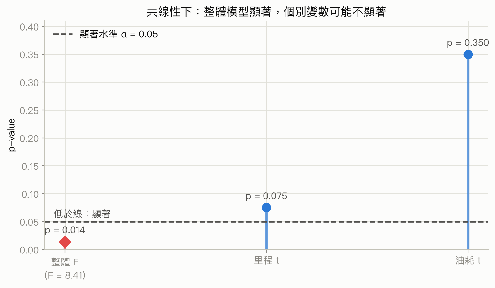

你該注意什麼：整體模型顯著只代表「至少有一個斜率有資訊」，共線性會讓資料難以把共同資訊分配給個別係數，因此不能從整體 $F$ 顯著推成每一個 $t$ 都顯著。

### 投影片第 23 頁：用估計方程式做估計與預測

<!-- exam-question-links:start -->
> **對應考古題：** Ch15 選擇題 [79](#exam-ch15-mc-79)、[80](#exam-ch15-mc-80)、[85](#exam-ch15-mc-85)；Ch15 計算題 [1](#exam-ch15-problem-1)、[6](#exam-ch15-problem-6)、[8](#exam-ch15-problem-8)、[12](#exam-ch15-problem-12)、[22](#exam-ch15-problem-22)、[23](#exam-ch15-problem-23)、[25](#exam-ch15-problem-25)、[28](#exam-ch15-problem-28)、[29](#exam-ch15-problem-29)、[30](#exam-ch15-problem-30)；Ch16 選擇題 [39](#exam-ch16-mc-39)；Ch16 計算題 [21](#exam-ch16-problem-21)、[29](#exam-ch16-problem-29)
<!-- exam-question-links:end -->

給定一組 $x_1,\ldots,x_p$ 後，把它們代入估計方程式，就得到 $\hat y$。同一個計算中心可以有兩種用途：估計這類條件下所有個體的平均 $y$，或預測某一個新個體的實際 $y$。

<a id="formula-multiple-regression-point-estimate"></a>

$$\hat y=b_0+b_1x_1+\cdots+b_px_p$$

Butler 例子中，一台車行駛 100 英里並配送 2 次：

$$\hat y=-0.869+0.06113(100)+0.923(2)=7.09$$

因此估計總行車時間為 7.09 小時。這個值的單位跟 $y$ 相同。它是點估計；若要表達抽樣不確定性，要用下一頁的信賴區間或預測區間。投影片指出複迴歸的完整區間公式超出本教材範圍，實務上常由統計軟體直接提供。

### 投影片第 24 頁：平均反應與個別值的區間

對相同的 $x_1,x_2$，可以建立：

- 95% 信賴區間(confidence interval)：給「這種 $x$ 條件下的平均行車時間」使用。
- 95% 預測區間(prediction interval)：給「一台特定新車的實際行車時間」使用。

個別值除了要承受估計平均值的不確定性，還有該台車自己的隨機誤差，所以預測區間一定比同條件下的平均值信賴區間寬。這兩種區間都應在模型假設合理、且新 $x$ 落在資料支持範圍內時使用；不要把預測區間誤稱為平均值區間，也不要把「95%」解讀成已經算出的這一個固定區間有 95% 機率包含參數。

投影片表列 Butler 資料的 95% 區間如下，重複的 $x$ 組合會有相同的中心與區間：

| $x_1$ 里程 | $x_2$ 配送 | 平均值信賴區間下限 | 上限 | 個別值預測區間下限 | 上限 |
|---:|---:|---:|---:|---:|---:|
| 100 | 4 | 8.135 | 9.742 | 7.363 | 10.514 |
| 50 | 3 | 4.127 | 5.789 | 3.369 | 6.548 |
| 100 | 4 | 8.135 | 9.742 | 7.363 | 10.514 |
| 100 | 2 | 6.258 | 7.925 | 5.500 | 8.683 |
| 50 | 2 | 3.146 | 4.924 | 2.414 | 5.656 |
| 80 | 2 | 5.232 | 6.505 | 4.372 | 7.366 |
| 75 | 3 | 6.037 | 6.936 | 5.059 | 7.915 |
| 65 | 4 | 5.960 | 7.637 | 5.205 | 8.392 |
| 90 | 3 | 6.917 | 7.891 | 5.964 | 8.844 |
| 90 | 2 | 5.776 | 7.184 | 4.953 | 8.007 |
| 75 | 4 | 6.669 | 8.152 | 5.865 | 8.955 |

### 投影片第 25 頁：類別獨立變數與虛擬變數

前面的里程與配送次數是數量型變數。性別、付款方式、維修類型等類別型變數(categorical variable)沒有自然的數值距離，不能直接把「男、女」當成 1、2 代入，否則模型會假裝 2 比 1 多一個有意義單位。

只有兩個類別時，建立一個 0/1 虛擬變數(dummy variable)，也叫指標變數(indicator variable)。例如：

令 $x_i=0$ 代表女性，$x_i=1$ 代表男性。

有 $k$ 個類別且 $k>2$ 時，要用 $k-1$ 個虛擬變數。少用一個類別作為參考組(reference group)，可以避免所有類別指標同時放入時產生完全共線性。

### 投影片第 26 頁：Johnson Filtration 的一變數模型

Johnson Filtration 想預測每一筆維修請求需要多少維修時間。資料有 10 筆服務紀錄，依變數 $y$ 是維修時間(小時)，數量型獨立變數 $x$ 是距離上次服務的月數。

只有月數時，軟體輸出：Multiple $R=73.09\%$、$R^2=53.42\%$、調整後 $R^2=47.59\%$、Standard Error $=0.7810$。ANOVA 為 Regression SS $=5.596$、df $=1$、MS $=5.596$、$F=9.174$、p-value $=0.016$；Residual SS $=4.880$、df $=8$、MSE $=0.610$；Total SS $=10.476$、df $=9$。

係數為截距 $2.147$、Std. Err. $0.605$、$t=3.549$、p-value $=0.008$；月數斜率 $0.304$、Std. Err. $0.100$、$t=3.029$、p-value $=0.016$。在 $\alpha=0.05$ 下，月數與維修時間顯著相關，單獨解釋約 53.42% 的維修時間變異。

### 投影片第 27–28 頁：把維修類型放入模型

把維修類型編碼為：

令 $x_2=0$ 代表機械維修，$x_2=1$ 代表電氣維修。

原本的月數改名為 $x_1$。加入 $x_2$ 後，模型的輸出為：

| 項目 | 數值 |
|---|---:|
| Multiple R | 92.69% |
| $R^2$ | 85.92% |
| 調整後 $R^2$ | 81.90% |
| Standard Error | 0.4590 |
| Observations | 10 |

| 來源 | df | SS | MS | $F$ | p-value |
|---|---:|---:|---:|---:|---:|
| Regression | 2 | 9.001 | 4.500 | 21.36 | 0.0010 |
| Residual | 7 | 1.475 | 0.211 |  |  |
| Total | 9 | 10.476 |  |  |  |

| 係數 | Estimate | Std. Err. | $t$ | p-value |
|---|---:|---:|---:|---:|
| Intercept | 0.930 | 0.467 | 1.993 | 0.087 |
| # Months | 0.388 | 0.063 | 6.195 | 0.000 |
| Repair Type | 1.263 | 0.314 | 4.020 | 0.005 |

在 $\alpha=0.05$ 下，$F$ 檢定顯示模型整體顯著，兩個變數的個別 p-value 也都小於 $0.05$。$R^2$ 從 53.42% 提高到 85.92%，表示加入維修類型後，樣本內可解釋變異大幅增加。

### 投影片第 28–29 頁：二元虛擬變數的係數解讀

母體模型為：

$$E(y)=\beta_0+\beta_1x_1+\beta_2x_2$$

當 $x_2=0$，也就是機械維修：

$$E(y\mid\text{機械})=\beta_0+\beta_1x_1$$

當 $x_2=1$，也就是電氣維修：

$$E(y\mid\text{電氣})=\beta_0+\beta_1x_1+\beta_2$$

| 參數 | 意義與單位 |
|---|---|
| $\beta_0$ | 機械維修且 $x_1=0$ 時的平均維修時間；單位為小時 |
| $\beta_1$ | 類型固定時，距上次服務每增加 1 個月，平均維修時間的變化 |
| $\beta_2$ | 在相同月數下，電氣維修相對機械維修的平均時間差 |

兩類的斜率都是 $\beta_1$，所以兩條線平行；$\beta_2$ 只改變截距。這個平行線解讀假設維修類型不會改變月數的斜率；若兩類的斜率也不同，就需要交互作用項，那不是本頁模型涵蓋的內容。

**定性意義：** 虛擬變數係數是「在其他變數相同時，該類別相對參考組的垂直平均差」。它不是該類別自己的平均值，也不是把類別編成 1 就表示它在數量上比 0 多一單位。更換參考組會改變係數的比較方向與截距，卻不會改變各類別的實際預測值；因此係數是在描述相對位置，不是在替類別排自然順序。

Johnson 的估計係數為 $b_0=0.930,b_1=0.3876,b_2=1.263$：

- 機械維修：$\hat y=0.930+0.3876x_1$。
- 電氣維修：$\hat y=0.930+1.263+0.3876x_1=2.193+0.3876x_1$。

因此，在相同的距上次服務月數下，電氣維修平均比機械維修多 $1.263$ 小時。若 $\beta_2>0$，電氣平均較久；若 $\beta_2<0$，電氣平均較短；若 $\beta_2=0$，兩類無平均差異。這是控制 $x_1$ 後的平均差，不是每一筆維修都必然相差 1.263 小時。

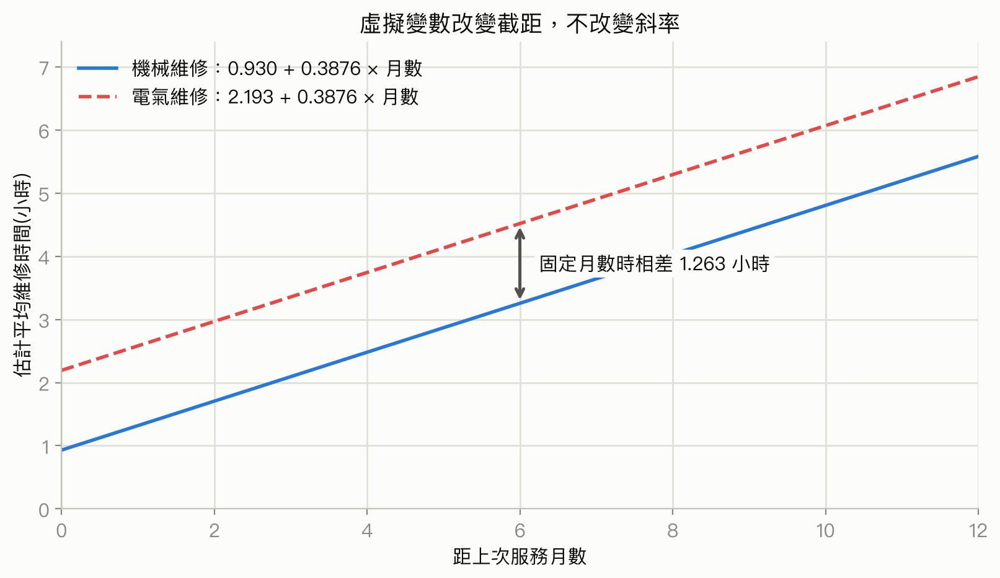

你該注意什麼：這裡的虛擬變數只讓兩條模型線上下平移，所以要在「相同月數」處垂直比較，不能拿不同月數的兩筆維修直接當成 $1.263$ 小時的類型效果。

### 投影片第 30–31 頁：三個以上類別

假設影印機製造商把產品賣到 A、B、C 三個區域，$y$ 是銷售台數。選 A 為參考組，建立兩個虛擬變數：

令 $x_1=1$ 代表 B 區、$x_1=0$ 代表其他區域；令 $x_2=1$ 代表 C 區、$x_2=0$ 代表其他區域。

| 銷售區域 | $x_1$ | $x_2$ |
|---|---:|---:|
| A | 0 | 0 |
| B | 1 | 0 |
| C | 0 | 1 |

模型為：

$$E(y)=\beta_0+\beta_1x_1+\beta_2x_2$$

把三組代入：

$$E(y\mid A)=\beta_0$$

$$E(y\mid B)=\beta_0+\beta_1$$

$$E(y\mid C)=\beta_0+\beta_2$$

因此 $\beta_0$ 是 A 區平均銷售量，$\beta_1$ 是 B 區減 A 區的平均差，$\beta_2$ 是 C 區減 A 區的平均差。換參考組會改變截距與係數的表示方式，但不應改變各組的預測平均值；解讀時一定先確認哪一組被編成全 0。

### 投影片第 32 頁：複迴歸的標準化殘差

<!-- exam-question-links:start -->
> **對應考古題：** Ch15 選擇題 [7](#exam-ch15-mc-7)
<!-- exam-question-links:end -->

殘差是實際值減預測值：$e_i=y_i-\hat y_i$。因為不同觀測的殘差變異可能不同，投影片用標準化殘差(standardized residual)比較其相對大小：

<a id="formula-standardized-residual"></a>

$$r_i=\frac{y_i-\hat y_i}{s_{y_i-\hat y_i}},\qquad s_{y_i-\hat y_i}=s\sqrt{1-h_i}$$

| 符號 | 意義 |
|---|---|
| $r_i$ | 第 $i$ 筆標準化殘差，沒有 $y$ 的單位 |
| $s_{y_i-\hat y_i}$ | 第 $i$ 筆殘差的估計標準差 |
| $s$ | 估計標準誤 |
| $h_i$ | 第 $i$ 筆的槓桿值，反映其 $x$ 是否遠離平均位置 |

複迴歸中的槓桿值計算較複雜，通常交給軟體。Butler 的部分資料如下：

| 里程 | 配送 | 實際時間 | 預測值 | 殘差 | 標準化殘差 |
|---:|---:|---:|---:|---:|---:|
| 100 | 4 | 9.3 | 8.93846 | 0.361541 | 0.78344 |
| 50 | 3 | 4.8 | 4.95830 | -0.158304 | -0.34962 |
| 100 | 4 | 8.9 | 8.93846 | -0.038460 | -0.08334 |
| 100 | 2 | 6.5 | 7.09161 | -0.591609 | -1.30929 |
| 50 | 2 | 4.2 | 4.03488 | 0.165121 | 0.38167 |
| 80 | 2 | 6.2 | 5.86892 | 0.331083 | 0.65431 |
| 75 | 3 | 7.4 | 6.48667 | 0.913331 | 1.68917 |
| 65 | 4 | 6.0 | 6.79875 | -0.798749 | -1.77372 |
| 90 | 3 | 7.6 | 7.40369 | 0.196311 | 0.36703 |
| 90 | 2 | 6.1 | 6.48026 | -0.380263 | -0.77639 |

### 投影片第 33 頁：標準化殘差圖

把標準化殘差對 $\hat y$ 作圖，是檢查模型假設的實用方法。Butler 的圖沒有顯示明顯異常，所有標準化殘差都在 $-2$ 到 $+2$ 之間，因此沒有理由懷疑誤差常態假設，整體模型假設看起來合理。正常機率圖(normal probability plot)也可以檢查誤差是否近似常態，作法和簡單迴歸相同。

實務上除了看是否超出 $\pm2$，也要看殘差是否圍繞 0 隨機散布：漏斗形可能表示變異不等，弧線可能表示線性形式不夠，連續群聚可能表示觀測不獨立。

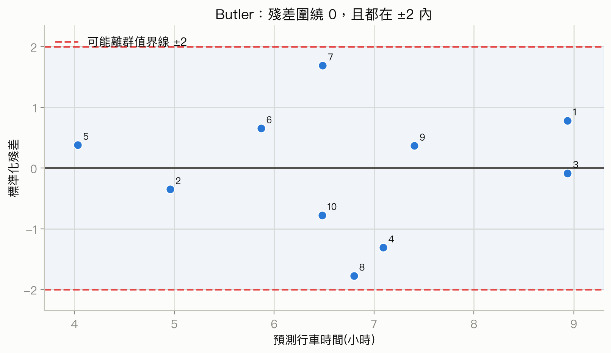

你該注意什麼：先看點是否以 0 為中心、再看有沒有漏斗或弧線，最後才用 $\pm2$ 篩查可能離群值；「沒有越界」不是所有模型假設都已被證明。

### 投影片第 34–35 頁：離群值與 studentized deleted residual

離群值(outlier)是偏離其餘資料趨勢的觀測。投影片的經驗規則是：標準化殘差小於 $-2$ 或大於 $+2$，就列為可能離群值。Butler 的標準化殘差沒有超過這個範圍，因此沒有偵測到離群值。

離群值會把 $s$ 拉大，進而把 $s_{y_i-\hat y_i}$ 的分母拉大，使標準化殘差反而變小，造成「離群值把自己藏起來」的問題。為了降低這個影響，使用 studentized deleted residual：刪除第 $i$ 筆觀測後，用剩下 $n-1$ 筆資料重新估計誤差標準差，再計算第 $i$ 筆的標準化殘差。

若第 $i$ 筆真的是離群值，刪除它後的估計標準誤 $s_{(i)}$ 通常會小於原本的 $s$，所以其 studentized deleted residual 的絕對值會比原標準化殘差大。這個方法適合用來進一步篩查離群觀測；它不是自動刪除資料的命令，還要回頭查資料是否輸入錯誤、是否屬於不同機制或是否有合理的特殊情境。

Butler 的 studentized deleted residual 使用 $n-1=9$ 筆、$p=2$ 個變數，因此自由度為 $9-2-1=6$。以雙尾 $\alpha=0.05$ 的臨界值 $t_{.025}=2.447$ 判斷，表中的值為：

| 里程 | 配送 | 實際時間 | 標準化殘差 | Studentized deleted residual |
|---:|---:|---:|---:|---:|
| 100 | 4 | 9.3 | 0.78344 | 0.75939 |
| 50 | 3 | 4.8 | -0.34962 | -0.32654 |
| 100 | 4 | 8.9 | -0.08334 | -0.07720 |
| 100 | 2 | 6.5 | -1.30929 | -1.39494 |
| 50 | 2 | 4.2 | 0.38167 | 0.35709 |
| 80 | 2 | 6.2 | 0.65431 | 0.62519 |
| 75 | 3 | 7.4 | 1.68917 | 2.03187 |
| 65 | 4 | 6.0 | -1.77372 | -2.21314 |
| 90 | 3 | 7.6 | 0.36703 | 0.34312 |
| 90 | 2 | 6.1 | -0.77639 | -0.75190 |

最大絕對值為 $2.21314<2.447$，所以依這個規則仍沒有偵測到離群值。

### 投影片第 36 頁：有影響力的觀測與槓桿值

<!-- exam-question-links:start -->
> **對應考古題：** Ch15 選擇題 [4](#exam-ch15-mc-4)
<!-- exam-question-links:end -->

有影響力的觀測(influential observation)是刪除或改變它後，估計迴歸方程式會明顯改變的資料點。槓桿值 $h_i$ 衡量第 $i$ 筆的獨立變數組合離各變數平均值有多遠；它只看 $x$ 的位置，不直接看 $y$ 是否偏離。

<a id="formula-leverage-rule"></a>

$$h_i>\frac{3(p+1)}{n}$$

| 符號 | 意義 |
|---|---|
| $h_i$ | 第 $i$ 筆觀測的槓桿值，無單位 |
| $p$ | 獨立變數個數；$p+1$ 也把截距算入 |
| $n$ | 觀測數 |

這是辨識高槓桿值的經驗規則，不是嚴格的顯著性檢定。Butler 中 $p=2,n=10$，門檻為 $3(2+1)/10=0.9$。各觀測的槓桿值依序為 $0.351704,0.375863,0.351704,0.378451,0.430220,0.220557,0.110009,0.382657,0.129098,0.269737$，都未超過 0.9，因此沒有偵測到高槓桿觀測。投影片把第 4 筆列為 $0.373451$，但依原始 $x$ 資料重算及 11e 課本表 15.9 都是 $0.378451$；這個差異不影響它低於 0.9 的結論。不能只因 $h_i$ 高就稱它一定有影響力，還要看它的殘差。

### 投影片第 37 頁：Cook 距離

一個觀測可以有高槓桿但仍貼近迴歸面，因此投影片再用 Cook 距離(Cook's distance)同時考慮槓桿值與殘差：

<a id="formula-cooks-distance"></a>

$$D_i=\frac{(y_i-\hat y_i)^2}{(p+1)s^2}\frac{h_i}{(1-h_i)^2}$$

| 符號 | 意義 |
|---|---|
| $D_i$ | 第 $i$ 筆觀測對估計方程式的綜合影響量，無單位 |
| $y_i-\hat y_i$ | 殘差 |
| $h_i$ | 槓桿值 |
| $s^2$ | $MSE$ |
| $p+1$ | 獨立變數加截距的參數數目 |

經驗規則是 $D_i>1$ 時進一步調查。它適合做診斷排序，不適合當成「大於 1 就一定刪除」的機械規則。Butler 的 Cook 距離依序為 $0.110994,0.024536,0.001256,0.347923,0.036663,0.040381,0.117562,0.650029,0.006656,0.074217$，最大值 $0.650029<1$，因此沒有偵測到有影響力的觀測。

**定性意義：** 槓桿值是在找解釋變數空間中少見的組合，例如里程與配送次數的搭配遠離大多數路線；殘差是在看該點的結果是否離模型面很遠。Cook 距離把兩者合起來，近似回答「若這筆資料不在場，整個模型的預測面會改多少」。Cook 值大表示模型結論對該筆較敏感，需要查證與做敏感度分析，不表示該筆必然錯誤。

### 投影片第 38 頁：邏輯斯迴歸方程式

<!-- exam-question-links:start -->
> **對應考古題：** Ch15 選擇題 [23](#exam-ch15-mc-23)
<!-- exam-question-links:end -->

若依變數只能是兩種結果，例如未兌換/兌換，編成 0 和 1，普通線性迴歸可能預測出小於 0 或大於 1 的值。邏輯斯迴歸用 S 形函數，把預測限制在 0 到 1，並將結果解讀成 $y=1$ 的機率。

先把三層量尺排成一條路徑。事件機率是 $p$；把它改寫成「發生相對於不發生」得到勝算 $p/(1-p)$；再取自然對數得到 log-odds $\ln[p/(1-p)]$。邏輯斯迴歸讓最後這個沒有 0 到 1 上下界的 log-odds 和自變數呈線性關係，再用反轉換把結果送回合法機率。所以下面的 $\beta_j$ 表示 log-odds 的固定增量，$e^{\beta_j}$ 才是勝算倍數；兩者都不是固定的機率增量。後面的勝算與 logit 小節會逐步代入數字。

<a id="formula-logistic-regression"></a>

$$E(y)=P(y=1\mid x_1,\ldots,x_p)=\frac{e^{\beta_0+\beta_1x_1+\cdots+\beta_px_p}}{1+e^{\beta_0+\beta_1x_1+\cdots+\beta_px_p}}$$

| 符號 | 意義 |
|---|---|
| $y$ | 只能編成 0 或 1 的離散依變數 |
| $P(y=1\mid x_1,\ldots,x_p)$ | 給定各獨立變數後，事件 $y=1$ 的條件機率 |
| $e$ | 自然指數的底數，約為 2.718 |
| $\beta_0,\ldots,\beta_p$ | 邏輯斯迴歸母體參數 |

它適用於二元結果與機率建模；若 $y$ 是連續時間或金額，應回到適合連續 $y$ 的迴歸模型。邏輯斯係數本身不是直接的機率增量，通常要轉成機率或勝算比解讀。

### 投影片第 39 頁：邏輯斯曲線的圖像

投影片用只有一個 $x$ 的例子，設定 $\beta_0=-7,\beta_1=3$：

$$P(y=1\mid x)=\frac{e^{-7+3x}}{1+e^{-7+3x}}$$

這條曲線是 S 形，機率範圍永遠在 0 到 1。當 $x=2$ 時，$-7+3(2)=-1$，所以機率約為 $0.27$；當 $x=3$ 時，機率約為 $0.88$。$x$ 越大時，機率接近 1；$x$ 越小時，機率接近 0；當 $x$ 從 2 增加到 3，曲線上升得很快。斜率參數的影響會依目前位在 S 曲線哪一段而變，不應把它解讀成所有 $x$ 都有固定的機率增加量。

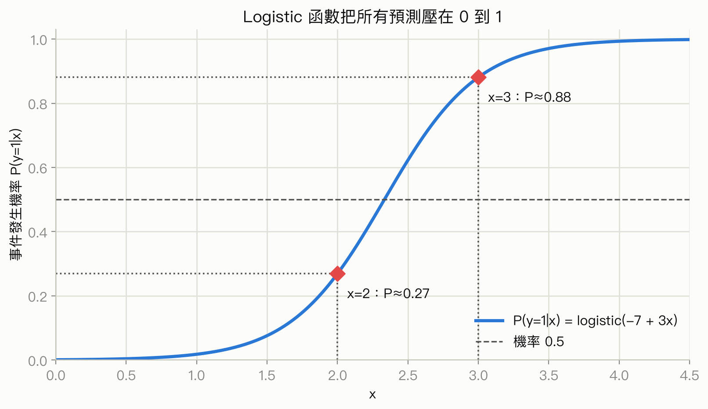

你該注意什麼：$x$ 每增加 1，log-odds 固定增加 3，但機率增加量不固定；S 曲線中段變得快、兩端變得慢。

### 投影片第 40 頁：估計邏輯斯方程式與顯著性

用樣本估計參數後，估計的事件機率為：

<a id="formula-estimated-logistic-regression"></a>

$$\hat y=\widehat{P(y=1\mid x_1,\ldots,x_p)}=\frac{e^{b_0+b_1x_1+\cdots+b_px_p}}{1+e^{b_0+b_1x_1+\cdots+b_px_p}}$$

其中 $b_i$ 是邏輯斯迴歸係數估計值。顯著性檢定的假設寫法和複迴歸相同；差別在於：

- 整體顯著性用 $\chi^2$ 統計量，服從自由度為 $p$ 的卡方分配。
- 個別獨立變數的顯著性也用 $\chi^2$ 統計量，但自由度為 1。

因此，看到 logistic output 時不要把整體檢定欄誤讀成複迴歸的 $F$ 值，也不要把 individual $\chi^2$ 直接當成機率。

### 投影片第 41–42 頁：Simmons Stores 應用

Simmons Stores 想只把昂貴的限量型錄寄給很可能兌換優惠券的顧客。令 $y=1$ 表示兌換、$y=0$ 表示未兌換；$x_1$ 是前一年在 Simmons 的消費金額，單位為千美元；$x_2=1$ 表示有 Simmons 信用卡，$x_2=0$ 表示沒有。樣本包括 50 位有卡顧客與 50 位無卡顧客。

軟體估計值為：截距 $b_0=-2.146$、Spending 的 $b_1=0.342$、Card 的 $b_2=1.099$，所以：

$$\hat y=\frac{e^{-2.146+0.342x_1+1.099x_2}}{1+e^{-2.146+0.342x_1+1.099x_2}}$$

輸出的顯著性與係數表為：

| 項目 | df | $\chi^2$ | p-value (投影片列值) |
|---|---:|---:|---:|
| Whole Model | 2 | 13.63 | 0.0011 |
| Spending | 1 | 7.56 | 0.0060 |
| Card | 1 | 6.41 | 0.0013 |

| 參數 | Estimate | Standard Error |
|---|---:|---:|
| Intercept | -2.146 | 0.577 |
| Spending | 0.342 | 0.13 |
| Card | 1.099 | 0.440 |

課本版本與數值提醒：11e 用個別 $z$ 檢定，14e 投影片改用自由度為 1 的個別 $\chi^2$ 檢定。其中 Card 的 $\chi^2=6.41$ 重算 p-value 約為 $0.0113$，11e 的 $z$ 檢定也給出接近的 $0.013$，所以投影片所列 $0.0013$ 很可能少了一個 1。若題目要求由 $\chi^2=6.41$ 重算，正確結論是在 $\alpha=0.01$ 下不顯著；若考題直接提供投影片表格並要求依表判讀，才按表中的 $0.0013$ 作答，同時知道這是教材數值不一致。

### 投影片第 43–44 頁：用邏輯斯模型估計機率與檢定

假設兩組顧客每年都消費 \$2,000，即 $x_1=2$，但一組有卡、一組無卡。

無卡組 $x_2=0$：

$$\hat y=\frac{e^{-2.146+0.342(2)+1.099(0)}}{1+e^{-2.146+0.342(2)+1.099(0)}}=\frac{e^{-1.462}}{1+e^{-1.462}}=\frac{0.2318}{1.2318}=0.1882$$

有卡組 $x_2=1$：

$$\hat y=\frac{e^{-2.146+0.342(2)+1.099(1)}}{1+e^{-2.146+0.342(2)+1.099(1)}}=\frac{e^{-0.363}}{1+e^{-0.363}}\approx0.4102$$

所以在相同年消費下，有 Simmons 卡的顧客估計兌換機率較高。

整體檢定為：

$$H_0:\beta_1=\beta_2=0,\qquad H_a:\text{至少一個參數不等於 0}$$

Whole Model 的 $\chi^2=13.63$、p-value $=0.0011$。在 $\alpha=0.01$ 下拒絕 $H_0$，模型整體顯著。投影片表格把 $x_1$ 列為 $\chi^2=7.56$、p-value $=0.0060$，把 $x_2$ 列為 $\chi^2=6.41$、p-value $=0.0013$，依表面數字會判成兩者都顯著；但由 $x_2$ 的統計量重算是 $0.0113$，因此若題目要求計算，$x_2$ 在 $1\%$ 顯著水準下不能拒絕虛無假設。

### 投影片第 45 頁：管理上的機率門檻

模型可把年消費從 $1,000$ 到 $7,000$ 的機率列出，供行銷決策使用：

| 信用卡 | $1,000$ | $2,000$ | $3,000$ | $4,000$ | $5,000$ | $6,000$ | $7,000$ |
|---|---:|---:|---:|---:|---:|---:|---:|
| 有卡 | 0.3307 | 0.4102 | 0.4948 | 0.5796 | 0.6599 | 0.7320 | 0.7936 |
| 無卡 | 0.1414 | 0.1881 | 0.2460 | 0.3148 | 0.3927 | 0.4765 | 0.5617 |

若 Simmons 設定只寄給估計兌換機率至少 $0.40$ 的顧客，策略是：有卡顧客年消費至少 $2,000$ 才寄；無卡顧客年消費至少 $6,000$ 才寄。這是「模型機率加上管理門檻」的決策示範，不代表 $0.40$ 是統計上唯一正確的門檻；實務上還要考慮型錄成本、漏寄損失與錯寄損失。

### 投影片第 46–47 頁：勝算與信用卡勝算比

事件發生的勝算(odds)是發生機率除以不發生機率：

<a id="formula-logistic-odds"></a>

$$\text{odds}=\frac{P(y=1\mid x_1,\ldots,x_p)}{P(y=0\mid x_1,\ldots,x_p)}=\frac{P(y=1\mid x_1,\ldots,x_p)}{1-P(y=1\mid x_1,\ldots,x_p)}$$

勝算比(odds ratio)比較某一個獨立變數增加一個單位前後的勝算：

<a id="formula-logistic-odds-ratio"></a>

$$\text{odds ratio}=\frac{\text{odds}_1}{\text{odds}_0}$$

| 符號 | 意義 |
|---|---|
| $\text{odds}_1$ | 該獨立變數增加一單位時，事件 $y=1$ 的勝算 |
| $\text{odds}_0$ | 該獨立變數不變時，事件 $y=1$ 的勝算 |

注意勝算不是機率。例如機率 $0.4102$ 的勝算是 $0.4102/(1-0.4102)=0.6956$，不是 $0.4102$。

對信用卡的比較固定 $x_1=2$：有卡的機率為 $0.4102$，所以 $\text{odds}_1=0.4102/0.5898=0.6956$；無卡機率為 $0.1882$，所以 $\text{odds}_0=0.1882/0.8118=0.2318$。因此：

$$\widehat{\text{odds ratio}}=\frac{0.6956}{0.2318}=3.000$$

解讀是：在年消費固定為 $2,000$ 美元時，有 Simmons 卡顧客兌換優惠券的估計勝算是無卡顧客的 3 倍。這不是「機率變成 3 倍」；它是勝算的倍數。

**定性意義：** 相同的勝算比在不同基準機率下，會產生不同的機率差。事件本來很少或幾乎必然時，勝算乘上固定倍數後，機率可能只移動一點；在 S 曲線中段，同一勝算倍數可能帶來較明顯的機率改變。因此勝算比描述的是相對發生傾向的乘法變化，若要做資源配置或風險溝通，還要把它轉回具體基準下的機率或百分點差。

### 投影片第 48 頁：消費金額的勝算比

邏輯斯迴歸中，若獨立變數 $x_i$ 增加 $c$ 個單位，勝算比為：

<a id="formula-logistic-odds-ratio-change"></a>

$$\text{odds ratio}=e^{c\beta_i}$$

| 符號 | 意義 |
|---|---|
| $c$ | $x_i$ 增加的單位數，可以是正數或負數 |
| $\beta_i$ | $x_i$ 的邏輯斯迴歸母體係數；實務上用 $b_i$ 代入估計 |
| $e$ | 自然指數的底數 |

Simmons 中增加 1 個單位：$e^{b_1}=e^{0.342}=1.407$，所以年消費每增加 $1$ 千美元，兌換勝算估計乘以 $1.407$，其他變數固定。信用卡增加一個 0/1 單位時，$e^{b_2}=e^{1.099}=3.000$。

比較年消費 $5,000$ 和 $2,000$ 時，$x_1$ 增加 $c=5-2=3$ 個千美元：

$$\widehat{\text{odds ratio}}=e^{3(0.342)}=e^{1.026}=2.79$$

因此估計勝算約為 2.79 倍，不是機率增加 2.79 個百分點。

### 投影片第 49 頁：勝算比的信賴區間

勝算比等於 1 表示比較的兩組勝算相同；大於 1 表示該變數增加會提高事件勝算；小於 1 表示會降低事件勝算。

Simmons 輸出：

| 變數 | 勝算比 | 95% 下限 | 95% 上限 |
|---|---:|---:|---:|
| Spending | 1.4073 | 1.0936 | 1.8109 |
| Card | 3.0000 | 1.2550 | 7.1730 |

Spending 的區間 $[1.0936,1.8109]$ 不包含 1，所以在 95% 信賴水準下，消費的勝算比和 1 有顯著差異；Card 的區間 $[1.2550,7.1730]$ 也不包含 1，因此信用卡同樣顯著。這是在解讀區間與「無效果值 1」的比較，不是說已算出的固定區間有 95% 機率包含未知勝算比。

### 投影片第 50 頁：Logit 轉換

logit 是事件 $y=1$ 的勝算取自然對數。它把 0 到 1 的機率轉成可以用自變數線性表示的量：

<a id="formula-logit"></a>

$$g(x_1,\ldots,x_p)=\ln\left(\frac{P(y=1\mid x_1,\ldots,x_p)}{1-P(y=1\mid x_1,\ldots,x_p)}\right)=\beta_0+\beta_1x_1+\cdots+\beta_px_p$$

因此也可以寫回機率：

$$E(y)=\frac{e^{g(x_1,\ldots,x_p)}}{1+e^{g(x_1,\ldots,x_p)}}$$

樣本估計的 logit 為：

$$\hat g(x_1,\ldots,x_p)=b_0+b_1x_1+\cdots+b_px_p$$

Simmons 的估計 logit 是：

$$\hat g(x_1,x_2)=-2.146+0.342x_1+1.099x_2$$

再把它放進 logistic 函數，就得到前面的 $\hat y$。所以 $b_i$ 的線性解讀是 log-odds 的變化，而 $e^{b_i}$ 才是勝算的乘數；轉成機率後，機率變化量會依原本的 $x$ 水準而不同。

### 投影片第 51 頁：大樣本與假設檢定的實務提醒

在複迴歸中，樣本數增加通常會帶來以下效果：

- 整體 $F$ 檢定的 p-value 變小。
- 每一個個別 $t$ 檢定的 p-value 變小。
- 每個斜率參數的信賴區間變窄。
- 平均 $y$ 的信賴區間變窄。
- 個別新 $y$ 的預測區間變窄。

原因是資料變多後，係數與平均反應的估計通常更精確；但「p-value 變小」不代表效果量變大或商業效果一定重要。大樣本也不能修復錯誤的模型形式、偏誤抽樣、量測錯誤或不獨立資料。

除了樣本數與非抽樣誤差，複迴歸還要特別留意多重共線性；它可能使估計斜率係數不穩定、誤導解讀，即使整體模型看起來顯著也一樣。

### 投影片第 52 頁：全章整理

- 複迴歸用兩個以上的獨立變數描述或預測依變數。
- $R^2$ 衡量樣本內可解釋變異比例；調整後 $R^2$ 額外考慮加入變數的代價。
- $F$ 檢定看整體模型，個別 $t$ 檢定看控制其他變數後的單一獨立變數。
- 多重共線性是獨立變數間的高度相關，會讓個別斜率難以穩定解讀。
- 虛擬變數讓類別資料能進入複迴歸；參數解讀要先確認參考組。
- 標準化殘差與 studentized deleted residual 用來查離群值；槓桿值與 Cook 距離用來查可能有影響力的觀測。
- 邏輯斯迴歸處理只能取 0/1 的依變數，輸出可轉成機率、勝算與勝算比。

### 把數字翻成真實意義

| 數字或關係 | 數理上變大／變小 | 資料世界中的定性意義 | 不能直接推論 |
| --- | --- | --- | --- |
| 偏斜率 $b_j$ | 正負與大小描述控制其他變數後的條件平均差 | 在其他已納入條件相近時，$x_j$ 額外區分出的趨勢 | 已控制所有混雜或具有因果性 |
| $R^2$ | 加變數後不會下降 | 模型在目前樣本中整理掉的總離散比例 | 新變數有用、未來一樣準或模型正確 |
| 調整後 $R^2$ | 新資訊足以抵銷複雜度時上升 | 配適改善相對估計更多參數的代價 | 最佳模型或樣本外保證 |
| 整體 $F$ | 越大代表整組預測訊號相對殘差越強 | 至少有一些共同或獨特資訊能區分條件平均 | 每個變數都重要或顯著 |
| 個別 $|t|$ | 越大代表該係數相對自身不穩定性越強 | 其他變數在場後仍可辨認的增量資訊較強 | 原始雙變量關係或因果效果 |
| 共線性 | 越高代表自變數共享資訊越多 | 聯合預測可能可用，但個別歸因較不穩 | 模型整體沒有預測力 |
| 虛擬變數係數 | 正負表示相對參考組的條件平均高低 | 在相同控制條件下兩類預測面的垂直距離 | 類別本身的平均值或自然排序 |
| Cook 距離 | 越大代表刪除該點可能使模型改變更多 | 模型結果較依賴這個少見且偏離的觀察 | 資料錯誤或應自動刪除 |
| 勝算比 | 大於 1 提高勝算，小於 1 降低勝算 | 事件相對不事件的發生傾向乘數 | 機率倍數或固定百分點改變 |

## 跟前面像的東西怎麼分

<a id="compare-ch15-method-selection"></a>

題目沒有標章節時，先不要急著找公式。依序問四件事：$y$ 是連續數值還是 0/1 結果？有幾個 $x$？$x$ 是連續數值還是類別？題目要判斷整個模型、單一變數，還是比較模型？下面五組是本章最常被混在一起的方法。

<a id="compare-ch15-simple-vs-multiple"></a>

### 比較 1：簡單線性迴歸 vs 複迴歸

<!-- exam-question-links:start -->
> **對應考古題：** Ch15 選擇題 [11](#exam-ch15-mc-11)、[19](#exam-ch15-mc-19)、[20](#exam-ch15-mc-20)、[61](#exam-ch15-mc-61)、[66](#exam-ch15-mc-66)
<!-- exam-question-links:end -->

| 比較線索 | 用本章的複迴歸 | 用前面的簡單線性迴歸 |
|---|---|---|
| 資料或問題長相 | 一個連續 $y$，同時有兩個以上的 $x$；題目常出現「控制其他因素後」 | 一個連續 $y$，只有一個 $x$，只需描述兩者的線性關係 |
| 何時使用 | 要合併多項資訊預測，或解讀某個 $x_j$ 在其他變數固定時的部分斜率 | 研究問題真的只有一個解釋變數，且散佈圖顯示直線近似合理；回看[第 14 章簡單線性迴歸模型](#formula-slr-model) |
| 關鍵輸出 | 每個 $b_j$ 都是條件式效果，另有整體 $F$、個別 $t$、$R^2$ 與調整後 $R^2$ | 一個斜率 $b_1$、$r^2$，而整體 $F$ 與斜率 $t$ 檢定結論相同 |
| 共同假設 | 線性形式合理、誤差平均為 0、獨立、等變異；做小樣本推論時還要檢查常態近似 | 假設相同，但只需檢查一個 $x$ 與 $y$ 的關係 |

**一句話判斷準則：** 一個連續 $y$ 若要同時用兩個以上的 $x$，或題目要求「控制其他變數後」的效果，就用複迴歸；只有一個 $x$ 才用簡單迴歸。

**容易誤選情境：** 要用里程與配送次數預測行車時間，卻分別做兩條簡單迴歸線。簡單迴歸無法把兩項資訊合在同一個預測，也無法回答「配送次數固定後，里程增加 1 單位」的部分斜率，因此不適用。

<a id="compare-ch15-overall-f-vs-individual-t"></a>

### 比較 2：整體 $F$ 檢定 vs 個別 $t$ 檢定

<!-- exam-question-links:start -->
> **對應考古題：** Ch15 選擇題 [16](#exam-ch15-mc-16)、[21](#exam-ch15-mc-21)、[56](#exam-ch15-mc-56)、[64](#exam-ch15-mc-64)、[69](#exam-ch15-mc-69)、[74](#exam-ch15-mc-74)、[84](#exam-ch15-mc-84)；Ch15 計算題 [2](#exam-ch15-problem-2)、[5](#exam-ch15-problem-5)、[14](#exam-ch15-problem-14)、[17](#exam-ch15-problem-17)
<!-- exam-question-links:end -->

| 比較線索 | 整體 $F$ 檢定 | 個別 $t$ 檢定 |
|---|---|---|
| 問題長相 | 問「這一整組 $x$ 是否至少有一個和 $y$ 有線性關係？」 | 問「其他變數已控制後，指定的 $x_j$ 是否仍提供資訊？」 |
| 虛無假設 | $H_0:\beta_1=\cdots=\beta_p=0$，一次檢查所有斜率 | $H_0:\beta_j=0$，一次只檢查一個部分斜率 |
| 關鍵輸出 | ANOVA 表中的 $F=MSR/MSE$ 與右尾 p-value | 係數表中的 $t=b_j/s_{b_j}$ 與通常為雙尾的 p-value |
| 和前章的關係 | 簡單迴歸只有一個斜率，因此[第 14 章的整體 $F$](#formula-slr-f-test)與斜率 $t$ 會同結論 | 前章的[斜率 $t$ 檢定](#formula-slr-t-test)到了複迴歸，改成在其他 $x$ 已放入模型時檢查某一斜率 |

**一句話判斷準則：** 題目問「整組有沒有用」看整體 $F$；問「某一個變數控制其他變數後有沒有用」看該係數的 $t$。

**容易誤選情境：** 軟體顯示整體 $F$ 的 p-value 小於 0.05，就宣稱每個 $x$ 都顯著。整體 $F$ 的對立假設只說「至少一個斜率不為 0」，沒有指出是哪一個；尤其有多重共線性時，整體顯著而個別 $t$ 不顯著很常見，所以 $F$ 不能代替個別 $t$。

<a id="compare-ch15-r2-vs-adjusted-r2"></a>

### 比較 3：$R^2$ vs 調整後 $R^2$

<!-- exam-question-links:start -->
> **對應考古題：** Ch15 計算題 [14](#exam-ch15-problem-14)
<!-- exam-question-links:end -->

| 比較線索 | $R^2$ | 調整後 $R^2$ |
|---|---|---|
| 問題長相 | 描述某一個模型在目前樣本中解釋了多少 $y$ 變異 | 用同一批觀測、同一個 $y$ 比較含不同變數個數的模型 |
| 加入新變數後 | 不會下降，即使新變數幾乎沒有幫助 | 新變數帶來的改善不足以抵銷複雜度時可能下降 |
| 關鍵輸出或限制 | 介於 0 與 1；前章的[簡單迴歸判定係數](#formula-slr-r-squared)就是一個 $x$ 時的版本 | 同時使用 $n$、$p$ 與 $R^2$；只適合在相同資料與相同 $y$ 下比較 |
| 不能回答 | 不能證明因果、不能保證樣本外預測好，也不能判斷單一變數顯著 | 同樣不能取代個別 $t$、整體 $F$、殘差診斷或樣本外驗證 |

**一句話判斷準則：** 只描述一個既定模型可報 $R^2$；比較同資料、同 $y$、但變數數量不同的模型時，優先看調整後 $R^2$，不能只追求普通 $R^2$ 變大。

**容易誤選情境：** 加入一個隨機編號後 $R^2$ 從 0.800 微升到 0.801，就說新模型更好。普通 $R^2$ 天生不會因加變數而下降，這種微升可能只是過度配適；此時只看 $R^2$ 不適用，至少要看調整後 $R^2$、變數意義與樣本外表現。

<a id="compare-ch15-continuous-vs-dummy"></a>

### 比較 4：連續變數斜率 vs 虛擬變數係數

<!-- exam-question-links:start -->
> **對應考古題：** Ch15 選擇題 [5](#exam-ch15-mc-5)、[8](#exam-ch15-mc-8)、[22](#exam-ch15-mc-22)、[78](#exam-ch15-mc-78)；Ch15 計算題 [2](#exam-ch15-problem-2)
<!-- exam-question-links:end -->

| 比較線索 | 連續數值型 $x$ | 類別型 $x$ 的虛擬變數 |
|---|---|---|
| 資料長相 | 里程、價格、月數等有單位且相差 1 單位有意義的數值 | 維修類型、地區、是否持卡等類別；類別代碼本身沒有距離 |
| 係數解讀 | 其他變數固定時，$x$ 增加 1 單位，平均 $y$ 改變 $b_j$ 單位 | 其他變數固定時，該類別相對全為 0 的參考組，平均 $y$ 相差 $b_j$ 單位 |
| 如何放進模型 | 直接保留原有單位；若改單位，係數數值也會跟著改 | 兩類用 1 個 0/1 變數；$k$ 類用 $k-1$ 個，不能把 A、B、C 直接當 1、2、3 |
| 何時考慮前面方法 | 若唯一的 $x$ 是連續數值，可用第 14 章的[簡單迴歸估計線](#formula-slr-estimated-line) | 若只有一個類別因子、$y$ 為連續數值，而且只問所有組平均數是否相同，可用第 13 章的[單因子 ANOVA $F$ 檢定](#formula-anova-f)；要再控制連續變數時才轉成虛擬變數迴歸 |

**一句話判斷準則：** $x$ 的「加 1」有數量意義就解讀連續斜率；$x$ 只是組別名稱就用 $k-1$ 個虛擬變數，係數一律相對參考組解讀。

**容易誤選情境：** 把 A、B、C 三區編成 1、2、3 後直接當連續 $x$。這會強迫 A 到 B 與 B 到 C 的差距相同，還假設三區有線性順序；連續斜率因此不適用。應改用兩個虛擬變數；若題目只有三區平均數的整體比較，也可用單因子 ANOVA。

<a id="compare-ch15-linear-probability-vs-logistic"></a>

### 比較 5：線性機率直覺 vs 邏輯斯迴歸

<!-- exam-question-links:start -->
> **對應考古題：** Ch15 選擇題 [24](#exam-ch15-mc-24)
<!-- exam-question-links:end -->

| 比較線索 | 普通線性迴歸或線性機率直覺 | 本章的邏輯斯迴歸 |
|---|---|---|
| $y$ 的型態 | 普通線性迴歸主要處理時間、金額、銷量等連續 $y$；若硬把 0/1 當連續值，配適值可被勉強看成機率 | $y$ 只有 0/1，例如兌換/未兌換、違約/未違約 |
| 模型輸出 | [第 14 章線性模型](#formula-slr-model)給直線上的 $\hat y$；斜率是固定的 $y$ 單位增量 | logistic 函數保證預測介於 0 與 1；係數先改變 log-odds，$e^{b_j}$ 才是勝算比 |
| 模型形狀 | 直線沒有上下界，可能算出負機率或大於 1 的機率 | S 形曲線在兩端變慢、中間變快，所以相同的 $x$ 增量不代表固定機率增量 |
| 關鍵檢定或假設 | 普通線性迴歸使用 $F$ 與 $t$，並假設誤差等變異；0/1 資料的誤差變異會隨機率改變 | 邏輯斯整體與個別效果常用 $\chi^2$；觀測仍須獨立，模型要正確描述 log-odds 與 $x$ 的關係 |

**一句話判斷準則：** 只要應變數是 0/1 且目標是估計事件機率，就選邏輯斯迴歸；應變數是連續量才用普通線性迴歸。

**容易誤選情境：** 用普通最小平方法預測顧客是否兌換優惠券，得到某些顧客的預測值 $-0.08$ 或 $1.12$。事件機率不可能超出 $[0,1]$，而且 0/1 誤差不符合等變異；普通線性迴歸不適用，應用邏輯斯迴歸把輸出限制為合法機率。

## 考古題與詳解

這份題庫共 23 頁。逐頁清點後，包含選擇題 1–85、Problem 1–30，共 115 個主題號；選擇題另使用 Exhibit 15-1 至 15-8 共 8 組共用資料。以下依原題順序完整收錄。每題都先回到[本章方法選擇準則](#compare-ch15-method-selection)，再連回真正用到的公式。

### 選擇題｜第 1–20 題：模型、假設與基本名詞

#### 選擇題 1 <a id="exam-ch15-mc-1"></a>

##### 題目

> The mathematical equation relating the expected value of the dependent variable to the value of the independent variables, which has the form of $E(y)=\beta_0+\beta_1x_1+\beta_2x_2+\cdots+\beta_px_p$, is
>
> a. a simple linear regression model<br>
> b. a multiple nonlinear regression model<br>
> c. an estimated multiple regression equation<br>
> d. a multiple regression equation

##### 詳解

<!-- exam-theory-links:start -->
> **回看講義：** [投影片第 4 頁：複迴歸模型與迴歸方程式](#formula-multiple-regression-mean)
<!-- exam-theory-links:end -->

1. **辨認題型：** 這是母體平均反應方程式的名稱辨認。
2. **選方法：** 依[方法選擇準則](#compare-ch15-method-selection)，看到多個 $x$ 與母體參數 $\beta$，回看[複迴歸平均方程式](#formula-multiple-regression-mean)。
3. **檢查假設：** 題目只辨認符號，不需用樣本做推論；注意式中沒有誤差項。
4. **代入計算／推理：** $E(y)$ 與 $\beta$ 表示母體的 multiple regression equation，故選 d。選項 a 只有一個 $x$；b 誤稱非線性；c 應使用樣本係數 $b$ 與 $\hat y$。
5. **解讀結論：** 正確答案是 **d** ；它描述固定各 $x$ 時的母體平均 $y$。

**選項逐一：** a 容易因看到 regression 而選，但 simple 只能有一個 $x$；b 錯在此式對各 $x$ 是線性的；c 錯在估計式應使用 $b_j$ 與 $\hat y$；d 正確，這是用母體參數表示的複迴歸平均方程式。

#### 選擇題 2 <a id="exam-ch15-mc-2"></a>

##### 題目

> The estimate of the multiple regression equation based on the sample data, which has the form of $\hat y=b_0+b_1x_1+b_2x_2+\cdots+b_px_p$, is
>
> a. a simple linear regression model<br>
> b. a multiple nonlinear regression model<br>
> c. an estimated multiple regression equation<br>
> d. a multiple regression equation

##### 詳解

<!-- exam-theory-links:start -->
> **回看講義：** [投影片第 5 頁：估計複迴歸方程式](#formula-estimated-multiple-regression)
<!-- exam-theory-links:end -->

1. **辨認題型：** 樣本估計式名稱辨認。
2. **選方法：** 依[方法選擇準則](#compare-ch15-method-selection)，回看[估計複迴歸方程式](#formula-estimated-multiple-regression)。
3. **檢查假設：** 只需分清 $b$ 是樣本估計、$\beta$ 是母體參數。
4. **代入計算／推理：** 式中是 $\hat y$ 與 $b_j$，故為 estimated multiple regression equation。a 少了多個 $x$；b 不是非線性；d 通常指母體平均方程式。
5. **解讀結論：** 正確答案是 **c** ；它用樣本估計給定 $x$ 時的平均反應。

**選項逐一：** a 錯在 simple 只含一個解釋變數；b 錯在方程式仍是線性加總；c 正確，$\hat y$ 與 $b_j$ 表示由樣本得到的估計式；d 容易與母體方程式混淆，但母體式應使用 $\beta_j$。

#### 選擇題 3 <a id="exam-ch15-mc-3"></a>

##### 題目

> The mathematical equation that explains how the dependent variable $y$ is related to several independent variables $x_1,x_2,\ldots,x_p$ and the error term $\epsilon$ is
>
> a. a simple nonlinear regression model<br>
> b. a multiple regression model<br>
> c. an estimated multiple regression equation<br>
> d. a multiple regression equation

##### 詳解

<!-- exam-theory-links:start -->
> **回看講義：** [投影片第 4 頁：複迴歸模型與迴歸方程式](#formula-multiple-regression-model)
<!-- exam-theory-links:end -->

1. **辨認題型：** 含誤差項的母體模型名稱辨認。
2. **選方法：** 依[方法選擇準則](#compare-ch15-method-selection)，回看[複迴歸模型](#formula-multiple-regression-model)。
3. **檢查假設：** 題幹明示 several independent variables 與 $\epsilon$。
4. **代入計算／推理：** $y=\beta_0+\sum\beta_jx_j+\epsilon$ 是 multiple regression model。a 誤稱 simple/nonlinear；c 沒有母體誤差項；d 指 $E(y)$ 的平均方程式。
5. **解讀結論：** 正確答案是 **b** ；模型包含平均結構與個別觀測的隨機誤差。

**選項逐一：** a 同時錯在 simple 與 nonlinear；b 正確，個別 $y$、多個 $x$ 與 $\epsilon$ 構成複迴歸模型；c 錯在估計式使用 $b_j$ 且不含母體誤差項；d 是不含 $\epsilon$ 的平均方程式，不是完整模型。

#### 選擇題 4 <a id="exam-ch15-mc-4"></a>

##### 題目

> A measure of the effect of an unusual $x$ value on the regression results is called
>
> a. Cook's D<br>
> b. Leverage<br>
> c. odd ratio<br>
> d. unusual regression

##### 詳解

<!-- exam-theory-links:start -->
> **回看講義：** [投影片第 36 頁：有影響力的觀測與槓桿值](#formula-leverage-rule)
<!-- exam-theory-links:end -->

1. **辨認題型：** 異常 $x$ 位置的診斷量。
2. **選方法：** 依[方法選擇準則](#compare-ch15-method-selection)，只問 $x$ 離中心多遠時看[槓桿值規則](#formula-leverage-rule)。
3. **檢查假設：** 題目只問 unusual $x$，沒有同時要求殘差大小。
4. **代入計算／推理：** leverage 只由 $x$ 位置決定，故 b。Cook's D 同時看槓桿與殘差；odd ratio 屬 logistic；d 不是標準術語。
5. **解讀結論：** 正確答案是 **b** ；高槓桿代表 $x$ 組合不尋常，不等於一定有影響力。

**選項逐一：** a Cook's D 也談影響力，容易誤選，但它同時結合殘差與槓桿；b 正確，leverage 專門衡量 $x$ 位置是否異常；c odds ratio 屬於邏輯斯迴歸；d 不是標準統計術語。

#### 選擇題 5 <a id="exam-ch15-mc-5"></a>

##### 題目

> A variable that cannot be measured in terms of how much or how many but instead is assigned values to represent categories is called
>
> a. an interaction<br>
> b. a constant variable<br>
> c. a category variable<br>
> d. a qualitative variable

##### 詳解

<!-- exam-theory-links:start -->
> **回看講義：** [比較 4：連續變數斜率 vs 虛擬變數係數](#compare-ch15-continuous-vs-dummy)
<!-- exam-theory-links:end -->

1. **辨認題型：** 變數型態辨認。
2. **選方法：** 依[連續變數與虛擬變數比較](#compare-ch15-continuous-vs-dummy)，先判斷數字是否有數量意義。
3. **檢查假設：** 題幹說數值只是代表類別，不能做有意義的加減距離。
4. **代入計算／推理：** 標準名稱是 qualitative variable，故 d。a 是模型項；b 是不變量；c 口語接近但不是本題教材採用的術語。
5. **解讀結論：** 正確答案是 **d** ；進入迴歸時通常要轉成虛擬變數。

**選項逐一：** a interaction 是變數共同作用的模型項；b constant variable 不隨觀測改變；c category variable 口語上相近，容易誤選，但本題教材採用的正式名稱不是它；d qualitative variable 是正確術語。

#### 選擇題 6 <a id="exam-ch15-mc-6"></a>

##### 題目

> In order to test for the significance of a regression model involving 3 independent variables and 47 observations, the numerator and denominator degrees of freedom (respectively) for the critical value of $F$ are
>
> a. 47 and 3<br>
> b. 3 and 47<br>
> c. 2 and 43<br>
> d. 3 and 43

##### 詳解

<!-- exam-theory-links:start -->
> **回看講義：** [投影片第 16–17 頁：整體 $F$ 檢定](#formula-multiple-regression-f-test)
<!-- exam-theory-links:end -->

1. **辨認題型：** 整體 $F$ 檢定自由度。
2. **選方法：** 依[整體 F 與個別 t 比較](#compare-ch15-overall-f-vs-individual-t)，使用[整體 F 公式](#formula-multiple-regression-f-test)。
3. **檢查假設：** $p=3$、$n=47$，模型含截距。
4. **代入計算／推理：** 分子 $df=p=3$；分母 $df=n-p-1=47-3-1=43$。a、b 忘記誤差自由度；c 又少算一個斜率。
5. **解讀結論：** 正確答案是 **d** ，查 $F_{3,43}$。

**選項逐一：** a 把樣本數與變數數放錯位置；b 雖把 3 放分子，但分母不能直接用 $n=47$；c 把分子自由度誤算為 2；d 正確，$(df_1,df_2)=(3,47-3-1)=(3,43)$。

#### 選擇題 7 <a id="exam-ch15-mc-7"></a>

##### 題目

> In regression analysis, an outlier is an observation whose
>
> a. mean is larger than the standard deviation<br>
> b. residual is zero<br>
> c. mean is zero<br>
> d. residual is much larger than the rest of the residual values

##### 詳解

<!-- exam-theory-links:start -->
> **回看講義：** [投影片第 32 頁：複迴歸的標準化殘差](#formula-standardized-residual)
<!-- exam-theory-links:end -->

1. **辨認題型：** 離群值定義。
2. **選方法：** 依[方法選擇準則](#compare-ch15-method-selection)，以[標準化殘差](#formula-standardized-residual)比較偏離程度。
3. **檢查假設：** 離群是相對迴歸面而言，不是比較樣本平均數。
4. **代入計算／推理：** 異常大的殘差符合 d。a、c 混淆平均；b 反而表示觀測落在配適面上。
5. **解讀結論：** 正確答案是 **d** ；實務上再用標準化或 deleted residual 判斷。

**選項逐一：** a 平均數與標準差的大小不能定義迴歸離群值；b 殘差為 0 代表點落在配適面上；c 平均為 0 與單一觀測是否離群無關；d 正確，離群值的殘差相對其他觀測特別大。

#### 選擇題 8 <a id="exam-ch15-mc-8"></a>

##### 題目

> A variable that takes on the values of 0 or 1 and is used to incorporate the effect of qualitative variables in a regression model is called
>
> a. an interaction<br>
> b. a constant variable<br>
> c. a dummy variable<br>
> d. None of these alternatives is correct.

##### 詳解

<!-- exam-theory-links:start -->
> **回看講義：** [比較 4：連續變數斜率 vs 虛擬變數係數](#compare-ch15-continuous-vs-dummy)
<!-- exam-theory-links:end -->

1. **辨認題型：** 0/1 類別編碼名稱。
2. **選方法：** 依[連續變數與虛擬變數比較](#compare-ch15-continuous-vs-dummy)判斷。
3. **檢查假設：** 題目說 0/1 是為了表示 qualitative variable。
4. **代入計算／推理：** 這正是 dummy variable，故 c。a 通常是變數乘積；b 不隨觀測改變；d 因 c 已正確而錯。
5. **解讀結論：** 正確答案是 **c** ；係數要相對 0 所代表的參考組解讀。

**選項逐一：** a interaction 不是單純的 0/1 類別編碼；b constant variable 不會在 0 與 1 間隨組別改變；c 正確，這就是 dummy variable；d 錯，因為 c 已給出正確名稱。

#### 選擇題 9 <a id="exam-ch15-mc-9"></a>

##### 題目

> In a multiple regression model, the error term $\epsilon$ is assumed to be a random variable with a mean of
>
> a. zero<br>
> b. $-1$<br>
> c. 1<br>
> d. any value

##### 詳解

<!-- exam-theory-links:start -->
> **回看講義：** [投影片第 4 頁：複迴歸模型與迴歸方程式](#formula-multiple-regression-model)
<!-- exam-theory-links:end -->

1. **辨認題型：** 誤差假設。
2. **選方法：** 依[複迴歸模型](#formula-multiple-regression-model)的 $E(\epsilon)=0$。
3. **檢查假設：** 是對固定 $x$ 條件下的誤差平均而言。
4. **代入計算／推理：** 平均為 0 才使 $E(y)=\beta_0+\sum\beta_jx_j$，故 a。b、c 會造成系統偏差；d 不足以定義平均反應。
5. **解讀結論：** 正確答案是 **a** ；不是說每筆誤差都等於 0。

**選項逐一：** a 正確，模型假設固定 $x$ 時 $E(\epsilon)=0$；b 錯在平均設為 $-1$ 會造成系統性負偏差；c 錯在平均設為 1 會造成系統性正偏差；d 容易因誤差是隨機變數而選，但它的平均不能任意，必須指定為 0。

#### 選擇題 10 <a id="exam-ch15-mc-10"></a>

##### 題目

> In regression analysis, the response variable is the
>
> a. independent variable<br>
> b. dependent variable<br>
> c. slope of the regression function<br>
> d. intercept

##### 詳解

<!-- exam-theory-links:start -->
> **回看講義：** [投影片第 4 頁：複迴歸模型與迴歸方程式](#formula-multiple-regression-model)
<!-- exam-theory-links:end -->

1. **辨認題型：** 迴歸角色名稱。
2. **選方法：** 回看[複迴歸模型](#formula-multiple-regression-model)，反應變數是左側的 $y$。
3. **檢查假設：** 只需區分被解釋的 $y$ 與解釋變數 $x$。
4. **代入計算／推理：** response variable 就是 dependent variable，故 b。a 是 $x$；c、d 是模型參數角色。
5. **解讀結論：** 正確答案是 **b** 。

**選項逐一：** a independent variable 是用來解釋的 $x$；b 正確，response variable 就是 dependent variable $y$；c slope 是係數而不是變數；d intercept 也是係數而不是反應變數。

#### 選擇題 11 <a id="exam-ch15-mc-11"></a>

##### 題目

> A multiple regression model has
>
> a. only one independent variable<br>
> b. more than one dependent variable<br>
> c. more than one independent variable<br>
> d. at least 2 dependent variables

##### 詳解

<!-- exam-theory-links:start -->
> **回看講義：** [比較 1：簡單線性迴歸 vs 複迴歸](#compare-ch15-simple-vs-multiple)
<!-- exam-theory-links:end -->

1. **辨認題型：** 複迴歸定義。
2. **選方法：** 依[簡單與複迴歸比較](#compare-ch15-simple-vs-multiple)。
3. **檢查假設：** 本章模型仍只有一個反應 $y$。
4. **代入計算／推理：** multiple 指多個 independent variables，故 c。a 是簡單迴歸；b、d 誤把多重放在 $y$。
5. **解讀結論：** 正確答案是 **c** 。

**選項逐一：** a 只有一個 independent variable 是簡單迴歸；b 錯在複迴歸仍只有一個 dependent variable；c 正確，複迴歸有多個 independent variables 但仍只有一個 $y$；d 同樣錯在宣稱至少有 2 個 dependent variables。

#### 選擇題 12 <a id="exam-ch15-mc-12"></a>

##### 題目

> A measure of goodness of fit for the estimated regression equation is the
>
> a. multiple coefficient of determination<br>
> b. mean square due to error<br>
> c. mean square due to regression<br>
> d. sample size

##### 詳解

<!-- exam-theory-links:start -->
> **回看講義：** [投影片第 11 頁：多元判定係數](#formula-multiple-r-squared)
<!-- exam-theory-links:end -->

1. **辨認題型：** 配適度摘要辨認。
2. **選方法：** 依[$R^2$ 與調整後 $R^2$ 比較](#compare-ch15-r2-vs-adjusted-r2)，回看[多元 $R^2$](#formula-multiple-r-squared)。
3. **檢查假設：** 題目問解釋變異比例，不是單一均方。
4. **代入計算／推理：** multiple coefficient of determination 即 $R^2$，故 a。MSE 描述殘差尺度；MSR 用於 $F$；樣本數不是配適指標。
5. **解讀結論：** 正確答案是 **a** ；高 $R^2$ 仍不代表因果或模型假設成立。

**選項逐一：** a 正確，multiple coefficient of determination 即 $R^2$，直接摘要配適；b MSE 描述殘差變異尺度；c MSR 是整體 $F$ 的分子成分；d sample size 影響精確度，但不是配適度量。

#### 選擇題 13 <a id="exam-ch15-mc-13"></a>

##### 題目

> The numerical value of the coefficient of determination
>
> a. is always larger than the coefficient of correlation<br>
> b. is always smaller than the coefficient of correlation<br>
> c. is negative if the coefficient of determination is negative<br>
> d. can be larger or smaller than the coefficient of correlation

##### 詳解

<!-- exam-theory-links:start -->
> **回看講義：** [投影片第 11 頁：多元判定係數](#formula-multiple-r-squared)
<!-- exam-theory-links:end -->

1. **辨認題型：** $R^2$ 與相關係數數值比較。
2. **選方法：** 回看[多元 $R^2$](#formula-multiple-r-squared)；在簡單迴歸中 $R^2=r^2$，而 $r$ 可正可負。
3. **檢查假設：** $R^2$ 不會為負；題目未限定 $r$ 的符號與大小。
4. **代入計算／推理：** 例如 $r=0.5$ 時 $R^2=0.25<r$；$r=-0.5$ 時 $R^2=0.25>r$，故 d。a、b 不是永遠；c 的前提不可能。
5. **解讀結論：** 正確答案是 **d** ；不要把相關方向和解釋比例混為一談。

**選項逐一：** a 不一定，正相關時 $r^2$ 常小於 $r$；b 也不一定，若比較帶正負號的 $r$，負相關時 $r^2>r$，且端點還可能相等；c 錯在 $R^2$ 不會因相關為負而變負；d 正確，按題目使用帶正負號的 correlation coefficient 時，$R^2$ 可大於或小於 $r$。

#### 選擇題 14 <a id="exam-ch15-mc-14"></a>

##### 題目

> The adjusted multiple coefficient of determination is adjusted for
>
> a. the number of dependent variables<br>
> b. the number of independent variables<br>
> c. the number of equations<br>
> d. detrimental situations

##### 詳解

<!-- exam-theory-links:start -->
> **回看講義：** [投影片第 12 頁：調整後多元判定係數](#formula-adjusted-r-squared)
<!-- exam-theory-links:end -->

1. **辨認題型：** 調整後 $R^2$ 的調整來源。
2. **選方法：** 依[$R^2$ 與調整後 $R^2$ 比較](#compare-ch15-r2-vs-adjusted-r2)，回看[調整後 $R^2$](#formula-adjusted-r-squared)。
3. **檢查假設：** 公式同時使用 $n$ 與獨立變數數 $p$。
4. **代入計算／推理：** 它對加入 independent variables 的複雜度調整，故 b。a 本章只有一個 $y$；c、d 不是公式成分。
5. **解讀結論：** 正確答案是 **b** 。

**選項逐一：** a 本章只有一個 dependent variable，並非調整來源；b 正確，adjusted $R^2$ 對 independent variables 的數量與樣本數作修正；c 方程式數量不在公式中；d 不是統計定義。

#### 選擇題 15 <a id="exam-ch15-mc-15"></a>

##### 題目

> In a multiple regression model, the variance of the error term $\epsilon$ is assumed to be
>
> a. the same for all values of the dependent variable<br>
> b. zero<br>
> c. the same for all values of the independent variable<br>
> d. $-1$

##### 詳解

<!-- exam-theory-links:start -->
> **回看講義：** [投影片第 4 頁：複迴歸模型與迴歸方程式](#formula-multiple-regression-model)
<!-- exam-theory-links:end -->

1. **辨認題型：** 等變異假設。
2. **選方法：** 回看[複迴歸模型](#formula-multiple-regression-model)的 $Var(\epsilon\mid x)=\sigma^2$。
3. **檢查假設：** 應在不同 $x$ 條件下比較誤差散布。
4. **代入計算／推理：** 變異對所有 independent-variable values 相同，故 c。a 把條件方向說反；b、d 都不可能作一般隨機誤差變異。
5. **解讀結論：** 正確答案是 **c** ；殘差圖若呈漏斗形就值得懷疑此假設。

**選項逐一：** a 容易因想到 $y$ 的散布而選，但等變異是假設固定不同 $x$ 值時誤差變異相同；b 變異為 0 會表示完全沒有隨機誤差；c 正確；d 變異不可能是負數。

#### 選擇題 16 <a id="exam-ch15-mc-16"></a>

##### 題目

> In multiple regression analysis, the correlation among the independent variables is termed
>
> a. homoscedasticity<br>
> b. linearity<br>
> c. multicollinearity<br>
> d. adjusted coefficient of determination

##### 詳解

<!-- exam-theory-links:start -->
> **回看講義：** [比較 2：整體 $F$ 檢定 vs 個別 $t$ 檢定](#compare-ch15-overall-f-vs-individual-t)
<!-- exam-theory-links:end -->

1. **辨認題型：** 解釋變數彼此相關的名稱。
2. **選方法：** 依[整體 F 與個別 t 比較](#compare-ch15-overall-f-vs-individual-t)旁的共線性提醒。
3. **檢查假設：** 題目說的是 independent variables 彼此相關，不是誤差變異。
4. **代入計算／推理：** 名稱是 multicollinearity，故 c。a 是等變異；b 是模型形狀；d 是配適指標。
5. **解讀結論：** 正確答案是 **c** ；它可能放大個別係數標準誤。

**選項逐一：** a homoscedasticity 是誤差等變異；b linearity 是平均反應形式；c 正確，解釋變數彼此相關稱 multicollinearity；d adjusted coefficient of determination 是配適指標。

#### 選擇題 17 <a id="exam-ch15-mc-17"></a>

##### 題目

> In a multiple regression model, the values of the error term $\epsilon$ are assumed to be
>
> a. zero<br>
> b. dependent on each other<br>
> c. independent of each other<br>
> d. always negative

##### 詳解

<!-- exam-theory-links:start -->
> **回看講義：** [投影片第 4 頁：複迴歸模型與迴歸方程式](#formula-multiple-regression-model)
<!-- exam-theory-links:end -->

1. **辨認題型：** 誤差獨立假設。
2. **選方法：** 回看[複迴歸模型](#formula-multiple-regression-model)的推論條件。
3. **檢查假設：** 是不同觀測的誤差彼此獨立，不是每個誤差等於 0。
4. **代入計算／推理：** 故 c。a 混淆平均為 0；b 正好違反假設；d 沒有理論依據。
5. **解讀結論：** 正確答案是 **c** ；時間序列資料尤其要檢查這點。

**選項逐一：** a 把『誤差平均為 0』誤解成每個誤差都為 0；b 正好違反獨立性假設；c 正確，不同觀測的誤差應彼此獨立；d 誤差可正可負，不會永遠為負。

#### 選擇題 18 <a id="exam-ch15-mc-18"></a>

##### 題目

> In a multiple regression model, the error term $\epsilon$ is assumed to
>
> a. have a mean of 1<br>
> b. have a variance of zero<br>
> c. have a standard deviation of 1<br>
> d. be normally distributed

##### 詳解

<!-- exam-theory-links:start -->
> **回看講義：** [投影片第 4 頁：複迴歸模型與迴歸方程式](#formula-multiple-regression-model)
<!-- exam-theory-links:end -->

1. **辨認題型：** 小樣本推論的誤差分配假設。
2. **選方法：** 回看[複迴歸模型](#formula-multiple-regression-model)的常態誤差條件。
3. **檢查假設：** 平均應為 0、變異為未知 $\sigma^2>0$，不是固定為 1。
4. **代入計算／推理：** d 是教材假設。a 平均錯；b 會使資料完全無隨機散布；c 不要求標準差恰為 1。
5. **解讀結論：** 正確答案是 **d** ；這是推論假設，不表示觀測值本身都呈標準常態。

**選項逐一：** a 平均應為 0 而不是 1；b 變異應為未知的 $\sigma^2>0$；c 標準差不必固定為 1；d 正確，教材的小樣本推論假設誤差近似常態。

#### 選擇題 19 <a id="exam-ch15-mc-19"></a>

##### 題目

> In multiple regression analysis,
>
> a. there can be any number of dependent variables but only one independent variable<br>
> b. there must be only one independent variable<br>
> c. the coefficient of determination must be larger than 1<br>
> d. there can be several independent variables, but only one dependent variable

##### 詳解

<!-- exam-theory-links:start -->
> **回看講義：** [比較 1：簡單線性迴歸 vs 複迴歸](#compare-ch15-simple-vs-multiple)
<!-- exam-theory-links:end -->

1. **辨認題型：** 複迴歸資料結構。
2. **選方法：** 依[簡單與複迴歸比較](#compare-ch15-simple-vs-multiple)。
3. **檢查假設：** 本章是單一連續 $y$、多個 $x$。
4. **代入計算／推理：** d 正確。a、b 把變數數目說反；c 違反 $0\le R^2\le1$。
5. **解讀結論：** 正確答案是 **d** 。

**選項逐一：** a 把 dependent 與 independent 的數量說反；b 是簡單迴歸的限制；c 錯在 $R^2$ 不會大於 1；d 正確，複迴歸容許多個 $x$，但本章仍只有一個 $y$。

#### 選擇題 20 <a id="exam-ch15-mc-20"></a>

##### 題目

> A regression model in which more than one independent variable is used to predict the dependent variable is called
>
> a. a simple linear regression model<br>
> b. a multiple regression model<br>
> c. an independent model<br>
> d. None of these alternatives is correct.

##### 詳解

<!-- exam-theory-links:start -->
> **回看講義：** [比較 1：簡單線性迴歸 vs 複迴歸](#compare-ch15-simple-vs-multiple)
<!-- exam-theory-links:end -->

1. **辨認題型：** 模型名稱辨認。
2. **選方法：** 依[簡單與複迴歸比較](#compare-ch15-simple-vs-multiple)。
3. **檢查假設：** 題幹明示 more than one independent variable。
4. **代入計算／推理：** 這就是 multiple regression model，故 b。a 只有一個 $x$；c 不是標準名稱；d 因 b 正確而錯。
5. **解讀結論：** 正確答案是 **b** 。

**選項逐一：** a simple linear regression 只有一個解釋變數；b 正確，多於一個 independent variable 就是 multiple regression；c independent model 不是標準名稱；d 錯，因為 b 已正確。

### 選擇題｜第 21–44 題：方法選擇、自由度與變異分解

#### 選擇題 21 <a id="exam-ch15-mc-21"></a>

##### 題目

> A term used to describe the case when the independent variables in a multiple regression model are correlated is
>
> a. regression<br>
> b. correlation<br>
> c. multicollinearity<br>
> d. None of the above answers is correct.

##### 詳解

<!-- exam-theory-links:start -->
> **回看講義：** [比較 2：整體 $F$ 檢定 vs 個別 $t$ 檢定](#compare-ch15-overall-f-vs-individual-t)
<!-- exam-theory-links:end -->

1. **辨認題型：** 解釋變數互相關聯的術語。
2. **選方法：** 依[整體 F 與個別 t 比較](#compare-ch15-overall-f-vs-individual-t)判斷共線性。
3. **檢查假設：** 關聯發生在多個 $x$ 之間。
4. **代入計算／推理：** c 的 multicollinearity 是專名；a 是分析方法；b 太籠統；d 因 c 正確而錯。
5. **解讀結論：** 正確答案是 **c** 。

**選項逐一：** a regression 是整體分析名稱，不是 $x$ 間相關的專名；b correlation 只泛指關聯，沒有指出複迴歸中的問題；c 正確，這種情況稱 multicollinearity；d 錯，因為 c 已正確。

#### 選擇題 22 <a id="exam-ch15-mc-22"></a>

##### 題目

> A variable that cannot be measured in numerical terms is called
>
> a. a nonmeasurable random variable<br>
> b. a constant variable<br>
> c. a dependent variable<br>
> d. a qualitative variable

##### 詳解

<!-- exam-theory-links:start -->
> **回看講義：** [比較 4：連續變數斜率 vs 虛擬變數係數](#compare-ch15-continuous-vs-dummy)
<!-- exam-theory-links:end -->

1. **辨認題型：** 類別型變數名稱。
2. **選方法：** 依[連續變數與虛擬變數比較](#compare-ch15-continuous-vs-dummy)。
3. **檢查假設：** 題幹表示類別而非有單位的數量。
4. **代入計算／推理：** d 是標準術語；a 不是教材名稱；b 是固定值；c 只說模型角色。
5. **解讀結論：** 正確答案是 **d** 。

**選項逐一：** a nonmeasurable random variable 不是教材術語；b constant variable 是固定不變的量；c dependent variable 描述模型角色，仍可為數值；d 正確，不能以數量尺度衡量的變數稱 qualitative variable。

#### 選擇題 23 <a id="exam-ch15-mc-23"></a>

##### 題目

> In logistic regression,
>
> a. there can only be two independent variables<br>
> b. there are two dependent variables<br>
> c. the dependent variable only assumes two discrete values<br>
> d. the dependent variable only assumes two continuous values

##### 詳解

<!-- exam-theory-links:start -->
> **回看講義：** [投影片第 38 頁：邏輯斯迴歸方程式](#formula-logistic-regression)
<!-- exam-theory-links:end -->

1. **辨認題型：** logistic 適用的 $y$ 型態。
2. **選方法：** 依[線性機率與 logistic 比較](#compare-ch15-linear-probability-vs-logistic)，回看[logistic 模型](#formula-logistic-regression)。
3. **檢查假設：** $y$ 是單一變數，常編為 0/1；$x$ 數量不受限於 2。
4. **代入計算／推理：** c 正確。a 限錯 $x$ 數；b 把兩個值誤當兩個變數；d 把離散說成連續。
5. **解讀結論：** 正確答案是 **c** 。

**選項逐一：** a logistic regression 的解釋變數數量不限於 2；b 仍只有一個 dependent variable；c 正確，dependent variable 只取兩個離散值；d 錯在二元結果不是兩個連續值。

#### 選擇題 24 <a id="exam-ch15-mc-24"></a>

##### 題目

> In a situation where the dependent variable can assume only one of the two possible discrete values,
>
> a. we must use multiple regression<br>
> b. there can only be two independent variables<br>
> c. logistic regression should be applied<br>
> d. all the independent variables must have values of either zero or one

##### 詳解

<!-- exam-theory-links:start -->
> **回看講義：** [比較 5：線性機率直覺 vs 邏輯斯迴歸](#compare-ch15-linear-probability-vs-logistic)
<!-- exam-theory-links:end -->

1. **辨認題型：** 二元結果的方法選擇。
2. **選方法：** 依[線性機率與 logistic 比較](#compare-ch15-linear-probability-vs-logistic)。
3. **檢查假設：** 二元的是 $y$；$x$ 可為連續或類別。
4. **代入計算／推理：** 應用 logistic，故 c。a 的普通複迴歸可能預測越界；b、d 對 $x$ 作了不存在的限制。
5. **解讀結論：** 正確答案是 **c** 。

**選項逐一：** a 普通 multiple regression 可能產生小於 0 或大於 1 的預測；b independent variables 的數量不限於 2；c 正確，二元 dependent variable 應考慮 logistic regression；d 錯在解釋變數可為連續數值，不必全是 0/1。

#### 選擇題 25 <a id="exam-ch15-mc-25"></a>

##### 題目

> In a regression model involving more than one independent variable, which of the following tests must be used in order to determine if the relationship between the dependent variable and the set of independent variables is significant?
>
> a. $t$ test<br>
> b. $F$ test<br>
> c. Either a $t$ test or a chi-square test can be used.<br>
> d. chi-square test

##### 詳解

<!-- exam-theory-links:start -->
> **回看講義：** [投影片第 16–17 頁：整體 $F$ 檢定](#formula-multiple-regression-f-test)
<!-- exam-theory-links:end -->

1. **辨認題型：** 整體模型顯著性。
2. **選方法：** 依[整體 F 與個別 t 比較](#compare-ch15-overall-f-vs-individual-t)，使用[整體 F 檢定](#formula-multiple-regression-f-test)。
3. **檢查假設：** 問的是整組連續結果複迴歸，不是單一係數或 logistic。
4. **代入計算／推理：** b 正確。a 一次檢查一個係數；c、d 的卡方不是普通複迴歸整體檢定。
5. **解讀結論：** 正確答案是 **b** 。

**選項逐一：** a $t$ test 只檢查指定的個別斜率；b 正確，整組普通複迴歸的顯著性用 $F$ test；c 把個別 $t$ 與 logistic 的卡方混在一起；d chi-square test 不是普通連續 $y$ 複迴歸的整體檢定。

#### 選擇題 26 <a id="exam-ch15-mc-26"></a>

##### 題目

> For a multiple regression model, $SSR=600$ and $SSE=200$. The multiple coefficient of determination is
>
> a. 0.333<br>
> b. 0.275<br>
> c. 0.300<br>
> d. 0.75

##### 詳解

<!-- exam-theory-links:start -->
> **回看講義：** [投影片第 11 頁：多元判定係數](#formula-multiple-r-squared)
<!-- exam-theory-links:end -->

1. **辨認題型：** $R^2$ 計算。
2. **選方法：** 使用[多元 $R^2$](#formula-multiple-r-squared)。
3. **檢查假設：** $SST=SSR+SSE=800$。
4. **代入計算／推理：** $R^2=600/800=0.75$，故 d。a 是 $SSE/SSR$；b、c 無正確分母。
5. **解讀結論：** 正確答案是 **d** ；樣本中 75% 的 $y$ 變異由模型解釋。

**選項逐一：** a 是 $SSE/SSR=200/600$，分母錯；b 的 0.275 不是任何正確平方和比例；c 的 0.300 也沒有使用正確的 $SSR/SST$；d 正確，$R^2=600/(600+200)=0.75$。

#### 選擇題 27 <a id="exam-ch15-mc-27"></a>

##### 題目

> In a multiple regression analysis involving 15 independent variables and 200 observations, $SST=800$ and $SSE=240$. The coefficient of determination is
>
> a. 0.300<br>
> b. 0.192<br>
> c. 0.500<br>
> d. 0.700

##### 詳解

<!-- exam-theory-links:start -->
> **回看講義：** [投影片第 11 頁：多元判定係數](#formula-multiple-r-squared)
<!-- exam-theory-links:end -->

1. **辨認題型：** 由 $SST,SSE$ 算 $R^2$。
2. **選方法：** 使用[多元 $R^2$](#formula-multiple-r-squared)。
3. **檢查假設：** $SSR=800-240=560$；變數數和樣本數不影響普通 $R^2$ 此步。
4. **代入計算／推理：** $R^2=1-240/800=0.700$，故 d。a 是未解釋比例；b、c 不是此比值。
5. **解讀結論：** 正確答案是 **d** 。

**選項逐一：** a 是未解釋比例 $SSE/SST=0.300$；b 容易因混入變數數量而誤算；c 沒有對應的平方和比例；d 正確，$R^2=1-240/800=0.700$。

#### 選擇題 28 <a id="exam-ch15-mc-28"></a>

##### 題目

> A regression model involved 5 independent variables and 136 observations. The critical value of $t$ for testing the significance of each of the independent variable's coefficients will have
>
> a. 121 degrees of freedom<br>
> b. 135 degrees of freedom<br>
> c. 130 degrees of freedom<br>
> d. 4 degrees of freedom

##### 詳解

<!-- exam-theory-links:start -->
> **回看講義：** [投影片第 20–21 頁：個別 $t$ 檢定](#formula-multiple-regression-t-test)
<!-- exam-theory-links:end -->

1. **辨認題型：** 個別斜率 $t$ 自由度。
2. **選方法：** 使用[個別 t 檢定](#formula-multiple-regression-t-test)。
3. **檢查假設：** $n=136,p=5$，模型含截距。
4. **代入計算／推理：** $df=n-p-1=130$，故 c。b 忘記估計斜率與截距；d 把自由度誤寫成 $p-1$；a 無此來源。
5. **解讀結論：** 正確答案是 **c** 。

**選項逐一：** a 容易由錯誤扣除 15 個量而得到，但公式不是如此；b 是 $n-1$，只適用總自由度；c 正確，$df=136-5-1=130$；d 是 $p-1$，不是誤差自由度。

#### 選擇題 29 <a id="exam-ch15-mc-29"></a>

##### 題目

> The multiple coefficient of determination is
>
> a. $MSR/MST$<br>
> b. $MSR/MSE$<br>
> c. $SSR/SST$<br>
> d. $SSE/SSR$

##### 詳解

<!-- exam-theory-links:start -->
> **回看講義：** [投影片第 11 頁：多元判定係數](#formula-multiple-r-squared)
<!-- exam-theory-links:end -->

1. **辨認題型：** $R^2$ 公式辨認。
2. **選方法：** 回看[多元 $R^2$](#formula-multiple-r-squared)。
3. **檢查假設：** 要比較總變異中被模型解釋的比例。
4. **代入計算／推理：** c 正確。b 是 $F$；a 不是標準比例；d 比較錯兩種平方和。
5. **解讀結論：** 正確答案是 **c** 。

**選項逐一：** a $MSR/MST$ 不是判定係數公式；b $MSR/MSE$ 是整體 $F$；c 正確，$R^2=SSR/SST$；d $SSE/SSR$ 比較的是未解釋與已解釋平方和。

#### 選擇題 30 <a id="exam-ch15-mc-30"></a>

##### 題目

> A multiple regression model has the form $\hat y=7+2x_1+9x_2$. As $x_1$ increases by 1 unit (holding $x_2$ constant), $y$ is expected to
>
> a. increase by 9 units<br>
> b. decrease by 9 units<br>
> c. increase by 2 units<br>
> d. decrease by 2 units

##### 詳解

<!-- exam-theory-links:start -->
> **回看講義：** [投影片第 5 頁：估計複迴歸方程式](#formula-estimated-multiple-regression)
<!-- exam-theory-links:end -->

1. **辨認題型：** 部分斜率解讀。
2. **選方法：** 依[簡單與複迴歸比較](#compare-ch15-simple-vs-multiple)，回看[估計方程式](#formula-estimated-multiple-regression)。
3. **檢查假設：** 固定 $x_2$，只讓 $x_1$ 增加 1。
4. **代入計算／推理：** $x_1$ 係數是 $+2$，故 c。a、b 誤讀 $x_2$ 係數；d 看錯正負號。
5. **解讀結論：** 正確答案是 **c** ；預測平均 $y$ 增加 2 單位。

**選項逐一：** a 把 $x_2$ 的係數 9 當成 $x_1$ 的效果；b 不但用錯係數也看錯方向；c 正確，固定 $x_2$ 時 $x_1$ 增加 1 使預測 $y$ 增加 2；d 看錯 $+2$ 的正號。

#### 選擇題 31 <a id="exam-ch15-mc-31"></a>

##### 題目

> The correct relationship between $SST$, $SSR$, and $SSE$ is given by
>
> a. $SSR=SST+SSE$<br>
> b. $SSR=SST-SSE$<br>
> c. $SSE=SSR-SST$<br>
> d. None of these alternatives is correct.

##### 詳解

<!-- exam-theory-links:start -->
> **回看講義：** [投影片第 11 頁：多元判定係數](#formula-multiple-r-squared)
<!-- exam-theory-links:end -->

1. **辨認題型：** 變異分解。
2. **選方法：** 回看[多元 $R^2$](#formula-multiple-r-squared)中的 $SST=SSR+SSE$。
3. **檢查假設：** 含截距的最小平方法模型使用此分解。
4. **代入計算／推理：** 移項得 $SSR=SST-SSE$，故 b。a 多加一次；c 符號反；d 因 b 正確而錯。
5. **解讀結論：** 正確答案是 **b** 。

**選項逐一：** a 把 $SSE$ 重複加到總變異；b 正確，由 $SST=SSR+SSE$ 移項即得；c 會把非負的 $SSE$ 寫成錯誤負差；d 錯，因為 b 已是正確關係。

#### 選擇題 32 <a id="exam-ch15-mc-32"></a>

##### 題目

> In a multiple regression analysis $SSR=1,000$ and $SSE=200$. The $F$ statistic for this model is
>
> a. 5.0<br>
> b. 1,200<br>
> c. 800<br>
> d. Not enough information is provided to answer this question.

##### 詳解

<!-- exam-theory-links:start -->
> **回看講義：** [投影片第 16–17 頁：整體 $F$ 檢定](#formula-multiple-regression-f-test)
<!-- exam-theory-links:end -->

1. **辨認題型：** 整體 $F$ 是否可由平方和直接算。
2. **選方法：** 使用[整體 F 公式](#formula-multiple-regression-f-test)。
3. **檢查假設：** 還需要 $p$ 與 $n-p-1$ 才能把平方和轉成均方。
4. **代入計算／推理：** $F=(SSR/p)/(SSE/(n-p-1))$，題目未給 $n,p$，故 d。a 只是 $SSR/SSE$；b 是 $SST$；c 是差值。
5. **解讀結論：** 正確答案是 **d** 。

**選項逐一：** a $SSR/SSE=5$ 容易誤選，但 $F$ 比較的是均方而非平方和；b 是 $SST=1,200$；c 是兩平方和的差；d 正確，缺少 $n$ 與 $p$ 就無法算 $MSR$、$MSE$。

#### 選擇題 33 <a id="exam-ch15-mc-33"></a>

##### 題目

> The ratio of $MSE/MSR$ yields
>
> a. $SST$<br>
> b. the $F$ statistic<br>
> c. $SSR$<br>
> d. None of these alternatives is correct.

##### 詳解

<!-- exam-theory-links:start -->
> **回看講義：** [投影片第 16–17 頁：整體 $F$ 檢定](#formula-multiple-regression-f-test)
<!-- exam-theory-links:end -->

1. **辨認題型：** $F$ 比率方向。
2. **選方法：** 回看[整體 F 公式](#formula-multiple-regression-f-test)。
3. **檢查假設：** $F=MSR/MSE$，不是倒數。
4. **代入計算／推理：** $MSE/MSR=1/F$，不等於 a、b、c，故 d。b 是最容易因順序顛倒而選的誘答。
5. **解讀結論：** 正確答案是 **d** 。

**選項逐一：** a $SST$ 是平方和，不會由兩個均方直接相除得到；b 容易因記得 $F$ 是均方比而誤選，但正確方向是 $MSR/MSE$；c $SSR$ 也不是均方比；d 正確，$MSE/MSR=1/F$。

#### 選擇題 34 <a id="exam-ch15-mc-34"></a>

##### 題目

> In a multiple regression analysis involving 12 independent variables and 166 observations, $SSR=878$ and $SSE=122$. The coefficient of determination is
>
> a. 0.1389<br>
> b. 0.1220<br>
> c. 0.878<br>
> d. 0.7317

##### 詳解

<!-- exam-theory-links:start -->
> **回看講義：** [投影片第 11 頁：多元判定係數](#formula-multiple-r-squared)
<!-- exam-theory-links:end -->

1. **辨認題型：** $R^2$ 計算。
2. **選方法：** 使用[多元 $R^2$](#formula-multiple-r-squared)。
3. **檢查假設：** $SST=878+122=1,000$。
4. **代入計算／推理：** $R^2=878/1,000=0.878$，故 c。b 是 $SSE/SST$；a、d 不是正確比例。
5. **解讀結論：** 正確答案是 **c** 。

**選項逐一：** a 約為 $SSE/SSR$，比較錯誤；b 是未解釋比例 $SSE/SST$；c 正確，$R^2=878/(878+122)=0.878$；d 不是本題的判定係數。

#### 選擇題 35 <a id="exam-ch15-mc-35"></a>

##### 題目

> A regression analysis involved 8 independent variables and 99 observations. The critical value of $t$ for testing the significance of each of the independent variable's coefficients will have
>
> a. 98 degrees of freedom<br>
> b. 97 degrees of freedom<br>
> c. 90 degrees of freedom<br>
> d. 7 degrees of freedom

##### 詳解

<!-- exam-theory-links:start -->
> **回看講義：** [投影片第 20–21 頁：個別 $t$ 檢定](#formula-multiple-regression-t-test)
<!-- exam-theory-links:end -->

1. **辨認題型：** 個別 $t$ 自由度。
2. **選方法：** 使用[個別 t 檢定](#formula-multiple-regression-t-test)。
3. **檢查假設：** $n=99,p=8$。
4. **代入計算／推理：** $df=99-8-1=90$，故 c。a、b 少扣參數；d 是 $p-1$。
5. **解讀結論：** 正確答案是 **c** 。

**選項逐一：** a 是總自由度 $n-1$；b 只扣 2，沒有扣除全部 8 個斜率；c 正確，$df=99-8-1=90$；d 是 $p-1$。

#### 選擇題 36 <a id="exam-ch15-mc-36"></a>

##### 題目

> In order to test for the significance of a regression model involving 14 independent variables and 255 observations, the numerator and denominator degrees of freedom (respectively) for the critical value of $F$ are
>
> a. 14 and 255<br>
> b. 255 and 14<br>
> c. 13 and 240<br>
> d. 14 and 240

##### 詳解

<!-- exam-theory-links:start -->
> **回看講義：** [投影片第 16–17 頁：整體 $F$ 檢定](#formula-multiple-regression-f-test)
<!-- exam-theory-links:end -->

1. **辨認題型：** 整體 $F$ 自由度。
2. **選方法：** 使用[整體 F 公式](#formula-multiple-regression-f-test)。
3. **檢查假設：** $p=14,n=255$。
4. **代入計算／推理：** $(df_1,df_2)=(14,255-14-1)=(14,240)$，故 d。a 未扣參數；b 顛倒；c 分子少 1。
5. **解讀結論：** 正確答案是 **d** 。

**選項逐一：** a 分子 14 正確但分母不能直接用 $n=255$；b 把兩自由度顛倒；c 把分子錯減 1；d 正確，$(df_1,df_2)=(14,240)$。

#### 選擇題 37 <a id="exam-ch15-mc-37"></a>

##### 題目

> A multiple regression model has the form $\hat Y=5+6X+7W$. As $X$ increases by 1 unit (holding $W$ constant), $Y$ is expected to
>
> a. increase by 11 units<br>
> b. decrease by 11 units<br>
> c. increase by 6 units<br>
> d. decrease by 6 units

##### 詳解

<!-- exam-theory-links:start -->
> **回看講義：** [投影片第 5 頁：估計複迴歸方程式](#formula-estimated-multiple-regression)
<!-- exam-theory-links:end -->

1. **辨認題型：** 部分斜率。
2. **選方法：** 回看[估計方程式](#formula-estimated-multiple-regression)。
3. **檢查假設：** 固定 $W$，只增加 $X$。
4. **代入計算／推理：** $X$ 係數為 $+6$，故 c。a 把截距與斜率相加；b、d 看錯方向。
5. **解讀結論：** 正確答案是 **c** 。

**選項逐一：** a 把截距 5 與斜率 6 相加，截距不是單位變化；b 又把該錯誤總和改成負向；c 正確，$X$ 的部分斜率是 $+6$；d 看錯正號。

#### 選擇題 38 <a id="exam-ch15-mc-38"></a>

##### 題目

> In a multiple regression analysis involving 10 independent variables and 81 observations, $SST=120$ and $SSE=42$. The coefficient of determination is
>
> a. 0.81<br>
> b. 0.11<br>
> c. 0.35<br>
> d. 0.65

##### 詳解

<!-- exam-theory-links:start -->
> **回看講義：** [投影片第 11 頁：多元判定係數](#formula-multiple-r-squared)
<!-- exam-theory-links:end -->

1. **辨認題型：** $R^2$ 計算。
2. **選方法：** 使用[多元 $R^2$](#formula-multiple-r-squared)。
3. **檢查假設：** $SSR=120-42=78$。
4. **代入計算／推理：** $R^2=78/120=0.65$，故 d。c 是未解釋比例；a 混入樣本數；b 無正確來源。
5. **解讀結論：** 正確答案是 **d** 。

**選項逐一：** a 把觀測數 81 當成比例資訊；b 沒有正確平方和來源；c 是未解釋比例 $42/120=0.35$；d 正確，$R^2=1-42/120=0.65$。

#### 選擇題 39 <a id="exam-ch15-mc-39"></a>

##### 題目

> For a multiple regression model, $SST=200$ and $SSE=50$. The multiple coefficient of determination is
>
> a. 0.25<br>
> b. 4.00<br>
> c. 250<br>
> d. 0.75

##### 詳解

<!-- exam-theory-links:start -->
> **回看講義：** [投影片第 11 頁：多元判定係數](#formula-multiple-r-squared)
<!-- exam-theory-links:end -->

1. **辨認題型：** $R^2$ 計算。
2. **選方法：** 使用[多元 $R^2$](#formula-multiple-r-squared)。
3. **檢查假設：** $SSR=150$。
4. **代入計算／推理：** $R^2=1-50/200=0.75$，故 d。a 是未解釋比例；b 是倒數；c 把平方和相加。
5. **解讀結論：** 正確答案是 **d** 。

**選項逐一：** a 是未解釋比例 $SSE/SST$；b 是 $SST/SSE$ 的倒數式結果；c 把兩個平方和相加卻未轉成比例；d 正確，$R^2=1-50/200=0.75$。

#### 選擇題 40 <a id="exam-ch15-mc-40"></a>

##### 題目

> A regression model involved 18 independent variables and 200 observations. The critical value of $t$ for testing the significance of each of the independent variable's coefficients will have
>
> a. 18 degrees of freedom<br>
> b. 200 degrees of freedom<br>
> c. 199 degrees of freedom<br>
> d. 181 degrees of freedom

##### 詳解

<!-- exam-theory-links:start -->
> **回看講義：** [投影片第 20–21 頁：個別 $t$ 檢定](#formula-multiple-regression-t-test)
<!-- exam-theory-links:end -->

1. **辨認題型：** 個別 $t$ 自由度。
2. **選方法：** 使用[個別 t 檢定](#formula-multiple-regression-t-test)。
3. **檢查假設：** $n=200,p=18$。
4. **代入計算／推理：** $df=200-18-1=181$，故 d。a 是變數數；b、c 未扣完整參數。
5. **解讀結論：** 正確答案是 **d** 。

**選項逐一：** a 是 independent variables 數量；b 是樣本數；c 是總自由度 $n-1$；d 正確，個別 $t$ 使用 $df=200-18-1=181$。

#### 選擇題 41 <a id="exam-ch15-mc-41"></a>

##### 題目

> In order to test for the significance of a regression model involving 8 independent variables and 121 observations, the numerator and denominator degrees of freedom (respectively) for the critical value of $F$ are
>
> a. 8 and 121<br>
> b. 7 and 120<br>
> c. 8 and 112<br>
> d. 7 and 112

##### 詳解

<!-- exam-theory-links:start -->
> **回看講義：** [投影片第 16–17 頁：整體 $F$ 檢定](#formula-multiple-regression-f-test)
<!-- exam-theory-links:end -->

1. **辨認題型：** 整體 $F$ 自由度。
2. **選方法：** 使用[整體 F 公式](#formula-multiple-regression-f-test)。
3. **檢查假設：** $p=8,n=121$。
4. **代入計算／推理：** $(df_1,df_2)=(8,121-8-1)=(8,112)$，故 c。a 未扣參數；b、d 分子錯。
5. **解讀結論：** 正確答案是 **c** 。

**選項逐一：** a 分子正確但分母不能用 $n$；b 把分子錯減 1 且分母用總自由度；c 正確，$(df_1,df_2)=(8,112)$；d 的分子 7 錯在把 $p$ 減 1。

#### 選擇題 42 <a id="exam-ch15-mc-42"></a>

##### 題目

> In a multiple regression analysis involving 5 independent variables and 30 observations, $SSR=360$ and $SSE=40$. The coefficient of determination is
>
> a. 0.80<br>
> b. 0.90<br>
> c. 0.25<br>
> d. 0.15

##### 詳解

<!-- exam-theory-links:start -->
> **回看講義：** [投影片第 11 頁：多元判定係數](#formula-multiple-r-squared)
<!-- exam-theory-links:end -->

1. **辨認題型：** $R^2$ 計算。
2. **選方法：** 使用[多元 $R^2$](#formula-multiple-r-squared)。
3. **檢查假設：** $SST=400$。
4. **代入計算／推理：** $R^2=360/400=0.90$，故 b。a、c、d 都不是解釋平方和占總平方和。
5. **解讀結論：** 正確答案是 **b** 。

**選項逐一：** a 的 0.80 不是解釋平方和占總平方和的比例；b 正確，$R^2=360/(360+40)=0.90$；c 的 0.25 沒有由題給平方和得到的正確意義；d 的 0.15 也不是正確的平方和比例。

#### 選擇題 43 <a id="exam-ch15-mc-43"></a>

##### 題目

> A regression analysis involved 6 independent variables and 27 observations. The critical value of $t$ for testing the significance of each of the independent variable's coefficients will have
>
> a. 27 degrees of freedom<br>
> b. 26 degrees of freedom<br>
> c. 21 degrees of freedom<br>
> d. 20 degrees of freedom

##### 詳解

<!-- exam-theory-links:start -->
> **回看講義：** [投影片第 20–21 頁：個別 $t$ 檢定](#formula-multiple-regression-t-test)
<!-- exam-theory-links:end -->

1. **辨認題型：** 個別 $t$ 自由度。
2. **選方法：** 使用[個別 t 檢定](#formula-multiple-regression-t-test)。
3. **檢查假設：** $n=27,p=6$。
4. **代入計算／推理：** $df=27-6-1=20$，故 d。c 忘了截距；a、b 未扣斜率。
5. **解讀結論：** 正確答案是 **d** 。

**選項逐一：** a 是樣本數而非自由度；b 是總自由度 $n-1$；c 是 $n-p$，忘記再扣截距；d 正確，$df=27-6-1=20$。

#### 選擇題 44 <a id="exam-ch15-mc-44"></a>

##### 題目

> In order to test for the significance of a regression model involving 4 independent variables and 36 observations, the numerator and denominator degrees of freedom (respectively) for the critical value of $F$ are
>
> a. 4 and 36<br>
> b. 3 and 35<br>
> c. 4 and 31<br>
> d. 4 and 32

##### 詳解

<!-- exam-theory-links:start -->
> **回看講義：** [投影片第 16–17 頁：整體 $F$ 檢定](#formula-multiple-regression-f-test)
<!-- exam-theory-links:end -->

1. **辨認題型：** 整體 $F$ 自由度。
2. **選方法：** 使用[整體 F 公式](#formula-multiple-regression-f-test)。
3. **檢查假設：** $p=4,n=36$。
4. **代入計算／推理：** $(df_1,df_2)=(4,36-4-1)=(4,31)$，故 c。a 未扣參數；b 分子少 1；d 忘記截距。
5. **解讀結論：** 正確答案是 **c** 。

**選項逐一：** a 分子 4 正確但分母不能直接用樣本數 36；b 把分子減 1 且使用總自由度；c 正確，$(df_1,df_2)=(4,31)$；d 是 $n-p$，漏扣截距。

### 選擇題｜第 45–64 題：題組 15-1 至 15-5

<a id="quiz-ch15-exhibit-15-1"></a>

#### 題組 15-1：選擇題 45–47 共用資料

> In a regression model involving 44 observations, the following estimated regression equation was obtained:
>
> $$\hat Y=29+18X_1+43X_2+87X_3$$
>
> For this model $SSR=600$ and $SSE=400$.

#### 選擇題 45 <a id="exam-ch15-mc-45"></a>

##### 題目

> Refer to Exhibit 15-1. The coefficient of determination for the above model is
>
> a. 0.667<br>
> b. 0.600<br>
> c. 0.336<br>
> d. 0.400

##### 詳解

<!-- exam-theory-links:start -->
> **回看講義：** [投影片第 11 頁：多元判定係數](#formula-multiple-r-squared)
<!-- exam-theory-links:end -->

1. **辨認題型：** $R^2$。
2. **選方法：** 使用[多元 $R^2$](#formula-multiple-r-squared)。
3. **檢查假設：** $SST=600+400=1,000$。
4. **代入計算／推理：** $R^2=600/1,000=0.600$，故 b。a 是 $SSR/SSE$；d 是未解釋比例；c 無正確來源。
5. **解讀結論：** 正確答案是 **b** ；模型解釋 60% 的樣本變異。

**選項逐一：** a 是 $SSR/SSE=1.5$ 的倒數方向誤用；b 正確，$R^2=600/(600+400)=0.600$；c 沒有正確平方和來源；d 是未解釋比例 $SSE/SST$。

#### 選擇題 46 <a id="exam-ch15-mc-46"></a>

##### 題目

> Refer to Exhibit 15-1. $MSR$ for this model is
>
> a. 200<br>
> b. 10<br>
> c. 1,000<br>
> d. 43

##### 詳解

<!-- exam-theory-links:start -->
> **回看講義：** [投影片第 16–17 頁：整體 $F$ 檢定](#formula-multiple-regression-f-test)
<!-- exam-theory-links:end -->

1. **辨認題型：** 迴歸均方。
2. **選方法：** 使用[整體 F 公式](#formula-multiple-regression-f-test)中的 $MSR=SSR/p$。
3. **檢查假設：** 方程式有 $p=3$ 個解釋變數。
4. **代入計算／推理：** $MSR=600/3=200$，故 a。b 是後面會得到的 $MSE$；c 是 $SST$；d 是總自由度。
5. **解讀結論：** 正確答案是 **a** 。

**選項逐一：** a 正確，三個解釋變數使 $MSR=600/3=200$；b 是後續的 $MSE=400/40=10$；c 是 $SST$；d 是總自由度 $n-1=43$。

#### 選擇題 47 <a id="exam-ch15-mc-47"></a>

##### 題目

> Refer to Exhibit 15-1. The computed $F$ statistic for testing the significance of the above model is
>
> a. 1.500<br>
> b. 20.00<br>
> c. 0.600<br>
> d. 0.6667

##### 詳解

<!-- exam-theory-links:start -->
> **回看講義：** [投影片第 16–17 頁：整體 $F$ 檢定](#formula-multiple-regression-f-test)
<!-- exam-theory-links:end -->

1. **辨認題型：** 整體 $F$。
2. **選方法：** 使用[整體 F 公式](#formula-multiple-regression-f-test)。
3. **檢查假設：** $p=3,n=44$，誤差 $df=40$。
4. **代入計算／推理：** $MSR=600/3=200$，$MSE=400/40=10$，故 $F=20$，選 b。a 是平方和比；c 是 $R^2$；d 是其餘錯誤比值。
5. **解讀結論：** 正確答案是 **b** 。

**選項逐一：** a 是未除自由度的 $SSR/SSE=1.5$；b 正確，$F=(600/3)/(400/40)=20$；c 是 $R^2$；d 是另一個未使用正確均方的比例。

<a id="quiz-ch15-exhibit-15-2"></a>

#### 題組 15-2：選擇題 48–52 共用資料

> A regression model between sales ($Y$ in \$1,000), unit price ($X_1$ in dollars), and television advertisement ($X_2$ in dollars) resulted in
>
> $$\hat Y=7-3X_1+5X_2.$$
>
> For this model $SSR=3,500$, $SSE=1,500$, and $n=18$.

#### 選擇題 48 <a id="exam-ch15-mc-48"></a>

##### 題目

> Refer to Exhibit 15-2. The coefficient of the unit price indicates that if the unit price is
>
> a. increased by \$1 (holding advertising constant), sales are expected to increase by \$3<br>
> b. decreased by \$1 (holding advertising constant), sales are expected to decrease by \$3<br>
> c. increased by \$1 (holding advertising constant), sales are expected to increase by \$4,000<br>
> d. increased by \$1 (holding advertising constant), sales are expected to decrease by \$3,000

##### 詳解

<!-- exam-theory-links:start -->
> **回看講義：** [投影片第 5 頁：估計複迴歸方程式](#formula-estimated-multiple-regression)
<!-- exam-theory-links:end -->

1. **辨認題型：** 部分斜率與單位。
2. **選方法：** 回看[估計複迴歸方程式](#formula-estimated-multiple-regression)。
3. **檢查假設：** 固定廣告；$Y$ 以千美元計，$X_1$ 以美元計。
4. **代入計算／推理：** $b_1=-3$，價格增加 \$1，預測銷售減少 $3\times1,000=3,000$ 美元(即 \$3,000)，故 d。a 看錯正負；b 同時把 $X$ 方向與 $Y$ 方向處理錯；c 數字和方向都錯。
5. **解讀結論：** 正確答案是 **d** 。

**選項逐一：** a 看錯負斜率且忘了 $Y$ 以千美元計；b 容易因價格『減少』而選，但負斜率表示價格減少時銷售反而增加；c 同時看錯方向與係數；d 正確，價格增加 1 美元時預測銷售減少 3 千美元。

#### 選擇題 49 <a id="exam-ch15-mc-49"></a>

##### 題目

> Refer to Exhibit 15-2. The coefficient of $X_2$ indicates that if television advertising is increased by \$1 (holding the unit price constant), sales are expected to
>
> a. increase by \$5<br>
> b. increase by \$12,000<br>
> c. increase by \$5,000<br>
> d. decrease by \$2,000

##### 詳解

<!-- exam-theory-links:start -->
> **回看講義：** [投影片第 5 頁：估計複迴歸方程式](#formula-estimated-multiple-regression)
<!-- exam-theory-links:end -->

1. **辨認題型：** 部分斜率與單位。
2. **選方法：** 回看[估計複迴歸方程式](#formula-estimated-multiple-regression)。
3. **檢查假設：** 固定價格；$Y$ 單位是千美元。
4. **代入計算／推理：** $b_2=5$，所以廣告增加 \$1，銷售增加 \$5,000，故 c。a 忘記 $Y$ 單位；b 把截距與係數相加；d 看錯方向與數字。
5. **解讀結論：** 正確答案是 **c** 。

**選項逐一：** a 把係數 5 直接當 5 美元，忘記 $Y$ 以千美元計；b 容易把截距 7 與斜率 5 相加；c 正確，廣告增加 1 美元時預測銷售增加 5 千美元；d 看錯正號與數值。

#### 選擇題 50 <a id="exam-ch15-mc-50"></a>

##### 題目

> Refer to Exhibit 15-2. To test for the significance of the model, the test statistic $F$ is
>
> a. 2.33<br>
> b. 0.70<br>
> c. 17.5<br>
> d. 1.75

##### 詳解

<!-- exam-theory-links:start -->
> **回看講義：** [投影片第 16–17 頁：整體 $F$ 檢定](#formula-multiple-regression-f-test)
<!-- exam-theory-links:end -->

1. **辨認題型：** 整體 $F$。
2. **選方法：** 使用[整體 F 公式](#formula-multiple-regression-f-test)。
3. **檢查假設：** $p=2,n=18$，誤差 $df=15$。
4. **代入計算／推理：** $MSR=3,500/2=1,750$；$MSE=1,500/15=100$；$F=17.5$，故 c。a 是平方和比；b 是 $R^2$；d 少一個十倍。
5. **解讀結論：** 正確答案是 **c** 。

**選項逐一：** a 是 $SSR/SSE=2.33$，沒有先除自由度；b 是 $R^2=0.70$；c 正確，$F=(3500/2)/(1500/15)=17.5$；d 是把 1,750 錯置小數點，且不是完整均方比。

#### 選擇題 51 <a id="exam-ch15-mc-51"></a>

##### 題目

> Refer to Exhibit 15-2. To test for the significance of the model, the p-value is
>
> a. less than 0.01<br>
> b. between 0.01 and 0.025<br>
> c. between 0.025 and 0.05<br>
> d. between 0.05 and 0.10

##### 詳解

<!-- exam-theory-links:start -->
> **回看講義：** [投影片第 16–17 頁：整體 $F$ 檢定](#formula-multiple-regression-f-test)
<!-- exam-theory-links:end -->

1. **辨認題型：** 由 $F$ 判 p-value 區間。
2. **選方法：** 使用[整體 F 檢定](#formula-multiple-regression-f-test)。
3. **檢查假設：** $F=17.5$，自由度 $(2,15)$，右尾。
4. **代入計算／推理：** 獨立重算得 p-value 約 $0.00012<0.01$，故 a。b、c、d 都把右尾面積估得過大。
5. **解讀結論：** 正確答案是 **a** ；模型整體顯著，但不代表每個斜率都顯著。

**選項逐一：** a 正確，$F=17.5$、自由度 $(2,15)$ 的右尾 p-value 約 0.00012；b 的 0.01 到 0.025 區間過大；c 的 0.025 到 0.05 區間更大；d 的 0.05 到 0.10 最不符合此 $F$ 的極端程度。

#### 選擇題 52 <a id="exam-ch15-mc-52"></a>

##### 題目

> Refer to Exhibit 15-2. The multiple coefficient of correlation for this problem is
>
> a. 0.70<br>
> b. 0.8367<br>
> c. 0.49<br>
> d. 0.2289

##### 詳解

<!-- exam-theory-links:start -->
> **回看講義：** [投影片第 11 頁：多元判定係數](#formula-multiple-r-squared)
<!-- exam-theory-links:end -->

1. **辨認題型：** 由 $R^2$ 求 multiple $R$。
2. **選方法：** 先用[多元 $R^2$](#formula-multiple-r-squared)，再取非負平方根。
3. **檢查假設：** $R^2=3,500/(3,500+1,500)=0.70$。
4. **代入計算／推理：** $R=\sqrt{0.70}=0.83666\approx0.8367$，故 b。a 是 $R^2$；c 是 $R^4$；d 無正確來源。
5. **解讀結論：** 正確答案是 **b** 。

**選項逐一：** a 是 $R^2=0.70$，容易忘記開根號；b 正確，multiple $R=\sqrt{0.70}=0.8367$；c 是把 0.70 再平方；d 不是由題給平方和導出的值。

<a id="quiz-ch15-exhibit-15-3"></a>

#### 題組 15-3：選擇題 53–56 共用資料

> In a regression model involving 30 observations, the following estimated regression equation was obtained:
>
> $$\hat Y=17+4X_1-3X_2+8X_3+8X_4.$$
>
> For this model $SSR=700$ and $SSE=100$.

#### 選擇題 53 <a id="exam-ch15-mc-53"></a>

##### 題目

> Refer to Exhibit 15-3. The coefficient of determination for the above model is approximately
>
> a. $-0.875$<br>
> b. 0.875<br>
> c. 0.125<br>
> d. 0.144

##### 詳解

<!-- exam-theory-links:start -->
> **回看講義：** [投影片第 11 頁：多元判定係數](#formula-multiple-r-squared)
<!-- exam-theory-links:end -->

1. **辨認題型：** $R^2$。
2. **選方法：** 使用[多元 $R^2$](#formula-multiple-r-squared)。
3. **檢查假設：** $SST=800$。
4. **代入計算／推理：** $R^2=700/800=0.875$，故 b。a 不可能為負；c 是未解釋比例；d 約為 $SSE/SSR$。
5. **解讀結論：** 正確答案是 **b** 。

**選項逐一：** a 錯在 $R^2$ 不會是負數；b 正確，$R^2=700/800=0.875$；c 是未解釋比例 $SSE/SST$；d 約為 $SSE/SSR$。

#### 選擇題 54 <a id="exam-ch15-mc-54"></a>

##### 題目

> Refer to Exhibit 15-3. The computed $F$ statistic for testing the significance of the above model is
>
> a. 43.75<br>
> b. 0.875<br>
> c. 50.19<br>
> d. 7.00

##### 詳解

<!-- exam-theory-links:start -->
> **回看講義：** [投影片第 16–17 頁：整體 $F$ 檢定](#formula-multiple-regression-f-test)
<!-- exam-theory-links:end -->

1. **辨認題型：** 整體 $F$。
2. **選方法：** 使用[整體 F 公式](#formula-multiple-regression-f-test)。
3. **檢查假設：** $p=4,n=30$，誤差 $df=25$。
4. **代入計算／推理：** $MSR=700/4=175$；$MSE=100/25=4$；$F=43.75$，故 a。b 是 $R^2$；d 是平方和比；c 不是正確均方比。
5. **解讀結論：** 正確答案是 **a** 。

**選項逐一：** a 正確，$F=(700/4)/(100/25)=43.75$；b 是 $R^2$；c 來自錯誤自由度或錯誤均方；d 是未除自由度的 $SSR/SSE$。

#### 選擇題 55 <a id="exam-ch15-mc-55"></a>

##### 題目

> Refer to Exhibit 15-3. The critical $F$ value at 95% confidence is
>
> a. 2.53<br>
> b. 2.69<br>
> c. 2.76<br>
> d. 2.99

##### 詳解

<!-- exam-theory-links:start -->
> **回看講義：** [投影片第 16–17 頁：整體 $F$ 檢定](#formula-multiple-regression-f-test)
<!-- exam-theory-links:end -->

1. **辨認題型：** $F$ 臨界值。
2. **選方法：** 依[整體 F 檢定](#formula-multiple-regression-f-test)查右尾 $\alpha=0.05$。
3. **檢查假設：** 自由度 $(4,25)$。
4. **代入計算／推理：** 軟體重算 $F_{0.05;4,25}=2.7587\approx2.76$，故 c。其餘選項是錯誤自由度或近似誘答。
5. **解讀結論：** 正確答案是 **c** 。

**選項逐一：** a 的 2.53 是使用錯誤自由度所得；b 的 2.69 仍不是 $(4,25)$ 對應值；c 正確，$F_{0.05;4,25}=2.7587\approx2.76$；d 的 2.99 也來自錯誤自由度或查表位置。

#### 選擇題 56 <a id="exam-ch15-mc-56"></a>

##### 題目

> Refer to Exhibit 15-3. The conclusion is that the
>
> a. model is not significant<br>
> b. model is significant<br>
> c. slope of $X_1$ is significant<br>
> d. slope of $X_2$ is significant

##### 詳解

<!-- exam-theory-links:start -->
> **回看講義：** [比較 2：整體 $F$ 檢定 vs 個別 $t$ 檢定](#compare-ch15-overall-f-vs-individual-t)
<!-- exam-theory-links:end -->

1. **辨認題型：** 整體檢定結論。
2. **選方法：** 依[整體 F 與個別 t 比較](#compare-ch15-overall-f-vs-individual-t)。
3. **檢查假設：** $F=43.75>2.76$；題目沒有個別係數標準誤。
4. **代入計算／推理：** 拒絕所有斜率皆 0 的 $H_0$，故 b。a 與比較相反；c、d 不能由整體 $F$ 指定哪個斜率顯著。
5. **解讀結論：** 正確答案是 **b** ；至少一個斜率提供資訊。

**選項逐一：** a 錯，因為 $F=43.75$ 遠大於臨界值；b 正確，整體模型顯著；c 錯在整體 $F$ 不能單獨判定 $X_1$ 的斜率顯著；d 同理，整體 $F$ 不能單獨判定 $X_2$ 的斜率顯著。

<a id="quiz-ch15-exhibit-15-4"></a>

#### 題組 15-4：選擇題 57–59 共用資料

> Equation A: $Y=\beta_0+\beta_1X_1+\beta_2X_2+\epsilon$<br>
> Equation B: $E(Y)=\beta_0+\beta_1X_1+\beta_2X_2+\epsilon$<br>
> Equation C: $\hat Y=b_0+b_1X_1+b_2X_2$<br>
> Equation D: $E(Y)=\beta_0+\beta_1X_1+\beta_2X_2$

#### 選擇題 57 <a id="exam-ch15-mc-57"></a>

##### 題目

> Which equation describes the multiple regression model?
>
> a. Equation A<br>
> b. Equation B<br>
> c. Equation C<br>
> d. Equation D

##### 詳解

<!-- exam-theory-links:start -->
> **回看講義：** [投影片第 4 頁：複迴歸模型與迴歸方程式](#formula-multiple-regression-model)
<!-- exam-theory-links:end -->

1. **辨認題型：** 含誤差項的母體模型。
2. **選方法：** 回看[複迴歸模型](#formula-multiple-regression-model)。
3. **檢查假設：** 模型左側是個別 $Y$，右側含 $\epsilon$。
4. **代入計算／推理：** Equation A 符合，故 a。B 不應在 $E(Y)$ 後保留隨機誤差；C 是樣本估計；D 是母體平均方程式。
5. **解讀結論：** 正確答案是 **a** 。

**選項逐一：** a 正確，個別 $Y$ 的母體模型必須包含 $\epsilon$；b 錯在 $E(Y)$ 右側不應再放平均為 0 的隨機誤差；c 是樣本估計式；d 是母體平均方程式。

#### 選擇題 58 <a id="exam-ch15-mc-58"></a>

##### 題目

> Which equation gives the estimated regression line?
>
> a. Equation A<br>
> b. Equation B<br>
> c. Equation C<br>
> d. Equation D

##### 詳解

<!-- exam-theory-links:start -->
> **回看講義：** [投影片第 5 頁：估計複迴歸方程式](#formula-estimated-multiple-regression)
<!-- exam-theory-links:end -->

1. **辨認題型：** 樣本估計式。
2. **選方法：** 回看[估計複迴歸方程式](#formula-estimated-multiple-regression)。
3. **檢查假設：** 要找 $\hat Y$ 與樣本係數 $b$。
4. **代入計算／推理：** Equation C 符合，故 c。A、B、D 使用母體 $\beta$；A、B 還含誤差。
5. **解讀結論：** 正確答案是 **c** 。

**選項逐一：** a 是含誤差的母體模型；b 是把期望值與誤差混寫的錯誤式；c 正確，$\hat Y$ 與 $b_j$ 給出 estimated regression line；d 使用母體參數，並非樣本估計。

#### 選擇題 59 <a id="exam-ch15-mc-59"></a>

##### 題目

> Which equation describes the multiple regression equation?
>
> a. Equation A<br>
> b. Equation B<br>
> c. Equation C<br>
> d. Equation D

##### 詳解

<!-- exam-theory-links:start -->
> **回看講義：** [投影片第 4 頁：複迴歸模型與迴歸方程式](#formula-multiple-regression-mean)
<!-- exam-theory-links:end -->

1. **辨認題型：** 母體平均方程式。
2. **選方法：** 回看[複迴歸平均方程式](#formula-multiple-regression-mean)。
3. **檢查假設：** $E(Y)$ 不含個別隨機誤差。
4. **代入計算／推理：** Equation D 符合，故 d。A 是模型；B 多放 $\epsilon$；C 是估計式。
5. **解讀結論：** 正確答案是 **d** 。

**選項逐一：** a 是含 $\epsilon$ 的完整模型；b 錯把 $\epsilon$ 留在 $E(Y)$ 中；c 是 estimated equation；d 正確，這是用 $\beta_j$ 表示且不含誤差的 multiple regression equation。

<a id="quiz-ch15-exhibit-15-5"></a>

#### 題組 15-5：選擇題 60–64 共用資料

> Partial Minitab output based on $n=25$ observations:
>
> | Term | Coefficient | Standard Error |
> |---|---:|---:|
> | Constant | 145.321 | 48.682 |
> | $X_1$ | 25.625 | 9.150 |
> | $X_2$ | $-5.720$ | 3.575 |
> | $X_3$ | 0.823 | 0.183 |

#### 選擇題 60 <a id="exam-ch15-mc-60"></a>

##### 題目

> Refer to Exhibit 15-5. The estimated regression equation is
>
> a. $Y=\beta_0+\beta_1X_1+\beta_2X_2+\beta_3X_3+\epsilon$<br>
> b. $E(Y)=\beta_0+\beta_1X_1+\beta_2X_2+\beta_3X_3$<br>
> c. $\hat Y=145.321+25.625X_1-5.720X_2+0.823X_3$<br>
> d. $\hat Y=48.682+9.15X_1+3.575X_2+1.183X_3$

##### 詳解

<!-- exam-theory-links:start -->
> **回看講義：** [投影片第 5 頁：估計複迴歸方程式](#formula-estimated-multiple-regression)
<!-- exam-theory-links:end -->

1. **辨認題型：** 從係數表寫估計式。
2. **選方法：** 使用[估計複迴歸方程式](#formula-estimated-multiple-regression)。
3. **檢查假設：** 用 Coefficient 欄，不用 Standard Error 欄。
4. **代入計算／推理：** 由係數表重建為 $\hat Y=145.321+25.625X_1-5.720X_2+0.823X_3$。a、b 是母體式；d 把標準誤當係數；c 與係數表完全一致。
5. **解讀結論：** 正確答案是 **c**。

**選項逐一：** a 是含誤差的母體模型，並非由輸出得到的估計式；b 是母體平均方程式；c 正確，完整使用 Coefficient 欄；d 錯把 Standard Error 欄當成係數。

#### 選擇題 61 <a id="exam-ch15-mc-61"></a>

##### 題目

> Refer to Exhibit 15-5. The interpretation of the coefficient on $X_1$ is that
>
> a. a one unit change in $X_1$ will lead to a 25.625 unit change in $Y$<br>
> b. a one unit change in $X_1$ will lead to a 25.625 unit increase in $Y$ when all other variables are held constant<br>
> c. a one unit change in $X_1$ will lead to a 25.625 unit increase in $X_2$ when all other variables are held constant<br>
> d. It is impossible to interpret the coefficient.

##### 詳解

<!-- exam-theory-links:start -->
> **回看講義：** [比較 1：簡單線性迴歸 vs 複迴歸](#compare-ch15-simple-vs-multiple)
<!-- exam-theory-links:end -->

1. **辨認題型：** 部分斜率解讀。
2. **選方法：** 依[簡單與複迴歸比較](#compare-ch15-simple-vs-multiple)。
3. **檢查假設：** 需說明其他變數固定，且反應是 $Y$。
4. **代入計算／推理：** b 完整。a 漏掉控制條件與方向；c 把反應誤寫成 $X_2$；d 忽略可做條件式解讀。
5. **解讀結論：** 正確答案是 **b** 。

**選項逐一：** a 只說 change，既漏掉正向 increase，也漏掉固定其他變數；b 正確，這是 $X_1$ 的部分斜率解讀；c 把應變數誤寫成 $X_2$；d 錯，係數可以在其他變數固定下解讀。

#### 選擇題 62 <a id="exam-ch15-mc-62"></a>

##### 題目

> Refer to Exhibit 15-5. We want to test whether the parameter $\beta_1$ is significant. The test statistic equals
>
> a. 0.357<br>
> b. 2.8<br>
> c. 14<br>
> d. 1.96

##### 詳解

<!-- exam-theory-links:start -->
> **回看講義：** [投影片第 20–21 頁：個別 $t$ 檢定](#formula-multiple-regression-t-test)
<!-- exam-theory-links:end -->

1. **辨認題型：** 個別斜率 $t$。
2. **選方法：** 使用[個別 t 公式](#formula-multiple-regression-t-test)。
3. **檢查假設：** $H_0:\beta_1=0$，係數 25.625、標準誤 9.150。
4. **代入計算／推理：** $t=25.625/9.150=2.8005\approx2.8$，故 b。a 是倒數附近；c、d 不是代入結果。
5. **解讀結論：** 正確答案是 **b** 。

**選項逐一：** a 接近標準誤與係數比值的倒數，方向錯；b 正確，$t=25.625/9.150\approx2.8$；c 不是係數除標準誤；d 是常態近似的常見臨界值，不是本題統計量。

#### 選擇題 63 <a id="exam-ch15-mc-63"></a>

##### 題目

> Refer to Exhibit 15-5. The $t$ value obtained from the table to test an individual parameter at the 5% level is
>
> a. 2.06<br>
> b. 2.069<br>
> c. 2.074<br>
> d. 2.080

##### 詳解

<!-- exam-theory-links:start -->
> **回看講義：** [投影片第 20–21 頁：個別 $t$ 檢定](#formula-multiple-regression-t-test)
<!-- exam-theory-links:end -->

1. **辨認題型：** 雙尾 $t$ 臨界值。
2. **選方法：** 使用[個別 t 檢定](#formula-multiple-regression-t-test)。
3. **檢查假設：** $n=25,p=3$，$df=21$；$\alpha=0.05$ 雙尾查 $t_{0.025,21}$。
4. **代入計算／推理：** 軟體值 $2.0796\approx2.080$，故 d。a–c 對應其他自由度或較粗誤差。
5. **解讀結論：** 正確答案是 **d** 。

**選項逐一：** a 的 2.06 是其他自由度或過度粗略的臨界值；b 的 2.069 仍低於正確臨界值；c 的 2.074 也不是自由度 21 的查表值；d 正確，$n=25,p=3$ 給 $df=21$，所以 $t_{0.025,21}\approx2.080$。

#### 選擇題 64 <a id="exam-ch15-mc-64"></a>

##### 題目

> Refer to Exhibit 15-5. Carry out the test of significance for the parameter $\beta_1$ at the 5% level. The null hypothesis should be
>
> a. rejected<br>
> b. not rejected<br>
> c. revised<br>
> d. None of these alternatives is correct.

##### 詳解

<!-- exam-theory-links:start -->
> **回看講義：** [比較 2：整體 $F$ 檢定 vs 個別 $t$ 檢定](#compare-ch15-overall-f-vs-individual-t)
<!-- exam-theory-links:end -->

1. **辨認題型：** 個別 $t$ 決策。
2. **選方法：** 依[整體 F 與個別 t 比較](#compare-ch15-overall-f-vs-individual-t)。
3. **檢查假設：** $|t|=2.8005>2.0796$，模型推論假設需合理。
4. **代入計算／推理：** 拒絕 $H_0:\beta_1=0$，故 a。b 與比較相反；c 不是檢定決策；d 因 a 正確而錯。
5. **解讀結論：** 正確答案是 **a** ；控制其他變數後，$X_1$ 有顯著線性關係。

**選項逐一：** a 正確，$|t|=2.8005>2.0796$，故拒絕 $H_0$；b 的比較方向相反；c 「修訂虛無假設」不是檢定決策；d 錯，因為 a 已正確。

### 選擇題｜第 65–85 題：題組 15-6 至 15-8

<a id="quiz-ch15-exhibit-15-6"></a>

#### 題組 15-6：選擇題 65–74 共用資料

> Partial computer output based on $n=16$ observations:
>
> | Term | Coefficient | Standard Error |
> |---|---:|---:|
> | Constant | 12.924 | 4.425 |
> | $X_1$ | $-3.682$ | 2.630 |
> | $X_2$ | 45.216 | 12.560 |
>
> | Source | Sum of Squares | Mean Square |
> |---|---:|---:|
> | Regression | 4,853 | 2,426.5 |
> | Error |  | 485.3 |

#### 選擇題 65 <a id="exam-ch15-mc-65"></a>

##### 題目

> Refer to Exhibit 15-6. The estimated regression equation is
>
> a. $Y=\beta_0+\beta_1X_1+\beta_2X_2+\epsilon$<br>
> b. $E(Y)=\beta_0+\beta_1X_1+\beta_2X_2$<br>
> c. $\hat Y=12.924-3.682X_1+45.216X_2$<br>
> d. $\hat Y=4.425+2.63X_1+12.56X_2$

##### 詳解

<!-- exam-theory-links:start -->
> **回看講義：** [投影片第 5 頁：估計複迴歸方程式](#formula-estimated-multiple-regression)
<!-- exam-theory-links:end -->

1. **辨認題型：** 從係數表寫估計式。
2. **選方法：** 使用[估計方程式](#formula-estimated-multiple-regression)。
3. **檢查假設：** 係數與標準誤不可混用。
4. **代入計算／推理：** c 正確。a、b 是母體式；d 把標準誤當係數並漏掉負號。
5. **解讀結論：** 正確答案是 **c** 。

**選項逐一：** a 是含誤差的母體模型；b 是用母體參數表示的平均方程式；c 正確，直接使用 Coefficient 欄；d 錯把 Standard Error 欄當成係數。

#### 選擇題 66 <a id="exam-ch15-mc-66"></a>

##### 題目

> Refer to Exhibit 15-6. The interpretation of the coefficient of $X_1$ is that
>
> a. a one unit change in $X_1$ will lead to a 3.682 unit decrease in $Y$<br>
> b. a one unit increase in $X_1$ will lead to a 3.682 unit decrease in $Y$ when all other variables are held constant<br>
> c. a one unit increase in $X_1$ will lead to a 3.682 unit decrease in $X_2$ when all other variables are held constant<br>
> d. It is impossible to interpret the coefficient.

##### 詳解

<!-- exam-theory-links:start -->
> **回看講義：** [比較 1：簡單線性迴歸 vs 複迴歸](#compare-ch15-simple-vs-multiple)
<!-- exam-theory-links:end -->

1. **辨認題型：** 部分斜率。
2. **選方法：** 依[簡單與複迴歸比較](#compare-ch15-simple-vs-multiple)。
3. **檢查假設：** 固定其他變數，解讀 $Y$ 的預測平均差。
4. **代入計算／推理：** b 完整。a 漏控制條件；c 把反應寫成 $X_2$；d 錯在係數可條件式解讀。
5. **解讀結論：** 正確答案是 **b** 。

**選項逐一：** a 雖抓到減少 3.682，但漏掉固定其他變數；b 正確，是完整的部分斜率解讀；c 把反應錯寫成 $X_2$；d 錯，控制其他變數後可以解讀。

#### 選擇題 67 <a id="exam-ch15-mc-67"></a>

##### 題目

> Refer to Exhibit 15-6. We want to test whether the parameter $\beta_1$ is significant. The test statistic equals
>
> a. $-1.4$<br>
> b. 1.4<br>
> c. 3.6<br>
> d. 5

##### 詳解

<!-- exam-theory-links:start -->
> **回看講義：** [投影片第 20–21 頁：個別 $t$ 檢定](#formula-multiple-regression-t-test)
<!-- exam-theory-links:end -->

1. **辨認題型：** 個別斜率 $t$。
2. **選方法：** 使用[個別 t 公式](#formula-multiple-regression-t-test)。
3. **檢查假設：** 係數 $-3.682$、標準誤 2.630。
4. **代入計算／推理：** $t=-3.682/2.630=-1.400$，故 a。b 忘記負號；c、d 不是係數除標準誤。
5. **解讀結論：** 正確答案是 **a** 。

**選項逐一：** a 正確，$t=-3.682/2.630\approx-1.4$；b 只取絕對值而遺失係數方向；c 是 $X_2$ 的 $t$ 值約 3.6，答錯參數；d 是整體 $F$ 約 5，不是個別 $t$。

#### 選擇題 68 <a id="exam-ch15-mc-68"></a>

##### 題目

> Refer to Exhibit 15-6. The $t$ value obtained from the table which is used to test an individual parameter at the 1% level is
>
> a. 2.65<br>
> b. 2.921<br>
> c. 2.977<br>
> d. 3.012

##### 詳解

<!-- exam-theory-links:start -->
> **回看講義：** [投影片第 20–21 頁：個別 $t$ 檢定](#formula-multiple-regression-t-test)
<!-- exam-theory-links:end -->

1. **辨認題型：** 1% 雙尾 $t$ 臨界值。
2. **選方法：** 使用[個別 t 檢定](#formula-multiple-regression-t-test)。
3. **檢查假設：** $p=2,n=16$，$df=13$；查 $t_{0.005,13}$。
4. **代入計算／推理：** 軟體值 $3.0123\approx3.012$，故 d。a–c 來自錯誤尾數或自由度。
5. **解讀結論：** 正確答案是 **d** 。

**選項逐一：** a 的 2.65 容易與其他顯著水準混淆；b 的 2.921 是其他自由度的 1% 臨界值；c 的 2.977 也不是自由度 13 的臨界值；d 正確，$df=16-2-1=13$ 時 $t_{0.005,13}\approx3.012$。

#### 選擇題 69 <a id="exam-ch15-mc-69"></a>

##### 題目

> Refer to Exhibit 15-6. Carry out the test of significance for the parameter $\beta_1$ at the 1% level. The null hypothesis should be
>
> a. rejected<br>
> b. not rejected<br>
> c. revised<br>
> d. None of these alternatives is correct.

##### 詳解

<!-- exam-theory-links:start -->
> **回看講義：** [比較 2：整體 $F$ 檢定 vs 個別 $t$ 檢定](#compare-ch15-overall-f-vs-individual-t)
<!-- exam-theory-links:end -->

1. **辨認題型：** 個別 $t$ 決策。
2. **選方法：** 依[整體 F 與個別 t 比較](#compare-ch15-overall-f-vs-individual-t)。
3. **檢查假設：** $|t|=1.400<3.012$。
4. **代入計算／推理：** 未拒絕 $H_0:\beta_1=0$，故 b。a 比較方向錯；c 不是標準決策；d 因 b 正確而錯。
5. **解讀結論：** 正確答案是 **b** ；不能說已證明 $\beta_1=0$。

**選項逐一：** a 錯，$|t|=1.4$ 沒有超過 3.012；b 正確，應未拒絕 $H_0$；c 不是標準檢定決策；d 錯，因為 b 已正確。

#### 選擇題 70 <a id="exam-ch15-mc-70"></a>

##### 題目

> Refer to Exhibit 15-6. The degrees of freedom for the sum of squares explained by the regression ($SSR$) are
>
> a. 2<br>
> b. 3<br>
> c. 13<br>
> d. 15

##### 詳解

<!-- exam-theory-links:start -->
> **回看講義：** [投影片第 16–17 頁：整體 $F$ 檢定](#formula-multiple-regression-f-test)
<!-- exam-theory-links:end -->

1. **辨認題型：** 迴歸自由度。
2. **選方法：** 使用[整體 F 公式](#formula-multiple-regression-f-test)。
3. **檢查假設：** 有 $p=2$ 個解釋變數。
4. **代入計算／推理：** regression $df=p=2$，故 a。b 把截距算入；c 是誤差自由度；d 是總自由度。
5. **解讀結論：** 正確答案是 **a** 。

**選項逐一：** a 正確，regression 自由度等於解釋變數數 $p=2$；b 把截距也算進 regression df；c 是 error df；d 是 total df。

#### 選擇題 71 <a id="exam-ch15-mc-71"></a>

##### 題目

> Refer to Exhibit 15-6. The sum of squares due to error ($SSE$) equals
>
> a. 37.33<br>
> b. 485.3<br>
> c. 4,853<br>
> d. 6,308.9

##### 詳解

<!-- exam-theory-links:start -->
> **回看講義：** [投影片第 18 頁：$\sigma^2$ 與估計標準誤](#formula-mse-error-variance)
<!-- exam-theory-links:end -->

1. **辨認題型：** 由 $MSE$ 還原 $SSE$。
2. **選方法：** 使用[$MSE=SSE/(n-p-1)$](#formula-mse-error-variance)。
3. **檢查假設：** 誤差 $df=16-2-1=13$。
4. **代入計算／推理：** $SSE=485.3(13)=6,308.9$，故 d。b 是均方；c 是 $SSR$；a 是錯誤除法。
5. **解讀結論：** 正確答案是 **d** 。

**選項逐一：** a 是把 $MSE$ 再除以 13 的錯誤結果附近；b 只是 $MSE$，不是 $SSE$；c 是 $SSR$；d 正確，$SSE=485.3(13)=6308.9$。

#### 選擇題 72 <a id="exam-ch15-mc-72"></a>

##### 題目

> Refer to Exhibit 15-6. The test statistic used to determine if there is a relationship among the variables equals
>
> a. $-1.4$<br>
> b. 0.2<br>
> c. 0.77<br>
> d. 5

##### 詳解

<!-- exam-theory-links:start -->
> **回看講義：** [投影片第 16–17 頁：整體 $F$ 檢定](#formula-multiple-regression-f-test)
<!-- exam-theory-links:end -->

1. **辨認題型：** 整體 $F$。
2. **選方法：** 使用[整體 F 公式](#formula-multiple-regression-f-test)。
3. **檢查假設：** 問整組變數，使用 $MSR/MSE$。
4. **代入計算／推理：** $F=2,426.5/485.3=5.000$，故 d。a 是個別 $t$；b 是倒數；c 無正確來源。
5. **解讀結論：** 正確答案是 **d** 。

**選項逐一：** a 是 $X_1$ 的個別 $t$；b 是 $MSE/MSR$ 的倒數方向；c 不是正確均方比；d 正確，整體 $F=2426.5/485.3\approx5$。

#### 選擇題 73 <a id="exam-ch15-mc-73"></a>

##### 題目

> Refer to Exhibit 15-6. The $F$ value obtained from the table used to test if there is a relationship among the variables at the 5% level equals
>
> a. 3.41<br>
> b. 3.63<br>
> c. 3.81<br>
> d. 19.41

##### 詳解

<!-- exam-theory-links:start -->
> **回看講義：** [投影片第 16–17 頁：整體 $F$ 檢定](#formula-multiple-regression-f-test)
<!-- exam-theory-links:end -->

1. **辨認題型：** $F$ 臨界值。
2. **選方法：** 使用[整體 F 檢定](#formula-multiple-regression-f-test)。
3. **檢查假設：** 自由度 $(2,13)$，右尾 $\alpha=0.05$。
4. **代入計算／推理：** 軟體值 $F_{0.05;2,13}=3.8056\approx3.81$，故 c。其餘來自錯誤自由度或尾端。
5. **解讀結論：** 正確答案是 **c** 。

**選項逐一：** a 的 3.41 是使用其他分母自由度得到的臨界值；b 的 3.63 也不是 $(2,13)$ 的正確查表值；c 正確，$F_{0.05;2,13}\approx3.81$；d 的 19.41 遠大於正確值，可能混入其他統計量。

#### 選擇題 74 <a id="exam-ch15-mc-74"></a>

##### 題目

> Refer to Exhibit 15-6. Carry out the test to determine if there is a relationship among the variables at the 5% level. The null hypothesis should
>
> a. be rejected<br>
> b. not be rejected<br>
> c. revised<br>
> d. None of these alternatives is correct.

##### 詳解

<!-- exam-theory-links:start -->
> **回看講義：** [比較 2：整體 $F$ 檢定 vs 個別 $t$ 檢定](#compare-ch15-overall-f-vs-individual-t)
<!-- exam-theory-links:end -->

1. **辨認題型：** 整體 $F$ 決策。
2. **選方法：** 依[整體 F 與個別 t 比較](#compare-ch15-overall-f-vs-individual-t)。
3. **檢查假設：** $F=5.00>3.81$。
4. **代入計算／推理：** 拒絕 $H_0:\beta_1=\beta_2=0$，故 a。b 比較方向錯；c 不是決策；d 因 a 正確而錯。
5. **解讀結論：** 正確答案是 **a** ；至少一個斜率有線性資訊。

**選項逐一：** a 正確，$F=5.00>3.81$，所以拒絕整體 $H_0$；b 的比較方向相反；c 不是檢定決策；d 錯，因為 a 已正確。

<a id="quiz-ch15-exhibit-15-7"></a>

#### 題組 15-7：選擇題 75–77 共用資料

> A regression model involving 4 independent variables and a sample of 15 periods resulted in $SSR=165$ and $SSE=60$.

#### 選擇題 75 <a id="exam-ch15-mc-75"></a>

##### 題目

> Refer to Exhibit 15-7. The coefficient of determination is
>
> a. 0.3636<br>
> b. 0.7333<br>
> c. 0.275<br>
> d. 0.5

##### 詳解

<!-- exam-theory-links:start -->
> **回看講義：** [投影片第 11 頁：多元判定係數](#formula-multiple-r-squared)
<!-- exam-theory-links:end -->

1. **辨認題型：** $R^2$。
2. **選方法：** 使用[多元 $R^2$](#formula-multiple-r-squared)。
3. **檢查假設：** $SST=225$。
4. **代入計算／推理：** $R^2=165/225=0.7333$，故 b。a 是 $SSE/SSR$；c、d 不是正確比例。
5. **解讀結論：** 正確答案是 **b** 。

**選項逐一：** a 是 $SSE/SSR=60/165$，分母錯；b 正確，$R^2=165/(165+60)=0.7333$；c 的 0.275 不是正確的解釋平方和比例；d 的 0.5 也沒有由題給平方和得到。

#### 選擇題 76 <a id="exam-ch15-mc-76"></a>

##### 題目

> Refer to Exhibit 15-7. If we want to test for the significance of the model at 95% confidence, the critical $F$ value (from the table) is
>
> a. 3.06<br>
> b. 3.48<br>
> c. 3.34<br>
> d. 3.11

##### 詳解

<!-- exam-theory-links:start -->
> **回看講義：** [投影片第 16–17 頁：整體 $F$ 檢定](#formula-multiple-regression-f-test)
<!-- exam-theory-links:end -->

1. **辨認題型：** $F$ 臨界值。
2. **選方法：** 使用[整體 F 檢定](#formula-multiple-regression-f-test)。
3. **檢查假設：** $p=4,n=15$，自由度 $(4,10)$。
4. **代入計算／推理：** $F_{0.05;4,10}=3.478\approx3.48$，故 b。其餘是錯誤自由度的查表值。
5. **解讀結論：** 正確答案是 **b** 。

**選項逐一：** a 的 3.06 是使用其他自由度得到的查表誘答；b 正確，$p=4,n=15$ 給 $F_{0.05;4,10}\approx3.48$；c 的 3.34 不是 $(4,10)$ 的臨界值；d 的 3.11 也來自錯誤自由度。

#### 選擇題 77 <a id="exam-ch15-mc-77"></a>

##### 題目

> Refer to Exhibit 15-7. The test statistic from the information provided is
>
> a. 2.110<br>
> b. 3.480<br>
> c. 4.710<br>
> d. 6.875

##### 詳解

<!-- exam-theory-links:start -->
> **回看講義：** [投影片第 16–17 頁：整體 $F$ 檢定](#formula-multiple-regression-f-test)
<!-- exam-theory-links:end -->

1. **辨認題型：** 整體 $F$。
2. **選方法：** 使用[整體 F 公式](#formula-multiple-regression-f-test)。
3. **檢查假設：** $MSR=165/4=41.25$；$MSE=60/10=6$。
4. **代入計算／推理：** $F=41.25/6=6.875$，故 d。b 是臨界值；a、c 不是均方比。
5. **解讀結論：** 正確答案是 **d** ；且 $6.875>3.48$，模型顯著。

**選項逐一：** a 的 2.110 不是 $MSR/MSE$ 的正確結果；b 的 3.480 是前一題臨界值，容易誤當成檢定統計量；c 的 4.710 也不是正確均方比；d 正確，$F=(165/4)/(60/10)=6.875$。

<a id="quiz-ch15-exhibit-15-8"></a>

#### 題組 15-8：選擇題 78–85 共用資料

> The following estimated regression model relates yearly income ($Y$ in \$1,000s) of 30 individuals to age ($X_1$) and gender ($X_2$; 0 if male and 1 if female):
>
> $$\hat Y=30+0.7X_1+3X_2.$$
>
> Also, $SST=1,200$ and $SSE=384$.

#### 選擇題 78 <a id="exam-ch15-mc-78"></a>

##### 題目

> Refer to Exhibit 15-8. From the above function, it can be said that the expected yearly income of
>
> a. males is \$3 more than females<br>
> b. females is \$3 more than males<br>
> c. males is \$3,000 more than females<br>
> d. females is \$3,000 more than males

##### 詳解

<!-- exam-theory-links:start -->
> **回看講義：** [比較 4：連續變數斜率 vs 虛擬變數係數](#compare-ch15-continuous-vs-dummy)
<!-- exam-theory-links:end -->

1. **辨認題型：** 虛擬變數係數與單位。
2. **選方法：** 依[連續與虛擬變數比較](#compare-ch15-continuous-vs-dummy)。
3. **檢查假設：** 固定年齡；男性為參考組 $X_2=0$，女性 $X_2=1$；$Y$ 以千美元計。
4. **代入計算／推理：** 女性減男性為 $3$ 千美元，故 d。a、b 忘記千美元單位；c 看反參考組方向。
5. **解讀結論：** 正確答案是 **d** ；這是條件平均差，不是因果證明。

**選項逐一：** a 忘記 $Y$ 以千美元計，而且看反組別方向；b 的方向正確但忘記千美元單位；c 的金額單位正確但看反參考組；d 正確，女性相對男性高 3 千美元。

#### 選擇題 79 <a id="exam-ch15-mc-79"></a>

##### 題目

> Refer to Exhibit 15-8. The yearly income of a 24-year-old female individual is
>
> a. \$19.80<br>
> b. \$19,800<br>
> c. \$49.80<br>
> d. \$49,800

##### 詳解

<!-- exam-theory-links:start -->
> **回看講義：** [投影片第 23 頁：用估計方程式做估計與預測](#formula-multiple-regression-point-estimate)
<!-- exam-theory-links:end -->

1. **辨認題型：** 含虛擬變數的點預測。
2. **選方法：** 使用[複迴歸點估計](#formula-multiple-regression-point-estimate)。
3. **檢查假設：** 女性 $X_2=1$、年齡 $X_1=24$，輸出單位為千美元。
4. **代入計算／推理：** $30+0.7(24)+3=49.8$ 千美元，即 \$49,800，故 d。a、b 漏截距與／或單位；c 未換成美元。
5. **解讀結論：** 正確答案是 **d** 。

**選項逐一：** a 只保留部分計算且單位也錯；b 的 19,800 是漏掉截距後的金額；c 的 49.80 是模型輸出的千美元數值，卻未換成題目要的美元；d 正確，$49.8$ 千美元即 49,800 美元。

#### 選擇題 80 <a id="exam-ch15-mc-80"></a>

##### 題目

> Refer to Exhibit 15-8. The yearly income of a 24-year-old male individual is
>
> a. \$13.80<br>
> b. \$13,800<br>
> c. \$46,800<br>
> d. \$49,800

##### 詳解

<!-- exam-theory-links:start -->
> **回看講義：** [投影片第 23 頁：用估計方程式做估計與預測](#formula-multiple-regression-point-estimate)
<!-- exam-theory-links:end -->

1. **辨認題型：** 點預測。
2. **選方法：** 使用[複迴歸點估計](#formula-multiple-regression-point-estimate)。
3. **檢查假設：** 男性 $X_2=0$。
4. **代入計算／推理：** $30+0.7(24)+3(0)=46.8$ 千美元，即 \$46,800，故 c。a、b 漏截距；d 錯把男性設成 1。
5. **解讀結論：** 正確答案是 **c** 。

**選項逐一：** a 的 13.80 漏掉截距且單位錯誤；b 的 13,800 雖換算單位，仍漏掉截距；c 正確，男性代 $X_2=0$ 得 46.8 千美元，即 46,800 美元；d 的 49,800 是把男性錯代成女性 $X_2=1$ 的結果。

#### 選擇題 81 <a id="exam-ch15-mc-81"></a>

##### 題目

> Refer to Exhibit 15-8. The multiple coefficient of determination is
>
> a. 0.32<br>
> b. 0.42<br>
> c. 0.68<br>
> d. 0.50

##### 詳解

<!-- exam-theory-links:start -->
> **回看講義：** [投影片第 11 頁：多元判定係數](#formula-multiple-r-squared)
<!-- exam-theory-links:end -->

1. **辨認題型：** $R^2$。
2. **選方法：** 使用[多元 $R^2$](#formula-multiple-r-squared)。
3. **檢查假設：** $R^2=1-SSE/SST$。
4. **代入計算／推理：** $1-384/1,200=0.68$，故 c。a 是未解釋比例；b、d 不是此比值。
5. **解讀結論：** 正確答案是 **c** 。

**選項逐一：** a 是未解釋比例 $SSE/SST=0.32$；b 沒有正確平方和來源；c 正確，$R^2=1-384/1200=0.68$；d 不是題給平方和的比值。

#### 選擇題 82 <a id="exam-ch15-mc-82"></a>

##### 題目

> Refer to Exhibit 15-8. If we want to test for the significance of the model, the critical value of $F$ at 95% confidence is
>
> a. 3.33<br>
> b. 3.35<br>
> c. 3.34<br>
> d. 2.96

##### 詳解

<!-- exam-theory-links:start -->
> **回看講義：** [投影片第 16–17 頁：整體 $F$ 檢定](#formula-multiple-regression-f-test)
<!-- exam-theory-links:end -->

1. **辨認題型：** $F$ 臨界值。
2. **選方法：** 使用[整體 F 檢定](#formula-multiple-regression-f-test)。
3. **檢查假設：** $p=2,n=30$，自由度 $(2,27)$。
4. **代入計算／推理：** 軟體值 $3.354$，傳統表格四捨五入約 3.35，故 b。a、c 是較粗或錯誤自由度近似；d 不符 $(2,27)$。
5. **解讀結論：** 正確答案是 **b** 。

**選項逐一：** a 的 3.33 是相鄰四捨五入誘答，但不符合精確查表值；b 正確，$F_{0.05;2,27}=3.354\approx3.35$；c 的 3.34 同樣不是正確四捨五入結果；d 的 2.96 是其他自由度下的臨界值。

#### 選擇題 83 <a id="exam-ch15-mc-83"></a>

##### 題目

> Refer to Exhibit 15-8. The test statistic for testing the significance of the model is
>
> a. 0.73<br>
> b. 1.47<br>
> c. 28.69<br>
> d. 5.22

##### 詳解

<!-- exam-theory-links:start -->
> **回看講義：** [投影片第 16–17 頁：整體 $F$ 檢定](#formula-multiple-regression-f-test)
<!-- exam-theory-links:end -->

1. **辨認題型：** 整體 $F$。
2. **選方法：** 使用[整體 F 公式](#formula-multiple-regression-f-test)。
3. **檢查假設：** $SSR=1,200-384=816$，$p=2$，誤差 $df=27$。
4. **代入計算／推理：** $F=(816/2)/(384/27)=28.6875\approx28.69$，故 c。a 近 $R^2$；b、d 是錯誤均方比。
5. **解讀結論：** 正確答案是 **c** 。

**選項逐一：** a 的 0.73 容易與 $R^2=0.68$ 的量級混淆；b 的 1.47 來自錯誤的均方或自由度；c 正確，$F=(816/2)/(384/27)=28.69$；d 的 5.22 也不是正確均方比。

#### 選擇題 84 <a id="exam-ch15-mc-84"></a>

##### 題目

> Refer to Exhibit 15-8. The model
>
> a. is significant<br>
> b. is not significant<br>
> c. would be significant if the sample size was larger than 30<br>
> d. None of these alternatives is correct.

##### 詳解

<!-- exam-theory-links:start -->
> **回看講義：** [比較 2：整體 $F$ 檢定 vs 個別 $t$ 檢定](#compare-ch15-overall-f-vs-individual-t)
<!-- exam-theory-links:end -->

1. **辨認題型：** 整體 $F$ 結論。
2. **選方法：** 依[整體 F 與個別 t 比較](#compare-ch15-overall-f-vs-individual-t)。
3. **檢查假設：** $F=28.69>3.35$。
4. **代入計算／推理：** 拒絕整體虛無假設，故 a。b 與比較相反；c 忽略現有樣本已顯著；d 因 a 正確而錯。
5. **解讀結論：** 正確答案是 **a** 。

**選項逐一：** a 正確，$F=28.69>3.35$，模型整體顯著；b 錯在結論與 $F$ 比較結果相反；c 錯在現有 $n=30$ 已足以拒絕 $H_0$；d 錯，因為 a 已正確。

#### 選擇題 85 <a id="exam-ch15-mc-85"></a>

##### 題目

> Refer to Exhibit 15-8. The estimated income of a 30-year-old male is
>
> a. \$51,000<br>
> b. \$5,100<br>
> c. \$510<br>
> d. \$51

##### 詳解

<!-- exam-theory-links:start -->
> **回看講義：** [投影片第 23 頁：用估計方程式做估計與預測](#formula-multiple-regression-point-estimate)
<!-- exam-theory-links:end -->

1. **辨認題型：** 點預測與單位。
2. **選方法：** 使用[複迴歸點估計](#formula-multiple-regression-point-estimate)。
3. **檢查假設：** 男性 $X_2=0$，年齡 $X_1=30$；$Y$ 單位為千美元。
4. **代入計算／推理：** $30+0.7(30)=51$ 千美元，即 \$51,000，故 a。b、c、d 都漏掉正確單位換算。
5. **解讀結論：** 正確答案是 **a** 。

**選項逐一：** a 正確，男性代 $X_2=0$ 得 51 千美元，即 51,000 美元；b 的 5,100 美元少乘一個 10；c 的 510 美元少乘兩個 10；d 的 51 美元仍未完成由千美元到美元的換算。

### 計算題｜第 1–10 題：方程式、個別 t 與整體 F

#### 計算題 1 <a id="exam-ch15-problem-1"></a>

##### 題目

> The prices of Rawlston, Inc. stock ($y$) over a period of 12 days, the number of shares (in 100s) of company's stocks sold ($x_1$), and the volume of exchange (in millions) on the New York Stock Exchange ($x_2$) are shown below.
>
> | Day | $y$ | $x_1$ | $x_2$ |
> |---:|---:|---:|---:|
> | 1 | 87.50 | 950 | 11.00 |
> | 2 | 86.00 | 945 | 11.25 |
> | 3 | 84.00 | 940 | 11.75 |
> | 4 | 83.00 | 930 | 11.75 |
> | 5 | 84.50 | 935 | 12.00 |
> | 6 | 84.00 | 935 | 13.00 |
> | 7 | 82.00 | 932 | 13.25 |
> | 8 | 80.00 | 938 | 14.50 |
> | 9 | 78.50 | 925 | 15.00 |
> | 10 | 79.00 | 900 | 16.50 |
> | 11 | 77.00 | 875 | 17.00 |
> | 12 | 77.50 | 870 | 17.50 |
>
> Excel output:
>
> | Source | df | SS | MS | F | Significance F |
> |---|---:|---:|---:|---:|---:|
> | Regression | 2 | 118.8474 | 59.4237 | 40.9216 | 0.0000 |
> | Residual | 9 | 13.0692 | 1.4521 |  |  |
> | Total | 11 | 131.9167 |  |  |  |
>
> | Term | Coefficient | Standard Error | t Stat | P-value |
> |---|---:|---:|---:|---:|
> | Intercept | 118.5059 | 33.5753 | 3.5296 | 0.0064 |
> | $x_1$ | $-0.0163$ | 0.0315 | $-0.5171$ | 0.6176 |
> | $x_2$ | $-1.5726$ | 0.3590 | $-4.3807$ | 0.0018 |
>
> a. Use the output shown above and write an equation that can be used to predict the price of the stock.<br>
> b. Interpret the coefficients of the estimated regression equation that you found in Part a.<br>
> c. At 95% confidence, determine which variables are significant and which are not.<br>
> d. If in a given day, the number of shares sold was 94,500 and the volume of exchange was 16 million, what would you expect the price of the stock to be?

##### 詳解

<!-- exam-theory-links:start -->
> **回看講義：** [投影片第 5 頁：估計複迴歸方程式](#formula-estimated-multiple-regression)、[投影片第 20–21 頁：個別 $t$ 檢定](#formula-multiple-regression-t-test)、[投影片第 23 頁：用估計方程式做估計與預測](#formula-multiple-regression-point-estimate)
<!-- exam-theory-links:end -->

1. **辨認題型：** 軟體輸出轉方程式、部分斜率、個別 $t$ 與點預測。
2. **選方法：** 依[方法選擇準則](#compare-ch15-method-selection)，分別使用[估計方程式](#formula-estimated-multiple-regression)、[個別 t](#formula-multiple-regression-t-test)與[點估計](#formula-multiple-regression-point-estimate)。
3. **檢查假設：** 12 天觀測若有時間相依會影響推論；題目未給殘差診斷，計算暫依線性、獨立、等變異與常態誤差合理。$x_1$ 以「百股」計。
4. **代入計算／推理：**<br>
   a. $\hat y=118.5059-0.0163x_1-1.5726x_2$。<br>
   b. 固定交易所量，股票多成交 100 股，預測股價平均減少 \$0.0163；固定本公司成交股數，交易所總量增加 1 百萬，預測股價平均減少 \$1.5726。截距對 $x_1=x_2=0$，遠離資料範圍，不宜作商業解讀。<br>
   c. $\alpha=0.05$：$x_1$ 的 p-value 0.6176，不顯著；$x_2$ 的 p-value 0.0018，顯著。<br>
   d. 94,500 股是 $x_1=945$：$\hat y=118.5059-0.0163(945)-1.5726(16)=77.9408$。
5. **解讀結論：** 預測股價約 **\$77.94** ；控制交易所量後，樣本沒有足夠證據顯示本公司成交股數係數不為 0，但這不等於證明它沒有關係。

#### 計算題 2 <a id="exam-ch15-problem-2"></a>

##### 題目

> Multiple regression analysis was used to study how an individual's income ($Y$ in thousands of dollars) is influenced by age ($X_1$ in years), level of education ($X_2$ ranging from 1 to 5), and gender ($X_3$, where 0 = female and 1 = male). A sample of 20 gave:
>
> | Term | Coefficient | Standard Error |
> |---|---:|---:|
> | $X_1$ | 0.6251 | 0.094 |
> | $X_2$ | 0.9210 | 0.190 |
> | $X_3$ | $-0.510$ | 0.920 |
>
> | Source | Sum of Squares |
> |---|---:|
> | Regression | 84 |
> | Error | 112 |
>
> a. Compute the coefficient of determination.<br>
> b. Perform a $t$ test for the coefficient of level of education at $\alpha=0.05$.<br>
> c. Perform an $F$ test for the model at $\alpha=0.05$.<br>
> d. Fully interpret the coefficient of $X_3$.

##### 詳解

<!-- exam-theory-links:start -->
> **回看講義：** [比較 2：整體 $F$ 檢定 vs 個別 $t$ 檢定](#compare-ch15-overall-f-vs-individual-t)、[比較 4：連續變數斜率 vs 虛擬變數係數](#compare-ch15-continuous-vs-dummy)
<!-- exam-theory-links:end -->

1. **辨認題型：** $R^2$、個別 $t$、整體 $F$、虛擬變數。
2. **選方法：** 依[整體 F 與個別 t 比較](#compare-ch15-overall-f-vs-individual-t)與[虛擬變數準則](#compare-ch15-continuous-vs-dummy)。
3. **檢查假設：** $n=20,p=3$，誤差 $df=16$；推論需線性、獨立、等變異、常態近似。教育 1–5 被當成等距數值，這是額外建模假設。
4. **代入計算／推理：**<br>
   a. $R^2=84/(84+112)=0.4286$。<br>
   b. $t=0.9210/0.190=4.847$，$t_{0.025,16}=2.120$，拒絕 $H_0:\beta_2=0$。<br>
   c. $F=(84/3)/(112/16)=4.000$；$F_{0.05;3,16}=3.239$，p-value $\approx0.0266$，拒絕整體 $H_0$。<br>
   d. 固定年齡與教育，男性($X_3=1$)的預測平均所得比女性($X_3=0$)少 $0.510$ 千美元，即 **\$510** 。
5. **解讀結論：** 模型解釋約 42.86% 的所得變異；教育係數與整體模型在 5% 水準顯著。性別係數是條件平均差，不是因果效果。

#### 計算題 3 <a id="exam-ch15-problem-3"></a>

##### 題目

> A multiple regression analysis between yearly income ($Y$ in \$1,000s), college GPA ($X_1$), age ($X_2$), and gender ($X_3$; 0 = female, 1 = male) was performed on 10 people.
>
> | Term | Coefficient | Standard Error |
> |---|---:|---:|
> | Intercept | 4.0928 | 1.4400 |
> | $X_1$ | 10.0230 | 1.6512 |
> | $X_2$ | 0.1020 | 0.1225 |
> | $X_3$ | $-4.4811$ | 1.4400 |
>
> | Source | SS |
> |---|---:|
> | Regression | 360.59 |
> | Residual | 23.91 |
>
> a. Write the regression equation.<br>
> b. Interpret the coefficient of $X_3$.<br>
> c. Compute $R^2$.<br>
> d. Is the coefficient of $X_1$ significant? Use $\alpha=0.05$.<br>
> e. Is the coefficient of $X_2$ significant? Use $\alpha=0.05$.<br>
> f. Is the coefficient of $X_3$ significant? Use $\alpha=0.05$.<br>
> g. Perform an $F$ test and determine whether or not the model is significant.

##### 詳解

<!-- exam-theory-links:start -->
> **回看講義：** [投影片第 5 頁：估計複迴歸方程式](#formula-estimated-multiple-regression)、[投影片第 20–21 頁：個別 $t$ 檢定](#formula-multiple-regression-t-test)、[投影片第 16–17 頁：整體 $F$ 檢定](#formula-multiple-regression-f-test)
<!-- exam-theory-links:end -->

1. **辨認題型：** 完整複迴歸輸出判讀。
2. **選方法：** 用[估計方程式](#formula-estimated-multiple-regression)、[個別 t](#formula-multiple-regression-t-test)、[整體 F](#formula-multiple-regression-f-test)。
3. **檢查假設：** $n=10,p=3,df_E=6$；小樣本尤其依賴誤差常態與無嚴重離群。
4. **代入計算／推理：**<br>
   a. $\hat Y=4.0928+10.0230X_1+0.1020X_2-4.4811X_3$。<br>
   b. 固定 GPA 與年齡，男性預測平均年所得比女性少 $4.4811$ 千美元。<br>
   c. $R^2=360.59/(360.59+23.91)=0.9378$。<br>
   d.–f. $t_1=6.070$、$t_2=0.833$、$t_3=-3.112$；$t_{0.025,6}=2.447$，故 $X_1,X_3$ 顯著，$X_2$ 不顯著。<br>
   g. $F=(360.59/3)/(23.91/6)=30.162$；臨界值 $4.757$，p-value $\approx0.00051$，整體顯著。
5. **解讀結論：** 樣本內解釋約 93.78% 變異；整體顯著不表示三個變數都顯著，正好可由 $X_2$ 看出差別。

#### 計算題 4 <a id="exam-ch15-problem-4"></a>

##### 題目

> The following results were obtained from a multiple regression analysis.
>
> | Source | df | SS | MS |
> |---|---:|---:|---:|
> | Regression |  | 384 | 48 |
> | Error |  |  | 20 |
> | Total |  | 704 |  |
>
> a. How many independent variables were involved?<br>
> b. How many observations were involved?<br>
> c. Determine the $F$ statistic.

##### 詳解

<!-- exam-theory-links:start -->
> **回看講義：** [投影片第 16–17 頁：整體 $F$ 檢定](#formula-multiple-regression-f-test)
<!-- exam-theory-links:end -->

1. **辨認題型：** 從 ANOVA 缺格反推 $p,n,F$。
2. **選方法：** 使用[整體 F 公式與自由度](#formula-multiple-regression-f-test)。
3. **檢查假設：** $MSR=SSR/p$、$MSE=SSE/df_E$、$SST=SSR+SSE$。
4. **代入計算／推理：**<br>
   a. $p=384/48=8$。<br>
   b. $SSE=704-384=320$，$df_E=320/20=16$，故 $n=p+df_E+1=25$。<br>
   c. $F=48/20=2.40$。
5. **解讀結論：** 模型有 **8** 個解釋變數、**25** 筆觀測，整體統計量為 **2.40** ；是否顯著仍要指定 $\alpha$ 或 p-value。

#### 計算題 5 <a id="exam-ch15-problem-5"></a>

##### 題目

> Partial regression output:
>
> | Term | Coefficient | Standard Error |
> |---|---:|---:|
> | Constant | 10.00 | 2.00 |
> | $X_1$ | $-2.00$ | 1.50 |
> | $X_2$ | 6.00 | 2.00 |
> | $X_3$ | $-4.00$ | 1.00 |
>
> | Source | df | SS |
> |---|---:|---:|
> | Regression |  | 60 |
> | Error |  |  |
> | Total | 19 | 140 |
>
> a. Write the regression equation.<br>
> b. Compute and interpret $R^2$.<br>
> c. Test the relation between $X_1$ and $Y$ at $\alpha=0.05$.<br>
> d. Test the relation between $X_3$ and $Y$.<br>
> e. Test the overall model with $F$.

##### 詳解

<!-- exam-theory-links:start -->
> **回看講義：** [比較 2：整體 $F$ 檢定 vs 個別 $t$ 檢定](#compare-ch15-overall-f-vs-individual-t)
<!-- exam-theory-links:end -->

1. **辨認題型：** 係數、個別 $t$、整體 $F$。
2. **選方法：** 依[整體 F 與個別 t 比較](#compare-ch15-overall-f-vs-individual-t)。
3. **檢查假設：** total $df=19$ 給 $n=20$；$p=3,df_E=16$。
4. **代入計算／推理：**<br>
   a. $\hat Y=10-2X_1+6X_2-4X_3$。<br>
   b. $R^2=60/140=0.4286$，解釋約 42.86% 的 $Y$ 樣本變異。<br>
   c. $t_1=-2/1.5=-1.333$，$|t|<2.120$，未拒絕 $H_0:\beta_1=0$。<br>
   d. $t_3=-4/1=-4.000$，拒絕 $H_0:\beta_3=0$。<br>
   e. $SSE=80$，$F=(60/3)/(80/16)=4.000>3.239$，p-value $\approx0.0266$，整體顯著。
5. **解讀結論：** 整體模型顯著、$X_3$ 顯著、$X_1$ 不顯著；不能從整體 $F$ 推成每個變數都顯著。

#### 計算題 6 <a id="exam-ch15-problem-6"></a>

##### 題目

> Sales volume ($Y$ in millions of dollars) is modeled by advertising expenditure ($X_1$ in millions) and number of salespeople ($X_2$), using 10 years.
>
> | Term | Coefficient | Standard Error |
> |---|---:|---:|
> | Intercept | 7.0174 | 1.8972 |
> | $X_1$ | 8.6233 | 2.3968 |
> | $X_2$ | 0.0858 | 0.1845 |
>
> | Source | SS |
> |---|---:|
> | Regression | 321.11 |
> | Residual | 63.39 |
>
> a. Write the prediction equation.<br>
> b. Estimate sales for advertising of 3.5 million and 45 salespeople, in dollars.<br>
> c. Test the overall model at $\alpha=0.05$.<br>
> d. Test $\beta_1$ at $\alpha=0.05$.<br>
> e. Compute $R^2$.<br>
> f. Compute adjusted $R^2$.

##### 詳解

<!-- exam-theory-links:start -->
> **回看講義：** [投影片第 23 頁：用估計方程式做估計與預測](#formula-multiple-regression-point-estimate)、[投影片第 16–17 頁：整體 $F$ 檢定](#formula-multiple-regression-f-test)、[投影片第 20–21 頁：個別 $t$ 檢定](#formula-multiple-regression-t-test)、[投影片第 11 頁：多元判定係數](#formula-multiple-r-squared)、[投影片第 12 頁：調整後多元判定係數](#formula-adjusted-r-squared)
<!-- exam-theory-links:end -->

1. **辨認題型：** 預測、整體與個別推論、兩種 $R^2$。
2. **選方法：** 用[點估計](#formula-multiple-regression-point-estimate)、[F](#formula-multiple-regression-f-test)、[t](#formula-multiple-regression-t-test)、[$R^2$](#formula-multiple-r-squared)與[調整後 $R^2$](#formula-adjusted-r-squared)。
3. **檢查假設：** $n=10,p=2,df_E=7$；10 年資料可能有自相關，原題未提供診斷。
4. **代入計算／推理：**<br>
   a. $\hat Y=7.0174+8.6233X_1+0.0858X_2$。<br>
   b. $\hat Y=41.05995$ 百萬，即約 **\$41,059,950** 。<br>
   c. $F=(321.11/2)/(63.39/7)=17.730>4.737$，p-value $\approx0.00182$，整體顯著。<br>
   d. $t_1=8.6233/2.3968=3.598>t_{0.025,7}=2.365$，廣告顯著。<br>
   e. $R^2=321.11/384.50=0.8351$。<br>
   f. $R_a^2=1-(1-0.8351)(9/7)=0.7880$。
5. **解讀結論：** 模型解釋約 83.51% 樣本變異；調整複雜度後約 78.80%。

#### 計算題 7 <a id="exam-ch15-problem-7"></a>

##### 題目

> Automobiles sold per day ($Y$) is modeled by price ($X_1$ in \$1,000) and advertising spots ($X_2$), using 7 days.
>
> | Term | Coefficient | Standard Error |
> |---|---:|---:|
> | Constant | 0.8051 |  |
> | $X_1$ | 0.4977 | 0.4617 |
> | $X_2$ | 0.4733 | 0.0387 |
>
> | Source | SS |
> |---|---:|
> | Regression | 40.700 |
> | Error | 1.016 |
>
> a. Determine the least-squares function.<br>
> b. Predict sales at a price of \$20,000 and 10 spots.<br>
> c. Test the overall model at $\alpha=0.05$.<br>
> d. Test price at 95% confidence.<br>
> e. Test advertising spots at 95% confidence.<br>
> f. Determine $R^2$.

##### 詳解

<!-- exam-theory-links:start -->
> **回看講義：** [投影片第 5 頁：估計複迴歸方程式](#formula-estimated-multiple-regression)、[投影片第 16–17 頁：整體 $F$ 檢定](#formula-multiple-regression-f-test)、[投影片第 20–21 頁：個別 $t$ 檢定](#formula-multiple-regression-t-test)
<!-- exam-theory-links:end -->

1. **辨認題型：** 小樣本複迴歸完整判讀。
2. **選方法：** 使用[估計式](#formula-estimated-multiple-regression)、[F](#formula-multiple-regression-f-test)與[個別 t](#formula-multiple-regression-t-test)。
3. **檢查假設：** $n=7,p=2,df_E=4$，推論對常態與離群非常敏感；價格 \$20,000 要代 $X_1=20$。
4. **代入計算／推理：**<br>
   a. $\hat Y=0.8051+0.4977X_1+0.4733X_2$。<br>
   b. $\hat Y=0.8051+0.4977(20)+0.4733(10)=15.4921$，約 15.5 台。<br>
   c. $F=(40.700/2)/(1.016/4)=80.118>6.944$，p-value $\approx0.00059$。<br>
   d. $t_1=0.4977/0.4617=1.078<2.776$，價格不顯著。<br>
   e. $t_2=0.4733/0.0387=12.230>2.776$，廣告顯著。<br>
   f. $R^2=40.700/(40.700+1.016)=0.9756$。
5. **解讀結論：** 整體模型顯著且樣本內配適很高，但只有廣告係數顯著；小樣本結果須審慎。

#### 計算題 8 <a id="exam-ch15-problem-8"></a>

##### 題目

> Regression of sales ($Y$ in millions), advertising ($X_1$ in thousands), and salespeople ($X_2$), with $n=10$:
>
> | Term | Coefficient | Standard Error |
> |---|---:|---:|
> | Constant | $-11.340$ | 20.412 |
> | $X_1$ | 0.798 | 0.332 |
> | $X_2$ | 0.141 | 0.278 |
>
> a. Write the regression equation.<br>
> b. Interpret the coefficients.<br>
> c. Test advertising at $\alpha=0.05$.<br>
> d. Test salespeople at $\alpha=0.05$.<br>
> e. Predict sales for \$50,000 advertising and 800 salespersons, in dollars.

##### 詳解

<!-- exam-theory-links:start -->
> **回看講義：** [投影片第 20–21 頁：個別 $t$ 檢定](#formula-multiple-regression-t-test)、[投影片第 23 頁：用估計方程式做估計與預測](#formula-multiple-regression-point-estimate)
<!-- exam-theory-links:end -->

1. **辨認題型：** 係數解讀、個別 $t$、單位換算。
2. **選方法：** 依[簡單與複迴歸比較](#compare-ch15-simple-vs-multiple)，用[個別 t](#formula-multiple-regression-t-test)與[點估計](#formula-multiple-regression-point-estimate)。
3. **檢查假設：** $p=2,n=10,df_E=7$；$X_1=50$，$X_2=800$；結果單位為百萬美元。
4. **代入計算／推理：**<br>
   a. $\hat Y=-11.340+0.798X_1+0.141X_2$。<br>
   b. 固定人數，廣告多 \$1,000，平均銷售預測多 0.798 百萬；固定廣告，多 1 位業務，平均銷售預測多 0.141 百萬。截距遠離合理範圍。<br>
   c. $t_1=2.404>2.365$，p-value 約 0.047，廣告剛達顯著。<br>
   d. $t_2=0.507<2.365$，人數不顯著。<br>
   e. $\hat Y=-11.340+0.798(50)+0.141(800)=141.36$ 百萬，即 **\$141,360,000** 。
5. **解讀結論：** 在模型單位與資料範圍合理的前提下，預測銷售約 1.4136 億美元；廣告的顯著結論很接近 5% 邊界。

#### 計算題 9 <a id="exam-ch15-problem-9"></a>

##### 題目

> ANOVA for sales ($Y$ in millions), advertising ($X_1$ in thousands), and salespeople ($X_2$):
>
> | Source | df | SS |
> |---|---:|---:|
> | Regression | 2 | 822.088 |
> | Error | 7 | 736.012 |
>
> a. Test the model at $\alpha=0.05$.<br>
> b. Determine $R^2$.<br>
> c. Determine adjusted $R^2$.<br>
> d. Determine the sample size.

##### 詳解

<!-- exam-theory-links:start -->
> **回看講義：** [投影片第 16–17 頁：整體 $F$ 檢定](#formula-multiple-regression-f-test)、[投影片第 11 頁：多元判定係數](#formula-multiple-r-squared)、[投影片第 12 頁：調整後多元判定係數](#formula-adjusted-r-squared)
<!-- exam-theory-links:end -->

1. **辨認題型：** ANOVA 表與配適指標。
2. **選方法：** 使用[整體 F](#formula-multiple-regression-f-test)、[$R^2$](#formula-multiple-r-squared)與[調整後 $R^2$](#formula-adjusted-r-squared)。
3. **檢查假設：** $p=2,df_E=7$，故 $n=10$；推論條件需合理。
4. **代入計算／推理：**<br>
   a. $F=(822.088/2)/(736.012/7)=3.909$；$F_{0.05;2,7}=4.737$，p-value $\approx0.0724$，未拒絕整體 $H_0$。<br>
   b. $R^2=822.088/(822.088+736.012)=0.5276$。<br>
   c. 以未先四捨五入的 $R^2$ 計算，$R_a^2=1-(1-0.527622)(9/7)=0.3927$。<br>
   d. $n=p+df_E+1=10$。
5. **解讀結論：** 樣本內解釋約 52.76%，但在 5% 水準整體未顯著；「$R^2$ 看似不小」不能代替 $F$ 檢定。

#### 計算題 10 <a id="exam-ch15-problem-10"></a>

##### 題目

> Partial output based on 12 observations relating personal computers sold per month ($Y$), unit price ($X_1$ in \$1,000), and television spots ($X_2$):
>
> | Term | Coefficient | Standard Error |
> |---|---:|---:|
> | Constant | 17.145 | 7.865 |
> | $X_1$ | $-0.104$ | 3.282 |
> | $X_2$ | 1.376 | 0.250 |
>
> a. Write the prediction equation.<br>
> b. Interpret the coefficients.<br>
> c. Predict sales at a \$2,000 price and 10 spots.<br>
> d. Test price at $\alpha=0.05$.<br>
> e. Test spots at $\alpha=0.05$.

##### 詳解

<!-- exam-theory-links:start -->
> **回看講義：** [投影片第 5 頁：估計複迴歸方程式](#formula-estimated-multiple-regression)、[投影片第 20–21 頁：個別 $t$ 檢定](#formula-multiple-regression-t-test)
<!-- exam-theory-links:end -->

1. **辨認題型：** 方程式、部分斜率、個別 $t$。
2. **選方法：** 使用[估計方程式](#formula-estimated-multiple-regression)與[個別 t](#formula-multiple-regression-t-test)。
3. **檢查假設：** $n=12,p=2,df_E=9$；價格 \$2,000 代 $X_1=2$。
4. **代入計算／推理：**<br>
   a. $\hat Y=17.145-0.104X_1+1.376X_2$。<br>
   b. 固定廣告，價格多 \$1,000，預測月銷量少 0.104 台；固定價格，多一個廣告，預測月銷量多 1.376 台。截距未必有實務意義。<br>
   c. $\hat Y=17.145-0.104(2)+1.376(10)=30.697$ 台。<br>
   d. $t_1=-0.104/3.282=-0.0317$，不顯著。<br>
   e. $t_2=1.376/0.250=5.504>t_{0.025,9}=2.262$，顯著。
5. **解讀結論：** 預測約 30.7 台；控制另一變數後，只有廣告係數在 5% 水準顯著。

### 計算題｜第 11–20 題：ANOVA 補表、曲線項與模型顯著性

#### 計算題 11 <a id="exam-ch15-problem-11"></a>

##### 題目

> Partial ANOVA based on 12 observations relating computers sold ($Y$), unit price ($X_1$ in \$1,000), and advertising spots ($X_2$):
>
> | Source | df | SS |
> |---|---:|---:|
> | Regression | 2 | 655.955 |
> | Residual | 9 |  |
> | Total |  | 838.917 |
>
> a. Test whether the model is significant at $\alpha=0.05$.<br>
> b. Determine $R^2$.<br>
> c. Determine adjusted $R^2$.

##### 詳解

<!-- exam-theory-links:start -->
> **回看講義：** [投影片第 16–17 頁：整體 $F$ 檢定](#formula-multiple-regression-f-test)、[投影片第 11 頁：多元判定係數](#formula-multiple-r-squared)、[投影片第 12 頁：調整後多元判定係數](#formula-adjusted-r-squared)
<!-- exam-theory-links:end -->

1. **辨認題型：** 由部分 ANOVA 補出整體檢定與配適。
2. **選方法：** 用[整體 F](#formula-multiple-regression-f-test)、[$R^2$](#formula-multiple-r-squared)與[調整後 $R^2$](#formula-adjusted-r-squared)。
3. **檢查假設：** $n=12,p=2,df_E=9$。
4. **代入計算／推理：** $SSE=838.917-655.955=182.962$；$F=(655.955/2)/(182.962/9)=16.133$，p-value $\approx0.00106$，拒絕整體 $H_0$。$R^2=655.955/838.917=0.7819$；$R_a^2=1-(1-0.7819)(11/9)=0.7334$。
5. **解讀結論：** 模型整體顯著，解釋約 78.19% 樣本變異；調整後約 73.34%。

#### 計算題 12 <a id="exam-ch15-problem-12"></a>

##### 題目

> Output based on 30 days of stock price ($Y$ in dollars), Dow Jones average ($X_1$), and competitor stock price ($X_2$ in dollars):
>
> | Term | Coefficient | Standard Error |
> |---|---:|---:|
> | Constant | 20.000 | 5.455 |
> | $X_1$ | 0.006 | 0.002 |
> | $X_2$ | $-0.70$ | 0.200 |
>
> a. Write the prediction equation.<br>
> b. Predict when $X_1=10,000$ and the competitor price $X_2$ is \$50.<br>
> c. Test the Dow Jones coefficient at $\alpha=0.05$.<br>
> d. Test the competitor-price coefficient at $\alpha=0.05$.

##### 詳解

<!-- exam-theory-links:start -->
> **回看講義：** [投影片第 23 頁：用估計方程式做估計與預測](#formula-multiple-regression-point-estimate)、[投影片第 20–21 頁：個別 $t$ 檢定](#formula-multiple-regression-t-test)
<!-- exam-theory-links:end -->

1. **辨認題型：** 點預測與兩個個別 $t$。
2. **選方法：** 用[點估計](#formula-multiple-regression-point-estimate)與[個別 t](#formula-multiple-regression-t-test)。
3. **檢查假設：** $n=30,p=2,df_E=27$；30 日價格可能有時間相依，原題未提供殘差診斷。
4. **代入計算／推理：**<br>
   a. $\hat Y=20+0.006X_1-0.70X_2$。<br>
   b. $20+0.006(10,000)-0.70(50)=45$，預測 **\$45** 。<br>
   c. $t_1=0.006/0.002=3.00>2.052$，顯著。<br>
   d. $t_2=-0.70/0.200=-3.50$，絕對值大於 2.052，顯著。
5. **解讀結論：** 控制另一價格後，兩個係數都顯著；這仍不表示股市變數對公司股價有因果效果。

#### 計算題 13 <a id="exam-ch15-problem-13"></a>

##### 題目

> Partial ANOVA relating company stock price ($Y$), Dow Jones average ($X_1$), and competitor price ($X_2$):
>
> | Source | df | SS |
> |---|---:|---:|
> | Regression |  |  |
> | Residual | 20 | 40 |
> | Total |  | 800 |
>
> a. Determine the sample size.<br>
> b. Test the model at $\alpha=0.05$.<br>
> c. Determine $R^2$.

##### 詳解

<!-- exam-theory-links:start -->
> **回看講義：** [投影片第 16–17 頁：整體 $F$ 檢定](#formula-multiple-regression-f-test)、[投影片第 11 頁：多元判定係數](#formula-multiple-r-squared)
<!-- exam-theory-links:end -->

1. **辨認題型：** ANOVA 自由度、$F$、$R^2$。
2. **選方法：** 使用[整體 F](#formula-multiple-regression-f-test)與[多元 $R^2$](#formula-multiple-r-squared)。
3. **檢查假設：** $p=2,df_E=20$。
4. **代入計算／推理：** $n=20+2+1=23$；$SSR=800-40=760$；$F=(760/2)/(40/20)=190$，臨界值 $F_{0.05;2,20}=3.493$，p-value $<10^{-12}$；$R^2=760/800=0.95$。
5. **解讀結論：** 樣本數 23，模型整體顯著，樣本內解釋 95% 變異；時間相依仍可能讓傳統 p-value 過度樂觀。

#### 計算題 14 <a id="exam-ch15-problem-14"></a>

##### 題目

> A regression was performed on 16 observations:
>
> $$\hat Y=23.5-14.28X_1+6.72X_2+15.68X_3.$$
>
> The standard errors are $s_{b_1}=4.2$，$s_{b_2}=5.6$，$s_{b_3}=2.8$。For this model, $SST=3,809.6$ and $SSR=3,285.4$.
>
> a. Compute the appropriate $t$ ratios.<br>
> b. Test $\beta_1,\beta_2,\beta_3$ at 5%.<br>
> c. Should any variable be dropped? Explain.<br>
> d. Compute $R^2$ and adjusted $R^2$; interpret $R^2$.<br>
> e. Test the overall relationship at 5%.

##### 詳解

<!-- exam-theory-links:start -->
> **回看講義：** [比較 2：整體 $F$ 檢定 vs 個別 $t$ 檢定](#compare-ch15-overall-f-vs-individual-t)、[比較 3：$R^2$ vs 調整後 $R^2$](#compare-ch15-r2-vs-adjusted-r2)
<!-- exam-theory-links:end -->

1. **辨認題型：** 個別 $t$、模型簡化、兩種 $R^2$、整體 $F$。
2. **選方法：** 依[個別 t 與整體 F 比較](#compare-ch15-overall-f-vs-individual-t)及[$R^2$ 比較](#compare-ch15-r2-vs-adjusted-r2)。
3. **檢查假設：** $n=16,p=3,df_E=12$；刪變數還需考慮理論、共線性與模型階層，不能只看一次 p-value。
4. **代入計算／推理：** $t_1=-14.28/4.2=-3.40$；$t_2=6.72/5.6=1.20$；$t_3=15.68/2.8=5.60$。臨界值 $2.179$，故 $X_1,X_3$ 顯著，$X_2$ 不顯著。$R^2=3285.4/3809.6=0.8624$；$R_a^2=1-(1-0.8624)(15/12)=0.8280$。$SSE=524.2$，$F=(3285.4/3)/(524.2/12)=25.070$，p-value $\approx1.87\times10^{-5}$。
5. **解讀結論：** 模型整體顯著並解釋約 86.24% 樣本變異。$X_2$ 可列為候選刪除項，但應先檢查理論必要性與刪除後係數是否穩定。

#### 計算題 15 <a id="exam-ch15-problem-15"></a>

##### 題目

> Multiple regression of supermarket profit ($Y$ in thousands) on food sales ($X_1$) and nonfood sales ($X_2$), also in thousands:
>
> | Source | df | SS |
> |---|---:|---:|
> | Regression | 2 | 562.363 |
> | Residual | 9 | 225.326 |
>
> | Term | Coefficient | Standard Error |
> |---|---:|---:|
> | Intercept | $-15.0621$ |  |
> | $X_1$ | 0.0972 | 0.054 |
> | $X_2$ | 0.2484 | 0.092 |
>
> a. Write the equation.<br>
> b. Compute and interpret $R^2$.<br>
> c. Test the overall model at 0.05.<br>
> d. Test $X_1$ at 0.05.<br>
> e. Determine the number of supermarkets.

##### 詳解

<!-- exam-theory-links:start -->
> **回看講義：** [投影片第 5 頁：估計複迴歸方程式](#formula-estimated-multiple-regression)、[投影片第 16–17 頁：整體 $F$ 檢定](#formula-multiple-regression-f-test)、[投影片第 20–21 頁：個別 $t$ 檢定](#formula-multiple-regression-t-test)
<!-- exam-theory-links:end -->

1. **辨認題型：** 方程式、$R^2$、整體 $F$、個別 $t$、樣本數。
2. **選方法：** 使用[估計式](#formula-estimated-multiple-regression)、[F](#formula-multiple-regression-f-test)與[t](#formula-multiple-regression-t-test)。
3. **檢查假設：** $p=2,df_E=9$，故 $n=12$。
4. **代入計算／推理：** $\hat Y=-15.0621+0.0972X_1+0.2484X_2$。$R^2=562.363/(562.363+225.326)=0.7140$。$F=(562.363/2)/(225.326/9)=11.231>4.256$，p-value $\approx0.00358$。$t_1=0.0972/0.054=1.800<2.262$，$X_1$ 不顯著。樣本數 $n=9+2+1=12$。
5. **解讀結論：** 模型解釋約 71.40% 樣本利潤變異且整體顯著，但控制非食品銷售後，食品銷售係數未達 5% 顯著。

#### 計算題 16 <a id="exam-ch15-problem-16"></a>

##### 題目

> A regression on 20 observations included $X$ and $Z$ with $Z=X^2$:
>
> $$\hat Y=23.72+12.61X+0.798Z.$$
>
> The standard errors are $s_{b_1}=4.85$ and $s_{b_2}=0.21$。For this model, $SSR=520.2$ and $SSE=340.6$.
>
> a. Estimate $Y$ when $X=5$.<br>
> b. Compute the $t$ ratios.<br>
> c. Test the coefficients at 5%.<br>
> d. Compute $R^2$ and adjusted $R^2$; interpret $R^2$.<br>
> e. Test the overall relationship at 5%.

##### 詳解

<!-- exam-theory-links:start -->
> **回看講義：** [投影片第 5 頁：估計複迴歸方程式](#formula-estimated-multiple-regression)
<!-- exam-theory-links:end -->

1. **辨認題型：** 二次項模型中的預測與推論。
2. **選方法：** 仍按[複迴歸估計式](#formula-estimated-multiple-regression)處理，但先依關係算 $Z=X^2$。
3. **檢查假設：** $n=20,p=2,df_E=17$；因 $X$ 與 $X^2$ 屬同一曲線結構，解讀與刪除要維持模型階層。
4. **代入計算／推理：** $X=5$ 時 $Z=25$，$\hat Y=23.72+12.61(5)+0.798(25)=106.72$。$t_X=12.61/4.85=2.600$；$t_Z=0.798/0.21=3.800$；兩者均大於 $t_{0.025,17}=2.110$。$R^2=520.2/860.8=0.6043$；$R_a^2=0.5577$。$F=(520.2/2)/(340.6/17)=12.982$，p-value $\approx0.000378$。
5. **解讀結論：** 預測 $Y=106.72$；兩項及整體模型在 5% 水準顯著，模型解釋約 60.43% 樣本變異。

#### 計算題 17 <a id="exam-ch15-problem-17"></a>

##### 題目

> Family spending ($Y$), income ($X_1$), family size ($X_2$), and additions to savings ($X_3$); $Y,X_1,X_3$ are in thousands of dollars:
>
> | Source | df | SS |
> |---|---:|---:|
> | Regression | 3 | 45.9634 |
> | Residual | 11 | 2.6218 |
>
> | Term | Coefficient | Standard Error |
> |---|---:|---:|
> | Intercept | 0.0136 |  |
> | $X_1$ | 0.7992 | 0.074 |
> | $X_2$ | 0.2280 | 0.190 |
> | $X_3$ | $-0.5796$ | 0.920 |
>
> a. Write the equation.<br>
> b. Compute $R^2$ and discuss strength.<br>
> c. Test the overall model at 0.05.<br>
> d. Test $X_3$ at 0.05.

##### 詳解

<!-- exam-theory-links:start -->
> **回看講義：** [比較 2：整體 $F$ 檢定 vs 個別 $t$ 檢定](#compare-ch15-overall-f-vs-individual-t)
<!-- exam-theory-links:end -->

1. **辨認題型：** 配適、整體與個別顯著性。
2. **選方法：** 依[整體 F 與個別 t 比較](#compare-ch15-overall-f-vs-individual-t)。
3. **檢查假設：** $n=15,p=3,df_E=11$；家庭資料應為彼此獨立樣本。
4. **代入計算／推理：** $\hat Y=0.0136+0.7992X_1+0.2280X_2-0.5796X_3$。$R^2=45.9634/(45.9634+2.6218)=0.9460$。$F=(45.9634/3)/(2.6218/11)=64.281$，p-value $\approx2.93\times10^{-7}$。$t_3=-0.5796/0.920=-0.630$，未達 $|t|>t_{0.025,11}=2.201$。
5. **解讀結論：** 樣本內關係很強且整體顯著，但控制所得與家庭人數後，儲蓄增加額係數不顯著。

#### 計算題 18 <a id="exam-ch15-problem-18"></a>

##### 題目

> A regression model involving 3 independent variables for 20 periods resulted in $SSR=90$ and $SSE=100$.
>
> a. Compute and explain $R^2$.<br>
> b. Test the overall relationship at $\alpha=0.05$.

##### 詳解

<!-- exam-theory-links:start -->
> **回看講義：** [投影片第 11 頁：多元判定係數](#formula-multiple-r-squared)、[投影片第 16–17 頁：整體 $F$ 檢定](#formula-multiple-regression-f-test)
<!-- exam-theory-links:end -->

1. **辨認題型：** $R^2$ 與整體 $F$。
2. **選方法：** 使用[多元 $R^2$](#formula-multiple-r-squared)與[整體 F](#formula-multiple-regression-f-test)。
3. **檢查假設：** $n=20,p=3,df_E=16$；periods 可能有時間相依，需另查殘差。
4. **代入計算／推理：** $R^2=90/(90+100)=0.4737$。$F=(90/3)/(100/16)=4.800$；$F_{0.05;3,16}=3.239$，p-value $\approx0.0143$，拒絕整體 $H_0$。
5. **解讀結論：** 模型解釋約 47.37% 的樣本變異，且在 5% 水準整體顯著。

#### 計算題 19 <a id="exam-ch15-problem-19"></a>

##### 題目

> A regression model involving 8 independent variables for 69 periods resulted in $SSE=306$ and $SST=1,800$.
>
> a. Compute $R^2$.<br>
> b. Test whether the model is significant at $\alpha=0.05$.

##### 詳解

<!-- exam-theory-links:start -->
> **回看講義：** [投影片第 11 頁：多元判定係數](#formula-multiple-r-squared)、[投影片第 16–17 頁：整體 $F$ 檢定](#formula-multiple-regression-f-test)
<!-- exam-theory-links:end -->

1. **辨認題型：** 由 $SSE,SST$ 算配適與 $F$。
2. **選方法：** 使用[多元 $R^2$](#formula-multiple-r-squared)與[整體 F](#formula-multiple-regression-f-test)。
3. **檢查假設：** $n=69,p=8,df_E=60$；periods 提醒需檢查獨立性。
4. **代入計算／推理：** $SSR=1,800-306=1,494$；$R^2=1,494/1,800=0.8300$。$F=(1,494/8)/(306/60)=36.618$；臨界值 $2.097$，p-value 約 $2.61\times10^{-20}$。
5. **解讀結論：** 模型解釋 83% 樣本變異並整體顯著；若誤差自相關，傳統顯著性仍需重新評估。

#### 計算題 20 <a id="exam-ch15-problem-20"></a>

##### 題目

> In a regression model involving 46 observations, the estimated equation was
>
> $$\hat Y=17+4X_1-3X_2+8X_3+5X_4+8X_5.$$
>
> For this model, $SST=3,410$ and $SSE=510$.
>
> a. Compute $R^2$.<br>
> b. Perform an $F$ test for the model.

##### 詳解

<!-- exam-theory-links:start -->
> **回看講義：** [投影片第 11 頁：多元判定係數](#formula-multiple-r-squared)、[投影片第 16–17 頁：整體 $F$ 檢定](#formula-multiple-regression-f-test)
<!-- exam-theory-links:end -->

1. **辨認題型：** 由方程式數出 $p$，再算 $R^2,F$。
2. **選方法：** 使用[多元 $R^2$](#formula-multiple-r-squared)與[整體 F](#formula-multiple-regression-f-test)。
3. **檢查假設：** 方程式有 $p=5$，$n=46,df_E=40$。
4. **代入計算／推理：** $SSR=3,410-510=2,900$；$R^2=2,900/3,410=0.8504$。$F=(2,900/5)/(510/40)=45.490$，$F_{0.05;5,40}=2.449$，p-value $\approx1.83\times10^{-15}$。
5. **解讀結論：** 模型解釋約 85.04% 樣本變異且整體高度顯著；仍不能由此判定每個 $X_j$ 都顯著。

### 計算題｜第 21–30 題：單位換算與虛擬變數

#### 計算題 21 <a id="exam-ch15-problem-21"></a>

##### 題目

> A microcomputer manufacturer models sales ($Y$ in \$10,000s) with price per unit (Price in \$100s), advertising (ADV in \$1,000s), and number of product lines (Lines).
>
> | Term | Coefficient | Standard Error |
> |---|---:|---:|
> | Intercept | 1.0211 | 22.8752 |
> | Price | $-0.1524$ | 0.1411 |
> | ADV | 0.8849 | 0.2886 |
> | Lines | $-0.1463$ | 1.5340 |
>
> | Source | df | SS |
> |---|---:|---:|
> | Regression |  | 2,708.61 |
> | Error | 14 | 2,840.51 |
>
> a. Write the prediction equation.<br>
> b. Predict sales for 10 product lines, advertising of \$40,000, and price \$3,000, in dollars.<br>
> c. Compute and interpret $R^2$.<br>
> d. Test Price at $\alpha=0.05$.<br>
> e. Test Lines at $\alpha=0.05$.<br>
> f. Test the overall model.<br>
> g. Interpret the Price coefficient.<br>
> h. Determine sample size.

##### 詳解

<!-- exam-theory-links:start -->
> **回看講義：** [投影片第 5 頁：估計複迴歸方程式](#formula-estimated-multiple-regression)、[投影片第 20–21 頁：個別 $t$ 檢定](#formula-multiple-regression-t-test)、[投影片第 16–17 頁：整體 $F$ 檢定](#formula-multiple-regression-f-test)、[投影片第 11 頁：多元判定係數](#formula-multiple-r-squared)
<!-- exam-theory-links:end -->

1. **辨認題型：** 完整輸出、不同金額單位與個別／整體檢定。
2. **選方法：** 使用[估計式](#formula-estimated-multiple-regression)、[個別 t](#formula-multiple-regression-t-test)、[整體 F](#formula-multiple-regression-f-test)與[$R^2$](#formula-multiple-r-squared)。
3. **檢查假設：** $p=3,df_E=14$，故 $n=18$；Price \$3,000 代 30，ADV \$40,000 代 40，$Y$ 最後乘 \$10,000。
4. **代入計算／推理：**<br>
   a. $\hat Y=1.0211-0.1524\text{Price}+0.8849\text{ADV}-0.1463\text{Lines}$。<br>
   b. $\hat Y=1.0211-0.1524(30)+0.8849(40)-0.1463(10)=30.3821$，即 **\$303,821** 。<br>
   c. $R^2=2708.61/(2708.61+2840.51)=0.4881$。<br>
   d. $t_{Price}=-0.1524/0.1411=-1.080$，不顯著。<br>
   e. $t_{Lines}=-0.1463/1.5340=-0.095$，不顯著。<br>
   f. $F=(2708.61/3)/(2840.51/14)=4.450>3.344$，p-value $\approx0.0215$，整體顯著。<br>
   g. 固定廣告與產品線，每提高 \$100 單價，預測平均銷售減少 $0.1524\times10,000=1,524$ 美元(即 \$1,524)。<br>
   h. $n=14+3+1=18$。
5. **解讀結論：** 整體模型顯著，但 Price 與 Lines 個別不顯著；這可能與 ADV 提供主要資訊或共線性有關。

#### 計算題 22 <a id="exam-ch15-problem-22"></a>

##### 題目

> Regression of sales ($Y$ in millions), advertising ($X_1$ in thousands), and salespeople ($X_2$), based on 10 observations:
>
> | Term | Coefficient | Standard Error |
> |---|---:|---:|
> | Intercept | 40.00 | 7.00 |
> | $X_1$ | 8.00 | 2.50 |
> | $X_2$ | 6.00 | 3.00 |
>
> a. Predict sales for \$40,000 advertising and 30 salespersons, in dollars.<br>
> b. Test advertising at $\alpha=0.05$.<br>
> c. Test salespeople at $\alpha=0.05$.

##### 詳解

<!-- exam-theory-links:start -->
> **回看講義：** [投影片第 23 頁：用估計方程式做估計與預測](#formula-multiple-regression-point-estimate)、[投影片第 20–21 頁：個別 $t$ 檢定](#formula-multiple-regression-t-test)
<!-- exam-theory-links:end -->

1. **辨認題型：** 點預測與兩個個別 $t$。
2. **選方法：** 使用[點估計](#formula-multiple-regression-point-estimate)與[個別 t](#formula-multiple-regression-t-test)。
3. **檢查假設：** $n=10,p=2,df_E=7$；廣告代 $X_1=40$，輸出為百萬美元。
4. **代入計算／推理：** $\hat Y=40+8(40)+6(30)=540$ 百萬，即 **\$540,000,000** 。$t_1=8/2.5=3.20>2.365$，廣告顯著；$t_2=6/3=2.00<2.365$，業務人數不顯著。
5. **解讀結論：** 預測銷售 5.4 億美元；控制另一變數後，只有廣告係數在 5% 水準顯著。

#### 計算題 23 <a id="exam-ch15-problem-23"></a>

##### 題目

> Sherri Cola models sales ($Y$ in \$10,000s) with PRICE (dollars), COMPRICE (dollars), ADV (in \$1,000s), and CONTAIN (1 = Cans, 0 = Bottles), with $n=25$.
>
> | Term | Coefficient | Standard Error |
> |---|---:|---:|
> | Intercept | 443.143 |  |
> | PRICE | $-57.170$ | 20.426 |
> | COMPRICE | 27.681 | 19.991 |
> | ADV | 0.025 | 0.023 |
> | CONTAIN | $-95.353$ | 91.027 |
>
> a. Predict sales for cans, own price \$1.25, advertising \$200,000, and competitor price \$1.50, in dollars.<br>
> b. Test PRICE at 0.05.<br>
> c. Test ADV at 0.05.<br>
> d. Test CONTAIN at 0.05.<br>
> e. Test COMPRICE at 0.05.

##### 詳解

<!-- exam-theory-links:start -->
> **回看講義：** [投影片第 23 頁：用估計方程式做估計與預測](#formula-multiple-regression-point-estimate)、[投影片第 20–21 頁：個別 $t$ 檢定](#formula-multiple-regression-t-test)
<!-- exam-theory-links:end -->

1. **辨認題型：** 混合連續與虛擬變數的點預測與個別 $t$。
2. **選方法：** 依[連續與虛擬變數比較](#compare-ch15-continuous-vs-dummy)，用[點估計](#formula-multiple-regression-point-estimate)與[個別 t](#formula-multiple-regression-t-test)。
3. **檢查假設：** $p=4,n=25,df_E=20$；cans 代 1，廣告 \$200,000 代 ADV=200，輸出乘 \$10,000。
4. **代入計算／推理：** $\hat Y=443.143-57.170(1.25)+27.681(1.50)+0.025(200)-95.353(1)=322.849$，即 **\$3,228,490** 。臨界值 $t_{0.025,20}=2.086$：$t_{PRICE}=-2.799$ 顯著；$t_{ADV}=1.087$、$t_{CONTAIN}=-1.047$、$t_{COMPRICE}=1.385$，均不顯著。
5. **解讀結論：** 預測約 322.849 萬美元；控制其餘變數後，只有自家價格係數在 5% 水準顯著。

#### 計算題 24 <a id="exam-ch15-problem-24"></a>

##### 題目

> Brock Juice models sales ($Y$ in \$10,000s) with four independent variables: price ($X_1$), competitor price ($X_2$), advertising ($X_3$ in \$1,000s), and container ($X_4$; 1 = Cans, 0 = Bottles).
>
> | Source | df | SS |
> |---|---:|---:|
> | Regression | 4 | 283,940.60 |
> | Error | 18 | 621,735.14 |
>
> a. Compute and interpret $R^2$.<br>
> b. Test whether the model is significant at $\alpha=0.05$ and explain.<br>
> c. Determine sample size.

##### 詳解

<!-- exam-theory-links:start -->
> **回看講義：** [投影片第 11 頁：多元判定係數](#formula-multiple-r-squared)、[投影片第 16–17 頁：整體 $F$ 檢定](#formula-multiple-regression-f-test)
<!-- exam-theory-links:end -->

1. **辨認題型：** ANOVA 的 $R^2$、整體 $F$、樣本數。
2. **選方法：** 使用[多元 $R^2$](#formula-multiple-r-squared)與[整體 F](#formula-multiple-regression-f-test)。
3. **檢查假設：** $p=4,df_E=18$，故 $n=23$。
4. **代入計算／推理：** $R^2=283940.60/(283940.60+621735.14)=0.3135$。$F=(283940.60/4)/(621735.14/18)=2.055$；$F_{0.05;4,18}=2.928$，p-value $\approx0.1294$，未拒絕整體 $H_0$。$n=18+4+1=23$。
5. **解讀結論：** 模型解釋約 31.35% 樣本變異，但在 5% 水準沒有足夠證據認為至少一個斜率不為 0；這不是證明所有變數都無關。

#### 計算題 25 <a id="exam-ch15-problem-25"></a>

##### 題目

> The following model predicts furniture-store sales:
>
> $$\hat Y=10-4X_1+7X_2+18X_3,$$
>
> where $X_1$ is competitor's previous day's sales (in \$1,000s), $X_2$ is population within 1 mile (in 1,000s), $X_3=1$ if any advertising was used and 0 otherwise, and $\hat Y$ is sales (in \$1,000s).
>
> a. Interpret the coefficient of $X_3$.<br>
> b. Predict sales in dollars for competitor sales of \$3,000, population 10,000, and six radio advertisements.

##### 詳解

<!-- exam-theory-links:start -->
> **回看講義：** [投影片第 23 頁：用估計方程式做估計與預測](#formula-multiple-regression-point-estimate)
<!-- exam-theory-links:end -->

1. **辨認題型：** 虛擬變數解讀與點預測。
2. **選方法：** 依[連續與虛擬變數比較](#compare-ch15-continuous-vs-dummy)，使用[點估計](#formula-multiple-regression-point-estimate)。
3. **檢查假設：** $X_3$ 表示「有無」廣告，不是廣告次數；六次仍代 $X_3=1$。$X_1=3,X_2=10$。
4. **代入計算／推理：** a. 固定競爭者銷售與人口，有使用任何廣告的店，預測平均銷售比無廣告店多 \$18,000。b. $\hat Y=10-4(3)+7(10)+18(1)=86$ 千美元。
5. **解讀結論：** 預測銷售 **\$86,000** ；原題給「六次」只是確認有廣告，不能把 6 代進 0/1 指標。

#### 計算題 26 <a id="exam-ch15-problem-26"></a>

##### 題目

> A sample of 30 houses modeled value ($Y$) using rooms ($X_1$), lot size ($X_2$), bathrooms ($X_3$), and garage dummy ($X_4=0$ if no garage, 1 otherwise).
>
> | Term | Coefficient | Standard Error |
> |---|---:|---:|
> | Intercept | 15,232.5 | 8,462.5 |
> | $X_1$ | 2,178.4 | 778.0 |
> | $X_2$ | 7.8 | 2.2 |
> | $X_3$ | 2,675.2 | 2,229.3 |
> | $X_4$ | 1,157.8 | 463.1 |
>
> | Source | SS | MS |
> |---|---:|---:|
> | Regression | 204,242.88 | 51,060.72 |
> | Residual | 205,890.00 | 8,235.60 |
>
> a. Write the equation.<br>
> b. Interpret rooms.<br>
> c. Interpret the garage dummy.<br>
> d. Give regression and error degrees of freedom.<br>
> e. Test the overall model at 0.05 with hypotheses.<br>
> f. Test $\beta_1$ at 0.05 with hypotheses.<br>
> g. Compute and interpret $R^2$.<br>
> h. Estimate a house with 9 rooms, lot 7,500, 2 bathrooms, and 2 garages.

##### 詳解

<!-- exam-theory-links:start -->
> **回看講義：** [投影片第 5 頁：估計複迴歸方程式](#formula-estimated-multiple-regression)、[投影片第 16–17 頁：整體 $F$ 檢定](#formula-multiple-regression-f-test)、[投影片第 20–21 頁：個別 $t$ 檢定](#formula-multiple-regression-t-test)
<!-- exam-theory-links:end -->

1. **辨認題型：** 連續與虛擬變數的完整推論。
2. **選方法：** 依[虛擬變數準則](#compare-ch15-continuous-vs-dummy)，使用[估計式](#formula-estimated-multiple-regression)、[F](#formula-multiple-regression-f-test)與[t](#formula-multiple-regression-t-test)。
3. **檢查假設：** $n=30,p=4,df_E=25$；$X_4$ 只表示有無車庫，「2 garages」仍代 1，模型無法估每多一個車庫的效果。
4. **代入計算／推理：** $\hat Y=15232.5+2178.4X_1+7.8X_2+2675.2X_3+1157.8X_4$。固定其餘條件，多一房間預測價值多 \$2,178.4；有車庫比無車庫多 \$1,157.8。自由度為 4 與 25。整體假設 $H_0:\beta_1=\cdots=\beta_4=0$；$F=51060.72/8235.60=6.20>2.759$，p-value $\approx0.00131$，拒絕。房間檢定 $H_0:\beta_1=0$；$t=2178.4/778.0=2.800>2.060$，拒絕。$R^2=204242.88/(204242.88+205890)=0.4980$。預測 $=15232.5+2178.4(9)+7.8(7500)+2675.2(2)+1157.8(1)=99846.3$。
5. **解讀結論：** 預測價值 **\$99,846.30** ；模型整體與房間係數顯著，解釋約 49.80% 樣本房價變異。兩個車庫不能代 2，因為原變數只記錄「有／無」。

#### 計算題 27 <a id="exam-ch15-problem-27"></a>

##### 題目

> A sample of 25 families modeled monthly food expenditure using family members ($X_1$), meals outside home ($X_2$), and diet dummy ($X_3=1$ if a member is on a diet, 0 otherwise).
>
> | Term | Coefficient | Standard Error |
> |---|---:|---:|
> | Intercept | 450.08 | 53.6 |
> | $X_1$ | 49.92 | 9.6 |
> | $X_2$ | 10.12 | 2.2 |
> | $X_3$ | $-0.60$ | 12.0 |
>
> | Source | SS | MS |
> |---|---:|---:|
> | Regression | 3,078.39 | 1,026.13 |
> | Residual | 2,013.90 | 95.90 |
>
> a. Write the equation.<br>
> b. Interpret all coefficients.<br>
> c. Test $\beta_1,\beta_2,\beta_3$ at 1%.<br>
> d. Give regression and error degrees of freedom.<br>
> e. Test the overall model at 1% with hypotheses.<br>
> f. Compute and explain $R^2$.<br>
> g. Estimate expenditure for 4 members, 3 meals out, and no one on a diet.

##### 詳解

<!-- exam-theory-links:start -->
> **回看講義：** [投影片第 20–21 頁：個別 $t$ 檢定](#formula-multiple-regression-t-test)、[投影片第 16–17 頁：整體 $F$ 檢定](#formula-multiple-regression-f-test)、[投影片第 11 頁：多元判定係數](#formula-multiple-r-squared)
<!-- exam-theory-links:end -->

1. **辨認題型：** 虛擬變數、個別 1% $t$、整體 1% $F$。
2. **選方法：** 使用[個別 t](#formula-multiple-regression-t-test)、[整體 F](#formula-multiple-regression-f-test)與[多元 $R^2$](#formula-multiple-r-squared)。
3. **檢查假設：** $n=25,p=3,df_E=21$；1% 雙尾臨界值 $t_{0.005,21}=2.831$。
4. **代入計算／推理：** $\hat Y=450.08+49.92X_1+10.12X_2-0.60X_3$。截距是三個 $X$ 都 0 的預測；固定其餘變數，每多 1 人多 \$49.92，每多一次外食多 \$10.12，有節食成員相對無節食者少 \$0.60。$t_1=5.20$、$t_2=4.60$ 顯著；$t_3=-0.05$ 不顯著。自由度 3 與 21。整體 $H_0:\beta_1=\beta_2=\beta_3=0$；$F=1026.13/95.90=10.70>F_{0.01;3,21}\approx4.87$，拒絕。$R^2=3078.39/(3078.39+2013.90)=0.6045$。預測 $450.08+49.92(4)+10.12(3)=680.12$。
5. **解讀結論：** 預測月食物支出 **\$680.12** ；模型整體、家庭人數與外食次數在 1% 水準顯著，節食指標不顯著，解釋約 60.45% 樣本變異。

#### 計算題 28 <a id="exam-ch15-problem-28"></a>

##### 題目

> The following model predicts fast-food outlet sales:
>
> $$\hat Y=18-2X_1+7X_2+15X_3,$$
>
> where $X_1$ is competitors within 1 mile, $X_2$ is population within 1 mile (in 1,000s), $X_3=1$ if drive-up windows are present and 0 otherwise, and $\hat Y$ is sales (in \$1,000s).
>
> a. Interpret the coefficient 15 on $X_3$.<br>
> b. Predict for 2 competitors, population 10,000, and one drive-up window.<br>
> c. Predict for the same store with no drive-up window.

##### 詳解

<!-- exam-theory-links:start -->
> **回看講義：** [投影片第 23 頁：用估計方程式做估計與預測](#formula-multiple-regression-point-estimate)
<!-- exam-theory-links:end -->

1. **辨認題型：** 虛擬變數的組別差與兩次預測。
2. **選方法：** 依[連續與虛擬變數比較](#compare-ch15-continuous-vs-dummy)，使用[點估計](#formula-multiple-regression-point-estimate)。
3. **檢查假設：** 固定競爭者與人口；人口 10,000 代 $X_2=10$。
4. **代入計算／推理：** a. 有 drive-up window 的店比沒有的店，預測平均銷售多 \$15,000。b. $18-2(2)+7(10)+15(1)=99$ 千美元。c. 改代 $X_3=0$ 得 $84$ 千美元。
5. **解讀結論：** 有窗口預測 **\$99,000** ，無窗口預測 **\$84,000** ；差額正好是虛擬變數係數 \$15,000。

#### 計算題 29 <a id="exam-ch15-problem-29"></a>

##### 題目

> The following model predicts computer-store sales:
>
> $$\hat Y=50-3X_1+20X_2+10X_3,$$
>
> where $X_1$ is competitor's previous day's sales (in \$1,000s), $X_2$ is population within 1 mile (in 1,000s), $X_3=1$ if radio advertising was used and 0 otherwise, and $\hat Y$ is sales (in \$1,000s).
>
> Predict sales in dollars for competitor sales of \$5,000, population 20,000, and nine radio advertisements.

##### 詳解

<!-- exam-theory-links:start -->
> **回看講義：** [投影片第 23 頁：用估計方程式做估計與預測](#formula-multiple-regression-point-estimate)
<!-- exam-theory-links:end -->

1. **辨認題型：** 含廣告虛擬變數的點預測。
2. **選方法：** 依[虛擬變數準則](#compare-ch15-continuous-vs-dummy)，使用[點估計](#formula-multiple-regression-point-estimate)。
3. **檢查假設：** $X_1=5,X_2=20$；九次廣告只代表「有使用」，所以 $X_3=1$，不是 9。
4. **代入計算／推理：** $\hat Y=50-3(5)+20(20)+10(1)=445$ 千美元。
5. **解讀結論：** 預測銷售 **\$445,000** ；若把 9 代進 $X_3$，就錯把指標變數當次數變數。

#### 計算題 30 <a id="exam-ch15-problem-30"></a>

##### 題目

> The following model predicts monthly shoe-store sales:
>
> $$\hat Y=40-3X_1+12X_2+10X_3,$$
>
> where $X_1$ is competitor's previous month's sales (in \$1,000s), $X_2$ is the store's previous month's sales (in \$1,000s), $X_3=1$ if radio advertising was used and 0 otherwise, and $\hat Y$ is sales (in \$1,000s).
>
> a. Predict sales for competitor sales \$9,000, own previous sales \$30,000, and no radio advertisements.<br>
> b. Predict for the same values with 10 radio advertisements.

##### 詳解

<!-- exam-theory-links:start -->
> **回看講義：** [投影片第 23 頁：用估計方程式做估計與預測](#formula-multiple-regression-point-estimate)
<!-- exam-theory-links:end -->

1. **辨認題型：** 只改虛擬變數的情境比較。
2. **選方法：** 依[連續與虛擬變數比較](#compare-ch15-continuous-vs-dummy)，使用[點估計](#formula-multiple-regression-point-estimate)。
3. **檢查假設：** $X_1=9,X_2=30$；無廣告代 0，有 10 次廣告仍只代 1。
4. **代入計算／推理：** a. $40-3(9)+12(30)+10(0)=373$ 千美元。b. $40-3(9)+12(30)+10(1)=383$ 千美元。
5. **解讀結論：** 無廣告預測 **\$373,000** ；有廣告預測 **\$383,000** 。模型只估「有／無」帶來的 \$10,000 差異，無法區分 1 次與 10 次廣告。

<div class="page-break" style="page-break-after: always;"></div>

# 第 16 章：建立迴歸模型

## 先備知識

這一章不是從零開始教迴歸，而是把已經會配適的迴歸模型「加工、比較與診斷」。因此你不必先會逐步迴歸或 Durbin-Watson 檢定，但最好先能看懂一條迴歸線、殘差、$R^2$、t 檢定與 F 檢定在回答什麼問題。若下列任何一項不熟，先補對應的小段，再回來讀本章，會比硬背軟體輸出省力。

- **簡單線性迴歸、最小平方法、殘差與 $R^2$** ：本章會把一條直線擴充成含平方項、交互作用或多個變數的模型，也會反覆用殘差和 $R^2$ 判斷模型。請回看 [course1 第 6 章：迴歸](../course_1/chapters/06-regression.md)，穩定列印版為 [p.103–121](../output/pdf/statistics-handout-expanded.pdf#page=103)。若只想補最小平方法與殘差，可先看 p.106–115。
- **迴歸條件、殘差圖與變數轉換** ：本章的曲線項、對數轉換和自相關檢查，都是在處理「殘差留下規律」的問題。請看 [course1 第 6 章：條件與殘差診斷](../course_1/chapters/06-regression.md#5-條件常態近似與預測的不確定性)，列印版 p.112–115；轉換的直覺接在 [同章轉換一節](../course_1/chapters/06-regression.md#7-轉換換一個尺度看關係)，列印版 [p.115–116](../output/pdf/statistics-handout-expanded.pdf#page=115)。
- **虛無假設、p 值與「未拒絕」的正確語氣** ：新增變數的 t、F 檢定和 DW 檢定都沿用同一套檢定邏輯。請回看 [course1 第 8 章：顯著性檢定](../course_1/chapters/08-significance-tests.md)，穩定列印版為 [p.139–160](../output/pdf/statistics-handout-expanded.pdf#page=139)；假設與 p 值的核心在 [p.140–143](../output/pdf/statistics-handout-expanded.pdf#page=140)，「顯著不等於重要」在 [p.148](../output/pdf/statistics-handout-expanded.pdf#page=148)。
- **相關不等於因果** ：本章會從很多候選變數中挑模型，但被演算法選中只代表它在這批資料和這套規則下有預測訊號，不代表它造成 $y$ 改變。可複習 [course1 第 6 章的「預測、描述與因果」](../course_1/chapters/06-regression.md#92-預測描述與因果是三個問題)，列印版 [p.118–119](../output/pdf/statistics-handout-expanded.pdf#page=118)。

course1 沒有完整涵蓋類別變數的虛擬編碼、交互作用、變數選取程序與 Durbin-Watson 檢定。本章會在這些概念第一次使用前補上短橋接；你不需要先去別處自學。

## 學習目標

讀完本章後，你應該能夠：

- 說明建立迴歸模型的目的，並分辨一般線性模型中的線性是指參數線性，而不一定是變數和反應變數呈直線關係。
- 從散佈圖和標準化殘差圖判斷直線模型是否可能漏掉曲線項，並建立二次項模型。
- 解釋交互作用項，知道一個自變數的效果為何可能隨另一個自變數而改變。
- 在殘差變異不固定時，評估是否要對應變數做對數或倒數轉換，並把預測值轉回原單位。
- 用巢套模型的 $F$ 檢定判斷新增的一組自變數是否改善模型，也能用個別 $t$ 檢定作為單一變數增刪的線索。
- 說明逐步迴歸、向前選取、向後刪除和最佳子集迴歸的做法、差異與限制。
- 用虛擬變數把完全隨機設計寫成複迴歸模型，並解讀各組平均數和整體 $F$ 檢定。
- 計算 Durbin-Watson 統計量，利用臨界值判斷時間序列迴歸的殘差是否有一階自相關。

## 本章重點一覽

建立迴歸模型不是只把所有變數丟進軟體，而是依序問幾個問題：目前的形狀合理嗎？是否漏掉曲線或交互作用？誤差的變異是否穩定？新增變數帶來的改善是否值得？變數之間是否太相似？資料依時間排列時，殘差是否彼此相關？

本章的主線如下：

1. 用一般線性模型把曲線關係和交互作用放進迴歸框架。
2. 用應變數轉換改善非固定變異等模型問題。
3. 用 $F$ 檢定與變數選取程序找出精簡而有用的模型。
4. 用虛擬變數把實驗設計的組別平均數表示成複迴歸。
5. 用 Durbin-Watson 檢定檢查時間順序造成的殘差相關。

## 內容講解

### 1. 本章在處理什麼問題

投影片第 1 至 3 頁把本章稱為模型建立(model building)：目標是發展一條估計迴歸方程式，用應變數和一個或多個自變數之間的關係來描述資料並做預測。後面五節分別處理一般線性模型、變數增刪、變數選取、實驗設計，以及自相關和 Durbin-Watson 檢定。

這裡的「最好」不是單純讓 $R^2$ 最大。變數越多，$R^2$ 幾乎不會下降，甚至可能只是把雜訊也配合進去。因此，一個實用模型還要兼顧殘差診斷、變數可測量性、共線性、模型簡潔，以及假設是否合理。

### 2. 一般線性模型：把變數加工後放進同一個框架

#### 2.1 一般線性模型的直覺

<!-- exam-question-links:start -->
> **對應考古題：** Ch16 選擇題 [1](#exam-ch16-mc-1)、[5](#exam-ch16-mc-5)；Ch16 計算題 [6](#exam-ch16-problem-6)、[7](#exam-ch16-problem-7)
<!-- exam-question-links:end -->

有時候反應變數 $y$ 和原始自變數 $x$ 的關係不是直線，但我們可以先把 $x$ 加工成 $x^2$、$x_1x_2$ 或其他函數，再把加工後的量當成新的解釋變數。只要所有參數仍然是一次方，模型仍可用複迴歸的線性方法估計。

<a id="formula-general-linear-model"></a>

**一般線性模型(general linear model)與用途** ：用 $p$ 個加工後的解釋變數 $z_1,\ldots,z_p$ 描述 $y$。

$$
y = \beta_0 + \beta_1z_1 + \beta_2z_2 + \cdots + \beta_pz_p + \epsilon
$$

| 符號 | 意義 | 單位或備註 |
|---|---|---|
| $y$ | 觀察到的應變數 | 與研究問題相同的單位 |
| $\beta_0$ | 截距參數 | $z_i=0$ 時的平均基準值 |
| $\beta_1,\ldots,\beta_p$ | 各加工變數的參數 | 每增加一單位 $z_i$ 對平均 $y$ 的線性影響 |
| $z_1,\ldots,z_p$ | 由原始 $x_1,\ldots,x_k$ 計算出的解釋變數 | 可以是 $x$、$x^2$、$x_1x_2$ 等 |
| $\epsilon$ | 誤差項 | 模型未解釋的變異 |
| $p$ | 模型中解釋變數的個數 | 不含截距 |

線性在這裡只表示 $\beta_0,\ldots,\beta_p$ 的指數都是 1；它不表示 $y$ 和每個原始 $x_i$ 必須呈直線關係。例如 $z_2=x^2$ 時，模型對參數是線性的，但對 $x$ 可以畫出彎曲的拋物線。

適用條件是：要能把研究問題合理表示成參數的線性組合，並且仍要檢查迴歸的誤差獨立、平均數結構正確、變異大致穩定等條件。不能因為軟體能估計係數，就把任意關係都稱為合適模型；殘差圖若仍有規律，表示模型還漏掉資訊。

#### 2.2 一階與二階模型

<!-- exam-question-links:start -->
> **對應考古題：** Ch16 選擇題 [3](#exam-ch16-mc-3)、[4](#exam-ch16-mc-4)、[11](#exam-ch16-mc-11)；Ch16 計算題 [2](#exam-ch16-problem-2)、[3](#exam-ch16-problem-3)、[4](#exam-ch16-problem-4)
<!-- exam-question-links:end -->

最簡單的一階模型(first-order model)只有一個預測變數：

<a id="formula-first-order-regression"></a>

**一階模型與用途** ：當 $y$ 隨 $x_1$ 的平均變化可近似為固定斜率時使用。

$$
y = \beta_0 + \beta_1x_1 + \epsilon
$$

$\beta_0$ 是 $x_1=0$ 時的平均 $y$，$\beta_1$ 是 $x_1$ 每增加一單位時平均 $y$ 改變的量，$x_1$ 是自變數，$y$ 是應變數，$\epsilon$ 是隨機誤差。關鍵假設是斜率不會因為 $x_1$ 位在低值或高值而改變。

如果效果會隨 $x_1$ 改變，直線就可能不夠。令 $z_1=x_1$、$z_2=x_1^2$，便得到二階模型(second-order model)：

<a id="formula-quadratic-regression"></a>

**二階模型與用途** ：用一次項加二次項描述平滑的曲線關係。

$$
y = \beta_0 + \beta_1x_1 + \beta_2x_1^2 + \epsilon
$$

$\beta_2$ 是曲率相關的參數，$x_1^2$ 的單位是 $x_1$ 單位的平方。$\beta_2>0$ 常產生向上彎的形狀，$\beta_2<0$ 常產生向下彎的形狀，但實際高低點仍要代入整條方程式判斷。加入二次項時通常保留一次項，因為二次項的意義是「在一次趨勢上再允許曲率」。

**定性意義：** 二次項表示「$x$ 再增加一單位的效果不再固定」。$\beta_2>0$ 時，邊際斜率會隨 $x$ 增加而往上移，可能是下降趨緩、轉為上升，或上升加速；$\beta_2<0$ 時則會往下移，可能是上升趨緩、到達高點後下降。曲率描述的是趨勢如何改變，不是單靠係數正負就能說整條曲線都上升或下降；真實方向要看資料範圍內的邊際效果 $\beta_1+2\beta_2x$。

二階模型適合有理論或殘差圖支持的平滑彎曲關係；若資料範圍很窄、樣本很少或曲線其實是分段跳動，就不能只靠二次項硬套。超出觀察到的 $x_1$ 範圍做外推時，曲線模型尤其容易產生不可靠預測。

#### 2.3 Reynolds 工業磅秤例題：從殘差發現曲線

投影片第 6 頁的 Reynolds, Inc. 生產工業磅秤和實驗室設備。管理者從 15 位隨機選出的業務員收集最近一段期間賣出的電子實驗室磅秤數量，以及每人在公司任職的月數。散佈圖顯示任職月數和銷售量可能不是直線。

先用一階模型得到投影片第 7 頁的估計式：

$$
\widehat{Sales}=111.2+2.377Months
$$

Sales 是賣出的磅秤數，Months 是任職月數。輸出重點是：Multiple $R=88.38\%$、$R^2=78.12\%$、調整後 $R^2=76.43\%$、標準誤 $s=49.5158$，樣本數為 15。

| 來源 | df | SS | MS | $F$ | p 值 |
|---|---:|---:|---:|---:|---:|
| Regression | 1 | 113,783 | 113,783 | 46.41 | 0.000 |
| Residual | 13 | 31,874 | 2,452 |  |  |
| Total | 14 | 145,657 |  |  |  |

係數表為：截距 $111.228$，標準誤 $21.628$，$t=5.143$，p 值 $0.000$；Months 係數 $2.377$，標準誤 $0.349$，$t=6.812$，p 值 $0.000$。因此直線關係的整體檢定和 Months 的個別檢定都顯著，且一階模型解釋了相當高的變異。

但投影片第 8 頁的標準化殘差圖顯示，預測銷售量低和高的兩端，殘差多為負；中間區域的殘差多為正。這種排列表示直線在不同區域有系統性偏差，資料可能需要曲線項。**模型顯著不等於模型形狀正確** 。殘差有圖案時，不能只看 p 值和 $R^2$。

投影片第 9 頁加入 MonthSq 等於 Months 的平方，得到：

$$
\widehat{Sales}=45.3+6.34Months-0.03449MonthSq
$$

二階模型輸出為 Multiple $R=94.98\%$、$R^2=90.22\%$、調整後 $R^2=88.59\%$、標準誤 $s=34.4528$、樣本數 15。

| 來源 | df | SS | MS | $F$ | p 值 |
|---|---:|---:|---:|---:|---:|
| Regression | 2 | 131,413 | 65,707 | 55.36 | 0.000 |
| Residual | 12 | 14,244 | 1,187 |  |  |
| Total | 14 | 145,657 |  |  |  |

係數表為：截距 $45.348$，標準誤 $22.775$，$t=1.991$，p 值 $0.070$；Months 係數 $6.345$，標準誤 $1.058$，$t=5.998$，p 值 $0.000$；MonthSq 係數約 $-0.034$，標準誤 $0.009$，$t=-3.854$，p 值 $0.002$。整體 $F$ 檢定和兩個解釋變數的個別 $t$ 檢定顯示曲線項有統計證據。截距本身的 p 值是 $0.070$，但這不會推翻整個模型，因為截距是否顯著和曲線項是否有用是不同問題。

投影片第 10 頁顯示，加入二次項後，標準化殘差圖原先的彎曲圖案消失，調整後 $R^2$ 從 $76.43\%$ 上升到 $88.59\%$，標準誤也從 $49.5158$ 降到 $34.4528$。這是形狀診斷改善且配適指標改善的完整理由，比只追求普通 $R^2$ 更可靠。

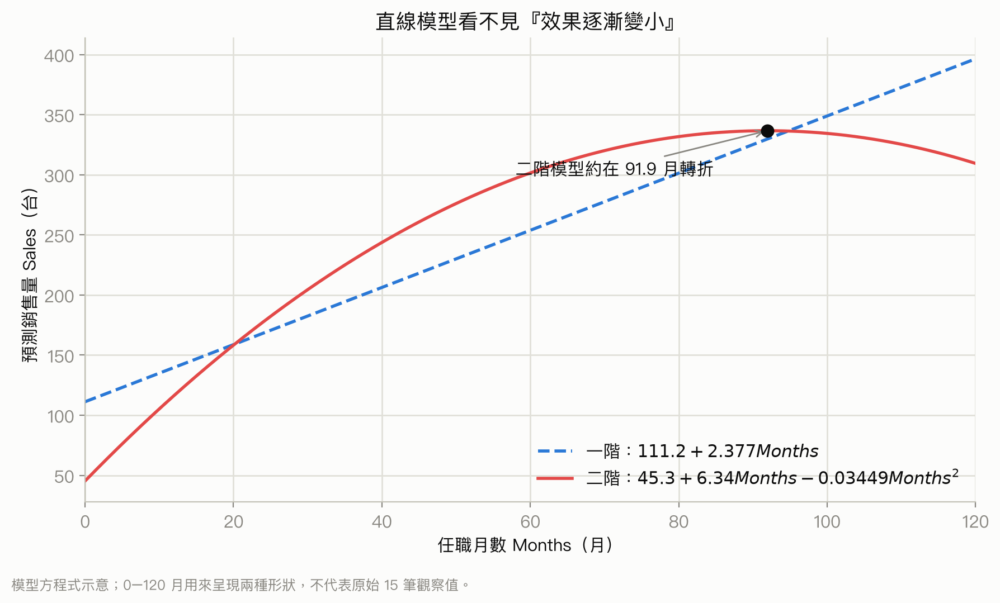

你該注意什麼：二次項不是把參數變成非線性，而是讓 Months 的邊際效果不再固定；超出 15 筆資料的任職月數範圍仍不能放心外推。

### 3. 交互作用：一個變數的效果取決於另一個變數

#### 3.1 為什麼要加入交互作用

<!-- exam-question-links:start -->
> **對應考古題：** Ch16 選擇題 [7](#exam-ch16-mc-7)、[10](#exam-ch16-mc-10)
<!-- exam-question-links:end -->

交互作用(interaction)的直覺是：同一個促銷方案，在低價時很有效，在高價時可能效果變小；因此廣告增加一單位的效果不是固定數字，而會依價格而變。

先把資料結構想成「每一列是一個市場」：同一列都有 Price、Advertising 和 Sales。我們在該列另外算出 `PriceAdvert = Price × Advertising`，再把這個乘積當成新的解釋變數。需要它，是因為只有 Price 和 Advertising 兩個主效果時，模型會強迫廣告斜率在所有價格下都一樣。常見混淆是把交互作用理解成「兩個自變數彼此相關」；其實交互作用問的是一個變數對 $y$ 的效果是否隨另一個變數改變。course1 沒有完整教交互作用，最接近的起點是 [簡單迴歸斜率與殘差](../course_1/chapters/06-regression.md)，列印版 [p.103–115](../output/pdf/statistics-handout-expanded.pdf#page=103)。

若有兩個原始自變數 $x_1$ 和 $x_2$，一般二階模型可以包含兩個一次項、兩個平方項和一個乘積項。令 $z_1=x_1$、$z_2=x_2$、$z_3=x_1^2$、$z_4=x_2^2$、$z_5=x_1x_2$：

<a id="formula-second-order-interaction"></a>

**含曲率和交互作用的二階模型與用途** ：當兩個自變數可能各自彎曲，且彼此效果可能互相改變時使用。

$$
y=\beta_0+\beta_1x_1+\beta_2x_2+\beta_3x_1^2+\beta_4x_2^2+\beta_5x_1x_2+\epsilon
$$

若相信 $y$ 和兩個自變數各自大致線性，只需要交互作用的簡化模型：

<a id="formula-interaction-regression"></a>

**含交互作用的複迴歸模型與用途** ：表示 $x_1$ 的斜率會隨 $x_2$ 改變，或 $x_2$ 的效果會隨 $x_1$ 改變。

$$
y=\beta_0+\beta_1x_1+\beta_2x_2+\beta_3x_1x_2+\epsilon
$$

| 符號 | 意義 |
|---|---|
| $\beta_0$ | $x_1=x_2=0$ 時的平均 $y$ |
| $\beta_1$ | 在 $x_2=0$ 時，$x_1$ 每增加一單位的效果 |
| $\beta_2$ | 在 $x_1=0$ 時，$x_2$ 每增加一單位的效果 |
| $\beta_3$ | 交互作用係數，描述一個變數的斜率如何隨另一變數變化 |
| $x_1x_2$ | 每筆資料把兩個自變數相乘後得到的乘積變數 |
| $\epsilon$ | 未解釋的誤差 |

固定 $x_2$ 後，$x_1$ 的邊際效果為 $\beta_1+\beta_3x_2$；所以不能在存在顯著交互作用時，直接把 $\beta_1$ 解釋成所有情況下的 $x_1$ 效果。若沒有理論理由、散佈圖或分組趨勢支持，不要為了增加 $R^2$ 就隨意加入很多交互作用，因為模型會變得難以解讀，也可能需要更多資料。

**定性意義：** 交互作用把「平均而言有效嗎」改成「在什麼條件下有效」。$\beta_3$ 的正負表示隨 $x_2$ 增加，$x_1$ 的斜率往上或往下調整；若條件效果在不同區域反號，整體平均斜率可能接近 0，卻不代表任何地方都沒效果。它衡量效果的可搬用性，不是兩個自變數彼此相關的程度，也不是兩個主效果數字的乘法。

建立交互作用模型時，通常遵守**模型階層原則(hierarchy principle)** ：放入 $x_1x_2$ 時，也保留較低階的 $x_1$ 與 $x_2$ 主效果。原因不是主效果一定顯著，而是交互作用已使 $\beta_1$ 變成「$x_2=0$ 時的 $x_1$ 效果」、$\beta_2$ 變成「$x_1=0$ 時的 $x_2$ 效果」；任意刪掉它們會額外強迫這些條件效果恰好為 0，並改變模型含義。除非研究設計或明確理論要求這種限制，不要只因某個主效果 p 值較大就把它刪掉。

#### 3.2 Tyler Personal Care 洗髮精例題

投影片第 12 頁的 Tyler Personal Care 研究新洗髮精的銷售量。兩個因素是單位售價 Price 和廣告支出 Advertising Expenditure。研究在 24 個測試市場中配對使用價格 \$2.00、\$2.50、\$3.00，以及廣告支出 \$50,000、\$100,000。

| 廣告支出 | Price \$2.00 | Price \$2.50 | Price \$3.00 |
|---|---:|---:|---:|
| \$50,000 | 461 | 364 | 332 |
| \$100,000 | 808 | 646 | 375 |

廣告從 \$50,000 增加到 \$100,000 時，在價格 \$2.00 的效果是 $347$，在 \$2.50 的效果是 $282$，在 \$3.00 的效果只剩 $43$。價格越高，額外廣告的平均增益越小，這就是交互作用的直覺。

投影片第 13 頁把每筆資料的 PriceAdvert 等於 Price 乘以 Advertising 放進模型：

$$
\widehat{Sales}=-276+175Price+19.68Advert-6.08PriceAdvert
$$

Sales 的單位是千單位，Price 的單位是美元，Advert 的單位是千美元，PriceAdvert 則是 Price 和 Advert 的乘積。整體 $F$ 檢定、各係數的 $t$ 檢定，以及 PriceAdvert 的 $t$ 檢定都顯著；模型解釋銷售變異的 $97.81\%$。負的交互作用係數 $-6.08$ 與價格越高、廣告增益越小的方向一致。使用交互作用模型時要寫清楚廣告的單位，否則係數很容易被誤讀。

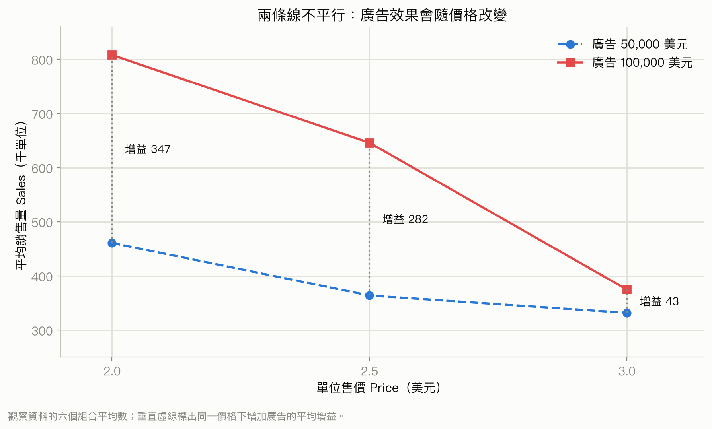

你該注意什麼：若沒有交互作用，兩條線應大致平行；這裡價格越高，增加廣告支出的平均增益越小，所以不能用一個固定的「廣告效果」概括所有價格。

### 4. 應變數轉換：先修正尺度，再談顯著性

#### 4.1 什麼時候轉換 $y$

迴歸顯著性檢定通常依賴誤差獨立、平均數結構正確和變異大致固定等假設。如果標準化殘差圖呈現漏斗或楔形，表示非固定變異(nonconstant variance)可能存在。此時，即使軟體給出很小的 p 值，也不應直接把它當作可靠結論。

轉換(transformation)不是刪資料，也不是偷偷把不顯著變顯著。資料仍是一列一個觀察單位，只是把每列的原始 $y_i$ 改寫成 $\ln(y_i)$、$\log_{10}(y_i)$ 或 $1/y_i$，讓模型在另一個尺度上工作。我們需要它，是因為原尺度的彎曲或漏斗形殘差有時會在新尺度變得較規則。最常見的混淆是轉換後仍用原尺度解讀斜率，或直接比較兩種不同 $y$ 尺度的 $R^2$。若這段直覺不熟，回看 [course1 第 6 章的殘差診斷與轉換](../course_1/chapters/06-regression.md#6-殘差圖模型留下了什麼)，列印版 [p.114–116](../output/pdf/statistics-handout-expanded.pdf#page=114)。

可以考慮把應變數 $y$ 換到另一個尺度：

- 對數轉換：使用常用對數 $\log_{10}(y)$，或自然對數 $\ln(y)$，其中 $e=2.71828\ldots$。
- 倒數轉換：把 $1/y$ 當成新的應變數。

轉換的目標是讓平均關係更接近適當形式，並讓殘差變異較穩定。轉換後的係數不再直接是原單位 $y$ 的變化量，所以比較模型時，要把預測值轉回原單位；不能直接比較原始 $y$ 模型和對數 $y$ 模型的 $R^2$ 或 RMSE。

**定性意義：** 原尺度的漏斗常表示 $y$ 的水準越高，絕對波動也跟著放大，也就是誤差更像「固定百分比」而非「固定單位」。取對數會把倍數差改寫成加法差，把相同的相對變化壓成較接近的距離，因此不同水準的殘差寬度可能變得一致。轉換是在選擇更符合資料生成方式的比較尺度，不是在抹掉真實變異；回到原尺度時，解讀通常也要改用比例、成長率或乘法效果。

#### 4.2 MPG 例題：汽車重量和每加侖里程

投影片第 15 頁使用 12 輛汽車的 miles-per-gallon, MPG, 作為應變數 $y$，車重 Weight, 單位為磅, 作為自變數 $x$。散佈圖顯示負向線性關係，因此先使用一階模型。

投影片第 16 頁的原始尺度模型為：

$$
\widehat{MPG}=56.1-0.011644Weight
$$

輸出顯示 Multiple $R=96.72\%$、$R^2=93.54\%$、調整後 $R^2=92.89\%$、標準誤 $1.6705$、觀察數 12。

| 來源 | df | SS | MS | $F$ | p 值 |
|---|---:|---:|---:|---:|---:|
| Regression | 1 | 403.98 | 403.98 | 144.76 | 0.000 |
| Residual | 10 | 27.91 | 2.79 |  |  |
| Total | 11 | 431.88 |  |  |  |

截距為 $56.096$，標準誤 $2.582$，$t=21.725$，p 值 $0.000$；Weight 係數為 $-0.011644$，標準誤 $0.000968$，$t=-12.032$，p 值 $0.000$。雖然整體關係顯著且 $R^2$ 很高，標準化殘差圖仍有楔形，且第 3 筆被標記為有大標準化殘差的異常觀察值；這不等於已證明它是影響點，影響力還要另看槓桿值或 Cook's distance。高 $R^2$ 不能代替殘差診斷。

#### 4.3 對 MPG 做自然對數轉換

投影片第 17 頁改用 $LnMPG=\ln(MPG)$，得到：

$$
\widehat{\ln(MPG)}=4.5242-0.000501Weight
$$

輸出為 Multiple $R=97.35\%$、$R^2=94.77\%$、調整後 $R^2=94.25\%$、標準誤 $0.0643$、觀察數 12。

| 來源 | df | SS | MS | $F$ | p 值 |
|---|---:|---:|---:|---:|---:|
| Regression | 1 | 0.7482 | 0.7482 | 181.22 | 0.000 |
| Residual | 10 | 0.0413 | 0.0041 |  |  |
| Total | 11 | 0.7895 |  |  |  |

截距為 $4.5242$，標準誤 $0.0993$，$t=45.5527$，p 值 $0.000$；Weight 係數為 $-0.000501$，標準誤 $0.000037$，$t=-13.462$，p 值 $0.000$。轉換後的楔形和大標準化殘差都消失；調整後 $R^2$ 的數值也上升，但因應變數已換尺度，不能把這個升幅當成兩模型優劣的直接比較。

#### 4.4 把對數模型轉回 MPG 單位

對數模型的預測先在 $\ln(MPG)$ 尺度上。若要比較原始 MPG 預測誤差，必須取自然指數：

<a id="formula-log-response-backtransform"></a>

**對數應變數的反轉換與用途** ：把對數模型的預測還原為原始應變數單位。

$$
\widehat{\ln(MPG)}=4.5242-0.000501Weight
$$

$$
\widehat{MPG}=e^{4.5242-0.000501Weight}=92.2e^{-0.000501Weight}
$$

$e$ 是自然對數的底，Weight 仍以磅計，$MPG$ 回到每加侖里程單位。對同一輛車，把這個回轉後的預測和原始模型 $56.1-0.011644Weight$ 比較，才可以在相同 MPG 單位下比較預測誤差；投影片第 18 頁以散佈圖和兩條配適曲線表達這件事。投影片第 18 頁的文字公式誤植成原始尺度模型的係數；這裡採同一份投影片第 17 頁及 11e 印刷頁 723–724 都一致的對數模型係數。

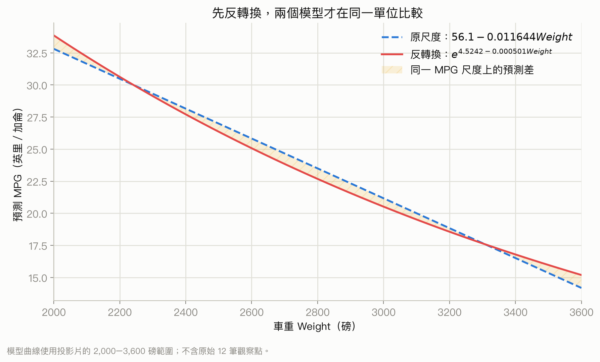

你該注意什麼：不能拿 $\ln(MPG)$ 的預測直接和 MPG 比；先用自然指數反轉換，兩條線才具有同一個縱軸單位。

#### 4.5 本質上非線性但可線性化的模型

<!-- exam-question-links:start -->
> **對應考古題：** Ch16 選擇題 [12](#exam-ch16-mc-12)
<!-- exam-question-links:end -->

有些模型的參數本身出現非一次方，例如參數相乘或出現在指數上，稱為非線性模型(nonlinear model)。若對變數做適當轉換，有些模型可以改寫為一般線性模型。

投影片第 19 頁的指數模型為：

<a id="formula-exponential-linearization"></a>

**指數模型線性化與用途** ：當平均反應隨 $x$ 以倍數或成長率改變時，取自然對數可以用線性迴歸估計。

$$
E(y)=\beta_0\beta_1^x
$$

取兩邊自然對數：

$$
\ln E(y)=\ln\beta_0+x\ln\beta_1
$$

令 $y'=\ln E(y)$、$\beta_0'=\ln\beta_0$、$\beta_1'=\ln\beta_1$，就得到：

$$
y'=\beta_0'+\beta_1'x
$$

$\beta_0$ 是原始尺度的基準水準，$\beta_1$ 是每增加一單位 $x$ 的乘法因子；轉換後 $\beta_1'$ 是對數尺度斜率。這個線性化要求 $\beta_0>0$、$\beta_1>0$，實際以 $\ln(y)$ 配適時也要求觀察值 $y>0$；解讀時要轉回原始尺度。若沒有可用轉換，就不能假裝任意非線性模型是一般線性模型。

### 5. 何時新增或刪除變數：巢套模型的 $F$ 檢定

#### 5.1 比較小模型和完整模型

<!-- exam-question-links:start -->
> **對應考古題：** Ch16 選擇題 [9](#exam-ch16-mc-9)；Ch16 計算題 [5](#exam-ch16-problem-5)、[10](#exam-ch16-problem-10)、[11](#exam-ch16-problem-11)、[14](#exam-ch16-problem-14)、[15](#exam-ch16-problem-15)、[16](#exam-ch16-problem-16)、[23](#exam-ch16-problem-23)、[25](#exam-ch16-problem-25)、[26](#exam-ch16-problem-26)
<!-- exam-question-links:end -->

投影片第 20 頁比較兩個巢套模型(nested models)。小模型有 $q$ 個自變數，完整模型加入 $x_{q+1},\ldots,x_p$，共 $p$ 個自變數：

$$
y=\beta_0+\beta_1x_1+\cdots+\beta_qx_q+\epsilon
$$

$$
y=\beta_0+\beta_1x_1+\cdots+\beta_qx_q+\beta_{q+1}x_{q+1}+\cdots+\beta_px_p+\epsilon
$$

問題是新增的整組變數是否帶來超過隨機誤差的改善。假設為：

$$
H_0:\beta_{q+1}=\beta_{q+2}=\cdots=\beta_p=0
$$

$$
H_a:\text{至少一個新增參數不等於 0}
$$

<a id="formula-nested-model-f"></a>

**巢套模型新增變數的 $F$ 統計量與用途** ：比較只有 $q$ 個變數的小模型和 $p$ 個變數的完整模型。

$$
F=\frac{\{SSE_q-SSE_p\}/(p-q)}{SSE_p/(n-p-1)}
$$

| 符號 | 意義 |
|---|---|
| $SSE_q$ | 小模型的殘差平方和 |
| $SSE_p$ | 完整模型的殘差平方和 |
| $p-q$ | 新增變數個數，也是分子自由度 |
| $n-p-1$ | 完整模型的殘差自由度 |
| $n$ | 樣本數 |
| $F$ | 新增變數所減少的誤差，相對於完整模型剩餘誤差的比率 |

在虛無假設下，$F$ 服從分子自由度 $p-q$、分母自由度 $n-p-1$ 的 $F$ 分配。投影片第 20 頁的敘述文字把分母自由度寫成 $p$，但同頁公式、Butler 例題和 11e 印刷頁 731 都使用正確的 $n-p-1$。當 $F$ 大到超過臨界值，或 p 值小於顯著水準 $\alpha$，拒絕 $H_0$，表示至少一個新增變數有額外解釋力。若不拒絕，不是證明所有新增變數都沒用，而是沒有足夠證據顯示整組帶來顯著改善。

此檢定適合兩模型一個包含另一個的情況；若兩模型使用不同資料、不同應變數或沒有巢套關係，不能直接套用。正式推論也沿用迴歸誤差獨立、常態且變異固定等假設。新增變數一定會讓 SSE 不增加，但減少的 SSE 仍可能小到使 $F$ 不大。

**定性意義：** 分子衡量每個新增參數平均替模型消除了多少殘差，分母衡量完整模型仍留下多少典型雜訊。$F$ 大表示新增變數帶來的誤差下降，相對剩餘噪音夠明顯；$F$ 小表示新方向雖可讓樣本內直線更貼資料，但改善幅度可能只是模型多了調整自由。顯著表示整組新增資訊中至少有可辨認的增量，不表示每個新增變數都必要，也不表示改善足以抵銷蒐集成本或過度配適風險。

#### 5.2 Butler Trucking 例題

投影片第 21 頁的 Butler Trucking 想改善配送排程。現有模型用里程 $x_1$ 預測總配送時間 $y$，隨機樣本有 $n=10$ 筆：

$$
\widehat y=1.27+0.0678x_1,\qquad q=1,\qquad SSE_q=8.029
$$

加入配送件數 $x_2$ 後：

$$
\widehat y=-0.869+0.06113x_1+0.923x_2,\qquad p=2,\qquad SSE_p=2.2994
$$

分子自由度為 $p-q=1$，分母自由度為 $n-p-1=7$：

$$
F=\frac{(8.029-2.2994)/(2-1)}{2.2994/(10-2-1)}
=\frac{5.7296}{0.3285}=17.44
$$

投影片第 22 頁在 $\alpha=0.05$、分子 1 自由度、分母 7 自由度下給出臨界值 $F_{0.05}=5.59$。因為 $17.44>5.59$，拒絕「新增 $x_2$ 沒有用」的虛無假設，結論是加入配送件數能顯著減少樣本內的殘差平方和；這項檢定本身不保證樣本外預測一定更準。

當只新增一個參數時，這個 $F$ 統計量等於該參數 $t$ 統計量的平方。因此實務線索是：個別 $t$ 檢定顯著時可考慮加入該變數，不顯著時可考慮刪除該變數。但若有兩個或以上個別 $t$ 檢定不顯著，不要一次刪掉多個變數；應重新估計模型，因為刪掉一個變數後其他變數的標準誤、$t$ 值和共線性可能改變。

### 6. 變數選取程序

#### 先補一座橋：選模是在候選模型間取捨

假設每列是一個銷售區域，欄位有 Sales 和 8 個候選自變數。**變數選取(variable selection)** 就是從這 8 欄中挑出要放進模型的子集。需要選模，是因為全部放入雖會讓樣本內 $R^2$ 不下降，卻可能增加估計不穩定、資料蒐集成本與過度配適(overfitting)風險。

不同準則在獎勵不同事情，不能混成同一個分數：

| 準則 | 偏好什麼 | 常見混淆 |
|---|---|---|
| $R^2$ | 樣本內解釋變異較多 | 加變數幾乎不會下降，不能單獨用來選模型 |
| 調整後 $R^2$ | 解釋力高，同時對多放變數付出懲罰 | 數值較高仍不保證樣本外預測最佳 |
| RMSE | 樣本內典型預測誤差較小，單位與 $y$ 相同 | 不同資料或不同 $y$ 尺度不能直接比 |
| 共線性、測量成本與可解釋性 | 係數較穩、未來資料拿得到、模型能回答問題 | 這些不是軟體 p 值可以代替的商業判斷 |

逐步、向前、向後和最佳子集都會反覆看同一批資料，因此最後留下的 p 值不能當成完全沒有經過搜尋的普通檢定來解讀；小樣本下，換一批資料也可能選出不同變數。若目標是預測，最好另外用未參與選模的驗證資料檢查樣本外表現。更重要的是，**逐步迴歸不是因果發現工具** ：變數進入模型不代表它造成結果，沒有進入也不代表它沒有因果作用。因果仍要靠研究設計、時間順序與混雜控制判斷。這部分 course1 沒有完整教；可先用 [course1 第 6 章的 $R^2$ 與因果界線](../course_1/chapters/06-regression.md#9-解釋度與模型的邊界)，列印版 [p.118–119](../output/pdf/statistics-handout-expanded.pdf#page=118)，作為判讀底線。

**定性意義：** 選模準則是在「貼近目前資料」與「不要把偶然波動也當規律」之間取捨。模型越複雜，越能沿著樣本的細節彎曲，但係數可能更依賴這一批資料；較簡潔的模型若保留主要訊號，通常更容易解讀、蒐集與搬到新資料。被選入表示它在這次候選集合與搜尋路徑中有相對貢獻，不代表它是真實世界唯一重要的變數；選模穩定性必須靠驗證資料或重抽樣檢查。

#### 6.1 Cravens 資料與先看共線性

投影片第 23 頁以 Cravens 資料示範：一家公司在 25 個銷售區域各有一名業務代表，想用 8 個自變數預測 Sales。

| 名稱 | 意義 |
|---|---|
| Sales | 業務代表負責的總銷售額 |
| Time | 任職月數 |
| Poten | 區域市場潛力，該區域產業總銷量 |
| AdvExp | 區域廣告支出 |
| Share | 過去四年的加權平均市場占有率 |
| Change | 過去四年市場占有率的變化 |
| Accounts | 業務代表負責的客戶數 |
| Work | 依年度購買量和客戶集中度計算的加權指數 |
| Rating | 業務代表的整體評分，1 到 7 分 |

投影片第 24 頁的相關矩陣提醒多重共線性(multicollinearity)：若兩個自變數的樣本相關係數絕對值超過約 $0.7$，同時放入模型可能讓係數難以解讀。Accounts 和 Time 的相關係數是 $r=0.758$，應避免在同一模型中同時使用；Rating 和 Change 的相關係數為 $r=0.549$，雖未超過 $0.7$，仍值得留意。

和應變數 Sales 的相關係數中，Accounts 最高為 $0.754$；接著是 Time、Poten、AdvExp，皆約 $0.6$。完整矩陣如下：

| 變數 | Sales | Time | Poten | AdvExp | Share | Change | Accounts | Work |
|---|---:|---:|---:|---:|---:|---:|---:|---:|
| Time | 0.623 |  |  |  |  |  |  |  |
| Poten | 0.598 | 0.454 |  |  |  |  |  |  |
| AdvExp | 0.596 | 0.249 | 0.174 |  |  |  |  |  |
| Share | 0.484 | 0.106 | -0.210 | 0.264 |  |  |  |  |
| Change | 0.489 | 0.251 | 0.268 | 0.377 | 0.085 |  |  |  |
| Accounts | 0.754 | 0.758 | 0.479 | 0.200 | 0.403 | 0.327 |  |  |
| Work | -0.117 | -0.179 | -0.259 | -0.272 | 0.349 | -0.288 | -0.199 |  |
| Rating | 0.402 | 0.101 | 0.359 | 0.411 | -0.024 | 0.549 | 0.229 | -0.277 |

高相關不代表其中一個一定沒有預測力；它表示控制另一個後，個別係數可能不穩定、標準誤變大，且「其他變數固定」的解讀可能不自然。相關矩陣是初步警報，不是完整的共線性診斷。

#### 6.2 完整模型和三變數模型

投影片第 25 頁先把 8 個變數全部放入模型。完整模型的 Multiple $R=96.02\%$、$R^2=92.20\%$、調整後 $R^2=88.31\%$、標準誤 $449.01$、樣本數 25。整體 ANOVA 為 Regression df 8、SS 38,153,712、MS 4,769,214、$F=23.66$、p 值 $0.000$；Residual df 16、SS 3,225,837、MS 201,615；Total df 24、SS 41,379,549。

個別係數輸出為：Intercept $-1507.84$、標準誤 $778.61$、$t=-1.937$、p 值 $0.071$；Time $2.01$、$1.93$、$1.041$、$0.313$；Poten $0.04$、$0.01$、$4.536$、$0.000$；AdvExp $0.15$、$0.05$、$3.205$、$0.006$；Share $199.04$、$67.03$、$2.969$、$0.009$；Change $290.87$、$186.78$、$1.557$、$0.139$；Accounts $5.55$、$4.78$、$1.162$、$0.262$；Work $19.79$、$33.68$、$0.588$、$0.565$；Rating $8.19$、$128.50$、$0.064$、$0.950$。在 $\alpha=0.05$ 下，Poten、AdvExp、Share 的個別檢定顯著。

只保留這三個變數後，Multiple $R=92.14\%$、$R^2=84.90\%$、調整後 $R^2=82.74\%$，整體 $F=39.35$、p 值 $0.000$。普通 $R^2$ 從 $92.20\%$ 降為 $84.90\%$，但模型變得精簡，調整後 $R^2$ 仍達 $82.74\%$，這正是變數選取有用的地方。

#### 6.3 四種主要程序

投影片第 26 頁列出四種方法：

1. **逐步迴歸(stepwise regression)** ：一個變數一個變數加入或刪除。
2. **向前選取(forward selection)** ：從沒有變數開始，一次加入一個，不允許已加入的變數被刪除。
3. **向後刪除(backward elimination)** ：從全部變數開始，一次刪除一個。
4. **最佳子集迴歸(best-subsets regression)** ：評估所有可能子集。

前三者是逐步的啟發式程序，依 $F$ 統計量在每一步做決定，但不保證找到真正最佳模型。最佳子集理論上會找出指定變數數目的最佳模型，代價是要估計和檢查很多模型；8 個變數的所有非空子集共有 $2^8-1=255$ 個。

#### 6.4 逐步迴歸

投影片第 27 頁的逐步迴歸設定兩個門檻：$\alpha$-to-leave 決定模型中的變數何時刪除，$\alpha$-to-enter 決定模型外的變數何時加入。程序先從最顯著的一個變數開始。

每一輪先檢查目前模型中最不顯著的變數：若其 $F$ 檢定 p 值大於 $\alpha$-to-leave，就刪除它；若沒有變數可刪，才檢查模型外最顯著的變數，若其 p 值小於或等於 $\alpha$-to-enter，就加入它。沒有變數能刪、也沒有變數能加時停止。一個變數可以先進入、之後被移除、再於更後面重新進入。

Cravens 例題在投影片第 28 頁使用兩個門檻都為 $0.05$。程序從 Accounts 開始，四步後保留 Poten、AdvExp、Share、Accounts：

$$
\widehat{Sales}=-1442+0.03822Poten+0.1750AdvExp+190.1Share+9.21Accounts
$$

輸出為 Multiple $R=94.89\%$、$R^2=90.04\%$、調整後 $R^2=88.05\%$、$s=453.836$、樣本數 25；整體 Regression df 4、SS 37,260,200、MS 9,315,050、$F=45.23$、p 值 $0.000$，Residual df 20、SS 4,119,349、MS 205,967。係數的 p 值依序為 Intercept $0.003$、Poten $0.000$、AdvExp $0.000$、Share $0.000$、Accounts $0.004$。

#### 6.5 向前選取

投影片第 29 頁的向前選取只設定 $\alpha$-to-enter，從沒有變數的模型開始，每一輪把模型外最顯著且 $F$ 檢定 p 值不超過門檻的變數加入；加入後永遠不移除。當沒有變數能加入便停止。

Cravens 例題的 $\alpha$-to-enter 為 $0.05$，最後得到和逐步迴歸相同的四變數模型：

$$
\widehat{Sales}=-1442+0.03822Poten+0.1750AdvExp+190.1Share+9.21Accounts
$$

相同結果不是保證，而是這組資料在這個門檻下的結果。

#### 6.6 向後刪除

投影片第 30 頁的向後刪除從全部 8 個變數開始，設定 $\alpha$-to-leave=0.05，每輪刪除目前最不顯著且 p 值大於門檻的變數，直到沒有其他變數能刪。

Cravens 例題最後保留 Time、Poten、AdvExp、Share，沒有保留 Accounts：

$$
\widehat{Sales}=-1312+3.82Time+0.03822Poten+0.1750AdvExp+190.1Share
$$

版本差異：11e 印刷頁 741 對同一個向後刪除模型列為 $\widehat{Sales}=-1312+3.8Time+0.0444Poten+0.152AdvExp+259Share$；老師投影片除 Time 外沿用了逐步與向前模型的係數，考試時仍以題目或老師指定的輸出為準。

四步後 $s=463.93$、$R^2=89.60\%$。它和前兩個程序不同，說明選取結果可能依程序和進入順序而變化；不能因為某個演算法選了變數，就宣稱那是唯一正確答案。

#### 6.7 最佳子集迴歸

投影片第 31 頁說明，最佳子集會在指定變數個數下找出最佳模型，但所有子集都要估計，計算量和輸出量會快速增加。第 32 頁的 Cravens 輸出列出每個變數數目中最好的兩個模型，及 8 變數完整模型。相同變數個數時，用 $R^2$ 比較；整體選擇還要看 RMSE、調整後 $R^2$、共線性和測量成本。

| 標記 | 模型 | 變數數 | $R^2$ | RMSE |
|---|---|---:|---:|---:|
| A | Accounts | 1 | 0.5685 | 881.09 |
|  | Time | 1 | 0.3880 | 1049.33 |
| B | AdvExp, Accounts | 2 | 0.7751 | 650.39 |
|  | Poten, Share | 2 | 0.7461 | 691.11 |
| C | Poten, AdvExp, Share | 3 | 0.8490 | 545.52 |
|  | Poten, AdvExp, Accounts | 3 | 0.8277 | 582.64 |
|  | Poten, AdvExp, Share, Accounts | 4 | 0.9004 | 453.84 |
| E | Time, Poten, AdvExp, Share | 4 | 0.8960 | 463.93 |
|  | Time, Poten, AdvExp, Share, Change | 5 | 0.9150 | 430.22 |
|  | Poten, AdvExp, Share, Change, Accounts | 5 | 0.9124 | 436.75 |
| D | Time, Poten, AdvExp, Share, Change, Accounts | 6 | 0.9203 | 427.99 |
|  | Poten, AdvExp, Share, Change, Accounts, Work | 6 | 0.9165 | 438.20 |
|  | Time, Poten, AdvExp, Share, Change, Accounts, Work | 7 | 0.9220 | 435.66 |
|  | Time, Poten, AdvExp, Share, Change, Accounts, Rating | 7 | 0.9204 | 440.29 |
|  | Time, Poten, AdvExp, Share, Change, Accounts, Work, Rating | 8 | 0.9220 | 449.02 |

五個判斷是：

- A：Accounts 是最佳一變數模型，$R^2=56.85\%$。
- B：AdvExp 和 Accounts 是最佳二變數模型，$R^2=77.51\%$。
- C：Poten、AdvExp、Share 是最佳三變數模型，$R^2=84.90\%$。
- D：六變數模型的 RMSE 最小，為 $427.99$，但同時包含高度相關的 Time 和 Accounts，存在共線性疑慮。
- E：五變數模型較簡單，和六變數模型的 $R^2$、RMSE 很接近，又避開共線性，因此可能更實用。

最佳子集不是 RMSE 最小就一定選。RMSE 較小表示樣本內預測誤差尺度較小，但共線性可能讓係數不穩定，更多變數也可能增加測量成本和未來預測困難。

#### 6.8 最終選模

投影片第 33 頁提醒，在挑定最終模型前要仔細檢查殘差；若殘差沒有問題，才用最佳子集結果輔助決定。對 Cravens 資料：

- 只有 AdvExp 和 Accounts 的模型不錯，$R^2=77.51\%$；若 Poten 很難測量，它可能是偏好的選擇。
- 四變數 Poten、AdvExp、Share、Accounts 同時是最佳四變數模型，也被逐步和向前程序選出；若測量沒有問題，可能是最實用的模型。
- 超過四個變數後，$R^2$ 只有邊際增加。

最後選模要把統計證據和商業可行性放在一起，而不是把某個演算法輸出直接當成答案。

### 7. 用虛擬變數把實驗設計寫成複迴歸

這一節第一次把類別欄位放入迴歸。每一列仍代表一位工人，但「方法 A、B 或 C」不是有大小順序的數字，所以不能直接編成 1、2、3 後當作一般定量變數。做法是建立只取 0 或 1 的**虛擬變數(dummy variable)** ：1 表示該列屬於某組，0 表示不屬於。保留截距時，$k$ 組只放 $k-1$ 個虛擬變數；沒有專屬虛擬欄的那一組稱為**參考組(reference group)** ，其他係數都表示「相對參考組差多少」。參考組不是比較差或比較不重要，只是解讀係數的基準。course1 沒有完整教這種編碼；需要的迴歸底層可回看 [course1 第 6 章](../course_1/chapters/06-regression.md)，列印版 [p.103–121](../output/pdf/statistics-handout-expanded.pdf#page=103)。

#### 7.1 三種方法如何編碼

投影片第 34 頁回到 Chemitech, Inc. 的完全隨機設計(completely randomized design)：15 位工人分別使用裝配方法 A、B、C，反應變數是每週組裝的過濾系統數量。資料和各組平均數為：

| 工人觀察 | 方法 A | 方法 B | 方法 C |
|---|---:|---:|---:|
| 1 | 58 | 58 | 48 |
| 2 | 64 | 69 | 57 |
| 3 | 55 | 71 | 59 |
| 4 | 66 | 64 | 47 |
| 5 | 67 | 68 | 49 |
| 平均數 | 62 | 66 | 52 |

有 $k=3$ 個處理組，只需要 $k-1=2$ 個虛擬變數，命名為 A 和 B；方法 C 是參考組：

| 實際方法 | 虛擬變數 A | 虛擬變數 B |
|---|---:|---:|
| 方法 A | 1 | 0 |
| 方法 B | 0 | 1 |
| 方法 C | 0 | 0 |

不能同時為三組各設一個虛擬變數並保留截距，否則三個虛擬變數會和截距完全依賴，造成完全共線性。使用 $k-1$ 個虛擬變數並留下參考組可避免這個問題。

#### 7.2 模型如何還原三組平均數

<!-- exam-question-links:start -->
> **對應考古題：** Ch16 選擇題 [13](#exam-ch16-mc-13)、[38](#exam-ch16-mc-38)、[41](#exam-ch16-mc-41)；Ch16 計算題 [24](#exam-ch16-problem-24)
<!-- exam-question-links:end -->

用 $y$ 表示每週組裝數量，模型是：

<a id="formula-dummy-variable-anova"></a>

**虛擬變數複迴歸模型與用途** ：把有 $k$ 組的類別處理因素表示成 $k-1$ 個 0-1 變數，並估計各組平均數。

$$
E(y)=\beta_0+\beta_1A+\beta_2B
$$

$E(y)$ 是給定方法後的平均每週產量；$A$、$B$ 是 0-1 虛擬變數；$\beta_0$ 是參考組 C 的平均數；$\beta_1$ 是方法 A 相對於 C 的平均差；$\beta_2$ 是方法 B 相對於 C 的平均差。

$$
\begin{aligned}
\text{方法 A: } E(y)&=\beta_0+\beta_1\\
\text{方法 B: } E(y)&=\beta_0+\beta_2\\
\text{方法 C: } E(y)&=\beta_0
\end{aligned}
$$

這個模型適合類別處理組的平均數比較；若處理有自然的數值間距，直接把 A、B、C 編成 1、2、3 會強迫組別效果呈直線，通常不恰當。改用迴歸寫法不會自動消除隨機分派或誤差假設問題。

#### 7.3 Chemitech 的迴歸輸出

投影片第 36 頁用 15 筆資料估計係數，得到 $b_0=52$、$b_1=10$、$b_2=14$：

| 方法 | 預測的 $E(y)$ | 數值 |
|---|---|---:|
| A | $b_0+b_1=52+10$ | 62 |
| B | $b_0+b_2=52+14$ | 66 |
| C | $b_0=52$ | 52 |

這些估計等於三組樣本平均數。迴歸輸出為 Multiple $R=77.76\%$、$R^2=60.47\%$、調整後 $R^2=53.88\%$、標準誤 $5.323$、樣本數 15。

| 來源 | df | SS | MS | $F$ | p 值 |
|---|---:|---:|---:|---:|---:|
| Regression | 2 | 520 | 260.00 | 9.176 | 0.004 |
| Residual | 12 | 340 | 28.33 |  |  |
| Total | 14 | 860 |  |  |  |

係數表為 Intercept $52$、標準誤 $2.38$、$t=21.84$、p 值 $0.000$；A $10$、標準誤 $3.37$、$t=2.97$、p 值 $0.012$；B $14$、標準誤 $3.37$、$t=4.16$、p 值 $0.001$。

#### 7.4 用 $F$ 檢定比較三組平均數

如果 A、B、C 三組平均數都相同，則 A 和 C 的平均差為 0，B 和 C 的平均差也為 0。由模型：

$$
E(y|A)-E(y|C)=\beta_1=0
$$

$$
E(y|B)-E(y|C)=\beta_2=0
$$

整體假設為：

$$
H_0:\beta_1=\beta_2=0
$$

$$
H_a:\text{至少一組平均數不同}
$$

在 $\alpha=0.05$ 下，輸出給 $F=9.18$、p 值 $0.004$，因此拒絕 $H_0$，結論是三種裝配方法的平均產量不全相同。個別 $t$ 檢定也顯示 A 和 C 的差異，以及 B 和 C 的差異顯著。整體 $F$ 檢定只告訴我們至少有差異，不會單獨告訴所有兩兩比較都顯著。

### 8. 自相關與 Durbin-Watson 檢定

這裡的資料結構和一般橫斷面資料不同：每一列是一個時間點，而且列的先後順序不能交換。先依時間配適模型，再把殘差排成 $e_1,e_2,\ldots,e_n$。如果連續幾期都高估或都低估，前一期殘差就能幫忙猜下一期殘差，表示「誤差彼此獨立」的假設可能失效。Durbin-Watson(DW)檢定就是把相鄰殘差的差拿來量化這種一階關係。

常見混淆有兩個：第一，$y$ 隨時間上升不等於殘差必有自相關，因為趨勢若已被模型正確解釋，殘差仍可能獨立；第二，DW 接近 2 只是沒有明顯一階自相關的線索，不代表線性、等變異或常態等其他條件全部成立。course1 沒有教 DW 公式，但 [第 6 章的迴歸條件與殘差圖](../course_1/chapters/06-regression.md#5-條件常態近似與預測的不確定性)已說明時間資料可能違反獨立性，列印版 [p.112–115](../output/pdf/statistics-handout-expanded.pdf#page=112)；本節會從這個直覺接著完整建立 DW。

#### 8.1 為什麼時間資料特別危險

投影片第 38 頁指出，商業和經濟資料常按月份、季度或年份收集。同一時間的 $y$ 可能和前幾期的 $y$ 有關，這叫自相關(autocorrelation)或序列相關(serial correlation)。一階自相關表示第 $t$ 期和第 $t-1$ 期有關；二階自相關表示第 $t$ 期和第 $t-2$ 期有關，依此類推。

迴歸模型通常假設誤差項彼此獨立。若殘差有自相關，這個假設被破壞，標準誤、$t$ 檢定、$F$ 檢定和 p 值可能不再可靠。高 $R^2$ 也不能排除時間趨勢造成的假象。

投影片第 39 頁以殘差序列說明：正自相關時，一期正殘差後面傾向接正殘差，一期負殘差後面傾向接負殘差，圖形常出現長串同號殘差；負自相關時，正負殘差傾向交替。Durbin-Watson 統計量主要用於偵測一階自相關。

#### 8.2 Durbin-Watson 統計量

<!-- exam-question-links:start -->
> **對應考古題：** Ch16 選擇題 [2](#exam-ch16-mc-2)、[8](#exam-ch16-mc-8)、[14](#exam-ch16-mc-14)、[16](#exam-ch16-mc-16)
<!-- exam-question-links:end -->

<a id="formula-durbin-watson"></a>

**Durbin-Watson 統計量與用途** ：利用相鄰期殘差的差異檢查一階自相關。

$$
d=\frac{\displaystyle\sum_{t=2}^{n}(e_t-e_{t-1})^2}{\displaystyle\sum_{t=1}^{n}e_t^2}
$$

| 符號 | 意義 |
|---|---|
| $d$ | Durbin-Watson 統計量，範圍約為 0 到 4 |
| $e_t$ | 第 $t$ 期殘差，$e_t=y_t-\widehat y_t$ |
| $e_{t-1}$ | 前一期殘差 |
| $n$ | 時間觀察數 |

相鄰殘差同號且大小相近時，$e_t-e_{t-1}$ 很小，$d$ 會接近 0，表示正自相關線索。殘差正負交替時，$d$ 會接近 4，表示負自相關線索。$d$ 接近 2 通常表示沒有明顯一階自相關。正式結論要比較 $d_L$ 和 $d_U$ 臨界值，不能只看到 $d=1.8$ 就宣布沒有問題。

**定性意義：** $d$ 接近 0 時，模型會連續幾期一起高估或一起低估，誤差具有「慣性」，前一期失準能預告下一期方向；這表示模型可能漏掉趨勢、季節、景氣循環或其他持續性因素。$d$ 接近 4 時，誤差像鐘擺般正負交替，可能反映過度修正或交替機制。$d$ 接近 2 只表示相鄰殘差沒有明顯的一階連續性，不表示更長期的相關、非線性或變異不固定都不存在。

#### 8.3 自相關的模型表示與假設

<!-- exam-question-links:start -->
> **對應考古題：** Ch16 選擇題 [6](#exam-ch16-mc-6)、[15](#exam-ch16-mc-15)
<!-- exam-question-links:end -->

投影片第 41 頁以一階誤差關係表示自相關：

<a id="formula-ar-error-process"></a>

**一階自相關誤差模型與用途** ：表示當期不可觀察的誤差項由前一期誤差項和新的隨機擾動共同形成。

$$
\epsilon_t=\rho\epsilon_{t-1}+z_t
$$

$\rho$ 是絕對值小於 1 的自相關參數；$z_t$ 是平均數 0、變異數 $\sigma^2$，且常態、獨立分布的新擾動。如果 $\rho=0$，前一期誤差不再影響本期，$\epsilon_t$ 就不具有這種一階相關結構。11e 印刷頁 750 用 $\epsilon_t$ 表示不可觀察的誤差項；投影片第 41 頁改寫成殘差 $e_t$，而實際計算 Durbin-Watson 統計量時確實使用可觀察的殘差 $e_t$ 估計這種關係。

| 檢定方向 | 虛無假設 | 對立假設 |
|---|---|---|
| 正自相關 | $H_0:\rho=0$ | $H_a:\rho>0$ |
| 負自相關 | $H_0:\rho=0$ | $H_a:\rho<0$ |
| 雙尾自相關 | $H_0:\rho=0$ | $H_a:\rho\ne0$ |

Durbin-Watson 檢定的重點是資料有明確時間順序，並且要檢查一階誤差相關。它不是所有殘差問題的統一檢定：非固定變異要看殘差對預測值圖，非線性要看殘差形狀，離群值要做影響診斷。

#### 8.4 用臨界值做三種判斷

投影片第 42 頁的判斷規則如下。$d_L$ 是下臨界值，$d_U$ 是上臨界值，中間區域是無法判定(inconclusive)，不是接受沒有自相關。

正自相關單尾檢定：

- 若 $d<d_L$，判定有正自相關證據。
- 若 $d_L\le d\le d_U$，結果無法判定。
- 若 $d>d_U$，沒有正自相關證據。

負自相關單尾檢定：

- 若 $d>4-d_L$，判定有負自相關證據。
- 若 $4-d_U\le d\le4-d_L$，結果無法判定。
- 若 $d<4-d_U$，沒有負自相關證據。

雙尾檢定：

- 若 $d<d_L$ 或 $d>4-d_L$，判定有自相關證據。
- 若 $d_L\le d\le d_U$ 或 $4-d_U\le d\le4-d_L$，結果無法判定。
- 若 $d_U<d<4-d_U$，沒有自相關證據。

投影片第 43 頁的臨界值表採單尾 $\alpha=0.05$，欄位依自變數個數由 1 到 5 組排列，每組有 $d_L,d_U$。若把這組單尾 $0.05$ 臨界值直接用於雙尾檢定，整體顯著水準會加倍為 $0.10$；若要做整體 $\alpha=0.05$ 的雙尾檢定，應改查單尾 $0.025$ 的臨界值。表中數值如下：

| $n$ | 1 變數 $d_L$ | 1 變數 $d_U$ | 2 變數 $d_L$ | 2 變數 $d_U$ | 3 變數 $d_L$ | 3 變數 $d_U$ | 4 變數 $d_L$ | 4 變數 $d_U$ | 5 變數 $d_L$ | 5 變數 $d_U$ |
|---:|---:|---:|---:|---:|---:|---:|---:|---:|---:|
| 15 | 1.08 | 1.36 | 0.95 | 1.54 | 0.82 | 1.75 | 0.69 | 1.97 | 0.56 | 2.21 |
| 20 | 1.20 | 1.41 | 1.10 | 1.54 | 1.00 | 1.68 | 0.90 | 1.83 | 0.79 | 1.99 |
| 25 | 1.29 | 1.45 | 1.21 | 1.55 | 1.12 | 1.66 | 1.04 | 1.77 | 0.95 | 1.89 |
| 30 | 1.35 | 1.49 | 1.28 | 1.57 | 1.21 | 1.65 | 1.14 | 1.74 | 1.07 | 1.83 |
| 40 | 1.44 | 1.54 | 1.39 | 1.60 | 1.34 | 1.66 | 1.29 | 1.72 | 1.23 | 1.79 |
| 50 | 1.50 | 1.59 | 1.46 | 1.63 | 1.42 | 1.67 | 1.38 | 1.72 | 1.34 | 1.77 |
| 70 | 1.58 | 1.64 | 1.55 | 1.67 | 1.52 | 1.70 | 1.49 | 1.74 | 1.46 | 1.77 |
| 100 | 1.65 | 1.69 | 1.63 | 1.72 | 1.61 | 1.74 | 1.59 | 1.76 | 1.57 | 1.78 |

#### 8.5 Jefe de Cocina 例題

投影片第 44 頁的 Jefe de Cocina 提供在地食材、零廢棄包裝餐點給區域家庭。分析師用公司 20 年的 Sales 和區域人口中位數收入 Income 資料建立模型，Sales 單位為百萬美元：

$$
\widehat{Sales}=-12.60671+0.00028Income,\qquad R^2=97\%
$$

若只看迴歸配適，分析師可能說可支配所得增加帶動銷售；但因資料跨 20 年收集，按 Year 畫出的殘差圖出現強烈正自相關。收入和銷售可能同時受時間趨勢影響，不能只用高 $R^2$ 宣稱所得的效果可靠。

投影片第 45 頁列出計算 Durbin-Watson 的完整資料。每期殘差是實際 Sales 減 Pred. Sales，從第 2 期開始計算 $(e_t-e_{t-1})^2$，每期都計算 $e_t^2$：

| Year | Sales | Pred. Sales | $e_t$ | $(e_t-e_{t-1})^2$ | $e_t^2$ |
|---:|---:|---:|---:|---:|---:|
| 1 | 3.31 | 4.10 | -0.79 |  | 0.6241 |
| 2 | 3.56 | 4.37 | -0.81 | 0.0004 | 0.6561 |
| 3 | 3.61 | 4.45 | -0.84 | 0.0009 | 0.7056 |
| 4 | 3.72 | 4.22 | -0.50 | 0.1156 | 0.2500 |
| 5 | 4.04 | 4.42 | -0.38 | 0.0144 | 0.1444 |
| 6 | 4.13 | 4.31 | -0.18 | 0.0400 | 0.0324 |
| 7 | 4.27 | 4.17 | 0.10 | 0.0784 | 0.0100 |
| 8 | 4.58 | 4.36 | 0.22 | 0.0144 | 0.0484 |
| 9 | 5.09 | 4.43 | 0.66 | 0.1936 | 0.4356 |
| 10 | 5.72 | 5.09 | 0.63 | 0.0009 | 0.3969 |
| 11 | 6.36 | 5.73 | 0.63 | 0.0000 | 0.3969 |
| 12 | 6.77 | 6.42 | 0.35 | 0.0784 | 0.1225 |
| 13 | 7.29 | 6.88 | 0.41 | 0.0036 | 0.1681 |
| 14 | 8.18 | 7.63 | 0.55 | 0.0196 | 0.3025 |
| 15 | 8.84 | 8.25 | 0.59 | 0.0016 | 0.3481 |
| 16 | 9.25 | 9.17 | 0.08 | 0.2601 | 0.0064 |
| 17 | 10.01 | 10.00 | 0.01 | 0.0049 | 0.0001 |
| 18 | 11.22 | 10.82 | 0.40 | 0.1521 | 0.1600 |
| 19 | 12.55 | 12.78 | -0.23 | 0.3969 | 0.0529 |
| 20 | 13.11 | 13.99 | -0.88 | 0.4225 | 0.7744 |
| 合計 |  |  |  | 1.7983 | 5.6354 |

因此：

$$
d=\frac{1.7983}{5.6354}=0.319
$$

Income 是唯一自變數，$n=20$；從第 43 頁取 $d_L=1.20$、$d_U=1.41$。因為 $d=0.319<1.20=d_L$，在正自相關單尾檢定下拒絕 $H_0:\rho=0$，結論是殘差有正自相關。原本以一般迴歸 $t$、$F$ 和 p 值做的推論需要謹慎重新處理。

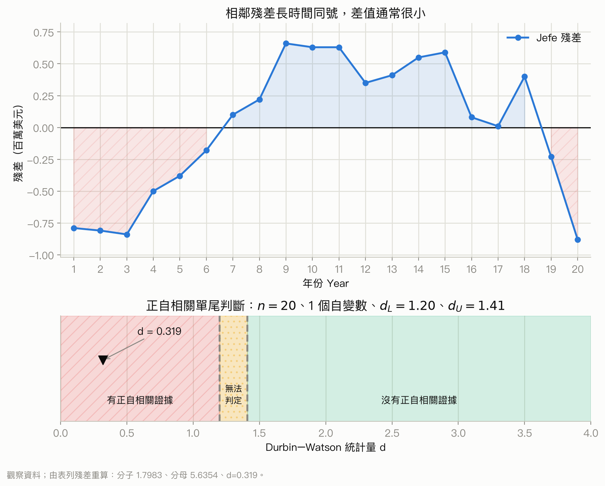

你該注意什麼：圖上的長串同號殘差使相鄰差平方偏小，因而把 $d$ 拉到接近 0；而 $0.319<d_L=1.20$ 才是正式判定有正自相關證據的關鍵。

### 9. 本章總結

投影片第 46 頁的重點可整理成以下流程：

1. 一般線性模型允許加入平方項處理曲線，也能加入乘積項處理交互作用。
2. 若誤差變異不固定或有異常觀察值，可考慮對應變數取對數或倒數；比較時要把預測轉回原始單位。
3. 要判斷新增一組變數是否值得，可用巢套模型的 $F$ 檢定；單一變數時，$F$ 和 $t^2$ 有關。
4. 逐步、向前、向後和最佳子集程序可以協助處理大量自變數，但程序結果不是免檢查的真理；最終仍要看殘差、共線性、可測量性和模型簡潔度。
5. 虛擬變數讓多組實驗設計可以用複迴歸表達，整體 $F$ 檢定對應組平均數是否全相同。
6. 時間資料要檢查自相關；Durbin-Watson 統計量接近 0 暗示正自相關，接近 4 暗示負自相關，正式判斷要用 $d_L$、$d_U$ 臨界值。

### 把數字翻成真實意義

| 數字或關係 | 數理上變大／變小 | 資料世界中的定性意義 | 不能直接推論 |
| --- | --- | --- | --- |
| 二次項 $\beta_2$ | 正負決定邊際斜率隨 $x$ 往上或往下移 | 效果會加速、減速或在資料範圍內轉折 | 整條曲線必然上升或下降 |
| 交互作用 $\beta_3$ | 絕對值越大代表條件斜率改變越快 | 一個效果較依賴另一個條件，跨情境搬用性較低 | 兩個自變數彼此高度相關 |
| 對數轉換後殘差 | 若帶寬變穩，表示相對尺度較合適 | 原本的異質性較像百分比或倍數波動 | 原尺度變異不存在或可忽略 |
| 巢套模型 $F$ | 越大代表新增變數平均消除的誤差相對剩餘雜訊越多 | 新增資訊合起來帶來可辨認的增量 | 每個新增變數都重要或模型值得部署 |
| 調整後 $R^2$／RMSE | 前者較高、後者較低通常較佳 | 樣本內配適與複雜度之間較有利的取捨 | 樣本外一定最佳或具有因果真實性 |
| DW 接近 0 | 相鄰殘差差值小 | 高估或低估會連續成串，誤差具有正向慣性 | $y$ 有上升趨勢就一定如此 |
| DW 接近 2 | 相鄰殘差的差與總殘差量相稱 | 沒有明顯一階連續性線索 | 所有迴歸條件都成立 |
| DW 接近 4 | 相鄰殘差常正負交替 | 誤差具有負向交替或過度修正的結構 | 模型其他部分必然錯誤 |

## 跟前面像的東西怎麼分

<!-- exam-question-links:start -->
> **對應考古題：** Ch16 選擇題 [17](#exam-ch16-mc-17)
<!-- exam-question-links:end -->

<a id="compare-ch16-method-selection"></a>

遇到沒有標章節的題目，先不要從「看到 F 就用哪個公式」開始。依序看四件事：應變數是否為數量型、觀察值是否有時間或配對順序、題目是在問單一係數還是一整組變數、模型是加法效果還是允許效果隨條件改變。下面五組是最容易在同一份輸出裡看起來很像的方法。

### 比較 1：加平方項 vs 轉換應變數

| 比較方法 | 資料或問題長相 | 何時用這個方法 | 關鍵輸出或假設 |
|---|---|---|---|
| 本章的[二次模型](#formula-quadratic-regression) | $y$ 對 $x$ 的平均走勢彎曲；用直線配適後，殘差在低、中、高 $x$ 處呈有方向的弧形 | 平均關係的形狀不對，但 $y$ 的原始尺度仍有清楚意義時，加入 $x^2$ 修正平均線 | 看二次項、巢套模型檢定與殘差弧形是否消失；通常保留一次項，且不可任意外推 |
| 本章的[應變數反轉換](#formula-log-response-backtransform) | 殘差像漏斗，$y$ 越大時波動也越大，或關係在原尺度近似倍數成長 | 要改變 $y$ 的尺度，使變異較穩定或讓乘法關係較容易建模時，使用 $\ln(y)$、$\log_{10}(y)$ 或 $1/y$ | 轉換後的係數與誤差都在新尺度；預測要轉回原單位，且不能直接比較不同 $y$ 尺度的 $R^2$ |

兩者都從前章的[殘差定義](#formula-slr-residual)出發，但在修不同問題：弧形優先檢查平均函數，漏斗優先檢查反應尺度。

**一句話判斷準則：** 殘差中心彎曲就先想平方項；殘差中心約在 0、但散布寬度隨預測值改變，就先想轉換 $y$。

**容易誤選情境：** 銷售額的殘差由窄變寬，卻只加入 $x^2$。平方項可以把中心線彎曲，卻不一定能穩定隨水準增加的誤差變異；這時轉換 $y$ 才直接針對漏斗問題。

### 比較 2：主效果 vs 交互作用

| 比較方法 | 資料或問題長相 | 何時用這個方法 | 關鍵輸出或假設 |
|---|---|---|---|
| 前章的[加法型複迴歸](#formula-multiple-regression-model) | 有兩個以上自變數，但題意是假設每個變數的斜率不隨其他變數改變；分組線大致平行 | 問「控制其他變數後，$x_1$ 平均改變多少」，而這個效果可合理視為固定時，只放主效果 | $\beta_1$ 是其他變數固定時的部分斜率；加法模型隱含沒有交互作用 |
| 本章的[交互作用模型](#formula-interaction-regression) | 題目說「效果取決於」、「在不同群體效果不同」，或分組線明顯不平行 | 一個自變數對 $y$ 的效果會隨另一個自變數或群組改變時，加入乘積項 $x_1x_2$ | $x_1$ 的邊際效果為 $\beta_1+\beta_3x_2$；有交互作用時不能把 $\beta_1$ 當成所有情況的共同效果 |

**一句話判斷準則：** 問固定的獨立貢獻用主效果；問「誰在什麼條件下更有效」就檢查交互作用。

**容易誤選情境：** 廣告在低價產品增加銷售很多、在高價產品幾乎無效，卻只放 Price 與 Advertising 兩個主效果。加法模型會強迫廣告斜率在所有價格下相同，因此無法表達效果隨價格改變；需要 Price 與 Advertising 的乘積項。

### 比較 3：巢套模型 F vs 個別 t

| 比較方法 | 資料或問題長相 | 何時用這個方法 | 關鍵輸出或假設 |
|---|---|---|---|
| 本章的[巢套模型 F 檢定](#formula-nested-model-f) | 同一批資料、同一個 $y$，完整模型比小模型多一整組變數，而且小模型可由完整模型刪係數得到 | 問「新增的這一組變數合起來是否改善模型」時使用 | 同時檢定多個新增係數為 0；比較兩個 SSE，分子自由度是新增參數數；兩模型必須巢套 |
| 前章的[個別 t 檢定](#formula-multiple-regression-t-test) | 已有一個複迴歸模型，問題只指名一個係數或一個變數 | 問「控制其他變數後，這一個 $\beta_i$ 是否為 0」時使用 | 看 $b_i/s_{b_i}$；共線性可能放大標準誤，使個別 t 不顯著 |

前章的[整體 F 檢定](#formula-multiple-regression-f-test)把所有斜率一起和 0 比；本章的巢套 F 則保留小模型中的變數，只檢查新增那一組。若只新增一個參數，巢套 $F=t^2$，兩者會給相同結論。

**一句話判斷準則：** 一次問一個係數用 t；一次問一組新增係數用巢套 F。

**容易誤選情境：** 完整模型新增三個行銷指標，三個個別 p 值都略大於 0.05，就逐一宣告整組沒有用。三個變數可能共同提供訊號，個別 t 又可能受共線性影響；應以巢套 F 直接檢定三個新增係數是否同時為 0。

### 比較 4：變數選取 vs 因果判斷

| 比較方法 | 資料或問題長相 | 何時用這個方法 | 關鍵輸出或假設 |
|---|---|---|---|
| 本章的逐步、向前、向後或最佳子集 | 同一個數量型 $y$ 有很多候選預測變數，目標是找較精簡、成本較低或預測較好的模型 | 研究目標是預測或描述，並願意用驗證資料再檢查樣本外表現時使用 | 比較調整後 $R^2$、RMSE、殘差、共線性與測量成本；搜尋後的 p 值會偏樂觀，結果也可能隨樣本改變 |
| 前章的[複迴歸模型](#formula-multiple-regression-model)與前前章的[相關係數](#formula-slr-correlation) | 題目要問「改變 $x$ 是否造成 $y$ 改變」，而不只是哪些欄位能預測 $y$ | 因果問題先看隨機分派、時間順序、混雜控制與研究設計；迴歸可作為分析工具，但不能單靠選模建立因果 | 入選、顯著、高 $R^2$ 或高相關都只是在特定資料與模型下的關聯證據，不是因果識別條件 |

**一句話判斷準則：** 要挑「誰最會預測」可以選模；要回答「誰造成結果」先看研究設計，不能讓演算法代替因果證據。

**容易誤選情境：** 逐步迴歸從八個欄位中留下廣告費，就宣稱提高廣告費一定會提高銷售。廣告費可能和市場規模、旺季或公司預期需求一起變動；選模只能說它在這批資料中有額外預測訊號，不能排除混雜，因此不能直接下因果結論。

### 比較 5：一般迴歸的獨立誤差 vs Durbin-Watson 自相關檢查

| 比較方法 | 資料或問題長相 | 何時用這個方法 | 關鍵輸出或假設 |
|---|---|---|---|
| 前章的[標準化殘差](#formula-standardized-residual)與一般殘差圖 | 每列是不同顧客、門市或交易，沒有必須保留的時間先後；主要檢查離群、漏斗或彎曲 | 觀察單位可合理視為彼此獨立時，用一般迴歸殘差診斷檢查線性、等變異與異常點 | 一般 t 與 F 推論把誤差獨立當成前提；殘差對預測值圖看不出時間相鄰關係 |
| 本章的[Durbin-Watson 統計量](#formula-durbin-watson) | 每列是連續月份、季度或年份，列的順序不能交換；殘差可能連續同號或正負交替 | 問相鄰期誤差是否有一階自相關時，按時間排序殘差後使用 DW | $d$ 接近 0 是正自相關線索、接近 4 是負自相關線索；正式判斷要用 $d_L,d_U$，且 DW 不檢查所有殘差問題 |

兩種情況都使用殘差，但前章的[一般迴歸假設](#formula-slr-residual)把觀察間獨立當作起點；DW 則專門檢查時間相鄰殘差是否違反這個起點。

**一句話判斷準則：** 沒有不可交換的時間順序就先做一般殘差診斷；有時間順序且問相鄰期關聯，才使用 Durbin-Watson。

**容易誤選情境：** 二十家不同門市依店號排列後，看到相鄰兩列殘差相似就計算 DW。店號順序沒有時間或空間機制，交換列次也不改變資料意義；DW 的「相鄰」在這裡是人為排列，不能代表一階自相關，應回到一般殘差圖與抽樣設計檢查獨立性。

## 考古題與詳解

題本共有 18 頁。本節依題本順序收錄 48 題選擇題與 29 題 Problem。題本中的排版控制文字不是題目內容；共用資料改寫成 Exhibit 表格，讓後續題目可直接引用。

以下每題都先走同一條路：辨認題目在問什麼，再用[本章方法選擇流程](#compare-ch16-method-selection)選方法，接著檢查使用條件、計算，最後才用題目情境解讀。需要複迴歸的 $R^2$、整體 $F$ 或個別 $t$ 時，會回連前章的[多元 $R^2$](#formula-multiple-r-squared)、[整體 $F$](#formula-multiple-regression-f-test)或[個別 $t$](#formula-multiple-regression-t-test)。

### 選擇題｜第 1–48 題

#### 選擇題 1 <a id="exam-ch16-mc-1"></a>

##### 題目

> A model in the form of $y=\beta_0+\beta_1z_1+\beta_2z_2+\cdots+\beta_pz_p+\epsilon$ where each independent variable $z_j$ (for $j=1,2,\ldots,p$) is a function of $x_j$. $x_j$ is known as the
>
> a. general linear model
>
> b. general curvilinear model
>
> c. multiplicative model
>
> d. multiplicative curvilinear model

##### 詳解

<!-- exam-theory-links:start -->
> **回看講義：** [2.1 一般線性模型的直覺](#formula-general-linear-model)
<!-- exam-theory-links:end -->

- **辨認題型：** 一般線性模型的定義題。
- **選方法：** 對照[一般線性模型](#formula-general-linear-model)；重點是加工後的 $z_j$ 仍以係數的一次方進入模型。
- **檢查假設：** 這是術語辨識，不需抽樣假設。原文最後把「model」誤寫成 `$x_j$`，依前句判讀其本意。
- **代入計算／推理：** 方程式正是一般線性模型的標準形式。
- **解讀結論：** 答案是 **a**。
- **逐項判讀：** a 正確；b 會把「原始 $x$ 可彎曲」誤當成模型名稱；c、d 都不是本章採用的標準名稱。

#### 選擇題 2 <a id="exam-ch16-mc-2"></a>

##### 題目

> A test used to determine whether or not first order autocorrelation is present is
>
> a. z test
>
> b. t test
>
> c. Chi-square test
>
> d. Durbin-Watson Test

##### 詳解

<!-- exam-theory-links:start -->
> **回看講義：** [8.2 Durbin-Watson 統計量](#formula-durbin-watson)
<!-- exam-theory-links:end -->

- **辨認題型：** 一階自相關的檢定工具。
- **選方法：** 有時間順序且問相鄰誤差，依[方法選擇流程](#compare-ch16-method-selection)使用[Durbin-Watson 統計量](#formula-durbin-watson)。
- **檢查假設：** 應先有按時間排列的迴歸殘差；不是任意列次。
- **代入計算／推理：** z、t、卡方都不是本章的一階自相關專用檢定。
- **解讀結論：** 答案是 **d**。
- **逐項判讀：** a、b 容易因「也是檢定」而誤選；c 是類別次數方法；d 才直接檢查一階自相關。

#### 選擇題 3 <a id="exam-ch16-mc-3"></a>

##### 題目

> In multiple regression analysis, the general linear model
>
> a. can not be used to accommodate curvilinear relationships between dependent variables and independent variables
>
> b. can be used to accommodate curvilinear relationships between the independent variables and dependent variable
>
> c. must contain more than 2 independent variables
>
> d. None of these alternatives is correct.

##### 詳解

<!-- exam-theory-links:start -->
> **回看講義：** [2.2 一階與二階模型](#formula-quadratic-regression)
<!-- exam-theory-links:end -->

- **辨認題型：** 「線性」是否排除曲線的概念題。
- **選方法：** 看[二次模型](#formula-quadratic-regression)：加入 $x^2$ 後仍對參數線性。
- **檢查假設：** 曲線形式要有圖形、理論或殘差支持；不是只為提高 $R^2$。
- **代入計算／推理：** 一般線性模型可以把 $x^2$ 當成加工變數。
- **解讀結論：** 答案是 **b**。
- **逐項判讀：** a 把參數線性誤成圖形直線；b 正確；c 錯在一個原始預測變數也能建立一般線性模型；d 因 b 正確而錯。

#### 選擇題 4 <a id="exam-ch16-mc-4"></a>

##### 題目

> The following model $Y=\beta_0+\beta_1X_1+\epsilon$ is referred to as a
>
> a. curvilinear model
>
> b. curvilinear model with one predictor variable
>
> c. simple second-order model with one predictor variable
>
> d. simple first-order model with one predictor variable

##### 詳解

<!-- exam-theory-links:start -->
> **回看講義：** [2.2 一階與二階模型](#formula-first-order-regression)
<!-- exam-theory-links:end -->

- **辨認題型：** 依最高次方命名模型。
- **選方法：** 對照[一階模型](#formula-first-order-regression)。
- **檢查假設：** 只辨識形式；$X_1$ 只有一次項。
- **代入計算／推理：** 沒有平方項或其他曲線項，所以是單一預測變數的一階模型。
- **解讀結論：** 答案是 **d**。
- **逐項判讀：** a、b 都錯把直線稱曲線；c 需要 $X_1^2$；d 完整描述原式。

#### 選擇題 5 <a id="exam-ch16-mc-5"></a>

##### 題目

> In multiple regression analysis, the word linear in the term "general linear model" refers to the fact that
>
> a. $\beta_0,\beta_1,\ldots,\beta_p$ all have exponents of 0
>
> b. $\beta_0,\beta_1,\ldots,\beta_p$ all have exponents of 1
>
> c. $\beta_0,\beta_1,\ldots,\beta_p$ all have exponents of at least 1
>
> d. $\beta_0,\beta_1,\ldots,\beta_p$ all have exponents of less than 1

##### 詳解

<!-- exam-theory-links:start -->
> **回看講義：** [2.1 一般線性模型的直覺](#formula-general-linear-model)
<!-- exam-theory-links:end -->

- **辨認題型：** 參數線性的定義。
- **選方法：** 回看[一般線性模型](#formula-general-linear-model)。
- **檢查假設：** 判斷的是參數 $\beta_j$，不是原始變數 $x_j$ 的次方。
- **代入計算／推理：** 每個參數都只以一次方出現。
- **解讀結論：** 答案是 **b**。
- **逐項判讀：** a 會讓係數全變成 1；b 正確；c 允許二次方參數，已非參數線性；d 也不符合定義。

#### 選擇題 6 <a id="exam-ch16-mc-6"></a>

##### 題目

> Serial correlation is
>
> a. the correlation between serial numbers of products
>
> b. the same as autocorrelation
>
> c. the same as leverage
>
> d. None of these alternatives is correct.

##### 詳解

<!-- exam-theory-links:start -->
> **回看講義：** [8.3 自相關的模型表示與假設](#formula-ar-error-process)
<!-- exam-theory-links:end -->

- **辨認題型：** 術語同義辨識。
- **選方法：** 對照[一階自相關誤差模型](#formula-ar-error-process)。
- **檢查假設：** 這裡的 serial 指按時間或順序的誤差，不是商品序號。
- **代入計算／推理：** serial correlation 與 autocorrelation 在本章同義。
- **解讀結論：** 答案是 **b**。
- **逐項判讀：** a 是字面誤導；b 正確；c 的 leverage 是自變數位置異常；d 因 b 正確而錯。

#### 選擇題 7 <a id="exam-ch16-mc-7"></a>

##### 題目

> The joint effect of two variables acting together is called
>
> a. autocorrelation
>
> b. interaction
>
> c. serial correlation
>
> d. joint regression

##### 詳解

<!-- exam-theory-links:start -->
> **回看講義：** [3.1 為什麼要加入交互作用](#formula-interaction-regression)
<!-- exam-theory-links:end -->

- **辨認題型：** 交互作用術語題。
- **選方法：** 看[交互作用模型](#formula-interaction-regression)。
- **檢查假設：** 「一起作用」指一個變數的效果隨另一個變數改變，不只是兩者相關。
- **代入計算／推理：** 乘積項 $X_1X_2$ 表示 interaction。
- **解讀結論：** 答案是 **b**。
- **逐項判讀：** a、c 都是相鄰時間誤差的關係；b 正確；d 不是標準術語。

#### 選擇題 8 <a id="exam-ch16-mc-8"></a>

##### 題目

> A test to determine whether or not first-order autocorrelation is present is
>
> a. a t test
>
> b. an F test
>
> c. a test of interaction
>
> d. a chi-square test

##### 詳解

<!-- exam-theory-links:start -->
> **回看講義：** [8.2 Durbin-Watson 統計量](#formula-durbin-watson)
<!-- exam-theory-links:end -->

- **辨認題型：** 一階自相關檢定工具。
- **選方法：** 應使用[Durbin-Watson 統計量](#formula-durbin-watson)。
- **檢查假設：** 需要有時間順序的迴歸殘差。
- **代入計算／推理：** a、b、c、d 都不是題目所問的專用檢定。
- **解讀結論：** **原題沒有正確選項**；應補上 “Durbin-Watson test”。
- **逐項判讀：** a 檢查單一係數；b 檢查整體或一組係數；c 檢查效果是否依條件改變；d 用於類別次數等問題，四者都不對。

#### 選擇題 9 <a id="exam-ch16-mc-9"></a>

##### 題目

> Which of the following tests is used to determine whether an additional variable makes a significant contribution to a multiple regression model?
>
> a. a t test
>
> b. a Z test
>
> c. an F test
>
> d. a chi-square test

##### 詳解

<!-- exam-theory-links:start -->
> **回看講義：** [5.1 比較小模型和完整模型](#formula-nested-model-f)
<!-- exam-theory-links:end -->

- **辨認題型：** 單一新增變數的貢獻。
- **選方法：** 題庫把「新增變數是否改善模型」放在模型建立脈絡，預期使用[巢套 $F$](#formula-nested-model-f)；若只新增一個變數，[個別 $t$](#formula-multiple-regression-t-test)也會給相同決策。
- **檢查假設：** 同一批資料、同一個 $y$，完整模型只多這一個變數，且一般迴歸條件合理。
- **代入計算／推理：** 單一新增參數時，巢套 $F=t^2$，所以 a 與 c 的統計決策等價；但本章題庫問的是模型加入變數後的額外貢獻，預期術語是 F test。
- **解讀結論：** 題庫預期答案是 **c**；由於只新增一個變數時 a 也數學等價，原題存在答案不唯一的問題。
- **逐項判讀：** a 可檢定單一新增係數，因此數學上也成立，但不是題庫的預期答案；b、d 不適用；c 是本章以小模型和完整模型比較新增貢獻的預期答案。

#### 選擇題 10 <a id="exam-ch16-mc-10"></a>

##### 題目

> A variable such as $Z$, whose value is $Z=X_1X_2$, is added to a general linear model in order to account for potential effects of two variables $X_1$ and $X_2$ acting together. This type of effect is
>
> a. impossible to occur
>
> b. called interaction
>
> c. called multicollinearity effect
>
> d. called transformation effect

##### 詳解

<!-- exam-theory-links:start -->
> **回看講義：** [3.1 為什麼要加入交互作用](#formula-interaction-regression)
<!-- exam-theory-links:end -->

- **辨認題型：** 乘積項的用途。
- **選方法：** 對照[交互作用模型](#formula-interaction-regression)。
- **檢查假設：** 應同時保留合理的主效果，並依題意或圖形支持交互作用。
- **代入計算／推理：** $X_1X_2$ 讓 $X_1$ 的斜率隨 $X_2$ 改變。
- **解讀結論：** 答案是 **b**。
- **逐項判讀：** a 明顯錯；b 正確；c 是自變數高度相關；d 太籠統，未指出共同效果。

#### 選擇題 11 <a id="exam-ch16-mc-11"></a>

##### 題目

> The following regression model $Y=\beta_0+\beta_1X_1+\beta_2X_1^2+\epsilon$ is known as
>
> a. first-order model with one predictor variable
>
> b. second-order model with two predictor variables
>
> c. second-order model with one predictor variable
>
> d. None of these alternatives is correct.

##### 詳解

<!-- exam-theory-links:start -->
> **回看講義：** [2.2 一階與二階模型](#formula-quadratic-regression)
<!-- exam-theory-links:end -->

- **辨認題型：** 二次模型命名。
- **選方法：** 看[二次模型](#formula-quadratic-regression)。
- **檢查假設：** $X_1$ 與 $X_1^2$ 是同一個原始預測變數的兩個加工項。
- **代入計算／推理：** 最高次方為 2，原始 predictor 只有 $X_1$。
- **解讀結論：** 答案是 **c**。
- **逐項判讀：** a 漏看平方項；b 把加工項誤算成兩個原始變數；c 正確；d 因 c 正確而錯。

#### 選擇題 12 <a id="exam-ch16-mc-12"></a>

##### 題目

> The parameters of nonlinear models have exponents
>
> a. larger than zero
>
> b. larger than 1
>
> c. larger than 2
>
> d. larger than 3

##### 詳解

<!-- exam-theory-links:start -->
> **回看講義：** [4.5 本質上非線性但可線性化的模型](#formula-exponential-linearization)
<!-- exam-theory-links:end -->

- **辨認題型：** 題庫對非線性參數的簡化定義。
- **選方法：** 和[指數模型線性化](#formula-exponential-linearization)對照，真正關鍵是參數不是以線性方式出現。
- **檢查假設：** 非線性不只可能來自「指數大於 1」，也可能來自參數相乘、位於分母或指數中。
- **代入計算／推理：** 依四個選項和題庫本意，選「larger than 1」。
- **解讀結論：** 題庫預期答案是 **b**，但敘述是過度簡化。
- **逐項判讀：** a 包含一次方線性模型；b 最接近題庫定義；c、d 又把範圍限得太窄。

#### 選擇題 13 <a id="exam-ch16-mc-13"></a>

##### 題目

> All the variables in a multiple regression analysis
>
> a. must be quantitative
>
> b. must be either quantitative or qualitative but not a mix of both
>
> c. must be positive
>
> d. None of these alternatives is correct.

##### 詳解

<!-- exam-theory-links:start -->
> **回看講義：** [7.2 模型如何還原三組平均數](#formula-dummy-variable-anova)
<!-- exam-theory-links:end -->

- **辨認題型：** 複迴歸可接受的變數型態。
- **選方法：** 類別自變數可依[虛擬變數模型](#formula-dummy-variable-anova)編碼。
- **檢查假設：** 應變數在一般線性迴歸通常是數量型；自變數可混合連續與適當編碼的類別變數。
- **代入計算／推理：** a、b、c 都不是必要條件。
- **解讀結論：** 答案是 **d**。
- **逐項判讀：** a 忽略 dummy；b 錯在可以混用；c 負值也可進迴歸；d 正確。

#### 選擇題 14 <a id="exam-ch16-mc-14"></a>

##### 題目

> The range of the Durbin-Watson statistic is between
>
> a. $-1$ to $1$
>
> b. $0$ to $1$
>
> c. $-\infty$ to $+\infty$
>
> d. $0$ to $4$

##### 詳解

<!-- exam-theory-links:start -->
> **回看講義：** [8.2 Durbin-Watson 統計量](#formula-durbin-watson)
<!-- exam-theory-links:end -->

- **辨認題型：** DW 統計量範圍。
- **選方法：** 回看[Durbin-Watson 公式](#formula-durbin-watson)。
- **檢查假設：** 問的是 $d$，不是相關係數 $\rho$。
- **代入計算／推理：** $d$ 的範圍約為 0 到 4。
- **解讀結論：** 答案是 **d**。
- **逐項判讀：** a 是相關係數常見範圍；b 太窄；c 無界不對；d 正確。

#### 選擇題 15 <a id="exam-ch16-mc-15"></a>

##### 題目

> The correlation in error terms that arises when the error terms at successive points in time are related is termed
>
> a. leverage
>
> b. multicorrelation
>
> c. autocorrelation
>
> d. parallel correlation

##### 詳解

<!-- exam-theory-links:start -->
> **回看講義：** [8.3 自相關的模型表示與假設](#formula-ar-error-process)
<!-- exam-theory-links:end -->

- **辨認題型：** 時間相鄰誤差的名稱。
- **選方法：** 看[一階自相關誤差模型](#formula-ar-error-process)。
- **檢查假設：** successive points 表示時間順序有意義。
- **代入計算／推理：** 相鄰誤差相關稱 autocorrelation。
- **解讀結論：** 答案是 **c**。
- **逐項判讀：** a 是高槓桿點；b、d 不是本章標準術語；c 正確。

#### 選擇題 16 <a id="exam-ch16-mc-16"></a>

##### 題目

> What value of Durbin-Watson statistic indicates no autocorrelation is present?
>
> a. 1
>
> b. 2
>
> c. -2
>
> d. 0

##### 詳解

<!-- exam-theory-links:start -->
> **回看講義：** [8.2 Durbin-Watson 統計量](#formula-durbin-watson)
<!-- exam-theory-links:end -->

- **辨認題型：** DW 的直覺判讀。
- **選方法：** 使用[Durbin-Watson 統計量](#formula-durbin-watson)。
- **檢查假設：** 正式檢定仍要查 $d_L,d_U$；「2」是直覺中心，不是所有其他條件都成立的證明。
- **代入計算／推理：** $d\approx2$ 表示沒有明顯一階自相關。
- **解讀結論：** 答案是 **b**。
- **逐項判讀：** a 不是基準；b 正確；c 超出範圍；d 是強烈正自相關線索。

#### 選擇題 17 <a id="exam-ch16-mc-17"></a>

##### 題目

> When dealing with the problem of non-constant variance, the reciprocal transformation means using
>
> a. $1/X$ as the independent variable instead of $X$
>
> b. $X^2$ as the independent variable instead of $X$
>
> c. $Y^2$ as the dependent variable instead of $Y$
>
> d. $1/Y$ as the dependent variable instead of $Y$

##### 詳解

<!-- exam-theory-links:start -->
> **回看講義：** [跟前面像的東西怎麼分](#compare-ch16-method-selection)
<!-- exam-theory-links:end -->

- **辨認題型：** 應變數倒數轉換。
- **選方法：** 依[平方項 vs 轉換應變數](#compare-ch16-method-selection)，漏斗型變異問題可考慮改變 $Y$ 尺度。
- **檢查假設：** $Y$ 不可為 0；轉換後要重新檢查殘差，且解讀在新尺度。
- **代入計算／推理：** reciprocal transformation 在本章指用 $1/Y$ 作應變數。
- **解讀結論：** 答案是 **d**。
- **逐項判讀：** a 改的是自變數；b 是平方項；c 是平方轉換；d 才是倒數應變數。

<a id="quiz-ch16-exhibit-1"></a>

#### 題組 16-1：選擇題 18–25 共用資料

> In a regression analysis involving 25 observations, the following estimated regression equation was developed.
>
> $$\widehat Y=10-18X_1+32X_2+14X_3$$
>
> Also, the following standard errors and the sum of squares were obtained.

| 量 | 數值 |
|---|---:|
| $S_{b_1}$ | 3 |
| $S_{b_2}$ | 6 |
| $S_{b_3}$ | 7 |
| $SST$ | 4,800 |
| $SSE$ | 1,296 |

這個 Exhibit 有 $n=25$、$k=3$，所以個別 t 與誤差的自由度都是 $25-3-1=21$。

#### 選擇題 18 <a id="exam-ch16-mc-18"></a>

##### 題目

> Refer to Exhibit 16-1. If you want to determine whether or not the coefficients of the independent variables are significant, the critical value of t statistic at $\alpha=0.05$ is
>
> a. 2.080
>
> b. 2.060
>
> c. 2.064
>
> d. 1.96

##### 詳解

<!-- exam-theory-links:start -->
> **回看講義：** [投影片第 20–21 頁：個別 $t$ 檢定](#formula-multiple-regression-t-test)
<!-- exam-theory-links:end -->

- **辨認題型：** 個別係數的雙尾 t 檢定。
- **選方法：** 使用[個別 t 檢定](#formula-multiple-regression-t-test)。
- **檢查假設：** 一般迴歸誤差條件合理；df $=n-k-1=21$。
- **代入計算／推理：** $t_{0.025,21}=2.080$。
- **解讀結論：** 答案是 **a**。
- **逐項判讀：** a 對應 df 21；b、c 是其他自由度的近似值；d 是大樣本常態臨界值。

#### 選擇題 19 <a id="exam-ch16-mc-19"></a>

##### 題目

> Refer to Exhibit 16-1. The coefficient of $X_1$
>
> a. is significant
>
> b. is not significant
>
> c. can not be tested, because not enough information is provided
>
> d. None of these alternatives is correct.

##### 詳解

<!-- exam-theory-links:start -->
> **回看講義：** [投影片第 20–21 頁：個別 $t$ 檢定](#formula-multiple-regression-t-test)
<!-- exam-theory-links:end -->

- **辨認題型：** $\beta_1=0$ 的個別 t 檢定。
- **選方法：** 用[個別 t 公式](#formula-multiple-regression-t-test)。
- **檢查假設：** Exhibit 給了係數、標準誤及 df 21，資訊足夠。
- **代入計算／推理：** $t=-18/3=-6$，$|t|>2.080$。
- **解讀結論：** 答案是 **a**；控制其他變數後，$X_1$ 的係數顯著不為 0。
- **逐項判讀：** a 正確；b 忽略了大 t 值；c 錯在資料足夠；d 因 a 正確而錯。

#### 選擇題 20 <a id="exam-ch16-mc-20"></a>

##### 題目

> Refer to Exhibit 16-1. The coefficient of $X_2$
>
> a. is significant
>
> b. is not significant
>
> c. can not be tested, because not enough information is provided
>
> d. None of these alternatives is correct.

##### 詳解

<!-- exam-theory-links:start -->
> **回看講義：** [投影片第 20–21 頁：個別 $t$ 檢定](#formula-multiple-regression-t-test)
<!-- exam-theory-links:end -->

- **辨認題型：** $\beta_2=0$ 的個別 t 檢定。
- **選方法：** 用[個別 t 公式](#formula-multiple-regression-t-test)。
- **檢查假設：** df 21，雙尾 $\alpha=0.05$。
- **代入計算／推理：** $t=32/6=5.333$，大於 2.080。
- **解讀結論：** 答案是 **a**。
- **逐項判讀：** a 正確；b 把係數大小和標準誤關係看反；c 錯在可計算；d 不成立。

#### 選擇題 21 <a id="exam-ch16-mc-21"></a>

##### 題目

> Refer to Exhibit 16-1. The coefficient of $X_3$
>
> a. is significant
>
> b. is not significant
>
> c. can not be tested, because not enough information is provided
>
> d. None of these alternatives is correct.

##### 詳解

<!-- exam-theory-links:start -->
> **回看講義：** [投影片第 20–21 頁：個別 $t$ 檢定](#formula-multiple-regression-t-test)
<!-- exam-theory-links:end -->

- **辨認題型：** $\beta_3=0$ 的個別 t 檢定。
- **選方法：** 用[個別 t 公式](#formula-multiple-regression-t-test)。
- **檢查假設：** df 21，雙尾檢定。
- **代入計算／推理：** $t=14/7=2.000<2.080$。
- **解讀結論：** 答案是 **b**；在 5% 水準沒有足夠證據說 $\beta_3\ne0$。
- **逐項判讀：** a 容易因 2 看起來大而誤選；b 正確；c 錯在資訊足夠；d 不成立。

#### 選擇題 22 <a id="exam-ch16-mc-22"></a>

##### 題目

> Refer to Exhibit 16-1. The multiple coefficient of determination is
>
> a. 0.27
>
> b. 0.73
>
> c. 0.50
>
> d. 0.33

##### 詳解

<!-- exam-theory-links:start -->
> **回看講義：** [投影片第 11 頁：多元判定係數](#formula-multiple-r-squared)
<!-- exam-theory-links:end -->

- **辨認題型：** 多元 $R^2$。
- **選方法：** 用[多元 $R^2$](#formula-multiple-r-squared)。
- **檢查假設：** $SST$ 與 $SSE$ 來自同一模型和同一應變數。
- **代入計算／推理：** $R^2=1-1296/4800=0.73$。
- **解讀結論：** 答案是 **b**；模型解釋樣本中 73% 的 $Y$ 變異。
- **逐項判讀：** a 是未解釋比例；b 正確；c、d 都沒有由平方和得到。

#### 選擇題 23 <a id="exam-ch16-mc-23"></a>

##### 題目

> Refer to Exhibit 16-1. If we are interested in testing for the significance of the relationship among the variables (i.e., significance of the model), the critical value of F at $\alpha=0.05$ is
>
> a. 2.76
>
> b. 2.78
>
> c. 3.10
>
> d. 3.07

##### 詳解

<!-- exam-theory-links:start -->
> **回看講義：** [投影片第 16–17 頁：整體 $F$ 檢定](#formula-multiple-regression-f-test)
<!-- exam-theory-links:end -->

- **辨認題型：** 複迴歸整體 F 的臨界值。
- **選方法：** 使用[整體 F 檢定](#formula-multiple-regression-f-test)。
- **檢查假設：** 分子 df $=k=3$，分母 df $=21$。
- **代入計算／推理：** $F_{0.05;3,21}=3.072\approx3.07$。
- **解讀結論：** 答案是 **d**。
- **逐項判讀：** a、b、c 對應錯誤的自由度或四捨五入；d 對應 $(3,21)$。

#### 選擇題 24 <a id="exam-ch16-mc-24"></a>

##### 題目

> Refer to Exhibit 16-1. The test statistic for testing the significance of the model is
>
> a. 0.730
>
> b. 18.926
>
> c. 3.703
>
> d. 1.369

##### 詳解

<!-- exam-theory-links:start -->
> **回看講義：** [投影片第 16–17 頁：整體 $F$ 檢定](#formula-multiple-regression-f-test)
<!-- exam-theory-links:end -->

- **辨認題型：** 由平方和算整體 F。
- **選方法：** 用[整體 F 公式](#formula-multiple-regression-f-test)。
- **檢查假設：** $SSR=SST-SSE=3504$，df 為 3 與 21。
- **代入計算／推理：** $F=(3504/3)/(1296/21)=18.926$。
- **解讀結論：** 答案是 **b**。
- **逐項判讀：** a 是 $R^2$；b 正確；c、d 是錯誤除法組合。

#### 選擇題 25 <a id="exam-ch16-mc-25"></a>

##### 題目

> Refer to Exhibit 16-1. The p-value for testing the significance of the regression model is
>
> a. less than 0.01
>
> b. between 0.01 and 0.025
>
> c. between 0.025 and 0.05
>
> d. between 0.05 and 0.1

##### 詳解

<!-- exam-theory-links:start -->
> **回看講義：** [投影片第 16–17 頁：整體 $F$ 檢定](#formula-multiple-regression-f-test)
<!-- exam-theory-links:end -->

- **辨認題型：** 整體 F 的 p 值區間。
- **選方法：** 延續[整體 F 檢定](#formula-multiple-regression-f-test)。
- **檢查假設：** $F=18.926$，df $(3,21)$。
- **代入計算／推理：** 獨立重算得 $p\approx3.51\times10^{-6}<0.01$。
- **解讀結論：** 答案是 **a**；整體模型顯著，但不表示每個係數都顯著。
- **逐項判讀：** a 包含重算值；b、c、d 都太大。

<a id="quiz-ch16-exhibit-2"></a>

#### 題組 16-2：選擇題 26–34 共用資料

> In a regression model involving 30 observations, the following estimated regression equation was obtained.
>
> $$\widehat Y=170+34X_1-3X_2+8X_3+58X_4+3X_5$$
>
> For this model, $SSR=1{,}740$ and $SST=2{,}000$.

此處 $n=30$、$k=5$，所以迴歸、誤差、總自由度依序為 5、24、29。

#### 選擇題 26 <a id="exam-ch16-mc-26"></a>

##### 題目

> Refer to Exhibit 16-2. The value of SSE is
>
> a. 3,740
>
> b. 170
>
> c. 260
>
> d. 2000

##### 詳解

<!-- exam-theory-links:start -->
> **回看講義：** [投影片第 11 頁：多元判定係數](#formula-multiple-r-squared)
<!-- exam-theory-links:end -->

- **辨認題型：** ANOVA 平方和分解。
- **選方法：** 由[多元 $R^2$ 段落](#formula-multiple-r-squared)使用 $SST=SSR+SSE$。
- **檢查假設：** 三個平方和來自同一資料與模型。
- **代入計算／推理：** $SSE=2000-1740=260$。
- **解讀結論：** 答案是 **c**。
- **逐項判讀：** a 錯把兩者相加；b 是截距；c 正確；d 是 SST。

#### 選擇題 27 <a id="exam-ch16-mc-27"></a>

##### 題目

> Refer to Exhibit 16-2. The degrees of freedom associated with SSR are
>
> a. 24
>
> b. 6
>
> c. 19
>
> d. 5

##### 詳解

<!-- exam-theory-links:start -->
> **回看講義：** [投影片第 16–17 頁：整體 $F$ 檢定](#formula-multiple-regression-f-test)
<!-- exam-theory-links:end -->

- **辨認題型：** 迴歸自由度。
- **選方法：** 依[整體 F](#formula-multiple-regression-f-test)，$df_R=k$。
- **檢查假設：** 方程式有五個斜率，不含截距。
- **代入計算／推理：** $df_R=5$。
- **解讀結論：** 答案是 **d**。
- **逐項判讀：** a 是誤差 df；b 把截距算進去；c 無對應；d 正確。

#### 選擇題 28 <a id="exam-ch16-mc-28"></a>

##### 題目

> Refer to Exhibit 16-2. The degrees of freedom associated with SSE are
>
> a. 24
>
> b. 6
>
> c. 19
>
> d. 5

##### 詳解

<!-- exam-theory-links:start -->
> **回看講義：** [投影片第 18 頁：$\sigma^2$ 與估計標準誤](#formula-mse-error-variance)
<!-- exam-theory-links:end -->

- **辨認題型：** 誤差自由度。
- **選方法：** 使用[誤差均方](#formula-mse-error-variance)中的 $n-k-1$。
- **檢查假設：** $n=30,k=5$。
- **代入計算／推理：** $df_E=30-5-1=24$。
- **解讀結論：** 答案是 **a**。
- **逐項判讀：** a 正確；b 多算錯截距；c、d 都不是殘差 df。

#### 選擇題 29 <a id="exam-ch16-mc-29"></a>

##### 題目

> Refer to Exhibit 16-2. The degrees of freedom associated with SST are
>
> a. 24
>
> b. 6
>
> c. 19
>
> d. None of these alternatives is correct.

##### 詳解

<!-- exam-theory-links:start -->
> **回看講義：** [投影片第 16–17 頁：整體 $F$ 檢定](#formula-multiple-regression-f-test)
<!-- exam-theory-links:end -->

- **辨認題型：** 總自由度。
- **選方法：** 回到[整體 F 檢定](#formula-multiple-regression-f-test)的 ANOVA 架構，其中 $df_T=n-1$。
- **檢查假設：** 有截距的標準迴歸 ANOVA。
- **代入計算／推理：** $df_T=30-1=29$，前三項都不是 29。
- **解讀結論：** 答案是 **d**。
- **逐項判讀：** a 是殘差 df；b、c 皆錯；d 正確涵蓋 29 未列出的情況。

#### 選擇題 30 <a id="exam-ch16-mc-30"></a>

##### 題目

> Refer to Exhibit 16-2. The value of MSR is
>
> a. 10.40
>
> b. 348
>
> c. 10.83
>
> d. 52

##### 詳解

<!-- exam-theory-links:start -->
> **回看講義：** [投影片第 16–17 頁：整體 $F$ 檢定](#formula-multiple-regression-f-test)
<!-- exam-theory-links:end -->

- **辨認題型：** 迴歸均方。
- **選方法：** 使用[整體 F](#formula-multiple-regression-f-test)中的 $MSR=SSR/k$。
- **檢查假設：** $SSR=1740,k=5$。
- **代入計算／推理：** $MSR=1740/5=348$。
- **解讀結論：** 答案是 **b**。
- **逐項判讀：** a、c 接近 MSE；b 正確；d 是錯誤除數結果。

#### 選擇題 31 <a id="exam-ch16-mc-31"></a>

##### 題目

> Refer to Exhibit 16-2. The value of MSE is
>
> a. 348
>
> b. 10.40
>
> c. 10.83
>
> d. 32.13

##### 詳解

<!-- exam-theory-links:start -->
> **回看講義：** [投影片第 18 頁：$\sigma^2$ 與估計標準誤](#formula-mse-error-variance)
<!-- exam-theory-links:end -->

- **辨認題型：** 殘差均方。
- **選方法：** 用[誤差均方公式](#formula-mse-error-variance)。
- **檢查假設：** $SSE=260,df_E=24$。
- **代入計算／推理：** $MSE=260/24=10.833\approx10.83$。
- **解讀結論：** 答案是 **c**。
- **逐項判讀：** a 是 MSR；b 是錯誤四捨五入或 df；c 正確；d 接近 F 而非 MSE。

#### 選擇題 32 <a id="exam-ch16-mc-32"></a>

##### 題目

> Refer to Exhibit 16-2. The test statistic F for testing the significance of the above model is
>
> a. 32.12
>
> b. 6.69
>
> c. 4.8
>
> d. 58

##### 詳解

<!-- exam-theory-links:start -->
> **回看講義：** [投影片第 16–17 頁：整體 $F$ 檢定](#formula-multiple-regression-f-test)
<!-- exam-theory-links:end -->

- **辨認題型：** 整體 F。
- **選方法：** 用[整體 F 公式](#formula-multiple-regression-f-test)。
- **檢查假設：** $MSR=348,MSE=10.833$。
- **代入計算／推理：** $F=348/(260/24)=32.123\approx32.12$。
- **解讀結論：** 答案是 **a**。
- **逐項判讀：** a 正確；b、c、d 都不是正確均方比。

#### 選擇題 33 <a id="exam-ch16-mc-33"></a>

##### 題目

> Refer to Exhibit 16-2. The p-value for testing the significance of the regression model is
>
> a. less than 0.01
>
> b. between 0.01 and 0.025
>
> c. between 0.025 and 0.05
>
> d. between 0.05 and 0.1

##### 詳解

<!-- exam-theory-links:start -->
> **回看講義：** [投影片第 16–17 頁：整體 $F$ 檢定](#formula-multiple-regression-f-test)
<!-- exam-theory-links:end -->

- **辨認題型：** 整體 F 的 p 值範圍。
- **選方法：** 使用[整體 F](#formula-multiple-regression-f-test)。
- **檢查假設：** $F=32.123$，df $(5,24)$。
- **代入計算／推理：** 此 F 遠大於 5% 臨界值，重算 p 值遠小於 0.01。
- **解讀結論：** 答案是 **a**。
- **逐項判讀：** a 正確涵蓋極小 p 值；b、c、d 都太大。

#### 選擇題 34 <a id="exam-ch16-mc-34"></a>

##### 題目

> Refer to Exhibit 16-2. The coefficient of determination for this model is
>
> a. 0.6923
>
> b. 0.1494
>
> c. 0.1300
>
> d. 0.8700

##### 詳解

<!-- exam-theory-links:start -->
> **回看講義：** [投影片第 11 頁：多元判定係數](#formula-multiple-r-squared)
<!-- exam-theory-links:end -->

- **辨認題型：** $R^2$。
- **選方法：** 用[多元 $R^2$](#formula-multiple-r-squared)。
- **檢查假設：** $SSR$ 與 $SST$ 同源。
- **代入計算／推理：** $R^2=1740/2000=0.8700$。
- **解讀結論：** 答案是 **d**。
- **逐項判讀：** a、b 不是平方和比；c 是未解釋比例；d 正確。

<a id="quiz-ch16-exhibit-3"></a>

#### 題組 16-3：選擇題 35–37 共用資料

> Below you are given a partial computer output based on a sample of 25 observations.

| 變數 | Coefficient | Standard Error |
|---|---:|---:|
| Constant | 145 | 29 |
| $X_1$ | 20 | 5 |
| $X_2$ | -18 | 6 |
| $X_3$ | 4 | 4 |

此處 $n=25,k=3$，所以誤差自由度為 21。

#### 選擇題 35 <a id="exam-ch16-mc-35"></a>

##### 題目

> Refer to Exhibit 16-3. The estimated regression equation is
>
> a. $Y=\beta_0+\beta_1X_1+\beta_2X_2+\beta_3X_3+\epsilon$
>
> b. $E(Y)=\beta_0+\beta_1X_1+\beta_2X_2+\beta_3X_3$
>
> c. $\widehat Y=29+5X_1+6X_2+4X_3$
>
> d. $\widehat Y=145+20X_1-18X_2+4X_3$

##### 詳解

<!-- exam-theory-links:start -->
> **回看講義：** [投影片第 5 頁：估計複迴歸方程式](#formula-estimated-multiple-regression)
<!-- exam-theory-links:end -->

- **辨認題型：** 從係數輸出寫估計式。
- **選方法：** 對照前章的[估計複迴歸式](#formula-estimated-multiple-regression)。
- **檢查假設：** Coefficient 欄是 $b_j$；Standard Error 不能當係數。
- **代入計算／推理：** 依序放入 145、20、-18、4。
- **解讀結論：** 答案是 **d**。
- **逐項判讀：** a 是含未知參數與誤差的母體模型；b 是母體平均式；c 誤用標準誤；d 才是估計式。

#### 選擇題 36 <a id="exam-ch16-mc-36"></a>

##### 題目

> Refer to Exhibit 16-3. We want to test whether the parameter $\beta_2$ is significant. The test statistic equals
>
> a. 4
>
> b. 5
>
> c. 3
>
> d. -3

##### 詳解

<!-- exam-theory-links:start -->
> **回看講義：** [投影片第 20–21 頁：個別 $t$ 檢定](#formula-multiple-regression-t-test)
<!-- exam-theory-links:end -->

- **辨認題型：** $\beta_2=0$ 的 t 統計量。
- **選方法：** 用[個別 t](#formula-multiple-regression-t-test)。
- **檢查假設：** 係數為 -18、標準誤為 6。
- **代入計算／推理：** $t=-18/6=-3$。
- **解讀結論：** 答案是 **d**。
- **逐項判讀：** a 是 $X_1$ 的 t；b 是截距的 t；c 漏掉負號；d 正確。

#### 選擇題 37 <a id="exam-ch16-mc-37"></a>

##### 題目

> Refer to Exhibit 16-3. The critical t value obtained from the table to test an individual parameter at the 5% level is
>
> a. 2.06
>
> b. 2.069
>
> c. 2.074
>
> d. 2.080

##### 詳解

<!-- exam-theory-links:start -->
> **回看講義：** [投影片第 20–21 頁：個別 $t$ 檢定](#formula-multiple-regression-t-test)
<!-- exam-theory-links:end -->

- **辨認題型：** 個別係數雙尾 t 臨界值。
- **選方法：** 使用[個別 t](#formula-multiple-regression-t-test)。
- **檢查假設：** df $=25-3-1=21$。
- **代入計算／推理：** $t_{0.025,21}=2.080$。
- **解讀結論：** 答案是 **d**。
- **逐項判讀：** a、b、c 是其他 df 或較粗略值；d 正確。

<a id="quiz-ch16-exhibit-4"></a>

#### 題組 16-4：選擇題 38–48 共用資料

> In a laboratory experiment, data were gathered on the life span ($Y$ in months) of 33 rats, units of daily protein intake ($X_1$), and whether or not agent $X_2$ (a proposed life extending agent) was added to the rats' diet ($X_2=0$ if agent $X_2$ was not added, and $X_2=1$ if agent was added). From the results of the experiment, the following regression model was developed.
>
> $$\widehat Y=36+0.8X_1-1.7X_2$$
>
> Also provided are $SSR=60$ and $SST=180$.

此處 $n=33,k=2$，所以 $SSE=120$，迴歸、誤差自由度為 2、30。$X_2$ 是 0-1 虛擬變數，不能解讀成劑量。

#### 選擇題 38 <a id="exam-ch16-mc-38"></a>

##### 題目

> Refer to Exhibit 16-4. From the above function, it can be said that the life expectancy of rats that were given agent $X_2$ is
>
> a. 1.7 months more than those who did not take agent $X_2$
>
> b. 1.7 months less than those who did not take agent $X_2$
>
> c. 0.8 months less than those who did not take agent $X_2$
>
> d. 0.8 months more than those who did not take agent $X_2$

##### 詳解

<!-- exam-theory-links:start -->
> **回看講義：** [7.2 模型如何還原三組平均數](#formula-dummy-variable-anova)
<!-- exam-theory-links:end -->

- **辨認題型：** 虛擬變數係數解讀。
- **選方法：** 使用[虛擬變數模型](#formula-dummy-variable-anova)。
- **檢查假設：** 比較時固定蛋白質攝取量 $X_1$。
- **代入計算／推理：** $X_2$ 從 0 變 1，預測值改變 $-1.7$ 個月。
- **解讀結論：** 答案是 **b**；這是模型中的平均差，不自動證明因果。
- **逐項判讀：** a 符號相反；b 正確；c、d 誤把蛋白質斜率 0.8 當 agent 效果。

#### 選擇題 39 <a id="exam-ch16-mc-39"></a>

##### 題目

> Refer to Exhibit 16-4. The life expectancy of a rat that was given 3 units of protein daily, and who took agent $X_2$ is
>
> a. 36.7
>
> b. 36
>
> c. 49
>
> d. 38.4

##### 詳解

<!-- exam-theory-links:start -->
> **回看講義：** [投影片第 23 頁：用估計方程式做估計與預測](#formula-multiple-regression-point-estimate)
<!-- exam-theory-links:end -->

- **辨認題型：** 虛擬變數模型的點預測。
- **選方法：** 用前章的[複迴歸點預測](#formula-multiple-regression-point-estimate)。
- **檢查假設：** 代入 $X_1=3,X_2=1$，且條件在資料合理範圍內。
- **代入計算／推理：** $36+0.8(3)-1.7(1)=36.7$。
- **解讀結論：** 答案是 **a**，單位是月。
- **逐項判讀：** a 正確；b 只取截距；c 錯誤相加；d 忽略 agent 的 -1.7。

#### 選擇題 40 <a id="exam-ch16-mc-40"></a>

##### 題目

> Refer to Exhibit 16-4. The life expectancy of a rat that was not given any protein and that did not take agent $X_2$ is
>
> a. 36.7
>
> b. 34.3
>
> c. 36
>
> d. 38.4

##### 詳解

<!-- exam-theory-links:start -->
> **回看講義：** [投影片第 5 頁：估計複迴歸方程式](#formula-estimated-multiple-regression)
<!-- exam-theory-links:end -->

- **辨認題型：** 截距解讀。
- **選方法：** 依[估計複迴歸式](#formula-estimated-multiple-regression)代入條件。
- **檢查假設：** $X_1=0,X_2=0$，並注意 0 蛋白質是否在資料範圍會影響實務可信度。
- **代入計算／推理：** $\widehat Y=36$。
- **解讀結論：** 答案是 **c**。
- **逐項判讀：** a 是上一題；b 是 agent 組在零蛋白質；c 正確；d 是只加蛋白質效果的錯誤值。

#### 選擇題 41 <a id="exam-ch16-mc-41"></a>

##### 題目

> Refer to Exhibit 16-4. The life expectancy of a rat that was given 2 units of agent $X_2$ daily, but was not given any protein is
>
> a. 32.6
>
> b. 36
>
> c. 38
>
> d. 34.3

##### 詳解

<!-- exam-theory-links:start -->
> **回看講義：** [7.2 模型如何還原三組平均數](#formula-dummy-variable-anova)
<!-- exam-theory-links:end -->

- **辨認題型：** 虛擬變數編碼的適用範圍。
- **選方法：** 依[虛擬變數模型](#formula-dummy-variable-anova)，$X_2$ 只能是 0 或 1。
- **檢查假設：** 原題說「2 units of agent」卻令 $X_2$ 為 0-1 指標，條件不合法。
- **代入計算／推理：** 若機械代入 $X_2=2$，得到 $36-1.7(2)=32.6$；但這是超出模型定義的數字。
- **解讀結論：** 題庫預期 **a**，統計上應答「無法用此 0-1 模型預測兩單位劑量」。
- **逐項判讀：** a 是非法外插的機械結果；b 是無 agent；c 沒有公式依據；d 是合法的 $X_2=1$ 預測。原題本身有編碼矛盾。

#### 選擇題 42 <a id="exam-ch16-mc-42"></a>

##### 題目

> Refer to Exhibit 16-4. The degrees of freedom associated with SSR are
>
> a. 2
>
> b. 33
>
> c. 32
>
> d. 30

##### 詳解

<!-- exam-theory-links:start -->
> **回看講義：** [投影片第 16–17 頁：整體 $F$ 檢定](#formula-multiple-regression-f-test)
<!-- exam-theory-links:end -->

- **辨認題型：** 迴歸自由度。
- **選方法：** 依[整體 F](#formula-multiple-regression-f-test)，$df_R=k$。
- **檢查假設：** 模型有 $X_1,X_2$ 兩個斜率。
- **代入計算／推理：** $df_R=2$。
- **解讀結論：** 答案是 **a**。
- **逐項判讀：** a 正確；b 是樣本數；c 是總 df；d 是誤差 df。

#### 選擇題 43 <a id="exam-ch16-mc-43"></a>

##### 題目

> Refer to Exhibit 16-4. The degrees of freedom associated with SSE are
>
> a. 3
>
> b. 33
>
> c. 32
>
> d. 30

##### 詳解

<!-- exam-theory-links:start -->
> **回看講義：** [投影片第 18 頁：$\sigma^2$ 與估計標準誤](#formula-mse-error-variance)
<!-- exam-theory-links:end -->

- **辨認題型：** 誤差自由度。
- **選方法：** 用[誤差均方](#formula-mse-error-variance)的 $n-k-1$。
- **檢查假設：** $n=33,k=2$。
- **代入計算／推理：** $df_E=33-2-1=30$。
- **解讀結論：** 答案是 **d**。
- **逐項判讀：** a 是參數總數但不是 residual df；b 是 n；c 是總 df；d 正確。

#### 選擇題 44 <a id="exam-ch16-mc-44"></a>

##### 題目

> Refer to Exhibit 16-4. The multiple coefficient of determination is
>
> a. 0.2
>
> b. 0.5
>
> c. 0.333
>
> d. 5

##### 詳解

<!-- exam-theory-links:start -->
> **回看講義：** [投影片第 11 頁：多元判定係數](#formula-multiple-r-squared)
<!-- exam-theory-links:end -->

- **辨認題型：** 多元 $R^2$。
- **選方法：** 用[多元 $R^2$](#formula-multiple-r-squared)。
- **檢查假設：** $SSR=60,SST=180$。
- **代入計算／推理：** $R^2=60/180=0.333$。
- **解讀結論：** 答案是 **c**；模型解釋約 33.3% 樣本變異。
- **逐項判讀：** a、b 是錯誤比例；c 正確；d 超出 $R^2$ 範圍。

#### 選擇題 45 <a id="exam-ch16-mc-45"></a>

##### 題目

> Refer to Exhibit 16-4. If we want to test for the significance of the model, the critical value of F at 95% confidence is
>
> a. 4.17
>
> b. 3.32
>
> c. 2.92
>
> d. 1.96

##### 詳解

<!-- exam-theory-links:start -->
> **回看講義：** [投影片第 16–17 頁：整體 $F$ 檢定](#formula-multiple-regression-f-test)
<!-- exam-theory-links:end -->

- **辨認題型：** 整體 F 臨界值。
- **選方法：** 使用[整體 F](#formula-multiple-regression-f-test)。
- **檢查假設：** df $(2,30)$，$\alpha=0.05$。
- **代入計算／推理：** $F_{0.05;2,30}=3.316\approx3.32$。
- **解讀結論：** 答案是 **b**。
- **逐項判讀：** a 常見於 $(1,30)$；b 正確；c 對應別的 df；d 是常態臨界值。

#### 選擇題 46 <a id="exam-ch16-mc-46"></a>

##### 題目

> Refer to Exhibit 16-4. The test statistic for testing the significance of the model is
>
> a. 0.50
>
> b. 5.00
>
> c. 0.25
>
> d. 0.33

##### 詳解

<!-- exam-theory-links:start -->
> **回看講義：** [投影片第 16–17 頁：整體 $F$ 檢定](#formula-multiple-regression-f-test)
<!-- exam-theory-links:end -->

- **辨認題型：** 由平方和計算整體 F。
- **選方法：** 使用[整體 F 公式](#formula-multiple-regression-f-test)。
- **檢查假設：** $SSE=180-60=120$，df 為 2 與 30。
- **代入計算／推理：** $F=(60/2)/(120/30)=30/4=7.50$。
- **解讀結論：** **原題沒有正確選項**；正確統計量是 7.50。
- **逐項判讀：** a、c、d 都是平方和比例的錯誤組合；b 也不是正確均方比。

#### 選擇題 47 <a id="exam-ch16-mc-47"></a>

##### 題目

> Refer to Exhibit 16-4. The p-value for testing the significance of the regression model is
>
> a. less than 0.01
>
> b. between 0.01 and 0.025
>
> c. between 0.025 and 0.05
>
> d. between 0.05 and 0.10

##### 詳解

<!-- exam-theory-links:start -->
> **回看講義：** [投影片第 16–17 頁：整體 $F$ 檢定](#formula-multiple-regression-f-test)
<!-- exam-theory-links:end -->

- **辨認題型：** 整體 F 的 p 值。
- **選方法：** 延續[整體 F 檢定](#formula-multiple-regression-f-test)。
- **檢查假設：** 使用正確的 $F=7.50$ 與 df $(2,30)$。
- **代入計算／推理：** 重算 $p\approx0.00228<0.01$。
- **解讀結論：** 答案是 **a**。
- **逐項判讀：** a 包含正確 p 值；b、c、d 都太大。

#### 選擇題 48 <a id="exam-ch16-mc-48"></a>

##### 題目

> Refer to Exhibit 16-4. The model
>
> a. is significant
>
> b. is not significant
>
> c. Not enough information is provided to answer this question.
>
> d. None of these alternatives is correct.

##### 詳解

<!-- exam-theory-links:start -->
> **回看講義：** [投影片第 16–17 頁：整體 $F$ 檢定](#formula-multiple-regression-f-test)
<!-- exam-theory-links:end -->

- **辨認題型：** 整體模型顯著性結論。
- **選方法：** 用[整體 F](#formula-multiple-regression-f-test)。
- **檢查假設：** $F=7.50>3.32$ 且 $p\approx0.00228$。
- **代入計算／推理：** 在 5% 水準拒絕所有斜率同為 0。
- **解讀結論：** 答案是 **a**；至少一個斜率非 0，不代表兩個都顯著。
- **逐項判讀：** a 正確；b 與數值相反；c 錯在資訊足夠；d 不成立。

### 計算題｜第 1–29 題

#### 計算題 1 <a id="exam-ch16-problem-1"></a>

##### 題目

> In a regression analysis involving 21 observations and 4 independent variables, the following information was obtained.
>
> $$r^2=0.80,\qquad S=5.0$$
>
> Based on the above information, fill in all the blanks in the following ANOVA.
>
> Hint: $r^2=SSR/SST$, but also $r^2=1-SSE/SST$.

##### 詳解

<!-- exam-theory-links:start -->
> **回看講義：** [投影片第 11 頁：多元判定係數](#formula-multiple-r-squared)、[投影片第 18 頁：$\sigma^2$ 與估計標準誤](#formula-standard-error-estimate)
<!-- exam-theory-links:end -->

- **辨認題型：** 由 $R^2$ 與迴歸標準誤回填 ANOVA。
- **選方法：** 用[多元 $R^2$](#formula-multiple-r-squared)和[估計標準誤](#formula-standard-error-estimate)。
- **檢查假設：** $n=21,k=4$；$S=\sqrt{MSE}$，所以誤差 df 為 16。
- **代入計算／推理：** $MSE=5^2=25$，$SSE=25(16)=400$。由 $0.80=1-400/SST$ 得 $SST=2000$、$SSR=1600$；$MSR=1600/4=400$，$F=400/25=16$。
- **解讀結論：** 完整表如下；F 很大表示四個斜率合起來有強烈訊號，但題目未要求顯著性結論。

| Source | DF | SS | MS | F |
|---|---:|---:|---:|---:|
| Regression | 4 | 1,600 | 400 | 16.00 |
| Error (Residual) | 16 | 400 | 25 |  |
| Total | 20 | 2,000 |  |  |

#### 計算題 2 <a id="exam-ch16-problem-2"></a>

##### 題目

> We are interested in determining what type of model best describes the relationship between two variables x and y.
>
> a. For a given data set, an estimated regression equation relating x and y of the form $\widehat y=b_0+b_1x$ was developed, using Excel. Comment on the adequacy of this equation for predicting y. Let $\alpha=.05$.

| Regression Statistics | Value |
|---|---:|
| Multiple R | 0.5095 |
| R Square | 0.2596 |
| Adjusted R Square | 0.1362 |
| Standard Error | 2.0745 |
| Observations | 8 |

| Source | df | SS | MS | F | Significance F |
|---|---:|---:|---:|---:|---:|
| Regression | 1 | 9.0536 | 9.0536 | 2.1037 | 0.1971 |
| Residual | 6 | 25.8214 | 4.3036 |  |  |
| Total | 7 | 34.875 |  |  |  |

| Term | Coefficient | Standard Error | t Stat | P-value |
|---|---:|---:|---:|---:|
| Intercept | 2.7857 | 1.6164 | 1.7234 | 0.1356 |
| x | 0.4643 | 0.3201 | 1.4504 | 0.1971 |

> b. An estimated regression equation for the same data set of the form $\widehat y=b_0+b_1x+b_2x^2$ was developed. Comment on the adequacy of this equation for predicting y. Let $\alpha=.05$.

| Regression Statistics | Value |
|---|---:|
| Multiple R | 0.9680 |
| R Square | 0.9370 |
| Adjusted R Square | 0.9118 |
| Standard Error | 0.6628 |
| Observations | 8 |

| Source | df | SS | MS | F | Significance F |
|---|---:|---:|---:|---:|---:|
| Regression | 2 | 32.6786 | 16.3392 | 37.1951 | 0.0010 |
| Residual | 5 | 2.1964 | 0.4393 |  |  |
| Total | 7 | 34.875 |  |  |  |

| Term | Coefficient | Standard Error | t Stat | P-value |
|---|---:|---:|---:|---:|
| Intercept | -2.8393 | 0.9247 | -3.0706 | 0.0278 |
| x | 3.8393 | 0.4714 | 8.1437 | 0.0005 |
| x-squared | -0.3750 | 0.0511 | -7.3335 | 0.0007 |

> c. Use the results of Part b and predict y when $x=4$.

##### 詳解

<!-- exam-theory-links:start -->
> **回看講義：** [2.2 一階與二階模型](#formula-quadratic-regression)
<!-- exam-theory-links:end -->

- **辨認題型：** 直線與二次模型的比較，再做點預測。
- **選方法：** 依[平方項 vs 轉換應變數](#compare-ch16-method-selection)，平均走勢需要彎曲時用[二次模型](#formula-quadratic-regression)。
- **檢查假設：** 兩模型用同一組 8 筆資料；除顯著性外仍應看殘差，但題目未提供殘差圖。$x=4$ 應位於資料合理範圍才適合預測。
- **代入計算／推理：** a 的整體 p 值 0.1971，大於 0.05，直線模型沒有顯著關係且 $R^2=0.2596$。b 的整體 p 值 0.0010，$x^2$ 的 p 值 0.0007，且 adjusted $R^2$ 升至 0.9118，支持曲線。c：$\widehat y=-2.8393+3.8393(4)-0.375(4^2)=6.5179$。
- **解讀結論：** 在已給輸出下，二次模型明顯較合適；$x=4$ 時預測 $y\approx6.52$。顯著與高 $R^2$ 仍不能取代殘差診斷。

#### 計算題 3 <a id="exam-ch16-problem-3"></a>

##### 題目

> Consider the following data for two variables x and y.

| x | y |
|---:|---:|
| 1 | 1 |
| 4 | 6 |
| 7 | 9 |
| 8 | 7 |
| 9 | 4 |
| 10 | 3 |

> a. An estimated regression equation of the form $\widehat y=b_0+b_1x$ was developed. Comment on the adequacy of this equation for predicting y. Let $\alpha=.05$.

| Statistic | Linear model |
|---|---:|
| Multiple R | 0.3052 |
| R Square | 0.0932 |
| Adjusted R Square | -0.1335 |
| Standard Error | 3.0857 |
| Observations | 6 |
| Regression df / SS / MS | 1 / 3.9130 / 3.9130 |
| Residual df / SS / MS | 4 / 38.0870 / 9.5217 |
| F / Significance F | 0.4110 / 0.5564 |
| Intercept: coefficient / SE / t / p | 3.3043 / 2.9297 / 1.1279 / 0.3224 |
| x: coefficient / SE / t / p | 0.2609 / 0.4069 / 0.6411 / 0.5564 |

> b. A regression equation of the form $\widehat y=b_0+b_1x+b_2x^2$ was developed. Comment on the adequacy of this equation for predicting y. Let $\alpha=.05$.

| Statistic | Quadratic model |
|---|---:|
| Multiple R | 0.9508 |
| R Square | 0.9041 |
| Adjusted R Square | 0.8401 |
| Standard Error | 1.1588 |
| Observations | 6 |
| Regression df / SS / MS | 2 / 37.9713 / 18.9856 |
| Residual df / SS / MS | 3 / 4.0287 / 1.3430 |
| F / Significance F | 14.1376 / 0.0297 |
| Intercept: coefficient / SE / t / p | -2.6808 / 1.6196 / -1.655 / 0.1964 |
| x: coefficient / SE / t / p | 3.6803 / 0.6960 / 5.2879 / 0.0132 |
| x-squared: coefficient / SE / t / p | -0.3133 / 0.0622 / -5.036 / 0.0151 |

> c. Predict the value of y when $x=5$.

##### 詳解

<!-- exam-theory-links:start -->
> **回看講義：** [2.2 一階與二階模型](#formula-quadratic-regression)
<!-- exam-theory-links:end -->

- **辨認題型：** 由先升後降的資料選二次模型並預測。
- **選方法：** 依[二次模型](#formula-quadratic-regression)處理平均曲線。
- **檢查假設：** 六筆樣本很小；正式使用仍要看殘差。$x=5$ 位於 1 到 10 之間，是內插。
- **代入計算／推理：** 直線模型 p=0.5564、$R^2=0.0932$，不適合；二次模型 p=0.0297，平方項 p=0.0151，$R^2=0.9041$。預測為 $-2.6808+3.6803(5)-0.3133(25)=7.8882$。
- **解讀結論：** 二次模型較能描述先升後降；$x=5$ 時 $\widehat y\approx7.89$。

#### 計算題 4 <a id="exam-ch16-problem-4"></a>

##### 題目

> The following estimated regression equation has been developed for the relationship between y, the dependent variable, and x, the independent variable.
>
> $$\widehat y=60+200x-6x^2$$
>
> The sample size for this regression model was 23, and $SSR=600$ and $SSE=400$.
> a. Compute the coefficient of determination.
>
> b. Using $\alpha=.05$, test for a significant relationship.

##### 詳解

<!-- exam-theory-links:start -->
> **回看講義：** [2.2 一階與二階模型](#formula-quadratic-regression)、[投影片第 16–17 頁：整體 $F$ 檢定](#formula-multiple-regression-f-test)
<!-- exam-theory-links:end -->

- **辨認題型：** 二次模型的 $R^2$ 與整體 F。
- **選方法：** 模型形式連到[二次模型](#formula-quadratic-regression)，檢定用[整體 F](#formula-multiple-regression-f-test)。
- **檢查假設：** $n=23,k=2$，誤差 df 20；迴歸誤差條件需合理。
- **代入計算／推理：** $R^2=600/(600+400)=0.60$。$F=(600/2)/(400/20)=15.00$；$F_{0.05;2,20}=3.493$，$p\approx0.000105$。
- **解讀結論：** 模型解釋 60% 樣本變異；拒絕 $H_0:\beta_1=\beta_2=0$，至少一個曲線係數有關，但不能只靠此檢定宣稱形狀完全正確。

#### 計算題 5 <a id="exam-ch16-problem-5"></a>

##### 題目

> A data set consisting of 7 observations of a dependent variable y and two independent variables $x_1$ and $x_2$ was used in a regression analysis. Using $x_1$ as the only independent variable,
>
> $$\widehat y=0.408+1.338x_1,\qquad SSE_q=39.535.$$
>
> Using both $x_1$ and $x_2$ yields
>
> $$\widehat y=0.805+0.498x_1-0.477x_2,\qquad SSE_p=1.015.$$
>
> Use an F test and determine if $x_2$ contributes significantly to the model. Let $\alpha=0.05$.

##### 詳解

<!-- exam-theory-links:start -->
> **回看講義：** [5.1 比較小模型和完整模型](#formula-nested-model-f)
<!-- exam-theory-links:end -->

- **辨認題型：** 新增單一變數的巢套模型檢定。
- **選方法：** 依[巢套 F vs 個別 t](#compare-ch16-method-selection)使用[巢套模型 F](#formula-nested-model-f)。
- **檢查假設：** 同一批 7 筆資料、同一個 y，小模型可由完整模型令 $\beta_2=0$ 得到；$q=1,p=2$。
- **代入計算／推理：** $F=((39.535-1.015)/1)/(1.015/(7-2-1))=151.803$。df $(1,4)$，臨界值 7.709，$p\approx0.000249$。
- **解讀結論：** 拒絕 $H_0:\beta_2=0$；$x_2$ 對樣本內模型有顯著額外貢獻。樣本只有 7，仍要小心穩定性。

#### 計算題 6 <a id="exam-ch16-problem-6"></a>

##### 題目

> Monthly total production costs and the number of units produced at a local company over a period of 10 months are shown below.

| Month | Production Costs $Y_i$ (millions of dollars) | Units Produced $X_i$ (millions) |
|---:|---:|---:|
| 1 | 1 | 2 |
| 2 | 1 | 3 |
| 3 | 1 | 4 |
| 4 | 2 | 5 |
| 5 | 2 | 6 |
| 6 | 4 | 7 |
| 7 | 5 | 8 |
| 8 | 7 | 9 |
| 9 | 9 | 10 |
| 10 | 12 | 10 |

> a. Draw a scatter diagram for the above data.
>
> b. Assume that a model in the form $Y=\beta_0+\beta_1X^2+\epsilon$ best describes the relationship between X and Y. Estimate the parameters of this curvilinear regression equation.

##### 詳解

<!-- exam-theory-links:start -->
> **回看講義：** [2.1 一般線性模型的直覺](#formula-general-linear-model)
<!-- exam-theory-links:end -->

- **辨認題型：** 將 $Z=X^2$ 當解釋變數的曲線迴歸。
- **選方法：** 使用[一般線性模型](#formula-general-linear-model)；此原題沒有一次項，必須照題目配適 $Y$ 對 $X^2$。
- **檢查假設：** 散點隨 X 上升且向上彎；月份提供順序，若做推論還應檢查時間自相關。本題只要求估計。
- **代入計算／推理：** 最小平方法對設計矩陣 $[1,X^2]$ 重算得 $b_0=-0.495935$、$b_1=0.101156$。
- **解讀結論：** 散點呈加速上升，估計式為 $\widehat Y=-0.4959+0.10116X^2$，Y 為百萬美元。注意本式不同於通常同時保留 $X$ 的二次模型。

#### 計算題 7 <a id="exam-ch16-problem-7"></a>

##### 題目

> Consider the following data.

| $Y_i$ | $X_i$ |
|---:|---:|
| 2 | 1 |
| 3 | 4 |
| 5 | 6 |
| 8 | 7 |
| 10 | 8 |

> a. Draw a scatter diagram. Does the relationship between X and Y appear to be linear?
>
> b. Assume the relationship can best be given by $Y=\beta_0+\beta_1X^2+\epsilon$. Estimate the parameters.

##### 詳解

<!-- exam-theory-links:start -->
> **回看講義：** [2.1 一般線性模型的直覺](#formula-general-linear-model)
<!-- exam-theory-links:end -->

- **辨認題型：** $X^2$ 單一加工變數的迴歸。
- **選方法：** 依[一般線性模型](#formula-general-linear-model)令 $Z=X^2$。
- **檢查假設：** 散點整體上升，斜率隨 X 增大而變陡，曲線比固定斜率更合理；樣本僅 5 筆。
- **代入計算／推理：** 對 $[1,X^2]$ 最小平方重算得 $b_0=1.253190$、$b_1=0.130928$。
- **解讀結論：** 關係不是很像固定斜率直線；估計式為 $\widehat Y=1.2532+0.13093X^2$。

#### 計算題 8 <a id="exam-ch16-problem-8"></a>

##### 題目

> Part of an Excel output relating Y and 4 independent variables, $X_1$ through $X_4$, is shown below.

| Regression Statistics | Value |
|---|---:|
| Multiple R | ? |
| R Square | ? |
| Adjusted R Square | ? |
| Standard Error | 72.6093 |
| Observations | 20 |

| Source | df | SS | MS | F | Significance F |
|---|---:|---:|---:|---:|---:|
| Regression | ? | 422,975.2376 | ? | ? | 0.0000 |
| Residual | ? | ? | ? |  |  |
| Total | ? | ? |  |  |  |

| Term | Coefficient | Standard Error | t Stat | P-value |
|---|---:|---:|---:|---:|
| Intercept | -203.6125 | 100.2940 | ? | 0.0605 |
| $X_1$ | 0.6483 | 0.1110 | ? | 0.0000 |
| $X_2$ | 0.0190 | 0.0065 | ? | 0.0101 |
| $X_3$ | 40.4577 | 7.5940 | ? | 0.0001 |
| $X_4$ | -0.1032 | 20.7823 | ? | 0.9961 |

> a. Fill in all the blanks marked with “?”.
>
> b. At 95% confidence, which independent variables are significant and which ones are not? Fully explain.

##### 詳解

<!-- exam-theory-links:start -->
> **回看講義：** [投影片第 18 頁：$\sigma^2$ 與估計標準誤](#formula-standard-error-estimate)、[投影片第 11 頁：多元判定係數](#formula-multiple-r-squared)、[投影片第 20–21 頁：個別 $t$ 檢定](#formula-multiple-regression-t-test)
<!-- exam-theory-links:end -->

- **辨認題型：** 由標準誤與部分輸出回填複迴歸表，並做個別 t 判斷。
- **選方法：** 用[估計標準誤](#formula-standard-error-estimate)、[多元 $R^2$](#formula-multiple-r-squared)與[個別 t](#formula-multiple-regression-t-test)。
- **檢查假設：** $n=20,k=4$，df 為 4、15、19。輸出只給四位小數，回算會有四捨五入差。
- **代入計算／推理：** $MSE=72.6093^2=5272.1104$，$SSE=5272.1104(15)=79081.6567$，$SST=502056.8943$。因此 Multiple R $=0.91787$、$R^2=0.84248$、adjusted $R^2=0.80048$、$MSR=105743.8094$、$F=20.0572$。t 值依序為 -2.0302、5.8405、2.9231、5.3276、-0.0050。
- **解讀結論：** 95% 水準下 $X_1,X_2,X_3$ 顯著，$X_4$ 不顯著；截距是否顯著不是題目重點。回填表如下。

| Source | df | SS | MS | F |
|---|---:|---:|---:|---:|
| Regression | 4 | 422,975.2376 | 105,743.8094 | 20.0572 |
| Residual | 15 | 79,081.6567 | 5,272.1104 |  |
| Total | 19 | 502,056.8943 |  |  |

#### 計算題 9 <a id="exam-ch16-problem-9"></a>

##### 題目

> In a regression analysis involving 20 observations and five independent variables, the following information was obtained: total sum of squares $SST=990$ and residual mean square $MSE=30$. Fill in all blanks in the ANOVA table.

##### 詳解

<!-- exam-theory-links:start -->
> **回看講義：** [投影片第 18 頁：$\sigma^2$ 與估計標準誤](#formula-mse-error-variance)、[投影片第 16–17 頁：整體 $F$ 檢定](#formula-multiple-regression-f-test)
<!-- exam-theory-links:end -->

- **辨認題型：** 由 MSE 與 SST 回填 ANOVA。
- **選方法：** 用[誤差均方](#formula-mse-error-variance)及[整體 F](#formula-multiple-regression-f-test)。
- **檢查假設：** $n=20,k=5$，df 為 5、14、19。
- **代入計算／推理：** $SSE=30(14)=420$，$SSR=990-420=570$，$MSR=570/5=114$，$F=114/30=3.80$。
- **解讀結論：** 完整表如下。

| Source | DF | SS | MS | F |
|---|---:|---:|---:|---:|
| Regression | 5 | 570 | 114 | 3.80 |
| Error | 14 | 420 | 30 |  |
| Total | 19 | 990 |  |  |

#### 計算題 10 <a id="exam-ch16-problem-10"></a>

##### 題目

> A researcher is trying to decide whether or not to add another variable to his model. From $n=28$ observations, the smaller model is
>
> $$\widehat Y=23.62+18.86X_1+24.72X_2,$$
>
> with $SSE_q=1425$ and $SSR_q=1326$. With an additional variable $X_3$,
>
> $$\widehat Y=25.32+15.29X_1+7.63X_2+12.72X_3,$$
>
> with $SSE_p=1300$ and $SSR_p=1451$. What advice would you give? Use $\alpha=.05$.

##### 詳解

<!-- exam-theory-links:start -->
> **回看講義：** [5.1 比較小模型和完整模型](#formula-nested-model-f)
<!-- exam-theory-links:end -->

- **辨認題型：** 新增一個變數的巢套 F。
- **選方法：** 使用[巢套模型 F](#formula-nested-model-f)，其中 $q=2,p=3$。
- **檢查假設：** 兩模型使用同一批資料與同一 Y，且小模型由完整模型令 $\beta_3=0$ 得到。
- **代入計算／推理：** $F=((1425-1300)/1)/(1300/(28-3-1))=2.3077$。df $(1,24)$，臨界值 4.2597，$p\approx0.1418$。
- **解讀結論：** 不拒絕 $H_0:\beta_3=0$；在 5% 水準沒有足夠證據支持加入 $X_3$。這不等於證明它永遠無用，還可考慮預測成本與外部驗證。

#### 計算題 11 <a id="exam-ch16-problem-11"></a>

##### 題目

> We want to test whether or not the addition of 3 variables to a model will be statistically significant. Based on $n=25$ observations, the smaller model is
>
> $$\widehat Y=62.42-1.836X_1+25.62X_2,$$
>
> with $SSE_q=725$ and $SSR_q=526$. Including the 3 variables gives
>
> $$\widehat Y=59.23-1.762X_1+25.638X_2+16.237X_3+15.297X_4-18.723X_5,$$
>
> with $SSE_p=520$ and $SSR_p=731$.
> a. State the null and alternative hypotheses.
>
> b. Test the null hypothesis at the 5% level.

##### 詳解

<!-- exam-theory-links:start -->
> **回看講義：** [5.1 比較小模型和完整模型](#formula-nested-model-f)
<!-- exam-theory-links:end -->

- **辨認題型：** 一次新增三個變數的巢套 F。
- **選方法：** 依[一次問一組係數用 F](#compare-ch16-method-selection)，使用[巢套模型 F](#formula-nested-model-f)。
- **檢查假設：** 同一批 25 筆資料；$q=2,p=5$；完整模型誤差 df $=19$。
- **代入計算／推理：** $H_0:\beta_3=\beta_4=\beta_5=0$；$H_a$：至少一個不為 0。$F=((725-520)/3)/(520/19)=2.4968$，臨界值 $F_{0.05;3,19}=3.1274$，$p\approx0.0908$。
- **解讀結論：** 不拒絕 $H_0$；5% 水準下，三個新增變數合起來沒有顯著改善證據。

#### 計算題 12 <a id="exam-ch16-problem-12"></a>

##### 題目

> Multiple regression analysis was used to study Y with three independent variables $X_1,X_2,X_3$, involving 20 observations.

| Term | Coefficient | Standard Error |
|---|---:|---:|
| Intercept | 20.00 | 5.00 |
| $X_1$ | 15.00 | 3.00 |
| $X_2$ | 8.00 | 5.00 |
| $X_3$ | -18.00 | 10.00 |

| Source | Given information |
|---|---:|
| Regression | $MSR=80$ |
| Error | $SSE=320$ |

> a. Compute the coefficient of determination.
>
> b. Test whether $\beta_1$ differs from zero at $\alpha=.05$.
>
> c. Test whether $\beta_2$ differs from zero.
>
> d. Test whether $\beta_3$ differs from zero.
> e. Test whether the regression model is significant.

##### 詳解

<!-- exam-theory-links:start -->
> **回看講義：** [投影片第 20–21 頁：個別 $t$ 檢定](#formula-multiple-regression-t-test)、[投影片第 16–17 頁：整體 $F$ 檢定](#formula-multiple-regression-f-test)
<!-- exam-theory-links:end -->

- **辨認題型：** 同時考 $R^2$、個別 t 與整體 F。
- **選方法：** 依[整體 F vs 個別 t](#compare-ch16-method-selection)，單一係數用[個別 t](#formula-multiple-regression-t-test)，全體用[整體 F](#formula-multiple-regression-f-test)。
- **檢查假設：** $n=20,k=3$，誤差 df 16；$t_{0.025,16}=2.120$，一般迴歸條件需合理。
- **代入計算／推理：** $SSR=80(3)=240$，$SST=240+320=560$，$R^2=240/560=0.4286$。$t_1=15/3=5$，$t_2=8/5=1.6$，$t_3=-18/10=-1.8$。$MSE=320/16=20$，$F=80/20=4.00$，$F_{0.05;3,16}=3.239$，$p\approx0.0266$。
- **解讀結論：** 模型解釋 42.86% 樣本變異；$X_1$ 顯著，$X_2,X_3$ 不顯著；整體模型顯著。整體顯著與部分個別係數不顯著可以同時發生。

#### 計算題 13 <a id="exam-ch16-problem-13"></a>

##### 題目

> Multiple regression analysis was used to study Y with four independent variables $X_1,X_2,X_3,X_4$, involving 31 observations.

| Term | Coefficient | Standard Error |
|---|---:|---:|
| Intercept | 18.00 | 6.00 |
| $X_1$ | 12.00 | 8.00 |
| $X_2$ | 24.00 | 48.00 |
| $X_3$ | -36.00 | 36.00 |
| $X_4$ | 16.00 | 2.00 |

| Source | Given information |
|---|---:|
| Regression | $MSR=125$ |
| Total | $SST=760$ |

> a. Compute the coefficient of determination.
>
> b. Test whether $\beta_1$ differs from zero at $\alpha=.05$.
>
> c. Test whether $\beta_4$ differs from zero.
>
> d. Test whether the regression model is significant.

##### 詳解

<!-- exam-theory-links:start -->
> **回看講義：** [投影片第 11 頁：多元判定係數](#formula-multiple-r-squared)
<!-- exam-theory-links:end -->

- **辨認題型：** 多元 $R^2$、個別 t、整體 F。
- **選方法：** 使用[多元 $R^2$](#formula-multiple-r-squared)及[整體 F vs 個別 t](#compare-ch16-method-selection)。
- **檢查假設：** $n=31,k=4$，誤差 df 26；$t_{0.025,26}=2.056$。
- **代入計算／推理：** $SSR=125(4)=500$，$SSE=760-500=260$，$R^2=500/760=0.6579$，$MSE=260/26=10$。$t_1=12/8=1.5$ 不顯著；$t_4=16/2=8$ 顯著。$F=125/10=12.5$，$p\approx8.40\times10^{-6}$。
- **解讀結論：** 模型解釋 65.79% 樣本變異；$X_1$ 無顯著額外貢獻證據，$X_4$ 有；整體模型顯著。

#### 計算題 14 <a id="exam-ch16-problem-14"></a>

##### 題目

> A regression model relating Y with one independent variable $X_1$ resulted in $SSE_q=400$. Another model with $X_1$ and $X_2$ resulted in $SSE_p=320$. At $\alpha=.05$, determine if $X_2$ contributed significantly. The sample size for both models was 20.

##### 詳解

<!-- exam-theory-links:start -->
> **回看講義：** [5.1 比較小模型和完整模型](#formula-nested-model-f)
<!-- exam-theory-links:end -->

- **辨認題型：** 新增單一變數的巢套 F。
- **選方法：** 用[巢套模型 F](#formula-nested-model-f)，$q=1,p=2$。
- **檢查假設：** 兩模型同資料、同 Y、確實巢套；完整模型誤差 df 17。
- **代入計算／推理：** $F=((400-320)/1)/(320/17)=4.25$。臨界值 4.451，$p\approx0.0549$。
- **解讀結論：** 不拒絕 $H_0:\beta_2=0$；結果很接近 0.05，但仍不能把 0.0549 說成顯著。

#### 計算題 15 <a id="exam-ch16-problem-15"></a>

##### 題目

> A regression model with $X_1$ resulted in $SSE_q=50$. When $X_2$ was added, $SSE_p=40$. At $\alpha=.05$, determine if $X_2$ contributes significantly. The sample size was 30.

##### 詳解

<!-- exam-theory-links:start -->
> **回看講義：** [5.1 比較小模型和完整模型](#formula-nested-model-f)
<!-- exam-theory-links:end -->

- **辨認題型：** 新增單一變數。
- **選方法：** 使用[巢套模型 F](#formula-nested-model-f)。
- **檢查假設：** $q=1,p=2,n=30$，完整模型誤差 df 27。
- **代入計算／推理：** $F=(50-40)/(40/27)=6.75$，臨界值 4.210，$p\approx0.0150$。
- **解讀結論：** 拒絕 $H_0$；$X_2$ 對模型有顯著額外貢獻。

#### 計算題 16 <a id="exam-ch16-problem-16"></a>

##### 題目

> A model relating sales Y to product price $X_1$ had $SSE_q=495$. A second model using product price $X_1$ and competitor's product price $X_2$ had $SSE_p=396$. At $\alpha=.05$, determine if competitor's price contributed significantly. The sample size was 33.

##### 詳解

<!-- exam-theory-links:start -->
> **回看講義：** [5.1 比較小模型和完整模型](#formula-nested-model-f)
<!-- exam-theory-links:end -->

- **辨認題型：** 新增競品價格的巢套 F。
- **選方法：** 用[巢套模型 F](#formula-nested-model-f)。
- **檢查假設：** $q=1,p=2,n=33$，完整模型誤差 df 30。
- **代入計算／推理：** $F=(495-396)/(396/30)=7.50$，臨界值 4.171，$p\approx0.0103$。
- **解讀結論：** 拒絕 $H_0$；控制自家價格後，競品價格有顯著額外關聯。這不自動證明因果。

#### 計算題 17 <a id="exam-ch16-problem-17"></a>

##### 題目

> A regression model relating units sold (Y), price ($X_1$), and whether promotion was used ($X_2=1$ if used, 0 otherwise) resulted in
>
> $$\widehat Y=120-0.03X_1+0.7X_2.$$
>
> Also, $n=15$, $S_{b_1}=0.01$, $S_{b_2}=0.1$.
> a. Is price a significant variable?
>
> b. Is promotion significant?

##### 詳解

<!-- exam-theory-links:start -->
> **回看講義：** [投影片第 20–21 頁：個別 $t$ 檢定](#formula-multiple-regression-t-test)
<!-- exam-theory-links:end -->

- **辨認題型：** 兩個個別係數的 t 檢定，其中 $X_2$ 是虛擬變數。
- **選方法：** 使用[個別 t](#formula-multiple-regression-t-test)；promotion 的解讀連到[虛擬變數模型](#formula-dummy-variable-anova)。
- **檢查假設：** $k=2$，df $=15-2-1=12$，雙尾臨界值 2.179。
- **代入計算／推理：** price: $t=-0.03/0.01=-3.00$，$p\approx0.0111$；promotion: $t=0.7/0.1=7.00$，$p\approx1.43\times10^{-5}$。
- **解讀結論：** 兩者在 5% 水準都顯著。控制 promotion 後價格每增一單位，預測銷量減 0.03；控制價格後，有促銷的預測銷量比無促銷高 0.7 單位。

#### 計算題 18 <a id="exam-ch16-problem-18"></a>

##### 題目

> A regression model relating yearly income (Y), age ($X_1$), and gender ($X_2=1$ if female and 0 if male) resulted in
>
> $$\widehat Y=5000+1.2X_1+0.9X_2.$$
>
> $n=20$, $SSE=500$, $SSR=1500$, $S_{b_1}=0.2$, $S_{b_2}=0.1$.
> a. Is gender a significant variable?
>
> b. Determine the multiple coefficient of determination.

##### 詳解

<!-- exam-theory-links:start -->
> **回看講義：** [投影片第 20–21 頁：個別 $t$ 檢定](#formula-multiple-regression-t-test)、[投影片第 11 頁：多元判定係數](#formula-multiple-r-squared)
<!-- exam-theory-links:end -->

- **辨認題型：** 虛擬變數的個別 t 與 $R^2$。
- **選方法：** 用[個別 t](#formula-multiple-regression-t-test)及[多元 $R^2$](#formula-multiple-r-squared)。
- **檢查假設：** $k=2$，df 17，$X_2$ 為 0-1；收入的單位未明示，係數只能用題目單位解讀。
- **代入計算／推理：** gender 的 $t=0.9/0.1=9.0$，遠大於 $t_{0.025,17}=2.110$；$R^2=1500/(1500+500)=0.75$。
- **解讀結論：** gender 係數顯著；模型解釋 75% 樣本收入變異。觀察到性別差異不等於性別造成收入差異，仍可能有職級等混雜。

#### 計算題 19 <a id="exam-ch16-problem-19"></a>

##### 題目

> A regression analysis with 8 independent variables obtained $R^2=0.80$, $SSR=4280$, and $n=56$.
> a. Fill in the ANOVA table.
>
> b. Is the model significant? Let $\alpha=.05$.

##### 詳解

<!-- exam-theory-links:start -->
> **回看講義：** [投影片第 11 頁：多元判定係數](#formula-multiple-r-squared)、[投影片第 16–17 頁：整體 $F$ 檢定](#formula-multiple-regression-f-test)
<!-- exam-theory-links:end -->

- **辨認題型：** 由 $R^2$、SSR 回填 ANOVA 並做整體 F。
- **選方法：** 使用[多元 $R^2$](#formula-multiple-r-squared)及[整體 F](#formula-multiple-regression-f-test)。
- **檢查假設：** $n=56,k=8$，df 為 8、47、55。
- **代入計算／推理：** $SST=4280/0.80=5350$，$SSE=1070$；$MSR=535$，$MSE=1070/47=22.766$，$F=23.50$，臨界值 2.143，$p\approx5.47\times10^{-14}$。
- **解讀結論：** 整體模型顯著；至少一個斜率非 0。

| Source | DF | SS | MS | F |
|---|---:|---:|---:|---:|
| Regression | 8 | 4,280 | 535.000 | 23.50 |
| Error | 47 | 1,070 | 22.766 |  |
| Total | 55 | 5,350 |  |  |

#### 計算題 20 <a id="exam-ch16-problem-20"></a>

##### 題目

> In a regression analysis involving 18 observations and four independent variables: Multiple R $=0.6000$, R Square $=0.3600$, Standard Error $=4.8000$. Fill in all blanks in the ANOVA table.

##### 詳解

<!-- exam-theory-links:start -->
> **回看講義：** [投影片第 18 頁：$\sigma^2$ 與估計標準誤](#formula-standard-error-estimate)、[投影片第 11 頁：多元判定係數](#formula-multiple-r-squared)
<!-- exam-theory-links:end -->

- **辨認題型：** 由 $R^2$ 與標準誤回填 ANOVA。
- **選方法：** 用[估計標準誤](#formula-standard-error-estimate)和[多元 $R^2$](#formula-multiple-r-squared)。
- **檢查假設：** $n=18,k=4$，df 為 4、13、17。
- **代入計算／推理：** $MSE=4.8^2=23.04$，$SSE=23.04(13)=299.52$。因 $SSE=(1-0.36)SST$，$SST=468.00$、$SSR=168.48$；$MSR=42.12$，$F=1.8281$。
- **解讀結論：** 完整表如下；若額外做 5% 檢定，$p\approx0.184$，整體不顯著。

| Source | DF | SS | MS | F |
|---|---:|---:|---:|---:|
| Regression | 4 | 168.48 | 42.12 | 1.8281 |
| Error | 13 | 299.52 | 23.04 |  |
| Total | 17 | 468.00 |  |  |

#### 計算題 21 <a id="exam-ch16-problem-21"></a>

##### 題目

> Partial results of a regression analysis involving sales (Y in millions of dollars), advertising expenditures ($X_1$ in thousands of dollars), and number of salespeople ($X_2$), based on 10 observations:

| Term | Coefficient | Standard Error |
|---|---:|---:|
| Constant | 50.00 | 20.00 |
| $X_1$ | 3.60 | 1.20 |
| $X_2$ | 0.20 | 0.20 |

> a. At $\alpha=.05$, test the coefficient of advertising.
>
> b. If the company uses \$20,000 in advertisement and has 300 salespersons, what are expected sales in dollars?

##### 詳解

<!-- exam-theory-links:start -->
> **回看講義：** [投影片第 20–21 頁：個別 $t$ 檢定](#formula-multiple-regression-t-test)、[投影片第 23 頁：用估計方程式做估計與預測](#formula-multiple-regression-point-estimate)
<!-- exam-theory-links:end -->

- **辨認題型：** 個別 t 與帶單位的點預測。
- **選方法：** 用[個別 t](#formula-multiple-regression-t-test)和[點預測](#formula-multiple-regression-point-estimate)。
- **檢查假設：** $n=10,k=2$，df 7；$20{,}000$ 美元要換成 $X_1=20$ 個千美元，$X_2=300$。
- **代入計算／推理：** $t=3.6/1.2=3.00$，$t_{0.025,7}=2.365$，$p\approx0.0199$。$\widehat Y=50+3.6(20)+0.2(300)=182$ 百萬美元。
- **解讀結論：** advertising 係數顯著；預期銷售為 **\$182,000,000** 。若忘記單位換算，答案會差一千倍。

#### 計算題 22 <a id="exam-ch16-problem-22"></a>

##### 題目

> A regression analysis with 4 independent variables obtained $R^2=0.80$, $SSR=680$, and $n=45$.
> a. Fill in the ANOVA table.
>
> b. At $\alpha=.05$, test whether the model is significant.

##### 詳解

<!-- exam-theory-links:start -->
> **回看講義：** [投影片第 11 頁：多元判定係數](#formula-multiple-r-squared)、[投影片第 16–17 頁：整體 $F$ 檢定](#formula-multiple-regression-f-test)
<!-- exam-theory-links:end -->

- **辨認題型：** ANOVA 回填與整體 F。
- **選方法：** 使用[多元 $R^2$](#formula-multiple-r-squared)及[整體 F](#formula-multiple-regression-f-test)。
- **檢查假設：** $k=4$，df 為 4、40、44。
- **代入計算／推理：** $SST=680/0.8=850$，$SSE=170$，$MSR=170$，$MSE=4.25$，$F=40.00$；臨界值 2.606，$p\approx1.78\times10^{-13}$。
- **解讀結論：** 整體模型顯著。

| Source | DF | SS | MS | F |
|---|---:|---:|---:|---:|
| Regression | 4 | 680 | 170.00 | 40.00 |
| Error | 40 | 170 | 4.25 |  |
| Total | 44 | 850 |  |  |

#### 計算題 23 <a id="exam-ch16-problem-23"></a>

##### 題目

> A regression analysis involving 45 observations and two independent variables resulted in
>
> $$\widehat Y=0.408+1.3387X_1+2X_2,$$
>
> with $SSE_q=49$. When two other independent variables were added,
>
> $$\widehat Y=1.2+3.0X_1+12X_2+4.0X_3+8X_4,$$
>
> with $SSE_p=40$. At 95% confidence, test whether the two added variables contribute significantly.

##### 詳解

<!-- exam-theory-links:start -->
> **回看講義：** [5.1 比較小模型和完整模型](#formula-nested-model-f)
<!-- exam-theory-links:end -->

- **辨認題型：** 一次新增 $X_3,X_4$ 的巢套 F。
- **選方法：** 依[一組新增係數用 F](#compare-ch16-method-selection)，使用[巢套模型 F](#formula-nested-model-f)。
- **檢查假設：** $n=45,q=2,p=4$；完整模型誤差 df 40。
- **代入計算／推理：** $H_0:\beta_3=\beta_4=0$。$F=((49-40)/2)/(40/40)=4.50$；臨界值 3.232，$p\approx0.0173$。
- **解讀結論：** 拒絕 $H_0$；兩個新增變數合起來有顯著額外貢獻，但不能據此保證兩者個別都顯著。

#### 計算題 24 <a id="exam-ch16-problem-24"></a>

##### 題目

> A computer manufacturer developed a model relating Sales (Y in \$10,000) with Price (dollars), Competitor's Price (dollars), Advertising (\$1000), and Type (0 desktop, 1 laptop).

| Source | df | SS | MS |
|---|---:|---:|---:|
| Regression | 4 | 27,641,631.121 | 6,910,407.780 |
| Residual | 35 | 42,277,876.624 | 1,207,939.332 |

| Term | Coefficient | Standard Error |
|---|---:|---:|
| Intercept | 2,268.233 | 1,237.880 |
| Price | -0.803 | 0.316 |
| Competitor's Price | 0.859 | 0.281 |
| Advertising | 0.216 | 0.079 |
| Type | 567.806 | 373.400 |

> a. What was the sample size?
>
> b. Determine the coefficient of determination.
>
> c. Compute t for each of the four independent variables.
>
> d. Determine their p-values.
> e. At 95% confidence, which variables are significant?
> f. Test whether the model is significant.

##### 詳解

<!-- exam-theory-links:start -->
> **回看講義：** [7.2 模型如何還原三組平均數](#formula-dummy-variable-anova)
<!-- exam-theory-links:end -->

- **辨認題型：** 完整複迴歸輸出重建、個別 t 與整體 F。
- **選方法：** 依[整體 F vs 個別 t](#compare-ch16-method-selection)分開回答；Type 的解讀用[虛擬變數模型](#formula-dummy-variable-anova)。
- **檢查假設：** $df_R=4,df_E=35$，所以 $n=4+35+1=40$；個別 t 使用 df 35。
- **代入計算／推理：** $R^2=27{,}641{,}631.121/(27{,}641{,}631.121+42{,}277{,}876.624)=0.39534$。四個 t 依序為 -2.541、3.057、2.734、1.521；雙尾 p 值約 0.0156、0.00426、0.00974、0.1373。整體 $F=6{,}910{,}407.780/1{,}207{,}939.332=5.7208$，$p\approx0.00119$。
- **解讀結論：** 樣本數 40，$R^2\approx39.53\%$。Price、Competitor's Price、Advertising 顯著；Type 不顯著。整體模型顯著，表示至少一個斜率非 0。

#### 計算題 25 <a id="exam-ch16-problem-25"></a>

##### 題目

> Thirty-four observations of Y and two independent variables resulted in $SSE_q=300$. When a third variable was added, $SSE_p=250$. At 95% confidence, determine whether the third variable contributes significantly.

##### 詳解

<!-- exam-theory-links:start -->
> **回看講義：** [5.1 比較小模型和完整模型](#formula-nested-model-f)
<!-- exam-theory-links:end -->

- **辨認題型：** 新增單一變數的巢套 F。
- **選方法：** 使用[巢套模型 F](#formula-nested-model-f)。
- **檢查假設：** $n=34,q=2,p=3$，完整模型誤差 df 30。
- **代入計算／推理：** $F=(300-250)/(250/30)=6.00$，臨界值 4.171，$p\approx0.0204$。
- **解讀結論：** 拒絕 $H_0$；第三個變數有顯著額外貢獻。

#### 計算題 26 <a id="exam-ch16-problem-26"></a>

##### 題目

> Forty-eight observations of Y and five independent variables resulted in $SSE_q=438$. When two additional variables were added, $SSE_p=375$. At 95% confidence, determine whether the two variables contribute significantly.

##### 詳解

<!-- exam-theory-links:start -->
> **回看講義：** [5.1 比較小模型和完整模型](#formula-nested-model-f)
<!-- exam-theory-links:end -->

- **辨認題型：** 新增兩個變數的巢套 F。
- **選方法：** 使用[巢套模型 F](#formula-nested-model-f)。
- **檢查假設：** $n=48,q=5,p=7$，完整模型誤差 df 40。
- **代入計算／推理：** $F=((438-375)/2)/(375/40)=3.36$，臨界值 3.232，$p\approx0.0448$。
- **解讀結論：** 在 5% 水準剛好拒絕 $H_0$；兩個新增變數合起來有顯著貢獻。因 p 值接近 0.05，換樣本可能不穩定。

#### 計算題 27 <a id="exam-ch16-problem-27"></a>

##### 題目

> A regression analysis with 4 independent variables obtained $R^2=0.60$, $SSR=4800$, and $n=35$.
> a. Fill in the ANOVA table.
>
> b. At $\alpha=.05$, test whether the model is significant.

##### 詳解

<!-- exam-theory-links:start -->
> **回看講義：** [投影片第 11 頁：多元判定係數](#formula-multiple-r-squared)、[投影片第 16–17 頁：整體 $F$ 檢定](#formula-multiple-regression-f-test)
<!-- exam-theory-links:end -->

- **辨認題型：** ANOVA 回填與整體 F。
- **選方法：** 使用[多元 $R^2$](#formula-multiple-r-squared)及[整體 F](#formula-multiple-regression-f-test)。
- **檢查假設：** $n=35,k=4$，df 為 4、30、34。
- **代入計算／推理：** $SST=4800/0.60=8000$，$SSE=3200$；$MSR=1200$，$MSE=106.667$，$F=11.25$，臨界值 2.690，$p\approx1.07\times10^{-5}$。
- **解讀結論：** 整體模型顯著。

| Source | DF | SS | MS | F |
|---|---:|---:|---:|---:|
| Regression | 4 | 4,800 | 1,200.000 | 11.25 |
| Error | 30 | 3,200 | 106.667 |  |
| Total | 34 | 8,000 |  |  |

#### 計算題 28 <a id="exam-ch16-problem-28"></a>

##### 題目

> A regression analysis relating a company's sales, advertising expenditure, price, and time resulted in the following.

| Regression Statistics | Value |
|---|---:|
| Multiple R | 0.8800 |
| R Square | 0.7744 |
| Adjusted R Square | 0.7560 |
| Standard Error | 232.29 |
| Observations | 25 |

| Source | df | SS | MS | F | Significance F |
|---|---:|---:|---:|---:|---:|
| Regression | 3 | 53,184,931.86 | 17,728,310.62 | 328.56 | 0.0000 |
| Residual | 21 | 1,133,108.30 | 53,957.54 |  |  |
| Total | 24 | 54,318,040.16 |  |  |  |

| Term | Coefficient | Standard Error | t Stat | P-value |
|---|---:|---:|---:|---:|
| Intercept | 927.23 | 1,229.86 | 0.75 | 0.4593 |
| Advertising ($X_1$) | 1.02 | 3.09 | 0.33 | 0.7450 |
| Price ($X_2$) | 15.61 | 5.62 | 2.78 | 0.0112 |
| Time ($X_3$) | 170.53 | 28.18 | 6.05 | 0.0000 |

> a. At 95% confidence, determine whether the regression model is significant and explain what it means.
>
> b. Determine which variables are significant.
>
> c. Fully explain the meaning of R-square with numerical detail.

##### 詳解

<!-- exam-theory-links:start -->
> **回看講義：** [投影片第 11 頁：多元判定係數](#formula-multiple-r-squared)
<!-- exam-theory-links:end -->

- **辨認題型：** 整體 F、個別 t、$R^2$ 解讀。
- **選方法：** 用[整體 F vs 個別 t](#compare-ch16-method-selection)，並以[多元 $R^2$](#formula-multiple-r-squared)解讀比例。
- **檢查假設：** 結論建立在迴歸誤差條件合理上；Time 表示趨勢，若資料有時間順序還應檢查[Durbin-Watson](#formula-durbin-watson)。
- **代入計算／推理：** 整體 $F=328.56$、p 值小於顯示精度，故整體顯著。Advertising p=0.7450 不顯著；Price p=0.0112、Time p<0.0001 顯著。原題 Regression Statistics 報告 $R^2=0.7744$，但 ANOVA 平方和重算為 $53{,}184{,}931.86/54{,}318{,}040.16=0.979139$；兩者不能同時成立。$F=328.56$ 與標準誤 232.29 都和 ANOVA 的 $0.979139$ 相容，顯示來源很可能混入不同模型的摘要數字。
- **解讀結論：** 至少一個斜率非 0；控制其他變數後 Price 與 Time 有額外訊號，Advertising 沒有。若依題目明列的 R-square 作答，應解讀為解釋 77.44%、未解釋 22.56%；若依同頁 ANOVA 平方和重建，則是解釋 97.91%。考試時先依題目指定欄位回答並註明內部不一致，不能把兩個數字寫成同一個等式。無論採哪個數字，$R^2$ 都不是預測正確率或因果比例。

#### 計算題 29 <a id="exam-ch16-problem-29"></a>

##### 題目

> Ziba, Inc. provided partial sales data for January through December 2009.

| Year 2009 | Sales Y (\$100,000) | Advertising $X_1$ (\$10,000) | Time $X_2$ |
|---|---:|---:|---:|
| January | … | … | 1 |
| February | … | … | 2 |
| … | … | … | … |
| November | 36 | 26 | 11 |
| December | 37 | 28 | 12 |

| Term | Coefficient | Standard Error | t Stat | P-value |
|---|---:|---:|---:|---:|
| Intercept | 13.01 | 0.6334 | 20.5379 | 0.0000 |
| Advertising ($X_1$ in \$10,000) | 0.31 | 0.1293 | 2.3784 | 0.0413 |
| Time ($X_2$) | 1.39 | 0.2863 | 4.8390 | 0.0009 |

> a. The company plans to increase advertising by 5% per month for January and February 2010. What would advertising be in dollars?
>
> b. Use the model to forecast sales for January and February 2010, showing computations in dollars.

##### 詳解

<!-- exam-theory-links:start -->
> **回看講義：** [投影片第 23 頁：用估計方程式做估計與預測](#formula-multiple-regression-point-estimate)
<!-- exam-theory-links:end -->

- **辨認題型：** 連續成長的單位換算與含時間趨勢的點預測。
- **選方法：** 使用[複迴歸點預測](#formula-multiple-regression-point-estimate)；因資料按月，預測可靠性還應留意[自相關檢查](#formula-durbin-watson)。
- **檢查假設：** December advertising 是 28 個 \$10,000。January 的 Time=13，February=14；第二個月的 5% 是在 January 水準上再乘 1.05。
- **代入計算／推理：** January advertising $=28(1.05)=29.4$ 單位，即 \$294,000；February $=29.4(1.05)=30.87$ 單位，即 \$308,700。模型為 $\widehat Y=13.01+0.31X_1+1.39X_2$。January：$13.01+0.31(29.4)+1.39(13)=40.194$ 個 \$100,000；February：$13.01+0.31(30.87)+1.39(14)=42.0397$ 個 \$100,000。
- **解讀結論：** January 預測銷售 **\$4,019,400** ；February **\$4,203,970** 。這是外推到樣本後兩個月，若殘差有自相關或趨勢改變，不確定性會比單一點數顯示的更大。

<div class="page-break" style="page-break-after: always;"></div>

# 第 17 章：時間數列與預測

## 先備知識

本章沒有 course1 的完整先修對應，因此會從「一列資料代表一個時間點」開始自給自足。你只要先記得三件事：平均數描述中心、殘差是實際值減預測值、迴歸線可以用一個變數預測另一個變數。

- **平均數與離散：** 平均數是資料大致圍繞的水準；資料在平均數附近散得多開，則是另一件事。水平型時間數列要求水準和變異大致不隨時間改變。
- **殘差與平方誤差：** 預測太低時殘差為正，預測太高時殘差為負。把誤差取絕對值或平方，是為了避免正負互相抵銷。
- **迴歸直覺：** 本章把時間 $t$ 當成自變數，時間數列值 $Y_t$ 當成應變數，沿用[第 14 章最小平方法](#formula-slr-slope-intercept)找趨勢線；平方趨勢與季節虛擬變數則延伸[第 16 章一般線性模型](#formula-general-linear-model)。

時間資料最特殊的地方是順序不能任意交換。把 1 月和 12 月互換，資料意義就變了。這也是為什麼本章除了看數值大小，還要看趨勢、季節節奏和相鄰期是否連續。

## 學習目標

讀完本章後，你應該能夠：

- 從時間數列圖辨認水平、趨勢、季節、趨勢加季節及循環型態。
- 分辨時間數列法、因果預測法與以時間為自變數的時間數列迴歸。
- 計算預測誤差、MAE、MSE、MAPE，並說明三者重視的失準面向。
- 使用樸素法、移動平均、加權移動平均與單一指數平滑做短期預測。
- 解釋視窗長度 $k$ 和平滑常數 $\alpha$ 對平滑程度與反應速度的取捨。
- 建立線性、二次與指數趨勢，並避免不合理的遠期外推。
- 用虛擬變數建立只有季節、或同時有季節與線性趨勢的迴歸模型。
- 完成乘法分解：中央移動平均、季節不規則比、季節指數、去季節化、趨勢配適與再季節化預測。

## 本章重點一覽

預測不是先挑一條公式，而是先辨認資料留下什麼時間結構：

1. 先畫時間數列圖，判斷資料是水平、趨勢、季節，還是趨勢與季節並存。
2. 用歷史期間的誤差比較候選方法，但不把樣本內準確度誤當成未來保證。
3. 水平型資料用平滑法；趨勢型資料用趨勢投影；季節型資料用虛擬變數或分解法。
4. 每個方法都在做訊號與雜訊的取捨：平滑越強，隨機起伏越少，但對結構改變的反應也越慢。
5. 預測值只是條件式的合理中心，不是未來一定發生的數字；外推越遠，歷史規律失效的風險越大。

## 內容講解

### 1. 預測方法與時間數列的資料結構

<!-- exam-question-links:start -->
> **對應考古題：** Ch17 選擇題 [20](#exam-ch17-mc-20)、[29](#exam-ch17-mc-29)
<!-- exam-question-links:end -->

<a id="section-ch17-data-structure"></a>

投影片第 1 至 5 頁先區分**定性預測(qualitative forecasting)** 與**定量預測(quantitative forecasting)** 。歷史資料不存在或已失去參考性時，例如全新產品上市，可依賴專家判斷、Delphi 法或市場研究。歷史資料可量化，而且有理由相信某些過去型態仍會延續時，才適合定量預測。

定量預測又可分為：

| 方法 | 使用的資訊 | 核心問題 |
|---|---|---|
| 時間數列法(time series method) | 目標變數自己的過去值與過去預測誤差 | 過去的水準、趨勢或季節節奏會不會延續？ |
| 因果預測法(causal method) | 目標變數以外的解釋變數 | 價格、廣告、所得等變數能否幫忙預測？ |
| 時間數列迴歸(time series regression) | 把時間 $t$ 當成自變數 | 長期平均水準如何隨時間改變？ |

因果預測的「cause」是建模假設，不代表觀察性迴歸已證明因果。若廣告與銷售一起上升，仍可能是旺季同時拉高兩者。時間數列法也不是只要有日期就能用；觀測間隔應規律，而且歷史型態要對未來仍有參考性。

### 2. 時間數列型態：先看資料長相

<!-- exam-question-links:start -->
> **對應考古題：** Ch17 選擇題 [1](#exam-ch17-mc-1)
<!-- exam-question-links:end -->

<a id="section-ch17-patterns"></a>

投影片第 6 至 16 頁的第一個動作是畫**時間數列圖(time series plot)** ：橫軸放時間，縱軸放觀察值。圖不是裝飾，而是選方法的入口。

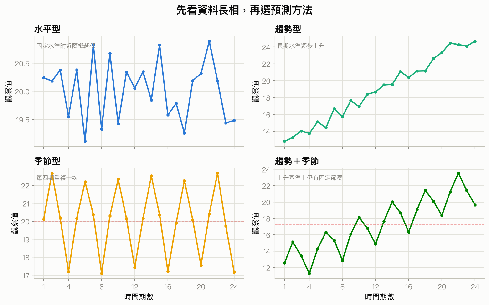

你該注意什麼：水平型的中心大致固定；趨勢型的基準水準逐期移動；季節型在固定週期重複；趨勢加季節則是移動的基準上仍保留固定節奏。圖為示意資料。

#### 2.1 水平型與定態

**水平型(horizontal pattern)** 表示觀察值在固定平均水準附近隨機起伏。投影片的 Gasoline 資料有 12 週銷量，平均為 19.25 千加侖，雖然每週不同，中心沒有明顯上升或下降。

**定態時間數列(stationary time series)** 至少要求資料生成過程的平均數與變異不隨時間改變。定態通常畫出水平型，但只看到水平外觀不能證明定態。例如第 13 週簽下新合約後，平均銷量整段上移；前後各自看似水平，合起來卻不是固定平均。

**定性意義：** 水平型不是「每期都差不多」而是「沒有可辨認的方向或固定節奏，剩下主要是中心附近的雜訊」。若水準突然移動，長期平均雖然很平滑，卻會把舊制度的資料拖進新制度，反應太慢。

#### 2.2 線性與非線性趨勢

<!-- exam-question-links:start -->
> **對應考古題：** Ch17 選擇題 [7](#exam-ch17-mc-7)
<!-- exam-question-links:end -->

<a id="section-ch17-trend-patterns"></a>

**趨勢(trend)** 是長期水準逐步上升或下降。投影片 Bicycle 銷量 10 年間整體上升，適合先檢查線性趨勢；Cholesterol 藥品收入的增幅愈來愈大，較像二次或指數趨勢。

- 線性趨勢：每期大致增加或減少固定量。
- 指數趨勢：每期大致乘上固定倍率，也就是百分比變化較穩定。
- 二次趨勢：每期的增減量本身逐漸改變，可呈現加速、減速或轉折。

趨勢是描述歷史平均路徑，不是保證未來永遠沿同一方向。藥品可能遇到專利到期，人口成長也可能停滯；遠期外推尤其需要商業判斷。

#### 2.3 季節、趨勢加季節與循環

<!-- exam-question-links:start -->
> **對應考古題：** Ch17 選擇題 [4](#exam-ch17-mc-4)、[5](#exam-ch17-mc-5)、[6](#exam-ch17-mc-6)、[10](#exam-ch17-mc-10)、[21](#exam-ch17-mc-21)
<!-- exam-question-links:end -->

<a id="section-ch17-seasonal-cyclical"></a>

**季節型(seasonal pattern)** 是固定週期內重複的節奏，不必真的與四季有關。每週餐廳銷量、一天內交通流量、每季雨傘銷售都可能有季節性。投影片 Umbrella 資料每年第二季最高、第四季最低，且沒有明顯長期趨勢。

Smartphone 資料同時具有上升趨勢與季度節奏：每年的第二季偏低，第三、四季偏高。此時只用水平平滑會把趨勢當誤差，只用趨勢線又會把固定季節落差當誤差。

**循環型(cyclical pattern)** 指觀察值在趨勢線上下形成持續超過一年的長段落，常與景氣循環有關。循環週期不固定、資料需求很長，也很難預測，因此本章只辨認，不估計獨立循環模型。

| 型態 | 重複尺度 | 規律性 | 本章主要方法 |
|---|---|---|---|
| 季節 | 一年內或其他固定短週期 | 週期通常固定 | 季節虛擬變數、季節指數 |
| 循環 | 多年 | 長度與幅度常改變 | 通常併入趨勢循環，不單獨預測 |
| 不規則 | 無固定週期 | 突發、不可預期 | 視為預測誤差的一部分 |

### 3. 預測誤差與準確度

<!-- exam-question-links:start -->
> **對應考古題：** Ch17 選擇題 [3](#exam-ch17-mc-3)；Ch17 計算題 [9](#exam-ch17-problem-9)、[10](#exam-ch17-problem-10)
<!-- exam-question-links:end -->

投影片第 17 頁先用最簡單的**樸素法(naive method)** ：下一期預測等於最近一期實際值。

<a id="formula-ch17-naive-forecast"></a>

**樸素預測與用途** ：作為最基本的短期預測基準。

$$
F_{t+1}=Y_t
$$

$Y_t$ 是第 $t$ 期實際值，$F_{t+1}$ 是第 $t+1$ 期預測值。它等同一階移動平均，也等同 $\alpha=1$ 的單一指數平滑。若複雜方法連樸素法都贏不了，複雜度未必值得。

<a id="formula-ch17-forecast-error"></a>

**預測誤差(forecast error)與用途** ：量第 $t$ 期實際值與先前預測的差。

$$
e_t=Y_t-F_t
$$

| 符號 | 意義 | 單位 |
|---|---|---|
| $Y_t$ | 第 $t$ 期實際值 | 與原資料相同 |
| $F_t$ | 在看到第 $t$ 期實際值前做出的預測 | 與原資料相同 |
| $e_t$ | 預測誤差 | 與原資料相同 |

$e_t>0$ 表示實際值高於預測，也就是低估；$e_t<0$ 表示高估。誤差方向很重要，但若直接平均，正負可能抵銷，所以要再用 MAE、MSE 或 MAPE。

#### 3.1 MAE：典型錯幾個原單位

<!-- exam-question-links:start -->
> **對應考古題：** Ch17 計算題 [8](#exam-ch17-problem-8)
<!-- exam-question-links:end -->

<a id="formula-ch17-mae"></a>

$$
MAE=\frac{\sum_{t=k+1}^{n}|e_t|}{n-k}
$$

$n$ 是總期數，$k$ 是建立第一個預測前需要的歷史期數，$n-k$ 是真正有預測誤差的期數。MAE 與原資料同單位，容易解讀。Gasoline 樸素法有 11 個誤差，絕對誤差總和 41，因此 $MAE=41/11=3.73$ 千加侖。

#### 3.2 MSE：特別不容忍大錯

<!-- exam-question-links:start -->
> **對應考古題：** Ch17 選擇題 [11](#exam-ch17-mc-11)、[28](#exam-ch17-mc-28)；Ch17 計算題 [7](#exam-ch17-problem-7)、[8](#exam-ch17-problem-8)
<!-- exam-question-links:end -->

<a id="formula-ch17-mse"></a>

$$
MSE=\frac{\sum_{t=k+1}^{n}e_t^2}{n-k}
$$

MSE 把大誤差平方，所以少數嚴重失準會有很大影響。Gasoline 的平方誤差總和 179，故 $MSE=179/11=16.27$ 平方千加侖。

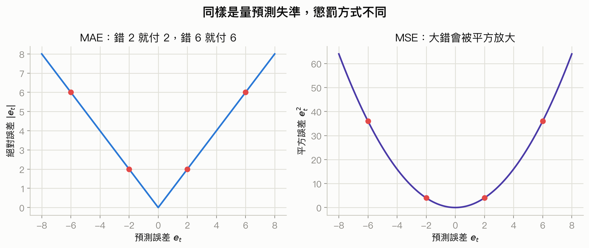

你該注意什麼：MAE 回答一般一期大約錯多少；MSE 更像對重大失準收取高額罰金。不能只因 MSE 數字較大就說模型較差，因為 MSE 的單位已平方。

#### 3.3 MAPE：把失準換成相對百分比

<a id="formula-ch17-mape"></a>

$$
MAPE=\frac{1}{n-k}\sum_{t=k+1}^{n}\left|\frac{e_t}{Y_t}\right|100\%
$$

MAPE 沒有原單位，較適合比較不同量級的數列。Gasoline 的絕對百分比誤差總和 211.69%，故 $MAPE=19.24\%$。

MAPE 的限制是 $Y_t=0$ 時無法計算，$Y_t$ 很接近 0 時比例會爆大，而且正負實際值也會讓商業解讀不自然。此時優先用 MAE、MSE 或另選尺度。

**定性意義：** 三個指標都只量「在已知歷史上重現得多好」。MAE 小代表一般期數的絕對失準較小；MSE 小代表大錯較少或較不嚴重；MAPE 小代表相對於各期規模的誤差較小。它們都不能證明未來準確，更不能把樣本內最佳誤說成資料生成機制永遠不變。

投影片第 21 頁比較 Gasoline 的樸素法與「所有過去值平均」：後者的 MAE、MSE、MAPE 都較小。但若第 13 週水準突然上移，所有歷史平均會反應很慢，樸素法反而更快貼近新水準。準確度與適應結構改變要一起看。

### 4. 水平型資料的三種平滑法

投影片第 22 頁指出，移動平均、加權移動平均與單一指數平滑適合沒有明顯趨勢、循環或季節效果的水平型資料，尤其適合下一期的短期預測。

#### 4.1 移動平均

<!-- exam-question-links:start -->
> **對應考古題：** Ch17 選擇題 [13](#exam-ch17-mc-13)；Ch17 計算題 [16](#exam-ch17-problem-16)、[21](#exam-ch17-problem-21)
<!-- exam-question-links:end -->

<a id="formula-ch17-moving-average"></a>

**$k$ 期移動平均(moving average)與用途** ：用最近 $k$ 個實際值的平均預測下一期。

$$
F_{t+1}=\frac{Y_t+Y_{t-1}+\cdots+Y_{t-k+1}}{k}
$$

| 符號 | 意義 |
|---|---|
| $F_{t+1}$ | 第 $t+1$ 期預測 |
| $Y_t$ | 最近一期實際值 |
| $k$ | 納入平均的最近期數 |

Gasoline 的三週移動平均對第 4 週預測為 $(17+21+19)/3=19$。新資料到來後，丟掉最舊一期並加入最新一期，所以視窗會向前移動。

- $k$ 小：反應快，但保留較多短期雜訊。
- $k$ 大：曲線平滑，但遇到水準改變時落後較久。

投影片的三週移動平均得到 $MAE=2.67$、$MSE=10.22$、$MAPE=14.36\%$；試算不同 $k$ 後，$k=6$ 的歷史 MSE 可降到 6.79。這只是該段歷史的最佳值，不是永久最適。

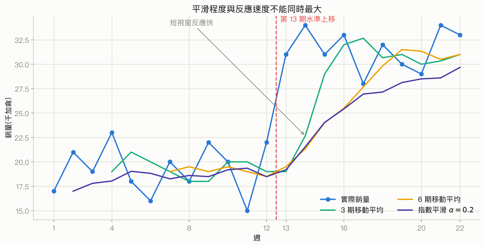

你該注意什麼：平滑越強，隨機起伏越少，但水準真的改變時也越慢追上。這是雜訊過濾和結構反應的根本取捨；圖使用投影片 Gasoline 22 週資料。

#### 4.2 加權移動平均

<!-- exam-question-links:start -->
> **對應考古題：** Ch17 計算題 [2](#exam-ch17-problem-2)、[3](#exam-ch17-problem-3)、[4](#exam-ch17-problem-4)
<!-- exam-question-links:end -->

<a id="formula-ch17-weighted-moving-average"></a>

$$
F_{t+1}=w_tY_t+w_{t-1}Y_{t-1}+\cdots+w_{t-k+1}Y_{t-k+1}
$$

權重必須非負且總和為 1。若最近資料更能代表未來，就給近期較大權重；若數列隨機起伏很大，權重太集中反而容易追著雜訊跑。

Gasoline 三週權重取 $3/6,2/6,1/6$，最近一期最大，則第 4 週預測為：

$$
F_4=\frac{3}{6}(19)+\frac{2}{6}(21)+\frac{1}{6}(17)=19.33
$$

權重 5、3、2 若未正規化，計算時要除以總和 10；不能直接把加權總和當預測。

#### 4.3 單一指數平滑

<!-- exam-question-links:start -->
> **對應考古題：** Ch17 選擇題 [2](#exam-ch17-mc-2)、[3](#exam-ch17-mc-3)、[14](#exam-ch17-mc-14)、[24](#exam-ch17-mc-24)、[27](#exam-ch17-mc-27)；Ch17 計算題 [5](#exam-ch17-problem-5)、[6](#exam-ch17-problem-6)、[7](#exam-ch17-problem-7)、[16](#exam-ch17-problem-16)、[22](#exam-ch17-problem-22)、[24](#exam-ch17-problem-24)
<!-- exam-question-links:end -->

<a id="formula-ch17-exponential-smoothing"></a>

**單一指數平滑(single exponential smoothing)與用途** ：只選一個平滑常數，自動讓愈久以前的資料權重呈指數衰減。

$$
F_{t+1}=\alpha Y_t+(1-\alpha)F_t,\qquad 0\le\alpha\le1
$$

| 符號 | 意義 |
|---|---|
| $\alpha$ | 給最新實際值的權重 |
| $1-\alpha$ | 給上一期預測的權重 |
| $F_t$ | 第 $t$ 期原先預測 |

通常令第一期預測等於第一期實際值，因此 $F_2=Y_1$。Gasoline 使用 $\alpha=0.2$ 時：

$$
F_3=0.2(21)+0.8(17)=17.80
$$

$$
F_4=0.2(19)+0.8(17.80)=18.04
$$

將遞迴式展開，可見 $F_4=\alpha Y_3+\alpha(1-\alpha)Y_2+(1-\alpha)^2Y_1$。愈久以前的資料仍有影響，但權重按 $(1-\alpha)$ 逐期縮小。

<a id="formula-ch17-exponential-error-correction"></a>

同一公式也可寫成誤差修正式：

$$
F_{t+1}=F_t+\alpha(Y_t-F_t)=F_t+\alpha e_t
$$

**定性意義：** $\alpha$ 是「這次失準要立刻修正多少」。$\alpha$ 大，模型相信最近誤差代表水準真的變了，反應快但容易跟著雜訊擺動；$\alpha$ 小，模型把最近誤差多半當雜訊，較穩但較慢。$\alpha=1$ 就是樸素法，$\alpha=0$ 則永遠不更新。

選 $\alpha$ 時可比較歷史 MSE。投影片 Gasoline 在 $\alpha=0.2$ 下的歷史 MSE 小於 $\alpha=0.3$；這不是說 0.2 普遍較好，而是這段數列的平滑取捨。

### 5. 趨勢投影

#### 5.1 線性趨勢迴歸

<!-- exam-question-links:start -->
> **對應考古題：** Ch17 選擇題 [8](#exam-ch17-mc-8)、[15](#exam-ch17-mc-15)、[25](#exam-ch17-mc-25)、[26](#exam-ch17-mc-26)、[30](#exam-ch17-mc-30)、[34](#exam-ch17-mc-34)；Ch17 計算題 [1](#exam-ch17-problem-1)、[14](#exam-ch17-problem-14)、[15](#exam-ch17-problem-15)、[18](#exam-ch17-problem-18)、[19](#exam-ch17-problem-19)、[25](#exam-ch17-problem-25)、[27](#exam-ch17-problem-27)
<!-- exam-question-links:end -->

<a id="formula-ch17-linear-trend"></a>

$$
T_t=b_0+b_1t
$$

| 符號 | 意義 | 單位 |
|---|---|---|
| $T_t$ | 第 $t$ 期的趨勢預測 | 與 $Y$ 相同 |
| $b_0$ | $t=0$ 時趨勢線截距 | 與 $Y$ 相同 |
| $b_1$ | 每過一期，平均趨勢改變量 | $Y$ 單位／期 |
| $t$ | 時間期數 | 月、季、年等 |

<a id="formula-ch17-linear-trend-coefficients"></a>

$$
b_1=\frac{\sum_{t=1}^{n}(t-\bar t)(Y_t-\bar Y)}{\sum_{t=1}^{n}(t-\bar t)^2},\qquad
b_0=\bar Y-b_1\bar t
$$

這就是第 14 章最小平方斜率，只是把自變數明確指定為時間。Bicycle 的 $\bar t=5.5$、$\bar Y=26.45$、交叉離差和 90.75、時間平方離差和 82.50，所以 $b_1=1.10$、$b_0=20.40$：

$$
T_t=20.4+1.10t
$$

$T_{11}=32.5$，即下一年預測 32.5 千輛；斜率表示歷史上每年平均增加 1.1 千輛。

**MSE 分母提醒：** 預測課程把趨勢線在 $n$ 期的平方誤差平均寫成 $SSE/n$；一般迴歸輸出估計誤差變異時則用 $SSE/(n-2)$。兩者目的不同，數字不能混抄。Bicycle 的預測 MSE 是 $30.70/10=3.07$，迴歸 ANOVA 的 MSE 則是 $30.70/8=3.8375$。

**定性意義：** $b_1$ 量長期水準每期平均移動多少，不代表每一期都剛好增加 $b_1$。資料點在趨勢線上下的散布是短期波動；斜率愈大只表示歷史平均方向更陡，不表示預測更穩，也不表示時間造成 $Y$ 改變。

#### 5.2 二次與指數趨勢

<a id="formula-ch17-quadratic-trend"></a>

$$
T_t=b_0+b_1t+b_2t^2
$$

二次項允許邊際變化 $b_1+2b_2t$ 隨時間改變。Cholesterol 例題得到：

$$
\widehat{Revenue}=24.18-2.11Year+0.922Year^2
$$

$R^2=98.12\%$，平方項 p 值 0.001，但一次項 p 值 0.317。保留一次項是為了模型階層與曲線形狀，不應只因一次項不顯著就刪除。

<a id="formula-ch17-exponential-trend"></a>

$$
T_t=b_0e^{b_1t}
$$

取自然對數後：

$$
\ln(T_t)=\ln(b_0)+b_1t
$$

投影片的 Cholesterol 指數趨勢為 $T_t=16.71e^{0.1697t}$。$e^{0.1697}\approx1.185$，表示趨勢每期約乘 1.185，也就是約成長 18.5%，不是每期增加固定 0.1697 個原單位。

二次與指數模型都能配出彎曲，但遠期外推差異巨大。二次曲線可能轉折，指數曲線則持續按比例爆發；應依資料機制、殘差與合理範圍選擇，不能只看樣本內 $R^2$。

### 6. 用虛擬變數表示季節

#### 6.1 只有季節、沒有趨勢

季度有四個類別，保留截距時只需要三個虛擬變數，第四季作參考組。

<a id="formula-ch17-seasonal-dummy"></a>

$$
\widehat Y_t=b_0+b_1Qtr1_t+b_2Qtr2_t+b_3Qtr3_t
$$

Umbrella 例題得到：

$$
\widehat Y_t=95+29Qtr1_t+57Qtr2_t+26Qtr3_t
$$

因此四季預測為 124、152、121、95，恰好等於各季五年平均。$b_0=95$ 是第四季平均；$b_2=57$ 表示第二季平均比第四季高 57，不是第二季預測只有 57。

月資料有 12 個月份，需 11 個虛擬變數；全為 0 的月份是參考月。不能放 12 個月份虛擬變數又保留截距，否則發生完全共線性。

#### 6.2 季節加線性趨勢

<a id="formula-ch17-seasonal-trend-dummy"></a>

$$
\widehat Y_t=b_0+b_1Qtr1_t+b_2Qtr2_t+b_3Qtr3_t+b_4t
$$

Smartphone 例題的正確方程式是：

$$
\widehat{Sales}=6.069-1.363Qtr1-2.034Qtr2-0.304Qtr3+0.1456t
$$

投影片第 46 頁把三個季節欄名都印成 Qtr1，並把第四季誤寫成 Qtr5；由第 44 頁模型、代入的 0-1 編碼及 11e 課本輸出可確認應為 Qtr1、Qtr2、Qtr3 與 Qtr4。

令 $t=17,18,19,20$，得到第 5 年四季預測約 7.18、6.66、8.53、8.98 千支。$b_4=0.1456$ 表示控制固定季度效果後，每季平均上升約 146 支；三個季節係數則是同一時間趨勢下相對第四季的固定差。

**定性意義：** 加法季節模型假設季節差是固定原單位，例如第二季永遠比第四季少約 2.034 千支。若水準愈高、季節振幅也按比例變大，固定差就不適合，應考慮乘法分解。

### 7. 時間數列分解

<!-- exam-question-links:start -->
> **對應考古題：** Ch17 選擇題 [12](#exam-ch17-mc-12)、[22](#exam-ch17-mc-22)；Ch17 計算題 [26](#exam-ch17-problem-26)、[28](#exam-ch17-problem-28)
<!-- exam-question-links:end -->

<a id="section-ch17-decomposition"></a>

分解的目標不只是預測，也是把「長期水準」「固定季節倍率」與「剩餘不規則波動」拆開，避免把正常淡旺季誤判成景氣轉折。

<a id="formula-ch17-additive-decomposition"></a>

加法分解適合季節振幅大致固定：

$$
Y_t=Trend_t+Seasonal_t+Irregular_t
$$

<a id="formula-ch17-multiplicative-decomposition"></a>

投影片聚焦乘法分解：

$$
Y_t=Trend_t\times Seasonal_t\times Irregular_t
$$

$Trend_t$ 用原單位；$Seasonal_t$ 與 $Irregular_t$ 是相對倍率。季節指數 1.14 表示該季通常比趨勢高 14%，0.84 表示通常比趨勢低 16%。它不是增加 1.14 個單位。

#### 7.1 四期中央移動平均

<!-- exam-question-links:start -->
> **對應考古題：** Ch17 選擇題 [16](#exam-ch17-mc-16)、[17](#exam-ch17-mc-17)、[23](#exam-ch17-mc-23)
<!-- exam-question-links:end -->

季度資料先算四期移動平均，但第一個四期平均位在 $t=2.5$，第二個位在 $t=3.5$。再平均兩者，才會對準整數期 $t=3$。

<a id="formula-ch17-centered-moving-average"></a>

$$
CMA_t=\frac{Y_{t-2}+2Y_{t-1}+2Y_t+2Y_{t+1}+Y_{t+2}}{8}
$$

這等同相鄰兩個四期移動平均再取平均。Smartphone 第一個 $MA_4=5.35$，第二個 $MA_4=5.60$，所以 $CMA_3=(5.35+5.60)/2=5.475$。

<a id="formula-ch17-seasonal-irregular"></a>

$$
\frac{Y_t}{CMA_t}\approx Seasonal_t\times Irregular_t
$$

第 3 期為 $6.0/5.475=1.096$，表示該期比平滑趨勢高約 9.6%，其中混合了第三季固定效果與該年不規則波動。

#### 7.2 季節指數與去季節化

<!-- exam-question-links:start -->
> **對應考古題：** Ch17 選擇題 [18](#exam-ch17-mc-18)；Ch17 計算題 [20](#exam-ch17-problem-20)、[29](#exam-ch17-problem-29)、[30](#exam-ch17-problem-30)、[31](#exam-ch17-problem-31)
<!-- exam-question-links:end -->

<a id="formula-ch17-seasonal-index"></a>

同一季跨年平均季節不規則比，可讓正負不規則波動互相淡化：

$$
S_q=\operatorname{average}\left(\frac{Y_t}{CMA_t}:t\text{ 屬於季 }q\right)
$$

Smartphone 四季指數約為 0.93、0.84、1.09、1.14，總和約為 4。若因四捨五入或樣本造成總和不是 4，可乘上 $4/\sum S_q$ 做正規化。

<a id="formula-ch17-deseasonalize"></a>

$$
Deseasonalized_t=\frac{Y_t}{S_q}
$$

去季節化不是刪除某些季節資料，而是把旺季除以大於 1 的倍率、淡季除以小於 1 的倍率，全部換回共同基準。如此看長期變化時，不會因「本月本來就是淡季」而誤判衰退。

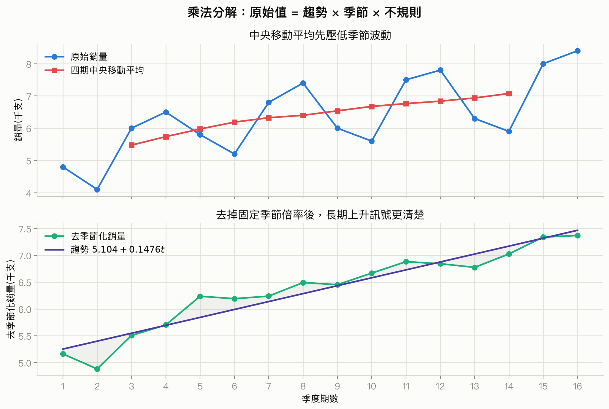

你該注意什麼：上圖的中央移動平均先壓低季度節奏；下圖除去固定季節倍率後，線性趨勢更清楚。資料來自投影片 Smartphone 例題。

去季節化資料的趨勢線為：

$$
\widehat{Deseasonalized\ Sales}=5.104+0.1476t
$$

第 17 至 20 期的去季節化趨勢預測為 7.613、7.761、7.908、8.056 千支。

<a id="formula-ch17-reseasonalize"></a>

最後把趨勢預測乘回各季指數：

$$
Forecast_t=TrendForecast_t\times S_q
$$

例如第 19 期是第三季，$7908(1.09)=8620$ 支。四季完整預測約為 7080、6519、8620、9184 支。

**定性意義：** 分解是在問「觀察值偏高，是因長期基準變高、這季本來就旺，還是一次性事件？」季節指數愈偏離 1，固定季節節奏愈強；去季節化後若點仍沿趨勢緊密排列，長期訊號相對清楚。這仍不表示不規則成分消失，也不保證季節倍率未來不變。

#### 7.3 簡化季節指數

<!-- exam-question-links:start -->
> **對應考古題：** Ch17 計算題 [11](#exam-ch17-problem-11)、[12](#exam-ch17-problem-12)、[13](#exam-ch17-problem-13)
<!-- exam-question-links:end -->

考古題有些只給每季三年資料並直接提供趨勢式，未要求中央移動平均。此時採每季平均除以全體平均：

<a id="formula-ch17-simple-seasonal-index"></a>

$$
S_q=\frac{\text{第 }q\text{ 季跨年平均}}{\text{所有觀察值總平均}}
$$

這適合題目明確採簡化法、且趨勢影響不強的情況。若數列有明顯趨勢，應優先用中央移動平均的 ratio-to-moving-average 方法，否則前後年份的水準差可能混進季節指數。

### 8. 本章方法選擇流程

<!-- exam-question-links:start -->
> **對應考古題：** Ch17 選擇題 [9](#exam-ch17-mc-9)、[19](#exam-ch17-mc-19)、[31](#exam-ch17-mc-31)、[32](#exam-ch17-mc-32)、[33](#exam-ch17-mc-33)、[35](#exam-ch17-mc-35)、[36](#exam-ch17-mc-36)、[37](#exam-ch17-mc-37)；Ch17 計算題 [23](#exam-ch17-problem-23)
<!-- exam-question-links:end -->

<a id="compare-ch17-forecast-methods"></a>
<a id="compare-ch17-method-selection"></a>

1. 先畫圖，確認時間間隔與型態。
2. 水平、無季節：移動平均、加權移動平均或單一指數平滑。
3. 線性趨勢：時間趨勢迴歸。
4. 彎曲趨勢：有機制支持時用二次或指數趨勢。
5. 固定季節差：季節虛擬變數的加法模型。
6. 季節振幅隨水準按比例放大：乘法分解。
7. 用相同歷史評估期間比較 MAE、MSE 或 MAPE，再檢查結構改變與外推風險。

### 9. 把數字翻成真實意義

| 數字或關係 | 變大或變小代表什麼 | 資料世界的意義 | 不能直接推論 |
|---|---|---|---|
| $|e_t|$ | 愈大表示該期預測離實際愈遠 | 單期失準幅度 | 方法未來一定不好 |
| MAE | 愈小表示一般期的原單位失準較小 | 典型預測偏離 | 沒有重大尾端風險 |
| MSE | 愈大常由少數大錯或普遍失準造成 | 對大錯更敏感 | 可與不同尺度資料直接比 |
| MAPE | 愈小表示相對規模失準較小 | 跨量級較易比較 | 實際值接近 0 時仍可靠 |
| $k$ | 愈大，移動平均愈平滑 | 更多舊資料共同決定目前水準 | 反應一定更好 |
| $\alpha$ | 愈大，愈重視最近實際值 | 對水準改變反應快，也較容易追雜訊 | 愈大必然愈準 |
| $b_1$ | 絕對值愈大，長期水準每期移動愈快 | 歷史平均趨勢較陡 | 時間造成結果改變 |
| $S_q$ | 離 1 愈遠，該季相對趨勢的倍率愈強 | 固定淡旺季節奏較明顯 | 每一年都精確乘同一倍率 |
| CMA | 愈平滑，短期季節與雜訊被壓得愈多 | 提取較慢移動的趨勢循環 | 已完全消除所有不規則波動 |

## 跟前面像的東西怎麼分

### 比較 1：一般移動平均 vs 中央移動平均

<!-- exam-question-links:start -->
> **對應考古題：** Ch17 計算題 [17](#exam-ch17-problem-17)
<!-- exam-question-links:end -->

<a id="compare-ch17-ma-vs-cma"></a>

| 方法 | 要回答的問題 | 能否拿來即時預測下一期 |
|---|---|---|
| [一般移動平均](#formula-ch17-moving-average) | 用最近 $k$ 期預測下一期 | 可以，只用過去資料 |
| [中央移動平均](#formula-ch17-centered-moving-average) | 對齊週期中心，估計歷史趨勢以拆季節 | 不可以直接即時預測，因為用到 $t$ 後面的資料 |

**一句話判斷準則：** 題目說 forecast next period，用尾端移動平均；題目說 decomposition 或 centered moving average，用中央移動平均。

**容易誤選情境：** 用未來兩季資料計算第 $t$ 季的 CMA，再宣稱那是當時可做出的預測。CMA 是歷史分解工具，不是當時的即時預測。

### 比較 2：單一指數平滑 vs 線性趨勢

| 方法 | 適合型態 | 核心參數 |
|---|---|---|
| [單一指數平滑](#formula-ch17-exponential-smoothing) | 水平型，沒有明顯趨勢與季節 | $\alpha$ 控制反應速度 |
| [線性趨勢](#formula-ch17-linear-trend) | 長期水準每期大致固定量移動 | $b_1$ 是每期平均變化 |

**一句話判斷準則：** 中心固定但有隨機起伏用單一平滑；中心本身持續移動用趨勢。

**容易誤選情境：** 銷量每年穩定成長，卻用很小 $\alpha$ 的單一平滑；預測會一直落後趨勢。

### 比較 3：時間趨勢迴歸 vs 因果迴歸

| 方法 | 自變數 | 能回答什麼 |
|---|---|---|
| [時間趨勢迴歸](#formula-ch17-linear-trend) | 時間 $t$ | 歷史平均路徑如何移動 |
| [複迴歸](#formula-multiple-regression-model) | 價格、廣告、所得等 | 控制其他欄位後的條件關聯與預測 |

**一句話判斷準則：** 只用期數延伸歷史形狀是時間趨勢；用外部解釋變數預測是因果型迴歸框架。

**容易誤選情境：** 銷售與時間一起上升，就說「時間造成銷售」。時間只是趨勢索引，真正機制可能是人口、價格或技術。

### 比較 4：季節虛擬變數 vs 乘法分解

| 方法 | 季節效果形式 | 最適資料長相 |
|---|---|---|
| [季節加趨勢迴歸](#formula-ch17-seasonal-trend-dummy) | 固定原單位差 | 不同年份季節振幅約相同 |
| [乘法分解](#formula-ch17-multiplicative-decomposition) | 固定相對倍率 | 水準愈高，季節振幅也按比例變大 |

**一句話判斷準則：** 旺季永遠多固定數量用加法；旺季永遠高固定百分比用乘法。

**容易誤選情境：** 銷量從 100 成長到 1000，旺季落差也從 20 放大到 200，卻用固定加 20 的虛擬變數模型。

### 比較 5：時間數列預測 vs Durbin-Watson 殘差診斷

| 方法 | 目標 | 輸入 |
|---|---|---|
| 本章平滑、趨勢與分解 | 直接建立未來 $Y_t$ 的預測 | 歷史時間數列 |
| [第 16 章 Durbin-Watson](#formula-durbin-watson) | 檢查迴歸殘差是否有一階自相關 | 按時間排序的殘差 |

**一句話判斷準則：** 要產生預測用本章模型；要檢查既有迴歸是否留下連續同號誤差，才用 DW。

**容易誤選情境：** 看到月份資料就直接算 DW，卻還沒有先配適模型與取得殘差。DW 檢查的是殘差連續性，不是原始銷量有沒有趨勢。

## 考古題與詳解

題本內頁標為 Chapter 18，但課程投影片封面標為第 17 章；以下依本課程章次收錄，同時忠實保留原題中的 Exhibit 18-x 名稱。題本共 37 題選擇題與 31 題 Problem。

### 選擇題｜第 1–37 題

#### 選擇題 1 <a id="exam-ch17-mc-1"></a>

##### 題目

> Which of the following is not present in a time series?
>
> a. seasonality<br>
> b. operational variations<br>
> c. trend<br>
> d. cycles

##### 詳解

<!-- exam-theory-links:start -->
> **回看講義：** [2. 時間數列型態：先看資料長相](#section-ch17-patterns)
<!-- exam-theory-links:end -->

1. **辨認題型：** 時間數列組成辨識。
2. **選方法：** 依[時間數列型態](#section-ch17-patterns)分辨標準成分。
3. **檢查假設：** 問的是課本標準術語，不需數值假設。
4. **代入計算／推理：** trend、seasonality、cycles 都是標準成分；operational variations 不是。
5. **解讀結論：** 答案是 **b** 。a 是固定週期，c 是長期方向，d 是多年循環；b 只是一般文字，不是本章成分名稱。

#### 選擇題 2 <a id="exam-ch17-mc-2"></a>

##### 題目

> Given an actual demand of 61, forecast of 58, and an $\alpha$ of .3, what would the forecast for the next period be using simple exponential smoothing?
>
> a. 57.1<br>
> b. 58.9<br>
> c. 61.0<br>
> d. 65.5

##### 詳解

<!-- exam-theory-links:start -->
> **回看講義：** [4.3 單一指數平滑](#formula-ch17-exponential-smoothing)
<!-- exam-theory-links:end -->

1. **辨認題型：** 單一指數平滑更新。
2. **選方法：** 使用[指數平滑公式](#formula-ch17-exponential-smoothing)。
3. **檢查假設：** $0\le0.3\le1$，且 61 是本期實際值、58 是本期預測。
4. **代入計算／推理：** $F_{t+1}=0.3(61)+0.7(58)=58.9$。
5. **解讀結論：** 答案是 **b** 。a 把修正方向弄反；c 等同只看實際值；d 超出兩個輸入的加權平均範圍。

#### 選擇題 3 <a id="exam-ch17-mc-3"></a>

##### 題目

> Which of the following smoothing constants would make an exponential smoothing forecast equivalent to a naive forecast?
>
> a. 0<br>
> b. 1 divided by the number of periods<br>
> c. 0.5<br>
> d. 1.0

##### 詳解

<!-- exam-theory-links:start -->
> **回看講義：** [3. 預測誤差與準確度](#formula-ch17-naive-forecast)、[4.3 單一指數平滑](#formula-ch17-exponential-smoothing)
<!-- exam-theory-links:end -->

1. **辨認題型：** 指數平滑與樸素法的邊界關係。
2. **選方法：** 比較[樸素法](#formula-ch17-naive-forecast)與[指數平滑](#formula-ch17-exponential-smoothing)。
3. **檢查假設：** 樸素法要令下一期等於最新實際值。
4. **代入計算／推理：** $\alpha=1$ 時，$F_{t+1}=Y_t$。
5. **解讀結論：** 答案是 **d** 。a 完全不更新；b 不是必要關係；c 仍混合舊預測。

#### 選擇題 4 <a id="exam-ch17-mc-4"></a>

##### 題目

> The time series component which reflects a regular, multi-year pattern of being above and below the trend line is
>
> a. a trend<br>
> b. seasonal<br>
> c. cyclical<br>
> d. irregular

##### 詳解

<!-- exam-theory-links:start -->
> **回看講義：** [2.3 季節、趨勢加季節與循環](#section-ch17-seasonal-cyclical)
<!-- exam-theory-links:end -->

1. **辨認題型：** 多年上下波動的名稱。
2. **選方法：** 依[季節與循環比較](#section-ch17-seasonal-cyclical)。
3. **檢查假設：** 關鍵字是 multi-year 且圍繞趨勢線。
4. **代入計算／推理：** 這是 cyclical component。
5. **解讀結論：** 答案是 **c** 。a 是長期方向；b 通常是一年內固定週期；d 是無規律突發。

#### 選擇題 5 <a id="exam-ch17-mc-5"></a>

##### 題目

> The time series component that reflects variability during a single year is called
>
> a. a trend<br>
> b. seasonal<br>
> c. cyclical<br>
> d. irregular

##### 詳解

<!-- exam-theory-links:start -->
> **回看講義：** [2.3 季節、趨勢加季節與循環](#section-ch17-seasonal-cyclical)
<!-- exam-theory-links:end -->

1. **辨認題型：** 一年內固定節奏。
2. **選方法：** 使用[季節型定義](#section-ch17-seasonal-cyclical)。
3. **檢查假設：** 題意是可重複的一年內變動。
4. **代入計算／推理：** 對應 seasonal component。
5. **解讀結論：** 答案是 **b** 。a 不要求一年重複；c 跨多年；d 無固定節奏。

#### 選擇題 6 <a id="exam-ch17-mc-6"></a>

##### 題目

> The time series component that reflects variability due to natural disasters is called
>
> a. a trend<br>
> b. seasonal<br>
> c. cyclical<br>
> d. irregular

##### 詳解

<!-- exam-theory-links:start -->
> **回看講義：** [2.3 季節、趨勢加季節與循環](#section-ch17-seasonal-cyclical)
<!-- exam-theory-links:end -->

1. **辨認題型：** 突發事件成分。
2. **選方法：** 對照[不規則成分](#section-ch17-seasonal-cyclical)。
3. **檢查假設：** 天災不是固定週期，也不是可延伸趨勢。
4. **代入計算／推理：** 應歸為 irregular。
5. **解讀結論：** 答案是 **d** 。a、b、c 都暗示某種可辨認規律，與突發天災不符。

#### 選擇題 7 <a id="exam-ch17-mc-7"></a>

##### 題目

> The time series component that reflects gradual variability over a long time period is called
>
> a. a trend<br>
> b. seasonal<br>
> c. cyclical<br>
> d. irregular

##### 詳解

<!-- exam-theory-links:start -->
> **回看講義：** [2.2 線性與非線性趨勢](#section-ch17-trend-patterns)
<!-- exam-theory-links:end -->

1. **辨認題型：** 長期逐步移動。
2. **選方法：** 對照[趨勢型](#section-ch17-trend-patterns)。
3. **檢查假設：** 關鍵是 gradual 與 long time period，不是上下循環。
4. **代入計算／推理：** 對應 trend。
5. **解讀結論：** 答案是 **a** 。b 是固定短週期；c 是多年在趨勢上下交替；d 無規則。

#### 選擇題 8 <a id="exam-ch17-mc-8"></a>

##### 題目

> The trend component is easy to identify by using
>
> a. moving averages<br>
> b. exponential smoothing<br>
> c. regression analysis<br>
> d. the Delphi approach

##### 詳解

<!-- exam-theory-links:start -->
> **回看講義：** [5.1 線性趨勢迴歸](#formula-ch17-linear-trend)
<!-- exam-theory-links:end -->

1. **辨認題型：** 趨勢估計工具。
2. **選方法：** 使用[線性趨勢迴歸](#formula-ch17-linear-trend)。
3. **檢查假設：** 題目問明確估計趨勢線，不只是平滑短期波動。
4. **代入計算／推理：** 把 $t$ 當自變數的 regression 可估斜率。
5. **解讀結論：** 答案是 **c** 。a、b 未修正時主要處理水平型；d 是定性預測。

#### 選擇題 9 <a id="exam-ch17-mc-9"></a>

##### 題目

> The forecasting method that is appropriate when the time series has no significant trend, cyclical, or seasonal effect is
>
> a. moving averages<br>
> b. mean squared error<br>
> c. mean average deviation<br>
> d. qualitative forecasting methods

##### 詳解

<!-- exam-theory-links:start -->
> **回看講義：** [8. 本章方法選擇流程](#compare-ch17-forecast-methods)
<!-- exam-theory-links:end -->

1. **辨認題型：** 水平型數列選方法。
2. **選方法：** 依[本章方法選擇流程](#compare-ch17-forecast-methods)。
3. **檢查假設：** 已明示無趨勢、循環與季節。
4. **代入計算／推理：** moving averages 是水平型平滑法；MSE、MAD 是誤差指標。
5. **解讀結論：** 答案是 **a** 。b、c 不會產生預測；d 通常用於歷史資料不可用。

#### 選擇題 10 <a id="exam-ch17-mc-10"></a>

##### 題目

> If data for a time series analysis is collected on an annual basis only, which component may be ignored?
>
> a. trend<br>
> b. seasonal<br>
> c. cyclical<br>
> d. irregular

##### 詳解

<!-- exam-theory-links:start -->
> **回看講義：** [2.3 季節、趨勢加季節與循環](#section-ch17-seasonal-cyclical)
<!-- exam-theory-links:end -->

1. **辨認題型：** 取樣頻率與季節成分。
2. **選方法：** 依[季節型定義](#section-ch17-seasonal-cyclical)。
3. **檢查假設：** 每年只有一筆，沒有一年內月份或季度位置。
4. **代入計算／推理：** 一年內季節差已無法在年度資料中分辨。
5. **解讀結論：** 答案是 **b** 。年度資料仍可能有趨勢、跨年循環與不規則波動。

#### 選擇題 11 <a id="exam-ch17-mc-11"></a>

##### 題目

> For the following time series, you are given the moving average forecast.

| Time Period | Time Series Value | Moving Average Forecast |
|---:|---:|---:|
| 1 | 23 |  |
| 2 | 17 |  |
| 3 | 17 |  |
| 4 | 26 | 19 |
| 5 | 11 | 20 |
| 6 | 23 | 18 |
| 7 | 17 | 20 |

> The mean squared error equals
>
> a. 0<br>
> b. 6<br>
> c. 41<br>
> d. 164

##### 詳解

<!-- exam-theory-links:start -->
> **回看講義：** [3.2 MSE：特別不容忍大錯](#formula-ch17-mse)
<!-- exam-theory-links:end -->

1. **辨認題型：** 已知預測的 MSE。
2. **選方法：** 使用[MSE](#formula-ch17-mse)。
3. **檢查假設：** 只有第 4 至 7 期共 4 個誤差。
4. **代入計算／推理：** 平方誤差為 $7^2+(-9)^2+5^2+(-3)^2=164$，故 $MSE=164/4=41$。
5. **解讀結論：** 答案是 **c** 。d 是平方誤差總和，漏除 4；a、b 都不是依表計算的結果。

#### 選擇題 12 <a id="exam-ch17-mc-12"></a>

##### 題目

> If the estimate of the trend component is 158.2, the estimate of the seasonal component is 94%, the estimate of the cyclical component is 105%, and the estimate of the irregular component is 98%, then the multiplicative model will produce a forecast of
>
> a. 1.53<br>
> b. 1.53%<br>
> c. 153.02<br>
> d. 153,020,532

##### 詳解

<!-- exam-theory-links:start -->
> **回看講義：** [7. 時間數列分解](#formula-ch17-multiplicative-decomposition)
<!-- exam-theory-links:end -->

1. **辨認題型：** 乘法分解合成。
2. **選方法：** 使用[乘法分解](#formula-ch17-multiplicative-decomposition)。
3. **檢查假設：** 百分比要換成倍率 0.94、1.05、0.98。
4. **代入計算／推理：** $158.2(0.94)(1.05)(0.98)=153.020532$。
5. **解讀結論：** 答案是 **c** 。a、b 把尺度弄錯；d 未正確把百分比換倍率。

#### 選擇題 13 <a id="exam-ch17-mc-13"></a>

##### 題目

> Below you are given the first four values of a time series.

| Time Period | Time Series Value |
|---:|---:|
| 1 | 18 |
| 2 | 20 |
| 3 | 25 |
| 4 | 17 |

> Using a 4-period moving average, the forecasted value for period 5 is
>
> a. 2.5<br>
> b. 17<br>
> c. 20<br>
> d. 10

##### 詳解

<!-- exam-theory-links:start -->
> **回看講義：** [4.1 移動平均](#formula-ch17-moving-average)
<!-- exam-theory-links:end -->

1. **辨認題型：** 四期移動平均預測。
2. **選方法：** 使用[移動平均](#formula-ch17-moving-average)。
3. **檢查假設：** 第 5 期只使用前四期。
4. **代入計算／推理：** $F_5=(18+20+25+17)/4=20$。
5. **解讀結論：** 答案是 **c** 。b 只抄最近值；a、d 都不是四期平均。

#### 選擇題 14 <a id="exam-ch17-mc-14"></a>

##### 題目

> Below you are given the first two values of a time series. You are also given the first two values of the exponential smoothing forecast.

| Time Period $(t)$ | Time Series Value $(Y_t)$ | Forecast $(F_t)$ |
|---:|---:|---:|
| 1 | 18 | 18 |
| 2 | 22 | 18 |

> If the smoothing constant equals .3, then the exponential smoothing forecast for time period three is
>
> a. 18<br>
> b. 19.2<br>
> c. 20<br>
> d. 40

##### 詳解

<!-- exam-theory-links:start -->
> **回看講義：** [4.3 單一指數平滑](#formula-ch17-exponential-smoothing)
<!-- exam-theory-links:end -->

1. **辨認題型：** 指數平滑下一期。
2. **選方法：** 使用[指數平滑](#formula-ch17-exponential-smoothing)。
3. **檢查假設：** 更新時用 $Y_2=22,F_2=18$。
4. **代入計算／推理：** $F_3=0.3(22)+0.7(18)=19.2$。
5. **解讀結論：** 答案是 **b** 。a 未更新；c 是未加權平均；d 是相加未加權。

#### 選擇題 15 <a id="exam-ch17-mc-15"></a>

##### 題目

> The following linear trend expression was estimated using a time series with 17 time periods.
>
> $$T_t=129.2+3.8t$$
>
> The trend projection for time period 18 is
>
> a. 68.4<br>
> b. 193.8<br>
> c. 197.6<br>
> d. 6.84

##### 詳解

<!-- exam-theory-links:start -->
> **回看講義：** [5.1 線性趨勢迴歸](#formula-ch17-linear-trend)
<!-- exam-theory-links:end -->

1. **辨認題型：** 線性趨勢代入。
2. **選方法：** 使用[線性趨勢](#formula-ch17-linear-trend)。
3. **檢查假設：** 下一期是 $t=18$，不是再加 18。
4. **代入計算／推理：** $T_{18}=129.2+3.8(18)=197.6$。
5. **解讀結論：** 答案是 **c** 。a 只有斜率乘期數；b 誤用 $t=17$；d 小數位錯。

<a id="quiz-ch17-exhibit-1"></a>

#### 題組 17-1：選擇題 16–17 共用資料

> Exhibit 18-1<br>
> Below you are given the first five values of a quarterly time series. The multiplicative model is appropriate and a four-quarter moving average will be used.

| Year | Quarter | Time Series Value $Y_t$ |
|---:|---:|---:|
| 1 | 1 | 36 |
| 1 | 2 | 24 |
| 1 | 3 | 16 |
| 1 | 4 | 20 |
| 2 | 1 | 44 |

#### 選擇題 16 <a id="exam-ch17-mc-16"></a>

##### 題目

> Refer to Exhibit 18-1. An estimate of the trend component times the cyclical component $(T_tC_t)$ for Quarter 3 of Year 1, when a four-quarter moving average is used, is
>
> a. 24<br>
> b. 25<br>
> c. 26<br>
> d. 28

##### 詳解

<!-- exam-theory-links:start -->
> **回看講義：** [7.1 四期中央移動平均](#formula-ch17-centered-moving-average)
<!-- exam-theory-links:end -->

1. **辨認題型：** 偶數週期中央移動平均。
2. **選方法：** 使用[中央移動平均](#formula-ch17-centered-moving-average)。
3. **檢查假設：** 兩個四期平均分別中心在 2.5 與 3.5，再平均才對準第 3 期。
4. **代入計算／推理：** $MA_1=(36+24+16+20)/4=24$，$MA_2=(24+16+20+44)/4=26$，$CMA_3=(24+26)/2=25$。
5. **解讀結論：** 答案是 **b** 。a、c 是未置中的四期平均；d 無此計算來源。

#### 選擇題 17 <a id="exam-ch17-mc-17"></a>

##### 題目

> Refer to Exhibit 18-1. An estimate of the seasonal-irregular component for Quarter 3 of Year 1 is
>
> a. .64<br>
> b. 1.5625<br>
> c. 5.333<br>
> d. 30

##### 詳解

<!-- exam-theory-links:start -->
> **回看講義：** [7.1 四期中央移動平均](#formula-ch17-seasonal-irregular)
<!-- exam-theory-links:end -->

1. **辨認題型：** 季節不規則比。
2. **選方法：** 使用[$Y_t/CMA_t$](#formula-ch17-seasonal-irregular)。
3. **檢查假設：** 第 3 期實際值 16，趨勢循環估計 25。
4. **代入計算／推理：** $16/25=0.64$。
5. **解讀結論：** 答案是 **a** 。b 是倒數；c、d 不是比例。0.64 表示該期比趨勢低約 36%。

#### 選擇題 18 <a id="exam-ch17-mc-18"></a>

##### 題目

> You are given the following information on the seasonal-irregular component values for a quarterly time series:

| Quarter | Seasonal-Irregular Component Values $(S_tI_t)$ |
|---:|---|
| 1 | 1.23, 1.15, 1.16 |
| 2 | .86, .89, .83 |
| 3 | .77, .72, .79 |
| 4 | 1.20, 1.13, 1.17 |

> The seasonal index for Quarter 1 is
>
> a. .997<br>
> b. 1.18<br>
> c. 4<br>
> d. 3

##### 詳解

<!-- exam-theory-links:start -->
> **回看講義：** [7.2 季節指數與去季節化](#formula-ch17-seasonal-index)
<!-- exam-theory-links:end -->

1. **辨認題型：** 同季跨年平均。
2. **選方法：** 使用[季節指數](#formula-ch17-seasonal-index)。
3. **檢查假設：** 只平均 Quarter 1 的三個比值。
4. **代入計算／推理：** $(1.23+1.15+1.16)/3=1.18$。
5. **解讀結論：** 答案是 **b** 。a 接近全部比值總平均；c、d 把季數或筆數當指數。1.18 表示第一季通常高於趨勢約 18%。

#### 選擇題 19 <a id="exam-ch17-mc-19"></a>

##### 題目

> Below you are given some values of a time series consisting of 26 time periods.

| Time Period | Time Series Value |
|---:|---:|
| 1 | 37 |
| 2 | 48 |
| 3 | 50 |
| 4 | 63 |
| $\vdots$ | $\vdots$ |
| 23 | 105 |
| 24 | 107 |
| 25 | 112 |
| 26 | 114 |

> The estimated regression equation for these data is
>
> $$Y_t=16.23+.52Y_{t-1}+.37Y_{t-2}$$
>
> The forecasted value for time period 27 is
>
> a. 53.23<br>
> b. 109.5<br>
> c. 116.65<br>
> d. 116.95

##### 詳解

<!-- exam-theory-links:start -->
> **回看講義：** [8. 本章方法選擇流程](#compare-ch17-method-selection)
<!-- exam-theory-links:end -->

1. **辨認題型：** 兩期落後值自我迴歸代入。
2. **選方法：** 依方程式直接使用第 26、25 期，並以[本章方法流程](#compare-ch17-method-selection)確認不是趨勢式。
3. **檢查假設：** $Y_{t-1}=114,Y_{t-2}=112$。
4. **代入計算／推理：** $16.23+0.52(114)+0.37(112)=116.95$。
5. **解讀結論：** 答案是 **d** 。a、b 漏項或索引錯；c 是算術誤差。

#### 選擇題 20 <a id="exam-ch17-mc-20"></a>

##### 題目

> A group of observations measured at successive time intervals is known as
>
> a. a trend component<br>
> b. a time series<br>
> c. a forecast<br>
> d. an additive time series model

##### 詳解

<!-- exam-theory-links:start -->
> **回看講義：** [1. 預測方法與時間數列的資料結構](#section-ch17-data-structure)
<!-- exam-theory-links:end -->

1. **辨認題型：** 基本定義。
2. **選方法：** 使用[時間數列資料結構](#section-ch17-data-structure)。
3. **檢查假設：** successive time intervals 是關鍵。
4. **代入計算／推理：** 按連續時間間隔量得的一組觀察即 time series。
5. **解讀結論：** 答案是 **b** 。a 只是成分；c 是未來估計；d 是一種分解模型。

#### 選擇題 21 <a id="exam-ch17-mc-21"></a>

##### 題目

> A component of the time series model that results in the multi-period above-trend and below-trend behavior of a time series is
>
> a. a trend component<br>
> b. a cyclical component<br>
> c. a seasonal component<br>
> d. an irregular component

##### 詳解

<!-- exam-theory-links:start -->
> **回看講義：** [2.3 季節、趨勢加季節與循環](#section-ch17-seasonal-cyclical)
<!-- exam-theory-links:end -->

1. **辨認題型：** 趨勢線上下的多期段落。
2. **選方法：** 對照[循環型](#section-ch17-seasonal-cyclical)。
3. **檢查假設：** multi-period 指超過短季節的上下段落。
4. **代入計算／推理：** 對應 cyclical component。
5. **解讀結論：** 答案是 **b** 。a 是基準方向；c 固定短週期；d 沒有可重複結構。

#### 選擇題 22 <a id="exam-ch17-mc-22"></a>

##### 題目

> The model that assumes that the actual time series value is the product of its components is the
>
> a. forecast time series model<br>
> b. multiplicative time series model<br>
> c. additive time series model<br>
> d. None of these alternatives is correct.

##### 詳解

<!-- exam-theory-links:start -->
> **回看講義：** [7. 時間數列分解](#formula-ch17-multiplicative-decomposition)
<!-- exam-theory-links:end -->

1. **辨認題型：** 分解模型形式。
2. **選方法：** 使用[乘法分解](#formula-ch17-multiplicative-decomposition)。
3. **檢查假設：** product 表示相乘，不是相加。
4. **代入計算／推理：** $Y_t=T_tS_tI_t$ 是 multiplicative model。
5. **解讀結論：** 答案是 **b** 。a 不是標準名稱；c 用加法；d 因 b 正確而錯。

#### 選擇題 23 <a id="exam-ch17-mc-23"></a>

##### 題目

> A method of smoothing a time series that can be used to identify the combined trend/cyclical component is
>
> a. the moving average<br>
> b. the percent of trend<br>
> c. exponential smoothing<br>
> d. the trend/cyclical index

##### 詳解

<!-- exam-theory-links:start -->
> **回看講義：** [7.1 四期中央移動平均](#formula-ch17-centered-moving-average)
<!-- exam-theory-links:end -->

1. **辨認題型：** 分解法中提取慢速成分。
2. **選方法：** 使用[中央移動平均](#formula-ch17-centered-moving-average)。
3. **檢查假設：** 週期長度已知，移動平均用來壓低季節與不規則波動。
4. **代入計算／推理：** moving average 估計趨勢循環。
5. **解讀結論：** 答案是 **a** 。b 是比例概念；c 是水平型預測法；d 不是此處計算方法。

#### 選擇題 24 <a id="exam-ch17-mc-24"></a>

##### 題目

> A method that uses a weighted average of past values for arriving at smoothed time series values is known as
>
> a. a smoothing average<br>
> b. a moving average<br>
> c. an exponential average<br>
> d. an exponential smoothing

##### 詳解

<!-- exam-theory-links:start -->
> **回看講義：** [4.3 單一指數平滑](#formula-ch17-exponential-smoothing)
<!-- exam-theory-links:end -->

1. **辨認題型：** 指數衰減權重的名稱。
2. **選方法：** 使用[單一指數平滑](#formula-ch17-exponential-smoothing)。
3. **檢查假設：** 題意強調過去值的加權平均，不是等權平均。
4. **代入計算／推理：** 標準名稱是 exponential smoothing。
5. **解讀結論：** 答案是 **d** 。b 通常等權；a、c 不是標準術語。

#### 選擇題 25 <a id="exam-ch17-mc-25"></a>

##### 題目

> In the linear trend equation, $T=b_0+b_1t$, $b_1$ represents the
>
> a. trend value in period t<br>
> b. intercept of the trend line<br>
> c. slope of the trend line<br>
> d. point in time

##### 詳解

<!-- exam-theory-links:start -->
> **回看講義：** [5.1 線性趨勢迴歸](#formula-ch17-linear-trend)
<!-- exam-theory-links:end -->

1. **辨認題型：** 線性趨勢符號。
2. **選方法：** 使用[線性趨勢](#formula-ch17-linear-trend)。
3. **檢查假設：** 問的是 $b_1$。
4. **代入計算／推理：** $b_1$ 是時間每增一期，趨勢平均改變量。
5. **解讀結論：** 答案是 **c** 。a 是 $T_t$；b 是 $b_0$；d 是 $t$。

#### 選擇題 26 <a id="exam-ch17-mc-26"></a>

##### 題目

> In the linear trend equation, $T=b_0+b_1t$, $b_0$ represents the
>
> a. time<br>
> b. slope of the trend line<br>
> c. trend value in period 1<br>
> d. the Y intercept

##### 詳解

<!-- exam-theory-links:start -->
> **回看講義：** [5.1 線性趨勢迴歸](#formula-ch17-linear-trend)
<!-- exam-theory-links:end -->

1. **辨認題型：** 線性趨勢截距。
2. **選方法：** 使用[線性趨勢](#formula-ch17-linear-trend)。
3. **檢查假設：** 截距是 $t=0$，不是第 1 期。
4. **代入計算／推理：** $b_0$ 為 Y intercept。
5. **解讀結論：** 答案是 **d** 。a 是 $t$；b 是 $b_1$；c 應為 $b_0+b_1$。

#### 選擇題 27 <a id="exam-ch17-mc-27"></a>

##### 題目

> A parameter of the exponential smoothing model which provides the weight given to the most recent time series value in the calculation of the forecast value is known as the
>
> a. mean square error<br>
> b. mean absolute deviation<br>
> c. smoothing constant<br>
> d. None of these alternatives is correct.

##### 詳解

<!-- exam-theory-links:start -->
> **回看講義：** [4.3 單一指數平滑](#formula-ch17-exponential-smoothing)
<!-- exam-theory-links:end -->

1. **辨認題型：** 指數平滑參數名稱。
2. **選方法：** 使用[指數平滑](#formula-ch17-exponential-smoothing)。
3. **檢查假設：** 最近實際值的權重為 $\alpha$。
4. **代入計算／推理：** $\alpha$ 稱 smoothing constant。
5. **解讀結論：** 答案是 **c** 。a、b 是誤差指標；d 因 c 正確而錯。

#### 選擇題 28 <a id="exam-ch17-mc-28"></a>

##### 題目

> One measure of the accuracy of a forecasting model is
>
> a. the smoothing constant<br>
> b. a deseasonalized time series<br>
> c. the mean square error<br>
> d. None of these alternatives is correct.

##### 詳解

<!-- exam-theory-links:start -->
> **回看講義：** [3.2 MSE：特別不容忍大錯](#formula-ch17-mse)
<!-- exam-theory-links:end -->

1. **辨認題型：** 預測準確度指標。
2. **選方法：** 使用[MSE](#formula-ch17-mse)。
3. **檢查假設：** 問的是 accuracy measure。
4. **代入計算／推理：** mean square error 直接彙總預測誤差。
5. **解讀結論：** 答案是 **c** 。a 是模型設定；b 是調整後資料；d 不成立。

#### 選擇題 29 <a id="exam-ch17-mc-29"></a>

##### 題目

> A qualitative forecasting method that obtains forecasts through "group consensus" is known as the
>
> a. Autoregressive model<br>
> b. Delphi approach<br>
> c. mean absolute deviation<br>
> d. None of these alternatives is correct.

##### 詳解

<!-- exam-theory-links:start -->
> **回看講義：** [1. 預測方法與時間數列的資料結構](#section-ch17-data-structure)
<!-- exam-theory-links:end -->

1. **辨認題型：** 定性預測術語。
2. **選方法：** 依[預測方法分類](#section-ch17-data-structure)。
3. **檢查假設：** 關鍵字是 group consensus。
4. **代入計算／推理：** 對應 Delphi approach。
5. **解讀結論：** 答案是 **b** 。a 是定量模型；c 是誤差指標；d 因 b 正確而錯。

<a id="quiz-ch17-exhibit-2"></a>

#### 題組 17-2：選擇題 30–33 共用資料

> Exhibit 18-2<br>
> Consider the following time series.

| $t$ | 1 | 2 | 3 | 4 |
|---:|---:|---:|---:|---:|
| $Y_i$ | 4 | 7 | 9 | 10 |

以[線性趨勢係數](#formula-ch17-linear-trend-coefficients)獨立重算得 $\bar t=2.5$、$\bar Y=7.5$、$b_1=2$、$b_0=2.5$，所以 $T_t=2.5+2t$。

#### 選擇題 30 <a id="exam-ch17-mc-30"></a>

##### 題目

> Refer to Exhibit 18-2. The slope of linear trend equation, $b_1$, is
>
> a. 2.5<br>
> b. 2.0<br>
> c. 1.0<br>
> d. 1.25

##### 詳解

<!-- exam-theory-links:start -->
> **回看講義：** [5.1 線性趨勢迴歸](#formula-ch17-linear-trend-coefficients)
<!-- exam-theory-links:end -->

1. **辨認題型：** 線性趨勢斜率。
2. **選方法：** 使用[趨勢係數](#formula-ch17-linear-trend-coefficients)。
3. **檢查假設：** 四期等距。
4. **代入計算／推理：** 交叉離差和 10，時間平方離差和 5，故 $b_1=2$。
5. **解讀結論：** 答案是 **b** 。a 是截距；c、d 都不符合最小平方計算。

#### 選擇題 31 <a id="exam-ch17-mc-31"></a>

##### 題目

> Refer to Exhibit 18-2. The intercept, $b_0$, is
>
> a. 2.5<br>
> b. 2.0<br>
> c. 1.0<br>
> d. 1.25

##### 詳解

<!-- exam-theory-links:start -->
> **回看講義：** [8. 本章方法選擇流程](#compare-ch17-method-selection)
<!-- exam-theory-links:end -->

1. **辨認題型：** 趨勢截距。
2. **選方法：** 使用 $b_0=\bar Y-b_1\bar t$。
3. **檢查假設：** 已驗得 $b_1=2$。
4. **代入計算／推理：** $b_0=7.5-2(2.5)=2.5$。
5. **解讀結論：** 答案是 **a** 。b 是斜率；c、d 是錯誤代入。

#### 選擇題 32 <a id="exam-ch17-mc-32"></a>

##### 題目

> Refer to Exhibit 18-2. The forecast for period 5 is
>
> a. 10.0<br>
> b. 2.5<br>
> c. 12.5<br>
> d. 4.5

##### 詳解

<!-- exam-theory-links:start -->
> **回看講義：** [8. 本章方法選擇流程](#compare-ch17-method-selection)
<!-- exam-theory-links:end -->

1. **辨認題型：** 趨勢投影。
2. **選方法：** 使用 $T_t=2.5+2t$。
3. **檢查假設：** 代入下一期 $t=5$。
4. **代入計算／推理：** $T_5=2.5+2(5)=12.5$。
5. **解讀結論：** 答案是 **c** 。a 是最近實際值；b 只取截距；d 漏乘期數。

#### 選擇題 33 <a id="exam-ch17-mc-33"></a>

##### 題目

> Refer to Exhibit 18-2. The forecast for period 10 is
>
> a. 10.0<br>
> b. 25.0<br>
> c. 30.0<br>
> d. 22.5

##### 詳解

<!-- exam-theory-links:start -->
> **回看講義：** [8. 本章方法選擇流程](#compare-ch17-method-selection)
<!-- exam-theory-links:end -->

1. **辨認題型：** 較遠期趨勢外推。
2. **選方法：** 使用 $T_t=2.5+2t$。
3. **檢查假設：** 數值可算，但從第 4 期外推到第 10 期風險較高。
4. **代入計算／推理：** $T_{10}=2.5+20=22.5$。
5. **解讀結論：** 答案是 **d** 。a 是歷史值；b、c 漏截距或誤算。22.5 是條件式外推，不是保證。

<a id="quiz-ch17-exhibit-3"></a>

#### 題組 17-3：選擇題 34–37 共用資料

> Exhibit 18-3<br>
> Consider the following time series.

| Year $(t)$ | 1 | 2 | 3 | 4 | 5 |
|---:|---:|---:|---:|---:|---:|
| $Y_i$ | 7 | 5 | 4 | 2 | 1 |

獨立重算得 $\bar t=3$、$\bar Y=3.8$、$b_1=-1.5$、$b_0=8.3$，所以 $T_t=8.3-1.5t$。

#### 選擇題 34 <a id="exam-ch17-mc-34"></a>

##### 題目

> Refer to Exhibit 18-3. The slope of linear trend equation, $b_1$, is
>
> a. -1.5<br>
> b. +1.5<br>
> c. 8.3<br>
> d. -8.3

##### 詳解

<!-- exam-theory-links:start -->
> **回看講義：** [5.1 線性趨勢迴歸](#formula-ch17-linear-trend-coefficients)
<!-- exam-theory-links:end -->

1. **辨認題型：** 下降趨勢斜率。
2. **選方法：** 使用[趨勢係數](#formula-ch17-linear-trend-coefficients)。
3. **檢查假設：** 數列隨時間下降，斜率應為負。
4. **代入計算／推理：** 交叉離差和 $-15$，時間平方離差和 10，故 $b_1=-1.5$。
5. **解讀結論：** 答案是 **a** 。b 方向錯；c 是截距；d 把截距符號誤植。

#### 選擇題 35 <a id="exam-ch17-mc-35"></a>

##### 題目

> Refer to Exhibit 18-3. The intercept, $b_0$, is
>
> a. -1.5<br>
> b. +1.5<br>
> c. 8.3<br>
> d. -8.3

##### 詳解

<!-- exam-theory-links:start -->
> **回看講義：** [8. 本章方法選擇流程](#compare-ch17-method-selection)
<!-- exam-theory-links:end -->

1. **辨認題型：** 趨勢截距。
2. **選方法：** 使用 $b_0=\bar Y-b_1\bar t$。
3. **檢查假設：** $b_1=-1.5$。
4. **代入計算／推理：** $b_0=3.8-(-1.5)(3)=8.3$。
5. **解讀結論：** 答案是 **c** 。a、b 是斜率候選；d 符號錯。

#### 選擇題 36 <a id="exam-ch17-mc-36"></a>

##### 題目

> Refer to Exhibit 18-3. In which time period does the value of $Y_i$ reach zero?
>
> a. 0.000<br>
> b. 0.181<br>
> c. 5.53<br>
> d. 4.21

##### 詳解

<!-- exam-theory-links:start -->
> **回看講義：** [8. 本章方法選擇流程](#compare-ch17-method-selection)
<!-- exam-theory-links:end -->

1. **辨認題型：** 解趨勢線與 0 的交點。
2. **選方法：** 令 $T_t=8.3-1.5t=0$。
3. **檢查假設：** 這是連續趨勢線的交點，實際離散期數未必剛好為 0。
4. **代入計算／推理：** $t=8.3/1.5=5.533$。
5. **解讀結論：** 答案是 **c** 。a 是預測值；b 是倒數量級；d 是錯誤移項。

#### 選擇題 37 <a id="exam-ch17-mc-37"></a>

##### 題目

> Refer to Exhibit 18-3. The forecast for period 10 is
>
> a. 6.7<br>
> b. -6.7<br>
> c. 23.3<br>
> d. 15

##### 詳解

<!-- exam-theory-links:start -->
> **回看講義：** [8. 本章方法選擇流程](#compare-ch17-method-selection)
<!-- exam-theory-links:end -->

1. **辨認題型：** 下降趨勢遠期外推。
2. **選方法：** 使用 $T_t=8.3-1.5t$。
3. **檢查假設：** 數學可外推，但若 $Y$ 不可能為負，模型在第 10 期已失去實質合理性。
4. **代入計算／推理：** $T_{10}=8.3-15=-6.7$。
5. **解讀結論：** 算術答案是 **b** 。a 忘了負號；c、d 誤加。負預測正是不能盲目遠期外推的警訊。

### 計算題｜第 1–31 題

#### 計算題 1 <a id="exam-ch17-problem-1"></a>

##### 題目

> Consider the time series $(t,Y_t)$: $(1,18),(2,20),(3,22),(4,24),(5,26),(6,28)$.<br>
> a. Develop a linear trend equation.<br>
> b. What is the forecast for $t=17$?

##### 詳解

<!-- exam-theory-links:start -->
> **回看講義：** [5.1 線性趨勢迴歸](#formula-ch17-linear-trend-coefficients)
<!-- exam-theory-links:end -->

1. **辨認題型：** 完全線性的趨勢投影。
2. **選方法：** 使用[線性趨勢係數](#formula-ch17-linear-trend-coefficients)。
3. **檢查假設：** 每期等距；外推到 17 很遠，實務風險高。
4. **代入計算／推理：** 每期固定增加 2，$b_1=2,b_0=16$，故 $T_t=16+2t$；$T_{17}=50$。
5. **解讀結論：** 預測為 50；它延續固定增量，不是保證第 17 期一定等於 50。

#### 計算題 2 <a id="exam-ch17-problem-2"></a>

##### 題目

> Demand from January through June is 40, 45, 57, 60, 75, 87. Use a three-month weighted moving average with weights 5, 3, and 2, largest for the most recent data. Show forecasts for April through July.

##### 詳解

<!-- exam-theory-links:start -->
> **回看講義：** [4.2 加權移動平均](#formula-ch17-weighted-moving-average)
<!-- exam-theory-links:end -->

1. **辨認題型：** 三期加權移動平均。
2. **選方法：** 使用[加權移動平均](#formula-ch17-weighted-moving-average)。
3. **檢查假設：** 權重總和 10，要正規化。
4. **代入計算／推理：** $F_{Apr}=50.0$、$F_{May}=56.1$、$F_{Jun}=66.9$、$F_{Jul}=78.0$。
5. **解讀結論：** July 預測 78；近期需求權重最大，所以預測會比等權平均更靠近 87。

#### 計算題 3 <a id="exam-ch17-problem-3"></a>

##### 題目

> Use the same January–June demands 40, 45, 57, 60, 75, 87 and weights 6, 4, and 2, largest for the most recent data. Show forecasts for April through July.

##### 詳解

<!-- exam-theory-links:start -->
> **回看講義：** [4.2 加權移動平均](#formula-ch17-weighted-moving-average)
<!-- exam-theory-links:end -->

1. **辨認題型：** 改權重的三期加權平均。
2. **選方法：** 使用[加權移動平均](#formula-ch17-weighted-moving-average)。
3. **檢查假設：** 權重總和 12。
4. **代入計算／推理：** 預測依序為 50.167、56.5、67.0、78.5。
5. **解讀結論：** July 預測 78.5；比題 2 更重視近期，所以在上升資料中稍高。

#### 計算題 4 <a id="exam-ch17-problem-4"></a>

##### 題目

> Demand from January through June is 80, 83, 87, 90, 95, 98. Use weights 5, 4, and 3, largest for the most recent data. Show forecasts for April through July.

##### 詳解

<!-- exam-theory-links:start -->
> **回看講義：** [4.2 加權移動平均](#formula-ch17-weighted-moving-average)
<!-- exam-theory-links:end -->

1. **辨認題型：** 加權移動平均。
2. **選方法：** 使用[加權移動平均](#formula-ch17-weighted-moving-average)。
3. **檢查假設：** 權重總和 12。
4. **代入計算／推理：** $F_{Apr}=83.917$、$F_{May}=87.25$、$F_{Jun}=91.333$、$F_{Jul}=95.0$。
5. **解讀結論：** July 預測 95；上升趨勢下平滑預測會落後最新值 98。

#### 計算題 5 <a id="exam-ch17-problem-5"></a>

##### 題目

> Actual sales for January through April are 18, 23, 20, 16. Use exponential smoothing with $\alpha=0.2$ and initial January forecast 18 to forecast May. Show all computations.

##### 詳解

<!-- exam-theory-links:start -->
> **回看講義：** [4.3 單一指數平滑](#formula-ch17-exponential-smoothing)
<!-- exam-theory-links:end -->

1. **辨認題型：** 遞迴指數平滑。
2. **選方法：** 使用[指數平滑](#formula-ch17-exponential-smoothing)。
3. **檢查假設：** $F_{Jan}=18$。
4. **代入計算／推理：** $F_{Feb}=18$、$F_{Mar}=19$、$F_{Apr}=19.2$、$F_{May}=18.56$。
5. **解讀結論：** May 預測 18.56；小 $\alpha$ 只修正最近下降的一小部分。

#### 計算題 6 <a id="exam-ch17-problem-6"></a>

##### 題目

> Actual sales for January through April are 18, 25, 30, 40. Use $\alpha=0.3$ and initial January forecast 18 to forecast May.

##### 詳解

<!-- exam-theory-links:start -->
> **回看講義：** [4.3 單一指數平滑](#formula-ch17-exponential-smoothing)
<!-- exam-theory-links:end -->

1. **辨認題型：** 指數平滑。
2. **選方法：** 使用[指數平滑](#formula-ch17-exponential-smoothing)。
3. **檢查假設：** 水準持續上升，單一平滑可能落後。
4. **代入計算／推理：** $F_{Feb}=18$、$F_{Mar}=20.1$、$F_{Apr}=23.07$、$F_{May}=28.149$。
5. **解讀結論：** May 預測 28.149，明顯低於最新 40，顯示水平型方法追不上趨勢。

#### 計算題 7 <a id="exam-ch17-problem-7"></a>

##### 題目

> Sales in millions for January–April are 18, 25, 30, 40.<br>
> a. Use $\alpha=.3$, compute MSE and forecast May.<br>
> b. Repeat with $\alpha=.1$.<br>
> c. Which $\alpha$ is better by MSE?

##### 詳解

<!-- exam-theory-links:start -->
> **回看講義：** [4.3 單一指數平滑](#formula-ch17-exponential-smoothing)、[3.2 MSE：特別不容忍大錯](#formula-ch17-mse)
<!-- exam-theory-links:end -->

1. **辨認題型：** 比較平滑常數。
2. **選方法：** 使用[指數平滑](#formula-ch17-exponential-smoothing)與[MSE](#formula-ch17-mse)。
3. **檢查假設：** MSE 比較共同有實際值的 February–April 三期。
4. **代入計算／推理：** $\alpha=.3$ 的預測為 18、20.1、23.07、28.149，$MSE=144.545$；$\alpha=.1$ 為 18、18.7、19.83、21.847，$MSE=194.506$。
5. **解讀結論：** 歷史 MSE 支持 $\alpha=.3$；上升資料需要較快更新，但兩者都未建模趨勢。

#### 計算題 8 <a id="exam-ch17-problem-8"></a>

##### 題目

> Actual demand for observations 1–6 is 35, 30, 26, 34, 28, 38; forecasts for 2–6 are 35, 30, 26, 34, 28. Calculate MAE and MSE.

##### 詳解

<!-- exam-theory-links:start -->
> **回看講義：** [3.1 MAE：典型錯幾個原單位](#formula-ch17-mae)、[3.2 MSE：特別不容忍大錯](#formula-ch17-mse)
<!-- exam-theory-links:end -->

1. **辨認題型：** 誤差指標。
2. **選方法：** 使用[MAE](#formula-ch17-mae)與[MSE](#formula-ch17-mse)。
3. **檢查假設：** 只有 5 個預測誤差。
4. **代入計算／推理：** 誤差 $-5,-4,8,-6,10$；$MAE=33/5=6.6$，$MSE=241/5=48.2$。
5. **解讀結論：** 一般一期約錯 6.6 單位；MSE 因 8、10 的大錯被放大。

#### 計算題 9 <a id="exam-ch17-problem-9"></a>

##### 題目

> Naive forecasts accompany actual demands 45, 48, 42, 44, 50, 60 for periods 1–6. Compute MAE and MSE.

##### 詳解

<!-- exam-theory-links:start -->
> **回看講義：** [3. 預測誤差與準確度](#formula-ch17-naive-forecast)
<!-- exam-theory-links:end -->

1. **辨認題型：** 樸素法回測。
2. **選方法：** 使用[樸素法](#formula-ch17-naive-forecast)、MAE 與 MSE。
3. **檢查假設：** 第 2–6 期預測為 45、48、42、44、50。
4. **代入計算／推理：** 誤差 $3,-6,2,6,10$；$MAE=27/5=5.4$，$MSE=185/5=37$。
5. **解讀結論：** 樸素法一般錯 5.4，且最後一期的大錯對 MSE 影響最大。

#### 計算題 10 <a id="exam-ch17-problem-10"></a>

##### 題目

> Monthly values are 12, 14, 10, 16, 29, 22. Using the naive method, compute MAE, MSE, and the forecast for period 7.

##### 詳解

<!-- exam-theory-links:start -->
> **回看講義：** [3. 預測誤差與準確度](#formula-ch17-naive-forecast)
<!-- exam-theory-links:end -->

1. **辨認題型：** 樸素預測與準確度。
2. **選方法：** 使用[樸素法](#formula-ch17-naive-forecast)。
3. **檢查假設：** 第 2–6 期誤差共 5 個。
4. **代入計算／推理：** 誤差 $2,-4,6,13,-7$；$MAE=6.4$，$MSE=54.8$，$F_7=22$。
5. **解讀結論：** 第 5 期跳升造成最大平方懲罰；下一期直接沿用 22。

#### 計算題 11 <a id="exam-ch17-problem-11"></a>

##### 題目

> Quarterly sales (millions) for 2007–2009 are Q1: 170,180,190; Q2: 111,96,120; Q3: 270,280,290; Q4: 250,220,223.<br>
> a. Compute four seasonal indexes.<br>
> b. Given $Trend=174+4t$, forecast Q1 2010.

##### 詳解

<!-- exam-theory-links:start -->
> **回看講義：** [7.3 簡化季節指數](#formula-ch17-simple-seasonal-index)
<!-- exam-theory-links:end -->

1. **辨認題型：** 簡化季節指數加趨勢。
2. **選方法：** 使用[每季平均／總平均](#formula-ch17-simple-seasonal-index)，再乘趨勢。
3. **檢查假設：** 題目未要求 CMA；總平均 200。
4. **代入計算／推理：** 季平均 180、109、280、231，指數 0.900、0.545、1.400、1.155；$T_{13}=226$，Q1 預測 $226(0.9)=203.4$。
5. **解讀結論：** Q1 通常低於總體水準 10%，故季調後預測 203.4 百萬。

#### 計算題 12 <a id="exam-ch17-problem-12"></a>

##### 題目

> Quarterly sales for 2007–2009 are Q1: 106,135,149; Q2: 256,280,292; Q3: 273,280,290; Q4: 190,180,209. Given $Trend=185.86+5.25t$, compute seasonal indexes, Q1 2010 trend-only forecast, and trend-plus-season forecast.

##### 詳解

<!-- exam-theory-links:start -->
> **回看講義：** [7.3 簡化季節指數](#formula-ch17-simple-seasonal-index)
<!-- exam-theory-links:end -->

1. **辨認題型：** 簡化季節指數。
2. **選方法：** 使用[簡化季節指數](#formula-ch17-simple-seasonal-index)。
3. **檢查假設：** 總平均 220，Q1 2010 是 $t=13$。
4. **代入計算／推理：** 指數為 0.5909、1.2545、1.2773、0.8773；$T_{13}=254.11$；Q1 完整預測 $254.11(0.5909)=150.155$。
5. **解讀結論：** 趨勢基準 254.11，但 Q1 通常僅約 59.1% 基準，所以調整後約 150.16。

#### 計算題 13 <a id="exam-ch17-problem-13"></a>

##### 題目

> Quarterly sales for 2007–2009 are Q1: 14,28,30; Q2: 20,16,18; Q3: 36,40,38; Q4: 10,14,12. Given $Trend=20.82+.336t$, compute seasonal indexes, Q1 2010 trend-only forecast, and adjusted forecast.

##### 詳解

<!-- exam-theory-links:start -->
> **回看講義：** [7.3 簡化季節指數](#formula-ch17-simple-seasonal-index)
<!-- exam-theory-links:end -->

1. **辨認題型：** 簡化季節指數。
2. **選方法：** 使用[簡化季節指數](#formula-ch17-simple-seasonal-index)。
3. **檢查假設：** 總平均 23，$t=13$。
4. **代入計算／推理：** 指數 1.0435、0.7826、1.6522、0.5217；$T_{13}=25.188$；Q1 預測 $25.188(1.0435)=26.283$。
5. **解讀結論：** Q3 季節性最強，Q4 最弱；Q1 略高於趨勢基準。

#### 計算題 14 <a id="exam-ch17-problem-14"></a>

##### 題目

> Seven yearly sales values are 12, 16, 17, 19, 18, 21, 22 million. Develop a linear trend and forecast period 10.

##### 詳解

<!-- exam-theory-links:start -->
> **回看講義：** [5.1 線性趨勢迴歸](#formula-ch17-linear-trend-coefficients)
<!-- exam-theory-links:end -->

1. **辨認題型：** 線性趨勢。
2. **選方法：** 使用[趨勢係數](#formula-ch17-linear-trend-coefficients)。
3. **檢查假設：** 年距相同；外推三年。
4. **代入計算／推理：** $b_0=12,b_1=1.464286$，$T_t=12+1.464286t$；$T_{10}=26.6429$。
5. **解讀結論：** 預測約 26.64 百萬；平均每年增加約 1.46 百萬。

#### 計算題 15 <a id="exam-ch17-problem-15"></a>

##### 題目

> University enrollment (thousands) for years 1–6 is 6.30, 7.70, 8.00, 8.20, 8.80, 8.00. Develop a linear trend and forecast year 10.

##### 詳解

<!-- exam-theory-links:start -->
> **回看講義：** [5.1 線性趨勢迴歸](#formula-ch17-linear-trend-coefficients)
<!-- exam-theory-links:end -->

1. **辨認題型：** 線性趨勢。
2. **選方法：** 使用[趨勢係數](#formula-ch17-linear-trend-coefficients)。
3. **檢查假設：** 第 6 年回落使線性趨勢不完美。
4. **代入計算／推理：** $T_t=6.63333+0.342857t$；$T_{10}=10.0619$ 千人。
5. **解讀結論：** 預測約 10.06 千人；它平滑掉單年回落，不代表回落可忽略。

#### 計算題 16 <a id="exam-ch17-problem-16"></a>

##### 題目

> Weekly sales (in thousands of dollars) are 15,16,19,18,19,20,19,22,15,21.<br>
> a. Compute a 4-week moving average. b. Compute MSE. c. Use $\alpha=.3$ for exponential smoothing. d. Forecast week 11.

##### 詳解

<!-- exam-theory-links:start -->
> **回看講義：** [4.1 移動平均](#formula-ch17-moving-average)、[4.3 單一指數平滑](#formula-ch17-exponential-smoothing)
<!-- exam-theory-links:end -->

1. **辨認題型：** 移動平均與指數平滑比較。
2. **選方法：** 使用[移動平均](#formula-ch17-moving-average)、[指數平滑](#formula-ch17-exponential-smoothing)。
3. **檢查假設：** MA 的誤差期為 5–10；指數平滑令 $F_1=Y_1$。
4. **代入計算／推理：** 四週 MA 對 5–11 期為 17,18,19,19,20,19,19.25，$MSE=46/6=7.667$。指數預測對 2–11 期為 15,15.3,16.41,16.887,17.5209,18.2646,18.4852,19.5397,18.1778,19.0244。
5. **解讀結論：** 指數平滑的 week 11 預測約 19.024；兩方法都將第 9 週低值平滑處理。

#### 計算題 17 <a id="exam-ch17-problem-17"></a>

##### 題目

> Monthly units sold (thousands) are 8,3,4,5,12,10.<br>
> a. Compute a 3-month moving average (centered). b. Compute MSE. c. Use $\alpha=.2$. d. Forecast month 7.

##### 詳解

<!-- exam-theory-links:start -->
> **回看講義：** [比較 1：一般移動平均 vs 中央移動平均](#compare-ch17-ma-vs-cma)
<!-- exam-theory-links:end -->

1. **辨認題型：** 題目同時寫 forecast 與 centered，來源用語有歧義。
2. **選方法：** 依[一般 MA vs CMA](#compare-ch17-ma-vs-cma)，預測與 MSE 採只用過去的三期 MA。
3. **檢查假設：** 若字面採 CMA，會用到未來值且不能預測第 7 月。
4. **代入計算／推理：** $F_4=5,F_5=4,F_6=7,F_7=9$，$MSE=(0^2+8^2+3^2)/3=24.333$。指數平滑 $F_7=7.8368$。
5. **解讀結論：** 三期 MA 預測 9；指數平滑預測 7.837。來源的 centered 應視為誤植。

#### 計算題 18 <a id="exam-ch17-problem-18"></a>

##### 題目

> CMM sales (millions) for years 1–8 are 2,3,5,4,6,8,9,9. Develop a linear trend and forecast period 9.

##### 詳解

<!-- exam-theory-links:start -->
> **回看講義：** [5.1 線性趨勢迴歸](#formula-ch17-linear-trend-coefficients)
<!-- exam-theory-links:end -->

1. **辨認題型：** 線性趨勢。 2. **選方法：** 使用[趨勢係數](#formula-ch17-linear-trend-coefficients)。
3. **檢查假設：** 等距年度。 4. **代入計算／推理：** $T_t=0.928571+1.071429t$，$T_9=10.5714$。
5. **解讀結論：** 預測約 10.57 百萬，歷史平均每年增約 1.07 百萬。

#### 計算題 19 <a id="exam-ch17-problem-19"></a>

##### 題目

> Auto sales (thousands) for years 1–10 are 195,200,250,270,320,380,440,460,500,500. Develop a linear trend and forecast $t=11$.

##### 詳解

<!-- exam-theory-links:start -->
> **回看講義：** [5.1 線性趨勢迴歸](#formula-ch17-linear-trend)
<!-- exam-theory-links:end -->

1. **辨認題型：** 線性趨勢。 2. **選方法：** 使用[線性趨勢](#formula-ch17-linear-trend)。
3. **檢查假設：** 後兩期趨平，線性延伸需保留疑慮。 4. **代入計算／推理：** $T_t=136+39.181818t$；$T_{11}=567$。
5. **解讀結論：** 預測 567 千輛；近期平台化可能使線性模型高估。

#### 計算題 20 <a id="exam-ch17-problem-20"></a>

##### 題目

> Amazing Graphics quarterly sales for years 6–8 are: Y6 2.5,1.5,2.4,1.6; Y7 2.0,1.4,1.7,1.9; Y8 2.5,2.0,2.4,2.1.<br>
> a. Compute four-quarter moving averages. b. Compute seasonal factors. c. Use them to adjust the forecast for the effect of season for year 6.

##### 詳解

<!-- exam-theory-links:start -->
> **回看講義：** [7.2 季節指數與去季節化](#formula-ch17-seasonal-index)
<!-- exam-theory-links:end -->

1. **辨認題型：** 乘法分解；part c 的 “forecast ... year 6” 來源語意不完整。
2. **選方法：** 使用[CMA 與季節指數](#formula-ch17-seasonal-index)。
3. **檢查假設：** 四期 MA 為 2.000,1.875,1.850,1.675,1.750,1.875,2.025,2.200,2.250。
4. **代入計算／推理：** 正規化季節因子 Q1–Q4 為 1.1527,0.8534,1.0823,0.9116。若 c 指去除 year 6 季節效果，則為 $2.5/1.1527=2.169$、$1.5/.8534=1.758$、$2.4/1.0823=2.218$、$1.6/.9116=1.755$。
5. **解讀結論：** Q1、Q3 偏旺，Q2、Q4 偏淡；因題目未給 year 6 的基準預測，以上採「調整 year 6 觀察值」解讀。

#### 計算題 21 <a id="exam-ch17-problem-21"></a>

##### 題目

> John's tips for days 1–7 are 18,22,17,18,28,20,12. Compute 3-day moving averages, MSE, MAD, and forecast day 7.

##### 詳解

<!-- exam-theory-links:start -->
> **回看講義：** [4.1 移動平均](#formula-ch17-moving-average)
<!-- exam-theory-links:end -->

1. **辨認題型：** 三日 MA 回測。 2. **選方法：** 使用[移動平均](#formula-ch17-moving-average)。
3. **檢查假設：** 預測 days 4–7。 4. **代入計算／推理：** 預測 19,19,21,22；誤差 $-1,9,-1,-10$；$MSE=45.75$，$MAD=MAE=5.25$。
5. **解讀結論：** day 7 的事前預測是 22；實際 12 造成最大失準。

#### 計算題 22 <a id="exam-ch17-problem-22"></a>

##### 題目

> Greeting-card sales for weeks 1–6 are 105,90,95,110,105,100. Use exponential smoothing with $\alpha=.2$, compute MSE and week 7 forecast, then compare $\alpha=.2$ with .3.

##### 詳解

<!-- exam-theory-links:start -->
> **回看講義：** [4.3 單一指數平滑](#formula-ch17-exponential-smoothing)
<!-- exam-theory-links:end -->

1. **辨認題型：** 選平滑常數。 2. **選方法：** 使用[指數平滑](#formula-ch17-exponential-smoothing)與 MSE。
3. **檢查假設：** 共同回測 weeks 2–6。 4. **代入計算／推理：** $\alpha=.2$ 預測至 week 7 為 105,102,100.6,102.48,102.984,102.387，$MSE=75.523$；$\alpha=.3$ 的 $MSE=79.332$。
5. **解讀結論：** 歷史上 .2 較佳；week 7 預測 102.387。

#### 計算題 23 <a id="exam-ch17-problem-23"></a>

##### 題目

> Annual people assisted (hundreds) for years 1–11 are 22,24,28,24,22,24,20,26,24,28,26. Compare 3-year moving-average forecasts for 4–11 with exponential smoothing $\alpha=.4$ for 2–11 using MSE.

##### 詳解

<!-- exam-theory-links:start -->
> **回看講義：** [8. 本章方法選擇流程](#compare-ch17-method-selection)
<!-- exam-theory-links:end -->

1. **辨認題型：** 不同平滑法回測。 2. **選方法：** 各自只用當期以前資料。
3. **檢查假設：** 兩法評估起點不同，直接比較時應留意。 4. **代入計算／推理：** 三年 MA 對 4–11 為 24.667,25.333,24.667,23.333,22,23.333,23.333,26，$MSE=7.667$；指數平滑 $MSE=8.406$。
5. **解讀結論：** 依各題指定期間，三年 MA 較小；嚴格模型比較最好改用共同 4–11 期間。

#### 計算題 24 <a id="exam-ch17-problem-24"></a>

##### 題目

> Chicago temperatures for days 1–7 are 82,80,84,83,80,79,82. Use $\alpha=.2$, compute MSE and day 8 forecast, then compare with $\alpha=.3$.

##### 詳解

<!-- exam-theory-links:start -->
> **回看講義：** [4.3 單一指數平滑](#formula-ch17-exponential-smoothing)
<!-- exam-theory-links:end -->

1. **辨認題型：** 指數平滑比較。 2. **選方法：** 使用[指數平滑](#formula-ch17-exponential-smoothing)。
3. **檢查假設：** $F_1=82$。 4. **代入計算／推理：** .2 的 $MSE=4.033$、$F_8=81.399$；.3 的 $MSE=4.306$、$F_8=81.222$。
5. **解讀結論：** 歷史 MSE 支持 .2，day 8 預測約 81.40 度。

#### 計算題 25 <a id="exam-ch17-problem-25"></a>

##### 題目

> Yearly values for years 1–10 are 120,132,148,152,160,175,182,190,195,205. Produce forecasts for years 11 and 12.

##### 詳解

<!-- exam-theory-links:start -->
> **回看講義：** [5.1 線性趨勢迴歸](#formula-ch17-linear-trend)
<!-- exam-theory-links:end -->

1. **辨認題型：** 長期趨勢。 2. **選方法：** 使用[線性趨勢](#formula-ch17-linear-trend)。
3. **檢查假設：** 圖形近似線性。 4. **代入計算／推理：** $T_t=115.2+9.218182t$；$T_{11}=216.6$、$T_{12}=225.818$。
5. **解讀結論：** 預測約 216.6 與 225.82，每年平均增加約 9.22。

#### 計算題 26 <a id="exam-ch17-problem-26"></a>

##### 題目

> Boat units by quarter for years 1–5 are: 300,240,240,290; 350,300,280,320; 410,400,390,410; 490,450,440,510; 540,530,520,540. Find four-quarter CMAs, plot, compute seasonal-irregular values and seasonal factors, deseasonalize, fit a linear trend, and forecast all quarters of year 6.

##### 詳解

<!-- exam-theory-links:start -->
> **回看講義：** [7. 時間數列分解](#section-ch17-decomposition)
<!-- exam-theory-links:end -->

1. **辨認題型：** 完整乘法分解。
2. **選方法：** 依[CMA→季節指數→去季節→再季節化](#section-ch17-decomposition)。
3. **檢查假設：** 季節振幅以倍率表示，四季指數正規化總和 4。
4. **代入計算／推理：** CMA 為 273.75,287.50,300,308.75,320,340,366.25,391.25,412.50,428.75,441.25,460,478.75,495,515,528.75。季節因子為 1.1132,0.9954,0.9056,0.9858。去季節資料配適得 $T_t=216.3001+17.3575t$；year 6 預測為 646.56,595.40,557.43,623.90。
5. **解讀結論：** 長期趨勢向上；Q1 旺、Q3 淡。預測同時反映上升基準與季節倍率。

#### 計算題 27 <a id="exam-ch17-problem-27"></a>

##### 題目

> John's income (thousands) for years 1–7 is 15.0,16.2,17.1,18.1,18.8,19.2,20.5. Obtain a linear trend and forecast the next 5 years.

##### 詳解

<!-- exam-theory-links:start -->
> **回看講義：** [5.1 線性趨勢迴歸](#formula-ch17-linear-trend-coefficients)
<!-- exam-theory-links:end -->

1. **辨認題型：** 線性趨勢。 2. **選方法：** 使用[趨勢係數](#formula-ch17-linear-trend-coefficients)。
3. **檢查假設：** 外推逐年不確定性增加。 4. **代入計算／推理：** $T_t=14.3857+0.864286t$；years 8–12 為 21.300,22.164,23.029,23.893,24.757。
5. **解讀結論：** 歷史平均年增約 0.864 千；第五年預測最依賴趨勢延續假設。

#### 計算題 28 <a id="exam-ch17-problem-28"></a>

##### 題目

> Ajax quarterly profits for years 1–4 are 150,120,160,150; 150,130,180,160; 170,140,200,180; 200,150,230,200. Find CMAs, seasonal-irregular values, seasonal factors, and the deseasonalized series.

##### 詳解

<!-- exam-theory-links:start -->
> **回看講義：** [7. 時間數列分解](#section-ch17-decomposition)
<!-- exam-theory-links:end -->

1. **辨認題型：** 乘法分解至去季節化。 2. **選方法：** 使用[分解流程](#section-ch17-decomposition)。
3. **檢查假設：** 四季因子總和正規化為 4。 4. **代入計算／推理：** CMA 為 145,146.25,150,153.75,157.5,161.25,165,170,176.25,181.25,186.25,192.5；季節因子 1.0395,0.8199,1.1323,1.0083。去季節值逐筆為 $Y_t/S_q$。
5. **解讀結論：** Q3 約高於趨勢 13.2%，Q2 約低 18.0%；除以因子後才能公平比較跨季長期水準。

#### 計算題 29 <a id="exam-ch17-problem-29"></a>

##### 題目

> Middletown crimes for years 1–4 are 10,20,25,5; 10,30,35,25; 20,40,35,15; 20,50,45,35. Seasonal factors are .589, 1.351, 1.335, .726. Deseasonalize, estimate linear trend, and forecast all quarters of year 5.

##### 詳解

<!-- exam-theory-links:start -->
> **回看講義：** [7.2 季節指數與去季節化](#formula-ch17-deseasonalize)
<!-- exam-theory-links:end -->

1. **辨認題型：** 已知季節因子的分解預測。 2. **選方法：** 使用[去季節化](#formula-ch17-deseasonalize)與[再季節化](#formula-ch17-reseasonalize)。
3. **檢查假設：** 因子由題目給定，直接使用。 4. **代入計算／推理：** 去季節資料依序約 16.978,14.804,18.727,6.887,16.978,22.206,26.217,34.435,33.956,29.608,26.217,20.661,33.956,37.010,33.708,48.209。趨勢 $T_t=11.1037+1.7860t$；year 5 預測 24.42,58.43,60.13,33.99。
5. **解讀結論：** 基準犯罪數呈上升；Q2、Q3 季節倍率較高。這是描述性預測，不是季節造成犯罪的證明。

#### 計算題 30 <a id="exam-ch17-problem-30"></a>

##### 題目

> Seasonal factors Q1–Q4 are 1.2, .9, .8, 1.1 and $T=126.23-1.6t$, based on five years of quarterly data. Forecast all quarters of year 6.

##### 詳解

<!-- exam-theory-links:start -->
> **回看講義：** [7.2 季節指數與去季節化](#formula-ch17-reseasonalize)
<!-- exam-theory-links:end -->

1. **辨認題型：** 趨勢乘季節。 2. **選方法：** 使用[再季節化](#formula-ch17-reseasonalize)。
3. **檢查假設：** year 6 是 $t=21,22,23,24$。 4. **代入計算／推理：** 趨勢 92.63,91.03,89.43,87.83；乘季節後為 111.156,81.927,71.544,96.613。
5. **解讀結論：** 趨勢逐季下降，但 Q1、Q4 旺季倍率使原始預測相對較高。

#### 計算題 31 <a id="exam-ch17-problem-31"></a>

##### 題目

> Auto quarterly sales for years 8–10 are 160,180,190,170; 200,210,260,230; 210,240,290,260. Compute four-quarter moving averages, seasonal factors, and use the factors to adjust the forecast for the effect of season for year 9.

##### 詳解

<!-- exam-theory-links:start -->
> **回看講義：** [7.2 季節指數與去季節化](#formula-ch17-seasonal-index)
<!-- exam-theory-links:end -->

1. **辨認題型：** 分解與來源語意中的 year 9 調整。
2. **選方法：** 使用[CMA 與季節指數](#formula-ch17-seasonal-index)。
3. **檢查假設：** 四期 MA 為 175,185,192.5,210,225,227.5,235,242.5,250；CMA 為 180,188.75,201.25,217.5,226.25,231.25,238.75,246.25。
4. **代入計算／推理：** 季節因子 Q1–Q4 為 0.9469,0.9807,1.1144,0.9580。若 adjust year 9 指去季節化，200,210,260,230 分別變成 211.21,214.14,233.31,240.09。
5. **解讀結論：** Q3 是旺季；year 9 去季節化後可比較共同基準。來源未提供另一組 year 9 趨勢預測，因此不臆造。

<div class="page-break" style="page-break-after: always;"></div>

# 第 18 章：無母數方法

## 先備知識

course1 沒有獨立教過無母數方法(nonparametric methods)，所以本章會從「資料能保留多少資訊」開始自給自足。不過以下三塊地基會反覆用到：

- **檢定邏輯與 p 值：** p 值是在 $H_0$ 成立時，得到至少同樣極端資料的機率，不是 $H_0$ 為真的機率。若不熟，先回看 [course1 第 8 章：顯著性檢定](../course_1/chapters/08-significance-tests.md)。
- **二項分配與常態近似：** 符號檢定把每筆有效資料變成正號或負號，因此正號數服從二項分配；樣本大時再用常態近似。可回看 [course1 第 4 章：常態與二項分配](../course_1/chapters/04-normal-and-binomial.md)。
- **獨立樣本與配對資料：** 同一人前後各測一次是配對資料；兩群由不同人組成則是獨立樣本。方法選錯會破壞資料原有的依存關係。可回看 [course1 第 2 章：抽樣與實驗設計](../course_1/chapters/02-sampling-and-experiments.md)。

先把四種測量尺度分清楚，因為題庫會直接考：

| 尺度 | 資訊 | 例子 | 可以做什麼 |
|---|---|---|---|
| 名目尺度(nominal scale) | 只有類別標籤，沒有高低順序 | 婚姻狀態、瑕疵／非瑕疵 | 計數、比例、符號檢定中的二分類 |
| 次序尺度(ordinal scale) | 有順序，但相鄰名次的距離不一定相等 | 優、良、可、差；比賽名次 | 排名、秩和與等級相關 |
| 區間尺度(interval scale) | 差值有意義，零點不是絕對沒有 | 攝氏溫度 | 平均、差值、相關等 |
| 比率尺度(ratio scale) | 差值與倍數都有意義，零點是真正的零 | 速度、時間、銷售額 | 可使用完整的數值運算 |

本章把原始數值轉成「正負方向」或「名次」。這不是把資料變得更準，而是主動放棄一部分距離資訊，換取較少的母體分布假設。

## 學習目標

讀完本章，你應該能夠：

- 說明母數方法與無母數方法的差別，以及「distribution-free」不等於完全沒有假設。
- 依資料是名目、次序或數值，並依樣本是配對或獨立，選擇正確方法。
- 用符號檢定檢查母體中位數或兩種偏好是否相同。
- 用 Wilcoxon signed-rank 檢定分析配對數值資料，處理零差與同名次。
- 用 Mann-Whitney-Wilcoxon 檢定比較兩個獨立母體的分布。
- 用 Kruskal-Wallis 檢定比較三個以上獨立母體。
- 計算 Spearman 等級相關係數，分辨單調關係與線性關係。
- 把檢定統計量翻成群體重疊、名次混合、方向一致與訊號／雜訊的定性意義。

## 本章重點一覽

**母數方法(parametric methods)** 通常先對母體分布形狀作假設，再推論平均數或其他參數。**無母數方法** 不要求指定某個完整分布形狀，因此也稱為**分布自由方法(distribution-free methods)** 。但「分布自由」只表示不必指定常態等特定形狀，仍需要隨機性、觀察值獨立、配對方式正確，以及某些方法特有的對稱或同形狀條件。

本章有五個核心工具：

1. 符號檢定(sign test)：只看高於或低於基準，適合中位數或二選一偏好。
2. Wilcoxon signed-rank 檢定：看配對差的方向，也利用差值大小所形成的名次。
3. Mann-Whitney-Wilcoxon 檢定：把兩個獨立樣本混合排名，檢查兩群名次是否系統性分離。
4. Kruskal-Wallis 檢定：把前一方法擴充到三群以上。
5. Spearman 等級相關：比較同一批對象在兩個變數上的排序是否一致。

一句話先記住：**符號檢定看方向，signed-rank 看配對差的方向與大小名次，MWW 看兩個獨立群的混合名次，Kruskal-Wallis 看三群以上的名次分離，Spearman 看兩套名次是否同向。**

## 內容講解

### 投影片第 1–5 頁：為什麼要有無母數方法

投影片先列出五個方法，再用「淑女與下午茶」帶出檢定思維：一位女士聲稱先倒茶與先倒牛奶喝起來不同，R. A. Fisher 提議用隨機化實驗判斷她的辨識能力是否可能只是亂猜。重點不是故事本身，而是把模糊主張轉成可重複、可計數的結果。

投影片接著用擲筊比賽與連續聖筊新聞提醒我們：連續成功看起來很驚人，但要判斷是否罕見，必須先說明每次成功機率、試驗是否近似獨立，以及總共嘗試了多少次。只看到最後的連勝者，卻忽略大量未成功者，會有選擇性呈現問題。

無母數方法可分析名目、次序與數值資料。對數值資料而言，本章多半先轉成正負號或名次。轉換後對極端值較不敏感，也不需要完整指定常態分布；代價是原始距離資訊減少，在母數模型真的適合時，檢定力可能較低。

### 投影片第 6–15 頁：符號檢定

#### 18.1 母體中位數的符號檢定

<!-- exam-question-links:start -->
> **對應考古題：** Ch18 選擇題 [5](#exam-ch18-mc-5)、[17](#exam-ch18-mc-17)、[25](#exam-ch18-mc-25)、[26](#exam-ch18-mc-26)、[27](#exam-ch18-mc-27)、[28](#exam-ch18-mc-28)、[29](#exam-ch18-mc-29)、[39](#exam-ch18-mc-39)、[47](#exam-ch18-mc-47)、[52](#exam-ch18-mc-52)、[53](#exam-ch18-mc-53)；Ch18 計算題 [7](#exam-ch18-problem-7)、[10](#exam-ch18-problem-10)、[11](#exam-ch18-problem-11)、[16](#exam-ch18-problem-16)、[18](#exam-ch18-problem-18)、[19](#exam-ch18-problem-19)
<!-- exam-question-links:end -->

要檢查母體中位數是否為 $m_0$，把每筆觀察和 $m_0$ 比較：

- $x_i>m_0$ 記為 `+`。
- $x_i<m_0$ 記為 `-`。
- $x_i=m_0$ 是平手(tie)，刪除後以較小的有效樣本數分析。

若 $m_0$ 真的是連續母體的中位數，高於與低於它的機率各為 $0.5$。令 $X$ 為有效資料中的正號數，便有：

<a id="formula-ch18-sign-binomial"></a>

$$
X\sim\operatorname{Binomial}(n,0.5)
$$

| 符號 | 意義 | 單位 |
|---|---|---|
| $X$ | 正號數 | 筆 |
| $n$ | 刪除平手後的有效樣本數 | 筆 |
| $0.5$ | $H_0$ 下出現正號的機率 | 無單位 |

雙尾檢定可寫成 $H_0:p=0.5$ 對 $H_a:p\ne0.5$；左尾或右尾問題則依研究方向改寫。精確 p 值由二項分配尾端機率得到。

**定性意義：** 符號檢定問的是資料落在基準兩側是否近似均衡。正負號接近一半一半，表示樣本在 $m_0$ 兩側的方向平衡；一側明顯較多，表示整個分布的中心位置可能偏向那一側。它完全不看距離，所以一筆高出 1 元與高出 1,000 元都只算一個正號。這讓極端值不會主宰結果，也代表它不能描述效果有多大。

#### Lawler 洋芋片例題：小樣本精確檢定

10 家店每週銷售額為 485、562、415、860、426、474、662、380、515、721 美元。相對於假設中位數 450 美元，共有 7 個正號、3 個負號。雙尾 p 值為：

$$
p\text{-value}=2P(X\ge7)=2(0.1172+0.0439+0.0098+0.0010)=0.3438
$$

在 $\alpha=0.10$ 下不能拒絕 $H_0$。正確結論是「目前沒有足夠證據認為母體中位數不是 450 美元」，不是證明中位數必然等於 450。

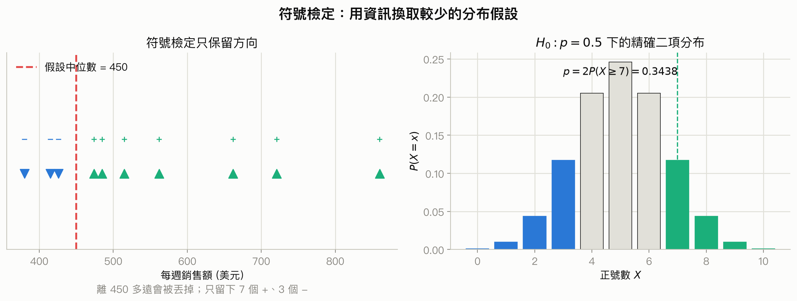

你該注意什麼：左圖顯示符號化會丟掉距離資訊；右圖顯示雙尾 p 值必須同時計入另一側同樣極端的結果。

#### 大樣本常態近似與連續性修正

<!-- exam-question-links:start -->
> **對應考古題：** Ch18 選擇題 [30](#exam-ch18-mc-30)、[31](#exam-ch18-mc-31)、[32](#exam-ch18-mc-32)、[33](#exam-ch18-mc-33)、[34](#exam-ch18-mc-34)、[35](#exam-ch18-mc-35)、[36](#exam-ch18-mc-36)、[37](#exam-ch18-mc-37)、[38](#exam-ch18-mc-38)、[48](#exam-ch18-mc-48)、[49](#exam-ch18-mc-49)、[50](#exam-ch18-mc-50)、[51](#exam-ch18-mc-51)；Ch18 計算題 [1](#exam-ch18-problem-1)、[2](#exam-ch18-problem-2)、[12](#exam-ch18-problem-12)、[13](#exam-ch18-problem-13)
<!-- exam-question-links:end -->

投影片以 $n>20$ 作為改用常態近似的實務門檻。當 $H_0:p=0.5$ 時：

<a id="formula-ch18-sign-normal"></a>

$$
\mu_X=0.5n,\qquad \sigma_X=\sqrt{0.25n}
$$

| 符號 | 意義 | 單位 |
|---|---|---|
| $\mu_X$ | $H_0$ 下正號數的平均 | 筆 |
| $\sigma_X$ | 正號數重複抽樣的標準差 | 筆 |
| $n$ | 有效正負號總數 | 筆 |

因為正號數是離散整數、常態分布是連續曲線，尾端機率要做 $0.5$ 的**連續性修正(continuity correction)** 。例如 $P(X\le22)$ 用常態近似時改算 $P(Y\le22.5)$。

房價例題有 61 筆資料：22 筆高於 336,000 美元、38 筆低於、1 筆相等。刪除平手後 $n=60$，所以：

$$
\mu_X=30,\qquad \sigma_X=\sqrt{15}=3.873
$$

要檢查中位數是否下降，正號代表高於舊中位數，因此是左尾：

$$
z=\frac{22.5-30}{3.873}=-1.94,\qquad p=0.0262
$$

在 $\alpha=0.05$ 下拒絕 $H_0$，有證據顯示新屋價格的母體中位數低於 336,000 美元。本地 11e 課本同一例題使用 236,000 美元，投影片改為 336,000 美元；考試以投影片數值為準，方法完全相同。

**定性意義：** $\sigma_X$ 描述的是「若公平地一半正、一半負，正號數會自然晃動多少」，不是房價本身的離散程度。觀察到的正號數離 $n/2$ 越遠，相對於這個抽樣雜訊越不尋常。小 p 值只表示方向失衡難由 $p=0.5$ 解釋，不告訴我們房價實際下降多少。

#### 配對偏好的符號檢定

Sun Coast Farms 讓 14 人比較 Citrus Valley 與 Tropical Orange；2 人偏好 Citrus Valley、10 人偏好 Tropical Orange、2 人無偏好。刪除平手後 $n=12$，雙尾 p 值為：

$$
p=2P(X\le2)=2(0.0002+0.0029+0.0161)=0.0384
$$

在 $\alpha=0.05$ 下拒絕 $H_0$，偏好比例不是各半；而且負號較多，所以樣本方向支持 Tropical Orange 較受偏好。檢定單位仍是「人」，不是把每個人品嘗的兩杯飲料當成 28 個獨立觀察。

投影片第 15 頁在說明二項表時誤寫成 $n=10$ trials or stores，但同頁表格、前頁資料與計算全部使用 $n=12$；本講義依彼此一致的 $n=12$ 計算。

### 投影片第 16–20 頁：Wilcoxon signed-rank 檢定

<!-- exam-question-links:start -->
> **對應考古題：** Ch18 選擇題 [18](#exam-ch18-mc-18)、[40](#exam-ch18-mc-40)、[41](#exam-ch18-mc-41)、[42](#exam-ch18-mc-42)、[43](#exam-ch18-mc-43)；Ch18 計算題 [9](#exam-ch18-problem-9)、[14](#exam-ch18-problem-14)、[15](#exam-ch18-problem-15)、[17](#exam-ch18-problem-17)
<!-- exam-question-links:end -->

符號檢定只看方向。若配對差是數值，而且差值分布可合理視為對稱，Wilcoxon signed-rank 檢定會再利用差值大小的名次，通常比符號檢定保留更多資訊。

步驟如下：

1. 先固定差值方向，例如 $d_i=A_i-B_i$。
2. 刪除 $d_i=0$ 的配對。
3. 依 $|d_i|$ 由小到大排名；相同絕對差使用平均名次。
4. 把原本正負號放回名次，分別加總成 $T^+$ 與 $T^-$。

<a id="formula-ch18-signed-rank"></a>

$$
T^+=\sum_{d_i>0}\operatorname{rank}(|d_i|),\qquad
T^-=\sum_{d_i<0}\operatorname{rank}(|d_i|)
$$

若 $H_0$ 成立，正負方向應近似隨機分配到各種大小的名次，$T^+$ 與 $T^-$ 應大致平衡。投影片以 $T^+$ 為統計量；$n\ge10$ 時使用：

<a id="formula-ch18-signed-rank-normal"></a>

$$
\mu_{T^+}=\frac{n(n+1)}{4},\qquad
\sigma_{T^+}=\sqrt{\frac{n(n+1)(2n+1)}{24}}
$$

| 符號 | 意義 | 單位 |
|---|---|---|
| $d_i$ | 第 $i$ 對依固定方向相減的差值 | 原始變數單位 |
| $T^+$ | 正差所對應名次的總和 | 名次點 |
| $T^-$ | 負差所對應名次的總和 | 名次點 |
| $n$ | 刪除零差後的配對數 | 對 |

適用條件是配對方式正確、各配對彼此獨立，而且差值分布近似對稱。它不要求差值常態，但「不常態」不等於「任意偏斜都可以」。若差值嚴重偏斜，符號檢定較安全。

製造方法例題刪除一個零差後 $n=10$，正名次和為 $T^+=49.5$。因此：

$$
\mu_{T^+}=27.5,\qquad \sigma_{T^+}=9.8107
$$

使用連續性修正後：

$$
z=\frac{49-27.5}{9.8107}=2.19,\qquad p=0.0286
$$

在 $\alpha=0.05$ 下拒絕相同中位位置的假設。因差定義為 A 減 B，且 $T^+$ 特別大，資料支持方法 A 完成時間較長。

**定性意義：** $T^+$ 很大，不只是「正差比較多」，還表示較大的絕對差也多半朝正方向。這是一種方向一致性乘上差距次序的訊號。它比較的是名次，不是平均差；拒絕 $H_0$ 也不能直接說平均數差多少。只有在兩個母體形狀相同、差異主要是位置平移時，才可把結果簡化成中位數位置差。

### 投影片第 21–27 頁：Mann-Whitney-Wilcoxon 檢定

<!-- exam-question-links:start -->
> **對應考古題：** Ch18 選擇題 [23](#exam-ch18-mc-23)、[44](#exam-ch18-mc-44)、[45](#exam-ch18-mc-45)、[46](#exam-ch18-mc-46)；Ch18 計算題 [3](#exam-ch18-problem-3)、[4](#exam-ch18-problem-4)、[5](#exam-ch18-problem-5)、[6](#exam-ch18-problem-6)、[20](#exam-ch18-problem-20)
<!-- exam-question-links:end -->

**Mann-Whitney-Wilcoxon 檢定(MWW test)** 也稱 Wilcoxon rank-sum test，用於兩個獨立樣本。它不是先配對相減，而是把兩群資料合併後由小到大排名，再加總第一群名次。

<a id="formula-ch18-mww-w"></a>

$$
W=\sum_{i\in\text{樣本 1}}\operatorname{rank}(x_i)
$$

同值使用平均名次。小樣本要使用 $W$ 的精確分布；投影片規定 $n_1\ge7$ 且 $n_2\ge7$ 時可用常態近似：

<a id="formula-ch18-mww-normal"></a>

$$
\mu_W=\frac{n_1(n_1+n_2+1)}{2},\qquad
\sigma_W=\sqrt{\frac{n_1n_2(n_1+n_2+1)}{12}}
$$

| 符號 | 意義 | 單位 |
|---|---|---|
| $W$ | 第一個樣本的名次和 | 名次點 |
| $n_1,n_2$ | 兩個獨立樣本的大小 | 筆 |
| $\mu_W,\sigma_W$ | $H_0$ 下名次和的平均與標準差 | 名次點 |

Showtime 小樣本例題中，4 位大學生的名次和 $W=14$；在 4 人與 5 人所有可能分配的精確分布下，雙尾 $p=0.1904$，不能拒絕兩群分布相同。

銀行例題有 $n_1=12,n_2=10,W=169.5$：

$$
\mu_W=138,\qquad \sigma_W=15.1658
$$

用連續性修正 $W=169$ 後，$z=2.04$、雙尾 $p=0.0286$。拒絕兩分行帳戶餘額分布相同的假設；第一群名次和偏大，表示第一分行餘額傾向較高。

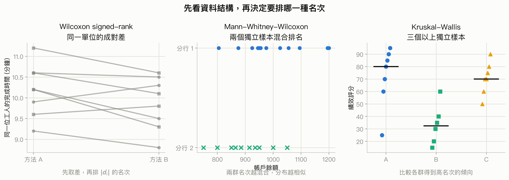

你該注意什麼：三種方法都使用名次，但排名對象和資料依存結構不同；不能只因為題目出現「rank」就任選一個。

**定性意義：** $W$ 接近 $\mu_W$ 時，兩群高低名次交錯，分布重疊較多；$W$ 遠離 $\mu_W$ 時，第一群較常占據高名次或低名次，兩群排序較分離。一般虛無假設是兩個完整分布相同，不只平均數相同。只有兩群形狀相同、差異可視為整體平移時，才可把檢定說成中位數差異。

### 投影片第 28–30 頁：Kruskal-Wallis 檢定

<!-- exam-question-links:start -->
> **對應考古題：** Ch18 選擇題 [16](#exam-ch18-mc-16)；Ch18 計算題 [21](#exam-ch18-problem-21)、[23](#exam-ch18-problem-23)、[28](#exam-ch18-problem-28)
<!-- exam-question-links:end -->

Kruskal-Wallis 檢定把 MWW 擴充到 $k\ge3$ 個獨立樣本。先合併全部資料排名，再算每群名次和 $R_i$。

<a id="formula-ch18-kruskal-wallis"></a>

$$
H=\frac{12}{n_T(n_T+1)}\sum_{i=1}^{k}\frac{R_i^2}{n_i}-3(n_T+1),
\qquad n_T=\sum_{i=1}^{k}n_i
$$

| 符號 | 意義 | 單位 |
|---|---|---|
| $H$ | Kruskal-Wallis 統計量 | 無單位 |
| $R_i$ | 第 $i$ 群的名次和 | 名次點 |
| $n_i$ | 第 $i$ 群樣本數 | 筆 |
| $n_T$ | 全部樣本總數 | 筆 |
| $k$ | 群數 | 群 |

在 $H_0$ 下，各群應只是從同一分布抽出，名次會近似均勻混合。投影片要求每群 $n_i\ge5$，此時 $H$ 可用自由度 $k-1$ 的卡方分布近似。若有很多同名次，軟體通常會做 ties correction；手算題要依老師投影片指定公式。

Williams 公司例題的三群名次和為 95、27、88，得到：

$$
H=8.92,\qquad df=2,\qquad p=0.0116
$$

在 $\alpha=0.05$ 下拒絕三群分布相同。B 群名次和相對低，顯示 B 群評分傾向較低；但整體檢定本身不告訴我們每一對都不同，仍需後續成對比較才能定位。

**定性意義：** $H$ 大表示群組標籤能把高低名次分開，群間位置訊號相對名次混合雜訊較強；$H$ 小表示各群名次彼此交錯，分布較相似。它不是平均數差，也不能從顯著結果直接說哪一群造成差異或建立因果。

### 投影片第 31–34 頁：Spearman 等級相關

<!-- exam-question-links:start -->
> **對應考古題：** Ch18 選擇題 [20](#exam-ch18-mc-20)、[24](#exam-ch18-mc-24)；Ch18 計算題 [8](#exam-ch18-problem-8)、[22](#exam-ch18-problem-22)、[24](#exam-ch18-problem-24)、[25](#exam-ch18-problem-25)、[26](#exam-ch18-problem-26)、[27](#exam-ch18-problem-27)
<!-- exam-question-links:end -->

Pearson 相關衡量兩個數值變數的線性關係；**Spearman 等級相關係數(Spearman rank-correlation coefficient)** 衡量兩套排序的單調一致性。沒有同名次時，標準公式是：

<a id="formula-ch18-spearman"></a>

$$
r_s=1-\frac{6\sum_{i=1}^{n}d_i^2}{n(n^2-1)},\qquad d_i=x_i-y_i
$$

| 符號 | 意義 | 單位 |
|---|---|---|
| $r_s$ | 樣本 Spearman 等級相關 | 無單位 |
| $x_i,y_i$ | 第 $i$ 個對象在兩變數中的名次 | 名次 |
| $d_i$ | 兩套名次之差 | 名次 |
| $n$ | 被排名的共同對象數 | 個 |

$r_s$ 介於 $-1$ 與 $1$。接近 1 表示兩套排序大致同向；接近 $-1$ 表示一套越高、另一套越低；接近 0 表示沒有明顯單調排序關係。若有同名次，最穩妥的做法是先取平均名次，再對兩套名次計算 Pearson 相關。

投影片的銷售員表有 $\sum d_i^2=44,n=10$。依標準公式：

$$
r_s=1-\frac{6(44)}{10(10^2-1)}=0.733
$$

投影片第 33 頁把分母印成 $n(n^2+1)$ 並得到 0.739；本地 11e 課本的定義與統計標準都是 $n(n^2-1)$，因此本講義使用 0.733。這是來源公式的誤植，不改變它要表達的正向關聯。

當 $n\ge10$，投影片用下列常態近似檢定 $H_0:\rho_s=0$：

<a id="formula-ch18-spearman-test"></a>

$$
\mu_{r_s}=0,\qquad \sigma_{r_s}=\sqrt{\frac{1}{n-1}},\qquad
z=\frac{r_s}{\sigma_{r_s}}=r_s\sqrt{n-1}
$$

以修正後的 $r_s=0.733$ 計算，$z=2.20$、雙尾 $p\approx0.028$，在 $\alpha=0.05$ 下有顯著正向等級相關。這不表示面試潛力造成銷售表現，也不表示每個人都排序一致。

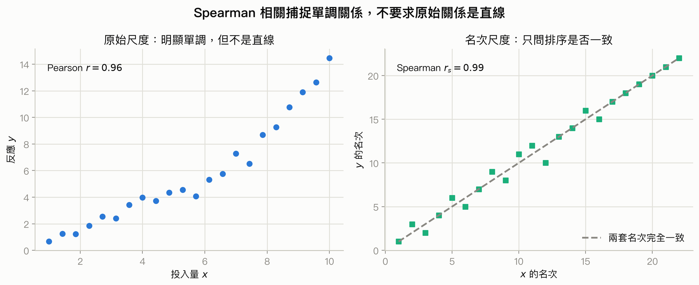

你該注意什麼：Spearman 關心「往上走時另一個變數是否大致也往上」，不要求原始點雲貼近直線；但 U 形等非單調關係仍可能得到接近 0。

**定性意義：** $|r_s|$ 越大，兩套排序越一致，名次差的平方和越小；接近 0 只代表缺乏單調排序，不代表兩變數完全沒有任何關係。相關也不等於因果，高相關不能排除共同原因、選樣偏誤或反向因果。

### 投影片第 35 頁：全章總結

- 無母數方法可處理類別、次序與數值資料；數值資料通常先轉成正負號或名次。
- 符號檢定可檢查母體中位數，也可分析只有偏好方向的配對樣本。
- Wilcoxon signed-rank 使用配對數值差的方向與名次；對稱母體的中位數問題也可使用。
- MWW 比較兩個獨立樣本的混合名次；Kruskal-Wallis 再擴充到三群以上。
- Spearman 相關用兩套名次衡量單調關聯。

這五種工具的共同優點是少依賴特定分布形狀，代價是把部分數值距離壓縮成類別或名次。選方法時，資料是否配對、群數與測量尺度仍比「無母數」三個字更重要。

### 全章解題流程

1. 先判斷資料尺度：只有類別、只有順序，還是保留數值距離。
2. 再判斷資料結構：一個樣本對中位數、配對樣本、兩個獨立樣本、三個以上獨立樣本，或同一批對象的兩套排名。
3. 寫清楚差值或正號方向，刪除規則一致。
4. 處理平手：符號檢定刪除等於基準者；排名方法對同值給平均名次。
5. 依樣本大小選精確分布或常態／卡方近似，近似常態時留意連續性修正。
6. 用 p 值與 $\alpha$ 判斷，再把結論寫回中位數、分布或排序關聯。
7. 不把「分布不同」擅自縮成「平均數不同」，也不把顯著關聯寫成因果。

### 把數字翻成真實意義

| 數字或關係 | 數理變化 | 資料世界中的意思 | 不能直接推論 |
|---|---|---|---|
| 正負號比例 | 越偏離 1:1 越不相容於 $p=0.5$ | 多數觀察落在基準同一側，中心位置或偏好方向失衡 | 效果差多少、平均數差多少 |
| $T^+$ | 遠離中心表示大名次偏向同一符號 | 配對差的方向與相對大小更一致 | 差值平均或所有個體都同方向 |
| MWW 的 $W$ | 遠離 $\mu_W$ 表示第一群占據較多高或低名次 | 兩群排序較分離、重疊較少 | 只差中位數，除非形狀相同 |
| Kruskal-Wallis 的 $H$ | 越大代表群間名次和越不均 | 至少有一群的高低位置傾向不同 | 哪一對不同、因果或平均差 |
| $r_s$ | 越接近 $\pm1$，名次差平方和越小 | 兩套排序更同向或反向 | 線性、因果或沒有離群影響 |
| 轉成名次 | 極端距離被壓成相鄰名次差 | 對離群與尺度較穩健，但丟掉實際距離 | 無母數一定更準或完全無假設 |

## 跟前面像的東西怎麼分

<a id="compare-ch18-method-selection"></a>

### 比較 1：符號檢定 vs Wilcoxon signed-rank vs 配對 t

<!-- exam-question-links:start -->
> **對應考古題：** Ch18 選擇題 [1](#exam-ch18-mc-1)、[2](#exam-ch18-mc-2)、[3](#exam-ch18-mc-3)、[4](#exam-ch18-mc-4)、[6](#exam-ch18-mc-6)、[7](#exam-ch18-mc-7)、[8](#exam-ch18-mc-8)、[9](#exam-ch18-mc-9)、[10](#exam-ch18-mc-10)、[11](#exam-ch18-mc-11)、[12](#exam-ch18-mc-12)、[13](#exam-ch18-mc-13)、[14](#exam-ch18-mc-14)、[15](#exam-ch18-mc-15)、[19](#exam-ch18-mc-19)、[21](#exam-ch18-mc-21)、[22](#exam-ch18-mc-22)
<!-- exam-question-links:end -->

| 方法 | 資料長相 | 核心條件 | 真正比較的東西 |
|---|---|---|---|
| 符號檢定 | 配對方向或單一樣本相對中位數，只需正負 | 各單位獨立；不要求差值對稱 | 正負方向是否各半 |
| Wilcoxon signed-rank | 配對數值，可排 $|d_i|$ 名次 | 差值分布近似對稱 | 配對差的位置是否為 0 |
| 配對 t | 配對數值，保留原始差距 | 差值近似常態或樣本夠大 | 母體平均差是否為 0 |

**一句話判斷準則：** 只有偏好方向或差值很偏斜，用符號；有配對數值且差值對稱，用 signed-rank；要推論平均差且 t 條件合理，用配對 t。

**容易誤選情境：** 同一批人前後各測一次，卻使用兩獨立樣本方法；這會丟掉每個人的前後對應。

### 比較 2：MWW vs 兩獨立樣本 t

| 方法 | 何時用 | 結論語言 |
|---|---|---|
| MWW | 兩個獨立樣本，資料至少可排序，不想指定常態形狀 | 一般說兩分布是否相同；同形狀時才說中位數位置差 |
| 兩獨立樣本 t | 兩個獨立數值樣本，要比較母體平均數 | 平均數差與其方向、區間 |

**一句話判斷準則：** 要比較平均數用 t；只可靠排序或分布明顯不適合平均數模型時，用 MWW。

**容易誤選情境：** MWW 顯著後直接寫「兩群平均數不同」。名次檢定未直接檢定平均數，這個結論超出方法。

### 比較 3：Kruskal-Wallis vs 單因子 ANOVA

| 方法 | 資料與條件 | 檢定目標 |
|---|---|---|
| Kruskal-Wallis | 三個以上獨立樣本；次序或數值資料；以名次分析 | 各群完整分布是否相同 |
| 單因子 ANOVA | 三個以上獨立數值樣本；誤差近似常態、等變異 | 各母體平均數是否相同 |

**一句話判斷準則：** 問平均數且 ANOVA 條件合理，用 [第 13 章 ANOVA](#formula-anova-f)；問排序位置或只有次序資料，用 Kruskal-Wallis。

**容易誤選情境：** 三群滿意度只有「差、可、好、很好」，卻把 1–4 當等距分數做 ANOVA；這時名次方法更符合尺度。

### 比較 4：Kruskal-Wallis 的卡方近似 vs 第 12 章卡方檢定

兩者都查卡方右尾，但資料來源不同。Kruskal-Wallis 先把數值或次序資料排名，$H$ 再近似卡方；[第 12 章卡方檢定](#formula-ch12-chi-square-cell)直接比較類別次數的觀察值與期望值。

**一句話判斷準則：** 表格裡是類別人數，用第 12 章；原始資料能排序、要比較三群位置，用本章 Kruskal-Wallis。

### 比較 5：Spearman vs Pearson 相關

| 方法 | 抓到的關係 | 尺度 |
|---|---|---|
| Spearman | 單調關係，可彎曲 | 至少次序尺度 |
| Pearson | 線性關係 | 數值尺度，且需留意離群值 |

**一句話判斷準則：** 題目給名次或只要求單調排序一致，選 Spearman；保留原始數值並關心直線關係，選 Pearson。

**容易誤選情境：** 點雲呈清楚 U 形，就因為「有關係」而期待 Spearman 很大；U 形不是單調，正負方向會互相抵銷。

## 考古題與詳解

本題庫共有 53 題選擇題與 28 題 Problem。題目原文依 PDF 保留；共用 Exhibit 只出現一次。所有數值另由 `ch18_exam_verification.py` 重算。題庫部分常態近似題沿用原題選項的未修正數值，詳解同時指出依投影片加入連續性修正後的結果；兩者若決策相同，不隱藏差異。

### 選擇題｜第 1–24 題：基本觀念與方法辨認

#### 選擇題 1 <a id="exam-ch18-mc-1"></a>

##### 題目

> A collection of statistical methods that generally requires very few, if any, assumptions about the population distribution is known as
>
> a. parametric methods<br>
> b. nonparametric methods<br>
> c. distribution-fixed methods<br>
> d. normal

##### 詳解

<!-- exam-theory-links:start -->
> **回看講義：** [比較 1：符號檢定 vs Wilcoxon signed-rank vs 配對 t](#compare-ch18-method-selection)
<!-- exam-theory-links:end -->

- **辨認題型：** 無母數方法定義。
- **選方法：** 依[方法選擇流程](#compare-ch18-method-selection)，關鍵字是對母體分布形式要求很少。
- **檢查假設：** 這是名詞題；「很少」不等於完全沒有隨機與獨立條件。
- **代入計算／推理：** distribution-free 是 nonparametric 的別稱。
- **解讀結論：** 答案是 **b** 。
- **選項檢討：** a 反而通常指定分布族；b 正確；c 不是本章術語；d 是一種分布，不是一組方法。

#### 選擇題 2 <a id="exam-ch18-mc-2"></a>

##### 題目

> The collection of statistical methods that require assumptions about the population is known as
>
> a. distribution free methods<br>
> b. nonparametric methods<br>
> c. small populations<br>
> d. parametric methods

##### 詳解

<!-- exam-theory-links:start -->
> **回看講義：** [比較 1：符號檢定 vs Wilcoxon signed-rank vs 配對 t](#compare-ch18-method-selection)
<!-- exam-theory-links:end -->

- **辨認題型：** 母數方法定義。
- **選方法：** 回到[母數與無母數的分辨](#compare-ch18-method-selection)。
- **檢查假設：** 題目問方法類別，不是母體大小。
- **代入計算／推理：** 以特定母體分布與參數為基礎的是 parametric methods。
- **解讀結論：** 答案是 **d** 。
- **選項檢討：** a、b 都是較少指定分布形式的方法；c 不是方法名稱；d 正確。

#### 選擇題 3 <a id="exam-ch18-mc-3"></a>

##### 題目

> Parametric methods are statistical methods that
>
> a. require some assumptions about the population<br>
> b. require no assumptions about the population<br>
> c. only deal with small samples<br>
> d. considers the sign of two matched samples

##### 詳解

<!-- exam-theory-links:start -->
> **回看講義：** [比較 1：符號檢定 vs Wilcoxon signed-rank vs 配對 t](#compare-ch18-method-selection)
<!-- exam-theory-links:end -->

- **辨認題型：** 母數方法特徵。
- **選方法：** 依[方法選擇流程](#compare-ch18-method-selection)先看是否指定母體模型。
- **檢查假設：** 樣本大小不是母數／無母數的定義。
- **代入計算／推理：** 母數方法會對母體分布或參數結構作假設。
- **解讀結論：** 答案是 **a** 。
- **選項檢討：** a 正確；b 把無母數也誇大成零假設；c 錯在只限小樣本；d 描述符號檢定。

#### 選擇題 4 <a id="exam-ch18-mc-4"></a>

##### 題目

> Which of the following tests would not be an example of a nonparametric method?
>
> a. Mann-Whitney-Wilcoxon test<br>
> b. Wilcoxon signed-rank test<br>
> c. sign test<br>
> d. t-test

##### 詳解

<!-- exam-theory-links:start -->
> **回看講義：** [比較 1：符號檢定 vs Wilcoxon signed-rank vs 配對 t](#compare-ch18-method-selection)
<!-- exam-theory-links:end -->

- **辨認題型：** 方法分類。
- **選方法：** 依[跨方法比較](#compare-ch18-method-selection)，找出以平均數與 t 分布為核心的方法。
- **檢查假設：** `not` 表示要選不是無母數者。
- **代入計算／推理：** t-test 是母數方法；其餘三個都以符號或名次分析。
- **解讀結論：** 答案是 **d** 。
- **選項檢討：** a、b、c 都是本章方法；d 正確，因 t 檢定直接推論平均數。

#### 選擇題 5 <a id="exam-ch18-mc-5"></a>

##### 題目

> A sign test is a
>
> a. parametric method for determining the differences between two populations based on two matched samples<br>
> b. nonparametric method for determining the differences between two populations based on two matched samples<br>
> c. nonparametric method for determining the differences between two or more populations based on two or more matched samples<br>
> d. parametric method for determining the differences between two or more populations based on two or more matched samples

##### 詳解

<!-- exam-theory-links:start -->
> **回看講義：** [18.1 母體中位數的符號檢定](#formula-ch18-sign-binomial)
<!-- exam-theory-links:end -->

- **辨認題型：** 符號檢定用途。
- **選方法：** 使用[符號檢定的二項模型](#formula-ch18-sign-binomial)，配對結果只保留正負方向。
- **檢查假設：** 這個版本比較兩個配對條件，不是三群以上。
- **代入計算／推理：** 符號檢定是 nonparametric，且可處理兩個 matched samples。
- **解讀結論：** 答案是 **b** 。
- **選項檢討：** a、d 錯在 parametric；b 正確；c 把兩條件擴成兩個以上母體，應另選其他方法。

#### 選擇題 6 <a id="exam-ch18-mc-6"></a>

##### 題目

> The level of measurement that allows for the rank ordering of data items is
>
> a. nominal measurement<br>
> b. ratio measurement<br>
> c. interval measurement<br>
> d. ordinal measurement

##### 詳解

<!-- exam-theory-links:start -->
> **回看講義：** [比較 1：符號檢定 vs Wilcoxon signed-rank vs 配對 t](#compare-ch18-method-selection)
<!-- exam-theory-links:end -->

- **辨認題型：** 測量尺度。
- **選方法：** 依[方法選擇流程](#compare-ch18-method-selection)，題幹只保證可以排序。
- **檢查假設：** 沒有說相鄰差距或倍數有意義。
- **代入計算／推理：** 可排序但距離未必等距是 ordinal。
- **解讀結論：** 答案是 **d** 。
- **選項檢討：** a 只有標籤；b、c 都比題幹提供更多數值資訊；d 正確。

#### 選擇題 7 <a id="exam-ch18-mc-7"></a>

##### 題目

> The level of measurement that is simply a label for the purpose of identifying an item is
>
> a. ordinal measurement<br>
> b. ratio measurement<br>
> c. nominal measurement<br>
> d. internal measurement

##### 詳解

<!-- exam-theory-links:start -->
> **回看講義：** [比較 1：符號檢定 vs Wilcoxon signed-rank vs 配對 t](#compare-ch18-method-selection)
<!-- exam-theory-links:end -->

- **辨認題型：** 名目尺度。
- **選方法：** 依[方法選擇流程](#compare-ch18-method-selection)，只有辨識標籤、沒有順序。
- **檢查假設：** `internal` 不是標準測量尺度；原題如此拼寫，忠實保留。
- **代入計算／推理：** nominal scale 的功能就是分類與命名。
- **解讀結論：** 答案是 **c** 。
- **選項檢討：** a 還有次序；b 還能談倍數；c 正確；d 不是四種尺度之一。

#### 選擇題 8 <a id="exam-ch18-mc-8"></a>

##### 題目

> The labeling of parts as "defective" or "non-defective" is an example of
>
> a. ordinal data<br>
> b. ratio data<br>
> c. interval data<br>
> d. nominal data

##### 詳解

<!-- exam-theory-links:start -->
> **回看講義：** [比較 1：符號檢定 vs Wilcoxon signed-rank vs 配對 t](#compare-ch18-method-selection)
<!-- exam-theory-links:end -->

- **辨認題型：** 二元類別的尺度。
- **選方法：** 依[方法選擇流程](#compare-ch18-method-selection)，兩標籤只區分類別。
- **檢查假設：** defective 與 non-defective 沒有可運算的距離。
- **代入計算／推理：** 這是 nominal data。
- **解讀結論：** 答案是 **d** 。
- **選項檢討：** a 需要有序等級；b、c 需要數值差距；d 正確。

#### 選擇題 9 <a id="exam-ch18-mc-9"></a>

##### 題目

> In a questionnaire, respondents are asked to mark their marital status. Marital status is an example of the
>
> a. ordinal scale<br>
> b. nominal scale<br>
> c. ratio scale<br>
> d. interval scale

##### 詳解

<!-- exam-theory-links:start -->
> **回看講義：** [比較 1：符號檢定 vs Wilcoxon signed-rank vs 配對 t](#compare-ch18-method-selection)
<!-- exam-theory-links:end -->

- **辨認題型：** 類別尺度。
- **選方法：** 依[方法選擇流程](#compare-ch18-method-selection)，婚姻狀態只有互斥名稱。
- **檢查假設：** 類別沒有自然的高低順序。
- **代入計算／推理：** 因此是 nominal scale。
- **解讀結論：** 答案是 **b** 。
- **選項檢討：** a 會錯加順序；b 正確；c、d 需要有意義的數值差距。

#### 選擇題 10 <a id="exam-ch18-mc-10"></a>

##### 題目

> The scale of measurement that is used to rank order the observation for a variable is called the
>
> a. ratio scale<br>
> b. ordinal scale<br>
> c. nominal scale<br>
> d. interval scale

##### 詳解

<!-- exam-theory-links:start -->
> **回看講義：** [比較 1：符號檢定 vs Wilcoxon signed-rank vs 配對 t](#compare-ch18-method-selection)
<!-- exam-theory-links:end -->

- **辨認題型：** 排名尺度。
- **選方法：** 依[方法選擇流程](#compare-ch18-method-selection)，題幹直接說 rank order。
- **檢查假設：** 沒有保證名次 1 與 2 的差等於 2 與 3 的差。
- **代入計算／推理：** 排序所需的最低尺度是 ordinal。
- **解讀結論：** 答案是 **b** 。
- **選項檢討：** a、d 提供更強的距離資訊；b 正確；c 不能排序。

#### 選擇題 11 <a id="exam-ch18-mc-11"></a>

##### 題目

> On a teacher evaluation form students are asked to rate their professor's performance as excellent, very good, good, and poor. This is an example of the
>
> a. ordinal scale<br>
> b. ratio scale<br>
> c. nominal scale<br>
> d. interval scale

##### 詳解

<!-- exam-theory-links:start -->
> **回看講義：** [比較 1：符號檢定 vs Wilcoxon signed-rank vs 配對 t](#compare-ch18-method-selection)
<!-- exam-theory-links:end -->

- **辨認題型：** 有序評等。
- **選方法：** 依[方法選擇流程](#compare-ch18-method-selection)，四個評語有自然順序。
- **檢查假設：** excellent 到 very good 的距離未必等於 good 到 poor。
- **代入計算／推理：** 有序但不保證等距，屬 ordinal。
- **解讀結論：** 答案是 **a** 。
- **選項檢討：** a 正確；b、d 要求數值距離；c 忽略既有順序。

#### 選擇題 12 <a id="exam-ch18-mc-12"></a>

##### 題目

> Temperature is an example of a variable that uses
>
> a. the ratio scale<br>
> b. the interval scale<br>
> c. the ordinal scale<br>
> d. either the ratio or the ordinal scale

##### 詳解

<!-- exam-theory-links:start -->
> **回看講義：** [比較 1：符號檢定 vs Wilcoxon signed-rank vs 配對 t](#compare-ch18-method-selection)
<!-- exam-theory-links:end -->

- **辨認題型：** 溫度的測量尺度。
- **選方法：** 依[方法選擇流程](#compare-ch18-method-selection)，一般教材中的攝氏或華氏溫度看差值。
- **檢查假設：** 0°C 不代表完全沒有溫度，故不能把 20°C 說成 10°C 的兩倍熱。
- **代入計算／推理：** 差值有意義、零點任意，是 interval scale。
- **解讀結論：** 答案是 **b** 。
- **選項檢討：** a 適合絕對零點尺度；b 正確；c 只保留順序；d 混入不適用的尺度。

#### 選擇題 13 <a id="exam-ch18-mc-13"></a>

##### 題目

> The speed of an automobile is an example of a variable that uses the
>
> a. ratio scale<br>
> b. interval scale<br>
> c. nominal scale<br>
> d. ordinal scale

##### 詳解

<!-- exam-theory-links:start -->
> **回看講義：** [比較 1：符號檢定 vs Wilcoxon signed-rank vs 配對 t](#compare-ch18-method-selection)
<!-- exam-theory-links:end -->

- **辨認題型：** 速度的測量尺度。
- **選方法：** 依[方法選擇流程](#compare-ch18-method-selection)，速度有真正的零點。
- **檢查假設：** 0 km/h 表示沒有移動，倍數比較有意義。
- **代入計算／推理：** 因此屬 ratio scale。
- **解讀結論：** 答案是 **a** 。
- **選項檢討：** a 正確；b 零點可任意；c 只有標籤；d 只有順序。

#### 選擇題 14 <a id="exam-ch18-mc-14"></a>

##### 題目

> Statistical methods that generally require very few, if any, assumptions about the population distribution are known as
>
> a. parametric<br>
> b. nonparametric<br>
> c. free methods<br>
> d. None of these alternatives is correct.

##### 詳解

<!-- exam-theory-links:start -->
> **回看講義：** [比較 1：符號檢定 vs Wilcoxon signed-rank vs 配對 t](#compare-ch18-method-selection)
<!-- exam-theory-links:end -->

- **辨認題型：** 無母數方法定義的重複確認。
- **選方法：** 回到[方法選擇流程](#compare-ch18-method-selection)。
- **檢查假設：** 題目指的是不指定特定母體分布形式。
- **代入計算／推理：** 正式名稱是 nonparametric methods。
- **解讀結論：** 答案是 **b** 。
- **選項檢討：** a 通常有較明確分布假設；b 正確；c 不是完整術語；d 因 b 已正確而錯。

#### 選擇題 15 <a id="exam-ch18-mc-15"></a>

##### 題目

> Which of the following tests would not be an example of nonparametric method?
>
> a. Mann-Whitney-Wilcoxon test<br>
> b. Wilcoxon signed-rank test<br>
> c. sign test<br>
> d. t test

##### 詳解

<!-- exam-theory-links:start -->
> **回看講義：** [比較 1：符號檢定 vs Wilcoxon signed-rank vs 配對 t](#compare-ch18-method-selection)
<!-- exam-theory-links:end -->

- **辨認題型：** 方法分類的重複題。
- **選方法：** 依[方法選擇流程](#compare-ch18-method-selection)找出直接檢定平均數者。
- **檢查假設：** 題幹有 `not`。
- **代入計算／推理：** t test 是母數方法。
- **解讀結論：** 答案是 **d** 。
- **選項檢討：** a、b、c 都使用符號或名次；d 正確。

#### 選擇題 16 <a id="exam-ch18-mc-16"></a>

##### 題目

> A nonparametric version of the Parametric analysis of variance test is the
>
> a. Kruskal-Wallis Test<br>
> b. Mann-Whitney-Wilcoxon Test<br>
> c. sign test<br>
> d. Wilcoxon Signed-rank test

##### 詳解

<!-- exam-theory-links:start -->
> **回看講義：** [投影片第 28–30 頁：Kruskal-Wallis 檢定](#formula-ch18-kruskal-wallis)
<!-- exam-theory-links:end -->

- **辨認題型：** 三群以上方法對照。
- **選方法：** 依[Kruskal-Wallis 公式](#formula-ch18-kruskal-wallis)，它比較 $k$ 個獨立樣本的名次。
- **檢查假設：** ANOVA 的典型問題是三群以上；不是兩群或配對。
- **代入計算／推理：** Kruskal-Wallis 是 one-way ANOVA 的無母數對照。
- **解讀結論：** 答案是 **a** 。
- **選項檢討：** a 正確；b 只比兩個獨立群；c 只看正負；d 是兩個配對條件。

#### 選擇題 17 <a id="exam-ch18-mc-17"></a>

##### 題目

> A nonparametric method for determining the differences between two populations based on two matched samples where only preference data is required is the
>
> a. Mann-Whitney-Wilcoxon test<br>
> b. Wilcoxon signed-rank test<br>
> c. sign test<br>
> d. Kruskal-Wallis Test

##### 詳解

<!-- exam-theory-links:start -->
> **回看講義：** [18.1 母體中位數的符號檢定](#formula-ch18-sign-binomial)
<!-- exam-theory-links:end -->

- **辨認題型：** 配對偏好資料的方法選擇。
- **選方法：** 依[符號檢定](#formula-ch18-sign-binomial)，只有偏好方向時轉成正負號。
- **檢查假設：** 沒有數值差距可供 signed-rank 排 $|d_i|$。
- **代入計算／推理：** matched samples 加 preference data 指向 sign test。
- **解讀結論：** 答案是 **c** 。
- **選項檢討：** a 是獨立樣本；b 需要配對數值；c 正確；d 是三群以上獨立樣本。

#### 選擇題 18 <a id="exam-ch18-mc-18"></a>

##### 題目

> When ranking combined data in a Wilcoxon signed rank test, the data that receives a rank of 1 is the
>
> a. lowest value<br>
> b. highest value<br>
> c. middle value<br>
> d. average of the highest and the lowest of values

##### 詳解

<!-- exam-theory-links:start -->
> **回看講義：** [投影片第 16–20 頁：Wilcoxon signed-rank 檢定](#formula-ch18-signed-rank)
<!-- exam-theory-links:end -->

- **辨認題型：** 名次配置規則。
- **選方法：** 依[Wilcoxon signed-rank 步驟](#formula-ch18-signed-rank)，實際上是對非零 $|d_i|$ 由小到大排名。
- **檢查假設：** 若最低值同名次，應分配平均名次；題目未給 ties。
- **代入計算／推理：** 最小絕對差得到 rank 1。
- **解讀結論：** 答案是 **a** 。
- **選項檢討：** a 正確；b 應得最大名次；c 沒有固定名次；d 不是排名規則。

#### 選擇題 19 <a id="exam-ch18-mc-19"></a>

##### 題目

> Statistical methods that require assumptions about the population are known as
>
> a. distribution free<br>
> b. nonparametric<br>
> c. either distribution free of nonparametric<br>
> d. parametric

##### 詳解

<!-- exam-theory-links:start -->
> **回看講義：** [比較 1：符號檢定 vs Wilcoxon signed-rank vs 配對 t](#compare-ch18-method-selection)
<!-- exam-theory-links:end -->

- **辨認題型：** 母數方法定義。
- **選方法：** 回到[方法選擇流程](#compare-ch18-method-selection)。
- **檢查假設：** 原題 c 的 `of` 疑為 `or`，不影響選項意義。
- **代入計算／推理：** 要求母體假設的是 parametric methods。
- **解讀結論：** 答案是 **d** 。
- **選項檢討：** a、b、c 都指無母數；d 正確。

#### 選擇題 20 <a id="exam-ch18-mc-20"></a>

##### 題目

> The Spearman rank-correlation coefficient is
>
> a. a correlation measure based on the average of data items<br>
> b. a correlation measure based on rank-ordered data for two variables<br>
> c. a correlation measure based on the median of data items<br>
> d. None of these alternatives is correct.

##### 詳解

<!-- exam-theory-links:start -->
> **回看講義：** [投影片第 31–34 頁：Spearman 等級相關](#formula-ch18-spearman)
<!-- exam-theory-links:end -->

- **辨認題型：** Spearman 定義。
- **選方法：** 使用[Spearman 公式](#formula-ch18-spearman)。
- **檢查假設：** 兩套名次必須來自同一批對象。
- **代入計算／推理：** $r_s$ 以兩變數的 rank-ordered data 衡量單調關聯。
- **解讀結論：** 答案是 **b** 。
- **選項檢討：** a、c 都不是公式依據；b 正確；d 因 b 已正確而錯。

#### 選擇題 21 <a id="exam-ch18-mc-21"></a>

##### 題目

> A nonparametric test for the equivalence of two populations would be used instead of a parametric test for the equivalence of the population parameters if
>
> a. the samples are very large<br>
> b. the samples are not independent<br>
> c. no information about the populations is available<br>
> d. The parametric test is always used in this situation.

##### 詳解

<!-- exam-theory-links:start -->
> **回看講義：** [比較 1：符號檢定 vs Wilcoxon signed-rank vs 配對 t](#compare-ch18-method-selection)
<!-- exam-theory-links:end -->

- **辨認題型：** 何時選無母數方法。
- **選方法：** 依[方法選擇流程](#compare-ch18-method-selection)，若無法合理指定母體分布，就考慮無母數方法。
- **檢查假設：** 無母數方法仍不能修復不獨立；b 不是使用理由。
- **代入計算／推理：** 缺乏母體分布資訊時，依名次或符號的方法較合適。
- **解讀結論：** 答案是 **c** 。
- **選項檢討：** a 大樣本本身不迫使改方法；b 違反兩類方法共同的重要條件；c 正確；d 過度絕對。

#### 選擇題 22 <a id="exam-ch18-mc-22"></a>

##### 題目

> A nonparametric test would be used if
>
> a. nominal data is available<br>
> b. interval data is available<br>
> c. it is known that the population is normally distributed<br>
> d. None of these alternatives is correct.

##### 詳解

<!-- exam-theory-links:start -->
> **回看講義：** [比較 1：符號檢定 vs Wilcoxon signed-rank vs 配對 t](#compare-ch18-method-selection)
<!-- exam-theory-links:end -->

- **辨認題型：** 資料尺度與方法。
- **選方法：** 依[方法選擇流程](#compare-ch18-method-selection)，名目資料無法直接使用平均數型母數方法。
- **檢查假設：** 區間資料也能用無母數，但「有區間資料」本身不是必要理由；已知常態通常支持母數法。
- **代入計算／推理：** nominal data 常需要符號或類別方法。
- **解讀結論：** 答案是 **a** 。
- **選項檢討：** a 正確；b 資訊較完整，仍需看目標與條件；c 反而支持母數法；d 因 a 正確而錯。

#### 選擇題 23 <a id="exam-ch18-mc-23"></a>

##### 題目

> If a null hypothesis that states that two populations are identical is rejected using a nonparametric test, then it is safe to assume that
>
> a. neither the means nor the variances are equal<br>
> b. the means of the populations are not the same<br>
> c. the variances of the populations are not the same<br>
> d. We cannot be sure of the way in which the populations differ from each other.

##### 詳解

<!-- exam-theory-links:start -->
> **回看講義：** [投影片第 21–27 頁：Mann-Whitney-Wilcoxon 檢定](#formula-ch18-mww-w)
<!-- exam-theory-links:end -->

- **辨認題型：** 分布檢定的結論界線。
- **選方法：** 依[MWW 的一般假設](#formula-ch18-mww-w)，拒絕的是兩個完整分布相同。
- **檢查假設：** 若未另假設兩群形狀相同，不能只歸因於平均、中位數或變異數。
- **代入計算／推理：** 顯著只說至少某種分布特徵不同。
- **解讀結論：** 答案是 **d** 。
- **選項檢討：** a 太強；b、c 都擅自指定差異來源；d 正確。

#### 選擇題 24 <a id="exam-ch18-mc-24"></a>

##### 題目

> The Spearman rank-correlation coefficient for 20 pairs of data when $\Sigma d_i^2=50$ is.
>
> a. 0.0063<br>
> b. 0.0376<br>
> c. 0.9624<br>
> d. 0.9937

##### 詳解

<!-- exam-theory-links:start -->
> **回看講義：** [投影片第 31–34 頁：Spearman 等級相關](#formula-ch18-spearman)
<!-- exam-theory-links:end -->

- **辨認題型：** Spearman 係數計算。
- **選方法：** 使用[標準 Spearman 公式](#formula-ch18-spearman)。
- **檢查假設：** 題目未提 ties，故可直接用 $d_i$ 公式。
- **代入計算／推理：** $r_s=1-6(50)/[20(20^2-1)]=1-300/7980=0.9624$。
- **解讀結論：** 答案是 **c** ；兩套排序高度同向。
- **選項檢討：** a、b 是把扣除量或分母處理錯；c 正確；d 對應過小的名次差。

### 選擇題｜第 25–53 題：共用 Exhibit 與計算

#### 題組 18-1：選擇題 25–28 共用資料

> Exhibit 18-1
>
> Fifteen people were given two types of cereal, Brand X and Brand Y. Two people preferred Brand X and thirteen people preferred Brand Y. We want to determine whether or not customers prefer one brand over the other.

#### 選擇題 25 <a id="exam-ch18-mc-25"></a>

##### 題目

> Refer to Exhibit 18-1. The null hypothesis that is being tested is
>
> a. $H_0:\mu=5$<br>
> b. $H_0:\mu=0.5$<br>
> c. $H_0:P=5$<br>
> d. $H_0:P=0.5$

##### 詳解

<!-- exam-theory-links:start -->
> **回看講義：** [18.1 母體中位數的符號檢定](#formula-ch18-sign-binomial)
<!-- exam-theory-links:end -->

- **辨認題型：** 兩品牌偏好的符號檢定。
- **選方法：** 使用[符號檢定二項模型](#formula-ch18-sign-binomial)。
- **檢查假設：** 每人只表達一個偏好，且受試者彼此獨立。
- **代入計算／推理：** 無偏好差異表示偏好任一品牌的機率 $P=0.5$。
- **解讀結論：** 答案是 **d** 。
- **選項檢討：** a、b 把機率誤寫成平均數；c 把機率寫成不可能的 5；d 正確。

#### 選擇題 26 <a id="exam-ch18-mc-26"></a>

##### 題目

> Refer to Exhibit 18-1. To test the null hypothesis, the appropriate probability distribution to use is
>
> a. normal<br>
> b. chi-square<br>
> c. Poisson<br>
> d. binomial

##### 詳解

<!-- exam-theory-links:start -->
> **回看講義：** [18.1 母體中位數的符號檢定](#formula-ch18-sign-binomial)
<!-- exam-theory-links:end -->

- **辨認題型：** 小樣本符號檢定參考分布。
- **選方法：** 使用[精確二項分布](#formula-ch18-sign-binomial)。
- **檢查假設：** $n=15\le20$，投影片規則用 exact binomial。
- **代入計算／推理：** 每人偏好 X／Y 是兩結果、$p=0.5$。
- **解讀結論：** 答案是 **d** 。
- **選項檢討：** a 是大樣本近似；b、c 不符合兩結果計數；d 正確。

#### 選擇題 27 <a id="exam-ch18-mc-27"></a>

##### 題目

> Refer to Exhibit 18-1. The p-value for this test is
>
> a. 0.0005<br>
> b. 0.001<br>
> c. 0.0037<br>
> d. 0.0074

##### 詳解

<!-- exam-theory-links:start -->
> **回看講義：** [18.1 母體中位數的符號檢定](#formula-ch18-sign-binomial)
<!-- exam-theory-links:end -->

- **辨認題型：** 雙尾精確符號檢定。
- **選方法：** 依[精確二項模型](#formula-ch18-sign-binomial)，從較小的 2 人那一尾計算再乘 2。
- **檢查假設：** 有效樣本 $n=15$，觀察到 $X=2$。
- **代入計算／推理：** $p=2P(X\le2)=2(1+15+105)/2^{15}=0.007385\approx0.0074$。
- **解讀結論：** 答案是 **d** 。
- **選項檢討：** a、b 漏加部分尾端或漏乘 2；c 是單尾值；d 正確。

#### 選擇題 28 <a id="exam-ch18-mc-28"></a>

##### 題目

> Refer to Exhibit 18-1. At 95% confidence, the null hypothesis should
>
> a. be rejected<br>
> b. not be rejected<br>
> c. be revised<br>
> d. None of these alternatives is correct.

##### 詳解

<!-- exam-theory-links:start -->
> **回看講義：** [18.1 母體中位數的符號檢定](#formula-ch18-sign-binomial)
<!-- exam-theory-links:end -->

- **辨認題型：** 以 p 值作決策。
- **選方法：** 沿用[符號檢定](#formula-ch18-sign-binomial)。
- **檢查假設：** 95% confidence 對應 $\alpha=0.05$。
- **代入計算／推理：** $p=0.0074<0.05$。
- **解讀結論：** 答案是 **a** ；兩品牌偏好並非各半，樣本方向偏向 Brand Y。
- **選項檢討：** a 正確；b 與 p 值比較相反；c 不是標準決策；d 因 a 正確而錯。

#### 題組 18-2：選擇題 29–34 共用資料

> Exhibit 18-2
>
> Students in statistics classes were asked whether they preferred a 10-minute break or to get out of class 10 minutes early. In a sample of 150 students, 40 preferred a 10-minute break, 80 preferred to get out of class 10 minutes early, and 30 had no preference. We want to determine if there is a difference in students' preferences.

原題第 29–34 題誤寫為 `Exhibit 19-2`；實際上都指這份 Exhibit 18-2。刪除 30 位無偏好者後，有效樣本 $n=120$。

#### 選擇題 29 <a id="exam-ch18-mc-29"></a>

##### 題目

> Refer to Exhibit 19-2. The null hypothesis that is being tested is
>
> a. $H_0:\mu=5$<br>
> b. $H_0:\mu=0.5$<br>
> c. $H_0:P=5$<br>
> d. $H_0:P=0.5$

##### 詳解

<!-- exam-theory-links:start -->
> **回看講義：** [18.1 母體中位數的符號檢定](#formula-ch18-sign-binomial)
<!-- exam-theory-links:end -->

- **辨認題型：** 兩種偏好的符號檢定。
- **選方法：** 使用[符號檢定](#formula-ch18-sign-binomial)。
- **檢查假設：** 無偏好者不給正負號，已刪除。
- **代入計算／推理：** 無差異時，偏好提早下課的機率 $P=0.5$。
- **解讀結論：** 答案是 **d** 。
- **選項檢討：** a、b 的 $\mu$ 不是二項機率；c 超出機率範圍；d 正確。

#### 選擇題 30 <a id="exam-ch18-mc-30"></a>

##### 題目

> Refer to Exhibit 19-2. The mean and the standard deviation of the sampling distribution of the number of students who preferred to get out early are
>
> a. 50 and 30<br>
> b. 60 and 30<br>
> c. 50 and 5.478<br>
> d. 60 and 5.478

##### 詳解

<!-- exam-theory-links:start -->
> **回看講義：** [大樣本常態近似與連續性修正](#formula-ch18-sign-normal)
<!-- exam-theory-links:end -->

- **辨認題型：** 符號數的常態近似參數。
- **選方法：** 使用[符號檢定常態近似](#formula-ch18-sign-normal)。
- **檢查假設：** 有效 $n=120$，不是原始 150。
- **代入計算／推理：** $\mu=0.5(120)=60$，$\sigma=\sqrt{0.25(120)}=\sqrt{30}=5.478$。
- **解讀結論：** 答案是 **d** 。
- **選項檢討：** a、c 錯把有效人數算成 100；b 把變異數 30 當標準差；d 正確。

#### 選擇題 31 <a id="exam-ch18-mc-31"></a>

##### 題目

> Refer to Exhibit 19-2. To test the null hypothesis, the appropriate probability distribution to use is the
>
> a. normal<br>
> b. chi-square<br>
> c. t distribution<br>
> d. binomial

##### 詳解

<!-- exam-theory-links:start -->
> **回看講義：** [大樣本常態近似與連續性修正](#formula-ch18-sign-normal)
<!-- exam-theory-links:end -->

- **辨認題型：** 大樣本符號檢定的課堂計算法。
- **選方法：** 依[常態近似](#formula-ch18-sign-normal)，$n=120>20$。
- **檢查假設：** 精確分布本質仍是 binomial，但投影片的大樣本計算選 normal approximation。
- **代入計算／推理：** $np=n(1-p)=60$，近似充足。
- **解讀結論：** 依題庫預期答案是 **a** 。
- **選項檢討：** a 正確；b、c 不處理二項正號數；d 是精確模型，但本題問大樣本採用的計算分布。

#### 選擇題 32 <a id="exam-ch18-mc-32"></a>

##### 題目

> Refer to Exhibit 19-2. The test statistic based on the number of students who preferred to get out early equals
>
> a. 1.825<br>
> b. 0.67<br>
> c. 0.82<br>
> d. 3.65

##### 詳解

<!-- exam-theory-links:start -->
> **回看講義：** [大樣本常態近似與連續性修正](#formula-ch18-sign-normal)
<!-- exam-theory-links:end -->

- **辨認題型：** 正號數的標準化。
- **選方法：** 使用[常態近似](#formula-ch18-sign-normal)。
- **檢查假設：** 原題選項採未做連續性修正的版本。
- **代入計算／推理：** $z=(80-60)/5.478=3.65$。若依投影片加修正，$z=(79.5-60)/5.478=3.56$，決策不變。
- **解讀結論：** 對應選項答案是 **d** 。
- **選項檢討：** a 是少除約一半；b、c 是錯誤分母；d 正確對應題庫算法。

#### 選擇題 33 <a id="exam-ch18-mc-33"></a>

##### 題目

> Refer to Exhibit 19-2. The p-value for testing the hypotheses is
>
> a. less than 0.002<br>
> b. between 0.002 and 0.05<br>
> c. between 0.05 and 0.10<br>
> d. greater than 0.10

##### 詳解

<!-- exam-theory-links:start -->
> **回看講義：** [大樣本常態近似與連續性修正](#formula-ch18-sign-normal)
<!-- exam-theory-links:end -->

- **辨認題型：** 雙尾 p 值區間。
- **選方法：** 由[常態近似](#formula-ch18-sign-normal)取 $2P(Z\ge|z|)$。
- **檢查假設：** 不論用 $z=3.65$ 或連續性修正的 3.56，都是雙尾。
- **代入計算／推理：** 未修正 $p\approx0.00026$；修正後約 $0.00037$，都小於 0.002。
- **解讀結論：** 答案是 **a** 。
- **選項檢討：** a 正確；b、c、d 都把極端的 $z$ 誤配成過大的 p 值。

#### 選擇題 34 <a id="exam-ch18-mc-34"></a>

##### 題目

> Refer to Exhibit 19-2. The null hypothesis should be
>
> a. rejected<br>
> b. not rejected<br>
> c. revised<br>
> d. None of these alternatives is correct.

##### 詳解

<!-- exam-theory-links:start -->
> **回看講義：** [大樣本常態近似與連續性修正](#formula-ch18-sign-normal)
<!-- exam-theory-links:end -->

- **辨認題型：** p 值決策。
- **選方法：** 沿用[符號檢定常態近似](#formula-ch18-sign-normal)。
- **檢查假設：** 題目未另給 $\alpha$，依常見 0.05；前題 p 值遠小於 0.002。
- **代入計算／推理：** $p<0.05$，拒絕 $H_0$。
- **解讀結論：** 答案是 **a** ；偏好提早下課的人顯著較多。
- **選項檢討：** a 正確；b 與 p 值矛盾；c 不是檢定決策；d 因 a 正確而錯。

#### 題組 18-3：選擇題 35–39 共用資料

> Exhibit 18-3
>
> It is believed that the median yearly income in a suburb of Atlanta is \$70,000. A sample of 67 residents was taken. Thirty-eight had yearly incomes above \$70,000, 26 had yearly incomes below \$70,000, and 3 had yearly incomes equal to \$70,000. The null hypothesis to be tested is $H_0$: median = \$70,000.

刪除 3 位剛好等於 70,000 美元者後，有效樣本 $n=64$。

#### 選擇題 35 <a id="exam-ch18-mc-35"></a>

##### 題目

> Refer to Exhibit 18-3. To test the null hypothesis, the appropriate probability distribution to use is
>
> a. normal<br>
> b. chi-square<br>
> c. t distribution<br>
> d. binomial

##### 詳解

<!-- exam-theory-links:start -->
> **回看講義：** [大樣本常態近似與連續性修正](#formula-ch18-sign-normal)
<!-- exam-theory-links:end -->

- **辨認題型：** 大樣本中位數符號檢定。
- **選方法：** 使用[符號檢定常態近似](#formula-ch18-sign-normal)。
- **檢查假設：** 有效 $n=64>20$。
- **代入計算／推理：** 正號數的二項分布以常態分布近似。
- **解讀結論：** 題庫預期答案是 **a** 。
- **選項檢討：** a 正確；b、c 不符合正負計數；d 是精確母分布，但題庫依大樣本規則選 normal。

#### 選擇題 36 <a id="exam-ch18-mc-36"></a>

##### 題目

> Refer to Exhibit 18-3. The mean and the standard deviation (respectively) for this test about the median are
>
> a. 32 and 4<br>
> b. 32 and 16<br>
> c. 33.5 and 4<br>
> d. 33.5 and 16

##### 詳解

<!-- exam-theory-links:start -->
> **回看講義：** [大樣本常態近似與連續性修正](#formula-ch18-sign-normal)
<!-- exam-theory-links:end -->

- **辨認題型：** 常態近似參數。
- **選方法：** 使用[常態近似公式](#formula-ch18-sign-normal)。
- **檢查假設：** 平手已刪除，$n=64$。
- **代入計算／推理：** $\mu=32$，$\sigma=\sqrt{16}=4$。
- **解讀結論：** 答案是 **a** 。
- **選項檢討：** a 正確；b、d 把變異數 16 當標準差；c、d 未刪除平手。

#### 選擇題 37 <a id="exam-ch18-mc-37"></a>

##### 題目

> Refer to Exhibit 18-3. The test statistic has a value of
>
> a. 1.00<br>
> b. 1.50<br>
> c. 2.00<br>
> d. 2.50

##### 詳解

<!-- exam-theory-links:start -->
> **回看講義：** [大樣本常態近似與連續性修正](#formula-ch18-sign-normal)
<!-- exam-theory-links:end -->

- **辨認題型：** 正號數標準化。
- **選方法：** 使用[常態近似](#formula-ch18-sign-normal)。
- **檢查假設：** 選項採未做連續性修正的版本。
- **代入計算／推理：** $z=(38-32)/4=1.50$；修正後為 $(37.5-32)/4=1.375$。
- **解讀結論：** 對應選項答案是 **b** 。
- **選項檢討：** a、c、d 是錯誤中心或尺度；b 符合題庫算法。

#### 選擇題 38 <a id="exam-ch18-mc-38"></a>

##### 題目

> Refer to Exhibit 18-3. The p-value for this test is
>
> a. 0.4332<br>
> b. 0.8664<br>
> c. 0.0668<br>
> d. 0.1336

##### 詳解

<!-- exam-theory-links:start -->
> **回看講義：** [大樣本常態近似與連續性修正](#formula-ch18-sign-normal)
<!-- exam-theory-links:end -->

- **辨認題型：** 雙尾 p 值。
- **選方法：** 由[常態近似](#formula-ch18-sign-normal)計算 $2P(Z\ge1.50)$。
- **檢查假設：** 題庫沿用未修正 $z$；若修正，p 值約 0.1691。
- **代入計算／推理：** $2(0.0668)=0.1336$。
- **解讀結論：** 對應答案是 **d** 。
- **選項檢討：** a、b 使用錯誤中央面積；c 是單尾；d 是題庫的雙尾值。

#### 選擇題 39 <a id="exam-ch18-mc-39"></a>

##### 題目

> Refer to Exhibit 18-3. The null hypothesis should be
>
> a. rejected<br>
> b. not rejected<br>
> c. revised<br>
> d. None of these alternatives is correct.

##### 詳解

<!-- exam-theory-links:start -->
> **回看講義：** [18.1 母體中位數的符號檢定](#formula-ch18-sign-binomial)
<!-- exam-theory-links:end -->

- **辨認題型：** 中位數檢定決策。
- **選方法：** 沿用[符號檢定](#formula-ch18-sign-binomial)。
- **檢查假設：** 以常見 $\alpha=0.05$ 判斷；修正與未修正 p 值都大於 0.05。
- **代入計算／推理：** $0.1336>0.05$。
- **解讀結論：** 答案是 **b** ；沒有足夠證據認為中位數不是 70,000 美元。
- **選項檢討：** a 過度拒絕；b 正確；c 不是標準決策；d 因 b 正確而錯。

#### 題組 18-4：選擇題 40–43 共用資料

> Exhibit 18-4
>
> A company advertises that food preparation time can be significantly reduced with the Handy Dandy Slicer. A sample of 12 individuals prepared the ingredients for a meal with and without the slicer. You are given the preparation times below.

| Person | With Slicer | Without Slicer |
|---:|---:|---:|
| 1 | 20 | 22 |
| 2 | 12 | 18 |
| 3 | 20 | 18 |
| 4 | 14 | 22 |
| 5 | 19 | 19 |
| 6 | 20 | 21 |
| 7 | 19 | 18 |
| 8 | 15 | 12 |
| 9 | 22 | 18 |
| 10 | 19 | 25 |
| 11 | 21 | 26 |
| 12 | 23 | 20 |

#### 選擇題 40 <a id="exam-ch18-mc-40"></a>

##### 題目

> Refer to Exhibit 18-4. To test the null hypothesis, the appropriate probability distribution to use is
>
> a. Normal<br>
> b. chi-square<br>
> c. t distribution<br>
> d. Binomial

##### 詳解

<!-- exam-theory-links:start -->
> **回看講義：** [投影片第 16–20 頁：Wilcoxon signed-rank 檢定](#formula-ch18-signed-rank-normal)
<!-- exam-theory-links:end -->

- **辨認題型：** 配對數值的 Wilcoxon signed-rank 檢定。
- **選方法：** 使用[signed-rank 常態近似](#formula-ch18-signed-rank-normal)。
- **檢查假設：** 刪除 Person 5 的零差後 $n=11\ge10$，且差值需近似對稱。
- **代入計算／推理：** 投影片以 $T^+$ 的 normal approximation 作參考分布。
- **解讀結論：** 答案是 **a** 。
- **選項檢討：** a 正確；b 不處理配對名次；c 是配對 t 的參考分布；d 是只看正負的符號檢定。

#### 選擇題 41 <a id="exam-ch18-mc-41"></a>

##### 題目

> Refer to Exhibit 18-4. The test statistic equals
>
> a. -0.81 or 0.81<br>
> b. -0.89 or 0.89<br>
> c. -10 or 10<br>
> d. -20 or 20

##### 詳解

<!-- exam-theory-links:start -->
> **回看講義：** [投影片第 16–20 頁：Wilcoxon signed-rank 檢定](#formula-ch18-signed-rank-normal)
<!-- exam-theory-links:end -->

- **辨認題型：** signed-rank 的常態標準化。
- **選方法：** 依[signed-rank 公式](#formula-ch18-signed-rank-normal)計算 $T^+$。
- **檢查假設：** 以 `With - Without` 為差，零差刪除；同絕對差用平均名次。
- **代入計算／推理：** $T^+=23$，$\mu=33$，$\sigma=\sqrt{126.5}=11.247$，未修正 $z=(23-33)/11.247=-0.89$。
- **解讀結論：** 答案是 **b** ；正負號依差值方向而定，絕對值相同。
- **選項檢討：** a 來自錯誤名次和或尺度；b 正確；c、d 把未標準化差距當 z。

#### 選擇題 42 <a id="exam-ch18-mc-42"></a>

##### 題目

> Refer to Exhibit 18-4. The p-value for this test is
>
> a. 0.3133<br>
> b. 0.6266<br>
> c. 0.3734<br>
> d. 0.8167

##### 詳解

<!-- exam-theory-links:start -->
> **回看講義：** [投影片第 16–20 頁：Wilcoxon signed-rank 檢定](#formula-ch18-signed-rank-normal)
<!-- exam-theory-links:end -->

- **辨認題型：** 雙尾 signed-rank p 值。
- **選方法：** 由[signed-rank 常態近似](#formula-ch18-signed-rank-normal)取 $2P(Z\le-0.89)$。
- **檢查假設：** 題庫使用未修正 z。
- **代入計算／推理：** $p\approx2(0.1867)=0.3734$。
- **解讀結論：** 答案是 **c** 。
- **選項檢討：** a、b、d 是單尾、倍數或中央面積的誤讀；c 正確。

#### 選擇題 43 <a id="exam-ch18-mc-43"></a>

##### 題目

> Refer to Exhibit 18-4. The null hypothesis should
>
> a. be rejected<br>
> b. not be rejected<br>
> c. be revised<br>
> d. None of these alternatives is correct.

##### 詳解

<!-- exam-theory-links:start -->
> **回看講義：** [投影片第 16–20 頁：Wilcoxon signed-rank 檢定](#formula-ch18-signed-rank)
<!-- exam-theory-links:end -->

- **辨認題型：** 配對檢定決策。
- **選方法：** 沿用[Wilcoxon signed-rank](#formula-ch18-signed-rank)。
- **檢查假設：** 以 $\alpha=0.05$ 判斷。
- **代入計算／推理：** $p=0.3734>0.05$。
- **解讀結論：** 答案是 **b** ；沒有足夠證據認為使用切片器會造成整體位置差異。
- **選項檢討：** a 忽略大 p 值；b 正確；c 不是決策；d 因 b 正確而錯。

#### 題組 18-5：選擇題 44–46 共用資料

> Exhibit 18-5
>
> It has been hypothesized that there is no difference in the mathematical ability of men and women. To test this hypothesis, it was decided to use the Mann-Whitney-Wilcoxon test. A sample of men and women were given math tests. The scores on the tests are given below.

| Women | Score | Men | Score |
|---:|---:|---:|---:|
| 1 | 95 | 1 | 80 |
| 2 | 86 | 2 | 87 |
| 3 | 100 | 3 | 93 |
| 4 | 100 | 4 | 95 |
| 5 | 99 | 5 | 97 |
| 6 | 98 | 6 | 82 |
| 7 | 88 | 7 | 89 |
| 8 | 92 | 8 | 86 |
| 9 | 94 | 9 | 75 |
| 10 | 89 | 10 | 82 |
|  |  | 11 | 79 |

#### 選擇題 44 <a id="exam-ch18-mc-44"></a>

##### 題目

> Refer to Exhibit 18-5. To test the null hypothesis, the appropriate probability distribution to use is
>
> a. normal<br>
> b. chi-square<br>
> c. t distribution<br>
> d. binomial

##### 詳解

<!-- exam-theory-links:start -->
> **回看講義：** [投影片第 21–27 頁：Mann-Whitney-Wilcoxon 檢定](#formula-ch18-mww-normal)
<!-- exam-theory-links:end -->

- **辨認題型：** 兩個獨立樣本的 MWW。
- **選方法：** 使用[MWW 常態近似](#formula-ch18-mww-normal)。
- **檢查假設：** $n_1=10,n_2=11$ 都至少 7，符合投影片門檻。
- **代入計算／推理：** $W$ 的抽樣分布以 normal approximation 處理。
- **解讀結論：** 答案是 **a** 。
- **選項檢討：** a 正確；b、d 不符合秩和；c 是比較平均數的 t 方法。

#### 選擇題 45 <a id="exam-ch18-mc-45"></a>

##### 題目

> Refer to Exhibit 18-5. The mean ($\mu_T$) is
>
> a. 10<br>
> b. 110<br>
> c. 66<br>
> d. 55

##### 詳解

<!-- exam-theory-links:start -->
> **回看講義：** [投影片第 21–27 頁：Mann-Whitney-Wilcoxon 檢定](#formula-ch18-mww-normal)
<!-- exam-theory-links:end -->

- **辨認題型：** 第一群名次和的期望值。
- **選方法：** 使用[MWW 平均公式](#formula-ch18-mww-normal)。
- **檢查假設：** 第一群 women 有 $n_1=10$，第二群 $n_2=11$。
- **代入計算／推理：** $\mu_W=10(10+11+1)/2=110$。
- **解讀結論：** 答案是 **b** 。
- **選項檢討：** a 只是樣本數；b 正確；c、d 是錯誤乘除。

#### 選擇題 46 <a id="exam-ch18-mc-46"></a>

##### 題目

> Refer to Exhibit 18-5. The standard deviation ($\sigma_T$) is
>
> a. 10<br>
> b. 11.5<br>
> c. 14.2<br>
> d. 110

##### 詳解

<!-- exam-theory-links:start -->
> **回看講義：** [投影片第 21–27 頁：Mann-Whitney-Wilcoxon 檢定](#formula-ch18-mww-normal)
<!-- exam-theory-links:end -->

- **辨認題型：** MWW 名次和標準差。
- **選方法：** 使用[MWW 標準差公式](#formula-ch18-mww-normal)。
- **檢查假設：** 題庫公式未另做 ties correction。
- **代入計算／推理：** $\sigma_W=\sqrt{10(11)(22)/12}=14.20$。
- **解讀結論：** 答案是 **c** 。
- **選項檢討：** a、b 是錯誤根號或分母；c 正確；d 是平均數。

#### 題組 18-6：選擇題 47–53 共用資料

> Exhibit 18-6
>
> Forty-one individuals from a sample of 60 indicated they oppose legalized abortion. We are interested in determining whether or not there is a significant difference between the proportions of opponents and proponents of legalized abortion.

#### 選擇題 47 <a id="exam-ch18-mc-47"></a>

##### 題目

> Refer to Exhibit 18-6. The null hypothesis that is being tested is
>
> a. $H_0:\mu=5$<br>
> b. $H_0:\mu=0.5$<br>
> c. $H_0:P=5$<br>
> d. $H_0:P=0.5$

##### 詳解

<!-- exam-theory-links:start -->
> **回看講義：** [18.1 母體中位數的符號檢定](#formula-ch18-sign-binomial)
<!-- exam-theory-links:end -->

- **辨認題型：** 兩種立場比例是否相同。
- **選方法：** 使用[符號檢定二項模型](#formula-ch18-sign-binomial)。
- **檢查假設：** 每人落入支持或反對其中一類，樣本共 60。
- **代入計算／推理：** 沒有比例差異即 $P=0.5$。
- **解讀結論：** 答案是 **d** 。
- **選項檢討：** a、b 把比例寫成平均數；c 機率不可能為 5；d 正確。

#### 選擇題 48 <a id="exam-ch18-mc-48"></a>

##### 題目

> Refer to Exhibit 18-6. $\mu$ in this situation is
>
> a. 60<br>
> b. 30<br>
> c. 41<br>
> d. 2

##### 詳解

<!-- exam-theory-links:start -->
> **回看講義：** [大樣本常態近似與連續性修正](#formula-ch18-sign-normal)
<!-- exam-theory-links:end -->

- **辨認題型：** 正號數的虛無平均。
- **選方法：** 使用[常態近似公式](#formula-ch18-sign-normal)。
- **檢查假設：** $n=60,p=0.5$。
- **代入計算／推理：** $\mu=0.5(60)=30$。
- **解讀結論：** 答案是 **b** 。
- **選項檢討：** a 是總樣本；b 正確；c 是觀察到的反對數；d 是類別數。

#### 選擇題 49 <a id="exam-ch18-mc-49"></a>

##### 題目

> Refer to Exhibit 18-6. $\sigma$ in this problem is
>
> a. 15<br>
> b. 5.47<br>
> c. 3.87<br>
> d. 7.45

##### 詳解

<!-- exam-theory-links:start -->
> **回看講義：** [大樣本常態近似與連續性修正](#formula-ch18-sign-normal)
<!-- exam-theory-links:end -->

- **辨認題型：** 正號數標準差。
- **選方法：** 使用[常態近似公式](#formula-ch18-sign-normal)。
- **檢查假設：** $n=60$。
- **代入計算／推理：** $\sigma=\sqrt{0.25(60)}=\sqrt{15}=3.873$。
- **解讀結論：** 答案是 **c** 。
- **選項檢討：** a 是變異數；b 對應 $n=120$；c 正確；d 無此計算來源。

#### 選擇題 50 <a id="exam-ch18-mc-50"></a>

##### 題目

> Refer to Exhibit 18-6. The test statistics is
>
> a. 3.87<br>
> b. 2.84<br>
> c. 60<br>
> d. 0.5

##### 詳解

<!-- exam-theory-links:start -->
> **回看講義：** [大樣本常態近似與連續性修正](#formula-ch18-sign-normal)
<!-- exam-theory-links:end -->

- **辨認題型：** 符號數 z 統計量。
- **選方法：** 使用[常態近似](#formula-ch18-sign-normal)。
- **檢查假設：** 選項採未做連續性修正的版本。
- **代入計算／推理：** $z=(41-30)/3.873=2.84$；修正後為 $(40.5-30)/3.873=2.71$。
- **解讀結論：** 對應答案是 **b** 。
- **選項檢討：** a 是標準差；b 正確對應題庫；c 是樣本數；d 是虛無機率。

#### 選擇題 51 <a id="exam-ch18-mc-51"></a>

##### 題目

> Refer to Exhibit 18-6. p-value is
>
> a. 0.0023<br>
> b. 0.0046<br>
> c. 0.4954<br>
> d. 0.4977

##### 詳解

<!-- exam-theory-links:start -->
> **回看講義：** [大樣本常態近似與連續性修正](#formula-ch18-sign-normal)
<!-- exam-theory-links:end -->

- **辨認題型：** 雙尾常態 p 值。
- **選方法：** 由[常態近似](#formula-ch18-sign-normal)取 $2P(Z\ge2.84)$。
- **檢查假設：** 題庫採未修正 z；精確二項 p 值為 0.00622。
- **代入計算／推理：** $2(0.0023)=0.0046$。
- **解讀結論：** 題庫對應答案是 **b** 。
- **選項檢討：** a 是單尾；b 正確；c、d 把尾端與中央面積混淆。

#### 選擇題 52 <a id="exam-ch18-mc-52"></a>

##### 題目

> Refer to Exhibit 18-6. The null hypothesis should be
>
> a. Rejected<br>
> b. not rejected<br>
> c. Not enough information is given to answer this question.<br>
> d. None of these alternatives.

##### 詳解

<!-- exam-theory-links:start -->
> **回看講義：** [18.1 母體中位數的符號檢定](#formula-ch18-sign-binomial)
<!-- exam-theory-links:end -->

- **辨認題型：** 符號檢定決策。
- **選方法：** 沿用[符號檢定](#formula-ch18-sign-binomial)。
- **檢查假設：** 以 $\alpha=0.05$；題庫近似與精確 p 值都小於 0.05。
- **代入計算／推理：** $p\approx0.0046$，拒絕 $H_0$。
- **解讀結論：** 答案是 **a** 。
- **選項檢討：** a 正確；b 與 p 值矛盾；c 的資料已足夠；d 因 a 正確而錯。

#### 選擇題 53 <a id="exam-ch18-mc-53"></a>

##### 題目

> Refer to Exhibit 18-6. The conclusion is that there
>
> a. is no significant difference between the proportions<br>
> b. is a significant difference between the proportions<br>
> c. could be a difference in proportions, depending on the sample size<br>
> d. None of these alternatives is correct.

##### 詳解

<!-- exam-theory-links:start -->
> **回看講義：** [18.1 母體中位數的符號檢定](#formula-ch18-sign-binomial)
<!-- exam-theory-links:end -->

- **辨認題型：** 把檢定決策翻成情境語言。
- **選方法：** 依[符號檢定](#formula-ch18-sign-binomial)解讀比例是否各半。
- **檢查假設：** 結論只談比例差異，不談立場形成的因果。
- **代入計算／推理：** 已拒絕 $P=0.5$，且 41 對 19 顯示反對者較多。
- **解讀結論：** 答案是 **b** 。
- **選項檢討：** a 與拒絕結果相反；b 正確；c 忽略已完成的檢定；d 因 b 正確而錯。

### 計算題｜第 1–28 題：完整推論與獨立驗算

#### 計算題 1 <a id="exam-ch18-problem-1"></a>

##### 題目

> In a sample of 400 people, 250 indicated that they prefer domestic wines, while 140 said they prefer European wines, and 10 indicated no preference. We want to use the sign test to determine if there is evidence of a significant difference in the preferences for the two types of wine.
>
> a. Provide the hypotheses to be tested.<br>
> b. Compute the mean.<br>
> c. Compute the standard deviation.<br>
> d. At 95% confidence, test to determine if there is evidence of a significant difference in the preferences for the two types of wine.

##### 詳解

<!-- exam-theory-links:start -->
> **回看講義：** [大樣本常態近似與連續性修正](#formula-ch18-sign-normal)
<!-- exam-theory-links:end -->

1. **辨認題型：** 兩種偏好的符號檢定；無偏好者不提供方向。
2. **選方法：** 使用[大樣本符號檢定](#formula-ch18-sign-normal)，檢定 $H_0:p=0.5$ 對 $H_a:p\ne0.5$。
3. **檢查假設：** 刪除 10 位無偏好者後 $n=390$；每人的偏好應彼此獨立，且 $np=n(1-p)=195$ 足夠大。
4. **代入計算／推理：** $\mu=195$，$\sigma=\sqrt{97.5}=9.874$。以 domestic 為正號，連續性修正後 $z=(249.5-195)/9.874=5.519$，雙尾 $p=3.40\times10^{-8}$；精確二項驗算 $p=2.77\times10^{-8}$。
5. **解讀結論：** $p<0.05$，拒絕偏好各半；國產酒偏好顯著較多。這不表示每位消費者都偏好國產酒，也不量化偏好強度。

#### 計算題 2 <a id="exam-ch18-problem-2"></a>

##### 題目

> In a sample of 200 racquetball players, 120 indicated they prefer Penn racquetballs, 75 favored Ektelon, and 5 were indifferent. We want to use the sign test to determine if there is evidence of a significant difference in the preferences for the two types of racquetballs.
>
> a. Provide the hypotheses to be tested.<br>
> b. Compute the mean.<br>
> c. Compute the standard deviation.<br>
> d. At 95% confidence, test to determine if there is evidence of a significant difference in the preferences for the two types of racquetballs.

##### 詳解

<!-- exam-theory-links:start -->
> **回看講義：** [大樣本常態近似與連續性修正](#formula-ch18-sign-normal)
<!-- exam-theory-links:end -->

1. **辨認題型：** Penn 與 Ektelon 的二選一偏好。
2. **選方法：** 使用[符號檢定常態近似](#formula-ch18-sign-normal)，$H_0:p=0.5$、$H_a:p\ne0.5$。
3. **檢查假設：** 刪除 5 位 indifferent，$n=195$；兩個期望次數都是 97.5。
4. **代入計算／推理：** $\mu=97.5$，$\sigma=\sqrt{48.75}=6.982$；修正後 $z=(119.5-97.5)/6.982=3.151$，雙尾 $p=0.00163$；精確二項 $p=0.00156$。
5. **解讀結論：** $p<0.05$，拒絕偏好各半；樣本方向顯示 Penn 較受偏好。

#### 計算題 3 <a id="exam-ch18-problem-3"></a>

##### 題目

> The monthly sales records of two branches of a department store (Branch A and Branch B) over the last year (12 months) were gathered. It was decided to use the Mann-Whitney-Wilcoxon test to determine if there has been a significant difference between the sales of the two branches.
>
> a. Provide the hypotheses for this test.<br>
> b. Compute the mean $\mu_T$.<br>
> c. Compute the standard deviation $\sigma_T$.<br>
> d. The sum of the ranks for branch A was determined to be 184.5. Compute the test statistic Z.<br>
> e. Use $\alpha=0.05$ and test to determine if there is a significant difference in the populations of the sales of the two branches.

##### 詳解

<!-- exam-theory-links:start -->
> **回看講義：** [投影片第 21–27 頁：Mann-Whitney-Wilcoxon 檢定](#formula-ch18-mww-normal)
<!-- exam-theory-links:end -->

1. **辨認題型：** 題目指定兩群 MWW，$H_0$ 為兩分店銷售分布相同，$H_a$ 為不同。
2. **選方法：** 使用[MWW 常態近似](#formula-ch18-mww-normal)。
3. **檢查假設：** 題目把兩分店當獨立樣本，且 $n_1=n_2=12\ge7$。若同月份有共同景氣衝擊，實務上應考慮配對方法；此處依原題指定作答。
4. **代入計算／推理：** $\mu_W=12(25)/2=150$，$\sigma_W=\sqrt{12(12)(25)/12}=\sqrt{300}=17.321$。上尾的連續性修正 $z=(184.5-0.5-150)/17.321=1.963$，雙尾 $p\approx0.0496$。
5. **解讀結論：** 在 0.05 水準勉強拒絕 $H_0$；A 的名次和偏高，顯示 A 銷售傾向較高。結論對連續性修正與獨立性設定敏感，不能忽略月份配對疑慮。

#### 計算題 4 <a id="exam-ch18-problem-4"></a>

##### 題目

> Independent random samples of the scores of 10 daily quizzes from day students and 15 quizzes from evening students were gathered. It was decided to use the Mann-Whitney-Wilcoxon test to determine if there is a significant difference between the scores of the two groups of students.
>
> a. Provide the hypotheses for this test.<br>
> b. Compute the mean $\mu_T$.<br>
> c. Compute the standard deviation $\sigma_T$.<br>
> d. The sum of the ranks for the day students was determined to be 184.5. Compute the test statistic Z.<br>
> e. Use $\alpha=0.05$ and test to determine if there is a significant difference in the populations of the scores of the two groups.

##### 詳解

<!-- exam-theory-links:start -->
> **回看講義：** [投影片第 21–27 頁：Mann-Whitney-Wilcoxon 檢定](#formula-ch18-mww-normal)
<!-- exam-theory-links:end -->

1. **辨認題型：** 日間與夜間兩個獨立群的 MWW。
2. **選方法：** 使用[MWW 常態近似](#formula-ch18-mww-normal)，$H_0$ 為兩分布相同。
3. **檢查假設：** $n_1=10,n_2=15$ 都至少 7；兩群樣本需獨立。
4. **代入計算／推理：** $\mu_W=10(26)/2=130$，$\sigma_W=\sqrt{10(15)(26)/12}=18.028$；修正後 $z=(184.5-0.5-130)/18.028=2.995$，雙尾 $p\approx0.00274$。
5. **解讀結論：** $p<0.05$，拒絕兩群分布相同；日間生名次和偏高，分數傾向較高，但不直接等同平均分數差。

#### 計算題 5 <a id="exam-ch18-problem-5"></a>

##### 題目

> The sales records of two branches of a department store over the last 12 months are shown below. (Sales figures are in thousands of dollars.) We want to use the Mann-Whitney-Wilcoxon test to determine if there is a significant difference in the sales of the two branches.

| Month | Branch A | Branch B |
|---:|---:|---:|
| 1 | 257 | 210 |
| 2 | 280 | 230 |
| 3 | 200 | 250 |
| 4 | 250 | 260 |
| 5 | 284 | 275 |
| 6 | 295 | 300 |
| 7 | 297 | 320 |
| 8 | 265 | 290 |
| 9 | 330 | 310 |
| 10 | 350 | 325 |
| 11 | 340 | 329 |
| 12 | 272 | 335 |

> a. Compute the sum of the ranks (T) for branch A.<br>
> b. Compute the mean $\mu_T$.<br>
> c. Compute $\sigma_T$.<br>
> d. Use $\alpha=0.05$ and test to determine if there is a significant difference in the populations of the sales of the two branches.

##### 詳解

<!-- exam-theory-links:start -->
> **回看講義：** [投影片第 21–27 頁：Mann-Whitney-Wilcoxon 檢定](#formula-ch18-mww-normal)
<!-- exam-theory-links:end -->

1. **辨認題型：** 題目指定兩群獨立樣本 MWW。
2. **選方法：** 合併 24 筆資料，使用[MWW 名次和與常態近似](#formula-ch18-mww-normal)。
3. **檢查假設：** 兩群各 12 筆；250 同值使用平均名次。月份可能形成天然配對，但依原題指定 MWW。
4. **代入計算／推理：** Branch A 的名次和 $W=148.5$，$\mu_W=150$，$\sigma_W=17.321$；修正後 $|z|=(|148.5-150|-0.5)/17.321=0.058$，雙尾 $p=0.9540$。tie-aware 軟體驗算 $p=0.95395$。
5. **解讀結論：** 不拒絕 $H_0$；兩分店名次高度混合，沒有足夠證據認為銷售分布不同。

#### 計算題 6 <a id="exam-ch18-problem-6"></a>

##### 題目

> Independent random samples of ten day students and ten evening students at a university showed the following age distributions. We want to use the Mann-Whitney-Wilcoxon test to determine if there is a significant difference in the age distribution of the two groups.

| Day | Evening |
|---:|---:|
| 26 | 32 |
| 18 | 24 |
| 25 | 23 |
| 27 | 30 |
| 19 | 40 |
| 30 | 41 |
| 34 | 42 |
| 21 | 39 |
| 33 | 45 |
| 31 | 35 |

> a. Compute the sum of the ranks (T) for the day students.<br>
> b. Compute the mean $\mu_T$.<br>
> c. Compute $\sigma_T$.<br>
> d. Use $\alpha=0.05$ and test for any significant differences in the age distribution of the two populations.

##### 詳解

<!-- exam-theory-links:start -->
> **回看講義：** [投影片第 21–27 頁：Mann-Whitney-Wilcoxon 檢定](#formula-ch18-mww-normal)
<!-- exam-theory-links:end -->

1. **辨認題型：** 日間與夜間學生是兩個獨立樣本。
2. **選方法：** 使用[MWW](#formula-ch18-mww-normal)，檢查兩群年齡分布是否相同。
3. **檢查假設：** 兩群各 10 人且獨立；30 歲同值給平均名次。
4. **代入計算／推理：** 日間組 $W=74.5$，$\mu_W=105$，$\sigma_W=13.229$；連續性修正後 $z=-2.268$，雙尾 $p=0.02334$，tie-aware 驗算 $p=0.02329$。
5. **解讀結論：** $p<0.05$，拒絕兩群年齡分布相同；日間生名次和偏低，年齡傾向較小。

#### 計算題 7 <a id="exam-ch18-problem-7"></a>

##### 題目

> From the courthouse records, it is found that in 60 divorce cases, the filing for divorce was initiated by the wife 41 times. Using the sign test, test for a difference in filing between husband and wives. Let $\alpha=0.05$.

##### 詳解

<!-- exam-theory-links:start -->
> **回看講義：** [18.1 母體中位數的符號檢定](#formula-ch18-sign-binomial)
<!-- exam-theory-links:end -->

1. **辨認題型：** 60 件案件中由妻／夫提出的二元比例是否各半。
2. **選方法：** 使用[符號檢定](#formula-ch18-sign-binomial)，$H_0:p=0.5$、$H_a:p\ne0.5$。
3. **檢查假設：** 各案件應可合理視為獨立，沒有平手；$n=60$ 可常態近似。
4. **代入計算／推理：** $\mu=30$，$\sigma=3.873$；修正後 $z=(40.5-30)/3.873=2.711$，雙尾近似 $p=0.00671$，精確二項 $p=0.00622$。
5. **解讀結論：** $p<0.05$，拒絕各半；妻子提出的比例顯著較高。法院紀錄是觀察資料，不能由此推論造成離婚的原因。

#### 計算題 8 <a id="exam-ch18-problem-8"></a>

##### 題目

> Two employers (A and B) ranked five candidates for a new position. Their rankings of the candidates are shown below.

| Candidate | Rank by A | Rank by B |
|---|---:|---:|
| Nancy | 2 | 1 |
| Mary | 1 | 3 |
| John | 3 | 4 |
| Lynda | 5 | 5 |
| Steve | 4 | 2 |

> Compute the Spearman rank-correlation and test it for significance. Let $\alpha=0.05$.

##### 詳解

<!-- exam-theory-links:start -->
> **回看講義：** [投影片第 31–34 頁：Spearman 等級相關](#formula-ch18-spearman)
<!-- exam-theory-links:end -->

1. **辨認題型：** 同五位候選人的兩套完整排名。
2. **選方法：** 使用[Spearman 等級相關](#formula-ch18-spearman)，$H_0:\rho_s=0$。
3. **檢查假設：** 沒有同名次；但 $n=5<10$，不能套投影片的大樣本常態近似作正式決策。
4. **代入計算／推理：** $\sum d_i^2=10$，$r_s=1-6(10)/[5(25-1)]=0.500$。窮舉 $5!=120$ 種排列，雙尾精確 $p=0.450$。
5. **解讀結論：** 不拒絕 $H_0$；樣本呈中度正向排序，但五人太少，沒有足夠證據認定母體排序相關。

#### 計算題 9 <a id="exam-ch18-problem-9"></a>

##### 題目

> The following data show the test scores of six individuals on a standardized test before and after attending a preparation seminar for the test.

| Person | Before | After |
|---|---:|---:|
| A | 108 | 110 |
| B | 102 | 118 |
| C | 107 | 105 |
| D | 97 | 97 |
| E | 112 | 116 |
| F | 108 | 106 |

> Use the Wilcoxon Signed-Rank test in order to determine whether or nor the seminar has been effective. Hint: This is a one tailed test. Let $\alpha=0.05$.

##### 詳解

<!-- exam-theory-links:start -->
> **回看講義：** [投影片第 16–20 頁：Wilcoxon signed-rank 檢定](#formula-ch18-signed-rank)
<!-- exam-theory-links:end -->

1. **辨認題型：** 同一人課前／課後，是配對數值；有效表示課後較高。
2. **選方法：** 使用[Wilcoxon signed-rank](#formula-ch18-signed-rank)，令 $d=After-Before$，$H_a$ 為位置差大於 0。
3. **檢查假設：** D 的零差刪除，剩 $n=5$；需假設非零差近似對稱。小樣本使用精確／排列概念。
4. **代入計算／推理：** 差值為 2、16、-2、0、4、-2；平均名次後 $T^+=11,T^-=4$。枚舉五個非零名次的 $2^5=32$ 種正負配置，一尾精確 $p=0.250$。
5. **解讀結論：** $p>0.05$，沒有足夠證據認為研習使分數整體提高；少數大幅進步不足以壓過小樣本不確定性。

#### 計算題 10 <a id="exam-ch18-problem-10"></a>

##### 題目

> Fifteen people were asked to indicate their preference for domestic versus imported cars. The following data showed their preferences.

| Individual | Domestic vs. Imported |
|---:|:---:|
| 1 | + |
| 2 | + |
| 3 | - |
| 4 | + |
| 5 | + |
| 6 | + |
| 7 | - |
| 8 | + |
| 9 | + |
| 10 | + |
| 11 | + |
| 12 | + |
| 13 | + |
| 14 | + |
| 15 | - |

> With $\alpha=0.05$, test for a significant difference in the preferences for cars. A "+" indicates a preference for imported cars.

##### 詳解

<!-- exam-theory-links:start -->
> **回看講義：** [18.1 母體中位數的符號檢定](#formula-ch18-sign-binomial)
<!-- exam-theory-links:end -->

1. **辨認題型：** 15 個二元偏好的小樣本符號檢定。
2. **選方法：** 使用[精確二項符號檢定](#formula-ch18-sign-binomial)，$H_0:p=0.5$。
3. **檢查假設：** 12 個正號、3 個負號，沒有平手；每人應獨立。
4. **代入計算／推理：** 雙尾 $p=2P(X\ge12)=2P(X\le3)=0.035156$。
5. **解讀結論：** $p<0.05$，拒絕偏好各半；正號較多，樣本支持進口車較受偏好。

#### 計算題 11 <a id="exam-ch18-problem-11"></a>

##### 題目

> The following data show the preference of 20 people for a candidate to a public office. A "+" indicates a preference for the Democratic candidate, and a "-" indicates a preference for the Republican candidate.

| Individual | Republicans vs. Democrats | Individual | Republicans vs. Democrats |
|---:|:---:|---:|:---:|
| 1 | + | 11 | + |
| 2 | - | 12 | - |
| 3 | + | 13 | - |
| 4 | + | 14 | + |
| 5 | + | 15 | + |
| 6 | + | 16 | - |
| 7 | - | 17 | - |
| 8 | + | 18 | + |
| 9 | + | 19 | + |
| 10 | + | 20 | + |

> With $\alpha=0.05$, test for a significant difference in the preference for the candidates.

##### 詳解

<!-- exam-theory-links:start -->
> **回看講義：** [18.1 母體中位數的符號檢定](#formula-ch18-sign-binomial)
<!-- exam-theory-links:end -->

1. **辨認題型：** 20 人兩候選人偏好的符號檢定。
2. **選方法：** 使用[精確二項模型](#formula-ch18-sign-binomial)，$H_0:p=0.5$。
3. **檢查假設：** 14 個正號、6 個負號；投影片在 $n\le20$ 使用 exact binomial。
4. **代入計算／推理：** 雙尾 $p=2P(X\ge14)=0.115318$。
5. **解讀結論：** $p>0.05$，不能拒絕各半；雖民主黨候選人在樣本中較多，證據尚不足以推廣到母體。

#### 計算題 12 <a id="exam-ch18-problem-12"></a>

##### 題目

> In a sample of 120 people, 50 indicated that they prefer domestic automobiles, 60 said they prefer foreign-made cars, and 10 indicated no difference in their preference. At a 0.05 level of significance, determine if there is evidence of a significant difference in the preferences for the two makes of automobiles.

##### 詳解

<!-- exam-theory-links:start -->
> **回看講義：** [大樣本常態近似與連續性修正](#formula-ch18-sign-normal)
<!-- exam-theory-links:end -->

1. **辨認題型：** 兩車種偏好的大樣本符號檢定。
2. **選方法：** 使用[符號檢定常態近似](#formula-ch18-sign-normal)。
3. **檢查假設：** 刪除 10 位無差異者，$n=110$；正負期望各 55。
4. **代入計算／推理：** $\sigma=\sqrt{27.5}=5.244$；修正後 $|z|=(|60-55|-0.5)/5.244=0.858$，雙尾 $p=0.3908$；精確 p $=0.3909$。
5. **解讀結論：** 不拒絕 $H_0$；沒有足夠證據認為國產與進口車偏好比例不同。

#### 計算題 13 <a id="exam-ch18-problem-13"></a>

##### 題目

> In a sample of 300 shoppers, 160 indicated they prefer fluoride toothpaste, 120 favored nonfluoride, and 20 were indifferent. At a 0.05 level of significance, test for a difference in the preference for the two kinds of toothpaste.

##### 詳解

<!-- exam-theory-links:start -->
> **回看講義：** [大樣本常態近似與連續性修正](#formula-ch18-sign-normal)
<!-- exam-theory-links:end -->

1. **辨認題型：** 含平手的兩種牙膏偏好。
2. **選方法：** 使用[大樣本符號檢定](#formula-ch18-sign-normal)。
3. **檢查假設：** 刪除 20 位 indifferent，$n=280$，$\mu=140$。
4. **代入計算／推理：** $\sigma=\sqrt{70}=8.367$；修正後 $z=(159.5-140)/8.367=2.331$，雙尾 $p=0.01977$；精確 p $=0.01961$。
5. **解讀結論：** $p<0.05$，拒絕偏好各半；含氟牙膏在樣本中較受偏好。

#### 計算題 14 <a id="exam-ch18-problem-14"></a>

##### 題目

> Test scores of ten individuals before and after a training program are shown below.

| Individual | Score Before the Program | Score After the Program |
|---:|---:|---:|
| 1 | 59 | 57 |
| 2 | 57 | 62 |
| 3 | 60 | 60 |
| 4 | 66 | 63 |
| 5 | 68 | 69 |
| 6 | 59 | 63 |
| 7 | 72 | 74 |
| 8 | 52 | 56 |
| 9 | 58 | 64 |
| 10 | 63 | 64 |

> At $\alpha=0.05$, what can be concluded about the effectiveness of the training program?

##### 詳解

<!-- exam-theory-links:start -->
> **回看講義：** [投影片第 16–20 頁：Wilcoxon signed-rank 檢定](#formula-ch18-signed-rank)
<!-- exam-theory-links:end -->

1. **辨認題型：** 同十人的前後分數，問訓練是否使分數提高。
2. **選方法：** 使用[Wilcoxon signed-rank](#formula-ch18-signed-rank)，令 $d=After-Before$，作右尾檢定。
3. **檢查假設：** 第 3 人零差刪除後 $n=9$；非零差需近似對稱。樣本小，使用精確／排列處理。
4. **代入計算／推理：** $T^+=36.5,T^-=8.5$；枚舉九個非零名次的 $2^9=512$ 種正負配置，一尾精確 $p=0.05469$。
5. **解讀結論：** $p$ 略高於 0.05，不能拒絕 $H_0$；樣本有進步方向，但證據剛好未達門檻。若改用某些 ties 的大樣本近似可能跨過 0.05，因此應優先報告本題小樣本精確結果與個人差值。

#### 計算題 15 <a id="exam-ch18-problem-15"></a>

##### 題目

> Ten drivers were asked to drive two models of a car. Each car was given one gallon of gasoline. The distance that each automobile traveled on a gallon of gasoline is shown below.

| Driver | Model A | Model B |
|---:|---:|---:|
| 1 | 27.7 | 27.1 |
| 2 | 28.4 | 28.0 |
| 3 | 28.9 | 28.7 |
| 4 | 27.9 | 27.6 |
| 5 | 26.5 | 26.0 |
| 6 | 29.1 | 29.0 |
| 7 | 28.9 | 28.2 |
| 8 | 28.9 | 28.0 |
| 9 | 28.8 | 28.0 |
| 10 | 28.0 | 27.0 |

> At $\alpha=0.05$, what can be concluded about the performance of the two models?

##### 詳解

<!-- exam-theory-links:start -->
> **回看講義：** [投影片第 16–20 頁：Wilcoxon signed-rank 檢定](#formula-ch18-signed-rank)
<!-- exam-theory-links:end -->

1. **辨認題型：** 同十位駕駛測兩車，是配對數值比較。
2. **選方法：** 使用[Wilcoxon signed-rank](#formula-ch18-signed-rank)，令 $d=A-B$，作雙尾比較。
3. **檢查假設：** 十個差值都非零且全為正；需假設配對差近似對稱。
4. **代入計算／推理：** $T^+=55,T^-=0$；精確雙尾 $p=2/2^{10}=0.001953$。
5. **解讀結論：** $p<0.05$，兩車表現有差；所有駕駛下 A 都跑得更遠，方向支持 Model A 的每加侖里程較高。

#### 計算題 16 <a id="exam-ch18-problem-16"></a>

##### 題目

> A PTA group wishes to determine whether a barrage of letters sent to the local station has reduced the amount of violence broadcast between the hours of 4 P.M. and 9 P.M. The results of a survey of viewers are given here.

| Response | Number of Respondents |
|---|---:|
| More Violence | 4 |
| Less Violence | 11 |
| No Change | 6 |

> Carry out a sign test to determine whether or not the letters were effective in reducing the amount of violence during the 4 to 9 p.m. period. Use a .05 level of significance. Be sure to state the null and alternative hypotheses.

##### 詳解

<!-- exam-theory-links:start -->
> **回看講義：** [18.1 母體中位數的符號檢定](#formula-ch18-sign-binomial)
<!-- exam-theory-links:end -->

1. **辨認題型：** 觀眾認為暴力增加／減少的方向資料，問是否減少，是單尾符號檢定。
2. **選方法：** 使用[精確符號檢定](#formula-ch18-sign-binomial)。令正號為 Less Violence，$H_0:p\le0.5$、$H_a:p>0.5$。
3. **檢查假設：** 6 位 No Change 刪除，有效 $n=15$；受訪者意見需近似獨立。
4. **代入計算／推理：** 觀察正號 11 個，一尾 $p=P(X\ge11)=0.05923$。
5. **解讀結論：** $p>0.05$，不能拒絕 $H_0$；樣本多數認為暴力減少，但證據尚未達 5% 門檻，不能宣稱信件有效。

#### 計算題 17 <a id="exam-ch18-problem-17"></a>

##### 題目

> A clothing manufacturer purchased some newly designed sewing machines in the hopes that production would be increased. The production records of a random sample of workers are shown below.

| Worker | Old Machine | New Machine |
|---:|---:|---:|
| 1 | 28 | 36 |
| 2 | 36 | 40 |
| 3 | 27 | 25 |
| 4 | 25 | 32 |
| 5 | 38 | 30 |
| 6 | 36 | 32 |
| 7 | 40 | 40 |
| 8 | 29 | 28 |
| 9 | 32 | 35 |
| 10 | 28 | 33 |
| 11 | 20 | 26 |
| 12 | 32 | 31 |
| 13 | 32 | 23 |
| 14 | 32 | 34 |
| 15 | 36 | 36 |

> Use the Wilcoxon signed-rank test to determine whether the new machines have significantly increased production. Use a .05 level of significance.

##### 詳解

<!-- exam-theory-links:start -->
> **回看講義：** [投影片第 16–20 頁：Wilcoxon signed-rank 檢定](#formula-ch18-signed-rank)
<!-- exam-theory-links:end -->

1. **辨認題型：** 同一批工人的新舊機器產量，問新機器是否提高，是配對右尾檢定。
2. **選方法：** 使用[Wilcoxon signed-rank](#formula-ch18-signed-rank)，令 $d=New-Old$。
3. **檢查假設：** Workers 7、15 零差刪除，$n=13$；差值分布需近似對稱。
4. **代入計算／推理：** 平均同名次後 $T^+=53.5,T^-=37.5$；枚舉 $2^{13}=8,192$ 種正負配置，一尾精確 $p=0.29993$。
5. **解讀結論：** $p>0.05$，沒有足夠證據認為新機器提升產量；正負差與大名次沒有一致朝增加方向集中。

#### 計算題 18 <a id="exam-ch18-problem-18"></a>

##### 題目

> The president of a company wants to see if the new anti-smoking campaign is having any influence on his employees. A sample of 100 employees who smoked prior to the campaign is taken. Thirty-six employees said they smoked less, 15 employees said they smoked more, and 49 employees said there was no change.
>
> a. State the null and alternative hypotheses.<br>
> b. Test the null hypothesis at the 1% level of significance.

##### 詳解

<!-- exam-theory-links:start -->
> **回看講義：** [18.1 母體中位數的符號檢定](#formula-ch18-sign-binomial)
<!-- exam-theory-links:end -->

1. **辨認題型：** 抽菸變少／變多的方向是否失衡；`any influence` 表示雙尾。
2. **選方法：** 使用[符號檢定](#formula-ch18-sign-binomial)，令正號為 smoked less，$H_0:p=0.5$、$H_a:p\ne0.5$。
3. **檢查假設：** 刪除 49 位 no change，$n=51$；各員工回應應近似獨立。
4. **代入計算／推理：** $\mu=25.5$，$\sigma=3.571$；修正後 $z=(35.5-25.5)/3.571=2.801$，雙尾近似 $p=0.00510$，精確 p $=0.00460$。
5. **解讀結論：** $p<0.01$，拒絕無影響；方向顯示回報抽得較少者較多。這是自陳的前後變化，不能單靠檢定排除其他同期因素。

#### 計算題 19 <a id="exam-ch18-problem-19"></a>

##### 題目

> It is believed that the median age of college students is 21 years. A sample of 80 college students is taken. Thirty of the students were under 21, 45 of the students were over 21, and 10 were 21 years old.
>
> a. State the null and alternative hypotheses.<br>
> b. Test the null hypothesis at the 1% level of significance.

##### 詳解

<!-- exam-theory-links:start -->
> **回看講義：** [18.1 母體中位數的符號檢定](#formula-ch18-sign-binomial)
<!-- exam-theory-links:end -->

1. **辨認題型：** 母體中位數 21 歲的雙尾符號檢定。
2. **選方法：** 使用[符號檢定](#formula-ch18-sign-binomial)，$H_0:\text{Median}=21$、$H_a:\text{Median}\ne21$。
3. **檢查假設：** 原題有來源疑義：30 + 45 + 10 = 85，與宣稱的樣本 80 不一致。題幹無法同時全部成立，因此不能無條件給唯一答案。
4. **代入計算／推理：** 若忠實採三個分類次數，刪除 10 位平手後 $n=75$，正號 45、負號 30；精確雙尾 $p=0.10534$，連續性修正近似 $p=0.10597$。
5. **解讀結論：** 在上述可驗算處理下 $p>0.01$，不拒絕中位數 21 歲；但正式作答應先向出題者確認總樣本或其中一個分類數，不能把不一致資料悄悄修掉。

#### 計算題 20 <a id="exam-ch18-problem-20"></a>

##### 題目

> We want to see if the workers on the day and night shifts differ significantly in their productivity levels. A sample of workers from both shifts was taken.

| Day Shift | Output | Night Shift | Output |
|---:|---:|---:|---:|
| 1 | 31 | 1 | 31 |
| 2 | 32 | 2 | 25 |
| 3 | 26 | 3 | 29 |
| 4 | 34 | 4 | 30 |
| 5 | 24 | 5 | 27 |
| 6 | 35 | 6 | 33 |
| 7 | 39 | 7 | 37 |
| 8 | 28 | 8 | 39 |
| 9 | 44 | 9 | 38 |
| 10 | 42 | 10 | 36 |
|  |  | 11 | 40 |

> a. State the null and alternative hypotheses.<br>
> b. Test the null hypothesis at the 5% level of significance.

##### 詳解

<!-- exam-theory-links:start -->
> **回看講義：** [投影片第 21–27 頁：Mann-Whitney-Wilcoxon 檢定](#formula-ch18-mww-normal)
<!-- exam-theory-links:end -->

1. **辨認題型：** 日班與夜班是兩個獨立群，問生產力分布是否不同。
2. **選方法：** 使用[MWW](#formula-ch18-mww-normal)，$H_0$ 為兩母體分布相同，$H_a$ 為不同。
3. **檢查假設：** $n_1=10,n_2=11$ 都至少 7；兩班工人彼此獨立；31、39 同值用平均名次。
4. **代入計算／推理：** 日班名次和 $W=111$，$\mu_W=110$，$\sigma_W=14.201$；修正後 $|z|=0.035$，雙尾 $p=0.9719$，tie-aware 驗算一致。
5. **解讀結論：** 不拒絕 $H_0$；兩班高低名次幾乎完全混合，沒有分布差異證據。

#### 計算題 21 <a id="exam-ch18-problem-21"></a>

##### 題目

> The manager of a company believes that differences in sales performance depends upon the salesperson's age. Independent samples of salespeople were taken and their weekly sales record is reported below.

| Below 30 Years | Between 30 & 45 Years | Over 45 Years |
|---:|---:|---:|
| 24 | 23 | 30 |
| 16 | 17 | 20 |
| 21 | 22 | 23 |
| 15 | 25 | 25 |
| 19 | 18 | 34 |
| 26 | 29 | 36 |
|  | 27 | 28 |

> a. State the null and alternative hypotheses.<br>
> b. At 95% confidence, test the hypotheses.

##### 詳解

<!-- exam-theory-links:start -->
> **回看講義：** [投影片第 28–30 頁：Kruskal-Wallis 檢定](#formula-ch18-kruskal-wallis)
<!-- exam-theory-links:end -->

1. **辨認題型：** 三個獨立年齡群的銷售分布比較。
2. **選方法：** 使用[Kruskal-Wallis](#formula-ch18-kruskal-wallis)，$H_0$ 為三群分布相同，$H_a$ 為至少一群不同。
3. **檢查假設：** 樣本數為 6、7、7，均至少 5；各業務員獨立；同值採平均名次並做 ties correction。
4. **代入計算／推理：** 名次和為 40、69、101；未修正 $H=5.688$，ties-corrected $H=5.697$，$df=2$，$p=0.05793$。
5. **解讀結論：** $p>0.05$，不能拒絕三群分布相同。45 歲以上名次偏高是樣本線索，但尚未達顯著，更不能推論年齡造成銷售差異。

#### 計算題 22 <a id="exam-ch18-problem-22"></a>

##### 題目

> Two faculty members ranked 12 candidates for scholarships. Calculate the Spearman rank-correlation coefficient and test it for significance. Use a .02 level of significance.

| Candidate | Rank by Professor A | Rank by Professor B |
|---:|---:|---:|
| 1 | 6 | 5 |
| 2 | 10 | 11 |
| 3 | 2 | 6 |
| 4 | 1 | 3 |
| 5 | 5 | 4 |
| 6 | 11 | 12 |
| 7 | 4 | 2 |
| 8 | 3 | 1 |
| 9 | 7 | 7 |
| 10 | 12 | 10 |
| 11 | 9 | 8 |
| 12 | 8 | 9 |

##### 詳解

<!-- exam-theory-links:start -->
> **回看講義：** [投影片第 31–34 頁：Spearman 等級相關](#formula-ch18-spearman-test)
<!-- exam-theory-links:end -->

1. **辨認題型：** 同 12 人的兩套完整排名。
2. **選方法：** 使用[Spearman 係數與常態檢定](#formula-ch18-spearman-test)，$H_0:\rho_s=0$、$H_a:\rho_s\ne0$。
3. **檢查假設：** 無 ties，$n=12\ge10$，符合投影片近似門檻。
4. **代入計算／推理：** $\sum d_i^2=38$，$r_s=1-6(38)/[12(12^2-1)]=0.8671$；$z=r_s\sqrt{11}=2.876$，雙尾 $p=0.00403$。
5. **解讀結論：** $p<0.02$，拒絕零等級相關；兩位教授的排序高度同向，但並非完全一致。

#### 計算題 23 <a id="exam-ch18-problem-23"></a>

##### 題目

> A comprehensive statistics examination is given to 16 students in order to determine whether or not there is a significant difference in the performance of students majoring in the various disciplines of Business Administration. The following data show the scores of the 16 students (5 majoring in accounting, 6 majoring in management, and 5 majoring in marketing).

| Accounting | Management | Marketing |
|---:|---:|---:|
| 91 | 63 | 95 |
| 80 | 92 | 80 |
| 70 | 86 | 70 |
| 60 | 75 | 60 |
| 85 | 70 | 90 |
|  | 99 |  |

> At $\alpha=0.05$ level of significance, test to see if there is a significant difference in the performance of the students in the three majors.

##### 詳解

<!-- exam-theory-links:start -->
> **回看講義：** [投影片第 28–30 頁：Kruskal-Wallis 檢定](#formula-ch18-kruskal-wallis)
<!-- exam-theory-links:end -->

1. **辨認題型：** 三個獨立主修群的考試分數比較。
2. **選方法：** 使用[Kruskal-Wallis](#formula-ch18-kruskal-wallis)，$H_0$ 為三群分布相同。
3. **檢查假設：** 群大小 5、6、5，符合投影片每群至少 5；學生獨立；60、70、80 等 ties 要平均名次並修正。
4. **代入計算／推理：** 名次和 38、56、42；未修正 $H=0.3647$，ties-corrected $H=0.3680$，$df=2$，$p=0.8320$。
5. **解讀結論：** 不拒絕 $H_0$；三群名次高度混合，沒有足夠證據認為表現分布不同。

#### 計算題 24 <a id="exam-ch18-problem-24"></a>

##### 題目

> A survey of male and female students showed the following ranking of 12 professors in the management department:

| Professor | Ranking By Female Students | Ranking By Male Students |
|---:|---:|---:|
| 1 | 7 | 8 |
| 2 | 8 | 7 |
| 3 | 1 | 2 |
| 4 | 2 | 3 |
| 5 | 9 | 1 |
| 6 | 3 | 10 |
| 7 | 10 | 9 |
| 8 | 11 | 4 |
| 9 | 4 | 6 |
| 10 | 6 | 11 |
| 11 | 12 | 5 |
| 12 | 5 | 12 |

> Do the rankings given by the female students agree with the rankings given by the male students? Use $\alpha=0.05$.

##### 詳解

<!-- exam-theory-links:start -->
> **回看講義：** [投影片第 31–34 頁：Spearman 等級相關](#formula-ch18-spearman-test)
<!-- exam-theory-links:end -->

1. **辨認題型：** 同 12 位教授的兩套排名是否一致。
2. **選方法：** 使用[Spearman 等級相關檢定](#formula-ch18-spearman-test)。
3. **檢查假設：** 兩欄都是 1–12 的完整排名，無 ties；$n=12\ge10$。
4. **代入計算／推理：** $\sum d_i^2=294$，$r_s=-0.02797$；$z=-0.0928$，雙尾 $p=0.9261$。
5. **解讀結論：** 不拒絕 $\rho_s=0$；兩組學生的排序幾乎沒有單調一致性。這不是證明兩組對每位教授都持相反看法。

#### 計算題 25 <a id="exam-ch18-problem-25"></a>

##### 題目

> Two individuals were asked to rank the performances of eight different automobiles. The following show their rankings.

| Automobile | Ranking by First Person | Ranking by Second Person |
|---:|---:|---:|
| 1 | 3 | 2 |
| 2 | 5 | 1 |
| 3 | 1 | 4 |
| 4 | 6 | 7 |
| 5 | 2 | 5 |
| 6 | 4 | 8 |
| 7 | 7 | 6 |
| 8 | 8 | 3 |

> Determine the Spearman rank-correlation coefficient; and at 95% confidence, test for its significance.

##### 詳解

<!-- exam-theory-links:start -->
> **回看講義：** [投影片第 31–34 頁：Spearman 等級相關](#formula-ch18-spearman)
<!-- exam-theory-links:end -->

1. **辨認題型：** 八輛車的兩套完整排名。
2. **選方法：** 使用[Spearman 係數](#formula-ch18-spearman)，檢查 $H_0:\rho_s=0$。
3. **檢查假設：** 無 ties；$n=8<10$，正式決策用精確排列，不用投影片的大樣本 z。
4. **代入計算／推理：** $\sum d_i^2=78$，$r_s=1-6(78)/[8(8^2-1)]=0.07143$；窮舉 $8!=40,320$ 種排列得雙尾精確 $p=0.8820$。
5. **解讀結論：** 不拒絕零相關；兩人的排序幾乎沒有同向單調關聯。

#### 計算題 26 <a id="exam-ch18-problem-26"></a>

##### 題目

> Two groups of students were asked to rank the activities sponsored by the Student Government Association on campus. The following show their rankings.

| Activity | Resident Student Ranking | Nonresident Student Ranking |
|---:|---:|---:|
| 1 | 3 | 6 |
| 2 | 1 | 2 |
| 3 | 8 | 5 |
| 4 | 2 | 1 |
| 5 | 5 | 7 |
| 6 | 7 | 8 |
| 7 | 4 | 3 |
| 8 | 6 | 4 |

> Determine the Spearman rank-correlation coefficient and test for a significant correlation with $\alpha=0.05$.

##### 詳解

<!-- exam-theory-links:start -->
> **回看講義：** [投影片第 31–34 頁：Spearman 等級相關](#formula-ch18-spearman)
<!-- exam-theory-links:end -->

1. **辨認題型：** 八項活動在住宿生與非住宿生中的兩套排名。
2. **選方法：** 使用[Spearman 係數](#formula-ch18-spearman)。
3. **檢查假設：** 無 ties；$n=8<10$，以精確排列 p 值作決策。
4. **代入計算／推理：** $\sum d_i^2=30$，$r_s=0.64286$；精確雙尾 $p=0.09618$。若誤用常態近似會得約 0.089，決策仍相同。
5. **解讀結論：** $p>0.05$，不能認定母體排序相關；樣本有中度正向一致，但八項活動的證據不足。

#### 計算題 27 <a id="exam-ch18-problem-27"></a>

##### 題目

> Two faculty members (X and Y) ranked five candidates for scholarships. The rankings are shown below.

| Candidate | Rank By X | Rank By Y |
|---|---:|---:|
| Peter | 5 | 1 |
| Nancy | 2 | 2 |
| Michael | 1 | 3 |
| Mary | 3 | 5 |
| Judy | 4 | 4 |

> Compute the Spearman rank-correlation and test it for significance. Let $\alpha=0.05$.

##### 詳解

<!-- exam-theory-links:start -->
> **回看講義：** [投影片第 31–34 頁：Spearman 等級相關](#formula-ch18-spearman)
<!-- exam-theory-links:end -->

1. **辨認題型：** 五位候選人的兩套排名。
2. **選方法：** 使用[Spearman 係數](#formula-ch18-spearman)。
3. **檢查假設：** 無 ties；$n=5<10$，使用精確排列。
4. **代入計算／推理：** $\sum d_i^2=24$，$r_s=-0.200$；$5!=120$ 種排列的雙尾精確 $p=0.7833$。
5. **解讀結論：** 不拒絕零相關；觀察到的輕微反向排序很可能只是小樣本波動。

#### 計算題 28 <a id="exam-ch18-problem-28"></a>

##### 題目

> Three universities in your state have decided to administer the same comprehensive examination to the recipients of MBA degrees. From each institution, a random sample of MBA recipients has been selected and given the test. The following table shows the scores of the students from each university.

| Northern University | Central University | Southern University |
|---:|---:|---:|
| 56 | 62 | 94 |
| 85 | 97 | 72 |
| 65 | 91 | 93 |
| 86 | 82 | 78 |
| 93 |  | 54 |
|  |  | 77 |

> Use the Kruskal-Wallis test to determine if there is a significant difference in the average scores of the students from the three universities. Let $\alpha=0.01$.

##### 詳解

<!-- exam-theory-links:start -->
> **回看講義：** [投影片第 28–30 頁：Kruskal-Wallis 檢定](#formula-ch18-kruskal-wallis)
<!-- exam-theory-links:end -->

1. **辨認題型：** 三所大學的獨立分數樣本；原題雖寫 average scores，但指定 Kruskal-Wallis，檢定的是分布／名次位置。
2. **選方法：** 使用[Kruskal-Wallis](#formula-ch18-kruskal-wallis)，$H_0$ 為三群分布相同。
3. **檢查假設：** 樣本獨立且隨機；群大小為 5、4、6。Central 只有 4 人，未達投影片每群 $n_i\ge5$ 的卡方近似門檻，因此另做精確隨機化驗算。
4. **代入計算／推理：** 名次和為 37.5、37、45.5；未修正 $H=0.4271$，ties-corrected $H=0.4278$。卡方近似 $p=0.8074$；枚舉所有保持 5／4／6 群大小的標籤分配，精確右尾 $p=0.8234$。
5. **解讀結論：** 兩種算法都遠大於 0.01，不拒絕 $H_0$；沒有足夠證據認為三校分數分布不同。這不是證明三校平均數完全相等。
